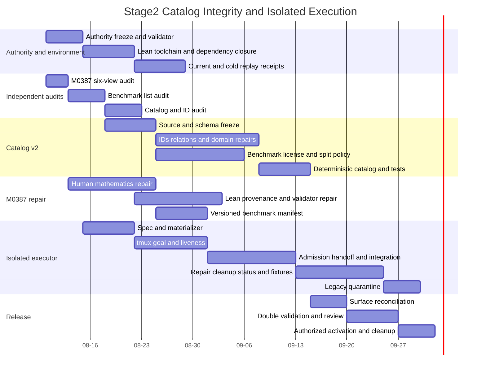

# Stage2 Catalog Integrity and Isolated Execution Gantt

> **SUPERSEDED / HISTORICAL — DO NOT EXECUTE.** The current cross-stage authority is
> `Docs/Stage3_Blueprint.md`; this file preserves the former Stage2 projection only.
>
> Projection of `Docs/Stage2_Blueprint.md` version `stage2-catalog-integrity/1.0`.
>
> This file is schedule-only. It has no checkbox state and never overrides the authoritative
> checklist. Dates are planning windows, not evidence of completion.

## Milestone View



## Planning-window Projection

The grouped rows below are calendar planning only. They deliberately do not restate item dependencies;
the machine-checked one-to-one projection in the next section is the exact dependency view.

| Blueprint IDs | Planned window | Planning grouping | Deliverable frontier |
|---|---|---|---|
| `S2-AUTH-001`, `S2-AUTH-002`, `S2-AUTH-003`, `S2-AUTH-004` | 2026-08-10 to 2026-08-14 | explicit item DAG | authority, parser, inventory, status |
| `S2-ENV-001`, `S2-ENV-002`, `S2-ENV-003` | 2026-08-10 to 2026-08-20 | authority | local toolchain and deterministic entrypoint |
| `S2-ENV-004`, `S2-ENV-005` | 2026-08-18 to 2026-08-27 | toolchain closure | current and cold receipts |
| `S2-AUD-001`, `S2-AUD-002`, `S2-AUD-003` | 2026-08-10 to 2026-08-22 | authority and prior audit | three independent six-view reports |
| `S2-CAT-001`, `S2-CAT-002`, `S2-CAT-003` | 2026-08-17 to 2026-08-27 | list audits | lossless records and typed schema |
| `S2-CAT-004`, `S2-CAT-005` | 2026-08-24 to 2026-09-03 | records and schema | stable IDs and relations |
| `S2-CAT-006`, `S2-CAT-007`, `S2-CAT-008` | 2026-08-27 to 2026-09-10 | catalog audit and schema | domain repairs |
| `S2-CAT-009`, `S2-CAT-010`, `S2-CAT-011` | 2026-08-24 to 2026-09-09 | schema, IDs and relations | release, task and split policy |
| `S2-CAT-012`, `S2-CAT-013` | 2026-09-07 to 2026-09-17 | all catalog inputs | deterministic catalog and mutation gates |
| `S2-M38-001`, `S2-M38-002`, `S2-M38-003` | 2026-08-13 to 2026-08-27 | M0387 audit | corrected human mathematics DAG |
| `S2-M38-004`, `S2-M38-005`, `S2-M38-006` | 2026-08-20 to 2026-09-03 | Lean closure and audit | statement, probe and replay gates |
| `S2-M38-007`, `S2-M38-008` | 2026-08-24 to 2026-09-10 | audit and benchmark schema | snapshot crosswalk and task manifest |
| `S2-EXE-001`, `S2-EXE-002` | 2026-08-15 to 2026-08-24 | validator and inventory | frozen spec and exact materializer |
| `S2-EXE-003`, `S2-EXE-004`, `S2-EXE-005` | 2026-08-22 to 2026-09-03 | materializer | isolated TUI, goal and liveness |
| `S2-EXE-006`, `S2-EXE-007`, `S2-EXE-008` | 2026-09-01 to 2026-09-14 | authenticated lanes | admission, handoff and Master integration |
| `S2-EXE-009`, `S2-EXE-010`, `S2-EXE-011`, `S2-EXE-012` | 2026-09-10 to 2026-09-24 | integration | repair, resumability, cleanup and status |
| `S2-EXE-013`, `S2-EXE-014` | 2026-09-21 to 2026-10-02 | complete controller | portability fixtures and legacy quarantine |
| `S2-REL-001`, `S2-REL-002`, `S2-REL-003` | 2026-10-01 to 2026-10-14 | catalog, M0387, environment and executor | reconciled, independently reviewed release |
| `S2-REL-004`, `S2-REL-005` | 2026-10-15 to 2026-10-21 | release review | operator activation and terminal cleanup proof |

## Exact Dependency Projection

This table is generated conceptually from the authoritative checklist. It contains no task state and
is rejected by the Stage2 validator if an item or an exact `depends_on` edge drifts.

<!-- STAGE2-GANTT-DEPENDENCIES:BEGIN -->
| Item | Exact `depends_on` |
|---|---|
| `S2-AUTH-001` | `-` |
| `S2-AUTH-002` | `S2-AUTH-001` |
| `S2-AUTH-003` | `S2-AUTH-001` |
| `S2-AUTH-004` | `S2-AUTH-002,S2-AUTH-003` |
| `S2-ENV-001` | `S2-AUTH-001` |
| `S2-ENV-002` | `S2-ENV-001` |
| `S2-ENV-003` | `S2-ENV-001` |
| `S2-ENV-004` | `S2-ENV-002,S2-ENV-003` |
| `S2-ENV-005` | `S2-ENV-004` |
| `S2-AUD-001` | `S2-AUTH-001` |
| `S2-AUD-002` | `S2-AUTH-001` |
| `S2-AUD-003` | `S2-AUD-002` |
| `S2-CAT-001` | `S2-AUD-002` |
| `S2-CAT-002` | `S2-AUD-003` |
| `S2-CAT-003` | `S2-CAT-002` |
| `S2-CAT-004` | `S2-CAT-001,S2-CAT-002` |
| `S2-CAT-005` | `S2-CAT-004` |
| `S2-CAT-006` | `S2-CAT-002,S2-AUD-003` |
| `S2-CAT-007` | `S2-CAT-002,S2-AUD-003` |
| `S2-CAT-008` | `S2-CAT-002,S2-AUD-003` |
| `S2-CAT-009` | `S2-CAT-001,S2-CAT-002` |
| `S2-CAT-010` | `S2-CAT-002,S2-AUD-002` |
| `S2-CAT-011` | `S2-CAT-004,S2-CAT-005,S2-CAT-010` |
| `S2-CAT-012` | `S2-CAT-003,S2-CAT-004,S2-CAT-005,S2-CAT-006,S2-CAT-007,S2-CAT-008,S2-CAT-009` |
| `S2-CAT-013` | `S2-CAT-012` |
| `S2-M38-001` | `S2-AUD-001` |
| `S2-M38-002` | `S2-AUD-001` |
| `S2-M38-003` | `S2-AUD-001` |
| `S2-M38-004` | `S2-ENV-002,S2-AUD-001` |
| `S2-M38-005` | `S2-ENV-002,S2-AUD-001` |
| `S2-M38-006` | `S2-M38-004,S2-M38-005` |
| `S2-M38-007` | `S2-AUD-001` |
| `S2-M38-008` | `S2-CAT-010,S2-CAT-011,S2-M38-004,S2-M38-006` |
| `S2-EXE-001` | `S2-AUTH-002,S2-AUTH-003` |
| `S2-EXE-002` | `S2-EXE-001` |
| `S2-EXE-003` | `S2-EXE-002` |
| `S2-EXE-004` | `S2-EXE-003` |
| `S2-EXE-005` | `S2-EXE-004` |
| `S2-EXE-006` | `S2-EXE-005` |
| `S2-EXE-007` | `S2-EXE-002,S2-EXE-005` |
| `S2-EXE-008` | `S2-EXE-006,S2-EXE-007` |
| `S2-EXE-009` | `S2-EXE-008` |
| `S2-EXE-010` | `S2-EXE-006,S2-EXE-007,S2-EXE-008` |
| `S2-EXE-011` | `S2-EXE-009,S2-EXE-010` |
| `S2-EXE-012` | `S2-AUTH-004,S2-EXE-010` |
| `S2-EXE-013` | `S2-EXE-011,S2-EXE-012` |
| `S2-EXE-014` | `S2-EXE-013` |
| `S2-REL-001` | `S2-CAT-013,S2-M38-008,S2-EXE-014,S2-ENV-005` |
| `S2-REL-002` | `S2-REL-001` |
| `S2-REL-003` | `S2-REL-002` |
| `S2-REL-004` | `S2-REL-003` |
| `S2-REL-005` | `S2-REL-004` |
<!-- STAGE2-GANTT-DEPENDENCIES:END -->

## Critical Path

```text
S2-AUTH-001
  -> S2-AUTH-002
  -> S2-EXE-001 -> S2-EXE-002 -> S2-EXE-003 -> S2-EXE-004 -> S2-EXE-005
  -> S2-EXE-006 -> S2-EXE-008 -> S2-EXE-010 -> S2-EXE-012 -> S2-EXE-013
  -> S2-EXE-014 -> S2-REL-001 -> S2-REL-002 -> S2-REL-003 -> S2-REL-004
  -> S2-REL-005
```

Catalog, M0387 and Lean lanes converge at `S2-REL-001`; they are not hidden global barriers before
that point. The authoritative item-level `depends_on` graph, not these calendar rows, decides
claimability.
