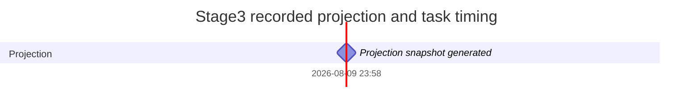

# Stage3 Full Claim-List Completion and Isolated Execution Gantt

> Mandatory same-name read-only schedule and complete worker Kanban monitoring projection for `stage3-list-completion/3.0`.
> `Docs/Stage3_Blueprint.md` is the only mutable checklist authority; regenerate this file instead of editing it.

<!-- STAGE3-PROJECTION-METADATA:BEGIN -->
```json
{
  "schema_version": "stage3-projection-metadata/3.0",
  "blueprint_path": "Docs/Stage3_Blueprint.md",
  "blueprint_version": "stage3-list-completion/3.0",
  "gantt_path": "Docs/Stage3_Gantt.md",
  "status_path": "Docs/Stage3_Status.json",
  "kanban_path": "Docs/Stage3_Kanban.md",
  "raw_blueprint_sha256": "e6642cefa91dd618c1ded1887e676367964d1ba2c0df3192256379d2683b56e6",
  "execution_spec_region_sha256": "315cb1cc074df3fbe42ea55bbe81c7674bc68f2adc19d714e174d0ab69bf7e42",
  "runtime_snapshot_sha256": null,
  "runtime_snapshot_id": null,
  "runtime_snapshot_path": ".ops/stage3-execution-v1/status/runtime-snapshot.json",
  "cleanup_receipt_path": "Docs/evidence/stage3_cleanup.json",
  "cleanup_receipt_sha256": null,
  "cleanup_receipt_id": null,
  "projection_input_sha256": "9fd4312cc971238d43eb8fe98441cf2ff98404105a9712819ebfae0a2f9fdd28",
  "snapshot_id": "stage3-projection/9fd4312cc971238d43eb8fe98441cf2ff98404105a9712819ebfae0a2f9fdd28",
  "generated_at": "2026-08-09T23:58:05Z"
}
```
<!-- STAGE3-PROJECTION-METADATA:END -->

## Renderable generation milestone

Every renderable row below comes from the projection timestamp or an exact recorded runtime timing object; it is never an inferred task estimate.



## Unscheduled task timing

Every task is `unscheduled` in this 198-item snapshot because neither the Blueprint nor a runtime ledger records a trustworthy task date or operator-frozen estimate.
The complete timing object remains visible in each monitoring row; no calendar interval is inferred from document order, category, dependency depth, or generation time.

## Complete monitoring index

Each stable checklist ID has exactly one row. `Planning blockers` are unresolved Blueprint dependencies; `Runtime block` is independent and remains `null` when runtime is unavailable.

<!-- STAGE3-GANTT-MONITORING:BEGIN -->
| Item | State | Depends on | Owned paths | Claim | Run | Owner | Startup | Live | Running | Handoff | Integration | Repair | Planning blockers | Runtime block | Timing |
|---|---|---|---|---|---|---|---|---|---|---|---|---|---|---|---|
| `"S3-AUD-001"` | `"master_accepted"` | `["S3-AUTH-001"]` | `["Docs/reviews/THM-M-0387_Critical_Audit_2026-08-10.md"]` | `null` | `null` | `null` | `null` | `null` | `null` | `null` | `null` | `null` | `[]` | `null` | `{"duration_seconds":null,"end":null,"source":null,"start":null,"status":"unscheduled"}` |
| `"S3-AUD-002"` | `"master_accepted"` | `["S3-AUTH-001"]` | `["Docs/reviews/THM_List_Benchmark_Audit_2026-08-10.md"]` | `null` | `null` | `null` | `null` | `null` | `null` | `null` | `null` | `null` | `[]` | `null` | `{"duration_seconds":null,"end":null,"source":null,"start":null,"status":"unscheduled"}` |
| `"S3-AUD-003"` | `"master_accepted"` | `["S3-AUTH-001"]` | `["Docs/reviews/THM_Catalog_and_ID_Audit_2026-08-10.md"]` | `null` | `null` | `null` | `null` | `null` | `null` | `null` | `null` | `null` | `[]` | `null` | `{"duration_seconds":null,"end":null,"source":null,"start":null,"status":"unscheduled"}` |
| `"S3-AUD-004"` | `"master_accepted"` | `["S3-AUD-001","S3-AUD-002","S3-AUD-003"]` | `["Docs/reviews/Stage3_Blueprint_Gap_Review_2026-08-10.md"]` | `null` | `null` | `null` | `null` | `null` | `null` | `null` | `null` | `null` | `[]` | `null` | `{"duration_seconds":null,"end":null,"source":null,"start":null,"status":"unscheduled"}` |
| `"S3-AUD-005"` | `"master_accepted"` | `["S3-AUD-001","S3-AUD-002","S3-AUD-003","S3-AUD-004"]` | `["Docs/reviews/Stage3_v3_18_Agent_Critical_Audit_2026-08-10.md"]` | `null` | `null` | `null` | `null` | `null` | `null` | `null` | `null` | `null` | `[]` | `null` | `{"duration_seconds":null,"end":null,"source":null,"start":null,"status":"unscheduled"}` |
| `"S3-AUTH-001"` | `"master_accepted"` | `[]` | `["Docs/Stage3_Blueprint.md"]` | `null` | `null` | `null` | `null` | `null` | `null` | `null` | `null` | `null` | `[]` | `null` | `{"duration_seconds":null,"end":null,"source":null,"start":null,"status":"unscheduled"}` |
| `"S3-AUTH-002"` | `"not_done"` | `["S3-AUTH-001","S3-AUD-005"]` | `["Docs/tools/check_stage3_blueprint.py","Docs/tools/generate_stage3_surfaces.py","scripts/test_stage3_blueprint.py","Docs/Stage3_Gantt.md","Docs/Stage3_Status.json","Docs/Stage3_Kanban.md","Docs/reviews/Stage3_v1_to_v2_Semantic_Delta.md","Docs/reviews/Stage3_v2_to_v3_Semantic_Delta.md"]` | `null` | `null` | `null` | `null` | `null` | `null` | `null` | `null` | `null` | `[]` | `null` | `{"duration_seconds":null,"end":null,"source":null,"start":null,"status":"unscheduled"}` |
| `"S3-AUTH-003"` | `"not_done"` | `["S3-AUTH-001"]` | `["Docs/evidence/stage3_repository_inventory.json"]` | `null` | `null` | `null` | `null` | `null` | `null` | `null` | `null` | `null` | `[]` | `null` | `{"duration_seconds":null,"end":null,"source":null,"start":null,"status":"unscheduled"}` |
| `"S3-AUTH-004"` | `"not_done"` | `["S3-AUTH-001"]` | `["Docs/evidence/stage3_publication_rights_decision.json"]` | `null` | `null` | `null` | `null` | `null` | `null` | `null` | `null` | `null` | `[]` | `null` | `{"duration_seconds":null,"end":null,"source":null,"start":null,"status":"unscheduled"}` |
| `"S3-BEN-001"` | `"not_done"` | `["S3-AUD-002","S3-AUD-005","S3-REL-004"]` | `["Benchmarks/reference_pins/scientific_common"]` | `null` | `null` | `null` | `null` | `null` | `null` | `null` | `null` | `null` | `["S3-REL-004"]` | `null` | `{"duration_seconds":null,"end":null,"source":null,"start":null,"status":"unscheduled"}` |
| `"S3-BEN-002"` | `"not_done"` | `["S3-CAT-002","S3-BEN-001"]` | `["Benchmarks/schemas"]` | `null` | `null` | `null` | `null` | `null` | `null` | `null` | `null` | `null` | `["S3-CAT-002","S3-BEN-001"]` | `null` | `{"duration_seconds":null,"end":null,"source":null,"start":null,"status":"unscheduled"}` |
| `"S3-BEN-003"` | `"not_done"` | `["S3-MATH-020","S3-BEN-001","S3-BEN-002"]` | `["Benchmarks/records/math"]` | `null` | `null` | `null` | `null` | `null` | `null` | `null` | `null` | `null` | `["S3-MATH-020","S3-BEN-001","S3-BEN-002"]` | `null` | `{"duration_seconds":null,"end":null,"source":null,"start":null,"status":"unscheduled"}` |
| `"S3-BEN-004"` | `"not_done"` | `["S3-PHY-019","S3-BEN-001","S3-BEN-002"]` | `["Benchmarks/records/physics"]` | `null` | `null` | `null` | `null` | `null` | `null` | `null` | `null` | `null` | `["S3-PHY-019","S3-BEN-001","S3-BEN-002"]` | `null` | `{"duration_seconds":null,"end":null,"source":null,"start":null,"status":"unscheduled"}` |
| `"S3-BEN-005"` | `"not_done"` | `["S3-CS-025","S3-BEN-001","S3-BEN-002"]` | `["Benchmarks/records/computer_science"]` | `null` | `null` | `null` | `null` | `null` | `null` | `null` | `null` | `null` | `["S3-CS-025","S3-BEN-001","S3-BEN-002"]` | `null` | `{"duration_seconds":null,"end":null,"source":null,"start":null,"status":"unscheduled"}` |
| `"S3-BEN-006"` | `"not_done"` | `["S3-CAT-013","S3-BEN-003","S3-BEN-004","S3-BEN-005"]` | `["Benchmarks/records/index"]` | `null` | `null` | `null` | `null` | `null` | `null` | `null` | `null` | `null` | `["S3-CAT-013","S3-BEN-003","S3-BEN-004","S3-BEN-005"]` | `null` | `{"duration_seconds":null,"end":null,"source":null,"start":null,"status":"unscheduled"}` |
| `"S3-BEN-007"` | `"not_done"` | `["S3-BEN-006"]` | `["Benchmarks/families"]` | `null` | `null` | `null` | `null` | `null` | `null` | `null` | `null` | `null` | `["S3-BEN-006"]` | `null` | `{"duration_seconds":null,"end":null,"source":null,"start":null,"status":"unscheduled"}` |
| `"S3-BEN-008"` | `"not_done"` | `["S3-BEN-001","S3-BEN-006"]` | `["Benchmarks/LICENSE","Benchmarks/rights"]` | `null` | `null` | `null` | `null` | `null` | `null` | `null` | `null` | `null` | `["S3-BEN-001","S3-BEN-006"]` | `null` | `{"duration_seconds":null,"end":null,"source":null,"start":null,"status":"unscheduled"}` |
| `"S3-BEN-009"` | `"not_done"` | `["S3-BEN-002","S3-BEN-006","S3-BEN-007","S3-BEN-008","S3-BEN-017","S3-M38-034"]` | `["Benchmarks/tasks"]` | `null` | `null` | `null` | `null` | `null` | `null` | `null` | `null` | `null` | `["S3-BEN-002","S3-BEN-006","S3-BEN-007","S3-BEN-008","S3-BEN-017","S3-M38-034"]` | `null` | `{"duration_seconds":null,"end":null,"source":null,"start":null,"status":"unscheduled"}` |
| `"S3-BEN-010"` | `"not_done"` | `["S3-BEN-007","S3-BEN-009"]` | `["Benchmarks/splits","Benchmarks/visibility","Benchmarks/task-family-overlay"]` | `null` | `null` | `null` | `null` | `null` | `null` | `null` | `null` | `null` | `["S3-BEN-007","S3-BEN-009"]` | `null` | `{"duration_seconds":null,"end":null,"source":null,"start":null,"status":"unscheduled"}` |
| `"S3-BEN-011"` | `"not_done"` | `["S3-BEN-002","S3-BEN-009","S3-BEN-017"]` | `["Benchmarks/scorers"]` | `null` | `null` | `null` | `null` | `null` | `null` | `null` | `null` | `null` | `["S3-BEN-002","S3-BEN-009","S3-BEN-017"]` | `null` | `{"duration_seconds":null,"end":null,"source":null,"start":null,"status":"unscheduled"}` |
| `"S3-BEN-012"` | `"not_done"` | `["S3-BEN-008","S3-BEN-010","S3-BEN-011","S3-BEN-018","S3-BEN-019","S3-BEN-020"]` | `["Benchmarks/fixtures"]` | `null` | `null` | `null` | `null` | `null` | `null` | `null` | `null` | `null` | `["S3-BEN-008","S3-BEN-010","S3-BEN-011","S3-BEN-018","S3-BEN-019","S3-BEN-020"]` | `null` | `{"duration_seconds":null,"end":null,"source":null,"start":null,"status":"unscheduled"}` |
| `"S3-BEN-013"` | `"not_done"` | `["S3-BEN-010","S3-BEN-011","S3-BEN-012"]` | `["Benchmarks/metrics","Benchmarks/contamination","Benchmarks/stats"]` | `null` | `null` | `null` | `null` | `null` | `null` | `null` | `null` | `null` | `["S3-BEN-010","S3-BEN-011","S3-BEN-012"]` | `null` | `{"duration_seconds":null,"end":null,"source":null,"start":null,"status":"unscheduled"}` |
| `"S3-BEN-014"` | `"not_done"` | `["S3-BEN-001","S3-BEN-002","S3-BEN-006","S3-BEN-008","S3-BEN-009","S3-BEN-010","S3-BEN-011","S3-BEN-012","S3-BEN-013","S3-BEN-021"]` | `["Benchmarks/releases"]` | `null` | `null` | `null` | `null` | `null` | `null` | `null` | `null` | `null` | `["S3-BEN-001","S3-BEN-002","S3-BEN-006","S3-BEN-008","S3-BEN-009","S3-BEN-010","S3-BEN-011","S3-BEN-012","S3-BEN-013","S3-BEN-021"]` | `null` | `{"duration_seconds":null,"end":null,"source":null,"start":null,"status":"unscheduled"}` |
| `"S3-BEN-015"` | `"not_done"` | `["S3-BEN-014"]` | `["Benchmarks/acceptance"]` | `null` | `null` | `null` | `null` | `null` | `null` | `null` | `null` | `null` | `["S3-BEN-014"]` | `null` | `{"duration_seconds":null,"end":null,"source":null,"start":null,"status":"unscheduled"}` |
| `"S3-BEN-016"` | `"not_done"` | `["S3-AUD-005","S3-AUTH-004","S3-REL-004"]` | `["Benchmarks/reference_pins/computer_science","Benchmarks/reference_pins/external_roles"]` | `null` | `null` | `null` | `null` | `null` | `null` | `null` | `null` | `null` | `["S3-AUTH-004","S3-REL-004"]` | `null` | `{"duration_seconds":null,"end":null,"source":null,"start":null,"status":"unscheduled"}` |
| `"S3-BEN-017"` | `"not_done"` | `["S3-BEN-002","S3-BEN-016"]` | `["Benchmarks/protocol"]` | `null` | `null` | `null` | `null` | `null` | `null` | `null` | `null` | `null` | `["S3-BEN-002","S3-BEN-016"]` | `null` | `{"duration_seconds":null,"end":null,"source":null,"start":null,"status":"unscheduled"}` |
| `"S3-BEN-018"` | `"not_done"` | `["S3-BEN-004","S3-BEN-009","S3-BEN-011","S3-BEN-017"]` | `["Benchmarks/validation/scientific_semantics"]` | `null` | `null` | `null` | `null` | `null` | `null` | `null` | `null` | `null` | `["S3-BEN-004","S3-BEN-009","S3-BEN-011","S3-BEN-017"]` | `null` | `{"duration_seconds":null,"end":null,"source":null,"start":null,"status":"unscheduled"}` |
| `"S3-BEN-019"` | `"not_done"` | `["S3-BEN-005","S3-BEN-009","S3-BEN-011","S3-BEN-017"]` | `["Benchmarks/validation/computer_science"]` | `null` | `null` | `null` | `null` | `null` | `null` | `null` | `null` | `null` | `["S3-BEN-005","S3-BEN-009","S3-BEN-011","S3-BEN-017"]` | `null` | `{"duration_seconds":null,"end":null,"source":null,"start":null,"status":"unscheduled"}` |
| `"S3-BEN-020"` | `"not_done"` | `["S3-BEN-008","S3-BEN-010","S3-BEN-016"]` | `["Benchmarks/asset-bom","Benchmarks/private-evaluator"]` | `null` | `null` | `null` | `null` | `null` | `null` | `null` | `null` | `null` | `["S3-BEN-008","S3-BEN-010","S3-BEN-016"]` | `null` | `{"duration_seconds":null,"end":null,"source":null,"start":null,"status":"unscheduled"}` |
| `"S3-BEN-021"` | `"not_done"` | `["S3-BEN-012","S3-BEN-013","S3-BEN-018","S3-BEN-019","S3-BEN-020"]` | `["Benchmarks/evaluation-runs","Benchmarks/run-replay"]` | `null` | `null` | `null` | `null` | `null` | `null` | `null` | `null` | `null` | `["S3-BEN-012","S3-BEN-013","S3-BEN-018","S3-BEN-019","S3-BEN-020"]` | `null` | `{"duration_seconds":null,"end":null,"source":null,"start":null,"status":"unscheduled"}` |
| `"S3-CAT-001"` | `"not_done"` | `["S3-AUD-002","S3-AUD-003","S3-AUD-005","S3-REL-004"]` | `["Docs/catalog/v3/Catalog_Completion_Universe_v3.json","Docs/catalog/v3/Catalog_Pending_Review_Queue_v3.json","Docs/tools/build_catalog_completion_universe_v3.py"]` | `null` | `null` | `null` | `null` | `null` | `null` | `null` | `null` | `null` | `["S3-REL-004"]` | `null` | `{"duration_seconds":null,"end":null,"source":null,"start":null,"status":"unscheduled"}` |
| `"S3-CAT-002"` | `"not_done"` | `["S3-CAT-001"]` | `["Docs/catalog/v3/Claim_Record_Schema_v3.json","Docs/catalog/v3/Claim_Review_Contract_v3.md"]` | `null` | `null` | `null` | `null` | `null` | `null` | `null` | `null` | `null` | `["S3-CAT-001"]` | `null` | `{"duration_seconds":null,"end":null,"source":null,"start":null,"status":"unscheduled"}` |
| `"S3-CAT-003"` | `"not_done"` | `["S3-CAT-001","S3-CAT-002","S3-CAT-015"]` | `["Docs/catalog/v3/Claim_ID_Allocation_Contract_v3.md","Docs/tools/allocate_claim_ids_v3.py","scripts/test_claim_id_allocator_v3.py"]` | `null` | `null` | `null` | `null` | `null` | `null` | `null` | `null` | `null` | `["S3-CAT-001","S3-CAT-002","S3-CAT-015"]` | `null` | `{"duration_seconds":null,"end":null,"source":null,"start":null,"status":"unscheduled"}` |
| `"S3-CAT-004"` | `"not_done"` | `["S3-CAT-001","S3-CAT-002","S3-CAT-003","S3-CAT-006","S3-CAT-014","S3-CAT-015"]` | `["Docs/catalog/v3/Claim_Relation_Candidate_Universe_v3.json","Docs/tools/discover_claim_relations_v3.py"]` | `null` | `null` | `null` | `null` | `null` | `null` | `null` | `null` | `null` | `["S3-CAT-001","S3-CAT-002","S3-CAT-003","S3-CAT-006","S3-CAT-014","S3-CAT-015"]` | `null` | `{"duration_seconds":null,"end":null,"source":null,"start":null,"status":"unscheduled"}` |
| `"S3-CAT-005"` | `"not_done"` | `["S3-CAT-004"]` | `["Docs/catalog/v3/Cross_Domain_Relation_Adjudications_v3.json"]` | `null` | `null` | `null` | `null` | `null` | `null` | `null` | `null` | `null` | `["S3-CAT-004"]` | `null` | `{"duration_seconds":null,"end":null,"source":null,"start":null,"status":"unscheduled"}` |
| `"S3-CAT-006"` | `"not_done"` | `["S3-CAT-002"]` | `["Docs/catalog/v3/Evidence_Status_Rights_Schema_v3.json","Docs/catalog/v3/Provenance_and_Rights_Policy_v3.md"]` | `null` | `null` | `null` | `null` | `null` | `null` | `null` | `null` | `null` | `["S3-CAT-002"]` | `null` | `{"duration_seconds":null,"end":null,"source":null,"start":null,"status":"unscheduled"}` |
| `"S3-CAT-007"` | `"not_done"` | `["S3-CAT-002","S3-CAT-006"]` | `["Docs/catalog/v3/Open_Claim_Status_Schema_v3.json","Docs/catalog/v3/Open_Claim_Status_Policy_v3.md"]` | `null` | `null` | `null` | `null` | `null` | `null` | `null` | `null` | `null` | `["S3-CAT-002","S3-CAT-006"]` | `null` | `{"duration_seconds":null,"end":null,"source":null,"start":null,"status":"unscheduled"}` |
| `"S3-CAT-008"` | `"not_done"` | `["S3-CAT-001","S3-CAT-002","S3-CAT-004","S3-CAT-005","S3-CAT-014"]` | `["Docs/catalog/v3/Initial_Domain_Curation_Partitions_v3.json"]` | `null` | `null` | `null` | `null` | `null` | `null` | `null` | `null` | `null` | `["S3-CAT-001","S3-CAT-002","S3-CAT-004","S3-CAT-005","S3-CAT-014"]` | `null` | `{"duration_seconds":null,"end":null,"source":null,"start":null,"status":"unscheduled"}` |
| `"S3-CAT-009"` | `"not_done"` | `["S3-CAT-003","S3-CAT-005","S3-MATH-008","S3-PHY-008","S3-CS-016"]` | `["Docs/catalog/v3/Claim_ID_Registry_Draft_v3.json","Docs/catalog/v3/Claim_ID_Migration_Draft_v3.json"]` | `null` | `null` | `null` | `null` | `null` | `null` | `null` | `null` | `null` | `["S3-CAT-003","S3-CAT-005","S3-MATH-008","S3-PHY-008","S3-CS-016"]` | `null` | `{"duration_seconds":null,"end":null,"source":null,"start":null,"status":"unscheduled"}` |
| `"S3-CAT-010"` | `"not_done"` | `["S3-CAT-005","S3-CAT-009"]` | `["Docs/catalog/v3/PreCuration_Claim_ID_Registry_v3.json","Docs/catalog/v3/PreCuration_Claim_ID_Migration_v3.json","Docs/catalog/v3/PreCuration_Identity_Graph_v3.json","Docs/catalog/v3/PreCuration_Leakage_Graph_v3.json","Docs/tools/reconcile_claim_relations_v3.py"]` | `null` | `null` | `null` | `null` | `null` | `null` | `null` | `null` | `null` | `["S3-CAT-005","S3-CAT-009"]` | `null` | `{"duration_seconds":null,"end":null,"source":null,"start":null,"status":"unscheduled"}` |
| `"S3-CAT-011"` | `"not_done"` | `["S3-CAT-006","S3-CAT-007","S3-CAT-016","S3-MATH-020","S3-PHY-019","S3-CS-025"]` | `["Docs/tools/generate_claim_catalog_v3.py","Docs/catalog/v3/Claim_Catalog_v3.json","Docs/catalog/v3/Claim_Catalog_v3.md","Docs/catalog/v3/Claim_Count_Ledger_v3.json","Docs/catalog/v3/Catalog_Disposition_Ledger_v3.json"]` | `null` | `null` | `null` | `null` | `null` | `null` | `null` | `null` | `null` | `["S3-CAT-006","S3-CAT-007","S3-CAT-016","S3-MATH-020","S3-PHY-019","S3-CS-025"]` | `null` | `{"duration_seconds":null,"end":null,"source":null,"start":null,"status":"unscheduled"}` |
| `"S3-CAT-012"` | `"not_done"` | `["S3-CAT-011"]` | `["Docs/catalog/v3/Theorem_List_v3.json","Docs/catalog/v3/Theorem_List_v3.md","Docs/catalog/v3/Conjecture_Hypothesis_Open_List_v3.json","Docs/catalog/v3/Conjecture_Hypothesis_Open_List_v3.md","Docs/catalog/v3/Claim_Status_Index_v3.json","Docs/catalog/v3/Claim_Status_Index_v3.md","Docs/catalog/v3/Historical_Claim_Name_Index_v3.json","Docs/catalog/v3/Historical_Claim_Name_Index_v3.md"]` | `null` | `null` | `null` | `null` | `null` | `null` | `null` | `null` | `null` | `["S3-CAT-011"]` | `null` | `{"duration_seconds":null,"end":null,"source":null,"start":null,"status":"unscheduled"}` |
| `"S3-CAT-013"` | `"not_done"` | `["S3-CAT-011","S3-CAT-012","S3-CAT-016"]` | `["Docs/tools/check_claim_catalog_v3.py","scripts/test_claim_catalog_v3.py","scripts/fixtures/claim_catalog_v3","Docs/evidence/Claim_Catalog_v3_Acceptance.json"]` | `null` | `null` | `null` | `null` | `null` | `null` | `null` | `null` | `null` | `["S3-CAT-011","S3-CAT-012","S3-CAT-016"]` | `null` | `{"duration_seconds":null,"end":null,"source":null,"start":null,"status":"unscheduled"}` |
| `"S3-CAT-014"` | `"not_done"` | `["S3-CAT-001","S3-AUD-005"]` | `["Docs/catalog/v3/Known_Review_Inventory_v3.json","scripts/test_catalog_review_inventory_v3.py"]` | `null` | `null` | `null` | `null` | `null` | `null` | `null` | `null` | `null` | `["S3-CAT-001"]` | `null` | `{"duration_seconds":null,"end":null,"source":null,"start":null,"status":"unscheduled"}` |
| `"S3-CAT-015"` | `"not_done"` | `["S3-CAT-002","S3-CAT-014"]` | `["Docs/catalog/v3/Identity_Relation_Lifecycle_Contract_v3.md","Docs/catalog/v3/Legacy_Identity_Artifact_Inventory_v3.json","scripts/test_catalog_lifecycle_v3.py"]` | `null` | `null` | `null` | `null` | `null` | `null` | `null` | `null` | `null` | `["S3-CAT-002","S3-CAT-014"]` | `null` | `{"duration_seconds":null,"end":null,"source":null,"start":null,"status":"unscheduled"}` |
| `"S3-CAT-016"` | `"not_done"` | `["S3-CAT-010","S3-CAT-014","S3-CAT-015","S3-MATH-016","S3-PHY-015","S3-CS-022"]` | `["Docs/catalog/v3/Claim_ID_Registry_v3.json","Docs/catalog/v3/Claim_ID_Migration_v3.json","Docs/catalog/v3/Reviewed_Identity_Graph_v3.json","Docs/catalog/v3/Reviewed_Leakage_Graph_v3.json","Docs/catalog/v3/Final_Relation_Candidate_Universe_v3.json","Docs/catalog/v3/Final_Current_Owner_Ledger_v3.json"]` | `null` | `null` | `null` | `null` | `null` | `null` | `null` | `null` | `null` | `["S3-CAT-010","S3-CAT-014","S3-CAT-015","S3-MATH-016","S3-PHY-015","S3-CS-022"]` | `null` | `{"duration_seconds":null,"end":null,"source":null,"start":null,"status":"unscheduled"}` |
| `"S3-CS-001"` | `"not_done"` | `["S3-CAT-001","S3-CAT-008"]` | `["Docs/catalog/cs/v3/CS_Coverage_Universe.json"]` | `null` | `null` | `null` | `null` | `null` | `null` | `null` | `null` | `null` | `["S3-CAT-001","S3-CAT-008"]` | `null` | `{"duration_seconds":null,"end":null,"source":null,"start":null,"status":"unscheduled"}` |
| `"S3-CS-002"` | `"not_done"` | `["S3-CAT-002","S3-CS-001"]` | `["Docs/catalog/cs/v3/CS_Claim_Schema.json","Docs/catalog/cs/v3/Applicability_Matrix.json"]` | `null` | `null` | `null` | `null` | `null` | `null` | `null` | `null` | `null` | `["S3-CAT-002","S3-CS-001"]` | `null` | `{"duration_seconds":null,"end":null,"source":null,"start":null,"status":"unscheduled"}` |
| `"S3-CS-003"` | `"not_done"` | `["S3-CAT-006","S3-CS-001"]` | `["Docs/catalog/cs/v3/CS_Coverage_Source_Registry.json","Docs/catalog/cs/v3/CS_Coverage_Candidates.json"]` | `null` | `null` | `null` | `null` | `null` | `null` | `null` | `null` | `null` | `["S3-CAT-006","S3-CS-001"]` | `null` | `{"duration_seconds":null,"end":null,"source":null,"start":null,"status":"unscheduled"}` |
| `"S3-CS-004"` | `"not_done"` | `["S3-CS-001","S3-CS-002","S3-CS-026"]` | `["Docs/catalog/cs/v3/triage/Computability.json"]` | `null` | `null` | `null` | `null` | `null` | `null` | `null` | `null` | `null` | `["S3-CS-001","S3-CS-002","S3-CS-026"]` | `null` | `{"duration_seconds":null,"end":null,"source":null,"start":null,"status":"unscheduled"}` |
| `"S3-CS-005"` | `"not_done"` | `["S3-CS-001","S3-CS-002","S3-CS-026"]` | `["Docs/catalog/cs/v3/triage/Complexity.json"]` | `null` | `null` | `null` | `null` | `null` | `null` | `null` | `null` | `null` | `["S3-CS-001","S3-CS-002","S3-CS-026"]` | `null` | `{"duration_seconds":null,"end":null,"source":null,"start":null,"status":"unscheduled"}` |
| `"S3-CS-006"` | `"not_done"` | `["S3-CS-001","S3-CS-002","S3-CS-026"]` | `["Docs/catalog/cs/v3/triage/Algorithms.json"]` | `null` | `null` | `null` | `null` | `null` | `null` | `null` | `null` | `null` | `["S3-CS-001","S3-CS-002","S3-CS-026"]` | `null` | `{"duration_seconds":null,"end":null,"source":null,"start":null,"status":"unscheduled"}` |
| `"S3-CS-007"` | `"not_done"` | `["S3-CS-001","S3-CS-002","S3-CS-026"]` | `["Docs/catalog/cs/v3/triage/Automata.json"]` | `null` | `null` | `null` | `null` | `null` | `null` | `null` | `null` | `null` | `["S3-CS-001","S3-CS-002","S3-CS-026"]` | `null` | `{"duration_seconds":null,"end":null,"source":null,"start":null,"status":"unscheduled"}` |
| `"S3-CS-008"` | `"not_done"` | `["S3-CS-001","S3-CS-002","S3-CS-026"]` | `["Docs/catalog/cs/v3/triage/Cryptography.json"]` | `null` | `null` | `null` | `null` | `null` | `null` | `null` | `null` | `null` | `["S3-CS-001","S3-CS-002","S3-CS-026"]` | `null` | `{"duration_seconds":null,"end":null,"source":null,"start":null,"status":"unscheduled"}` |
| `"S3-CS-009"` | `"not_done"` | `["S3-CS-001","S3-CS-002","S3-CS-026"]` | `["Docs/catalog/cs/v3/triage/Programming_Languages.json"]` | `null` | `null` | `null` | `null` | `null` | `null` | `null` | `null` | `null` | `["S3-CS-001","S3-CS-002","S3-CS-026"]` | `null` | `{"duration_seconds":null,"end":null,"source":null,"start":null,"status":"unscheduled"}` |
| `"S3-CS-010"` | `"not_done"` | `["S3-CS-001","S3-CS-002","S3-CS-026"]` | `["Docs/catalog/cs/v3/triage/Logic_Verification.json"]` | `null` | `null` | `null` | `null` | `null` | `null` | `null` | `null` | `null` | `["S3-CS-001","S3-CS-002","S3-CS-026"]` | `null` | `{"duration_seconds":null,"end":null,"source":null,"start":null,"status":"unscheduled"}` |
| `"S3-CS-011"` | `"not_done"` | `["S3-CS-001","S3-CS-002","S3-CS-026"]` | `["Docs/catalog/cs/v3/triage/Distributed.json"]` | `null` | `null` | `null` | `null` | `null` | `null` | `null` | `null` | `null` | `["S3-CS-001","S3-CS-002","S3-CS-026"]` | `null` | `{"duration_seconds":null,"end":null,"source":null,"start":null,"status":"unscheduled"}` |
| `"S3-CS-012"` | `"not_done"` | `["S3-CS-001","S3-CS-002","S3-CS-026"]` | `["Docs/catalog/cs/v3/triage/Quantum.json"]` | `null` | `null` | `null` | `null` | `null` | `null` | `null` | `null` | `null` | `["S3-CS-001","S3-CS-002","S3-CS-026"]` | `null` | `{"duration_seconds":null,"end":null,"source":null,"start":null,"status":"unscheduled"}` |
| `"S3-CS-013"` | `"not_done"` | `["S3-CS-001","S3-CS-002","S3-CS-026"]` | `["Docs/catalog/cs/v3/triage/Information_Coding.json"]` | `null` | `null` | `null` | `null` | `null` | `null` | `null` | `null` | `null` | `["S3-CS-001","S3-CS-002","S3-CS-026"]` | `null` | `{"duration_seconds":null,"end":null,"source":null,"start":null,"status":"unscheduled"}` |
| `"S3-CS-014"` | `"not_done"` | `["S3-CS-004","S3-CS-005","S3-CS-006","S3-CS-007","S3-CS-008","S3-CS-009","S3-CS-010","S3-CS-011","S3-CS-012","S3-CS-013"]` | `["Docs/catalog/cs/v3/CS_Triage_Coverage.json"]` | `null` | `null` | `null` | `null` | `null` | `null` | `null` | `null` | `null` | `["S3-CS-004","S3-CS-005","S3-CS-006","S3-CS-007","S3-CS-008","S3-CS-009","S3-CS-010","S3-CS-011","S3-CS-012","S3-CS-013"]` | `null` | `{"duration_seconds":null,"end":null,"source":null,"start":null,"status":"unscheduled"}` |
| `"S3-CS-015"` | `"not_done"` | `["S3-CS-003","S3-CS-014"]` | `["Docs/catalog/cs/v3/CS_Coverage_Adjudications.json"]` | `null` | `null` | `null` | `null` | `null` | `null` | `null` | `null` | `null` | `["S3-CS-003","S3-CS-014"]` | `null` | `{"duration_seconds":null,"end":null,"source":null,"start":null,"status":"unscheduled"}` |
| `"S3-CS-016"` | `"not_done"` | `["S3-CS-014","S3-CS-015"]` | `["Docs/catalog/cs/v3/CS_Identity_Resolutions.json"]` | `null` | `null` | `null` | `null` | `null` | `null` | `null` | `null` | `null` | `["S3-CS-014","S3-CS-015"]` | `null` | `{"duration_seconds":null,"end":null,"source":null,"start":null,"status":"unscheduled"}` |
| `"S3-CS-017"` | `"not_done"` | `["S3-CAT-010","S3-CS-016"]` | `["Docs/catalog/cs/v3/curation/Theorems_and_Complexity.json"]` | `null` | `null` | `null` | `null` | `null` | `null` | `null` | `null` | `null` | `["S3-CAT-010","S3-CS-016"]` | `null` | `{"duration_seconds":null,"end":null,"source":null,"start":null,"status":"unscheduled"}` |
| `"S3-CS-018"` | `"not_done"` | `["S3-CAT-010","S3-CS-016"]` | `["Docs/catalog/cs/v3/curation/Algorithms_Constructions_Protocols.json"]` | `null` | `null` | `null` | `null` | `null` | `null` | `null` | `null` | `null` | `["S3-CAT-010","S3-CS-016"]` | `null` | `{"duration_seconds":null,"end":null,"source":null,"start":null,"status":"unscheduled"}` |
| `"S3-CS-019"` | `"not_done"` | `["S3-CAT-010","S3-CS-016"]` | `["Docs/catalog/cs/v3/curation/Definitions_Frameworks_Nonclaims.json"]` | `null` | `null` | `null` | `null` | `null` | `null` | `null` | `null` | `null` | `["S3-CAT-010","S3-CS-016"]` | `null` | `{"duration_seconds":null,"end":null,"source":null,"start":null,"status":"unscheduled"}` |
| `"S3-CS-020"` | `"not_done"` | `["S3-CAT-007","S3-CAT-010","S3-CS-016"]` | `["Docs/catalog/cs/v3/curation/Open_and_Conditional_Claims.json"]` | `null` | `null` | `null` | `null` | `null` | `null` | `null` | `null` | `null` | `["S3-CAT-007","S3-CAT-010","S3-CS-016"]` | `null` | `{"duration_seconds":null,"end":null,"source":null,"start":null,"status":"unscheduled"}` |
| `"S3-CS-021"` | `"not_done"` | `["S3-CAT-006","S3-CAT-010","S3-CS-016"]` | `["Docs/catalog/cs/v3/curation/Formal_and_Executable_Evidence.json"]` | `null` | `null` | `null` | `null` | `null` | `null` | `null` | `null` | `null` | `["S3-CAT-006","S3-CAT-010","S3-CS-016"]` | `null` | `{"duration_seconds":null,"end":null,"source":null,"start":null,"status":"unscheduled"}` |
| `"S3-CS-022"` | `"not_done"` | `["S3-CS-017","S3-CS-018","S3-CS-019","S3-CS-020","S3-CS-021"]` | `["Docs/tools/generate_cs_catalog_v3.py","Docs/catalog/cs/v3/CS_Catalog.json","Docs/catalog/cs/v3/CS_Catalog.md","Docs/catalog/cs/v3/CS_Theorems.json","Docs/catalog/cs/v3/CS_Open_Claims.json","Docs/catalog/cs/v3/CS_Status_Index.json","Docs/catalog/cs/v3/CS_Historical_Name_Index.json"]` | `null` | `null` | `null` | `null` | `null` | `null` | `null` | `null` | `null` | `["S3-CS-017","S3-CS-018","S3-CS-019","S3-CS-020","S3-CS-021"]` | `null` | `{"duration_seconds":null,"end":null,"source":null,"start":null,"status":"unscheduled"}` |
| `"S3-CS-023"` | `"not_done"` | `["S3-CAT-016","S3-CS-002","S3-CS-022","S3-CS-026"]` | `["Docs/tools/check_cs_catalog_v3.py"]` | `null` | `null` | `null` | `null` | `null` | `null` | `null` | `null` | `null` | `["S3-CAT-016","S3-CS-002","S3-CS-022","S3-CS-026"]` | `null` | `{"duration_seconds":null,"end":null,"source":null,"start":null,"status":"unscheduled"}` |
| `"S3-CS-024"` | `"not_done"` | `["S3-CS-023"]` | `["scripts/test_cs_catalog_v3.py","scripts/fixtures/cs_catalog_v3"]` | `null` | `null` | `null` | `null` | `null` | `null` | `null` | `null` | `null` | `["S3-CS-023"]` | `null` | `{"duration_seconds":null,"end":null,"source":null,"start":null,"status":"unscheduled"}` |
| `"S3-CS-025"` | `"not_done"` | `["S3-CS-024"]` | `["Docs/evidence/cs_catalog_v3_acceptance.json","Docs/reviews/Computer_Science_Catalog_v3_Acceptance.md"]` | `null` | `null` | `null` | `null` | `null` | `null` | `null` | `null` | `null` | `["S3-CS-024"]` | `null` | `{"duration_seconds":null,"end":null,"source":null,"start":null,"status":"unscheduled"}` |
| `"S3-CS-026"` | `"not_done"` | `["S3-CAT-015","S3-CS-002","S3-CS-003","S3-BEN-016"]` | `["Docs/catalog/cs/v3/CS_Family_Proposal_and_Evidence_Contract.json"]` | `null` | `null` | `null` | `null` | `null` | `null` | `null` | `null` | `null` | `["S3-CAT-015","S3-CS-002","S3-CS-003","S3-BEN-016"]` | `null` | `{"duration_seconds":null,"end":null,"source":null,"start":null,"status":"unscheduled"}` |
| `"S3-ENV-001"` | `"master_accepted"` | `["S3-AUTH-001"]` | `["Docs/evidence/lean_environment.json"]` | `null` | `null` | `null` | `null` | `null` | `null` | `null` | `null` | `null` | `[]` | `null` | `{"duration_seconds":null,"end":null,"source":null,"start":null,"status":"unscheduled"}` |
| `"S3-ENV-002"` | `"master_accepted"` | `["S3-ENV-001"]` | `["Docs/evidence/lean_dependencies.json"]` | `null` | `null` | `null` | `null` | `null` | `null` | `null` | `null` | `null` | `[]` | `null` | `{"duration_seconds":null,"end":null,"source":null,"start":null,"status":"unscheduled"}` |
| `"S3-ENV-003"` | `"not_done"` | `["S3-ENV-001","S3-REL-004"]` | `["Docs/evidence/lean_environment_v3.json","scripts/check_lean_environment_v3.py"]` | `null` | `null` | `null` | `null` | `null` | `null` | `null` | `null` | `null` | `["S3-REL-004"]` | `null` | `{"duration_seconds":null,"end":null,"source":null,"start":null,"status":"unscheduled"}` |
| `"S3-ENV-004"` | `"not_done"` | `["S3-ENV-002","S3-ENV-003"]` | `["Docs/evidence/lean_dependencies_v3.json","scripts/check_lean_dependencies_v3.py"]` | `null` | `null` | `null` | `null` | `null` | `null` | `null` | `null` | `null` | `["S3-ENV-003"]` | `null` | `{"duration_seconds":null,"end":null,"source":null,"start":null,"status":"unscheduled"}` |
| `"S3-ENV-005"` | `"not_done"` | `["S3-ENV-003","S3-ENV-004","S3-M38-019","S3-M38-021"]` | `["Formalizations/Lean/README.md","THM-M-0387/run_local_validation.sh","scripts/lint_theorem_dossier.py"]` | `null` | `null` | `null` | `null` | `null` | `null` | `null` | `null` | `null` | `["S3-ENV-003","S3-ENV-004","S3-M38-019","S3-M38-021"]` | `null` | `{"duration_seconds":null,"end":null,"source":null,"start":null,"status":"unscheduled"}` |
| `"S3-ENV-006"` | `"not_done"` | `["S3-ENV-003"]` | `["scripts/run_stage3_lean_bootstrap.py","Docs/evidence/stage3_lean_bootstrap.json"]` | `null` | `null` | `null` | `null` | `null` | `null` | `null` | `null` | `null` | `["S3-ENV-003"]` | `null` | `{"duration_seconds":null,"end":null,"source":null,"start":null,"status":"unscheduled"}` |
| `"S3-ENV-007"` | `"not_done"` | `["S3-ENV-004","S3-ENV-005","S3-M38-012"]` | `["Docs/evidence/stage3_lean_target_inventory.json","scripts/check_stage3_lean_targets.py"]` | `null` | `null` | `null` | `null` | `null` | `null` | `null` | `null` | `null` | `["S3-ENV-004","S3-ENV-005","S3-M38-012"]` | `null` | `{"duration_seconds":null,"end":null,"source":null,"start":null,"status":"unscheduled"}` |
| `"S3-ENV-008"` | `"not_done"` | `["S3-ENV-006","S3-ENV-007","S3-ENV-009","S3-M38-033"]` | `["Docs/evidence/stage3_lean_environment_acceptance.json"]` | `null` | `null` | `null` | `null` | `null` | `null` | `null` | `null` | `null` | `["S3-ENV-006","S3-ENV-007","S3-ENV-009","S3-M38-033"]` | `null` | `{"duration_seconds":null,"end":null,"source":null,"start":null,"status":"unscheduled"}` |
| `"S3-ENV-009"` | `"not_done"` | `["S3-ENV-006","S3-ENV-007","S3-M38-039"]` | `["Docs/evidence/stage3_clean_runner_acceptance.json","scripts/check_stage3_clean_runner.py"]` | `null` | `null` | `null` | `null` | `null` | `null` | `null` | `null` | `null` | `["S3-ENV-006","S3-ENV-007","S3-M38-039"]` | `null` | `{"duration_seconds":null,"end":null,"source":null,"start":null,"status":"unscheduled"}` |
| `"S3-EXE-001"` | `"not_done"` | `["S3-AUTH-002","S3-AUTH-003"]` | `["Docs/Stage3_Execution_Spec.json"]` | `null` | `null` | `null` | `null` | `null` | `null` | `null` | `null` | `null` | `["S3-AUTH-002","S3-AUTH-003"]` | `null` | `{"duration_seconds":null,"end":null,"source":null,"start":null,"status":"unscheduled"}` |
| `"S3-EXE-002"` | `"not_done"` | `["S3-EXE-001"]` | `["scripts/stage3_execution_cron.py"]` | `null` | `null` | `null` | `null` | `null` | `null` | `null` | `null` | `null` | `["S3-EXE-001"]` | `null` | `{"duration_seconds":null,"end":null,"source":null,"start":null,"status":"unscheduled"}` |
| `"S3-EXE-003"` | `"not_done"` | `["S3-EXE-002"]` | `["scripts/stage3_execution_transport.py"]` | `null` | `null` | `null` | `null` | `null` | `null` | `null` | `null` | `null` | `["S3-EXE-002"]` | `null` | `{"duration_seconds":null,"end":null,"source":null,"start":null,"status":"unscheduled"}` |
| `"S3-EXE-004"` | `"not_done"` | `["S3-EXE-003"]` | `["scripts/stage3_execution_goal.py"]` | `null` | `null` | `null` | `null` | `null` | `null` | `null` | `null` | `null` | `["S3-EXE-003"]` | `null` | `{"duration_seconds":null,"end":null,"source":null,"start":null,"status":"unscheduled"}` |
| `"S3-EXE-005"` | `"not_done"` | `["S3-EXE-004"]` | `["scripts/stage3_execution_liveness.py"]` | `null` | `null` | `null` | `null` | `null` | `null` | `null` | `null` | `null` | `["S3-EXE-004"]` | `null` | `{"duration_seconds":null,"end":null,"source":null,"start":null,"status":"unscheduled"}` |
| `"S3-EXE-006"` | `"not_done"` | `["S3-EXE-005"]` | `["scripts/stage3_execution_admission.py"]` | `null` | `null` | `null` | `null` | `null` | `null` | `null` | `null` | `null` | `["S3-EXE-005"]` | `null` | `{"duration_seconds":null,"end":null,"source":null,"start":null,"status":"unscheduled"}` |
| `"S3-EXE-007"` | `"not_done"` | `["S3-EXE-002","S3-EXE-005"]` | `["scripts/stage3_execution_handoff.py"]` | `null` | `null` | `null` | `null` | `null` | `null` | `null` | `null` | `null` | `["S3-EXE-002","S3-EXE-005"]` | `null` | `{"duration_seconds":null,"end":null,"source":null,"start":null,"status":"unscheduled"}` |
| `"S3-EXE-008"` | `"not_done"` | `["S3-EXE-006","S3-EXE-007"]` | `["scripts/stage3_execution_integration.py"]` | `null` | `null` | `null` | `null` | `null` | `null` | `null` | `null` | `null` | `["S3-EXE-006","S3-EXE-007"]` | `null` | `{"duration_seconds":null,"end":null,"source":null,"start":null,"status":"unscheduled"}` |
| `"S3-EXE-009"` | `"not_done"` | `["S3-EXE-008"]` | `["scripts/stage3_execution_repair.py"]` | `null` | `null` | `null` | `null` | `null` | `null` | `null` | `null` | `null` | `["S3-EXE-008"]` | `null` | `{"duration_seconds":null,"end":null,"source":null,"start":null,"status":"unscheduled"}` |
| `"S3-EXE-010"` | `"not_done"` | `["S3-EXE-006","S3-EXE-007","S3-EXE-008"]` | `["scripts/stage3_execution_scheduler.py"]` | `null` | `null` | `null` | `null` | `null` | `null` | `null` | `null` | `null` | `["S3-EXE-006","S3-EXE-007","S3-EXE-008"]` | `null` | `{"duration_seconds":null,"end":null,"source":null,"start":null,"status":"unscheduled"}` |
| `"S3-EXE-011"` | `"not_done"` | `["S3-AUTH-002","S3-EXE-010"]` | `["Docs/tools/generate_stage3_runtime_status.py"]` | `null` | `null` | `null` | `null` | `null` | `null` | `null` | `null` | `null` | `["S3-AUTH-002","S3-EXE-010"]` | `null` | `{"duration_seconds":null,"end":null,"source":null,"start":null,"status":"unscheduled"}` |
| `"S3-EXE-012"` | `"not_done"` | `["S3-EXE-009","S3-EXE-010","S3-EXE-011"]` | `["scripts/stage3_execution_cleanup.py"]` | `null` | `null` | `null` | `null` | `null` | `null` | `null` | `null` | `null` | `["S3-EXE-009","S3-EXE-010","S3-EXE-011"]` | `null` | `{"duration_seconds":null,"end":null,"source":null,"start":null,"status":"unscheduled"}` |
| `"S3-EXE-013"` | `"not_done"` | `["S3-EXE-012"]` | `["scripts/test_stage3_execution_cron.py","scripts/fixtures/stage3_execution","Docs/evidence/stage3_execution_generated_validation_crosswalk.json"]` | `null` | `null` | `null` | `null` | `null` | `null` | `null` | `null` | `null` | `["S3-EXE-012"]` | `null` | `{"duration_seconds":null,"end":null,"source":null,"start":null,"status":"unscheduled"}` |
| `"S3-EXE-014"` | `"not_done"` | `["S3-EXE-002","S3-EXE-003","S3-EXE-004","S3-EXE-005","S3-EXE-006","S3-EXE-007","S3-EXE-008","S3-EXE-009","S3-EXE-010","S3-EXE-011","S3-EXE-012","S3-EXE-013"]` | `["scripts/run_stage3_execution.py"]` | `null` | `null` | `null` | `null` | `null` | `null` | `null` | `null` | `null` | `["S3-EXE-002","S3-EXE-003","S3-EXE-004","S3-EXE-005","S3-EXE-006","S3-EXE-007","S3-EXE-008","S3-EXE-009","S3-EXE-010","S3-EXE-011","S3-EXE-012","S3-EXE-013"]` | `null` | `{"duration_seconds":null,"end":null,"source":null,"start":null,"status":"unscheduled"}` |
| `"S3-EXE-015"` | `"not_done"` | `["S3-EXE-014"]` | `["Docs/evidence/stage3_legacy_executor_quarantine.json"]` | `null` | `null` | `null` | `null` | `null` | `null` | `null` | `null` | `null` | `["S3-EXE-014"]` | `null` | `{"duration_seconds":null,"end":null,"source":null,"start":null,"status":"unscheduled"}` |
| `"S3-M38-001"` | `"not_done"` | `["S3-AUD-001","S3-AUD-005","S3-ENV-002","S3-REL-004"]` | `["Docs/evidence/m0387_math/source-contract.json","Docs/tools/check_m0387_math.py","scripts/test_m0387_math.py"]` | `null` | `null` | `null` | `null` | `null` | `null` | `null` | `null` | `null` | `["S3-REL-004"]` | `null` | `{"duration_seconds":null,"end":null,"source":null,"start":null,"status":"unscheduled"}` |
| `"S3-M38-002"` | `"not_done"` | `["S3-M38-001"]` | `["Docs/evidence/m0387_math/wtw-symbol-dag.json"]` | `null` | `null` | `null` | `null` | `null` | `null` | `null` | `null` | `null` | `["S3-M38-001"]` | `null` | `{"duration_seconds":null,"end":null,"source":null,"start":null,"status":"unscheduled"}` |
| `"S3-M38-003"` | `"not_done"` | `["S3-M38-002"]` | `["Docs/evidence/m0387_math/wtw-frey-local.json"]` | `null` | `null` | `null` | `null` | `null` | `null` | `null` | `null` | `null` | `["S3-M38-002"]` | `null` | `{"duration_seconds":null,"end":null,"source":null,"start":null,"status":"unscheduled"}` |
| `"S3-M38-004"` | `"not_done"` | `["S3-M38-003"]` | `["Docs/evidence/m0387_math/wtw-frey-residual.json"]` | `null` | `null` | `null` | `null` | `null` | `null` | `null` | `null` | `null` | `["S3-M38-003"]` | `null` | `{"duration_seconds":null,"end":null,"source":null,"start":null,"status":"unscheduled"}` |
| `"S3-M38-005"` | `"not_done"` | `["S3-M38-002"]` | `["Docs/evidence/m0387_math/wtw-modularity-cases.json"]` | `null` | `null` | `null` | `null` | `null` | `null` | `null` | `null` | `null` | `["S3-M38-002"]` | `null` | `{"duration_seconds":null,"end":null,"source":null,"start":null,"status":"unscheduled"}` |
| `"S3-M38-006"` | `"not_done"` | `["S3-M38-005"]` | `["Docs/evidence/m0387_math/wtw-lifting-crosswalk.json"]` | `null` | `null` | `null` | `null` | `null` | `null` | `null` | `null` | `null` | `["S3-M38-005"]` | `null` | `{"duration_seconds":null,"end":null,"source":null,"start":null,"status":"unscheduled"}` |
| `"S3-M38-007"` | `"not_done"` | `["S3-M38-003","S3-M38-004","S3-M38-005","S3-M38-006"]` | `["Docs/evidence/m0387_math/wtw-ribet-level2.json"]` | `null` | `null` | `null` | `null` | `null` | `null` | `null` | `null` | `null` | `["S3-M38-003","S3-M38-004","S3-M38-005","S3-M38-006"]` | `null` | `{"duration_seconds":null,"end":null,"source":null,"start":null,"status":"unscheduled"}` |
| `"S3-M38-008"` | `"not_done"` | `["S3-M38-001"]` | `["Docs/evidence/m0387_math/n3-contract.json"]` | `null` | `null` | `null` | `null` | `null` | `null` | `null` | `null` | `null` | `["S3-M38-001"]` | `null` | `{"duration_seconds":null,"end":null,"source":null,"start":null,"status":"unscheduled"}` |
| `"S3-M38-009"` | `"not_done"` | `["S3-M38-001"]` | `["Docs/evidence/m0387_math/n4-contract.json"]` | `null` | `null` | `null` | `null` | `null` | `null` | `null` | `null` | `null` | `["S3-M38-001"]` | `null` | `{"duration_seconds":null,"end":null,"source":null,"start":null,"status":"unscheduled"}` |
| `"S3-M38-010"` | `"not_done"` | `["S3-M38-001"]` | `["Docs/evidence/m0387_math/regular-contract.json"]` | `null` | `null` | `null` | `null` | `null` | `null` | `null` | `null` | `null` | `["S3-M38-001"]` | `null` | `{"duration_seconds":null,"end":null,"source":null,"start":null,"status":"unscheduled"}` |
| `"S3-M38-011"` | `"not_done"` | `["S3-M38-001"]` | `["Docs/evidence/m0387_math/reduction-history-contract.json"]` | `null` | `null` | `null` | `null` | `null` | `null` | `null` | `null` | `null` | `["S3-M38-001"]` | `null` | `{"duration_seconds":null,"end":null,"source":null,"start":null,"status":"unscheduled"}` |
| `"S3-M38-012"` | `"not_done"` | `["S3-ENV-004","S3-CAT-016","S3-M38-001"]` | `["Formalizations/Lean/AwesomeTheorems/NumberTheory/THM_M_0387/CanonicalStatement.lean","Formalizations/Lean/AwesomeTheorems/NumberTheory/THM_M_0387/StatementAndReductionPath.lean","Formalizations/Lean/AwesomeTheorems/Stage1/S1_M_001.lean","Formalizations/Lean/AwesomeTheorems/Stage1/S1_M_022.lean","Stage1_Instances/THM-M-0387/Statement.lean","Stage1_Instances/THM-M-0387/Proof.lean","Stage1_Instances/THM-M-0387/check_statement.py"]` | `null` | `null` | `null` | `null` | `null` | `null` | `null` | `null` | `null` | `["S3-ENV-004","S3-CAT-016","S3-M38-001"]` | `null` | `{"duration_seconds":null,"end":null,"source":null,"start":null,"status":"unscheduled"}` |
| `"S3-M38-013"` | `"not_done"` | `["S3-M38-001"]` | `["THM-M-0387/evidence/snapshots/rev-5.6.json"]` | `null` | `null` | `null` | `null` | `null` | `null` | `null` | `null` | `null` | `["S3-M38-001"]` | `null` | `{"duration_seconds":null,"end":null,"source":null,"start":null,"status":"unscheduled"}` |
| `"S3-M38-014"` | `"not_done"` | `["S3-M38-007","S3-M38-008","S3-M38-009","S3-M38-010","S3-M38-011","S3-M38-013"]` | `["THM-M-0387/obligation-registry-v2.json","THM-M-0387/evidence/deltas/rev-5.6-to-v2.json"]` | `null` | `null` | `null` | `null` | `null` | `null` | `null` | `null` | `null` | `["S3-M38-007","S3-M38-008","S3-M38-009","S3-M38-010","S3-M38-011","S3-M38-013"]` | `null` | `{"duration_seconds":null,"end":null,"source":null,"start":null,"status":"unscheduled"}` |
| `"S3-M38-015"` | `"not_done"` | `["S3-M38-012","S3-M38-014","S3-M38-040"]` | `["THM-M-0387/evidence-manifest-v2.json","THM-M-0387/source-crosswalk-v2.json"]` | `null` | `null` | `null` | `null` | `null` | `null` | `null` | `null` | `null` | `["S3-M38-012","S3-M38-014","S3-M38-040"]` | `null` | `{"duration_seconds":null,"end":null,"source":null,"start":null,"status":"unscheduled"}` |
| `"S3-M38-016"` | `"not_done"` | `["S3-M38-012","S3-M38-015","S3-M38-035","S3-M38-036","S3-M38-037"]` | `["THM-M-0387/lean-evidence-manifest.json","scripts/generate_m0387_lean_evidence.py","scripts/check_m0387_lean_evidence.py"]` | `null` | `null` | `null` | `null` | `null` | `null` | `null` | `null` | `null` | `["S3-M38-012","S3-M38-015","S3-M38-035","S3-M38-036","S3-M38-037"]` | `null` | `{"duration_seconds":null,"end":null,"source":null,"start":null,"status":"unscheduled"}` |
| `"S3-M38-017"` | `"not_done"` | `["S3-M38-016"]` | `["scripts/test_m0387_lean_evidence.py","scripts/fixtures/m0387_lean_evidence"]` | `null` | `null` | `null` | `null` | `null` | `null` | `null` | `null` | `null` | `["S3-M38-016"]` | `null` | `{"duration_seconds":null,"end":null,"source":null,"start":null,"status":"unscheduled"}` |
| `"S3-M38-018"` | `"not_done"` | `["S3-M38-007","S3-M38-008","S3-M38-009","S3-M38-010","S3-M38-011","S3-M38-014","S3-M38-015","S3-M38-016","S3-M38-042"]` | `["THM-M-0387/proof_units.json","THM-M-0387/proof_outline.md","THM-M-0387/full_study.md","THM-M-0387/process_audit.md","THM-M-0387/machine_checked_audit.md","THM-M-0387/readable/wiles_taylor_wiles_process.md","THM-M-0387/eligibles/n3_proof_process.md","THM-M-0387/eligibles/n4_proof_process.md","THM-M-0387/eligibles/regular_primes_proof_process.md","Stage1_Instances/THM-M-0387/obligation-crosswalk.json"]` | `null` | `null` | `null` | `null` | `null` | `null` | `null` | `null` | `null` | `["S3-M38-007","S3-M38-008","S3-M38-009","S3-M38-010","S3-M38-011","S3-M38-014","S3-M38-015","S3-M38-016","S3-M38-042"]` | `null` | `{"duration_seconds":null,"end":null,"source":null,"start":null,"status":"unscheduled"}` |
| `"S3-M38-019"` | `"not_done"` | `["S3-M38-017","S3-M38-018"]` | `["scripts/check_m0387_evidence.py","scripts/test_m0387_evidence.py","THM-M-0387/coverage-report-v2.json"]` | `null` | `null` | `null` | `null` | `null` | `null` | `null` | `null` | `null` | `["S3-M38-017","S3-M38-018"]` | `null` | `{"duration_seconds":null,"end":null,"source":null,"start":null,"status":"unscheduled"}` |
| `"S3-M38-020"` | `"not_done"` | `["S3-M38-012","S3-M38-017","S3-M38-019"]` | `["THM-M-0387/validation-spec-v2.json","scripts/stage3_m0387_replay","scripts/run_m0387_validation.py"]` | `null` | `null` | `null` | `null` | `null` | `null` | `null` | `null` | `null` | `["S3-M38-012","S3-M38-017","S3-M38-019"]` | `null` | `{"duration_seconds":null,"end":null,"source":null,"start":null,"status":"unscheduled"}` |
| `"S3-M38-021"` | `"not_done"` | `["S3-M38-020"]` | `["scripts/test_m0387_validation.py","scripts/fixtures/m0387_validation"]` | `null` | `null` | `null` | `null` | `null` | `null` | `null` | `null` | `null` | `["S3-M38-020"]` | `null` | `{"duration_seconds":null,"end":null,"source":null,"start":null,"status":"unscheduled"}` |
| `"S3-M38-022"` | `"not_done"` | `["S3-ENV-005","S3-M38-019","S3-M38-021","S3-M38-024","S3-M38-038","S3-M38-041"]` | `["THM-M-0387/receipts/receipt-schema-v2.json","scripts/check_m0387_receipt.py","scripts/write_m0387_receipt.py","THM-M-0387/receipts/legacy-stage2-index.json","THM-M-0387/receipts/legacy-stage2/current-validation-fffb8c7e1c8e71c2c39fac4e4f322b9579af6a8b0e9fdb57885c8bbb9c92174e.json"]` | `null` | `null` | `null` | `null` | `null` | `null` | `null` | `null` | `null` | `["S3-ENV-005","S3-M38-019","S3-M38-021","S3-M38-024","S3-M38-038","S3-M38-041"]` | `null` | `{"duration_seconds":null,"end":null,"source":null,"start":null,"status":"unscheduled"}` |
| `"S3-M38-023"` | `"not_done"` | `["S3-M38-022"]` | `["scripts/test_m0387_receipt.py","scripts/fixtures/m0387_receipts"]` | `null` | `null` | `null` | `null` | `null` | `null` | `null` | `null` | `null` | `["S3-M38-022"]` | `null` | `{"duration_seconds":null,"end":null,"source":null,"start":null,"status":"unscheduled"}` |
| `"S3-M38-024"` | `"not_done"` | `["S3-CAT-013","S3-M38-012","S3-M38-015"]` | `["THM-M-0387/benchmark/claim-binding-v1.json","THM-M-0387/benchmark/rights-v1.json","THM-M-0387/benchmark/contamination-v1.json"]` | `null` | `null` | `null` | `null` | `null` | `null` | `null` | `null` | `null` | `["S3-CAT-013","S3-M38-012","S3-M38-015"]` | `null` | `{"duration_seconds":null,"end":null,"source":null,"start":null,"status":"unscheduled"}` |
| `"S3-M38-025"` | `"not_done"` | `["S3-M38-017","S3-M38-021","S3-M38-024","S3-M38-038"]` | `["THM-M-0387/benchmark/premises-v1.json"]` | `null` | `null` | `null` | `null` | `null` | `null` | `null` | `null` | `null` | `["S3-M38-017","S3-M38-021","S3-M38-024","S3-M38-038"]` | `null` | `{"duration_seconds":null,"end":null,"source":null,"start":null,"status":"unscheduled"}` |
| `"S3-M38-026"` | `"not_done"` | `["S3-BEN-002","S3-BEN-017","S3-M38-024","S3-M38-025"]` | `["THM-M-0387/benchmark/tasks"]` | `null` | `null` | `null` | `null` | `null` | `null` | `null` | `null` | `null` | `["S3-BEN-002","S3-BEN-017","S3-M38-024","S3-M38-025"]` | `null` | `{"duration_seconds":null,"end":null,"source":null,"start":null,"status":"unscheduled"}` |
| `"S3-M38-027"` | `"not_done"` | `["S3-M38-021","S3-M38-026"]` | `["scripts/score_m0387_benchmark.py","scripts/validate_m0387_benchmark.py"]` | `null` | `null` | `null` | `null` | `null` | `null` | `null` | `null` | `null` | `["S3-M38-021","S3-M38-026"]` | `null` | `{"duration_seconds":null,"end":null,"source":null,"start":null,"status":"unscheduled"}` |
| `"S3-M38-028"` | `"not_done"` | `["S3-M38-027"]` | `["scripts/test_m0387_benchmark.py","scripts/fixtures/m0387_benchmark"]` | `null` | `null` | `null` | `null` | `null` | `null` | `null` | `null` | `null` | `["S3-M38-027"]` | `null` | `{"duration_seconds":null,"end":null,"source":null,"start":null,"status":"unscheduled"}` |
| `"S3-M38-029"` | `"not_done"` | `["S3-AUD-004","S3-AUD-005","S3-M38-018","S3-M38-021","S3-M38-023","S3-M38-028","S3-M38-030"]` | `["Docs/evidence/m0387_math/review-contract.json","Docs/tools/check_m0387_review_contract.py","scripts/test_m0387_review_contract.py","scripts/fixtures/m0387_review_contract"]` | `null` | `null` | `null` | `null` | `null` | `null` | `null` | `null` | `null` | `["S3-M38-018","S3-M38-021","S3-M38-023","S3-M38-028","S3-M38-030"]` | `null` | `{"duration_seconds":null,"end":null,"source":null,"start":null,"status":"unscheduled"}` |
| `"S3-M38-030"` | `"not_done"` | `["S3-M38-023","S3-M38-024","S3-M38-025","S3-M38-026","S3-M38-027","S3-M38-028"]` | `["THM-M-0387/README.md","THM-M-0387/benchmark-task.json","THM-M-0387/DATASET_CARD.md","THM-M-0387/benchmark/release-v1.json","THM-M-0387/meta.json","THM-M-0387/build_validation.md","THM-M-0387/receipts/checkpoints/pre-replay-subject.json"]` | `null` | `null` | `null` | `null` | `null` | `null` | `null` | `null` | `null` | `["S3-M38-023","S3-M38-024","S3-M38-025","S3-M38-026","S3-M38-027","S3-M38-028"]` | `null` | `{"duration_seconds":null,"end":null,"source":null,"start":null,"status":"unscheduled"}` |
| `"S3-M38-031"` | `"not_done"` | `["S3-M38-019","S3-M38-021","S3-M38-023","S3-M38-029","S3-M38-030","S3-M38-066"]` | `["Docs/evidence/m0387_pre_replay_acceptance.json"]` | `null` | `null` | `null` | `null` | `null` | `null` | `null` | `null` | `null` | `["S3-M38-019","S3-M38-021","S3-M38-023","S3-M38-029","S3-M38-030","S3-M38-066"]` | `null` | `{"duration_seconds":null,"end":null,"source":null,"start":null,"status":"unscheduled"}` |
| `"S3-M38-032"` | `"not_done"` | `["S3-M38-022","S3-M38-031"]` | `["THM-M-0387/receipts/stage3-final-warm.json","THM-M-0387/receipts/logs/stage3-final-warm"]` | `null` | `null` | `null` | `null` | `null` | `null` | `null` | `null` | `null` | `["S3-M38-022","S3-M38-031"]` | `null` | `{"duration_seconds":null,"end":null,"source":null,"start":null,"status":"unscheduled"}` |
| `"S3-M38-033"` | `"not_done"` | `["S3-M38-032","S3-ENV-006","S3-ENV-007"]` | `["THM-M-0387/receipts/stage3-final-cold.json","THM-M-0387/receipts/logs/stage3-final-cold"]` | `null` | `null` | `null` | `null` | `null` | `null` | `null` | `null` | `null` | `["S3-M38-032","S3-ENV-006","S3-ENV-007"]` | `null` | `{"duration_seconds":null,"end":null,"source":null,"start":null,"status":"unscheduled"}` |
| `"S3-M38-034"` | `"not_done"` | `["S3-M38-030","S3-M38-033","S3-M38-039","S3-M38-041","S3-M38-066","S3-ENV-008"]` | `["Docs/evidence/THM-M-0387_Release_Acceptance.json","THM-M-0387/receipts/current-validation.json"]` | `null` | `null` | `null` | `null` | `null` | `null` | `null` | `null` | `null` | `["S3-M38-030","S3-M38-033","S3-M38-039","S3-M38-041","S3-M38-066","S3-ENV-008"]` | `null` | `{"duration_seconds":null,"end":null,"source":null,"start":null,"status":"unscheduled"}` |
| `"S3-M38-035"` | `"not_done"` | `["S3-ENV-004","S3-M38-001"]` | `["THM-M-0387/kernel-axiom-policy.json","scripts/check_m0387_axioms.py"]` | `null` | `null` | `null` | `null` | `null` | `null` | `null` | `null` | `null` | `["S3-ENV-004","S3-M38-001"]` | `null` | `{"duration_seconds":null,"end":null,"source":null,"start":null,"status":"unscheduled"}` |
| `"S3-M38-036"` | `"not_done"` | `["S3-CAT-016","S3-ENV-004","S3-M38-012"]` | `["THM-M-0387/module-root-census.json","scripts/check_m0387_root_census.py"]` | `null` | `null` | `null` | `null` | `null` | `null` | `null` | `null` | `null` | `["S3-CAT-016","S3-ENV-004","S3-M38-012"]` | `null` | `{"duration_seconds":null,"end":null,"source":null,"start":null,"status":"unscheduled"}` |
| `"S3-M38-037"` | `"not_done"` | `["S3-M38-012","S3-M38-036"]` | `["THM-M-0387/wrapper-import-topology.json","scripts/check_m0387_import_topology.py","scripts/fixtures/m0387_production_exports"]` | `null` | `null` | `null` | `null` | `null` | `null` | `null` | `null` | `null` | `["S3-M38-012","S3-M38-036"]` | `null` | `{"duration_seconds":null,"end":null,"source":null,"start":null,"status":"unscheduled"}` |
| `"S3-M38-038"` | `"not_done"` | `["S3-ENV-005","S3-M38-021"]` | `["scripts/run_m0387_isolated.py","scripts/test_m0387_isolated.py","scripts/fixtures/m0387_isolated"]` | `null` | `null` | `null` | `null` | `null` | `null` | `null` | `null` | `null` | `["S3-ENV-005","S3-M38-021"]` | `null` | `{"duration_seconds":null,"end":null,"source":null,"start":null,"status":"unscheduled"}` |
| `"S3-M38-039"` | `"not_done"` | `["S3-M38-016","S3-M38-017","S3-M38-033","S3-M38-035","S3-M38-038"]` | `["THM-M-0387/receipts/stage3-cold-kernel.json","scripts/check_m0387_cold_artifacts.py"]` | `null` | `null` | `null` | `null` | `null` | `null` | `null` | `null` | `null` | `["S3-M38-016","S3-M38-017","S3-M38-033","S3-M38-035","S3-M38-038"]` | `null` | `{"duration_seconds":null,"end":null,"source":null,"start":null,"status":"unscheduled"}` |
| `"S3-M38-040"` | `"not_done"` | `["S3-M38-012","S3-M38-013","S3-M38-014"]` | `["THM-M-0387/evidence/multi-snapshot-lineage.json","THM-M-0387/evidence/typed-id-crosswalk.json"]` | `null` | `null` | `null` | `null` | `null` | `null` | `null` | `null` | `null` | `["S3-M38-012","S3-M38-013","S3-M38-014"]` | `null` | `{"duration_seconds":null,"end":null,"source":null,"start":null,"status":"unscheduled"}` |
| `"S3-M38-041"` | `"not_done"` | `["S3-AUTH-004","S3-M38-018","S3-M38-024"]` | `["THM-M-0387/receipt-publication-policy.json","THM-M-0387/public-projection-inventory.json"]` | `null` | `null` | `null` | `null` | `null` | `null` | `null` | `null` | `null` | `["S3-AUTH-004","S3-M38-018","S3-M38-024"]` | `null` | `{"duration_seconds":null,"end":null,"source":null,"start":null,"status":"unscheduled"}` |
| `"S3-M38-042"` | `"not_done"` | `["S3-AUD-005","S3-M38-002","S3-M38-004","S3-M38-005","S3-M38-006","S3-M38-007"]` | `["Docs/evidence/m0387_math/wtw-high-risk-double-review.json"]` | `null` | `null` | `null` | `null` | `null` | `null` | `null` | `null` | `null` | `["S3-M38-002","S3-M38-004","S3-M38-005","S3-M38-006","S3-M38-007"]` | `null` | `{"duration_seconds":null,"end":null,"source":null,"start":null,"status":"unscheduled"}` |
| `"S3-M38-060"` | `"not_done"` | `["S3-M38-029"]` | `["Docs/evidence/m0387_math/review-wtw-local.json","Docs/evidence/m0387_math/review-history/wtw-local"]` | `null` | `null` | `null` | `null` | `null` | `null` | `null` | `null` | `null` | `["S3-M38-029"]` | `null` | `{"duration_seconds":null,"end":null,"source":null,"start":null,"status":"unscheduled"}` |
| `"S3-M38-061"` | `"not_done"` | `["S3-M38-029"]` | `["Docs/evidence/m0387_math/review-wtw-global.json","Docs/evidence/m0387_math/review-history/wtw-global"]` | `null` | `null` | `null` | `null` | `null` | `null` | `null` | `null` | `null` | `["S3-M38-029"]` | `null` | `{"duration_seconds":null,"end":null,"source":null,"start":null,"status":"unscheduled"}` |
| `"S3-M38-062"` | `"not_done"` | `["S3-M38-029"]` | `["Docs/evidence/m0387_math/review-n3.json","Docs/evidence/m0387_math/review-history/n3"]` | `null` | `null` | `null` | `null` | `null` | `null` | `null` | `null` | `null` | `["S3-M38-029"]` | `null` | `{"duration_seconds":null,"end":null,"source":null,"start":null,"status":"unscheduled"}` |
| `"S3-M38-063"` | `"not_done"` | `["S3-M38-029"]` | `["Docs/evidence/m0387_math/review-n4.json","Docs/evidence/m0387_math/review-history/n4"]` | `null` | `null` | `null` | `null` | `null` | `null` | `null` | `null` | `null` | `["S3-M38-029"]` | `null` | `{"duration_seconds":null,"end":null,"source":null,"start":null,"status":"unscheduled"}` |
| `"S3-M38-064"` | `"not_done"` | `["S3-M38-029"]` | `["Docs/evidence/m0387_math/review-regular.json","Docs/evidence/m0387_math/review-history/regular"]` | `null` | `null` | `null` | `null` | `null` | `null` | `null` | `null` | `null` | `["S3-M38-029"]` | `null` | `{"duration_seconds":null,"end":null,"source":null,"start":null,"status":"unscheduled"}` |
| `"S3-M38-065"` | `"not_done"` | `["S3-M38-029"]` | `["Docs/evidence/m0387_math/review-adversarial.json","Docs/evidence/m0387_math/review-history/adversarial"]` | `null` | `null` | `null` | `null` | `null` | `null` | `null` | `null` | `null` | `["S3-M38-029"]` | `null` | `{"duration_seconds":null,"end":null,"source":null,"start":null,"status":"unscheduled"}` |
| `"S3-M38-066"` | `"not_done"` | `["S3-M38-060","S3-M38-061","S3-M38-062","S3-M38-063","S3-M38-064","S3-M38-065"]` | `["Docs/evidence/m0387_math/review-master-acceptance.json"]` | `null` | `null` | `null` | `null` | `null` | `null` | `null` | `null` | `null` | `["S3-M38-060","S3-M38-061","S3-M38-062","S3-M38-063","S3-M38-064","S3-M38-065"]` | `null` | `{"duration_seconds":null,"end":null,"source":null,"start":null,"status":"unscheduled"}` |
| `"S3-MATH-001"` | `"not_done"` | `["S3-CAT-001","S3-CAT-008"]` | `["Docs/catalog/math/Mathematics_Baseline_v3.json"]` | `null` | `null` | `null` | `null` | `null` | `null` | `null` | `null` | `null` | `["S3-CAT-001","S3-CAT-008"]` | `null` | `{"duration_seconds":null,"end":null,"source":null,"start":null,"status":"unscheduled"}` |
| `"S3-MATH-002"` | `"not_done"` | `["S3-MATH-001"]` | `["Docs/catalog/math/Mathematics_Coverage_Universe_v3.json","Docs/catalog/math/Mathematics_Coverage_Policy_v3.md"]` | `null` | `null` | `null` | `null` | `null` | `null` | `null` | `null` | `null` | `["S3-MATH-001"]` | `null` | `{"duration_seconds":null,"end":null,"source":null,"start":null,"status":"unscheduled"}` |
| `"S3-MATH-003"` | `"not_done"` | `["S3-MATH-002"]` | `["Docs/catalog/math/sources/PutnamBench_v3.json","Docs/catalog/math/sources/miniF2F_v3.json","Docs/catalog/math/sources/ProofNet_v3.json"]` | `null` | `null` | `null` | `null` | `null` | `null` | `null` | `null` | `null` | `["S3-MATH-002"]` | `null` | `{"duration_seconds":null,"end":null,"source":null,"start":null,"status":"unscheduled"}` |
| `"S3-MATH-004"` | `"not_done"` | `["S3-MATH-002"]` | `["Docs/catalog/math/Mathematics_Reference_Sources_v3.json","Docs/catalog/math/Mathematics_Taxonomy_Crosswalk_v3.json"]` | `null` | `null` | `null` | `null` | `null` | `null` | `null` | `null` | `null` | `["S3-MATH-002"]` | `null` | `{"duration_seconds":null,"end":null,"source":null,"start":null,"status":"unscheduled"}` |
| `"S3-MATH-005"` | `"not_done"` | `["S3-CAT-002","S3-CAT-006","S3-CAT-007","S3-CAT-015","S3-MATH-001"]` | `["Docs/catalog/math/Mathematics_Curation_Profile_v3.json","Docs/catalog/math/Mathematics_v2_Repair_Migration_v3.json"]` | `null` | `null` | `null` | `null` | `null` | `null` | `null` | `null` | `null` | `["S3-CAT-002","S3-CAT-006","S3-CAT-007","S3-CAT-015","S3-MATH-001"]` | `null` | `{"duration_seconds":null,"end":null,"source":null,"start":null,"status":"unscheduled"}` |
| `"S3-MATH-006"` | `"not_done"` | `["S3-MATH-003","S3-MATH-004","S3-MATH-005"]` | `["Docs/tools/discover_math_coverage_v3.py","Docs/catalog/math/Mathematics_Coverage_Candidates_v3.json"]` | `null` | `null` | `null` | `null` | `null` | `null` | `null` | `null` | `null` | `["S3-MATH-003","S3-MATH-004","S3-MATH-005"]` | `null` | `{"duration_seconds":null,"end":null,"source":null,"start":null,"status":"unscheduled"}` |
| `"S3-MATH-007"` | `"not_done"` | `["S3-MATH-006"]` | `["Docs/catalog/math/Mathematics_Coverage_Adjudications_v3.json"]` | `null` | `null` | `null` | `null` | `null` | `null` | `null` | `null` | `null` | `["S3-MATH-006"]` | `null` | `{"duration_seconds":null,"end":null,"source":null,"start":null,"status":"unscheduled"}` |
| `"S3-MATH-008"` | `"not_done"` | `["S3-MATH-005","S3-MATH-007","S3-MATH-021","S3-MATH-022"]` | `["Docs/catalog/math/Mathematics_Identity_Adjudications_v3.json"]` | `null` | `null` | `null` | `null` | `null` | `null` | `null` | `null` | `null` | `["S3-MATH-005","S3-MATH-007","S3-MATH-021","S3-MATH-022"]` | `null` | `{"duration_seconds":null,"end":null,"source":null,"start":null,"status":"unscheduled"}` |
| `"S3-MATH-009"` | `"not_done"` | `["S3-CAT-010","S3-MATH-008"]` | `["Docs/catalog/math/Mathematics_Curation_Shards_v3.json"]` | `null` | `null` | `null` | `null` | `null` | `null` | `null` | `null` | `null` | `["S3-CAT-010","S3-MATH-008"]` | `null` | `{"duration_seconds":null,"end":null,"source":null,"start":null,"status":"unscheduled"}` |
| `"S3-MATH-010"` | `"not_done"` | `["S3-MATH-009"]` | `["Docs/catalog/math/curation/algebra_number_theory_v3.json"]` | `null` | `null` | `null` | `null` | `null` | `null` | `null` | `null` | `null` | `["S3-MATH-009"]` | `null` | `{"duration_seconds":null,"end":null,"source":null,"start":null,"status":"unscheduled"}` |
| `"S3-MATH-011"` | `"not_done"` | `["S3-MATH-009"]` | `["Docs/catalog/math/curation/geometry_topology_v3.json"]` | `null` | `null` | `null` | `null` | `null` | `null` | `null` | `null` | `null` | `["S3-MATH-009"]` | `null` | `{"duration_seconds":null,"end":null,"source":null,"start":null,"status":"unscheduled"}` |
| `"S3-MATH-012"` | `"not_done"` | `["S3-MATH-009"]` | `["Docs/catalog/math/curation/analysis_probability_v3.json"]` | `null` | `null` | `null` | `null` | `null` | `null` | `null` | `null` | `null` | `["S3-MATH-009"]` | `null` | `{"duration_seconds":null,"end":null,"source":null,"start":null,"status":"unscheduled"}` |
| `"S3-MATH-013"` | `"not_done"` | `["S3-MATH-009"]` | `["Docs/catalog/math/curation/combinatorics_logic_v3.json"]` | `null` | `null` | `null` | `null` | `null` | `null` | `null` | `null` | `null` | `["S3-MATH-009"]` | `null` | `{"duration_seconds":null,"end":null,"source":null,"start":null,"status":"unscheduled"}` |
| `"S3-MATH-014"` | `"not_done"` | `["S3-MATH-009"]` | `["Docs/catalog/math/curation/differential_equations_v3.json"]` | `null` | `null` | `null` | `null` | `null` | `null` | `null` | `null` | `null` | `["S3-MATH-009"]` | `null` | `{"duration_seconds":null,"end":null,"source":null,"start":null,"status":"unscheduled"}` |
| `"S3-MATH-015"` | `"not_done"` | `["S3-MATH-009"]` | `["Docs/catalog/math/curation/other_mathematics_v3.json"]` | `null` | `null` | `null` | `null` | `null` | `null` | `null` | `null` | `null` | `["S3-MATH-009"]` | `null` | `{"duration_seconds":null,"end":null,"source":null,"start":null,"status":"unscheduled"}` |
| `"S3-MATH-016"` | `"not_done"` | `["S3-MATH-010","S3-MATH-011","S3-MATH-012","S3-MATH-013","S3-MATH-014","S3-MATH-015"]` | `["Docs/tools/generate_math_catalog_v3.py","Docs/catalog/math/Mathematics_Catalog_v3.json","Docs/catalog/math/Mathematics_Catalog_v3.md","Docs/catalog/math/Mathematics_Count_Ledger_v3.json"]` | `null` | `null` | `null` | `null` | `null` | `null` | `null` | `null` | `null` | `["S3-MATH-010","S3-MATH-011","S3-MATH-012","S3-MATH-013","S3-MATH-014","S3-MATH-015"]` | `null` | `{"duration_seconds":null,"end":null,"source":null,"start":null,"status":"unscheduled"}` |
| `"S3-MATH-017"` | `"not_done"` | `["S3-MATH-016"]` | `["Docs/catalog/math/Mathematics_Theorems_v3.json","Docs/catalog/math/Mathematics_Theorems_v3.md","Docs/catalog/math/Mathematics_Open_Claims_v3.json","Docs/catalog/math/Mathematics_Open_Claims_v3.md","Docs/catalog/math/Mathematics_Status_Index_v3.json","Docs/catalog/math/Mathematics_Historical_Name_Index_v3.json"]` | `null` | `null` | `null` | `null` | `null` | `null` | `null` | `null` | `null` | `["S3-MATH-016"]` | `null` | `{"duration_seconds":null,"end":null,"source":null,"start":null,"status":"unscheduled"}` |
| `"S3-MATH-018"` | `"not_done"` | `["S3-MATH-003","S3-MATH-016"]` | `["Docs/catalog/math/Mathematics_Benchmark_Crosswalk_v3.json"]` | `null` | `null` | `null` | `null` | `null` | `null` | `null` | `null` | `null` | `["S3-MATH-003","S3-MATH-016"]` | `null` | `{"duration_seconds":null,"end":null,"source":null,"start":null,"status":"unscheduled"}` |
| `"S3-MATH-019"` | `"not_done"` | `["S3-CAT-016","S3-MATH-006","S3-MATH-008","S3-MATH-016","S3-MATH-017","S3-MATH-018"]` | `["Docs/tools/check_math_catalog_v3.py","scripts/test_math_catalog_v3.py","scripts/fixtures/math_catalog_v3"]` | `null` | `null` | `null` | `null` | `null` | `null` | `null` | `null` | `null` | `["S3-CAT-016","S3-MATH-006","S3-MATH-008","S3-MATH-016","S3-MATH-017","S3-MATH-018"]` | `null` | `{"duration_seconds":null,"end":null,"source":null,"start":null,"status":"unscheduled"}` |
| `"S3-MATH-020"` | `"not_done"` | `["S3-MATH-019"]` | `["Docs/evidence/math_catalog_v3_acceptance.json","Docs/reviews/Mathematics_Catalog_v3_Acceptance.md"]` | `null` | `null` | `null` | `null` | `null` | `null` | `null` | `null` | `null` | `["S3-MATH-019"]` | `null` | `{"duration_seconds":null,"end":null,"source":null,"start":null,"status":"unscheduled"}` |
| `"S3-MATH-021"` | `"not_done"` | `["S3-MATH-005","S3-MATH-007"]` | `["Docs/catalog/math/Mathematics_Proposal_Dispositions_v3.json"]` | `null` | `null` | `null` | `null` | `null` | `null` | `null` | `null` | `null` | `["S3-MATH-005","S3-MATH-007"]` | `null` | `{"duration_seconds":null,"end":null,"source":null,"start":null,"status":"unscheduled"}` |
| `"S3-MATH-022"` | `"not_done"` | `["S3-CAT-007","S3-CAT-015","S3-MATH-005"]` | `["Docs/catalog/math/Mathematics_Assertion_and_Status_Contract_v3.json"]` | `null` | `null` | `null` | `null` | `null` | `null` | `null` | `null` | `null` | `["S3-CAT-007","S3-CAT-015","S3-MATH-005"]` | `null` | `{"duration_seconds":null,"end":null,"source":null,"start":null,"status":"unscheduled"}` |
| `"S3-PHY-001"` | `"not_done"` | `["S3-CAT-001","S3-CAT-008"]` | `["Docs/catalog/physics/Physics_Coverage_Universe_v3.json"]` | `null` | `null` | `null` | `null` | `null` | `null` | `null` | `null` | `null` | `["S3-CAT-001","S3-CAT-008"]` | `null` | `{"duration_seconds":null,"end":null,"source":null,"start":null,"status":"unscheduled"}` |
| `"S3-PHY-002"` | `"not_done"` | `["S3-CAT-002","S3-PHY-001"]` | `["Docs/catalog/physics/Physics_Kind_Taxonomy_v3.md"]` | `null` | `null` | `null` | `null` | `null` | `null` | `null` | `null` | `null` | `["S3-CAT-002","S3-PHY-001"]` | `null` | `{"duration_seconds":null,"end":null,"source":null,"start":null,"status":"unscheduled"}` |
| `"S3-PHY-003"` | `"not_done"` | `["S3-PHY-002"]` | `["Docs/catalog/physics/Physics_Claim_Profile_v3.schema.json"]` | `null` | `null` | `null` | `null` | `null` | `null` | `null` | `null` | `null` | `["S3-PHY-002"]` | `null` | `{"duration_seconds":null,"end":null,"source":null,"start":null,"status":"unscheduled"}` |
| `"S3-PHY-004"` | `"not_done"` | `["S3-PHY-001"]` | `["Docs/catalog/physics/Physics_Quantity_Registry_v3.json"]` | `null` | `null` | `null` | `null` | `null` | `null` | `null` | `null` | `null` | `["S3-PHY-001"]` | `null` | `{"duration_seconds":null,"end":null,"source":null,"start":null,"status":"unscheduled"}` |
| `"S3-PHY-005"` | `"not_done"` | `["S3-CAT-006","S3-PHY-001"]` | `["Docs/catalog/physics/Physics_Source_Registry_v3.json"]` | `null` | `null` | `null` | `null` | `null` | `null` | `null` | `null` | `null` | `["S3-CAT-006","S3-PHY-001"]` | `null` | `{"duration_seconds":null,"end":null,"source":null,"start":null,"status":"unscheduled"}` |
| `"S3-PHY-006"` | `"not_done"` | `["S3-PHY-001","S3-PHY-005"]` | `["Docs/catalog/physics/Physics_Coverage_Matrix_v3.json"]` | `null` | `null` | `null` | `null` | `null` | `null` | `null` | `null` | `null` | `["S3-PHY-001","S3-PHY-005"]` | `null` | `{"duration_seconds":null,"end":null,"source":null,"start":null,"status":"unscheduled"}` |
| `"S3-PHY-007"` | `"not_done"` | `["S3-PHY-002","S3-PHY-003","S3-PHY-005","S3-PHY-006","S3-PHY-020","S3-PHY-021"]` | `["Docs/catalog/physics/Physics_Full_Triage_v3.json"]` | `null` | `null` | `null` | `null` | `null` | `null` | `null` | `null` | `null` | `["S3-PHY-002","S3-PHY-003","S3-PHY-005","S3-PHY-006","S3-PHY-020","S3-PHY-021"]` | `null` | `{"duration_seconds":null,"end":null,"source":null,"start":null,"status":"unscheduled"}` |
| `"S3-PHY-008"` | `"not_done"` | `["S3-PHY-007"]` | `["Docs/catalog/physics/Physics_Identity_Relations_v3.json"]` | `null` | `null` | `null` | `null` | `null` | `null` | `null` | `null` | `null` | `["S3-PHY-007"]` | `null` | `{"duration_seconds":null,"end":null,"source":null,"start":null,"status":"unscheduled"}` |
| `"S3-PHY-009"` | `"not_done"` | `["S3-CAT-010","S3-PHY-003","S3-PHY-004","S3-PHY-005","S3-PHY-007","S3-PHY-022"]` | `["Docs/catalog/physics/curation/Laws_and_Theorems_v3.json"]` | `null` | `null` | `null` | `null` | `null` | `null` | `null` | `null` | `null` | `["S3-CAT-010","S3-PHY-003","S3-PHY-004","S3-PHY-005","S3-PHY-007","S3-PHY-022"]` | `null` | `{"duration_seconds":null,"end":null,"source":null,"start":null,"status":"unscheduled"}` |
| `"S3-PHY-010"` | `"not_done"` | `["S3-CAT-010","S3-PHY-003","S3-PHY-004","S3-PHY-005","S3-PHY-007","S3-PHY-022"]` | `["Docs/catalog/physics/curation/Models_and_Equations_v3.json"]` | `null` | `null` | `null` | `null` | `null` | `null` | `null` | `null` | `null` | `["S3-CAT-010","S3-PHY-003","S3-PHY-004","S3-PHY-005","S3-PHY-007","S3-PHY-022"]` | `null` | `{"duration_seconds":null,"end":null,"source":null,"start":null,"status":"unscheduled"}` |
| `"S3-PHY-011"` | `"not_done"` | `["S3-CAT-010","S3-PHY-003","S3-PHY-004","S3-PHY-005","S3-PHY-007","S3-PHY-022"]` | `["Docs/catalog/physics/curation/Effects_and_Phenomena_v3.json"]` | `null` | `null` | `null` | `null` | `null` | `null` | `null` | `null` | `null` | `["S3-CAT-010","S3-PHY-003","S3-PHY-004","S3-PHY-005","S3-PHY-007","S3-PHY-022"]` | `null` | `{"duration_seconds":null,"end":null,"source":null,"start":null,"status":"unscheduled"}` |
| `"S3-PHY-012"` | `"not_done"` | `["S3-CAT-010","S3-PHY-003","S3-PHY-004","S3-PHY-005","S3-PHY-007","S3-PHY-022","S3-PHY-024"]` | `["Docs/catalog/physics/curation/Empirical_Claims_v3.json"]` | `null` | `null` | `null` | `null` | `null` | `null` | `null` | `null` | `null` | `["S3-CAT-010","S3-PHY-003","S3-PHY-004","S3-PHY-005","S3-PHY-007","S3-PHY-022","S3-PHY-024"]` | `null` | `{"duration_seconds":null,"end":null,"source":null,"start":null,"status":"unscheduled"}` |
| `"S3-PHY-013"` | `"not_done"` | `["S3-CAT-007","S3-CAT-010","S3-PHY-003","S3-PHY-005","S3-PHY-007","S3-PHY-022"]` | `["Docs/catalog/physics/curation/Open_Physics_Claims_v3.json"]` | `null` | `null` | `null` | `null` | `null` | `null` | `null` | `null` | `null` | `["S3-CAT-007","S3-CAT-010","S3-PHY-003","S3-PHY-005","S3-PHY-007","S3-PHY-022"]` | `null` | `{"duration_seconds":null,"end":null,"source":null,"start":null,"status":"unscheduled"}` |
| `"S3-PHY-014"` | `"not_done"` | `["S3-PHY-003","S3-PHY-004"]` | `["Docs/tools/check_physics_claims_v3.py"]` | `null` | `null` | `null` | `null` | `null` | `null` | `null` | `null` | `null` | `["S3-PHY-003","S3-PHY-004"]` | `null` | `{"duration_seconds":null,"end":null,"source":null,"start":null,"status":"unscheduled"}` |
| `"S3-PHY-015"` | `"not_done"` | `["S3-PHY-008","S3-PHY-009","S3-PHY-010","S3-PHY-011","S3-PHY-012","S3-PHY-013","S3-PHY-014","S3-PHY-023","S3-PHY-024"]` | `["Docs/tools/generate_physics_catalog_v3.py","Docs/catalog/physics/Physics_Claim_Catalog_v3.json","Docs/catalog/physics/Physics_Claim_Catalog_v3.md","Docs/catalog/physics/Physics_Count_Ledger_v3.json"]` | `null` | `null` | `null` | `null` | `null` | `null` | `null` | `null` | `null` | `["S3-PHY-008","S3-PHY-009","S3-PHY-010","S3-PHY-011","S3-PHY-012","S3-PHY-013","S3-PHY-014","S3-PHY-023","S3-PHY-024"]` | `null` | `{"duration_seconds":null,"end":null,"source":null,"start":null,"status":"unscheduled"}` |
| `"S3-PHY-016"` | `"not_done"` | `["S3-PHY-015"]` | `["Docs/catalog/physics/Physics_Theorems_v3.json","Docs/catalog/physics/Physics_Theorems_v3.md","Docs/catalog/physics/Physics_Open_Claims_v3.json","Docs/catalog/physics/Physics_Open_Claims_v3.md","Docs/catalog/physics/Physics_Status_Index_v3.json","Docs/catalog/physics/Physics_Historical_Name_Index_v3.json"]` | `null` | `null` | `null` | `null` | `null` | `null` | `null` | `null` | `null` | `["S3-PHY-015"]` | `null` | `{"duration_seconds":null,"end":null,"source":null,"start":null,"status":"unscheduled"}` |
| `"S3-PHY-017"` | `"not_done"` | `["S3-CAT-016","S3-PHY-015","S3-PHY-016","S3-PHY-025"]` | `["scripts/test_physics_catalog_v3.py","scripts/fixtures/physics_catalog_v3"]` | `null` | `null` | `null` | `null` | `null` | `null` | `null` | `null` | `null` | `["S3-CAT-016","S3-PHY-015","S3-PHY-016","S3-PHY-025"]` | `null` | `{"duration_seconds":null,"end":null,"source":null,"start":null,"status":"unscheduled"}` |
| `"S3-PHY-018"` | `"not_done"` | `["S3-PHY-017"]` | `["Docs/reviews/Physics_Claim_Catalog_v3_Release_Review.md"]` | `null` | `null` | `null` | `null` | `null` | `null` | `null` | `null` | `null` | `["S3-PHY-017"]` | `null` | `{"duration_seconds":null,"end":null,"source":null,"start":null,"status":"unscheduled"}` |
| `"S3-PHY-019"` | `"not_done"` | `["S3-PHY-018"]` | `["Docs/evidence/physics_catalog_v3_acceptance.json"]` | `null` | `null` | `null` | `null` | `null` | `null` | `null` | `null` | `null` | `["S3-PHY-018"]` | `null` | `{"duration_seconds":null,"end":null,"source":null,"start":null,"status":"unscheduled"}` |
| `"S3-PHY-020"` | `"not_done"` | `["S3-CAT-015","S3-PHY-006"]` | `["Docs/catalog/physics/Physics_v2_Proposal_Dispositions_v3.json"]` | `null` | `null` | `null` | `null` | `null` | `null` | `null` | `null` | `null` | `["S3-CAT-015","S3-PHY-006"]` | `null` | `{"duration_seconds":null,"end":null,"source":null,"start":null,"status":"unscheduled"}` |
| `"S3-PHY-021"` | `"not_done"` | `["S3-PHY-004","S3-PHY-005","S3-PHY-006"]` | `["Docs/catalog/physics/Physics_Taxonomy_and_Lineage_v3.json"]` | `null` | `null` | `null` | `null` | `null` | `null` | `null` | `null` | `null` | `["S3-PHY-004","S3-PHY-005","S3-PHY-006"]` | `null` | `{"duration_seconds":null,"end":null,"source":null,"start":null,"status":"unscheduled"}` |
| `"S3-PHY-022"` | `"not_done"` | `["S3-CAT-010","S3-PHY-007","S3-PHY-008"]` | `["Docs/catalog/physics/Physics_Curation_Routes_v3.json"]` | `null` | `null` | `null` | `null` | `null` | `null` | `null` | `null` | `null` | `["S3-CAT-010","S3-PHY-007","S3-PHY-008"]` | `null` | `{"duration_seconds":null,"end":null,"source":null,"start":null,"status":"unscheduled"}` |
| `"S3-PHY-023"` | `"not_done"` | `["S3-CAT-006","S3-PHY-022"]` | `["Docs/catalog/physics/curation/Methods_Devices_Datasets_Frameworks_v3.json"]` | `null` | `null` | `null` | `null` | `null` | `null` | `null` | `null` | `null` | `["S3-CAT-006","S3-PHY-022"]` | `null` | `{"duration_seconds":null,"end":null,"source":null,"start":null,"status":"unscheduled"}` |
| `"S3-PHY-024"` | `"not_done"` | `["S3-PHY-007","S3-PHY-021"]` | `["Docs/catalog/physics/curation/Empirical_Lineage_v3.json"]` | `null` | `null` | `null` | `null` | `null` | `null` | `null` | `null` | `null` | `["S3-PHY-007","S3-PHY-021"]` | `null` | `{"duration_seconds":null,"end":null,"source":null,"start":null,"status":"unscheduled"}` |
| `"S3-PHY-025"` | `"not_done"` | `["S3-CAT-016","S3-PHY-015"]` | `["Docs/catalog/physics/Physics_Final_Partition_v3.json"]` | `null` | `null` | `null` | `null` | `null` | `null` | `null` | `null` | `null` | `["S3-CAT-016","S3-PHY-015"]` | `null` | `{"duration_seconds":null,"end":null,"source":null,"start":null,"status":"unscheduled"}` |
| `"S3-REL-001"` | `"not_done"` | `["S3-CAT-013","S3-BEN-015","S3-M38-034","S3-ENV-008","S3-REL-004"]` | `["Docs/evidence/stage3_surface_reconciliation.json"]` | `null` | `null` | `null` | `null` | `null` | `null` | `null` | `null` | `null` | `["S3-CAT-013","S3-BEN-015","S3-M38-034","S3-ENV-008","S3-REL-004"]` | `null` | `{"duration_seconds":null,"end":null,"source":null,"start":null,"status":"unscheduled"}` |
| `"S3-REL-002"` | `"not_done"` | `["S3-REL-006"]` | `["Docs/evidence/stage3_release_validation.json"]` | `null` | `null` | `null` | `null` | `null` | `null` | `null` | `null` | `null` | `["S3-REL-006"]` | `null` | `{"duration_seconds":null,"end":null,"source":null,"start":null,"status":"unscheduled"}` |
| `"S3-REL-003"` | `"not_done"` | `["S3-REL-002","S3-AUD-005"]` | `["Docs/reviews/Stage3_Release_Review.md"]` | `null` | `null` | `null` | `null` | `null` | `null` | `null` | `null` | `null` | `["S3-REL-002"]` | `null` | `{"duration_seconds":null,"end":null,"source":null,"start":null,"status":"unscheduled"}` |
| `"S3-REL-004"` | `"not_done"` | `["S3-EXE-015","S3-ENV-002","S3-AUD-005"]` | `["Docs/evidence/stage3_cron_activation.json"]` | `null` | `null` | `null` | `null` | `null` | `null` | `null` | `null` | `null` | `["S3-EXE-015"]` | `null` | `{"duration_seconds":null,"end":null,"source":null,"start":null,"status":"unscheduled"}` |
| `"S3-REL-005"` | `"not_done"` | `["S3-REL-003"]` | `["Docs/evidence/stage3_pre_cleanup.json"]` | `null` | `null` | `null` | `null` | `null` | `null` | `null` | `null` | `null` | `["S3-REL-003"]` | `null` | `{"duration_seconds":null,"end":null,"source":null,"start":null,"status":"unscheduled"}` |
| `"S3-REL-006"` | `"not_done"` | `["S3-AUTH-002","S3-AUD-005","S3-REL-001"]` | `["Docs/evidence/stage3_acceptance_contract.json","scripts/run_stage3_acceptance.py"]` | `null` | `null` | `null` | `null` | `null` | `null` | `null` | `null` | `null` | `["S3-AUTH-002","S3-REL-001"]` | `null` | `{"duration_seconds":null,"end":null,"source":null,"start":null,"status":"unscheduled"}` |
<!-- STAGE3-GANTT-MONITORING:END -->
