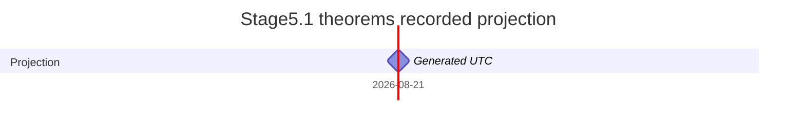

# Stage5.1 Theorems Organization Gantt

> Generated read-only projection of `Docs/Stage5_1_Theorems_Blueprint.md`; never a checklist authority.



## Complete monitoring index

| Item | Legacy/member mapping | State | Execution depends on | Owner / claim | Startup | Live | Handoff | Integration | Repair | Block | Subject code/path/label | Classification/review | Assignment SHA-256 | Assessment SHA-256 | Dependency assessment | Mathematical prerequisite consumer-required edge IDs | Mathematical prerequisite provider-used-by edge IDs | Semantic relation edge IDs | Reuse hint edge IDs | Hard edge review | Scheduler effect | Cross-domain | Timing |
|---|---|---|---|---|---|---|---|---|---|---|---|---|---|---|---|---|---|---|---|---|---|---|---|
| `S51THM-BOOT-001` | control successor | not_done | `-` | unclaimed | not_started | not_live | no_handoff | no_integration | no_repair | blocked_activation | - | not_applicable | - | - | control_not_member | `[]` | `[]` | `[]` | `[]` | `[]` | `none` | `false` | unscheduled |
| `S51THM-00003485-TARGET` | `S5THM-00003485-TARGET→S51-THM-00003485` | not_done | `S51THM-BOOT-001` | unclaimed | not_started | not_live | no_handoff | no_integration | no_repair | blocked_activation | `60-XX` / `S51-SUB-00000000/S51-SUB-00004637` / Probability theory and stochastic processes | `candidate/pending` | `1aa9b433bd790d20ee2506d58e823e6a44704aadafbd27e8a7f85af85b67da39` | `7012dc978f24733d961d0b1b67249751da9266fe2466817bb3a5e7b6a20f5fee` | `unknown_not_independent_proof_claim` | `[]` | `[]` | `[]` | `[]` | `[]` | `none` | `false` | unscheduled |
| `S51THM-00003489-TARGET` | `S5THM-00003489-TARGET→S51-THM-00003489` | not_done | `S51THM-BOOT-001` | unclaimed | not_started | not_live | no_handoff | no_integration | no_repair | blocked_activation | `03-XX` / `S51-SUB-00000000/S51-SUB-00000076` / Mathematical logic and foundations | `candidate/pending` | `50402489196ed52c6d6e26e72ad16447f826f3507bbdc4875beca2246ee53c6a` | `c56a9e449c565223cfe8e07b221ef5b00c8fd6d63c64dc05b44080602dcbfb62` | `unknown_not_independent_proof_claim` | `[]` | `[]` | `[]` | `[]` | `[]` | `none` | `false` | unscheduled |
| `S51THM-00003491-TARGET` | `S5THM-00003491-TARGET→S51-THM-00003491` | not_done | `S51THM-BOOT-001` | unclaimed | not_started | not_live | no_handoff | no_integration | no_repair | blocked_activation | `05-XX` / `S51-SUB-00000000/S51-SUB-00000224` / Combinatorics | `candidate/pending` | `45bcfde811f292e85a58a338bea80692994c69e7f66a3a9d49db4657f9584f98` | `60bfb634574716d4ec9b042393808629c39d98b18adae8f5d9a41a60b5f93ece` | `unknown_not_independent_proof_claim` | `[]` | `[]` | `[]` | `[]` | `[]` | `none` | `false` | unscheduled |
| `S51THM-00003492-TARGET` | `S5THM-00003492-TARGET→S51-THM-00003492` | not_done | `S51THM-BOOT-001` | unclaimed | not_started | not_live | no_handoff | no_integration | no_repair | blocked_activation | `05-XX` / `S51-SUB-00000000/S51-SUB-00000224` / Combinatorics | `candidate/pending` | `47a109a04311480cb6ec3f7a5e6083e96e3b587585c18ffd3fe39d7f33e4cbd6` | `55d221cbb394e259596b7d7581ce757cf5e3adf6d10c1a9f6908b3fcbcb455ab` | `unknown_not_independent_proof_claim` | `[]` | `[]` | `[]` | `[]` | `[]` | `none` | `false` | unscheduled |
| `S51THM-00003493-TARGET` | `S5THM-00003493-TARGET→S51-THM-00003493` | not_done | `S51THM-BOOT-001` | unclaimed | not_started | not_live | no_handoff | no_integration | no_repair | blocked_activation | `05-XX` / `S51-SUB-00000000/S51-SUB-00000224` / Combinatorics | `candidate/pending` | `2cf13cfe4a0e3a78e54b5c930cd3bf4b7f606b4d938bb8cfe80b612350307bdb` | `091f1f870ab8bb1fb52405e5715e8fb6b5cef2e48b4ecd1ca04e5978d0601482` | `unknown_not_independent_proof_claim` | `[]` | `[]` | `[]` | `[]` | `[]` | `none` | `false` | unscheduled |
| `S51THM-00003495-TARGET` | `S5THM-00003495-TARGET→S51-THM-00003495` | not_done | `S51THM-BOOT-001` | unclaimed | not_started | not_live | no_handoff | no_integration | no_repair | blocked_activation | `05-XX` / `S51-SUB-00000000/S51-SUB-00000224` / Combinatorics | `candidate/pending` | `bee2100d9a77cd6f453ff7c2fdac4be508ec428c9eecc3f32e595f844871c585` | `d23146a171b4a14a797c0024a186e0bef721dd03bb0c31ef844b7d4f58a22f66` | `unknown_not_independent_proof_claim` | `[]` | `[]` | `[]` | `[]` | `[]` | `none` | `false` | unscheduled |
| `S51THM-00003496-TARGET` | `S5THM-00003496-TARGET→S51-THM-00003496` | not_done | `S51THM-BOOT-001` | unclaimed | not_started | not_live | no_handoff | no_integration | no_repair | blocked_activation | `05-XX` / `S51-SUB-00000000/S51-SUB-00000224` / Combinatorics | `candidate/pending` | `5d089274348015dd20e6e70cfbfe6da894bd84bbce0f8bb8ae1737fc338224d8` | `16b4aea20006e84cb19f4bea6881ba87e7d3c1b39b56c944545a217cbf917fbd` | `unknown_not_independent_proof_claim` | `[]` | `[]` | `[]` | `[]` | `[]` | `none` | `false` | unscheduled |
| `S51THM-00003497-TARGET` | `S5THM-00003497-TARGET→S51-THM-00003497` | not_done | `S51THM-BOOT-001` | unclaimed | not_started | not_live | no_handoff | no_integration | no_repair | blocked_activation | `05-XX` / `S51-SUB-00000000/S51-SUB-00000224` / Combinatorics | `candidate/pending` | `d91d987a35f2828dd64e698550ffc0755104262a1ea87417ec52baf9b4fc3b80` | `25a36f5f98cb8ba08d50b1d233693ec464a42b93ca26c640fe15966599916395` | `unknown_not_independent_proof_claim` | `[]` | `[]` | `[]` | `[]` | `[]` | `none` | `false` | unscheduled |
| `S51THM-00003502-TARGET` | `S5THM-00003502-TARGET→S51-THM-00003502` | not_done | `S51THM-BOOT-001` | unclaimed | not_started | not_live | no_handoff | no_integration | no_repair | blocked_activation | `13-XX` / `S51-SUB-00000000/S51-SUB-00000787` / Commutative algebra | `candidate/pending` | `cf97d4019a79a20efe3aeeece56adf6814b82ec2e5f1e206ea6ea9a90c77eae0` | `086aba783a22c7d7d2cc46a53154e02e12cce0ee411db3fdeabb27555dae92d7` | `unknown_not_independent_proof_claim` | `[]` | `[]` | `[]` | `[]` | `[]` | `none` | `false` | unscheduled |
| `S51THM-00003503-TARGET` | `S5THM-00003503-TARGET→S51-THM-00003503` | not_done | `S51THM-BOOT-001` | unclaimed | not_started | not_live | no_handoff | no_integration | no_repair | blocked_activation | `13-XX` / `S51-SUB-00000000/S51-SUB-00000787` / Commutative algebra | `candidate/pending` | `4b438b66c41b99d3cb74d36cae0f737dc3a0fad98e54a61cace771c068180a4d` | `e550bc6d623a1f4957356a98580bfaae282e23dbafa48b33c9f9fb362de41b41` | `unknown_not_independent_proof_claim` | `[]` | `[]` | `[]` | `[]` | `[]` | `none` | `false` | unscheduled |
| `S51THM-00003504-TARGET` | `S5THM-00003504-TARGET→S51-THM-00003504` | not_done | `S51THM-BOOT-001` | unclaimed | not_started | not_live | no_handoff | no_integration | no_repair | blocked_activation | `13-XX` / `S51-SUB-00000000/S51-SUB-00000787` / Commutative algebra | `candidate/pending` | `f2e8348fe355b4f45e75c15d5b7d1e9a5592f41f7652c75533390cb8e5bd0435` | `f95c31e9282552ec5a5882acdd2495f25df580f3ef8b4496765dc4e4dbe733b9` | `unknown_not_independent_proof_claim` | `[]` | `[]` | `[]` | `[]` | `[]` | `none` | `false` | unscheduled |
| `S51THM-00003506-TARGET` | `S5THM-00003506-TARGET→S51-THM-00003506` | not_done | `S51THM-BOOT-001` | unclaimed | not_started | not_live | no_handoff | no_integration | no_repair | blocked_activation | `37-XX` / `S51-SUB-00000000/S51-SUB-00002900` / Dynamical systems and ergodic theory | `candidate/pending` | `51973c1d0e396fbe3cab26b3de246d116af3c1197b7b0cf1df9b6e7fab09f5ce` | `7f827075e716574d016713adca6a083f63f01a29ee55fa65875f504feb811d09` | `unknown_not_independent_proof_claim` | `[]` | `[]` | `[]` | `[]` | `[]` | `none` | `false` | unscheduled |
| `S51THM-00003513-TARGET` | `S5THM-00003513-TARGET→S51-THM-00003513` | not_done | `S51THM-BOOT-001` | unclaimed | not_started | not_live | no_handoff | no_integration | no_repair | blocked_activation | `11-XX` / `S51-SUB-00000000/S51-SUB-00000423` / Number theory | `candidate/pending` | `7d5a81fba5f3e655bbecf509c0446fdbd47f65885872217f582b15e35d20fe83` | `1410835a396f3a7457c948fb599252a2ac02448315ab7633839aa2c377714d5b` | `unknown_not_independent_proof_claim` | `[]` | `[]` | `[]` | `[]` | `[]` | `none` | `false` | unscheduled |
| `S51THM-00003514-TARGET` | `S5THM-00003514-TARGET→S51-THM-00003514` | not_done | `S51THM-BOOT-001` | unclaimed | not_started | not_live | no_handoff | no_integration | no_repair | blocked_activation | `26-XX` / `S51-SUB-00000000/S51-SUB-00001852` / Real functions | `candidate/pending` | `fc49adf750d408e469c9964246dec2e78d92428b920b5d94fe9f2674663f6982` | `4841d343f2e68c3f0c765078e410152795f4a320131e83a2d5ecc83f7bde8937` | `unknown_not_independent_proof_claim` | `[]` | `[]` | `[]` | `[]` | `[]` | `none` | `false` | unscheduled |
| `S51THM-00003515-TARGET` | `S5THM-00003515-TARGET→S51-THM-00003515` | not_done | `S51THM-BOOT-001` | unclaimed | not_started | not_live | no_handoff | no_integration | no_repair | blocked_activation | `26-XX` / `S51-SUB-00000000/S51-SUB-00001852` / Real functions | `candidate/pending` | `51152a16b46e3094a37930340caccd853767f36591c46d2a4011135162753e06` | `efbb5eaa032152cca5a5ac310a3f874eaccd1801b4e8605951db5c664f3df035` | `unknown_not_independent_proof_claim` | `[]` | `[]` | `[]` | `[]` | `[]` | `none` | `false` | unscheduled |
| `S51THM-00003516-TARGET` | `S5THM-00003516-TARGET→S51-THM-00003516` | not_done | `S51THM-BOOT-001` | unclaimed | not_started | not_live | no_handoff | no_integration | no_repair | blocked_activation | `26-XX` / `S51-SUB-00000000/S51-SUB-00001852` / Real functions | `candidate/pending` | `38f3817afdea803cacafce1aa5b0f14d849d16db45cb8ae75f1d0fe15270634b` | `d62c312c113a3110b5f4fcfa07beed55963bef6cbf42f0b79a531db15cc5630d` | `unknown_not_independent_proof_claim` | `[]` | `[]` | `[]` | `[]` | `[]` | `none` | `false` | unscheduled |
| `S51THM-00003517-TARGET` | `S5THM-00003517-TARGET→S51-THM-00003517` | not_done | `S51THM-BOOT-001` | unclaimed | not_started | not_live | no_handoff | no_integration | no_repair | blocked_activation | `05-XX` / `S51-SUB-00000000/S51-SUB-00000224` / Combinatorics | `candidate/pending` | `339dbd8c84acd73e479f8ed7b16abfc39306fb9d30e241e15a0d30caf6727c38` | `faeb9e9331d9d693a6b06f0c38db7c6979d696ad7d259c67f5fa825b7b3e11ab` | `unknown_not_independent_proof_claim` | `[]` | `[]` | `[]` | `[]` | `[]` | `none` | `false` | unscheduled |
| `S51THM-00003519-TARGET` | `S5THM-00003519-TARGET→S51-THM-00003519` | not_done | `S51THM-BOOT-001` | unclaimed | not_started | not_live | no_handoff | no_integration | no_repair | blocked_activation | `20-XX` / `S51-SUB-00000000/S51-SUB-00001604` / Group theory and generalizations | `candidate/pending` | `c518df275df91c4d70062fbed974fc89b1e3943dc8159470b40dcb3c28e07dac` | `b14caf71227fddb097c53ffe37934675d714cfeef7e6d4ba4f32f1dadc0228a4` | `unknown_not_independent_proof_claim` | `[]` | `[]` | `[]` | `[]` | `[]` | `none` | `false` | unscheduled |
| `S51THM-00003520-TARGET` | `S5THM-00003520-TARGET→S51-THM-00003520` | not_done | `S51THM-BOOT-001` | unclaimed | not_started | not_live | no_handoff | no_integration | no_repair | blocked_activation | `20-XX` / `S51-SUB-00000000/S51-SUB-00001604` / Group theory and generalizations | `candidate/pending` | `c33e42e1ee88a6a4cb9df9e381d3a0d2e504ac3f1390f1051227a4f6c69ebabc` | `06cc072e910499176166968385cd5abd10ddc674d974bc9d777d4b018e75f52a` | `unknown_not_independent_proof_claim` | `[]` | `[]` | `[]` | `[]` | `[]` | `none` | `false` | unscheduled |
| `S51THM-00003521-TARGET` | `S5THM-00003521-TARGET→S51-THM-00003521` | not_done | `S51THM-BOOT-001` | unclaimed | not_started | not_live | no_handoff | no_integration | no_repair | blocked_activation | `20-XX` / `S51-SUB-00000000/S51-SUB-00001604` / Group theory and generalizations | `candidate/pending` | `a351624f8061af90bbfce3f0c59b0fcba3c5599f9d2916435a455752657ca61a` | `d2ed9a235a56cc1aa8ddebfc843ec7f332c0ce5388ba22d4dad6963ffaa3f72a` | `unknown_not_independent_proof_claim` | `[]` | `[]` | `[]` | `[]` | `[]` | `none` | `false` | unscheduled |
| `S51THM-00003522-TARGET` | `S5THM-00003522-TARGET→S51-THM-00003522` | not_done | `S51THM-BOOT-001` | unclaimed | not_started | not_live | no_handoff | no_integration | no_repair | blocked_activation | `20-XX` / `S51-SUB-00000000/S51-SUB-00001604` / Group theory and generalizations | `candidate/pending` | `20aa7f9f4433aa45dd045a6035786e8965b5771288306fd8684c14044bb30db5` | `8deb4de7a9bc90924596214541dab850ece571157fcb6be120b05f4d872135b2` | `unknown_not_independent_proof_claim` | `[]` | `[]` | `[]` | `[]` | `[]` | `none` | `false` | unscheduled |
| `S51THM-00003523-TARGET` | `S5THM-00003523-TARGET→S51-THM-00003523` | not_done | `S51THM-BOOT-001` | unclaimed | not_started | not_live | no_handoff | no_integration | no_repair | blocked_activation | `15-XX` / `S51-SUB-00000000/S51-SUB-00001116` / Linear and multilinear algebra; matrix theory | `candidate/pending` | `6a3ca7f8983b28e4251cecf14ee9dc615970c53074387fe6056dfa46b6fe3ccd` | `96ff5fd90e48a715df5d3f92e029ce7bc7b064e6106c102eadbadc450033b007` | `unknown_not_independent_proof_claim` | `[]` | `[]` | `[]` | `[]` | `[]` | `none` | `false` | unscheduled |
| `S51THM-00003524-TARGET` | `S5THM-00003524-TARGET→S51-THM-00003524` | not_done | `S51THM-BOOT-001` | unclaimed | not_started | not_live | no_handoff | no_integration | no_repair | blocked_activation | `15-XX` / `S51-SUB-00000000/S51-SUB-00001116` / Linear and multilinear algebra; matrix theory | `candidate/pending` | `d632e9996e110be3e400a1a23be1324c69692f95530c899abca35d69c6631f43` | `39ae9b86e3aab7add040d1a20af3f5f16f4c26c941a2d2679db1da943eccad8c` | `unknown_not_independent_proof_claim` | `[]` | `[]` | `[]` | `[]` | `[]` | `none` | `false` | unscheduled |
| `S51THM-00003527-TARGET` | `S5THM-00003527-TARGET→S51-THM-00003527` | not_done | `S51THM-BOOT-001` | unclaimed | not_started | not_live | no_handoff | no_integration | no_repair | blocked_activation | `46-XX` / `S51-SUB-00000000/S51-SUB-00003408` / Functional analysis | `candidate/pending` | `48f9b4b4611510641b5053a654f957538a8aa8ded3e875605d9deb7160010786` | `faabe04054df4cebe0eb1f0a6206e2f6ce73cdac49019aa8d44025d52b7fb73d` | `unknown_not_independent_proof_claim` | `[]` | `[]` | `[]` | `[]` | `[]` | `none` | `false` | unscheduled |
| `S51THM-00003528-TARGET` | `S5THM-00003528-TARGET→S51-THM-00003528` | not_done | `S51THM-BOOT-001` | unclaimed | not_started | not_live | no_handoff | no_integration | no_repair | blocked_activation | `26-XX` / `S51-SUB-00000000/S51-SUB-00001852` / Real functions | `candidate/pending` | `3d3920dca3aed12d2cb4bf5225fe325726322b29647b5dd4f91681c3a7ca5dca` | `8454d92ede4572cdcdc7495b551222ac4512f24189fac8bf18366370ab16e68f` | `unknown_not_independent_proof_claim` | `[]` | `[]` | `[]` | `[]` | `[]` | `none` | `false` | unscheduled |
| `S51THM-00003535-TARGET` | `S5THM-00003535-TARGET→S51-THM-00003535` | not_done | `S51THM-BOOT-001` | unclaimed | not_started | not_live | no_handoff | no_integration | no_repair | blocked_activation | `11-XX` / `S51-SUB-00000000/S51-SUB-00000423` / Number theory | `candidate/pending` | `0dc93a6030e4a2aafa9f65d4ed6e5b5c099157349345156cb2c2c2e0ee49f4b3` | `cbd5de8984198fbca791b856426a4632976f29b30caa01380bb8bb529cfe549d` | `unknown_not_independent_proof_claim` | `[]` | `[]` | `[]` | `[]` | `[]` | `none` | `false` | unscheduled |
| `S51THM-00003536-TARGET` | `S5THM-00003536-TARGET→S51-THM-00003536` | not_done | `S51THM-BOOT-001` | unclaimed | not_started | not_live | no_handoff | no_integration | no_repair | blocked_activation | `11-XX` / `S51-SUB-00000000/S51-SUB-00000423` / Number theory | `candidate/pending` | `4a75301811ab043ea023106eca89595e9c3d6a2735ac74ab5c1897b2a62855f7` | `32018345f5e9223d473fbd1224460d4b2bbce37df249742389699ccc45413399` | `unknown_not_independent_proof_claim` | `[]` | `[]` | `[]` | `[]` | `[]` | `none` | `false` | unscheduled |
| `S51THM-00003537-TARGET` | `S5THM-00003537-TARGET→S51-THM-00003537` | not_done | `S51THM-BOOT-001` | unclaimed | not_started | not_live | no_handoff | no_integration | no_repair | blocked_activation | `11-XX` / `S51-SUB-00000000/S51-SUB-00000423` / Number theory | `candidate/pending` | `5596e323e28f40ade8e1f5d70816c3a6a53e32345570120500013c0150201de1` | `cfec67a3489f09db30d2db501ee462527f7fe2053ef49719afafd3b942ec6bd2` | `unknown_not_independent_proof_claim` | `[]` | `[]` | `[]` | `[]` | `[]` | `none` | `false` | unscheduled |
| `S51THM-00003542-TARGET` | `S5THM-00003542-TARGET→S51-THM-00003542` | not_done | `S51THM-BOOT-001` | unclaimed | not_started | not_live | no_handoff | no_integration | no_repair | blocked_activation | `11-XX` / `S51-SUB-00000000/S51-SUB-00000423` / Number theory | `candidate/pending` | `87f456319967db943bb875e6030f01a9c0d404e1758573f9bfc85f86e814aa9a` | `237fb1e15d392bf742059cd5a5a25a6aa64806bec3de1c8cfeeaa18f6df900ab` | `unknown_not_independent_proof_claim` | `[]` | `[]` | `[]` | `[]` | `[]` | `none` | `false` | unscheduled |
| `S51THM-00003543-TARGET` | `S5THM-00003543-TARGET→S51-THM-00003543` | not_done | `S51THM-BOOT-001` | unclaimed | not_started | not_live | no_handoff | no_integration | no_repair | blocked_activation | `11-XX` / `S51-SUB-00000000/S51-SUB-00000423` / Number theory | `candidate/pending` | `c8cbe0c60fe12ab95d6759e86e6194d914a76619004e82fd235d9bd86aaff6ef` | `939b4b5bea9f4eb5e0dafc3cb9b07bc0304f57d448da63f6a0f011aaded21a00` | `unknown_not_independent_proof_claim` | `[]` | `[]` | `[]` | `[]` | `[]` | `none` | `false` | unscheduled |
| `S51THM-00003545-TARGET` | `S5THM-00003545-TARGET→S51-THM-00003545` | not_done | `S51THM-BOOT-001` | unclaimed | not_started | not_live | no_handoff | no_integration | no_repair | blocked_activation | `11-XX` / `S51-SUB-00000000/S51-SUB-00000423` / Number theory | `candidate/pending` | `8377d060e6fad0f04a17a9731b054bb1a0d9bf8d84e15e9472a46ce19486dadb` | `8e7dcabc7dcf569ced07c9f39d3ef0d70939b0daf2de89a3cac703a20cb8ac87` | `unknown_not_independent_proof_claim` | `[]` | `[]` | `[]` | `[]` | `[]` | `none` | `false` | unscheduled |
| `S51THM-00003549-TARGET` | `S5THM-00003549-TARGET→S51-THM-00003549` | not_done | `S51THM-BOOT-001` | unclaimed | not_started | not_live | no_handoff | no_integration | no_repair | blocked_activation | `05-XX` / `S51-SUB-00000000/S51-SUB-00000224` / Combinatorics | `candidate/pending` | `3da2638aa0e186f7f3c4e8ef9b06154d280f3c56411d11913412f57e5876e098` | `a3dc346a64b6ff4cfc354df44235b30690ee6b4ed1e8bf180b9cc0b1b8af90d0` | `unknown_not_independent_proof_claim` | `[]` | `[]` | `[]` | `[]` | `[]` | `none` | `false` | unscheduled |
| `S51THM-00003555-TARGET` | `S5THM-00003555-TARGET→S51-THM-00003555` | not_done | `S51THM-BOOT-001` | unclaimed | not_started | not_live | no_handoff | no_integration | no_repair | blocked_activation | `52-XX` / `S51-SUB-00000000/S51-SUB-00003965` / Convex and discrete geometry | `candidate/pending` | `593aab2a91f1c713757d8eb824f596a6e4f9cd0f330753e72ab6801ea9665a24` | `f90c17ad607e693ae8d20e02baa49be7b31f8aae7007b1749da20a7a6b278e56` | `unknown_not_independent_proof_claim` | `[]` | `[]` | `[]` | `[]` | `[]` | `none` | `false` | unscheduled |
| `S51THM-00003556-TARGET` | `S5THM-00003556-TARGET→S51-THM-00003556` | not_done | `S51THM-BOOT-001` | unclaimed | not_started | not_live | no_handoff | no_integration | no_repair | blocked_activation | `52-XX` / `S51-SUB-00000000/S51-SUB-00003965` / Convex and discrete geometry | `candidate/pending` | `c9e3f7dab653e82dffeb4c28ffb78eb317b7509f5e3ea8c6410ed4ff1eec4579` | `d88883167c58d33b0730fd49f2502512bb118bd9a7f05119361aaf3b0d2ceab3` | `unknown_not_independent_proof_claim` | `[]` | `[]` | `[]` | `[]` | `[]` | `none` | `false` | unscheduled |
| `S51THM-00003558-TARGET` | `S5THM-00003558-TARGET→S51-THM-00003558` | not_done | `S51THM-BOOT-001` | unclaimed | not_started | not_live | no_handoff | no_integration | no_repair | blocked_activation | `52-XX` / `S51-SUB-00000000/S51-SUB-00003965` / Convex and discrete geometry | `candidate/pending` | `2da5b1bda8ad1a27ab5fbd44581089bdda46af2527e72369c2cc247486d2ad8c` | `06c50f5b783e9e1f191c2b29a783b2e2604c1fe8a89cf48687ed9a064de1cb9f` | `unknown_not_independent_proof_claim` | `[]` | `[]` | `[]` | `[]` | `[]` | `none` | `false` | unscheduled |
| `S51THM-00003559-TARGET` | `S5THM-00003559-TARGET→S51-THM-00003559` | not_done | `S51THM-BOOT-001` | unclaimed | not_started | not_live | no_handoff | no_integration | no_repair | blocked_activation | `11-XX` / `S51-SUB-00000000/S51-SUB-00000423` / Number theory | `candidate/pending` | `fdec17c4cc1c772846578f8f389fae3801393c87c889de3216c1678aaa72d31a` | `b285218aa7fd6918b2cb4b5f13117f59f3d257675fda88440831a60208d56e3a` | `unknown_not_independent_proof_claim` | `[]` | `[]` | `[]` | `[]` | `[]` | `none` | `false` | unscheduled |
| `S51THM-00003560-TARGET` | `S5THM-00003560-TARGET→S51-THM-00003560` | not_done | `S51THM-BOOT-001` | unclaimed | not_started | not_live | no_handoff | no_integration | no_repair | blocked_activation | `11-XX` / `S51-SUB-00000000/S51-SUB-00000423` / Number theory | `candidate/pending` | `4cc2e51e01d846a5c85bb582a947c8e411b9442f9aa8d0962441161f3c1f02e9` | `27c394d3bbcd9dbdfaa2d1ae3de1209ca4c535400196930d6b4e76fb7b436771` | `unknown_not_independent_proof_claim` | `[]` | `[]` | `[]` | `[]` | `[]` | `none` | `false` | unscheduled |
| `S51THM-00003561-TARGET` | `S5THM-00003561-TARGET→S51-THM-00003561` | not_done | `S51THM-BOOT-001` | unclaimed | not_started | not_live | no_handoff | no_integration | no_repair | blocked_activation | `05-XX` / `S51-SUB-00000000/S51-SUB-00000224` / Combinatorics | `candidate/pending` | `8f32334e1cc26cd70363b7d0dbd33e54d9bf7b4b3cd4fc90e6a52f56ab1455b9` | `4b39c39ba4dfeaacf906291c3a5d2ac27328b7ac0f4e280e37d0ffdb2884cc44` | `unknown_not_independent_proof_claim` | `[]` | `[]` | `[]` | `[]` | `[]` | `none` | `false` | unscheduled |
| `S51THM-00003562-TARGET` | `S5THM-00003562-TARGET→S51-THM-00003562` | not_done | `S51THM-BOOT-001` | unclaimed | not_started | not_live | no_handoff | no_integration | no_repair | blocked_activation | `05-XX` / `S51-SUB-00000000/S51-SUB-00000224` / Combinatorics | `candidate/pending` | `1dfb41d021101128699617af81ab057b4d72a3391e5b73ffbb81900323243973` | `8aef0fca2066d1634f4de5b31d2f9704179386aee44ff3e613db0a1f1feead63` | `unknown_not_independent_proof_claim` | `[]` | `[]` | `[]` | `[]` | `[]` | `none` | `false` | unscheduled |
| `S51THM-00003563-TARGET` | `S5THM-00003563-TARGET→S51-THM-00003563` | not_done | `S51THM-BOOT-001` | unclaimed | not_started | not_live | no_handoff | no_integration | no_repair | blocked_activation | `05-XX` / `S51-SUB-00000000/S51-SUB-00000224` / Combinatorics | `candidate/pending` | `b38067d5a49687af42f262efaf23725098a8e044bda955be8364f260137e1f5a` | `5b57e8c6cfa93382e61c5c22feb4a6e680ded099bc53f8fd4c7eb00485f93b66` | `unknown_not_independent_proof_claim` | `[]` | `[]` | `[]` | `[]` | `[]` | `none` | `false` | unscheduled |
| `S51THM-00003564-TARGET` | `S5THM-00003564-TARGET→S51-THM-00003564` | not_done | `S51THM-BOOT-001` | unclaimed | not_started | not_live | no_handoff | no_integration | no_repair | blocked_activation | `05-XX` / `S51-SUB-00000000/S51-SUB-00000224` / Combinatorics | `candidate/pending` | `773dc64253ce8f4bd5e5de79ed49e9db831774881567706f7f607f82ca519f30` | `1c272d64dff2047802ab4f8cf8750bfe86fd1a9d080aec016c2d96888204a717` | `unknown_not_independent_proof_claim` | `[]` | `[]` | `[]` | `[]` | `[]` | `none` | `false` | unscheduled |
| `S51THM-00003565-TARGET` | `S5THM-00003565-TARGET→S51-THM-00003565` | not_done | `S51THM-BOOT-001` | unclaimed | not_started | not_live | no_handoff | no_integration | no_repair | blocked_activation | `05-XX` / `S51-SUB-00000000/S51-SUB-00000224` / Combinatorics | `candidate/pending` | `efcf85c7e8819fe743b015befbe651f8732d07d6e18ce5174b2a5b5be8ffe5ff` | `594b6fbd6cdaf12859da2d3e4d8175de60ec5a9253e164044faae1aa189bc35f` | `unknown_not_independent_proof_claim` | `[]` | `[]` | `[]` | `[]` | `[]` | `none` | `false` | unscheduled |
| `S51THM-00003567-TARGET` | `S5THM-00003567-TARGET→S51-THM-00003567` | not_done | `S51THM-BOOT-001` | unclaimed | not_started | not_live | no_handoff | no_integration | no_repair | blocked_activation | `05-XX` / `S51-SUB-00000000/S51-SUB-00000224` / Combinatorics | `candidate/pending` | `7e9138a49d81d5233513688703dfcdcc03bdb1b325f6ab40988e01d9a0f22403` | `eaf1d7276872db619a349bf0ea0e1a4c4315c75b0d89723b827efd1162419443` | `unknown_not_independent_proof_claim` | `[]` | `[]` | `[]` | `[]` | `[]` | `none` | `false` | unscheduled |
| `S51THM-00003568-TARGET` | `S5THM-00003568-TARGET→S51-THM-00003568` | not_done | `S51THM-BOOT-001` | unclaimed | not_started | not_live | no_handoff | no_integration | no_repair | blocked_activation | `05-XX` / `S51-SUB-00000000/S51-SUB-00000224` / Combinatorics | `candidate/pending` | `ef60e7993304668fe472725947f3340e6118869d3c059ee467945801324c35d7` | `1e106e5074d75c6450db357e53bac6b32dad24a7aea3eab044683fdea02feddb` | `unknown_not_independent_proof_claim` | `[]` | `[]` | `[]` | `[]` | `[]` | `none` | `false` | unscheduled |
| `S51THM-00003569-TARGET` | `S5THM-00003569-TARGET→S51-THM-00003569` | not_done | `S51THM-BOOT-001` | unclaimed | not_started | not_live | no_handoff | no_integration | no_repair | blocked_activation | `05-XX` / `S51-SUB-00000000/S51-SUB-00000224` / Combinatorics | `candidate/pending` | `1bf03af5c385aa2e66543dd91add024cfe1765d57813836ec1bf3399803beeb6` | `4a576c4d5ec0689de87e1f22883cfb18d57b7659501377089553c8975202ac1e` | `unknown_not_independent_proof_claim` | `[]` | `[]` | `[]` | `[]` | `[]` | `none` | `false` | unscheduled |
| `S51THM-00003570-TARGET` | `S5THM-00003570-TARGET→S51-THM-00003570` | not_done | `S51THM-BOOT-001` | unclaimed | not_started | not_live | no_handoff | no_integration | no_repair | blocked_activation | `05-XX` / `S51-SUB-00000000/S51-SUB-00000224` / Combinatorics | `candidate/pending` | `bd418cd5a148bc3151e68ee90eaf11358d3b4ec0f88231bbb098bca43e26cf71` | `175df6c1f1b05660a5c699081ba51de99587ab2118e94d673c668b17358333c1` | `unknown_not_independent_proof_claim` | `[]` | `[]` | `[]` | `[]` | `[]` | `none` | `false` | unscheduled |
| `S51THM-00003571-TARGET` | `S5THM-00003571-TARGET→S51-THM-00003571` | not_done | `S51THM-BOOT-001` | unclaimed | not_started | not_live | no_handoff | no_integration | no_repair | blocked_activation | `05-XX` / `S51-SUB-00000000/S51-SUB-00000224` / Combinatorics | `candidate/pending` | `557676fa090922b025587c2fd43473b7a8072dd07a9ada877df311a672646cca` | `ee25f68daa890cab83b32c8174c86d49c670a89a0f29af36de3c70e4d8a9d393` | `unknown_not_independent_proof_claim` | `[]` | `[]` | `[]` | `[]` | `[]` | `none` | `false` | unscheduled |
| `S51THM-00003572-TARGET` | `S5THM-00003572-TARGET→S51-THM-00003572` | not_done | `S51THM-BOOT-001` | unclaimed | not_started | not_live | no_handoff | no_integration | no_repair | blocked_activation | `05-XX` / `S51-SUB-00000000/S51-SUB-00000224` / Combinatorics | `candidate/pending` | `f0bfd95f3fb8f67946f2620cc8e1c014b56e767a7b0e56fc5a09b30b81e0218f` | `23006471a5f05accc4123f686162da03f5921d95be57d6c5363af62c1021f2ba` | `unknown_not_independent_proof_claim` | `[]` | `[]` | `[]` | `[]` | `[]` | `none` | `false` | unscheduled |
| `S51THM-00003573-TARGET` | `S5THM-00003573-TARGET→S51-THM-00003573` | not_done | `S51THM-BOOT-001` | unclaimed | not_started | not_live | no_handoff | no_integration | no_repair | blocked_activation | `05-XX` / `S51-SUB-00000000/S51-SUB-00000224` / Combinatorics | `candidate/pending` | `dc9a2298942d1f636b5f357bb1684e163828d46cd8ac964cb04d106cb8d0bb03` | `350267f493d7d01695221e212de5670ed80fbc59e76ffc9798cd84fa11a00fdc` | `unknown_not_independent_proof_claim` | `[]` | `[]` | `[]` | `[]` | `[]` | `none` | `false` | unscheduled |
| `S51THM-00003574-TARGET` | `S5THM-00003574-TARGET→S51-THM-00003574` | not_done | `S51THM-BOOT-001` | unclaimed | not_started | not_live | no_handoff | no_integration | no_repair | blocked_activation | `05-XX` / `S51-SUB-00000000/S51-SUB-00000224` / Combinatorics | `candidate/pending` | `e5573dc7df940426fe578b37fa8bf9902ec2653a6192b51660d1f9386e3cd00a` | `fd5e90a04b99ab93080f93a23f1c168a8f55ba4e3b7dbb4f5cc7454c0f6342dc` | `unknown_not_independent_proof_claim` | `[]` | `[]` | `[]` | `[]` | `[]` | `none` | `false` | unscheduled |
| `S51THM-00003575-TARGET` | `S5THM-00003575-TARGET→S51-THM-00003575` | not_done | `S51THM-BOOT-001` | unclaimed | not_started | not_live | no_handoff | no_integration | no_repair | blocked_activation | `05-XX` / `S51-SUB-00000000/S51-SUB-00000224` / Combinatorics | `candidate/pending` | `f21f41752f49e931f50cf35f9e817eb9adc3f1d74fd9368e609c51794b98c686` | `f913bc54d83f8d2a5335b126b3f1c63e21ae728773de79bcd126f04077827626` | `unknown_not_independent_proof_claim` | `[]` | `[]` | `[]` | `[]` | `[]` | `none` | `false` | unscheduled |
| `S51THM-00003576-TARGET` | `S5THM-00003576-TARGET→S51-THM-00003576` | not_done | `S51THM-BOOT-001` | unclaimed | not_started | not_live | no_handoff | no_integration | no_repair | blocked_activation | `05-XX` / `S51-SUB-00000000/S51-SUB-00000224` / Combinatorics | `candidate/pending` | `d0a192763e2590d890daa35935cfcbb6ff90b61058bb009a815dc0b153697bbd` | `4312cb11cd07f92f14ff5e37ba43a869387de6930a8ca190ab2a067738c72e95` | `unknown_not_independent_proof_claim` | `[]` | `[]` | `[]` | `[]` | `[]` | `none` | `false` | unscheduled |
| `S51THM-00003577-TARGET` | `S5THM-00003577-TARGET→S51-THM-00003577` | not_done | `S51THM-BOOT-001` | unclaimed | not_started | not_live | no_handoff | no_integration | no_repair | blocked_activation | `05-XX` / `S51-SUB-00000000/S51-SUB-00000224` / Combinatorics | `candidate/pending` | `5816f6c8d0eb4a395f565504067f07ea1bffeb8262db607af84d51e2cd5d5d43` | `7e42a74192c51dd131d52f2b525e9cb17b9c53fcf757b94634e01cec2b012417` | `unknown_not_independent_proof_claim` | `[]` | `[]` | `[]` | `[]` | `[]` | `none` | `false` | unscheduled |
| `S51THM-00003578-TARGET` | `S5THM-00003578-TARGET→S51-THM-00003578` | not_done | `S51THM-BOOT-001` | unclaimed | not_started | not_live | no_handoff | no_integration | no_repair | blocked_activation | `05-XX` / `S51-SUB-00000000/S51-SUB-00000224` / Combinatorics | `candidate/pending` | `eb8576bca3ad0e524db3a9d9138df907645421d3bb1b326c13106e98fdae55a7` | `04b20b6c771df767da5cbb9d8c560aedf2a71d5fec88e32457d52f9cbe7065c9` | `unknown_not_independent_proof_claim` | `[]` | `[]` | `[]` | `[]` | `[]` | `none` | `false` | unscheduled |
| `S51THM-00003579-TARGET` | `S5THM-00003579-TARGET→S51-THM-00003579` | not_done | `S51THM-BOOT-001` | unclaimed | not_started | not_live | no_handoff | no_integration | no_repair | blocked_activation | `05-XX` / `S51-SUB-00000000/S51-SUB-00000224` / Combinatorics | `candidate/pending` | `f7ca21eeaa6ddeb36c407ac2c6a1b5c00e8f6d31ca0617f495294a00732156d2` | `136bbdcde8233e33b9d745350ff3054ac9e6a66ab4f786e55cd44e47623d012a` | `unknown_not_independent_proof_claim` | `[]` | `[]` | `[]` | `[]` | `[]` | `none` | `false` | unscheduled |
| `S51THM-00003580-TARGET` | `S5THM-00003580-TARGET→S51-THM-00003580` | not_done | `S51THM-BOOT-001` | unclaimed | not_started | not_live | no_handoff | no_integration | no_repair | blocked_activation | `05-XX` / `S51-SUB-00000000/S51-SUB-00000224` / Combinatorics | `candidate/pending` | `d22bf25dbd83dbfac57718b543625959a20df5cff30c141ab47ecc09e4495faf` | `71ec3a612c15a8bb362baccbd0079fd25d5f3be9943780f6a471d8f52ac93a64` | `unknown_not_independent_proof_claim` | `[]` | `[]` | `[]` | `[]` | `[]` | `none` | `false` | unscheduled |
| `S51THM-00003581-TARGET` | `S5THM-00003581-TARGET→S51-THM-00003581` | not_done | `S51THM-BOOT-001` | unclaimed | not_started | not_live | no_handoff | no_integration | no_repair | blocked_activation | `05-XX` / `S51-SUB-00000000/S51-SUB-00000224` / Combinatorics | `candidate/pending` | `410624c21b5c4c767997fdc8740420dded194265cca3f2e0cf78bf9f7e30a9b6` | `b5fcfd72399a7ac4c5238c75e2b667bea9333d107b7cd87f3015b3ad8f6e49c0` | `unknown_not_independent_proof_claim` | `[]` | `[]` | `[]` | `[]` | `[]` | `none` | `false` | unscheduled |
| `S51THM-00003582-TARGET` | `S5THM-00003582-TARGET→S51-THM-00003582` | not_done | `S51THM-BOOT-001` | unclaimed | not_started | not_live | no_handoff | no_integration | no_repair | blocked_activation | `05-XX` / `S51-SUB-00000000/S51-SUB-00000224` / Combinatorics | `candidate/pending` | `6f650e89742de716bf61057567dd9478b9520c622ce3bef044a60fd66d82e23d` | `16c7a16921f11026ea65b371f68cce183c8d95958cb82fee4058918f7bebd7cc` | `unknown_not_independent_proof_claim` | `[]` | `[]` | `[]` | `[]` | `[]` | `none` | `false` | unscheduled |
| `S51THM-00003583-TARGET` | `S5THM-00003583-TARGET→S51-THM-00003583` | not_done | `S51THM-BOOT-001` | unclaimed | not_started | not_live | no_handoff | no_integration | no_repair | blocked_activation | `05-XX` / `S51-SUB-00000000/S51-SUB-00000224` / Combinatorics | `candidate/pending` | `83b5786c1a8618b4e4a38479545ee17ad0b05ad33b1d8a72c5b185fa04a5abf8` | `a969da0ebccbd7d22ccbba4c9f87bfed7c82eedc4e6c05fc1998d95a077bb5f7` | `unknown_not_independent_proof_claim` | `[]` | `[]` | `[]` | `[]` | `[]` | `none` | `false` | unscheduled |
| `S51THM-00003584-TARGET` | `S5THM-00003584-TARGET→S51-THM-00003584` | not_done | `S51THM-BOOT-001` | unclaimed | not_started | not_live | no_handoff | no_integration | no_repair | blocked_activation | `05-XX` / `S51-SUB-00000000/S51-SUB-00000224` / Combinatorics | `candidate/pending` | `c07dcb326b2c06afbf158921141a2f4cf475b531b899d7d4bdebd4c79ce6007d` | `6ea7bd7e7a1d1e4b527c08623aafe73614b148c7f6dcf8ea28845d4f9b81a645` | `unknown_not_independent_proof_claim` | `[]` | `[]` | `[]` | `[]` | `[]` | `none` | `false` | unscheduled |
| `S51THM-00003585-TARGET` | `S5THM-00003585-TARGET→S51-THM-00003585` | not_done | `S51THM-BOOT-001` | unclaimed | not_started | not_live | no_handoff | no_integration | no_repair | blocked_activation | `05-XX` / `S51-SUB-00000000/S51-SUB-00000224` / Combinatorics | `candidate/pending` | `808e5dbd1ce4c710f57c019f9aa11c061692eab05c1ddf3822ed9aedc4fc8402` | `beb3f5577bd9780cbe1edfce50b180649fa6c358eb2d39964bee742b1bf41feb` | `unknown_not_independent_proof_claim` | `[]` | `[]` | `[]` | `[]` | `[]` | `none` | `false` | unscheduled |
| `S51THM-00003586-TARGET` | `S5THM-00003586-TARGET→S51-THM-00003586` | not_done | `S51THM-BOOT-001` | unclaimed | not_started | not_live | no_handoff | no_integration | no_repair | blocked_activation | `05-XX` / `S51-SUB-00000000/S51-SUB-00000224` / Combinatorics | `candidate/pending` | `37f50ea2593416d441e1c8003ab4eb401cc35ad083723388c0501b64d9946773` | `f6265e615069230e5405ec199847abb80eea7aa476470523fbbdfaaac51c5f4a` | `unknown_not_independent_proof_claim` | `[]` | `[]` | `[]` | `[]` | `[]` | `none` | `false` | unscheduled |
| `S51THM-00003587-TARGET` | `S5THM-00003587-TARGET→S51-THM-00003587` | not_done | `S51THM-BOOT-001` | unclaimed | not_started | not_live | no_handoff | no_integration | no_repair | blocked_activation | `05-XX` / `S51-SUB-00000000/S51-SUB-00000224` / Combinatorics | `candidate/pending` | `c320648f83b64e409e29a97fb86e76915abf6e9dc476d84ace0ff6fe3cc1cb39` | `8af374c75894a8f071d794c6d359451005c8a3626b8367431d2b5f4ff2fc6506` | `unknown_not_independent_proof_claim` | `[]` | `[]` | `[]` | `[]` | `[]` | `none` | `false` | unscheduled |
| `S51THM-00003589-TARGET` | `S5THM-00003589-TARGET→S51-THM-00003589` | not_done | `S51THM-BOOT-001` | unclaimed | not_started | not_live | no_handoff | no_integration | no_repair | blocked_activation | `28-XX` / `S51-SUB-00000000/S51-SUB-00001918` / Measure and integration | `candidate/pending` | `ff5419a7eb7ec061b183498bf8f6c82dfd5c5dc34cd613887a1bc8e89b538764` | `17355c944649200d1d13f99898829d2b85a139b7803f671ac1800caa841e9a09` | `unknown_not_independent_proof_claim` | `[]` | `[]` | `[]` | `[]` | `[]` | `none` | `false` | unscheduled |
| `S51THM-00003590-TARGET` | `S5THM-00003590-TARGET→S51-THM-00003590` | not_done | `S51THM-BOOT-001` | unclaimed | not_started | not_live | no_handoff | no_integration | no_repair | blocked_activation | `28-XX` / `S51-SUB-00000000/S51-SUB-00001918` / Measure and integration | `candidate/pending` | `a91acb7c0ad5480633816ccf0efb693f2056d81ae3ee0acccb5be60018ed989c` | `f498c13ee7e0bc98bef2cbcf20371e8d6ccb408c457ca1e07cac06154c4590b9` | `unknown_not_independent_proof_claim` | `[]` | `[]` | `[]` | `[]` | `[]` | `none` | `false` | unscheduled |
| `S51THM-00003591-TARGET` | `S5THM-00003591-TARGET→S51-THM-00003591` | not_done | `S51THM-BOOT-001` | unclaimed | not_started | not_live | no_handoff | no_integration | no_repair | blocked_activation | `28-XX` / `S51-SUB-00000000/S51-SUB-00001918` / Measure and integration | `candidate/pending` | `4eb85869b9d8c0fdea38e1543b180ad6541ce7ce39ae5a8f012ce742a86ba47e` | `d521f9580626169b242af1a5f82c3bbb55750d5fd194de25505863f2eb105e44` | `unknown_not_independent_proof_claim` | `[]` | `[]` | `[]` | `[]` | `[]` | `none` | `false` | unscheduled |
| `S51THM-00003593-TARGET` | `S5THM-00003593-TARGET→S51-THM-00003593` | not_done | `S51THM-BOOT-001` | unclaimed | not_started | not_live | no_handoff | no_integration | no_repair | blocked_activation | `32-XX` / `S51-SUB-00000000/S51-SUB-00002117` / Several complex variables and analytic spaces | `candidate/pending` | `91b6501805e2df0a17816f36dbc5d19c55ff8ba714fff057c982964e5f548c23` | `43f700e4c5c03aff76936566d9be157e044bfc886e07bd703615cdc642512689` | `unknown_not_independent_proof_claim` | `[]` | `[]` | `[]` | `[]` | `[]` | `none` | `false` | unscheduled |
| `S51THM-00003594-TARGET` | `S5THM-00003594-TARGET→S51-THM-00003594` | not_done | `S51THM-BOOT-001` | unclaimed | not_started | not_live | no_handoff | no_integration | no_repair | blocked_activation | `28-XX` / `S51-SUB-00000000/S51-SUB-00001918` / Measure and integration | `candidate/pending` | `aa39d66abd1cedb28c5175cdcc49c0ef65b965456f2407eb5aca2630ae34e3a1` | `ab25468e37ac44c52071c1b54114a71a3b878c163fbad40de3710f23568173ec` | `unknown_not_independent_proof_claim` | `[]` | `[]` | `[]` | `[]` | `[]` | `none` | `false` | unscheduled |
| `S51THM-00003595-TARGET` | `S5THM-00003595-TARGET→S51-THM-00003595` | not_done | `S51THM-BOOT-001` | unclaimed | not_started | not_live | no_handoff | no_integration | no_repair | blocked_activation | `28-XX` / `S51-SUB-00000000/S51-SUB-00001918` / Measure and integration | `candidate/pending` | `e138588394c9852c1555fa9b78e5f2755789dde6ffb59c19e6299c2d07a5596b` | `6dac25a5e4024c905ce558cf5031a1368749ad2e868d3f96944a10775ab5ff93` | `unknown_not_independent_proof_claim` | `[]` | `[]` | `[]` | `[]` | `[]` | `none` | `false` | unscheduled |
| `S51THM-00003596-TARGET` | `S5THM-00003596-TARGET→S51-THM-00003596` | not_done | `S51THM-BOOT-001` | unclaimed | not_started | not_live | no_handoff | no_integration | no_repair | blocked_activation | `30-XX` / `S51-SUB-00000000/S51-SUB-00001966` / Functions of a complex variable | `candidate/pending` | `7152c843b1c8baa8479d93074785beec50bfbeb7d749e8b1491103b2f03bd608` | `c1c9d19be8ca1234d800c81122aa3f4dda875ee5a4a2e73c04c09bda470ff6c5` | `unknown_not_independent_proof_claim` | `[]` | `[]` | `[]` | `[]` | `[]` | `none` | `false` | unscheduled |
| `S51THM-00003598-TARGET` | `S5THM-00003598-TARGET→S51-THM-00003598` | not_done | `S51THM-BOOT-001` | unclaimed | not_started | not_live | no_handoff | no_integration | no_repair | blocked_activation | `30-XX` / `S51-SUB-00000000/S51-SUB-00001966` / Functions of a complex variable | `candidate/pending` | `3f5bc066916a4be106325ed3aae0b050b5561bd52d0ea38f43bad298cffbad52` | `8ce74a99c21a07c8f00f2d47786da01da24102c30a51010f5a37e78d7c5b22e4` | `unknown_not_independent_proof_claim` | `[]` | `[]` | `[]` | `[]` | `[]` | `none` | `false` | unscheduled |
| `S51THM-00003599-TARGET` | `S5THM-00003599-TARGET→S51-THM-00003599` | not_done | `S51THM-BOOT-001` | unclaimed | not_started | not_live | no_handoff | no_integration | no_repair | blocked_activation | `30-XX` / `S51-SUB-00000000/S51-SUB-00001966` / Functions of a complex variable | `candidate/pending` | `ff20629fefefb47e3b64cfe298a75de4c31fcbad12a5bc59d34e816f1740322a` | `86e237cabb12c98784e590d0d08ea71157a99c8e9233f656a20ffe2ba0b3212e` | `unknown_not_independent_proof_claim` | `[]` | `[]` | `[]` | `[]` | `[]` | `none` | `false` | unscheduled |
| `S51THM-00003600-TARGET` | `S5THM-00003600-TARGET→S51-THM-00003600` | not_done | `S51THM-BOOT-001` | unclaimed | not_started | not_live | no_handoff | no_integration | no_repair | blocked_activation | `30-XX` / `S51-SUB-00000000/S51-SUB-00001966` / Functions of a complex variable | `candidate/pending` | `3dc335f0e7a528fabc26007d988161f7bc2ff25a434f13f431023e364948efef` | `63bbc734f4b31128e0e6d66c7d16b99c5994e4ddf684ee1a78083312f533eb50` | `unknown_not_independent_proof_claim` | `[]` | `[]` | `[]` | `[]` | `[]` | `none` | `false` | unscheduled |
| `S51THM-00003601-TARGET` | `S5THM-00003601-TARGET→S51-THM-00003601` | not_done | `S51THM-BOOT-001` | unclaimed | not_started | not_live | no_handoff | no_integration | no_repair | blocked_activation | `30-XX` / `S51-SUB-00000000/S51-SUB-00001966` / Functions of a complex variable | `candidate/pending` | `c5d1a9cd980fe06bbbb8b9ef1898770126095d1523476eb5be982dc61a7e3766` | `d1f856d6a79f7b9209b15f87a49269966456ff6e93b9e64ca4b330706cb701a8` | `unknown_not_independent_proof_claim` | `[]` | `[]` | `[]` | `[]` | `[]` | `none` | `false` | unscheduled |
| `S51THM-00003602-TARGET` | `S5THM-00003602-TARGET→S51-THM-00003602` | not_done | `S51THM-BOOT-001` | unclaimed | not_started | not_live | no_handoff | no_integration | no_repair | blocked_activation | `30-XX` / `S51-SUB-00000000/S51-SUB-00001966` / Functions of a complex variable | `candidate/pending` | `d8501cb188ac5a7363cbdacc5c96e6d639abbfa4528c818969f45c723a14b187` | `2666e5364f7aa734564a73ccbaeca4a74751fdfe36ffb227f8d30c73b10c7256` | `unknown_not_independent_proof_claim` | `[]` | `[]` | `[]` | `[]` | `[]` | `none` | `false` | unscheduled |
| `S51THM-00003604-TARGET` | `S5THM-00003604-TARGET→S51-THM-00003604` | not_done | `S51THM-BOOT-001` | unclaimed | not_started | not_live | no_handoff | no_integration | no_repair | blocked_activation | `30-XX` / `S51-SUB-00000000/S51-SUB-00001966` / Functions of a complex variable | `candidate/pending` | `c99314387665a565f473cc15e7bc558f177b84a8f1049e029e6643960e1d6988` | `aeb7ff19fc8e8e401fc53f069f2a52809636945748ccf600d86098d4137d9863` | `unknown_not_independent_proof_claim` | `[]` | `[]` | `[]` | `[]` | `[]` | `none` | `false` | unscheduled |
| `S51THM-00003605-TARGET` | `S5THM-00003605-TARGET→S51-THM-00003605` | not_done | `S51THM-BOOT-001` | unclaimed | not_started | not_live | no_handoff | no_integration | no_repair | blocked_activation | `30-XX` / `S51-SUB-00000000/S51-SUB-00001966` / Functions of a complex variable | `candidate/pending` | `312899a3738995c345dca349f9ba10b259a7c03aeb3df376b0636b39a132c010` | `16bf61fecdbf56c579aa159b293630b8d91a83c3a039663b26ae828d497451ef` | `unknown_not_independent_proof_claim` | `[]` | `[]` | `[]` | `[]` | `[]` | `none` | `false` | unscheduled |
| `S51THM-00003606-TARGET` | `S5THM-00003606-TARGET→S51-THM-00003606` | not_done | `S51THM-BOOT-001` | unclaimed | not_started | not_live | no_handoff | no_integration | no_repair | blocked_activation | `30-XX` / `S51-SUB-00000000/S51-SUB-00001966` / Functions of a complex variable | `candidate/pending` | `797d98431ece5babfab5b97f96191f9233413bd1c92c0ff3d465237fbc54c924` | `4ad9646eaca9f52171cac837ae37644674c0cba5eb2caa2c96cf312c19ce8ab7` | `unknown_not_independent_proof_claim` | `[]` | `[]` | `[]` | `[]` | `[]` | `none` | `false` | unscheduled |
| `S51THM-00003607-TARGET` | `S5THM-00003607-TARGET→S51-THM-00003607` | not_done | `S51THM-BOOT-001` | unclaimed | not_started | not_live | no_handoff | no_integration | no_repair | blocked_activation | `30-XX` / `S51-SUB-00000000/S51-SUB-00001966` / Functions of a complex variable | `candidate/pending` | `0701789eadfce55b51f0997c7e2a341b38a1d70e030627ef18ef54dc70e0f19f` | `aa2abffc9acf9f9983b180862913999c18d26153909e33c3ca1578df8c8e3b00` | `unknown_not_independent_proof_claim` | `[]` | `[]` | `[]` | `[]` | `[]` | `none` | `false` | unscheduled |
| `S51THM-00003608-TARGET` | `S5THM-00003608-TARGET→S51-THM-00003608` | not_done | `S51THM-BOOT-001` | unclaimed | not_started | not_live | no_handoff | no_integration | no_repair | blocked_activation | `30-XX` / `S51-SUB-00000000/S51-SUB-00001966` / Functions of a complex variable | `candidate/pending` | `eba69136c0b9ddf402f69dbb21cd0ef92b756964927ca698407337cd6a8389ad` | `61f7415db2f6c8e63fa4aa095e14959d42062eac03401bcfb0881a1e4f241957` | `unknown_not_independent_proof_claim` | `[]` | `[]` | `[]` | `[]` | `[]` | `none` | `false` | unscheduled |
| `S51THM-00003609-TARGET` | `S5THM-00003609-TARGET→S51-THM-00003609` | not_done | `S51THM-BOOT-001` | unclaimed | not_started | not_live | no_handoff | no_integration | no_repair | blocked_activation | `30-XX` / `S51-SUB-00000000/S51-SUB-00001966` / Functions of a complex variable | `candidate/pending` | `0e9081fd990e9591463b322e5a968178bb749d1c611c1f1cf77dfdcc6e66d447` | `79f723776147d75b36467f7092a67c39c2e348ee6f1d4a88cd14812e6d0f5cda` | `unknown_not_independent_proof_claim` | `[]` | `[]` | `[]` | `[]` | `[]` | `none` | `false` | unscheduled |
| `S51THM-00003610-TARGET` | `S5THM-00003610-TARGET→S51-THM-00003610` | not_done | `S51THM-BOOT-001` | unclaimed | not_started | not_live | no_handoff | no_integration | no_repair | blocked_activation | `30-XX` / `S51-SUB-00000000/S51-SUB-00001966` / Functions of a complex variable | `candidate/pending` | `b7f085df7d294cade7f4f9e077017f5688c43d6fa6ba049879e33fcddb80d3ca` | `0737c32cf84b86366ce2e15ed077a0ffc970399d0b784eda6b050ebe9a0c3a41` | `unknown_not_independent_proof_claim` | `[]` | `[]` | `[]` | `[]` | `[]` | `none` | `false` | unscheduled |
| `S51THM-00003611-TARGET` | `S5THM-00003611-TARGET→S51-THM-00003611` | not_done | `S51THM-BOOT-001` | unclaimed | not_started | not_live | no_handoff | no_integration | no_repair | blocked_activation | `30-XX` / `S51-SUB-00000000/S51-SUB-00001966` / Functions of a complex variable | `candidate/pending` | `18673f3a009deaebcc425ab98002c5eb48f8b8640d643c7fd1202ae3cd766052` | `1d91b579db9b69af1e633f51b7b62bd65a19c64bb8076400b410974f834fbc24` | `unknown_not_independent_proof_claim` | `[]` | `[]` | `[]` | `[]` | `[]` | `none` | `false` | unscheduled |
| `S51THM-00003612-TARGET` | `S5THM-00003612-TARGET→S51-THM-00003612` | not_done | `S51THM-BOOT-001` | unclaimed | not_started | not_live | no_handoff | no_integration | no_repair | blocked_activation | `30-XX` / `S51-SUB-00000000/S51-SUB-00001966` / Functions of a complex variable | `candidate/pending` | `687eaebb41c29127e367a9235eb2bdf99e4c08b3ad4043a45ce7c72dd673d771` | `d5ce65d5f598085b4ab9bda62cdd8000a6fd5f570199b215d785eb39ff855bb7` | `unknown_not_independent_proof_claim` | `[]` | `[]` | `[]` | `[]` | `[]` | `none` | `false` | unscheduled |
| `S51THM-00003613-TARGET` | `S5THM-00003613-TARGET→S51-THM-00003613` | not_done | `S51THM-BOOT-001` | unclaimed | not_started | not_live | no_handoff | no_integration | no_repair | blocked_activation | `30-XX` / `S51-SUB-00000000/S51-SUB-00001966` / Functions of a complex variable | `candidate/pending` | `7abd19948ce84becc0ad43f5db59e1ac63e20dab75443b2e8b3bde298bfa4353` | `20ae666a22896a7fa4924507b92f3505df925b04813e3e325f5aee2657e0b66b` | `unknown_not_independent_proof_claim` | `[]` | `[]` | `[]` | `[]` | `[]` | `none` | `false` | unscheduled |
| `S51THM-00003614-TARGET` | `S5THM-00003614-TARGET→S51-THM-00003614` | not_done | `S51THM-BOOT-001` | unclaimed | not_started | not_live | no_handoff | no_integration | no_repair | blocked_activation | `05-XX` / `S51-SUB-00000000/S51-SUB-00000224` / Combinatorics | `candidate/pending` | `00ac1709c6ae079215913887259bec4754c8b3c96114705b2c49a351e42fc364` | `4e73434eb104c835859acd11a251ef181bd9929381e7a6463d2fa26c51585c2c` | `unknown_not_independent_proof_claim` | `[]` | `[]` | `[]` | `[]` | `[]` | `none` | `false` | unscheduled |
| `S51THM-00003615-TARGET` | `S5THM-00003615-TARGET→S51-THM-00003615` | not_done | `S51THM-BOOT-001` | unclaimed | not_started | not_live | no_handoff | no_integration | no_repair | blocked_activation | `05-XX` / `S51-SUB-00000000/S51-SUB-00000224` / Combinatorics | `candidate/pending` | `1a04b10a23c06566fa807b8d220627c08e03d85e9ded34aa98df75f0d23301e7` | `40f68cee5719a0b4ac55c53bd20563cfd1bea60ab5fab30a02d4fe0d19ca1b27` | `unknown_not_independent_proof_claim` | `[]` | `[]` | `[]` | `[]` | `[]` | `none` | `false` | unscheduled |
| `S51THM-00003616-TARGET` | `S5THM-00003616-TARGET→S51-THM-00003616` | not_done | `S51THM-BOOT-001` | unclaimed | not_started | not_live | no_handoff | no_integration | no_repair | blocked_activation | `05-XX` / `S51-SUB-00000000/S51-SUB-00000224` / Combinatorics | `candidate/pending` | `5d4bbaae52c9c750e041b51dc9b5ef1641474d635d68251229d65a1dbe5a1069` | `0ea74a86457c93a1dd65ee9f6af59c17fedc4e1086770177cc117549e49b1838` | `unknown_not_independent_proof_claim` | `[]` | `[]` | `[]` | `[]` | `[]` | `none` | `false` | unscheduled |
| `S51THM-00003618-TARGET` | `S5THM-00003618-TARGET→S51-THM-00003618` | not_done | `S51THM-BOOT-001` | unclaimed | not_started | not_live | no_handoff | no_integration | no_repair | blocked_activation | `11-XX` / `S51-SUB-00000000/S51-SUB-00000423` / Number theory | `candidate/pending` | `eae3a9196362bd8e25971e6f215466a85152230886487b1cab535f7a31100699` | `cf0aa2795fcd3d67f4b8f7177607ae62ba2d1cd049ec52adff87693d14dbeb9d` | `unknown_not_independent_proof_claim` | `[]` | `[]` | `[]` | `[]` | `[]` | `none` | `false` | unscheduled |
| `S51THM-00003619-TARGET` | `S5THM-00003619-TARGET→S51-THM-00003619` | not_done | `S51THM-BOOT-001` | unclaimed | not_started | not_live | no_handoff | no_integration | no_repair | blocked_activation | `11-XX` / `S51-SUB-00000000/S51-SUB-00000423` / Number theory | `candidate/pending` | `e128043db3a8861bf4b3260ad988225c3a36923f80a54a02d19edc8f4267cc81` | `3cc826b658f39438e0c8a6a02edff29284826f337ff4efdf3a79b1081f22f782` | `unknown_not_independent_proof_claim` | `[]` | `[]` | `[]` | `[]` | `[]` | `none` | `false` | unscheduled |
| `S51THM-00003624-TARGET` | `S5THM-00003624-TARGET→S51-THM-00003624` | not_done | `S51THM-BOOT-001` | unclaimed | not_started | not_live | no_handoff | no_integration | no_repair | blocked_activation | `11-XX` / `S51-SUB-00000000/S51-SUB-00000423` / Number theory | `candidate/pending` | `92662d5ced884666f5c259c848a999bdee3874e4809182a56d497b10721112e9` | `fb9e2b822282f7642f7374e6be01946d0d19535593594258bf413492a4e838fa` | `unknown_not_independent_proof_claim` | `[]` | `[]` | `[]` | `[]` | `[]` | `none` | `false` | unscheduled |
| `S51THM-00003625-TARGET` | `S5THM-00003625-TARGET→S51-THM-00003625` | not_done | `S51THM-BOOT-001` | unclaimed | not_started | not_live | no_handoff | no_integration | no_repair | blocked_activation | `11-XX` / `S51-SUB-00000000/S51-SUB-00000423` / Number theory | `candidate/pending` | `51927074fdedc4413d7dd25307f65bb6dec3678159fc06569087a53674035629` | `fcf30819b106aecbba7105e3cdc844a19684bdd60929b280ff227ad3ad6d1093` | `unknown_not_independent_proof_claim` | `[]` | `[]` | `[]` | `[]` | `[]` | `none` | `false` | unscheduled |
| `S51THM-00003626-TARGET` | `S5THM-00003626-TARGET→S51-THM-00003626` | not_done | `S51THM-BOOT-001` | unclaimed | not_started | not_live | no_handoff | no_integration | no_repair | blocked_activation | `11-XX` / `S51-SUB-00000000/S51-SUB-00000423` / Number theory | `candidate/pending` | `71f277bff2f1e26fb16f013aad1330f84f01f4a2781b6757768f65193ac2b4ff` | `7caf4c4cdaccb407a1e5e29e790b2bc3afbde872eb0d88a0c3d749c01795aa15` | `unknown_not_independent_proof_claim` | `[]` | `[]` | `[]` | `[]` | `[]` | `none` | `false` | unscheduled |
| `S51THM-00003628-TARGET` | `S5THM-00003628-TARGET→S51-THM-00003628` | not_done | `S51THM-BOOT-001` | unclaimed | not_started | not_live | no_handoff | no_integration | no_repair | blocked_activation | `11-XX` / `S51-SUB-00000000/S51-SUB-00000423` / Number theory | `candidate/pending` | `b73bbdcef8fdb7b5aa7348c685b863dffa35d006eec25ebdcdeb3e9cc7599fc5` | `ac72fbfcf60becf056a9a9edbaa2a87028a790a016cd9156ab3a4ab3946b7bf0` | `unknown_not_independent_proof_claim` | `[]` | `[]` | `[]` | `[]` | `[]` | `none` | `false` | unscheduled |
| `S51THM-00003632-TARGET` | `S5THM-00003632-TARGET→S51-THM-00003632` | not_done | `S51THM-BOOT-001` | unclaimed | not_started | not_live | no_handoff | no_integration | no_repair | blocked_activation | `11-XX` / `S51-SUB-00000000/S51-SUB-00000423` / Number theory | `candidate/pending` | `b129af600b5202d3ae33c4ed9b352368064ddaaf6cbd51cee3e6a0e51f315878` | `8685f0d8501f16bd9a3fb4c041ba330a026af911f68fc12fc17c487e48bb62b1` | `unknown_not_independent_proof_claim` | `[]` | `[]` | `[]` | `[]` | `[]` | `none` | `false` | unscheduled |
| `S51THM-00003633-TARGET` | `S5THM-00003633-TARGET→S51-THM-00003633` | not_done | `S51THM-BOOT-001` | unclaimed | not_started | not_live | no_handoff | no_integration | no_repair | blocked_activation | `11-XX` / `S51-SUB-00000000/S51-SUB-00000423` / Number theory | `candidate/pending` | `b48dbfbff7bfc21cf4efd8f5625e1f382fc7ba4a57c93c4b4e0962f175a6bff0` | `d74810d9ac173dee7ee4f4fb58f0a9a4403811b8aa98b937540259c8553cc23b` | `unknown_not_independent_proof_claim` | `[]` | `[]` | `[]` | `[]` | `[]` | `none` | `false` | unscheduled |
| `S51THM-00003634-TARGET` | `S5THM-00003634-TARGET→S51-THM-00003634` | not_done | `S51THM-BOOT-001` | unclaimed | not_started | not_live | no_handoff | no_integration | no_repair | blocked_activation | `11-XX` / `S51-SUB-00000000/S51-SUB-00000423` / Number theory | `candidate/pending` | `fdc12469682f75ffdbd96cb013739b00410dd2977911cf2609aadca5bab36f3b` | `ae773de03353dba31b97b106346a2a08017caef160eaf01ba5fd793211870fd3` | `unknown_not_independent_proof_claim` | `[]` | `[]` | `[]` | `[]` | `[]` | `none` | `false` | unscheduled |
| `S51THM-00003635-TARGET` | `S5THM-00003635-TARGET→S51-THM-00003635` | not_done | `S51THM-BOOT-001` | unclaimed | not_started | not_live | no_handoff | no_integration | no_repair | blocked_activation | `11-XX` / `S51-SUB-00000000/S51-SUB-00000423` / Number theory | `candidate/pending` | `f3c1d127017cb319a0602719eafef76d5d6f9eb21655bfa65da33b24f04f5ecd` | `3b85b9444db980dff02da93a96ba43dea0a4d7528e77c55b83c94f40fedbd581` | `unknown_not_independent_proof_claim` | `[]` | `[]` | `[]` | `[]` | `[]` | `none` | `false` | unscheduled |
| `S51THM-00003636-TARGET` | `S5THM-00003636-TARGET→S51-THM-00003636` | not_done | `S51THM-BOOT-001` | unclaimed | not_started | not_live | no_handoff | no_integration | no_repair | blocked_activation | `11-XX` / `S51-SUB-00000000/S51-SUB-00000423` / Number theory | `candidate/pending` | `f3adc84dec1cb7429deb0cceb3f40e1656843e81ed0316ebad3b4992271edb42` | `75ac122685a324c67b926948abef7ed40c0d9c25442f75084d5c9ed06b81f4e7` | `unknown_not_independent_proof_claim` | `[]` | `[]` | `[]` | `[]` | `[]` | `none` | `false` | unscheduled |
| `S51THM-00003639-TARGET` | `S5THM-00003639-TARGET→S51-THM-00003639` | not_done | `S51THM-BOOT-001` | unclaimed | not_started | not_live | no_handoff | no_integration | no_repair | blocked_activation | `05-XX` / `S51-SUB-00000000/S51-SUB-00000224` / Combinatorics | `candidate/pending` | `8c568dc3e1e444d223b9ff602cf38452263a101e84dbca502f6f81b026592dac` | `3304e82761efce28add0dd51a2932e9add7bfa93f96b4ab21d115c3ccb55dd6a` | `unknown_not_independent_proof_claim` | `[]` | `[]` | `[]` | `[]` | `[]` | `none` | `false` | unscheduled |
| `S51THM-00003642-TARGET` | `S5THM-00003642-TARGET→S51-THM-00003642` | not_done | `S51THM-BOOT-001` | unclaimed | not_started | not_live | no_handoff | no_integration | no_repair | blocked_activation | `52-XX` / `S51-SUB-00000000/S51-SUB-00003965` / Convex and discrete geometry | `candidate/pending` | `b4955957879536f9e43fe87f5d6ec0d166b17b4671373da384da47df7976db00` | `109c7c9035f57f6d14a8399af921f59c12c59c96aeb9525c32adf0ac50cf045f` | `unknown_not_independent_proof_claim` | `[]` | `[]` | `[]` | `[]` | `[]` | `none` | `false` | unscheduled |
| `S51THM-00003643-TARGET` | `S5THM-00003643-TARGET→S51-THM-00003643` | not_done | `S51THM-BOOT-001` | unclaimed | not_started | not_live | no_handoff | no_integration | no_repair | blocked_activation | `52-XX` / `S51-SUB-00000000/S51-SUB-00003965` / Convex and discrete geometry | `candidate/pending` | `4913186b820943c229da2dba130baeba9b7bef8c3c1dcb5956d89dcb75d24e9c` | `74c8eaa3b16feaa6a28511488cb283d67602656b6c6112fcf088a7a4651d6aa1` | `unknown_not_independent_proof_claim` | `[]` | `[]` | `[]` | `[]` | `[]` | `none` | `false` | unscheduled |
| `S51THM-00003644-TARGET` | `S5THM-00003644-TARGET→S51-THM-00003644` | not_done | `S51THM-BOOT-001` | unclaimed | not_started | not_live | no_handoff | no_integration | no_repair | blocked_activation | `52-XX` / `S51-SUB-00000000/S51-SUB-00003965` / Convex and discrete geometry | `candidate/pending` | `5b8bdf47c97a7ff575f2f2579c87ae212462d55e42d6e42541e3372c00b66df7` | `a95cc951945324f622d93b6b081871aa865fb29a0b98ae19718b8270c1b59a2d` | `unknown_not_independent_proof_claim` | `[]` | `[]` | `[]` | `[]` | `[]` | `none` | `false` | unscheduled |
| `S51THM-00003645-TARGET` | `S5THM-00003645-TARGET→S51-THM-00003645` | not_done | `S51THM-BOOT-001` | unclaimed | not_started | not_live | no_handoff | no_integration | no_repair | blocked_activation | `52-XX` / `S51-SUB-00000000/S51-SUB-00003965` / Convex and discrete geometry | `candidate/pending` | `0756c6989f3412bf3f1543a6ff2c28e7ace8530b1ee79937ef9579c717d097cf` | `b34da8410a7dfda2a8cae498556924f5067dd8d867de90782b0dafe6b8759871` | `unknown_not_independent_proof_claim` | `[]` | `[]` | `[]` | `[]` | `[]` | `none` | `false` | unscheduled |
| `S51THM-00003646-TARGET` | `S5THM-00003646-TARGET→S51-THM-00003646` | not_done | `S51THM-BOOT-001` | unclaimed | not_started | not_live | no_handoff | no_integration | no_repair | blocked_activation | `52-XX` / `S51-SUB-00000000/S51-SUB-00003965` / Convex and discrete geometry | `candidate/pending` | `62c839082ee0f7d863355dcc0744f276a22c5e395059bd272905a8249a9831d1` | `0eec3d33175625f1cd74e2542356cd84b3f09ba11ef8a946a27a0c6c3fd02f3c` | `unknown_not_independent_proof_claim` | `[]` | `[]` | `[]` | `[]` | `[]` | `none` | `false` | unscheduled |
| `S51THM-00003647-TARGET` | `S5THM-00003647-TARGET→S51-THM-00003647` | not_done | `S51THM-BOOT-001` | unclaimed | not_started | not_live | no_handoff | no_integration | no_repair | blocked_activation | `52-XX` / `S51-SUB-00000000/S51-SUB-00003965` / Convex and discrete geometry | `candidate/pending` | `4e39538ba033bbdc2603714dd4fdc31a33c2894fbc77e30a59c72267132a7e85` | `2606a1225b7ec393cbe4f55011344a5670ce374628daa954c259297af21c96f4` | `unknown_not_independent_proof_claim` | `[]` | `[]` | `[]` | `[]` | `[]` | `none` | `false` | unscheduled |
| `S51THM-00003651-TARGET` | `S5THM-00003651-TARGET→S51-THM-00003651` | not_done | `S51THM-BOOT-001` | unclaimed | not_started | not_live | no_handoff | no_integration | no_repair | blocked_activation | `11-XX` / `S51-SUB-00000000/S51-SUB-00000423` / Number theory | `candidate/pending` | `59cde8ba5d30051cf067fe83b694650658ac4375fb7d94c44f1da20f5d794bff` | `380026162ba2c619b60b7d210ee1da7b2f4bb71e14a294894f3b723665a6330b` | `unknown_not_independent_proof_claim` | `[]` | `[]` | `[]` | `[]` | `[]` | `none` | `false` | unscheduled |
| `S51THM-00003653-TARGET` | `S5THM-00003653-TARGET→S51-THM-00003653` | not_done | `S51THM-BOOT-001` | unclaimed | not_started | not_live | no_handoff | no_integration | no_repair | blocked_activation | `05-XX` / `S51-SUB-00000000/S51-SUB-00000224` / Combinatorics | `candidate/pending` | `4da369becff22015427ab78c7ef3d78ef23bf5095487a8bb22c4f24a1d540291` | `04744801aba85bb7f03a061b34f7ba10448ef3fa1ac8c1e08e00df3289243900` | `unknown_not_independent_proof_claim` | `[]` | `[]` | `[]` | `[]` | `[]` | `none` | `false` | unscheduled |
| `S51THM-00003656-TARGET` | `S5THM-00003656-TARGET→S51-THM-00003656` | not_done | `S51THM-BOOT-001` | unclaimed | not_started | not_live | no_handoff | no_integration | no_repair | blocked_activation | `51-XX` / `S51-SUB-00000000/S51-SUB-00003852` / Geometry | `candidate/pending` | `dae001451d4911b3667a294d1fa473156211317dd90b24ace4bb2886d21af63e` | `1aa43076ebc89057f54e690accfa92dc3e1a10d01e248b75432f939aa911f62a` | `unknown_not_independent_proof_claim` | `[]` | `[]` | `[]` | `[]` | `[]` | `none` | `false` | unscheduled |
| `S51THM-00003657-TARGET` | `S5THM-00003657-TARGET→S51-THM-00003657` | not_done | `S51THM-BOOT-001` | unclaimed | not_started | not_live | no_handoff | no_integration | no_repair | blocked_activation | `52-XX` / `S51-SUB-00000000/S51-SUB-00003965` / Convex and discrete geometry | `candidate/pending` | `1c780c42e78f545f0fca3057bd445e588799bf5ab668b12e3d69f9143c88e4cb` | `73d8d4fe4961bbf99dac3ed3c4c47cbdfe631abcdaf88fc8e6267fa587a1539c` | `unknown_not_independent_proof_claim` | `[]` | `[]` | `[]` | `[]` | `[]` | `none` | `false` | unscheduled |
| `S51THM-00003659-TARGET` | `S5THM-00003659-TARGET→S51-THM-00003659` | not_done | `S51THM-BOOT-001` | unclaimed | not_started | not_live | no_handoff | no_integration | no_repair | blocked_activation | `52-XX` / `S51-SUB-00000000/S51-SUB-00003965` / Convex and discrete geometry | `candidate/pending` | `a3a412b69f3afb6cbcabdc72643f959eb5dae5690a378c0c151e5faf6fe33756` | `d157cfd01eeb7740fe11f34d727bc585ef09800566e8588c2b9df662e5fb397c` | `unknown_not_independent_proof_claim` | `[]` | `[]` | `[]` | `[]` | `[]` | `none` | `false` | unscheduled |
| `S51THM-00003660-TARGET` | `S5THM-00003660-TARGET→S51-THM-00003660` | not_done | `S51THM-BOOT-001` | unclaimed | not_started | not_live | no_handoff | no_integration | no_repair | blocked_activation | `52-XX` / `S51-SUB-00000000/S51-SUB-00003965` / Convex and discrete geometry | `candidate/pending` | `338c37003d3b04613c04494734357b6155fa0a62765c3dea8c76d1850389aa9b` | `a41148016b434250487d3a562b0a4fad283ced82d66eab3dcfb23578a79c89be` | `unknown_not_independent_proof_claim` | `[]` | `[]` | `[]` | `[]` | `[]` | `none` | `false` | unscheduled |
| `S51THM-00003661-TARGET` | `S5THM-00003661-TARGET→S51-THM-00003661` | not_done | `S51THM-BOOT-001` | unclaimed | not_started | not_live | no_handoff | no_integration | no_repair | blocked_activation | `52-XX` / `S51-SUB-00000000/S51-SUB-00003965` / Convex and discrete geometry | `candidate/pending` | `7edddb85977661fe1ae8462729149f7d773aaa8d394590886ef2a7536301e276` | `8f69db9e133395df69a40c79d4337d3ca0eec9b80f511e546f3aa2eb3665f0f9` | `unknown_not_independent_proof_claim` | `[]` | `[]` | `[]` | `[]` | `[]` | `none` | `false` | unscheduled |
| `S51THM-00003662-TARGET` | `S5THM-00003662-TARGET→S51-THM-00003662` | not_done | `S51THM-BOOT-001` | unclaimed | not_started | not_live | no_handoff | no_integration | no_repair | blocked_activation | `52-XX` / `S51-SUB-00000000/S51-SUB-00003965` / Convex and discrete geometry | `candidate/pending` | `0ca7048d18df509d715a10312375a1fe4c873c812b903d7a7c81687484753bf6` | `8e6582ca7d520932ba950feaa2cc740c82c39fc472defa779028c286ac1e8091` | `unknown_not_independent_proof_claim` | `[]` | `[]` | `[]` | `[]` | `[]` | `none` | `false` | unscheduled |
| `S51THM-00003663-TARGET` | `S5THM-00003663-TARGET→S51-THM-00003663` | not_done | `S51THM-BOOT-001` | unclaimed | not_started | not_live | no_handoff | no_integration | no_repair | blocked_activation | `52-XX` / `S51-SUB-00000000/S51-SUB-00003965` / Convex and discrete geometry | `candidate/pending` | `5453197211c407609f8ef84f0422eef33a6dc88a216b5320e19006f5dd791188` | `0eec755e16b8f993f35e988aaa6ea2fe9df32ca955cc0a43439670a80901aa98` | `unknown_not_independent_proof_claim` | `[]` | `[]` | `[]` | `[]` | `[]` | `none` | `false` | unscheduled |
| `S51THM-00003664-TARGET` | `S5THM-00003664-TARGET→S51-THM-00003664` | not_done | `S51THM-BOOT-001` | unclaimed | not_started | not_live | no_handoff | no_integration | no_repair | blocked_activation | `52-XX` / `S51-SUB-00000000/S51-SUB-00003965` / Convex and discrete geometry | `candidate/pending` | `99da89a12848eaef0282338efa753a79b2a2084b44b4776fc6e6ea07ef358c5c` | `42a31daaebbc1d3cfe5fc2febd10f09d63f2faeea565c6dcbcd1d3d79672f8ac` | `unknown_not_independent_proof_claim` | `[]` | `[]` | `[]` | `[]` | `[]` | `none` | `false` | unscheduled |
| `S51THM-00003665-TARGET` | `S5THM-00003665-TARGET→S51-THM-00003665` | not_done | `S51THM-BOOT-001` | unclaimed | not_started | not_live | no_handoff | no_integration | no_repair | blocked_activation | `52-XX` / `S51-SUB-00000000/S51-SUB-00003965` / Convex and discrete geometry | `candidate/pending` | `dc37765cf5ac5b1f2d426665e62280b42cf163138e079857547042a8117b3fe9` | `dce2c3418f92daf4d00956c25f2f946874f2e861b6e41cb908f8cf9b814e6b19` | `unknown_not_independent_proof_claim` | `[]` | `[]` | `[]` | `[]` | `[]` | `none` | `false` | unscheduled |
| `S51THM-00003667-TARGET` | `S5THM-00003667-TARGET→S51-THM-00003667` | not_done | `S51THM-BOOT-001` | unclaimed | not_started | not_live | no_handoff | no_integration | no_repair | blocked_activation | `52-XX` / `S51-SUB-00000000/S51-SUB-00003965` / Convex and discrete geometry | `candidate/pending` | `f9100aa143f7f4c3f91f755819cac8bc598fc212fa5a694a6bc2b667338fb35d` | `ac71d6c7e9f90388d4f457e0a59b82a8df9c4f767a474f96ee351cffc41335bb` | `unknown_not_independent_proof_claim` | `[]` | `[]` | `[]` | `[]` | `[]` | `none` | `false` | unscheduled |
| `S51THM-00003668-TARGET` | `S5THM-00003668-TARGET→S51-THM-00003668` | not_done | `S51THM-BOOT-001` | unclaimed | not_started | not_live | no_handoff | no_integration | no_repair | blocked_activation | `52-XX` / `S51-SUB-00000000/S51-SUB-00003965` / Convex and discrete geometry | `candidate/pending` | `e39b019d6c3a7335ab3ecd4c54464290ddd12c88226e2e6f0fa594dec304d295` | `1a71a5bd00da4a89f4d3862129a09bbd50ff51338a4bcdb1bc5a5427ff0bfc24` | `unknown_not_independent_proof_claim` | `[]` | `[]` | `[]` | `[]` | `[]` | `none` | `false` | unscheduled |
| `S51THM-00003669-TARGET` | `S5THM-00003669-TARGET→S51-THM-00003669` | not_done | `S51THM-BOOT-001` | unclaimed | not_started | not_live | no_handoff | no_integration | no_repair | blocked_activation | `05-XX` / `S51-SUB-00000000/S51-SUB-00000224` / Combinatorics | `candidate/pending` | `6b69d83aacea8013316db7732050115525f20d63bf3bf3bcdc60c95d84328703` | `cb8d209673f2fcd3bddd61d9c003061f7ce6865f470a071b1b6a1ad8c283e12f` | `unknown_not_independent_proof_claim` | `[]` | `[]` | `[]` | `[]` | `[]` | `none` | `false` | unscheduled |
| `S51THM-00003670-TARGET` | `S5THM-00003670-TARGET→S51-THM-00003670` | not_done | `S51THM-BOOT-001` | unclaimed | not_started | not_live | no_handoff | no_integration | no_repair | blocked_activation | `05-XX` / `S51-SUB-00000000/S51-SUB-00000224` / Combinatorics | `candidate/pending` | `468c2bea18fae13a2b97cd724ac70764048ba46d40abd3c85d64f47f15952b0e` | `e0b89c8dec13f46853828c0ded5c102f6e6c9acc6bdaef1414fb102937577fed` | `unknown_not_independent_proof_claim` | `[]` | `[]` | `[]` | `[]` | `[]` | `none` | `false` | unscheduled |
| `S51THM-00003671-TARGET` | `S5THM-00003671-TARGET→S51-THM-00003671` | not_done | `S51THM-BOOT-001` | unclaimed | not_started | not_live | no_handoff | no_integration | no_repair | blocked_activation | `05-XX` / `S51-SUB-00000000/S51-SUB-00000224` / Combinatorics | `candidate/pending` | `9e3129f81e4e58f3380960b6af82124aee3f654b45c59471577d4549a6aab89c` | `f5aa1b2f3717d089b5f08e9012277d734c4a607144760055ec741b204317753c` | `unknown_not_independent_proof_claim` | `[]` | `[]` | `[]` | `[]` | `[]` | `none` | `false` | unscheduled |
| `S51THM-00003677-TARGET` | `S5THM-00003677-TARGET→S51-THM-00003677` | not_done | `S51THM-BOOT-001` | unclaimed | not_started | not_live | no_handoff | no_integration | no_repair | blocked_activation | `11-XX` / `S51-SUB-00000000/S51-SUB-00000423` / Number theory | `candidate/pending` | `fb70bc5125fd0a2eb622b762f5cca20cd3ea6d4d6a326ba87160c6287b98c064` | `49217b6f25b036e47a3ef35fdecc68a555432e199fc4a7701ca9ddacb32a8ba9` | `unknown_not_independent_proof_claim` | `[]` | `[]` | `[]` | `[]` | `[]` | `none` | `false` | unscheduled |
| `S51THM-00003679-TARGET` | `S5THM-00003679-TARGET→S51-THM-00003679` | not_done | `S51THM-BOOT-001` | unclaimed | not_started | not_live | no_handoff | no_integration | no_repair | blocked_activation | `05-XX` / `S51-SUB-00000000/S51-SUB-00000224` / Combinatorics | `candidate/pending` | `82453b3aa972d6c56f4903554a32bd3e98726eff98c8be58d8c54d448a8f8c3e` | `55c7fd9f21699c4cfa363fb8b9a4f2ba0aa2ff73f39af37c574a3ea0b8ae3a67` | `unknown_not_independent_proof_claim` | `[]` | `[]` | `[]` | `[]` | `[]` | `none` | `false` | unscheduled |
| `S51THM-00003680-TARGET` | `S5THM-00003680-TARGET→S51-THM-00003680` | not_done | `S51THM-BOOT-001` | unclaimed | not_started | not_live | no_handoff | no_integration | no_repair | blocked_activation | `05-XX` / `S51-SUB-00000000/S51-SUB-00000224` / Combinatorics | `candidate/pending` | `c324f9507fec3ec88ad8e912b3e2eb4c77fd29d30eb0be46ad28cfd12e00c2cf` | `c475d913871fa5762c1d0cb946190db15379f749eae89d1b65f94d14f96ec912` | `unknown_not_independent_proof_claim` | `[]` | `[]` | `[]` | `[]` | `[]` | `none` | `false` | unscheduled |
| `S51THM-00003681-TARGET` | `S5THM-00003681-TARGET→S51-THM-00003681` | not_done | `S51THM-BOOT-001` | unclaimed | not_started | not_live | no_handoff | no_integration | no_repair | blocked_activation | `05-XX` / `S51-SUB-00000000/S51-SUB-00000224` / Combinatorics | `candidate/pending` | `7681c9067fe4651a97ad33b1150f718982c87d6d4e40ae161db9f74f891f4590` | `f1fdcdcba936c44f2ef279c9d14ad291bfd9b63860b6d780e200f48f476ef91f` | `unknown_not_independent_proof_claim` | `[]` | `[]` | `[]` | `[]` | `[]` | `none` | `false` | unscheduled |
| `S51THM-00003683-TARGET` | `S5THM-00003683-TARGET→S51-THM-00003683` | not_done | `S51THM-BOOT-001` | unclaimed | not_started | not_live | no_handoff | no_integration | no_repair | blocked_activation | `11-XX` / `S51-SUB-00000000/S51-SUB-00000423` / Number theory | `candidate/pending` | `ebfa76117109bd7636e3eb3a2483dd773927bb11e0c6d18eae566906a68677b6` | `135a7886432bfbdd0daffc8cccaaffe85ceb4b5b84a0ae05c447625b3ee7d2e4` | `unknown_not_independent_proof_claim` | `[]` | `[]` | `[]` | `[]` | `[]` | `none` | `false` | unscheduled |
| `S51THM-00003688-TARGET` | `S5THM-00003688-TARGET→S51-THM-00003688` | not_done | `S51THM-BOOT-001` | unclaimed | not_started | not_live | no_handoff | no_integration | no_repair | blocked_activation | `11-XX` / `S51-SUB-00000000/S51-SUB-00000423` / Number theory | `candidate/pending` | `c8b5837014f998dfeaaf169e0f33f490b0e4bd76a7be53e287cf5720f4bb6ecb` | `2caef75c66ce98aee892be30a9a3192cc785cc7dd37065274529b217cf12937b` | `unknown_not_independent_proof_claim` | `[]` | `[]` | `[]` | `[]` | `[]` | `none` | `false` | unscheduled |
| `S51THM-00003689-TARGET` | `S5THM-00003689-TARGET→S51-THM-00003689` | not_done | `S51THM-BOOT-001` | unclaimed | not_started | not_live | no_handoff | no_integration | no_repair | blocked_activation | `11-XX` / `S51-SUB-00000000/S51-SUB-00000423` / Number theory | `candidate/pending` | `dfa6d8c5a3abdc58d31d2a4001ccfab36faaf46da6699bb5db8ff66b659faeac` | `416bb1f1ba4558d6c151a45479aa81a72ea647b63ca26086af320959905f7145` | `unknown_not_independent_proof_claim` | `[]` | `[]` | `[]` | `[]` | `[]` | `none` | `false` | unscheduled |
| `S51THM-00003690-TARGET` | `S5THM-00003690-TARGET→S51-THM-00003690` | not_done | `S51THM-BOOT-001` | unclaimed | not_started | not_live | no_handoff | no_integration | no_repair | blocked_activation | `05-XX` / `S51-SUB-00000000/S51-SUB-00000224` / Combinatorics | `candidate/pending` | `9cbd73eb13e0a56f36d29704ca432bbcb9fcaf3b37b41e6742c272dec9a587f0` | `8e9d3abbc3f6837df8e34badee20b117d6a7b89ee8825e3edb743092daba4496` | `unknown_not_independent_proof_claim` | `[]` | `[]` | `[]` | `[]` | `[]` | `none` | `false` | unscheduled |
| `S51THM-00003691-TARGET` | `S5THM-00003691-TARGET→S51-THM-00003691` | not_done | `S51THM-BOOT-001` | unclaimed | not_started | not_live | no_handoff | no_integration | no_repair | blocked_activation | `05-XX` / `S51-SUB-00000000/S51-SUB-00000224` / Combinatorics | `candidate/pending` | `a5606ed18c085481e1d796809667407537425e8c57aad1e969681b99e5e69d0b` | `26d05365c5798b720b753d2892bc47d572ec8ec3f8c9eb0130a6c3865aafb8c6` | `unknown_not_independent_proof_claim` | `[]` | `[]` | `[]` | `[]` | `[]` | `none` | `false` | unscheduled |
| `S51THM-00003694-TARGET` | `S5THM-00003694-TARGET→S51-THM-00003694` | not_done | `S51THM-BOOT-001` | unclaimed | not_started | not_live | no_handoff | no_integration | no_repair | blocked_activation | `11-XX` / `S51-SUB-00000000/S51-SUB-00000423` / Number theory | `candidate/pending` | `8455f96c645954c7f7f31961e82b2af0d7d12c59a147603ba3e566b12be71800` | `573f029a5bfd815f752a72e0d5d5f12956e16b25a886bcd4b4d02b605951ca49` | `unknown_not_independent_proof_claim` | `[]` | `[]` | `[]` | `[]` | `[]` | `none` | `false` | unscheduled |
| `S51THM-00003698-TARGET` | `S5THM-00003698-TARGET→S51-THM-00003698` | not_done | `S51THM-BOOT-001` | unclaimed | not_started | not_live | no_handoff | no_integration | no_repair | blocked_activation | `05-XX` / `S51-SUB-00000000/S51-SUB-00000224` / Combinatorics | `candidate/pending` | `02799e333f5aa33df148f26c24f56e7598dc96dc1e5f389a048a3d2cd0e65219` | `a6471ae6eee0e5fda05cfb6d5d9e691d70b08dad347b0f81f3fae6d1ca9d1e01` | `unknown_not_independent_proof_claim` | `[]` | `[]` | `[]` | `[]` | `[]` | `none` | `false` | unscheduled |
| `S51THM-00003699-TARGET` | `S5THM-00003699-TARGET→S51-THM-00003699` | not_done | `S51THM-BOOT-001` | unclaimed | not_started | not_live | no_handoff | no_integration | no_repair | blocked_activation | `05-XX` / `S51-SUB-00000000/S51-SUB-00000224` / Combinatorics | `candidate/pending` | `19cff4908456021d14861429d0e401841d98b4c7efcd79090f4c1997672d518a` | `edcc700a23e74c449a3647e63a3834fdabe20cbf37c7e241d5d003d5bcdf65c9` | `unknown_not_independent_proof_claim` | `[]` | `[]` | `[]` | `[]` | `[]` | `none` | `false` | unscheduled |
| `S51THM-00003700-TARGET` | `S5THM-00003700-TARGET→S51-THM-00003700` | not_done | `S51THM-BOOT-001` | unclaimed | not_started | not_live | no_handoff | no_integration | no_repair | blocked_activation | `05-XX` / `S51-SUB-00000000/S51-SUB-00000224` / Combinatorics | `candidate/pending` | `3c660cae9fefc75c3e81004ac18f6865f6af5e0b5ee21cf80fb02ef344bab910` | `ce73b635f83acf0617c5c9fef87e8dee6fd2cf5f75e06ff4503f2da9f7adfa07` | `unknown_not_independent_proof_claim` | `[]` | `[]` | `[]` | `[]` | `[]` | `none` | `false` | unscheduled |
| `S51THM-00003701-TARGET` | `S5THM-00003701-TARGET→S51-THM-00003701` | not_done | `S51THM-BOOT-001` | unclaimed | not_started | not_live | no_handoff | no_integration | no_repair | blocked_activation | `05-XX` / `S51-SUB-00000000/S51-SUB-00000224` / Combinatorics | `candidate/pending` | `333d61c10970f07ef8996e30c5dba4f0d04ab0290c8637abaabc6bb36130e61a` | `eabee91a352e25f12b681847fa6c4212a427a676538a593edfa06a8de0d3b857` | `unknown_not_independent_proof_claim` | `[]` | `[]` | `[]` | `[]` | `[]` | `none` | `false` | unscheduled |
| `S51THM-00003705-TARGET` | `S5THM-00003705-TARGET→S51-THM-00003705` | not_done | `S51THM-BOOT-001` | unclaimed | not_started | not_live | no_handoff | no_integration | no_repair | blocked_activation | `03-XX` / `S51-SUB-00000000/S51-SUB-00000076` / Mathematical logic and foundations | `candidate/pending` | `7bd057487ba0570748706e7344262c17ca4e84a617bed667624fc3488537a842` | `b98fdf1210ea6fa6c125206d696a57d05ab426793f95a4719b5809db17772c56` | `unknown_not_independent_proof_claim` | `[]` | `[]` | `[]` | `[]` | `[]` | `none` | `false` | unscheduled |
| `S51THM-00003706-TARGET` | `S5THM-00003706-TARGET→S51-THM-00003706` | not_done | `S51THM-BOOT-001` | unclaimed | not_started | not_live | no_handoff | no_integration | no_repair | blocked_activation | `03-XX` / `S51-SUB-00000000/S51-SUB-00000076` / Mathematical logic and foundations | `candidate/pending` | `27aeeb8f2642273d2bf269a434330c666aa9e049af41a14ebacdbbdbc92e2ccc` | `d03c2e382ed2e42e33487fefb9c98dae2b46950125e68b982fa862fe1281d18f` | `unknown_not_independent_proof_claim` | `[]` | `[]` | `[]` | `[]` | `[]` | `none` | `false` | unscheduled |
| `S51THM-00003707-TARGET` | `S5THM-00003707-TARGET→S51-THM-00003707` | not_done | `S51THM-BOOT-001` | unclaimed | not_started | not_live | no_handoff | no_integration | no_repair | blocked_activation | `03-XX` / `S51-SUB-00000000/S51-SUB-00000076` / Mathematical logic and foundations | `candidate/pending` | `0897fcb0b5b7ddc8865c545d43d2035db798eae1619e5f7973775dd9be1c44e7` | `1a33eec854a037b2bcd631e8aa77a56b5c28a935b082357a6c49029da206e0ab` | `unknown_not_independent_proof_claim` | `[]` | `[]` | `[]` | `[]` | `[]` | `none` | `false` | unscheduled |
| `S51THM-00003708-TARGET` | `S5THM-00003708-TARGET→S51-THM-00003708` | not_done | `S51THM-BOOT-001` | unclaimed | not_started | not_live | no_handoff | no_integration | no_repair | blocked_activation | `52-XX` / `S51-SUB-00000000/S51-SUB-00003965` / Convex and discrete geometry | `candidate/pending` | `f5e43e30beef520560af69b904d48477a17f4b015a9be045aa4e46b1cc75ce32` | `ea68ed2a956f4ea8ed1910746842c77eaae4a57b12b947e088c2fe967bf88663` | `unknown_not_independent_proof_claim` | `[]` | `[]` | `[]` | `[]` | `[]` | `none` | `false` | unscheduled |
| `S51THM-00003709-TARGET` | `S5THM-00003709-TARGET→S51-THM-00003709` | not_done | `S51THM-BOOT-001` | unclaimed | not_started | not_live | no_handoff | no_integration | no_repair | blocked_activation | `52-XX` / `S51-SUB-00000000/S51-SUB-00003965` / Convex and discrete geometry | `candidate/pending` | `5ef6ff8947db5d0f4462ae091a5ad5bab6028752cc9eae67b61600d28efa5db6` | `1ee8fe2266b237378c3ebb62ff2ca1f42b70e668aeb13b98b0473acc990a85a0` | `unknown_not_independent_proof_claim` | `[]` | `[]` | `[]` | `[]` | `[]` | `none` | `false` | unscheduled |
| `S51THM-00003710-TARGET` | `S5THM-00003710-TARGET→S51-THM-00003710` | not_done | `S51THM-BOOT-001` | unclaimed | not_started | not_live | no_handoff | no_integration | no_repair | blocked_activation | `26-XX` / `S51-SUB-00000000/S51-SUB-00001852` / Real functions | `candidate/pending` | `0a5c4ac046e4d5e1f739e72965705b0030974f00ee9752de2066818e59fce5f1` | `65495e09c8fe3db8db4ed98ec96139330e1dee58b0fce9c852f699447cd22823` | `unknown_not_independent_proof_claim` | `[]` | `[]` | `[]` | `[]` | `[]` | `none` | `false` | unscheduled |
| `S51THM-00003711-TARGET` | `S5THM-00003711-TARGET→S51-THM-00003711` | not_done | `S51THM-BOOT-001` | unclaimed | not_started | not_live | no_handoff | no_integration | no_repair | blocked_activation | `26-XX` / `S51-SUB-00000000/S51-SUB-00001852` / Real functions | `candidate/pending` | `0b9d0a1b4b36ed5e029f2b24454ced07062494375a9d84e27b3544326ba92e05` | `76c76de9e2b6ad5b559375189872191817f3d5537ef1b2662c5d96c4d874a509` | `unknown_not_independent_proof_claim` | `[]` | `[]` | `[]` | `[]` | `[]` | `none` | `false` | unscheduled |
| `S51THM-00003712-TARGET` | `S5THM-00003712-TARGET→S51-THM-00003712` | not_done | `S51THM-BOOT-001` | unclaimed | not_started | not_live | no_handoff | no_integration | no_repair | blocked_activation | `03-XX` / `S51-SUB-00000000/S51-SUB-00000076` / Mathematical logic and foundations | `candidate/pending` | `33e2ad5d82136fba7521159e06d4721e88b765e1a42d5176ea9fdd9995e1432a` | `b194a286db10ee5d434f9966095b98f94a23ecb02cf6ee1f4e5b450ce2f962ac` | `unknown_not_independent_proof_claim` | `[]` | `[]` | `[]` | `[]` | `[]` | `none` | `false` | unscheduled |
| `S51THM-00003713-TARGET` | `S5THM-00003713-TARGET→S51-THM-00003713` | not_done | `S51THM-BOOT-001` | unclaimed | not_started | not_live | no_handoff | no_integration | no_repair | blocked_activation | `03-XX` / `S51-SUB-00000000/S51-SUB-00000076` / Mathematical logic and foundations | `candidate/pending` | `6ee1ca9aa243b2f1cf4a0992d906324c76dd1a4be5c5796370fe7c3f445d37c7` | `73250d05a480b0d43a237596a7843b094e4db9e605d520cb73b0e90a161e69cd` | `unknown_not_independent_proof_claim` | `[]` | `[]` | `[]` | `[]` | `[]` | `none` | `false` | unscheduled |
| `S51THM-00003714-TARGET` | `S5THM-00003714-TARGET→S51-THM-00003714` | not_done | `S51THM-BOOT-001` | unclaimed | not_started | not_live | no_handoff | no_integration | no_repair | blocked_activation | `03-XX` / `S51-SUB-00000000/S51-SUB-00000076` / Mathematical logic and foundations | `candidate/pending` | `20b17476dc3cb519d58d933830ef0023521b7697b6d844ecbf781794ff5c71a3` | `3406ea945522624f6d7d3d60ac5174523ec487d230b6c93b71aca017d19b43a2` | `unknown_not_independent_proof_claim` | `[]` | `[]` | `[]` | `[]` | `[]` | `none` | `false` | unscheduled |
| `S51THM-00003715-TARGET` | `S5THM-00003715-TARGET→S51-THM-00003715` | not_done | `S51THM-BOOT-001` | unclaimed | not_started | not_live | no_handoff | no_integration | no_repair | blocked_activation | `03-XX` / `S51-SUB-00000000/S51-SUB-00000076` / Mathematical logic and foundations | `candidate/pending` | `f83b005d7f9339f47ef990e668b3d561bf542c2190dbf1a5fea18d7c1ffa914e` | `19fed8ea04a3daf2ebb50bef3e376eb63b313c58c7c69e69c618cb97a38fad4f` | `unknown_not_independent_proof_claim` | `[]` | `[]` | `[]` | `[]` | `[]` | `none` | `false` | unscheduled |
| `S51THM-00003717-TARGET` | `S5THM-00003717-TARGET→S51-THM-00003717` | not_done | `S51THM-BOOT-001` | unclaimed | not_started | not_live | no_handoff | no_integration | no_repair | blocked_activation | `26-XX` / `S51-SUB-00000000/S51-SUB-00001852` / Real functions | `candidate/pending` | `a052d98c32cefee17918e0994a11ad14f717ecab36afd3446c968feff15fdc45` | `d7bb951ea9fb40d12cde580d8cef27a4ee6e92467ef753e93e5277b8dd32a9ff` | `unknown_not_independent_proof_claim` | `[]` | `[]` | `[]` | `[]` | `[]` | `none` | `false` | unscheduled |
| `S51THM-00003718-TARGET` | `S5THM-00003718-TARGET→S51-THM-00003718` | not_done | `S51THM-BOOT-001` | unclaimed | not_started | not_live | no_handoff | no_integration | no_repair | blocked_activation | `11-XX` / `S51-SUB-00000000/S51-SUB-00000423` / Number theory | `candidate/pending` | `7d8e6eb3da1b97ece05ff95a334ad4b7c78378a6be22ae744af348114b1a09b3` | `052f3da89a61beef41a1cbba13de44962e063d7116b5f9ec2f7d3d3922292b58` | `unknown_not_independent_proof_claim` | `[]` | `[]` | `[]` | `[]` | `[]` | `none` | `false` | unscheduled |
| `S51THM-00003719-TARGET` | `S5THM-00003719-TARGET→S51-THM-00003719` | not_done | `S51THM-BOOT-001` | unclaimed | not_started | not_live | no_handoff | no_integration | no_repair | blocked_activation | `11-XX` / `S51-SUB-00000000/S51-SUB-00000423` / Number theory | `candidate/pending` | `a1847f6a439e8f837f9e863041e52db0c3d4694e3185b2dfc490dde49907ef0f` | `221d78a71091f33afde3175ab5bf22ebaead739813a6727b828b85bbbeaa1744` | `unknown_not_independent_proof_claim` | `[]` | `[]` | `[]` | `[]` | `[]` | `none` | `false` | unscheduled |
| `S51THM-00003723-TARGET` | `S5THM-00003723-TARGET→S51-THM-00003723` | not_done | `S51THM-BOOT-001` | unclaimed | not_started | not_live | no_handoff | no_integration | no_repair | blocked_activation | `11-XX` / `S51-SUB-00000000/S51-SUB-00000423` / Number theory | `candidate/pending` | `de15ccafce2f1a9bb46aadeb8a1bbcfba988b87a55fa30587d96b5fbec6f7f0f` | `ee71844327d26e7b58f6bf7210fce15f0e52386d3256f0db60dec8ea9319c261` | `unknown_not_independent_proof_claim` | `[]` | `[]` | `[]` | `[]` | `[]` | `none` | `false` | unscheduled |
| `S51THM-00003724-TARGET` | `S5THM-00003724-TARGET→S51-THM-00003724` | not_done | `S51THM-BOOT-001` | unclaimed | not_started | not_live | no_handoff | no_integration | no_repair | blocked_activation | `30-XX` / `S51-SUB-00000000/S51-SUB-00001966` / Functions of a complex variable | `candidate/pending` | `7bc02f7f3fab6f8bc570156af6d5b65ae0c32a9f5481a1453faa83d02091dc9e` | `e2cf749eae32230e43270cebb130a4aaa171789c9e9d5cd9c9df990fd8bc170e` | `unknown_not_independent_proof_claim` | `[]` | `[]` | `[]` | `[]` | `[]` | `none` | `false` | unscheduled |
| `S51THM-00003734-TARGET` | `S5THM-00003734-TARGET→S51-THM-00003734` | not_done | `S51THM-BOOT-001` | unclaimed | not_started | not_live | no_handoff | no_integration | no_repair | blocked_activation | `30-XX` / `S51-SUB-00000000/S51-SUB-00001966` / Functions of a complex variable | `candidate/pending` | `c5bf558dcd219e8991a26c6131dec007eb01cdfd3f7224e60ae32ed9a74bc1f9` | `bf1ef6f3fe272fdf2108072fde92074f12e32086dd34de8bbd11710a83ee3cce` | `unknown_not_independent_proof_claim` | `[]` | `[]` | `[]` | `[]` | `[]` | `none` | `false` | unscheduled |
| `S51THM-00003735-TARGET` | `S5THM-00003735-TARGET→S51-THM-00003735` | not_done | `S51THM-BOOT-001` | unclaimed | not_started | not_live | no_handoff | no_integration | no_repair | blocked_activation | `30-XX` / `S51-SUB-00000000/S51-SUB-00001966` / Functions of a complex variable | `candidate/pending` | `ce259bf30810ce5a642e98e6391faec0977b6e7975514a3cbc25e66e1429e39c` | `8a7ee538e8251c6e718b3f5cf310ca3d7fcc5ea713f153754595fb0c867b450b` | `unknown_not_independent_proof_claim` | `[]` | `[]` | `[]` | `[]` | `[]` | `none` | `false` | unscheduled |
| `S51THM-00003736-TARGET` | `S5THM-00003736-TARGET→S51-THM-00003736` | not_done | `S51THM-BOOT-001` | unclaimed | not_started | not_live | no_handoff | no_integration | no_repair | blocked_activation | `30-XX` / `S51-SUB-00000000/S51-SUB-00001966` / Functions of a complex variable | `candidate/pending` | `35bf17ef626ed53abd8ce82627eafdec97282ca3788cc7b75fad6bd6215adbd3` | `6d6dce0ec287e6d41e014c1aa0d9663bc302d5372bd6456260d247e2d48f3b66` | `unknown_not_independent_proof_claim` | `[]` | `[]` | `[]` | `[]` | `[]` | `none` | `false` | unscheduled |
| `S51THM-00003737-TARGET` | `S5THM-00003737-TARGET→S51-THM-00003737` | not_done | `S51THM-BOOT-001` | unclaimed | not_started | not_live | no_handoff | no_integration | no_repair | blocked_activation | `05-XX` / `S51-SUB-00000000/S51-SUB-00000224` / Combinatorics | `candidate/pending` | `57e943d61eec84388c6eedd39827a36a8d6420d59bb59ed1ebedcdf1706daed3` | `1bf1948e9a0a25bfadc420aba887349bcfbe6591a28fcf849c903d64b4d03a4d` | `unknown_not_independent_proof_claim` | `[]` | `[]` | `[]` | `[]` | `[]` | `none` | `false` | unscheduled |
| `S51THM-00003738-TARGET` | `S5THM-00003738-TARGET→S51-THM-00003738` | not_done | `S51THM-BOOT-001` | unclaimed | not_started | not_live | no_handoff | no_integration | no_repair | blocked_activation | `05-XX` / `S51-SUB-00000000/S51-SUB-00000224` / Combinatorics | `candidate/pending` | `bec283a108d748a1822534e9cd4cb94219104c3f8e91c0920275c523d6b7d460` | `bfe506783adf74a5416271ed4b44f5eb305ad6098f02b4a6bf266e75a4d12f03` | `unknown_not_independent_proof_claim` | `[]` | `[]` | `[]` | `[]` | `[]` | `none` | `false` | unscheduled |
| `S51THM-00003740-TARGET` | `S5THM-00003740-TARGET→S51-THM-00003740` | not_done | `S51THM-BOOT-001` | unclaimed | not_started | not_live | no_handoff | no_integration | no_repair | blocked_activation | `05-XX` / `S51-SUB-00000000/S51-SUB-00000224` / Combinatorics | `candidate/pending` | `3da04c373b4f47ccadb1c89800e9cf2f6c8c78f3f1a380af83ca812172eb4167` | `c5c963e99fe074a8dce36baae6d1923475556d0231fdc1d1a75dc538d57203bd` | `unknown_not_independent_proof_claim` | `[]` | `[]` | `[]` | `[]` | `[]` | `none` | `false` | unscheduled |
| `S51THM-00003741-TARGET` | `S5THM-00003741-TARGET→S51-THM-00003741` | not_done | `S51THM-BOOT-001` | unclaimed | not_started | not_live | no_handoff | no_integration | no_repair | blocked_activation | `05-XX` / `S51-SUB-00000000/S51-SUB-00000224` / Combinatorics | `candidate/pending` | `fe5bb8c59b568c601d3e43ba40748c94aa4f04f6d0444a038823fb33b3929274` | `ab3e494b51610ccb9c5dc7b7dd036042fc3ab782fa7093f531362b0153b9a885` | `unknown_not_independent_proof_claim` | `[]` | `[]` | `[]` | `[]` | `[]` | `none` | `false` | unscheduled |
| `S51THM-00003742-TARGET` | `S5THM-00003742-TARGET→S51-THM-00003742` | not_done | `S51THM-BOOT-001` | unclaimed | not_started | not_live | no_handoff | no_integration | no_repair | blocked_activation | `05-XX` / `S51-SUB-00000000/S51-SUB-00000224` / Combinatorics | `candidate/pending` | `661050f339e630505489c59ed48dddc83d45d3fa236d414c72e8951fde124479` | `360c3a5f1f4b2c21173e7d9818f77c3617ff57eeb993d67e8cbd46a5cf408cb0` | `unknown_not_independent_proof_claim` | `[]` | `[]` | `[]` | `[]` | `[]` | `none` | `false` | unscheduled |
| `S51THM-00003743-TARGET` | `S5THM-00003743-TARGET→S51-THM-00003743` | not_done | `S51THM-BOOT-001` | unclaimed | not_started | not_live | no_handoff | no_integration | no_repair | blocked_activation | `05-XX` / `S51-SUB-00000000/S51-SUB-00000224` / Combinatorics | `candidate/pending` | `0520833ca837ab4ac24396eeaa9b66fd083b407e6c00f44e1eefc3255436eb64` | `0bd9740f55dc2abf1af41ae1db6030b440a6e87a98e6a4a43a78f54000946df6` | `unknown_not_independent_proof_claim` | `[]` | `[]` | `[]` | `[]` | `[]` | `none` | `false` | unscheduled |
| `S51THM-00003744-TARGET` | `S5THM-00003744-TARGET→S51-THM-00003744` | not_done | `S51THM-BOOT-001` | unclaimed | not_started | not_live | no_handoff | no_integration | no_repair | blocked_activation | `05-XX` / `S51-SUB-00000000/S51-SUB-00000224` / Combinatorics | `candidate/pending` | `cebc65a2f278b8b6b8670c3eaf6a844c402bd4273c132c7c81ef39698cb30aac` | `82e483d8fa239f1b1510ddb445515dedef55d2188f9e07a7896493e1c1ff2335` | `unknown_not_independent_proof_claim` | `[]` | `[]` | `[]` | `[]` | `[]` | `none` | `false` | unscheduled |
| `S51THM-00003746-TARGET` | `S5THM-00003746-TARGET→S51-THM-00003746` | not_done | `S51THM-BOOT-001` | unclaimed | not_started | not_live | no_handoff | no_integration | no_repair | blocked_activation | `05-XX` / `S51-SUB-00000000/S51-SUB-00000224` / Combinatorics | `candidate/pending` | `eba9cd0b419d8599b5aaa06969ec09c70fb3786c32a1914b434502b44ba913de` | `d776df93d004613b56c50276a40509b6e4f73a995347c1a4b2d4edf4581e8ea1` | `unknown_not_independent_proof_claim` | `[]` | `[]` | `[]` | `[]` | `[]` | `none` | `false` | unscheduled |
| `S51THM-00003747-TARGET` | `S5THM-00003747-TARGET→S51-THM-00003747` | not_done | `S51THM-BOOT-001` | unclaimed | not_started | not_live | no_handoff | no_integration | no_repair | blocked_activation | `11-XX` / `S51-SUB-00000000/S51-SUB-00000423` / Number theory | `candidate/pending` | `8bb4fc1f0f449ab6672d3fd9e96154accd5d6ec9314f1d41383f9c89efb60a5e` | `748b9ead246d6657d2d90535ca1a38765276e4d734157ae2968fea83ad0fa463` | `unknown_not_independent_proof_claim` | `[]` | `[]` | `[]` | `[]` | `[]` | `none` | `false` | unscheduled |
| `S51THM-00003748-TARGET` | `S5THM-00003748-TARGET→S51-THM-00003748` | not_done | `S51THM-BOOT-001` | unclaimed | not_started | not_live | no_handoff | no_integration | no_repair | blocked_activation | `11-XX` / `S51-SUB-00000000/S51-SUB-00000423` / Number theory | `candidate/pending` | `708b81769d0b1985c5cbd37de526361f91e440addf8c5365799b80829495320c` | `cbc2849cca30d73222b712a5a89e8241499bdc8025bb2f288e577e989e9731a0` | `unknown_not_independent_proof_claim` | `[]` | `[]` | `[]` | `[]` | `[]` | `none` | `false` | unscheduled |
| `S51THM-00003749-TARGET` | `S5THM-00003749-TARGET→S51-THM-00003749` | not_done | `S51THM-BOOT-001` | unclaimed | not_started | not_live | no_handoff | no_integration | no_repair | blocked_activation | `11-XX` / `S51-SUB-00000000/S51-SUB-00000423` / Number theory | `candidate/pending` | `300e33e66ddf5ebd33baad752887066fc3792ff92110ee2fc25332fc3d6e3f33` | `00fc0bed61ad4b9500cd13dd46b9fb1489ad9d1e0139ba0a95be53dd3f680119` | `unknown_not_independent_proof_claim` | `[]` | `[]` | `[]` | `[]` | `[]` | `none` | `false` | unscheduled |
| `S51THM-00003750-TARGET` | `S5THM-00003750-TARGET→S51-THM-00003750` | not_done | `S51THM-BOOT-001` | unclaimed | not_started | not_live | no_handoff | no_integration | no_repair | blocked_activation | `11-XX` / `S51-SUB-00000000/S51-SUB-00000423` / Number theory | `candidate/pending` | `8915638403b2060d962de08d0df3f42fe33c18788610d3089737467ddc16bdba` | `6dfe32eb6e56fe9743ff85a232ac2f43f0d098e4e33b14a4be51ccb34d4d851b` | `unknown_not_independent_proof_claim` | `[]` | `[]` | `[]` | `[]` | `[]` | `none` | `false` | unscheduled |
| `S51THM-00003752-TARGET` | `S5THM-00003752-TARGET→S51-THM-00003752` | not_done | `S51THM-BOOT-001` | unclaimed | not_started | not_live | no_handoff | no_integration | no_repair | blocked_activation | `05-XX` / `S51-SUB-00000000/S51-SUB-00000224` / Combinatorics | `candidate/pending` | `caa20830ad1db1ead935649e3278642286910c745e388a7ad2cbc4dae8ab1b12` | `68ddf311bc40884d21c272e66059d355169e261811f44b63d80a1bdfe2773707` | `unknown_not_independent_proof_claim` | `[]` | `[]` | `[]` | `[]` | `[]` | `none` | `false` | unscheduled |
| `S51THM-00003754-TARGET` | `S5THM-00003754-TARGET→S51-THM-00003754` | not_done | `S51THM-BOOT-001` | unclaimed | not_started | not_live | no_handoff | no_integration | no_repair | blocked_activation | `11-XX` / `S51-SUB-00000000/S51-SUB-00000423` / Number theory | `candidate/pending` | `d9eaa05fce341415b733c4ccf6d342c4bcf80a897542b70fff9ba7ec83546c05` | `25dca377f4880b348e8bc829ec4b21f743bd43a57bec047e2b5486ffe1d48abf` | `unknown_not_independent_proof_claim` | `[]` | `[]` | `[]` | `[]` | `[]` | `none` | `false` | unscheduled |
| `S51THM-00003756-TARGET` | `S5THM-00003756-TARGET→S51-THM-00003756` | not_done | `S51THM-BOOT-001` | unclaimed | not_started | not_live | no_handoff | no_integration | no_repair | blocked_activation | `11-XX` / `S51-SUB-00000000/S51-SUB-00000423` / Number theory | `candidate/pending` | `e5a60cb7a93ea1b375e685bdf346823080aa0bb5bb7e245391d8bc1acddc083d` | `1a642f68394ec371928c1f6c60d2cf81e45e9c60c97ce7c145345d18012fc6f5` | `unknown_not_independent_proof_claim` | `[]` | `[]` | `[]` | `[]` | `[]` | `none` | `false` | unscheduled |
| `S51THM-00003759-TARGET` | `S5THM-00003759-TARGET→S51-THM-00003759` | not_done | `S51THM-BOOT-001` | unclaimed | not_started | not_live | no_handoff | no_integration | no_repair | blocked_activation | `11-XX` / `S51-SUB-00000000/S51-SUB-00000423` / Number theory | `candidate/pending` | `58ffce06ff0074886650868d2e9666c1097ebf2f5f08b669ec9c022c3a6fdbd1` | `2d286ba1af485b74a427c040c40b46685eb27600256ad939befe0bbaa707cc0f` | `unknown_not_independent_proof_claim` | `[]` | `[]` | `[]` | `[]` | `[]` | `none` | `false` | unscheduled |
| `S51THM-00003760-TARGET` | `S5THM-00003760-TARGET→S51-THM-00003760` | not_done | `S51THM-BOOT-001` | unclaimed | not_started | not_live | no_handoff | no_integration | no_repair | blocked_activation | `11-XX` / `S51-SUB-00000000/S51-SUB-00000423` / Number theory | `candidate/pending` | `47c69bdfb0f6388d3c4506f74c31f14d4dfe39790b7e16ddcb62fb935c4aa28b` | `8c7691cc349ce9ca911967dd7bd3ca97b4801350f73b0de992ad32f76f206805` | `unknown_not_independent_proof_claim` | `[]` | `[]` | `[]` | `[]` | `[]` | `none` | `false` | unscheduled |
| `S51THM-00003761-TARGET` | `S5THM-00003761-TARGET→S51-THM-00003761` | not_done | `S51THM-BOOT-001` | unclaimed | not_started | not_live | no_handoff | no_integration | no_repair | blocked_activation | `11-XX` / `S51-SUB-00000000/S51-SUB-00000423` / Number theory | `candidate/pending` | `9e5ca75db5eca9e5f8ffb0efcfc0125dc70366e780c4711484082e1ce0163150` | `b5ebe1ac4a1f1e9f1666a5ffbb2279246f7a357db23691cce1a95b0c5690f58c` | `unknown_not_independent_proof_claim` | `[]` | `[]` | `[]` | `[]` | `[]` | `none` | `false` | unscheduled |
| `S51THM-00003762-TARGET` | `S5THM-00003762-TARGET→S51-THM-00003762` | not_done | `S51THM-BOOT-001` | unclaimed | not_started | not_live | no_handoff | no_integration | no_repair | blocked_activation | `11-XX` / `S51-SUB-00000000/S51-SUB-00000423` / Number theory | `candidate/pending` | `4007b0c9e081b2fca98c188b3729b07076b3cdd7f0a16fa8070cfaf8050a0acf` | `341bd699ef902eb7f7b3b341c61e3870371aec990b2afb5fa7ad22b1927da20e` | `unknown_not_independent_proof_claim` | `[]` | `[]` | `[]` | `[]` | `[]` | `none` | `false` | unscheduled |
| `S51THM-00003763-TARGET` | `S5THM-00003763-TARGET→S51-THM-00003763` | not_done | `S51THM-BOOT-001` | unclaimed | not_started | not_live | no_handoff | no_integration | no_repair | blocked_activation | `11-XX` / `S51-SUB-00000000/S51-SUB-00000423` / Number theory | `candidate/pending` | `490e07fd45d7dbd6e62570506880299768c39719333dbe1b3f708764da3f9bc8` | `e7e9bd2225d9f3f93c70efbbd04d5debb17395f1a970bc2953d8729e034d8dc0` | `unknown_not_independent_proof_claim` | `[]` | `[]` | `[]` | `[]` | `[]` | `none` | `false` | unscheduled |
| `S51THM-00003770-TARGET` | `S5THM-00003770-TARGET→S51-THM-00003770` | not_done | `S51THM-BOOT-001` | unclaimed | not_started | not_live | no_handoff | no_integration | no_repair | blocked_activation | `05-XX` / `S51-SUB-00000000/S51-SUB-00000224` / Combinatorics | `candidate/pending` | `6f71599f1f8d20705d6df1a914abd61cefb21e1362a863a89d6ca4cf29de5c93` | `44faf638ce99f56951c76c4513168d807b33adf4ab03988143f50e57fc868652` | `unknown_not_independent_proof_claim` | `[]` | `[]` | `[]` | `[]` | `[]` | `none` | `false` | unscheduled |
| `S51THM-00003773-TARGET` | `S5THM-00003773-TARGET→S51-THM-00003773` | not_done | `S51THM-BOOT-001` | unclaimed | not_started | not_live | no_handoff | no_integration | no_repair | blocked_activation | `11-XX` / `S51-SUB-00000000/S51-SUB-00000423` / Number theory | `candidate/pending` | `ef3e29a6cd2efb8442d3b7cdc4b79d4ee7497d8d1abc4794c6b7cab42e68b28f` | `0dd9272634012a5545dd4ed4aa5ac8539797afd336f2648a7958df8c9d0b60bf` | `unknown_not_independent_proof_claim` | `[]` | `[]` | `[]` | `[]` | `[]` | `none` | `false` | unscheduled |
| `S51THM-00003774-TARGET` | `S5THM-00003774-TARGET→S51-THM-00003774` | not_done | `S51THM-BOOT-001` | unclaimed | not_started | not_live | no_handoff | no_integration | no_repair | blocked_activation | `11-XX` / `S51-SUB-00000000/S51-SUB-00000423` / Number theory | `candidate/pending` | `145007b032ae6530569fb5fafbd93e013e6480e7c3be754c04facc4ab757b5fd` | `411b310d49c62fbdae5c3e63a77c6ed2acfcf27c389b784713d665962d904e2c` | `unknown_not_independent_proof_claim` | `[]` | `[]` | `[]` | `[]` | `[]` | `none` | `false` | unscheduled |
| `S51THM-00003777-TARGET` | `S5THM-00003777-TARGET→S51-THM-00003777` | not_done | `S51THM-BOOT-001` | unclaimed | not_started | not_live | no_handoff | no_integration | no_repair | blocked_activation | `11-XX` / `S51-SUB-00000000/S51-SUB-00000423` / Number theory | `candidate/pending` | `d715cf85b387d73ae81d799fa535b9809f94f4d7af4cd852a802e7cc13b0cbfa` | `29fea727571e75a88ac3c07cb85f4d6426e26de1798edff83d6bf8526470e723` | `unknown_not_independent_proof_claim` | `[]` | `[]` | `[]` | `[]` | `[]` | `none` | `false` | unscheduled |
| `S51THM-00003778-TARGET` | `S5THM-00003778-TARGET→S51-THM-00003778` | not_done | `S51THM-BOOT-001` | unclaimed | not_started | not_live | no_handoff | no_integration | no_repair | blocked_activation | `05-XX` / `S51-SUB-00000000/S51-SUB-00000224` / Combinatorics | `candidate/pending` | `8ef243ec69747b1594e415aeb66c13f067618d000e44ddf4dbd665b814af09f3` | `8c57e1aca0fd55df7d1a670fec5f89d6d41e819ba18fff7cf4c10087a4ec56d4` | `unknown_not_independent_proof_claim` | `[]` | `[]` | `[]` | `[]` | `[]` | `none` | `false` | unscheduled |
| `S51THM-00003782-TARGET` | `S5THM-00003782-TARGET→S51-THM-00003782` | not_done | `S51THM-BOOT-001` | unclaimed | not_started | not_live | no_handoff | no_integration | no_repair | blocked_activation | `05-XX` / `S51-SUB-00000000/S51-SUB-00000224` / Combinatorics | `candidate/pending` | `580f8c3d51102d286a30f7995564b13050233111d6a343d9f73f71fa0e3154b6` | `e61ed5fa1632c2037cf3120d6b3dced4dd84d7d755bc4cd6c05b8f558d2010c8` | `unknown_not_independent_proof_claim` | `[]` | `[]` | `[]` | `[]` | `[]` | `none` | `false` | unscheduled |
| `S51THM-00003788-TARGET` | `S5THM-00003788-TARGET→S51-THM-00003788` | not_done | `S51THM-BOOT-001` | unclaimed | not_started | not_live | no_handoff | no_integration | no_repair | blocked_activation | `11-XX` / `S51-SUB-00000000/S51-SUB-00000423` / Number theory | `candidate/pending` | `8d9ea0949690dc0097b751affccba3b813008f8929098685b099df64c8c90015` | `4ed342b6bfc9435581fdefae346de7785c3b938e274d94dc7527c6bc4c68e01e` | `unknown_not_independent_proof_claim` | `[]` | `[]` | `[]` | `[]` | `[]` | `none` | `false` | unscheduled |
| `S51THM-00003789-TARGET` | `S5THM-00003789-TARGET→S51-THM-00003789` | not_done | `S51THM-BOOT-001` | unclaimed | not_started | not_live | no_handoff | no_integration | no_repair | blocked_activation | `05-XX` / `S51-SUB-00000000/S51-SUB-00000224` / Combinatorics | `candidate/pending` | `7b81ad26b68e2db9918e07bb9dec8b69e63d78096678e89bfaeb5db8e496e053` | `1090feefb73c76292a87ff224bfd2a6e0cf4eeac3cfcfef006df56fee0c507dc` | `unknown_not_independent_proof_claim` | `[]` | `[]` | `[]` | `[]` | `[]` | `none` | `false` | unscheduled |
| `S51THM-00003790-TARGET` | `S5THM-00003790-TARGET→S51-THM-00003790` | not_done | `S51THM-BOOT-001` | unclaimed | not_started | not_live | no_handoff | no_integration | no_repair | blocked_activation | `05-XX` / `S51-SUB-00000000/S51-SUB-00000224` / Combinatorics | `candidate/pending` | `79aba028a3626c782742cc2baa5d0a28c514f7f773ddc54bb268c7c9bc8f943f` | `ab5f7aab1dc3c38af404b7a6e7abdddd69c8ce6275ee04dbfe57089798241ea9` | `unknown_not_independent_proof_claim` | `[]` | `[]` | `[]` | `[]` | `[]` | `none` | `false` | unscheduled |
| `S51THM-00003791-TARGET` | `S5THM-00003791-TARGET→S51-THM-00003791` | not_done | `S51THM-BOOT-001` | unclaimed | not_started | not_live | no_handoff | no_integration | no_repair | blocked_activation | `05-XX` / `S51-SUB-00000000/S51-SUB-00000224` / Combinatorics | `candidate/pending` | `0759dd26805d4f8c767203063f1758653de8f1292982c250036cc5e689585857` | `1500df737fb40fd05676c487679843606e4ebd11f8f18eef93472462b82c14f4` | `unknown_not_independent_proof_claim` | `[]` | `[]` | `[]` | `[]` | `[]` | `none` | `false` | unscheduled |
| `S51THM-00003792-TARGET` | `S5THM-00003792-TARGET→S51-THM-00003792` | not_done | `S51THM-BOOT-001` | unclaimed | not_started | not_live | no_handoff | no_integration | no_repair | blocked_activation | `05-XX` / `S51-SUB-00000000/S51-SUB-00000224` / Combinatorics | `candidate/pending` | `8bbc00774ea16d8ba77873a6441276d5e2f2071db9f2eefb33a89f8259511deb` | `ce67ad2df33f010e6fa189f2f5552b6a4e9b268fe039ffbd1d2b34ad53f269aa` | `unknown_not_independent_proof_claim` | `[]` | `[]` | `[]` | `[]` | `[]` | `none` | `false` | unscheduled |
| `S51THM-00003793-TARGET` | `S5THM-00003793-TARGET→S51-THM-00003793` | not_done | `S51THM-BOOT-001` | unclaimed | not_started | not_live | no_handoff | no_integration | no_repair | blocked_activation | `05-XX` / `S51-SUB-00000000/S51-SUB-00000224` / Combinatorics | `candidate/pending` | `da1d3d93a5f3a54d930fbbb725c093969e460896248417950b4a33a342cc09d4` | `36f2ea92099d0e69eef23dd77b778007f85893b8dd02e5347a2f9d6a5b731418` | `unknown_not_independent_proof_claim` | `[]` | `[]` | `[]` | `[]` | `[]` | `none` | `false` | unscheduled |
| `S51THM-00003794-TARGET` | `S5THM-00003794-TARGET→S51-THM-00003794` | not_done | `S51THM-BOOT-001` | unclaimed | not_started | not_live | no_handoff | no_integration | no_repair | blocked_activation | `05-XX` / `S51-SUB-00000000/S51-SUB-00000224` / Combinatorics | `candidate/pending` | `73ff079894ae745c5a698e5aee076bfed0be13650fbf2a489d3d3ab92b0c91b5` | `c0565fb2ee2fd233777a51b32cb51cbffcab48d41686a99b35fee573fc179b0c` | `unknown_not_independent_proof_claim` | `[]` | `[]` | `[]` | `[]` | `[]` | `none` | `false` | unscheduled |
| `S51THM-00003796-TARGET` | `S5THM-00003796-TARGET→S51-THM-00003796` | not_done | `S51THM-BOOT-001` | unclaimed | not_started | not_live | no_handoff | no_integration | no_repair | blocked_activation | `05-XX` / `S51-SUB-00000000/S51-SUB-00000224` / Combinatorics | `candidate/pending` | `ee8b104d4b6eec78125328b7da5d27b389109224760e6550ca6819e668408337` | `f7ce491805a53001fa3d796b3cc47d2ddb8e81881b729301bd9852f18020571b` | `unknown_not_independent_proof_claim` | `[]` | `[]` | `[]` | `[]` | `[]` | `none` | `false` | unscheduled |
| `S51THM-00003799-TARGET` | `S5THM-00003799-TARGET→S51-THM-00003799` | not_done | `S51THM-BOOT-001` | unclaimed | not_started | not_live | no_handoff | no_integration | no_repair | blocked_activation | `05-XX` / `S51-SUB-00000000/S51-SUB-00000224` / Combinatorics | `candidate/pending` | `2406bc32a08fbf3615f6b70cae2aaf6f68cbcc906d23fae71f877c48feef7d1e` | `628cc10c2ebbd6d776739f5de73de6314c36a2f8d5e2578a3b27746650eed259` | `unknown_not_independent_proof_claim` | `[]` | `[]` | `[]` | `[]` | `[]` | `none` | `false` | unscheduled |
| `S51THM-00003800-TARGET` | `S5THM-00003800-TARGET→S51-THM-00003800` | not_done | `S51THM-BOOT-001` | unclaimed | not_started | not_live | no_handoff | no_integration | no_repair | blocked_activation | `05-XX` / `S51-SUB-00000000/S51-SUB-00000224` / Combinatorics | `candidate/pending` | `fc905c610dfae0070c5a65219a610e5d90c54b7297da9326ab2ffa805c18c16f` | `769ac215724a48150c28167c6c9b5e0e5306d6789e6e783ac2531fed1eedddac` | `unknown_not_independent_proof_claim` | `[]` | `[]` | `[]` | `[]` | `[]` | `none` | `false` | unscheduled |
| `S51THM-00003802-TARGET` | `S5THM-00003802-TARGET→S51-THM-00003802` | not_done | `S51THM-BOOT-001` | unclaimed | not_started | not_live | no_handoff | no_integration | no_repair | blocked_activation | `05-XX` / `S51-SUB-00000000/S51-SUB-00000224` / Combinatorics | `candidate/pending` | `df106a0c720e66422a343807e3278f0b541b9a2114c3e651b9e83184b9a25e7b` | `fd5cb49b35b2208bd7085d7c99e25ed9ef6dc30bbf54b9634b80113342c237a7` | `unknown_not_independent_proof_claim` | `[]` | `[]` | `[]` | `[]` | `[]` | `none` | `false` | unscheduled |
| `S51THM-00003803-TARGET` | `S5THM-00003803-TARGET→S51-THM-00003803` | not_done | `S51THM-BOOT-001` | unclaimed | not_started | not_live | no_handoff | no_integration | no_repair | blocked_activation | `11-XX` / `S51-SUB-00000000/S51-SUB-00000423` / Number theory | `candidate/pending` | `c80faa1f422a77e87f0535d9f14473d7d5c0efe1a740bd970dcc7af998e63198` | `53b2ead5e7e7c788e289da24b233ae957cd01b96e96ae05691d11b53dce90367` | `unknown_not_independent_proof_claim` | `[]` | `[]` | `[]` | `[]` | `[]` | `none` | `false` | unscheduled |
| `S51THM-00003806-TARGET` | `S5THM-00003806-TARGET→S51-THM-00003806` | not_done | `S51THM-BOOT-001` | unclaimed | not_started | not_live | no_handoff | no_integration | no_repair | blocked_activation | `05-XX` / `S51-SUB-00000000/S51-SUB-00000224` / Combinatorics | `candidate/pending` | `1df3a582551b46f98f925c550e3b70b0a3d73c7b9e1243f3de2f0bb426638901` | `ad997c049e51c98726c90f03442381ff7cb9a83af0338e1007dbec75373d6114` | `unknown_not_independent_proof_claim` | `[]` | `[]` | `[]` | `[]` | `[]` | `none` | `false` | unscheduled |
| `S51THM-00003807-TARGET` | `S5THM-00003807-TARGET→S51-THM-00003807` | not_done | `S51THM-BOOT-001` | unclaimed | not_started | not_live | no_handoff | no_integration | no_repair | blocked_activation | `05-XX` / `S51-SUB-00000000/S51-SUB-00000224` / Combinatorics | `candidate/pending` | `48adcb5652ca28a43bc10d9022b37c82aa1115acbd57218cc7b2645b2a2a3b8a` | `49d126b5bd420de82fc4569e328ef8403f2f75ba41e199ddcc3031807e2fe91c` | `unknown_not_independent_proof_claim` | `[]` | `[]` | `[]` | `[]` | `[]` | `none` | `false` | unscheduled |
| `S51THM-00003810-TARGET` | `S5THM-00003810-TARGET→S51-THM-00003810` | not_done | `S51THM-BOOT-001` | unclaimed | not_started | not_live | no_handoff | no_integration | no_repair | blocked_activation | `05-XX` / `S51-SUB-00000000/S51-SUB-00000224` / Combinatorics | `candidate/pending` | `3bab0f413761e5094f10b88c713c5ed2fde5a38b358d541ddebc0b3da9f11fa9` | `46d98e36c159a4a2d1f4e49e191113c18bb244adaf0f5477431d55ad1961fa23` | `unknown_not_independent_proof_claim` | `[]` | `[]` | `[]` | `[]` | `[]` | `none` | `false` | unscheduled |
| `S51THM-00003813-TARGET` | `S5THM-00003813-TARGET→S51-THM-00003813` | not_done | `S51THM-BOOT-001` | unclaimed | not_started | not_live | no_handoff | no_integration | no_repair | blocked_activation | `11-XX` / `S51-SUB-00000000/S51-SUB-00000423` / Number theory | `candidate/pending` | `9c1939bfd6b0b2dcba685635856c15c259c2f0b2b56b6978a2b91b65eda35c06` | `38869a02b5aaf291a5c57fbf30b2b020fe1ce5a4cb8970bd384e1601a21a940a` | `unknown_not_independent_proof_claim` | `[]` | `[]` | `[]` | `[]` | `[]` | `none` | `false` | unscheduled |
| `S51THM-00003814-TARGET` | `S5THM-00003814-TARGET→S51-THM-00003814` | not_done | `S51THM-BOOT-001` | unclaimed | not_started | not_live | no_handoff | no_integration | no_repair | blocked_activation | `11-XX` / `S51-SUB-00000000/S51-SUB-00000423` / Number theory | `candidate/pending` | `c80d9632993e0439cbc42f5a2b8415cc127fd1bf8b5dc950f6bcb6a752c89657` | `61c01802897afd1f16fe2199bd0398decc33e94cc61ddab7dbd84f3978e85858` | `unknown_not_independent_proof_claim` | `[]` | `[]` | `[]` | `[]` | `[]` | `none` | `false` | unscheduled |
| `S51THM-00003815-TARGET` | `S5THM-00003815-TARGET→S51-THM-00003815` | not_done | `S51THM-BOOT-001` | unclaimed | not_started | not_live | no_handoff | no_integration | no_repair | blocked_activation | `05-XX` / `S51-SUB-00000000/S51-SUB-00000224` / Combinatorics | `candidate/pending` | `4742603c4248a1549a42dec9d5b56a14722b0d6de250c6a48bf8819c561ed5d0` | `fb2ee6187c9a5e8393b857c4b174a0020b35ce3114d461a433d4342932d5f7c9` | `unknown_not_independent_proof_claim` | `[]` | `[]` | `[]` | `[]` | `[]` | `none` | `false` | unscheduled |
| `S51THM-00003817-TARGET` | `S5THM-00003817-TARGET→S51-THM-00003817` | not_done | `S51THM-BOOT-001` | unclaimed | not_started | not_live | no_handoff | no_integration | no_repair | blocked_activation | `05-XX` / `S51-SUB-00000000/S51-SUB-00000224` / Combinatorics | `candidate/pending` | `eeb46db1f631d6960d14a90be146648104b4aff4bfb5fda114c2ddbaaeec666a` | `638d9c281f7bb62b13111fdcb6e4d90174b6348fd0144a75f41fcc348cfc47bc` | `unknown_not_independent_proof_claim` | `[]` | `[]` | `[]` | `[]` | `[]` | `none` | `false` | unscheduled |
| `S51THM-00003819-TARGET` | `S5THM-00003819-TARGET→S51-THM-00003819` | not_done | `S51THM-BOOT-001` | unclaimed | not_started | not_live | no_handoff | no_integration | no_repair | blocked_activation | `05-XX` / `S51-SUB-00000000/S51-SUB-00000224` / Combinatorics | `candidate/pending` | `a955a397dd53d1f3dacadb289c38c651c6a90e55ca00470aaddfca4ca5e9d33e` | `00b7351a7f1e8b6a0c6e96b7a60e71ce898c12d363eb482efd5bb8f09db47706` | `unknown_not_independent_proof_claim` | `[]` | `[]` | `[]` | `[]` | `[]` | `none` | `false` | unscheduled |
| `S51THM-00003821-TARGET` | `S5THM-00003821-TARGET→S51-THM-00003821` | not_done | `S51THM-BOOT-001` | unclaimed | not_started | not_live | no_handoff | no_integration | no_repair | blocked_activation | `05-XX` / `S51-SUB-00000000/S51-SUB-00000224` / Combinatorics | `candidate/pending` | `3cb8b10e373848d5371e2de37e3fe6b922d414845e010f48a25bb34b9f0798a9` | `aa9bc7fc7972bc3e598be572ba25902a028d7bb75374e9bca710b558bb7eea27` | `unknown_not_independent_proof_claim` | `[]` | `[]` | `[]` | `[]` | `[]` | `none` | `false` | unscheduled |
| `S51THM-00003822-TARGET` | `S5THM-00003822-TARGET→S51-THM-00003822` | not_done | `S51THM-BOOT-001` | unclaimed | not_started | not_live | no_handoff | no_integration | no_repair | blocked_activation | `05-XX` / `S51-SUB-00000000/S51-SUB-00000224` / Combinatorics | `candidate/pending` | `dd28b1d4ce40e7ff281f030c0c6b6ee67fafd9e211ae8134d5ede26f76ef92c1` | `540b9051d43dc3f21478ec22be8c1e82bc017d3edac2f1ceb2a601c42c266deb` | `unknown_not_independent_proof_claim` | `[]` | `[]` | `[]` | `[]` | `[]` | `none` | `false` | unscheduled |
| `S51THM-00003824-TARGET` | `S5THM-00003824-TARGET→S51-THM-00003824` | not_done | `S51THM-BOOT-001` | unclaimed | not_started | not_live | no_handoff | no_integration | no_repair | blocked_activation | `05-XX` / `S51-SUB-00000000/S51-SUB-00000224` / Combinatorics | `candidate/pending` | `5b0a8bf07917a71280203ee8ec3ae6b5fa2496c4e41ffeccc2065950e3fbae3f` | `8ae1ee5c882e12d95407ca0c7bba9dd59d0369dffdbe2e3df772af88e3357034` | `unknown_not_independent_proof_claim` | `[]` | `[]` | `[]` | `[]` | `[]` | `none` | `false` | unscheduled |
| `S51THM-00003826-TARGET` | `S5THM-00003826-TARGET→S51-THM-00003826` | not_done | `S51THM-BOOT-001` | unclaimed | not_started | not_live | no_handoff | no_integration | no_repair | blocked_activation | `05-XX` / `S51-SUB-00000000/S51-SUB-00000224` / Combinatorics | `candidate/pending` | `6f6d9b75926e46eb5b9c3e756fdb1fb3d08b9ea24c905bfa4879fd45d0a89fc2` | `d043b1270a188dc97ade2c8836961f5381fda8ed61510c3216d28a8300a2c6cf` | `unknown_not_independent_proof_claim` | `[]` | `[]` | `[]` | `[]` | `[]` | `none` | `false` | unscheduled |
| `S51THM-00003827-TARGET` | `S5THM-00003827-TARGET→S51-THM-00003827` | not_done | `S51THM-BOOT-001` | unclaimed | not_started | not_live | no_handoff | no_integration | no_repair | blocked_activation | `05-XX` / `S51-SUB-00000000/S51-SUB-00000224` / Combinatorics | `candidate/pending` | `8c6a9842a541de29d917b790822c86146822381db20495660a3ebcbc0b8e4850` | `2b24661b14ca198df3c3757db591da9ea973c475427ce1af6d20b0635bfb30cc` | `unknown_not_independent_proof_claim` | `[]` | `[]` | `[]` | `[]` | `[]` | `none` | `false` | unscheduled |
| `S51THM-00003829-TARGET` | `S5THM-00003829-TARGET→S51-THM-00003829` | not_done | `S51THM-BOOT-001` | unclaimed | not_started | not_live | no_handoff | no_integration | no_repair | blocked_activation | `05-XX` / `S51-SUB-00000000/S51-SUB-00000224` / Combinatorics | `candidate/pending` | `f1e83399215797464549d2dffa1d41f679f1b299e20f5a580fb25fb5ae499af0` | `dbf4a8ea58beff6bfcad8e28b52919cd7a0d6fd758b92cd8a6f3ba6431551aa5` | `unknown_not_independent_proof_claim` | `[]` | `[]` | `[]` | `[]` | `[]` | `none` | `false` | unscheduled |
| `S51THM-00003830-TARGET` | `S5THM-00003830-TARGET→S51-THM-00003830` | not_done | `S51THM-BOOT-001` | unclaimed | not_started | not_live | no_handoff | no_integration | no_repair | blocked_activation | `05-XX` / `S51-SUB-00000000/S51-SUB-00000224` / Combinatorics | `candidate/pending` | `27e2cbc1696ff0074cd6a870f045aa50647463a072389b5f04bd27b8f410ccbf` | `9dcdeba4036f6cd251411ca41630a0c76d5062576a632bad63dc4e8d08147fa2` | `unknown_not_independent_proof_claim` | `[]` | `[]` | `[]` | `[]` | `[]` | `none` | `false` | unscheduled |
| `S51THM-00003833-TARGET` | `S5THM-00003833-TARGET→S51-THM-00003833` | not_done | `S51THM-BOOT-001` | unclaimed | not_started | not_live | no_handoff | no_integration | no_repair | blocked_activation | `05-XX` / `S51-SUB-00000000/S51-SUB-00000224` / Combinatorics | `candidate/pending` | `886a7e7bf67507bcba106f5454179f1f171994f1b681ffa51ef49a5ee2f09624` | `aebdfc3691dc2db223de97fe46b12bdaf63a4c19e3d2ce4d70a87b14f07f2501` | `unknown_not_independent_proof_claim` | `[]` | `[]` | `[]` | `[]` | `[]` | `none` | `false` | unscheduled |
| `S51THM-00003834-TARGET` | `S5THM-00003834-TARGET→S51-THM-00003834` | not_done | `S51THM-BOOT-001` | unclaimed | not_started | not_live | no_handoff | no_integration | no_repair | blocked_activation | `05-XX` / `S51-SUB-00000000/S51-SUB-00000224` / Combinatorics | `candidate/pending` | `2dd9ed1f7fabe05ed3d3c059bc0fdd040c52776ea21b75f6e85c743116aac1bb` | `e662e25d4e9774d3d42d1993902dad9cec746e6cf0ffaa5f9f58943e8d215f71` | `unknown_not_independent_proof_claim` | `[]` | `[]` | `[]` | `[]` | `[]` | `none` | `false` | unscheduled |
| `S51THM-00003836-TARGET` | `S5THM-00003836-TARGET→S51-THM-00003836` | not_done | `S51THM-BOOT-001` | unclaimed | not_started | not_live | no_handoff | no_integration | no_repair | blocked_activation | `05-XX` / `S51-SUB-00000000/S51-SUB-00000224` / Combinatorics | `candidate/pending` | `a2607eff48c65707d0c9d08c0e4547d8fde6c83bff785674e10a0312dbd62077` | `9fefa68bf000d21565b2f78c960c956fdbd1156dfd81f5712b4ec6e55cb8b2fd` | `unknown_not_independent_proof_claim` | `[]` | `[]` | `[]` | `[]` | `[]` | `none` | `false` | unscheduled |
| `S51THM-00003838-TARGET` | `S5THM-00003838-TARGET→S51-THM-00003838` | not_done | `S51THM-BOOT-001` | unclaimed | not_started | not_live | no_handoff | no_integration | no_repair | blocked_activation | `05-XX` / `S51-SUB-00000000/S51-SUB-00000224` / Combinatorics | `candidate/pending` | `14686268de4d39d06fdc93f74f41df27ecc7a28bc86eeb07696ffb884b0eb0ff` | `8dcd5e62fffd9d344d6b89dd0d6440a708d197abaee878be35dd1ce96399c685` | `unknown_not_independent_proof_claim` | `[]` | `[]` | `[]` | `[]` | `[]` | `none` | `false` | unscheduled |
| `S51THM-00003839-TARGET` | `S5THM-00003839-TARGET→S51-THM-00003839` | not_done | `S51THM-BOOT-001` | unclaimed | not_started | not_live | no_handoff | no_integration | no_repair | blocked_activation | `05-XX` / `S51-SUB-00000000/S51-SUB-00000224` / Combinatorics | `candidate/pending` | `332dccc74d5240954909c864d2708a194485ef47ae93b74e2196426e8160086c` | `b6cbd26b2daaf0733f3daec566070092976fdbe624756a05c56a17b6dba774ae` | `unknown_not_independent_proof_claim` | `[]` | `[]` | `[]` | `[]` | `[]` | `none` | `false` | unscheduled |
| `S51THM-00003841-TARGET` | `S5THM-00003841-TARGET→S51-THM-00003841` | not_done | `S51THM-BOOT-001` | unclaimed | not_started | not_live | no_handoff | no_integration | no_repair | blocked_activation | `11-XX` / `S51-SUB-00000000/S51-SUB-00000423` / Number theory | `candidate/pending` | `1c96d9be56d8ca5eae01d2c37caf91660a3c831565008ac8690b8c035d12c756` | `5aa12137b6bfe7c02d7c26c5d56a9f508d6ddb0485b10c77ade1f09cba28513c` | `unknown_not_independent_proof_claim` | `[]` | `[]` | `[]` | `[]` | `[]` | `none` | `false` | unscheduled |
| `S51THM-00003842-TARGET` | `S5THM-00003842-TARGET→S51-THM-00003842` | not_done | `S51THM-BOOT-001` | unclaimed | not_started | not_live | no_handoff | no_integration | no_repair | blocked_activation | `11-XX` / `S51-SUB-00000000/S51-SUB-00000423` / Number theory | `candidate/pending` | `45455b36610a32729052c9f506e292bb672b3a82aaa0f86bb9920430a8c914c0` | `0fc9fe35262b981497fd389b1be8e9ca6a507c97c01de61c028a8015b25803e3` | `unknown_not_independent_proof_claim` | `[]` | `[]` | `[]` | `[]` | `[]` | `none` | `false` | unscheduled |
| `S51THM-00003845-TARGET` | `S5THM-00003845-TARGET→S51-THM-00003845` | not_done | `S51THM-BOOT-001` | unclaimed | not_started | not_live | no_handoff | no_integration | no_repair | blocked_activation | `52-XX` / `S51-SUB-00000000/S51-SUB-00003965` / Convex and discrete geometry | `candidate/pending` | `cb255b9159ffc2307aae853fe8323ca79fb4a05801b391ab113e8d44d65cddc1` | `ec053b9f3dde3894bcfa21ae328e871b58b3e584d5ebc2778fcb8752a785b856` | `unknown_not_independent_proof_claim` | `[]` | `[]` | `[]` | `[]` | `[]` | `none` | `false` | unscheduled |
| `S51THM-00003848-TARGET` | `S5THM-00003848-TARGET→S51-THM-00003848` | not_done | `S51THM-BOOT-001` | unclaimed | not_started | not_live | no_handoff | no_integration | no_repair | blocked_activation | `52-XX` / `S51-SUB-00000000/S51-SUB-00003965` / Convex and discrete geometry | `candidate/pending` | `10e8eba18ef6f84581b88048e57e593bdf5c2b82b866234f71bd399737695b9c` | `a8d73c28b224c15e3444202b74562ada86855b35b2a6a1a0f58d43018b8992a3` | `unknown_not_independent_proof_claim` | `[]` | `[]` | `[]` | `[]` | `[]` | `none` | `false` | unscheduled |
| `S51THM-00003849-TARGET` | `S5THM-00003849-TARGET→S51-THM-00003849` | not_done | `S51THM-BOOT-001` | unclaimed | not_started | not_live | no_handoff | no_integration | no_repair | blocked_activation | `05-XX` / `S51-SUB-00000000/S51-SUB-00000224` / Combinatorics | `candidate/pending` | `b4d9b238dad97f5c09cc9998092255966aa701de64a05481c112e448d280e2d6` | `367f90b75599379b57966779cdbb9ab6f396e5dd5f4bd828c0474ed7593b32b9` | `unknown_not_independent_proof_claim` | `[]` | `[]` | `[]` | `[]` | `[]` | `none` | `false` | unscheduled |
| `S51THM-00003850-TARGET` | `S5THM-00003850-TARGET→S51-THM-00003850` | not_done | `S51THM-BOOT-001` | unclaimed | not_started | not_live | no_handoff | no_integration | no_repair | blocked_activation | `05-XX` / `S51-SUB-00000000/S51-SUB-00000224` / Combinatorics | `candidate/pending` | `2d9f28123e91fba7b52f983780d3aed5886e96d4465bc1951e50980cb109a8e3` | `437450bf5dc2ab172b841bb64e1a12100ffbf2a4d3a6733bc0768ceb6ffb4e67` | `unknown_not_independent_proof_claim` | `[]` | `[]` | `[]` | `[]` | `[]` | `none` | `false` | unscheduled |
| `S51THM-00003851-TARGET` | `S5THM-00003851-TARGET→S51-THM-00003851` | not_done | `S51THM-BOOT-001` | unclaimed | not_started | not_live | no_handoff | no_integration | no_repair | blocked_activation | `05-XX` / `S51-SUB-00000000/S51-SUB-00000224` / Combinatorics | `candidate/pending` | `22b0ae96622dcb63ebc39eca68c08dc1ca90e2fb47b424e28bcafd0c5d5babe9` | `2fb67f8b44c11d776dc3f205eb66e7c00854b21d64e064f1518e1c42dc355502` | `unknown_not_independent_proof_claim` | `[]` | `[]` | `[]` | `[]` | `[]` | `none` | `false` | unscheduled |
| `S51THM-00003852-TARGET` | `S5THM-00003852-TARGET→S51-THM-00003852` | not_done | `S51THM-BOOT-001` | unclaimed | not_started | not_live | no_handoff | no_integration | no_repair | blocked_activation | `05-XX` / `S51-SUB-00000000/S51-SUB-00000224` / Combinatorics | `candidate/pending` | `e00d3c31ee1ba631fb154c79468bd8b0bcf5f8c745f66301edc544871042aaae` | `7ecc89814c4dece253a475cd942a0d1f740404f3f2ec36f1698b0162608974d6` | `unknown_not_independent_proof_claim` | `[]` | `[]` | `[]` | `[]` | `[]` | `none` | `false` | unscheduled |
| `S51THM-00003853-TARGET` | `S5THM-00003853-TARGET→S51-THM-00003853` | not_done | `S51THM-BOOT-001` | unclaimed | not_started | not_live | no_handoff | no_integration | no_repair | blocked_activation | `05-XX` / `S51-SUB-00000000/S51-SUB-00000224` / Combinatorics | `candidate/pending` | `2800c4ba12c3e536de1a8425178a5f6982f80dae61740750cc38ce4cfa18b179` | `9b84caafc14a79a6583058469bcc6104854a46de27bf464b2a0e5d0376b89d22` | `unknown_not_independent_proof_claim` | `[]` | `[]` | `[]` | `[]` | `[]` | `none` | `false` | unscheduled |
| `S51THM-00003854-TARGET` | `S5THM-00003854-TARGET→S51-THM-00003854` | not_done | `S51THM-BOOT-001` | unclaimed | not_started | not_live | no_handoff | no_integration | no_repair | blocked_activation | `05-XX` / `S51-SUB-00000000/S51-SUB-00000224` / Combinatorics | `candidate/pending` | `b26041b7c60aba00f4dc7da20c52e4a45798842d2ec344ce189cd333c514c665` | `91405e0a60bca9c831d2cb02b5ccf712eea098899e9eaf57880d04d2203831cf` | `unknown_not_independent_proof_claim` | `[]` | `[]` | `[]` | `[]` | `[]` | `none` | `false` | unscheduled |
| `S51THM-00003858-TARGET` | `S5THM-00003858-TARGET→S51-THM-00003858` | not_done | `S51THM-BOOT-001` | unclaimed | not_started | not_live | no_handoff | no_integration | no_repair | blocked_activation | `05-XX` / `S51-SUB-00000000/S51-SUB-00000224` / Combinatorics | `candidate/pending` | `a061741c358eb9a94fb3b9f98d3d2efd2d9a4e8ceab1f62e035c70a2f5291bad` | `59af09fc104ca5888c781becda4bb7c6b4d8a5083fb8452b0527108caf428b4d` | `unknown_not_independent_proof_claim` | `[]` | `[]` | `[]` | `[]` | `[]` | `none` | `false` | unscheduled |
| `S51THM-00003859-TARGET` | `S5THM-00003859-TARGET→S51-THM-00003859` | not_done | `S51THM-BOOT-001` | unclaimed | not_started | not_live | no_handoff | no_integration | no_repair | blocked_activation | `05-XX` / `S51-SUB-00000000/S51-SUB-00000224` / Combinatorics | `candidate/pending` | `a93309b71d55a6834ac81d97697ba2304bcdbe779d37351a1e08a023a4889129` | `1d9efb0c764ba01cf0f52751499b5b57a2cf69c4e63bbc0a82c8134fa045487d` | `unknown_not_independent_proof_claim` | `[]` | `[]` | `[]` | `[]` | `[]` | `none` | `false` | unscheduled |
| `S51THM-00003860-TARGET` | `S5THM-00003860-TARGET→S51-THM-00003860` | not_done | `S51THM-BOOT-001` | unclaimed | not_started | not_live | no_handoff | no_integration | no_repair | blocked_activation | `05-XX` / `S51-SUB-00000000/S51-SUB-00000224` / Combinatorics | `candidate/pending` | `7317f898cd8dd48de078505f3c3e4f9cace095bdb9ee9b5331e1e8a175dce5ca` | `b9de6ca5dc32d366df4b064e3bd29b2adf9235292b25d67bddeb32a2cf1099a8` | `unknown_not_independent_proof_claim` | `[]` | `[]` | `[]` | `[]` | `[]` | `none` | `false` | unscheduled |
| `S51THM-00003861-TARGET` | `S5THM-00003861-TARGET→S51-THM-00003861` | not_done | `S51THM-BOOT-001` | unclaimed | not_started | not_live | no_handoff | no_integration | no_repair | blocked_activation | `11-XX` / `S51-SUB-00000000/S51-SUB-00000423` / Number theory | `candidate/pending` | `6969fffd4d4829179c297862bd5214d89c31730a9cc0ddd5047d25c0719612f1` | `4913d577efbdf74f4254b9778c1f286fec3ffb14f23b285200e7273a91c0dd3f` | `unknown_not_independent_proof_claim` | `[]` | `[]` | `[]` | `[]` | `[]` | `none` | `false` | unscheduled |
| `S51THM-00003862-TARGET` | `S5THM-00003862-TARGET→S51-THM-00003862` | not_done | `S51THM-BOOT-001` | unclaimed | not_started | not_live | no_handoff | no_integration | no_repair | blocked_activation | `52-XX` / `S51-SUB-00000000/S51-SUB-00003965` / Convex and discrete geometry | `candidate/pending` | `a23128c4b64ca15213a1637db4e397beec063a47e356663de0f236a89a52c904` | `7ddef8e3c592506bee15b62179b6b11cc438b93ba0d38701565e66535c4965de` | `unknown_not_independent_proof_claim` | `[]` | `[]` | `[]` | `[]` | `[]` | `none` | `false` | unscheduled |
| `S51THM-00003863-TARGET` | `S5THM-00003863-TARGET→S51-THM-00003863` | not_done | `S51THM-BOOT-001` | unclaimed | not_started | not_live | no_handoff | no_integration | no_repair | blocked_activation | `30-XX` / `S51-SUB-00000000/S51-SUB-00001966` / Functions of a complex variable | `candidate/pending` | `2621311172ae4425db440bf36badeb522de76a6f5bfed2e6fbb88c831f30886b` | `de94cf46052de86d66c7f91e1e1a3d1ffca5f4eb6c0af5ba011bfe27d3adbc9f` | `unknown_not_independent_proof_claim` | `[]` | `[]` | `[]` | `[]` | `[]` | `none` | `false` | unscheduled |
| `S51THM-00003864-TARGET` | `S5THM-00003864-TARGET→S51-THM-00003864` | not_done | `S51THM-BOOT-001` | unclaimed | not_started | not_live | no_handoff | no_integration | no_repair | blocked_activation | `30-XX` / `S51-SUB-00000000/S51-SUB-00001966` / Functions of a complex variable | `candidate/pending` | `ba923b436756de2a82dd8aa6ddfc81cc4b95926e7550a2d6b487a18aa2904b6b` | `8d125ae20083d075d65c1738489d2197950d07469b0cdf219bdb5b0f2a82fdd3` | `unknown_not_independent_proof_claim` | `[]` | `[]` | `[]` | `[]` | `[]` | `none` | `false` | unscheduled |
| `S51THM-00003865-TARGET` | `S5THM-00003865-TARGET→S51-THM-00003865` | not_done | `S51THM-BOOT-001` | unclaimed | not_started | not_live | no_handoff | no_integration | no_repair | blocked_activation | `30-XX` / `S51-SUB-00000000/S51-SUB-00001966` / Functions of a complex variable | `candidate/pending` | `5b95035d8d5ad060995350688d985e510541b86a88d103fac46aa5271b6e2bfc` | `1c8222b654efdb67edded057eff8a62022c8dc3394cc3c0287ab130188141b13` | `unknown_not_independent_proof_claim` | `[]` | `[]` | `[]` | `[]` | `[]` | `none` | `false` | unscheduled |
| `S51THM-00003867-TARGET` | `S5THM-00003867-TARGET→S51-THM-00003867` | not_done | `S51THM-BOOT-001` | unclaimed | not_started | not_live | no_handoff | no_integration | no_repair | blocked_activation | `05-XX` / `S51-SUB-00000000/S51-SUB-00000224` / Combinatorics | `candidate/pending` | `424a2cad1d667b865bd8126295dd4823bfb7b43fed4b144a0ac1e8a4fb1a190d` | `744e4b2dfb8f054736a067280a5dda2dc155ba00a9194189906f6146a6b17156` | `unknown_not_independent_proof_claim` | `[]` | `[]` | `[]` | `[]` | `[]` | `none` | `false` | unscheduled |
| `S51THM-00003873-TARGET` | `S5THM-00003873-TARGET→S51-THM-00003873` | not_done | `S51THM-BOOT-001` | unclaimed | not_started | not_live | no_handoff | no_integration | no_repair | blocked_activation | `05-XX` / `S51-SUB-00000000/S51-SUB-00000224` / Combinatorics | `candidate/pending` | `5d0f60af828d6069223a24d9375f371da377960ebe1458ec4f48ba296a9e156f` | `006dfd86f32bfb6a2f5bda55d66a4c150d7ce4693768065743bc012e5d581ceb` | `unknown_not_independent_proof_claim` | `[]` | `[]` | `[]` | `[]` | `[]` | `none` | `false` | unscheduled |
| `S51THM-00003874-TARGET` | `S5THM-00003874-TARGET→S51-THM-00003874` | not_done | `S51THM-BOOT-001` | unclaimed | not_started | not_live | no_handoff | no_integration | no_repair | blocked_activation | `05-XX` / `S51-SUB-00000000/S51-SUB-00000224` / Combinatorics | `candidate/pending` | `ad028392500d4fd7f990a8ae4fa14ac0316468ac0d75cc26275587d4176dcb5b` | `7e27edf00a9e5efd0d115a9a5739f6371b581c640b1b25361199f902ab4e6bf4` | `unknown_not_independent_proof_claim` | `[]` | `[]` | `[]` | `[]` | `[]` | `none` | `false` | unscheduled |
| `S51THM-00003878-TARGET` | `S5THM-00003878-TARGET→S51-THM-00003878` | not_done | `S51THM-BOOT-001` | unclaimed | not_started | not_live | no_handoff | no_integration | no_repair | blocked_activation | `11-XX` / `S51-SUB-00000000/S51-SUB-00000423` / Number theory | `candidate/pending` | `74db8f130cc5ad9723eaf4954c2cce96530df523ad074704586aff5bbe1fddb0` | `0671b209bd35f23b99dce44d7521c6fe938670256eb44339e56109f9428e728e` | `unknown_not_independent_proof_claim` | `[]` | `[]` | `[]` | `[]` | `[]` | `none` | `false` | unscheduled |
| `S51THM-00003879-TARGET` | `S5THM-00003879-TARGET→S51-THM-00003879` | not_done | `S51THM-BOOT-001` | unclaimed | not_started | not_live | no_handoff | no_integration | no_repair | blocked_activation | `05-XX` / `S51-SUB-00000000/S51-SUB-00000224` / Combinatorics | `candidate/pending` | `af99a70df67dcc5f1399a3d57994cbffe276a052a9e1f2704d3039e435568142` | `6c3831bfb98e81bf756b0df5d0b6661ba64f91e7fa2275e584da6ed776faec10` | `unknown_not_independent_proof_claim` | `[]` | `[]` | `[]` | `[]` | `[]` | `none` | `false` | unscheduled |
| `S51THM-00003880-TARGET` | `S5THM-00003880-TARGET→S51-THM-00003880` | not_done | `S51THM-BOOT-001` | unclaimed | not_started | not_live | no_handoff | no_integration | no_repair | blocked_activation | `05-XX` / `S51-SUB-00000000/S51-SUB-00000224` / Combinatorics | `candidate/pending` | `bc6475a8f5b0e1abae4785405f21b6c1e267ff8fe787d62884e82c4fcc7d23fe` | `8096ea23c2c6a826fecff38f8d77a4a61f00cc2b165ac9aad14e8f025220b872` | `unknown_not_independent_proof_claim` | `[]` | `[]` | `[]` | `[]` | `[]` | `none` | `false` | unscheduled |
| `S51THM-00003881-TARGET` | `S5THM-00003881-TARGET→S51-THM-00003881` | not_done | `S51THM-BOOT-001` | unclaimed | not_started | not_live | no_handoff | no_integration | no_repair | blocked_activation | `11-XX` / `S51-SUB-00000000/S51-SUB-00000423` / Number theory | `candidate/pending` | `b96bc5da3efd139dce5cab61fd48bb87f674007687c4792ae49e5f238b29e7d7` | `4149a328e3f4c7cbaee393787296db2dec9a575754bf62e1514a08c0b44ebbbf` | `unknown_not_independent_proof_claim` | `[]` | `[]` | `[]` | `[]` | `[]` | `none` | `false` | unscheduled |
| `S51THM-00003883-TARGET` | `S5THM-00003883-TARGET→S51-THM-00003883` | not_done | `S51THM-BOOT-001` | unclaimed | not_started | not_live | no_handoff | no_integration | no_repair | blocked_activation | `11-XX` / `S51-SUB-00000000/S51-SUB-00000423` / Number theory | `candidate/pending` | `12a121651b57d96b3b7a592dc4dfadb992047cd6f25bd312413986a87dd0fc54` | `5e7aff727d2148279f88825b1f5c18e525a1292603cd89787b71c445d33b9511` | `unknown_not_independent_proof_claim` | `[]` | `[]` | `[]` | `[]` | `[]` | `none` | `false` | unscheduled |
| `S51THM-00003885-TARGET` | `S5THM-00003885-TARGET→S51-THM-00003885` | not_done | `S51THM-BOOT-001` | unclaimed | not_started | not_live | no_handoff | no_integration | no_repair | blocked_activation | `11-XX` / `S51-SUB-00000000/S51-SUB-00000423` / Number theory | `candidate/pending` | `b5e03ad5b93f5b2ab83e8a3ae4f17b1f3522e7752fe41d503fc231a26a9b9c3f` | `a381d6de22b82c3283edc480c1bd59accb0e1c5c704e6daf76f0602cbabaf170` | `unknown_not_independent_proof_claim` | `[]` | `[]` | `[]` | `[]` | `[]` | `none` | `false` | unscheduled |
| `S51THM-00003886-TARGET` | `S5THM-00003886-TARGET→S51-THM-00003886` | not_done | `S51THM-BOOT-001` | unclaimed | not_started | not_live | no_handoff | no_integration | no_repair | blocked_activation | `11-XX` / `S51-SUB-00000000/S51-SUB-00000423` / Number theory | `candidate/pending` | `14c9c57bee83644e9679030d4121623ff319df0adc01d782b7b6c78094a1815a` | `cb7d2338025507b3f6637abc6316799684e4bd3f8bd192e1e417165e27703c6f` | `unknown_not_independent_proof_claim` | `[]` | `[]` | `[]` | `[]` | `[]` | `none` | `false` | unscheduled |
| `S51THM-00003887-TARGET` | `S5THM-00003887-TARGET→S51-THM-00003887` | not_done | `S51THM-BOOT-001` | unclaimed | not_started | not_live | no_handoff | no_integration | no_repair | blocked_activation | `11-XX` / `S51-SUB-00000000/S51-SUB-00000423` / Number theory | `candidate/pending` | `a693250c2a470403cf4569f16a6021ab4bc2f52d3e1c490b3c883f45ee06e7a7` | `ccf829662fd24748b3f6b2c2fda8bc7f9cbcedf6a57c202282ee907b3da17683` | `unknown_not_independent_proof_claim` | `[]` | `[]` | `[]` | `[]` | `[]` | `none` | `false` | unscheduled |
| `S51THM-00003889-TARGET` | `S5THM-00003889-TARGET→S51-THM-00003889` | not_done | `S51THM-BOOT-001` | unclaimed | not_started | not_live | no_handoff | no_integration | no_repair | blocked_activation | `11-XX` / `S51-SUB-00000000/S51-SUB-00000423` / Number theory | `candidate/pending` | `bdcfa6537667963eaaed409a7665b7ef8963e9203a18ae6032007ccef30f56e3` | `9f12fec376b46f17fb025969133a00e71c690d24e52f52e8af0222196844bca1` | `unknown_not_independent_proof_claim` | `[]` | `[]` | `[]` | `[]` | `[]` | `none` | `false` | unscheduled |
| `S51THM-00003890-TARGET` | `S5THM-00003890-TARGET→S51-THM-00003890` | not_done | `S51THM-BOOT-001` | unclaimed | not_started | not_live | no_handoff | no_integration | no_repair | blocked_activation | `11-XX` / `S51-SUB-00000000/S51-SUB-00000423` / Number theory | `candidate/pending` | `4641568a8897eca4e74967957df311430d6d451f8ef0ad80539a36cc550c5089` | `12b996914b5339933367fa59bea33ecbe3bfd51912316132fa6a5a648acf4ac9` | `unknown_not_independent_proof_claim` | `[]` | `[]` | `[]` | `[]` | `[]` | `none` | `false` | unscheduled |
| `S51THM-00003891-TARGET` | `S5THM-00003891-TARGET→S51-THM-00003891` | not_done | `S51THM-BOOT-001` | unclaimed | not_started | not_live | no_handoff | no_integration | no_repair | blocked_activation | `11-XX` / `S51-SUB-00000000/S51-SUB-00000423` / Number theory | `candidate/pending` | `783c8e0985b6e54472a0138d52751c24d395065f40ae4c543afc3acc64907773` | `9355739988cb148a52a7060d1bc120ce83e0bd1b4db04807cfc484b174ecc466` | `unknown_not_independent_proof_claim` | `[]` | `[]` | `[]` | `[]` | `[]` | `none` | `false` | unscheduled |
| `S51THM-00003893-TARGET` | `S5THM-00003893-TARGET→S51-THM-00003893` | not_done | `S51THM-BOOT-001` | unclaimed | not_started | not_live | no_handoff | no_integration | no_repair | blocked_activation | `11-XX` / `S51-SUB-00000000/S51-SUB-00000423` / Number theory | `candidate/pending` | `93a5fde70f88e20a09cc43affc14210ec7d9b05075b3e1a134c43c1a42fbb053` | `90b5886c05ad87d59fc367e489a0dc26c24559e7dbdb72763be1258df511dab2` | `unknown_not_independent_proof_claim` | `[]` | `[]` | `[]` | `[]` | `[]` | `none` | `false` | unscheduled |
| `S51THM-00003894-TARGET` | `S5THM-00003894-TARGET→S51-THM-00003894` | not_done | `S51THM-BOOT-001` | unclaimed | not_started | not_live | no_handoff | no_integration | no_repair | blocked_activation | `11-XX` / `S51-SUB-00000000/S51-SUB-00000423` / Number theory | `candidate/pending` | `318afd38d39a2c2b4ce1c539f111cc6bca554538e2e2b8c273815a6e5da533a6` | `8d063c257dc5e193bb3f8faa8960a7901841f6d8e5300133bb4b8f8dfb3593cf` | `unknown_not_independent_proof_claim` | `[]` | `[]` | `[]` | `[]` | `[]` | `none` | `false` | unscheduled |
| `S51THM-00003895-TARGET` | `S5THM-00003895-TARGET→S51-THM-00003895` | not_done | `S51THM-BOOT-001` | unclaimed | not_started | not_live | no_handoff | no_integration | no_repair | blocked_activation | `11-XX` / `S51-SUB-00000000/S51-SUB-00000423` / Number theory | `candidate/pending` | `445786761da984719760b517ea24f09c920b3e99ec31786577a604318de55b26` | `e3507da9e8cdd940b7c2c8ffa27f819e6a346e8ead3d709ec078b649077f5759` | `unknown_not_independent_proof_claim` | `[]` | `[]` | `[]` | `[]` | `[]` | `none` | `false` | unscheduled |
| `S51THM-00003896-TARGET` | `S5THM-00003896-TARGET→S51-THM-00003896` | not_done | `S51THM-BOOT-001` | unclaimed | not_started | not_live | no_handoff | no_integration | no_repair | blocked_activation | `11-XX` / `S51-SUB-00000000/S51-SUB-00000423` / Number theory | `candidate/pending` | `76db06ac579fedd4eb57972192240c1c2434efa7814bff1e76066158288a1a21` | `93166eae1c94ebd7b0d10f29fe512cecc14420398e004dec83b1836f693d0ad3` | `unknown_not_independent_proof_claim` | `[]` | `[]` | `[]` | `[]` | `[]` | `none` | `false` | unscheduled |
| `S51THM-00003897-TARGET` | `S5THM-00003897-TARGET→S51-THM-00003897` | not_done | `S51THM-BOOT-001` | unclaimed | not_started | not_live | no_handoff | no_integration | no_repair | blocked_activation | `11-XX` / `S51-SUB-00000000/S51-SUB-00000423` / Number theory | `candidate/pending` | `722b5d474ea24df858d1dcbd587bd8ab6c0578070fd277fc2ad1de7b0adf8a40` | `0bdbd2dc5d780d10cc5d56db824204e76e2653c509fe73ebeb77872f05ab0fe7` | `unknown_not_independent_proof_claim` | `[]` | `[]` | `[]` | `[]` | `[]` | `none` | `false` | unscheduled |
| `S51THM-00003900-TARGET` | `S5THM-00003900-TARGET→S51-THM-00003900` | not_done | `S51THM-BOOT-001` | unclaimed | not_started | not_live | no_handoff | no_integration | no_repair | blocked_activation | `11-XX` / `S51-SUB-00000000/S51-SUB-00000423` / Number theory | `candidate/pending` | `c556a06ba1f581d998d4ebc0574c65885a6011bcc02cf8c93b90a5e49b19a99b` | `8792f0e4e14b165916ad5924f579767b111559acf8aa3704b1f34b15e7982c28` | `unknown_not_independent_proof_claim` | `[]` | `[]` | `[]` | `[]` | `[]` | `none` | `false` | unscheduled |
| `S51THM-00003901-TARGET` | `S5THM-00003901-TARGET→S51-THM-00003901` | not_done | `S51THM-BOOT-001` | unclaimed | not_started | not_live | no_handoff | no_integration | no_repair | blocked_activation | `11-XX` / `S51-SUB-00000000/S51-SUB-00000423` / Number theory | `candidate/pending` | `7b99f0f0a84dc6adca44042e5bb46b1265f099e145a341f56805a213422aa5ec` | `87fc6109ebb77bca495219f7e9de867da42acd9bb14cb9ad9a7d0ac53652bfb5` | `unknown_not_independent_proof_claim` | `[]` | `[]` | `[]` | `[]` | `[]` | `none` | `false` | unscheduled |
| `S51THM-00003902-TARGET` | `S5THM-00003902-TARGET→S51-THM-00003902` | not_done | `S51THM-BOOT-001` | unclaimed | not_started | not_live | no_handoff | no_integration | no_repair | blocked_activation | `11-XX` / `S51-SUB-00000000/S51-SUB-00000423` / Number theory | `candidate/pending` | `46d0f42b5a16bf2741cf18814ac8a151295190245182f5c6b37394c41cd0ddef` | `00afd23c3c0aa3ce4fab57331f675576bf5eb9e4c1ba03694a6b695db33c0a82` | `unknown_not_independent_proof_claim` | `[]` | `[]` | `[]` | `[]` | `[]` | `none` | `false` | unscheduled |
| `S51THM-00003903-TARGET` | `S5THM-00003903-TARGET→S51-THM-00003903` | not_done | `S51THM-BOOT-001` | unclaimed | not_started | not_live | no_handoff | no_integration | no_repair | blocked_activation | `40-XX` / `S51-SUB-00000000/S51-SUB-00003147` / Sequences, series, summability | `candidate/pending` | `3870ac55d8e7cb02706a49f9e17143fd452948e6204c0a0ae62819c3f00818f6` | `c270da5b4f0885c4da4640b31c455c65fc7000894f995eaa730b9d9ba37e4aad` | `unknown_not_independent_proof_claim` | `[]` | `[]` | `[]` | `[]` | `[]` | `none` | `false` | unscheduled |
| `S51THM-00003904-TARGET` | `S5THM-00003904-TARGET→S51-THM-00003904` | not_done | `S51THM-BOOT-001` | unclaimed | not_started | not_live | no_handoff | no_integration | no_repair | blocked_activation | `11-XX` / `S51-SUB-00000000/S51-SUB-00000423` / Number theory | `candidate/pending` | `edabb62fb71fcece42b0ea5fdb4880b70f24e8011467eaa7b804441023b25fe3` | `31fbc62ed96d63c6896cbe4386ca8aebc64342a61fc47ea929ee91bcb54c849a` | `unknown_not_independent_proof_claim` | `[]` | `[]` | `[]` | `[]` | `[]` | `none` | `false` | unscheduled |
| `S51THM-00003906-TARGET` | `S5THM-00003906-TARGET→S51-THM-00003906` | not_done | `S51THM-BOOT-001` | unclaimed | not_started | not_live | no_handoff | no_integration | no_repair | blocked_activation | `05-XX` / `S51-SUB-00000000/S51-SUB-00000224` / Combinatorics | `candidate/pending` | `2f035bc0477741ba46c0bd5d2fc7e05e0c9979e5b7920920d763a0d6e12dd374` | `402686fa1e49ab714557376da6af649ec9b2de71091e1a73fe6d6a978925299d` | `unknown_not_independent_proof_claim` | `[]` | `[]` | `[]` | `[]` | `[]` | `none` | `false` | unscheduled |
| `S51THM-00003907-TARGET` | `S5THM-00003907-TARGET→S51-THM-00003907` | not_done | `S51THM-BOOT-001` | unclaimed | not_started | not_live | no_handoff | no_integration | no_repair | blocked_activation | `05-XX` / `S51-SUB-00000000/S51-SUB-00000224` / Combinatorics | `candidate/pending` | `cc054ed3b5e21ed982a7d578654fd1dab4ec4afe00f4feeff2b566cc7201658f` | `4ff9a1d90ab2fa1b9d955f8952289443e927d09ffc83c16b55fb4d82c4003e66` | `unknown_not_independent_proof_claim` | `[]` | `[]` | `[]` | `[]` | `[]` | `none` | `false` | unscheduled |
| `S51THM-00003911-TARGET` | `S5THM-00003911-TARGET→S51-THM-00003911` | not_done | `S51THM-BOOT-001` | unclaimed | not_started | not_live | no_handoff | no_integration | no_repair | blocked_activation | `20-XX` / `S51-SUB-00000000/S51-SUB-00001604` / Group theory and generalizations | `candidate/pending` | `306cf0d0b78dbc2e79e283129bc17910c868be8671b3b51c96cb417222c56cd0` | `0a002d5ce07bf3dacfd778f1cf5d42353523a88f038c04bd2ee85cc3ce04a706` | `unknown_not_independent_proof_claim` | `[]` | `[]` | `[]` | `[]` | `[]` | `none` | `false` | unscheduled |
| `S51THM-00003919-TARGET` | `S5THM-00003919-TARGET→S51-THM-00003919` | not_done | `S51THM-BOOT-001` | unclaimed | not_started | not_live | no_handoff | no_integration | no_repair | blocked_activation | `11-XX` / `S51-SUB-00000000/S51-SUB-00000423` / Number theory | `candidate/pending` | `aeab40b88e89254e3b3108b1e8b447fe2363de84dcc2e79156e702e47bafc839` | `c4817e927a8f6e227d3b5223b8c0d3740e957568ac02b415fa55263f58e63266` | `unknown_not_independent_proof_claim` | `[]` | `[]` | `[]` | `[]` | `[]` | `none` | `false` | unscheduled |
| `S51THM-00003920-TARGET` | `S5THM-00003920-TARGET→S51-THM-00003920` | not_done | `S51THM-BOOT-001` | unclaimed | not_started | not_live | no_handoff | no_integration | no_repair | blocked_activation | `11-XX` / `S51-SUB-00000000/S51-SUB-00000423` / Number theory | `candidate/pending` | `4de2dde24f13c0c9e1d6d166478b0770f26578d459e54ab52f9fc2f47b27e0cb` | `5ac4c3c82d1e4b508ba513402dff581af5725aaf977bd3601670eecb29dc8cd2` | `unknown_not_independent_proof_claim` | `[]` | `[]` | `[]` | `[]` | `[]` | `none` | `false` | unscheduled |
| `S51THM-00003921-TARGET` | `S5THM-00003921-TARGET→S51-THM-00003921` | not_done | `S51THM-BOOT-001` | unclaimed | not_started | not_live | no_handoff | no_integration | no_repair | blocked_activation | `11-XX` / `S51-SUB-00000000/S51-SUB-00000423` / Number theory | `candidate/pending` | `f01d949cd98c10384646419efbf051e51d120c4945372cc62c4f9a8b14429739` | `036ed81aaa319baa6163ae0528796d00f0cfd61bd291c53402ac1d85b56e9483` | `unknown_not_independent_proof_claim` | `[]` | `[]` | `[]` | `[]` | `[]` | `none` | `false` | unscheduled |
| `S51THM-00003922-TARGET` | `S5THM-00003922-TARGET→S51-THM-00003922` | not_done | `S51THM-BOOT-001` | unclaimed | not_started | not_live | no_handoff | no_integration | no_repair | blocked_activation | `05-XX` / `S51-SUB-00000000/S51-SUB-00000224` / Combinatorics | `candidate/pending` | `3e4f5ac10041b3607b27694cbb59dd9202a96af08392e83977fb88070862363a` | `dae2a532c5bd90caa26f5177795ded4294c94323b7a8081602455e3fb537cd4c` | `unknown_not_independent_proof_claim` | `[]` | `[]` | `[]` | `[]` | `[]` | `none` | `false` | unscheduled |
| `S51THM-00003923-TARGET` | `S5THM-00003923-TARGET→S51-THM-00003923` | not_done | `S51THM-BOOT-001` | unclaimed | not_started | not_live | no_handoff | no_integration | no_repair | blocked_activation | `05-XX` / `S51-SUB-00000000/S51-SUB-00000224` / Combinatorics | `candidate/pending` | `41df370843aba54a3511e87b00dc3801341b77d3d431e148c8fc9a2cb68df881` | `4dd14508ae5967daf0d67de5cd603ac2afc5d879fb57cb9c1abb6b64f7ed3a4c` | `unknown_not_independent_proof_claim` | `[]` | `[]` | `[]` | `[]` | `[]` | `none` | `false` | unscheduled |
| `S51THM-00003930-TARGET` | `S5THM-00003930-TARGET→S51-THM-00003930` | not_done | `S51THM-BOOT-001` | unclaimed | not_started | not_live | no_handoff | no_integration | no_repair | blocked_activation | `11-XX` / `S51-SUB-00000000/S51-SUB-00000423` / Number theory | `candidate/pending` | `74e3d87a23550cc22e1d6b5b53d932455966f96347da971ce445335fb21220b0` | `f3a6b91e8c9cdab7d5ced2266f60885f5744024f909e285bd9096fffc137b0fb` | `unknown_not_independent_proof_claim` | `[]` | `[]` | `[]` | `[]` | `[]` | `none` | `false` | unscheduled |
| `S51THM-00003931-TARGET` | `S5THM-00003931-TARGET→S51-THM-00003931` | not_done | `S51THM-BOOT-001` | unclaimed | not_started | not_live | no_handoff | no_integration | no_repair | blocked_activation | `11-XX` / `S51-SUB-00000000/S51-SUB-00000423` / Number theory | `candidate/pending` | `10e73b065b48bac70904c16d2d04002967fc46c12278f0cc7e0ec42ed962f78e` | `3dd1ddbe6f936640cf331d4e60aa88989e0ccd4221000041d5e3adae71efbc73` | `unknown_not_independent_proof_claim` | `[]` | `[]` | `[]` | `[]` | `[]` | `none` | `false` | unscheduled |
| `S51THM-00003933-TARGET` | `S5THM-00003933-TARGET→S51-THM-00003933` | not_done | `S51THM-BOOT-001` | unclaimed | not_started | not_live | no_handoff | no_integration | no_repair | blocked_activation | `05-XX` / `S51-SUB-00000000/S51-SUB-00000224` / Combinatorics | `candidate/pending` | `c65b7f0e3c9f93c6257d293c75db1a0977f62640036fc626cc81bebbb66f1bbe` | `0a4ee4df35a4ac4e51228ba6a459053ef8e7a6bf9c3b1478dc0090e2060c2b8e` | `unknown_not_independent_proof_claim` | `[]` | `[]` | `[]` | `[]` | `[]` | `none` | `false` | unscheduled |
| `S51THM-00003934-TARGET` | `S5THM-00003934-TARGET→S51-THM-00003934` | not_done | `S51THM-BOOT-001` | unclaimed | not_started | not_live | no_handoff | no_integration | no_repair | blocked_activation | `11-XX` / `S51-SUB-00000000/S51-SUB-00000423` / Number theory | `candidate/pending` | `3473340bae59c88b6bbe51e43853913274acf1457f3856f5c99021a9f97cd769` | `cce3dfb4277e7aabe91364c18fe737f59a3b3f112d252d4fa15e4992a1ffd46e` | `unknown_not_independent_proof_claim` | `[]` | `[]` | `[]` | `[]` | `[]` | `none` | `false` | unscheduled |
| `S51THM-00003935-TARGET` | `S5THM-00003935-TARGET→S51-THM-00003935` | not_done | `S51THM-BOOT-001` | unclaimed | not_started | not_live | no_handoff | no_integration | no_repair | blocked_activation | `11-XX` / `S51-SUB-00000000/S51-SUB-00000423` / Number theory | `candidate/pending` | `936f319e296bff9a79677103fb4df204205c5506f8970307e56dfaa158229b49` | `34193b457302fe05c9cc0bcc3c10ce2caf4133178a682bf5f5d6cf28bd4f8448` | `unknown_not_independent_proof_claim` | `[]` | `[]` | `[]` | `[]` | `[]` | `none` | `false` | unscheduled |
| `S51THM-00003937-TARGET` | `S5THM-00003937-TARGET→S51-THM-00003937` | not_done | `S51THM-BOOT-001` | unclaimed | not_started | not_live | no_handoff | no_integration | no_repair | blocked_activation | `11-XX` / `S51-SUB-00000000/S51-SUB-00000423` / Number theory | `candidate/pending` | `e09154fad225f061615519a0d20d1210396bebb3e635ff0b074ea165d03c3491` | `ebabb6d703815f7a76c7b8e66e6e7b4d34133ff52771f91bd6d00ad359094e6c` | `unknown_not_independent_proof_claim` | `[]` | `[]` | `[]` | `[]` | `[]` | `none` | `false` | unscheduled |
| `S51THM-00003938-TARGET` | `S5THM-00003938-TARGET→S51-THM-00003938` | not_done | `S51THM-BOOT-001` | unclaimed | not_started | not_live | no_handoff | no_integration | no_repair | blocked_activation | `11-XX` / `S51-SUB-00000000/S51-SUB-00000423` / Number theory | `candidate/pending` | `94dc952208a3a925ab2419cb4c3aa7a7f0d824e18368b038457bb88aa1b25fa5` | `c026be8020717076d873a4c3f3fca307e908f9760201bb4bc7fe363e161da252` | `unknown_not_independent_proof_claim` | `[]` | `[]` | `[]` | `[]` | `[]` | `none` | `false` | unscheduled |
| `S51THM-00003939-TARGET` | `S5THM-00003939-TARGET→S51-THM-00003939` | not_done | `S51THM-BOOT-001` | unclaimed | not_started | not_live | no_handoff | no_integration | no_repair | blocked_activation | `11-XX` / `S51-SUB-00000000/S51-SUB-00000423` / Number theory | `candidate/pending` | `1ef923aa711e83f7a101859aae229b24df250d417c6b2313001ea7579536ecfe` | `de83b2a0bcc808269f072e0a6f16ab49189d10a0ee6290cef4d1c92af81dd46c` | `unknown_not_independent_proof_claim` | `[]` | `[]` | `[]` | `[]` | `[]` | `none` | `false` | unscheduled |
| `S51THM-00003940-TARGET` | `S5THM-00003940-TARGET→S51-THM-00003940` | not_done | `S51THM-BOOT-001` | unclaimed | not_started | not_live | no_handoff | no_integration | no_repair | blocked_activation | `11-XX` / `S51-SUB-00000000/S51-SUB-00000423` / Number theory | `candidate/pending` | `04518e878d244a494065e3ecaa74cd4bb22e8706db5424558f35dd979ba37267` | `e33d491cd9e5830ce5011483ed868eb351c4f1c545de21dddeda10f98c8a3537` | `unknown_not_independent_proof_claim` | `[]` | `[]` | `[]` | `[]` | `[]` | `none` | `false` | unscheduled |
| `S51THM-00003941-TARGET` | `S5THM-00003941-TARGET→S51-THM-00003941` | not_done | `S51THM-BOOT-001` | unclaimed | not_started | not_live | no_handoff | no_integration | no_repair | blocked_activation | `11-XX` / `S51-SUB-00000000/S51-SUB-00000423` / Number theory | `candidate/pending` | `a97ffcdc2af3c81681ff007696cd3f22b0e6517753c736617d72d5ed28cda380` | `0a2b5837df1f57ec8be6d067b1846b6691a2e03124f5ca9354b3b8979e59d38a` | `unknown_not_independent_proof_claim` | `[]` | `[]` | `[]` | `[]` | `[]` | `none` | `false` | unscheduled |
| `S51THM-00003942-TARGET` | `S5THM-00003942-TARGET→S51-THM-00003942` | not_done | `S51THM-BOOT-001` | unclaimed | not_started | not_live | no_handoff | no_integration | no_repair | blocked_activation | `11-XX` / `S51-SUB-00000000/S51-SUB-00000423` / Number theory | `candidate/pending` | `21972f8aaebf5cbfdcd3f1d8d4207d8b6315fbd0fdad99dd8984947d165a8270` | `21f34700495aca3743540ee15b131b106e1592ffbdb4081224e824a5cf4ccaca` | `unknown_not_independent_proof_claim` | `[]` | `[]` | `[]` | `[]` | `[]` | `none` | `false` | unscheduled |
| `S51THM-00003946-TARGET` | `S5THM-00003946-TARGET→S51-THM-00003946` | not_done | `S51THM-BOOT-001` | unclaimed | not_started | not_live | no_handoff | no_integration | no_repair | blocked_activation | `11-XX` / `S51-SUB-00000000/S51-SUB-00000423` / Number theory | `candidate/pending` | `88f4dfcfe1a8734c0e861e40f7fdbf3c7073424944c1712f5ed22da2d904febc` | `fa5a34e44241260d612623301407380a6b36ad75fef7bdcfe40b163e1b298382` | `unknown_not_independent_proof_claim` | `[]` | `[]` | `[]` | `[]` | `[]` | `none` | `false` | unscheduled |
| `S51THM-00003947-TARGET` | `S5THM-00003947-TARGET→S51-THM-00003947` | not_done | `S51THM-BOOT-001` | unclaimed | not_started | not_live | no_handoff | no_integration | no_repair | blocked_activation | `05-XX` / `S51-SUB-00000000/S51-SUB-00000224` / Combinatorics | `candidate/pending` | `8f6243b8cd4d9f4fe64a3e90d77fc44a1a8989007a604181b7c3843bca37aa43` | `e9b7a8c7bf3a86a6d80412c1ad5a97b644618494a7f18dbd2f6508a45d080d72` | `unknown_not_independent_proof_claim` | `[]` | `[]` | `[]` | `[]` | `[]` | `none` | `false` | unscheduled |
| `S51THM-00003950-TARGET` | `S5THM-00003950-TARGET→S51-THM-00003950` | not_done | `S51THM-BOOT-001` | unclaimed | not_started | not_live | no_handoff | no_integration | no_repair | blocked_activation | `11-XX` / `S51-SUB-00000000/S51-SUB-00000423` / Number theory | `candidate/pending` | `c6e37ab73c3d5b25bf7acbda3498b3912de12d0a400ab81aa5c6e81f2c7e787a` | `04dfe18ec2cf7c2fcf96b0ce293525c82fbae9d795d8fa0d39b7a7c99147a93a` | `unknown_not_independent_proof_claim` | `[]` | `[]` | `[]` | `[]` | `[]` | `none` | `false` | unscheduled |
| `S51THM-00003951-TARGET` | `S5THM-00003951-TARGET→S51-THM-00003951` | not_done | `S51THM-BOOT-001` | unclaimed | not_started | not_live | no_handoff | no_integration | no_repair | blocked_activation | `11-XX` / `S51-SUB-00000000/S51-SUB-00000423` / Number theory | `candidate/pending` | `555a3a5b63710fd7eb065e3b46f8536e91435557caf4f8696a1dc44c1cc11af9` | `c2d17441eb00a68e5d4d797096ebf89c65e5f97361356139f7180a5018a05475` | `unknown_not_independent_proof_claim` | `[]` | `[]` | `[]` | `[]` | `[]` | `none` | `false` | unscheduled |
| `S51THM-00003952-TARGET` | `S5THM-00003952-TARGET→S51-THM-00003952` | not_done | `S51THM-BOOT-001` | unclaimed | not_started | not_live | no_handoff | no_integration | no_repair | blocked_activation | `11-XX` / `S51-SUB-00000000/S51-SUB-00000423` / Number theory | `candidate/pending` | `aa0261c175b6ea0d63f81658149caa8f7ff5b3f7853a25a87a9c4a045c10a727` | `80a44bb7cd9e6bc23a7694e52ff4f9245cb159c822a1e02e2cadf5786160fe66` | `unknown_not_independent_proof_claim` | `[]` | `[]` | `[]` | `[]` | `[]` | `none` | `false` | unscheduled |
| `S51THM-00003953-TARGET` | `S5THM-00003953-TARGET→S51-THM-00003953` | not_done | `S51THM-BOOT-001` | unclaimed | not_started | not_live | no_handoff | no_integration | no_repair | blocked_activation | `11-XX` / `S51-SUB-00000000/S51-SUB-00000423` / Number theory | `candidate/pending` | `273dfa0191cefb7ada088af1f8683db5d9755568ce7be30ea6dada6756e9b265` | `4c76051089748d633d16e930b024a5d08820c78110f019df78c1da4ada9a8aed` | `unknown_not_independent_proof_claim` | `[]` | `[]` | `[]` | `[]` | `[]` | `none` | `false` | unscheduled |
| `S51THM-00003954-TARGET` | `S5THM-00003954-TARGET→S51-THM-00003954` | not_done | `S51THM-BOOT-001` | unclaimed | not_started | not_live | no_handoff | no_integration | no_repair | blocked_activation | `11-XX` / `S51-SUB-00000000/S51-SUB-00000423` / Number theory | `candidate/pending` | `256e3283c2daaf8766252ec9f8d27b62d485de271e19d716074a0ff24274d507` | `546465ece4e2a5e894ed32e36a9174d18cefc0b2e716328b5ebf949d8ac10971` | `unknown_not_independent_proof_claim` | `[]` | `[]` | `[]` | `[]` | `[]` | `none` | `false` | unscheduled |
| `S51THM-00003960-TARGET` | `S5THM-00003960-TARGET→S51-THM-00003960` | not_done | `S51THM-BOOT-001` | unclaimed | not_started | not_live | no_handoff | no_integration | no_repair | blocked_activation | `11-XX` / `S51-SUB-00000000/S51-SUB-00000423` / Number theory | `candidate/pending` | `c8e1737e953e8908b2eb2e8183c0c57d5ce78e5f9d0df5376cb2c3b057eccfe3` | `e4dc31850395a3f6112308fe5c512fff254343a3ad266c56f5084367c50a5ec7` | `unknown_not_independent_proof_claim` | `[]` | `[]` | `[]` | `[]` | `[]` | `none` | `false` | unscheduled |
| `S51THM-00003963-TARGET` | `S5THM-00003963-TARGET→S51-THM-00003963` | not_done | `S51THM-BOOT-001` | unclaimed | not_started | not_live | no_handoff | no_integration | no_repair | blocked_activation | `11-XX` / `S51-SUB-00000000/S51-SUB-00000423` / Number theory | `candidate/pending` | `4066d9728f68c0c48de3fcea42575dabdcbc666b5a97208bdaa40f7f53fc108c` | `8cc96f4648a3143d2b3a9fd6ee6a42757015ffa8ac04bc48c1377011f8c9b68f` | `unknown_not_independent_proof_claim` | `[]` | `[]` | `[]` | `[]` | `[]` | `none` | `false` | unscheduled |
| `S51THM-00003964-TARGET` | `S5THM-00003964-TARGET→S51-THM-00003964` | not_done | `S51THM-BOOT-001` | unclaimed | not_started | not_live | no_handoff | no_integration | no_repair | blocked_activation | `11-XX` / `S51-SUB-00000000/S51-SUB-00000423` / Number theory | `candidate/pending` | `65669dda07cdfdadb15c9aea7f56f0fa2e61c1499d3c1a54fa92c5c3ea29f448` | `afc1e6f0e1155408154d84f89b993c871105072dc6069f81db067830a85833a7` | `unknown_not_independent_proof_claim` | `[]` | `[]` | `[]` | `[]` | `[]` | `none` | `false` | unscheduled |
| `S51THM-00003968-TARGET` | `S5THM-00003968-TARGET→S51-THM-00003968` | not_done | `S51THM-BOOT-001` | unclaimed | not_started | not_live | no_handoff | no_integration | no_repair | blocked_activation | `11-XX` / `S51-SUB-00000000/S51-SUB-00000423` / Number theory | `candidate/pending` | `18e12cbc26be5e52697aaad35f3fc61ef50ce7967c87c68e5a6b97e1e38786ae` | `c5db00c29cda740ef2aa244889b6697530485ce9ab10fd6496a91514fd6a793f` | `unknown_not_independent_proof_claim` | `[]` | `[]` | `[]` | `[]` | `[]` | `none` | `false` | unscheduled |
| `S51THM-00003970-TARGET` | `S5THM-00003970-TARGET→S51-THM-00003970` | not_done | `S51THM-BOOT-001` | unclaimed | not_started | not_live | no_handoff | no_integration | no_repair | blocked_activation | `05-XX` / `S51-SUB-00000000/S51-SUB-00000224` / Combinatorics | `candidate/pending` | `b95fcf6211c400d4b72a08c829e5463bdd14882fa46ffc857acc5af8f0f12cbd` | `cc0c2b824aa235d207fb8648452d0ae5c5877e7ddafc885cc0b81412c405d48d` | `unknown_not_independent_proof_claim` | `[]` | `[]` | `[]` | `[]` | `[]` | `none` | `false` | unscheduled |
| `S51THM-00003973-TARGET` | `S5THM-00003973-TARGET→S51-THM-00003973` | not_done | `S51THM-BOOT-001` | unclaimed | not_started | not_live | no_handoff | no_integration | no_repair | blocked_activation | `05-XX` / `S51-SUB-00000000/S51-SUB-00000224` / Combinatorics | `candidate/pending` | `224264d121f80ab5743c06ce5d7ac1ac2aeabba81deac15f37ae2438d0ec4181` | `004adcabb97d66ea34cb7b4f004cf23bb1622484b6702404b32f0b0fcbbd7fa1` | `unknown_not_independent_proof_claim` | `[]` | `[]` | `[]` | `[]` | `[]` | `none` | `false` | unscheduled |
| `S51THM-00003974-TARGET` | `S5THM-00003974-TARGET→S51-THM-00003974` | not_done | `S51THM-BOOT-001` | unclaimed | not_started | not_live | no_handoff | no_integration | no_repair | blocked_activation | `05-XX` / `S51-SUB-00000000/S51-SUB-00000224` / Combinatorics | `candidate/pending` | `fd06d4d39be2994175ecaeb20799cec6c29f241fa19e051715b2b51e4f4f4c1f` | `94422068f265aee2746a48cce78c47d15b0900635fdf1647628dc1e1ea728681` | `unknown_not_independent_proof_claim` | `[]` | `[]` | `[]` | `[]` | `[]` | `none` | `false` | unscheduled |
| `S51THM-00003975-TARGET` | `S5THM-00003975-TARGET→S51-THM-00003975` | not_done | `S51THM-BOOT-001` | unclaimed | not_started | not_live | no_handoff | no_integration | no_repair | blocked_activation | `05-XX` / `S51-SUB-00000000/S51-SUB-00000224` / Combinatorics | `candidate/pending` | `756f7251110f0acc8bcef1bcd1ebcbd8f1666ed34365333ecb5319eb9afd8534` | `7d69fb4dc176ebee1f1940c1bd6805d6485e0a057136dea022ad736a4de43925` | `unknown_not_independent_proof_claim` | `[]` | `[]` | `[]` | `[]` | `[]` | `none` | `false` | unscheduled |
| `S51THM-00003977-TARGET` | `S5THM-00003977-TARGET→S51-THM-00003977` | not_done | `S51THM-BOOT-001` | unclaimed | not_started | not_live | no_handoff | no_integration | no_repair | blocked_activation | `11-XX` / `S51-SUB-00000000/S51-SUB-00000423` / Number theory | `candidate/pending` | `ca8d09429a6b1e767fe1c7f810380d458e7cb4a4b6d896e27dbf43c7d072290f` | `a02f736d7541592ec052c3863173aab5c4f1660db8ec2f7a0da6cfa636b58b8e` | `unknown_not_independent_proof_claim` | `[]` | `[]` | `[]` | `[]` | `[]` | `none` | `false` | unscheduled |
| `S51THM-00003978-TARGET` | `S5THM-00003978-TARGET→S51-THM-00003978` | not_done | `S51THM-BOOT-001` | unclaimed | not_started | not_live | no_handoff | no_integration | no_repair | blocked_activation | `05-XX` / `S51-SUB-00000000/S51-SUB-00000224` / Combinatorics | `candidate/pending` | `1e248a554a07016cd0facf9b0486437eecba4f25c46ac07673da456b8efadbae` | `5ddf5cd9962605a9546506c7f690251c0fb00a45eb22a3ff5cb28bad4eff12ee` | `unknown_not_independent_proof_claim` | `[]` | `[]` | `[]` | `[]` | `[]` | `none` | `false` | unscheduled |
| `S51THM-00003980-TARGET` | `S5THM-00003980-TARGET→S51-THM-00003980` | not_done | `S51THM-BOOT-001` | unclaimed | not_started | not_live | no_handoff | no_integration | no_repair | blocked_activation | `05-XX` / `S51-SUB-00000000/S51-SUB-00000224` / Combinatorics | `candidate/pending` | `56f42b92603ad7660cc21b9b7f9c44ca97218f28de3751721e6aca001f5c8d3a` | `befa3b11867ddb30cdae8af1c4255d255238bfcdd031d84737f382d78dc95be4` | `unknown_not_independent_proof_claim` | `[]` | `[]` | `[]` | `[]` | `[]` | `none` | `false` | unscheduled |
| `S51THM-00003991-TARGET` | `S5THM-00003991-TARGET→S51-THM-00003991` | not_done | `S51THM-BOOT-001` | unclaimed | not_started | not_live | no_handoff | no_integration | no_repair | blocked_activation | `11-XX` / `S51-SUB-00000000/S51-SUB-00000423` / Number theory | `candidate/pending` | `d4c82ff38572d998fb06fa8298a6fe7daf36a16daf42b7ce0c151992b415e8d1` | `fde499215a96d5e95f71eb0a2b3826710f084a8afa925125698009a3869949dd` | `unknown_not_independent_proof_claim` | `[]` | `[]` | `[]` | `[]` | `[]` | `none` | `false` | unscheduled |
| `S51THM-00003992-TARGET` | `S5THM-00003992-TARGET→S51-THM-00003992` | not_done | `S51THM-BOOT-001` | unclaimed | not_started | not_live | no_handoff | no_integration | no_repair | blocked_activation | `11-XX` / `S51-SUB-00000000/S51-SUB-00000423` / Number theory | `candidate/pending` | `5c454cfe2ee1c02e859ebf7a42f6ae788ab3d75508249ce1a43988c5f30ce3ec` | `0828c9114026872869191584067093b6dcb429a101244dcacb1c0a5a27314258` | `unknown_not_independent_proof_claim` | `[]` | `[]` | `[]` | `[]` | `[]` | `none` | `false` | unscheduled |
| `S51THM-00003993-TARGET` | `S5THM-00003993-TARGET→S51-THM-00003993` | not_done | `S51THM-BOOT-001` | unclaimed | not_started | not_live | no_handoff | no_integration | no_repair | blocked_activation | `11-XX` / `S51-SUB-00000000/S51-SUB-00000423` / Number theory | `candidate/pending` | `49126d72a0b4680f5651c3eff0ed89ed7694842c43eb0548032e1c4ada41d2b8` | `1a0661ed2b5c3172827c17c215335ae44ad91c4947e78cbd37708619b9345edc` | `unknown_not_independent_proof_claim` | `[]` | `[]` | `[]` | `[]` | `[]` | `none` | `false` | unscheduled |
| `S51THM-00003994-TARGET` | `S5THM-00003994-TARGET→S51-THM-00003994` | not_done | `S51THM-BOOT-001` | unclaimed | not_started | not_live | no_handoff | no_integration | no_repair | blocked_activation | `11-XX` / `S51-SUB-00000000/S51-SUB-00000423` / Number theory | `candidate/pending` | `df85b0272b1302a39dd1b5dd68671f80262aeea2f14739fa502c0ca12f110cfb` | `de994e2d0583ac312f6b27f60ef81604c4e3bbf1648f35d9d312001497bc2ee8` | `unknown_not_independent_proof_claim` | `[]` | `[]` | `[]` | `[]` | `[]` | `none` | `false` | unscheduled |
| `S51THM-00003995-TARGET` | `S5THM-00003995-TARGET→S51-THM-00003995` | not_done | `S51THM-BOOT-001` | unclaimed | not_started | not_live | no_handoff | no_integration | no_repair | blocked_activation | `11-XX` / `S51-SUB-00000000/S51-SUB-00000423` / Number theory | `candidate/pending` | `10cfb9dc7871b9bac0379ab064f6ba869ff7d28298b67b27a2ddbaa16d63c1b0` | `8dccfe080f2238f5ad6137aa3f1303f46981428dc37f4b63e2e7a4ba6263f67d` | `unknown_not_independent_proof_claim` | `[]` | `[]` | `[]` | `[]` | `[]` | `none` | `false` | unscheduled |
| `S51THM-00003997-TARGET` | `S5THM-00003997-TARGET→S51-THM-00003997` | not_done | `S51THM-BOOT-001` | unclaimed | not_started | not_live | no_handoff | no_integration | no_repair | blocked_activation | `11-XX` / `S51-SUB-00000000/S51-SUB-00000423` / Number theory | `candidate/pending` | `a749569fbafb8004c816b694b279623b71de4743f8170f714455da1953d5850e` | `b6efc028995ce63096064216265e5cc02e35358083b2265a2798de5fb87e8f6f` | `unknown_not_independent_proof_claim` | `[]` | `[]` | `[]` | `[]` | `[]` | `none` | `false` | unscheduled |
| `S51THM-00003999-TARGET` | `S5THM-00003999-TARGET→S51-THM-00003999` | not_done | `S51THM-BOOT-001` | unclaimed | not_started | not_live | no_handoff | no_integration | no_repair | blocked_activation | `11-XX` / `S51-SUB-00000000/S51-SUB-00000423` / Number theory | `candidate/pending` | `d0de9152aab09faf98daee394c0e64947d7f2cd08491f40bbe11c6b927b7abe2` | `70fef3a14f176ccb7c062a2dafb00bf1228ce8563f2a4af9e315fb3cec8ac92f` | `unknown_not_independent_proof_claim` | `[]` | `[]` | `[]` | `[]` | `[]` | `none` | `false` | unscheduled |
| `S51THM-00004000-TARGET` | `S5THM-00004000-TARGET→S51-THM-00004000` | not_done | `S51THM-BOOT-001` | unclaimed | not_started | not_live | no_handoff | no_integration | no_repair | blocked_activation | `05-XX` / `S51-SUB-00000000/S51-SUB-00000224` / Combinatorics | `candidate/pending` | `1160e9db0c60747ad22cde8b4d2508d41936944d0b4e90e800fc2b480fd45846` | `6a37eb2858c169dadcda92d583f9a94467069d63cb39257ae0325c34f734286a` | `unknown_not_independent_proof_claim` | `[]` | `[]` | `[]` | `[]` | `[]` | `none` | `false` | unscheduled |
| `S51THM-00004002-TARGET` | `S5THM-00004002-TARGET→S51-THM-00004002` | not_done | `S51THM-BOOT-001` | unclaimed | not_started | not_live | no_handoff | no_integration | no_repair | blocked_activation | `28-XX` / `S51-SUB-00000000/S51-SUB-00001918` / Measure and integration | `candidate/pending` | `8d83e14d07016217f3d10cd95bf4575064967bd5320fb8dcd7638bff43f45601` | `6704a1777e56ff0df9f151f1b2dbe66f0d0e0ac5353ec4358c84bfc5581ee1b8` | `unknown_not_independent_proof_claim` | `[]` | `[]` | `[]` | `[]` | `[]` | `none` | `false` | unscheduled |
| `S51THM-00004003-TARGET` | `S5THM-00004003-TARGET→S51-THM-00004003` | not_done | `S51THM-BOOT-001` | unclaimed | not_started | not_live | no_handoff | no_integration | no_repair | blocked_activation | `28-XX` / `S51-SUB-00000000/S51-SUB-00001918` / Measure and integration | `candidate/pending` | `544efe49dcf4e3681be3fe494690cae903f256b839f53976447d210dbec93393` | `b7c48a0f8a4ba48e89e5288b35fb9f24d04a187b804fb3f088377c7e4363b03c` | `unknown_not_independent_proof_claim` | `[]` | `[]` | `[]` | `[]` | `[]` | `none` | `false` | unscheduled |
| `S51THM-00004004-TARGET` | `S5THM-00004004-TARGET→S51-THM-00004004` | not_done | `S51THM-BOOT-001` | unclaimed | not_started | not_live | no_handoff | no_integration | no_repair | blocked_activation | `28-XX` / `S51-SUB-00000000/S51-SUB-00001918` / Measure and integration | `candidate/pending` | `e3665b3c3c5678fc3e8af0345e8888166e539074c727697287f0d53f2efe1c86` | `23e81de77de834336196f4b6aa666dad6cc97c38e566110e618dc4d992d8d29c` | `unknown_not_independent_proof_claim` | `[]` | `[]` | `[]` | `[]` | `[]` | `none` | `false` | unscheduled |
| `S51THM-00004005-TARGET` | `S5THM-00004005-TARGET→S51-THM-00004005` | not_done | `S51THM-BOOT-001` | unclaimed | not_started | not_live | no_handoff | no_integration | no_repair | blocked_activation | `28-XX` / `S51-SUB-00000000/S51-SUB-00001918` / Measure and integration | `candidate/pending` | `629509ab7d3b007c444d5f9dfe26e724939e0ebfbadd86d7820cc875ac7ea465` | `2a90cf50e5d214b3a78bf43c630c2d37989b1b4d409d84c38cff546bb06cc804` | `unknown_not_independent_proof_claim` | `[]` | `[]` | `[]` | `[]` | `[]` | `none` | `false` | unscheduled |
| `S51THM-00004006-TARGET` | `S5THM-00004006-TARGET→S51-THM-00004006` | not_done | `S51THM-BOOT-001` | unclaimed | not_started | not_live | no_handoff | no_integration | no_repair | blocked_activation | `28-XX` / `S51-SUB-00000000/S51-SUB-00001918` / Measure and integration | `candidate/pending` | `5a040582b86704c17db0f2205bde7f01c9415ce2ff9cced83768c787581f46bc` | `d0901c09ef9270145f872e8e8f6203eb801ab09a5aa2eae9c6b6efec2bf941ac` | `unknown_not_independent_proof_claim` | `[]` | `[]` | `[]` | `[]` | `[]` | `none` | `false` | unscheduled |
| `S51THM-00004009-TARGET` | `S5THM-00004009-TARGET→S51-THM-00004009` | not_done | `S51THM-BOOT-001` | unclaimed | not_started | not_live | no_handoff | no_integration | no_repair | blocked_activation | `11-XX` / `S51-SUB-00000000/S51-SUB-00000423` / Number theory | `candidate/pending` | `9c0f6014dca26f6b56d764c13190c39ccab1e57fd0bea0380d52bcb2f8c4022e` | `6a4086f9f62bbb074b65356157b88377fb4fdaef03588a437d6c6b8ca5e41a5a` | `unknown_not_independent_proof_claim` | `[]` | `[]` | `[]` | `[]` | `[]` | `none` | `false` | unscheduled |
| `S51THM-00004021-TARGET` | `S5THM-00004021-TARGET→S51-THM-00004021` | not_done | `S51THM-BOOT-001` | unclaimed | not_started | not_live | no_handoff | no_integration | no_repair | blocked_activation | `05-XX` / `S51-SUB-00000000/S51-SUB-00000224` / Combinatorics | `candidate/pending` | `150c59ae8e028d579687447198833140f2f8b83ee9363c68091c6e587236d9e8` | `7d06d8db84afa3dcdaf11c22e47b683240147d942f8e526c6f6fa87f3903e322` | `unknown_not_independent_proof_claim` | `[]` | `[]` | `[]` | `[]` | `[]` | `none` | `false` | unscheduled |
| `S51THM-00004022-TARGET` | `S5THM-00004022-TARGET→S51-THM-00004022` | not_done | `S51THM-BOOT-001` | unclaimed | not_started | not_live | no_handoff | no_integration | no_repair | blocked_activation | `05-XX` / `S51-SUB-00000000/S51-SUB-00000224` / Combinatorics | `candidate/pending` | `9a5d03a4e3c5418e4d31df45160df99037e627ee2a20cd346cb68697dc711787` | `ed5e4e6e017f2fd24622617216bb0c226e4fb7d94b6a7e35b2b30d5dbdd42013` | `unknown_not_independent_proof_claim` | `[]` | `[]` | `[]` | `[]` | `[]` | `none` | `false` | unscheduled |
| `S51THM-00004030-TARGET` | `S5THM-00004030-TARGET→S51-THM-00004030` | not_done | `S51THM-BOOT-001` | unclaimed | not_started | not_live | no_handoff | no_integration | no_repair | blocked_activation | `05-XX` / `S51-SUB-00000000/S51-SUB-00000224` / Combinatorics | `candidate/pending` | `5945cd6a06288e5166d8285e36ac949beaf231c1098ed9fedc4386cfe91b3dcc` | `605b0a87154c693c0c3181733767ef5a7895ab5d0c8912ef79b263310c3f83bb` | `unknown_not_independent_proof_claim` | `[]` | `[]` | `[]` | `[]` | `[]` | `none` | `false` | unscheduled |
| `S51THM-00004033-TARGET` | `S5THM-00004033-TARGET→S51-THM-00004033` | not_done | `S51THM-BOOT-001` | unclaimed | not_started | not_live | no_handoff | no_integration | no_repair | blocked_activation | `05-XX` / `S51-SUB-00000000/S51-SUB-00000224` / Combinatorics | `candidate/pending` | `8c169274e41a8107a75ded5f7d17883ae1283480a2a72cdedb5ce941416d7c61` | `560b0a598d2d55644d0520accdf63a8dcd84648f04da45d57542726f65b3ad95` | `unknown_not_independent_proof_claim` | `[]` | `[]` | `[]` | `[]` | `[]` | `none` | `false` | unscheduled |
| `S51THM-00004034-TARGET` | `S5THM-00004034-TARGET→S51-THM-00004034` | not_done | `S51THM-BOOT-001` | unclaimed | not_started | not_live | no_handoff | no_integration | no_repair | blocked_activation | `05-XX` / `S51-SUB-00000000/S51-SUB-00000224` / Combinatorics | `candidate/pending` | `89fe4d80ab460d3b79f35390278c384f922614438de2502118b652158bcf2d95` | `1d5183ce7834b125a8d9167d7f5f72e33ed32d2caa576e7d738ded0c4cdf0c0a` | `unknown_not_independent_proof_claim` | `[]` | `[]` | `[]` | `[]` | `[]` | `none` | `false` | unscheduled |
| `S51THM-00004035-TARGET` | `S5THM-00004035-TARGET→S51-THM-00004035` | not_done | `S51THM-BOOT-001` | unclaimed | not_started | not_live | no_handoff | no_integration | no_repair | blocked_activation | `05-XX` / `S51-SUB-00000000/S51-SUB-00000224` / Combinatorics | `candidate/pending` | `4fd416c2eb96508aee6ecc818d2248935978f5ba8145685c4a53ef7cf2b2b69c` | `b34c97be7e38baff3fa6b49fd78debeb15ea6eff7450b366cd4f41c9c350dab1` | `unknown_not_independent_proof_claim` | `[]` | `[]` | `[]` | `[]` | `[]` | `none` | `false` | unscheduled |
| `S51THM-00004036-TARGET` | `S5THM-00004036-TARGET→S51-THM-00004036` | not_done | `S51THM-BOOT-001` | unclaimed | not_started | not_live | no_handoff | no_integration | no_repair | blocked_activation | `05-XX` / `S51-SUB-00000000/S51-SUB-00000224` / Combinatorics | `candidate/pending` | `62689aa5a30916ebe73d13ce5f8cc60b569628dc58ced451cba9fda8527264f2` | `27c07efc83358e19df4839114882f042610b8d04514be8acbb20b66b273fc0e9` | `unknown_not_independent_proof_claim` | `[]` | `[]` | `[]` | `[]` | `[]` | `none` | `false` | unscheduled |
| `S51THM-00004037-TARGET` | `S5THM-00004037-TARGET→S51-THM-00004037` | not_done | `S51THM-BOOT-001` | unclaimed | not_started | not_live | no_handoff | no_integration | no_repair | blocked_activation | `05-XX` / `S51-SUB-00000000/S51-SUB-00000224` / Combinatorics | `candidate/pending` | `fd4171bd77dfae172d2bbea3f652f99d252cdf0da5ad8f79974e925de74d47e2` | `271dedb41bbda2e77aca5263c83344d35ec8637d4bc0bc03adf6da03ee22936f` | `unknown_not_independent_proof_claim` | `[]` | `[]` | `[]` | `[]` | `[]` | `none` | `false` | unscheduled |
| `S51THM-00004038-TARGET` | `S5THM-00004038-TARGET→S51-THM-00004038` | not_done | `S51THM-BOOT-001` | unclaimed | not_started | not_live | no_handoff | no_integration | no_repair | blocked_activation | `05-XX` / `S51-SUB-00000000/S51-SUB-00000224` / Combinatorics | `candidate/pending` | `efb426635a2ef2827bc3b1b863752ecdcffa76cec7cdcd134a0a49a42d67ddb6` | `ea5a812da59ec9b732614caf21a7f85e6cea1f75609d211543bbdf1f086e7ef2` | `unknown_not_independent_proof_claim` | `[]` | `[]` | `[]` | `[]` | `[]` | `none` | `false` | unscheduled |
| `S51THM-00004042-TARGET` | `S5THM-00004042-TARGET→S51-THM-00004042` | not_done | `S51THM-BOOT-001` | unclaimed | not_started | not_live | no_handoff | no_integration | no_repair | blocked_activation | `11-XX` / `S51-SUB-00000000/S51-SUB-00000423` / Number theory | `candidate/pending` | `89bd5e01b36339e11300827895b3c8f15d770975674a1a4027728ac475dab6b5` | `247646601bd93de62f15ab525350acec55ab635f7ac4fce58a7332b529c8c4f8` | `unknown_not_independent_proof_claim` | `[]` | `[]` | `[]` | `[]` | `[]` | `none` | `false` | unscheduled |
| `S51THM-00004046-TARGET` | `S5THM-00004046-TARGET→S51-THM-00004046` | not_done | `S51THM-BOOT-001` | unclaimed | not_started | not_live | no_handoff | no_integration | no_repair | blocked_activation | `11-XX` / `S51-SUB-00000000/S51-SUB-00000423` / Number theory | `candidate/pending` | `c8badb51eb41caca2d99fe349118db042686e97808a422dae1ce9bcde9b5c010` | `d7f2c75e0a3933c7cecaaf80c39052d567e3b230997a2cf6ec2f4bcf3b71265f` | `unknown_not_independent_proof_claim` | `[]` | `[]` | `[]` | `[]` | `[]` | `none` | `false` | unscheduled |
| `S51THM-00004048-TARGET` | `S5THM-00004048-TARGET→S51-THM-00004048` | not_done | `S51THM-BOOT-001` | unclaimed | not_started | not_live | no_handoff | no_integration | no_repair | blocked_activation | `11-XX` / `S51-SUB-00000000/S51-SUB-00000423` / Number theory | `candidate/pending` | `5c12c3245b287529c99ca35907950ff070680b666c17dc056a6d74c9049beda2` | `414e0c57d5d86a53af7ab95955b2ad07afcbcb80c0754316dd9df2948e14674b` | `unknown_not_independent_proof_claim` | `[]` | `[]` | `[]` | `[]` | `[]` | `none` | `false` | unscheduled |
| `S51THM-00004049-TARGET` | `S5THM-00004049-TARGET→S51-THM-00004049` | not_done | `S51THM-BOOT-001` | unclaimed | not_started | not_live | no_handoff | no_integration | no_repair | blocked_activation | `11-XX` / `S51-SUB-00000000/S51-SUB-00000423` / Number theory | `candidate/pending` | `a937e0ded086ea6828b385fd7aa833be39e68d37dac3c2701d7499bc5c43e4ba` | `805855c8b1bbccc6aff33a82a38e2ce0615c388fe51a3d3febb7e4888b1f7754` | `unknown_not_independent_proof_claim` | `[]` | `[]` | `[]` | `[]` | `[]` | `none` | `false` | unscheduled |
| `S51THM-00004051-TARGET` | `S5THM-00004051-TARGET→S51-THM-00004051` | not_done | `S51THM-BOOT-001` | unclaimed | not_started | not_live | no_handoff | no_integration | no_repair | blocked_activation | `11-XX` / `S51-SUB-00000000/S51-SUB-00000423` / Number theory | `candidate/pending` | `e6605e11e23ac1092dbc57333d6e8efc76fdd1b2ff3fb275bce5c81e9983813b` | `2ff04d8e0c84e5365461ab5c03eb84cd9ca1a012372a225e0056ef139f0e63d6` | `unknown_not_independent_proof_claim` | `[]` | `[]` | `[]` | `[]` | `[]` | `none` | `false` | unscheduled |
| `S51THM-00004052-TARGET` | `S5THM-00004052-TARGET→S51-THM-00004052` | not_done | `S51THM-BOOT-001` | unclaimed | not_started | not_live | no_handoff | no_integration | no_repair | blocked_activation | `11-XX` / `S51-SUB-00000000/S51-SUB-00000423` / Number theory | `candidate/pending` | `6d1b4de3b5d32c09f3f176384a2c283976df05dfb0d416ac03cfb35c7d3345b5` | `b0b598c384c1bc9f3582df3ec7bbaacf266b87da8fabde84f478799edfc3eec5` | `unknown_not_independent_proof_claim` | `[]` | `[]` | `[]` | `[]` | `[]` | `none` | `false` | unscheduled |
| `S51THM-00004054-TARGET` | `S5THM-00004054-TARGET→S51-THM-00004054` | not_done | `S51THM-BOOT-001` | unclaimed | not_started | not_live | no_handoff | no_integration | no_repair | blocked_activation | `11-XX` / `S51-SUB-00000000/S51-SUB-00000423` / Number theory | `candidate/pending` | `9d628102982ec28988d83624843830b814c267a28b156affe4fd462f67bc8427` | `55c1b7d5c2811249b466803c317588e27944f1e8556efd2ae31d252727565622` | `unknown_not_independent_proof_claim` | `[]` | `[]` | `[]` | `[]` | `[]` | `none` | `false` | unscheduled |
| `S51THM-00004055-TARGET` | `S5THM-00004055-TARGET→S51-THM-00004055` | not_done | `S51THM-BOOT-001` | unclaimed | not_started | not_live | no_handoff | no_integration | no_repair | blocked_activation | `11-XX` / `S51-SUB-00000000/S51-SUB-00000423` / Number theory | `candidate/pending` | `8bf2e1c93ab08af9c98d14739ab53c195b803e9136fd4e08683c5b27681e2c76` | `a8fcb85b405297c16a4fd4be9bf25de505b75dc7b058aaf9ba71bf4181193b8c` | `unknown_not_independent_proof_claim` | `[]` | `[]` | `[]` | `[]` | `[]` | `none` | `false` | unscheduled |
| `S51THM-00004056-TARGET` | `S5THM-00004056-TARGET→S51-THM-00004056` | not_done | `S51THM-BOOT-001` | unclaimed | not_started | not_live | no_handoff | no_integration | no_repair | blocked_activation | `11-XX` / `S51-SUB-00000000/S51-SUB-00000423` / Number theory | `candidate/pending` | `3eba9008d7c87932a5e9571939f9d7b8e9519b7beba99f149c59cd5c072eec07` | `62f33109687920265e8788a2d6b2bc97b9be5b5aa0911a0198c9b048b98ec25f` | `unknown_not_independent_proof_claim` | `[]` | `[]` | `[]` | `[]` | `[]` | `none` | `false` | unscheduled |
| `S51THM-00004058-TARGET` | `S5THM-00004058-TARGET→S51-THM-00004058` | not_done | `S51THM-BOOT-001` | unclaimed | not_started | not_live | no_handoff | no_integration | no_repair | blocked_activation | `11-XX` / `S51-SUB-00000000/S51-SUB-00000423` / Number theory | `candidate/pending` | `a0da6344421d314a2dea571ca4f6394a513c07206ae2e6c016023b12130ce274` | `152cf4fe43d52fad7399acaf749c27eb2bfc7008880807a3fad9609bcfd0f779` | `unknown_not_independent_proof_claim` | `[]` | `[]` | `[]` | `[]` | `[]` | `none` | `false` | unscheduled |
| `S51THM-00004059-TARGET` | `S5THM-00004059-TARGET→S51-THM-00004059` | not_done | `S51THM-BOOT-001` | unclaimed | not_started | not_live | no_handoff | no_integration | no_repair | blocked_activation | `11-XX` / `S51-SUB-00000000/S51-SUB-00000423` / Number theory | `candidate/pending` | `10a171bc19c2050f9d4d316cc0bde326ea1890438e67d2af29e766953391ec4b` | `c133110b95830dd97914cc0ab364404e76c7fcc989a877b0bfdbd2a22d79000e` | `unknown_not_independent_proof_claim` | `[]` | `[]` | `[]` | `[]` | `[]` | `none` | `false` | unscheduled |
| `S51THM-00004060-TARGET` | `S5THM-00004060-TARGET→S51-THM-00004060` | not_done | `S51THM-BOOT-001` | unclaimed | not_started | not_live | no_handoff | no_integration | no_repair | blocked_activation | `11-XX` / `S51-SUB-00000000/S51-SUB-00000423` / Number theory | `candidate/pending` | `c2cbdaf64edde19a248cf4ad185b261cb61cbdc6388267d8623c16386e3d7918` | `0b7cc4c66dffabd6a3a1f4f887845e8bddb4ba2f6b98d7efdf416ff99a94d393` | `unknown_not_independent_proof_claim` | `[]` | `[]` | `[]` | `[]` | `[]` | `none` | `false` | unscheduled |
| `S51THM-00004062-TARGET` | `S5THM-00004062-TARGET→S51-THM-00004062` | not_done | `S51THM-BOOT-001` | unclaimed | not_started | not_live | no_handoff | no_integration | no_repair | blocked_activation | `11-XX` / `S51-SUB-00000000/S51-SUB-00000423` / Number theory | `candidate/pending` | `4318a53d5dcb43411fd014670600f8cf737839dd09dd1ba0a0d2e33c33c5448e` | `a7da281d7c01b1b34616b56aaa7a9c3372b0c1e8b3b2f6acb9056191a5c0f01d` | `unknown_not_independent_proof_claim` | `[]` | `[]` | `[]` | `[]` | `[]` | `none` | `false` | unscheduled |
| `S51THM-00004064-TARGET` | `S5THM-00004064-TARGET→S51-THM-00004064` | not_done | `S51THM-BOOT-001` | unclaimed | not_started | not_live | no_handoff | no_integration | no_repair | blocked_activation | `11-XX` / `S51-SUB-00000000/S51-SUB-00000423` / Number theory | `candidate/pending` | `84e7ab09006001fd80d972a1b25f233c27f1d0b25621bc9022c248e3329cb1a5` | `de8b6bd6a6ed7b67778e758b34c8884982698fc5d4be1047db3d7c88fd7ae2b0` | `unknown_not_independent_proof_claim` | `[]` | `[]` | `[]` | `[]` | `[]` | `none` | `false` | unscheduled |
| `S51THM-00004065-TARGET` | `S5THM-00004065-TARGET→S51-THM-00004065` | not_done | `S51THM-BOOT-001` | unclaimed | not_started | not_live | no_handoff | no_integration | no_repair | blocked_activation | `11-XX` / `S51-SUB-00000000/S51-SUB-00000423` / Number theory | `candidate/pending` | `3839c412704adc06acb2e19442719d65e3bac4c290872f655d7dbc1221ad9621` | `b6e6a4c3b16ff3af94fe2f932b286ed6dc0ee6893606f6a76f48b1e836521753` | `unknown_not_independent_proof_claim` | `[]` | `[]` | `[]` | `[]` | `[]` | `none` | `false` | unscheduled |
| `S51THM-00004066-TARGET` | `S5THM-00004066-TARGET→S51-THM-00004066` | not_done | `S51THM-BOOT-001` | unclaimed | not_started | not_live | no_handoff | no_integration | no_repair | blocked_activation | `11-XX` / `S51-SUB-00000000/S51-SUB-00000423` / Number theory | `candidate/pending` | `18850cd61cd745ddd2033b4405703fefe66bbc7fb38e9d9db342f5e4cb036ca0` | `a621db51da82aca47325d7a27817fd0eca9d7fe5256bb69a9f83722928071b9c` | `unknown_not_independent_proof_claim` | `[]` | `[]` | `[]` | `[]` | `[]` | `none` | `false` | unscheduled |
| `S51THM-00004068-TARGET` | `S5THM-00004068-TARGET→S51-THM-00004068` | not_done | `S51THM-BOOT-001` | unclaimed | not_started | not_live | no_handoff | no_integration | no_repair | blocked_activation | `11-XX` / `S51-SUB-00000000/S51-SUB-00000423` / Number theory | `candidate/pending` | `ad44c4a8e8ea84dbeb2a2179a996ec3fae5a7d0a2e51e857b0cf61ad38d382b2` | `3efd9fbf324dbbaa03a065ab9273a10c6b10036dcc2f236a2617938540ee4bba` | `unknown_not_independent_proof_claim` | `[]` | `[]` | `[]` | `[]` | `[]` | `none` | `false` | unscheduled |
| `S51THM-00004069-TARGET` | `S5THM-00004069-TARGET→S51-THM-00004069` | not_done | `S51THM-BOOT-001` | unclaimed | not_started | not_live | no_handoff | no_integration | no_repair | blocked_activation | `11-XX` / `S51-SUB-00000000/S51-SUB-00000423` / Number theory | `candidate/pending` | `bbabe5117def85431f4292a37824b3443e318d34e9f99905b50588c0d1e28fae` | `f3ea1ab6e98c4dce3dbfc7cbee1d4543f856d04532379a147cd13a64a8eefe27` | `unknown_not_independent_proof_claim` | `[]` | `[]` | `[]` | `[]` | `[]` | `none` | `false` | unscheduled |
| `S51THM-00004070-TARGET` | `S5THM-00004070-TARGET→S51-THM-00004070` | not_done | `S51THM-BOOT-001` | unclaimed | not_started | not_live | no_handoff | no_integration | no_repair | blocked_activation | `11-XX` / `S51-SUB-00000000/S51-SUB-00000423` / Number theory | `candidate/pending` | `c95bb5f9dd951840c6663c351a64ed01a2c865920dc1176ec84a9c4dd369ba52` | `976fcdfdc67647a945cccd690179178fbfd574f5798baa950a385cea260f70b8` | `unknown_not_independent_proof_claim` | `[]` | `[]` | `[]` | `[]` | `[]` | `none` | `false` | unscheduled |
| `S51THM-00004071-TARGET` | `S5THM-00004071-TARGET→S51-THM-00004071` | not_done | `S51THM-BOOT-001` | unclaimed | not_started | not_live | no_handoff | no_integration | no_repair | blocked_activation | `11-XX` / `S51-SUB-00000000/S51-SUB-00000423` / Number theory | `candidate/pending` | `9e3e4dcc0eabb531cbcf507fda78d963a85e2fd434a477067bb2c419111dac10` | `3550201f950ffc96cd1b7f104dddede1015de5ed557b3fd2ccb7375b40fa4ca3` | `unknown_not_independent_proof_claim` | `[]` | `[]` | `[]` | `[]` | `[]` | `none` | `false` | unscheduled |
| `S51THM-00004080-TARGET` | `S5THM-00004080-TARGET→S51-THM-00004080` | not_done | `S51THM-BOOT-001` | unclaimed | not_started | not_live | no_handoff | no_integration | no_repair | blocked_activation | `11-XX` / `S51-SUB-00000000/S51-SUB-00000423` / Number theory | `candidate/pending` | `0d216f527327c2130bef787227f2f39ae8b7d206d7f3dbedc8bb65a83b5be3ce` | `1b002d185bdbc96b5a71dd6660789696a43d500aa80a9363c8b6f265b5045c75` | `unknown_not_independent_proof_claim` | `[]` | `[]` | `[]` | `[]` | `[]` | `none` | `false` | unscheduled |
| `S51THM-00004084-TARGET` | `S5THM-00004084-TARGET→S51-THM-00004084` | not_done | `S51THM-BOOT-001` | unclaimed | not_started | not_live | no_handoff | no_integration | no_repair | blocked_activation | `11-XX` / `S51-SUB-00000000/S51-SUB-00000423` / Number theory | `candidate/pending` | `6d209147b139897251b0e73300affab5795d7097334e1349c33e7e8946671259` | `6fcc38bb7086de1194386e5d7f9d0daa811033b29e4060d4014894eab74b7d75` | `unknown_not_independent_proof_claim` | `[]` | `[]` | `[]` | `[]` | `[]` | `none` | `false` | unscheduled |
| `S51THM-00004085-TARGET` | `S5THM-00004085-TARGET→S51-THM-00004085` | not_done | `S51THM-BOOT-001` | unclaimed | not_started | not_live | no_handoff | no_integration | no_repair | blocked_activation | `11-XX` / `S51-SUB-00000000/S51-SUB-00000423` / Number theory | `candidate/pending` | `6d4a066bab93bc50f143c49bc8de668cf606689633602b2f1402bb3732ac46cc` | `f4016ec99640306609d9a90e2f36a197580fe372d7b7f597676c07bdb81967b4` | `unknown_not_independent_proof_claim` | `[]` | `[]` | `[]` | `[]` | `[]` | `none` | `false` | unscheduled |
| `S51THM-00004087-TARGET` | `S5THM-00004087-TARGET→S51-THM-00004087` | not_done | `S51THM-BOOT-001` | unclaimed | not_started | not_live | no_handoff | no_integration | no_repair | blocked_activation | `11-XX` / `S51-SUB-00000000/S51-SUB-00000423` / Number theory | `candidate/pending` | `cd471a93a3e3d563588f859ca12f976c1c47dc7d90f3942eb0688502cdd95e1b` | `0a612d4cb8ab24faafa079f7f8ef08d7e32dca4999b6324020e335f41926f69d` | `unknown_not_independent_proof_claim` | `[]` | `[]` | `[]` | `[]` | `[]` | `none` | `false` | unscheduled |
| `S51THM-00004088-TARGET` | `S5THM-00004088-TARGET→S51-THM-00004088` | not_done | `S51THM-BOOT-001` | unclaimed | not_started | not_live | no_handoff | no_integration | no_repair | blocked_activation | `11-XX` / `S51-SUB-00000000/S51-SUB-00000423` / Number theory | `candidate/pending` | `a6fd7f865acb21fe6c89f836bbcf04a73ba690c1ef9d807d565da6ac65bab598` | `1592c70ede556c061d12d3f384fff14fd861c8eec4612d104f9a12ceeea14a2b` | `unknown_not_independent_proof_claim` | `[]` | `[]` | `[]` | `[]` | `[]` | `none` | `false` | unscheduled |
| `S51THM-00004090-TARGET` | `S5THM-00004090-TARGET→S51-THM-00004090` | not_done | `S51THM-BOOT-001` | unclaimed | not_started | not_live | no_handoff | no_integration | no_repair | blocked_activation | `11-XX` / `S51-SUB-00000000/S51-SUB-00000423` / Number theory | `candidate/pending` | `5082cb02c534338f642254e4ad6df22ee19f3a9e8348a9f6fde5e876a504ab97` | `7f9fee1e424a4b6a85ed565396676b78b9c922ac753a34f22da81fc65af36490` | `unknown_not_independent_proof_claim` | `[]` | `[]` | `[]` | `[]` | `[]` | `none` | `false` | unscheduled |
| `S51THM-00004092-TARGET` | `S5THM-00004092-TARGET→S51-THM-00004092` | not_done | `S51THM-BOOT-001` | unclaimed | not_started | not_live | no_handoff | no_integration | no_repair | blocked_activation | `11-XX` / `S51-SUB-00000000/S51-SUB-00000423` / Number theory | `candidate/pending` | `bbf9a3c6c8ea2ff58a27ff53180b0833011707d1afbcf80380f694074a6bfede` | `f1a47c556f1c8d21e7abbcde2911365c6ab6665fe626d4e0b12b324aaaadd9aa` | `unknown_not_independent_proof_claim` | `[]` | `[]` | `[]` | `[]` | `[]` | `none` | `false` | unscheduled |
| `S51THM-00004095-TARGET` | `S5THM-00004095-TARGET→S51-THM-00004095` | not_done | `S51THM-BOOT-001` | unclaimed | not_started | not_live | no_handoff | no_integration | no_repair | blocked_activation | `05-XX` / `S51-SUB-00000000/S51-SUB-00000224` / Combinatorics | `candidate/pending` | `6699419ba99b7de8e65d1b8cc21ca8bc2b041152bae3e9b3ca963391169c65a4` | `3b5b2ee05ac088f4b12a95a98f72ea0b01a9c3f8bf4afbd6eb8770121c59e5f2` | `unknown_not_independent_proof_claim` | `[]` | `[]` | `[]` | `[]` | `[]` | `none` | `false` | unscheduled |
| `S51THM-00004096-TARGET` | `S5THM-00004096-TARGET→S51-THM-00004096` | not_done | `S51THM-BOOT-001` | unclaimed | not_started | not_live | no_handoff | no_integration | no_repair | blocked_activation | `11-XX` / `S51-SUB-00000000/S51-SUB-00000423` / Number theory | `candidate/pending` | `c0c5d0a1b2a4c971f1c5a8b8d20d1fbc22591050f991b593bdbc232be084252e` | `bca3a71709fabf338cdd3beb4aa8ea72597aa1b750344e563740ef69ec1921b3` | `unknown_not_independent_proof_claim` | `[]` | `[]` | `[]` | `[]` | `[]` | `none` | `false` | unscheduled |
| `S51THM-00004097-TARGET` | `S5THM-00004097-TARGET→S51-THM-00004097` | not_done | `S51THM-BOOT-001` | unclaimed | not_started | not_live | no_handoff | no_integration | no_repair | blocked_activation | `11-XX` / `S51-SUB-00000000/S51-SUB-00000423` / Number theory | `candidate/pending` | `15574d2757ffcc1bd83c42101c2fc94c1b09f467e6a6297263e17e9b927940c6` | `9f7c08f692dd3dc47dd738593d2ddcdd9f5e539dbad4a6d0678f24a86454251d` | `unknown_not_independent_proof_claim` | `[]` | `[]` | `[]` | `[]` | `[]` | `none` | `false` | unscheduled |
| `S51THM-00004099-TARGET` | `S5THM-00004099-TARGET→S51-THM-00004099` | not_done | `S51THM-BOOT-001` | unclaimed | not_started | not_live | no_handoff | no_integration | no_repair | blocked_activation | `05-XX` / `S51-SUB-00000000/S51-SUB-00000224` / Combinatorics | `candidate/pending` | `7c5f805ec658b1aba289fcd379ac1bff56397c46a36e09f073324c7d41f6b771` | `9c1912655e5a49990df2ea8922eed45d52d73d0b92c6c2af655b655ea849be54` | `unknown_not_independent_proof_claim` | `[]` | `[]` | `[]` | `[]` | `[]` | `none` | `false` | unscheduled |
| `S51THM-00004100-TARGET` | `S5THM-00004100-TARGET→S51-THM-00004100` | not_done | `S51THM-BOOT-001` | unclaimed | not_started | not_live | no_handoff | no_integration | no_repair | blocked_activation | `11-XX` / `S51-SUB-00000000/S51-SUB-00000423` / Number theory | `candidate/pending` | `e00e866685c55a7495f49f89d899f2204227990ebcbb91350c1b8f7dd87211c9` | `a6a4ef2a85ea4106b389a70287e643db49c0beb6fa3e05d6698c2f267365dcc9` | `unknown_not_independent_proof_claim` | `[]` | `[]` | `[]` | `[]` | `[]` | `none` | `false` | unscheduled |
| `S51THM-00004101-TARGET` | `S5THM-00004101-TARGET→S51-THM-00004101` | not_done | `S51THM-BOOT-001` | unclaimed | not_started | not_live | no_handoff | no_integration | no_repair | blocked_activation | `11-XX` / `S51-SUB-00000000/S51-SUB-00000423` / Number theory | `candidate/pending` | `89230100d209bc84963a7754d576f5c8249f08505ac64c5200f31ce56820613a` | `a503537cd0db42173bf242af8c553c15cbc9378c9da9e6f2adf0f3d51bcf6bf4` | `unknown_not_independent_proof_claim` | `[]` | `[]` | `[]` | `[]` | `[]` | `none` | `false` | unscheduled |
| `S51THM-00004102-TARGET` | `S5THM-00004102-TARGET→S51-THM-00004102` | not_done | `S51THM-BOOT-001` | unclaimed | not_started | not_live | no_handoff | no_integration | no_repair | blocked_activation | `05-XX` / `S51-SUB-00000000/S51-SUB-00000224` / Combinatorics | `candidate/pending` | `2f2c3ab1f103ef574507babe2c06565f606cca1bb20fa3919a6552099cea3a17` | `70236e6371c4fb1b0057478a25db9931640df1267f3d47ddc85246513f1f53f2` | `unknown_not_independent_proof_claim` | `[]` | `[]` | `[]` | `[]` | `[]` | `none` | `false` | unscheduled |
| `S51THM-00004105-TARGET` | `S5THM-00004105-TARGET→S51-THM-00004105` | not_done | `S51THM-BOOT-001` | unclaimed | not_started | not_live | no_handoff | no_integration | no_repair | blocked_activation | `11-XX` / `S51-SUB-00000000/S51-SUB-00000423` / Number theory | `candidate/pending` | `7176507212cb2b4cda032dd9485f99affe44fc959e681e59fc01302ab5a21b9c` | `d0d7b509b0bd0444530cd9065fce5da334541ce9989e5af1e1920db26192ba8c` | `unknown_not_independent_proof_claim` | `[]` | `[]` | `[]` | `[]` | `[]` | `none` | `false` | unscheduled |
| `S51THM-00004106-TARGET` | `S5THM-00004106-TARGET→S51-THM-00004106` | not_done | `S51THM-BOOT-001` | unclaimed | not_started | not_live | no_handoff | no_integration | no_repair | blocked_activation | `11-XX` / `S51-SUB-00000000/S51-SUB-00000423` / Number theory | `candidate/pending` | `87ea64f444070fda34bbebc7449cfc3f9e50f3125d0da31067af76acb075faa2` | `8b7302b35a59520f10e55a291e430f38e09316b66eb0465c4705a1cfbd98b98d` | `unknown_not_independent_proof_claim` | `[]` | `[]` | `[]` | `[]` | `[]` | `none` | `false` | unscheduled |
| `S51THM-00004107-TARGET` | `S5THM-00004107-TARGET→S51-THM-00004107` | not_done | `S51THM-BOOT-001` | unclaimed | not_started | not_live | no_handoff | no_integration | no_repair | blocked_activation | `11-XX` / `S51-SUB-00000000/S51-SUB-00000423` / Number theory | `candidate/pending` | `266b363cf0ac008beb56372984e5b2827d5f3efce1cde5edd1edb86c8467e930` | `9c186456259f53e1a5c0a362f0a2163726575f5e2030b98e5c145991daf825e1` | `unknown_not_independent_proof_claim` | `[]` | `[]` | `[]` | `[]` | `[]` | `none` | `false` | unscheduled |
| `S51THM-00004108-TARGET` | `S5THM-00004108-TARGET→S51-THM-00004108` | not_done | `S51THM-BOOT-001` | unclaimed | not_started | not_live | no_handoff | no_integration | no_repair | blocked_activation | `05-XX` / `S51-SUB-00000000/S51-SUB-00000224` / Combinatorics | `candidate/pending` | `f7ce925d39dfd97dd5af8e2460d76cecb8207cce6be386d8992ad54353c54c5b` | `e5bee8c0535dcd38ecedbccc494669706f94f0ada11453e5e16eadcfa78de909` | `unknown_not_independent_proof_claim` | `[]` | `[]` | `[]` | `[]` | `[]` | `none` | `false` | unscheduled |
| `S51THM-00004109-TARGET` | `S5THM-00004109-TARGET→S51-THM-00004109` | not_done | `S51THM-BOOT-001` | unclaimed | not_started | not_live | no_handoff | no_integration | no_repair | blocked_activation | `11-XX` / `S51-SUB-00000000/S51-SUB-00000423` / Number theory | `candidate/pending` | `20ede5c86892b91b804d5efe881162cb1a58843bfa66977d605a81423ddf3a0e` | `3236a2a4263b8f5d38566d77054ad5519112eed61089b38f37d12390a87b2f9f` | `unknown_not_independent_proof_claim` | `[]` | `[]` | `[]` | `[]` | `[]` | `none` | `false` | unscheduled |
| `S51THM-00004110-TARGET` | `S5THM-00004110-TARGET→S51-THM-00004110` | not_done | `S51THM-BOOT-001` | unclaimed | not_started | not_live | no_handoff | no_integration | no_repair | blocked_activation | `11-XX` / `S51-SUB-00000000/S51-SUB-00000423` / Number theory | `candidate/pending` | `dd5f98f7cf07b62f92a0061a813097f15ec07841d1a49b5c8ca80696cf905f9e` | `6b72a6692543a36fc5ead382ade6e80bafccf59594e143864c935c8acf518269` | `unknown_not_independent_proof_claim` | `[]` | `[]` | `[]` | `[]` | `[]` | `none` | `false` | unscheduled |
| `S51THM-00004111-TARGET` | `S5THM-00004111-TARGET→S51-THM-00004111` | not_done | `S51THM-BOOT-001` | unclaimed | not_started | not_live | no_handoff | no_integration | no_repair | blocked_activation | `11-XX` / `S51-SUB-00000000/S51-SUB-00000423` / Number theory | `candidate/pending` | `8a561a72bbc60b2d8c7110775e192eab5c5f207b2b02511714f0cde5b1a3321f` | `839c5c27161c378ccaf281f53aec77cfd48608e8dbca018abcb1ab755d26c819` | `unknown_not_independent_proof_claim` | `[]` | `[]` | `[]` | `[]` | `[]` | `none` | `false` | unscheduled |
| `S51THM-00004112-TARGET` | `S5THM-00004112-TARGET→S51-THM-00004112` | not_done | `S51THM-BOOT-001` | unclaimed | not_started | not_live | no_handoff | no_integration | no_repair | blocked_activation | `11-XX` / `S51-SUB-00000000/S51-SUB-00000423` / Number theory | `candidate/pending` | `929296c6281b47d64d2dde85a9d280110b04759bca70c9dafb0b289938d2af02` | `56f9a9b92edc2e05d7c73eeb424edc358e1e1f997d3fa54e4cbb812743f835ab` | `unknown_not_independent_proof_claim` | `[]` | `[]` | `[]` | `[]` | `[]` | `none` | `false` | unscheduled |
| `S51THM-00004113-TARGET` | `S5THM-00004113-TARGET→S51-THM-00004113` | not_done | `S51THM-BOOT-001` | unclaimed | not_started | not_live | no_handoff | no_integration | no_repair | blocked_activation | `05-XX` / `S51-SUB-00000000/S51-SUB-00000224` / Combinatorics | `candidate/pending` | `ab74f15164b187e29a78b7ac893519e223e80e8459602e58ba5cc9e640b46324` | `251e8bcc60630bc4fb9641409fe895589cb376fdef18fd65b4d157cb40e0620b` | `unknown_not_independent_proof_claim` | `[]` | `[]` | `[]` | `[]` | `[]` | `none` | `false` | unscheduled |
| `S51THM-00004114-TARGET` | `S5THM-00004114-TARGET→S51-THM-00004114` | not_done | `S51THM-BOOT-001` | unclaimed | not_started | not_live | no_handoff | no_integration | no_repair | blocked_activation | `11-XX` / `S51-SUB-00000000/S51-SUB-00000423` / Number theory | `candidate/pending` | `f981222487ee50df613e529d3d17b88df5fe6117762c1a2b3b1d18c12e143f4f` | `92d73e5febf115e3d3966d7dd8f236db5b382adc301c3916f3af26c59fe381f0` | `unknown_not_independent_proof_claim` | `[]` | `[]` | `[]` | `[]` | `[]` | `none` | `false` | unscheduled |
| `S51THM-00004118-TARGET` | `S5THM-00004118-TARGET→S51-THM-00004118` | not_done | `S51THM-BOOT-001` | unclaimed | not_started | not_live | no_handoff | no_integration | no_repair | blocked_activation | `11-XX` / `S51-SUB-00000000/S51-SUB-00000423` / Number theory | `candidate/pending` | `89f88bc6aa76ad26725d8dd2758cae7ef9b0d4237a7ffe15c22c0a583b045825` | `e80a64ad7b5f3c3048ac124ab748fbd55d2df61cdfe190adaf5d8c52f270db58` | `unknown_not_independent_proof_claim` | `[]` | `[]` | `[]` | `[]` | `[]` | `none` | `false` | unscheduled |
| `S51THM-00004119-TARGET` | `S5THM-00004119-TARGET→S51-THM-00004119` | not_done | `S51THM-BOOT-001` | unclaimed | not_started | not_live | no_handoff | no_integration | no_repair | blocked_activation | `11-XX` / `S51-SUB-00000000/S51-SUB-00000423` / Number theory | `candidate/pending` | `61599b9b8cd6e98bbe9ae195d91a1515e411151ed33f6acb292d02129f767039` | `0535c45c64cb5bc8bad5987e4195c037b91ee0f264ffa3f918291be1a3adaa99` | `unknown_not_independent_proof_claim` | `[]` | `[]` | `[]` | `[]` | `[]` | `none` | `false` | unscheduled |
| `S51THM-00004120-TARGET` | `S5THM-00004120-TARGET→S51-THM-00004120` | not_done | `S51THM-BOOT-001` | unclaimed | not_started | not_live | no_handoff | no_integration | no_repair | blocked_activation | `11-XX` / `S51-SUB-00000000/S51-SUB-00000423` / Number theory | `candidate/pending` | `42b2d4ee951d0f82b6751b111351a8a9e8b08d7677d7bccc0bbc6e3bbacbbadd` | `45790c455a2d136c394a1f50402d65a6438f545dd2b2eb3c38c570398ebe566c` | `unknown_not_independent_proof_claim` | `[]` | `[]` | `[]` | `[]` | `[]` | `none` | `false` | unscheduled |
| `S51THM-00004121-TARGET` | `S5THM-00004121-TARGET→S51-THM-00004121` | not_done | `S51THM-BOOT-001` | unclaimed | not_started | not_live | no_handoff | no_integration | no_repair | blocked_activation | `11-XX` / `S51-SUB-00000000/S51-SUB-00000423` / Number theory | `candidate/pending` | `94da445be9d7cda4d948372b207fd7740827f306aa1fd11392c6ccf8f8f1f9e4` | `b28b7f368fa271821871c3be01ecfaea26797898702d7d9c23c89a4b51973153` | `unknown_not_independent_proof_claim` | `[]` | `[]` | `[]` | `[]` | `[]` | `none` | `false` | unscheduled |
| `S51THM-00004122-TARGET` | `S5THM-00004122-TARGET→S51-THM-00004122` | not_done | `S51THM-BOOT-001` | unclaimed | not_started | not_live | no_handoff | no_integration | no_repair | blocked_activation | `05-XX` / `S51-SUB-00000000/S51-SUB-00000224` / Combinatorics | `candidate/pending` | `2f3fca0c14fe678e52691aa0ba261aac340330d55a8a2f803d1e9e56afc01b7c` | `72ae0202efb0a26732e4fef164f28d69b2e2c831e20fca620eaa7f87b6d5cc37` | `unknown_not_independent_proof_claim` | `[]` | `[]` | `[]` | `[]` | `[]` | `none` | `false` | unscheduled |
| `S51THM-00004123-TARGET` | `S5THM-00004123-TARGET→S51-THM-00004123` | not_done | `S51THM-BOOT-001` | unclaimed | not_started | not_live | no_handoff | no_integration | no_repair | blocked_activation | `05-XX` / `S51-SUB-00000000/S51-SUB-00000224` / Combinatorics | `candidate/pending` | `41ee3615bdf3ce65778befba18d032ba9cfcbd3a6d1455955c38b93c768f9ba8` | `81f05ea12467d2836d14c583220f16be3d9d46f5436f399e282445536d9aca43` | `unknown_not_independent_proof_claim` | `[]` | `[]` | `[]` | `[]` | `[]` | `none` | `false` | unscheduled |
| `S51THM-00004124-TARGET` | `S5THM-00004124-TARGET→S51-THM-00004124` | not_done | `S51THM-BOOT-001` | unclaimed | not_started | not_live | no_handoff | no_integration | no_repair | blocked_activation | `11-XX` / `S51-SUB-00000000/S51-SUB-00000423` / Number theory | `candidate/pending` | `2244538585e0dedeb25bad0bdafd67a5d207217da42e4cdc28a54fda6352b6cc` | `b0f5b8e9b55381c0fe914e075ea14765ff184dd7a313cb86233f6237a4e6e9d9` | `unknown_not_independent_proof_claim` | `[]` | `[]` | `[]` | `[]` | `[]` | `none` | `false` | unscheduled |
| `S51THM-00004125-TARGET` | `S5THM-00004125-TARGET→S51-THM-00004125` | not_done | `S51THM-BOOT-001` | unclaimed | not_started | not_live | no_handoff | no_integration | no_repair | blocked_activation | `11-XX` / `S51-SUB-00000000/S51-SUB-00000423` / Number theory | `candidate/pending` | `e56769e8cbdd8115de026af84faf3be0909d90b00696dce3237ca5c692ca6096` | `34ba51b536674c2c555561b9233c1a69da1edbbbbf83e4bfe930ffc9563c45fd` | `unknown_not_independent_proof_claim` | `[]` | `[]` | `[]` | `[]` | `[]` | `none` | `false` | unscheduled |
| `S51THM-00004126-TARGET` | `S5THM-00004126-TARGET→S51-THM-00004126` | not_done | `S51THM-BOOT-001` | unclaimed | not_started | not_live | no_handoff | no_integration | no_repair | blocked_activation | `11-XX` / `S51-SUB-00000000/S51-SUB-00000423` / Number theory | `candidate/pending` | `1287fedd4cfefec767b9d309f5f27c679b4d9589f7a62ddb57e96d4bc0f56d74` | `452051db7b076aadae9de8c300cc9dce42684d754e44daae50e4dbd71ca380be` | `unknown_not_independent_proof_claim` | `[]` | `[]` | `[]` | `[]` | `[]` | `none` | `false` | unscheduled |
| `S51THM-00004127-TARGET` | `S5THM-00004127-TARGET→S51-THM-00004127` | not_done | `S51THM-BOOT-001` | unclaimed | not_started | not_live | no_handoff | no_integration | no_repair | blocked_activation | `11-XX` / `S51-SUB-00000000/S51-SUB-00000423` / Number theory | `candidate/pending` | `a2df216c985949d660155d00c255acfa3fa5f55186a040cb3e98055209a4b68c` | `856f86dc95696f8ecbbaa82866cb7eaf76566f87c682ba737e41f14af3458c8a` | `unknown_not_independent_proof_claim` | `[]` | `[]` | `[]` | `[]` | `[]` | `none` | `false` | unscheduled |
| `S51THM-00004128-TARGET` | `S5THM-00004128-TARGET→S51-THM-00004128` | not_done | `S51THM-BOOT-001` | unclaimed | not_started | not_live | no_handoff | no_integration | no_repair | blocked_activation | `11-XX` / `S51-SUB-00000000/S51-SUB-00000423` / Number theory | `candidate/pending` | `2cbe6e5777a4b7af194bc7f6dfbe2708f7db6a9dceb75afcde08e3c9d766e7f8` | `78bb26ac7f1b468b29f00f88d24d8eb3af5ff10c54e7915f13c4f68166080027` | `unknown_not_independent_proof_claim` | `[]` | `[]` | `[]` | `[]` | `[]` | `none` | `false` | unscheduled |
| `S51THM-00004129-TARGET` | `S5THM-00004129-TARGET→S51-THM-00004129` | not_done | `S51THM-BOOT-001` | unclaimed | not_started | not_live | no_handoff | no_integration | no_repair | blocked_activation | `11-XX` / `S51-SUB-00000000/S51-SUB-00000423` / Number theory | `candidate/pending` | `bb521a39f225d93ac6e4e39dbc5c5282e4e0e69b79868dc4af68c68ca00f87d0` | `b851a93d141168f10a91a9da5cbb1abd8f37cba9ce50033fd57acb872ccf4a6d` | `unknown_not_independent_proof_claim` | `[]` | `[]` | `[]` | `[]` | `[]` | `none` | `false` | unscheduled |
| `S51THM-00004130-TARGET` | `S5THM-00004130-TARGET→S51-THM-00004130` | not_done | `S51THM-BOOT-001` | unclaimed | not_started | not_live | no_handoff | no_integration | no_repair | blocked_activation | `05-XX` / `S51-SUB-00000000/S51-SUB-00000224` / Combinatorics | `candidate/pending` | `bddee04b4dc1c97cf680d9d8709d962182edcf27144fc3aa804d41044d900539` | `1e395d8eb7eed2a374de8746e13e9778bf7ad5db098ea47a433d0b1da16d4861` | `unknown_not_independent_proof_claim` | `[]` | `[]` | `[]` | `[]` | `[]` | `none` | `false` | unscheduled |
| `S51THM-00004132-TARGET` | `S5THM-00004132-TARGET→S51-THM-00004132` | not_done | `S51THM-BOOT-001` | unclaimed | not_started | not_live | no_handoff | no_integration | no_repair | blocked_activation | `12-XX` / `S51-SUB-00000000/S51-SUB-00000727` / Field theory and polynomials | `candidate/pending` | `56b2fce161b142c6fe0a2352d2c637f96c5554282c0d335b15a599c668c733de` | `9991ce36909006cc183306b2a274dae95162c919599a86d8f303a26cb8afd6e7` | `unknown_not_independent_proof_claim` | `[]` | `[]` | `[]` | `[]` | `[]` | `none` | `false` | unscheduled |
| `S51THM-00004134-TARGET` | `S5THM-00004134-TARGET→S51-THM-00004134` | not_done | `S51THM-BOOT-001` | unclaimed | not_started | not_live | no_handoff | no_integration | no_repair | blocked_activation | `12-XX` / `S51-SUB-00000000/S51-SUB-00000727` / Field theory and polynomials | `candidate/pending` | `630809ea08f34abf693964780ed0c76bd745a6fa28e23012d8fded1242ac0083` | `65191fbd68b155ab9a2aa376f1a045351c932555c9716fc57769bf32ddc89bf1` | `unknown_not_independent_proof_claim` | `[]` | `[]` | `[]` | `[]` | `[]` | `none` | `false` | unscheduled |
| `S51THM-00004137-TARGET` | `S5THM-00004137-TARGET→S51-THM-00004137` | not_done | `S51THM-BOOT-001` | unclaimed | not_started | not_live | no_handoff | no_integration | no_repair | blocked_activation | `11-XX` / `S51-SUB-00000000/S51-SUB-00000423` / Number theory | `candidate/pending` | `e0af0696d34ee5313064a9c77fa2ba74d7ba8710ca62fa8f32b10dc19ff21a8d` | `85df4ca9b9ddcc2e7d164540e18f4ab71733a8345b662db7e3fceaf6b6fc0026` | `unknown_not_independent_proof_claim` | `[]` | `[]` | `[]` | `[]` | `[]` | `none` | `false` | unscheduled |
| `S51THM-00004138-TARGET` | `S5THM-00004138-TARGET→S51-THM-00004138` | not_done | `S51THM-BOOT-001` | unclaimed | not_started | not_live | no_handoff | no_integration | no_repair | blocked_activation | `05-XX` / `S51-SUB-00000000/S51-SUB-00000224` / Combinatorics | `candidate/pending` | `7898029e7b8d0306a3aeef30a804fb01e7881f4457d312550aa0f05f15ca9feb` | `dd9f42b3c6aadcc924787604307da24ea561c17f55f8f539b3dce5ff1a003f50` | `unknown_not_independent_proof_claim` | `[]` | `[]` | `[]` | `[]` | `[]` | `none` | `false` | unscheduled |
| `S51THM-00004140-TARGET` | `S5THM-00004140-TARGET→S51-THM-00004140` | not_done | `S51THM-BOOT-001` | unclaimed | not_started | not_live | no_handoff | no_integration | no_repair | blocked_activation | `11-XX` / `S51-SUB-00000000/S51-SUB-00000423` / Number theory | `candidate/pending` | `7727d1abe7d9dad6ec28b2e0e29a92845808684b92a54929ffffdc56d0e05abf` | `89cd17f12c131346fc49216408607f9e05ef63d1e5392b7914d08a2f66657431` | `unknown_not_independent_proof_claim` | `[]` | `[]` | `[]` | `[]` | `[]` | `none` | `false` | unscheduled |
| `S51THM-00004141-TARGET` | `S5THM-00004141-TARGET→S51-THM-00004141` | not_done | `S51THM-BOOT-001` | unclaimed | not_started | not_live | no_handoff | no_integration | no_repair | blocked_activation | `11-XX` / `S51-SUB-00000000/S51-SUB-00000423` / Number theory | `candidate/pending` | `d1b780b69062dbd9fa0fb0123a62f1565f7de030cfb1aec22df69d164667879a` | `4d4f9de088c15f8f835361adf2118ea290869995551ac6b3fb87bf86e853a38f` | `unknown_not_independent_proof_claim` | `[]` | `[]` | `[]` | `[]` | `[]` | `none` | `false` | unscheduled |
| `S51THM-00004142-TARGET` | `S5THM-00004142-TARGET→S51-THM-00004142` | not_done | `S51THM-BOOT-001` | unclaimed | not_started | not_live | no_handoff | no_integration | no_repair | blocked_activation | `11-XX` / `S51-SUB-00000000/S51-SUB-00000423` / Number theory | `candidate/pending` | `e57d036ea51614fbf18be9b92d663a7d9f7bb5dac2f1da8a6747f4a5cca9682d` | `3fdef41696a226eb20a944f736802810e3b93a5624660705d42a576824db003f` | `unknown_not_independent_proof_claim` | `[]` | `[]` | `[]` | `[]` | `[]` | `none` | `false` | unscheduled |
| `S51THM-00004143-TARGET` | `S5THM-00004143-TARGET→S51-THM-00004143` | not_done | `S51THM-BOOT-001` | unclaimed | not_started | not_live | no_handoff | no_integration | no_repair | blocked_activation | `05-XX` / `S51-SUB-00000000/S51-SUB-00000224` / Combinatorics | `candidate/pending` | `84b3ee0aa64e393dcbcd4bf9ff3241f30002c8907c8afd7418c951fee0d2c00e` | `cba8bd11f672b544d1a3350325e6efdaa3ad944ceeb92ba7878ce42d69d7d71e` | `unknown_not_independent_proof_claim` | `[]` | `[]` | `[]` | `[]` | `[]` | `none` | `false` | unscheduled |
| `S51THM-00004144-TARGET` | `S5THM-00004144-TARGET→S51-THM-00004144` | not_done | `S51THM-BOOT-001` | unclaimed | not_started | not_live | no_handoff | no_integration | no_repair | blocked_activation | `05-XX` / `S51-SUB-00000000/S51-SUB-00000224` / Combinatorics | `candidate/pending` | `8a1c862be0b316da39c49117dba7e0d374207ae7312750ac0df2545db5c1849f` | `84d5a127e06f5b82c20240d7874c3bf1b035bf7787db426cfafd772760a8be66` | `unknown_not_independent_proof_claim` | `[]` | `[]` | `[]` | `[]` | `[]` | `none` | `false` | unscheduled |
| `S51THM-00004145-TARGET` | `S5THM-00004145-TARGET→S51-THM-00004145` | not_done | `S51THM-BOOT-001` | unclaimed | not_started | not_live | no_handoff | no_integration | no_repair | blocked_activation | `05-XX` / `S51-SUB-00000000/S51-SUB-00000224` / Combinatorics | `candidate/pending` | `a46bafe32afc425cdea84b6218603c9ec106c30778063d297bee958c78c4cbf6` | `fbd41b93efd040f33a9194db565bc431656d2e93dfbc7fbdc0f5993cb513758a` | `unknown_not_independent_proof_claim` | `[]` | `[]` | `[]` | `[]` | `[]` | `none` | `false` | unscheduled |
| `S51THM-00004146-TARGET` | `S5THM-00004146-TARGET→S51-THM-00004146` | not_done | `S51THM-BOOT-001` | unclaimed | not_started | not_live | no_handoff | no_integration | no_repair | blocked_activation | `05-XX` / `S51-SUB-00000000/S51-SUB-00000224` / Combinatorics | `candidate/pending` | `8329368406721cf5724ac556cd0b6c4ec43268fa8abf73e6963ac0cda7ce213f` | `f96133746c74a2c0335a4e228c0ff60498e57118d6cee6ef6b87bd1ffb41387f` | `unknown_not_independent_proof_claim` | `[]` | `[]` | `[]` | `[]` | `[]` | `none` | `false` | unscheduled |
| `S51THM-00004147-TARGET` | `S5THM-00004147-TARGET→S51-THM-00004147` | not_done | `S51THM-BOOT-001` | unclaimed | not_started | not_live | no_handoff | no_integration | no_repair | blocked_activation | `05-XX` / `S51-SUB-00000000/S51-SUB-00000224` / Combinatorics | `candidate/pending` | `29f41d4687b9c2dbb6b1f7afb217e5774ba5233b04893ff895c633f28b9507e0` | `581743dcf086bbb6dde2227e6d81e4b72925f8f1dd02543e834292ae70e86564` | `unknown_not_independent_proof_claim` | `[]` | `[]` | `[]` | `[]` | `[]` | `none` | `false` | unscheduled |
| `S51THM-00004148-TARGET` | `S5THM-00004148-TARGET→S51-THM-00004148` | not_done | `S51THM-BOOT-001` | unclaimed | not_started | not_live | no_handoff | no_integration | no_repair | blocked_activation | `05-XX` / `S51-SUB-00000000/S51-SUB-00000224` / Combinatorics | `candidate/pending` | `b88716b61f05eb7648f1a96b3028be085e51fc1ac97d577b7dea82fb64bd5271` | `5e9f3f8ae9847cb71b30950848f83890531013f18fab5222ba8001871e6a0de7` | `unknown_not_independent_proof_claim` | `[]` | `[]` | `[]` | `[]` | `[]` | `none` | `false` | unscheduled |
| `S51THM-00004149-TARGET` | `S5THM-00004149-TARGET→S51-THM-00004149` | not_done | `S51THM-BOOT-001` | unclaimed | not_started | not_live | no_handoff | no_integration | no_repair | blocked_activation | `05-XX` / `S51-SUB-00000000/S51-SUB-00000224` / Combinatorics | `candidate/pending` | `cf797d3d35ad6523ff8e6cf5cbd6e2fb56569463e029b5e61da55809d882b6fe` | `00560cb92796f8338748066ecfee3a307f763021f6cb085b23c1a308d09aa3dd` | `unknown_not_independent_proof_claim` | `[]` | `[]` | `[]` | `[]` | `[]` | `none` | `false` | unscheduled |
| `S51THM-00004152-TARGET` | `S5THM-00004152-TARGET→S51-THM-00004152` | not_done | `S51THM-BOOT-001` | unclaimed | not_started | not_live | no_handoff | no_integration | no_repair | blocked_activation | `11-XX` / `S51-SUB-00000000/S51-SUB-00000423` / Number theory | `candidate/pending` | `58440efef53d586ebfe5501072601dfdc2035b4bd78759914de52c1ab84f8237` | `ca2d1c4204ed8c401c2246db48aa80eaf305dca7b0c38f32f0b77c0c00106d9a` | `unknown_not_independent_proof_claim` | `[]` | `[]` | `[]` | `[]` | `[]` | `none` | `false` | unscheduled |
| `S51THM-00004153-TARGET` | `S5THM-00004153-TARGET→S51-THM-00004153` | not_done | `S51THM-BOOT-001` | unclaimed | not_started | not_live | no_handoff | no_integration | no_repair | blocked_activation | `11-XX` / `S51-SUB-00000000/S51-SUB-00000423` / Number theory | `candidate/pending` | `45e3ff3b66846ece64bae35e94b870266343f053f47cf56aa948535cc3b84735` | `d65cddaf6fcc6cf7bc2b26e8edc8870a1bb63bb864f58a70647c7760c7515c3f` | `unknown_not_independent_proof_claim` | `[]` | `[]` | `[]` | `[]` | `[]` | `none` | `false` | unscheduled |
| `S51THM-00004155-TARGET` | `S5THM-00004155-TARGET→S51-THM-00004155` | not_done | `S51THM-BOOT-001` | unclaimed | not_started | not_live | no_handoff | no_integration | no_repair | blocked_activation | `11-XX` / `S51-SUB-00000000/S51-SUB-00000423` / Number theory | `candidate/pending` | `fdb20257e5869f0ef1b46189e3651f80eccb64f8f4853b1b3b95db204caa31fb` | `b0fb10f02ad4dd16d80334b74a8b73cb3c47bbabf4c735a50f8c9274370859f6` | `unknown_not_independent_proof_claim` | `[]` | `[]` | `[]` | `[]` | `[]` | `none` | `false` | unscheduled |
| `S51THM-00004156-TARGET` | `S5THM-00004156-TARGET→S51-THM-00004156` | not_done | `S51THM-BOOT-001` | unclaimed | not_started | not_live | no_handoff | no_integration | no_repair | blocked_activation | `11-XX` / `S51-SUB-00000000/S51-SUB-00000423` / Number theory | `candidate/pending` | `2207836862382c23b5035fc26fcf95555efc741a7f2c27fd8c18a31ec74dd7b8` | `353e896c5c7866b42d8f46a7b010af1b0bd123446f48cd50f6e52d29e8dbdb77` | `unknown_not_independent_proof_claim` | `[]` | `[]` | `[]` | `[]` | `[]` | `none` | `false` | unscheduled |
| `S51THM-00004157-TARGET` | `S5THM-00004157-TARGET→S51-THM-00004157` | not_done | `S51THM-BOOT-001` | unclaimed | not_started | not_live | no_handoff | no_integration | no_repair | blocked_activation | `11-XX` / `S51-SUB-00000000/S51-SUB-00000423` / Number theory | `candidate/pending` | `c82976bc179a72c2bad287d7b16ac80d3889ba49911cf80ec747f65a4b135cc7` | `3d1f14eb69a6dbe840e742c7e6dbb76e3bc51c97df60dfab9d0785c09ec8c0ed` | `unknown_not_independent_proof_claim` | `[]` | `[]` | `[]` | `[]` | `[]` | `none` | `false` | unscheduled |
| `S51THM-00004158-TARGET` | `S5THM-00004158-TARGET→S51-THM-00004158` | not_done | `S51THM-BOOT-001` | unclaimed | not_started | not_live | no_handoff | no_integration | no_repair | blocked_activation | `11-XX` / `S51-SUB-00000000/S51-SUB-00000423` / Number theory | `candidate/pending` | `0dea4a493c4c2174fba60f8db9d737102316ce16294b21448307b6077d4e1f09` | `3eb85a98f25ab325c72d3c5c9ef2f67b2c84aede52ee3e4ebbc7d709793d4d92` | `unknown_not_independent_proof_claim` | `[]` | `[]` | `[]` | `[]` | `[]` | `none` | `false` | unscheduled |
| `S51THM-00004160-TARGET` | `S5THM-00004160-TARGET→S51-THM-00004160` | not_done | `S51THM-BOOT-001` | unclaimed | not_started | not_live | no_handoff | no_integration | no_repair | blocked_activation | `11-XX` / `S51-SUB-00000000/S51-SUB-00000423` / Number theory | `candidate/pending` | `de1d15af27b4e89187384ad8c04215980de1e20e883bcc3a733893cc229d82c0` | `5dc927f3007c73178e34d1ddaa84681d2001ae59fdec98ff73c11119ee69500f` | `unknown_not_independent_proof_claim` | `[]` | `[]` | `[]` | `[]` | `[]` | `none` | `false` | unscheduled |
| `S51THM-00004162-TARGET` | `S5THM-00004162-TARGET→S51-THM-00004162` | not_done | `S51THM-BOOT-001` | unclaimed | not_started | not_live | no_handoff | no_integration | no_repair | blocked_activation | `05-XX` / `S51-SUB-00000000/S51-SUB-00000224` / Combinatorics | `candidate/pending` | `638cf63f83c9cd797bd9e88feacf595271ce553f8d3918908406253dbac8b5d5` | `e4b95e246e694673e1152d512547978f7123840d418a377ac0d501ce32d76592` | `unknown_not_independent_proof_claim` | `[]` | `[]` | `[]` | `[]` | `[]` | `none` | `false` | unscheduled |
| `S51THM-00004163-TARGET` | `S5THM-00004163-TARGET→S51-THM-00004163` | not_done | `S51THM-BOOT-001` | unclaimed | not_started | not_live | no_handoff | no_integration | no_repair | blocked_activation | `05-XX` / `S51-SUB-00000000/S51-SUB-00000224` / Combinatorics | `candidate/pending` | `fdc11492110b2e19778154b9712e39def59e94b09590d007f2695d5ac218119b` | `a2a95950d1d9f11a563967be8a4ac19b7692ddea5eea5f926fcd9fad8895f043` | `unknown_not_independent_proof_claim` | `[]` | `[]` | `[]` | `[]` | `[]` | `none` | `false` | unscheduled |
| `S51THM-00004164-TARGET` | `S5THM-00004164-TARGET→S51-THM-00004164` | not_done | `S51THM-BOOT-001` | unclaimed | not_started | not_live | no_handoff | no_integration | no_repair | blocked_activation | `05-XX` / `S51-SUB-00000000/S51-SUB-00000224` / Combinatorics | `candidate/pending` | `ab340edf6aa476724236608a760292b61306b42fa4635c7371f78aa6905f1bcf` | `f8616aa5802694665be1f98d642d1f12590c401b5e316118411cdfce47fd5cf7` | `unknown_not_independent_proof_claim` | `[]` | `[]` | `[]` | `[]` | `[]` | `none` | `false` | unscheduled |
| `S51THM-00004165-TARGET` | `S5THM-00004165-TARGET→S51-THM-00004165` | not_done | `S51THM-BOOT-001` | unclaimed | not_started | not_live | no_handoff | no_integration | no_repair | blocked_activation | `51-XX` / `S51-SUB-00000000/S51-SUB-00003852` / Geometry | `candidate/pending` | `f8f911d35ab76aedf0b7ce4bd800628291908e6680687c3b9e0a97ea2dc43682` | `52a509b5c4698bee02b27506eafbb741e0bafee12f91db8954fedb7f52bdcca5` | `unknown_not_independent_proof_claim` | `[]` | `[]` | `[]` | `[]` | `[]` | `none` | `false` | unscheduled |
| `S51THM-00004167-TARGET` | `S5THM-00004167-TARGET→S51-THM-00004167` | not_done | `S51THM-BOOT-001` | unclaimed | not_started | not_live | no_handoff | no_integration | no_repair | blocked_activation | `51-XX` / `S51-SUB-00000000/S51-SUB-00003852` / Geometry | `candidate/pending` | `17bc9f764baac12500ef4a6340e845667a2d31578dfff4eecaf93f89473610ef` | `0b802721663ed0eadb92b6a2debba92bef60bee75563f85757f2f9c006a88fc4` | `unknown_not_independent_proof_claim` | `[]` | `[]` | `[]` | `[]` | `[]` | `none` | `false` | unscheduled |
| `S51THM-00004168-TARGET` | `S5THM-00004168-TARGET→S51-THM-00004168` | not_done | `S51THM-BOOT-001` | unclaimed | not_started | not_live | no_handoff | no_integration | no_repair | blocked_activation | `51-XX` / `S51-SUB-00000000/S51-SUB-00003852` / Geometry | `candidate/pending` | `8df8bfd47b1f4d10c0c4e095fdbe9dd92a4eeae70aa86940a5d5b042eb66c4b6` | `394760729057bba71c58ecc674d9ebb35b3b625af3195448bbc5ddbb02e2ba95` | `unknown_not_independent_proof_claim` | `[]` | `[]` | `[]` | `[]` | `[]` | `none` | `false` | unscheduled |
| `S51THM-00004169-TARGET` | `S5THM-00004169-TARGET→S51-THM-00004169` | not_done | `S51THM-BOOT-001` | unclaimed | not_started | not_live | no_handoff | no_integration | no_repair | blocked_activation | `51-XX` / `S51-SUB-00000000/S51-SUB-00003852` / Geometry | `candidate/pending` | `a049820622b3d4b112081ba6acb5932b500b4ec880e8a923cc1397ec2b3a740d` | `637981cdb3ecdecfc52cd38526a47292217f5aba056ae2df4a784551fc68444d` | `unknown_not_independent_proof_claim` | `[]` | `[]` | `[]` | `[]` | `[]` | `none` | `false` | unscheduled |
| `S51THM-00004170-TARGET` | `S5THM-00004170-TARGET→S51-THM-00004170` | not_done | `S51THM-BOOT-001` | unclaimed | not_started | not_live | no_handoff | no_integration | no_repair | blocked_activation | `51-XX` / `S51-SUB-00000000/S51-SUB-00003852` / Geometry | `candidate/pending` | `f35ae738648b77e6d48edf6852cf97a85d8e43a92ec90f8eee94aed6711dc988` | `7aa813e379008eb932e571173f010209d7ea0e2497dc6ad7671decbfd14ba589` | `unknown_not_independent_proof_claim` | `[]` | `[]` | `[]` | `[]` | `[]` | `none` | `false` | unscheduled |
| `S51THM-00004171-TARGET` | `S5THM-00004171-TARGET→S51-THM-00004171` | not_done | `S51THM-BOOT-001` | unclaimed | not_started | not_live | no_handoff | no_integration | no_repair | blocked_activation | `52-XX` / `S51-SUB-00000000/S51-SUB-00003965` / Convex and discrete geometry | `candidate/pending` | `d8e2962303d74342e4cdd4be969e97103c76f0e26f636a76b7fd3e02240bfdda` | `9c5042dea984c9a054438288a8e8c17da937135e5c07781ee1a7cc8f2f7379c0` | `unknown_not_independent_proof_claim` | `[]` | `[]` | `[]` | `[]` | `[]` | `none` | `false` | unscheduled |
| `S51THM-00004172-TARGET` | `S5THM-00004172-TARGET→S51-THM-00004172` | not_done | `S51THM-BOOT-001` | unclaimed | not_started | not_live | no_handoff | no_integration | no_repair | blocked_activation | `52-XX` / `S51-SUB-00000000/S51-SUB-00003965` / Convex and discrete geometry | `candidate/pending` | `97cfa0268d0bef0652a6cbcf8ad53f88fda5489c1d3eaad96cd3159e00008c00` | `4334104e0707388435d9ef87c3d08dd8be11e436d23e270e93a401e8154649aa` | `unknown_not_independent_proof_claim` | `[]` | `[]` | `[]` | `[]` | `[]` | `none` | `false` | unscheduled |
| `S51THM-00004176-TARGET` | `S5THM-00004176-TARGET→S51-THM-00004176` | not_done | `S51THM-BOOT-001` | unclaimed | not_started | not_live | no_handoff | no_integration | no_repair | blocked_activation | `51-XX` / `S51-SUB-00000000/S51-SUB-00003852` / Geometry | `candidate/pending` | `b7b284ac3c39ed597e0661bc48879cb84901a1984d380682898e5d1432ddb306` | `926624c7ee3834804c28b98ed1b1bb58462a656a0f507dc060eb65b5075955c1` | `unknown_not_independent_proof_claim` | `[]` | `[]` | `[]` | `[]` | `[]` | `none` | `false` | unscheduled |
| `S51THM-00004177-TARGET` | `S5THM-00004177-TARGET→S51-THM-00004177` | not_done | `S51THM-BOOT-001` | unclaimed | not_started | not_live | no_handoff | no_integration | no_repair | blocked_activation | `51-XX` / `S51-SUB-00000000/S51-SUB-00003852` / Geometry | `candidate/pending` | `707a1f15eb999fb5c03aaaf7a2c7abe38fb48af95f73e2cda638682c43c609e0` | `cd14fa2a00cc12bebdf7812c8d55ad61b43b900b1a19f9e5be49e98ec565edc1` | `unknown_not_independent_proof_claim` | `[]` | `[]` | `[]` | `[]` | `[]` | `none` | `false` | unscheduled |
| `S51THM-00004178-TARGET` | `S5THM-00004178-TARGET→S51-THM-00004178` | not_done | `S51THM-BOOT-001` | unclaimed | not_started | not_live | no_handoff | no_integration | no_repair | blocked_activation | `51-XX` / `S51-SUB-00000000/S51-SUB-00003852` / Geometry | `candidate/pending` | `fcfceca81e8a835354c20615fc5144895e9af984204142db62162c6b8b08dbf7` | `0a0a751ca181913ccdcdae6e14a71b2a5b32ed4a5b7c5f3894bf4cc14c40b4d6` | `unknown_not_independent_proof_claim` | `[]` | `[]` | `[]` | `[]` | `[]` | `none` | `false` | unscheduled |
| `S51THM-00004179-TARGET` | `S5THM-00004179-TARGET→S51-THM-00004179` | not_done | `S51THM-BOOT-001` | unclaimed | not_started | not_live | no_handoff | no_integration | no_repair | blocked_activation | `51-XX` / `S51-SUB-00000000/S51-SUB-00003852` / Geometry | `candidate/pending` | `4b571c405527fbe7ea988957aaeabc88511a2e33f7584bf7ac3c1f40fa58adb3` | `50a428a1ddcf9f75c96fb0cb7f4cc9ffe659e02ce61b1a9760c89eb5c427da72` | `unknown_not_independent_proof_claim` | `[]` | `[]` | `[]` | `[]` | `[]` | `none` | `false` | unscheduled |
| `S51THM-00004180-TARGET` | `S5THM-00004180-TARGET→S51-THM-00004180` | not_done | `S51THM-BOOT-001` | unclaimed | not_started | not_live | no_handoff | no_integration | no_repair | blocked_activation | `05-XX` / `S51-SUB-00000000/S51-SUB-00000224` / Combinatorics | `candidate/pending` | `7e2f8eb6f125597d80581ac4bca7c943b32b25fb5258849d2c77f80e0785c8af` | `a841f0d06e9f83f7177da2061d0d412d7888a34becfc2613b18543de7a123713` | `unknown_not_independent_proof_claim` | `[]` | `[]` | `[]` | `[]` | `[]` | `none` | `false` | unscheduled |
| `S51THM-00004181-TARGET` | `S5THM-00004181-TARGET→S51-THM-00004181` | not_done | `S51THM-BOOT-001` | unclaimed | not_started | not_live | no_handoff | no_integration | no_repair | blocked_activation | `52-XX` / `S51-SUB-00000000/S51-SUB-00003965` / Convex and discrete geometry | `candidate/pending` | `397756804a2dbd5efe0cfebdc11f7c75ae4aa2fe0c221d15cc8ab270431719d3` | `648da22bffb481dba0a1deb71cc320666bca071a35b0a5e7d0f27d0e48bd527a` | `unknown_not_independent_proof_claim` | `[]` | `[]` | `[]` | `[]` | `[]` | `none` | `false` | unscheduled |
| `S51THM-00004184-TARGET` | `S5THM-00004184-TARGET→S51-THM-00004184` | not_done | `S51THM-BOOT-001` | unclaimed | not_started | not_live | no_handoff | no_integration | no_repair | blocked_activation | `30-XX` / `S51-SUB-00000000/S51-SUB-00001966` / Functions of a complex variable | `candidate/pending` | `8e268c19b2f109bee6ac9beafa7c22e3addd26c7ef06b83036304db149153ad6` | `d2d2b55977e9ae11bfefce2538803426520df86f76b9f3879b5f872396438d8f` | `unknown_not_independent_proof_claim` | `[]` | `[]` | `[]` | `[]` | `[]` | `none` | `false` | unscheduled |
| `S51THM-00004185-TARGET` | `S5THM-00004185-TARGET→S51-THM-00004185` | not_done | `S51THM-BOOT-001` | unclaimed | not_started | not_live | no_handoff | no_integration | no_repair | blocked_activation | `30-XX` / `S51-SUB-00000000/S51-SUB-00001966` / Functions of a complex variable | `candidate/pending` | `bd4d36f1ece509b912b5e517da13e2b1d817ce0bc28f2f0cd7f80ce3fbad4802` | `a5545faa4b98c1a506c526d53813fe2d4ddb23736709c5823cd810697500687a` | `unknown_not_independent_proof_claim` | `[]` | `[]` | `[]` | `[]` | `[]` | `none` | `false` | unscheduled |
| `S51THM-00004186-TARGET` | `S5THM-00004186-TARGET→S51-THM-00004186` | not_done | `S51THM-BOOT-001` | unclaimed | not_started | not_live | no_handoff | no_integration | no_repair | blocked_activation | `30-XX` / `S51-SUB-00000000/S51-SUB-00001966` / Functions of a complex variable | `candidate/pending` | `951e82ba3fb22eb1f01b4d40314d7ced65a77325e7bab083b7045f61f6ee301e` | `1216248240ac6c0b0d55ccdc8319af2cbc94a3b92088f30cd95784292a3ac166` | `unknown_not_independent_proof_claim` | `[]` | `[]` | `[]` | `[]` | `[]` | `none` | `false` | unscheduled |
| `S51THM-00004187-TARGET` | `S5THM-00004187-TARGET→S51-THM-00004187` | not_done | `S51THM-BOOT-001` | unclaimed | not_started | not_live | no_handoff | no_integration | no_repair | blocked_activation | `11-XX` / `S51-SUB-00000000/S51-SUB-00000423` / Number theory | `candidate/pending` | `ca8fa03fb603c923ea347b174b945efa502ad1e1c0ad838f5be360d12e3ac32a` | `829e843288491bedac9c084d383f40c6e934f68d41776e005009e6bac3690463` | `unknown_not_independent_proof_claim` | `[]` | `[]` | `[]` | `[]` | `[]` | `none` | `false` | unscheduled |
| `S51THM-00004189-TARGET` | `S5THM-00004189-TARGET→S51-THM-00004189` | not_done | `S51THM-BOOT-001` | unclaimed | not_started | not_live | no_handoff | no_integration | no_repair | blocked_activation | `30-XX` / `S51-SUB-00000000/S51-SUB-00001966` / Functions of a complex variable | `candidate/pending` | `b951ef32324b50dc5e3c47a37dcdd17c35d00c99b645cb6e326e7d973b37b704` | `9a866dc13b72e496cc689858eadb9e98978e72ba52d0b14dd9f02f4f47cf86e2` | `unknown_not_independent_proof_claim` | `[]` | `[]` | `[]` | `[]` | `[]` | `none` | `false` | unscheduled |
| `S51THM-00004190-TARGET` | `S5THM-00004190-TARGET→S51-THM-00004190` | not_done | `S51THM-BOOT-001` | unclaimed | not_started | not_live | no_handoff | no_integration | no_repair | blocked_activation | `30-XX` / `S51-SUB-00000000/S51-SUB-00001966` / Functions of a complex variable | `candidate/pending` | `d24731ddc8e13e8412972ea8da7b8ae59c69247aea3c5d5c504c3f6701f6751e` | `6f38feb165ee8f877b2ae68a0bdf9210ea4dede62006dd3873064b50e4d9d298` | `unknown_not_independent_proof_claim` | `[]` | `[]` | `[]` | `[]` | `[]` | `none` | `false` | unscheduled |
| `S51THM-00004191-TARGET` | `S5THM-00004191-TARGET→S51-THM-00004191` | not_done | `S51THM-BOOT-001` | unclaimed | not_started | not_live | no_handoff | no_integration | no_repair | blocked_activation | `30-XX` / `S51-SUB-00000000/S51-SUB-00001966` / Functions of a complex variable | `candidate/pending` | `2c41c2a7752fb23a7447c3f703d9b2756e819abb017adafeb847cd0167f37b06` | `89b1c19a97acf39594d88039ae935340023847fa126ec343d9ac9b3fa7b60451` | `unknown_not_independent_proof_claim` | `[]` | `[]` | `[]` | `[]` | `[]` | `none` | `false` | unscheduled |
| `S51THM-00004192-TARGET` | `S5THM-00004192-TARGET→S51-THM-00004192` | not_done | `S51THM-BOOT-001` | unclaimed | not_started | not_live | no_handoff | no_integration | no_repair | blocked_activation | `30-XX` / `S51-SUB-00000000/S51-SUB-00001966` / Functions of a complex variable | `candidate/pending` | `4e6b3d69d7c4a488e24d3175678dd7fa7acb08a453ac7640177b6d817bb97898` | `a63507e812edf80afe17e561a3a028a11af226fd37278a9c1dbaf8cf7b30adb8` | `unknown_not_independent_proof_claim` | `[]` | `[]` | `[]` | `[]` | `[]` | `none` | `false` | unscheduled |
| `S51THM-00004195-TARGET` | `S5THM-00004195-TARGET→S51-THM-00004195` | not_done | `S51THM-BOOT-001` | unclaimed | not_started | not_live | no_handoff | no_integration | no_repair | blocked_activation | `30-XX` / `S51-SUB-00000000/S51-SUB-00001966` / Functions of a complex variable | `candidate/pending` | `7589eaddfa42f5fd2ede50ed2a4f59f39c9e684064731c9992167d93309257e7` | `6603ea1296c4e33d453900093dc4b395fea872a30ec3b9a47e9846baf4290beb` | `unknown_not_independent_proof_claim` | `[]` | `[]` | `[]` | `[]` | `[]` | `none` | `false` | unscheduled |
| `S51THM-00004196-TARGET` | `S5THM-00004196-TARGET→S51-THM-00004196` | not_done | `S51THM-BOOT-001` | unclaimed | not_started | not_live | no_handoff | no_integration | no_repair | blocked_activation | `30-XX` / `S51-SUB-00000000/S51-SUB-00001966` / Functions of a complex variable | `candidate/pending` | `eaac8aafca367ccdb1ea7017c0258702e8021a25d8168408c36428ee3054f478` | `ce929f55323236f5eba78a0732a2b4123538a09f5a36cc6a7d462d5991c092e0` | `unknown_not_independent_proof_claim` | `[]` | `[]` | `[]` | `[]` | `[]` | `none` | `false` | unscheduled |
| `S51THM-00004197-TARGET` | `S5THM-00004197-TARGET→S51-THM-00004197` | not_done | `S51THM-BOOT-001` | unclaimed | not_started | not_live | no_handoff | no_integration | no_repair | blocked_activation | `11-XX` / `S51-SUB-00000000/S51-SUB-00000423` / Number theory | `candidate/pending` | `d612efdcc5beb563892fb9fc78a7937452a81d9d14ae41b9962b92098dcd69b4` | `dea2b5b9d3091f415ed385467e7f4a2ad164a0726ef1801d8fe0a875f79aa771` | `unknown_not_independent_proof_claim` | `[]` | `[]` | `[]` | `[]` | `[]` | `none` | `false` | unscheduled |
| `S51THM-00004199-TARGET` | `S5THM-00004199-TARGET→S51-THM-00004199` | not_done | `S51THM-BOOT-001` | unclaimed | not_started | not_live | no_handoff | no_integration | no_repair | blocked_activation | `12-XX` / `S51-SUB-00000000/S51-SUB-00000727` / Field theory and polynomials | `candidate/pending` | `b06823a3ceb9cabcff7af7128b1b1254e5efea74355d65de36f76a3eb5350820` | `a97eeef4ca3da916813467959f6b2398a8c46c9cff18ec2c3ac3fd1ec2104692` | `unknown_not_independent_proof_claim` | `[]` | `[]` | `[]` | `[]` | `[]` | `none` | `false` | unscheduled |
| `S51THM-00004200-TARGET` | `S5THM-00004200-TARGET→S51-THM-00004200` | not_done | `S51THM-BOOT-001` | unclaimed | not_started | not_live | no_handoff | no_integration | no_repair | blocked_activation | `12-XX` / `S51-SUB-00000000/S51-SUB-00000727` / Field theory and polynomials | `candidate/pending` | `fb5fd6a6bedf975eee3734e283d66d2143bb2412793e325437fa256e83104174` | `8ca778e8054950bd400cd8066cf472ce2d704057ccb4628f6fbae6336be63b69` | `unknown_not_independent_proof_claim` | `[]` | `[]` | `[]` | `[]` | `[]` | `none` | `false` | unscheduled |
| `S51THM-00004202-TARGET` | `S5THM-00004202-TARGET→S51-THM-00004202` | not_done | `S51THM-BOOT-001` | unclaimed | not_started | not_live | no_handoff | no_integration | no_repair | blocked_activation | `05-XX` / `S51-SUB-00000000/S51-SUB-00000224` / Combinatorics | `candidate/pending` | `62ae2887ede62cd6ad64c2e44650a79a5aa2943b3765bc3927404060be8541b6` | `24087dc0d65ccfc79ac85989af66b4e9014b34032db6f72501e7d863f7474dc6` | `unknown_not_independent_proof_claim` | `[]` | `[]` | `[]` | `[]` | `[]` | `none` | `false` | unscheduled |
| `S51THM-00004203-TARGET` | `S5THM-00004203-TARGET→S51-THM-00004203` | not_done | `S51THM-BOOT-001` | unclaimed | not_started | not_live | no_handoff | no_integration | no_repair | blocked_activation | `05-XX` / `S51-SUB-00000000/S51-SUB-00000224` / Combinatorics | `candidate/pending` | `ef1b25931cbb9baa73530ccb04eb2d0043d9462ce5148e08c380dac29c423bef` | `96f479179f277c5cfd2e599d5a22f46cc9b03752c5ce35f7a520fd14860885b8` | `unknown_not_independent_proof_claim` | `[]` | `[]` | `[]` | `[]` | `[]` | `none` | `false` | unscheduled |
| `S51THM-00004204-TARGET` | `S5THM-00004204-TARGET→S51-THM-00004204` | not_done | `S51THM-BOOT-001` | unclaimed | not_started | not_live | no_handoff | no_integration | no_repair | blocked_activation | `05-XX` / `S51-SUB-00000000/S51-SUB-00000224` / Combinatorics | `candidate/pending` | `7c59dde1835c09300ea8831e202db9b77a7a4c861c19e7b581e166bbbb3e2679` | `ecd31b493e959c8f54f917016f1f5b7f1d6dd5695eb8b2c226469022b532d555` | `unknown_not_independent_proof_claim` | `[]` | `[]` | `[]` | `[]` | `[]` | `none` | `false` | unscheduled |
| `S51THM-00004205-TARGET` | `S5THM-00004205-TARGET→S51-THM-00004205` | not_done | `S51THM-BOOT-001` | unclaimed | not_started | not_live | no_handoff | no_integration | no_repair | blocked_activation | `05-XX` / `S51-SUB-00000000/S51-SUB-00000224` / Combinatorics | `candidate/pending` | `7d99635e20338baf02031ba45180d7fef71e1cdb20b440652d313ff2cff2c984` | `dd0b35e2dfd3769f28c3fff902d364228823ea7829b12dd0dee6770d3d5db78a` | `unknown_not_independent_proof_claim` | `[]` | `[]` | `[]` | `[]` | `[]` | `none` | `false` | unscheduled |
| `S51THM-00004207-TARGET` | `S5THM-00004207-TARGET→S51-THM-00004207` | not_done | `S51THM-BOOT-001` | unclaimed | not_started | not_live | no_handoff | no_integration | no_repair | blocked_activation | `05-XX` / `S51-SUB-00000000/S51-SUB-00000224` / Combinatorics | `candidate/pending` | `21c285bec898b70804c06e4868f3e0d624f2946e58ad59f0a1dfc97f673086ae` | `5d4818a558359359bde7b54a297fee79bf6caa374026baa5bbc42e165e5e0add` | `unknown_not_independent_proof_claim` | `[]` | `[]` | `[]` | `[]` | `[]` | `none` | `false` | unscheduled |
| `S51THM-00004209-TARGET` | `S5THM-00004209-TARGET→S51-THM-00004209` | not_done | `S51THM-BOOT-001` | unclaimed | not_started | not_live | no_handoff | no_integration | no_repair | blocked_activation | `05-XX` / `S51-SUB-00000000/S51-SUB-00000224` / Combinatorics | `candidate/pending` | `f98b3eb3c7b513302527dd58eaab5fb50878a62b05bf600c7449d55e1d8112e2` | `9644294353cfa2650cc3dba369dd90aa03b78e7ae33f1a20264422a0ded368ec` | `unknown_not_independent_proof_claim` | `[]` | `[]` | `[]` | `[]` | `[]` | `none` | `false` | unscheduled |
| `S51THM-00004210-TARGET` | `S5THM-00004210-TARGET→S51-THM-00004210` | not_done | `S51THM-BOOT-001` | unclaimed | not_started | not_live | no_handoff | no_integration | no_repair | blocked_activation | `05-XX` / `S51-SUB-00000000/S51-SUB-00000224` / Combinatorics | `candidate/pending` | `342cf975c041ebe7ac6fcf73df04fd918f957eb4ef3db0eddde0b62c8bc40bd1` | `3435598da7625c9515957c4108fda750d581866e73db4af65effb49320327fca` | `unknown_not_independent_proof_claim` | `[]` | `[]` | `[]` | `[]` | `[]` | `none` | `false` | unscheduled |
| `S51THM-00004213-TARGET` | `S5THM-00004213-TARGET→S51-THM-00004213` | not_done | `S51THM-BOOT-001` | unclaimed | not_started | not_live | no_handoff | no_integration | no_repair | blocked_activation | `11-XX` / `S51-SUB-00000000/S51-SUB-00000423` / Number theory | `candidate/pending` | `70c228ca3d07249658b2e9856d7d05e1d4c6c7616b38cb2b6cfd863abf341594` | `b884396f7eb7a3a97443c912aeeaa9a93529a196399070308a02e58a426a97aa` | `unknown_not_independent_proof_claim` | `[]` | `[]` | `[]` | `[]` | `[]` | `none` | `false` | unscheduled |
| `S51THM-00004216-TARGET` | `S5THM-00004216-TARGET→S51-THM-00004216` | not_done | `S51THM-BOOT-001` | unclaimed | not_started | not_live | no_handoff | no_integration | no_repair | blocked_activation | `05-XX` / `S51-SUB-00000000/S51-SUB-00000224` / Combinatorics | `candidate/pending` | `53fb4b33b8d1d9738e998fc6b29f38b265426b6027f97e25d7c2c4886a827b8c` | `a77cd7faafbbc85d0c4293990fcebb746505f96c313f28b9d9732f537f7376e1` | `unknown_not_independent_proof_claim` | `[]` | `[]` | `[]` | `[]` | `[]` | `none` | `false` | unscheduled |
| `S51THM-00004221-TARGET` | `S5THM-00004221-TARGET→S51-THM-00004221` | not_done | `S51THM-BOOT-001` | unclaimed | not_started | not_live | no_handoff | no_integration | no_repair | blocked_activation | `11-XX` / `S51-SUB-00000000/S51-SUB-00000423` / Number theory | `candidate/pending` | `19a66ec95e01ba7d60a402eefbe91265c260f0c301ccf0daef5cfed285a33a1b` | `ec37a85b4bb70d827e549b08a4f88b36f7b82bfe35976df417419ddf19d36a24` | `unknown_not_independent_proof_claim` | `[]` | `[]` | `[]` | `[]` | `[]` | `none` | `false` | unscheduled |
| `S51THM-00004229-TARGET` | `S5THM-00004229-TARGET→S51-THM-00004229` | not_done | `S51THM-BOOT-001` | unclaimed | not_started | not_live | no_handoff | no_integration | no_repair | blocked_activation | `05-XX` / `S51-SUB-00000000/S51-SUB-00000224` / Combinatorics | `candidate/pending` | `e75238837f31ada2a6f494fc8903faa15076da64a57e349316f9023de2143930` | `f855a2c6c63a50b8de8eec42bbb8cacc2a49a34d630499cfa8f83e822102e6a9` | `unknown_not_independent_proof_claim` | `[]` | `[]` | `[]` | `[]` | `[]` | `none` | `false` | unscheduled |
| `S51THM-00004230-TARGET` | `S5THM-00004230-TARGET→S51-THM-00004230` | not_done | `S51THM-BOOT-001` | unclaimed | not_started | not_live | no_handoff | no_integration | no_repair | blocked_activation | `11-XX` / `S51-SUB-00000000/S51-SUB-00000423` / Number theory | `candidate/pending` | `2d8aa8d5c446755e3642a7f358e88b057e0c02f91f2119c2101b6ba750e25e0e` | `496bf9d0c1e38cbf4a1bee1d6da9a1099d4353e73b408d928ac9fe93f0176c7e` | `unknown_not_independent_proof_claim` | `[]` | `[]` | `[]` | `[]` | `[]` | `none` | `false` | unscheduled |
| `S51THM-00004231-TARGET` | `S5THM-00004231-TARGET→S51-THM-00004231` | not_done | `S51THM-BOOT-001` | unclaimed | not_started | not_live | no_handoff | no_integration | no_repair | blocked_activation | `03-XX` / `S51-SUB-00000000/S51-SUB-00000076` / Mathematical logic and foundations | `candidate/pending` | `d60aee24681f3f86bf5f6a36c7ec573f8d0a78d54d441cac51d0774ed7aff3f6` | `ecf7fa8e68000e33fb58bbb772bbe5f2682d634c2671b51247f46eff3368d034` | `unknown_not_independent_proof_claim` | `[]` | `[]` | `[]` | `[]` | `[]` | `none` | `false` | unscheduled |
| `S51THM-00004232-TARGET` | `S5THM-00004232-TARGET→S51-THM-00004232` | not_done | `S51THM-BOOT-001` | unclaimed | not_started | not_live | no_handoff | no_integration | no_repair | blocked_activation | `03-XX` / `S51-SUB-00000000/S51-SUB-00000076` / Mathematical logic and foundations | `candidate/pending` | `25335eda25f19d6f6e2ebd1acec78e802b7c7d759630403b02b7cedb6ba4a291` | `1a5e40326999ad139109ce194a534d8ea27626d2500cf43de4cf445ec895dbde` | `unknown_not_independent_proof_claim` | `[]` | `[]` | `[]` | `[]` | `[]` | `none` | `false` | unscheduled |
| `S51THM-00004233-TARGET` | `S5THM-00004233-TARGET→S51-THM-00004233` | not_done | `S51THM-BOOT-001` | unclaimed | not_started | not_live | no_handoff | no_integration | no_repair | blocked_activation | `03-XX` / `S51-SUB-00000000/S51-SUB-00000076` / Mathematical logic and foundations | `candidate/pending` | `2dad2903dcaa12cd6f7e5c229fed38991e72e52a19697b1c785cf019490c1669` | `caea309f024dd50d557b4e6ce2f87d79e22bd01358f222aaff2959175b2a274d` | `unknown_not_independent_proof_claim` | `[]` | `[]` | `[]` | `[]` | `[]` | `none` | `false` | unscheduled |
| `S51THM-00004234-TARGET` | `S5THM-00004234-TARGET→S51-THM-00004234` | not_done | `S51THM-BOOT-001` | unclaimed | not_started | not_live | no_handoff | no_integration | no_repair | blocked_activation | `03-XX` / `S51-SUB-00000000/S51-SUB-00000076` / Mathematical logic and foundations | `candidate/pending` | `b2d4a1fa1db6e8fda6d184e1c8b01c1d078e8d8be6a52dfaed61e8bc884ad8aa` | `5a9b5ec8d947704cd7a8e00cc8aa61aa24cf5a3a80c25febcc273f6315e8e431` | `unknown_not_independent_proof_claim` | `[]` | `[]` | `[]` | `[]` | `[]` | `none` | `false` | unscheduled |
| `S51THM-00004235-TARGET` | `S5THM-00004235-TARGET→S51-THM-00004235` | not_done | `S51THM-BOOT-001` | unclaimed | not_started | not_live | no_handoff | no_integration | no_repair | blocked_activation | `03-XX` / `S51-SUB-00000000/S51-SUB-00000076` / Mathematical logic and foundations | `candidate/pending` | `2152958b0bbdd179904aafa5c2a62ab365840c24f9ae3ee490c08cc954c1eb3b` | `76d40233fcfd9603388faf2decbf588891bf53c1ae7af02228f5f1d45d77dcbd` | `unknown_not_independent_proof_claim` | `[]` | `[]` | `[]` | `[]` | `[]` | `none` | `false` | unscheduled |
| `S51THM-00004238-TARGET` | `S5THM-00004238-TARGET→S51-THM-00004238` | not_done | `S51THM-BOOT-001` | unclaimed | not_started | not_live | no_handoff | no_integration | no_repair | blocked_activation | `05-XX` / `S51-SUB-00000000/S51-SUB-00000224` / Combinatorics | `candidate/pending` | `cd3774777b0a9b932dd1b3d00b221a62af6c798f5a3b51648173cc935f56dc3f` | `1eb0b01ce542ade9e9acc4042fa10ec10f51347250c2f96c2e39e01de145f9d1` | `unknown_not_independent_proof_claim` | `[]` | `[]` | `[]` | `[]` | `[]` | `none` | `false` | unscheduled |
| `S51THM-00004241-TARGET` | `S5THM-00004241-TARGET→S51-THM-00004241` | not_done | `S51THM-BOOT-001` | unclaimed | not_started | not_live | no_handoff | no_integration | no_repair | blocked_activation | `03-XX` / `S51-SUB-00000000/S51-SUB-00000076` / Mathematical logic and foundations | `candidate/pending` | `5efe39cce077017875e8633b34a8316b42f1f22d7a6f80dd7dc12142915b2d02` | `f71afa67bb86a632c9382db85d9f1d29f24613dae878110eb98ce3a5192dab28` | `unknown_not_independent_proof_claim` | `[]` | `[]` | `[]` | `[]` | `[]` | `none` | `false` | unscheduled |
| `S51THM-00004242-TARGET` | `S5THM-00004242-TARGET→S51-THM-00004242` | not_done | `S51THM-BOOT-001` | unclaimed | not_started | not_live | no_handoff | no_integration | no_repair | blocked_activation | `03-XX` / `S51-SUB-00000000/S51-SUB-00000076` / Mathematical logic and foundations | `candidate/pending` | `362ac29eb5cc968d8ba2e31665492006b784bb21744d5255207041a336c06517` | `628ee038929a31d88c305c2fdd33ba21b9d2da43f709295a7ca8f66fd1dce517` | `unknown_not_independent_proof_claim` | `[]` | `[]` | `[]` | `[]` | `[]` | `none` | `false` | unscheduled |
| `S51THM-00004245-TARGET` | `S5THM-00004245-TARGET→S51-THM-00004245` | not_done | `S51THM-BOOT-001` | unclaimed | not_started | not_live | no_handoff | no_integration | no_repair | blocked_activation | `05-XX` / `S51-SUB-00000000/S51-SUB-00000224` / Combinatorics | `candidate/pending` | `6187b3ea188d9fc9c239a8d81a0e81e92cbccf6e7e90bba9b5ff419be655e44f` | `611d154de40c1135658ede8f74ffdbf8302d94f2854aee7a7c0eb96805da7d7b` | `unknown_not_independent_proof_claim` | `[]` | `[]` | `[]` | `[]` | `[]` | `none` | `false` | unscheduled |
| `S51THM-00004246-TARGET` | `S5THM-00004246-TARGET→S51-THM-00004246` | not_done | `S51THM-BOOT-001` | unclaimed | not_started | not_live | no_handoff | no_integration | no_repair | blocked_activation | `05-XX` / `S51-SUB-00000000/S51-SUB-00000224` / Combinatorics | `candidate/pending` | `4b04cbca4235aeefed5333566a5c5c6c82f1535d30d5c133f70742151e3d4e3f` | `75860f6d2f4591600b69bedda13651a988b86747a4ecc0172724588dd37024b5` | `unknown_not_independent_proof_claim` | `[]` | `[]` | `[]` | `[]` | `[]` | `none` | `false` | unscheduled |
| `S51THM-00004248-TARGET` | `S5THM-00004248-TARGET→S51-THM-00004248` | not_done | `S51THM-BOOT-001` | unclaimed | not_started | not_live | no_handoff | no_integration | no_repair | blocked_activation | `05-XX` / `S51-SUB-00000000/S51-SUB-00000224` / Combinatorics | `candidate/pending` | `88bced6e3ca512f4dd3ab6d033b3c75b81d95a2232df14814375d70c858f144c` | `ab1aa3b054509b465b98f8804da456c284bb5e2fbc56811b427606eb712667a1` | `unknown_not_independent_proof_claim` | `[]` | `[]` | `[]` | `[]` | `[]` | `none` | `false` | unscheduled |
| `S51THM-00004249-TARGET` | `S5THM-00004249-TARGET→S51-THM-00004249` | not_done | `S51THM-BOOT-001` | unclaimed | not_started | not_live | no_handoff | no_integration | no_repair | blocked_activation | `05-XX` / `S51-SUB-00000000/S51-SUB-00000224` / Combinatorics | `candidate/pending` | `e1dc86d97fac5c00d6a8d40ad40dcb7b6103fc3601123d3beda82b4fc4eed8ab` | `0e381e2bf1274b4de14561b60c8f7887d84f9f8241a3de05064e5274f4522a33` | `unknown_not_independent_proof_claim` | `[]` | `[]` | `[]` | `[]` | `[]` | `none` | `false` | unscheduled |
| `S51THM-00004251-TARGET` | `S5THM-00004251-TARGET→S51-THM-00004251` | not_done | `S51THM-BOOT-001` | unclaimed | not_started | not_live | no_handoff | no_integration | no_repair | blocked_activation | `05-XX` / `S51-SUB-00000000/S51-SUB-00000224` / Combinatorics | `candidate/pending` | `50a5b19f7be1e613ae0a24da8a32bed84d2c505d1035554bc27216b66a0e0f3c` | `1414033aec81e7839b578a38d98c1506f7aba1470eb1b08d2d6c240647bea6ec` | `unknown_not_independent_proof_claim` | `[]` | `[]` | `[]` | `[]` | `[]` | `none` | `false` | unscheduled |
| `S51THM-00004252-TARGET` | `S5THM-00004252-TARGET→S51-THM-00004252` | not_done | `S51THM-BOOT-001` | unclaimed | not_started | not_live | no_handoff | no_integration | no_repair | blocked_activation | `05-XX` / `S51-SUB-00000000/S51-SUB-00000224` / Combinatorics | `candidate/pending` | `3651567ff5ad6ee6f772ffcc05407d4bd15710e667dd8dce2a60557e53865f31` | `6ca44713fe85940a99f77fb203682fb02e53bf478c1c9d083d5638994cdc939e` | `unknown_not_independent_proof_claim` | `[]` | `[]` | `[]` | `[]` | `[]` | `none` | `false` | unscheduled |
| `S51THM-00004253-TARGET` | `S5THM-00004253-TARGET→S51-THM-00004253` | not_done | `S51THM-BOOT-001` | unclaimed | not_started | not_live | no_handoff | no_integration | no_repair | blocked_activation | `11-XX` / `S51-SUB-00000000/S51-SUB-00000423` / Number theory | `candidate/pending` | `479f8a9d9092332d366b9c84c6a0a33010f974836d0b0902589c09e411770b40` | `6249ae810e47b2187060d4fb297b2dc8977d6bb17790f6b905dea8a0826e7e61` | `unknown_not_independent_proof_claim` | `[]` | `[]` | `[]` | `[]` | `[]` | `none` | `false` | unscheduled |
| `S51THM-00004254-TARGET` | `S5THM-00004254-TARGET→S51-THM-00004254` | not_done | `S51THM-BOOT-001` | unclaimed | not_started | not_live | no_handoff | no_integration | no_repair | blocked_activation | `11-XX` / `S51-SUB-00000000/S51-SUB-00000423` / Number theory | `candidate/pending` | `9d1662cf6425086f381192953ca78427031bf5ffba1064cbf976d58290f1b819` | `6e0c1a4865fb9b071fdf00e50cbc79f53609832d5fe6fb8fea4ffb79535f1145` | `unknown_not_independent_proof_claim` | `[]` | `[]` | `[]` | `[]` | `[]` | `none` | `false` | unscheduled |
| `S51THM-00004256-TARGET` | `S5THM-00004256-TARGET→S51-THM-00004256` | not_done | `S51THM-BOOT-001` | unclaimed | not_started | not_live | no_handoff | no_integration | no_repair | blocked_activation | `05-XX` / `S51-SUB-00000000/S51-SUB-00000224` / Combinatorics | `candidate/pending` | `741ab19c977ba0dcc604f2cf7e3b8e8d9e05ec4620825d8b089d132da8626fec` | `1600b028d8322050d186abf3c1f29b4b4c2471234c204326d05abf807adf8336` | `unknown_not_independent_proof_claim` | `[]` | `[]` | `[]` | `[]` | `[]` | `none` | `false` | unscheduled |
| `S51THM-00004257-TARGET` | `S5THM-00004257-TARGET→S51-THM-00004257` | not_done | `S51THM-BOOT-001` | unclaimed | not_started | not_live | no_handoff | no_integration | no_repair | blocked_activation | `05-XX` / `S51-SUB-00000000/S51-SUB-00000224` / Combinatorics | `candidate/pending` | `36e45e8700624ae4e1210710b7782d520c28b0a513e113319a9b08c79b98afac` | `b2609506a231f388e82009d9c6c6e1158425c4eb8bdeda313ce185a3de7bb8ed` | `unknown_not_independent_proof_claim` | `[]` | `[]` | `[]` | `[]` | `[]` | `none` | `false` | unscheduled |
| `S51THM-00004260-TARGET` | `S5THM-00004260-TARGET→S51-THM-00004260` | not_done | `S51THM-BOOT-001` | unclaimed | not_started | not_live | no_handoff | no_integration | no_repair | blocked_activation | `05-XX` / `S51-SUB-00000000/S51-SUB-00000224` / Combinatorics | `candidate/pending` | `f4f4b12f99d214b309d4694a1078c0a0dd4dfd4d8956adaac44911ccdf3c136f` | `aea1bf53c8eeaf38cda00302a134b9bb8b1dab77219f289c9522d873b14a0a24` | `unknown_not_independent_proof_claim` | `[]` | `[]` | `[]` | `[]` | `[]` | `none` | `false` | unscheduled |
| `S51THM-00004261-TARGET` | `S5THM-00004261-TARGET→S51-THM-00004261` | not_done | `S51THM-BOOT-001` | unclaimed | not_started | not_live | no_handoff | no_integration | no_repair | blocked_activation | `03-XX` / `S51-SUB-00000000/S51-SUB-00000076` / Mathematical logic and foundations | `candidate/pending` | `afc1fdb96f6468c95c55c3981bd0bb55ffe8d6d6d8e581e0c18f58f09d250b2b` | `da0c34fa12106532930dc7c586063f0ac7158538d133919029a0cf683d6171b3` | `unknown_not_independent_proof_claim` | `[]` | `[]` | `[]` | `[]` | `[]` | `none` | `false` | unscheduled |
| `S51THM-00004263-TARGET` | `S5THM-00004263-TARGET→S51-THM-00004263` | not_done | `S51THM-BOOT-001` | unclaimed | not_started | not_live | no_handoff | no_integration | no_repair | blocked_activation | `03-XX` / `S51-SUB-00000000/S51-SUB-00000076` / Mathematical logic and foundations | `candidate/pending` | `7d605ca9c7112a982613535645431d71a94cf2db994088e440df284c731fdf14` | `274fc911f794a2a53a45777e1c33446c4ccc5abda91dffaa53ff1f08af57868a` | `unknown_not_independent_proof_claim` | `[]` | `[]` | `[]` | `[]` | `[]` | `none` | `false` | unscheduled |
| `S51THM-00004264-TARGET` | `S5THM-00004264-TARGET→S51-THM-00004264` | not_done | `S51THM-BOOT-001` | unclaimed | not_started | not_live | no_handoff | no_integration | no_repair | blocked_activation | `03-XX` / `S51-SUB-00000000/S51-SUB-00000076` / Mathematical logic and foundations | `candidate/pending` | `7d6a24f9c5683817029051395f788cbb5b98e9333bec359e214ec666eb620d03` | `6a52fbd446a9070f6d62e4fcfbcaff9dda293332827ceb67ed0e42697c9a5d80` | `unknown_not_independent_proof_claim` | `[]` | `[]` | `[]` | `[]` | `[]` | `none` | `false` | unscheduled |
| `S51THM-00004265-TARGET` | `S5THM-00004265-TARGET→S51-THM-00004265` | not_done | `S51THM-BOOT-001` | unclaimed | not_started | not_live | no_handoff | no_integration | no_repair | blocked_activation | `03-XX` / `S51-SUB-00000000/S51-SUB-00000076` / Mathematical logic and foundations | `candidate/pending` | `d9026996178ef8b5644f706885a3079afbe38e4f9dd0e4c4174480e6a5e42521` | `d4fae59f84388a45926e0e37b5bdc2af14bb0c906823dfc68ffc4acd9a2333b5` | `unknown_not_independent_proof_claim` | `[]` | `[]` | `[]` | `[]` | `[]` | `none` | `false` | unscheduled |
| `S51THM-00004267-TARGET` | `S5THM-00004267-TARGET→S51-THM-00004267` | not_done | `S51THM-BOOT-001` | unclaimed | not_started | not_live | no_handoff | no_integration | no_repair | blocked_activation | `05-XX` / `S51-SUB-00000000/S51-SUB-00000224` / Combinatorics | `candidate/pending` | `ffa11c1488a64df43c17d8eebb47ea85933c72e3088bebcc67c2669eee4049aa` | `6372d0ad66d6e2a45d30dd1187452ef7ee0760e839f305eb2f7591e7e68ebc0d` | `unknown_not_independent_proof_claim` | `[]` | `[]` | `[]` | `[]` | `[]` | `none` | `false` | unscheduled |
| `S51THM-00004268-TARGET` | `S5THM-00004268-TARGET→S51-THM-00004268` | not_done | `S51THM-BOOT-001` | unclaimed | not_started | not_live | no_handoff | no_integration | no_repair | blocked_activation | `05-XX` / `S51-SUB-00000000/S51-SUB-00000224` / Combinatorics | `candidate/pending` | `04b2aa1b8271baa70ba7c1e25c80dfbb59976cfdbe53516a8b37ff06ecf0ac59` | `0ce570da8ce95f84212570dda79d25420a9405d3d6404aa5b24b5bf8f32ab83b` | `unknown_not_independent_proof_claim` | `[]` | `[]` | `[]` | `[]` | `[]` | `none` | `false` | unscheduled |
| `S51THM-00004269-TARGET` | `S5THM-00004269-TARGET→S51-THM-00004269` | not_done | `S51THM-BOOT-001` | unclaimed | not_started | not_live | no_handoff | no_integration | no_repair | blocked_activation | `05-XX` / `S51-SUB-00000000/S51-SUB-00000224` / Combinatorics | `candidate/pending` | `c57b0d21fff3ed0c96297788a6d9b6916821fa724d39e107e2a7ae0874caa344` | `d893bfc80e6c4445794a8af0f485a073e04f7a763dd672ec0799312d92d8cfd0` | `unknown_not_independent_proof_claim` | `[]` | `[]` | `[]` | `[]` | `[]` | `none` | `false` | unscheduled |
| `S51THM-00004270-TARGET` | `S5THM-00004270-TARGET→S51-THM-00004270` | not_done | `S51THM-BOOT-001` | unclaimed | not_started | not_live | no_handoff | no_integration | no_repair | blocked_activation | `05-XX` / `S51-SUB-00000000/S51-SUB-00000224` / Combinatorics | `candidate/pending` | `e795817701955b18b158320d20ecbe21532c19cbe2bbde5ffa9e60d0b9a598c3` | `46d5b96e47e1ab4495c3e2fb9c86b2695463cfac7700942fe39b9032e4202699` | `unknown_not_independent_proof_claim` | `[]` | `[]` | `[]` | `[]` | `[]` | `none` | `false` | unscheduled |
| `S51THM-00004271-TARGET` | `S5THM-00004271-TARGET→S51-THM-00004271` | not_done | `S51THM-BOOT-001` | unclaimed | not_started | not_live | no_handoff | no_integration | no_repair | blocked_activation | `05-XX` / `S51-SUB-00000000/S51-SUB-00000224` / Combinatorics | `candidate/pending` | `45670881377b365140e337a5760a56d224d71f9276673b98becc3e869b6f267c` | `9113c68b27b001d31d63fa25c517f53b4e4fdad2a303887a0be13b538a23a674` | `unknown_not_independent_proof_claim` | `[]` | `[]` | `[]` | `[]` | `[]` | `none` | `false` | unscheduled |
| `S51THM-00004273-TARGET` | `S5THM-00004273-TARGET→S51-THM-00004273` | not_done | `S51THM-BOOT-001` | unclaimed | not_started | not_live | no_handoff | no_integration | no_repair | blocked_activation | `05-XX` / `S51-SUB-00000000/S51-SUB-00000224` / Combinatorics | `candidate/pending` | `e8bc13c6395cd1c40df90912d152bb6fa2e9ca39484d3aba9e844ad8dbe88635` | `2354a265153d49ea09f54e559c8429cd0139a628f0ba069c8b2b6377262020bb` | `unknown_not_independent_proof_claim` | `[]` | `[]` | `[]` | `[]` | `[]` | `none` | `false` | unscheduled |
| `S51THM-00004274-TARGET` | `S5THM-00004274-TARGET→S51-THM-00004274` | not_done | `S51THM-BOOT-001` | unclaimed | not_started | not_live | no_handoff | no_integration | no_repair | blocked_activation | `05-XX` / `S51-SUB-00000000/S51-SUB-00000224` / Combinatorics | `candidate/pending` | `c1dc6c33d718ee73035836608e5a8f92e2f6b59bfbd0f5bcbd61578f88975902` | `e13dcb289214031bd05527391f0629b40ce3d70c9d43e363ef665073bc08a881` | `unknown_not_independent_proof_claim` | `[]` | `[]` | `[]` | `[]` | `[]` | `none` | `false` | unscheduled |
| `S51THM-00004275-TARGET` | `S5THM-00004275-TARGET→S51-THM-00004275` | not_done | `S51THM-BOOT-001` | unclaimed | not_started | not_live | no_handoff | no_integration | no_repair | blocked_activation | `05-XX` / `S51-SUB-00000000/S51-SUB-00000224` / Combinatorics | `candidate/pending` | `6610c0bc243bc4b6bde9ca1e1db5a0760602e7a80eea92ba4f270b10049623f8` | `ed07b7e9e9e3e5e69678b4fff844337f84f912fdb3bda67555bf41ca789f9993` | `unknown_not_independent_proof_claim` | `[]` | `[]` | `[]` | `[]` | `[]` | `none` | `false` | unscheduled |
| `S51THM-00004276-TARGET` | `S5THM-00004276-TARGET→S51-THM-00004276` | not_done | `S51THM-BOOT-001` | unclaimed | not_started | not_live | no_handoff | no_integration | no_repair | blocked_activation | `05-XX` / `S51-SUB-00000000/S51-SUB-00000224` / Combinatorics | `candidate/pending` | `410308de6d44fed5988e0018aac3417fc9e4ca3b71b1418fd2c258906b494078` | `65a30cdc4a9de3d0b10f21eb73b7a027fe433901815496275f00119be8d1ad2d` | `unknown_not_independent_proof_claim` | `[]` | `[]` | `[]` | `[]` | `[]` | `none` | `false` | unscheduled |
| `S51THM-00004277-TARGET` | `S5THM-00004277-TARGET→S51-THM-00004277` | not_done | `S51THM-BOOT-001` | unclaimed | not_started | not_live | no_handoff | no_integration | no_repair | blocked_activation | `05-XX` / `S51-SUB-00000000/S51-SUB-00000224` / Combinatorics | `candidate/pending` | `36922f34d61dd7d2e6f26029d10dc69e57131900016bb52a2cf6a8b901d1b94e` | `89d013b9b96385eb31d2ad862977b7a9a6c19db62674f9332fa057598f17bd7f` | `unknown_not_independent_proof_claim` | `[]` | `[]` | `[]` | `[]` | `[]` | `none` | `false` | unscheduled |
| `S51THM-00004278-TARGET` | `S5THM-00004278-TARGET→S51-THM-00004278` | not_done | `S51THM-BOOT-001` | unclaimed | not_started | not_live | no_handoff | no_integration | no_repair | blocked_activation | `05-XX` / `S51-SUB-00000000/S51-SUB-00000224` / Combinatorics | `candidate/pending` | `2ee1c34c52fc852505a8df6193e22dcd3edee052cb79fd9b05a8edcc28ffdc29` | `a25c2dd62365ca0848c8431b13fdee523d53285d72f4b997bb22e352c8b85a40` | `unknown_not_independent_proof_claim` | `[]` | `[]` | `[]` | `[]` | `[]` | `none` | `false` | unscheduled |
| `S51THM-00004282-TARGET` | `S5THM-00004282-TARGET→S51-THM-00004282` | not_done | `S51THM-BOOT-001` | unclaimed | not_started | not_live | no_handoff | no_integration | no_repair | blocked_activation | `05-XX` / `S51-SUB-00000000/S51-SUB-00000224` / Combinatorics | `candidate/pending` | `3d9ce20c491ab190b5400c8100df8b985716577ce1012c5a9a1f178062e4e7b0` | `7aa9609bd6f70e886f946a7fc7fe6477808b50f397f783929b90c6108c133972` | `unknown_not_independent_proof_claim` | `[]` | `[]` | `[]` | `[]` | `[]` | `none` | `false` | unscheduled |
| `S51THM-00004283-TARGET` | `S5THM-00004283-TARGET→S51-THM-00004283` | not_done | `S51THM-BOOT-001` | unclaimed | not_started | not_live | no_handoff | no_integration | no_repair | blocked_activation | `05-XX` / `S51-SUB-00000000/S51-SUB-00000224` / Combinatorics | `candidate/pending` | `0328c330c2d1def76ecf771ae66ea7242265a91cc0b0e23884ab10b83df0a163` | `b038eff4b45410011cd1e31c46df74e4aa067a1798e41d23c457112d7dcadf65` | `unknown_not_independent_proof_claim` | `[]` | `[]` | `[]` | `[]` | `[]` | `none` | `false` | unscheduled |
| `S51THM-00004284-TARGET` | `S5THM-00004284-TARGET→S51-THM-00004284` | not_done | `S51THM-BOOT-001` | unclaimed | not_started | not_live | no_handoff | no_integration | no_repair | blocked_activation | `05-XX` / `S51-SUB-00000000/S51-SUB-00000224` / Combinatorics | `candidate/pending` | `ea8e869345b610a2fe4795c5b5d572fc1cb380e1bfb2e1c0791e8ad8b7aa2630` | `00bedd4c47dd4e1202b71ec5637af650aa87e0d35598fed02ab40ee2475ce0a0` | `unknown_not_independent_proof_claim` | `[]` | `[]` | `[]` | `[]` | `[]` | `none` | `false` | unscheduled |
| `S51THM-00004286-TARGET` | `S5THM-00004286-TARGET→S51-THM-00004286` | not_done | `S51THM-BOOT-001` | unclaimed | not_started | not_live | no_handoff | no_integration | no_repair | blocked_activation | `11-XX` / `S51-SUB-00000000/S51-SUB-00000423` / Number theory | `candidate/pending` | `d5e182bbf4197afc52d7e7b9ef576a2fe86dddb091ad534fea4abeb915573003` | `9ca462876b64e21a11609d51814ae55ae8997dac4b6904bb15ea48912f72352d` | `unknown_not_independent_proof_claim` | `[]` | `[]` | `[]` | `[]` | `[]` | `none` | `false` | unscheduled |
| `S51THM-00004287-TARGET` | `S5THM-00004287-TARGET→S51-THM-00004287` | not_done | `S51THM-BOOT-001` | unclaimed | not_started | not_live | no_handoff | no_integration | no_repair | blocked_activation | `11-XX` / `S51-SUB-00000000/S51-SUB-00000423` / Number theory | `candidate/pending` | `f80f9afb0bbcac681ab0d6be00a02f1ae5e03de66cda401a4a388d0796aff178` | `35d77496f4797530adc4e3ea2e3547eec440e777535c804d0e5caf64755b9727` | `unknown_not_independent_proof_claim` | `[]` | `[]` | `[]` | `[]` | `[]` | `none` | `false` | unscheduled |
| `S51THM-00004288-TARGET` | `S5THM-00004288-TARGET→S51-THM-00004288` | not_done | `S51THM-BOOT-001` | unclaimed | not_started | not_live | no_handoff | no_integration | no_repair | blocked_activation | `11-XX` / `S51-SUB-00000000/S51-SUB-00000423` / Number theory | `candidate/pending` | `80a8a4c0007570ac091f3abf493615ad53f067b160ec390127009cf404d9b5cc` | `7f751284d81ab4970278daab9ac9ac8e1c23d60d4bc984c6064f9e699962d462` | `unknown_not_independent_proof_claim` | `[]` | `[]` | `[]` | `[]` | `[]` | `none` | `false` | unscheduled |
| `S51THM-00004290-TARGET` | `S5THM-00004290-TARGET→S51-THM-00004290` | not_done | `S51THM-BOOT-001` | unclaimed | not_started | not_live | no_handoff | no_integration | no_repair | blocked_activation | `05-XX` / `S51-SUB-00000000/S51-SUB-00000224` / Combinatorics | `candidate/pending` | `94b6bb6a235c3ef9138f51983df8efb187ed64a261afb1786c00fcab5e8de43b` | `8f7eb6a67480960bc72b03b8760c63c3a4a3c9fb11e5edf2ec454f50f7612d85` | `unknown_not_independent_proof_claim` | `[]` | `[]` | `[]` | `[]` | `[]` | `none` | `false` | unscheduled |
| `S51THM-00004291-TARGET` | `S5THM-00004291-TARGET→S51-THM-00004291` | not_done | `S51THM-BOOT-001` | unclaimed | not_started | not_live | no_handoff | no_integration | no_repair | blocked_activation | `05-XX` / `S51-SUB-00000000/S51-SUB-00000224` / Combinatorics | `candidate/pending` | `1457abfa55d4611196ad0cc03a033d97d710eefd11e12cce34ee264944da29a2` | `66397458877d60abddfe2f63f73f2f9da5753461feceff6d687887eb068ee3a2` | `unknown_not_independent_proof_claim` | `[]` | `[]` | `[]` | `[]` | `[]` | `none` | `false` | unscheduled |
| `S51THM-00004293-TARGET` | `S5THM-00004293-TARGET→S51-THM-00004293` | not_done | `S51THM-BOOT-001` | unclaimed | not_started | not_live | no_handoff | no_integration | no_repair | blocked_activation | `05-XX` / `S51-SUB-00000000/S51-SUB-00000224` / Combinatorics | `candidate/pending` | `0c9c399f771b9ef7dd86c883e3e912de7ec4f1dfe0665d1d1cc54baf43e692c7` | `d1fdac6910230755a9b2b20670006c74e7027dceff8abbfc5507828a003c833a` | `unknown_not_independent_proof_claim` | `[]` | `[]` | `[]` | `[]` | `[]` | `none` | `false` | unscheduled |
| `S51THM-00004295-TARGET` | `S5THM-00004295-TARGET→S51-THM-00004295` | not_done | `S51THM-BOOT-001` | unclaimed | not_started | not_live | no_handoff | no_integration | no_repair | blocked_activation | `52-XX` / `S51-SUB-00000000/S51-SUB-00003965` / Convex and discrete geometry | `candidate/pending` | `cf6f2e72502b917428b0660ffa8bfbb260213682d8bf2d3ad9b7a993fbbc7888` | `362cd919ba87cce65875a6941b4f21edd10f749fe008cd2580101191339a9804` | `unknown_not_independent_proof_claim` | `[]` | `[]` | `[]` | `[]` | `[]` | `none` | `false` | unscheduled |
| `S51THM-00004299-TARGET` | `S5THM-00004299-TARGET→S51-THM-00004299` | not_done | `S51THM-BOOT-001` | unclaimed | not_started | not_live | no_handoff | no_integration | no_repair | blocked_activation | `51-XX` / `S51-SUB-00000000/S51-SUB-00003852` / Geometry | `candidate/pending` | `59fb23bfbe457f34980027f860ceb31c6d2f780b61732f3b8c9548a4f1b537f1` | `b96504468b4129379cd6aeccbafb7b1a7dac3e6e65b3bfa6dfd524c5d47915f7` | `unknown_not_independent_proof_claim` | `[]` | `[]` | `[]` | `[]` | `[]` | `none` | `false` | unscheduled |
| `S51THM-00004301-TARGET` | `S5THM-00004301-TARGET→S51-THM-00004301` | not_done | `S51THM-BOOT-001` | unclaimed | not_started | not_live | no_handoff | no_integration | no_repair | blocked_activation | `11-XX` / `S51-SUB-00000000/S51-SUB-00000423` / Number theory | `candidate/pending` | `f51698fb834c77f29e4835f90a6a4c5ea0eef13c98d0c7260c313f3b8f3fcbee` | `355121d4d1b82a47c8472c0170162d7e94573dcfef406e9d8fea82305404069c` | `unknown_not_independent_proof_claim` | `[]` | `[]` | `[]` | `[]` | `[]` | `none` | `false` | unscheduled |
| `S51THM-00004303-TARGET` | `S5THM-00004303-TARGET→S51-THM-00004303` | not_done | `S51THM-BOOT-001` | unclaimed | not_started | not_live | no_handoff | no_integration | no_repair | blocked_activation | `11-XX` / `S51-SUB-00000000/S51-SUB-00000423` / Number theory | `candidate/pending` | `54b4d830ac113fdd5145861ff9ab4532181063b600b1fbce628fd4b9445e49b7` | `167d7a8685d07d9051e052caed2bc8d71074342e5fb837ead45b550e272ae79c` | `unknown_not_independent_proof_claim` | `[]` | `[]` | `[]` | `[]` | `[]` | `none` | `false` | unscheduled |
| `S51THM-00004304-TARGET` | `S5THM-00004304-TARGET→S51-THM-00004304` | not_done | `S51THM-BOOT-001` | unclaimed | not_started | not_live | no_handoff | no_integration | no_repair | blocked_activation | `11-XX` / `S51-SUB-00000000/S51-SUB-00000423` / Number theory | `candidate/pending` | `7c7e167a26bec0636983b50670b6158d727d176d25d2aedad529fa3571664fe3` | `d64422d4543d427c47c3933123130c21705365c2fe8a5b4b20a9c48c35c03501` | `unknown_not_independent_proof_claim` | `[]` | `[]` | `[]` | `[]` | `[]` | `none` | `false` | unscheduled |
| `S51THM-00004310-TARGET` | `S5THM-00004310-TARGET→S51-THM-00004310` | not_done | `S51THM-BOOT-001` | unclaimed | not_started | not_live | no_handoff | no_integration | no_repair | blocked_activation | `11-XX` / `S51-SUB-00000000/S51-SUB-00000423` / Number theory | `candidate/pending` | `e589c20fd7562f3b494a922734a14bb7019952ca04b1a644218095aa8ebf2d1f` | `97b38d8bcd5718358a42ccc354832cb4cc2f397a9feacb595e0a9691cba2e3d2` | `unknown_not_independent_proof_claim` | `[]` | `[]` | `[]` | `[]` | `[]` | `none` | `false` | unscheduled |
| `S51THM-00004311-TARGET` | `S5THM-00004311-TARGET→S51-THM-00004311` | not_done | `S51THM-BOOT-001` | unclaimed | not_started | not_live | no_handoff | no_integration | no_repair | blocked_activation | `11-XX` / `S51-SUB-00000000/S51-SUB-00000423` / Number theory | `candidate/pending` | `3968f964a4d6bb81c5627749820658ff8cf48d605980cff4d5db321e9eac1e06` | `de9fb6ce10a57a757882005c9f2f46f12157bf488fe1bfb85e37b24b81ebb343` | `unknown_not_independent_proof_claim` | `[]` | `[]` | `[]` | `[]` | `[]` | `none` | `false` | unscheduled |
| `S51THM-00004313-TARGET` | `S5THM-00004313-TARGET→S51-THM-00004313` | not_done | `S51THM-BOOT-001` | unclaimed | not_started | not_live | no_handoff | no_integration | no_repair | blocked_activation | `11-XX` / `S51-SUB-00000000/S51-SUB-00000423` / Number theory | `candidate/pending` | `054d6c6df1a0277299c47cb9deba1171b58754d103c83174477d1f36f19cc5d6` | `f23205159e65666044bd168ce52c320f78b9a5b731c566cfde6c6a805f75a923` | `unknown_not_independent_proof_claim` | `[]` | `[]` | `[]` | `[]` | `[]` | `none` | `false` | unscheduled |
| `S51THM-00004315-TARGET` | `S5THM-00004315-TARGET→S51-THM-00004315` | not_done | `S51THM-BOOT-001` | unclaimed | not_started | not_live | no_handoff | no_integration | no_repair | blocked_activation | `11-XX` / `S51-SUB-00000000/S51-SUB-00000423` / Number theory | `candidate/pending` | `638abc6fbbbec7838b8f3977ee27b4d2ee0125bdd020905d512424c1e5563cbf` | `9006dfae384efcddcad37b01717f14ae93bd0eefb51614f142f3fa8318c7fd6e` | `unknown_not_independent_proof_claim` | `[]` | `[]` | `[]` | `[]` | `[]` | `none` | `false` | unscheduled |
| `S51THM-00004316-TARGET` | `S5THM-00004316-TARGET→S51-THM-00004316` | not_done | `S51THM-BOOT-001` | unclaimed | not_started | not_live | no_handoff | no_integration | no_repair | blocked_activation | `11-XX` / `S51-SUB-00000000/S51-SUB-00000423` / Number theory | `candidate/pending` | `45002d62369f2e6b36f170b6281a96d7a53c70d5d1ac4ada363f2661a1afc793` | `0b9c9c453c701515c258a86529c65a63f6b6370f00f8b7e0bca414ff9abf87c4` | `unknown_not_independent_proof_claim` | `[]` | `[]` | `[]` | `[]` | `[]` | `none` | `false` | unscheduled |
| `S51THM-00004317-TARGET` | `S5THM-00004317-TARGET→S51-THM-00004317` | not_done | `S51THM-BOOT-001` | unclaimed | not_started | not_live | no_handoff | no_integration | no_repair | blocked_activation | `11-XX` / `S51-SUB-00000000/S51-SUB-00000423` / Number theory | `candidate/pending` | `8082e648ded40f997c46e68666eb4483344bc110d5f9ec61bbc21aa574a87ccf` | `68108cdff541fcf89b091142e4dc120dfb37dc1a4922185eef4e93bbee65bbfb` | `unknown_not_independent_proof_claim` | `[]` | `[]` | `[]` | `[]` | `[]` | `none` | `false` | unscheduled |
| `S51THM-00004318-TARGET` | `S5THM-00004318-TARGET→S51-THM-00004318` | not_done | `S51THM-BOOT-001` | unclaimed | not_started | not_live | no_handoff | no_integration | no_repair | blocked_activation | `11-XX` / `S51-SUB-00000000/S51-SUB-00000423` / Number theory | `candidate/pending` | `4187d713ea0fe4635ab51a22e7daa618decfdec485635f9bc31e424ece8cb124` | `727dd23707d88263a1dcf1d7d4992de3d9127a0c2cb436ed1fc28ac84701ded4` | `unknown_not_independent_proof_claim` | `[]` | `[]` | `[]` | `[]` | `[]` | `none` | `false` | unscheduled |
| `S51THM-00004320-TARGET` | `S5THM-00004320-TARGET→S51-THM-00004320` | not_done | `S51THM-BOOT-001` | unclaimed | not_started | not_live | no_handoff | no_integration | no_repair | blocked_activation | `11-XX` / `S51-SUB-00000000/S51-SUB-00000423` / Number theory | `candidate/pending` | `f06def910a967d4063db681f40eccbe3e2e495410915ae77b90904c87b877b1c` | `5f1e063f979b1e19f608670f59ed1b5707a62b7c1e4d16ed0285497fe4cc46c2` | `unknown_not_independent_proof_claim` | `[]` | `[]` | `[]` | `[]` | `[]` | `none` | `false` | unscheduled |
| `S51THM-00004322-TARGET` | `S5THM-00004322-TARGET→S51-THM-00004322` | not_done | `S51THM-BOOT-001` | unclaimed | not_started | not_live | no_handoff | no_integration | no_repair | blocked_activation | `11-XX` / `S51-SUB-00000000/S51-SUB-00000423` / Number theory | `candidate/pending` | `5e3b069a7aea68ec1048948b2318bfd0cf41cc1b5b1abe49a60287c262520b33` | `27d11c6f9c25e001a8f12e5576ac2e5b97ff162a48857c6584c80d2d70d1f8b5` | `unknown_not_independent_proof_claim` | `[]` | `[]` | `[]` | `[]` | `[]` | `none` | `false` | unscheduled |
| `S51THM-00004323-TARGET` | `S5THM-00004323-TARGET→S51-THM-00004323` | not_done | `S51THM-BOOT-001` | unclaimed | not_started | not_live | no_handoff | no_integration | no_repair | blocked_activation | `05-XX` / `S51-SUB-00000000/S51-SUB-00000224` / Combinatorics | `candidate/pending` | `564372fe8e1d1059a588fae2f3cb6c329f151d01b174d0f3a0d29876b2c2278e` | `3239fed9c3b90fd152bfff7f9fa40a25417a55f03204490949e38ede11ee1dff` | `unknown_not_independent_proof_claim` | `[]` | `[]` | `[]` | `[]` | `[]` | `none` | `false` | unscheduled |
| `S51THM-00004324-TARGET` | `S5THM-00004324-TARGET→S51-THM-00004324` | not_done | `S51THM-BOOT-001` | unclaimed | not_started | not_live | no_handoff | no_integration | no_repair | blocked_activation | `05-XX` / `S51-SUB-00000000/S51-SUB-00000224` / Combinatorics | `candidate/pending` | `553cf35f8f1fcda56b4135b2fc5ced0de35806fb1397528be06b9c4d0a5e0ad4` | `6428bdb62cfb0592add085d77c42d16bbe96ebf904c9b1e8ab86ee0fd97b41ae` | `unknown_not_independent_proof_claim` | `[]` | `[]` | `[]` | `[]` | `[]` | `none` | `false` | unscheduled |
| `S51THM-00004327-TARGET` | `S5THM-00004327-TARGET→S51-THM-00004327` | not_done | `S51THM-BOOT-001` | unclaimed | not_started | not_live | no_handoff | no_integration | no_repair | blocked_activation | `03-XX` / `S51-SUB-00000000/S51-SUB-00000076` / Mathematical logic and foundations | `candidate/pending` | `eea9efa7d1b90746f92982e210c3f904af1c810feba923193c6e9a0dedc94381` | `060e4b8c8ec7e13472f8a7dd492431ff616fb580487859e26c3ef5e0ce22dae0` | `unknown_not_independent_proof_claim` | `[]` | `[]` | `[]` | `[]` | `[]` | `none` | `false` | unscheduled |
| `S51THM-00004329-TARGET` | `S5THM-00004329-TARGET→S51-THM-00004329` | not_done | `S51THM-BOOT-001` | unclaimed | not_started | not_live | no_handoff | no_integration | no_repair | blocked_activation | `03-XX` / `S51-SUB-00000000/S51-SUB-00000076` / Mathematical logic and foundations | `candidate/pending` | `a01fbca92df728f1bb495ab3fe6b7a1a0b6b10f3924798d86a5431097821d094` | `ff64d1d6860d8d7b5ea7094d9be061d2f5de203e056e1569e609f1344d888cab` | `unknown_not_independent_proof_claim` | `[]` | `[]` | `[]` | `[]` | `[]` | `none` | `false` | unscheduled |
| `S51THM-00004331-TARGET` | `S5THM-00004331-TARGET→S51-THM-00004331` | not_done | `S51THM-BOOT-001` | unclaimed | not_started | not_live | no_handoff | no_integration | no_repair | blocked_activation | `11-XX` / `S51-SUB-00000000/S51-SUB-00000423` / Number theory | `candidate/pending` | `ece2558bab843a9efdbbdd3df92206736d1781828bc096f2c5b747860776cb0a` | `cbbaa2767b4ce39968d9a3be3c0bd660d64f73186148f8373341229f9c36a89e` | `unknown_not_independent_proof_claim` | `[]` | `[]` | `[]` | `[]` | `[]` | `none` | `false` | unscheduled |
| `S51THM-00004333-TARGET` | `S5THM-00004333-TARGET→S51-THM-00004333` | not_done | `S51THM-BOOT-001` | unclaimed | not_started | not_live | no_handoff | no_integration | no_repair | blocked_activation | `05-XX` / `S51-SUB-00000000/S51-SUB-00000224` / Combinatorics | `candidate/pending` | `1b394e94a1556bc772805b3395bfbfd002f2d491998b418c6f8c6f04745b84ce` | `47f82bc3626f0c10f54e06a356160ef979d0f358c61171025db9b7c4849a54af` | `unknown_not_independent_proof_claim` | `[]` | `[]` | `[]` | `[]` | `[]` | `none` | `false` | unscheduled |
| `S51THM-00004334-TARGET` | `S5THM-00004334-TARGET→S51-THM-00004334` | not_done | `S51THM-BOOT-001` | unclaimed | not_started | not_live | no_handoff | no_integration | no_repair | blocked_activation | `05-XX` / `S51-SUB-00000000/S51-SUB-00000224` / Combinatorics | `candidate/pending` | `36b0fe3a469e2a15c138fb47759cd2a001243703957bf438fae8633350aac6d3` | `7921e0de9900ea22d1c171c8af3c15868f1d373ab92ff17bc214e1ec901bdf99` | `unknown_not_independent_proof_claim` | `[]` | `[]` | `[]` | `[]` | `[]` | `none` | `false` | unscheduled |
| `S51THM-00004335-TARGET` | `S5THM-00004335-TARGET→S51-THM-00004335` | not_done | `S51THM-BOOT-001` | unclaimed | not_started | not_live | no_handoff | no_integration | no_repair | blocked_activation | `05-XX` / `S51-SUB-00000000/S51-SUB-00000224` / Combinatorics | `candidate/pending` | `dff2c1b29198228f933e6c5bc877c52c5c8a31da80f32d3376b20f34c54663b3` | `ac2c8662df2959816a232ae2212f5dc839bb0f264209dfc49083103f57bfe704` | `unknown_not_independent_proof_claim` | `[]` | `[]` | `[]` | `[]` | `[]` | `none` | `false` | unscheduled |
| `S51THM-00004336-TARGET` | `S5THM-00004336-TARGET→S51-THM-00004336` | not_done | `S51THM-BOOT-001` | unclaimed | not_started | not_live | no_handoff | no_integration | no_repair | blocked_activation | `05-XX` / `S51-SUB-00000000/S51-SUB-00000224` / Combinatorics | `candidate/pending` | `a35ca6311db373f05036927c3893cb485b67bd00766ccaaad3031248e09b6a95` | `6eb2a1313074814b4749dfe6c5190a8f18912f32807e7c41113159a22df652dc` | `unknown_not_independent_proof_claim` | `[]` | `[]` | `[]` | `[]` | `[]` | `none` | `false` | unscheduled |
| `S51THM-00004337-TARGET` | `S5THM-00004337-TARGET→S51-THM-00004337` | not_done | `S51THM-BOOT-001` | unclaimed | not_started | not_live | no_handoff | no_integration | no_repair | blocked_activation | `05-XX` / `S51-SUB-00000000/S51-SUB-00000224` / Combinatorics | `candidate/pending` | `ec530e8f9e57b7e694041bf8b1261b5e99a65ab2e2d2f1d47b78c385e95b3101` | `4a5c4b9f4aa1d69b92d259686abb20be122895f2bb72c0afe28f7de98b7beef5` | `unknown_not_independent_proof_claim` | `[]` | `[]` | `[]` | `[]` | `[]` | `none` | `false` | unscheduled |
| `S51THM-00004338-TARGET` | `S5THM-00004338-TARGET→S51-THM-00004338` | not_done | `S51THM-BOOT-001` | unclaimed | not_started | not_live | no_handoff | no_integration | no_repair | blocked_activation | `05-XX` / `S51-SUB-00000000/S51-SUB-00000224` / Combinatorics | `candidate/pending` | `3c5b4a0883d64465c8f610c4de167617999e029f1fe28b93373c56144d85967b` | `db385976a8fb81f90f2b2ef9b5462ea1525f872eba59d804daea57198b299558` | `unknown_not_independent_proof_claim` | `[]` | `[]` | `[]` | `[]` | `[]` | `none` | `false` | unscheduled |
| `S51THM-00004339-TARGET` | `S5THM-00004339-TARGET→S51-THM-00004339` | not_done | `S51THM-BOOT-001` | unclaimed | not_started | not_live | no_handoff | no_integration | no_repair | blocked_activation | `05-XX` / `S51-SUB-00000000/S51-SUB-00000224` / Combinatorics | `candidate/pending` | `5c5b9fd56a1d394683eee0d5bc1f4320d3de1db39c40163ae7d1396e3f73b5bd` | `e2b5b5a168fab80e9de96ac4e0afe0c117f396fa14f81fae3c16c09224c08ade` | `unknown_not_independent_proof_claim` | `[]` | `[]` | `[]` | `[]` | `[]` | `none` | `false` | unscheduled |
| `S51THM-00004341-TARGET` | `S5THM-00004341-TARGET→S51-THM-00004341` | not_done | `S51THM-BOOT-001` | unclaimed | not_started | not_live | no_handoff | no_integration | no_repair | blocked_activation | `05-XX` / `S51-SUB-00000000/S51-SUB-00000224` / Combinatorics | `candidate/pending` | `047971617882981ee8669538ec614369e1b363c5cb0e5814445f2ced25c41827` | `9334f99eb35da7a2999b29962336cc7ac3da35e3d793bef87f73f36d6b48482e` | `unknown_not_independent_proof_claim` | `[]` | `[]` | `[]` | `[]` | `[]` | `none` | `false` | unscheduled |
| `S51THM-00004343-TARGET` | `S5THM-00004343-TARGET→S51-THM-00004343` | not_done | `S51THM-BOOT-001` | unclaimed | not_started | not_live | no_handoff | no_integration | no_repair | blocked_activation | `05-XX` / `S51-SUB-00000000/S51-SUB-00000224` / Combinatorics | `candidate/pending` | `6c8ad0e45b44e9a51d1e56e2a900361ff17e0fa273e5eba0f785f22ff7e921fc` | `53ab41977f50eeb9b8380644428463456f4e08ead2ab0b1e705ab7632cb2e97b` | `unknown_not_independent_proof_claim` | `[]` | `[]` | `[]` | `[]` | `[]` | `none` | `false` | unscheduled |
| `S51THM-00004344-TARGET` | `S5THM-00004344-TARGET→S51-THM-00004344` | not_done | `S51THM-BOOT-001` | unclaimed | not_started | not_live | no_handoff | no_integration | no_repair | blocked_activation | `05-XX` / `S51-SUB-00000000/S51-SUB-00000224` / Combinatorics | `candidate/pending` | `134f94288149158174170c4e0fff4a0b4cd20dfdd146f742909fcf4e849f7a14` | `57d77db30f68d4969e61c1c93262d5c3c28494b1d83e1bda0ea12704acee5772` | `unknown_not_independent_proof_claim` | `[]` | `[]` | `[]` | `[]` | `[]` | `none` | `false` | unscheduled |
| `S51THM-00004346-TARGET` | `S5THM-00004346-TARGET→S51-THM-00004346` | not_done | `S51THM-BOOT-001` | unclaimed | not_started | not_live | no_handoff | no_integration | no_repair | blocked_activation | `11-XX` / `S51-SUB-00000000/S51-SUB-00000423` / Number theory | `candidate/pending` | `07ffefcb7fa6eae53977d06305939f0613cc641965eb46ee46ca7b9333e31517` | `cb9a246a6527a5cef4d5ad3dbe2a90410387d02b9051e2a8ad3d5ab52cdc0cc7` | `unknown_not_independent_proof_claim` | `[]` | `[]` | `[]` | `[]` | `[]` | `none` | `false` | unscheduled |
| `S51THM-00004348-TARGET` | `S5THM-00004348-TARGET→S51-THM-00004348` | not_done | `S51THM-BOOT-001` | unclaimed | not_started | not_live | no_handoff | no_integration | no_repair | blocked_activation | `11-XX` / `S51-SUB-00000000/S51-SUB-00000423` / Number theory | `candidate/pending` | `505edf0e6ccbb7849f09aa1fbd04c170d1c2ecb8f47d08f1c72a887d8d48d94d` | `848f6348cf4f86f5c1756b1d5bf2ffaef2ea2fc284ae33b4446397b74c372a90` | `unknown_not_independent_proof_claim` | `[]` | `[]` | `[]` | `[]` | `[]` | `none` | `false` | unscheduled |
| `S51THM-00004349-TARGET` | `S5THM-00004349-TARGET→S51-THM-00004349` | not_done | `S51THM-BOOT-001` | unclaimed | not_started | not_live | no_handoff | no_integration | no_repair | blocked_activation | `11-XX` / `S51-SUB-00000000/S51-SUB-00000423` / Number theory | `candidate/pending` | `a0d65086b8f16d0ee2b0868bcfe56dd4e8cabb461c134f1008d5f1e6b4e18617` | `1a8a1d1abfa5adc35233566d297bd17c4ab71730994a3e2b38e3a2cc5f4bbe61` | `unknown_not_independent_proof_claim` | `[]` | `[]` | `[]` | `[]` | `[]` | `none` | `false` | unscheduled |
| `S51THM-00004353-TARGET` | `S5THM-00004353-TARGET→S51-THM-00004353` | not_done | `S51THM-BOOT-001` | unclaimed | not_started | not_live | no_handoff | no_integration | no_repair | blocked_activation | `05-XX` / `S51-SUB-00000000/S51-SUB-00000224` / Combinatorics | `candidate/pending` | `5acfb1d2b93cd4b1d4cc8edb91b2d72da9455726951d73f3862fc43b15f943ba` | `9c8b9e44f20cae9daedc5f03d6eb37b9853d4ff0aecbd4345fea60d85e44e619` | `unknown_not_independent_proof_claim` | `[]` | `[]` | `[]` | `[]` | `[]` | `none` | `false` | unscheduled |
| `S51THM-00004354-TARGET` | `S5THM-00004354-TARGET→S51-THM-00004354` | not_done | `S51THM-BOOT-001` | unclaimed | not_started | not_live | no_handoff | no_integration | no_repair | blocked_activation | `05-XX` / `S51-SUB-00000000/S51-SUB-00000224` / Combinatorics | `candidate/pending` | `70b0f9c8c4a1abe58221f8b49197ef86d4275e9d7c3239b579527a8dfe52f704` | `e08ccbeb88aa8a928f8d026782402907c15908de515f74daf6b7da8107b4379e` | `unknown_not_independent_proof_claim` | `[]` | `[]` | `[]` | `[]` | `[]` | `none` | `false` | unscheduled |
| `S51THM-00004357-TARGET` | `S5THM-00004357-TARGET→S51-THM-00004357` | not_done | `S51THM-BOOT-001` | unclaimed | not_started | not_live | no_handoff | no_integration | no_repair | blocked_activation | `05-XX` / `S51-SUB-00000000/S51-SUB-00000224` / Combinatorics | `candidate/pending` | `0db822eaf7ecdee56c4b61e09571ce0da5d74cd6361894b1f76f709bbdadd75b` | `09b796137293c59335b2ada16001c3328b8ad14b1864be1cf1a9236d01ba30b4` | `unknown_not_independent_proof_claim` | `[]` | `[]` | `[]` | `[]` | `[]` | `none` | `false` | unscheduled |
| `S51THM-00004358-TARGET` | `S5THM-00004358-TARGET→S51-THM-00004358` | not_done | `S51THM-BOOT-001` | unclaimed | not_started | not_live | no_handoff | no_integration | no_repair | blocked_activation | `05-XX` / `S51-SUB-00000000/S51-SUB-00000224` / Combinatorics | `candidate/pending` | `f860e2e42fee5f207197378af3d61868b3a605a00e4cad1f64af6b5b4909f079` | `3c03f7a9fb58f9617a27e6203efe48cade562051e619ffdb056d815dee040d4e` | `unknown_not_independent_proof_claim` | `[]` | `[]` | `[]` | `[]` | `[]` | `none` | `false` | unscheduled |
| `S51THM-00004361-TARGET` | `S5THM-00004361-TARGET→S51-THM-00004361` | not_done | `S51THM-BOOT-001` | unclaimed | not_started | not_live | no_handoff | no_integration | no_repair | blocked_activation | `05-XX` / `S51-SUB-00000000/S51-SUB-00000224` / Combinatorics | `candidate/pending` | `e03354fad3b5050c4dc99040b3bd8909d0fb6b3cdfe21a55b2ba82586088afef` | `957756b757c4da2521cf6a47fbf5344369052dc6478aae47d8289ead5fdc41f4` | `unknown_not_independent_proof_claim` | `[]` | `[]` | `[]` | `[]` | `[]` | `none` | `false` | unscheduled |
| `S51THM-00004362-TARGET` | `S5THM-00004362-TARGET→S51-THM-00004362` | not_done | `S51THM-BOOT-001` | unclaimed | not_started | not_live | no_handoff | no_integration | no_repair | blocked_activation | `05-XX` / `S51-SUB-00000000/S51-SUB-00000224` / Combinatorics | `candidate/pending` | `d3aecce2c36c9d21c7a9fa2415beff270253616a212b6c422efe87e22ae8b99c` | `d0cc52cb899788d886dca458865ae0702e4360df8639b9fec5514121ec75086d` | `unknown_not_independent_proof_claim` | `[]` | `[]` | `[]` | `[]` | `[]` | `none` | `false` | unscheduled |
| `S51THM-00004363-TARGET` | `S5THM-00004363-TARGET→S51-THM-00004363` | not_done | `S51THM-BOOT-001` | unclaimed | not_started | not_live | no_handoff | no_integration | no_repair | blocked_activation | `05-XX` / `S51-SUB-00000000/S51-SUB-00000224` / Combinatorics | `candidate/pending` | `3ae14376b65baa0ce957ac43b84b8a44574d05c929a3fa33b5634976f6059c70` | `918127b2ee9047176d6632efad7b6bd77fb9911c9903914bfe590ee2b58b8813` | `unknown_not_independent_proof_claim` | `[]` | `[]` | `[]` | `[]` | `[]` | `none` | `false` | unscheduled |
| `S51THM-00004364-TARGET` | `S5THM-00004364-TARGET→S51-THM-00004364` | not_done | `S51THM-BOOT-001` | unclaimed | not_started | not_live | no_handoff | no_integration | no_repair | blocked_activation | `05-XX` / `S51-SUB-00000000/S51-SUB-00000224` / Combinatorics | `candidate/pending` | `75d59157058ae7395bb95091620e8efcd7e39ddf01282dbb5868365d7eeef359` | `c0d892dfb9fdf92e0cb7242eb116b168bd37e7bdc3184da70e8cf8ab63da6480` | `unknown_not_independent_proof_claim` | `[]` | `[]` | `[]` | `[]` | `[]` | `none` | `false` | unscheduled |
| `S51THM-00004365-TARGET` | `S5THM-00004365-TARGET→S51-THM-00004365` | not_done | `S51THM-BOOT-001` | unclaimed | not_started | not_live | no_handoff | no_integration | no_repair | blocked_activation | `05-XX` / `S51-SUB-00000000/S51-SUB-00000224` / Combinatorics | `candidate/pending` | `1555bf8b96f8f2ce1944f4449bd02bb34babadaca000a8177ac60e7524d35178` | `e9bf0b048e00ec87da866836ec774394931f2cd103813fdf340bcba89663365c` | `unknown_not_independent_proof_claim` | `[]` | `[]` | `[]` | `[]` | `[]` | `none` | `false` | unscheduled |
| `S51THM-00004366-TARGET` | `S5THM-00004366-TARGET→S51-THM-00004366` | not_done | `S51THM-BOOT-001` | unclaimed | not_started | not_live | no_handoff | no_integration | no_repair | blocked_activation | `52-XX` / `S51-SUB-00000000/S51-SUB-00003965` / Convex and discrete geometry | `candidate/pending` | `37d66f7b628ccb036ca2974b648dfe888cad53942c8f8fc367d2e244bd008347` | `746ca9aa1d3fb545288c0d67941d355ecc40c138172e004761b7ea6e7f5dec16` | `unknown_not_independent_proof_claim` | `[]` | `[]` | `[]` | `[]` | `[]` | `none` | `false` | unscheduled |
| `S51THM-00004367-TARGET` | `S5THM-00004367-TARGET→S51-THM-00004367` | not_done | `S51THM-BOOT-001` | unclaimed | not_started | not_live | no_handoff | no_integration | no_repair | blocked_activation | `52-XX` / `S51-SUB-00000000/S51-SUB-00003965` / Convex and discrete geometry | `candidate/pending` | `bcb7af878ad6b0cd0a19d32498ae89a6a7be863fe1960bacdc488422846d1397` | `872402b446a21a9a9fa0bb0ce33cc96d076a0c38c41b2d3f9fdecd1ed6ca6c43` | `unknown_not_independent_proof_claim` | `[]` | `[]` | `[]` | `[]` | `[]` | `none` | `false` | unscheduled |
| `S51THM-00004368-TARGET` | `S5THM-00004368-TARGET→S51-THM-00004368` | not_done | `S51THM-BOOT-001` | unclaimed | not_started | not_live | no_handoff | no_integration | no_repair | blocked_activation | `52-XX` / `S51-SUB-00000000/S51-SUB-00003965` / Convex and discrete geometry | `candidate/pending` | `40c4686cca51b0a14ee4f211fa4a0b784564e1423a215dd576311d31833ac8a5` | `b02f0199a34baf5008bc386581ded71cc04b2fc3931a6a5ee8a261a02dbba5bd` | `unknown_not_independent_proof_claim` | `[]` | `[]` | `[]` | `[]` | `[]` | `none` | `false` | unscheduled |
| `S51THM-00004369-TARGET` | `S5THM-00004369-TARGET→S51-THM-00004369` | not_done | `S51THM-BOOT-001` | unclaimed | not_started | not_live | no_handoff | no_integration | no_repair | blocked_activation | `52-XX` / `S51-SUB-00000000/S51-SUB-00003965` / Convex and discrete geometry | `candidate/pending` | `4030eb6670c43947114219a16e7b0d5a2389381c44936d37183e90ee67f60411` | `24bd7dcb87f0d1ef66a524ab9530d0189a0a43f94226002ef20249af8aadc8d4` | `unknown_not_independent_proof_claim` | `[]` | `[]` | `[]` | `[]` | `[]` | `none` | `false` | unscheduled |
| `S51THM-00004370-TARGET` | `S5THM-00004370-TARGET→S51-THM-00004370` | not_done | `S51THM-BOOT-001` | unclaimed | not_started | not_live | no_handoff | no_integration | no_repair | blocked_activation | `52-XX` / `S51-SUB-00000000/S51-SUB-00003965` / Convex and discrete geometry | `candidate/pending` | `5d86376311ef8abe73054fd0f2aae660db2a61de940be93b5820574c0a5073f9` | `f7607fc748609d23e32617959e0201eaa14e18ce250e5374286d6d3eff3c9081` | `unknown_not_independent_proof_claim` | `[]` | `[]` | `[]` | `[]` | `[]` | `none` | `false` | unscheduled |
| `S51THM-00004372-TARGET` | `S5THM-00004372-TARGET→S51-THM-00004372` | not_done | `S51THM-BOOT-001` | unclaimed | not_started | not_live | no_handoff | no_integration | no_repair | blocked_activation | `05-XX` / `S51-SUB-00000000/S51-SUB-00000224` / Combinatorics | `candidate/pending` | `267640019f86cd10576fff728bbeb08b5d7b297c9ac61868924e9f214fbc914f` | `31a463ffca42d7a01d1761b0b00cfdf023bde74245d2078f6d41f79b3875e397` | `unknown_not_independent_proof_claim` | `[]` | `[]` | `[]` | `[]` | `[]` | `none` | `false` | unscheduled |
| `S51THM-00004373-TARGET` | `S5THM-00004373-TARGET→S51-THM-00004373` | not_done | `S51THM-BOOT-001` | unclaimed | not_started | not_live | no_handoff | no_integration | no_repair | blocked_activation | `05-XX` / `S51-SUB-00000000/S51-SUB-00000224` / Combinatorics | `candidate/pending` | `ddeddef79acbf7c765fb8b02a1a1304bc5850ff4df39333ebefc9cf0d156fe8f` | `97e35a28357bb50ba7416830f4bda706e0c120454f9f1de43a6800fa6c43f19e` | `unknown_not_independent_proof_claim` | `[]` | `[]` | `[]` | `[]` | `[]` | `none` | `false` | unscheduled |
| `S51THM-00004374-TARGET` | `S5THM-00004374-TARGET→S51-THM-00004374` | not_done | `S51THM-BOOT-001` | unclaimed | not_started | not_live | no_handoff | no_integration | no_repair | blocked_activation | `05-XX` / `S51-SUB-00000000/S51-SUB-00000224` / Combinatorics | `candidate/pending` | `44159531a5ae407b7a078575b6f5c9f6ceb5e7c17416e6864d9f7859dc0a2799` | `e5b5cd09423676f8a74357336069109c4202338ff1f39c40b97cf3ea99c56bca` | `unknown_not_independent_proof_claim` | `[]` | `[]` | `[]` | `[]` | `[]` | `none` | `false` | unscheduled |
| `S51THM-00004375-TARGET` | `S5THM-00004375-TARGET→S51-THM-00004375` | not_done | `S51THM-BOOT-001` | unclaimed | not_started | not_live | no_handoff | no_integration | no_repair | blocked_activation | `05-XX` / `S51-SUB-00000000/S51-SUB-00000224` / Combinatorics | `candidate/pending` | `c491f3d8492d96fa744136e30de7dd1b8ee2ee8b70e71365df477dbd4eddc1cb` | `93a1672b914b447f1f19e8c68bbdac211c9b3bfaa98280b5cc9a35a833de21f9` | `unknown_not_independent_proof_claim` | `[]` | `[]` | `[]` | `[]` | `[]` | `none` | `false` | unscheduled |
| `S51THM-00004376-TARGET` | `S5THM-00004376-TARGET→S51-THM-00004376` | not_done | `S51THM-BOOT-001` | unclaimed | not_started | not_live | no_handoff | no_integration | no_repair | blocked_activation | `05-XX` / `S51-SUB-00000000/S51-SUB-00000224` / Combinatorics | `candidate/pending` | `8b4fedfcd2689e495f75fc9394f011a7a38cd4f9b395af53c8134ef1c5a81e33` | `32e7f0992dc69e8c11b9170d81e613d9862cea00ce531305eb097adaaf68045c` | `unknown_not_independent_proof_claim` | `[]` | `[]` | `[]` | `[]` | `[]` | `none` | `false` | unscheduled |
| `S51THM-00004377-TARGET` | `S5THM-00004377-TARGET→S51-THM-00004377` | not_done | `S51THM-BOOT-001` | unclaimed | not_started | not_live | no_handoff | no_integration | no_repair | blocked_activation | `05-XX` / `S51-SUB-00000000/S51-SUB-00000224` / Combinatorics | `candidate/pending` | `40a3ee0d7cf0baa199bb4a400634d15dad11c06a6a77628c30f1a7ad4810c1c2` | `2c0c3aa0a9b0d4de5ec630e95acf7bd65bd7d9d973f7f4333ed5c9c18f336739` | `unknown_not_independent_proof_claim` | `[]` | `[]` | `[]` | `[]` | `[]` | `none` | `false` | unscheduled |
| `S51THM-00004378-TARGET` | `S5THM-00004378-TARGET→S51-THM-00004378` | not_done | `S51THM-BOOT-001` | unclaimed | not_started | not_live | no_handoff | no_integration | no_repair | blocked_activation | `52-XX` / `S51-SUB-00000000/S51-SUB-00003965` / Convex and discrete geometry | `candidate/pending` | `36af8a86e5c0f30cdd8b2bd0feae5df6df9270361cb7583efc9ade5157598c45` | `73abfbd04248200ae91c9deec8c16d17f3c7f92915a0cfa0bbb7dc0d1d0feef7` | `unknown_not_independent_proof_claim` | `[]` | `[]` | `[]` | `[]` | `[]` | `none` | `false` | unscheduled |
| `S51THM-00004384-TARGET` | `S5THM-00004384-TARGET→S51-THM-00004384` | not_done | `S51THM-BOOT-001` | unclaimed | not_started | not_live | no_handoff | no_integration | no_repair | blocked_activation | `05-XX` / `S51-SUB-00000000/S51-SUB-00000224` / Combinatorics | `candidate/pending` | `d1dfe7f85588b2be4cc77224858033fd68f5d11e49ffda0b1518c28560b92a75` | `c673c6a175188cf586e3dd7e4e7292838869b20fd6747b2139eac294b16ae124` | `unknown_not_independent_proof_claim` | `[]` | `[]` | `[]` | `[]` | `[]` | `none` | `false` | unscheduled |
| `S51THM-00004385-TARGET` | `S5THM-00004385-TARGET→S51-THM-00004385` | not_done | `S51THM-BOOT-001` | unclaimed | not_started | not_live | no_handoff | no_integration | no_repair | blocked_activation | `05-XX` / `S51-SUB-00000000/S51-SUB-00000224` / Combinatorics | `candidate/pending` | `d220315c47d90c17664c19ce41fd13799565ddcfa06877612338102ffc4a741f` | `87a1b9e90a2136009e92ea21876fc0de4fb3840f0a1702d0b11b2b836dccd33a` | `unknown_not_independent_proof_claim` | `[]` | `[]` | `[]` | `[]` | `[]` | `none` | `false` | unscheduled |
| `S51THM-00004387-TARGET` | `S5THM-00004387-TARGET→S51-THM-00004387` | not_done | `S51THM-BOOT-001` | unclaimed | not_started | not_live | no_handoff | no_integration | no_repair | blocked_activation | `11-XX` / `S51-SUB-00000000/S51-SUB-00000423` / Number theory | `candidate/pending` | `e6d9c7b89dac1e176488ca8f2c3ec1f92297761088aaa35e0f2ee56cd496f716` | `897767494e6193b3eb700c5744e7355d08c11b0309858ccefba95c11254406d5` | `unknown_not_independent_proof_claim` | `[]` | `[]` | `[]` | `[]` | `[]` | `none` | `false` | unscheduled |
| `S51THM-00004388-TARGET` | `S5THM-00004388-TARGET→S51-THM-00004388` | not_done | `S51THM-BOOT-001` | unclaimed | not_started | not_live | no_handoff | no_integration | no_repair | blocked_activation | `11-XX` / `S51-SUB-00000000/S51-SUB-00000423` / Number theory | `candidate/pending` | `ea89e48c65f0bde556efbeae3b0ae3d52b3c555eaae05b62f13a7628605a54be` | `ecfa69f7b1d0608edd64fd43ae83dfb5403862b881af86321b3f6a2fdc7ccfd8` | `unknown_not_independent_proof_claim` | `[]` | `[]` | `[]` | `[]` | `[]` | `none` | `false` | unscheduled |
| `S51THM-00004389-TARGET` | `S5THM-00004389-TARGET→S51-THM-00004389` | not_done | `S51THM-BOOT-001` | unclaimed | not_started | not_live | no_handoff | no_integration | no_repair | blocked_activation | `11-XX` / `S51-SUB-00000000/S51-SUB-00000423` / Number theory | `candidate/pending` | `6d3febe35fd7d3b8fd87cb63f5a53b52fa56225213043060f6b6a679d320af80` | `7593a9a42055c8cb54fd5ca76be556c60fcceeb778f543015925356406bec3a8` | `unknown_not_independent_proof_claim` | `[]` | `[]` | `[]` | `[]` | `[]` | `none` | `false` | unscheduled |
| `S51THM-00004391-TARGET` | `S5THM-00004391-TARGET→S51-THM-00004391` | not_done | `S51THM-BOOT-001` | unclaimed | not_started | not_live | no_handoff | no_integration | no_repair | blocked_activation | `11-XX` / `S51-SUB-00000000/S51-SUB-00000423` / Number theory | `candidate/pending` | `590d23308635d2aeaab4a920248acfab3ede3ec5ad1ee3cacfe133c88d60b530` | `eff3052a64bd057db82f62b36b857bf4b3ff6e9c5f8f2bd1ae4fdff31de34ac6` | `unknown_not_independent_proof_claim` | `[]` | `[]` | `[]` | `[]` | `[]` | `none` | `false` | unscheduled |
| `S51THM-00004396-TARGET` | `S5THM-00004396-TARGET→S51-THM-00004396` | not_done | `S51THM-BOOT-001` | unclaimed | not_started | not_live | no_handoff | no_integration | no_repair | blocked_activation | `05-XX` / `S51-SUB-00000000/S51-SUB-00000224` / Combinatorics | `candidate/pending` | `fd6151a107b60b688fe82c638251d6f8d52665de034832d48ceed108f369649f` | `c03c46fcf89c39213e772bdde22e284d3904802f231a4afb8cab7b573d2452d0` | `unknown_not_independent_proof_claim` | `[]` | `[]` | `[]` | `[]` | `[]` | `none` | `false` | unscheduled |
| `S51THM-00004399-TARGET` | `S5THM-00004399-TARGET→S51-THM-00004399` | not_done | `S51THM-BOOT-001` | unclaimed | not_started | not_live | no_handoff | no_integration | no_repair | blocked_activation | `05-XX` / `S51-SUB-00000000/S51-SUB-00000224` / Combinatorics | `candidate/pending` | `25100d480eb74a8f1771006824499df998da1374776f90191dcc45cb86184302` | `180881f90128788ab09f923f09416d5a70ef8d3ed6d3ba154ec61603631ceba5` | `unknown_not_independent_proof_claim` | `[]` | `[]` | `[]` | `[]` | `[]` | `none` | `false` | unscheduled |
| `S51THM-00004400-TARGET` | `S5THM-00004400-TARGET→S51-THM-00004400` | not_done | `S51THM-BOOT-001` | unclaimed | not_started | not_live | no_handoff | no_integration | no_repair | blocked_activation | `05-XX` / `S51-SUB-00000000/S51-SUB-00000224` / Combinatorics | `candidate/pending` | `5755f5c5974b96cc4c9f0ddfd10dd394c8111654f237a5871b20ab16222868d0` | `fbb5e3a65b3b9c328de6a295fc3079f92fd3f291421c7d66ffa24e1be0896f54` | `unknown_not_independent_proof_claim` | `[]` | `[]` | `[]` | `[]` | `[]` | `none` | `false` | unscheduled |
| `S51THM-00004401-TARGET` | `S5THM-00004401-TARGET→S51-THM-00004401` | not_done | `S51THM-BOOT-001` | unclaimed | not_started | not_live | no_handoff | no_integration | no_repair | blocked_activation | `05-XX` / `S51-SUB-00000000/S51-SUB-00000224` / Combinatorics | `candidate/pending` | `fa900a0961b45ca60cea1f928bab3a305b89f04eb4c42d75f84c7cda0edebd5a` | `bdbfd90037930ded720e99daf377c2aeb60050522954c7387ce8dff829cf910a` | `unknown_not_independent_proof_claim` | `[]` | `[]` | `[]` | `[]` | `[]` | `none` | `false` | unscheduled |
| `S51THM-00004402-TARGET` | `S5THM-00004402-TARGET→S51-THM-00004402` | not_done | `S51THM-BOOT-001` | unclaimed | not_started | not_live | no_handoff | no_integration | no_repair | blocked_activation | `11-XX` / `S51-SUB-00000000/S51-SUB-00000423` / Number theory | `candidate/pending` | `81e2d59772010e369a3b906481fa68fdda3bbdec19761efcade3ff6eaf4ca1a2` | `50ba6f6e7bfcbb4e771c397dde824ea33bd806578738a67fa95225ad94089553` | `unknown_not_independent_proof_claim` | `[]` | `[]` | `[]` | `[]` | `[]` | `none` | `false` | unscheduled |
| `S51THM-00004403-TARGET` | `S5THM-00004403-TARGET→S51-THM-00004403` | not_done | `S51THM-BOOT-001` | unclaimed | not_started | not_live | no_handoff | no_integration | no_repair | blocked_activation | `05-XX` / `S51-SUB-00000000/S51-SUB-00000224` / Combinatorics | `candidate/pending` | `fb69b2e6a262151a307467b83a21a35302b90f238823fac569b7148aee8eb39b` | `39e26c1f1987364f2902ba3af0ce928590ea74570e5a5268d7dc9b54a2e7523a` | `unknown_not_independent_proof_claim` | `[]` | `[]` | `[]` | `[]` | `[]` | `none` | `false` | unscheduled |
| `S51THM-00004404-TARGET` | `S5THM-00004404-TARGET→S51-THM-00004404` | not_done | `S51THM-BOOT-001` | unclaimed | not_started | not_live | no_handoff | no_integration | no_repair | blocked_activation | `05-XX` / `S51-SUB-00000000/S51-SUB-00000224` / Combinatorics | `candidate/pending` | `d76eb7ab01c6149a05c34d29a5c8cf7721fa2f1ea4cdb7adfea55496a36c3384` | `e3dc8fff47726af4f47875b00b70971e9f4e9228b8c0c08c27d9100da6278fed` | `unknown_not_independent_proof_claim` | `[]` | `[]` | `[]` | `[]` | `[]` | `none` | `false` | unscheduled |
| `S51THM-00004405-TARGET` | `S5THM-00004405-TARGET→S51-THM-00004405` | not_done | `S51THM-BOOT-001` | unclaimed | not_started | not_live | no_handoff | no_integration | no_repair | blocked_activation | `05-XX` / `S51-SUB-00000000/S51-SUB-00000224` / Combinatorics | `candidate/pending` | `4932520e062d2f8037535dc1d1cf0659ed69dfa2364e88547bf305bd31397b02` | `64ea870c45a576acc065707cb6452a935db8e73c34b40c9574fa7d27e4e04538` | `unknown_not_independent_proof_claim` | `[]` | `[]` | `[]` | `[]` | `[]` | `none` | `false` | unscheduled |
| `S51THM-00004408-TARGET` | `S5THM-00004408-TARGET→S51-THM-00004408` | not_done | `S51THM-BOOT-001` | unclaimed | not_started | not_live | no_handoff | no_integration | no_repair | blocked_activation | `05-XX` / `S51-SUB-00000000/S51-SUB-00000224` / Combinatorics | `candidate/pending` | `c72f609acdac5071dc50eee3d0fe8fe8eaf6062d0a644ba97997bb186dd445b9` | `7e42b0b98012388a2b2f64f2c2fc709133594b26f84b0006b7b0838b9d9630c5` | `unknown_not_independent_proof_claim` | `[]` | `[]` | `[]` | `[]` | `[]` | `none` | `false` | unscheduled |
| `S51THM-00004410-TARGET` | `S5THM-00004410-TARGET→S51-THM-00004410` | not_done | `S51THM-BOOT-001` | unclaimed | not_started | not_live | no_handoff | no_integration | no_repair | blocked_activation | `05-XX` / `S51-SUB-00000000/S51-SUB-00000224` / Combinatorics | `candidate/pending` | `552c9ae63196e359ec5b19e09f2176d43cbe2d541c512fc8976746999158233d` | `f357fe1fafb7fc01cd960c6d65e0fcc6d3a84d0b07bd8c0ffae05d9a4a1b37ab` | `unknown_not_independent_proof_claim` | `[]` | `[]` | `[]` | `[]` | `[]` | `none` | `false` | unscheduled |
| `S51THM-00004411-TARGET` | `S5THM-00004411-TARGET→S51-THM-00004411` | not_done | `S51THM-BOOT-001` | unclaimed | not_started | not_live | no_handoff | no_integration | no_repair | blocked_activation | `05-XX` / `S51-SUB-00000000/S51-SUB-00000224` / Combinatorics | `candidate/pending` | `fa3584c91d927b49f6b489da14f025d44f970c5661df35a9ee6f7a656bf46699` | `7fa675bf608f9c301ea80358453a33ab0e6702f508bc3a737448fc374a9d3f01` | `unknown_not_independent_proof_claim` | `[]` | `[]` | `[]` | `[]` | `[]` | `none` | `false` | unscheduled |
| `S51THM-00004413-TARGET` | `S5THM-00004413-TARGET→S51-THM-00004413` | not_done | `S51THM-BOOT-001` | unclaimed | not_started | not_live | no_handoff | no_integration | no_repair | blocked_activation | `05-XX` / `S51-SUB-00000000/S51-SUB-00000224` / Combinatorics | `candidate/pending` | `00814e4f61e09a7f2c4653bf11c4992882dd86004e6a1aee30ab43035030a93e` | `c273f8c22623e27b5c400c17726b32852763cc530ef304f4dea5671128c7f53a` | `unknown_not_independent_proof_claim` | `[]` | `[]` | `[]` | `[]` | `[]` | `none` | `false` | unscheduled |
| `S51THM-00004415-TARGET` | `S5THM-00004415-TARGET→S51-THM-00004415` | not_done | `S51THM-BOOT-001` | unclaimed | not_started | not_live | no_handoff | no_integration | no_repair | blocked_activation | `11-XX` / `S51-SUB-00000000/S51-SUB-00000423` / Number theory | `candidate/pending` | `79f990aed9e604166f64d99a372d7bebd3cce43611b526c9fd7eac502871795a` | `03e8e7a47e5fba3a4358b9cd666f65f955aac812650b820e640805f03b56c5cb` | `unknown_not_independent_proof_claim` | `[]` | `[]` | `[]` | `[]` | `[]` | `none` | `false` | unscheduled |
| `S51THM-00004416-TARGET` | `S5THM-00004416-TARGET→S51-THM-00004416` | not_done | `S51THM-BOOT-001` | unclaimed | not_started | not_live | no_handoff | no_integration | no_repair | blocked_activation | `11-XX` / `S51-SUB-00000000/S51-SUB-00000423` / Number theory | `candidate/pending` | `10a56594a16e8d4975e00672befb3d7623cc633c4d623f91a418ea3a9cfbdb49` | `93194e8f5e2a61557123e86aaef7ff3b57ad911960bd34816625ea9b1152a45d` | `unknown_not_independent_proof_claim` | `[]` | `[]` | `[]` | `[]` | `[]` | `none` | `false` | unscheduled |
| `S51THM-00004417-TARGET` | `S5THM-00004417-TARGET→S51-THM-00004417` | not_done | `S51THM-BOOT-001` | unclaimed | not_started | not_live | no_handoff | no_integration | no_repair | blocked_activation | `11-XX` / `S51-SUB-00000000/S51-SUB-00000423` / Number theory | `candidate/pending` | `6057d25794ab88c560614cb9df0fa771562ee05ae6b5f43945c07be40616d614` | `5aa234d11c79fbb5a6b390f9eebdea996c75d66d3df5265a01f2bc83f182717c` | `unknown_not_independent_proof_claim` | `[]` | `[]` | `[]` | `[]` | `[]` | `none` | `false` | unscheduled |
| `S51THM-00004418-TARGET` | `S5THM-00004418-TARGET→S51-THM-00004418` | not_done | `S51THM-BOOT-001` | unclaimed | not_started | not_live | no_handoff | no_integration | no_repair | blocked_activation | `11-XX` / `S51-SUB-00000000/S51-SUB-00000423` / Number theory | `candidate/pending` | `6d5c86de9898048695f31b708944c1b02d095827c4392ebadb51c549b4c94676` | `fa7b042edbb033367920f09fe2a8badf08515597a22cbf573b572aa7c1c8314f` | `unknown_not_independent_proof_claim` | `[]` | `[]` | `[]` | `[]` | `[]` | `none` | `false` | unscheduled |
| `S51THM-00004419-TARGET` | `S5THM-00004419-TARGET→S51-THM-00004419` | not_done | `S51THM-BOOT-001` | unclaimed | not_started | not_live | no_handoff | no_integration | no_repair | blocked_activation | `11-XX` / `S51-SUB-00000000/S51-SUB-00000423` / Number theory | `candidate/pending` | `f339d0598f92f4baffd1721196757b3d1cd93a2724fbffddd983caf2ffe37fb1` | `fc345b49584ebeb40ad83b4b62ed35338dae0048e37fa24c427f499a512f6ce8` | `unknown_not_independent_proof_claim` | `[]` | `[]` | `[]` | `[]` | `[]` | `none` | `false` | unscheduled |
| `S51THM-00004420-TARGET` | `S5THM-00004420-TARGET→S51-THM-00004420` | not_done | `S51THM-BOOT-001` | unclaimed | not_started | not_live | no_handoff | no_integration | no_repair | blocked_activation | `11-XX` / `S51-SUB-00000000/S51-SUB-00000423` / Number theory | `candidate/pending` | `a91813203fa00d623386036adad51e3ecd6d27d6c6710b61dc9890a5b9edecbf` | `4c88b255b7b5fe54d3e38f49e04e7aed909458db5a534b323d5fcb67ea2dcf78` | `unknown_not_independent_proof_claim` | `[]` | `[]` | `[]` | `[]` | `[]` | `none` | `false` | unscheduled |
| `S51THM-00004422-TARGET` | `S5THM-00004422-TARGET→S51-THM-00004422` | not_done | `S51THM-BOOT-001` | unclaimed | not_started | not_live | no_handoff | no_integration | no_repair | blocked_activation | `11-XX` / `S51-SUB-00000000/S51-SUB-00000423` / Number theory | `candidate/pending` | `8ee01a4b1bb6310147bb2cdd8273454ba74d821043f1c217bf9a2edbbe6fc9f6` | `8adce18a50a16924e1aa698b20201abdebe3a603f460add9e85c55715b50c412` | `unknown_not_independent_proof_claim` | `[]` | `[]` | `[]` | `[]` | `[]` | `none` | `false` | unscheduled |
| `S51THM-00004423-TARGET` | `S5THM-00004423-TARGET→S51-THM-00004423` | not_done | `S51THM-BOOT-001` | unclaimed | not_started | not_live | no_handoff | no_integration | no_repair | blocked_activation | `05-XX` / `S51-SUB-00000000/S51-SUB-00000224` / Combinatorics | `candidate/pending` | `4ccd13cbf0011ae17de13f7d876fa601566032ead3a805257513f0506cc2d28a` | `52364e2d8a37dfb95c0bbe77e5091b8a5029ae68209d3640aee9cf451f636a99` | `unknown_not_independent_proof_claim` | `[]` | `[]` | `[]` | `[]` | `[]` | `none` | `false` | unscheduled |
| `S51THM-00004426-TARGET` | `S5THM-00004426-TARGET→S51-THM-00004426` | not_done | `S51THM-BOOT-001` | unclaimed | not_started | not_live | no_handoff | no_integration | no_repair | blocked_activation | `05-XX` / `S51-SUB-00000000/S51-SUB-00000224` / Combinatorics | `candidate/pending` | `6ae7bdbff1440433c01d0d9e9e2ce366d46833a761db2346b4798e81a2fc9477` | `5a927ba4da3488b11f84f9b80f714d5ac0dbe04e0da28604e611796a290d5574` | `unknown_not_independent_proof_claim` | `[]` | `[]` | `[]` | `[]` | `[]` | `none` | `false` | unscheduled |
| `S51THM-00004428-TARGET` | `S5THM-00004428-TARGET→S51-THM-00004428` | not_done | `S51THM-BOOT-001` | unclaimed | not_started | not_live | no_handoff | no_integration | no_repair | blocked_activation | `05-XX` / `S51-SUB-00000000/S51-SUB-00000224` / Combinatorics | `candidate/pending` | `0f1c38bbd651522f8337cb413083281ea858f6c3005cbd21d8e266e9ee1d8857` | `8f2ee11b09d87c5b9f3eec581b62a4c555d09123cd97fb01b5965f02e52ff5f6` | `unknown_not_independent_proof_claim` | `[]` | `[]` | `[]` | `[]` | `[]` | `none` | `false` | unscheduled |
| `S51THM-00004429-TARGET` | `S5THM-00004429-TARGET→S51-THM-00004429` | not_done | `S51THM-BOOT-001` | unclaimed | not_started | not_live | no_handoff | no_integration | no_repair | blocked_activation | `05-XX` / `S51-SUB-00000000/S51-SUB-00000224` / Combinatorics | `candidate/pending` | `3ba76a2a5db8d4af7ab9779150c4991e3481a177ac34a79e9438112594e19fba` | `95687c4e2c0e83ef49e82df5bd1a4a76e2495afeb53c682f4f9c1c07eb985246` | `unknown_not_independent_proof_claim` | `[]` | `[]` | `[]` | `[]` | `[]` | `none` | `false` | unscheduled |
| `S51THM-00004430-TARGET` | `S5THM-00004430-TARGET→S51-THM-00004430` | not_done | `S51THM-BOOT-001` | unclaimed | not_started | not_live | no_handoff | no_integration | no_repair | blocked_activation | `11-XX` / `S51-SUB-00000000/S51-SUB-00000423` / Number theory | `candidate/pending` | `8968703c490e64717af16d9871148bbbd6450b74208afa4993564dd5f21c5b8d` | `89feb201aabc69d266eba469c52b307d45da675bec2adc362d38570e11cbbe7c` | `unknown_not_independent_proof_claim` | `[]` | `[]` | `[]` | `[]` | `[]` | `none` | `false` | unscheduled |
| `S51THM-00004431-TARGET` | `S5THM-00004431-TARGET→S51-THM-00004431` | not_done | `S51THM-BOOT-001` | unclaimed | not_started | not_live | no_handoff | no_integration | no_repair | blocked_activation | `11-XX` / `S51-SUB-00000000/S51-SUB-00000423` / Number theory | `candidate/pending` | `11804c78a5a2ef8682e17b585f6d24448cfe0a8e60176f789e172e7290f4164d` | `137a3bad50b1e6aad8fc8ea943a4916d7083a6b871440f265c1b105e45988029` | `unknown_not_independent_proof_claim` | `[]` | `[]` | `[]` | `[]` | `[]` | `none` | `false` | unscheduled |
| `S51THM-00004439-TARGET` | `S5THM-00004439-TARGET→S51-THM-00004439` | not_done | `S51THM-BOOT-001` | unclaimed | not_started | not_live | no_handoff | no_integration | no_repair | blocked_activation | `05-XX` / `S51-SUB-00000000/S51-SUB-00000224` / Combinatorics | `candidate/pending` | `a11523563d6e8ed07f1d72c555560240524a8b1a0497215e163cd1eaa19b2c4b` | `08343d5948eed6934a5b5c777039989ba072839f5f103421d0a2da47cdab864e` | `unknown_not_independent_proof_claim` | `[]` | `[]` | `[]` | `[]` | `[]` | `none` | `false` | unscheduled |
| `S51THM-00004440-TARGET` | `S5THM-00004440-TARGET→S51-THM-00004440` | not_done | `S51THM-BOOT-001` | unclaimed | not_started | not_live | no_handoff | no_integration | no_repair | blocked_activation | `05-XX` / `S51-SUB-00000000/S51-SUB-00000224` / Combinatorics | `candidate/pending` | `74629217bba117134bbac21ab11e1744683860c9189bf3493d1158c934001601` | `ff1b6dfd9e93441e99a4c2ae89d42bdf986d150df65324c95e3233a2a000713a` | `unknown_not_independent_proof_claim` | `[]` | `[]` | `[]` | `[]` | `[]` | `none` | `false` | unscheduled |
| `S51THM-00004441-TARGET` | `S5THM-00004441-TARGET→S51-THM-00004441` | not_done | `S51THM-BOOT-001` | unclaimed | not_started | not_live | no_handoff | no_integration | no_repair | blocked_activation | `05-XX` / `S51-SUB-00000000/S51-SUB-00000224` / Combinatorics | `candidate/pending` | `cacbf7d1c4c85030d5b12747e1e31665af934b6d1b7615f8734708610a87f222` | `526bd10f8bb80c2d68e585b834f3de37c7083a1c8d2e0db6f36e4d1fe26caa36` | `unknown_not_independent_proof_claim` | `[]` | `[]` | `[]` | `[]` | `[]` | `none` | `false` | unscheduled |
| `S51THM-00004443-TARGET` | `S5THM-00004443-TARGET→S51-THM-00004443` | not_done | `S51THM-BOOT-001` | unclaimed | not_started | not_live | no_handoff | no_integration | no_repair | blocked_activation | `05-XX` / `S51-SUB-00000000/S51-SUB-00000224` / Combinatorics | `candidate/pending` | `6a7cda14159af716d51d4b009a87d39fba71d67a7021db65a6fd5034d4c11462` | `19aec56b215e67f5699e6892c01a9dfd6efb2c6ab0b99f6bccd606523f3fe1e3` | `unknown_not_independent_proof_claim` | `[]` | `[]` | `[]` | `[]` | `[]` | `none` | `false` | unscheduled |
| `S51THM-00004444-TARGET` | `S5THM-00004444-TARGET→S51-THM-00004444` | not_done | `S51THM-BOOT-001` | unclaimed | not_started | not_live | no_handoff | no_integration | no_repair | blocked_activation | `05-XX` / `S51-SUB-00000000/S51-SUB-00000224` / Combinatorics | `candidate/pending` | `579346f779fbf5f6e56c6449df71b026e026ad157aa8c317ff369c5a36161e96` | `fa20645a6864d5301fb3b9895238034764862305305f11625ddb10dab1b3d529` | `unknown_not_independent_proof_claim` | `[]` | `[]` | `[]` | `[]` | `[]` | `none` | `false` | unscheduled |
| `S51THM-00004445-TARGET` | `S5THM-00004445-TARGET→S51-THM-00004445` | not_done | `S51THM-BOOT-001` | unclaimed | not_started | not_live | no_handoff | no_integration | no_repair | blocked_activation | `05-XX` / `S51-SUB-00000000/S51-SUB-00000224` / Combinatorics | `candidate/pending` | `6cb3f8c8b36b11d05f4fe8a33a080f7a48093da15fd6b998591272883577bcb0` | `88849c8cf115772dcccdaae554f6b32a54180986a87c748e41a6e38b8445d009` | `unknown_not_independent_proof_claim` | `[]` | `[]` | `[]` | `[]` | `[]` | `none` | `false` | unscheduled |
| `S51THM-00004446-TARGET` | `S5THM-00004446-TARGET→S51-THM-00004446` | not_done | `S51THM-BOOT-001` | unclaimed | not_started | not_live | no_handoff | no_integration | no_repair | blocked_activation | `05-XX` / `S51-SUB-00000000/S51-SUB-00000224` / Combinatorics | `candidate/pending` | `86e13dc9a58e2a9b7e9b551bf2483b65cd78502b8333dc1f646347e1e63ac354` | `55b8a8be0e07dbd698edbd633621d54b4f2b4a7c5067f57a1ee7572c5e51a07d` | `unknown_not_independent_proof_claim` | `[]` | `[]` | `[]` | `[]` | `[]` | `none` | `false` | unscheduled |
| `S51THM-00004447-TARGET` | `S5THM-00004447-TARGET→S51-THM-00004447` | not_done | `S51THM-BOOT-001` | unclaimed | not_started | not_live | no_handoff | no_integration | no_repair | blocked_activation | `05-XX` / `S51-SUB-00000000/S51-SUB-00000224` / Combinatorics | `candidate/pending` | `9a922468d246f3b62272d7f8f6cee90bd9a18d794301badf99a48233ee20a713` | `ce50390b92f5d56a5319ccdc94e5b31e57513f61b2dbfb3a5342feff7cafe2fe` | `unknown_not_independent_proof_claim` | `[]` | `[]` | `[]` | `[]` | `[]` | `none` | `false` | unscheduled |
| `S51THM-00004448-TARGET` | `S5THM-00004448-TARGET→S51-THM-00004448` | not_done | `S51THM-BOOT-001` | unclaimed | not_started | not_live | no_handoff | no_integration | no_repair | blocked_activation | `05-XX` / `S51-SUB-00000000/S51-SUB-00000224` / Combinatorics | `candidate/pending` | `cfacc7f27d3d55ba403b0870d07d4f297018bb14eca12ea3cfa5d6fa0827c6b8` | `35131ea560d4e0aaac173e2b1d7681c4fa4a80e244f2794756614a63b7d4b456` | `unknown_not_independent_proof_claim` | `[]` | `[]` | `[]` | `[]` | `[]` | `none` | `false` | unscheduled |
| `S51THM-00004449-TARGET` | `S5THM-00004449-TARGET→S51-THM-00004449` | not_done | `S51THM-BOOT-001` | unclaimed | not_started | not_live | no_handoff | no_integration | no_repair | blocked_activation | `05-XX` / `S51-SUB-00000000/S51-SUB-00000224` / Combinatorics | `candidate/pending` | `402598eee6e60b58637608a571b44c578a7d0544fed59fe18332c5f95453826a` | `77b4f181f70002756d20378252094529793c313b90ba02af7bc707aeed1aa187` | `unknown_not_independent_proof_claim` | `[]` | `[]` | `[]` | `[]` | `[]` | `none` | `false` | unscheduled |
| `S51THM-00004450-TARGET` | `S5THM-00004450-TARGET→S51-THM-00004450` | not_done | `S51THM-BOOT-001` | unclaimed | not_started | not_live | no_handoff | no_integration | no_repair | blocked_activation | `11-XX` / `S51-SUB-00000000/S51-SUB-00000423` / Number theory | `candidate/pending` | `f12359938cd89fd72ee06c332ece1fe07b314a1aeb0392ecf8cbdfa6b95ef62d` | `c955e4383368618f315a77ae6ebb98950fd6aaab30f565161289915832d08996` | `unknown_not_independent_proof_claim` | `[]` | `[]` | `[]` | `[]` | `[]` | `none` | `false` | unscheduled |
| `S51THM-00004456-TARGET` | `S5THM-00004456-TARGET→S51-THM-00004456` | not_done | `S51THM-BOOT-001` | unclaimed | not_started | not_live | no_handoff | no_integration | no_repair | blocked_activation | `11-XX` / `S51-SUB-00000000/S51-SUB-00000423` / Number theory | `candidate/pending` | `f3a5f1765c5e72dd117d375e2cc2a1a7c83c41c776c8ed552385f6965dd73e66` | `5228673ae6a11e63d9e2b03db022cc0871ae137eafbff56ea8fbf3b6f9eaec9e` | `unknown_not_independent_proof_claim` | `[]` | `[]` | `[]` | `[]` | `[]` | `none` | `false` | unscheduled |
| `S51THM-00004457-TARGET` | `S5THM-00004457-TARGET→S51-THM-00004457` | not_done | `S51THM-BOOT-001` | unclaimed | not_started | not_live | no_handoff | no_integration | no_repair | blocked_activation | `11-XX` / `S51-SUB-00000000/S51-SUB-00000423` / Number theory | `candidate/pending` | `642fb0d9ebaa941729e0c3c4381ad5913ab0e546a461f801d488d45d9c6350e4` | `0741385efe349bbdf2fa6f57c6e7af505773a65a2a58318f81a6f52ffe1e7047` | `unknown_not_independent_proof_claim` | `[]` | `[]` | `[]` | `[]` | `[]` | `none` | `false` | unscheduled |
| `S51THM-00004459-TARGET` | `S5THM-00004459-TARGET→S51-THM-00004459` | not_done | `S51THM-BOOT-001` | unclaimed | not_started | not_live | no_handoff | no_integration | no_repair | blocked_activation | `11-XX` / `S51-SUB-00000000/S51-SUB-00000423` / Number theory | `candidate/pending` | `cf1a548f4708ed3b5744d326990db23bad884c19d393839c80e3ae6f3235cb90` | `13cb386a9e8b8ef172e3c260cf4ffc1a704450e00f9f72f402d4a062d601d29f` | `unknown_not_independent_proof_claim` | `[]` | `[]` | `[]` | `[]` | `[]` | `none` | `false` | unscheduled |
| `S51THM-00004460-TARGET` | `S5THM-00004460-TARGET→S51-THM-00004460` | not_done | `S51THM-BOOT-001` | unclaimed | not_started | not_live | no_handoff | no_integration | no_repair | blocked_activation | `11-XX` / `S51-SUB-00000000/S51-SUB-00000423` / Number theory | `candidate/pending` | `be972a26e2eb7d3bf867af1639226fe3b392048087a6a52c418fb10029be82a0` | `e7ec903f4a175b151bc7ad721423fac07eb229f44bad32b8adb47abaf4b7b421` | `unknown_not_independent_proof_claim` | `[]` | `[]` | `[]` | `[]` | `[]` | `none` | `false` | unscheduled |
| `S51THM-00004464-TARGET` | `S5THM-00004464-TARGET→S51-THM-00004464` | not_done | `S51THM-BOOT-001` | unclaimed | not_started | not_live | no_handoff | no_integration | no_repair | blocked_activation | `11-XX` / `S51-SUB-00000000/S51-SUB-00000423` / Number theory | `candidate/pending` | `a689dfde5f1bdcc9ab745e6cbc4262624ee4a333df3c14b09a752efb546c477b` | `93bd33bd8ed3d5fbb9331049ec00880d9c6fc0b280ebffd53a594decd04bc04c` | `unknown_not_independent_proof_claim` | `[]` | `[]` | `[]` | `[]` | `[]` | `none` | `false` | unscheduled |
| `S51THM-00004467-TARGET` | `S5THM-00004467-TARGET→S51-THM-00004467` | not_done | `S51THM-BOOT-001` | unclaimed | not_started | not_live | no_handoff | no_integration | no_repair | blocked_activation | `11-XX` / `S51-SUB-00000000/S51-SUB-00000423` / Number theory | `candidate/pending` | `4bc9fe89c44df14d09c6f20ebc130c8b0579c7f6f713005cb2d78c38948bab9a` | `dd4576910b4ef93bdc2c8aeaa45af7beeabf16d86ad9beb6e34499a12c0a651b` | `unknown_not_independent_proof_claim` | `[]` | `[]` | `[]` | `[]` | `[]` | `none` | `false` | unscheduled |
| `S51THM-00004470-TARGET` | `S5THM-00004470-TARGET→S51-THM-00004470` | not_done | `S51THM-BOOT-001` | unclaimed | not_started | not_live | no_handoff | no_integration | no_repair | blocked_activation | `52-XX` / `S51-SUB-00000000/S51-SUB-00003965` / Convex and discrete geometry | `candidate/pending` | `f01b41ba874e9fde3c9dc75eda663d942beccaeb3a72a8251ab243688acaf117` | `5f7cc262d04e4e928b99fafaa4398c08e36126ea9697ff22c24e8211084ed8e4` | `unknown_not_independent_proof_claim` | `[]` | `[]` | `[]` | `[]` | `[]` | `none` | `false` | unscheduled |
| `S51THM-00004471-TARGET` | `S5THM-00004471-TARGET→S51-THM-00004471` | not_done | `S51THM-BOOT-001` | unclaimed | not_started | not_live | no_handoff | no_integration | no_repair | blocked_activation | `52-XX` / `S51-SUB-00000000/S51-SUB-00003965` / Convex and discrete geometry | `candidate/pending` | `0c35521140b022d525d68cd7403f36e730a6e310055c444d76a21e6c3a0dacd4` | `b8d38da58a7e3e82c7ab6820d3d566d28beb251569cc562503e65c13ce9857de` | `unknown_not_independent_proof_claim` | `[]` | `[]` | `[]` | `[]` | `[]` | `none` | `false` | unscheduled |
| `S51THM-00004472-TARGET` | `S5THM-00004472-TARGET→S51-THM-00004472` | not_done | `S51THM-BOOT-001` | unclaimed | not_started | not_live | no_handoff | no_integration | no_repair | blocked_activation | `11-XX` / `S51-SUB-00000000/S51-SUB-00000423` / Number theory | `candidate/pending` | `a84393d5e03837ca97484789a4192c786aff9aec0caf801866cbc83720f05559` | `bc8caaf5e79383960e419a966bead0b206e75f8b2dc9ffdf6db0b9eac9b4fbdb` | `unknown_not_independent_proof_claim` | `[]` | `[]` | `[]` | `[]` | `[]` | `none` | `false` | unscheduled |
| `S51THM-00004473-TARGET` | `S5THM-00004473-TARGET→S51-THM-00004473` | not_done | `S51THM-BOOT-001` | unclaimed | not_started | not_live | no_handoff | no_integration | no_repair | blocked_activation | `11-XX` / `S51-SUB-00000000/S51-SUB-00000423` / Number theory | `candidate/pending` | `bed87801cef20959ffeb686bcfab8da6453ac0963b34ffecd3d73980d90efaf1` | `5549dacfdee0b4b8fc2860a96e653f5c8743b7cac4975aa59e109bdf95202b37` | `unknown_not_independent_proof_claim` | `[]` | `[]` | `[]` | `[]` | `[]` | `none` | `false` | unscheduled |
| `S51THM-00004474-TARGET` | `S5THM-00004474-TARGET→S51-THM-00004474` | not_done | `S51THM-BOOT-001` | unclaimed | not_started | not_live | no_handoff | no_integration | no_repair | blocked_activation | `11-XX` / `S51-SUB-00000000/S51-SUB-00000423` / Number theory | `candidate/pending` | `380502cedf0aafa6db0d7299512465c0d30c8fd90c62d7f04744814a825b2d66` | `913f11cf4ffab2bb6db1d31bdbe103161b4d0e5658de7329557e4e0264ae9f1a` | `unknown_not_independent_proof_claim` | `[]` | `[]` | `[]` | `[]` | `[]` | `none` | `false` | unscheduled |
| `S51THM-00004477-TARGET` | `S5THM-00004477-TARGET→S51-THM-00004477` | not_done | `S51THM-BOOT-001` | unclaimed | not_started | not_live | no_handoff | no_integration | no_repair | blocked_activation | `11-XX` / `S51-SUB-00000000/S51-SUB-00000423` / Number theory | `candidate/pending` | `9fb0d54de58c5725572298f20c5d32f203c3140d5fd04383912b81369be21138` | `cf9ba383a7327593a53762692f76e2d214acfb9218550aa638734a4908dbdf85` | `unknown_not_independent_proof_claim` | `[]` | `[]` | `[]` | `[]` | `[]` | `none` | `false` | unscheduled |
| `S51THM-00004479-TARGET` | `S5THM-00004479-TARGET→S51-THM-00004479` | not_done | `S51THM-BOOT-001` | unclaimed | not_started | not_live | no_handoff | no_integration | no_repair | blocked_activation | `51-XX` / `S51-SUB-00000000/S51-SUB-00003852` / Geometry | `candidate/pending` | `f1659c29f5edf7949e4fff6276b8bd551cd6cee5b0dd5c6d74fa8a0b923aeeee` | `06ccb11d2c8753582d38913d4a5e0f839d7027fa987cd1e269c6f75f6b5a1be2` | `unknown_not_independent_proof_claim` | `[]` | `[]` | `[]` | `[]` | `[]` | `none` | `false` | unscheduled |
| `S51THM-00004481-TARGET` | `S5THM-00004481-TARGET→S51-THM-00004481` | not_done | `S51THM-BOOT-001` | unclaimed | not_started | not_live | no_handoff | no_integration | no_repair | blocked_activation | `05-XX` / `S51-SUB-00000000/S51-SUB-00000224` / Combinatorics | `candidate/pending` | `2ae93fc9ab6a264c49949dea7b11effa7056342bb7e09b3a777ab5e4949e4aad` | `5a6cb3a5eb4397767c49a020cd61243a8fb404816e00df1a798495e200fc62ff` | `unknown_not_independent_proof_claim` | `[]` | `[]` | `[]` | `[]` | `[]` | `none` | `false` | unscheduled |
| `S51THM-00004482-TARGET` | `S5THM-00004482-TARGET→S51-THM-00004482` | not_done | `S51THM-BOOT-001` | unclaimed | not_started | not_live | no_handoff | no_integration | no_repair | blocked_activation | `52-XX` / `S51-SUB-00000000/S51-SUB-00003965` / Convex and discrete geometry | `candidate/pending` | `76fca29128c1292e1b413fd6f5ef9d94d4c4a375e7f2af186da019a8efd4be40` | `a98f52ae7356796dd58a2c994988f983d47b0b50f58149bcf4e9ef88e1e7c35a` | `unknown_not_independent_proof_claim` | `[]` | `[]` | `[]` | `[]` | `[]` | `none` | `false` | unscheduled |
| `S51THM-00004483-TARGET` | `S5THM-00004483-TARGET→S51-THM-00004483` | not_done | `S51THM-BOOT-001` | unclaimed | not_started | not_live | no_handoff | no_integration | no_repair | blocked_activation | `52-XX` / `S51-SUB-00000000/S51-SUB-00003965` / Convex and discrete geometry | `candidate/pending` | `fe2c056a9a4c20497e3c86d32dbb2fae2355e650316ebc9e4c0760669ead758c` | `9c50021991ad8243367e7f2e6154461288c1e325710e016c8615204c10a99e5e` | `unknown_not_independent_proof_claim` | `[]` | `[]` | `[]` | `[]` | `[]` | `none` | `false` | unscheduled |
| `S51THM-00004484-TARGET` | `S5THM-00004484-TARGET→S51-THM-00004484` | not_done | `S51THM-BOOT-001` | unclaimed | not_started | not_live | no_handoff | no_integration | no_repair | blocked_activation | `52-XX` / `S51-SUB-00000000/S51-SUB-00003965` / Convex and discrete geometry | `candidate/pending` | `fa0ad3133f137dfa3adb62d6ae28cf27e2c248adb77e982e584c556979ab4709` | `eeeeb88440aa1e7440e39c453c5c950aa57d34b5441fdff8ca25f22f5e748372` | `unknown_not_independent_proof_claim` | `[]` | `[]` | `[]` | `[]` | `[]` | `none` | `false` | unscheduled |
| `S51THM-00004485-TARGET` | `S5THM-00004485-TARGET→S51-THM-00004485` | not_done | `S51THM-BOOT-001` | unclaimed | not_started | not_live | no_handoff | no_integration | no_repair | blocked_activation | `52-XX` / `S51-SUB-00000000/S51-SUB-00003965` / Convex and discrete geometry | `candidate/pending` | `d1744d2eb18ee9483b3ef71fad07ae12d594b3e94757a121b229e09510ad5374` | `fff992377265a94ce20d9517e39a30d47349d928a0d2f659de38272bb46fed07` | `unknown_not_independent_proof_claim` | `[]` | `[]` | `[]` | `[]` | `[]` | `none` | `false` | unscheduled |
| `S51THM-00004486-TARGET` | `S5THM-00004486-TARGET→S51-THM-00004486` | not_done | `S51THM-BOOT-001` | unclaimed | not_started | not_live | no_handoff | no_integration | no_repair | blocked_activation | `11-XX` / `S51-SUB-00000000/S51-SUB-00000423` / Number theory | `candidate/pending` | `67dfcbdc65ab828e4712d950b4ffebecda5d8a32dfe495c931ec1141058370e0` | `53f90573d172e8b3457b3680fae0c3ac1d4dcbba8356bd09c43f10513deca724` | `unknown_not_independent_proof_claim` | `[]` | `[]` | `[]` | `[]` | `[]` | `none` | `false` | unscheduled |
| `S51THM-00004487-TARGET` | `S5THM-00004487-TARGET→S51-THM-00004487` | not_done | `S51THM-BOOT-001` | unclaimed | not_started | not_live | no_handoff | no_integration | no_repair | blocked_activation | `05-XX` / `S51-SUB-00000000/S51-SUB-00000224` / Combinatorics | `candidate/pending` | `87bf0159ea9a2d4fd328f259da9f6e57789b1f5330cdbcbe8b330dd5e293c31a` | `d58a3434b8aa4e0b1da8be9666c0958c17cfb476c900dbfd2a9e622ac172d747` | `unknown_not_independent_proof_claim` | `[]` | `[]` | `[]` | `[]` | `[]` | `none` | `false` | unscheduled |
| `S51THM-00004489-TARGET` | `S5THM-00004489-TARGET→S51-THM-00004489` | not_done | `S51THM-BOOT-001` | unclaimed | not_started | not_live | no_handoff | no_integration | no_repair | blocked_activation | `26-XX` / `S51-SUB-00000000/S51-SUB-00001852` / Real functions | `candidate/pending` | `34d9d727d70dbd2acc0e780816ce711ec9e7e5e69f308118f5d5b782425f634f` | `af0b4205052c8780c117ed3b36a6130faeb770b3a69e1a912004e3c0edbbb64d` | `unknown_not_independent_proof_claim` | `[]` | `[]` | `[]` | `[]` | `[]` | `none` | `false` | unscheduled |
| `S51THM-00004491-TARGET` | `S5THM-00004491-TARGET→S51-THM-00004491` | not_done | `S51THM-BOOT-001` | unclaimed | not_started | not_live | no_handoff | no_integration | no_repair | blocked_activation | `52-XX` / `S51-SUB-00000000/S51-SUB-00003965` / Convex and discrete geometry | `candidate/pending` | `0b4892222fde00da11f72ffdc6247c1deeece2ed8d7c71440735e722eda4a0df` | `44fdc6693143dfc0a35d4eb355c8213021a069f2f0225b60552110ae2d52ff4a` | `unknown_not_independent_proof_claim` | `[]` | `[]` | `[]` | `[]` | `[]` | `none` | `false` | unscheduled |
| `S51THM-00004492-TARGET` | `S5THM-00004492-TARGET→S51-THM-00004492` | not_done | `S51THM-BOOT-001` | unclaimed | not_started | not_live | no_handoff | no_integration | no_repair | blocked_activation | `52-XX` / `S51-SUB-00000000/S51-SUB-00003965` / Convex and discrete geometry | `candidate/pending` | `d275dd37f1a3a69d8caea04516960c28f623e2b855bc630575a924b07bd8f449` | `7abfbcc913261bf98d82fa2e83e6732c1e902d9595c02e937f32e4f26415b3e7` | `unknown_not_independent_proof_claim` | `[]` | `[]` | `[]` | `[]` | `[]` | `none` | `false` | unscheduled |
| `S51THM-00004493-TARGET` | `S5THM-00004493-TARGET→S51-THM-00004493` | not_done | `S51THM-BOOT-001` | unclaimed | not_started | not_live | no_handoff | no_integration | no_repair | blocked_activation | `52-XX` / `S51-SUB-00000000/S51-SUB-00003965` / Convex and discrete geometry | `candidate/pending` | `b826fbd3db0bd2051d09616b64904b8e6b42e67eb7e4fd95a0a6125f93bf1ffd` | `9ff191d9e6c174186e977f3b880247a768368e43f7bc8370dcb1c6253a632159` | `unknown_not_independent_proof_claim` | `[]` | `[]` | `[]` | `[]` | `[]` | `none` | `false` | unscheduled |
| `S51THM-00004494-TARGET` | `S5THM-00004494-TARGET→S51-THM-00004494` | not_done | `S51THM-BOOT-001` | unclaimed | not_started | not_live | no_handoff | no_integration | no_repair | blocked_activation | `52-XX` / `S51-SUB-00000000/S51-SUB-00003965` / Convex and discrete geometry | `candidate/pending` | `c482b1ff97a004762b2bccf2c18c2168b1cec3bd04545ba9e0567d82fe0b3d82` | `ca8d9a88aac15e6046e23dc6ef8d0daa8a7b89ebc85ff8e4df291fcd69d05f35` | `unknown_not_independent_proof_claim` | `[]` | `[]` | `[]` | `[]` | `[]` | `none` | `false` | unscheduled |
| `S51THM-00004495-TARGET` | `S5THM-00004495-TARGET→S51-THM-00004495` | not_done | `S51THM-BOOT-001` | unclaimed | not_started | not_live | no_handoff | no_integration | no_repair | blocked_activation | `52-XX` / `S51-SUB-00000000/S51-SUB-00003965` / Convex and discrete geometry | `candidate/pending` | `5782c5d621cf4fc55c4242bdd8deea99ba3879f5bf34ccfe1a8b1b8bd6b38916` | `0de93d7633ac1d6ef703f054b59e0f6f96fcc40181f507e642c7a59616a37878` | `unknown_not_independent_proof_claim` | `[]` | `[]` | `[]` | `[]` | `[]` | `none` | `false` | unscheduled |
| `S51THM-00004496-TARGET` | `S5THM-00004496-TARGET→S51-THM-00004496` | not_done | `S51THM-BOOT-001` | unclaimed | not_started | not_live | no_handoff | no_integration | no_repair | blocked_activation | `52-XX` / `S51-SUB-00000000/S51-SUB-00003965` / Convex and discrete geometry | `candidate/pending` | `effca53fb84bc7aca19ddc508ad3b24a3f3e049d68912b0b3acca733c5b9b849` | `8f810d8f3dbb23d69a2d28435709a9fa3b2c90d64efe5b1d0baf3897757c7660` | `unknown_not_independent_proof_claim` | `[]` | `[]` | `[]` | `[]` | `[]` | `none` | `false` | unscheduled |
| `S51THM-00004497-TARGET` | `S5THM-00004497-TARGET→S51-THM-00004497` | not_done | `S51THM-BOOT-001` | unclaimed | not_started | not_live | no_handoff | no_integration | no_repair | blocked_activation | `52-XX` / `S51-SUB-00000000/S51-SUB-00003965` / Convex and discrete geometry | `candidate/pending` | `2b1b7f6ce4fccf1bd24a59a2f11218132157d50a5def0df5fe00e7d129f34e57` | `b052b94827e90d7a161bd2a0221d7f6a5ca741dfe93f00318ef03ab83d54b20e` | `unknown_not_independent_proof_claim` | `[]` | `[]` | `[]` | `[]` | `[]` | `none` | `false` | unscheduled |
| `S51THM-00004499-TARGET` | `S5THM-00004499-TARGET→S51-THM-00004499` | not_done | `S51THM-BOOT-001` | unclaimed | not_started | not_live | no_handoff | no_integration | no_repair | blocked_activation | `11-XX` / `S51-SUB-00000000/S51-SUB-00000423` / Number theory | `candidate/pending` | `f64219e38674845e812d12c11b5ce40bf09030bb9693c5d6f552369ab3af7def` | `fdb9a1a4fc56af7809d1b923438c6018b2ca5560dcda17f473eca0b754e540c0` | `unknown_not_independent_proof_claim` | `[]` | `[]` | `[]` | `[]` | `[]` | `none` | `false` | unscheduled |
| `S51THM-00004501-TARGET` | `S5THM-00004501-TARGET→S51-THM-00004501` | not_done | `S51THM-BOOT-001` | unclaimed | not_started | not_live | no_handoff | no_integration | no_repair | blocked_activation | `11-XX` / `S51-SUB-00000000/S51-SUB-00000423` / Number theory | `candidate/pending` | `a78bbdd22f0db20a01613ee947be8f81895114d1b7575035d6baaba3c965d8d1` | `c9a2856e8347c93f49f6b1454e18d3c25b5f496079c60ae35a79e9b5492bb1de` | `unknown_not_independent_proof_claim` | `[]` | `[]` | `[]` | `[]` | `[]` | `none` | `false` | unscheduled |
| `S51THM-00004503-TARGET` | `S5THM-00004503-TARGET→S51-THM-00004503` | not_done | `S51THM-BOOT-001` | unclaimed | not_started | not_live | no_handoff | no_integration | no_repair | blocked_activation | `05-XX` / `S51-SUB-00000000/S51-SUB-00000224` / Combinatorics | `candidate/pending` | `ca33dc93e0236416469bca094dcc188ce7c35fe3a892a7a6b433272feb0625c0` | `824ec818e4823dcda88e9b73f175fef3bedcfc49c03bf1779273e80847778df8` | `unknown_not_independent_proof_claim` | `[]` | `[]` | `[]` | `[]` | `[]` | `none` | `false` | unscheduled |
| `S51THM-00004504-TARGET` | `S5THM-00004504-TARGET→S51-THM-00004504` | not_done | `S51THM-BOOT-001` | unclaimed | not_started | not_live | no_handoff | no_integration | no_repair | blocked_activation | `05-XX` / `S51-SUB-00000000/S51-SUB-00000224` / Combinatorics | `candidate/pending` | `b4bbcdc43a3cb95cb959329c18194e230649e9cd1d49c62839e1e26723d282c9` | `a34766e59a80bb44d9bb57714048f35138696d9ad43c563be71b52c54527be48` | `unknown_not_independent_proof_claim` | `[]` | `[]` | `[]` | `[]` | `[]` | `none` | `false` | unscheduled |
| `S51THM-00004509-TARGET` | `S5THM-00004509-TARGET→S51-THM-00004509` | not_done | `S51THM-BOOT-001` | unclaimed | not_started | not_live | no_handoff | no_integration | no_repair | blocked_activation | `05-XX` / `S51-SUB-00000000/S51-SUB-00000224` / Combinatorics | `candidate/pending` | `0a0235881f3aededd3533b222ebf1b791b54d2d278c56b35d2d8809fed97914f` | `75d9473a8a7ff60a25e28af5cf409ae27f941fd5f630ed53f917311b6715a562` | `unknown_not_independent_proof_claim` | `[]` | `[]` | `[]` | `[]` | `[]` | `none` | `false` | unscheduled |
| `S51THM-00004512-TARGET` | `S5THM-00004512-TARGET→S51-THM-00004512` | not_done | `S51THM-BOOT-001` | unclaimed | not_started | not_live | no_handoff | no_integration | no_repair | blocked_activation | `05-XX` / `S51-SUB-00000000/S51-SUB-00000224` / Combinatorics | `candidate/pending` | `460f550d16e308be88ced0a84877de5f1bf0a332cd79147c591dd280f8c3300c` | `9836160288e2abc01b09829a27933fc814fec363bdbc6dc01d10e60c39b9ae7e` | `unknown_not_independent_proof_claim` | `[]` | `[]` | `[]` | `[]` | `[]` | `none` | `false` | unscheduled |
| `S51THM-00004513-TARGET` | `S5THM-00004513-TARGET→S51-THM-00004513` | not_done | `S51THM-BOOT-001` | unclaimed | not_started | not_live | no_handoff | no_integration | no_repair | blocked_activation | `05-XX` / `S51-SUB-00000000/S51-SUB-00000224` / Combinatorics | `candidate/pending` | `843e0f6a934a7d31693dfc14327a7f7dcce21141adbc56411c60d6756b8ffc2b` | `ab705f761ff4b96c680e00a6e2561a82421329c9b12504dbd2eeda5c52eb3913` | `unknown_not_independent_proof_claim` | `[]` | `[]` | `[]` | `[]` | `[]` | `none` | `false` | unscheduled |
| `S51THM-00004514-TARGET` | `S5THM-00004514-TARGET→S51-THM-00004514` | not_done | `S51THM-BOOT-001` | unclaimed | not_started | not_live | no_handoff | no_integration | no_repair | blocked_activation | `05-XX` / `S51-SUB-00000000/S51-SUB-00000224` / Combinatorics | `candidate/pending` | `54e082f9f6687ffa2028f4874f38089a0fc327ba60f01edefb639771d5f0335f` | `708bafed8535c1407a405eefd2c69b9ce2f02c17cfdd3eca4f3273e2de1a0ddf` | `unknown_not_independent_proof_claim` | `[]` | `[]` | `[]` | `[]` | `[]` | `none` | `false` | unscheduled |
| `S51THM-00004515-TARGET` | `S5THM-00004515-TARGET→S51-THM-00004515` | not_done | `S51THM-BOOT-001` | unclaimed | not_started | not_live | no_handoff | no_integration | no_repair | blocked_activation | `52-XX` / `S51-SUB-00000000/S51-SUB-00003965` / Convex and discrete geometry | `candidate/pending` | `f51a0fad3c231138f5df913078491722eeabe8650278afa3b7cb73c2ec1d6fb8` | `5031832e38fda2c9d05d067b1c74e2ca68467e5149399ef3ce2a14b979c71900` | `unknown_not_independent_proof_claim` | `[]` | `[]` | `[]` | `[]` | `[]` | `none` | `false` | unscheduled |
| `S51THM-00004516-TARGET` | `S5THM-00004516-TARGET→S51-THM-00004516` | not_done | `S51THM-BOOT-001` | unclaimed | not_started | not_live | no_handoff | no_integration | no_repair | blocked_activation | `11-XX` / `S51-SUB-00000000/S51-SUB-00000423` / Number theory | `candidate/pending` | `4c6dd21eac1b1f3a4f7d3583490eac47e4e27442da8dccf54a2d95c68d615211` | `206eb016855938c178b1ee93f5d4a6b3a7ef5afc0b5d9dd6da3972a734eac402` | `unknown_not_independent_proof_claim` | `[]` | `[]` | `[]` | `[]` | `[]` | `none` | `false` | unscheduled |
| `S51THM-00004519-TARGET` | `S5THM-00004519-TARGET→S51-THM-00004519` | not_done | `S51THM-BOOT-001` | unclaimed | not_started | not_live | no_handoff | no_integration | no_repair | blocked_activation | `11-XX` / `S51-SUB-00000000/S51-SUB-00000423` / Number theory | `candidate/pending` | `1b02ed1515fb7d656a4b26acc85dbce25ce62bdbf266caad2a266e67a5a4ddb0` | `ce7f82ace586068d5201a481e255e613ff0c35cd42f16e4d145f2ddb7f3d8286` | `unknown_not_independent_proof_claim` | `[]` | `[]` | `[]` | `[]` | `[]` | `none` | `false` | unscheduled |
| `S51THM-00004522-TARGET` | `S5THM-00004522-TARGET→S51-THM-00004522` | not_done | `S51THM-BOOT-001` | unclaimed | not_started | not_live | no_handoff | no_integration | no_repair | blocked_activation | `11-XX` / `S51-SUB-00000000/S51-SUB-00000423` / Number theory | `candidate/pending` | `570f9cbec36aa7cba7f950a5bda1427863fa7ad720201782a0ed8f04ed752330` | `c11032f273e49d7e5ac0c25de41ffcda64224c0473120cfa0ebcbe71afa9d311` | `unknown_not_independent_proof_claim` | `[]` | `[]` | `[]` | `[]` | `[]` | `none` | `false` | unscheduled |
| `S51THM-00004523-TARGET` | `S5THM-00004523-TARGET→S51-THM-00004523` | not_done | `S51THM-BOOT-001` | unclaimed | not_started | not_live | no_handoff | no_integration | no_repair | blocked_activation | `11-XX` / `S51-SUB-00000000/S51-SUB-00000423` / Number theory | `candidate/pending` | `9e6f8dab309e8350fcc26be4f327d63b82183b1e53e072299d1a7e917e53d3b5` | `bc5d9697e8e3213b5eac703153186ae095f25a81fc833c0af79c237a564e3f4e` | `unknown_not_independent_proof_claim` | `[]` | `[]` | `[]` | `[]` | `[]` | `none` | `false` | unscheduled |
| `S51THM-00004525-TARGET` | `S5THM-00004525-TARGET→S51-THM-00004525` | not_done | `S51THM-BOOT-001` | unclaimed | not_started | not_live | no_handoff | no_integration | no_repair | blocked_activation | `05-XX` / `S51-SUB-00000000/S51-SUB-00000224` / Combinatorics | `candidate/pending` | `c18cea39e7a0e70679ddfa53957bc6b7bef0fe8defdaa90276d94ea15d6b7225` | `8e703580a70bc65d12e928fe12f59a3692c0ac4238c8b088faa47f20dba263c4` | `unknown_not_independent_proof_claim` | `[]` | `[]` | `[]` | `[]` | `[]` | `none` | `false` | unscheduled |
| `S51THM-00004529-TARGET` | `S5THM-00004529-TARGET→S51-THM-00004529` | not_done | `S51THM-BOOT-001` | unclaimed | not_started | not_live | no_handoff | no_integration | no_repair | blocked_activation | `11-XX` / `S51-SUB-00000000/S51-SUB-00000423` / Number theory | `candidate/pending` | `f14299c2a3fe909a04d8125262332c31b086ce2fd45bf020cb2a5b2148b15fca` | `34e33cc4a7e4a0f562c185d7e42ba2004ba81ff6c76fb85c07d597905315937b` | `unknown_not_independent_proof_claim` | `[]` | `[]` | `[]` | `[]` | `[]` | `none` | `false` | unscheduled |
| `S51THM-00004530-TARGET` | `S5THM-00004530-TARGET→S51-THM-00004530` | not_done | `S51THM-BOOT-001` | unclaimed | not_started | not_live | no_handoff | no_integration | no_repair | blocked_activation | `11-XX` / `S51-SUB-00000000/S51-SUB-00000423` / Number theory | `candidate/pending` | `b10cb75997d42db960f935843ec879eb1cc912fe53feb18dc1cef7b4235b0037` | `d4e2a4b90a1bb02938632d42b62150f5372efe6624db9ca7bd1836c0ed5a4576` | `unknown_not_independent_proof_claim` | `[]` | `[]` | `[]` | `[]` | `[]` | `none` | `false` | unscheduled |
| `S51THM-00004534-TARGET` | `S5THM-00004534-TARGET→S51-THM-00004534` | not_done | `S51THM-BOOT-001` | unclaimed | not_started | not_live | no_handoff | no_integration | no_repair | blocked_activation | `11-XX` / `S51-SUB-00000000/S51-SUB-00000423` / Number theory | `candidate/pending` | `86050e726bb07fe7484c667a0f8b2b052180b9c3ce958bcb7e2ea36cff7e211f` | `cca88c7f6150381081587e6a56087022fe62a7faaf6189a7bafecb33b7949a36` | `unknown_not_independent_proof_claim` | `[]` | `[]` | `[]` | `[]` | `[]` | `none` | `false` | unscheduled |
| `S51THM-00004535-TARGET` | `S5THM-00004535-TARGET→S51-THM-00004535` | not_done | `S51THM-BOOT-001` | unclaimed | not_started | not_live | no_handoff | no_integration | no_repair | blocked_activation | `11-XX` / `S51-SUB-00000000/S51-SUB-00000423` / Number theory | `candidate/pending` | `a4fe26140b78b36fc1625b889d673e5a6a486f79e0a88e2f32f5fea40313cb73` | `fb5f5e2eb7b67307cbf004d356bddc36b40171a99f0758b6e486a340ba1608d0` | `unknown_not_independent_proof_claim` | `[]` | `[]` | `[]` | `[]` | `[]` | `none` | `false` | unscheduled |
| `S51THM-00004536-TARGET` | `S5THM-00004536-TARGET→S51-THM-00004536` | not_done | `S51THM-BOOT-001` | unclaimed | not_started | not_live | no_handoff | no_integration | no_repair | blocked_activation | `11-XX` / `S51-SUB-00000000/S51-SUB-00000423` / Number theory | `candidate/pending` | `c6a9fbf3f0fce43be7e356063d9048bf0264520f03e6c68d97a7d4de19d64c0f` | `44b011ff5f0c76122ed7c7fbdb2c819bb2ad67f6c31281439e73acfa739a3590` | `unknown_not_independent_proof_claim` | `[]` | `[]` | `[]` | `[]` | `[]` | `none` | `false` | unscheduled |
| `S51THM-00004537-TARGET` | `S5THM-00004537-TARGET→S51-THM-00004537` | not_done | `S51THM-BOOT-001` | unclaimed | not_started | not_live | no_handoff | no_integration | no_repair | blocked_activation | `11-XX` / `S51-SUB-00000000/S51-SUB-00000423` / Number theory | `candidate/pending` | `12eb1f41b22233c1c60f5d10b93a010c6213a113f6192c19e5cdd5ad0a1c8302` | `71bfa189f117066788ff2932b1b9be1ac851d25e37862f58299a7bf9152017ac` | `unknown_not_independent_proof_claim` | `[]` | `[]` | `[]` | `[]` | `[]` | `none` | `false` | unscheduled |
| `S51THM-00004538-TARGET` | `S5THM-00004538-TARGET→S51-THM-00004538` | not_done | `S51THM-BOOT-001` | unclaimed | not_started | not_live | no_handoff | no_integration | no_repair | blocked_activation | `11-XX` / `S51-SUB-00000000/S51-SUB-00000423` / Number theory | `candidate/pending` | `67ecb0a490929984498fdb6d751e3ccb9147b4f18641d757568ac0913a7ecdb3` | `815592dbf1769e4b36906fff5ebf96a2811d4d7c4465d4d28fb7aa979e5cbd32` | `unknown_not_independent_proof_claim` | `[]` | `[]` | `[]` | `[]` | `[]` | `none` | `false` | unscheduled |
| `S51THM-00004539-TARGET` | `S5THM-00004539-TARGET→S51-THM-00004539` | not_done | `S51THM-BOOT-001` | unclaimed | not_started | not_live | no_handoff | no_integration | no_repair | blocked_activation | `11-XX` / `S51-SUB-00000000/S51-SUB-00000423` / Number theory | `candidate/pending` | `9884c2d0eb79ed78d7462a37520b52dd7967f31451f6021ff8cadb9836b3b2ee` | `d10bb2ec1db0c6c6111900ce10fbc2a36ebe111c0234630b14dc7f32acabc03b` | `unknown_not_independent_proof_claim` | `[]` | `[]` | `[]` | `[]` | `[]` | `none` | `false` | unscheduled |
| `S51THM-00004541-TARGET` | `S5THM-00004541-TARGET→S51-THM-00004541` | not_done | `S51THM-BOOT-001` | unclaimed | not_started | not_live | no_handoff | no_integration | no_repair | blocked_activation | `05-XX` / `S51-SUB-00000000/S51-SUB-00000224` / Combinatorics | `candidate/pending` | `633276c1320b87de94f0c7f0f9ab65c0251c291a39dd70975c3fbffeaf9a9bc2` | `97d3ea0795e1ae092dc01f70c8d57d2bbf011f4286c60241eb756de35e8bcbba` | `unknown_not_independent_proof_claim` | `[]` | `[]` | `[]` | `[]` | `[]` | `none` | `false` | unscheduled |
| `S51THM-00004545-TARGET` | `S5THM-00004545-TARGET→S51-THM-00004545` | not_done | `S51THM-BOOT-001` | unclaimed | not_started | not_live | no_handoff | no_integration | no_repair | blocked_activation | `11-XX` / `S51-SUB-00000000/S51-SUB-00000423` / Number theory | `candidate/pending` | `e0d9f911bfdbdac9fd0149ba222638a18a532a0d2bcec0982465379a384a066b` | `d701a097554586e7eff7b3d99e6c6040665b2eca7001a06545a9ed9fe1391910` | `unknown_not_independent_proof_claim` | `[]` | `[]` | `[]` | `[]` | `[]` | `none` | `false` | unscheduled |
| `S51THM-00004547-TARGET` | `S5THM-00004547-TARGET→S51-THM-00004547` | not_done | `S51THM-BOOT-001` | unclaimed | not_started | not_live | no_handoff | no_integration | no_repair | blocked_activation | `11-XX` / `S51-SUB-00000000/S51-SUB-00000423` / Number theory | `candidate/pending` | `7099763dbf3f15f31f09ec1c3730a83ba3f8d97913c9adaedf2b38620179b421` | `b0c8532a1e5d5d1aa077c12d6cfe59c728cf16f7480ee78216132e3c5ad095e9` | `unknown_not_independent_proof_claim` | `[]` | `[]` | `[]` | `[]` | `[]` | `none` | `false` | unscheduled |
| `S51THM-00004549-TARGET` | `S5THM-00004549-TARGET→S51-THM-00004549` | not_done | `S51THM-BOOT-001` | unclaimed | not_started | not_live | no_handoff | no_integration | no_repair | blocked_activation | `11-XX` / `S51-SUB-00000000/S51-SUB-00000423` / Number theory | `candidate/pending` | `31b6e32c9f04467924a445c5a4ecd358a7629982d9b937bc2997dbf5babc563e` | `831c2ede1cbd428e842819ff096ab38ed8585d1ad83ea5044b89856e5894f994` | `unknown_not_independent_proof_claim` | `[]` | `[]` | `[]` | `[]` | `[]` | `none` | `false` | unscheduled |
| `S51THM-00004550-TARGET` | `S5THM-00004550-TARGET→S51-THM-00004550` | not_done | `S51THM-BOOT-001` | unclaimed | not_started | not_live | no_handoff | no_integration | no_repair | blocked_activation | `11-XX` / `S51-SUB-00000000/S51-SUB-00000423` / Number theory | `candidate/pending` | `42c522e65f8c335b88b3dabd0472ea99a8df9489a7844d22d9e2180ae990d46d` | `534a22ee99bf166011d9e15f6935a6c9b9cb499c57a4941ea1a1fbbd9551910c` | `unknown_not_independent_proof_claim` | `[]` | `[]` | `[]` | `[]` | `[]` | `none` | `false` | unscheduled |
| `S51THM-00004551-TARGET` | `S5THM-00004551-TARGET→S51-THM-00004551` | not_done | `S51THM-BOOT-001` | unclaimed | not_started | not_live | no_handoff | no_integration | no_repair | blocked_activation | `05-XX` / `S51-SUB-00000000/S51-SUB-00000224` / Combinatorics | `candidate/pending` | `04fff12275bf30fd592ab5aebf631a8b10f8036ffce4e75b1525aaa7629ab73d` | `ff8822e9fb505964b1ec4a580c47c30f581362221972960f09d0a1a1691619c5` | `unknown_not_independent_proof_claim` | `[]` | `[]` | `[]` | `[]` | `[]` | `none` | `false` | unscheduled |
| `S51THM-00004553-TARGET` | `S5THM-00004553-TARGET→S51-THM-00004553` | not_done | `S51THM-BOOT-001` | unclaimed | not_started | not_live | no_handoff | no_integration | no_repair | blocked_activation | `52-XX` / `S51-SUB-00000000/S51-SUB-00003965` / Convex and discrete geometry | `candidate/pending` | `330bd723ab8eaed2f4bb88dbb6033b312fb3e1f781ac976ea78950854b1ad9e8` | `709b08cbd43b1457494c3bc2c4a9a2c4fcd4943382c577d7229ef4eaa3d361e9` | `unknown_not_independent_proof_claim` | `[]` | `[]` | `[]` | `[]` | `[]` | `none` | `false` | unscheduled |
| `S51THM-00004556-TARGET` | `S5THM-00004556-TARGET→S51-THM-00004556` | not_done | `S51THM-BOOT-001` | unclaimed | not_started | not_live | no_handoff | no_integration | no_repair | blocked_activation | `11-XX` / `S51-SUB-00000000/S51-SUB-00000423` / Number theory | `candidate/pending` | `3f7b5b8d7665b1e1d860afd04e0b135e5a161207ee4a87e897091e9d29231a67` | `899acaf16fe6ed9b6d0ea968597eeb0c7e8cd403bb6870aadefb7ed23ee09312` | `unknown_not_independent_proof_claim` | `[]` | `[]` | `[]` | `[]` | `[]` | `none` | `false` | unscheduled |
| `S51THM-00004557-TARGET` | `S5THM-00004557-TARGET→S51-THM-00004557` | not_done | `S51THM-BOOT-001` | unclaimed | not_started | not_live | no_handoff | no_integration | no_repair | blocked_activation | `11-XX` / `S51-SUB-00000000/S51-SUB-00000423` / Number theory | `candidate/pending` | `0e15ab04bbbde22e974bcb2ede77cd009bf32c2525e448ee2f25cee1e625cfdc` | `71f2f4f2f81d5152e8d80b7deb7c95e08daa4710249208e87fd05c54eb0ad9dd` | `unknown_not_independent_proof_claim` | `[]` | `[]` | `[]` | `[]` | `[]` | `none` | `false` | unscheduled |
| `S51THM-00004558-TARGET` | `S5THM-00004558-TARGET→S51-THM-00004558` | not_done | `S51THM-BOOT-001` | unclaimed | not_started | not_live | no_handoff | no_integration | no_repair | blocked_activation | `11-XX` / `S51-SUB-00000000/S51-SUB-00000423` / Number theory | `candidate/pending` | `64deb763f71aa9d463ccae7235c40de3559f128d757b9b9473579848dd23a934` | `cea80c41adc36b8d1d01b49b1e1d61f10041c30015d9c8e48ff9ff634b60e130` | `unknown_not_independent_proof_claim` | `[]` | `[]` | `[]` | `[]` | `[]` | `none` | `false` | unscheduled |
| `S51THM-00004560-TARGET` | `S5THM-00004560-TARGET→S51-THM-00004560` | not_done | `S51THM-BOOT-001` | unclaimed | not_started | not_live | no_handoff | no_integration | no_repair | blocked_activation | `03-XX` / `S51-SUB-00000000/S51-SUB-00000076` / Mathematical logic and foundations | `candidate/pending` | `4a56c0a3e2c3812b9533e1a1e96962bbb8c924f9ce77c80390bbfa96cea558d1` | `e6457326516a4283ad9ac44b70d1f84cbdac15676b58a93f91cb749903224e76` | `unknown_not_independent_proof_claim` | `[]` | `[]` | `[]` | `[]` | `[]` | `none` | `false` | unscheduled |
| `S51THM-00004561-TARGET` | `S5THM-00004561-TARGET→S51-THM-00004561` | not_done | `S51THM-BOOT-001` | unclaimed | not_started | not_live | no_handoff | no_integration | no_repair | blocked_activation | `03-XX` / `S51-SUB-00000000/S51-SUB-00000076` / Mathematical logic and foundations | `candidate/pending` | `1bb0cb48f0c8f4be5b94f9547a116919bff871ced6b5e77a4b946be15761988d` | `ad51882d83fedc5d856e0b875b8009fe282ba28b6e337b63ade8ff21ca4663a9` | `unknown_not_independent_proof_claim` | `[]` | `[]` | `[]` | `[]` | `[]` | `none` | `false` | unscheduled |
| `S51THM-00004562-TARGET` | `S5THM-00004562-TARGET→S51-THM-00004562` | not_done | `S51THM-BOOT-001` | unclaimed | not_started | not_live | no_handoff | no_integration | no_repair | blocked_activation | `05-XX` / `S51-SUB-00000000/S51-SUB-00000224` / Combinatorics | `candidate/pending` | `6d4e8dd42ce7d45e10c916959d3a016f06a72079658c2034497cebfb83bd59bf` | `c3a72c31ba28c1106d46e6fed737bc7c05342903064c39f053e86663aa30b8da` | `unknown_not_independent_proof_claim` | `[]` | `[]` | `[]` | `[]` | `[]` | `none` | `false` | unscheduled |
| `S51THM-00004563-TARGET` | `S5THM-00004563-TARGET→S51-THM-00004563` | not_done | `S51THM-BOOT-001` | unclaimed | not_started | not_live | no_handoff | no_integration | no_repair | blocked_activation | `11-XX` / `S51-SUB-00000000/S51-SUB-00000423` / Number theory | `candidate/pending` | `30fb9576cb7f9317b1e776343da22015c3d752fce5c92a934b132c9c9c9a0c0f` | `942a9b3a4e002c8a9f9cfe55ca94430112395bca6e35b5c4c56ee9f2d5103ab6` | `unknown_not_independent_proof_claim` | `[]` | `[]` | `[]` | `[]` | `[]` | `none` | `false` | unscheduled |
| `S51THM-00004565-TARGET` | `S5THM-00004565-TARGET→S51-THM-00004565` | not_done | `S51THM-BOOT-001` | unclaimed | not_started | not_live | no_handoff | no_integration | no_repair | blocked_activation | `11-XX` / `S51-SUB-00000000/S51-SUB-00000423` / Number theory | `candidate/pending` | `ce7a780ba4f87b040e1a6b2158e24519e506ac90a71e82281011d6bfc59b43a7` | `605d93f27f341e60a68d00dff14111079e1f32a74289d840c34abb12cc937f3e` | `unknown_not_independent_proof_claim` | `[]` | `[]` | `[]` | `[]` | `[]` | `none` | `false` | unscheduled |
| `S51THM-00004567-TARGET` | `S5THM-00004567-TARGET→S51-THM-00004567` | not_done | `S51THM-BOOT-001` | unclaimed | not_started | not_live | no_handoff | no_integration | no_repair | blocked_activation | `11-XX` / `S51-SUB-00000000/S51-SUB-00000423` / Number theory | `candidate/pending` | `fa4c91b751598f94f03d7169db04b2a432fbeaf9c54973e5dbba54562cc49c2d` | `6993ef72576b44e8e4e281430995da4b0afc318a373ea8cc14da012e8b401836` | `unknown_not_independent_proof_claim` | `[]` | `[]` | `[]` | `[]` | `[]` | `none` | `false` | unscheduled |
| `S51THM-00004570-TARGET` | `S5THM-00004570-TARGET→S51-THM-00004570` | not_done | `S51THM-BOOT-001` | unclaimed | not_started | not_live | no_handoff | no_integration | no_repair | blocked_activation | `52-XX` / `S51-SUB-00000000/S51-SUB-00003965` / Convex and discrete geometry | `candidate/pending` | `5886e4f47b086f33c7642b81073bb5014b87eb151cbaf0efb616dc54d0c1bd4f` | `ccb79be308155c3224a01f543be8494b287b019f49ccd3cb1f2565d2f77438de` | `unknown_not_independent_proof_claim` | `[]` | `[]` | `[]` | `[]` | `[]` | `none` | `false` | unscheduled |
| `S51THM-00004571-TARGET` | `S5THM-00004571-TARGET→S51-THM-00004571` | not_done | `S51THM-BOOT-001` | unclaimed | not_started | not_live | no_handoff | no_integration | no_repair | blocked_activation | `52-XX` / `S51-SUB-00000000/S51-SUB-00003965` / Convex and discrete geometry | `candidate/pending` | `74b16d55c8ca9a6674c6023bd0d7d1396bc02107568b06d21044c7ac9d5a17a1` | `3ec50007e2e18d52ef10bc592727b7ea94e1bd99ed131d0363ad3852fdd29c21` | `unknown_not_independent_proof_claim` | `[]` | `[]` | `[]` | `[]` | `[]` | `none` | `false` | unscheduled |
| `S51THM-00004572-TARGET` | `S5THM-00004572-TARGET→S51-THM-00004572` | not_done | `S51THM-BOOT-001` | unclaimed | not_started | not_live | no_handoff | no_integration | no_repair | blocked_activation | `52-XX` / `S51-SUB-00000000/S51-SUB-00003965` / Convex and discrete geometry | `candidate/pending` | `eaa7233ba312ee24679124d2de56f31cdb57aaea67be5a533f035aa62e0fe4fa` | `990405a928c96fd3d0b1444e9a7d1335791f4a548053e092a01989473bbe0ddb` | `unknown_not_independent_proof_claim` | `[]` | `[]` | `[]` | `[]` | `[]` | `none` | `false` | unscheduled |
| `S51THM-00004574-TARGET` | `S5THM-00004574-TARGET→S51-THM-00004574` | not_done | `S51THM-BOOT-001` | unclaimed | not_started | not_live | no_handoff | no_integration | no_repair | blocked_activation | `11-XX` / `S51-SUB-00000000/S51-SUB-00000423` / Number theory | `candidate/pending` | `dc192c7503acba8bcbea6a7262005960e2f6abaaf15e647feb0bfdd04b81c63a` | `1b3a2f5caf110d8082bc6d63ea38ef642c940b3355b45d550fca38b6b12dfe0a` | `unknown_not_independent_proof_claim` | `[]` | `[]` | `[]` | `[]` | `[]` | `none` | `false` | unscheduled |
| `S51THM-00004576-TARGET` | `S5THM-00004576-TARGET→S51-THM-00004576` | not_done | `S51THM-BOOT-001` | unclaimed | not_started | not_live | no_handoff | no_integration | no_repair | blocked_activation | `11-XX` / `S51-SUB-00000000/S51-SUB-00000423` / Number theory | `candidate/pending` | `5abc90a984c4de0c8286f1cdb94f9dbf2b95386d99bfb1811f1dc5ce20c24600` | `02cafb6cd821b4526bc880cf16f5baa5baf14eea6924f1a02cfaf948859a0d2e` | `unknown_not_independent_proof_claim` | `[]` | `[]` | `[]` | `[]` | `[]` | `none` | `false` | unscheduled |
| `S51THM-00004578-TARGET` | `S5THM-00004578-TARGET→S51-THM-00004578` | not_done | `S51THM-BOOT-001` | unclaimed | not_started | not_live | no_handoff | no_integration | no_repair | blocked_activation | `11-XX` / `S51-SUB-00000000/S51-SUB-00000423` / Number theory | `candidate/pending` | `d741396178cbe453df037b2f07ea5401e69c638fa619fae9da49366847bc6fe3` | `8281919baa106fc195378d41a5ed6705c95dff363f6e7f61c2b1918d85a3ac8a` | `unknown_not_independent_proof_claim` | `[]` | `[]` | `[]` | `[]` | `[]` | `none` | `false` | unscheduled |
| `S51THM-00004580-TARGET` | `S5THM-00004580-TARGET→S51-THM-00004580` | not_done | `S51THM-BOOT-001` | unclaimed | not_started | not_live | no_handoff | no_integration | no_repair | blocked_activation | `11-XX` / `S51-SUB-00000000/S51-SUB-00000423` / Number theory | `candidate/pending` | `643b08bf77e444f11027f7435cd9be57d43f50d5cb614946a5c6a4418eb8d49c` | `aa095b9ab847842dbadd88f40fbef14f6a84650bd0f962373718748607abe114` | `unknown_not_independent_proof_claim` | `[]` | `[]` | `[]` | `[]` | `[]` | `none` | `false` | unscheduled |
| `S51THM-00004581-TARGET` | `S5THM-00004581-TARGET→S51-THM-00004581` | not_done | `S51THM-BOOT-001` | unclaimed | not_started | not_live | no_handoff | no_integration | no_repair | blocked_activation | `11-XX` / `S51-SUB-00000000/S51-SUB-00000423` / Number theory | `candidate/pending` | `22b2d2b8257ec4d4c6b3f0f1cf5533ebc59dee884a657749f30e5ab01a5d2083` | `b41cecc7f5bfd8bfdd9a34d77fb12e500252a9ce622a2aef4ca475a05841d153` | `unknown_not_independent_proof_claim` | `[]` | `[]` | `[]` | `[]` | `[]` | `none` | `false` | unscheduled |
| `S51THM-00004584-TARGET` | `S5THM-00004584-TARGET→S51-THM-00004584` | not_done | `S51THM-BOOT-001` | unclaimed | not_started | not_live | no_handoff | no_integration | no_repair | blocked_activation | `52-XX` / `S51-SUB-00000000/S51-SUB-00003965` / Convex and discrete geometry | `candidate/pending` | `190cbeca5bd6e6b187c240b1f3f89e55b811da70b32ffc508758eab21fcfcdf4` | `8b0fabda491f2f09a09c46c1fc4d1996fd3ae474f1148cb06e72fd4f148cfcef` | `unknown_not_independent_proof_claim` | `[]` | `[]` | `[]` | `[]` | `[]` | `none` | `false` | unscheduled |
| `S51THM-00004586-TARGET` | `S5THM-00004586-TARGET→S51-THM-00004586` | not_done | `S51THM-BOOT-001` | unclaimed | not_started | not_live | no_handoff | no_integration | no_repair | blocked_activation | `11-XX` / `S51-SUB-00000000/S51-SUB-00000423` / Number theory | `candidate/pending` | `14ef6a1794767e8c048d4be6b5632d2c429bd72002a5088fa3a94fdc78b9cd1c` | `771b6fff1c007340f139613698b396605f4e8c22eaeafe45b95373fde1633111` | `unknown_not_independent_proof_claim` | `[]` | `[]` | `[]` | `[]` | `[]` | `none` | `false` | unscheduled |
| `S51THM-00004587-TARGET` | `S5THM-00004587-TARGET→S51-THM-00004587` | not_done | `S51THM-BOOT-001` | unclaimed | not_started | not_live | no_handoff | no_integration | no_repair | blocked_activation | `11-XX` / `S51-SUB-00000000/S51-SUB-00000423` / Number theory | `candidate/pending` | `606d08d2ac9def6f92c5ccf2f36cedbb96a60822c3f1cd06011db1a403dd04cb` | `871db25696ece125364bf1d64c4219344df0c5cf69f0c01a4a6b26d8dbd05be8` | `unknown_not_independent_proof_claim` | `[]` | `[]` | `[]` | `[]` | `[]` | `none` | `false` | unscheduled |
| `S51THM-00004588-TARGET` | `S5THM-00004588-TARGET→S51-THM-00004588` | not_done | `S51THM-BOOT-001` | unclaimed | not_started | not_live | no_handoff | no_integration | no_repair | blocked_activation | `11-XX` / `S51-SUB-00000000/S51-SUB-00000423` / Number theory | `candidate/pending` | `dd58210f140294243583e2266a967cb74f965eae7e868d962279833297807cc9` | `772645d17b5188340d919217d77ce13125518fe363952a0b23cbb13c064c06ad` | `unknown_not_independent_proof_claim` | `[]` | `[]` | `[]` | `[]` | `[]` | `none` | `false` | unscheduled |
| `S51THM-00004589-TARGET` | `S5THM-00004589-TARGET→S51-THM-00004589` | not_done | `S51THM-BOOT-001` | unclaimed | not_started | not_live | no_handoff | no_integration | no_repair | blocked_activation | `11-XX` / `S51-SUB-00000000/S51-SUB-00000423` / Number theory | `candidate/pending` | `1576f60c6f20affdbc575bfb3007d4517954ebb65d522a9638a2267292a5daa1` | `1292324822c3ae3b13bd9d338f386b0ef7e716fd72030b03e91358d957b47583` | `unknown_not_independent_proof_claim` | `[]` | `[]` | `[]` | `[]` | `[]` | `none` | `false` | unscheduled |
| `S51THM-00004590-TARGET` | `S5THM-00004590-TARGET→S51-THM-00004590` | not_done | `S51THM-BOOT-001` | unclaimed | not_started | not_live | no_handoff | no_integration | no_repair | blocked_activation | `11-XX` / `S51-SUB-00000000/S51-SUB-00000423` / Number theory | `candidate/pending` | `63970e02b3cb65d8b01627940757faea65dee183a51f5c438a80127ef9dfa5b0` | `4bd3e7b021741fa2e76a024e29cf70586bd54730ddf986ed9a5e2da64b9ef070` | `unknown_not_independent_proof_claim` | `[]` | `[]` | `[]` | `[]` | `[]` | `none` | `false` | unscheduled |
| `S51THM-00004591-TARGET` | `S5THM-00004591-TARGET→S51-THM-00004591` | not_done | `S51THM-BOOT-001` | unclaimed | not_started | not_live | no_handoff | no_integration | no_repair | blocked_activation | `11-XX` / `S51-SUB-00000000/S51-SUB-00000423` / Number theory | `candidate/pending` | `0006674e9fe544174f284f91f907e09f80df40c624347238b5b6caca9f50b22f` | `82d699f48cf76da3d8ce271866dbdf1446da5397d5a7a213ea21e1d583ee582c` | `unknown_not_independent_proof_claim` | `[]` | `[]` | `[]` | `[]` | `[]` | `none` | `false` | unscheduled |
| `S51THM-00004592-TARGET` | `S5THM-00004592-TARGET→S51-THM-00004592` | not_done | `S51THM-BOOT-001` | unclaimed | not_started | not_live | no_handoff | no_integration | no_repair | blocked_activation | `11-XX` / `S51-SUB-00000000/S51-SUB-00000423` / Number theory | `candidate/pending` | `35044bb8078a8a31ae2e8ba0361f2aaa5db351847d174dca5aa959b56031f595` | `67d47c880664c7a26a779fe2fe074a0c04dae8bc515db44caeff66a733ba113d` | `unknown_not_independent_proof_claim` | `[]` | `[]` | `[]` | `[]` | `[]` | `none` | `false` | unscheduled |
| `S51THM-00004594-TARGET` | `S5THM-00004594-TARGET→S51-THM-00004594` | not_done | `S51THM-BOOT-001` | unclaimed | not_started | not_live | no_handoff | no_integration | no_repair | blocked_activation | `12-XX` / `S51-SUB-00000000/S51-SUB-00000727` / Field theory and polynomials | `candidate/pending` | `4dce925174b6c5f8ef60d993b7dcc339fb872a5426e0be53b6c4003bcc355c80` | `5eed1f5190b2d67c13215489e79bc4f13d1fde113156c8287a59e4d03c88a6a7` | `unknown_not_independent_proof_claim` | `[]` | `[]` | `[]` | `[]` | `[]` | `none` | `false` | unscheduled |
| `S51THM-00004595-TARGET` | `S5THM-00004595-TARGET→S51-THM-00004595` | not_done | `S51THM-BOOT-001` | unclaimed | not_started | not_live | no_handoff | no_integration | no_repair | blocked_activation | `12-XX` / `S51-SUB-00000000/S51-SUB-00000727` / Field theory and polynomials | `candidate/pending` | `7d9139a19f581c8914e75fd41b8fa4834924f01d96fd93805f3f74660710461b` | `257190aa2d7547ac62e247c3afdedea2089045b8b00274e74c127fd922c7d648` | `unknown_not_independent_proof_claim` | `[]` | `[]` | `[]` | `[]` | `[]` | `none` | `false` | unscheduled |
| `S51THM-00004596-TARGET` | `S5THM-00004596-TARGET→S51-THM-00004596` | not_done | `S51THM-BOOT-001` | unclaimed | not_started | not_live | no_handoff | no_integration | no_repair | blocked_activation | `12-XX` / `S51-SUB-00000000/S51-SUB-00000727` / Field theory and polynomials | `candidate/pending` | `05e6b58d3bcdd74f9858bb75494fdaf264286051014009b38e6b4177640125a1` | `eb9124341e60dc515a566038470bd0dfc5274f7d63833f6694731c10bda9f718` | `unknown_not_independent_proof_claim` | `[]` | `[]` | `[]` | `[]` | `[]` | `none` | `false` | unscheduled |
| `S51THM-00004597-TARGET` | `S5THM-00004597-TARGET→S51-THM-00004597` | not_done | `S51THM-BOOT-001` | unclaimed | not_started | not_live | no_handoff | no_integration | no_repair | blocked_activation | `12-XX` / `S51-SUB-00000000/S51-SUB-00000727` / Field theory and polynomials | `candidate/pending` | `17567c1818d12025f577063f65139759d9a597f448789cb9a4e183b0f2e593a8` | `885599f4268e441f904f3bc3de6d10f787c427d031576e727292704ea54cd47d` | `unknown_not_independent_proof_claim` | `[]` | `[]` | `[]` | `[]` | `[]` | `none` | `false` | unscheduled |
| `S51THM-00004599-TARGET` | `S5THM-00004599-TARGET→S51-THM-00004599` | not_done | `S51THM-BOOT-001` | unclaimed | not_started | not_live | no_handoff | no_integration | no_repair | blocked_activation | `42-XX` / `S51-SUB-00000000/S51-SUB-00003237` / Harmonic analysis on Euclidean spaces | `candidate/pending` | `9735e5a44ffb76eda43519ca730cf341ed69b7506b7bfdc03b4041d9e1579068` | `b5b40051345c9df0f41d34269178a25c20b32042aa350f43f432c1d66b3c9b85` | `unknown_not_independent_proof_claim` | `[]` | `[]` | `[]` | `[]` | `[]` | `none` | `false` | unscheduled |
| `S51THM-00004600-TARGET` | `S5THM-00004600-TARGET→S51-THM-00004600` | not_done | `S51THM-BOOT-001` | unclaimed | not_started | not_live | no_handoff | no_integration | no_repair | blocked_activation | `11-XX` / `S51-SUB-00000000/S51-SUB-00000423` / Number theory | `candidate/pending` | `34d4f28b198988ba3ce7078875e4d9bfd58c710926a89be74d699eb010b007be` | `b543b8389567f4255a2bdfbcdd90294b6c4368124b123119a6e063294a130cdc` | `unknown_not_independent_proof_claim` | `[]` | `[]` | `[]` | `[]` | `[]` | `none` | `false` | unscheduled |
| `S51THM-00004603-TARGET` | `S5THM-00004603-TARGET→S51-THM-00004603` | not_done | `S51THM-BOOT-001` | unclaimed | not_started | not_live | no_handoff | no_integration | no_repair | blocked_activation | `05-XX` / `S51-SUB-00000000/S51-SUB-00000224` / Combinatorics | `candidate/pending` | `7ea9b16d9195aa85dfff3cf2f263e211e165aa0055c39e6d96b55fe6e6e465c6` | `f7f5426ba6e8fd96bf5216ca78f64fed866f61e6c0fe6b75afaa15b60c5806d7` | `unknown_not_independent_proof_claim` | `[]` | `[]` | `[]` | `[]` | `[]` | `none` | `false` | unscheduled |
| `S51THM-00004604-TARGET` | `S5THM-00004604-TARGET→S51-THM-00004604` | not_done | `S51THM-BOOT-001` | unclaimed | not_started | not_live | no_handoff | no_integration | no_repair | blocked_activation | `05-XX` / `S51-SUB-00000000/S51-SUB-00000224` / Combinatorics | `candidate/pending` | `9a4bec8e3fb5deb331d7877081d6853c4a81f53f10285c70fa1055350189eca0` | `19b12a6b94022b17d29553d97f2a949240c86119b1488b1501b30a3de5662cc3` | `unknown_not_independent_proof_claim` | `[]` | `[]` | `[]` | `[]` | `[]` | `none` | `false` | unscheduled |
| `S51THM-00004605-TARGET` | `S5THM-00004605-TARGET→S51-THM-00004605` | not_done | `S51THM-BOOT-001` | unclaimed | not_started | not_live | no_handoff | no_integration | no_repair | blocked_activation | `05-XX` / `S51-SUB-00000000/S51-SUB-00000224` / Combinatorics | `candidate/pending` | `e6ca6ffb3a2df567fe57c6213873f245bd8824201b52310cbb9159bd3ca81c1f` | `8d5b9213404c7dd3ca8786422d8d204384a826dbc6f965f123e3a773393010f3` | `unknown_not_independent_proof_claim` | `[]` | `[]` | `[]` | `[]` | `[]` | `none` | `false` | unscheduled |
| `S51THM-00004606-TARGET` | `S5THM-00004606-TARGET→S51-THM-00004606` | not_done | `S51THM-BOOT-001` | unclaimed | not_started | not_live | no_handoff | no_integration | no_repair | blocked_activation | `05-XX` / `S51-SUB-00000000/S51-SUB-00000224` / Combinatorics | `candidate/pending` | `403d5b3e5c93b8302dbe433cbd2777116e4a80ec6e20dee81c8c65b8d6b146b7` | `ab9b56bddcb46b0ee23cad110ebc8f5fb70983088f7e9737d40e8bd7e79ffa0e` | `unknown_not_independent_proof_claim` | `[]` | `[]` | `[]` | `[]` | `[]` | `none` | `false` | unscheduled |
| `S51THM-00004607-TARGET` | `S5THM-00004607-TARGET→S51-THM-00004607` | not_done | `S51THM-BOOT-001` | unclaimed | not_started | not_live | no_handoff | no_integration | no_repair | blocked_activation | `05-XX` / `S51-SUB-00000000/S51-SUB-00000224` / Combinatorics | `candidate/pending` | `1efda5155a9df3c498e878ece46d2a080af974996b662560e4cfb46d0116554a` | `4ac00222d407f983e2df9d0611b2f1ee1563f3632fb7ee0a1fc197259815fb55` | `unknown_not_independent_proof_claim` | `[]` | `[]` | `[]` | `[]` | `[]` | `none` | `false` | unscheduled |
| `S51THM-00004608-TARGET` | `S5THM-00004608-TARGET→S51-THM-00004608` | not_done | `S51THM-BOOT-001` | unclaimed | not_started | not_live | no_handoff | no_integration | no_repair | blocked_activation | `05-XX` / `S51-SUB-00000000/S51-SUB-00000224` / Combinatorics | `candidate/pending` | `30887693ae85f438ec85f3893991b5ea56668addbd834c7da682120f65f4d970` | `28491137ad331b868a15803012641998fb7553a46547ac3cf84e4a9dfa407710` | `unknown_not_independent_proof_claim` | `[]` | `[]` | `[]` | `[]` | `[]` | `none` | `false` | unscheduled |
| `S51THM-00004609-TARGET` | `S5THM-00004609-TARGET→S51-THM-00004609` | not_done | `S51THM-BOOT-001` | unclaimed | not_started | not_live | no_handoff | no_integration | no_repair | blocked_activation | `05-XX` / `S51-SUB-00000000/S51-SUB-00000224` / Combinatorics | `candidate/pending` | `0276b00ae263d15aefc438bc9c93d04c187c57559f8696e21cc81e858e081e63` | `acb97183f72c0677b861cf205cee5e5efd481d29416827145cf1531059c78e20` | `unknown_not_independent_proof_claim` | `[]` | `[]` | `[]` | `[]` | `[]` | `none` | `false` | unscheduled |
| `S51THM-00004610-TARGET` | `S5THM-00004610-TARGET→S51-THM-00004610` | not_done | `S51THM-BOOT-001` | unclaimed | not_started | not_live | no_handoff | no_integration | no_repair | blocked_activation | `05-XX` / `S51-SUB-00000000/S51-SUB-00000224` / Combinatorics | `candidate/pending` | `8a4f251b40f51f3897a33b23bdf905f0472452ddd8c3582093662d64f20b6299` | `714723a2ccd222e9ebad12d8618eefea692558c950f81b9bca249a62c2fed624` | `unknown_not_independent_proof_claim` | `[]` | `[]` | `[]` | `[]` | `[]` | `none` | `false` | unscheduled |
| `S51THM-00004611-TARGET` | `S5THM-00004611-TARGET→S51-THM-00004611` | not_done | `S51THM-BOOT-001` | unclaimed | not_started | not_live | no_handoff | no_integration | no_repair | blocked_activation | `05-XX` / `S51-SUB-00000000/S51-SUB-00000224` / Combinatorics | `candidate/pending` | `01505da21e37ed1fb17252e94269aac629d9807aeaa88ac49005616c17786b34` | `5922c28abe9bc7bba5672bbfa1a58742ab40ca24f1bc2c7f6f3e3080b8973d72` | `unknown_not_independent_proof_claim` | `[]` | `[]` | `[]` | `[]` | `[]` | `none` | `false` | unscheduled |
| `S51THM-00004612-TARGET` | `S5THM-00004612-TARGET→S51-THM-00004612` | not_done | `S51THM-BOOT-001` | unclaimed | not_started | not_live | no_handoff | no_integration | no_repair | blocked_activation | `05-XX` / `S51-SUB-00000000/S51-SUB-00000224` / Combinatorics | `candidate/pending` | `4116f2e31a20e9cd5643889e72e2debddeaf1b9d1030559973a39761a08166ca` | `be7041a017e979441e972ada0bd6d3ec88b775f57a537ef5ae6add44cbb0d737` | `unknown_not_independent_proof_claim` | `[]` | `[]` | `[]` | `[]` | `[]` | `none` | `false` | unscheduled |
| `S51THM-00004623-TARGET` | `S5THM-00004623-TARGET→S51-THM-00004623` | not_done | `S51THM-BOOT-001` | unclaimed | not_started | not_live | no_handoff | no_integration | no_repair | blocked_activation | `05-XX` / `S51-SUB-00000000/S51-SUB-00000224` / Combinatorics | `candidate/pending` | `7815ea629f0734e88c3758555d9369efc069908129ba1652facbbeb6ead1d194` | `9ce62f1e029899ab3417ebd1127b3ff532a6883a31ce062ca58f3f6c555712c4` | `unknown_not_independent_proof_claim` | `[]` | `[]` | `[]` | `[]` | `[]` | `none` | `false` | unscheduled |
| `S51THM-00004634-TARGET` | `S5THM-00004634-TARGET→S51-THM-00004634` | not_done | `S51THM-BOOT-001` | unclaimed | not_started | not_live | no_handoff | no_integration | no_repair | blocked_activation | `05-XX` / `S51-SUB-00000000/S51-SUB-00000224` / Combinatorics | `candidate/pending` | `ce0957b94d86249162ceb622311f779a719fe4b5a81b9210be6848cced6491ea` | `e87dcc9e693908bc5bafc26db800c78a0effa0e4f954c3b62051e01126bae78d` | `unknown_not_independent_proof_claim` | `[]` | `[]` | `[]` | `[]` | `[]` | `none` | `false` | unscheduled |
| `S51THM-00004635-TARGET` | `S5THM-00004635-TARGET→S51-THM-00004635` | not_done | `S51THM-BOOT-001` | unclaimed | not_started | not_live | no_handoff | no_integration | no_repair | blocked_activation | `05-XX` / `S51-SUB-00000000/S51-SUB-00000224` / Combinatorics | `candidate/pending` | `ab623030231094509559f1d96036a62620bc8659fe49f66df492d788331246bd` | `23941272505c5a0f01bd3b85087ef813e52e015965f64d09528d62167e792bcf` | `unknown_not_independent_proof_claim` | `[]` | `[]` | `[]` | `[]` | `[]` | `none` | `false` | unscheduled |
| `S51THM-00004636-TARGET` | `S5THM-00004636-TARGET→S51-THM-00004636` | not_done | `S51THM-BOOT-001` | unclaimed | not_started | not_live | no_handoff | no_integration | no_repair | blocked_activation | `05-XX` / `S51-SUB-00000000/S51-SUB-00000224` / Combinatorics | `candidate/pending` | `d8b5ee29882d4bb6f9a64e63bf1e1414591472c40d3b46e3d1e0c763edf6a5dd` | `3fb51382fa9d4fdb1bfa20ed14d6d9a69a46898788c56102b0d947b64e8806c8` | `unknown_not_independent_proof_claim` | `[]` | `[]` | `[]` | `[]` | `[]` | `none` | `false` | unscheduled |
| `S51THM-00004637-TARGET` | `S5THM-00004637-TARGET→S51-THM-00004637` | not_done | `S51THM-BOOT-001` | unclaimed | not_started | not_live | no_handoff | no_integration | no_repair | blocked_activation | `05-XX` / `S51-SUB-00000000/S51-SUB-00000224` / Combinatorics | `candidate/pending` | `6d1ceccb5abb40ffdaa1e09c0e5fe2e83af3c0d0283f8f07386fcdaf503c73dc` | `f606b5e010515631009ca3f4ee78d241bf3ddf32b884ce8ef5c646917bf8db45` | `unknown_not_independent_proof_claim` | `[]` | `[]` | `[]` | `[]` | `[]` | `none` | `false` | unscheduled |
| `S51THM-00004638-TARGET` | `S5THM-00004638-TARGET→S51-THM-00004638` | not_done | `S51THM-BOOT-001` | unclaimed | not_started | not_live | no_handoff | no_integration | no_repair | blocked_activation | `05-XX` / `S51-SUB-00000000/S51-SUB-00000224` / Combinatorics | `candidate/pending` | `b7904ddd8df1bf46a2f0bf529ec5052b75ce5f92dfd7326993dc9a02334a025c` | `26df79fb06c398b2dae2edb8eaf6521f8ca44b9e50eec57aadd4cf876fe40bef` | `unknown_not_independent_proof_claim` | `[]` | `[]` | `[]` | `[]` | `[]` | `none` | `false` | unscheduled |
| `S51THM-00004639-TARGET` | `S5THM-00004639-TARGET→S51-THM-00004639` | not_done | `S51THM-BOOT-001` | unclaimed | not_started | not_live | no_handoff | no_integration | no_repair | blocked_activation | `05-XX` / `S51-SUB-00000000/S51-SUB-00000224` / Combinatorics | `candidate/pending` | `7f29a0fee7b3d2084f263858165544cd4a2c9f3b728728ef8a96367ac7c676fb` | `e454e7353e587c7523a27825f5e06eeee3a1f0699e8938321596bdc2f28086f2` | `unknown_not_independent_proof_claim` | `[]` | `[]` | `[]` | `[]` | `[]` | `none` | `false` | unscheduled |
| `S51THM-00004641-TARGET` | `S5THM-00004641-TARGET→S51-THM-00004641` | not_done | `S51THM-BOOT-001` | unclaimed | not_started | not_live | no_handoff | no_integration | no_repair | blocked_activation | `05-XX` / `S51-SUB-00000000/S51-SUB-00000224` / Combinatorics | `candidate/pending` | `a2119611860a1bede4e6694ce146b979b66f3fb3e0577ced8ef8574b81677a10` | `ca1f4c8d1c48e01765119658b7453027ab932a9b1c25b83fceff91e333e6821e` | `unknown_not_independent_proof_claim` | `[]` | `[]` | `[]` | `[]` | `[]` | `none` | `false` | unscheduled |
| `S51THM-00004642-TARGET` | `S5THM-00004642-TARGET→S51-THM-00004642` | not_done | `S51THM-BOOT-001` | unclaimed | not_started | not_live | no_handoff | no_integration | no_repair | blocked_activation | `05-XX` / `S51-SUB-00000000/S51-SUB-00000224` / Combinatorics | `candidate/pending` | `6874bc45bdf59da3e6ff55a2d1f0326b5bbc7c8b19de3fcee9fbe036732e2429` | `fbdd8f668f343362a916fd3fbed50cf1de32e3da48ae5382a5d539b5c3880bc2` | `unknown_not_independent_proof_claim` | `[]` | `[]` | `[]` | `[]` | `[]` | `none` | `false` | unscheduled |
| `S51THM-00004645-TARGET` | `S5THM-00004645-TARGET→S51-THM-00004645` | not_done | `S51THM-BOOT-001` | unclaimed | not_started | not_live | no_handoff | no_integration | no_repair | blocked_activation | `05-XX` / `S51-SUB-00000000/S51-SUB-00000224` / Combinatorics | `candidate/pending` | `879881c371eb55871910771b9d49649eba8f500c7457865901d4b2c2b9444cf0` | `d004136392005c4c15072fceef6974120aadc7e6322c77832e56fb06bfab25b6` | `unknown_not_independent_proof_claim` | `[]` | `[]` | `[]` | `[]` | `[]` | `none` | `false` | unscheduled |
| `S51THM-00004652-TARGET` | `S5THM-00004652-TARGET→S51-THM-00004652` | not_done | `S51THM-BOOT-001` | unclaimed | not_started | not_live | no_handoff | no_integration | no_repair | blocked_activation | `05-XX` / `S51-SUB-00000000/S51-SUB-00000224` / Combinatorics | `candidate/pending` | `6d6651c1c8dd75cbae46a50dff835ed99a8856f52df48ee5b0ff1575a0da5683` | `b9286c25f500d0914f75326b8600fe70a60b05fc47dffbe1a836b23536dff096` | `unknown_not_independent_proof_claim` | `[]` | `[]` | `[]` | `[]` | `[]` | `none` | `false` | unscheduled |
| `S51THM-00004653-TARGET` | `S5THM-00004653-TARGET→S51-THM-00004653` | not_done | `S51THM-BOOT-001` | unclaimed | not_started | not_live | no_handoff | no_integration | no_repair | blocked_activation | `05-XX` / `S51-SUB-00000000/S51-SUB-00000224` / Combinatorics | `candidate/pending` | `b09394573f51da941b4e1fee7404f16173c72a3ee0b0f7bce52bdfc9877e9035` | `386218fd1e6442aff44cf9a049b0d793f8cbd6c4f075ac2343d802a6fc17bf1a` | `unknown_not_independent_proof_claim` | `[]` | `[]` | `[]` | `[]` | `[]` | `none` | `false` | unscheduled |
| `S51THM-00004657-TARGET` | `S5THM-00004657-TARGET→S51-THM-00004657` | not_done | `S51THM-BOOT-001` | unclaimed | not_started | not_live | no_handoff | no_integration | no_repair | blocked_activation | `11-XX` / `S51-SUB-00000000/S51-SUB-00000423` / Number theory | `candidate/pending` | `e31b977c4ae7af2e43db3653d7ac460df8731b07279a6a84a14dbc1f706326a4` | `1fa9eb2319515819e52ff6b94ba6af45324e99663024d2b3445b750d6245a97f` | `unknown_not_independent_proof_claim` | `[]` | `[]` | `[]` | `[]` | `[]` | `none` | `false` | unscheduled |
| `S51THM-00004658-TARGET` | `S5THM-00004658-TARGET→S51-THM-00004658` | not_done | `S51THM-BOOT-001` | unclaimed | not_started | not_live | no_handoff | no_integration | no_repair | blocked_activation | `11-XX` / `S51-SUB-00000000/S51-SUB-00000423` / Number theory | `candidate/pending` | `5b6c150334a9ccde0ab0c7dbe38078cab2ac49972a5c024ff76411aec7103c5a` | `ac45a95df57917eebd6608fb26387ae4b7ebdb91e412c373b7a6c0b898e1604b` | `unknown_not_independent_proof_claim` | `[]` | `[]` | `[]` | `[]` | `[]` | `none` | `false` | unscheduled |
| `S51THM-00004659-TARGET` | `S5THM-00004659-TARGET→S51-THM-00004659` | not_done | `S51THM-BOOT-001` | unclaimed | not_started | not_live | no_handoff | no_integration | no_repair | blocked_activation | `11-XX` / `S51-SUB-00000000/S51-SUB-00000423` / Number theory | `candidate/pending` | `47effac3af09dd37ee69028b5c5d774dfa0955f5405bca07777cc1fd29ec99cc` | `616c948d0646d240c5f0b07678bf88bcd4d05543402129ec35574c240920f76f` | `unknown_not_independent_proof_claim` | `[]` | `[]` | `[]` | `[]` | `[]` | `none` | `false` | unscheduled |
| `S51THM-00004660-TARGET` | `S5THM-00004660-TARGET→S51-THM-00004660` | not_done | `S51THM-BOOT-001` | unclaimed | not_started | not_live | no_handoff | no_integration | no_repair | blocked_activation | `11-XX` / `S51-SUB-00000000/S51-SUB-00000423` / Number theory | `candidate/pending` | `d0ecdda37ee4104bd37d325162bd8423abae9d9fcb43faa48f4e5d2604cf975e` | `bc7c93d2a7641f2074306ef34e125210837eefb80ddea376e636c43276cd311b` | `unknown_not_independent_proof_claim` | `[]` | `[]` | `[]` | `[]` | `[]` | `none` | `false` | unscheduled |
| `S51THM-00004662-TARGET` | `S5THM-00004662-TARGET→S51-THM-00004662` | not_done | `S51THM-BOOT-001` | unclaimed | not_started | not_live | no_handoff | no_integration | no_repair | blocked_activation | `05-XX` / `S51-SUB-00000000/S51-SUB-00000224` / Combinatorics | `candidate/pending` | `0f555d869e145bfd81d2acc23f499fe0cddce0a68ce5918bb5ce3f839d1b8ded` | `24184eadbfb08df495e328d6c7e5f0d9ca994d4ce3bca13d558467400b49488c` | `unknown_not_independent_proof_claim` | `[]` | `[]` | `[]` | `[]` | `[]` | `none` | `false` | unscheduled |
| `S51THM-00004667-TARGET` | `S5THM-00004667-TARGET→S51-THM-00004667` | not_done | `S51THM-BOOT-001` | unclaimed | not_started | not_live | no_handoff | no_integration | no_repair | blocked_activation | `05-XX` / `S51-SUB-00000000/S51-SUB-00000224` / Combinatorics | `candidate/pending` | `cbfe81c8905c56e5e267d08fe554d4312be150473964c40a2f3d0dacf97791b5` | `27f830e0d5e117f734ad4357bde1149eddcd1853bcffc37639478a1c669cb7e7` | `unknown_not_independent_proof_claim` | `[]` | `[]` | `[]` | `[]` | `[]` | `none` | `false` | unscheduled |
| `S51THM-00004668-TARGET` | `S5THM-00004668-TARGET→S51-THM-00004668` | not_done | `S51THM-BOOT-001` | unclaimed | not_started | not_live | no_handoff | no_integration | no_repair | blocked_activation | `05-XX` / `S51-SUB-00000000/S51-SUB-00000224` / Combinatorics | `candidate/pending` | `5c4faeee464b23ec16d2b5ef45dbe5e184b4983312ea1507fdb6d6c4078f90bf` | `9fe0a7e2e150e77f9f1632c70bd9ae452ff56f484cfb470c308bca1ae8015a5c` | `unknown_not_independent_proof_claim` | `[]` | `[]` | `[]` | `[]` | `[]` | `none` | `false` | unscheduled |
| `S51THM-00004669-TARGET` | `S5THM-00004669-TARGET→S51-THM-00004669` | not_done | `S51THM-BOOT-001` | unclaimed | not_started | not_live | no_handoff | no_integration | no_repair | blocked_activation | `05-XX` / `S51-SUB-00000000/S51-SUB-00000224` / Combinatorics | `candidate/pending` | `c0376396c287c2ed46243d71ac93d217210233fcc26e78ff243fe28efcdb9c5f` | `6d84d40f29fdd1f9793a2a2a7805cfc037571b3266adcb8574b20d72995fbd32` | `unknown_not_independent_proof_claim` | `[]` | `[]` | `[]` | `[]` | `[]` | `none` | `false` | unscheduled |
| `S51THM-00004670-TARGET` | `S5THM-00004670-TARGET→S51-THM-00004670` | not_done | `S51THM-BOOT-001` | unclaimed | not_started | not_live | no_handoff | no_integration | no_repair | blocked_activation | `05-XX` / `S51-SUB-00000000/S51-SUB-00000224` / Combinatorics | `candidate/pending` | `28fd20d935a88ebb585543ca7ec368aa33b014bcf44e861f56c0d9a2832d1d43` | `3c897668e1649b7175b0dd7f035002e14bfd5fe0da2d3ad181fa2a781fbed95e` | `unknown_not_independent_proof_claim` | `[]` | `[]` | `[]` | `[]` | `[]` | `none` | `false` | unscheduled |
| `S51THM-00004673-TARGET` | `S5THM-00004673-TARGET→S51-THM-00004673` | not_done | `S51THM-BOOT-001` | unclaimed | not_started | not_live | no_handoff | no_integration | no_repair | blocked_activation | `05-XX` / `S51-SUB-00000000/S51-SUB-00000224` / Combinatorics | `candidate/pending` | `add047298200a8cadd3baf31940ec1dd00bec78e99c98cc49717267d81807733` | `45cbcc6047643241975922772fc66494db2f7aad49b4cf9cf3ab17cef19af5a2` | `unknown_not_independent_proof_claim` | `[]` | `[]` | `[]` | `[]` | `[]` | `none` | `false` | unscheduled |
| `S51THM-00004674-TARGET` | `S5THM-00004674-TARGET→S51-THM-00004674` | not_done | `S51THM-BOOT-001` | unclaimed | not_started | not_live | no_handoff | no_integration | no_repair | blocked_activation | `05-XX` / `S51-SUB-00000000/S51-SUB-00000224` / Combinatorics | `candidate/pending` | `3ebbc53b9b8ddbcb62f267b0f51a4c5417c9951d47158bca0e36c4d7a4d91500` | `2f311e7ce814d78e3b68525229d826de25142582c56ed07732a7c2e9b0a7d231` | `unknown_not_independent_proof_claim` | `[]` | `[]` | `[]` | `[]` | `[]` | `none` | `false` | unscheduled |
| `S51THM-00004675-TARGET` | `S5THM-00004675-TARGET→S51-THM-00004675` | not_done | `S51THM-BOOT-001` | unclaimed | not_started | not_live | no_handoff | no_integration | no_repair | blocked_activation | `05-XX` / `S51-SUB-00000000/S51-SUB-00000224` / Combinatorics | `candidate/pending` | `9add979333e33e86c8c1bf9fd5fc55f8466e1cdc7871a6f25c50bc41d17de26a` | `8af2c4da1fb8a15e19b731fd90b3e7d04967a8d58b46d3a3b8a4d118dde19b8d` | `unknown_not_independent_proof_claim` | `[]` | `[]` | `[]` | `[]` | `[]` | `none` | `false` | unscheduled |
| `S51THM-00004679-TARGET` | `S5THM-00004679-TARGET→S51-THM-00004679` | not_done | `S51THM-BOOT-001` | unclaimed | not_started | not_live | no_handoff | no_integration | no_repair | blocked_activation | `05-XX` / `S51-SUB-00000000/S51-SUB-00000224` / Combinatorics | `candidate/pending` | `0a0682c810b8f69ac24c1117724784c1cde0867949e8e33f905f52a6bb5e50d7` | `186a232b38b634d92394c73417da4afef23ac765c94261042e18ec1623ffef1a` | `unknown_not_independent_proof_claim` | `[]` | `[]` | `[]` | `[]` | `[]` | `none` | `false` | unscheduled |
| `S51THM-00004680-TARGET` | `S5THM-00004680-TARGET→S51-THM-00004680` | not_done | `S51THM-BOOT-001` | unclaimed | not_started | not_live | no_handoff | no_integration | no_repair | blocked_activation | `05-XX` / `S51-SUB-00000000/S51-SUB-00000224` / Combinatorics | `candidate/pending` | `cbd3d95ec61af33a2b5d80b2a4ae17d680383a6613031304c8979438e16aa5f9` | `d06fe6601e1d734c026acf88e306c0c8314df14e4de0b5798320b6e1f7ffac70` | `unknown_not_independent_proof_claim` | `[]` | `[]` | `[]` | `[]` | `[]` | `none` | `false` | unscheduled |
| `S51THM-00004681-TARGET` | `S5THM-00004681-TARGET→S51-THM-00004681` | not_done | `S51THM-BOOT-001` | unclaimed | not_started | not_live | no_handoff | no_integration | no_repair | blocked_activation | `05-XX` / `S51-SUB-00000000/S51-SUB-00000224` / Combinatorics | `candidate/pending` | `4b1d89007939dc2f98eea0697ba21c52e3d378a984edfe059eb0c401faaf7400` | `581c05d0439cbefe198d67e9f9e2b3079b25750317be3869abbf4c42c5a27faf` | `unknown_not_independent_proof_claim` | `[]` | `[]` | `[]` | `[]` | `[]` | `none` | `false` | unscheduled |
| `S51THM-00004682-TARGET` | `S5THM-00004682-TARGET→S51-THM-00004682` | not_done | `S51THM-BOOT-001` | unclaimed | not_started | not_live | no_handoff | no_integration | no_repair | blocked_activation | `05-XX` / `S51-SUB-00000000/S51-SUB-00000224` / Combinatorics | `candidate/pending` | `eba9cb487cb82750545e81de03b81af19d429ff834c00ddf1d341cd685505a10` | `d8c356aa20a1b895d5a9e49a45b09a3f32c0aa56e18cea0782546cb55c04c9b4` | `unknown_not_independent_proof_claim` | `[]` | `[]` | `[]` | `[]` | `[]` | `none` | `false` | unscheduled |
| `S51THM-00004683-TARGET` | `S5THM-00004683-TARGET→S51-THM-00004683` | not_done | `S51THM-BOOT-001` | unclaimed | not_started | not_live | no_handoff | no_integration | no_repair | blocked_activation | `05-XX` / `S51-SUB-00000000/S51-SUB-00000224` / Combinatorics | `candidate/pending` | `aa227de703613a50e48bfc2643cef0607888877aa5e8872a3a654e9b6be75241` | `e6674f564b77ec257b659e397de17e000027e62d7f9cc22087364e9d3c256ceb` | `unknown_not_independent_proof_claim` | `[]` | `[]` | `[]` | `[]` | `[]` | `none` | `false` | unscheduled |
| `S51THM-00004685-TARGET` | `S5THM-00004685-TARGET→S51-THM-00004685` | not_done | `S51THM-BOOT-001` | unclaimed | not_started | not_live | no_handoff | no_integration | no_repair | blocked_activation | `05-XX` / `S51-SUB-00000000/S51-SUB-00000224` / Combinatorics | `candidate/pending` | `d5fd77e4e45cbb515e180364fb15557ef6710d6ecb0e31018ac8ebf3b4a93bc1` | `d3175d76386124d42ff8ab1879cd7bd55b1b4b33b5e529999da5ae1c9c8de93b` | `unknown_not_independent_proof_claim` | `[]` | `[]` | `[]` | `[]` | `[]` | `none` | `false` | unscheduled |
| `S51THM-00004689-TARGET` | `S5THM-00004689-TARGET→S51-THM-00004689` | not_done | `S51THM-BOOT-001` | unclaimed | not_started | not_live | no_handoff | no_integration | no_repair | blocked_activation | `05-XX` / `S51-SUB-00000000/S51-SUB-00000224` / Combinatorics | `candidate/pending` | `1d09b32ac001ead3bad6bb80a829ed0f7babb98628cab84ad626f282277a7211` | `0e5803694f0f2b6f6babe31c26896df00f27b3e040108d793587cdccc1da7e80` | `unknown_not_independent_proof_claim` | `[]` | `[]` | `[]` | `[]` | `[]` | `none` | `false` | unscheduled |
| `S51THM-00004690-TARGET` | `S5THM-00004690-TARGET→S51-THM-00004690` | not_done | `S51THM-BOOT-001` | unclaimed | not_started | not_live | no_handoff | no_integration | no_repair | blocked_activation | `05-XX` / `S51-SUB-00000000/S51-SUB-00000224` / Combinatorics | `candidate/pending` | `705630c46774d536049d90a7c47d7112f84e3506df980b894feab014cec52144` | `12370ad544d0451d1069e9f45be4bd06c7963963f9cd84c34f776d70f7a74f6d` | `unknown_not_independent_proof_claim` | `[]` | `[]` | `[]` | `[]` | `[]` | `none` | `false` | unscheduled |
| `S51THM-00004691-TARGET` | `S5THM-00004691-TARGET→S51-THM-00004691` | not_done | `S51THM-BOOT-001` | unclaimed | not_started | not_live | no_handoff | no_integration | no_repair | blocked_activation | `05-XX` / `S51-SUB-00000000/S51-SUB-00000224` / Combinatorics | `candidate/pending` | `70d1464eeea7b2e342c184d1a22e3fdb2fc34d31c7fe9b3e93aa7e93221c07d6` | `fbcd971fcfe78c6eae8bc3d153c7873af1b2cf8ce6070fd85c7723af2d5b0f25` | `unknown_not_independent_proof_claim` | `[]` | `[]` | `[]` | `[]` | `[]` | `none` | `false` | unscheduled |
| `S51THM-00004692-TARGET` | `S5THM-00004692-TARGET→S51-THM-00004692` | not_done | `S51THM-BOOT-001` | unclaimed | not_started | not_live | no_handoff | no_integration | no_repair | blocked_activation | `05-XX` / `S51-SUB-00000000/S51-SUB-00000224` / Combinatorics | `candidate/pending` | `6807a8b3e3228b2425fdda8aae6de0559bc72f6c2869fc9db9230eec3210557a` | `84ea03bf8aa423136be9efa43694d49be63f0b1b16288922a586f507d9e8216c` | `unknown_not_independent_proof_claim` | `[]` | `[]` | `[]` | `[]` | `[]` | `none` | `false` | unscheduled |
| `S51THM-00004695-TARGET` | `S5THM-00004695-TARGET→S51-THM-00004695` | not_done | `S51THM-BOOT-001` | unclaimed | not_started | not_live | no_handoff | no_integration | no_repair | blocked_activation | `20-XX` / `S51-SUB-00000000/S51-SUB-00001604` / Group theory and generalizations | `candidate/pending` | `de33e346b3a98bcf146fd61d292cc465b65a5a42f6c91b9cee9f13ae77f70d76` | `1a9d5603766205796041ae9c504c66d3865def61ef97fe319f8c469dfee6f0ee` | `unknown_not_independent_proof_claim` | `[]` | `[]` | `[]` | `[]` | `[]` | `none` | `false` | unscheduled |
| `S51THM-00004702-TARGET` | `S5THM-00004702-TARGET→S51-THM-00004702` | not_done | `S51THM-BOOT-001` | unclaimed | not_started | not_live | no_handoff | no_integration | no_repair | blocked_activation | `05-XX` / `S51-SUB-00000000/S51-SUB-00000224` / Combinatorics | `candidate/pending` | `b8079d2ebf61610e366862d017c254a634ce28ba1be02dc4ff761af866956e78` | `0c22242b3a1c899bd374fba5d81b85c85e3393855322ffa06c32dbb37b7692ea` | `unknown_not_independent_proof_claim` | `[]` | `[]` | `[]` | `[]` | `[]` | `none` | `false` | unscheduled |
| `S51THM-00004703-TARGET` | `S5THM-00004703-TARGET→S51-THM-00004703` | not_done | `S51THM-BOOT-001` | unclaimed | not_started | not_live | no_handoff | no_integration | no_repair | blocked_activation | `05-XX` / `S51-SUB-00000000/S51-SUB-00000224` / Combinatorics | `candidate/pending` | `575d0ab4928e5d4166d4e109d66443e58f80c70bc988c51d278228377d368613` | `e3c931d1b0fb3f1309e208c89ee9a1e65189db5f8cd964c145395af5977020ef` | `unknown_not_independent_proof_claim` | `[]` | `[]` | `[]` | `[]` | `[]` | `none` | `false` | unscheduled |
| `S51THM-00004704-TARGET` | `S5THM-00004704-TARGET→S51-THM-00004704` | not_done | `S51THM-BOOT-001` | unclaimed | not_started | not_live | no_handoff | no_integration | no_repair | blocked_activation | `05-XX` / `S51-SUB-00000000/S51-SUB-00000224` / Combinatorics | `candidate/pending` | `bf4c7948140dc9bdee23cad420448bee2a15df6f57fa913b8c9a28c901747c1f` | `0220af6fbf912abb57e0c00b3be51275d8c8040a68f847a4299be5119538ecb4` | `unknown_not_independent_proof_claim` | `[]` | `[]` | `[]` | `[]` | `[]` | `none` | `false` | unscheduled |
| `S51THM-00004706-TARGET` | `S5THM-00004706-TARGET→S51-THM-00004706` | not_done | `S51THM-BOOT-001` | unclaimed | not_started | not_live | no_handoff | no_integration | no_repair | blocked_activation | `05-XX` / `S51-SUB-00000000/S51-SUB-00000224` / Combinatorics | `candidate/pending` | `83055499b272b059a13a3ccd5e6d3b3c055264b7badb739f0e6b4356ccfbbe79` | `cf83b78b3214c95c13aa4ad68e47c3c4e514111ab0ed9adbfb717f2a0a06bacc` | `unknown_not_independent_proof_claim` | `[]` | `[]` | `[]` | `[]` | `[]` | `none` | `false` | unscheduled |
| `S51THM-00004709-TARGET` | `S5THM-00004709-TARGET→S51-THM-00004709` | not_done | `S51THM-BOOT-001` | unclaimed | not_started | not_live | no_handoff | no_integration | no_repair | blocked_activation | `05-XX` / `S51-SUB-00000000/S51-SUB-00000224` / Combinatorics | `candidate/pending` | `97e3c8ec7ba6b24faef64212e3dc282902b0e235723f5d0a5fff82e371d323f2` | `522cb0e6e922c53cb50bdebe9db567d189fa83c8134cd84344d7643fde9bfc2d` | `unknown_not_independent_proof_claim` | `[]` | `[]` | `[]` | `[]` | `[]` | `none` | `false` | unscheduled |
| `S51THM-00004710-TARGET` | `S5THM-00004710-TARGET→S51-THM-00004710` | not_done | `S51THM-BOOT-001` | unclaimed | not_started | not_live | no_handoff | no_integration | no_repair | blocked_activation | `05-XX` / `S51-SUB-00000000/S51-SUB-00000224` / Combinatorics | `candidate/pending` | `396a8bfe23739b3fafa9e92d8ab59639d5a86f2964fad42f2c8242bd0530f2ec` | `f2be18356d8335ddcd029e34fb66cef3fa360eeeb80d9567a2f80baac14d6eab` | `unknown_not_independent_proof_claim` | `[]` | `[]` | `[]` | `[]` | `[]` | `none` | `false` | unscheduled |
| `S51THM-00004712-TARGET` | `S5THM-00004712-TARGET→S51-THM-00004712` | not_done | `S51THM-BOOT-001` | unclaimed | not_started | not_live | no_handoff | no_integration | no_repair | blocked_activation | `05-XX` / `S51-SUB-00000000/S51-SUB-00000224` / Combinatorics | `candidate/pending` | `bc716af6ec0a5f0f7015fc0fb9246ca603148a4161a0af70e2e3fc7ae516e19c` | `f8ef853c816acf5e49230107adec17c8eed9decfecc5473629bf3b228d418a17` | `unknown_not_independent_proof_claim` | `[]` | `[]` | `[]` | `[]` | `[]` | `none` | `false` | unscheduled |
| `S51THM-00004713-TARGET` | `S5THM-00004713-TARGET→S51-THM-00004713` | not_done | `S51THM-BOOT-001` | unclaimed | not_started | not_live | no_handoff | no_integration | no_repair | blocked_activation | `05-XX` / `S51-SUB-00000000/S51-SUB-00000224` / Combinatorics | `candidate/pending` | `788d6a833b27b7298020d27bb7cd4a7bfee10bd69797accacfe485f552a02f91` | `18aadefc2e46148e452ecf8024c1b45e02ad93c1c844847a8e5f2fc0efe7fd29` | `unknown_not_independent_proof_claim` | `[]` | `[]` | `[]` | `[]` | `[]` | `none` | `false` | unscheduled |
| `S51THM-00004714-TARGET` | `S5THM-00004714-TARGET→S51-THM-00004714` | not_done | `S51THM-BOOT-001` | unclaimed | not_started | not_live | no_handoff | no_integration | no_repair | blocked_activation | `05-XX` / `S51-SUB-00000000/S51-SUB-00000224` / Combinatorics | `candidate/pending` | `a1ef0a2742acc4c646473396ad5db6ccd420ed5c5f68134c8e8369bf26a3c489` | `c7263d49ac41c6f99ef70ddb11fd55e8cc3f46fb9ea56ff96f9a32a723c4cf9b` | `unknown_not_independent_proof_claim` | `[]` | `[]` | `[]` | `[]` | `[]` | `none` | `false` | unscheduled |
| `S51THM-00004718-TARGET` | `S5THM-00004718-TARGET→S51-THM-00004718` | not_done | `S51THM-BOOT-001` | unclaimed | not_started | not_live | no_handoff | no_integration | no_repair | blocked_activation | `26-XX` / `S51-SUB-00000000/S51-SUB-00001852` / Real functions | `candidate/pending` | `901a0ef597fc00955c30f7695759f3249093a76630595a7b8ad7a7aca70698d4` | `98aee81325809e1b02d2c7f13fac5af22cdd957df27d820cd992fce075fd7983` | `unknown_not_independent_proof_claim` | `[]` | `[]` | `[]` | `[]` | `[]` | `none` | `false` | unscheduled |
| `S51THM-00004719-TARGET` | `S5THM-00004719-TARGET→S51-THM-00004719` | not_done | `S51THM-BOOT-001` | unclaimed | not_started | not_live | no_handoff | no_integration | no_repair | blocked_activation | `26-XX` / `S51-SUB-00000000/S51-SUB-00001852` / Real functions | `candidate/pending` | `81b079dc0ee95d2400cfbdbb4cefa60cce20221f46cc3a7211566423ffab3747` | `ebef98e16ed9d0273ac2c7fda6b36dc91598a011a2fa5cc0cdd82c74c1df7390` | `unknown_not_independent_proof_claim` | `[]` | `[]` | `[]` | `[]` | `[]` | `none` | `false` | unscheduled |
| `S51THM-00004720-TARGET` | `S5THM-00004720-TARGET→S51-THM-00004720` | not_done | `S51THM-BOOT-001` | unclaimed | not_started | not_live | no_handoff | no_integration | no_repair | blocked_activation | `26-XX` / `S51-SUB-00000000/S51-SUB-00001852` / Real functions | `candidate/pending` | `5df41b74b285d4e4ad848ae0273265041116c6656001456dc305efe78f86c2e1` | `7c81579514e37fd07d1f044ecd04f428f076cdf2fa1a9a4a0c5d69ee3cae02b0` | `unknown_not_independent_proof_claim` | `[]` | `[]` | `[]` | `[]` | `[]` | `none` | `false` | unscheduled |
| `S51THM-00004730-TARGET` | `S5THM-00004730-TARGET→S51-THM-00004730` | not_done | `S51THM-BOOT-001` | unclaimed | not_started | not_live | no_handoff | no_integration | no_repair | blocked_activation | `05-XX` / `S51-SUB-00000000/S51-SUB-00000224` / Combinatorics | `candidate/pending` | `3f651928568ffb805a3b701ee517eff1eba93efdb5ee9bd97c5ad1d35140a88d` | `92630ec8e1044a8fce9523d3ba969f4931efda2f4874d32745c79cf544263942` | `unknown_not_independent_proof_claim` | `[]` | `[]` | `[]` | `[]` | `[]` | `none` | `false` | unscheduled |
| `S51THM-00004731-TARGET` | `S5THM-00004731-TARGET→S51-THM-00004731` | not_done | `S51THM-BOOT-001` | unclaimed | not_started | not_live | no_handoff | no_integration | no_repair | blocked_activation | `05-XX` / `S51-SUB-00000000/S51-SUB-00000224` / Combinatorics | `candidate/pending` | `6c2502ebfefdfd1c5d11b725ee496b530872a9c30615fbe5dfc6ae1f09e5cc79` | `774808f40c56b37b570dffb4425c89384b5cf90d6db5863b9807666c42b6b50e` | `unknown_not_independent_proof_claim` | `[]` | `[]` | `[]` | `[]` | `[]` | `none` | `false` | unscheduled |
| `S51THM-00004736-TARGET` | `S5THM-00004736-TARGET→S51-THM-00004736` | not_done | `S51THM-BOOT-001` | unclaimed | not_started | not_live | no_handoff | no_integration | no_repair | blocked_activation | `20-XX` / `S51-SUB-00000000/S51-SUB-00001604` / Group theory and generalizations | `candidate/pending` | `01b4c215d009c465f053f27115d2b5ec3a4970bf993c4c3046f6d6573a69ff6d` | `21627a4cc72c3c58dea80512018c6a4f1a92cb36b3483da0af0685898a773541` | `unknown_not_independent_proof_claim` | `[]` | `[]` | `[]` | `[]` | `[]` | `none` | `false` | unscheduled |
| `S51THM-00004739-TARGET` | `S5THM-00004739-TARGET→S51-THM-00004739` | not_done | `S51THM-BOOT-001` | unclaimed | not_started | not_live | no_handoff | no_integration | no_repair | blocked_activation | `05-XX` / `S51-SUB-00000000/S51-SUB-00000224` / Combinatorics | `candidate/pending` | `52811e2fda1e05c7c73bfc2df9ea30e6cdf88491b26d5afb056143d32d7772d0` | `9552052d3a51d1125c44d03fd2ca9b675e831a959475c3df866b6d4b5afd387b` | `unknown_not_independent_proof_claim` | `[]` | `[]` | `[]` | `[]` | `[]` | `none` | `false` | unscheduled |
| `S51THM-00004741-TARGET` | `S5THM-00004741-TARGET→S51-THM-00004741` | not_done | `S51THM-BOOT-001` | unclaimed | not_started | not_live | no_handoff | no_integration | no_repair | blocked_activation | `05-XX` / `S51-SUB-00000000/S51-SUB-00000224` / Combinatorics | `candidate/pending` | `6aff7a301f3e9a7e2f50bc2b74862fb8e0b6c2280a7f89c86484cb32c43450f2` | `024b8b40f8f36b801783cb555650d928e2433bf94a01bd5c2c361854951d1962` | `unknown_not_independent_proof_claim` | `[]` | `[]` | `[]` | `[]` | `[]` | `none` | `false` | unscheduled |
| `S51THM-00004742-TARGET` | `S5THM-00004742-TARGET→S51-THM-00004742` | not_done | `S51THM-BOOT-001` | unclaimed | not_started | not_live | no_handoff | no_integration | no_repair | blocked_activation | `05-XX` / `S51-SUB-00000000/S51-SUB-00000224` / Combinatorics | `candidate/pending` | `3cb7acd506c2d0c917ac8a5efed1676c2cac6dad97e88ee3f7497cbc552e5903` | `c695cdbdb2e840e8882b5433e12ce45c395bc5f03abeb79d2e5fb90a221dba69` | `unknown_not_independent_proof_claim` | `[]` | `[]` | `[]` | `[]` | `[]` | `none` | `false` | unscheduled |
| `S51THM-00004743-TARGET` | `S5THM-00004743-TARGET→S51-THM-00004743` | not_done | `S51THM-BOOT-001` | unclaimed | not_started | not_live | no_handoff | no_integration | no_repair | blocked_activation | `05-XX` / `S51-SUB-00000000/S51-SUB-00000224` / Combinatorics | `candidate/pending` | `5daf4f6a62144329eeec883c2ecf70d684366b999a2f63e7c69097cf8c75125d` | `0e4d2d9c0383ba9dc068591c7655e7ac0aa83e9d9e0448ef9ac66654dd675b40` | `unknown_not_independent_proof_claim` | `[]` | `[]` | `[]` | `[]` | `[]` | `none` | `false` | unscheduled |
| `S51THM-00004746-TARGET` | `S5THM-00004746-TARGET→S51-THM-00004746` | not_done | `S51THM-BOOT-001` | unclaimed | not_started | not_live | no_handoff | no_integration | no_repair | blocked_activation | `05-XX` / `S51-SUB-00000000/S51-SUB-00000224` / Combinatorics | `candidate/pending` | `1fc383b78e85b1df16475f2315bf91def6cc74ad17ff313d6dda16510487f619` | `559e2ad85d98e0f7f90defecd512da5f75e3088ccbedd62d0ca6867015d68ae2` | `unknown_not_independent_proof_claim` | `[]` | `[]` | `[]` | `[]` | `[]` | `none` | `false` | unscheduled |
| `S51THM-00004749-TARGET` | `S5THM-00004749-TARGET→S51-THM-00004749` | not_done | `S51THM-BOOT-001` | unclaimed | not_started | not_live | no_handoff | no_integration | no_repair | blocked_activation | `51-XX` / `S51-SUB-00000000/S51-SUB-00003852` / Geometry | `candidate/pending` | `ca952b8502f94361182b3d00b570a7e031d35afe4eb8b50d7de34c01f1f09b02` | `a13ec132f892e4b5cabba10848df090662ea205b60f12feee0487a43ac47609d` | `unknown_not_independent_proof_claim` | `[]` | `[]` | `[]` | `[]` | `[]` | `none` | `false` | unscheduled |
| `S51THM-00004751-TARGET` | `S5THM-00004751-TARGET→S51-THM-00004751` | not_done | `S51THM-BOOT-001` | unclaimed | not_started | not_live | no_handoff | no_integration | no_repair | blocked_activation | `51-XX` / `S51-SUB-00000000/S51-SUB-00003852` / Geometry | `candidate/pending` | `5023087f1b7350b49a129a0e378a061a3e0682d81aad0f5c2e701528f48e9649` | `f2f690d635d0e112e1d3f1ae0a821262a86c4112cd70dcac573326308e6fc2cc` | `unknown_not_independent_proof_claim` | `[]` | `[]` | `[]` | `[]` | `[]` | `none` | `false` | unscheduled |
| `S51THM-00004753-TARGET` | `S5THM-00004753-TARGET→S51-THM-00004753` | not_done | `S51THM-BOOT-001` | unclaimed | not_started | not_live | no_handoff | no_integration | no_repair | blocked_activation | `51-XX` / `S51-SUB-00000000/S51-SUB-00003852` / Geometry | `candidate/pending` | `c1d1d27e551ebd518f2bb34d397e537bf203b211eb4102a939478207339c9c8e` | `a9aa8107a583657820bb5cfa25f8d6a2c8cc4bf027366f3824e0346ab9a8b398` | `unknown_not_independent_proof_claim` | `[]` | `[]` | `[]` | `[]` | `[]` | `none` | `false` | unscheduled |
| `S51THM-00004754-TARGET` | `S5THM-00004754-TARGET→S51-THM-00004754` | not_done | `S51THM-BOOT-001` | unclaimed | not_started | not_live | no_handoff | no_integration | no_repair | blocked_activation | `51-XX` / `S51-SUB-00000000/S51-SUB-00003852` / Geometry | `candidate/pending` | `a54a53e6e5a675fdbbe1237c27f9a714c7dadb3906075f76dcdf68786ad9b89b` | `cd2c21fad1f1a34fc9eaddbb9925e70c64bc42e73ad10b69bee82821c658362d` | `unknown_not_independent_proof_claim` | `[]` | `[]` | `[]` | `[]` | `[]` | `none` | `false` | unscheduled |
| `S51THM-00004755-TARGET` | `S5THM-00004755-TARGET→S51-THM-00004755` | not_done | `S51THM-BOOT-001` | unclaimed | not_started | not_live | no_handoff | no_integration | no_repair | blocked_activation | `51-XX` / `S51-SUB-00000000/S51-SUB-00003852` / Geometry | `candidate/pending` | `19e7c7af65fb6394e5512d8f8f7fabadfb38e37af18286f45d505a011f681ca4` | `ef93c02fd0584c8e40baada2fee6aa76fc70e9cb4f348b2e7f8f86eb84b84b2c` | `unknown_not_independent_proof_claim` | `[]` | `[]` | `[]` | `[]` | `[]` | `none` | `false` | unscheduled |
| `S51THM-00004757-TARGET` | `S5THM-00004757-TARGET→S51-THM-00004757` | not_done | `S51THM-BOOT-001` | unclaimed | not_started | not_live | no_handoff | no_integration | no_repair | blocked_activation | `11-XX` / `S51-SUB-00000000/S51-SUB-00000423` / Number theory | `candidate/pending` | `6ace8d3d034239c3c9b1150b43bcdda51bcf2f2e81024006712476497594124d` | `4639b8be842e3789d7b185e6307a84288d882c9428f33aa669df959bbc37b5ae` | `unknown_not_independent_proof_claim` | `[]` | `[]` | `[]` | `[]` | `[]` | `none` | `false` | unscheduled |
| `S51THM-00004761-TARGET` | `S5THM-00004761-TARGET→S51-THM-00004761` | not_done | `S51THM-BOOT-001` | unclaimed | not_started | not_live | no_handoff | no_integration | no_repair | blocked_activation | `11-XX` / `S51-SUB-00000000/S51-SUB-00000423` / Number theory | `candidate/pending` | `7d6114d2ea3517d3b1d98aa43f3329bb68d1da49f6ecd74c3b1233ab4d73dabb` | `f66763c2f38162932c545efa3b47a41a25172609b1ca796afa5ed43d0ccd1571` | `unknown_not_independent_proof_claim` | `[]` | `[]` | `[]` | `[]` | `[]` | `none` | `false` | unscheduled |
| `S51THM-00004762-TARGET` | `S5THM-00004762-TARGET→S51-THM-00004762` | not_done | `S51THM-BOOT-001` | unclaimed | not_started | not_live | no_handoff | no_integration | no_repair | blocked_activation | `11-XX` / `S51-SUB-00000000/S51-SUB-00000423` / Number theory | `candidate/pending` | `02f0a9d22e91b8bb1b988e6f5f642e128d71314261b602d0f37a85b50bfd01fe` | `02faf3e2afa022594c8b59fd446a9211edf8e3486e7ceedf52f06faee4f70ccb` | `unknown_not_independent_proof_claim` | `[]` | `[]` | `[]` | `[]` | `[]` | `none` | `false` | unscheduled |
| `S51THM-00004764-TARGET` | `S5THM-00004764-TARGET→S51-THM-00004764` | not_done | `S51THM-BOOT-001` | unclaimed | not_started | not_live | no_handoff | no_integration | no_repair | blocked_activation | `05-XX` / `S51-SUB-00000000/S51-SUB-00000224` / Combinatorics | `candidate/pending` | `6b5a6057219069e20bcd317ab5678e575a6e80b0ccb5bc87bd19ffb236d10ceb` | `c08b2ce889ba1127669390f1ca36ce201e166a8282928d0cfbcd2590289fb0b4` | `unknown_not_independent_proof_claim` | `[]` | `[]` | `[]` | `[]` | `[]` | `none` | `false` | unscheduled |
| `S51THM-00004766-TARGET` | `S5THM-00004766-TARGET→S51-THM-00004766` | not_done | `S51THM-BOOT-001` | unclaimed | not_started | not_live | no_handoff | no_integration | no_repair | blocked_activation | `05-XX` / `S51-SUB-00000000/S51-SUB-00000224` / Combinatorics | `candidate/pending` | `38c80857f565183caecc07d54333ce617d09caf896645535dc5cc97ee8a6b972` | `791f7c237c26f3212c2f1732f6c15c71676bcc23085f6cf300c958a2f82bdb64` | `unknown_not_independent_proof_claim` | `[]` | `[]` | `[]` | `[]` | `[]` | `none` | `false` | unscheduled |
| `S51THM-00004767-TARGET` | `S5THM-00004767-TARGET→S51-THM-00004767` | not_done | `S51THM-BOOT-001` | unclaimed | not_started | not_live | no_handoff | no_integration | no_repair | blocked_activation | `05-XX` / `S51-SUB-00000000/S51-SUB-00000224` / Combinatorics | `candidate/pending` | `2b19e374c2743f0e3a7cfadba17c0c4e71f19f5777fd1ac1a06fb87ca06d673e` | `2cd0f30793b073a024c24a48370dee728a9f8b74efd9b0d5b732957a114307a4` | `unknown_not_independent_proof_claim` | `[]` | `[]` | `[]` | `[]` | `[]` | `none` | `false` | unscheduled |
| `S51THM-00004771-TARGET` | `S5THM-00004771-TARGET→S51-THM-00004771` | not_done | `S51THM-BOOT-001` | unclaimed | not_started | not_live | no_handoff | no_integration | no_repair | blocked_activation | `05-XX` / `S51-SUB-00000000/S51-SUB-00000224` / Combinatorics | `candidate/pending` | `d79e2575b00ca15d854a254fb8930ad56a9a92cab743c3a14b075c0f5aeef6a1` | `46a2512d346aa0e7ada81071c90f404523b3b5fdf9f062898a4205cae9d3a100` | `unknown_not_independent_proof_claim` | `[]` | `[]` | `[]` | `[]` | `[]` | `none` | `false` | unscheduled |
| `S51THM-00004772-TARGET` | `S5THM-00004772-TARGET→S51-THM-00004772` | not_done | `S51THM-BOOT-001` | unclaimed | not_started | not_live | no_handoff | no_integration | no_repair | blocked_activation | `05-XX` / `S51-SUB-00000000/S51-SUB-00000224` / Combinatorics | `candidate/pending` | `3e790f00e8ef1042f48fd0974b35ec1199219fe0906b1ed0c9cfa0b35ed1d9a0` | `19ac69561f897ca369c5edd2126fe272b30645eb5b41deeff4166c55e4fb273e` | `unknown_not_independent_proof_claim` | `[]` | `[]` | `[]` | `[]` | `[]` | `none` | `false` | unscheduled |
| `S51THM-00004774-TARGET` | `S5THM-00004774-TARGET→S51-THM-00004774` | not_done | `S51THM-BOOT-001` | unclaimed | not_started | not_live | no_handoff | no_integration | no_repair | blocked_activation | `05-XX` / `S51-SUB-00000000/S51-SUB-00000224` / Combinatorics | `candidate/pending` | `4449eb49390302def3ae0a9164dd231b6c8b99b895da373a20edeecdb6600334` | `f2208d2ea464ea4a7660ce9214c6b94df770e84112a12702414055b830cd4620` | `unknown_not_independent_proof_claim` | `[]` | `[]` | `[]` | `[]` | `[]` | `none` | `false` | unscheduled |
| `S51THM-00004775-TARGET` | `S5THM-00004775-TARGET→S51-THM-00004775` | not_done | `S51THM-BOOT-001` | unclaimed | not_started | not_live | no_handoff | no_integration | no_repair | blocked_activation | `05-XX` / `S51-SUB-00000000/S51-SUB-00000224` / Combinatorics | `candidate/pending` | `50ef050adfe7d35ce09bbda98f0be0a7d1de08a46d2099bf65e040ac2f8d99d8` | `09d12b825163a75058a9852c1333cc32f6e809d3d0c1235bdc1e6ccb1f4a19b5` | `unknown_not_independent_proof_claim` | `[]` | `[]` | `[]` | `[]` | `[]` | `none` | `false` | unscheduled |
| `S51THM-00004779-TARGET` | `S5THM-00004779-TARGET→S51-THM-00004779` | not_done | `S51THM-BOOT-001` | unclaimed | not_started | not_live | no_handoff | no_integration | no_repair | blocked_activation | `46-XX` / `S51-SUB-00000000/S51-SUB-00003408` / Functional analysis | `candidate/pending` | `eb766d37efec3ce507e6e06ff0c5ce2f6d93b87bca053c41ff87ff366f9e5fa1` | `063e0da87e7e4911e24afe79d9e67c657f35596ab6cb33a5fb95879228867f8f` | `unknown_not_independent_proof_claim` | `[]` | `[]` | `[]` | `[]` | `[]` | `none` | `false` | unscheduled |
| `S51THM-00004780-TARGET` | `S5THM-00004780-TARGET→S51-THM-00004780` | not_done | `S51THM-BOOT-001` | unclaimed | not_started | not_live | no_handoff | no_integration | no_repair | blocked_activation | `05-XX` / `S51-SUB-00000000/S51-SUB-00000224` / Combinatorics | `candidate/pending` | `74c2cb5b84832ec1ed6b9d383fb15fe9ff262ce1d10a7f34380fd059b9636505` | `aa8d91c54d97000701bb508a64bd638d1492529138bb3ef5fbb50604f173c488` | `unknown_not_independent_proof_claim` | `[]` | `[]` | `[]` | `[]` | `[]` | `none` | `false` | unscheduled |
| `S51THM-00004781-TARGET` | `S5THM-00004781-TARGET→S51-THM-00004781` | not_done | `S51THM-BOOT-001` | unclaimed | not_started | not_live | no_handoff | no_integration | no_repair | blocked_activation | `05-XX` / `S51-SUB-00000000/S51-SUB-00000224` / Combinatorics | `candidate/pending` | `a603d4ea928add7f85371209d55f15cf28b60bbd292c0411b49b00502a396148` | `083e0727ec86c9e8ac2c94999292b71b3152f173f1af540eacd9941d286229b5` | `unknown_not_independent_proof_claim` | `[]` | `[]` | `[]` | `[]` | `[]` | `none` | `false` | unscheduled |
| `S51THM-00004782-TARGET` | `S5THM-00004782-TARGET→S51-THM-00004782` | not_done | `S51THM-BOOT-001` | unclaimed | not_started | not_live | no_handoff | no_integration | no_repair | blocked_activation | `05-XX` / `S51-SUB-00000000/S51-SUB-00000224` / Combinatorics | `candidate/pending` | `a7dd7da364ce2f5b812e57f056906474b75caba4081999d9c451c0f2388307f2` | `a141b6452264fe97d22bd3cd7460335899dc71c5957fc3b15b31a4c0ff318d28` | `unknown_not_independent_proof_claim` | `[]` | `[]` | `[]` | `[]` | `[]` | `none` | `false` | unscheduled |
| `S51THM-00004788-TARGET` | `S5THM-00004788-TARGET→S51-THM-00004788` | not_done | `S51THM-BOOT-001` | unclaimed | not_started | not_live | no_handoff | no_integration | no_repair | blocked_activation | `11-XX` / `S51-SUB-00000000/S51-SUB-00000423` / Number theory | `candidate/pending` | `a464ed08c2c39b7cc4d7d2438dbc9551e19feea887ce45939f19078266f6acd5` | `0a981b900aab6f04eb7d01a018fc1584653ef37c69bbabbbf311bd082c0e31f2` | `unknown_not_independent_proof_claim` | `[]` | `[]` | `[]` | `[]` | `[]` | `none` | `false` | unscheduled |
| `S51THM-00004793-TARGET` | `S5THM-00004793-TARGET→S51-THM-00004793` | not_done | `S51THM-BOOT-001` | unclaimed | not_started | not_live | no_handoff | no_integration | no_repair | blocked_activation | `05-XX` / `S51-SUB-00000000/S51-SUB-00000224` / Combinatorics | `candidate/pending` | `891f01562bb52c5ff3a3420c7c3a09307237ce3e44cb26e05ec8adab19c4e2b8` | `4ac62c51b78533b87e6f1ae2d7265f2ea8cfacad8c5017087b79fb318da3f3d5` | `unknown_not_independent_proof_claim` | `[]` | `[]` | `[]` | `[]` | `[]` | `none` | `false` | unscheduled |
| `S51THM-00004794-TARGET` | `S5THM-00004794-TARGET→S51-THM-00004794` | not_done | `S51THM-BOOT-001` | unclaimed | not_started | not_live | no_handoff | no_integration | no_repair | blocked_activation | `05-XX` / `S51-SUB-00000000/S51-SUB-00000224` / Combinatorics | `candidate/pending` | `d1773e077b6076e5f4efd3b8c533ca5107535005593c8b0c1d6f44faf89f905c` | `1768c6c46bdcfd13042c7e0f5647bcad73a87529fd550879a11ea1da1db791eb` | `unknown_not_independent_proof_claim` | `[]` | `[]` | `[]` | `[]` | `[]` | `none` | `false` | unscheduled |
| `S51THM-00004797-TARGET` | `S5THM-00004797-TARGET→S51-THM-00004797` | not_done | `S51THM-BOOT-001` | unclaimed | not_started | not_live | no_handoff | no_integration | no_repair | blocked_activation | `28-XX` / `S51-SUB-00000000/S51-SUB-00001918` / Measure and integration | `candidate/pending` | `7fed2d202b807453eefe8a9caf7785fc4da1180a2d51c94843a3eb7a16ae953e` | `07a923c45e5008e01f84e55ef36d20053ac23b94c7c8ec35307316c848101113` | `unknown_not_independent_proof_claim` | `[]` | `[]` | `[]` | `[]` | `[]` | `none` | `false` | unscheduled |
| `S51THM-00004798-TARGET` | `S5THM-00004798-TARGET→S51-THM-00004798` | not_done | `S51THM-BOOT-001` | unclaimed | not_started | not_live | no_handoff | no_integration | no_repair | blocked_activation | `05-XX` / `S51-SUB-00000000/S51-SUB-00000224` / Combinatorics | `candidate/pending` | `70d64dfc680e02bfe97d950ac262355316a5519631f12aaa20d51dd49edc8e9a` | `e70cc8cada233712a9f0c4540d7608b1d4620b6fecaad73ae7ff34ba0c732b6b` | `unknown_not_independent_proof_claim` | `[]` | `[]` | `[]` | `[]` | `[]` | `none` | `false` | unscheduled |
| `S51THM-00004802-TARGET` | `S5THM-00004802-TARGET→S51-THM-00004802` | not_done | `S51THM-BOOT-001` | unclaimed | not_started | not_live | no_handoff | no_integration | no_repair | blocked_activation | `28-XX` / `S51-SUB-00000000/S51-SUB-00001918` / Measure and integration | `candidate/pending` | `fa2f60d33c56724ac66619cd645ce2da2c010e0d326bf43f90f03f4ade9285bf` | `cc0c92d0da81f3b985078b16706851b896ab0b686a07891132fce9292e5ca156` | `unknown_not_independent_proof_claim` | `[]` | `[]` | `[]` | `[]` | `[]` | `none` | `false` | unscheduled |
| `S51THM-00004803-TARGET` | `S5THM-00004803-TARGET→S51-THM-00004803` | not_done | `S51THM-BOOT-001` | unclaimed | not_started | not_live | no_handoff | no_integration | no_repair | blocked_activation | `12-XX` / `S51-SUB-00000000/S51-SUB-00000727` / Field theory and polynomials | `candidate/pending` | `916331aac4fb6b87b0ed2f9beb0d26ebcdae72ee1df771588e5cd9677a694cf9` | `4aeeb30869dd967b329a4f5784ca563bfed4f1f4c09a68de07fabbbfdec2dfeb` | `unknown_not_independent_proof_claim` | `[]` | `[]` | `[]` | `[]` | `[]` | `none` | `false` | unscheduled |
| `S51THM-00004804-TARGET` | `S5THM-00004804-TARGET→S51-THM-00004804` | not_done | `S51THM-BOOT-001` | unclaimed | not_started | not_live | no_handoff | no_integration | no_repair | blocked_activation | `12-XX` / `S51-SUB-00000000/S51-SUB-00000727` / Field theory and polynomials | `candidate/pending` | `5655d738e10f47905509515a505628a2b01a95f361c154baf41206f09e8c99ff` | `319e2b4dfd4a568c035d0fe30b325ea1cd9b51171e4e87386371df3735ff5e32` | `unknown_not_independent_proof_claim` | `[]` | `[]` | `[]` | `[]` | `[]` | `none` | `false` | unscheduled |
| `S51THM-00004805-TARGET` | `S5THM-00004805-TARGET→S51-THM-00004805` | not_done | `S51THM-BOOT-001` | unclaimed | not_started | not_live | no_handoff | no_integration | no_repair | blocked_activation | `22-XX` / `S51-SUB-00000000/S51-SUB-00001782` / Topological groups, Lie groups | `candidate/pending` | `1a3ea12bfc2403291c63f8b491503b590a7b131c00e1c2485e7e5956a3aeb03f` | `a23227cbdaa321e7d6c8f455d8bce1a3b1314a0a322f885593e6b33014c89292` | `unknown_not_independent_proof_claim` | `[]` | `[]` | `[]` | `[]` | `[]` | `none` | `false` | unscheduled |
| `S51THM-00004807-TARGET` | `S5THM-00004807-TARGET→S51-THM-00004807` | not_done | `S51THM-BOOT-001` | unclaimed | not_started | not_live | no_handoff | no_integration | no_repair | blocked_activation | `22-XX` / `S51-SUB-00000000/S51-SUB-00001782` / Topological groups, Lie groups | `candidate/pending` | `69c8628106ba5e55f454d8df625290706b9c7b3c9a23c9c3cd28d2d5491719ac` | `e2bb165ab83f414797aff2574cbf02b058fd8a0cb3e728f2ed87bea27ffc8808` | `unknown_not_independent_proof_claim` | `[]` | `[]` | `[]` | `[]` | `[]` | `none` | `false` | unscheduled |
| `S51THM-00004808-TARGET` | `S5THM-00004808-TARGET→S51-THM-00004808` | not_done | `S51THM-BOOT-001` | unclaimed | not_started | not_live | no_handoff | no_integration | no_repair | blocked_activation | `22-XX` / `S51-SUB-00000000/S51-SUB-00001782` / Topological groups, Lie groups | `candidate/pending` | `cccb464eb9e59957d52d8a85c9a86cc616d9ae22c5e5cf04ead298d50ccc75bd` | `5044fd5ee42f4a16a6bb61f345792af13dddff3e8b3558aeda6fdc9ec4dbb05c` | `unknown_not_independent_proof_claim` | `[]` | `[]` | `[]` | `[]` | `[]` | `none` | `false` | unscheduled |
| `S51THM-00004812-TARGET` | `S5THM-00004812-TARGET→S51-THM-00004812` | not_done | `S51THM-BOOT-001` | unclaimed | not_started | not_live | no_handoff | no_integration | no_repair | blocked_activation | `12-XX` / `S51-SUB-00000000/S51-SUB-00000727` / Field theory and polynomials | `candidate/pending` | `ea793ad0d40410d5a0970914a87ec86f8743e99b4dda7afadb3ae8dbc0a872cd` | `a818bc5bf900fe10e317d0ea9fd23d39e64564cee3b2581ca3e61270a0b98ab8` | `unknown_not_independent_proof_claim` | `[]` | `[]` | `[]` | `[]` | `[]` | `none` | `false` | unscheduled |
| `S51THM-00004815-TARGET` | `S5THM-00004815-TARGET→S51-THM-00004815` | not_done | `S51THM-BOOT-001` | unclaimed | not_started | not_live | no_handoff | no_integration | no_repair | blocked_activation | `05-XX` / `S51-SUB-00000000/S51-SUB-00000224` / Combinatorics | `candidate/pending` | `7a37cb3dd8a9289016bddf79d4aa6f2d286e2bcf3da49f0b4697df3dea36c8d5` | `d4dda7567c87c7bbdc39fbed9fe37f8150df9a2cd65a0f0fdd37458e21c6d591` | `unknown_not_independent_proof_claim` | `[]` | `[]` | `[]` | `[]` | `[]` | `none` | `false` | unscheduled |
| `S51THM-00004817-TARGET` | `S5THM-00004817-TARGET→S51-THM-00004817` | not_done | `S51THM-BOOT-001` | unclaimed | not_started | not_live | no_handoff | no_integration | no_repair | blocked_activation | `05-XX` / `S51-SUB-00000000/S51-SUB-00000224` / Combinatorics | `candidate/pending` | `f508564b55e8b0967d99eff5fd7a832fec1218ea70a909857818618395974627` | `23033f6fafc6c142f009dd14cbdab43d0cddf3353e10fc47e14ba2b1648cf743` | `unknown_not_independent_proof_claim` | `[]` | `[]` | `[]` | `[]` | `[]` | `none` | `false` | unscheduled |
| `S51THM-00004822-TARGET` | `S5THM-00004822-TARGET→S51-THM-00004822` | not_done | `S51THM-BOOT-001` | unclaimed | not_started | not_live | no_handoff | no_integration | no_repair | blocked_activation | `26-XX` / `S51-SUB-00000000/S51-SUB-00001852` / Real functions | `candidate/pending` | `24e2bf7377e6864f2dd093e7cd58812e55d38583ffa30b05c56654bf15308eed` | `345e839d2802d3e9020bb3a4f00fe10eb6bda0b3f39d39cd36b9278ee3d28fdd` | `unknown_not_independent_proof_claim` | `[]` | `[]` | `[]` | `[]` | `[]` | `none` | `false` | unscheduled |
| `S51THM-00004826-TARGET` | `S5THM-00004826-TARGET→S51-THM-00004826` | not_done | `S51THM-BOOT-001` | unclaimed | not_started | not_live | no_handoff | no_integration | no_repair | blocked_activation | `51-XX` / `S51-SUB-00000000/S51-SUB-00003852` / Geometry | `candidate/pending` | `deaf4a3255cf963623c7d56c686574df44993f58cf5174b6b15049fe926d377e` | `9e9938d0acf5ecd1c8fcd944e33fc18be0bd0547de2141e009989133c513e9a0` | `unknown_not_independent_proof_claim` | `[]` | `[]` | `[]` | `[]` | `[]` | `none` | `false` | unscheduled |
| `S51THM-00004827-TARGET` | `S5THM-00004827-TARGET→S51-THM-00004827` | not_done | `S51THM-BOOT-001` | unclaimed | not_started | not_live | no_handoff | no_integration | no_repair | blocked_activation | `51-XX` / `S51-SUB-00000000/S51-SUB-00003852` / Geometry | `candidate/pending` | `5a839cc2dec8aa8b8810ba5576a7ac216c74a779c92c7bafc28e553e713dd577` | `c64e66e1bf8896aadd51f9a66ea719ad43c0c3791704cd168b991054136bc7ac` | `unknown_not_independent_proof_claim` | `[]` | `[]` | `[]` | `[]` | `[]` | `none` | `false` | unscheduled |
| `S51THM-00004829-TARGET` | `S5THM-00004829-TARGET→S51-THM-00004829` | not_done | `S51THM-BOOT-001` | unclaimed | not_started | not_live | no_handoff | no_integration | no_repair | blocked_activation | `26-XX` / `S51-SUB-00000000/S51-SUB-00001852` / Real functions | `candidate/pending` | `ae8dbefcbfaa78b8500de6c721ca4da3a4fa561987fbd0bd365a1845bac569e6` | `f2c9c5e3903971671b65f0542330039586ac102b03d265d60662aa450e817e82` | `unknown_not_independent_proof_claim` | `[]` | `[]` | `[]` | `[]` | `[]` | `none` | `false` | unscheduled |
| `S51THM-00004830-TARGET` | `S5THM-00004830-TARGET→S51-THM-00004830` | not_done | `S51THM-BOOT-001` | unclaimed | not_started | not_live | no_handoff | no_integration | no_repair | blocked_activation | `26-XX` / `S51-SUB-00000000/S51-SUB-00001852` / Real functions | `candidate/pending` | `d0685717495f7380fc5c6c517d52cf35f23d9b1bc8b6778f631d28395df0f344` | `77207b38d9e51e67f678827edbd844efb1690b7512b426cd60f9c599d6da1fe1` | `unknown_not_independent_proof_claim` | `[]` | `[]` | `[]` | `[]` | `[]` | `none` | `false` | unscheduled |
| `S51THM-00004834-TARGET` | `S5THM-00004834-TARGET→S51-THM-00004834` | not_done | `S51THM-BOOT-001` | unclaimed | not_started | not_live | no_handoff | no_integration | no_repair | blocked_activation | `16-XX` / `S51-SUB-00000000/S51-SUB-00001172` / Associative rings and algebras | `candidate/pending` | `77499cec3e36502bf13e40217be01a24e58563c4cabeddec2acf97075e39e882` | `e09712f971510b831bad75efef81644965e406c87925ab47f2a31247407d0414` | `unknown_not_independent_proof_claim` | `[]` | `[]` | `[]` | `[]` | `[]` | `none` | `false` | unscheduled |
| `S51THM-00004835-TARGET` | `S5THM-00004835-TARGET→S51-THM-00004835` | not_done | `S51THM-BOOT-001` | unclaimed | not_started | not_live | no_handoff | no_integration | no_repair | blocked_activation | `16-XX` / `S51-SUB-00000000/S51-SUB-00001172` / Associative rings and algebras | `candidate/pending` | `0fd25ad8d68b15a63a94a1068339f3782c298109ce7f8b436d6fea1f6875af8c` | `80154a4a11bdfdbebeeffcfb4d1699100f4359a9686deac4e42f9bdf4df5735d` | `unknown_not_independent_proof_claim` | `[]` | `[]` | `[]` | `[]` | `[]` | `none` | `false` | unscheduled |
| `S51THM-00004836-TARGET` | `S5THM-00004836-TARGET→S51-THM-00004836` | not_done | `S51THM-BOOT-001` | unclaimed | not_started | not_live | no_handoff | no_integration | no_repair | blocked_activation | `13-XX` / `S51-SUB-00000000/S51-SUB-00000787` / Commutative algebra | `candidate/pending` | `46029c47efd4d64b3983726da93c132c9d99b904a9f9eb6051c834123a97f9da` | `71bd3d4f4b890750cc6d8bafbd19acb85a560d9606bfec468acb625313cb33f9` | `unknown_not_independent_proof_claim` | `[]` | `[]` | `[]` | `[]` | `[]` | `none` | `false` | unscheduled |
| `S51THM-00004837-TARGET` | `S5THM-00004837-TARGET→S51-THM-00004837` | not_done | `S51THM-BOOT-001` | unclaimed | not_started | not_live | no_handoff | no_integration | no_repair | blocked_activation | `11-XX` / `S51-SUB-00000000/S51-SUB-00000423` / Number theory | `candidate/pending` | `8d30aff0a08e15ef273384627b0f5ea8479d80776200a0757d4e0b8230037a7a` | `9d492a19c792136c5acda9b478a825f1be915a1ca0c7672d756ef83a1218029c` | `unknown_not_independent_proof_claim` | `[]` | `[]` | `[]` | `[]` | `[]` | `none` | `false` | unscheduled |
| `S51THM-00004838-TARGET` | `S5THM-00004838-TARGET→S51-THM-00004838` | not_done | `S51THM-BOOT-001` | unclaimed | not_started | not_live | no_handoff | no_integration | no_repair | blocked_activation | `11-XX` / `S51-SUB-00000000/S51-SUB-00000423` / Number theory | `candidate/pending` | `d5c28eca85dd773bbf881679287b892da9bee873b579617f6c3d186e64aef2de` | `3989dd553960fb801793f8c1c8a9be323bfcbf1885299695a58c065f22eac577` | `unknown_not_independent_proof_claim` | `[]` | `[]` | `[]` | `[]` | `[]` | `none` | `false` | unscheduled |
| `S51THM-00004844-TARGET` | `S5THM-00004844-TARGET→S51-THM-00004844` | not_done | `S51THM-BOOT-001` | unclaimed | not_started | not_live | no_handoff | no_integration | no_repair | blocked_activation | `54-XX` / `S51-SUB-00000000/S51-SUB-00004132` / General topology | `candidate/pending` | `995cb08e0a638087d6e479b7bf31251d5dfd4b8638d75087b189a8f62bf6d9fe` | `cee107148c97fdc6c13625573ea790f38b679edf0185443222362d7162ed0fe9` | `unknown_not_independent_proof_claim` | `[]` | `[]` | `[]` | `[]` | `[]` | `none` | `false` | unscheduled |
| `S51THM-00004846-TARGET` | `S5THM-00004846-TARGET→S51-THM-00004846` | not_done | `S51THM-BOOT-001` | unclaimed | not_started | not_live | no_handoff | no_integration | no_repair | blocked_activation | `54-XX` / `S51-SUB-00000000/S51-SUB-00004132` / General topology | `candidate/pending` | `239fa60d17bc6fc92c51b77345181ead8d47cac570ce1d80f717d50dc8c1f9ab` | `29299ae5b1ad32811c67121edf77399950a1da8be6619662c1a46f463a46c05d` | `unknown_not_independent_proof_claim` | `[]` | `[]` | `[]` | `[]` | `[]` | `none` | `false` | unscheduled |
| `S51THM-00004863-TARGET` | `S5THM-00004863-TARGET→S51-THM-00004863` | not_done | `S51THM-BOOT-001` | unclaimed | not_started | not_live | no_handoff | no_integration | no_repair | blocked_activation | `11-XX` / `S51-SUB-00000000/S51-SUB-00000423` / Number theory | `candidate/pending` | `86e3c6503311223ae1088c6c0cc2180b2ed29df684cde956bb400e3fbf669c5b` | `d8a3a3214fed3ad37f92a3af046359914eb1dbf794619159f07917027c55b31a` | `unknown_not_independent_proof_claim` | `[]` | `[]` | `[]` | `[]` | `[]` | `none` | `false` | unscheduled |
| `S51THM-00004867-TARGET` | `S5THM-00004867-TARGET→S51-THM-00004867` | not_done | `S51THM-BOOT-001` | unclaimed | not_started | not_live | no_handoff | no_integration | no_repair | blocked_activation | `11-XX` / `S51-SUB-00000000/S51-SUB-00000423` / Number theory | `candidate/pending` | `d77b0db5c6c883ff3793658230743567684c858945f24f5c035aab0f37fb2a46` | `0a4d3f1305b3dc42f56250e9a85b22f7cdd140580d386e3a64e4ae5f729b86dc` | `unknown_not_independent_proof_claim` | `[]` | `[]` | `[]` | `[]` | `[]` | `none` | `false` | unscheduled |
| `S51THM-00004869-TARGET` | `S5THM-00004869-TARGET→S51-THM-00004869` | not_done | `S51THM-BOOT-001` | unclaimed | not_started | not_live | no_handoff | no_integration | no_repair | blocked_activation | `11-XX` / `S51-SUB-00000000/S51-SUB-00000423` / Number theory | `candidate/pending` | `7a685b0c49d983c2108a00c6d12b17c67bcc7522501c841e50e869d54b78e785` | `32809217dd0aa25221f53dc3be61faa8c9f7207073d7114c5110ba911e0773c8` | `unknown_not_independent_proof_claim` | `[]` | `[]` | `[]` | `[]` | `[]` | `none` | `false` | unscheduled |
| `S51THM-00004871-TARGET` | `S5THM-00004871-TARGET→S51-THM-00004871` | not_done | `S51THM-BOOT-001` | unclaimed | not_started | not_live | no_handoff | no_integration | no_repair | blocked_activation | `11-XX` / `S51-SUB-00000000/S51-SUB-00000423` / Number theory | `candidate/pending` | `6b9be7e04c4f64bd83a11a3f9db74f70653ebf04c51303573ae5541973e5b865` | `2f4491d8a1bb9f9f1e3277e4021ad07880c6cc91df94af0d27d1cf8ab7b6e43c` | `unknown_not_independent_proof_claim` | `[]` | `[]` | `[]` | `[]` | `[]` | `none` | `false` | unscheduled |
| `S51THM-00004875-TARGET` | `S5THM-00004875-TARGET→S51-THM-00004875` | not_done | `S51THM-BOOT-001` | unclaimed | not_started | not_live | no_handoff | no_integration | no_repair | blocked_activation | `11-XX` / `S51-SUB-00000000/S51-SUB-00000423` / Number theory | `candidate/pending` | `3abfed63f2794c439e6100772b2f8e9cd7dbbff5fcc0a3a523010e66d8ccca29` | `cec524a25704145ce5718308877e63b9be0179979d78e76193d88ea1b0281ffb` | `unknown_not_independent_proof_claim` | `[]` | `[]` | `[]` | `[]` | `[]` | `none` | `false` | unscheduled |
| `S51THM-00004878-TARGET` | `S5THM-00004878-TARGET→S51-THM-00004878` | not_done | `S51THM-BOOT-001` | unclaimed | not_started | not_live | no_handoff | no_integration | no_repair | blocked_activation | `68-XX` / `S51-SUB-00000000/S51-SUB-00005098` / Computer science | `candidate/pending` | `9d06dd0e5ce73e01df7e70b7df0ec66663a63e379a0d7e8a8fd302903c52293f` | `af93ff6e495156b090acd59a75c1b1a868a02f44cb4bed799b56596b792c568c` | `unknown_not_independent_proof_claim` | `[]` | `[]` | `[]` | `[]` | `[]` | `none` | `false` | unscheduled |
| `S51THM-00004880-TARGET` | `S5THM-00004880-TARGET→S51-THM-00004880` | not_done | `S51THM-BOOT-001` | unclaimed | not_started | not_live | no_handoff | no_integration | no_repair | blocked_activation | `11-XX` / `S51-SUB-00000000/S51-SUB-00000423` / Number theory | `candidate/pending` | `4eadeb1224ffc4bf0c083e8583ebf432fbfeca81a9aeb85e6dc0a4bac71b9411` | `e79f0c596c1b0518bcf0fb3b3db91892637976d8a34355ea0d38f9dd08775eab` | `unknown_not_independent_proof_claim` | `[]` | `[]` | `[]` | `[]` | `[]` | `none` | `false` | unscheduled |
| `S51THM-00004888-TARGET` | `S5THM-00004888-TARGET→S51-THM-00004888` | not_done | `S51THM-BOOT-001` | unclaimed | not_started | not_live | no_handoff | no_integration | no_repair | blocked_activation | `05-XX` / `S51-SUB-00000000/S51-SUB-00000224` / Combinatorics | `candidate/pending` | `f4db10428cdddee38ca43fc473aa0b26c7921ca0c88e3c57e226ca538b39a29c` | `c82b9c2a6099de655804f4aea6021b7812326ad51a6cd50d26253e74229394d8` | `unknown_not_independent_proof_claim` | `[]` | `[]` | `[]` | `[]` | `[]` | `none` | `false` | unscheduled |
| `S51THM-00004890-TARGET` | `S5THM-00004890-TARGET→S51-THM-00004890` | not_done | `S51THM-BOOT-001` | unclaimed | not_started | not_live | no_handoff | no_integration | no_repair | blocked_activation | `05-XX` / `S51-SUB-00000000/S51-SUB-00000224` / Combinatorics | `candidate/pending` | `cdb89783772ba322fc852addc03409412b71ad1391943642ac146457809a7d62` | `8aa228692710acbca5f4af497927a44d12ba85b47ddd8594beb8119557d20643` | `unknown_not_independent_proof_claim` | `[]` | `[]` | `[]` | `[]` | `[]` | `none` | `false` | unscheduled |
| `S51THM-00004907-TARGET` | `S5THM-00004907-TARGET→S51-THM-00004907` | not_done | `S51THM-BOOT-001` | unclaimed | not_started | not_live | no_handoff | no_integration | no_repair | blocked_activation | `05-XX` / `S51-SUB-00000000/S51-SUB-00000224` / Combinatorics | `candidate/pending` | `cb710055b551b58d26f401c4be352edb07962ac6ebcfa259c9b3f7a3453724eb` | `18683b3515c8bb25924777eb3155ea0bb536ff793767342c6786d84677a1a552` | `unknown_not_independent_proof_claim` | `[]` | `[]` | `[]` | `[]` | `[]` | `none` | `false` | unscheduled |
| `S51THM-00004908-TARGET` | `S5THM-00004908-TARGET→S51-THM-00004908` | not_done | `S51THM-BOOT-001` | unclaimed | not_started | not_live | no_handoff | no_integration | no_repair | blocked_activation | `05-XX` / `S51-SUB-00000000/S51-SUB-00000224` / Combinatorics | `candidate/pending` | `d5a3993fcff8ec73eaccea3a6a74358f7f7a64227efd84d850761d09b9207314` | `84690e6e2795253d10906a0e81ff9471595e05315c82457ce7ade3532fb47f44` | `unknown_not_independent_proof_claim` | `[]` | `[]` | `[]` | `[]` | `[]` | `none` | `false` | unscheduled |
| `S51THM-00004913-TARGET` | `S5THM-00004913-TARGET→S51-THM-00004913` | not_done | `S51THM-BOOT-001` | unclaimed | not_started | not_live | no_handoff | no_integration | no_repair | blocked_activation | `05-XX` / `S51-SUB-00000000/S51-SUB-00000224` / Combinatorics | `candidate/pending` | `b630616dc5a501e77b8b0a89501d8658fbe8ea1a7c9bdd0e10cf6fdc240fbc4c` | `3a4e69b5ec0a338780db5408fb42e93d4d64c54c1dbd219a7b40cf80afd031dd` | `unknown_not_independent_proof_claim` | `[]` | `[]` | `[]` | `[]` | `[]` | `none` | `false` | unscheduled |
| `S51THM-00004914-TARGET` | `S5THM-00004914-TARGET→S51-THM-00004914` | not_done | `S51THM-BOOT-001` | unclaimed | not_started | not_live | no_handoff | no_integration | no_repair | blocked_activation | `05-XX` / `S51-SUB-00000000/S51-SUB-00000224` / Combinatorics | `candidate/pending` | `05e5c4404deff7ceb63cec93246785599c7e87af218ec488f58ae48d034d12d9` | `f5f1cf06e375ce24d67f104b1a3dfc51717845eca940955b28d1a4db77bedeae` | `unknown_not_independent_proof_claim` | `[]` | `[]` | `[]` | `[]` | `[]` | `none` | `false` | unscheduled |
| `S51THM-00004915-TARGET` | `S5THM-00004915-TARGET→S51-THM-00004915` | not_done | `S51THM-BOOT-001` | unclaimed | not_started | not_live | no_handoff | no_integration | no_repair | blocked_activation | `05-XX` / `S51-SUB-00000000/S51-SUB-00000224` / Combinatorics | `candidate/pending` | `3184a02e1f84b9d8dd359b0aa8a7d771a22d7a62ccb68b6d783018a50fe29f81` | `bf5155d419d043761e33896a9dd29bfdfa69cee0b1d8669212ff7873e6657957` | `unknown_not_independent_proof_claim` | `[]` | `[]` | `[]` | `[]` | `[]` | `none` | `false` | unscheduled |
| `S51THM-00004916-TARGET` | `S5THM-00004916-TARGET→S51-THM-00004916` | not_done | `S51THM-BOOT-001` | unclaimed | not_started | not_live | no_handoff | no_integration | no_repair | blocked_activation | `05-XX` / `S51-SUB-00000000/S51-SUB-00000224` / Combinatorics | `candidate/pending` | `3fde104c8d0fb3db013326fbb77d9ed4fab46322803c926ae09f5060d68498e6` | `d848e2d8068a8ff56bc1b5df293bf005e354e94cc6fa97125f12bc181539c028` | `unknown_not_independent_proof_claim` | `[]` | `[]` | `[]` | `[]` | `[]` | `none` | `false` | unscheduled |
| `S51THM-00004917-TARGET` | `S5THM-00004917-TARGET→S51-THM-00004917` | not_done | `S51THM-BOOT-001` | unclaimed | not_started | not_live | no_handoff | no_integration | no_repair | blocked_activation | `05-XX` / `S51-SUB-00000000/S51-SUB-00000224` / Combinatorics | `candidate/pending` | `9351a8f772158c0348b47a7b0db35585de95e393185c3067d7915d58c69bb312` | `720ca50fbf9ee8cafa32201f167870422b3d55e7c9d998f9885b59f5bfd66ca5` | `unknown_not_independent_proof_claim` | `[]` | `[]` | `[]` | `[]` | `[]` | `none` | `false` | unscheduled |
| `S51THM-00004918-TARGET` | `S5THM-00004918-TARGET→S51-THM-00004918` | not_done | `S51THM-BOOT-001` | unclaimed | not_started | not_live | no_handoff | no_integration | no_repair | blocked_activation | `05-XX` / `S51-SUB-00000000/S51-SUB-00000224` / Combinatorics | `candidate/pending` | `6a901cca1b8dc7b9a0a87a6ce505e5c43e9fdf3c36373ed23ac27121bdad0532` | `80f1484e87a22fc930049d8b336201f0ba2c80e2bc4eddd3efb8d554736168b2` | `unknown_not_independent_proof_claim` | `[]` | `[]` | `[]` | `[]` | `[]` | `none` | `false` | unscheduled |
| `S51THM-00004919-TARGET` | `S5THM-00004919-TARGET→S51-THM-00004919` | not_done | `S51THM-BOOT-001` | unclaimed | not_started | not_live | no_handoff | no_integration | no_repair | blocked_activation | `05-XX` / `S51-SUB-00000000/S51-SUB-00000224` / Combinatorics | `candidate/pending` | `a85067208c4e2fa71f6b32a02473f36b1d758968e3a8cb47ed298ffae085934f` | `321da29c8396a1baa7781e48dcc0cce4d800a435866c49aeb6b5681900629a7d` | `unknown_not_independent_proof_claim` | `[]` | `[]` | `[]` | `[]` | `[]` | `none` | `false` | unscheduled |
| `S51THM-00004920-TARGET` | `S5THM-00004920-TARGET→S51-THM-00004920` | not_done | `S51THM-BOOT-001` | unclaimed | not_started | not_live | no_handoff | no_integration | no_repair | blocked_activation | `05-XX` / `S51-SUB-00000000/S51-SUB-00000224` / Combinatorics | `candidate/pending` | `09216f06cc4aba60dbebe0fba2bbec758ff9194de44db03dd48806fd0d1e09b7` | `8e693cae62afed9697e458272ca3001020cbc2fee05d3180af3ccff45eeca55d` | `unknown_not_independent_proof_claim` | `[]` | `[]` | `[]` | `[]` | `[]` | `none` | `false` | unscheduled |
| `S51THM-00004921-TARGET` | `S5THM-00004921-TARGET→S51-THM-00004921` | not_done | `S51THM-BOOT-001` | unclaimed | not_started | not_live | no_handoff | no_integration | no_repair | blocked_activation | `05-XX` / `S51-SUB-00000000/S51-SUB-00000224` / Combinatorics | `candidate/pending` | `5d8747724a5d32e7e35f5bf955cce033b3ff95532386fa1dc2fd870d5dedd8ac` | `d14b7851f7b0084399d013f4db66cada1653ad226993ef95ceaa8a0d97b1a785` | `unknown_not_independent_proof_claim` | `[]` | `[]` | `[]` | `[]` | `[]` | `none` | `false` | unscheduled |
| `S51THM-00004923-TARGET` | `S5THM-00004923-TARGET→S51-THM-00004923` | not_done | `S51THM-BOOT-001` | unclaimed | not_started | not_live | no_handoff | no_integration | no_repair | blocked_activation | `05-XX` / `S51-SUB-00000000/S51-SUB-00000224` / Combinatorics | `candidate/pending` | `e52ee5629342dab2997217b4cb8f5809baf3c3a2fbe677126a149fc31729efc9` | `467f16788758883e876d9031ea6dfeab88534802af871ee975e71ac4c886dcc4` | `unknown_not_independent_proof_claim` | `[]` | `[]` | `[]` | `[]` | `[]` | `none` | `false` | unscheduled |
| `S51THM-00004932-TARGET` | `S5THM-00004932-TARGET→S51-THM-00004932` | not_done | `S51THM-BOOT-001` | unclaimed | not_started | not_live | no_handoff | no_integration | no_repair | blocked_activation | `05-XX` / `S51-SUB-00000000/S51-SUB-00000224` / Combinatorics | `candidate/pending` | `2251b74f8b30bfe45038565c45cf472596e6e34bac34544ee3712548abee9803` | `f3f2606bbc3e649b1752931388c753c3fd5ac4f52a4dedac11546f09b0e14bbe` | `unknown_not_independent_proof_claim` | `[]` | `[]` | `[]` | `[]` | `[]` | `none` | `false` | unscheduled |
| `S51THM-00004933-TARGET` | `S5THM-00004933-TARGET→S51-THM-00004933` | not_done | `S51THM-BOOT-001` | unclaimed | not_started | not_live | no_handoff | no_integration | no_repair | blocked_activation | `05-XX` / `S51-SUB-00000000/S51-SUB-00000224` / Combinatorics | `candidate/pending` | `4e8ffb9bfaa69f7bc97e0612ad683039e8b04cc7e06c098f8c7fc85cf1440df2` | `0943b2edefa2b1819718152b3950ba535c5ca6a4be3246850cd2275d2c1255af` | `unknown_not_independent_proof_claim` | `[]` | `[]` | `[]` | `[]` | `[]` | `none` | `false` | unscheduled |
| `S51THM-00004939-TARGET` | `S5THM-00004939-TARGET→S51-THM-00004939` | not_done | `S51THM-BOOT-001` | unclaimed | not_started | not_live | no_handoff | no_integration | no_repair | blocked_activation | `05-XX` / `S51-SUB-00000000/S51-SUB-00000224` / Combinatorics | `candidate/pending` | `13001e39e057cb9f63f83053f4334381d3eca3b8233fa0560e9b44b961b2463b` | `8d21a587eedaa550f39a9e917bc526f5b0cf0db2c8d78f458c94a32a4401bc9f` | `unknown_not_independent_proof_claim` | `[]` | `[]` | `[]` | `[]` | `[]` | `none` | `false` | unscheduled |
| `S51THM-00004940-TARGET` | `S5THM-00004940-TARGET→S51-THM-00004940` | not_done | `S51THM-BOOT-001` | unclaimed | not_started | not_live | no_handoff | no_integration | no_repair | blocked_activation | `05-XX` / `S51-SUB-00000000/S51-SUB-00000224` / Combinatorics | `candidate/pending` | `4c7a36f0ddbecfa6c0f857a4ba9d746789a06158e72614b8b8e53ae28d8104e2` | `5c85c9165452c6d5c46df51de37cc64bdad835d6bed4f6e7841746e90a22bb94` | `unknown_not_independent_proof_claim` | `[]` | `[]` | `[]` | `[]` | `[]` | `none` | `false` | unscheduled |
| `S51THM-00004943-TARGET` | `S5THM-00004943-TARGET→S51-THM-00004943` | not_done | `S51THM-BOOT-001` | unclaimed | not_started | not_live | no_handoff | no_integration | no_repair | blocked_activation | `08-XX` / `S51-SUB-00000000/S51-SUB-00000383` / General algebraic systems | `candidate/pending` | `f3ca31fdc21653fa23da8124bad89a544074dfe731877107be777147efdfaa4e` | `be59a592f1f34cd66c5a755b013f34a0f99108164006909da411f61a0a9a5e82` | `unknown_not_independent_proof_claim` | `[]` | `[]` | `[]` | `[]` | `[]` | `none` | `false` | unscheduled |
| `S51THM-00004944-TARGET` | `S5THM-00004944-TARGET→S51-THM-00004944` | not_done | `S51THM-BOOT-001` | unclaimed | not_started | not_live | no_handoff | no_integration | no_repair | blocked_activation | `08-XX` / `S51-SUB-00000000/S51-SUB-00000383` / General algebraic systems | `candidate/pending` | `49b6ff828a4032f6ba9193f501c059d616a50fc0e8ac4a4726bf5751ab7c7400` | `9075b6eff6384f88857d7f66b9cac6c8f5a1f0c8521856cd4bd4eea925f5ed66` | `unknown_not_independent_proof_claim` | `[]` | `[]` | `[]` | `[]` | `[]` | `none` | `false` | unscheduled |
| `S51THM-00004945-TARGET` | `S5THM-00004945-TARGET→S51-THM-00004945` | not_done | `S51THM-BOOT-001` | unclaimed | not_started | not_live | no_handoff | no_integration | no_repair | blocked_activation | `08-XX` / `S51-SUB-00000000/S51-SUB-00000383` / General algebraic systems | `candidate/pending` | `f8b0ba76302c5dfa2ed9cbc027f21645235f77b0ce59420a4ad2a6fd78533453` | `f10de5f8d0a47c07c7a60686a46e0d299a80b3d9175ba781c31a975d53a6e700` | `unknown_not_independent_proof_claim` | `[]` | `[]` | `[]` | `[]` | `[]` | `none` | `false` | unscheduled |
| `S51THM-00004948-TARGET` | `S5THM-00004948-TARGET→S51-THM-00004948` | not_done | `S51THM-BOOT-001` | unclaimed | not_started | not_live | no_handoff | no_integration | no_repair | blocked_activation | `12-XX` / `S51-SUB-00000000/S51-SUB-00000727` / Field theory and polynomials | `candidate/pending` | `11a1f7c9c97fc13e931e6c44a7b400f5d57ddded91f8569c58fe9f3271a958be` | `5bb538d63cf6ce360eb041de2864b9bc24dc5c8268f680a46f53227fdc029e92` | `unknown_not_independent_proof_claim` | `[]` | `[]` | `[]` | `[]` | `[]` | `none` | `false` | unscheduled |
| `S51THM-00004949-TARGET` | `S5THM-00004949-TARGET→S51-THM-00004949` | not_done | `S51THM-BOOT-001` | unclaimed | not_started | not_live | no_handoff | no_integration | no_repair | blocked_activation | `05-XX` / `S51-SUB-00000000/S51-SUB-00000224` / Combinatorics | `candidate/pending` | `64c4254611623dc906f6eb1c9e976247690eb537f177631baa5b6ee883c01697` | `e68b16f91c94ce10084ad46bd8f3898a305262f599110aed1993e53dd5a701bd` | `unknown_not_independent_proof_claim` | `[]` | `[]` | `[]` | `[]` | `[]` | `none` | `false` | unscheduled |
| `S51THM-00004950-TARGET` | `S5THM-00004950-TARGET→S51-THM-00004950` | not_done | `S51THM-BOOT-001` | unclaimed | not_started | not_live | no_handoff | no_integration | no_repair | blocked_activation | `05-XX` / `S51-SUB-00000000/S51-SUB-00000224` / Combinatorics | `candidate/pending` | `020ced2ddfea856856d73b2a2baaf8dc3c980b0926945f4fb5dbe4c5fd18e846` | `05809e991a44915c34646ba3a92ea0431ad946aba49cf6da36fd8eb34e679b62` | `unknown_not_independent_proof_claim` | `[]` | `[]` | `[]` | `[]` | `[]` | `none` | `false` | unscheduled |
| `S51THM-00004951-TARGET` | `S5THM-00004951-TARGET→S51-THM-00004951` | not_done | `S51THM-BOOT-001` | unclaimed | not_started | not_live | no_handoff | no_integration | no_repair | blocked_activation | `03-XX` / `S51-SUB-00000000/S51-SUB-00000076` / Mathematical logic and foundations | `candidate/pending` | `bbb3dc5183c2ff6b46caee872b368635357380fc50e06d39caa068e48a1614fa` | `c1ecd2a990bdeb16ee35a3d2b75b66725738c6afa8030b37558cd56bccd241c3` | `unknown_not_independent_proof_claim` | `[]` | `[]` | `[]` | `[]` | `[]` | `none` | `false` | unscheduled |
| `S51THM-00004953-TARGET` | `S5THM-00004953-TARGET→S51-THM-00004953` | not_done | `S51THM-BOOT-001` | unclaimed | not_started | not_live | no_handoff | no_integration | no_repair | blocked_activation | `12-XX` / `S51-SUB-00000000/S51-SUB-00000727` / Field theory and polynomials | `candidate/pending` | `277185d1a57839770d0db808b846646cc61b3a2957d422825ab7565eb33852c6` | `f5d72fa05cae77408ab78cd5b43db144dd7bacf7483b92d2237607140eeb05de` | `unknown_not_independent_proof_claim` | `[]` | `[]` | `[]` | `[]` | `[]` | `none` | `false` | unscheduled |
| `S51THM-00004954-TARGET` | `S5THM-00004954-TARGET→S51-THM-00004954` | not_done | `S51THM-BOOT-001` | unclaimed | not_started | not_live | no_handoff | no_integration | no_repair | blocked_activation | `12-XX` / `S51-SUB-00000000/S51-SUB-00000727` / Field theory and polynomials | `candidate/pending` | `bede5560bb30a67165fb281c5388f6aaf12a9a4d656700cca5a910b88c7bbed7` | `478238e4bc991abce75b99e4d2ee0ccc24802eea24a3fbcf0f668420155eefa1` | `unknown_not_independent_proof_claim` | `[]` | `[]` | `[]` | `[]` | `[]` | `none` | `false` | unscheduled |
| `S51THM-00004955-TARGET` | `S5THM-00004955-TARGET→S51-THM-00004955` | not_done | `S51THM-BOOT-001` | unclaimed | not_started | not_live | no_handoff | no_integration | no_repair | blocked_activation | `12-XX` / `S51-SUB-00000000/S51-SUB-00000727` / Field theory and polynomials | `candidate/pending` | `cdcee7f833d48fe936c0832b00ab92843d926eb7b5566caace85ada989ec830b` | `26191641c04545345a50e10f46c6879553f3818851be8a54cdd33e00f37d910e` | `unknown_not_independent_proof_claim` | `[]` | `[]` | `[]` | `[]` | `[]` | `none` | `false` | unscheduled |
| `S51THM-00004959-TARGET` | `S5THM-00004959-TARGET→S51-THM-00004959` | not_done | `S51THM-BOOT-001` | unclaimed | not_started | not_live | no_handoff | no_integration | no_repair | blocked_activation | `05-XX` / `S51-SUB-00000000/S51-SUB-00000224` / Combinatorics | `candidate/pending` | `3caf29bb4532a6d13d650c4c3ab34afafb5dad05862dd0603ade70a1ad63bfe8` | `fcb12ae76be475ee6acd85fd97601e9f593a11bd1582d04d839f964c94a7bc0a` | `unknown_not_independent_proof_claim` | `[]` | `[]` | `[]` | `[]` | `[]` | `none` | `false` | unscheduled |
| `S51THM-00004961-TARGET` | `S5THM-00004961-TARGET→S51-THM-00004961` | not_done | `S51THM-BOOT-001` | unclaimed | not_started | not_live | no_handoff | no_integration | no_repair | blocked_activation | `05-XX` / `S51-SUB-00000000/S51-SUB-00000224` / Combinatorics | `candidate/pending` | `7bc7261fce9858d99bea1a02de1e1cfe21a3ee95991008fe5d42710b73e45ebb` | `4a221d5142f3251c2bcc0c3852669d2c9ea89368649eadcf414f4f175f4df680` | `unknown_not_independent_proof_claim` | `[]` | `[]` | `[]` | `[]` | `[]` | `none` | `false` | unscheduled |
| `S51THM-00004963-TARGET` | `S5THM-00004963-TARGET→S51-THM-00004963` | not_done | `S51THM-BOOT-001` | unclaimed | not_started | not_live | no_handoff | no_integration | no_repair | blocked_activation | `20-XX` / `S51-SUB-00000000/S51-SUB-00001604` / Group theory and generalizations | `candidate/pending` | `cd3010fe4213ee448f2dd95127a9c5118406a5b9c8ea55e5453d46ad84710c05` | `58b92a5617e553e23b7af6c58f40e1b47cd0347c05f578efc09baf63e8f7bf32` | `unknown_not_independent_proof_claim` | `[]` | `[]` | `[]` | `[]` | `[]` | `none` | `false` | unscheduled |
| `S51THM-00004967-TARGET` | `S5THM-00004967-TARGET→S51-THM-00004967` | not_done | `S51THM-BOOT-001` | unclaimed | not_started | not_live | no_handoff | no_integration | no_repair | blocked_activation | `35-XX` / `S51-SUB-00000000/S51-SUB-00002577` / Partial differential equations | `candidate/pending` | `1dd34b4705bfb672cf2d06de5c077112df404871a5af9c020fae8763cc8c1bfc` | `cd7b766ebf575f7ed257d4f95abe69a41c527a4873633eec054db12dd356a8a9` | `unknown_not_independent_proof_claim` | `[]` | `[]` | `[]` | `[]` | `[]` | `none` | `false` | unscheduled |
| `S51THM-00004969-TARGET` | `S5THM-00004969-TARGET→S51-THM-00004969` | not_done | `S51THM-BOOT-001` | unclaimed | not_started | not_live | no_handoff | no_integration | no_repair | blocked_activation | `35-XX` / `S51-SUB-00000000/S51-SUB-00002577` / Partial differential equations | `candidate/pending` | `e46a6a64f38a086b7bbf0495c75f4ef0a90f663f399b75e75a26afec90d8354d` | `816e0866a774659ddd2a57848b4e1bd4f473f304d8ed9ce74c149f4d820c96ea` | `unknown_not_independent_proof_claim` | `[]` | `[]` | `[]` | `[]` | `[]` | `none` | `false` | unscheduled |
| `S51THM-00004972-TARGET` | `S5THM-00004972-TARGET→S51-THM-00004972` | not_done | `S51THM-BOOT-001` | unclaimed | not_started | not_live | no_handoff | no_integration | no_repair | blocked_activation | `35-XX` / `S51-SUB-00000000/S51-SUB-00002577` / Partial differential equations | `candidate/pending` | `70872e8df5188a89031300d2e0c24b8f8712b94ffe718376800b922809b08c8f` | `a0faac6010812195a6a78250672fd2df0d986d5a70f05c74d5ce97146cfb428c` | `unknown_not_independent_proof_claim` | `[]` | `[]` | `[]` | `[]` | `[]` | `none` | `false` | unscheduled |
| `S51THM-00004973-TARGET` | `S5THM-00004973-TARGET→S51-THM-00004973` | not_done | `S51THM-BOOT-001` | unclaimed | not_started | not_live | no_handoff | no_integration | no_repair | blocked_activation | `35-XX` / `S51-SUB-00000000/S51-SUB-00002577` / Partial differential equations | `candidate/pending` | `3fc24906cae0b3cc6b3eb081eb339d012375c704d86ef80253555719b2afcd35` | `620517abeea794494614831e97da5135511fb5632783cdee8543fe5e0c784c57` | `unknown_not_independent_proof_claim` | `[]` | `[]` | `[]` | `[]` | `[]` | `none` | `false` | unscheduled |
| `S51THM-00004974-TARGET` | `S5THM-00004974-TARGET→S51-THM-00004974` | not_done | `S51THM-BOOT-001` | unclaimed | not_started | not_live | no_handoff | no_integration | no_repair | blocked_activation | `05-XX` / `S51-SUB-00000000/S51-SUB-00000224` / Combinatorics | `candidate/pending` | `2f938744cff50bb062023527e3989b4a83023446cbb7c7387b7a7dac44de6c1c` | `9aeb4cd2ff0c854f63e5ab74a3522087db95531c68785c7656ac1ba2678b5129` | `unknown_not_independent_proof_claim` | `[]` | `[]` | `[]` | `[]` | `[]` | `none` | `false` | unscheduled |
| `S51THM-00004975-TARGET` | `S5THM-00004975-TARGET→S51-THM-00004975` | not_done | `S51THM-BOOT-001` | unclaimed | not_started | not_live | no_handoff | no_integration | no_repair | blocked_activation | `05-XX` / `S51-SUB-00000000/S51-SUB-00000224` / Combinatorics | `candidate/pending` | `4ca255cdf7f3e706a072b46dbcb785d3bec81db2526efa408ace0272c1649140` | `e880a4dcc5a04a22e6016813e84a51660dda4bc786fb1ee43586b6548ad16aca` | `unknown_not_independent_proof_claim` | `[]` | `[]` | `[]` | `[]` | `[]` | `none` | `false` | unscheduled |
| `S51THM-00004976-TARGET` | `S5THM-00004976-TARGET→S51-THM-00004976` | not_done | `S51THM-BOOT-001` | unclaimed | not_started | not_live | no_handoff | no_integration | no_repair | blocked_activation | `05-XX` / `S51-SUB-00000000/S51-SUB-00000224` / Combinatorics | `candidate/pending` | `f89471b79e020dd15370e74eee14e4e3d5d3e8525f4911281fd8b7826549250d` | `730e6bc83c063f0960859291d803171efa6fec86cf99a711c641c3207102d6b9` | `unknown_not_independent_proof_claim` | `[]` | `[]` | `[]` | `[]` | `[]` | `none` | `false` | unscheduled |
| `S51THM-00004977-TARGET` | `S5THM-00004977-TARGET→S51-THM-00004977` | not_done | `S51THM-BOOT-001` | unclaimed | not_started | not_live | no_handoff | no_integration | no_repair | blocked_activation | `05-XX` / `S51-SUB-00000000/S51-SUB-00000224` / Combinatorics | `candidate/pending` | `8b2991070392e07377a132da2ecfa2ac50e4c8875b8eb6460843ca9c97ce1793` | `a179a7b713b298c0b010cf9a8aa0823bba6f5bdf8e96a04ae87697654cc2257d` | `unknown_not_independent_proof_claim` | `[]` | `[]` | `[]` | `[]` | `[]` | `none` | `false` | unscheduled |
| `S51THM-00004980-TARGET` | `S5THM-00004980-TARGET→S51-THM-00004980` | not_done | `S51THM-BOOT-001` | unclaimed | not_started | not_live | no_handoff | no_integration | no_repair | blocked_activation | `11-XX` / `S51-SUB-00000000/S51-SUB-00000423` / Number theory | `candidate/pending` | `f27053b838e06e4d3d5d6bd898b876253d5d0b6fa175819c1d7abb6bec6284a5` | `8bb4dacfaacda91ae89d50040bfca17101d5eedeac2655b1b43ab748d6b04727` | `unknown_not_independent_proof_claim` | `[]` | `[]` | `[]` | `[]` | `[]` | `none` | `false` | unscheduled |
| `S51THM-00004994-TARGET` | `S5THM-00004994-TARGET→S51-THM-00004994` | not_done | `S51THM-BOOT-001` | unclaimed | not_started | not_live | no_handoff | no_integration | no_repair | blocked_activation | `05-XX` / `S51-SUB-00000000/S51-SUB-00000224` / Combinatorics | `candidate/pending` | `355fa8a7db5d968f8f9b8b516e80bc9a4beaec1902e5b56e81b4cc6f2eb1790b` | `5973c054bfe42c463430ce73016b309bd0d59daff08c702b621cdbc9e794a57c` | `unknown_not_independent_proof_claim` | `[]` | `[]` | `[]` | `[]` | `[]` | `none` | `false` | unscheduled |
| `S51THM-00005000-TARGET` | `S5THM-00005000-TARGET→S51-THM-00005000` | not_done | `S51THM-BOOT-001` | unclaimed | not_started | not_live | no_handoff | no_integration | no_repair | blocked_activation | `05-XX` / `S51-SUB-00000000/S51-SUB-00000224` / Combinatorics | `candidate/pending` | `36c34b1bd01c3387ae155168646dac5ca8beb6fe059688714d1c974babf502cb` | `5f3098ed29315283d73293e6edf9cf468fca2dfb18323b66f4df60ea15f97041` | `unknown_not_independent_proof_claim` | `[]` | `[]` | `[]` | `[]` | `[]` | `none` | `false` | unscheduled |
| `S51THM-00005014-TARGET` | `S5THM-00005014-TARGET→S51-THM-00005014` | not_done | `S51THM-BOOT-001` | unclaimed | not_started | not_live | no_handoff | no_integration | no_repair | blocked_activation | `05-XX` / `S51-SUB-00000000/S51-SUB-00000224` / Combinatorics | `candidate/pending` | `a387d9f5bda63589559c13a004ec4e8b25bb1c10a2908289a839441978f006df` | `bdb8ff8268bfb9b60a4acbca5ab9da133edcf2ac1850163edd89f5f42cd23eec` | `unknown_not_independent_proof_claim` | `[]` | `[]` | `[]` | `[]` | `[]` | `none` | `false` | unscheduled |
| `S51THM-00005015-TARGET` | `S5THM-00005015-TARGET→S51-THM-00005015` | not_done | `S51THM-BOOT-001` | unclaimed | not_started | not_live | no_handoff | no_integration | no_repair | blocked_activation | `05-XX` / `S51-SUB-00000000/S51-SUB-00000224` / Combinatorics | `candidate/pending` | `6af8d764ce9fda33e034a9a49bb0bd14aa93f85725048b3ef84b1bcd9d4342be` | `cb0f48ae00ad064a71c89276ce816d8e066707031ff09797f4f2aee1c3ecdf14` | `unknown_not_independent_proof_claim` | `[]` | `[]` | `[]` | `[]` | `[]` | `none` | `false` | unscheduled |
| `S51THM-00005016-TARGET` | `S5THM-00005016-TARGET→S51-THM-00005016` | not_done | `S51THM-BOOT-001` | unclaimed | not_started | not_live | no_handoff | no_integration | no_repair | blocked_activation | `05-XX` / `S51-SUB-00000000/S51-SUB-00000224` / Combinatorics | `candidate/pending` | `3d2dd504abfc2f0a25423c65a8c86495d9f9ba632a1d58685e63454e81028ea3` | `7ee371ba3831f7e1b6fde0f3c7f3be97a8df58530ed7f6356741c062d4bd0b10` | `unknown_not_independent_proof_claim` | `[]` | `[]` | `[]` | `[]` | `[]` | `none` | `false` | unscheduled |
| `S51THM-00005017-TARGET` | `S5THM-00005017-TARGET→S51-THM-00005017` | not_done | `S51THM-BOOT-001` | unclaimed | not_started | not_live | no_handoff | no_integration | no_repair | blocked_activation | `05-XX` / `S51-SUB-00000000/S51-SUB-00000224` / Combinatorics | `candidate/pending` | `23bdf1a7d86db89656db199c87b3c63d6c36da4b519845fc16849bc87fc23ba8` | `a3fd99e127c23f27bbf9c4a34d06be7afdea3648acfcd4d9d330549244b9a0a6` | `unknown_not_independent_proof_claim` | `[]` | `[]` | `[]` | `[]` | `[]` | `none` | `false` | unscheduled |
| `S51THM-00005018-TARGET` | `S5THM-00005018-TARGET→S51-THM-00005018` | not_done | `S51THM-BOOT-001` | unclaimed | not_started | not_live | no_handoff | no_integration | no_repair | blocked_activation | `05-XX` / `S51-SUB-00000000/S51-SUB-00000224` / Combinatorics | `candidate/pending` | `dc77c5675e5f398474dfad1d0d60ea64c5d119f08c0e629dbc208c2226dc3a5a` | `bc9a70b3cfccfee703d262b31c850b37caf8c01b2e0de82f0b8ad6c07af50e4e` | `unknown_not_independent_proof_claim` | `[]` | `[]` | `[]` | `[]` | `[]` | `none` | `false` | unscheduled |
| `S51THM-00005019-TARGET` | `S5THM-00005019-TARGET→S51-THM-00005019` | not_done | `S51THM-BOOT-001` | unclaimed | not_started | not_live | no_handoff | no_integration | no_repair | blocked_activation | `05-XX` / `S51-SUB-00000000/S51-SUB-00000224` / Combinatorics | `candidate/pending` | `265f59c00282c595eb9c2b752d47bec4e4a165efdc3faf8a0ad83a3b94d21be6` | `faa7e564f9d55c57b811834813f3f03d3b09d3043453d7e73667230df4127ea1` | `unknown_not_independent_proof_claim` | `[]` | `[]` | `[]` | `[]` | `[]` | `none` | `false` | unscheduled |
| `S51THM-00005029-TARGET` | `S5THM-00005029-TARGET→S51-THM-00005029` | not_done | `S51THM-BOOT-001` | unclaimed | not_started | not_live | no_handoff | no_integration | no_repair | blocked_activation | `05-XX` / `S51-SUB-00000000/S51-SUB-00000224` / Combinatorics | `candidate/pending` | `483acb42c35b5058cce2b3d073be7f6d0d0cda891e8dab96237194eb7d941266` | `25a92611945bb038256cf495b27ed5cc8a67102008576fa073f92f336db1b9ec` | `unknown_not_independent_proof_claim` | `[]` | `[]` | `[]` | `[]` | `[]` | `none` | `false` | unscheduled |
| `S51THM-00005034-TARGET` | `S5THM-00005034-TARGET→S51-THM-00005034` | not_done | `S51THM-BOOT-001` | unclaimed | not_started | not_live | no_handoff | no_integration | no_repair | blocked_activation | `05-XX` / `S51-SUB-00000000/S51-SUB-00000224` / Combinatorics | `candidate/pending` | `1be659be35fe9d993a6f9f016603067671d84c65c0a3def6ff5d6e8a7888c884` | `1f3ea4b1a9a0374c4257bf25a924f912702f82665a2839256ae6d834a7b79175` | `unknown_not_independent_proof_claim` | `[]` | `[]` | `[]` | `[]` | `[]` | `none` | `false` | unscheduled |
| `S51THM-00005039-TARGET` | `S5THM-00005039-TARGET→S51-THM-00005039` | not_done | `S51THM-BOOT-001` | unclaimed | not_started | not_live | no_handoff | no_integration | no_repair | blocked_activation | `05-XX` / `S51-SUB-00000000/S51-SUB-00000224` / Combinatorics | `candidate/pending` | `e5569b65745a5917f71e48dd85737e5e1352dc2f62aa1ee7072a728b40e5494a` | `8946fc72be9b83fad349b8307e212e242bbdafbaae7828edbbfb24da36cf2ad0` | `unknown_not_independent_proof_claim` | `[]` | `[]` | `[]` | `[]` | `[]` | `none` | `false` | unscheduled |
| `S51THM-00005044-TARGET` | `S5THM-00005044-TARGET→S51-THM-00005044` | not_done | `S51THM-BOOT-001` | unclaimed | not_started | not_live | no_handoff | no_integration | no_repair | blocked_activation | `05-XX` / `S51-SUB-00000000/S51-SUB-00000224` / Combinatorics | `candidate/pending` | `9a0d506244568f635e11c3fcf4d74f7b74f82593d9c6128e554cf3991c81fc5c` | `dfc4eebae7427afdcc27c268cb11208ecf07458115487ae010c64761ad39a76b` | `unknown_not_independent_proof_claim` | `[]` | `[]` | `[]` | `[]` | `[]` | `none` | `false` | unscheduled |
| `S51THM-00005050-TARGET` | `S5THM-00005050-TARGET→S51-THM-00005050` | not_done | `S51THM-BOOT-001` | unclaimed | not_started | not_live | no_handoff | no_integration | no_repair | blocked_activation | `52-XX` / `S51-SUB-00000000/S51-SUB-00003965` / Convex and discrete geometry | `candidate/pending` | `1deb718565cd7801d99f12af0b430519b27d0fdb54d58e465239d15ec250696d` | `0e4dbd5b56e74230869c8fd854ac51383bf6579aa4a7a5d097dfdafb85a8880b` | `unknown_not_independent_proof_claim` | `[]` | `[]` | `[]` | `[]` | `[]` | `none` | `false` | unscheduled |
| `S51THM-00005052-TARGET` | `S5THM-00005052-TARGET→S51-THM-00005052` | not_done | `S51THM-BOOT-001` | unclaimed | not_started | not_live | no_handoff | no_integration | no_repair | blocked_activation | `26-XX` / `S51-SUB-00000000/S51-SUB-00001852` / Real functions | `candidate/pending` | `90cafc319baf3922829840df8636f515a49155d86f53bd2440c11d0065c6b0f9` | `fd8bc4255f37748a2e171cdb70b15abc0b21f9670b03e9d9df39f3ff290cac7e` | `unknown_not_independent_proof_claim` | `[]` | `[]` | `[]` | `[]` | `[]` | `none` | `false` | unscheduled |
| `S51THM-00005060-TARGET` | `S5THM-00005060-TARGET→S51-THM-00005060` | not_done | `S51THM-BOOT-001` | unclaimed | not_started | not_live | no_handoff | no_integration | no_repair | blocked_activation | `54-XX` / `S51-SUB-00000000/S51-SUB-00004132` / General topology | `candidate/pending` | `70a0408f2b8678122504c4a0f1c640d823e1967358348dbbfc4d60a2b4b656e4` | `f884981a2940d2e91c35b47557a72247ccac972afe63127c84cf40c41cdcb7d8` | `unknown_not_independent_proof_claim` | `[]` | `[]` | `[]` | `[]` | `[]` | `none` | `false` | unscheduled |
| `S51THM-00005064-TARGET` | `S5THM-00005064-TARGET→S51-THM-00005064` | not_done | `S51THM-BOOT-001` | unclaimed | not_started | not_live | no_handoff | no_integration | no_repair | blocked_activation | `11-XX` / `S51-SUB-00000000/S51-SUB-00000423` / Number theory | `candidate/pending` | `2a74cb5ac169e073a83e1f31602318939aad5e52a61e90f625dd98190c0a6d24` | `b54b070ce22edb900f8fed720ad52a9f04bf3121527c3631085401883e481f27` | `unknown_not_independent_proof_claim` | `[]` | `[]` | `[]` | `[]` | `[]` | `none` | `false` | unscheduled |
| `S51THM-00005069-TARGET` | `S5THM-00005069-TARGET→S51-THM-00005069` | not_done | `S51THM-BOOT-001` | unclaimed | not_started | not_live | no_handoff | no_integration | no_repair | blocked_activation | `11-XX` / `S51-SUB-00000000/S51-SUB-00000423` / Number theory | `candidate/pending` | `9b3e20b0576f4b96decc686eb7133f57dd6713216dec24a81b273c90469455f2` | `382ea2e5b74770860a1e3fc4190441e0e5a17c9785fa3080c8455846bfd8fc93` | `unknown_not_independent_proof_claim` | `[]` | `[]` | `[]` | `[]` | `[]` | `none` | `false` | unscheduled |
| `S51THM-00005070-TARGET` | `S5THM-00005070-TARGET→S51-THM-00005070` | not_done | `S51THM-BOOT-001` | unclaimed | not_started | not_live | no_handoff | no_integration | no_repair | blocked_activation | `11-XX` / `S51-SUB-00000000/S51-SUB-00000423` / Number theory | `candidate/pending` | `66525491d8e7fd658fa94cb170f7cbd3360deb0079af74d7547249cf4479631c` | `00f232a105bd5340ee0e10ab7f6f6704544916e0ec6eac363c1d14b46d6434e3` | `unknown_not_independent_proof_claim` | `[]` | `[]` | `[]` | `[]` | `[]` | `none` | `false` | unscheduled |
| `S51THM-00005071-TARGET` | `S5THM-00005071-TARGET→S51-THM-00005071` | not_done | `S51THM-BOOT-001` | unclaimed | not_started | not_live | no_handoff | no_integration | no_repair | blocked_activation | `11-XX` / `S51-SUB-00000000/S51-SUB-00000423` / Number theory | `candidate/pending` | `6bd9899312f5cee48dab0c5e3d676ab2e0a8ca4e577bcc8776bae63951f9296b` | `0ad854616ad2e5f80be1d21328b7b388b5d4da6197a83fc8f215d59708533c41` | `unknown_not_independent_proof_claim` | `[]` | `[]` | `[]` | `[]` | `[]` | `none` | `false` | unscheduled |
| `S51THM-00005072-TARGET` | `S5THM-00005072-TARGET→S51-THM-00005072` | not_done | `S51THM-BOOT-001` | unclaimed | not_started | not_live | no_handoff | no_integration | no_repair | blocked_activation | `11-XX` / `S51-SUB-00000000/S51-SUB-00000423` / Number theory | `candidate/pending` | `d768176ff1c3799cbbf6696863ccfc73153377fda21da3b82fc41cafeaa42754` | `34dece9a07df662c33b48637b3f8a05ebd717f875b1f54489feac13e22356342` | `unknown_not_independent_proof_claim` | `[]` | `[]` | `[]` | `[]` | `[]` | `none` | `false` | unscheduled |
| `S51THM-00005074-TARGET` | `S5THM-00005074-TARGET→S51-THM-00005074` | not_done | `S51THM-BOOT-001` | unclaimed | not_started | not_live | no_handoff | no_integration | no_repair | blocked_activation | `11-XX` / `S51-SUB-00000000/S51-SUB-00000423` / Number theory | `candidate/pending` | `96f8383820b251a59c376a4349bf3479c048a56c556374bc546e46acc1c25967` | `e725a90b067c0acf69241ba1029df7e274b29bda9b7cfc91f7635cd5c6fead10` | `unknown_not_independent_proof_claim` | `[]` | `[]` | `[]` | `[]` | `[]` | `none` | `false` | unscheduled |
| `S51THM-00005075-TARGET` | `S5THM-00005075-TARGET→S51-THM-00005075` | not_done | `S51THM-BOOT-001` | unclaimed | not_started | not_live | no_handoff | no_integration | no_repair | blocked_activation | `11-XX` / `S51-SUB-00000000/S51-SUB-00000423` / Number theory | `candidate/pending` | `800678201a3f742179e31fc38d2067d374a7674aa629fcb5c743e007995e2231` | `e8a5355472248ccfbcbb8906cdef1e470323cf78614cf6a67e2f549c1cf0e3df` | `unknown_not_independent_proof_claim` | `[]` | `[]` | `[]` | `[]` | `[]` | `none` | `false` | unscheduled |
| `S51THM-00005076-TARGET` | `S5THM-00005076-TARGET→S51-THM-00005076` | not_done | `S51THM-BOOT-001` | unclaimed | not_started | not_live | no_handoff | no_integration | no_repair | blocked_activation | `11-XX` / `S51-SUB-00000000/S51-SUB-00000423` / Number theory | `candidate/pending` | `f2674abe3a4f0ab7ad9573bc50a3997f676904127b1de55067ca4c5f38886188` | `860f9f8208aa371f5ce93ed4f771cdde5936aec19a133e99a1da73ad69758b4d` | `unknown_not_independent_proof_claim` | `[]` | `[]` | `[]` | `[]` | `[]` | `none` | `false` | unscheduled |
| `S51THM-00005077-TARGET` | `S5THM-00005077-TARGET→S51-THM-00005077` | not_done | `S51THM-BOOT-001` | unclaimed | not_started | not_live | no_handoff | no_integration | no_repair | blocked_activation | `11-XX` / `S51-SUB-00000000/S51-SUB-00000423` / Number theory | `candidate/pending` | `230886450e2d1fa77a3e5dfbc9e0f04a2eabee78f1768cefad5f284bbe490f61` | `b5301118262c00f852b3140703a39fce81939c3cbf361edbc0e4673244b613a4` | `unknown_not_independent_proof_claim` | `[]` | `[]` | `[]` | `[]` | `[]` | `none` | `false` | unscheduled |
| `S51THM-00005078-TARGET` | `S5THM-00005078-TARGET→S51-THM-00005078` | not_done | `S51THM-BOOT-001` | unclaimed | not_started | not_live | no_handoff | no_integration | no_repair | blocked_activation | `11-XX` / `S51-SUB-00000000/S51-SUB-00000423` / Number theory | `candidate/pending` | `b861d1cea7623c94ca55eefc2615324c0e69ef1bf5cca8129e68919ffffbd6d5` | `eac850bedeb80e0d3edc8f7d205dc58015714e67172b30a45c56db35e45ec218` | `unknown_not_independent_proof_claim` | `[]` | `[]` | `[]` | `[]` | `[]` | `none` | `false` | unscheduled |
| `S51THM-00005079-TARGET` | `S5THM-00005079-TARGET→S51-THM-00005079` | not_done | `S51THM-BOOT-001` | unclaimed | not_started | not_live | no_handoff | no_integration | no_repair | blocked_activation | `11-XX` / `S51-SUB-00000000/S51-SUB-00000423` / Number theory | `candidate/pending` | `b778eea4da59534aef7981db034f366b4666d0a212e6dfebe4011366ed121ca4` | `c707e1de673e002a774a2b3be81fe7cddf0af61d25f89df35a442ecb814e895d` | `unknown_not_independent_proof_claim` | `[]` | `[]` | `[]` | `[]` | `[]` | `none` | `false` | unscheduled |
| `S51THM-00005086-TARGET` | `S5THM-00005086-TARGET→S51-THM-00005086` | not_done | `S51THM-BOOT-001` | unclaimed | not_started | not_live | no_handoff | no_integration | no_repair | blocked_activation | `11-XX` / `S51-SUB-00000000/S51-SUB-00000423` / Number theory | `candidate/pending` | `66e6baa0bbeda1f503d3eb47ea31c10b211f2a67638afc72289c113805f50c3a` | `c83cc34f0cf5f30ecbe28c17bc11abf9bf2cfffa420b6b2a5097b1a9c2820959` | `unknown_not_independent_proof_claim` | `[]` | `[]` | `[]` | `[]` | `[]` | `none` | `false` | unscheduled |
| `S51THM-00005091-TARGET` | `S5THM-00005091-TARGET→S51-THM-00005091` | not_done | `S51THM-BOOT-001` | unclaimed | not_started | not_live | no_handoff | no_integration | no_repair | blocked_activation | `11-XX` / `S51-SUB-00000000/S51-SUB-00000423` / Number theory | `candidate/pending` | `ea84fd1e297e938ad4a12f46be997d4573ed33cbff07b2354405844323b3c9e8` | `617d9ee073464b52d561cba72b98faf25718f8b9ecf69101d6beff4f1b8b16d7` | `unknown_not_independent_proof_claim` | `[]` | `[]` | `[]` | `[]` | `[]` | `none` | `false` | unscheduled |
| `S51THM-00005097-TARGET` | `S5THM-00005097-TARGET→S51-THM-00005097` | not_done | `S51THM-BOOT-001` | unclaimed | not_started | not_live | no_handoff | no_integration | no_repair | blocked_activation | `05-XX` / `S51-SUB-00000000/S51-SUB-00000224` / Combinatorics | `candidate/pending` | `8837ef1b265f3beeaad95835ba292a6202de278538bd3fdb477eb9a49933db29` | `d96c5bef7a75b8995d3586e8a2c69fb1943d1bb415d52d02ccd0ea0692639e0d` | `unknown_not_independent_proof_claim` | `[]` | `[]` | `[]` | `[]` | `[]` | `none` | `false` | unscheduled |
| `S51THM-00005102-TARGET` | `S5THM-00005102-TARGET→S51-THM-00005102` | not_done | `S51THM-BOOT-001` | unclaimed | not_started | not_live | no_handoff | no_integration | no_repair | blocked_activation | `30-XX` / `S51-SUB-00000000/S51-SUB-00001966` / Functions of a complex variable | `candidate/pending` | `d2cc556eee02461b15a39ad877e55b13424799d5114d7a250dd5d914dd5e93d0` | `1c0382e54e446b24221852b89e07fc3eccc36f8d6ccb9d2eb3a0d86125807856` | `unknown_not_independent_proof_claim` | `[]` | `[]` | `[]` | `[]` | `[]` | `none` | `false` | unscheduled |
| `S51THM-00005103-TARGET` | `S5THM-00005103-TARGET→S51-THM-00005103` | not_done | `S51THM-BOOT-001` | unclaimed | not_started | not_live | no_handoff | no_integration | no_repair | blocked_activation | `30-XX` / `S51-SUB-00000000/S51-SUB-00001966` / Functions of a complex variable | `candidate/pending` | `ed50424623ed883b0b1523d4c92dc1ce82d06736abdb8fc93efa9a434e839c9d` | `fe03bdbca5a399ffd542d03f58682298b4eb463c81ce7fc4fa7be7873b53e214` | `unknown_not_independent_proof_claim` | `[]` | `[]` | `[]` | `[]` | `[]` | `none` | `false` | unscheduled |
| `S51THM-00005105-TARGET` | `S5THM-00005105-TARGET→S51-THM-00005105` | not_done | `S51THM-BOOT-001` | unclaimed | not_started | not_live | no_handoff | no_integration | no_repair | blocked_activation | `30-XX` / `S51-SUB-00000000/S51-SUB-00001966` / Functions of a complex variable | `candidate/pending` | `615c8bfe5d6e10065ae4029edabedfb204f571ba7ceea6c988130c354d0fbf36` | `cae568fe0f884bbb300943b1041638cf885669fdb07d994e5309a8cbc6541a93` | `unknown_not_independent_proof_claim` | `[]` | `[]` | `[]` | `[]` | `[]` | `none` | `false` | unscheduled |
| `S51THM-00005106-TARGET` | `S5THM-00005106-TARGET→S51-THM-00005106` | not_done | `S51THM-BOOT-001` | unclaimed | not_started | not_live | no_handoff | no_integration | no_repair | blocked_activation | `30-XX` / `S51-SUB-00000000/S51-SUB-00001966` / Functions of a complex variable | `candidate/pending` | `dbcfdf1fdd7415e472c49934a729609c5204beaf535fae15e2a6025cea0cf9da` | `03455b24966fa972d003409fdae9813d1554c09b7d3543310892ab40e9dd5459` | `unknown_not_independent_proof_claim` | `[]` | `[]` | `[]` | `[]` | `[]` | `none` | `false` | unscheduled |
| `S51THM-00005107-TARGET` | `S5THM-00005107-TARGET→S51-THM-00005107` | not_done | `S51THM-BOOT-001` | unclaimed | not_started | not_live | no_handoff | no_integration | no_repair | blocked_activation | `30-XX` / `S51-SUB-00000000/S51-SUB-00001966` / Functions of a complex variable | `candidate/pending` | `5549e67c03b9c8e4fef603945f8cef9848ae2f77512b1802801524a90393410e` | `f8d0c3669b072f82a9d52f5700ef06f9081d4b1bd88daeebb0a912d6d781a4ae` | `unknown_not_independent_proof_claim` | `[]` | `[]` | `[]` | `[]` | `[]` | `none` | `false` | unscheduled |
| `S51THM-00005108-TARGET` | `S5THM-00005108-TARGET→S51-THM-00005108` | not_done | `S51THM-BOOT-001` | unclaimed | not_started | not_live | no_handoff | no_integration | no_repair | blocked_activation | `30-XX` / `S51-SUB-00000000/S51-SUB-00001966` / Functions of a complex variable | `candidate/pending` | `8b53534d17691717ded7c03c4ba89d94c0c6e0b7b1e0b3fe3f8b6f6aa68320af` | `c5fcc7e725945ccdb992ec0304fb35a08fc8a9dd84ab896580c61bceba500696` | `unknown_not_independent_proof_claim` | `[]` | `[]` | `[]` | `[]` | `[]` | `none` | `false` | unscheduled |
| `S51THM-00005113-TARGET` | `S5THM-00005113-TARGET→S51-THM-00005113` | not_done | `S51THM-BOOT-001` | unclaimed | not_started | not_live | no_handoff | no_integration | no_repair | blocked_activation | `11-XX` / `S51-SUB-00000000/S51-SUB-00000423` / Number theory | `candidate/pending` | `45c83b347d77c7fd14416213e02860237f7de94295defd7bfe0e39a29c4f863a` | `25f90b6b0f2e7a13e7b2f8fd574f1600fcb0bdb71f759730835b4f16ffa6b8a2` | `unknown_not_independent_proof_claim` | `[]` | `[]` | `[]` | `[]` | `[]` | `none` | `false` | unscheduled |
| `S51THM-00005117-TARGET` | `S5THM-00005117-TARGET→S51-THM-00005117` | not_done | `S51THM-BOOT-001` | unclaimed | not_started | not_live | no_handoff | no_integration | no_repair | blocked_activation | `03-XX` / `S51-SUB-00000000/S51-SUB-00000076` / Mathematical logic and foundations | `candidate/pending` | `217c8bcdfea13e2b7216a75a2750a210bd45cf5df21c17673a9ea698bf3c9ffc` | `545078977eb9d61b3c03df3e5420edb11e90a6c96d842fe9a3b96be0c6ae200f` | `unknown_not_independent_proof_claim` | `[]` | `[]` | `[]` | `[]` | `[]` | `none` | `false` | unscheduled |
| `S51THM-00005119-TARGET` | `S5THM-00005119-TARGET→S51-THM-00005119` | not_done | `S51THM-BOOT-001` | unclaimed | not_started | not_live | no_handoff | no_integration | no_repair | blocked_activation | `11-XX` / `S51-SUB-00000000/S51-SUB-00000423` / Number theory | `candidate/pending` | `5fcecaf54a1741c1655d9da54876bf119b84dfb916f5b59c29d8082f8a75290d` | `491939d69ef5e3a1e15b73f1aee7a5c2644f1ffde16d6bb1b1d4c8c2e1c61213` | `unknown_not_independent_proof_claim` | `[]` | `[]` | `[]` | `[]` | `[]` | `none` | `false` | unscheduled |
| `S51THM-00005121-TARGET` | `S5THM-00005121-TARGET→S51-THM-00005121` | not_done | `S51THM-BOOT-001` | unclaimed | not_started | not_live | no_handoff | no_integration | no_repair | blocked_activation | `11-XX` / `S51-SUB-00000000/S51-SUB-00000423` / Number theory | `candidate/pending` | `e7ef1b505740bf380e7a00291828018297cbca6640202225ba338db98bd9f463` | `49ee6dde1479d3c920486d8c0a80b69fc1e3af451b21179619a6ddbf700002ca` | `unknown_not_independent_proof_claim` | `[]` | `[]` | `[]` | `[]` | `[]` | `none` | `false` | unscheduled |
| `S51THM-00005125-TARGET` | `S5THM-00005125-TARGET→S51-THM-00005125` | not_done | `S51THM-BOOT-001` | unclaimed | not_started | not_live | no_handoff | no_integration | no_repair | blocked_activation | `68-XX` / `S51-SUB-00000000/S51-SUB-00005098` / Computer science | `candidate/pending` | `77ae691eb46e07fb49efb91d12c5de5d9f913e9e0a30848352ed377303a4827d` | `7b95143156998268733842fed9a4644fa56907e7342c0cd0f416093d2b291c5b` | `unknown_not_independent_proof_claim` | `[]` | `[]` | `[]` | `[]` | `[]` | `none` | `false` | unscheduled |
| `S51THM-00005127-TARGET` | `S5THM-00005127-TARGET→S51-THM-00005127` | not_done | `S51THM-BOOT-001` | unclaimed | not_started | not_live | no_handoff | no_integration | no_repair | blocked_activation | `11-XX` / `S51-SUB-00000000/S51-SUB-00000423` / Number theory | `candidate/pending` | `054efc6c65e253f01cac29b714d4983f6dc8dc8b3cc79a263842f70f1a301663` | `0b5d391a6d39eb1f94b9411a3d9b29d06a00364a35a8a5fdaf4ba28d89443b7d` | `unknown_not_independent_proof_claim` | `[]` | `[]` | `[]` | `[]` | `[]` | `none` | `false` | unscheduled |
| `S51THM-00005129-TARGET` | `S5THM-00005129-TARGET→S51-THM-00005129` | not_done | `S51THM-BOOT-001` | unclaimed | not_started | not_live | no_handoff | no_integration | no_repair | blocked_activation | `11-XX` / `S51-SUB-00000000/S51-SUB-00000423` / Number theory | `candidate/pending` | `5bba71f0ef8db7bb5b4e6abcfc8e956917121d2e193487759c47560e61a5abb5` | `e296d5dd22d901c025f511a2951f05d9f8b0b5058414b398ebb76c094ae42926` | `unknown_not_independent_proof_claim` | `[]` | `[]` | `[]` | `[]` | `[]` | `none` | `false` | unscheduled |
| `S51THM-00005131-TARGET` | `S5THM-00005131-TARGET→S51-THM-00005131` | not_done | `S51THM-BOOT-001` | unclaimed | not_started | not_live | no_handoff | no_integration | no_repair | blocked_activation | `11-XX` / `S51-SUB-00000000/S51-SUB-00000423` / Number theory | `candidate/pending` | `ee92a2cc2f9e4590bd7a0d81df55472bc8a45ad58a7364eac6dbc3177428bdc4` | `7921f9aeafa129cb19be593e2b63565d0310354d1c3b2f04b931127fd98135ab` | `unknown_not_independent_proof_claim` | `[]` | `[]` | `[]` | `[]` | `[]` | `none` | `false` | unscheduled |
| `S51THM-00005136-TARGET` | `S5THM-00005136-TARGET→S51-THM-00005136` | not_done | `S51THM-BOOT-001` | unclaimed | not_started | not_live | no_handoff | no_integration | no_repair | blocked_activation | `05-XX` / `S51-SUB-00000000/S51-SUB-00000224` / Combinatorics | `candidate/pending` | `d6f09f3c847b10379f413c800375b8fceb85b422f0e6508b94c4bf70cfc7f7bc` | `82766f7879ebb5dd59ffdc5145b9904ac9c77fcf9722b5ae00d3969cadc7c2aa` | `unknown_not_independent_proof_claim` | `[]` | `[]` | `[]` | `[]` | `[]` | `none` | `false` | unscheduled |
| `S51THM-00005146-TARGET` | `S5THM-00005146-TARGET→S51-THM-00005146` | not_done | `S51THM-BOOT-001` | unclaimed | not_started | not_live | no_handoff | no_integration | no_repair | blocked_activation | `11-XX` / `S51-SUB-00000000/S51-SUB-00000423` / Number theory | `candidate/pending` | `ba3a91b6321f1f84ab86a8c0fa737a06b54d7e62508943f1088e67de2abc5833` | `e65e710c47bb4b28e75a4228fc4bf8ddf354df64837efe27bd3402ee01a38681` | `unknown_not_independent_proof_claim` | `[]` | `[]` | `[]` | `[]` | `[]` | `none` | `false` | unscheduled |
| `S51THM-00005147-TARGET` | `S5THM-00005147-TARGET→S51-THM-00005147` | not_done | `S51THM-BOOT-001` | unclaimed | not_started | not_live | no_handoff | no_integration | no_repair | blocked_activation | `11-XX` / `S51-SUB-00000000/S51-SUB-00000423` / Number theory | `candidate/pending` | `f6ddfa3d5d6996273859111179939c6d6e4dbbd20c634f06bc7219b0cff8a1cf` | `c9e6d25a8b1ade7a52295c3072901493a0779f4d3c766c06fc9564d393310d10` | `unknown_not_independent_proof_claim` | `[]` | `[]` | `[]` | `[]` | `[]` | `none` | `false` | unscheduled |
| `S51THM-00005148-TARGET` | `S5THM-00005148-TARGET→S51-THM-00005148` | not_done | `S51THM-BOOT-001` | unclaimed | not_started | not_live | no_handoff | no_integration | no_repair | blocked_activation | `11-XX` / `S51-SUB-00000000/S51-SUB-00000423` / Number theory | `candidate/pending` | `2cb0d27e1316100fb3efe32aa1ef73426b671337ad6be13a723c1f02b415dc61` | `a5a2bc3ce3f5972a781c2bfe1ad8c95979a6c20a6d6a4501a6766765c46cb335` | `unknown_not_independent_proof_claim` | `[]` | `[]` | `[]` | `[]` | `[]` | `none` | `false` | unscheduled |
| `S51THM-00005149-TARGET` | `S5THM-00005149-TARGET→S51-THM-00005149` | not_done | `S51THM-BOOT-001` | unclaimed | not_started | not_live | no_handoff | no_integration | no_repair | blocked_activation | `11-XX` / `S51-SUB-00000000/S51-SUB-00000423` / Number theory | `candidate/pending` | `f7f93dee72b5f553afa4a89fb74202f49331b579e44f49bd65d8fbd1857ce01a` | `9d303b5bcfb9fd123efa3a03c44230da84f725c7a90e123679d71bc5ff67dbfa` | `unknown_not_independent_proof_claim` | `[]` | `[]` | `[]` | `[]` | `[]` | `none` | `false` | unscheduled |
| `S51THM-00005150-TARGET` | `S5THM-00005150-TARGET→S51-THM-00005150` | not_done | `S51THM-BOOT-001` | unclaimed | not_started | not_live | no_handoff | no_integration | no_repair | blocked_activation | `11-XX` / `S51-SUB-00000000/S51-SUB-00000423` / Number theory | `candidate/pending` | `ac3597d2050809e53153d3d4e995407fc81a8745c140e345a99ca5e3b79f2176` | `4e58f6cd834c03b4d2b16f67421b2e5598e21a4db99c09e74bb8acc5c1c7c9ad` | `unknown_not_independent_proof_claim` | `[]` | `[]` | `[]` | `[]` | `[]` | `none` | `false` | unscheduled |
| `S51THM-00005158-TARGET` | `S5THM-00005158-TARGET→S51-THM-00005158` | not_done | `S51THM-BOOT-001` | unclaimed | not_started | not_live | no_handoff | no_integration | no_repair | blocked_activation | `11-XX` / `S51-SUB-00000000/S51-SUB-00000423` / Number theory | `candidate/pending` | `69f82a155ac5c500d6b8bff24c09a341855229bd141ab6306c3e4f9270f78e49` | `edcd4426acf56b84de1278e5ce5a27ebf2c00e4afba5f6be4f3166a8e40702ca` | `unknown_not_independent_proof_claim` | `[]` | `[]` | `[]` | `[]` | `[]` | `none` | `false` | unscheduled |
| `S51THM-00005159-TARGET` | `S5THM-00005159-TARGET→S51-THM-00005159` | not_done | `S51THM-BOOT-001` | unclaimed | not_started | not_live | no_handoff | no_integration | no_repair | blocked_activation | `11-XX` / `S51-SUB-00000000/S51-SUB-00000423` / Number theory | `candidate/pending` | `a615c307108507bbc47db9175c059ab1a2727ac9d9501e8cdc36d34632a64cb9` | `2dcc2c05c7f16ea4fd01ac2af3bb7560260077ba921c037bcd05ca312f3e3851` | `unknown_not_independent_proof_claim` | `[]` | `[]` | `[]` | `[]` | `[]` | `none` | `false` | unscheduled |
| `S51THM-00005163-TARGET` | `S5THM-00005163-TARGET→S51-THM-00005163` | not_done | `S51THM-BOOT-001` | unclaimed | not_started | not_live | no_handoff | no_integration | no_repair | blocked_activation | `12-XX` / `S51-SUB-00000000/S51-SUB-00000727` / Field theory and polynomials | `candidate/pending` | `7e68bb3b7e988dd65acc15a7e21a87f4ab93a63c2cae333d233899bc78dea059` | `572bcb15d2d7831f780ecb4f60257619d9e3b9269bfff09306030d983960a46f` | `unknown_not_independent_proof_claim` | `[]` | `[]` | `[]` | `[]` | `[]` | `none` | `false` | unscheduled |
| `S51THM-00005166-TARGET` | `S5THM-00005166-TARGET→S51-THM-00005166` | not_done | `S51THM-BOOT-001` | unclaimed | not_started | not_live | no_handoff | no_integration | no_repair | blocked_activation | `12-XX` / `S51-SUB-00000000/S51-SUB-00000727` / Field theory and polynomials | `candidate/pending` | `e5843fbe8c3f6100fefbb00618064c69e5be83d7af07f7c416d3b36de4b89a86` | `d7601b285cc5c1ab5a0d6066be0d209f74d6c047505683aab25b0f19cafa278b` | `unknown_not_independent_proof_claim` | `[]` | `[]` | `[]` | `[]` | `[]` | `none` | `false` | unscheduled |
| `S51THM-00005171-TARGET` | `S5THM-00005171-TARGET→S51-THM-00005171` | not_done | `S51THM-BOOT-001` | unclaimed | not_started | not_live | no_handoff | no_integration | no_repair | blocked_activation | `11-XX` / `S51-SUB-00000000/S51-SUB-00000423` / Number theory | `candidate/pending` | `13f2b46053005a785676962110dc25c01ffff46086976fa6ee6eeea736c20823` | `cb59c1b6bd995cfb494eca20b25b1b083fe16e6387095acb175541438f50df57` | `unknown_not_independent_proof_claim` | `[]` | `[]` | `[]` | `[]` | `[]` | `none` | `false` | unscheduled |
| `S51THM-00005172-TARGET` | `S5THM-00005172-TARGET→S51-THM-00005172` | not_done | `S51THM-BOOT-001` | unclaimed | not_started | not_live | no_handoff | no_integration | no_repair | blocked_activation | `11-XX` / `S51-SUB-00000000/S51-SUB-00000423` / Number theory | `candidate/pending` | `2d4eefb5d9f57efd975d4d71ab3ccddce95aec8280f25de0018c43279953c765` | `a211d2880078522da924ee7fae24202fda92d60cf4e6406e2d1a924ccdd8eabe` | `unknown_not_independent_proof_claim` | `[]` | `[]` | `[]` | `[]` | `[]` | `none` | `false` | unscheduled |
| `S51THM-00005182-TARGET` | `S5THM-00005182-TARGET→S51-THM-00005182` | not_done | `S51THM-BOOT-001` | unclaimed | not_started | not_live | no_handoff | no_integration | no_repair | blocked_activation | `11-XX` / `S51-SUB-00000000/S51-SUB-00000423` / Number theory | `candidate/pending` | `8fc500636b1257ad18dd5d574336c48551dc07dc78bf0e1fe44a929b1d928203` | `b67482a68248017caab81285215d98db1be8c66a728fe156739ddfd378a34eb7` | `unknown_not_independent_proof_claim` | `[]` | `[]` | `[]` | `[]` | `[]` | `none` | `false` | unscheduled |
| `S51THM-00005191-TARGET` | `S5THM-00005191-TARGET→S51-THM-00005191` | not_done | `S51THM-BOOT-001` | unclaimed | not_started | not_live | no_handoff | no_integration | no_repair | blocked_activation | `42-XX` / `S51-SUB-00000000/S51-SUB-00003237` / Harmonic analysis on Euclidean spaces | `candidate/pending` | `cf4592b71a1923169315fda5e57586c3e6eb7252ca6edeea6aa82994918609ff` | `c5eae59c5e89b476eb85bba8dab923b9ed96fa299188d7bbaab5f95ebac34960` | `unknown_not_independent_proof_claim` | `[]` | `[]` | `[]` | `[]` | `[]` | `none` | `false` | unscheduled |
| `S51THM-00005194-TARGET` | `S5THM-00005194-TARGET→S51-THM-00005194` | not_done | `S51THM-BOOT-001` | unclaimed | not_started | not_live | no_handoff | no_integration | no_repair | blocked_activation | `11-XX` / `S51-SUB-00000000/S51-SUB-00000423` / Number theory | `candidate/pending` | `9df24923b02a454435616cbe037df3f0a767629fefa45580bb9ec6fe9dccf563` | `6d72754a8123cdc18dd46395903d915fcb04521211f0aeb6dc22d99386e354ca` | `unknown_not_independent_proof_claim` | `[]` | `[]` | `[]` | `[]` | `[]` | `none` | `false` | unscheduled |
| `S51THM-00005195-TARGET` | `S5THM-00005195-TARGET→S51-THM-00005195` | not_done | `S51THM-BOOT-001` | unclaimed | not_started | not_live | no_handoff | no_integration | no_repair | blocked_activation | `11-XX` / `S51-SUB-00000000/S51-SUB-00000423` / Number theory | `candidate/pending` | `c97918ffa8e2e4af589d983965ff498269ba07c283d0d10095bae8a7aaf121ea` | `aeed575adec0cec4168345c058cdea8be74d604911e4258a05d99d86e5bdaf63` | `unknown_not_independent_proof_claim` | `[]` | `[]` | `[]` | `[]` | `[]` | `none` | `false` | unscheduled |
| `S51THM-00005196-TARGET` | `S5THM-00005196-TARGET→S51-THM-00005196` | not_done | `S51THM-BOOT-001` | unclaimed | not_started | not_live | no_handoff | no_integration | no_repair | blocked_activation | `11-XX` / `S51-SUB-00000000/S51-SUB-00000423` / Number theory | `candidate/pending` | `72bc6410e75bececd7d10b8a56eec5847e99db2a38a00043d7a11f73a49048de` | `bb99732482ff0b09657cbb430838a3ecd47a321cd123e397ffa661f2711f1cc5` | `unknown_not_independent_proof_claim` | `[]` | `[]` | `[]` | `[]` | `[]` | `none` | `false` | unscheduled |
| `S51THM-00005199-TARGET` | `S5THM-00005199-TARGET→S51-THM-00005199` | not_done | `S51THM-BOOT-001` | unclaimed | not_started | not_live | no_handoff | no_integration | no_repair | blocked_activation | `11-XX` / `S51-SUB-00000000/S51-SUB-00000423` / Number theory | `candidate/pending` | `39baa830dd890d301e024a5954792306e0132adc0831dd96a8285b97eea2fc22` | `fa1b7e4a091e09f70789410529176549b5f43976bd0797ad8fd72bfa43be70a9` | `unknown_not_independent_proof_claim` | `[]` | `[]` | `[]` | `[]` | `[]` | `none` | `false` | unscheduled |
| `S51THM-00005204-TARGET` | `S5THM-00005204-TARGET→S51-THM-00005204` | not_done | `S51THM-BOOT-001` | unclaimed | not_started | not_live | no_handoff | no_integration | no_repair | blocked_activation | `20-XX` / `S51-SUB-00000000/S51-SUB-00001604` / Group theory and generalizations | `candidate/pending` | `3f80b9498197b42143906aed738a01624aac0765fa3bb18bc3b6162310708f6e` | `d3e25143f5359df7a016c8e97ace87ce5c4450aa485bcccfab5db94582db8acb` | `unknown_not_independent_proof_claim` | `[]` | `[]` | `[]` | `[]` | `[]` | `none` | `false` | unscheduled |
| `S51THM-00005206-TARGET` | `S5THM-00005206-TARGET→S51-THM-00005206` | not_done | `S51THM-BOOT-001` | unclaimed | not_started | not_live | no_handoff | no_integration | no_repair | blocked_activation | `15-XX` / `S51-SUB-00000000/S51-SUB-00001116` / Linear and multilinear algebra; matrix theory | `candidate/pending` | `b149d45bcec14ca6478ea1303b311b20cb9c3a926e6976a7335f2ef6264a591e` | `c1da84dc7801bbb37ad630690b486ab5b32db6dcdfc0b96cb19396e7ba946ffd` | `unknown_not_independent_proof_claim` | `[]` | `[]` | `[]` | `[]` | `[]` | `none` | `false` | unscheduled |
| `S51THM-00005208-TARGET` | `S5THM-00005208-TARGET→S51-THM-00005208` | not_done | `S51THM-BOOT-001` | unclaimed | not_started | not_live | no_handoff | no_integration | no_repair | blocked_activation | `11-XX` / `S51-SUB-00000000/S51-SUB-00000423` / Number theory | `candidate/pending` | `1b3de3b4cc440eda60bc0b6e3d5908765f297a6bed8e26b59600f66c0aea6ab8` | `ac2d109a1508e05bdcc96122463630dbfadd8c6c8df3130ba031fde5e56b6b0a` | `unknown_not_independent_proof_claim` | `[]` | `[]` | `[]` | `[]` | `[]` | `none` | `false` | unscheduled |
| `S51THM-00005212-TARGET` | `S5THM-00005212-TARGET→S51-THM-00005212` | not_done | `S51THM-BOOT-001` | unclaimed | not_started | not_live | no_handoff | no_integration | no_repair | blocked_activation | `11-XX` / `S51-SUB-00000000/S51-SUB-00000423` / Number theory | `candidate/pending` | `3d4925e7140c66074b7adfbe0a06546563e5714e758988934dd2afb2850b0da3` | `f92947ec520c627d64ca3cd6856aa315a7fc82515d1168bb4f8a57333b136083` | `unknown_not_independent_proof_claim` | `[]` | `[]` | `[]` | `[]` | `[]` | `none` | `false` | unscheduled |
| `S51THM-00005215-TARGET` | `S5THM-00005215-TARGET→S51-THM-00005215` | not_done | `S51THM-BOOT-001` | unclaimed | not_started | not_live | no_handoff | no_integration | no_repair | blocked_activation | `51-XX` / `S51-SUB-00000000/S51-SUB-00003852` / Geometry | `candidate/pending` | `ff5977a6c90a4f791a7d62b5a66f5db3b46f9d6c955174f425b2990fa0abfdc6` | `081eaa34d9ac9e9b3333eb745a188e4433e89687b67387f514618d2102f10593` | `unknown_not_independent_proof_claim` | `[]` | `[]` | `[]` | `[]` | `[]` | `none` | `false` | unscheduled |
| `S51THM-00005216-TARGET` | `S5THM-00005216-TARGET→S51-THM-00005216` | not_done | `S51THM-BOOT-001` | unclaimed | not_started | not_live | no_handoff | no_integration | no_repair | blocked_activation | `51-XX` / `S51-SUB-00000000/S51-SUB-00003852` / Geometry | `candidate/pending` | `82e390589b981496962b7416d350390fdc963526bd5dcc4caefe2a59025ca391` | `abd88ef23ee0902d59dcc5e5e2565c54925169ab0ae9e6738b467bd40bfedcf8` | `unknown_not_independent_proof_claim` | `[]` | `[]` | `[]` | `[]` | `[]` | `none` | `false` | unscheduled |
| `S51THM-00005217-TARGET` | `S5THM-00005217-TARGET→S51-THM-00005217` | not_done | `S51THM-BOOT-001` | unclaimed | not_started | not_live | no_handoff | no_integration | no_repair | blocked_activation | `51-XX` / `S51-SUB-00000000/S51-SUB-00003852` / Geometry | `candidate/pending` | `9db993f602c02c891f126077b7d94b3a6678225399ea0e3b202b78e274197c74` | `407e76d1717c9ef9f0f5ea1b336de2b2223c21f2ff93e4ca6dd95bdec4b3cecf` | `unknown_not_independent_proof_claim` | `[]` | `[]` | `[]` | `[]` | `[]` | `none` | `false` | unscheduled |
| `S51THM-00005221-TARGET` | `S5THM-00005221-TARGET→S51-THM-00005221` | not_done | `S51THM-BOOT-001` | unclaimed | not_started | not_live | no_handoff | no_integration | no_repair | blocked_activation | `47-XX` / `S51-SUB-00000000/S51-SUB-00003595` / Operator theory | `candidate/pending` | `ba3b8a60769d4d36c0697d8d886f8c28545516d5cbc982f06bd21de34759e070` | `d86ff5ebd6e9b91dbe3710c2f1c2585d6a040b4e9809af56f44e43c53d4cbfd7` | `unknown_not_independent_proof_claim` | `[]` | `[]` | `[]` | `[]` | `[]` | `none` | `false` | unscheduled |
| `S51THM-00005222-TARGET` | `S5THM-00005222-TARGET→S51-THM-00005222` | not_done | `S51THM-BOOT-001` | unclaimed | not_started | not_live | no_handoff | no_integration | no_repair | blocked_activation | `47-XX` / `S51-SUB-00000000/S51-SUB-00003595` / Operator theory | `candidate/pending` | `7da5ac9d0b955f870650d94a407eb60430960f4bb08d90d231a53d959d6e7be8` | `110d872f11083aa40b79c65210305d0a12d3bd40da22a93bea4d9227ae3debd4` | `unknown_not_independent_proof_claim` | `[]` | `[]` | `[]` | `[]` | `[]` | `none` | `false` | unscheduled |
| `S51THM-00005223-TARGET` | `S5THM-00005223-TARGET→S51-THM-00005223` | not_done | `S51THM-BOOT-001` | unclaimed | not_started | not_live | no_handoff | no_integration | no_repair | blocked_activation | `47-XX` / `S51-SUB-00000000/S51-SUB-00003595` / Operator theory | `candidate/pending` | `d846a31de25c99d255bcdbd29b15f6e3e6efaa30cb84dd228c795437bff2d498` | `c92fc1528ba83ca83045f4b2b5a25f137d9896056aaaca53d9e4dd48165d209e` | `unknown_not_independent_proof_claim` | `[]` | `[]` | `[]` | `[]` | `[]` | `none` | `false` | unscheduled |
| `S51THM-00005224-TARGET` | `S5THM-00005224-TARGET→S51-THM-00005224` | not_done | `S51THM-BOOT-001` | unclaimed | not_started | not_live | no_handoff | no_integration | no_repair | blocked_activation | `47-XX` / `S51-SUB-00000000/S51-SUB-00003595` / Operator theory | `candidate/pending` | `5ba8cf519e2a96811831ea5ff2eecb8a8800ef4d6ba5fb22aa71cdb2c3261612` | `cec1f577f67dc8b2189c608de0b51044457abf997e3b4324462259de6d786b4e` | `unknown_not_independent_proof_claim` | `[]` | `[]` | `[]` | `[]` | `[]` | `none` | `false` | unscheduled |
| `S51THM-00005226-TARGET` | `S5THM-00005226-TARGET→S51-THM-00005226` | not_done | `S51THM-BOOT-001` | unclaimed | not_started | not_live | no_handoff | no_integration | no_repair | blocked_activation | `12-XX` / `S51-SUB-00000000/S51-SUB-00000727` / Field theory and polynomials | `candidate/pending` | `98034540fc5490e2ae71f90a757856e7ddccf708a0ee8c69c1d4bc1a3a9ad8ab` | `432a88669b032a9d1868e18e8ae436c5c7b79c4fceac979d6914ec293dab9c00` | `unknown_not_independent_proof_claim` | `[]` | `[]` | `[]` | `[]` | `[]` | `none` | `false` | unscheduled |
| `S51THM-00005227-TARGET` | `S5THM-00005227-TARGET→S51-THM-00005227` | not_done | `S51THM-BOOT-001` | unclaimed | not_started | not_live | no_handoff | no_integration | no_repair | blocked_activation | `12-XX` / `S51-SUB-00000000/S51-SUB-00000727` / Field theory and polynomials | `candidate/pending` | `bd24190d5a526373660ea06d4640eee0c82ce95a2b31cfda9a25a056386151da` | `e54fc86d4db9d6340315547970b50b530e8b81e37931d16f3e9e9cd5f37c5c73` | `unknown_not_independent_proof_claim` | `[]` | `[]` | `[]` | `[]` | `[]` | `none` | `false` | unscheduled |
| `S51THM-00005228-TARGET` | `S5THM-00005228-TARGET→S51-THM-00005228` | not_done | `S51THM-BOOT-001` | unclaimed | not_started | not_live | no_handoff | no_integration | no_repair | blocked_activation | `12-XX` / `S51-SUB-00000000/S51-SUB-00000727` / Field theory and polynomials | `candidate/pending` | `bf88042eea9022332f2ec721387f0fd54b32056164d36993334369e4e053a1d0` | `6b9394d9bbef66aa81c5785d5a7061ee1abb14065e96279084790a6fcde455aa` | `unknown_not_independent_proof_claim` | `[]` | `[]` | `[]` | `[]` | `[]` | `none` | `false` | unscheduled |
| `S51THM-00005229-TARGET` | `S5THM-00005229-TARGET→S51-THM-00005229` | not_done | `S51THM-BOOT-001` | unclaimed | not_started | not_live | no_handoff | no_integration | no_repair | blocked_activation | `12-XX` / `S51-SUB-00000000/S51-SUB-00000727` / Field theory and polynomials | `candidate/pending` | `b618c5dea574eb875a44433f318f51d56288d973238c8f6f5b32aeee12bfc54e` | `687831c55f7d2331c36a1658b2dda91422899e40568677259e83c7990245119b` | `unknown_not_independent_proof_claim` | `[]` | `[]` | `[]` | `[]` | `[]` | `none` | `false` | unscheduled |
| `S51THM-00005230-TARGET` | `S5THM-00005230-TARGET→S51-THM-00005230` | not_done | `S51THM-BOOT-001` | unclaimed | not_started | not_live | no_handoff | no_integration | no_repair | blocked_activation | `12-XX` / `S51-SUB-00000000/S51-SUB-00000727` / Field theory and polynomials | `candidate/pending` | `9eacbe6a61f38c7169bdc0fe3c30a2c2b2022a6dbcacffc2bdafeb71d1f2bdf4` | `783d1bdef6d120cdafb81b1ab35ef3c6a09c3bfcfb9ebbf1c13818a82d1831cf` | `unknown_not_independent_proof_claim` | `[]` | `[]` | `[]` | `[]` | `[]` | `none` | `false` | unscheduled |
| `S51THM-00005240-TARGET` | `S5THM-00005240-TARGET→S51-THM-00005240` | not_done | `S51THM-BOOT-001` | unclaimed | not_started | not_live | no_handoff | no_integration | no_repair | blocked_activation | `14-XX` / `S51-SUB-00000000/S51-SUB-00000900` / Algebraic geometry | `candidate/pending` | `cd5b4c97f7add86ee2df56f8c2c3b8a0addacf37777a79ada3991555b0b55ec3` | `12d2931bae860632f7863c267f50ce6be236f3a72a750a0ac6e12ce3335f035e` | `unknown_not_independent_proof_claim` | `[]` | `[]` | `[]` | `[]` | `[]` | `none` | `false` | unscheduled |
| `S51THM-00005243-TARGET` | `S5THM-00005243-TARGET→S51-THM-00005243` | not_done | `S51THM-BOOT-001` | unclaimed | not_started | not_live | no_handoff | no_integration | no_repair | blocked_activation | `42-XX` / `S51-SUB-00000000/S51-SUB-00003237` / Harmonic analysis on Euclidean spaces | `candidate/pending` | `90072fff5475e1e478e290e9ab26355e7958e202a1468266b9b84cc04437eac8` | `77989f4d164cd6f1ac58326eb771a9ca55091498e2416eab158957fc7f32cf61` | `unknown_not_independent_proof_claim` | `[]` | `[]` | `[]` | `[]` | `[]` | `none` | `false` | unscheduled |
| `S51THM-00005244-TARGET` | `S5THM-00005244-TARGET→S51-THM-00005244` | not_done | `S51THM-BOOT-001` | unclaimed | not_started | not_live | no_handoff | no_integration | no_repair | blocked_activation | `42-XX` / `S51-SUB-00000000/S51-SUB-00003237` / Harmonic analysis on Euclidean spaces | `candidate/pending` | `33baa9e6efa2021634e1a0f4a57d9ec91fd1c4f4521caa4f8113a763ee27c20f` | `3d68c3ac356d1d9b34b445677be8b213659d377d5ad86b381b08d947fe755228` | `unknown_not_independent_proof_claim` | `[]` | `[]` | `[]` | `[]` | `[]` | `none` | `false` | unscheduled |
| `S51THM-00005245-TARGET` | `S5THM-00005245-TARGET→S51-THM-00005245` | not_done | `S51THM-BOOT-001` | unclaimed | not_started | not_live | no_handoff | no_integration | no_repair | blocked_activation | `52-XX` / `S51-SUB-00000000/S51-SUB-00003965` / Convex and discrete geometry | `candidate/pending` | `87103cfea142a5d98ffafe6d23d97341ddfc6e1e4457f8b49bc21141d85e12de` | `69c3cced39ef5ca9d146e32f0e41d5c47a76607200ec3feb5d9b6a7e7139d0f7` | `unknown_not_independent_proof_claim` | `[]` | `[]` | `[]` | `[]` | `[]` | `none` | `false` | unscheduled |
| `S51THM-00005247-TARGET` | `S5THM-00005247-TARGET→S51-THM-00005247` | not_done | `S51THM-BOOT-001` | unclaimed | not_started | not_live | no_handoff | no_integration | no_repair | blocked_activation | `16-XX` / `S51-SUB-00000000/S51-SUB-00001172` / Associative rings and algebras | `candidate/pending` | `9b3c0eb45cfd66a5fbe3224245d217898afc5bc8add14154e67f2e0141b02ffc` | `d8128a04f5140bf64c9f32968837eff2c1f316600ee46ec5b4744dcf95bafdcd` | `unknown_not_independent_proof_claim` | `[]` | `[]` | `[]` | `[]` | `[]` | `none` | `false` | unscheduled |
| `S51THM-00005248-TARGET` | `S5THM-00005248-TARGET→S51-THM-00005248` | not_done | `S51THM-BOOT-001` | unclaimed | not_started | not_live | no_handoff | no_integration | no_repair | blocked_activation | `16-XX` / `S51-SUB-00000000/S51-SUB-00001172` / Associative rings and algebras | `candidate/pending` | `9cec61132f4ade9b865ca3a914ed8657e71430d5da5ac6c9d73189662748ea00` | `a68b9626ea22ed0bd894fdaa80dfd665c88b491c50b4ca6619c170018b3e88fe` | `unknown_not_independent_proof_claim` | `[]` | `[]` | `[]` | `[]` | `[]` | `none` | `false` | unscheduled |
| `S51THM-00005249-TARGET` | `S5THM-00005249-TARGET→S51-THM-00005249` | not_done | `S51THM-BOOT-001` | unclaimed | not_started | not_live | no_handoff | no_integration | no_repair | blocked_activation | `16-XX` / `S51-SUB-00000000/S51-SUB-00001172` / Associative rings and algebras | `candidate/pending` | `c9577d74ef115a2fbd204ebde5158164eb0fa3c80f16578782351682fa3057c9` | `b47c09e74230471e8f649eef5e62ef225fc4bf59a5e1ba7ef62f56bea1e17da7` | `unknown_not_independent_proof_claim` | `[]` | `[]` | `[]` | `[]` | `[]` | `none` | `false` | unscheduled |
| `S51THM-00005250-TARGET` | `S5THM-00005250-TARGET→S51-THM-00005250` | not_done | `S51THM-BOOT-001` | unclaimed | not_started | not_live | no_handoff | no_integration | no_repair | blocked_activation | `16-XX` / `S51-SUB-00000000/S51-SUB-00001172` / Associative rings and algebras | `candidate/pending` | `ffede6445179a52c25090efbfd9c4d414e06da0460a747b130b4c439396b008e` | `2db96458f094a8847a4044843f70bbd50b630fcb3aa2981276a019a369b2d062` | `unknown_not_independent_proof_claim` | `[]` | `[]` | `[]` | `[]` | `[]` | `none` | `false` | unscheduled |
| `S51THM-00005258-TARGET` | `S5THM-00005258-TARGET→S51-THM-00005258` | not_done | `S51THM-BOOT-001` | unclaimed | not_started | not_live | no_handoff | no_integration | no_repair | blocked_activation | `16-XX` / `S51-SUB-00000000/S51-SUB-00001172` / Associative rings and algebras | `candidate/pending` | `14ae6a9fe7d9d657070b76a7faeb55a964a82911589c7cf523c1dcbafc29986f` | `40beadc5c82ce83e1e51c13b778ca9a47ade5099040dbd602825813c5ba84ebf` | `unknown_not_independent_proof_claim` | `[]` | `[]` | `[]` | `[]` | `[]` | `none` | `false` | unscheduled |
| `S51THM-00005260-TARGET` | `S5THM-00005260-TARGET→S51-THM-00005260` | not_done | `S51THM-BOOT-001` | unclaimed | not_started | not_live | no_handoff | no_integration | no_repair | blocked_activation | `05-XX` / `S51-SUB-00000000/S51-SUB-00000224` / Combinatorics | `candidate/pending` | `3dd1627d2320f0596d73adefd8975ed501f5f497f77507b9ec71d3c0b4a55052` | `ccd5b8fbe6c71b092963b6e7929612cbb7e875448f3167ee0a16da258196300a` | `unknown_not_independent_proof_claim` | `[]` | `[]` | `[]` | `[]` | `[]` | `none` | `false` | unscheduled |
| `S51THM-00005264-TARGET` | `S5THM-00005264-TARGET→S51-THM-00005264` | not_done | `S51THM-BOOT-001` | unclaimed | not_started | not_live | no_handoff | no_integration | no_repair | blocked_activation | `11-XX` / `S51-SUB-00000000/S51-SUB-00000423` / Number theory | `candidate/pending` | `00d4bf0956caa79a97dc6674c0aab6ffffb7196019ba1bc29e8749623b6de4c7` | `d247f1915eb05d5ee619dc8268f617d412aae29839346cec0a236dde53c58769` | `unknown_not_independent_proof_claim` | `[]` | `[]` | `[]` | `[]` | `[]` | `none` | `false` | unscheduled |
| `S51THM-00005266-TARGET` | `S5THM-00005266-TARGET→S51-THM-00005266` | not_done | `S51THM-BOOT-001` | unclaimed | not_started | not_live | no_handoff | no_integration | no_repair | blocked_activation | `11-XX` / `S51-SUB-00000000/S51-SUB-00000423` / Number theory | `candidate/pending` | `a0d8cc543ff9ab165790552133df3e2d9eeb4e44d9d3fd24ee13fd9408bd3027` | `2ef27b69403070e1df25fb28510032e796ddc30e768e8dca576d843286c01439` | `unknown_not_independent_proof_claim` | `[]` | `[]` | `[]` | `[]` | `[]` | `none` | `false` | unscheduled |
| `S51THM-00005269-TARGET` | `S5THM-00005269-TARGET→S51-THM-00005269` | not_done | `S51THM-BOOT-001` | unclaimed | not_started | not_live | no_handoff | no_integration | no_repair | blocked_activation | `11-XX` / `S51-SUB-00000000/S51-SUB-00000423` / Number theory | `candidate/pending` | `e1fbbf9660d12a87972c516b4103ebdf6eb69a7ff8cff4145d2a841d453bd48f` | `b020e3faed5f29acaf62051ab66034963db4a712d19826cd533d886672116714` | `unknown_not_independent_proof_claim` | `[]` | `[]` | `[]` | `[]` | `[]` | `none` | `false` | unscheduled |
| `S51THM-00005270-TARGET` | `S5THM-00005270-TARGET→S51-THM-00005270` | not_done | `S51THM-BOOT-001` | unclaimed | not_started | not_live | no_handoff | no_integration | no_repair | blocked_activation | `11-XX` / `S51-SUB-00000000/S51-SUB-00000423` / Number theory | `candidate/pending` | `b299970cddbd19093777e8b3288b2eeca4810a4a0cb8b22170ca3f1b0bc850e3` | `19eff48dfbdd6382bb313c94d097ec714ac83f3218c150f61a57017dcc57596e` | `unknown_not_independent_proof_claim` | `[]` | `[]` | `[]` | `[]` | `[]` | `none` | `false` | unscheduled |
| `S51THM-00005272-TARGET` | `S5THM-00005272-TARGET→S51-THM-00005272` | not_done | `S51THM-BOOT-001` | unclaimed | not_started | not_live | no_handoff | no_integration | no_repair | blocked_activation | `20-XX` / `S51-SUB-00000000/S51-SUB-00001604` / Group theory and generalizations | `candidate/pending` | `e14388813e97ea00e06fd982f6252f27827eae59873e6eb4874628654c4fbe74` | `57bcdccdc6ddfd95b4851f2d9d5f7fa03bb2656388db32753f0af0f5fac4cf72` | `unknown_not_independent_proof_claim` | `[]` | `[]` | `[]` | `[]` | `[]` | `none` | `false` | unscheduled |
| `S51THM-00005273-TARGET` | `S5THM-00005273-TARGET→S51-THM-00005273` | not_done | `S51THM-BOOT-001` | unclaimed | not_started | not_live | no_handoff | no_integration | no_repair | blocked_activation | `20-XX` / `S51-SUB-00000000/S51-SUB-00001604` / Group theory and generalizations | `candidate/pending` | `93a8abde2fad60a71caa336aef5cac85dd4c31fdd5e369a3cf68077690dd02c4` | `fc4d284e8eabd7d1a2d8f5a30a95d02afbb972ed0335c040c28a8951a14d1e2d` | `unknown_not_independent_proof_claim` | `[]` | `[]` | `[]` | `[]` | `[]` | `none` | `false` | unscheduled |
| `S51THM-00005274-TARGET` | `S5THM-00005274-TARGET→S51-THM-00005274` | not_done | `S51THM-BOOT-001` | unclaimed | not_started | not_live | no_handoff | no_integration | no_repair | blocked_activation | `20-XX` / `S51-SUB-00000000/S51-SUB-00001604` / Group theory and generalizations | `candidate/pending` | `87b0710da5107b8b6e1291de8d6bb10b91d185e57ce373f81c8e57d4d0afd76b` | `1cd848371152111afd9270ddb233ae67dd55a3ecc074f58cc9d4eda1ad944db3` | `unknown_not_independent_proof_claim` | `[]` | `[]` | `[]` | `[]` | `[]` | `none` | `false` | unscheduled |
| `S51THM-00005281-TARGET` | `S5THM-00005281-TARGET→S51-THM-00005281` | not_done | `S51THM-BOOT-001` | unclaimed | not_started | not_live | no_handoff | no_integration | no_repair | blocked_activation | `11-XX` / `S51-SUB-00000000/S51-SUB-00000423` / Number theory | `candidate/pending` | `6c9299297dcbfbf4941184367653d77bce0d455d01a47385444ef4d1068aae6a` | `b19fc32c87ae8ebd14ad2b74b17eb3a9de0209e649356456383ad01d688a35f0` | `unknown_not_independent_proof_claim` | `[]` | `[]` | `[]` | `[]` | `[]` | `none` | `false` | unscheduled |
| `S51THM-00005287-TARGET` | `S5THM-00005287-TARGET→S51-THM-00005287` | not_done | `S51THM-BOOT-001` | unclaimed | not_started | not_live | no_handoff | no_integration | no_repair | blocked_activation | `11-XX` / `S51-SUB-00000000/S51-SUB-00000423` / Number theory | `candidate/pending` | `433b398bcafae1824cfa1e26f3bb20eacba9b4a2b425fffa7bfb9675764629d9` | `c07138ec6b95c10882c89dfb900fc49ae532b6b858d8c0b769e08e9ef49bc61b` | `unknown_not_independent_proof_claim` | `[]` | `[]` | `[]` | `[]` | `[]` | `none` | `false` | unscheduled |
| `S51THM-00005298-TARGET` | `S5THM-00005298-TARGET→S51-THM-00005298` | not_done | `S51THM-BOOT-001` | unclaimed | not_started | not_live | no_handoff | no_integration | no_repair | blocked_activation | `11-XX` / `S51-SUB-00000000/S51-SUB-00000423` / Number theory | `candidate/pending` | `89a0cf32a6cf172642af0574d6180de5ede67635bcd97a22b1e2f818c4dafd15` | `9959a27bc9a32805a688770fd32b3035761d4ceeb541231c79b732cf58510e04` | `unknown_not_independent_proof_claim` | `[]` | `[]` | `[]` | `[]` | `[]` | `none` | `false` | unscheduled |
| `S51THM-00005299-TARGET` | `S5THM-00005299-TARGET→S51-THM-00005299` | not_done | `S51THM-BOOT-001` | unclaimed | not_started | not_live | no_handoff | no_integration | no_repair | blocked_activation | `11-XX` / `S51-SUB-00000000/S51-SUB-00000423` / Number theory | `candidate/pending` | `01356108effb4d02d91e75dcdff0356f480858fd8f9b0ceb7a1760220feff64d` | `3815b35e987aef53f557c907eae4a9a87704c9fbbe7903815cefda8803fd7864` | `unknown_not_independent_proof_claim` | `[]` | `[]` | `[]` | `[]` | `[]` | `none` | `false` | unscheduled |
| `S51THM-00005300-TARGET` | `S5THM-00005300-TARGET→S51-THM-00005300` | not_done | `S51THM-BOOT-001` | unclaimed | not_started | not_live | no_handoff | no_integration | no_repair | blocked_activation | `11-XX` / `S51-SUB-00000000/S51-SUB-00000423` / Number theory | `candidate/pending` | `00687cb90e8ac9ea4c2458eb378db346f5b9e85a1ab3c1196ffb52fc5b2f4269` | `190aa30fb10a4046b338b3a006113c0e4edc883516f2228dac46d492c51b77ff` | `unknown_not_independent_proof_claim` | `[]` | `[]` | `[]` | `[]` | `[]` | `none` | `false` | unscheduled |
| `S51THM-00005301-TARGET` | `S5THM-00005301-TARGET→S51-THM-00005301` | not_done | `S51THM-BOOT-001` | unclaimed | not_started | not_live | no_handoff | no_integration | no_repair | blocked_activation | `11-XX` / `S51-SUB-00000000/S51-SUB-00000423` / Number theory | `candidate/pending` | `86cdaf0f8d46a940df6c3726ab0970fdc6ac8e0cbf4ed7ac2af27c910ce0f4de` | `a7098968d7f828bf56ae1ac4601ce3cb380494e0a7c9d7025b7cabc0d8c045a3` | `unknown_not_independent_proof_claim` | `[]` | `[]` | `[]` | `[]` | `[]` | `none` | `false` | unscheduled |
| `S51THM-00005302-TARGET` | `S5THM-00005302-TARGET→S51-THM-00005302` | not_done | `S51THM-BOOT-001` | unclaimed | not_started | not_live | no_handoff | no_integration | no_repair | blocked_activation | `11-XX` / `S51-SUB-00000000/S51-SUB-00000423` / Number theory | `candidate/pending` | `d5bf7430b8c8d72b9b5d78dc2280a7a6b0abc914e2308ca4f8ca7de539190d3b` | `1f9bef1dd0db4b0c8f30e9788dd80b04d2aeff86b88d9ba31fda19b3e984f0f5` | `unknown_not_independent_proof_claim` | `[]` | `[]` | `[]` | `[]` | `[]` | `none` | `false` | unscheduled |
| `S51THM-00005304-TARGET` | `S5THM-00005304-TARGET→S51-THM-00005304` | not_done | `S51THM-BOOT-001` | unclaimed | not_started | not_live | no_handoff | no_integration | no_repair | blocked_activation | `52-XX` / `S51-SUB-00000000/S51-SUB-00003965` / Convex and discrete geometry | `candidate/pending` | `42c87c514344fbe0fdfc040a0da0eb868c0a53fef27ec4d7657ed7dc22dc1582` | `d3efe150992ecdee3830069df65ca0fe9114a9ac3d5454e71a273dfb7c15f9bf` | `unknown_not_independent_proof_claim` | `[]` | `[]` | `[]` | `[]` | `[]` | `none` | `false` | unscheduled |
| `S51THM-00005305-TARGET` | `S5THM-00005305-TARGET→S51-THM-00005305` | not_done | `S51THM-BOOT-001` | unclaimed | not_started | not_live | no_handoff | no_integration | no_repair | blocked_activation | `52-XX` / `S51-SUB-00000000/S51-SUB-00003965` / Convex and discrete geometry | `candidate/pending` | `9065f54dd32e2d234df736a2cb11dddb1c8bed8a9e22ad8b0fb02f03914877c8` | `a4236f15b22bdfa1bf1976244be51c6002f30b08734dc61757cbf1d3a34f8672` | `unknown_not_independent_proof_claim` | `[]` | `[]` | `[]` | `[]` | `[]` | `none` | `false` | unscheduled |
| `S51THM-00005306-TARGET` | `S5THM-00005306-TARGET→S51-THM-00005306` | not_done | `S51THM-BOOT-001` | unclaimed | not_started | not_live | no_handoff | no_integration | no_repair | blocked_activation | `52-XX` / `S51-SUB-00000000/S51-SUB-00003965` / Convex and discrete geometry | `candidate/pending` | `8a78bde657ce61ddbc44f64ab14797a7a2215ff08f104b234488992456add4cc` | `3de4c97782af5fab03f561ae8a179b3cecd750c7739e9d083ab3795feac5096f` | `unknown_not_independent_proof_claim` | `[]` | `[]` | `[]` | `[]` | `[]` | `none` | `false` | unscheduled |
| `S51THM-00005308-TARGET` | `S5THM-00005308-TARGET→S51-THM-00005308` | not_done | `S51THM-BOOT-001` | unclaimed | not_started | not_live | no_handoff | no_integration | no_repair | blocked_activation | `52-XX` / `S51-SUB-00000000/S51-SUB-00003965` / Convex and discrete geometry | `candidate/pending` | `6c1c09e26be22f2a19b1c766bc6a3942845b323c196c4907d7e21b0eed39d119` | `0c39e2cb8960686173aa4856e20cec4e5c959fa5e12ea4bf1635e45a83dd4380` | `unknown_not_independent_proof_claim` | `[]` | `[]` | `[]` | `[]` | `[]` | `none` | `false` | unscheduled |
| `S51THM-00005309-TARGET` | `S5THM-00005309-TARGET→S51-THM-00005309` | not_done | `S51THM-BOOT-001` | unclaimed | not_started | not_live | no_handoff | no_integration | no_repair | blocked_activation | `49-XX` / `S51-SUB-00000000/S51-SUB-00003772` / Calculus of variations and optimal control; optimization | `candidate/pending` | `f380681fefc9457677f6e192f7b9d817d42a5db697ee28191204967576aaa0d6` | `575c8373d984486cb534dc606ea83cf93caf419a1e29dd90bd344d42a8973df0` | `unknown_not_independent_proof_claim` | `[]` | `[]` | `[]` | `[]` | `[]` | `none` | `false` | unscheduled |
| `S51THM-00005310-TARGET` | `S5THM-00005310-TARGET→S51-THM-00005310` | not_done | `S51THM-BOOT-001` | unclaimed | not_started | not_live | no_handoff | no_integration | no_repair | blocked_activation | `49-XX` / `S51-SUB-00000000/S51-SUB-00003772` / Calculus of variations and optimal control; optimization | `candidate/pending` | `d4d3c548f8647d606250576726a884760ef95e9c0d9a09f78f97e68fe64af75f` | `f8650c7d04e13767a7c3a3e9719acc87431a71292749e8abe4c001cb08355139` | `unknown_not_independent_proof_claim` | `[]` | `[]` | `[]` | `[]` | `[]` | `none` | `false` | unscheduled |
| `S51THM-00005312-TARGET` | `S5THM-00005312-TARGET→S51-THM-00005312` | not_done | `S51THM-BOOT-001` | unclaimed | not_started | not_live | no_handoff | no_integration | no_repair | blocked_activation | `12-XX` / `S51-SUB-00000000/S51-SUB-00000727` / Field theory and polynomials | `candidate/pending` | `f59c4aba3225ebb14bc96e7b3e66b4e45fd1f7bc481fcb9f7efb7e7b82ccb52d` | `a447fd8d6e08fa5fdc831afc4c16975b5fa2fea52fd510a1f3839952c668d5b3` | `unknown_not_independent_proof_claim` | `[]` | `[]` | `[]` | `[]` | `[]` | `none` | `false` | unscheduled |
| `S51THM-00005313-TARGET` | `S5THM-00005313-TARGET→S51-THM-00005313` | not_done | `S51THM-BOOT-001` | unclaimed | not_started | not_live | no_handoff | no_integration | no_repair | blocked_activation | `12-XX` / `S51-SUB-00000000/S51-SUB-00000727` / Field theory and polynomials | `candidate/pending` | `660076a2eee7f516cde5fd1151e13c63023190443c692da019a6e41cb4830eaf` | `f2456ffe8848d32456765d2a83546ddbfc45961bfc7e66a4fde62f11dbab3140` | `unknown_not_independent_proof_claim` | `[]` | `[]` | `[]` | `[]` | `[]` | `none` | `false` | unscheduled |
| `S51THM-00005314-TARGET` | `S5THM-00005314-TARGET→S51-THM-00005314` | not_done | `S51THM-BOOT-001` | unclaimed | not_started | not_live | no_handoff | no_integration | no_repair | blocked_activation | `12-XX` / `S51-SUB-00000000/S51-SUB-00000727` / Field theory and polynomials | `candidate/pending` | `e353a254b5ce671377b606c7787b297593700068712c5436911f2d01fd5066dc` | `86e91026dccbd2cbb405a2c92ce35538ef496a6ac1fc982a8cc806f9e9415c6d` | `unknown_not_independent_proof_claim` | `[]` | `[]` | `[]` | `[]` | `[]` | `none` | `false` | unscheduled |
| `S51THM-00005315-TARGET` | `S5THM-00005315-TARGET→S51-THM-00005315` | not_done | `S51THM-BOOT-001` | unclaimed | not_started | not_live | no_handoff | no_integration | no_repair | blocked_activation | `12-XX` / `S51-SUB-00000000/S51-SUB-00000727` / Field theory and polynomials | `candidate/pending` | `5bed4dcafe7170e03c4fea38b8ead0f1368263121e9a2dbc948cb36b06416c0f` | `15cf2295f7b21aa5fc1333621c8d5f5b720eaec61c92d3a56d27fb89f38c8238` | `unknown_not_independent_proof_claim` | `[]` | `[]` | `[]` | `[]` | `[]` | `none` | `false` | unscheduled |
| `S51THM-00005316-TARGET` | `S5THM-00005316-TARGET→S51-THM-00005316` | not_done | `S51THM-BOOT-001` | unclaimed | not_started | not_live | no_handoff | no_integration | no_repair | blocked_activation | `12-XX` / `S51-SUB-00000000/S51-SUB-00000727` / Field theory and polynomials | `candidate/pending` | `5e86056bfc3810e01d79ea49051a98482775a372b5babd33a576181865138ac6` | `37caa44abcd63043150be796e71fc083912602314073b765e9c930f67b7d662c` | `unknown_not_independent_proof_claim` | `[]` | `[]` | `[]` | `[]` | `[]` | `none` | `false` | unscheduled |
| `S51THM-00005319-TARGET` | `S5THM-00005319-TARGET→S51-THM-00005319` | not_done | `S51THM-BOOT-001` | unclaimed | not_started | not_live | no_handoff | no_integration | no_repair | blocked_activation | `11-XX` / `S51-SUB-00000000/S51-SUB-00000423` / Number theory | `candidate/pending` | `9cab3cb59a00af9dd3545d259ffd8adb0ab1fd8d8a43ed93c33c0c8816f1f01f` | `25347d2c32e9054123657e7076d4c738fcdc7707bee534174d3e41c721df3318` | `unknown_not_independent_proof_claim` | `[]` | `[]` | `[]` | `[]` | `[]` | `none` | `false` | unscheduled |
| `S51THM-00005326-TARGET` | `S5THM-00005326-TARGET→S51-THM-00005326` | not_done | `S51THM-BOOT-001` | unclaimed | not_started | not_live | no_handoff | no_integration | no_repair | blocked_activation | `11-XX` / `S51-SUB-00000000/S51-SUB-00000423` / Number theory | `candidate/pending` | `4bd465c70f0cad383cfa2c9180252792b17253553eb1a381656e8cad05fa03e1` | `8a25f9d0535b7cda30ea680403dc4645a76b2c303b1c8aafcf676eed5f9cc5b1` | `unknown_not_independent_proof_claim` | `[]` | `[]` | `[]` | `[]` | `[]` | `none` | `false` | unscheduled |
| `S51THM-00005327-TARGET` | `S5THM-00005327-TARGET→S51-THM-00005327` | not_done | `S51THM-BOOT-001` | unclaimed | not_started | not_live | no_handoff | no_integration | no_repair | blocked_activation | `11-XX` / `S51-SUB-00000000/S51-SUB-00000423` / Number theory | `candidate/pending` | `76bf7b1860859cbbfa37469c0a8e00a46e6682662deae393fd4d7e574b493e86` | `f425b91569ca58bdbd0313347f8f61e145fee3011d34fbeb977fcedbfae89d68` | `unknown_not_independent_proof_claim` | `[]` | `[]` | `[]` | `[]` | `[]` | `none` | `false` | unscheduled |
| `S51THM-00005330-TARGET` | `S5THM-00005330-TARGET→S51-THM-00005330` | not_done | `S51THM-BOOT-001` | unclaimed | not_started | not_live | no_handoff | no_integration | no_repair | blocked_activation | `13-XX` / `S51-SUB-00000000/S51-SUB-00000787` / Commutative algebra | `candidate/pending` | `6899b8402d9db6744a48b974c04f70f0ba600014c934470b1cc13ed206d6aff5` | `05dd913add764771b6234b267427581f56bcdfed9d8d8253cd7c494659d7b97d` | `unknown_not_independent_proof_claim` | `[]` | `[]` | `[]` | `[]` | `[]` | `none` | `false` | unscheduled |
| `S51THM-00005331-TARGET` | `S5THM-00005331-TARGET→S51-THM-00005331` | not_done | `S51THM-BOOT-001` | unclaimed | not_started | not_live | no_handoff | no_integration | no_repair | blocked_activation | `13-XX` / `S51-SUB-00000000/S51-SUB-00000787` / Commutative algebra | `candidate/pending` | `0b2175b60dcd7c6b42acf6f76673338f3e196958cd6a89558a9307936fa159b3` | `599c527cf4e907bf3a52352b0a17906300d50564c5fa76d4ed9b79f08dd79864` | `unknown_not_independent_proof_claim` | `[]` | `[]` | `[]` | `[]` | `[]` | `none` | `false` | unscheduled |
| `S51THM-00005335-TARGET` | `S5THM-00005335-TARGET→S51-THM-00005335` | not_done | `S51THM-BOOT-001` | unclaimed | not_started | not_live | no_handoff | no_integration | no_repair | blocked_activation | `42-XX` / `S51-SUB-00000000/S51-SUB-00003237` / Harmonic analysis on Euclidean spaces | `candidate/pending` | `dab46805f512e83713857701ab0bb1f111004bce0262c450e81acada2bc09fdd` | `6a159cf88675d2bec56e233483e91dfb323c49fbda995c21653cb729a47b31cb` | `unknown_not_independent_proof_claim` | `[]` | `[]` | `[]` | `[]` | `[]` | `none` | `false` | unscheduled |
| `S51THM-00005342-TARGET` | `S5THM-00005342-TARGET→S51-THM-00005342` | not_done | `S51THM-BOOT-001` | unclaimed | not_started | not_live | no_handoff | no_integration | no_repair | blocked_activation | `11-XX` / `S51-SUB-00000000/S51-SUB-00000423` / Number theory | `candidate/pending` | `116d3aae5234e10fd11c646827fd9e1af804b73de7b7e7163affcbdc1b79a8ae` | `d002910824a3be5c02b6024c33170b49d25f44fd6750f94d1e417158a143ec7e` | `unknown_not_independent_proof_claim` | `[]` | `[]` | `[]` | `[]` | `[]` | `none` | `false` | unscheduled |
| `S51THM-00005344-TARGET` | `S5THM-00005344-TARGET→S51-THM-00005344` | not_done | `S51THM-BOOT-001` | unclaimed | not_started | not_live | no_handoff | no_integration | no_repair | blocked_activation | `05-XX` / `S51-SUB-00000000/S51-SUB-00000224` / Combinatorics | `candidate/pending` | `4731e03286042fac3c9756ceebc26d890782d89b7136c2f93b9bea32174f276c` | `eab6d776161d5b93380e9fed31efe80da6ea0532333cd093ff3c8f870222facc` | `unknown_not_independent_proof_claim` | `[]` | `[]` | `[]` | `[]` | `[]` | `none` | `false` | unscheduled |
| `S51THM-00005345-TARGET` | `S5THM-00005345-TARGET→S51-THM-00005345` | not_done | `S51THM-BOOT-001` | unclaimed | not_started | not_live | no_handoff | no_integration | no_repair | blocked_activation | `05-XX` / `S51-SUB-00000000/S51-SUB-00000224` / Combinatorics | `candidate/pending` | `0c0979d1270c619809927668f2080e7a550f0b3bc9acbf63a6900eab93cbf459` | `8489b5a49e9c9bb8618bca2e866599600727b98b4b79a680bc193d4f164a981e` | `unknown_not_independent_proof_claim` | `[]` | `[]` | `[]` | `[]` | `[]` | `none` | `false` | unscheduled |
| `S51THM-00005347-TARGET` | `S5THM-00005347-TARGET→S51-THM-00005347` | not_done | `S51THM-BOOT-001` | unclaimed | not_started | not_live | no_handoff | no_integration | no_repair | blocked_activation | `11-XX` / `S51-SUB-00000000/S51-SUB-00000423` / Number theory | `candidate/pending` | `946b3e54d92b0ac074bebfa59b5eec8670f9395e02ab3f62f3847fb0ea8850d5` | `c7578efb7dc95f625c2306e990e69079c110c4ad36ca7951f117e174044c6aa1` | `unknown_not_independent_proof_claim` | `[]` | `[]` | `[]` | `[]` | `[]` | `none` | `false` | unscheduled |
| `S51THM-00005349-TARGET` | `S5THM-00005349-TARGET→S51-THM-00005349` | not_done | `S51THM-BOOT-001` | unclaimed | not_started | not_live | no_handoff | no_integration | no_repair | blocked_activation | `11-XX` / `S51-SUB-00000000/S51-SUB-00000423` / Number theory | `candidate/pending` | `a1f3c54ca5d870f7cc5bbe630a377ceac963a358276e29739e663666d55f65e7` | `8a9073d96e5735b356398b23cf382888b27d76a486ec9f4a1bc893398f21f642` | `unknown_not_independent_proof_claim` | `[]` | `[]` | `[]` | `[]` | `[]` | `none` | `false` | unscheduled |
| `S51THM-00005350-TARGET` | `S5THM-00005350-TARGET→S51-THM-00005350` | not_done | `S51THM-BOOT-001` | unclaimed | not_started | not_live | no_handoff | no_integration | no_repair | blocked_activation | `11-XX` / `S51-SUB-00000000/S51-SUB-00000423` / Number theory | `candidate/pending` | `c08b2fc59c435e7b553ae247d087cb3991e3a4fda873dc673cd4319f749450fd` | `ba5dc2cc6e4fef969c55fed02a61eb0c657a1bf9701e3ff514239018bd1397a5` | `unknown_not_independent_proof_claim` | `[]` | `[]` | `[]` | `[]` | `[]` | `none` | `false` | unscheduled |
| `S51THM-00005356-TARGET` | `S5THM-00005356-TARGET→S51-THM-00005356` | not_done | `S51THM-BOOT-001` | unclaimed | not_started | not_live | no_handoff | no_integration | no_repair | blocked_activation | `11-XX` / `S51-SUB-00000000/S51-SUB-00000423` / Number theory | `candidate/pending` | `9be0b8df4e348b82785514fc621bd57a195687f0fc4eb4dd722846310352dc09` | `b8b5ac8b5d1ea9df40711bb55b5d3c609cde42fd2e278057ddd4f896bbf154ee` | `unknown_not_independent_proof_claim` | `[]` | `[]` | `[]` | `[]` | `[]` | `none` | `false` | unscheduled |
| `S51THM-00005366-TARGET` | `S5THM-00005366-TARGET→S51-THM-00005366` | not_done | `S51THM-BOOT-001` | unclaimed | not_started | not_live | no_handoff | no_integration | no_repair | blocked_activation | `12-XX` / `S51-SUB-00000000/S51-SUB-00000727` / Field theory and polynomials | `candidate/pending` | `f5abbf37d17d0ddbf7f11cbd5ede7cb766f07eed9071b2f826711633c031155a` | `7238031ff7b9ad3f0a8fa66a7a6dc8d37823ab9983fb3eb14242c35352c522ef` | `unknown_not_independent_proof_claim` | `[]` | `[]` | `[]` | `[]` | `[]` | `none` | `false` | unscheduled |
| `S51THM-00005367-TARGET` | `S5THM-00005367-TARGET→S51-THM-00005367` | not_done | `S51THM-BOOT-001` | unclaimed | not_started | not_live | no_handoff | no_integration | no_repair | blocked_activation | `12-XX` / `S51-SUB-00000000/S51-SUB-00000727` / Field theory and polynomials | `candidate/pending` | `8bc95bda4ed6ea6df95585f5d71a4e3ffbd06c438aed39cef6366a4c87abc422` | `9d375e926167d0965b373d9a9ed08b08256f1154c381b981b0a30a3c7dc5bf87` | `unknown_not_independent_proof_claim` | `[]` | `[]` | `[]` | `[]` | `[]` | `none` | `false` | unscheduled |
| `S51THM-00005368-TARGET` | `S5THM-00005368-TARGET→S51-THM-00005368` | not_done | `S51THM-BOOT-001` | unclaimed | not_started | not_live | no_handoff | no_integration | no_repair | blocked_activation | `05-XX` / `S51-SUB-00000000/S51-SUB-00000224` / Combinatorics | `candidate/pending` | `46eb8943d3c58aca922ec7824ddc77ba5e46141bdf033d7288cc2fff6391a429` | `af5dc4eba9ade58684192d5ae223707e5e31351324593e2023f2f02ec0110330` | `unknown_not_independent_proof_claim` | `[]` | `[]` | `[]` | `[]` | `[]` | `none` | `false` | unscheduled |
| `S51THM-00005369-TARGET` | `S5THM-00005369-TARGET→S51-THM-00005369` | not_done | `S51THM-BOOT-001` | unclaimed | not_started | not_live | no_handoff | no_integration | no_repair | blocked_activation | `05-XX` / `S51-SUB-00000000/S51-SUB-00000224` / Combinatorics | `candidate/pending` | `34ad95480279ce7ecad130a35dfff4d9fccf68fe29e5e5f4bed685a21668f68a` | `229b0322054d536fee7e9b106e26e01eeeae949b5f596b2fdaf3ea3318c5d7e9` | `unknown_not_independent_proof_claim` | `[]` | `[]` | `[]` | `[]` | `[]` | `none` | `false` | unscheduled |
| `S51THM-00005371-TARGET` | `S5THM-00005371-TARGET→S51-THM-00005371` | not_done | `S51THM-BOOT-001` | unclaimed | not_started | not_live | no_handoff | no_integration | no_repair | blocked_activation | `05-XX` / `S51-SUB-00000000/S51-SUB-00000224` / Combinatorics | `candidate/pending` | `f1eff46bd62c914089ceccfc7c4b7032429426a232fe4b6c8b944b5cb12c2c07` | `4a48caf3d5f0835dd1745e3b17d6d8ab4018ec86e10be02b16ac281f004038bd` | `unknown_not_independent_proof_claim` | `[]` | `[]` | `[]` | `[]` | `[]` | `none` | `false` | unscheduled |
| `S51THM-00005372-TARGET` | `S5THM-00005372-TARGET→S51-THM-00005372` | not_done | `S51THM-BOOT-001` | unclaimed | not_started | not_live | no_handoff | no_integration | no_repair | blocked_activation | `05-XX` / `S51-SUB-00000000/S51-SUB-00000224` / Combinatorics | `candidate/pending` | `914ee305613ab3ebea9857b73404749956bf9cec228f2038e747fa0aab0ee037` | `05d5f197b2411c7443ce8d6d147976fa503d9917486dd8aece3b2ff9d2e24b33` | `unknown_not_independent_proof_claim` | `[]` | `[]` | `[]` | `[]` | `[]` | `none` | `false` | unscheduled |
| `S51THM-00005375-TARGET` | `S5THM-00005375-TARGET→S51-THM-00005375` | not_done | `S51THM-BOOT-001` | unclaimed | not_started | not_live | no_handoff | no_integration | no_repair | blocked_activation | `11-XX` / `S51-SUB-00000000/S51-SUB-00000423` / Number theory | `candidate/pending` | `53a4c0a3276c497933b251098745332360051f61b497dda333c72a9900d3cfb5` | `6c7e072223b533878b8ce1b580b31cfed973840cf8beb57589c7d867a48ac64b` | `unknown_not_independent_proof_claim` | `[]` | `[]` | `[]` | `[]` | `[]` | `none` | `false` | unscheduled |
| `S51THM-00005378-TARGET` | `S5THM-00005378-TARGET→S51-THM-00005378` | not_done | `S51THM-BOOT-001` | unclaimed | not_started | not_live | no_handoff | no_integration | no_repair | blocked_activation | `05-XX` / `S51-SUB-00000000/S51-SUB-00000224` / Combinatorics | `candidate/pending` | `4216a5ba5d3060a76022516f82b08474e776352a13c4ba8ff24814bf65865b73` | `37ca95caa8b60f3a9580e9ea37f9e81ca61a5981fb1f21a4718aebcb6503dfbc` | `unknown_not_independent_proof_claim` | `[]` | `[]` | `[]` | `[]` | `[]` | `none` | `false` | unscheduled |
| `S51THM-00005379-TARGET` | `S5THM-00005379-TARGET→S51-THM-00005379` | not_done | `S51THM-BOOT-001` | unclaimed | not_started | not_live | no_handoff | no_integration | no_repair | blocked_activation | `05-XX` / `S51-SUB-00000000/S51-SUB-00000224` / Combinatorics | `candidate/pending` | `7aa3bdadb251c244b0a1cd4dbef8fcebe5efbe93f567a739e0da08edb8232ee3` | `ee4d32f27f90e8860ba3d1e543dbe4c380455a25b210abec9f033f9a707d28dd` | `unknown_not_independent_proof_claim` | `[]` | `[]` | `[]` | `[]` | `[]` | `none` | `false` | unscheduled |
| `S51THM-00005381-TARGET` | `S5THM-00005381-TARGET→S51-THM-00005381` | not_done | `S51THM-BOOT-001` | unclaimed | not_started | not_live | no_handoff | no_integration | no_repair | blocked_activation | `05-XX` / `S51-SUB-00000000/S51-SUB-00000224` / Combinatorics | `candidate/pending` | `6b715f58a05860e4cbe86eaaaa7342dc9e058930a01025b275f6bd8aac1a8e3a` | `a4f6edae6207819cf30526e9e548234fb429ac9b21d945f0da84701179f16251` | `unknown_not_independent_proof_claim` | `[]` | `[]` | `[]` | `[]` | `[]` | `none` | `false` | unscheduled |
| `S51THM-00005382-TARGET` | `S5THM-00005382-TARGET→S51-THM-00005382` | not_done | `S51THM-BOOT-001` | unclaimed | not_started | not_live | no_handoff | no_integration | no_repair | blocked_activation | `05-XX` / `S51-SUB-00000000/S51-SUB-00000224` / Combinatorics | `candidate/pending` | `3c4d3feceb0ec124107d4aa9b129a909e0380850348202ee6182b225cc5adbb1` | `cb9064fc47836bdd40b565ee137e03b4c1c7b957655c82862f34abe932d77fb9` | `unknown_not_independent_proof_claim` | `[]` | `[]` | `[]` | `[]` | `[]` | `none` | `false` | unscheduled |
| `S51THM-00005383-TARGET` | `S5THM-00005383-TARGET→S51-THM-00005383` | not_done | `S51THM-BOOT-001` | unclaimed | not_started | not_live | no_handoff | no_integration | no_repair | blocked_activation | `05-XX` / `S51-SUB-00000000/S51-SUB-00000224` / Combinatorics | `candidate/pending` | `e6f0c4e71369ed1301e207c988c0f01140a39f2a68003670735e0d36bc00d74c` | `696e3888e67841cd17b7df3d83aaccd1cecff4b79140db22e50b583ffb8a1b0a` | `unknown_not_independent_proof_claim` | `[]` | `[]` | `[]` | `[]` | `[]` | `none` | `false` | unscheduled |
| `S51THM-00005392-TARGET` | `S5THM-00005392-TARGET→S51-THM-00005392` | not_done | `S51THM-BOOT-001` | unclaimed | not_started | not_live | no_handoff | no_integration | no_repair | blocked_activation | `05-XX` / `S51-SUB-00000000/S51-SUB-00000224` / Combinatorics | `candidate/pending` | `a9851a1145f82d3cb727ff8dbb0b13d60dc9aaa369b75cb5a3ae2ee3fb722a51` | `3cf5e88e8eb6c4fc1c576dfb418399040065a341974b2badf89ed94a09cbb71e` | `unknown_not_independent_proof_claim` | `[]` | `[]` | `[]` | `[]` | `[]` | `none` | `false` | unscheduled |
| `S51THM-00005393-TARGET` | `S5THM-00005393-TARGET→S51-THM-00005393` | not_done | `S51THM-BOOT-001` | unclaimed | not_started | not_live | no_handoff | no_integration | no_repair | blocked_activation | `05-XX` / `S51-SUB-00000000/S51-SUB-00000224` / Combinatorics | `candidate/pending` | `494f3ad5275c02da4b618133b88b11cb2b5f5b5dbab16c5ac1fb2d2d3526dd12` | `54b64ebee03d91375a668ec3f60b32d425aa0d93a670d52f5426e9e86dc1a6fc` | `unknown_not_independent_proof_claim` | `[]` | `[]` | `[]` | `[]` | `[]` | `none` | `false` | unscheduled |
| `S51THM-00005394-TARGET` | `S5THM-00005394-TARGET→S51-THM-00005394` | not_done | `S51THM-BOOT-001` | unclaimed | not_started | not_live | no_handoff | no_integration | no_repair | blocked_activation | `05-XX` / `S51-SUB-00000000/S51-SUB-00000224` / Combinatorics | `candidate/pending` | `e88ec4bef7deb300648c35f0297acef86e45c897b1c93baa835ed6715f6823ca` | `feff58b76f07505bac7c02043bd100ea693702abd0619962b8d14a468a74b3d4` | `unknown_not_independent_proof_claim` | `[]` | `[]` | `[]` | `[]` | `[]` | `none` | `false` | unscheduled |
| `S51THM-00005395-TARGET` | `S5THM-00005395-TARGET→S51-THM-00005395` | not_done | `S51THM-BOOT-001` | unclaimed | not_started | not_live | no_handoff | no_integration | no_repair | blocked_activation | `05-XX` / `S51-SUB-00000000/S51-SUB-00000224` / Combinatorics | `candidate/pending` | `ed799ba0488461f2ee05a2bc639c557f4414b43aa037a3f9dfab3c9f2ac5fe13` | `74dadf8bc4007b52f79f0822f2d6b48590078963f07474f278a446c1c21520d6` | `unknown_not_independent_proof_claim` | `[]` | `[]` | `[]` | `[]` | `[]` | `none` | `false` | unscheduled |
| `S51THM-00005396-TARGET` | `S5THM-00005396-TARGET→S51-THM-00005396` | not_done | `S51THM-BOOT-001` | unclaimed | not_started | not_live | no_handoff | no_integration | no_repair | blocked_activation | `11-XX` / `S51-SUB-00000000/S51-SUB-00000423` / Number theory | `candidate/pending` | `a25da0c48ecbb58e592f6ac99bf0d280d4c37a1f2e0161d8824d819a999c4b50` | `19585bc3623e866587549e8d8d8d2eccb00ffb2fa41184e03c009b957202759a` | `unknown_not_independent_proof_claim` | `[]` | `[]` | `[]` | `[]` | `[]` | `none` | `false` | unscheduled |
| `S51THM-00005417-TARGET` | `S5THM-00005417-TARGET→S51-THM-00005417` | not_done | `S51THM-BOOT-001` | unclaimed | not_started | not_live | no_handoff | no_integration | no_repair | blocked_activation | `11-XX` / `S51-SUB-00000000/S51-SUB-00000423` / Number theory | `candidate/pending` | `55ada8d6ae21949c91891c7460641786f1cade4889124acb618fdf945ecee203` | `c8468713ae23f75019a7ef7d1318b8ddddbef3af07b700f0b9b00485934445ea` | `unknown_not_independent_proof_claim` | `[]` | `[]` | `[]` | `[]` | `[]` | `none` | `false` | unscheduled |
| `S51THM-00005419-TARGET` | `S5THM-00005419-TARGET→S51-THM-00005419` | not_done | `S51THM-BOOT-001` | unclaimed | not_started | not_live | no_handoff | no_integration | no_repair | blocked_activation | `33-XX` / `S51-SUB-00000000/S51-SUB-00002336` / Special functions | `candidate/pending` | `ec0c279f59a5eaf03e6fd80941b942e6facc4eed448ab8a24d1a9e8ae190df93` | `88772fae48e92c9a277b36cfbcc214969894e090549e9012cbe37a16e26a28b6` | `unknown_not_independent_proof_claim` | `[]` | `[]` | `[]` | `[]` | `[]` | `none` | `false` | unscheduled |
| `S51THM-00005420-TARGET` | `S5THM-00005420-TARGET→S51-THM-00005420` | not_done | `S51THM-BOOT-001` | unclaimed | not_started | not_live | no_handoff | no_integration | no_repair | blocked_activation | `33-XX` / `S51-SUB-00000000/S51-SUB-00002336` / Special functions | `candidate/pending` | `cad11df84370f6088eef20f5bcdbfec2972961be83b15ebef72257f56fcc7e69` | `52eceb262722f90eaacc877ff5290d8de850cbe739c0d78a0311432f0e9cd192` | `unknown_not_independent_proof_claim` | `[]` | `[]` | `[]` | `[]` | `[]` | `none` | `false` | unscheduled |
| `S51THM-00005421-TARGET` | `S5THM-00005421-TARGET→S51-THM-00005421` | not_done | `S51THM-BOOT-001` | unclaimed | not_started | not_live | no_handoff | no_integration | no_repair | blocked_activation | `33-XX` / `S51-SUB-00000000/S51-SUB-00002336` / Special functions | `candidate/pending` | `a92f59429031542869021ac15cbf9c05adecdac2b492600a7d4e59ad34f8aa8f` | `a9de2ead7c81b586a32e6b2435e012ffcb7577453aa87b0c5a17f1a4388232e7` | `unknown_not_independent_proof_claim` | `[]` | `[]` | `[]` | `[]` | `[]` | `none` | `false` | unscheduled |
| `S51THM-00005422-TARGET` | `S5THM-00005422-TARGET→S51-THM-00005422` | not_done | `S51THM-BOOT-001` | unclaimed | not_started | not_live | no_handoff | no_integration | no_repair | blocked_activation | `33-XX` / `S51-SUB-00000000/S51-SUB-00002336` / Special functions | `candidate/pending` | `5e4e82cc08d7748287d9b35cb832424875518478786504feb9ca495943459df1` | `d76b6450ffd4b644ec47c3c6058d75ee0d4f257ab411bf46c4342cfc6b2c3e52` | `unknown_not_independent_proof_claim` | `[]` | `[]` | `[]` | `[]` | `[]` | `none` | `false` | unscheduled |
| `S51THM-00005427-TARGET` | `S5THM-00005427-TARGET→S51-THM-00005427` | not_done | `S51THM-BOOT-001` | unclaimed | not_started | not_live | no_handoff | no_integration | no_repair | blocked_activation | `05-XX` / `S51-SUB-00000000/S51-SUB-00000224` / Combinatorics | `candidate/pending` | `aa67f798438492d139bc43016b201cfc2459401ca0754a946b96b2fa929a7360` | `1755dd548ce392025aafcf4f9d00c1bd1d7804ba1af0dadef6dc25b727f51661` | `unknown_not_independent_proof_claim` | `[]` | `[]` | `[]` | `[]` | `[]` | `none` | `false` | unscheduled |
| `S51THM-00005428-TARGET` | `S5THM-00005428-TARGET→S51-THM-00005428` | not_done | `S51THM-BOOT-001` | unclaimed | not_started | not_live | no_handoff | no_integration | no_repair | blocked_activation | `05-XX` / `S51-SUB-00000000/S51-SUB-00000224` / Combinatorics | `candidate/pending` | `45b763260327d27369dc2baddf486b281869784858130e44f71bdf8b7b3bbfd3` | `432aed2ea1772e21193fd1f18a5bb45b6346c35bab70c3531f663572bd3660d4` | `unknown_not_independent_proof_claim` | `[]` | `[]` | `[]` | `[]` | `[]` | `none` | `false` | unscheduled |
| `S51THM-00005429-TARGET` | `S5THM-00005429-TARGET→S51-THM-00005429` | not_done | `S51THM-BOOT-001` | unclaimed | not_started | not_live | no_handoff | no_integration | no_repair | blocked_activation | `05-XX` / `S51-SUB-00000000/S51-SUB-00000224` / Combinatorics | `candidate/pending` | `9d6041d6406634a7500b165ac778b19e1c3aa7aa99227f1fbece90a30d9b7f2d` | `33dee646e2d97618afd3f302575424d0f91799ada528476ea4cc39d791265d0c` | `unknown_not_independent_proof_claim` | `[]` | `[]` | `[]` | `[]` | `[]` | `none` | `false` | unscheduled |
| `S51THM-00005430-TARGET` | `S5THM-00005430-TARGET→S51-THM-00005430` | not_done | `S51THM-BOOT-001` | unclaimed | not_started | not_live | no_handoff | no_integration | no_repair | blocked_activation | `05-XX` / `S51-SUB-00000000/S51-SUB-00000224` / Combinatorics | `candidate/pending` | `7708037f64c210b193ad34f97482a0f1a8fc56f7fa3e755e9836a4b012c6d175` | `14b6bd09157512728c1363c9cd9fd44b4620ad9fe9750c49ab73a900dda40f6e` | `unknown_not_independent_proof_claim` | `[]` | `[]` | `[]` | `[]` | `[]` | `none` | `false` | unscheduled |
| `S51THM-00005431-TARGET` | `S5THM-00005431-TARGET→S51-THM-00005431` | not_done | `S51THM-BOOT-001` | unclaimed | not_started | not_live | no_handoff | no_integration | no_repair | blocked_activation | `05-XX` / `S51-SUB-00000000/S51-SUB-00000224` / Combinatorics | `candidate/pending` | `eb5398cc518e4e8a9c2528f181ec68064c4aa6736ce7a68e16b1a6e1f30ed457` | `624a8bc482447da96d9c9162e0153829e225341f2d0874eb903971279c3fda21` | `unknown_not_independent_proof_claim` | `[]` | `[]` | `[]` | `[]` | `[]` | `none` | `false` | unscheduled |
| `S51THM-00005432-TARGET` | `S5THM-00005432-TARGET→S51-THM-00005432` | not_done | `S51THM-BOOT-001` | unclaimed | not_started | not_live | no_handoff | no_integration | no_repair | blocked_activation | `05-XX` / `S51-SUB-00000000/S51-SUB-00000224` / Combinatorics | `candidate/pending` | `75dc97527d2c33f7096e81c42da4fe7d3b531891b6a3de4cf3a5c3a5a4e8ad57` | `3163aeee0c02f09b3f7145966f270a42d2eb47437883814eca9010915365b62e` | `unknown_not_independent_proof_claim` | `[]` | `[]` | `[]` | `[]` | `[]` | `none` | `false` | unscheduled |
| `S51THM-00005441-TARGET` | `S5THM-00005441-TARGET→S51-THM-00005441` | not_done | `S51THM-BOOT-001` | unclaimed | not_started | not_live | no_handoff | no_integration | no_repair | blocked_activation | `05-XX` / `S51-SUB-00000000/S51-SUB-00000224` / Combinatorics | `candidate/pending` | `e110cdc83e3f8597832f7a3e67e90d6725c159272b6087db272bfcaf79ee144d` | `112f8da50e47e8e714bafffcf8a3639c8fdf84ab7b2d3de75706eadc53227ae8` | `unknown_not_independent_proof_claim` | `[]` | `[]` | `[]` | `[]` | `[]` | `none` | `false` | unscheduled |
| `S51THM-00005443-TARGET` | `S5THM-00005443-TARGET→S51-THM-00005443` | not_done | `S51THM-BOOT-001` | unclaimed | not_started | not_live | no_handoff | no_integration | no_repair | blocked_activation | `05-XX` / `S51-SUB-00000000/S51-SUB-00000224` / Combinatorics | `candidate/pending` | `452def8b4f472de9414155c89a3df4fb0ca0d275e7cac3f3236b1a2863c4bb83` | `a3f996e316e7eece7147b5b879e2a411ec8b2d15497086d08b7a33a8cc9651c7` | `unknown_not_independent_proof_claim` | `[]` | `[]` | `[]` | `[]` | `[]` | `none` | `false` | unscheduled |
| `S51THM-00005444-TARGET` | `S5THM-00005444-TARGET→S51-THM-00005444` | not_done | `S51THM-BOOT-001` | unclaimed | not_started | not_live | no_handoff | no_integration | no_repair | blocked_activation | `05-XX` / `S51-SUB-00000000/S51-SUB-00000224` / Combinatorics | `candidate/pending` | `f8b4a2e442028484a99ba6f5a94d6dee8c734836ffc6d32198f440e680826897` | `8513994a5c74e516426fac942426dac6820641c0d9c1f5988ffcefb66f0f2c74` | `unknown_not_independent_proof_claim` | `[]` | `[]` | `[]` | `[]` | `[]` | `none` | `false` | unscheduled |
| `S51THM-00005445-TARGET` | `S5THM-00005445-TARGET→S51-THM-00005445` | not_done | `S51THM-BOOT-001` | unclaimed | not_started | not_live | no_handoff | no_integration | no_repair | blocked_activation | `05-XX` / `S51-SUB-00000000/S51-SUB-00000224` / Combinatorics | `candidate/pending` | `cedda289afefe05f87ce5c8c5370d2fc4c463d19a5f5667cc596a3cb4de2e016` | `603fdb3d4fa82a615c506dcf27f9bb6b87b7c92f0064008c7b8042b582f8acba` | `unknown_not_independent_proof_claim` | `[]` | `[]` | `[]` | `[]` | `[]` | `none` | `false` | unscheduled |
| `S51THM-00005446-TARGET` | `S5THM-00005446-TARGET→S51-THM-00005446` | not_done | `S51THM-BOOT-001` | unclaimed | not_started | not_live | no_handoff | no_integration | no_repair | blocked_activation | `05-XX` / `S51-SUB-00000000/S51-SUB-00000224` / Combinatorics | `candidate/pending` | `ea233798c8901b3509976018c403a92edb81e78e6efaf37512d046b38fafb689` | `946cb69c82c81ce69f873efbb727a67b9fbcb99dc89fb55fb60278fe9d88518a` | `unknown_not_independent_proof_claim` | `[]` | `[]` | `[]` | `[]` | `[]` | `none` | `false` | unscheduled |
| `S51THM-00005450-TARGET` | `S5THM-00005450-TARGET→S51-THM-00005450` | not_done | `S51THM-BOOT-001` | unclaimed | not_started | not_live | no_handoff | no_integration | no_repair | blocked_activation | `05-XX` / `S51-SUB-00000000/S51-SUB-00000224` / Combinatorics | `candidate/pending` | `21770bfe12cef3d00105b4459014d72f01e3a3e5821be042d6092443cb754f6c` | `e8e618294bb68c5b3d89592cb36802b6e9415b0748fffaeb45815cc0f4eab03e` | `unknown_not_independent_proof_claim` | `[]` | `[]` | `[]` | `[]` | `[]` | `none` | `false` | unscheduled |
| `S51THM-00005451-TARGET` | `S5THM-00005451-TARGET→S51-THM-00005451` | not_done | `S51THM-BOOT-001` | unclaimed | not_started | not_live | no_handoff | no_integration | no_repair | blocked_activation | `05-XX` / `S51-SUB-00000000/S51-SUB-00000224` / Combinatorics | `candidate/pending` | `0f5dabfaff9148854902d742081ff8981676b1ab5c9da24eab431f8f8c8a3da3` | `45e2b8d0d22cab749baf330630536de92b48ce6daa74a0d858bea01ed4530a8b` | `unknown_not_independent_proof_claim` | `[]` | `[]` | `[]` | `[]` | `[]` | `none` | `false` | unscheduled |
| `S51THM-00005454-TARGET` | `S5THM-00005454-TARGET→S51-THM-00005454` | not_done | `S51THM-BOOT-001` | unclaimed | not_started | not_live | no_handoff | no_integration | no_repair | blocked_activation | `05-XX` / `S51-SUB-00000000/S51-SUB-00000224` / Combinatorics | `candidate/pending` | `ed6c1a4de89ffe80e32319f6b3748be7b23a029dc7697850597c4ec2dfc1ae70` | `f089a17c4e0f0aa2634e25d35b73aef37dee299dde9aecdb59443995618e07f2` | `unknown_not_independent_proof_claim` | `[]` | `[]` | `[]` | `[]` | `[]` | `none` | `false` | unscheduled |
| `S51THM-00005455-TARGET` | `S5THM-00005455-TARGET→S51-THM-00005455` | not_done | `S51THM-BOOT-001` | unclaimed | not_started | not_live | no_handoff | no_integration | no_repair | blocked_activation | `05-XX` / `S51-SUB-00000000/S51-SUB-00000224` / Combinatorics | `candidate/pending` | `e88551a5ee03bbfa03acd37c50102628200e17874bb4712d6a043dc588b8f422` | `317b7a184baf6575734a5e86e845d9836cbbd5ad6242980c1132f6dff7c54d2f` | `unknown_not_independent_proof_claim` | `[]` | `[]` | `[]` | `[]` | `[]` | `none` | `false` | unscheduled |
| `S51THM-00005456-TARGET` | `S5THM-00005456-TARGET→S51-THM-00005456` | not_done | `S51THM-BOOT-001` | unclaimed | not_started | not_live | no_handoff | no_integration | no_repair | blocked_activation | `05-XX` / `S51-SUB-00000000/S51-SUB-00000224` / Combinatorics | `candidate/pending` | `d66bef2aa222fcc6304f6715c4f6d687b6cf6db8c9d957f71977323ecf7cbef9` | `4d3e19b1fab17e974710637bcbfdbcbcb70f84b4d6c5ed7a919689fabbf31373` | `unknown_not_independent_proof_claim` | `[]` | `[]` | `[]` | `[]` | `[]` | `none` | `false` | unscheduled |
| `S51THM-00005458-TARGET` | `S5THM-00005458-TARGET→S51-THM-00005458` | not_done | `S51THM-BOOT-001` | unclaimed | not_started | not_live | no_handoff | no_integration | no_repair | blocked_activation | `05-XX` / `S51-SUB-00000000/S51-SUB-00000224` / Combinatorics | `candidate/pending` | `a9055df1556a05813dde41f79463bba1db268a1d1865dff183cabf02f70fd4a1` | `3621d454b5f5020eb67a7d4d81110163d2e25f46775f1883a3537f9c6860ec64` | `unknown_not_independent_proof_claim` | `[]` | `[]` | `[]` | `[]` | `[]` | `none` | `false` | unscheduled |
| `S51THM-00005460-TARGET` | `S5THM-00005460-TARGET→S51-THM-00005460` | not_done | `S51THM-BOOT-001` | unclaimed | not_started | not_live | no_handoff | no_integration | no_repair | blocked_activation | `05-XX` / `S51-SUB-00000000/S51-SUB-00000224` / Combinatorics | `candidate/pending` | `ec85c82a628941d0a8d6cf222aa2c7d52ac83cb4282dba2595f1400bf531fb4f` | `6dbfdd7488c65fe33f703c94a77bbfb099bcecde52b09078e98e6cc38a9e49bb` | `unknown_not_independent_proof_claim` | `[]` | `[]` | `[]` | `[]` | `[]` | `none` | `false` | unscheduled |
| `S51THM-00005461-TARGET` | `S5THM-00005461-TARGET→S51-THM-00005461` | not_done | `S51THM-BOOT-001` | unclaimed | not_started | not_live | no_handoff | no_integration | no_repair | blocked_activation | `05-XX` / `S51-SUB-00000000/S51-SUB-00000224` / Combinatorics | `candidate/pending` | `4d6addd9fccb6aa82c5b007f43b59ab7e802af8b238e140bb5bf1d4c405a163d` | `9b1d02dd2dcf3b545a2d0dfcc20a519f1a10ce39f6abc3fba5dda905d744a675` | `unknown_not_independent_proof_claim` | `[]` | `[]` | `[]` | `[]` | `[]` | `none` | `false` | unscheduled |
| `S51THM-00005463-TARGET` | `S5THM-00005463-TARGET→S51-THM-00005463` | not_done | `S51THM-BOOT-001` | unclaimed | not_started | not_live | no_handoff | no_integration | no_repair | blocked_activation | `05-XX` / `S51-SUB-00000000/S51-SUB-00000224` / Combinatorics | `candidate/pending` | `7a7498433f7ea48cf8a21e6f44f8e3c5465f8581b3510e76a938b120e0c1fc33` | `616997245c45e32e0008f47db75bb4b746fe34d9e7824e7a631cb8a36777c53b` | `unknown_not_independent_proof_claim` | `[]` | `[]` | `[]` | `[]` | `[]` | `none` | `false` | unscheduled |
| `S51THM-00005464-TARGET` | `S5THM-00005464-TARGET→S51-THM-00005464` | not_done | `S51THM-BOOT-001` | unclaimed | not_started | not_live | no_handoff | no_integration | no_repair | blocked_activation | `05-XX` / `S51-SUB-00000000/S51-SUB-00000224` / Combinatorics | `candidate/pending` | `e7cd0af59901b9c9c34acf949db1aa18d4eb6686c4af3877bad3b3f4c07ecc72` | `ddd406052201eea6d59de69c9883cde67fa8c2f474cda8e65559c81428c86826` | `unknown_not_independent_proof_claim` | `[]` | `[]` | `[]` | `[]` | `[]` | `none` | `false` | unscheduled |
| `S51THM-00005466-TARGET` | `S5THM-00005466-TARGET→S51-THM-00005466` | not_done | `S51THM-BOOT-001` | unclaimed | not_started | not_live | no_handoff | no_integration | no_repair | blocked_activation | `05-XX` / `S51-SUB-00000000/S51-SUB-00000224` / Combinatorics | `candidate/pending` | `b2dd274037b5658b2b4cce201b8890cb3be1fb2349d44bb77a3fa6e8fbc8ed6b` | `5858262d087855ba99b4e18ca56c12515ffa6173701b534ab780533ed8aba04f` | `unknown_not_independent_proof_claim` | `[]` | `[]` | `[]` | `[]` | `[]` | `none` | `false` | unscheduled |
| `S51THM-00005467-TARGET` | `S5THM-00005467-TARGET→S51-THM-00005467` | not_done | `S51THM-BOOT-001` | unclaimed | not_started | not_live | no_handoff | no_integration | no_repair | blocked_activation | `05-XX` / `S51-SUB-00000000/S51-SUB-00000224` / Combinatorics | `candidate/pending` | `26e00458f12d99051e0592582e1a4c4cd66bd05ec9e6ae913a2e6065bc5b58ad` | `8842edd62a4aa1d48f2ce06a03bcbef870b6cca693922cd27cd50aa883675f05` | `unknown_not_independent_proof_claim` | `[]` | `[]` | `[]` | `[]` | `[]` | `none` | `false` | unscheduled |
| `S51THM-00005469-TARGET` | `S5THM-00005469-TARGET→S51-THM-00005469` | not_done | `S51THM-BOOT-001` | unclaimed | not_started | not_live | no_handoff | no_integration | no_repair | blocked_activation | `05-XX` / `S51-SUB-00000000/S51-SUB-00000224` / Combinatorics | `candidate/pending` | `d067e1f555f33586eeeb6614851ad7051b5782d3fd5ea86b944186d63d9a5acf` | `1f09a9559f7e7b4a12b27f5bbea2ef3a2ea2750265d854816f9ba2ef700367df` | `unknown_not_independent_proof_claim` | `[]` | `[]` | `[]` | `[]` | `[]` | `none` | `false` | unscheduled |
| `S51THM-00005470-TARGET` | `S5THM-00005470-TARGET→S51-THM-00005470` | not_done | `S51THM-BOOT-001` | unclaimed | not_started | not_live | no_handoff | no_integration | no_repair | blocked_activation | `05-XX` / `S51-SUB-00000000/S51-SUB-00000224` / Combinatorics | `candidate/pending` | `e9e4528164b5cc7a2b0a39db3f7f76fba1ea97ae0c3868e0f3613155d9107dfa` | `84fe19810199579531328ebd04d8ee954fb41a337a878ce3e57a44a7617b22f9` | `unknown_not_independent_proof_claim` | `[]` | `[]` | `[]` | `[]` | `[]` | `none` | `false` | unscheduled |
| `S51THM-00005471-TARGET` | `S5THM-00005471-TARGET→S51-THM-00005471` | not_done | `S51THM-BOOT-001` | unclaimed | not_started | not_live | no_handoff | no_integration | no_repair | blocked_activation | `05-XX` / `S51-SUB-00000000/S51-SUB-00000224` / Combinatorics | `candidate/pending` | `24a5255f0e267559ec19d6b3874b3ad0ea0794498d56e3c35fe32e7133e49a18` | `0a596facc4d9b7b0aa47713691fd007d8bda222909be3828b0e48cc1d0c0bb7b` | `unknown_not_independent_proof_claim` | `[]` | `[]` | `[]` | `[]` | `[]` | `none` | `false` | unscheduled |
| `S51THM-00005472-TARGET` | `S5THM-00005472-TARGET→S51-THM-00005472` | not_done | `S51THM-BOOT-001` | unclaimed | not_started | not_live | no_handoff | no_integration | no_repair | blocked_activation | `05-XX` / `S51-SUB-00000000/S51-SUB-00000224` / Combinatorics | `candidate/pending` | `01fff36b8521da18529b0ec93fcc8fb7e9a250cd928014a1092e98fa35f38440` | `9ab0ad706668ecada98c16a5a03b283d781d1d819c8b1711e911617219c7f679` | `unknown_not_independent_proof_claim` | `[]` | `[]` | `[]` | `[]` | `[]` | `none` | `false` | unscheduled |
| `S51THM-00005473-TARGET` | `S5THM-00005473-TARGET→S51-THM-00005473` | not_done | `S51THM-BOOT-001` | unclaimed | not_started | not_live | no_handoff | no_integration | no_repair | blocked_activation | `05-XX` / `S51-SUB-00000000/S51-SUB-00000224` / Combinatorics | `candidate/pending` | `7a28c8797a640f029b1c369ab11a9c598126d0439a8b3927c3170aaa1bbdfebb` | `f11c4d528c127158c968878369aa0804fbb622da49ac107dab16d3998aa6682f` | `unknown_not_independent_proof_claim` | `[]` | `[]` | `[]` | `[]` | `[]` | `none` | `false` | unscheduled |
| `S51THM-00005474-TARGET` | `S5THM-00005474-TARGET→S51-THM-00005474` | not_done | `S51THM-BOOT-001` | unclaimed | not_started | not_live | no_handoff | no_integration | no_repair | blocked_activation | `05-XX` / `S51-SUB-00000000/S51-SUB-00000224` / Combinatorics | `candidate/pending` | `693188737df4e5878bbee093a29ed71f3882d71f59228304515d97ad5feafa9f` | `2be981a641ad91ca40fec2be3a97fec8631809df47f5ba447f130128a3fb4db0` | `unknown_not_independent_proof_claim` | `[]` | `[]` | `[]` | `[]` | `[]` | `none` | `false` | unscheduled |
| `S51THM-00005475-TARGET` | `S5THM-00005475-TARGET→S51-THM-00005475` | not_done | `S51THM-BOOT-001` | unclaimed | not_started | not_live | no_handoff | no_integration | no_repair | blocked_activation | `05-XX` / `S51-SUB-00000000/S51-SUB-00000224` / Combinatorics | `candidate/pending` | `0b7125adbe594b815794e9776b8cf778b84639598b197638bba67754b79f767d` | `a7df825c10f3b8c0ded6ab851ae36134bd02bf04bfdbd94d61feb012b13ce48d` | `unknown_not_independent_proof_claim` | `[]` | `[]` | `[]` | `[]` | `[]` | `none` | `false` | unscheduled |
| `S51THM-00005476-TARGET` | `S5THM-00005476-TARGET→S51-THM-00005476` | not_done | `S51THM-BOOT-001` | unclaimed | not_started | not_live | no_handoff | no_integration | no_repair | blocked_activation | `05-XX` / `S51-SUB-00000000/S51-SUB-00000224` / Combinatorics | `candidate/pending` | `124605dda818cfae0b512502c75262c6b167393e5c74a5d87b9b012d191491a2` | `6d7c8ffc17859f0eb862902d9eea378dc52fab9bcc12d7e2c5eb4de035c1c83a` | `unknown_not_independent_proof_claim` | `[]` | `[]` | `[]` | `[]` | `[]` | `none` | `false` | unscheduled |
| `S51THM-00005478-TARGET` | `S5THM-00005478-TARGET→S51-THM-00005478` | not_done | `S51THM-BOOT-001` | unclaimed | not_started | not_live | no_handoff | no_integration | no_repair | blocked_activation | `05-XX` / `S51-SUB-00000000/S51-SUB-00000224` / Combinatorics | `candidate/pending` | `5a595f97a3d387e43a3198efceeedb4c462207c4dad4a8b0f9c4c83f5c7c275d` | `84e819ea4d7f25266d6fa6460299d36a7cefec49b0c90aab7b625caa594f11a9` | `unknown_not_independent_proof_claim` | `[]` | `[]` | `[]` | `[]` | `[]` | `none` | `false` | unscheduled |
| `S51THM-00005479-TARGET` | `S5THM-00005479-TARGET→S51-THM-00005479` | not_done | `S51THM-BOOT-001` | unclaimed | not_started | not_live | no_handoff | no_integration | no_repair | blocked_activation | `05-XX` / `S51-SUB-00000000/S51-SUB-00000224` / Combinatorics | `candidate/pending` | `6173c5806b900b23b37578ba79a06c30d4c19ba727a2df69c9c751a9cb3aed38` | `68366be7737ed8ef434c952e7e88cff3b2bbe0603bc2daaedb36b3e5bb2e3ab3` | `unknown_not_independent_proof_claim` | `[]` | `[]` | `[]` | `[]` | `[]` | `none` | `false` | unscheduled |
| `S51THM-00005481-TARGET` | `S5THM-00005481-TARGET→S51-THM-00005481` | not_done | `S51THM-BOOT-001` | unclaimed | not_started | not_live | no_handoff | no_integration | no_repair | blocked_activation | `05-XX` / `S51-SUB-00000000/S51-SUB-00000224` / Combinatorics | `candidate/pending` | `e5874625522b596b4b018a8df29018f4db8c70fe6abde7d7b614fdc1fcc5f453` | `713a0bc5353dd6b5854b0e663603125311851756b6bc3bb003dc10324afba6c7` | `unknown_not_independent_proof_claim` | `[]` | `[]` | `[]` | `[]` | `[]` | `none` | `false` | unscheduled |
| `S51THM-00005483-TARGET` | `S5THM-00005483-TARGET→S51-THM-00005483` | not_done | `S51THM-BOOT-001` | unclaimed | not_started | not_live | no_handoff | no_integration | no_repair | blocked_activation | `05-XX` / `S51-SUB-00000000/S51-SUB-00000224` / Combinatorics | `candidate/pending` | `7c0b68a3d954620576d55a4102eadde7d3311967093b68d04d76e290ce6a3480` | `2f3c36c3e8a0b452d28b100bfab98ec00af84ce1525be938c940379fc456ac9e` | `unknown_not_independent_proof_claim` | `[]` | `[]` | `[]` | `[]` | `[]` | `none` | `false` | unscheduled |
| `S51THM-00005484-TARGET` | `S5THM-00005484-TARGET→S51-THM-00005484` | not_done | `S51THM-BOOT-001` | unclaimed | not_started | not_live | no_handoff | no_integration | no_repair | blocked_activation | `05-XX` / `S51-SUB-00000000/S51-SUB-00000224` / Combinatorics | `candidate/pending` | `11e96f8d41930cdada93b34bcf02e25305b646622d6a6a474a363dbbd147c498` | `70e0e2c9134e1f0f5d09ea3b1b63e62341af9df0ac5003a98dd8fe4daaf89b62` | `unknown_not_independent_proof_claim` | `[]` | `[]` | `[]` | `[]` | `[]` | `none` | `false` | unscheduled |
| `S51THM-00005485-TARGET` | `S5THM-00005485-TARGET→S51-THM-00005485` | not_done | `S51THM-BOOT-001` | unclaimed | not_started | not_live | no_handoff | no_integration | no_repair | blocked_activation | `15-XX` / `S51-SUB-00000000/S51-SUB-00001116` / Linear and multilinear algebra; matrix theory | `candidate/pending` | `41134a406e878186d47e2b4fc728c592964a33e574293eb70e7e05e1bc093e5d` | `610eab946e4742dc192b79b103cb5fcf8faeef9ad47acfeb241fd908fdf8dc14` | `unknown_not_independent_proof_claim` | `[]` | `[]` | `[]` | `[]` | `[]` | `none` | `false` | unscheduled |
| `S51THM-00005486-TARGET` | `S5THM-00005486-TARGET→S51-THM-00005486` | not_done | `S51THM-BOOT-001` | unclaimed | not_started | not_live | no_handoff | no_integration | no_repair | blocked_activation | `05-XX` / `S51-SUB-00000000/S51-SUB-00000224` / Combinatorics | `candidate/pending` | `bddf0ed518019a9262dcc231a2c40f6587267ea3499033c3dd2ff4368b14bcd6` | `38a72ca9bdfe3ac24f978c2db162d90390f0a25d019d1bebe2d62693b4b83273` | `unknown_not_independent_proof_claim` | `[]` | `[]` | `[]` | `[]` | `[]` | `none` | `false` | unscheduled |
| `S51THM-00005487-TARGET` | `S5THM-00005487-TARGET→S51-THM-00005487` | not_done | `S51THM-BOOT-001` | unclaimed | not_started | not_live | no_handoff | no_integration | no_repair | blocked_activation | `05-XX` / `S51-SUB-00000000/S51-SUB-00000224` / Combinatorics | `candidate/pending` | `58b30611a5aa46722f1d80f2e12111a24b85b63162435bcbf3114773a19f610e` | `fe53fe96739c36861706dd9824e9a714c0e1f78dcefcbd812eb518d0c36700a7` | `unknown_not_independent_proof_claim` | `[]` | `[]` | `[]` | `[]` | `[]` | `none` | `false` | unscheduled |
| `S51THM-00005488-TARGET` | `S5THM-00005488-TARGET→S51-THM-00005488` | not_done | `S51THM-BOOT-001` | unclaimed | not_started | not_live | no_handoff | no_integration | no_repair | blocked_activation | `05-XX` / `S51-SUB-00000000/S51-SUB-00000224` / Combinatorics | `candidate/pending` | `b4c225663a52863b8e9b90754f1f7bfebe3ea7e89023aab772362fbca574ede0` | `cb96a9063ee2a8883a3ca0ec5098d55929a5e3d7e624f6e007dd3d758ec55f5f` | `unknown_not_independent_proof_claim` | `[]` | `[]` | `[]` | `[]` | `[]` | `none` | `false` | unscheduled |
| `S51THM-00005489-TARGET` | `S5THM-00005489-TARGET→S51-THM-00005489` | not_done | `S51THM-BOOT-001` | unclaimed | not_started | not_live | no_handoff | no_integration | no_repair | blocked_activation | `05-XX` / `S51-SUB-00000000/S51-SUB-00000224` / Combinatorics | `candidate/pending` | `c9072b4184377510acbbdfce186962d2d9df7d76f8f83f768fe79873f2d6490d` | `bdcf56fa294a79b56e787279b372cfd341b8d758cfdb072f6a7fc860df99eeec` | `unknown_not_independent_proof_claim` | `[]` | `[]` | `[]` | `[]` | `[]` | `none` | `false` | unscheduled |
| `S51THM-00005490-TARGET` | `S5THM-00005490-TARGET→S51-THM-00005490` | not_done | `S51THM-BOOT-001` | unclaimed | not_started | not_live | no_handoff | no_integration | no_repair | blocked_activation | `05-XX` / `S51-SUB-00000000/S51-SUB-00000224` / Combinatorics | `candidate/pending` | `04c7fb9c601106bc1bb4f6c7e49ffd3d98bfbbd66252ee7255d6dbb98836dfff` | `7f858c91309b5e5901ef6a93ee19eb5b12174f6ec8419015305ad6c93c094cbb` | `unknown_not_independent_proof_claim` | `[]` | `[]` | `[]` | `[]` | `[]` | `none` | `false` | unscheduled |
| `S51THM-00005491-TARGET` | `S5THM-00005491-TARGET→S51-THM-00005491` | not_done | `S51THM-BOOT-001` | unclaimed | not_started | not_live | no_handoff | no_integration | no_repair | blocked_activation | `05-XX` / `S51-SUB-00000000/S51-SUB-00000224` / Combinatorics | `candidate/pending` | `195218616390e4bf666b128b111110da6edcd51e4fdb17b9ab569acc66cd0090` | `d375bf30fcabc90488b869f5b9adab8652f7cac61a45238ffa29045d85af9f6b` | `unknown_not_independent_proof_claim` | `[]` | `[]` | `[]` | `[]` | `[]` | `none` | `false` | unscheduled |
| `S51THM-00005492-TARGET` | `S5THM-00005492-TARGET→S51-THM-00005492` | not_done | `S51THM-BOOT-001` | unclaimed | not_started | not_live | no_handoff | no_integration | no_repair | blocked_activation | `05-XX` / `S51-SUB-00000000/S51-SUB-00000224` / Combinatorics | `candidate/pending` | `5dfdded6816e55a90ee1bc1318e5f596c6debf1a6d37ffec0a2b8681b7bf0025` | `1108d4cfbfa083760a349ba5627f1267fd54588f9d1529140784d04bd4963509` | `unknown_not_independent_proof_claim` | `[]` | `[]` | `[]` | `[]` | `[]` | `none` | `false` | unscheduled |
| `S51THM-00005493-TARGET` | `S5THM-00005493-TARGET→S51-THM-00005493` | not_done | `S51THM-BOOT-001` | unclaimed | not_started | not_live | no_handoff | no_integration | no_repair | blocked_activation | `05-XX` / `S51-SUB-00000000/S51-SUB-00000224` / Combinatorics | `candidate/pending` | `e8e7d735d0b28b1bfa216823b44cc0f9d1ba80becb6c8b242a09e21e2ab064bb` | `66b8e1881e23dae87ec029bc65dd647938d6a7481ee73caf28405bb067545b57` | `unknown_not_independent_proof_claim` | `[]` | `[]` | `[]` | `[]` | `[]` | `none` | `false` | unscheduled |
| `S51THM-00005494-TARGET` | `S5THM-00005494-TARGET→S51-THM-00005494` | not_done | `S51THM-BOOT-001` | unclaimed | not_started | not_live | no_handoff | no_integration | no_repair | blocked_activation | `11-XX` / `S51-SUB-00000000/S51-SUB-00000423` / Number theory | `candidate/pending` | `ac723c0b632673eed9c1cfd5eefc75934c41dbd7c9391f925777d8487b02e538` | `2c197ece9717de0069da27d6555fcf2ca5a01c188bd0a14b53eafd343ac8335c` | `unknown_not_independent_proof_claim` | `[]` | `[]` | `[]` | `[]` | `[]` | `none` | `false` | unscheduled |
| `S51THM-00005495-TARGET` | `S5THM-00005495-TARGET→S51-THM-00005495` | not_done | `S51THM-BOOT-001` | unclaimed | not_started | not_live | no_handoff | no_integration | no_repair | blocked_activation | `11-XX` / `S51-SUB-00000000/S51-SUB-00000423` / Number theory | `candidate/pending` | `6e7e2af66c488863cd1c7a21f3a0db76897e15b702371315e77402e0257ce0a4` | `69679bf414e5a913a81567e02061e46606b826b5a1683b8fdae3952f5912b9a8` | `unknown_not_independent_proof_claim` | `[]` | `[]` | `[]` | `[]` | `[]` | `none` | `false` | unscheduled |
| `S51THM-00005496-TARGET` | `S5THM-00005496-TARGET→S51-THM-00005496` | not_done | `S51THM-BOOT-001` | unclaimed | not_started | not_live | no_handoff | no_integration | no_repair | blocked_activation | `11-XX` / `S51-SUB-00000000/S51-SUB-00000423` / Number theory | `candidate/pending` | `86c492a3f5b4f57959471e565e9b96e3ff4dde210e542d74f68391f74e2ae848` | `eaccd4f927e69ca1852ff76561693c28d02fc880fd701a6376bf34ef934ff50f` | `unknown_not_independent_proof_claim` | `[]` | `[]` | `[]` | `[]` | `[]` | `none` | `false` | unscheduled |
| `S51THM-00005497-TARGET` | `S5THM-00005497-TARGET→S51-THM-00005497` | not_done | `S51THM-BOOT-001` | unclaimed | not_started | not_live | no_handoff | no_integration | no_repair | blocked_activation | `11-XX` / `S51-SUB-00000000/S51-SUB-00000423` / Number theory | `candidate/pending` | `1afbe4e8a5b00da6dcc55592f940a6b21ad48f6852dfcc9844df36f87e58261b` | `3acc7cc6e36aa0474c82bec294fa6ef4a9b274e43bc8fbd9325d37697fce58d6` | `unknown_not_independent_proof_claim` | `[]` | `[]` | `[]` | `[]` | `[]` | `none` | `false` | unscheduled |
| `S51THM-00005498-TARGET` | `S5THM-00005498-TARGET→S51-THM-00005498` | not_done | `S51THM-BOOT-001` | unclaimed | not_started | not_live | no_handoff | no_integration | no_repair | blocked_activation | `11-XX` / `S51-SUB-00000000/S51-SUB-00000423` / Number theory | `candidate/pending` | `67905c324488d9bb509baf5aa0536a3584e985f198df86b355cbb5894777f085` | `8b1dca3be89bdbaa4997eb291439d02ee175f04c83b0efd0ebb92dfb327f7f7e` | `unknown_not_independent_proof_claim` | `[]` | `[]` | `[]` | `[]` | `[]` | `none` | `false` | unscheduled |
| `S51THM-00005499-TARGET` | `S5THM-00005499-TARGET→S51-THM-00005499` | not_done | `S51THM-BOOT-001` | unclaimed | not_started | not_live | no_handoff | no_integration | no_repair | blocked_activation | `11-XX` / `S51-SUB-00000000/S51-SUB-00000423` / Number theory | `candidate/pending` | `67013c4968b4ed47ae0482e8e87aadf4206410e4f232c1d5d05d9c06ba9955e7` | `8e48dd9c305d35ac32b4850e99b1a12b28ed6f93bb5be5f06bb0b0b351c4f455` | `unknown_not_independent_proof_claim` | `[]` | `[]` | `[]` | `[]` | `[]` | `none` | `false` | unscheduled |
| `S51THM-00005500-TARGET` | `S5THM-00005500-TARGET→S51-THM-00005500` | not_done | `S51THM-BOOT-001` | unclaimed | not_started | not_live | no_handoff | no_integration | no_repair | blocked_activation | `05-XX` / `S51-SUB-00000000/S51-SUB-00000224` / Combinatorics | `candidate/pending` | `297926a5fdb4d7f1be9b61aeb218a7c45fe7ee2e84ae611ef17e9a8e572ea2ed` | `e780cf7dc23cdaeaaa3d368e03fe2e1daef621dbf63bc9754d02b866c5636488` | `unknown_not_independent_proof_claim` | `[]` | `[]` | `[]` | `[]` | `[]` | `none` | `false` | unscheduled |
| `S51THM-00005501-TARGET` | `S5THM-00005501-TARGET→S51-THM-00005501` | not_done | `S51THM-BOOT-001` | unclaimed | not_started | not_live | no_handoff | no_integration | no_repair | blocked_activation | `05-XX` / `S51-SUB-00000000/S51-SUB-00000224` / Combinatorics | `candidate/pending` | `4e4f4aab62582a152c2e8c676a8ab4a0e5125d06e080a7cfd31a539bac24d069` | `7ca7e5a64cd39377366e55e4cb5427854779016222c4453b1dc1e16acc677e74` | `unknown_not_independent_proof_claim` | `[]` | `[]` | `[]` | `[]` | `[]` | `none` | `false` | unscheduled |
| `S51THM-00005502-TARGET` | `S5THM-00005502-TARGET→S51-THM-00005502` | not_done | `S51THM-BOOT-001` | unclaimed | not_started | not_live | no_handoff | no_integration | no_repair | blocked_activation | `05-XX` / `S51-SUB-00000000/S51-SUB-00000224` / Combinatorics | `candidate/pending` | `5952942abc933cdb10a80b65a72f78ea5a07f0396f1c296de48c7a9eb276e85c` | `5c49bbb79189f0e64ea69396d3e16936ad9aaf3aea4fa81ec3a5bb401e1396f7` | `unknown_not_independent_proof_claim` | `[]` | `[]` | `[]` | `[]` | `[]` | `none` | `false` | unscheduled |
| `S51THM-00005503-TARGET` | `S5THM-00005503-TARGET→S51-THM-00005503` | not_done | `S51THM-BOOT-001` | unclaimed | not_started | not_live | no_handoff | no_integration | no_repair | blocked_activation | `05-XX` / `S51-SUB-00000000/S51-SUB-00000224` / Combinatorics | `candidate/pending` | `bfafea0458e7c11baebe71918d394febb9d5485f33e13ff44d8e0401ea43d70f` | `0cabef239c22c26d1b2695dfb61c73b4da07e1bb5ec4ca1a6634dbee3555db7c` | `unknown_not_independent_proof_claim` | `[]` | `[]` | `[]` | `[]` | `[]` | `none` | `false` | unscheduled |
| `S51THM-00005504-TARGET` | `S5THM-00005504-TARGET→S51-THM-00005504` | not_done | `S51THM-BOOT-001` | unclaimed | not_started | not_live | no_handoff | no_integration | no_repair | blocked_activation | `05-XX` / `S51-SUB-00000000/S51-SUB-00000224` / Combinatorics | `candidate/pending` | `38c79a0a86c4e916edc134089fdc422113642bca0974a9c5203635e6085a3885` | `3af7d629713d4d67485f08ecf50d922d53ca1dd9c8d043c43956a09586dc15de` | `unknown_not_independent_proof_claim` | `[]` | `[]` | `[]` | `[]` | `[]` | `none` | `false` | unscheduled |
| `S51THM-00005505-TARGET` | `S5THM-00005505-TARGET→S51-THM-00005505` | not_done | `S51THM-BOOT-001` | unclaimed | not_started | not_live | no_handoff | no_integration | no_repair | blocked_activation | `05-XX` / `S51-SUB-00000000/S51-SUB-00000224` / Combinatorics | `candidate/pending` | `9e2f63092c9105670c9e6e7d351d256e63269be5da3a506fdf69b3208f73cda0` | `214e9fac8277793fc1a336cf6437415658c92235d766166b8f81810e9302d8b7` | `unknown_not_independent_proof_claim` | `[]` | `[]` | `[]` | `[]` | `[]` | `none` | `false` | unscheduled |
| `S51THM-00005506-TARGET` | `S5THM-00005506-TARGET→S51-THM-00005506` | not_done | `S51THM-BOOT-001` | unclaimed | not_started | not_live | no_handoff | no_integration | no_repair | blocked_activation | `05-XX` / `S51-SUB-00000000/S51-SUB-00000224` / Combinatorics | `candidate/pending` | `740d98dfbb3919a18e0f18517073db799e2f9e15ee5cd4f299d5c2d21a2de8cc` | `3d6cc5bf4b712fd2a5d3c8b671752561cc1b71f3a04976e4daa6207f5261e4f7` | `unknown_not_independent_proof_claim` | `[]` | `[]` | `[]` | `[]` | `[]` | `none` | `false` | unscheduled |
| `S51THM-00005507-TARGET` | `S5THM-00005507-TARGET→S51-THM-00005507` | not_done | `S51THM-BOOT-001` | unclaimed | not_started | not_live | no_handoff | no_integration | no_repair | blocked_activation | `05-XX` / `S51-SUB-00000000/S51-SUB-00000224` / Combinatorics | `candidate/pending` | `b18d22d92b5b56e9280b1b99db7155e9f3c1367a5f89e2a032004af28023ac91` | `18c0a6c64016e65920408adf2d8e3e0c0827b5eb29b77fb59038904c1072ad2a` | `unknown_not_independent_proof_claim` | `[]` | `[]` | `[]` | `[]` | `[]` | `none` | `false` | unscheduled |
| `S51THM-00005508-TARGET` | `S5THM-00005508-TARGET→S51-THM-00005508` | not_done | `S51THM-BOOT-001` | unclaimed | not_started | not_live | no_handoff | no_integration | no_repair | blocked_activation | `11-XX` / `S51-SUB-00000000/S51-SUB-00000423` / Number theory | `candidate/pending` | `baaa4795384756fc887113e531baa5d3b93b026a8c5285e1d68b91e444476643` | `471e211d266e8901af8bc01d147dad4e19b267bb9a7305bd4bc83e581bdc8910` | `unknown_not_independent_proof_claim` | `[]` | `[]` | `[]` | `[]` | `[]` | `none` | `false` | unscheduled |
| `S51THM-00005509-TARGET` | `S5THM-00005509-TARGET→S51-THM-00005509` | not_done | `S51THM-BOOT-001` | unclaimed | not_started | not_live | no_handoff | no_integration | no_repair | blocked_activation | `11-XX` / `S51-SUB-00000000/S51-SUB-00000423` / Number theory | `candidate/pending` | `619cde06afd0b4ff75bdc97916a84445ddfea8adc7992e37344b84836f5b82e5` | `eca87995e9817542c3e72b22d895b83754c9554f53e4df5d94779797c404830d` | `unknown_not_independent_proof_claim` | `[]` | `[]` | `[]` | `[]` | `[]` | `none` | `false` | unscheduled |
| `S51THM-00005510-TARGET` | `S5THM-00005510-TARGET→S51-THM-00005510` | not_done | `S51THM-BOOT-001` | unclaimed | not_started | not_live | no_handoff | no_integration | no_repair | blocked_activation | `11-XX` / `S51-SUB-00000000/S51-SUB-00000423` / Number theory | `candidate/pending` | `e4cbe60453df830a697b8edd46c02562b905b7c982cfc2aad4e85c1d86dcefc0` | `970ad0698983acb917a52f24d41a00bfa5be86d5b9807e73524bab26d41e5a22` | `unknown_not_independent_proof_claim` | `[]` | `[]` | `[]` | `[]` | `[]` | `none` | `false` | unscheduled |
| `S51THM-00005511-TARGET` | `S5THM-00005511-TARGET→S51-THM-00005511` | not_done | `S51THM-BOOT-001` | unclaimed | not_started | not_live | no_handoff | no_integration | no_repair | blocked_activation | `11-XX` / `S51-SUB-00000000/S51-SUB-00000423` / Number theory | `candidate/pending` | `cb35cd34616fcc0282c360a8816e45bd3994f46e5b66c63ccab194cd426e53ca` | `5e63c482978e8a8d215d21f5dff862b3ee7ed93e3ed9e6f4ec0b35ef6a25d982` | `unknown_not_independent_proof_claim` | `[]` | `[]` | `[]` | `[]` | `[]` | `none` | `false` | unscheduled |
| `S51THM-00005512-TARGET` | `S5THM-00005512-TARGET→S51-THM-00005512` | not_done | `S51THM-BOOT-001` | unclaimed | not_started | not_live | no_handoff | no_integration | no_repair | blocked_activation | `11-XX` / `S51-SUB-00000000/S51-SUB-00000423` / Number theory | `candidate/pending` | `8dc54104f6e748b0818e33385d24bca0cae6a97cc0251cf29a0d47d051722736` | `48803d08a524ded0c00aaa738fb5a3412d46856de1380d24ba656fbfe86205d3` | `unknown_not_independent_proof_claim` | `[]` | `[]` | `[]` | `[]` | `[]` | `none` | `false` | unscheduled |
| `S51THM-00005513-TARGET` | `S5THM-00005513-TARGET→S51-THM-00005513` | not_done | `S51THM-BOOT-001` | unclaimed | not_started | not_live | no_handoff | no_integration | no_repair | blocked_activation | `11-XX` / `S51-SUB-00000000/S51-SUB-00000423` / Number theory | `candidate/pending` | `c53be3629f6841ea76bc22a7dd4e0f537dc27609d75ddc3cd57607940ea024c7` | `78a5a006b0195cc49e50b266e4bd38f798a16e987b0c49912e5870b226cb3551` | `unknown_not_independent_proof_claim` | `[]` | `[]` | `[]` | `[]` | `[]` | `none` | `false` | unscheduled |
| `S51THM-00005514-TARGET` | `S5THM-00005514-TARGET→S51-THM-00005514` | not_done | `S51THM-BOOT-001` | unclaimed | not_started | not_live | no_handoff | no_integration | no_repair | blocked_activation | `11-XX` / `S51-SUB-00000000/S51-SUB-00000423` / Number theory | `candidate/pending` | `d85059fd4c6f2de6f236e2f6ac1baf8a36d4d00950a781f723dddf57f700842d` | `3e46407e4946387fd9d3c38da9e4c827da3edc6e6cbb127602a70f8dcebe114d` | `unknown_not_independent_proof_claim` | `[]` | `[]` | `[]` | `[]` | `[]` | `none` | `false` | unscheduled |
| `S51THM-00005515-TARGET` | `S5THM-00005515-TARGET→S51-THM-00005515` | not_done | `S51THM-BOOT-001` | unclaimed | not_started | not_live | no_handoff | no_integration | no_repair | blocked_activation | `11-XX` / `S51-SUB-00000000/S51-SUB-00000423` / Number theory | `candidate/pending` | `24bfa3904054d9bf83c289984963e8f27681cbcacb5f6f00c0952cd8111d4c24` | `f8f271ce5a84d3e8cff609d731689d468f541e10efaa79dcbbc3a7d3c9307d89` | `unknown_not_independent_proof_claim` | `[]` | `[]` | `[]` | `[]` | `[]` | `none` | `false` | unscheduled |
| `S51THM-00005516-TARGET` | `S5THM-00005516-TARGET→S51-THM-00005516` | not_done | `S51THM-BOOT-001` | unclaimed | not_started | not_live | no_handoff | no_integration | no_repair | blocked_activation | `11-XX` / `S51-SUB-00000000/S51-SUB-00000423` / Number theory | `candidate/pending` | `cb45ed4647d377589932afc806af01ee5a9e3a7e1bc7d11b78139ecb3827ca2e` | `3c905c7ae5407799695f36a7902ed9dd1022ada21a4f715ddaf096333141f4e5` | `unknown_not_independent_proof_claim` | `[]` | `[]` | `[]` | `[]` | `[]` | `none` | `false` | unscheduled |
| `S51THM-00005517-TARGET` | `S5THM-00005517-TARGET→S51-THM-00005517` | not_done | `S51THM-BOOT-001` | unclaimed | not_started | not_live | no_handoff | no_integration | no_repair | blocked_activation | `11-XX` / `S51-SUB-00000000/S51-SUB-00000423` / Number theory | `candidate/pending` | `69f84d817cb6129e0c0289e0a38527f5d49f398a39a85239600bf2ddffae6837` | `c9dee1d26ab2e5c84403fc037d2f936bd6c1b052e7da5b0a4a0114bdbc1852e4` | `unknown_not_independent_proof_claim` | `[]` | `[]` | `[]` | `[]` | `[]` | `none` | `false` | unscheduled |
| `S51THM-00005518-TARGET` | `S5THM-00005518-TARGET→S51-THM-00005518` | not_done | `S51THM-BOOT-001` | unclaimed | not_started | not_live | no_handoff | no_integration | no_repair | blocked_activation | `11-XX` / `S51-SUB-00000000/S51-SUB-00000423` / Number theory | `candidate/pending` | `7cb0c9fc5d1fc4b0921e9433e8f8eef6bf1286d479a5b9c07b3fe285a9371d77` | `1df40786006f062fda7fb5e3629961f6d982a71b078e435b822642966af6a071` | `unknown_not_independent_proof_claim` | `[]` | `[]` | `[]` | `[]` | `[]` | `none` | `false` | unscheduled |
| `S51THM-00005519-TARGET` | `S5THM-00005519-TARGET→S51-THM-00005519` | not_done | `S51THM-BOOT-001` | unclaimed | not_started | not_live | no_handoff | no_integration | no_repair | blocked_activation | `11-XX` / `S51-SUB-00000000/S51-SUB-00000423` / Number theory | `candidate/pending` | `1c73ec8d3d66dff8f66d9f4b0dd5256c8a0fcddbe22b1ff3db817ce23e4e7282` | `84bc57207cac7aab846adff8c9221267c6c93f4c41cda5deb702283b1d71632d` | `unknown_not_independent_proof_claim` | `[]` | `[]` | `[]` | `[]` | `[]` | `none` | `false` | unscheduled |
| `S51THM-00005520-TARGET` | `S5THM-00005520-TARGET→S51-THM-00005520` | not_done | `S51THM-BOOT-001` | unclaimed | not_started | not_live | no_handoff | no_integration | no_repair | blocked_activation | `11-XX` / `S51-SUB-00000000/S51-SUB-00000423` / Number theory | `candidate/pending` | `40db5cef59f23e8055e3316f88700f3b3d59b5b742089044bbc9e74e9657b119` | `ae666af2d61966807c1e688588f7ac2f905dc9857ea0f7522b230958707534a2` | `unknown_not_independent_proof_claim` | `[]` | `[]` | `[]` | `[]` | `[]` | `none` | `false` | unscheduled |
| `S51THM-00005521-TARGET` | `S5THM-00005521-TARGET→S51-THM-00005521` | not_done | `S51THM-BOOT-001` | unclaimed | not_started | not_live | no_handoff | no_integration | no_repair | blocked_activation | `11-XX` / `S51-SUB-00000000/S51-SUB-00000423` / Number theory | `candidate/pending` | `5572665c3a3c6530d402338bb534241bba290af5bc9ec899513d25e00ec4fe7b` | `6bed96d3bf49129a37089af4d19e2671986e6d170ce54069493b99aebf50bfac` | `unknown_not_independent_proof_claim` | `[]` | `[]` | `[]` | `[]` | `[]` | `none` | `false` | unscheduled |
| `S51THM-00005522-TARGET` | `S5THM-00005522-TARGET→S51-THM-00005522` | not_done | `S51THM-BOOT-001` | unclaimed | not_started | not_live | no_handoff | no_integration | no_repair | blocked_activation | `05-XX` / `S51-SUB-00000000/S51-SUB-00000224` / Combinatorics | `candidate/pending` | `b477f7d074e3e1c796105555e8f3ac4f41a06e6c21c64129b375e930d378d0d6` | `5ced934af97a9a60b7741a33459c6b6e9f9da0fa4e82c5d24198f4c8ecd6b97d` | `unknown_not_independent_proof_claim` | `[]` | `[]` | `[]` | `[]` | `[]` | `none` | `false` | unscheduled |
| `S51THM-00005523-TARGET` | `S5THM-00005523-TARGET→S51-THM-00005523` | not_done | `S51THM-BOOT-001` | unclaimed | not_started | not_live | no_handoff | no_integration | no_repair | blocked_activation | `11-XX` / `S51-SUB-00000000/S51-SUB-00000423` / Number theory | `candidate/pending` | `3158e3d45933c7854f7a75c5d60d6b2fd9944569bb3af8edb19316405e67ed5e` | `3ada0f6e00c321bfcb41f5cdc80ba9071c8b784a629de81ed5e0d34f6bb82d02` | `unknown_not_independent_proof_claim` | `[]` | `[]` | `[]` | `[]` | `[]` | `none` | `false` | unscheduled |
| `S51THM-00005524-TARGET` | `S5THM-00005524-TARGET→S51-THM-00005524` | not_done | `S51THM-BOOT-001` | unclaimed | not_started | not_live | no_handoff | no_integration | no_repair | blocked_activation | `05-XX` / `S51-SUB-00000000/S51-SUB-00000224` / Combinatorics | `candidate/pending` | `ca46ca8fb8c9c7c1b8fd58a909360a6b182a2f82df24d7c800b1f9bd91583a71` | `3320e1eec01052953910a502247bcc5327ebff3c8d0fe0fd31815fb0aa563c1b` | `unknown_not_independent_proof_claim` | `[]` | `[]` | `[]` | `[]` | `[]` | `none` | `false` | unscheduled |
| `S51THM-00005525-TARGET` | `S5THM-00005525-TARGET→S51-THM-00005525` | not_done | `S51THM-BOOT-001` | unclaimed | not_started | not_live | no_handoff | no_integration | no_repair | blocked_activation | `05-XX` / `S51-SUB-00000000/S51-SUB-00000224` / Combinatorics | `candidate/pending` | `0bda8edfee2ed39ed0ded06b2667512f4689a397df1ddb8cc3d4036524d31314` | `efd3eff6825c4782cf2ef21c613102c6163ecbd8ca82a866eee2da9bcb5164cf` | `unknown_not_independent_proof_claim` | `[]` | `[]` | `[]` | `[]` | `[]` | `none` | `false` | unscheduled |
| `S51THM-00005526-TARGET` | `S5THM-00005526-TARGET→S51-THM-00005526` | not_done | `S51THM-BOOT-001` | unclaimed | not_started | not_live | no_handoff | no_integration | no_repair | blocked_activation | `11-XX` / `S51-SUB-00000000/S51-SUB-00000423` / Number theory | `candidate/pending` | `1c8f57071c201d36b0d551427a40ccea33bac3e67848ec21aa51b5c7c8d70a39` | `42ef2ccfe9de3f47a8b0072f42004c97e5f2c69480d463ce57e35f755aea5e1f` | `unknown_not_independent_proof_claim` | `[]` | `[]` | `[]` | `[]` | `[]` | `none` | `false` | unscheduled |
| `S51THM-00005527-TARGET` | `S5THM-00005527-TARGET→S51-THM-00005527` | not_done | `S51THM-BOOT-001` | unclaimed | not_started | not_live | no_handoff | no_integration | no_repair | blocked_activation | `11-XX` / `S51-SUB-00000000/S51-SUB-00000423` / Number theory | `candidate/pending` | `41fe3c0fcfd81b3963e9347ea859850fea195fdcf756a277c6066be6cfc8d7ce` | `efcba986402634109e4eb43feba9a699542c6d0f51086cf234fa86654da1ad4e` | `unknown_not_independent_proof_claim` | `[]` | `[]` | `[]` | `[]` | `[]` | `none` | `false` | unscheduled |
| `S51THM-00005528-TARGET` | `S5THM-00005528-TARGET→S51-THM-00005528` | not_done | `S51THM-BOOT-001` | unclaimed | not_started | not_live | no_handoff | no_integration | no_repair | blocked_activation | `11-XX` / `S51-SUB-00000000/S51-SUB-00000423` / Number theory | `candidate/pending` | `827f612065c31d771bc09c1badbabe7660301d4742ebb87958df017aedbe862b` | `86edaca57e0111d63ab17760874f09da1cd0cfe87aa6060d54e7cb64bf5f1777` | `unknown_not_independent_proof_claim` | `[]` | `[]` | `[]` | `[]` | `[]` | `none` | `false` | unscheduled |
| `S51THM-00005529-TARGET` | `S5THM-00005529-TARGET→S51-THM-00005529` | not_done | `S51THM-BOOT-001` | unclaimed | not_started | not_live | no_handoff | no_integration | no_repair | blocked_activation | `11-XX` / `S51-SUB-00000000/S51-SUB-00000423` / Number theory | `candidate/pending` | `444400fd36013e526ba43babaad3e507f9cb03b198bc64554064f0f3c9434357` | `02a88531ae67d5978cbca49c065380bd43cbf03b6e99b76b2d1f9749b455656e` | `unknown_not_independent_proof_claim` | `[]` | `[]` | `[]` | `[]` | `[]` | `none` | `false` | unscheduled |
| `S51THM-00005530-TARGET` | `S5THM-00005530-TARGET→S51-THM-00005530` | not_done | `S51THM-BOOT-001` | unclaimed | not_started | not_live | no_handoff | no_integration | no_repair | blocked_activation | `11-XX` / `S51-SUB-00000000/S51-SUB-00000423` / Number theory | `candidate/pending` | `b94046aff6a7547d01b854ef1d9334f21c4b1859d42dbd0737aa81b7c46f27bb` | `c4c5314e79c2b355b14f577c15c4d2ac8a4d55f87719df832fc62e23fccd0eb3` | `unknown_not_independent_proof_claim` | `[]` | `[]` | `[]` | `[]` | `[]` | `none` | `false` | unscheduled |
| `S51THM-00005531-TARGET` | `S5THM-00005531-TARGET→S51-THM-00005531` | not_done | `S51THM-BOOT-001` | unclaimed | not_started | not_live | no_handoff | no_integration | no_repair | blocked_activation | `11-XX` / `S51-SUB-00000000/S51-SUB-00000423` / Number theory | `candidate/pending` | `e755c7b82ef31ec7b7a5a1b49ebb9b872ed497f860b062450a131d9f1cd6f5cc` | `94314ace918202fac17b200461e095d3e3affe52476144a147c046df989fc5f7` | `unknown_not_independent_proof_claim` | `[]` | `[]` | `[]` | `[]` | `[]` | `none` | `false` | unscheduled |
| `S51THM-00005532-TARGET` | `S5THM-00005532-TARGET→S51-THM-00005532` | not_done | `S51THM-BOOT-001` | unclaimed | not_started | not_live | no_handoff | no_integration | no_repair | blocked_activation | `11-XX` / `S51-SUB-00000000/S51-SUB-00000423` / Number theory | `candidate/pending` | `efd32603154abe5ffa035d0e14287be37a0124fb51639c3d4a64113fd4510251` | `39b6857c9e6a04d67ed4146650ce88bb7a81bfe5e47cac458325cbfc09153d2b` | `unknown_not_independent_proof_claim` | `[]` | `[]` | `[]` | `[]` | `[]` | `none` | `false` | unscheduled |
| `S51THM-00005533-TARGET` | `S5THM-00005533-TARGET→S51-THM-00005533` | not_done | `S51THM-BOOT-001` | unclaimed | not_started | not_live | no_handoff | no_integration | no_repair | blocked_activation | `05-XX` / `S51-SUB-00000000/S51-SUB-00000224` / Combinatorics | `candidate/pending` | `d8c8cc3a7aa0f720fedeff6da5104a22b6abd78a5ea7453bba08e45f7074b5cf` | `d879063a7b4745eb7a9b4944ec3a3796894f085932fc9200eca9d5fdfc3a01e7` | `unknown_not_independent_proof_claim` | `[]` | `[]` | `[]` | `[]` | `[]` | `none` | `false` | unscheduled |
| `S51THM-00005534-TARGET` | `S5THM-00005534-TARGET→S51-THM-00005534` | not_done | `S51THM-BOOT-001` | unclaimed | not_started | not_live | no_handoff | no_integration | no_repair | blocked_activation | `05-XX` / `S51-SUB-00000000/S51-SUB-00000224` / Combinatorics | `candidate/pending` | `f20266ccfb27d87a49ff8d78443c0093a945b5cf6862ac0f9c17a65e41dfe3e9` | `655924211fbaa84ea8b558ab7abf79cffadc2f2e1f035de64d8332ad17731a7c` | `unknown_not_independent_proof_claim` | `[]` | `[]` | `[]` | `[]` | `[]` | `none` | `false` | unscheduled |
| `S51THM-00005535-TARGET` | `S5THM-00005535-TARGET→S51-THM-00005535` | not_done | `S51THM-BOOT-001` | unclaimed | not_started | not_live | no_handoff | no_integration | no_repair | blocked_activation | `11-XX` / `S51-SUB-00000000/S51-SUB-00000423` / Number theory | `candidate/pending` | `642154f8b525957a2df35e134146c768e327588fecea9b3ed652b607ce3db277` | `1e4d0757d5b222171196cb2a346238b05f0d651bf41e58ee3d769532f3e7b084` | `unknown_not_independent_proof_claim` | `[]` | `[]` | `[]` | `[]` | `[]` | `none` | `false` | unscheduled |
| `S51THM-00005536-TARGET` | `S5THM-00005536-TARGET→S51-THM-00005536` | not_done | `S51THM-BOOT-001` | unclaimed | not_started | not_live | no_handoff | no_integration | no_repair | blocked_activation | `11-XX` / `S51-SUB-00000000/S51-SUB-00000423` / Number theory | `candidate/pending` | `84d502675aba4db1b50631351cc2803adcb7547fcb509aebe6ac4afb616a69aa` | `b43d82c42e4829161f2f9a6d154a5a1dfa23b3816c7eefa57a2f090b9e9c51c9` | `unknown_not_independent_proof_claim` | `[]` | `[]` | `[]` | `[]` | `[]` | `none` | `false` | unscheduled |
| `S51THM-00005537-TARGET` | `S5THM-00005537-TARGET→S51-THM-00005537` | not_done | `S51THM-BOOT-001` | unclaimed | not_started | not_live | no_handoff | no_integration | no_repair | blocked_activation | `11-XX` / `S51-SUB-00000000/S51-SUB-00000423` / Number theory | `candidate/pending` | `8e6c33490b2808d06b1142edb0ee4414bc62002b80293fc64d00d6d4ad07c918` | `9d0c8c52cb363c8aa7504c7775f2d8141a83e59d9a1599294ab14275c9ec1ba3` | `unknown_not_independent_proof_claim` | `[]` | `[]` | `[]` | `[]` | `[]` | `none` | `false` | unscheduled |
| `S51THM-00005538-TARGET` | `S5THM-00005538-TARGET→S51-THM-00005538` | not_done | `S51THM-BOOT-001` | unclaimed | not_started | not_live | no_handoff | no_integration | no_repair | blocked_activation | `11-XX` / `S51-SUB-00000000/S51-SUB-00000423` / Number theory | `candidate/pending` | `fcc2833aa5d19e07567873482f55c3a21039a0662806258590342b0fadb4009d` | `5700603abfadc19df0ed0ae2e0d7088bec89258fd63b090f0487d31a26bb1101` | `unknown_not_independent_proof_claim` | `[]` | `[]` | `[]` | `[]` | `[]` | `none` | `false` | unscheduled |
| `S51THM-00005539-TARGET` | `S5THM-00005539-TARGET→S51-THM-00005539` | not_done | `S51THM-BOOT-001` | unclaimed | not_started | not_live | no_handoff | no_integration | no_repair | blocked_activation | `11-XX` / `S51-SUB-00000000/S51-SUB-00000423` / Number theory | `candidate/pending` | `91e501d830f1b18c8f3c3fbbd122492bcc05cef15fde99c3788be3be3425fe58` | `b625a041c31d4ae30c5690e1cc341333d452ab6db3a175b44ed18eb0ae1f5c16` | `unknown_not_independent_proof_claim` | `[]` | `[]` | `[]` | `[]` | `[]` | `none` | `false` | unscheduled |
| `S51THM-00005540-TARGET` | `S5THM-00005540-TARGET→S51-THM-00005540` | not_done | `S51THM-BOOT-001` | unclaimed | not_started | not_live | no_handoff | no_integration | no_repair | blocked_activation | `11-XX` / `S51-SUB-00000000/S51-SUB-00000423` / Number theory | `candidate/pending` | `9661fc52387768473590f9865df1c4371ae8a680524edb0da8f0bf242ab55275` | `148da5679c9fa74035eec54ff4f27f9eb71175cef9faea6fe4bfeda2ace39304` | `unknown_not_independent_proof_claim` | `[]` | `[]` | `[]` | `[]` | `[]` | `none` | `false` | unscheduled |
| `S51THM-00005541-TARGET` | `S5THM-00005541-TARGET→S51-THM-00005541` | not_done | `S51THM-BOOT-001` | unclaimed | not_started | not_live | no_handoff | no_integration | no_repair | blocked_activation | `11-XX` / `S51-SUB-00000000/S51-SUB-00000423` / Number theory | `candidate/pending` | `bc3501b849bdb10643279d6e831ad64a6289e945b632cd49a03bea4c00ba2010` | `00a22a8687b0cff661408f63898878748bdb410795fb61792529923f204c9455` | `unknown_not_independent_proof_claim` | `[]` | `[]` | `[]` | `[]` | `[]` | `none` | `false` | unscheduled |
| `S51THM-00005542-TARGET` | `S5THM-00005542-TARGET→S51-THM-00005542` | not_done | `S51THM-BOOT-001` | unclaimed | not_started | not_live | no_handoff | no_integration | no_repair | blocked_activation | `11-XX` / `S51-SUB-00000000/S51-SUB-00000423` / Number theory | `candidate/pending` | `ad8ca9832172630843b9b872e6d57373450bab5f7678dcc34442388977ea2b4b` | `d09ac466aa52d46a57991eefff606fd6acbe0300d1a2dbb920f73737a1b3a8eb` | `unknown_not_independent_proof_claim` | `[]` | `[]` | `[]` | `[]` | `[]` | `none` | `false` | unscheduled |
| `S51THM-00005543-TARGET` | `S5THM-00005543-TARGET→S51-THM-00005543` | not_done | `S51THM-BOOT-001` | unclaimed | not_started | not_live | no_handoff | no_integration | no_repair | blocked_activation | `12-XX` / `S51-SUB-00000000/S51-SUB-00000727` / Field theory and polynomials | `candidate/pending` | `3f6e8bedaf12f44a934d326a6b19e155a70a8bfe089f5afbdc8b15d63f89f0d0` | `4b5e85b76440be2e27b66e48256d87668d23ec1b7f0c7f07ee7c6daadb0a2f07` | `unknown_not_independent_proof_claim` | `[]` | `[]` | `[]` | `[]` | `[]` | `none` | `false` | unscheduled |
| `S51THM-00005544-TARGET` | `S5THM-00005544-TARGET→S51-THM-00005544` | not_done | `S51THM-BOOT-001` | unclaimed | not_started | not_live | no_handoff | no_integration | no_repair | blocked_activation | `11-XX` / `S51-SUB-00000000/S51-SUB-00000423` / Number theory | `candidate/pending` | `fa410f097bfc7ad257c8b2fa3c6e491e4ebc06069961dc5f3ff4cca942e95b85` | `20597053dd782f6d68f5743f06121bf1764c6efd6ef5e81fed2218cb336dada3` | `unknown_not_independent_proof_claim` | `[]` | `[]` | `[]` | `[]` | `[]` | `none` | `false` | unscheduled |
| `S51THM-00005545-TARGET` | `S5THM-00005545-TARGET→S51-THM-00005545` | not_done | `S51THM-BOOT-001` | unclaimed | not_started | not_live | no_handoff | no_integration | no_repair | blocked_activation | `05-XX` / `S51-SUB-00000000/S51-SUB-00000224` / Combinatorics | `candidate/pending` | `9f42e02d800059f313ecd55f1b2cd558878b990d85fb8919c1755016942b2752` | `c064afc106053a12830e3931cd905ee08f40fa93936c0bcd72e80fad625594e5` | `unknown_not_independent_proof_claim` | `[]` | `[]` | `[]` | `[]` | `[]` | `none` | `false` | unscheduled |
| `S51THM-00005546-TARGET` | `S5THM-00005546-TARGET→S51-THM-00005546` | not_done | `S51THM-BOOT-001` | unclaimed | not_started | not_live | no_handoff | no_integration | no_repair | blocked_activation | `05-XX` / `S51-SUB-00000000/S51-SUB-00000224` / Combinatorics | `candidate/pending` | `ef9fe24cd550465c671f07fd9dfc0018745c1c4a70e3e83ec0d2427d037136a7` | `47b9f7a8ee4bab62e6589524f5224aedc528270c036a77a83775cb465edf9364` | `unknown_not_independent_proof_claim` | `[]` | `[]` | `[]` | `[]` | `[]` | `none` | `false` | unscheduled |
| `S51THM-00005547-TARGET` | `S5THM-00005547-TARGET→S51-THM-00005547` | not_done | `S51THM-BOOT-001` | unclaimed | not_started | not_live | no_handoff | no_integration | no_repair | blocked_activation | `05-XX` / `S51-SUB-00000000/S51-SUB-00000224` / Combinatorics | `candidate/pending` | `6f5680c832bf06b5ebcf639eb42d9e0d35a9f5cec62d5020ae7290fa249309f4` | `6ecf200e25cedce9211d090591204e936e5cf1544fc5464424f0d34d7a1159b7` | `unknown_not_independent_proof_claim` | `[]` | `[]` | `[]` | `[]` | `[]` | `none` | `false` | unscheduled |
| `S51THM-00005548-TARGET` | `S5THM-00005548-TARGET→S51-THM-00005548` | not_done | `S51THM-BOOT-001` | unclaimed | not_started | not_live | no_handoff | no_integration | no_repair | blocked_activation | `05-XX` / `S51-SUB-00000000/S51-SUB-00000224` / Combinatorics | `candidate/pending` | `387e6ac45f2bee85abc24d1fd2b9af9ce304ee8c6292cb626245d23e3d6c493b` | `c75dbe9f4a2b2a74de68bcbfd14483be6f2d6c914d560bb317aa8117decdd3a6` | `unknown_not_independent_proof_claim` | `[]` | `[]` | `[]` | `[]` | `[]` | `none` | `false` | unscheduled |
| `S51THM-00005549-TARGET` | `S5THM-00005549-TARGET→S51-THM-00005549` | not_done | `S51THM-BOOT-001` | unclaimed | not_started | not_live | no_handoff | no_integration | no_repair | blocked_activation | `11-XX` / `S51-SUB-00000000/S51-SUB-00000423` / Number theory | `candidate/pending` | `e719b20d51d6caac3c227d6cc19a91332901dc182c513b5f9a12792cedc1e40e` | `837726947c6d1788a2438f942252963c1fdf89e8857b10268fa17449321c4319` | `unknown_not_independent_proof_claim` | `[]` | `[]` | `[]` | `[]` | `[]` | `none` | `false` | unscheduled |
| `S51THM-00005550-TARGET` | `S5THM-00005550-TARGET→S51-THM-00005550` | not_done | `S51THM-BOOT-001` | unclaimed | not_started | not_live | no_handoff | no_integration | no_repair | blocked_activation | `11-XX` / `S51-SUB-00000000/S51-SUB-00000423` / Number theory | `candidate/pending` | `c8a07531f035b2938c556fde065adb527ba2532eae1d1a41aab334e779626b2f` | `8ef718af640cd7bd97428c9fe03e7f58409ac54ad1af9d2c45b00ad0269607aa` | `unknown_not_independent_proof_claim` | `[]` | `[]` | `[]` | `[]` | `[]` | `none` | `false` | unscheduled |
| `S51THM-00005551-TARGET` | `S5THM-00005551-TARGET→S51-THM-00005551` | not_done | `S51THM-BOOT-001` | unclaimed | not_started | not_live | no_handoff | no_integration | no_repair | blocked_activation | `11-XX` / `S51-SUB-00000000/S51-SUB-00000423` / Number theory | `candidate/pending` | `10e423579566b9b22f732c263ebad75ba06833c0c586d3630b394f21a66b9d80` | `25af7d2876ca05a20e94f50a06e53e7e938e3b6ca9b9a01fa15593be9716b7cd` | `unknown_not_independent_proof_claim` | `[]` | `[]` | `[]` | `[]` | `[]` | `none` | `false` | unscheduled |
| `S51THM-00005552-TARGET` | `S5THM-00005552-TARGET→S51-THM-00005552` | not_done | `S51THM-BOOT-001` | unclaimed | not_started | not_live | no_handoff | no_integration | no_repair | blocked_activation | `11-XX` / `S51-SUB-00000000/S51-SUB-00000423` / Number theory | `candidate/pending` | `8ac91bf701062501efd2147037b5ed500e2f34b4743ebfb72554b30ee440fb26` | `e8119b4e2a92fed6fb7e31c9473e319007520db11f0f839eeb7448dc5d69c5ba` | `unknown_not_independent_proof_claim` | `[]` | `[]` | `[]` | `[]` | `[]` | `none` | `false` | unscheduled |
| `S51THM-00005553-TARGET` | `S5THM-00005553-TARGET→S51-THM-00005553` | not_done | `S51THM-BOOT-001` | unclaimed | not_started | not_live | no_handoff | no_integration | no_repair | blocked_activation | `11-XX` / `S51-SUB-00000000/S51-SUB-00000423` / Number theory | `candidate/pending` | `4b145ee47e3f2099b1eaa2fbbf9ca3d0c4168dbb5990b65091f46081998a8b65` | `4b0a9be32ef99b267236b48dab0c5d3162c0c9b9126cf9aa4c877b94e2827934` | `unknown_not_independent_proof_claim` | `[]` | `[]` | `[]` | `[]` | `[]` | `none` | `false` | unscheduled |
| `S51THM-00005554-TARGET` | `S5THM-00005554-TARGET→S51-THM-00005554` | not_done | `S51THM-BOOT-001` | unclaimed | not_started | not_live | no_handoff | no_integration | no_repair | blocked_activation | `11-XX` / `S51-SUB-00000000/S51-SUB-00000423` / Number theory | `candidate/pending` | `ce39d820b97b92b31736429a7977a8fd7c759f1e3daa0c586d65771ef9906c59` | `b7573df8f3cd2a7cab638d7a49edde2e2eeaff9f98f716290ca9eca52547a509` | `unknown_not_independent_proof_claim` | `[]` | `[]` | `[]` | `[]` | `[]` | `none` | `false` | unscheduled |
| `S51THM-00005555-TARGET` | `S5THM-00005555-TARGET→S51-THM-00005555` | not_done | `S51THM-BOOT-001` | unclaimed | not_started | not_live | no_handoff | no_integration | no_repair | blocked_activation | `11-XX` / `S51-SUB-00000000/S51-SUB-00000423` / Number theory | `candidate/pending` | `fbb1d6a6c1a7174f591bada94f058eb4e8dbadc4cd00ac00e65ab0d083e34848` | `754a311a9001d2671d70852f6c97d8531b86bc4dc2c967e1cb48d7bf02485d0a` | `unknown_not_independent_proof_claim` | `[]` | `[]` | `[]` | `[]` | `[]` | `none` | `false` | unscheduled |
| `S51THM-00005556-TARGET` | `S5THM-00005556-TARGET→S51-THM-00005556` | not_done | `S51THM-BOOT-001` | unclaimed | not_started | not_live | no_handoff | no_integration | no_repair | blocked_activation | `11-XX` / `S51-SUB-00000000/S51-SUB-00000423` / Number theory | `candidate/pending` | `6dd30af17c788902e2c739d3771a262d304654f8f30c399d2ab78520b4828889` | `cac38bfb9ad52a19b9112428d06d30d69e12eebc87e8cc136cc6e79c9d5cf277` | `unknown_not_independent_proof_claim` | `[]` | `[]` | `[]` | `[]` | `[]` | `none` | `false` | unscheduled |
| `S51THM-00005557-TARGET` | `S5THM-00005557-TARGET→S51-THM-00005557` | not_done | `S51THM-BOOT-001` | unclaimed | not_started | not_live | no_handoff | no_integration | no_repair | blocked_activation | `11-XX` / `S51-SUB-00000000/S51-SUB-00000423` / Number theory | `candidate/pending` | `62f9d943c2bc3ab78e8a1378f2bcd4c5febdd795e844b38816fc4bf33aad04b0` | `101d41a56090a4f379baa4390cc9e5df07fba3ba5e7d2d735a9f437e6022dfd2` | `unknown_not_independent_proof_claim` | `[]` | `[]` | `[]` | `[]` | `[]` | `none` | `false` | unscheduled |
| `S51THM-00005558-TARGET` | `S5THM-00005558-TARGET→S51-THM-00005558` | not_done | `S51THM-BOOT-001` | unclaimed | not_started | not_live | no_handoff | no_integration | no_repair | blocked_activation | `11-XX` / `S51-SUB-00000000/S51-SUB-00000423` / Number theory | `candidate/pending` | `f183286ba8fd2e4269c6941895f3bcb8cf20a288bcd9c6375157bd595666f2bc` | `ead6b46c6a25ca193fd634f8f0b8dbdd0073df6275f7d4740e0cd28edb568fe8` | `unknown_not_independent_proof_claim` | `[]` | `[]` | `[]` | `[]` | `[]` | `none` | `false` | unscheduled |
| `S51THM-00005559-TARGET` | `S5THM-00005559-TARGET→S51-THM-00005559` | not_done | `S51THM-BOOT-001` | unclaimed | not_started | not_live | no_handoff | no_integration | no_repair | blocked_activation | `11-XX` / `S51-SUB-00000000/S51-SUB-00000423` / Number theory | `candidate/pending` | `88367931ef6d49c6f540c080ae87b1b5252f44ecf66ef6abde70f828ed25b97c` | `5efba4b359580a775d44c1bc251ec05dd87efa1699cdf464ef4cf01e4dac7953` | `unknown_not_independent_proof_claim` | `[]` | `[]` | `[]` | `[]` | `[]` | `none` | `false` | unscheduled |
| `S51THM-00005560-TARGET` | `S5THM-00005560-TARGET→S51-THM-00005560` | not_done | `S51THM-BOOT-001` | unclaimed | not_started | not_live | no_handoff | no_integration | no_repair | blocked_activation | `05-XX` / `S51-SUB-00000000/S51-SUB-00000224` / Combinatorics | `candidate/pending` | `a67423c321e8855f3298cdf1bcb460eae21b2e73bca6c0794cb1be4ce9b1caf3` | `7599b4ec7c529008b2ad2be97cacdf24c45fda44519cb6753a8af33547a73f33` | `unknown_not_independent_proof_claim` | `[]` | `[]` | `[]` | `[]` | `[]` | `none` | `false` | unscheduled |
| `S51THM-00005561-TARGET` | `S5THM-00005561-TARGET→S51-THM-00005561` | not_done | `S51THM-BOOT-001` | unclaimed | not_started | not_live | no_handoff | no_integration | no_repair | blocked_activation | `05-XX` / `S51-SUB-00000000/S51-SUB-00000224` / Combinatorics | `candidate/pending` | `86321e3e8924ebcf12bb896dde7e8e287a937697e514efbb91e070419cef6142` | `609200a0c94d289338ff6b88c237ca929df9393db8d06e246f0a3157d30246a2` | `unknown_not_independent_proof_claim` | `[]` | `[]` | `[]` | `[]` | `[]` | `none` | `false` | unscheduled |
| `S51THM-00005562-TARGET` | `S5THM-00005562-TARGET→S51-THM-00005562` | not_done | `S51THM-BOOT-001` | unclaimed | not_started | not_live | no_handoff | no_integration | no_repair | blocked_activation | `11-XX` / `S51-SUB-00000000/S51-SUB-00000423` / Number theory | `candidate/pending` | `c04e09b0a9a82192b2311a4af3ce34d4deca02663b54d0133b557344c365a424` | `1635aad178d0feffd6f54f45219ba646a4162a5feb713b9ea08cd6710087328b` | `unknown_not_independent_proof_claim` | `[]` | `[]` | `[]` | `[]` | `[]` | `none` | `false` | unscheduled |
| `S51THM-00005563-TARGET` | `S5THM-00005563-TARGET→S51-THM-00005563` | not_done | `S51THM-BOOT-001` | unclaimed | not_started | not_live | no_handoff | no_integration | no_repair | blocked_activation | `11-XX` / `S51-SUB-00000000/S51-SUB-00000423` / Number theory | `candidate/pending` | `c06517ded397962251eec9dfe52cf4e9f3d149718aece1baf0db41f724610554` | `21247f063ef92ee603e08dcb0986bc261849793745c566c3a1d482aa9a09c9b1` | `unknown_not_independent_proof_claim` | `[]` | `[]` | `[]` | `[]` | `[]` | `none` | `false` | unscheduled |
| `S51THM-00005564-TARGET` | `S5THM-00005564-TARGET→S51-THM-00005564` | not_done | `S51THM-BOOT-001` | unclaimed | not_started | not_live | no_handoff | no_integration | no_repair | blocked_activation | `11-XX` / `S51-SUB-00000000/S51-SUB-00000423` / Number theory | `candidate/pending` | `447c2ed7e02c8c3bf13b6cdc73b50d9f16960d7b192f7874f3be490683357fc8` | `721628537ea317f4ce58a109e4ced0c048a9c17b28f017adf6fce9eaa5fdb694` | `unknown_not_independent_proof_claim` | `[]` | `[]` | `[]` | `[]` | `[]` | `none` | `false` | unscheduled |
| `S51THM-00005565-TARGET` | `S5THM-00005565-TARGET→S51-THM-00005565` | not_done | `S51THM-BOOT-001` | unclaimed | not_started | not_live | no_handoff | no_integration | no_repair | blocked_activation | `11-XX` / `S51-SUB-00000000/S51-SUB-00000423` / Number theory | `candidate/pending` | `8801acd653e2ede293a4e81546f36874d3091cb5cc819c05421fc4994013d302` | `f6cc921010161954a651d97338b11f7a636c6be362b3bf95b49f39bdca0e225b` | `unknown_not_independent_proof_claim` | `[]` | `[]` | `[]` | `[]` | `[]` | `none` | `false` | unscheduled |
| `S51THM-00005566-TARGET` | `S5THM-00005566-TARGET→S51-THM-00005566` | not_done | `S51THM-BOOT-001` | unclaimed | not_started | not_live | no_handoff | no_integration | no_repair | blocked_activation | `05-XX` / `S51-SUB-00000000/S51-SUB-00000224` / Combinatorics | `candidate/pending` | `31d0a1adeb71fdd94449d272d1b31a4b065ff522f8d57edec7b02d99cf8294d4` | `855c9f11a65cc1bc0bf24eca07ae513c93c4ac166a7ca10293cb9cf2cd9bedf0` | `unknown_not_independent_proof_claim` | `[]` | `[]` | `[]` | `[]` | `[]` | `none` | `false` | unscheduled |
| `S51THM-00005567-TARGET` | `S5THM-00005567-TARGET→S51-THM-00005567` | not_done | `S51THM-BOOT-001` | unclaimed | not_started | not_live | no_handoff | no_integration | no_repair | blocked_activation | `05-XX` / `S51-SUB-00000000/S51-SUB-00000224` / Combinatorics | `candidate/pending` | `4369d26410dab665e78d1055e87ee0cc5f1d5ed58f797b15fccc4045a8e23bb0` | `a9a89792093b5aec8b078201a6165b1536a526f9b2741eb869e44558f99180c5` | `unknown_not_independent_proof_claim` | `[]` | `[]` | `[]` | `[]` | `[]` | `none` | `false` | unscheduled |
| `S51THM-00005568-TARGET` | `S5THM-00005568-TARGET→S51-THM-00005568` | not_done | `S51THM-BOOT-001` | unclaimed | not_started | not_live | no_handoff | no_integration | no_repair | blocked_activation | `05-XX` / `S51-SUB-00000000/S51-SUB-00000224` / Combinatorics | `candidate/pending` | `5c1599bd2087b19423f9c797df49c1d699d88ec8c523115ac6b0eb9dcfe1d327` | `1f84db25aecdcc0066b8f8033d37caae7d866290242c0af3d89b26266e6950a3` | `unknown_not_independent_proof_claim` | `[]` | `[]` | `[]` | `[]` | `[]` | `none` | `false` | unscheduled |
| `S51THM-00005569-TARGET` | `S5THM-00005569-TARGET→S51-THM-00005569` | not_done | `S51THM-BOOT-001` | unclaimed | not_started | not_live | no_handoff | no_integration | no_repair | blocked_activation | `05-XX` / `S51-SUB-00000000/S51-SUB-00000224` / Combinatorics | `candidate/pending` | `cd679a8b6ec74fe94771fc6172a1ad2cd7d8653b07e6be4f59ae6592fd3e15ce` | `2a842a9a112db3017ca9de5fd193022fb21087e197853fcc0a7e2089cb91d818` | `unknown_not_independent_proof_claim` | `[]` | `[]` | `[]` | `[]` | `[]` | `none` | `false` | unscheduled |
| `S51THM-00005570-TARGET` | `S5THM-00005570-TARGET→S51-THM-00005570` | not_done | `S51THM-BOOT-001` | unclaimed | not_started | not_live | no_handoff | no_integration | no_repair | blocked_activation | `05-XX` / `S51-SUB-00000000/S51-SUB-00000224` / Combinatorics | `candidate/pending` | `412329d1a74e6f638ed44482838ebed81d4726ce09cb60b9923a05fcbaf01431` | `206aa31b4cde32b69af9bce87dbd6518825a95417b1dedc4050acfa199bc68d5` | `unknown_not_independent_proof_claim` | `[]` | `[]` | `[]` | `[]` | `[]` | `none` | `false` | unscheduled |
| `S51THM-00005571-TARGET` | `S5THM-00005571-TARGET→S51-THM-00005571` | not_done | `S51THM-BOOT-001` | unclaimed | not_started | not_live | no_handoff | no_integration | no_repair | blocked_activation | `11-XX` / `S51-SUB-00000000/S51-SUB-00000423` / Number theory | `candidate/pending` | `cd5392bb4b9c26a8eda02eb35e2581584996f1ce428215756d9d025d4c8508ab` | `48edb4a21bf76d1a61362897f09a77481487898a6223c6baf2a7aca93b8955a6` | `unknown_not_independent_proof_claim` | `[]` | `[]` | `[]` | `[]` | `[]` | `none` | `false` | unscheduled |
| `S51THM-00005572-TARGET` | `S5THM-00005572-TARGET→S51-THM-00005572` | not_done | `S51THM-BOOT-001` | unclaimed | not_started | not_live | no_handoff | no_integration | no_repair | blocked_activation | `11-XX` / `S51-SUB-00000000/S51-SUB-00000423` / Number theory | `candidate/pending` | `4557e5daad6640d1bff6838d3f9316a49558d77c721db8ad578a51f1ef31f237` | `a27e800a4a10fad880f32b44c4c47e66ce8747ec5c055d9737c683032f8d8aef` | `unknown_not_independent_proof_claim` | `[]` | `[]` | `[]` | `[]` | `[]` | `none` | `false` | unscheduled |
| `S51THM-00005573-TARGET` | `S5THM-00005573-TARGET→S51-THM-00005573` | not_done | `S51THM-BOOT-001` | unclaimed | not_started | not_live | no_handoff | no_integration | no_repair | blocked_activation | `11-XX` / `S51-SUB-00000000/S51-SUB-00000423` / Number theory | `candidate/pending` | `778a07b23adfad92ff096174489ecb74258201f01cf623dbd284e670a5f55071` | `141c1bbf537e9cf3f8a6b3cda574f8d78d621a2202426044cbb1951423294599` | `unknown_not_independent_proof_claim` | `[]` | `[]` | `[]` | `[]` | `[]` | `none` | `false` | unscheduled |
| `S51THM-00005574-TARGET` | `S5THM-00005574-TARGET→S51-THM-00005574` | not_done | `S51THM-BOOT-001` | unclaimed | not_started | not_live | no_handoff | no_integration | no_repair | blocked_activation | `11-XX` / `S51-SUB-00000000/S51-SUB-00000423` / Number theory | `candidate/pending` | `ed3b7a22899b017a1966014619ec9416e788aecace5828fd16a408b5bbbb0d75` | `6d210c55fa945a613fac1b7fe14cc304af7d8af78b574278304c978b85a8fb26` | `unknown_not_independent_proof_claim` | `[]` | `[]` | `[]` | `[]` | `[]` | `none` | `false` | unscheduled |
| `S51THM-00005575-TARGET` | `S5THM-00005575-TARGET→S51-THM-00005575` | not_done | `S51THM-BOOT-001` | unclaimed | not_started | not_live | no_handoff | no_integration | no_repair | blocked_activation | `11-XX` / `S51-SUB-00000000/S51-SUB-00000423` / Number theory | `candidate/pending` | `4c14bf1008059c9c40d64262f4f2e328403088ae50b85bb6b215c197a32ac412` | `ce31aaeeb844753769b02cb9b88f5a005f1404e0a495f1d9864b13e347b2fd16` | `unknown_not_independent_proof_claim` | `[]` | `[]` | `[]` | `[]` | `[]` | `none` | `false` | unscheduled |
| `S51THM-00005576-TARGET` | `S5THM-00005576-TARGET→S51-THM-00005576` | not_done | `S51THM-BOOT-001` | unclaimed | not_started | not_live | no_handoff | no_integration | no_repair | blocked_activation | `11-XX` / `S51-SUB-00000000/S51-SUB-00000423` / Number theory | `candidate/pending` | `8395cdfd1125bfd9ceb337135777670183bccc9bb06c40541e07e093706b1248` | `1fe714337280e28244d07987e5d7216b34b97d67b34432f89cf9ace19e956249` | `unknown_not_independent_proof_claim` | `[]` | `[]` | `[]` | `[]` | `[]` | `none` | `false` | unscheduled |
| `S51THM-00005577-TARGET` | `S5THM-00005577-TARGET→S51-THM-00005577` | not_done | `S51THM-BOOT-001` | unclaimed | not_started | not_live | no_handoff | no_integration | no_repair | blocked_activation | `11-XX` / `S51-SUB-00000000/S51-SUB-00000423` / Number theory | `candidate/pending` | `ca464678134307b78ec7fd8aa747a1f16b2bc62f10eee1d822095c4b8b0265d0` | `fd5963e8b61bab152d5862a9ad546138cef85848a8b4fccac17546b5c06296d5` | `unknown_not_independent_proof_claim` | `[]` | `[]` | `[]` | `[]` | `[]` | `none` | `false` | unscheduled |
| `S51THM-00005578-TARGET` | `S5THM-00005578-TARGET→S51-THM-00005578` | not_done | `S51THM-BOOT-001` | unclaimed | not_started | not_live | no_handoff | no_integration | no_repair | blocked_activation | `05-XX` / `S51-SUB-00000000/S51-SUB-00000224` / Combinatorics | `candidate/pending` | `cf0e0b35dac7bbeb675e0ad5b92d9f27a40a3dcca1394b1bfb0b88672647e8a6` | `ed38d6a775a610a511b2bd863488c1c15bc44419727c9fe0b96afc165f48004f` | `unknown_not_independent_proof_claim` | `[]` | `[]` | `[]` | `[]` | `[]` | `none` | `false` | unscheduled |
| `S51THM-00005579-TARGET` | `S5THM-00005579-TARGET→S51-THM-00005579` | not_done | `S51THM-BOOT-001` | unclaimed | not_started | not_live | no_handoff | no_integration | no_repair | blocked_activation | `05-XX` / `S51-SUB-00000000/S51-SUB-00000224` / Combinatorics | `candidate/pending` | `7110e1e521420bd7cbfc93e878e89f494fa82d6f3d922d8257e7dc390c4ea81b` | `3d0ee6446572b94db6567fe6494f8b1b036c7d2703e928af35babf80221f4079` | `unknown_not_independent_proof_claim` | `[]` | `[]` | `[]` | `[]` | `[]` | `none` | `false` | unscheduled |
| `S51THM-00005580-TARGET` | `S5THM-00005580-TARGET→S51-THM-00005580` | not_done | `S51THM-BOOT-001` | unclaimed | not_started | not_live | no_handoff | no_integration | no_repair | blocked_activation | `05-XX` / `S51-SUB-00000000/S51-SUB-00000224` / Combinatorics | `candidate/pending` | `02b881779740a49205f878490f82e436eaa6a6c3f1f6aa66e2aeb27ace496fa8` | `68ea266b0e30e1415e5da9457467b2bbdf3d772dde5440e1408eee875dccacb9` | `unknown_not_independent_proof_claim` | `[]` | `[]` | `[]` | `[]` | `[]` | `none` | `false` | unscheduled |
| `S51THM-00005581-TARGET` | `S5THM-00005581-TARGET→S51-THM-00005581` | not_done | `S51THM-BOOT-001` | unclaimed | not_started | not_live | no_handoff | no_integration | no_repair | blocked_activation | `05-XX` / `S51-SUB-00000000/S51-SUB-00000224` / Combinatorics | `candidate/pending` | `9b8bc50d3fc3e7834d9bc2e65dceebd03078ea398d71ea952c4e320f9ecc6196` | `9dba9f0c09ff3605c3448807fa0754f924e35b58c64e0c43e72aaaaf7bf5cc3f` | `unknown_not_independent_proof_claim` | `[]` | `[]` | `[]` | `[]` | `[]` | `none` | `false` | unscheduled |
| `S51THM-00005582-TARGET` | `S5THM-00005582-TARGET→S51-THM-00005582` | not_done | `S51THM-BOOT-001` | unclaimed | not_started | not_live | no_handoff | no_integration | no_repair | blocked_activation | `05-XX` / `S51-SUB-00000000/S51-SUB-00000224` / Combinatorics | `candidate/pending` | `70ac6b6aaf162e8beb5787c0455fea83a915186b1982d28d19b9e30350e1e32a` | `57f6188eaa35d85fae9c1aeb2b92c3b8d8268049e555fed22c608243abe317ca` | `unknown_not_independent_proof_claim` | `[]` | `[]` | `[]` | `[]` | `[]` | `none` | `false` | unscheduled |
| `S51THM-00005583-TARGET` | `S5THM-00005583-TARGET→S51-THM-00005583` | not_done | `S51THM-BOOT-001` | unclaimed | not_started | not_live | no_handoff | no_integration | no_repair | blocked_activation | `05-XX` / `S51-SUB-00000000/S51-SUB-00000224` / Combinatorics | `candidate/pending` | `9a9d21ac8292954c8c8110c49222be1173fca40103f6df5744d53bde1c7a7c49` | `d73c781ea1271efab0bdeebe35e25734b12eb9cee9cd2f903074a264a39198b7` | `unknown_not_independent_proof_claim` | `[]` | `[]` | `[]` | `[]` | `[]` | `none` | `false` | unscheduled |
| `S51THM-00005584-TARGET` | `S5THM-00005584-TARGET→S51-THM-00005584` | not_done | `S51THM-BOOT-001` | unclaimed | not_started | not_live | no_handoff | no_integration | no_repair | blocked_activation | `05-XX` / `S51-SUB-00000000/S51-SUB-00000224` / Combinatorics | `candidate/pending` | `b95e1828f456e44c99f849181d049b2f1debce309c2bcb945ca9ea15b3c84377` | `92dfe36a45ea6a5f4fc779a4e65c4fc5523e3d1865ba644a4090c817a8b608d0` | `unknown_not_independent_proof_claim` | `[]` | `[]` | `[]` | `[]` | `[]` | `none` | `false` | unscheduled |
| `S51THM-00005585-TARGET` | `S5THM-00005585-TARGET→S51-THM-00005585` | not_done | `S51THM-BOOT-001` | unclaimed | not_started | not_live | no_handoff | no_integration | no_repair | blocked_activation | `05-XX` / `S51-SUB-00000000/S51-SUB-00000224` / Combinatorics | `candidate/pending` | `fdc0ef8721e7be2fde1c7eb3110a59c819d5c80ec1c4c72b6b6125637dd116e9` | `cc75e27f6784fee1a5a8f207e702c2bb5d787e0d04c5ad8b12d2f5b5da38746b` | `unknown_not_independent_proof_claim` | `[]` | `[]` | `[]` | `[]` | `[]` | `none` | `false` | unscheduled |
| `S51THM-00005586-TARGET` | `S5THM-00005586-TARGET→S51-THM-00005586` | not_done | `S51THM-BOOT-001` | unclaimed | not_started | not_live | no_handoff | no_integration | no_repair | blocked_activation | `05-XX` / `S51-SUB-00000000/S51-SUB-00000224` / Combinatorics | `candidate/pending` | `fde9b6fcc537a6a0e17b6984bee869d7180f0a5d5e183c36bd2711c3824e98eb` | `7bb93492fdfeabc75795a4724776173088edf70520abe679b7db723982fc7201` | `unknown_not_independent_proof_claim` | `[]` | `[]` | `[]` | `[]` | `[]` | `none` | `false` | unscheduled |
| `S51THM-00005587-TARGET` | `S5THM-00005587-TARGET→S51-THM-00005587` | not_done | `S51THM-BOOT-001` | unclaimed | not_started | not_live | no_handoff | no_integration | no_repair | blocked_activation | `11-XX` / `S51-SUB-00000000/S51-SUB-00000423` / Number theory | `candidate/pending` | `0afb438c208c53ac208285ab3b1ad6d1bffaedd2f23f197f358b5081390b49fa` | `79078c21a0f4ac66c2805501b8cf2ba8e20646bb7db26f2854a23803756ed4f4` | `unknown_not_independent_proof_claim` | `[]` | `[]` | `[]` | `[]` | `[]` | `none` | `false` | unscheduled |
| `S51THM-00005588-TARGET` | `S5THM-00005588-TARGET→S51-THM-00005588` | not_done | `S51THM-BOOT-001` | unclaimed | not_started | not_live | no_handoff | no_integration | no_repair | blocked_activation | `11-XX` / `S51-SUB-00000000/S51-SUB-00000423` / Number theory | `candidate/pending` | `c6f837d1f4ba7bfc245862876187e34c4a24304df12720402b48d85197471b1f` | `11d777cc17489fcf8c4b7dff481d37984b27ab4e715bbe0653734ea1098243a4` | `unknown_not_independent_proof_claim` | `[]` | `[]` | `[]` | `[]` | `[]` | `none` | `false` | unscheduled |
| `S51THM-00005589-TARGET` | `S5THM-00005589-TARGET→S51-THM-00005589` | not_done | `S51THM-BOOT-001` | unclaimed | not_started | not_live | no_handoff | no_integration | no_repair | blocked_activation | `11-XX` / `S51-SUB-00000000/S51-SUB-00000423` / Number theory | `candidate/pending` | `635645e5217494ccaf49e8b828d918f70e071f8fbff713f152a1ea4f2566add5` | `40503fcfffe34b10a82a9c307560fcf148ca79ee7b12225e90d21d19c0a8ccfd` | `unknown_not_independent_proof_claim` | `[]` | `[]` | `[]` | `[]` | `[]` | `none` | `false` | unscheduled |
| `S51THM-00005590-TARGET` | `S5THM-00005590-TARGET→S51-THM-00005590` | not_done | `S51THM-BOOT-001` | unclaimed | not_started | not_live | no_handoff | no_integration | no_repair | blocked_activation | `05-XX` / `S51-SUB-00000000/S51-SUB-00000224` / Combinatorics | `candidate/pending` | `592fe813fe84bf0d31f6cc6236179e888926ddcd7698a0111c83ff03de16a2fc` | `df5c1ee8f411a1ffca364ab20952776f18c670c6e5a20ddb050e9a629dd69a97` | `unknown_not_independent_proof_claim` | `[]` | `[]` | `[]` | `[]` | `[]` | `none` | `false` | unscheduled |
| `S51THM-00005591-TARGET` | `S5THM-00005591-TARGET→S51-THM-00005591` | not_done | `S51THM-BOOT-001` | unclaimed | not_started | not_live | no_handoff | no_integration | no_repair | blocked_activation | `05-XX` / `S51-SUB-00000000/S51-SUB-00000224` / Combinatorics | `candidate/pending` | `da30a7085962d85d9cfb0c58d1b73649a009647c2e4c9c5ca8d677060f666ae3` | `e6d372cd0b5e4dfa54c95178869d964a5784fb600d6d918678e906042aa5f813` | `unknown_not_independent_proof_claim` | `[]` | `[]` | `[]` | `[]` | `[]` | `none` | `false` | unscheduled |
| `S51THM-00005592-TARGET` | `S5THM-00005592-TARGET→S51-THM-00005592` | not_done | `S51THM-BOOT-001` | unclaimed | not_started | not_live | no_handoff | no_integration | no_repair | blocked_activation | `05-XX` / `S51-SUB-00000000/S51-SUB-00000224` / Combinatorics | `candidate/pending` | `cb583879fa8ea873dd3961aff3397731768c6a2a5fdb6808681e72ff303e42fb` | `1bce85b5351b7a015f223144f09d2a997ac8ce6cae876ad6f885090e8e2d2dd9` | `unknown_not_independent_proof_claim` | `[]` | `[]` | `[]` | `[]` | `[]` | `none` | `false` | unscheduled |
| `S51THM-00005593-TARGET` | `S5THM-00005593-TARGET→S51-THM-00005593` | not_done | `S51THM-BOOT-001` | unclaimed | not_started | not_live | no_handoff | no_integration | no_repair | blocked_activation | `05-XX` / `S51-SUB-00000000/S51-SUB-00000224` / Combinatorics | `candidate/pending` | `89961acce5d236d1cae5c4d8e17b0cac1a74d2c74f4292191152e70ca5530cd3` | `6bc8eb4800ec55153164b5651623e4b2d9d2d994dcb11d555629435655465471` | `unknown_not_independent_proof_claim` | `[]` | `[]` | `[]` | `[]` | `[]` | `none` | `false` | unscheduled |
| `S51THM-00005594-TARGET` | `S5THM-00005594-TARGET→S51-THM-00005594` | not_done | `S51THM-BOOT-001` | unclaimed | not_started | not_live | no_handoff | no_integration | no_repair | blocked_activation | `11-XX` / `S51-SUB-00000000/S51-SUB-00000423` / Number theory | `candidate/pending` | `d62e80242dfbadea5ae9e3457787b1087042c2c97260b4d3a52dbd0bd39fdb3f` | `9f78fca56b82f5a15b3dfe6a6005f87d0842d686ebe8659f4673e69ac866f7a6` | `unknown_not_independent_proof_claim` | `[]` | `[]` | `[]` | `[]` | `[]` | `none` | `false` | unscheduled |
| `S51THM-00005595-TARGET` | `S5THM-00005595-TARGET→S51-THM-00005595` | not_done | `S51THM-BOOT-001` | unclaimed | not_started | not_live | no_handoff | no_integration | no_repair | blocked_activation | `11-XX` / `S51-SUB-00000000/S51-SUB-00000423` / Number theory | `candidate/pending` | `4cc1ab44631b850b985728cb3d0306911e0947cc9dbe514b1f88752c00725340` | `24ddf0fb66603ef80adbb3f4e3af55cba82fed92be8a2ba59382a5985a68549d` | `unknown_not_independent_proof_claim` | `[]` | `[]` | `[]` | `[]` | `[]` | `none` | `false` | unscheduled |
| `S51THM-00005596-TARGET` | `S5THM-00005596-TARGET→S51-THM-00005596` | not_done | `S51THM-BOOT-001` | unclaimed | not_started | not_live | no_handoff | no_integration | no_repair | blocked_activation | `11-XX` / `S51-SUB-00000000/S51-SUB-00000423` / Number theory | `candidate/pending` | `615db89a10cb81384748ea836e4845bf50776536d92bbcb572bea3ce5c3531cb` | `5f4c7d78d2dda75d29fd5de6654ca89dc9e7fce65038850346ba80475e21bd72` | `unknown_not_independent_proof_claim` | `[]` | `[]` | `[]` | `[]` | `[]` | `none` | `false` | unscheduled |
| `S51THM-00005597-TARGET` | `S5THM-00005597-TARGET→S51-THM-00005597` | not_done | `S51THM-BOOT-001` | unclaimed | not_started | not_live | no_handoff | no_integration | no_repair | blocked_activation | `11-XX` / `S51-SUB-00000000/S51-SUB-00000423` / Number theory | `candidate/pending` | `12de282968a71b1f035557a105c9b97478575bf3bf4e442f75f85bc46e80f8c1` | `b12f551125d73f1efadb8da76b7bb20c94ed1a18d79bfaaf858fd798c15dfbc9` | `unknown_not_independent_proof_claim` | `[]` | `[]` | `[]` | `[]` | `[]` | `none` | `false` | unscheduled |
| `S51THM-00005598-TARGET` | `S5THM-00005598-TARGET→S51-THM-00005598` | not_done | `S51THM-BOOT-001` | unclaimed | not_started | not_live | no_handoff | no_integration | no_repair | blocked_activation | `05-XX` / `S51-SUB-00000000/S51-SUB-00000224` / Combinatorics | `candidate/pending` | `d571685c6106706956b913270b0757a3a23f5f47f51351052b5de4a3dad67ce5` | `b46d234b200cef75fe8927ca28ab4cca1d44835eb2e6a2146e18de1d404fb376` | `unknown_not_independent_proof_claim` | `[]` | `[]` | `[]` | `[]` | `[]` | `none` | `false` | unscheduled |
| `S51THM-00005599-TARGET` | `S5THM-00005599-TARGET→S51-THM-00005599` | not_done | `S51THM-BOOT-001` | unclaimed | not_started | not_live | no_handoff | no_integration | no_repair | blocked_activation | `05-XX` / `S51-SUB-00000000/S51-SUB-00000224` / Combinatorics | `candidate/pending` | `472d1cc6846a389d68e8fbff0d4e5db4d7924e9f8419a96b5262301496f06d91` | `22dc81c933aab516d5e11df6ea4e829cb409feeb0bbf031a1a9c96c8ce888c91` | `unknown_not_independent_proof_claim` | `[]` | `[]` | `[]` | `[]` | `[]` | `none` | `false` | unscheduled |
| `S51THM-00005600-TARGET` | `S5THM-00005600-TARGET→S51-THM-00005600` | not_done | `S51THM-BOOT-001` | unclaimed | not_started | not_live | no_handoff | no_integration | no_repair | blocked_activation | `11-XX` / `S51-SUB-00000000/S51-SUB-00000423` / Number theory | `candidate/pending` | `010db4fe5a75e10cb6f2815b347ad39d8611ad8f9e97e54c7a5d3a4c8d9fa745` | `35e35ee280046f7fee867e6120095bf0b5da58c3b3425ab50b372c20b730d541` | `unknown_not_independent_proof_claim` | `[]` | `[]` | `[]` | `[]` | `[]` | `none` | `false` | unscheduled |
| `S51THM-00005601-TARGET` | `S5THM-00005601-TARGET→S51-THM-00005601` | not_done | `S51THM-BOOT-001` | unclaimed | not_started | not_live | no_handoff | no_integration | no_repair | blocked_activation | `11-XX` / `S51-SUB-00000000/S51-SUB-00000423` / Number theory | `candidate/pending` | `e2b0b3951e85970b02b8f0c018392915ceb673ace71713ada54ffcde43a65c04` | `920341bbdad07cd327a18736060829bd3c10138d7f086801446c1fd9d4664a49` | `unknown_not_independent_proof_claim` | `[]` | `[]` | `[]` | `[]` | `[]` | `none` | `false` | unscheduled |
| `S51THM-00005602-TARGET` | `S5THM-00005602-TARGET→S51-THM-00005602` | not_done | `S51THM-BOOT-001` | unclaimed | not_started | not_live | no_handoff | no_integration | no_repair | blocked_activation | `11-XX` / `S51-SUB-00000000/S51-SUB-00000423` / Number theory | `candidate/pending` | `2e13ac5d21a5671e97389d73f67e210a4be6c5c2e0b552b1de0cb90d74fc1dae` | `d9bf8f0554ea5b5a75a82569eadaeb5e0dffc53c81287938334d923669fffbac` | `unknown_not_independent_proof_claim` | `[]` | `[]` | `[]` | `[]` | `[]` | `none` | `false` | unscheduled |
| `S51THM-00005603-TARGET` | `S5THM-00005603-TARGET→S51-THM-00005603` | not_done | `S51THM-BOOT-001` | unclaimed | not_started | not_live | no_handoff | no_integration | no_repair | blocked_activation | `11-XX` / `S51-SUB-00000000/S51-SUB-00000423` / Number theory | `candidate/pending` | `ee3a3185564a05bbb920694de65cf0c20e9a337f888a327eaea95e04b31f80b0` | `430d4435c1431e10df42695dc34c102a4127366f9ff72ed66a72e1d20b57b553` | `unknown_not_independent_proof_claim` | `[]` | `[]` | `[]` | `[]` | `[]` | `none` | `false` | unscheduled |
| `S51THM-00005604-TARGET` | `S5THM-00005604-TARGET→S51-THM-00005604` | not_done | `S51THM-BOOT-001` | unclaimed | not_started | not_live | no_handoff | no_integration | no_repair | blocked_activation | `11-XX` / `S51-SUB-00000000/S51-SUB-00000423` / Number theory | `candidate/pending` | `e08488f9fb6a7eecc8ee00ca6d167eb7f5cd065a493e2be0eb5381d2101d8a13` | `87c07ac8a63e241e94f700f9fa238569d87f89f4bfbe0fb3b5d93a2797c445b2` | `unknown_not_independent_proof_claim` | `[]` | `[]` | `[]` | `[]` | `[]` | `none` | `false` | unscheduled |
| `S51THM-00005605-TARGET` | `S5THM-00005605-TARGET→S51-THM-00005605` | not_done | `S51THM-BOOT-001` | unclaimed | not_started | not_live | no_handoff | no_integration | no_repair | blocked_activation | `11-XX` / `S51-SUB-00000000/S51-SUB-00000423` / Number theory | `candidate/pending` | `a8d88584345166a04a602eaabaf98ec9e7ccd17d0481bcdd38669cc25dad4bfd` | `2a562d737cbea730603d4a7df9ed39ad7a30cc9627df53aa6a4a8d5288bd582b` | `unknown_not_independent_proof_claim` | `[]` | `[]` | `[]` | `[]` | `[]` | `none` | `false` | unscheduled |
| `S51THM-00005606-TARGET` | `S5THM-00005606-TARGET→S51-THM-00005606` | not_done | `S51THM-BOOT-001` | unclaimed | not_started | not_live | no_handoff | no_integration | no_repair | blocked_activation | `11-XX` / `S51-SUB-00000000/S51-SUB-00000423` / Number theory | `candidate/pending` | `64b8662dd1efd9f9a6b881626f48ba08a6d374b64d73b0871eb714016631aefe` | `8ba693f1a9acfcd458beecd49d7cbd21811672297d4d06a6277847f1c889ddfe` | `unknown_not_independent_proof_claim` | `[]` | `[]` | `[]` | `[]` | `[]` | `none` | `false` | unscheduled |
| `S51THM-00005607-TARGET` | `S5THM-00005607-TARGET→S51-THM-00005607` | not_done | `S51THM-BOOT-001` | unclaimed | not_started | not_live | no_handoff | no_integration | no_repair | blocked_activation | `11-XX` / `S51-SUB-00000000/S51-SUB-00000423` / Number theory | `candidate/pending` | `da6774dc68d65dd93fa544bcdb4814df6a62b0487847087a05e47afd48c198ed` | `65d76f866462f13795b79fd615154cc158f18be35d8769a13a5d281fc83a16de` | `unknown_not_independent_proof_claim` | `[]` | `[]` | `[]` | `[]` | `[]` | `none` | `false` | unscheduled |
| `S51THM-00005608-TARGET` | `S5THM-00005608-TARGET→S51-THM-00005608` | not_done | `S51THM-BOOT-001` | unclaimed | not_started | not_live | no_handoff | no_integration | no_repair | blocked_activation | `11-XX` / `S51-SUB-00000000/S51-SUB-00000423` / Number theory | `candidate/pending` | `560de640389ccd81e1d851193167931d35238444382ee4a4315c72b50281f8ee` | `b1797dbb079dc9cd2382b7973d2ca0b026704760d4ec252a30c5f9bf2b6cc0f7` | `unknown_not_independent_proof_claim` | `[]` | `[]` | `[]` | `[]` | `[]` | `none` | `false` | unscheduled |
| `S51THM-00005609-TARGET` | `S5THM-00005609-TARGET→S51-THM-00005609` | not_done | `S51THM-BOOT-001` | unclaimed | not_started | not_live | no_handoff | no_integration | no_repair | blocked_activation | `11-XX` / `S51-SUB-00000000/S51-SUB-00000423` / Number theory | `candidate/pending` | `5e35397f2fa95d1ac38ba21fbe381dd94a35fabb7954d95696ec30c708258b7c` | `aa6af1ac79bf7b7dce8b6c90b541861c24a59b58429a98bd5be7796a715c6fe2` | `unknown_not_independent_proof_claim` | `[]` | `[]` | `[]` | `[]` | `[]` | `none` | `false` | unscheduled |
| `S51THM-00005610-TARGET` | `S5THM-00005610-TARGET→S51-THM-00005610` | not_done | `S51THM-BOOT-001` | unclaimed | not_started | not_live | no_handoff | no_integration | no_repair | blocked_activation | `11-XX` / `S51-SUB-00000000/S51-SUB-00000423` / Number theory | `candidate/pending` | `67af88538bc9f053cf662c73df6dc4a6a34f432e7fec20f6b6975b165dad3930` | `715c2b173589f2b90e5625ac0b3831bc25a019293c95bcce26076681a1bb00cc` | `unknown_not_independent_proof_claim` | `[]` | `[]` | `[]` | `[]` | `[]` | `none` | `false` | unscheduled |
| `S51THM-00005611-TARGET` | `S5THM-00005611-TARGET→S51-THM-00005611` | not_done | `S51THM-BOOT-001` | unclaimed | not_started | not_live | no_handoff | no_integration | no_repair | blocked_activation | `11-XX` / `S51-SUB-00000000/S51-SUB-00000423` / Number theory | `candidate/pending` | `584c0e3d05f0abd3b2a2a69265a166094cb3c8110d3ce5a7792a7197a3a2f726` | `a3953f009cf599455ba2a164ff190f454bcf6ac5300728ee3cf728139e9e331b` | `unknown_not_independent_proof_claim` | `[]` | `[]` | `[]` | `[]` | `[]` | `none` | `false` | unscheduled |
| `S51THM-00005612-TARGET` | `S5THM-00005612-TARGET→S51-THM-00005612` | not_done | `S51THM-BOOT-001` | unclaimed | not_started | not_live | no_handoff | no_integration | no_repair | blocked_activation | `11-XX` / `S51-SUB-00000000/S51-SUB-00000423` / Number theory | `candidate/pending` | `5cd5701992ce4795fe48bacbdf7753a3957310b2c808b95b5b21a33ebfb8c1d8` | `5629d429900bf65eefc60081690456a450fd22cb2e11033145815e815e0f13de` | `unknown_not_independent_proof_claim` | `[]` | `[]` | `[]` | `[]` | `[]` | `none` | `false` | unscheduled |
| `S51THM-00005613-TARGET` | `S5THM-00005613-TARGET→S51-THM-00005613` | not_done | `S51THM-BOOT-001` | unclaimed | not_started | not_live | no_handoff | no_integration | no_repair | blocked_activation | `11-XX` / `S51-SUB-00000000/S51-SUB-00000423` / Number theory | `candidate/pending` | `bf74e6d2f92b508cdd83b579d8ecebecb92577251f74ef5584dc828060ae0bd0` | `affa828d348105e7b77ca86aea56ca4cec534b4b5407dd9243cc8f97d96d1c86` | `unknown_not_independent_proof_claim` | `[]` | `[]` | `[]` | `[]` | `[]` | `none` | `false` | unscheduled |
| `S51THM-00005614-TARGET` | `S5THM-00005614-TARGET→S51-THM-00005614` | not_done | `S51THM-BOOT-001` | unclaimed | not_started | not_live | no_handoff | no_integration | no_repair | blocked_activation | `11-XX` / `S51-SUB-00000000/S51-SUB-00000423` / Number theory | `candidate/pending` | `70375a137d30df054893f27e37f7e22458de0b5198dc38cbc128e9fa63113fed` | `b9e4a2aa2a4ab4a7a2c68dffb373f4a23c5bbb30add79844d8fff34b21b1789d` | `unknown_not_independent_proof_claim` | `[]` | `[]` | `[]` | `[]` | `[]` | `none` | `false` | unscheduled |
| `S51THM-00005615-TARGET` | `S5THM-00005615-TARGET→S51-THM-00005615` | not_done | `S51THM-BOOT-001` | unclaimed | not_started | not_live | no_handoff | no_integration | no_repair | blocked_activation | `11-XX` / `S51-SUB-00000000/S51-SUB-00000423` / Number theory | `candidate/pending` | `67c5ef0cdeb1a6fcef98ccbf4c7d8f689632f894a46d61b05b0a6f8267b07494` | `26080a140ecd782916b0e15d18c4da0356fdb3594e4220515fe02ba440329d71` | `unknown_not_independent_proof_claim` | `[]` | `[]` | `[]` | `[]` | `[]` | `none` | `false` | unscheduled |
| `S51THM-00005616-TARGET` | `S5THM-00005616-TARGET→S51-THM-00005616` | not_done | `S51THM-BOOT-001` | unclaimed | not_started | not_live | no_handoff | no_integration | no_repair | blocked_activation | `11-XX` / `S51-SUB-00000000/S51-SUB-00000423` / Number theory | `candidate/pending` | `40bfcc55555fc7da15aa11787d543d11bbc6dee7e8b97f90bb426dc389ec7d61` | `c82a7bfd08b71ba0499b244d52be0a4e81a4cbf696abc1fcf21be1526fdaaa0d` | `unknown_not_independent_proof_claim` | `[]` | `[]` | `[]` | `[]` | `[]` | `none` | `false` | unscheduled |
| `S51THM-00005617-TARGET` | `S5THM-00005617-TARGET→S51-THM-00005617` | not_done | `S51THM-BOOT-001` | unclaimed | not_started | not_live | no_handoff | no_integration | no_repair | blocked_activation | `11-XX` / `S51-SUB-00000000/S51-SUB-00000423` / Number theory | `candidate/pending` | `5dd31c7b87b1df3e5461f1429f5432480e72f890d965c6b8ab8db422d593d86f` | `8ab231b589da275ea7da749d3c66ed3acc10425bf2bf820bb5c7d31e2a9e2635` | `unknown_not_independent_proof_claim` | `[]` | `[]` | `[]` | `[]` | `[]` | `none` | `false` | unscheduled |
| `S51THM-00005618-TARGET` | `S5THM-00005618-TARGET→S51-THM-00005618` | not_done | `S51THM-BOOT-001` | unclaimed | not_started | not_live | no_handoff | no_integration | no_repair | blocked_activation | `11-XX` / `S51-SUB-00000000/S51-SUB-00000423` / Number theory | `candidate/pending` | `8653f86154d7d7f5925e428edb833cc892908a5928a1ac87b492c702e33c3cf6` | `67017f1bc67441b5d9115b2dc6352f49b2b02f34823d48a46d966460d10f202d` | `unknown_not_independent_proof_claim` | `[]` | `[]` | `[]` | `[]` | `[]` | `none` | `false` | unscheduled |
| `S51THM-00005619-TARGET` | `S5THM-00005619-TARGET→S51-THM-00005619` | not_done | `S51THM-BOOT-001` | unclaimed | not_started | not_live | no_handoff | no_integration | no_repair | blocked_activation | `11-XX` / `S51-SUB-00000000/S51-SUB-00000423` / Number theory | `candidate/pending` | `df6801df5dd6245b499e9889ed36fb0eeaf36d6364c4b43a25be8ff7fe86c95e` | `9e6eb96219c132489939a2b0e94a58e4fc20bfa163dd30d8280b170d1d4d0a9a` | `unknown_not_independent_proof_claim` | `[]` | `[]` | `[]` | `[]` | `[]` | `none` | `false` | unscheduled |
| `S51THM-00005620-TARGET` | `S5THM-00005620-TARGET→S51-THM-00005620` | not_done | `S51THM-BOOT-001` | unclaimed | not_started | not_live | no_handoff | no_integration | no_repair | blocked_activation | `05-XX` / `S51-SUB-00000000/S51-SUB-00000224` / Combinatorics | `candidate/pending` | `0f7f7709baca38183ffdd54bf60f4dbacc27fd8521f97d2812d11a394f5a94c6` | `054eea0daf22f6a6a0db8ab4e3c252f1bf9742056b43df6978b0385eefa976bf` | `unknown_not_independent_proof_claim` | `[]` | `[]` | `[]` | `[]` | `[]` | `none` | `false` | unscheduled |
| `S51THM-00005621-TARGET` | `S5THM-00005621-TARGET→S51-THM-00005621` | not_done | `S51THM-BOOT-001` | unclaimed | not_started | not_live | no_handoff | no_integration | no_repair | blocked_activation | `11-XX` / `S51-SUB-00000000/S51-SUB-00000423` / Number theory | `candidate/pending` | `387b6c99bb88b3a79f991d711d4b7d488db03cbe10f13530887dbdd976756505` | `68c1a7ed02fcd13120181f4863f0a23ca0c25663fbd59e27845b1556a29c7264` | `unknown_not_independent_proof_claim` | `[]` | `[]` | `[]` | `[]` | `[]` | `none` | `false` | unscheduled |
| `S51THM-00005622-TARGET` | `S5THM-00005622-TARGET→S51-THM-00005622` | not_done | `S51THM-BOOT-001` | unclaimed | not_started | not_live | no_handoff | no_integration | no_repair | blocked_activation | `11-XX` / `S51-SUB-00000000/S51-SUB-00000423` / Number theory | `candidate/pending` | `60fcbcca8663ad8c158ee53ab5bcbb11839ba4b2137e243edf1b3fb749004ec0` | `3b416d4da4c93175c263c353b68405cda093d8dfe6fe3f7df04aff55f94cc3e3` | `unknown_not_independent_proof_claim` | `[]` | `[]` | `[]` | `[]` | `[]` | `none` | `false` | unscheduled |
| `S51THM-00005623-TARGET` | `S5THM-00005623-TARGET→S51-THM-00005623` | not_done | `S51THM-BOOT-001` | unclaimed | not_started | not_live | no_handoff | no_integration | no_repair | blocked_activation | `11-XX` / `S51-SUB-00000000/S51-SUB-00000423` / Number theory | `candidate/pending` | `4d1f4210c1b110e168f4a0f15cb14eb72caf1950a89371cf38618751e45324a3` | `4e3525f1dde440d2faccd72850497b1efa14e9e642ca6425b7204a756e96f92a` | `unknown_not_independent_proof_claim` | `[]` | `[]` | `[]` | `[]` | `[]` | `none` | `false` | unscheduled |
| `S51THM-00005624-TARGET` | `S5THM-00005624-TARGET→S51-THM-00005624` | not_done | `S51THM-BOOT-001` | unclaimed | not_started | not_live | no_handoff | no_integration | no_repair | blocked_activation | `11-XX` / `S51-SUB-00000000/S51-SUB-00000423` / Number theory | `candidate/pending` | `bca6774b83d6891e6c2f6688dd1e79f03b3e74e795cecec3430ba548a701fa70` | `1e2e3e79f5ee4c8c73e00adfa6621bcb8b7eba475148cfdea489fdfc67fbe805` | `unknown_not_independent_proof_claim` | `[]` | `[]` | `[]` | `[]` | `[]` | `none` | `false` | unscheduled |
| `S51THM-00005625-TARGET` | `S5THM-00005625-TARGET→S51-THM-00005625` | not_done | `S51THM-BOOT-001` | unclaimed | not_started | not_live | no_handoff | no_integration | no_repair | blocked_activation | `05-XX` / `S51-SUB-00000000/S51-SUB-00000224` / Combinatorics | `candidate/pending` | `c03603b3db65f15885606c199dcff648779cd192dee9d36784390cff72ad99af` | `b8c8b7a052a47a06463e1d717cec3fba7cc1d0b30d72402dcf5c55781435b126` | `unknown_not_independent_proof_claim` | `[]` | `[]` | `[]` | `[]` | `[]` | `none` | `false` | unscheduled |
| `S51THM-00005626-TARGET` | `S5THM-00005626-TARGET→S51-THM-00005626` | not_done | `S51THM-BOOT-001` | unclaimed | not_started | not_live | no_handoff | no_integration | no_repair | blocked_activation | `11-XX` / `S51-SUB-00000000/S51-SUB-00000423` / Number theory | `candidate/pending` | `7a2d3242219bbcb3536bb0c9cc75a52b7883aae76aebd96b44cd77eaa5265a4b` | `17b49abce94d25063278805bdbddbda68d5ec635720cbee0f172915fd50c8cee` | `unknown_not_independent_proof_claim` | `[]` | `[]` | `[]` | `[]` | `[]` | `none` | `false` | unscheduled |
| `S51THM-00005627-TARGET` | `S5THM-00005627-TARGET→S51-THM-00005627` | not_done | `S51THM-BOOT-001` | unclaimed | not_started | not_live | no_handoff | no_integration | no_repair | blocked_activation | `11-XX` / `S51-SUB-00000000/S51-SUB-00000423` / Number theory | `candidate/pending` | `1eb70fa76a1028bd7239080beb9297c8b2f4080236332e8bffc5a0798b122ee6` | `86ccbaea22eb1210f3dcffee9fdf2d41b06d329a248465af6671344be46b15b3` | `unknown_not_independent_proof_claim` | `[]` | `[]` | `[]` | `[]` | `[]` | `none` | `false` | unscheduled |
| `S51THM-00005628-TARGET` | `S5THM-00005628-TARGET→S51-THM-00005628` | not_done | `S51THM-BOOT-001` | unclaimed | not_started | not_live | no_handoff | no_integration | no_repair | blocked_activation | `11-XX` / `S51-SUB-00000000/S51-SUB-00000423` / Number theory | `candidate/pending` | `81037c14a8f0f215dbeff24a1c96ad31948214fce3e86bef4cd9bdb4b0dc379f` | `dd6ac0f849930b2b05791a09d2794190b17f86cb81334e8ff5668e636cde87e9` | `unknown_not_independent_proof_claim` | `[]` | `[]` | `[]` | `[]` | `[]` | `none` | `false` | unscheduled |
| `S51THM-00005629-TARGET` | `S5THM-00005629-TARGET→S51-THM-00005629` | not_done | `S51THM-BOOT-001` | unclaimed | not_started | not_live | no_handoff | no_integration | no_repair | blocked_activation | `11-XX` / `S51-SUB-00000000/S51-SUB-00000423` / Number theory | `candidate/pending` | `b0cea9ecb09c9468a866b9e424e260c786bef7472b5b19966a2bd65e14461e2d` | `7b843031a00d8ebd27f4f789200bce2c3a110ed0bd865e35e8477f9a6cf7f3ad` | `unknown_not_independent_proof_claim` | `[]` | `[]` | `[]` | `[]` | `[]` | `none` | `false` | unscheduled |
| `S51THM-00005630-TARGET` | `S5THM-00005630-TARGET→S51-THM-00005630` | not_done | `S51THM-BOOT-001` | unclaimed | not_started | not_live | no_handoff | no_integration | no_repair | blocked_activation | `11-XX` / `S51-SUB-00000000/S51-SUB-00000423` / Number theory | `candidate/pending` | `062a21f35a6bb13ca346395037f676ab67b91bd25d94c3b9c397b63f6ee4b9fc` | `131fb834541106a836eeddaf23b1c514e35af2102d623d7c96ad9f41b90c3729` | `unknown_not_independent_proof_claim` | `[]` | `[]` | `[]` | `[]` | `[]` | `none` | `false` | unscheduled |
| `S51THM-00005631-TARGET` | `S5THM-00005631-TARGET→S51-THM-00005631` | not_done | `S51THM-BOOT-001` | unclaimed | not_started | not_live | no_handoff | no_integration | no_repair | blocked_activation | `11-XX` / `S51-SUB-00000000/S51-SUB-00000423` / Number theory | `candidate/pending` | `69dd2585fac4ab57df2e74d2f24a8f9f072ba2d1df49db5a002538f7d249d951` | `5e4d9c49b80e2d04ec30db88d1070455ed6dad56466421c56b7fb3bdc24524ec` | `unknown_not_independent_proof_claim` | `[]` | `[]` | `[]` | `[]` | `[]` | `none` | `false` | unscheduled |
| `S51THM-00005632-TARGET` | `S5THM-00005632-TARGET→S51-THM-00005632` | not_done | `S51THM-BOOT-001` | unclaimed | not_started | not_live | no_handoff | no_integration | no_repair | blocked_activation | `11-XX` / `S51-SUB-00000000/S51-SUB-00000423` / Number theory | `candidate/pending` | `0a386d6746099e02a6b9ebe16dc2a459db47f9a0a254376240ce05e7a9084785` | `d76cc44d575a2cf143cd668253019452efa2f825a33acf254be63dd2974e1966` | `unknown_not_independent_proof_claim` | `[]` | `[]` | `[]` | `[]` | `[]` | `none` | `false` | unscheduled |
| `S51THM-00005633-TARGET` | `S5THM-00005633-TARGET→S51-THM-00005633` | not_done | `S51THM-BOOT-001` | unclaimed | not_started | not_live | no_handoff | no_integration | no_repair | blocked_activation | `11-XX` / `S51-SUB-00000000/S51-SUB-00000423` / Number theory | `candidate/pending` | `786139d72b868ad6e1f7e436aaf80df41e08302a2694b4bb44df72ebc17a2632` | `b2e5814410f52b4d842bc8690e445959e2cc0580ee8bbbc403a1e29099644f4d` | `unknown_not_independent_proof_claim` | `[]` | `[]` | `[]` | `[]` | `[]` | `none` | `false` | unscheduled |
| `S51THM-00005634-TARGET` | `S5THM-00005634-TARGET→S51-THM-00005634` | not_done | `S51THM-BOOT-001` | unclaimed | not_started | not_live | no_handoff | no_integration | no_repair | blocked_activation | `11-XX` / `S51-SUB-00000000/S51-SUB-00000423` / Number theory | `candidate/pending` | `d69ec49769f0f1e59ea206e7e441a4757203820f1a92c35cf2eaecd2c67f1d91` | `7dafa02e8260d171a103c09d15920981a8d6c93d51e8f27874b3430a023bb24e` | `unknown_not_independent_proof_claim` | `[]` | `[]` | `[]` | `[]` | `[]` | `none` | `false` | unscheduled |
| `S51THM-00005635-TARGET` | `S5THM-00005635-TARGET→S51-THM-00005635` | not_done | `S51THM-BOOT-001` | unclaimed | not_started | not_live | no_handoff | no_integration | no_repair | blocked_activation | `11-XX` / `S51-SUB-00000000/S51-SUB-00000423` / Number theory | `candidate/pending` | `a010584ba3ca11e134a44700d94aca134933bff3fd69306111a8a0224cd2e6af` | `85ac6f0c8cd238e22034607d677b78ef03e012b245d88f8d92cc7f4b4f93ea72` | `unknown_not_independent_proof_claim` | `[]` | `[]` | `[]` | `[]` | `[]` | `none` | `false` | unscheduled |
| `S51THM-00005636-TARGET` | `S5THM-00005636-TARGET→S51-THM-00005636` | not_done | `S51THM-BOOT-001` | unclaimed | not_started | not_live | no_handoff | no_integration | no_repair | blocked_activation | `11-XX` / `S51-SUB-00000000/S51-SUB-00000423` / Number theory | `candidate/pending` | `bd517cc40156e6e098e70722ee2a7949b3663cb0626b61d08db0f68286cfe282` | `2947cdbde4e7125025d1ff0351182b83e0e0ff8d080c5069f8461b36d02487fd` | `unknown_not_independent_proof_claim` | `[]` | `[]` | `[]` | `[]` | `[]` | `none` | `false` | unscheduled |
| `S51THM-00005637-TARGET` | `S5THM-00005637-TARGET→S51-THM-00005637` | not_done | `S51THM-BOOT-001` | unclaimed | not_started | not_live | no_handoff | no_integration | no_repair | blocked_activation | `11-XX` / `S51-SUB-00000000/S51-SUB-00000423` / Number theory | `candidate/pending` | `307f653ec8e5555d0d9b80f53a80e1e56f5e6b1075d87ac012620c3efdeb8073` | `4af6ecfb5638d80e069da0a25f5ca8ce0bf353796400d15fe9b94d35e98afee7` | `unknown_not_independent_proof_claim` | `[]` | `[]` | `[]` | `[]` | `[]` | `none` | `false` | unscheduled |
| `S51THM-00005638-TARGET` | `S5THM-00005638-TARGET→S51-THM-00005638` | not_done | `S51THM-BOOT-001` | unclaimed | not_started | not_live | no_handoff | no_integration | no_repair | blocked_activation | `11-XX` / `S51-SUB-00000000/S51-SUB-00000423` / Number theory | `candidate/pending` | `e25f49a91a23fd106054a7d003d0ad799850467560a8703d8a064535b8b2ca54` | `0d6c36bded402137fe765022d3812c0d8f64c187cae28bded9cacd5333075d70` | `unknown_not_independent_proof_claim` | `[]` | `[]` | `[]` | `[]` | `[]` | `none` | `false` | unscheduled |
| `S51THM-00005639-TARGET` | `S5THM-00005639-TARGET→S51-THM-00005639` | not_done | `S51THM-BOOT-001` | unclaimed | not_started | not_live | no_handoff | no_integration | no_repair | blocked_activation | `05-XX` / `S51-SUB-00000000/S51-SUB-00000224` / Combinatorics | `candidate/pending` | `491ae14392216c35da9390a517993ebb1201feccb27e8f8fb0b81b375e60b4c8` | `15e89b7f22efbf6974c899da99551337b2d94953fb8e456b1f6e63316dfef691` | `unknown_not_independent_proof_claim` | `[]` | `[]` | `[]` | `[]` | `[]` | `none` | `false` | unscheduled |
| `S51THM-00005640-TARGET` | `S5THM-00005640-TARGET→S51-THM-00005640` | not_done | `S51THM-BOOT-001` | unclaimed | not_started | not_live | no_handoff | no_integration | no_repair | blocked_activation | `11-XX` / `S51-SUB-00000000/S51-SUB-00000423` / Number theory | `candidate/pending` | `e2515c288058f3d4a12ce78bfe1a7f21c588d15971bba319b5077a248117ea27` | `8ccf38c3cee1d0831f4091eadd5a121cacd81ebc1f1f4c6eb20ba187cf616c92` | `unknown_not_independent_proof_claim` | `[]` | `[]` | `[]` | `[]` | `[]` | `none` | `false` | unscheduled |
| `S51THM-00005641-TARGET` | `S5THM-00005641-TARGET→S51-THM-00005641` | not_done | `S51THM-BOOT-001` | unclaimed | not_started | not_live | no_handoff | no_integration | no_repair | blocked_activation | `05-XX` / `S51-SUB-00000000/S51-SUB-00000224` / Combinatorics | `candidate/pending` | `8a9c74bca876dda3d062df704628cffffed45630f8b2c1e33fa95ae653a53fe7` | `ec5080f0d02deb2ea6e9fb996c61c786a1631cc30c6f644a466436e59994ab58` | `unknown_not_independent_proof_claim` | `[]` | `[]` | `[]` | `[]` | `[]` | `none` | `false` | unscheduled |
| `S51THM-00005642-TARGET` | `S5THM-00005642-TARGET→S51-THM-00005642` | not_done | `S51THM-BOOT-001` | unclaimed | not_started | not_live | no_handoff | no_integration | no_repair | blocked_activation | `11-XX` / `S51-SUB-00000000/S51-SUB-00000423` / Number theory | `candidate/pending` | `54a24bd38fe39984701936af72578d514b7d0f4592a60ac0d287e49df657c3b3` | `c4f7e6d38639a20e13faee1ab50a858c53a513ed3c353dbaaf991226e9eade67` | `unknown_not_independent_proof_claim` | `[]` | `[]` | `[]` | `[]` | `[]` | `none` | `false` | unscheduled |
| `S51THM-00005643-TARGET` | `S5THM-00005643-TARGET→S51-THM-00005643` | not_done | `S51THM-BOOT-001` | unclaimed | not_started | not_live | no_handoff | no_integration | no_repair | blocked_activation | `11-XX` / `S51-SUB-00000000/S51-SUB-00000423` / Number theory | `candidate/pending` | `5c598d0b7af08492db2814e79d53fbcb25cc376e3e6dbfbdab3b46ff7207ff36` | `4f6b2884b5d939845190d825a757255340fad2201d3dabcae2a7a28f74da299f` | `unknown_not_independent_proof_claim` | `[]` | `[]` | `[]` | `[]` | `[]` | `none` | `false` | unscheduled |
| `S51THM-00005644-TARGET` | `S5THM-00005644-TARGET→S51-THM-00005644` | not_done | `S51THM-BOOT-001` | unclaimed | not_started | not_live | no_handoff | no_integration | no_repair | blocked_activation | `11-XX` / `S51-SUB-00000000/S51-SUB-00000423` / Number theory | `candidate/pending` | `f8c0efab449d766ce3e74ee10bc43ab16b6747768923f58e4cf09ee456e0d7ef` | `94e814e2dd6d32acf219bc1e4450d0daca2fce66409c94fdcb802966592bac9d` | `unknown_not_independent_proof_claim` | `[]` | `[]` | `[]` | `[]` | `[]` | `none` | `false` | unscheduled |
| `S51THM-00005645-TARGET` | `S5THM-00005645-TARGET→S51-THM-00005645` | not_done | `S51THM-BOOT-001` | unclaimed | not_started | not_live | no_handoff | no_integration | no_repair | blocked_activation | `05-XX` / `S51-SUB-00000000/S51-SUB-00000224` / Combinatorics | `candidate/pending` | `44876bba1ca3804120aea6b567666173cfff11728511611c2c6f7dc7b7eddcff` | `4c9bb40170ec98cfd8b22dc0249ab05a5c66408e5d44febec529d990c866372f` | `unknown_not_independent_proof_claim` | `[]` | `[]` | `[]` | `[]` | `[]` | `none` | `false` | unscheduled |
| `S51THM-00005646-TARGET` | `S5THM-00005646-TARGET→S51-THM-00005646` | not_done | `S51THM-BOOT-001` | unclaimed | not_started | not_live | no_handoff | no_integration | no_repair | blocked_activation | `11-XX` / `S51-SUB-00000000/S51-SUB-00000423` / Number theory | `candidate/pending` | `d79672601c3a03daba5135687fd0e3b43c4b636bfbe5b3f737b49e9fe29851a5` | `7d66c6166673367d17b2cb6e9ff4602e387cc7caf378bb757ae6868d4452af70` | `unknown_not_independent_proof_claim` | `[]` | `[]` | `[]` | `[]` | `[]` | `none` | `false` | unscheduled |
| `S51THM-00005647-TARGET` | `S5THM-00005647-TARGET→S51-THM-00005647` | not_done | `S51THM-BOOT-001` | unclaimed | not_started | not_live | no_handoff | no_integration | no_repair | blocked_activation | `11-XX` / `S51-SUB-00000000/S51-SUB-00000423` / Number theory | `candidate/pending` | `eb38e2f7f3e631b38a09608f6a1169ba858fccfa034547da1f3606c107891aaa` | `c3f0d9fe783446db60533dc2e83cf469ff960346f11a7fa2412b4436d0023fcc` | `unknown_not_independent_proof_claim` | `[]` | `[]` | `[]` | `[]` | `[]` | `none` | `false` | unscheduled |
| `S51THM-00005648-TARGET` | `S5THM-00005648-TARGET→S51-THM-00005648` | not_done | `S51THM-BOOT-001` | unclaimed | not_started | not_live | no_handoff | no_integration | no_repair | blocked_activation | `05-XX` / `S51-SUB-00000000/S51-SUB-00000224` / Combinatorics | `candidate/pending` | `17f550b80880865ed1e2707d3e53d086653122b17628d42403097a4d43c2c4e1` | `5c9b4a5d01ee4330cbc614615b3b11d382cf584150e3a5718eda40cc9559a758` | `unknown_not_independent_proof_claim` | `[]` | `[]` | `[]` | `[]` | `[]` | `none` | `false` | unscheduled |
| `S51THM-00005649-TARGET` | `S5THM-00005649-TARGET→S51-THM-00005649` | not_done | `S51THM-BOOT-001` | unclaimed | not_started | not_live | no_handoff | no_integration | no_repair | blocked_activation | `11-XX` / `S51-SUB-00000000/S51-SUB-00000423` / Number theory | `candidate/pending` | `64ad5037ab37604853f6aac669af8b609f2da25235c650dd1385ae3703dac0a1` | `0a1744c2daa6dd697f3eef694dd81c887cf0996e51afa56f9cfccd2df0c8ba18` | `unknown_not_independent_proof_claim` | `[]` | `[]` | `[]` | `[]` | `[]` | `none` | `false` | unscheduled |
| `S51THM-00005650-TARGET` | `S5THM-00005650-TARGET→S51-THM-00005650` | not_done | `S51THM-BOOT-001` | unclaimed | not_started | not_live | no_handoff | no_integration | no_repair | blocked_activation | `11-XX` / `S51-SUB-00000000/S51-SUB-00000423` / Number theory | `candidate/pending` | `77797909243af7f92ad54918e1f6ce63c7cddb1c2bfcac7dc4dacd4b3de9b2ad` | `310ef640b10817eb1f9d6eaa08c227b991a0ed2f4d9454cc4c1f64237fd091e6` | `unknown_not_independent_proof_claim` | `[]` | `[]` | `[]` | `[]` | `[]` | `none` | `false` | unscheduled |
| `S51THM-00005651-TARGET` | `S5THM-00005651-TARGET→S51-THM-00005651` | not_done | `S51THM-BOOT-001` | unclaimed | not_started | not_live | no_handoff | no_integration | no_repair | blocked_activation | `11-XX` / `S51-SUB-00000000/S51-SUB-00000423` / Number theory | `candidate/pending` | `a09da1aef2a9d55040c422368da65c3ed29d0069742f19137f346ae335d00cb7` | `f527b39702177d2a866efff96a6bd19df999d8a12b5bfeee029e32844fe9d89b` | `unknown_not_independent_proof_claim` | `[]` | `[]` | `[]` | `[]` | `[]` | `none` | `false` | unscheduled |
| `S51THM-00005652-TARGET` | `S5THM-00005652-TARGET→S51-THM-00005652` | not_done | `S51THM-BOOT-001` | unclaimed | not_started | not_live | no_handoff | no_integration | no_repair | blocked_activation | `11-XX` / `S51-SUB-00000000/S51-SUB-00000423` / Number theory | `candidate/pending` | `63b3b0b4d035d9a36a34c1f62e43aef7200222cd60e5a360ca9267bd15134e8d` | `f10865e79ba1cee29c3e98ed63158183bf5c283598c9e74f362b49fc19fa4b33` | `unknown_not_independent_proof_claim` | `[]` | `[]` | `[]` | `[]` | `[]` | `none` | `false` | unscheduled |
| `S51THM-00005653-TARGET` | `S5THM-00005653-TARGET→S51-THM-00005653` | not_done | `S51THM-BOOT-001` | unclaimed | not_started | not_live | no_handoff | no_integration | no_repair | blocked_activation | `11-XX` / `S51-SUB-00000000/S51-SUB-00000423` / Number theory | `candidate/pending` | `b50548ab218d5ba23f84f6e255999ee7b9522757a469e53afcd4d4ea016c6894` | `9379be97bd628426d17a6b6897fde0660f06031ae35df7a95e4741d1c87945ef` | `unknown_not_independent_proof_claim` | `[]` | `[]` | `[]` | `[]` | `[]` | `none` | `false` | unscheduled |
| `S51THM-00005654-TARGET` | `S5THM-00005654-TARGET→S51-THM-00005654` | not_done | `S51THM-BOOT-001` | unclaimed | not_started | not_live | no_handoff | no_integration | no_repair | blocked_activation | `11-XX` / `S51-SUB-00000000/S51-SUB-00000423` / Number theory | `candidate/pending` | `b5ffc8d4e52c93828aaf880f56f36be66351d0adc44df00387cffa245c30e435` | `83c8ca5d85519a3819a245a594f810f8bb1cb4a95df7ba8ad6b9032c771400be` | `unknown_not_independent_proof_claim` | `[]` | `[]` | `[]` | `[]` | `[]` | `none` | `false` | unscheduled |
| `S51THM-00005655-TARGET` | `S5THM-00005655-TARGET→S51-THM-00005655` | not_done | `S51THM-BOOT-001` | unclaimed | not_started | not_live | no_handoff | no_integration | no_repair | blocked_activation | `05-XX` / `S51-SUB-00000000/S51-SUB-00000224` / Combinatorics | `candidate/pending` | `6139bf15db117ca68c3eccd7b15adeded31077574cc1ce980b43c4f252140676` | `5d797c11fe9ca9750db3cb7972113f72a7e37d7332c71ece53208646a87568b9` | `unknown_not_independent_proof_claim` | `[]` | `[]` | `[]` | `[]` | `[]` | `none` | `false` | unscheduled |
| `S51THM-00005656-TARGET` | `S5THM-00005656-TARGET→S51-THM-00005656` | not_done | `S51THM-BOOT-001` | unclaimed | not_started | not_live | no_handoff | no_integration | no_repair | blocked_activation | `11-XX` / `S51-SUB-00000000/S51-SUB-00000423` / Number theory | `candidate/pending` | `372dd6401bcaf43b24c7e629599f42c2367a5f967366e6c4992031d624b6a280` | `e23a151d105c7c70198295de8275f7078b6c22bcb198531bfad6988505cf33f9` | `unknown_not_independent_proof_claim` | `[]` | `[]` | `[]` | `[]` | `[]` | `none` | `false` | unscheduled |
| `S51THM-00005657-TARGET` | `S5THM-00005657-TARGET→S51-THM-00005657` | not_done | `S51THM-BOOT-001` | unclaimed | not_started | not_live | no_handoff | no_integration | no_repair | blocked_activation | `05-XX` / `S51-SUB-00000000/S51-SUB-00000224` / Combinatorics | `candidate/pending` | `cb665d76ae1daf3b1222a64ec41f699a3dc113e922992afec846a8a6266e4126` | `05554389f1aa24103b1b9a44b45b5cbee3331395a853fc74c89bd1235f32d1ef` | `unknown_not_independent_proof_claim` | `[]` | `[]` | `[]` | `[]` | `[]` | `none` | `false` | unscheduled |
| `S51THM-00005658-TARGET` | `S5THM-00005658-TARGET→S51-THM-00005658` | not_done | `S51THM-BOOT-001` | unclaimed | not_started | not_live | no_handoff | no_integration | no_repair | blocked_activation | `05-XX` / `S51-SUB-00000000/S51-SUB-00000224` / Combinatorics | `candidate/pending` | `af34b4f048b01ea83b67d5bd86220e5fdc3e37a765f25b965b0419a27f0a059c` | `29e609cc4cc904991fdf577c8951c32899038af6a0b195ebe4e903b13dd7aaef` | `unknown_not_independent_proof_claim` | `[]` | `[]` | `[]` | `[]` | `[]` | `none` | `false` | unscheduled |
| `S51THM-00005659-TARGET` | `S5THM-00005659-TARGET→S51-THM-00005659` | not_done | `S51THM-BOOT-001` | unclaimed | not_started | not_live | no_handoff | no_integration | no_repair | blocked_activation | `05-XX` / `S51-SUB-00000000/S51-SUB-00000224` / Combinatorics | `candidate/pending` | `bf3a669d55390b18802e82cc3ad91171d7e287446424ecd4b8f0fb25af73cc47` | `ebccee91e730ea003a84eb32a98e075c8b291df9a3532edce1359d7f5e45f9b7` | `unknown_not_independent_proof_claim` | `[]` | `[]` | `[]` | `[]` | `[]` | `none` | `false` | unscheduled |
| `S51THM-00005660-TARGET` | `S5THM-00005660-TARGET→S51-THM-00005660` | not_done | `S51THM-BOOT-001` | unclaimed | not_started | not_live | no_handoff | no_integration | no_repair | blocked_activation | `05-XX` / `S51-SUB-00000000/S51-SUB-00000224` / Combinatorics | `candidate/pending` | `60b015be9929423092860ec3acaab0a312227b87f22b5f4fb938485a0abc0337` | `268e8e2bc7dd5ef7bd014de43079963f7509a0eafd71617ec2914f4bb1458eba` | `unknown_not_independent_proof_claim` | `[]` | `[]` | `[]` | `[]` | `[]` | `none` | `false` | unscheduled |
| `S51THM-00005661-TARGET` | `S5THM-00005661-TARGET→S51-THM-00005661` | not_done | `S51THM-BOOT-001` | unclaimed | not_started | not_live | no_handoff | no_integration | no_repair | blocked_activation | `11-XX` / `S51-SUB-00000000/S51-SUB-00000423` / Number theory | `candidate/pending` | `59707f5614227758eb5c8174ccba048d277d751628bcac81f1510ecee8ef6061` | `ea9a5af13b02c14c4a6f5d241c996052621395b3e8a4af08d7ec113875939aff` | `unknown_not_independent_proof_claim` | `[]` | `[]` | `[]` | `[]` | `[]` | `none` | `false` | unscheduled |
| `S51THM-00005662-TARGET` | `S5THM-00005662-TARGET→S51-THM-00005662` | not_done | `S51THM-BOOT-001` | unclaimed | not_started | not_live | no_handoff | no_integration | no_repair | blocked_activation | `11-XX` / `S51-SUB-00000000/S51-SUB-00000423` / Number theory | `candidate/pending` | `42c3bb419a5a861f8d1bdb302a110852648516b458dc254729a4e73202b0a8f5` | `c45205207af22ddf6a64b4fc4268625021edb17074ad74d1569676d44ab30bd6` | `unknown_not_independent_proof_claim` | `[]` | `[]` | `[]` | `[]` | `[]` | `none` | `false` | unscheduled |
| `S51THM-00005663-TARGET` | `S5THM-00005663-TARGET→S51-THM-00005663` | not_done | `S51THM-BOOT-001` | unclaimed | not_started | not_live | no_handoff | no_integration | no_repair | blocked_activation | `11-XX` / `S51-SUB-00000000/S51-SUB-00000423` / Number theory | `candidate/pending` | `466d5ba25f8a6b82623854bae1d8daba4fb186291780efaf76f1f1659c348248` | `c414a470fda61b9521d46346edbc381312f3ebd735244b3591b0a0d3ac460a20` | `unknown_not_independent_proof_claim` | `[]` | `[]` | `[]` | `[]` | `[]` | `none` | `false` | unscheduled |
| `S51THM-00005664-TARGET` | `S5THM-00005664-TARGET→S51-THM-00005664` | not_done | `S51THM-BOOT-001` | unclaimed | not_started | not_live | no_handoff | no_integration | no_repair | blocked_activation | `11-XX` / `S51-SUB-00000000/S51-SUB-00000423` / Number theory | `candidate/pending` | `77d0e3831bcae867e57cf9ea32859c684cfc257ca10d00b5e9687940184e1cce` | `a4e60e3d5e60940986a1b7b4bc4b1a56097c34279003ebcfebe436040866cea0` | `unknown_not_independent_proof_claim` | `[]` | `[]` | `[]` | `[]` | `[]` | `none` | `false` | unscheduled |
| `S51THM-00005665-TARGET` | `S5THM-00005665-TARGET→S51-THM-00005665` | not_done | `S51THM-BOOT-001` | unclaimed | not_started | not_live | no_handoff | no_integration | no_repair | blocked_activation | `11-XX` / `S51-SUB-00000000/S51-SUB-00000423` / Number theory | `candidate/pending` | `d632c647c966b48e5331804eb3f20ffe29aab35c3f9f39518b7f6ea72dd4807c` | `784c206c2405becc2a5728ec246259c829e894cf9296e6be348f3c5be0ff784b` | `unknown_not_independent_proof_claim` | `[]` | `[]` | `[]` | `[]` | `[]` | `none` | `false` | unscheduled |
| `S51THM-00005666-TARGET` | `S5THM-00005666-TARGET→S51-THM-00005666` | not_done | `S51THM-BOOT-001` | unclaimed | not_started | not_live | no_handoff | no_integration | no_repair | blocked_activation | `11-XX` / `S51-SUB-00000000/S51-SUB-00000423` / Number theory | `candidate/pending` | `dcb9fce18ba8a3ec5c5e64c8255b4e76a5c63a1e992c2bb71fec4235f06a3d26` | `9ee8d40d4ca003eda9ad9167aa04cd93a3a9c89d56b0f676eaccefec16896574` | `unknown_not_independent_proof_claim` | `[]` | `[]` | `[]` | `[]` | `[]` | `none` | `false` | unscheduled |
| `S51THM-00005667-TARGET` | `S5THM-00005667-TARGET→S51-THM-00005667` | not_done | `S51THM-BOOT-001` | unclaimed | not_started | not_live | no_handoff | no_integration | no_repair | blocked_activation | `05-XX` / `S51-SUB-00000000/S51-SUB-00000224` / Combinatorics | `candidate/pending` | `39d79357a1fb8e014959af6ea0212940c0206c66de2b68343b4c04088c0213fc` | `0455ed234fea241847de0ac6a5128d9c4a887b91c669a301790925ef6f09b3a6` | `unknown_not_independent_proof_claim` | `[]` | `[]` | `[]` | `[]` | `[]` | `none` | `false` | unscheduled |
| `S51THM-00005668-TARGET` | `S5THM-00005668-TARGET→S51-THM-00005668` | not_done | `S51THM-BOOT-001` | unclaimed | not_started | not_live | no_handoff | no_integration | no_repair | blocked_activation | `11-XX` / `S51-SUB-00000000/S51-SUB-00000423` / Number theory | `candidate/pending` | `fb9621ab9455d4c646d12d16fc719d494e44137884f05ff5b23ac860112ef399` | `903e76e2ebee90173c5c7dd12055b828c39de43dbdb4e2cb3dac6e4c47c07da8` | `unknown_not_independent_proof_claim` | `[]` | `[]` | `[]` | `[]` | `[]` | `none` | `false` | unscheduled |
| `S51THM-00005669-TARGET` | `S5THM-00005669-TARGET→S51-THM-00005669` | not_done | `S51THM-BOOT-001` | unclaimed | not_started | not_live | no_handoff | no_integration | no_repair | blocked_activation | `11-XX` / `S51-SUB-00000000/S51-SUB-00000423` / Number theory | `candidate/pending` | `7f4401758b4e2ac651602eb5ad84fff26c40c492feb151b9b99349a66dae71ca` | `c7ce1e4d36a81c3d08c964d041bbcc20126843a15bf1b2164e45bf380bc14a67` | `unknown_not_independent_proof_claim` | `[]` | `[]` | `[]` | `[]` | `[]` | `none` | `false` | unscheduled |
| `S51THM-00005670-TARGET` | `S5THM-00005670-TARGET→S51-THM-00005670` | not_done | `S51THM-BOOT-001` | unclaimed | not_started | not_live | no_handoff | no_integration | no_repair | blocked_activation | `11-XX` / `S51-SUB-00000000/S51-SUB-00000423` / Number theory | `candidate/pending` | `ee648162b9e18d66d9a5a5c1e8e1e5e2f3f9ead5da49f20dad0d96faf680f9f2` | `f2cc0b40b3b7a87d8f0368467becc3e3e8a2ac227c74bf4e5112bdf65c81498c` | `unknown_not_independent_proof_claim` | `[]` | `[]` | `[]` | `[]` | `[]` | `none` | `false` | unscheduled |
| `S51THM-00005671-TARGET` | `S5THM-00005671-TARGET→S51-THM-00005671` | not_done | `S51THM-BOOT-001` | unclaimed | not_started | not_live | no_handoff | no_integration | no_repair | blocked_activation | `11-XX` / `S51-SUB-00000000/S51-SUB-00000423` / Number theory | `candidate/pending` | `95a64d59a885abb2b31fcf5bbe0212880fba3f83a71bc6bed7b2cdb666529079` | `fe3e0237aae372258be7202c2a9cb959b12434f71c424fc48d652173350c34a8` | `unknown_not_independent_proof_claim` | `[]` | `[]` | `[]` | `[]` | `[]` | `none` | `false` | unscheduled |
| `S51THM-00005672-TARGET` | `S5THM-00005672-TARGET→S51-THM-00005672` | not_done | `S51THM-BOOT-001` | unclaimed | not_started | not_live | no_handoff | no_integration | no_repair | blocked_activation | `11-XX` / `S51-SUB-00000000/S51-SUB-00000423` / Number theory | `candidate/pending` | `30e6f4b1c14d036b813162075bfd62eab50590e1e78e75c2a9bf947f508b7764` | `4fb1e3fd2f5dc21d472f731088c09ab2bdf63b87da7c20449baf3c4e6f9e2f03` | `unknown_not_independent_proof_claim` | `[]` | `[]` | `[]` | `[]` | `[]` | `none` | `false` | unscheduled |
| `S51THM-00005673-TARGET` | `S5THM-00005673-TARGET→S51-THM-00005673` | not_done | `S51THM-BOOT-001` | unclaimed | not_started | not_live | no_handoff | no_integration | no_repair | blocked_activation | `05-XX` / `S51-SUB-00000000/S51-SUB-00000224` / Combinatorics | `candidate/pending` | `cbae643078f614f2b113255ae73ec349bb0adedc869d55e7ebcc70f2391c8599` | `652810b6fc2b3c56df6bd8ac4039642960ad440ca4ec69fd6c0415e3ea7a1c91` | `unknown_not_independent_proof_claim` | `[]` | `[]` | `[]` | `[]` | `[]` | `none` | `false` | unscheduled |
| `S51THM-00005674-TARGET` | `S5THM-00005674-TARGET→S51-THM-00005674` | not_done | `S51THM-BOOT-001` | unclaimed | not_started | not_live | no_handoff | no_integration | no_repair | blocked_activation | `05-XX` / `S51-SUB-00000000/S51-SUB-00000224` / Combinatorics | `candidate/pending` | `9fffa478563bf145dfcd40459a1eccee4f09e6ec44c6ec1dde05223279510afe` | `6c32be439fd6ab914534b587a0f6dbf45c641b62e1c2db1456e1a8c41de40131` | `unknown_not_independent_proof_claim` | `[]` | `[]` | `[]` | `[]` | `[]` | `none` | `false` | unscheduled |
| `S51THM-00005675-TARGET` | `S5THM-00005675-TARGET→S51-THM-00005675` | not_done | `S51THM-BOOT-001` | unclaimed | not_started | not_live | no_handoff | no_integration | no_repair | blocked_activation | `05-XX` / `S51-SUB-00000000/S51-SUB-00000224` / Combinatorics | `candidate/pending` | `3acb638eba239e537c48c981a9d97c6503c2f43842b136b17d3f6167177d1f37` | `92ddaab56225bd2d3868adcf1d9c9a7f01e9693406d43e8d6411bd22c71c93d8` | `unknown_not_independent_proof_claim` | `[]` | `[]` | `[]` | `[]` | `[]` | `none` | `false` | unscheduled |
| `S51THM-00005676-TARGET` | `S5THM-00005676-TARGET→S51-THM-00005676` | not_done | `S51THM-BOOT-001` | unclaimed | not_started | not_live | no_handoff | no_integration | no_repair | blocked_activation | `05-XX` / `S51-SUB-00000000/S51-SUB-00000224` / Combinatorics | `candidate/pending` | `f94744b3cae40567c518939dfe3820ac6271f7034f3edaa00755190c7564729d` | `9e0bc13befb85d3ab5c81706f190f47ef8d861f965c9c4a2a84edba102f1f0da` | `unknown_not_independent_proof_claim` | `[]` | `[]` | `[]` | `[]` | `[]` | `none` | `false` | unscheduled |
| `S51THM-00005677-TARGET` | `S5THM-00005677-TARGET→S51-THM-00005677` | not_done | `S51THM-BOOT-001` | unclaimed | not_started | not_live | no_handoff | no_integration | no_repair | blocked_activation | `11-XX` / `S51-SUB-00000000/S51-SUB-00000423` / Number theory | `candidate/pending` | `9a1882f11c61e53a9109bbafd22c6aca560d9ed74d1f76bb0da14597661814ef` | `1b1d16c5dd14539056d6d2f0f27ee44271c48838093e6d86e90bb9ce5e4c5328` | `unknown_not_independent_proof_claim` | `[]` | `[]` | `[]` | `[]` | `[]` | `none` | `false` | unscheduled |
| `S51THM-00005678-TARGET` | `S5THM-00005678-TARGET→S51-THM-00005678` | not_done | `S51THM-BOOT-001` | unclaimed | not_started | not_live | no_handoff | no_integration | no_repair | blocked_activation | `11-XX` / `S51-SUB-00000000/S51-SUB-00000423` / Number theory | `candidate/pending` | `c868e2548fcb3b86659cf720e938b3835e950a4b7f54a7307d16c5ea7497001d` | `dc1cd427fd442c38cda416dde744cf6c39f9c6daf609105d3938cbade8de96a3` | `unknown_not_independent_proof_claim` | `[]` | `[]` | `[]` | `[]` | `[]` | `none` | `false` | unscheduled |
| `S51THM-00005679-TARGET` | `S5THM-00005679-TARGET→S51-THM-00005679` | not_done | `S51THM-BOOT-001` | unclaimed | not_started | not_live | no_handoff | no_integration | no_repair | blocked_activation | `11-XX` / `S51-SUB-00000000/S51-SUB-00000423` / Number theory | `candidate/pending` | `2c33e4bb73f4500c567698bedd312ba391dd0a53182be8351b461073019b18d1` | `1c48dea8097ec75c645f855f7734f0ec6b193c9a74cf57813245fd2c769b0673` | `unknown_not_independent_proof_claim` | `[]` | `[]` | `[]` | `[]` | `[]` | `none` | `false` | unscheduled |
| `S51THM-00005680-TARGET` | `S5THM-00005680-TARGET→S51-THM-00005680` | not_done | `S51THM-BOOT-001` | unclaimed | not_started | not_live | no_handoff | no_integration | no_repair | blocked_activation | `11-XX` / `S51-SUB-00000000/S51-SUB-00000423` / Number theory | `candidate/pending` | `c039298fa93cb1a301686a2cf928e9971c68633513cd2a08a84a47891a8965be` | `6b998fcdf956b519f72d260734d1ea29f05173bebf370a3b2c6e27206360db8c` | `unknown_not_independent_proof_claim` | `[]` | `[]` | `[]` | `[]` | `[]` | `none` | `false` | unscheduled |
| `S51THM-00005681-TARGET` | `S5THM-00005681-TARGET→S51-THM-00005681` | not_done | `S51THM-BOOT-001` | unclaimed | not_started | not_live | no_handoff | no_integration | no_repair | blocked_activation | `11-XX` / `S51-SUB-00000000/S51-SUB-00000423` / Number theory | `candidate/pending` | `c4c069ef7f64aec357636a6f39f7cb6d4b522f349a38ca888fba065076104acc` | `0d112db61a30da685ec93d7779a228e933429983b52282bda4790a630b8edba0` | `unknown_not_independent_proof_claim` | `[]` | `[]` | `[]` | `[]` | `[]` | `none` | `false` | unscheduled |
| `S51THM-00005682-TARGET` | `S5THM-00005682-TARGET→S51-THM-00005682` | not_done | `S51THM-BOOT-001` | unclaimed | not_started | not_live | no_handoff | no_integration | no_repair | blocked_activation | `11-XX` / `S51-SUB-00000000/S51-SUB-00000423` / Number theory | `candidate/pending` | `3e6058c8c3320ac38a26e6f6402cf18c650010c9a2f2f165e12aef66053693ac` | `f97f8b8a40fd45f84964816fea4a1a827ea50badbe2d411ca9034b53517ffb0a` | `unknown_not_independent_proof_claim` | `[]` | `[]` | `[]` | `[]` | `[]` | `none` | `false` | unscheduled |
| `S51THM-00005683-TARGET` | `S5THM-00005683-TARGET→S51-THM-00005683` | not_done | `S51THM-BOOT-001` | unclaimed | not_started | not_live | no_handoff | no_integration | no_repair | blocked_activation | `11-XX` / `S51-SUB-00000000/S51-SUB-00000423` / Number theory | `candidate/pending` | `a132fb6860f4b4d1bea96e359b1aa86f684a3c4d2ce87f350ff8eb5d43cf6c3f` | `d4c04fa166ee536a94ff999c8d8efa3502b8dcd662db8db647a5c26cb84f1115` | `unknown_not_independent_proof_claim` | `[]` | `[]` | `[]` | `[]` | `[]` | `none` | `false` | unscheduled |
| `S51THM-00005684-TARGET` | `S5THM-00005684-TARGET→S51-THM-00005684` | not_done | `S51THM-BOOT-001` | unclaimed | not_started | not_live | no_handoff | no_integration | no_repair | blocked_activation | `11-XX` / `S51-SUB-00000000/S51-SUB-00000423` / Number theory | `candidate/pending` | `332763c017b3f36eacf5d8ae8e8a37c96694eed30bb8492732eeb5c29dd1334b` | `eaa29c3e2821061408080f1d87a56f488b640c1d5c3def3516c2cbe303a637ee` | `unknown_not_independent_proof_claim` | `[]` | `[]` | `[]` | `[]` | `[]` | `none` | `false` | unscheduled |
| `S51THM-00005685-TARGET` | `S5THM-00005685-TARGET→S51-THM-00005685` | not_done | `S51THM-BOOT-001` | unclaimed | not_started | not_live | no_handoff | no_integration | no_repair | blocked_activation | `11-XX` / `S51-SUB-00000000/S51-SUB-00000423` / Number theory | `candidate/pending` | `7c1b3cf951b46ad0a0bf2774f8c6dfb506923c84f433cbd3a2bd9ce5a867a1ba` | `181ce0eb07bf945c6042064978dd10ed6d7b13090e7c863e9b05f16451c33463` | `unknown_not_independent_proof_claim` | `[]` | `[]` | `[]` | `[]` | `[]` | `none` | `false` | unscheduled |
| `S51THM-00005686-TARGET` | `S5THM-00005686-TARGET→S51-THM-00005686` | not_done | `S51THM-BOOT-001` | unclaimed | not_started | not_live | no_handoff | no_integration | no_repair | blocked_activation | `11-XX` / `S51-SUB-00000000/S51-SUB-00000423` / Number theory | `candidate/pending` | `cc712f0cfe981d7d3d7f72ffc48a330718d945e8dfcb6b51e7f9cb06d276ffec` | `1376e56f8c970e4dee20d7b91cf287c74ed3d34c45108fd7eaf203a886a221c1` | `unknown_not_independent_proof_claim` | `[]` | `[]` | `[]` | `[]` | `[]` | `none` | `false` | unscheduled |
| `S51THM-00005687-TARGET` | `S5THM-00005687-TARGET→S51-THM-00005687` | not_done | `S51THM-BOOT-001` | unclaimed | not_started | not_live | no_handoff | no_integration | no_repair | blocked_activation | `11-XX` / `S51-SUB-00000000/S51-SUB-00000423` / Number theory | `candidate/pending` | `7efe36bc1df8151d25964aafbe515aef85a0b5f94a42e87601fbacab07defcad` | `078361a088fc84c4a06a650e8180a3c46c4d02df0eb1471f4fb59ac20188c9ed` | `unknown_not_independent_proof_claim` | `[]` | `[]` | `[]` | `[]` | `[]` | `none` | `false` | unscheduled |
| `S51THM-00005688-TARGET` | `S5THM-00005688-TARGET→S51-THM-00005688` | not_done | `S51THM-BOOT-001` | unclaimed | not_started | not_live | no_handoff | no_integration | no_repair | blocked_activation | `11-XX` / `S51-SUB-00000000/S51-SUB-00000423` / Number theory | `candidate/pending` | `6121a6656300f2c710bcb98a5bdc44da19d86c51b84c08e07e194a88b73f9cea` | `52e7c8fe9efbf8d6cb890688d5ded0eb7e003981f1594b22d9909623c26ff422` | `unknown_not_independent_proof_claim` | `[]` | `[]` | `[]` | `[]` | `[]` | `none` | `false` | unscheduled |
| `S51THM-00005689-TARGET` | `S5THM-00005689-TARGET→S51-THM-00005689` | not_done | `S51THM-BOOT-001` | unclaimed | not_started | not_live | no_handoff | no_integration | no_repair | blocked_activation | `11-XX` / `S51-SUB-00000000/S51-SUB-00000423` / Number theory | `candidate/pending` | `0570397e0e860f676d2e68cd7f4e29b397be913aa2a5ca7dd53787d1438dde3a` | `94a1fd4a7673f1726e6225a9b22ecbb439eba0d26a863ca1c45668d5e30b9c7d` | `unknown_not_independent_proof_claim` | `[]` | `[]` | `[]` | `[]` | `[]` | `none` | `false` | unscheduled |
| `S51THM-00005690-TARGET` | `S5THM-00005690-TARGET→S51-THM-00005690` | not_done | `S51THM-BOOT-001` | unclaimed | not_started | not_live | no_handoff | no_integration | no_repair | blocked_activation | `11-XX` / `S51-SUB-00000000/S51-SUB-00000423` / Number theory | `candidate/pending` | `6cd66fa7f1272444564b97f8253e0466353605a15983d19a7a18115e4228b60b` | `fec26deaa997a19b81b843d7e2253e5c51854a2ca6b9bb8ad3983510315323f6` | `unknown_not_independent_proof_claim` | `[]` | `[]` | `[]` | `[]` | `[]` | `none` | `false` | unscheduled |
| `S51THM-00005691-TARGET` | `S5THM-00005691-TARGET→S51-THM-00005691` | not_done | `S51THM-BOOT-001` | unclaimed | not_started | not_live | no_handoff | no_integration | no_repair | blocked_activation | `11-XX` / `S51-SUB-00000000/S51-SUB-00000423` / Number theory | `candidate/pending` | `121789fd57303736ee9c8ea30ea84626fdb47b7c6d6eaed1ec28f9495d84ad36` | `d8c154fd1a0e656da74344e5b913e21df04acda311e95112516894e1ce12bf36` | `unknown_not_independent_proof_claim` | `[]` | `[]` | `[]` | `[]` | `[]` | `none` | `false` | unscheduled |
| `S51THM-00005692-TARGET` | `S5THM-00005692-TARGET→S51-THM-00005692` | not_done | `S51THM-BOOT-001` | unclaimed | not_started | not_live | no_handoff | no_integration | no_repair | blocked_activation | `11-XX` / `S51-SUB-00000000/S51-SUB-00000423` / Number theory | `candidate/pending` | `a64e976861e0a0456d2abb77c4ff0c9265f5698ef1817203fc14d52468bc30dc` | `ee6f8e04f1e51cbb954288fd848022a1cf014bba326de1111e7d29e69a4faaf7` | `unknown_not_independent_proof_claim` | `[]` | `[]` | `[]` | `[]` | `[]` | `none` | `false` | unscheduled |
| `S51THM-00005693-TARGET` | `S5THM-00005693-TARGET→S51-THM-00005693` | not_done | `S51THM-BOOT-001` | unclaimed | not_started | not_live | no_handoff | no_integration | no_repair | blocked_activation | `11-XX` / `S51-SUB-00000000/S51-SUB-00000423` / Number theory | `candidate/pending` | `56419f4b86adcbae43129633ee86411a300c7dc3821509c63f6b19fc8a1e7e4d` | `c0114ea883089b7b180bdc5ebb1b22f60f6244ff95660acdf1afb6873049c1b9` | `unknown_not_independent_proof_claim` | `[]` | `[]` | `[]` | `[]` | `[]` | `none` | `false` | unscheduled |
| `S51THM-00005694-TARGET` | `S5THM-00005694-TARGET→S51-THM-00005694` | not_done | `S51THM-BOOT-001` | unclaimed | not_started | not_live | no_handoff | no_integration | no_repair | blocked_activation | `11-XX` / `S51-SUB-00000000/S51-SUB-00000423` / Number theory | `candidate/pending` | `fb2e8c90053fcb09caf9c3ac3bcb1b402779f82bb3e1d7df4a326b10a2000b99` | `b5104eaf29aeb5c41450782671eda30c849530c47d5f7fe39e0839b2285fba76` | `unknown_not_independent_proof_claim` | `[]` | `[]` | `[]` | `[]` | `[]` | `none` | `false` | unscheduled |
| `S51THM-00005695-TARGET` | `S5THM-00005695-TARGET→S51-THM-00005695` | not_done | `S51THM-BOOT-001` | unclaimed | not_started | not_live | no_handoff | no_integration | no_repair | blocked_activation | `11-XX` / `S51-SUB-00000000/S51-SUB-00000423` / Number theory | `candidate/pending` | `5875352801ad8c96972066b69d6a25c6d0b5335cd975100514590d33b52c9b69` | `7abe7ef4321cef10967d61007d0c0dd525a9c88cc151e913bba45d60ea2a57c4` | `unknown_not_independent_proof_claim` | `[]` | `[]` | `[]` | `[]` | `[]` | `none` | `false` | unscheduled |
| `S51THM-00005696-TARGET` | `S5THM-00005696-TARGET→S51-THM-00005696` | not_done | `S51THM-BOOT-001` | unclaimed | not_started | not_live | no_handoff | no_integration | no_repair | blocked_activation | `11-XX` / `S51-SUB-00000000/S51-SUB-00000423` / Number theory | `candidate/pending` | `835906229085624add85e9893b824ba7a53c78343f9421ef3e79455f82bf04d8` | `9e3e70347b1799528956f28aba981c18bfd860ba289dccd13882ff85f39afdfd` | `unknown_not_independent_proof_claim` | `[]` | `[]` | `[]` | `[]` | `[]` | `none` | `false` | unscheduled |
| `S51THM-00005697-TARGET` | `S5THM-00005697-TARGET→S51-THM-00005697` | not_done | `S51THM-BOOT-001` | unclaimed | not_started | not_live | no_handoff | no_integration | no_repair | blocked_activation | `11-XX` / `S51-SUB-00000000/S51-SUB-00000423` / Number theory | `candidate/pending` | `cd22fda7ed2e2d71c22ed3583c2998155ff1146029fe7c49cf5a596580c0e43b` | `464fb48bb41fedfea48c07a795830e7e505d02ea2b7cdfc5dca37767189b4a9f` | `unknown_not_independent_proof_claim` | `[]` | `[]` | `[]` | `[]` | `[]` | `none` | `false` | unscheduled |
| `S51THM-00005698-TARGET` | `S5THM-00005698-TARGET→S51-THM-00005698` | not_done | `S51THM-BOOT-001` | unclaimed | not_started | not_live | no_handoff | no_integration | no_repair | blocked_activation | `11-XX` / `S51-SUB-00000000/S51-SUB-00000423` / Number theory | `candidate/pending` | `20f2e10d8993f06bd81da11c14eb275c218d332428aa8678cf899b1de515706b` | `b7e60e5a867bd22f5c696fd0094667f1526f8c443248884a99e4484957dde8fc` | `unknown_not_independent_proof_claim` | `[]` | `[]` | `[]` | `[]` | `[]` | `none` | `false` | unscheduled |
| `S51THM-00005699-TARGET` | `S5THM-00005699-TARGET→S51-THM-00005699` | not_done | `S51THM-BOOT-001` | unclaimed | not_started | not_live | no_handoff | no_integration | no_repair | blocked_activation | `11-XX` / `S51-SUB-00000000/S51-SUB-00000423` / Number theory | `candidate/pending` | `53334b544fdcc9d6f700ffcbff13e5121eb2c5b8fa91d49e5d45ab5f8b210b35` | `d35f31c8749a3800400c82fb80dcac67cef013dd7652534b905b84fb95ebecf7` | `unknown_not_independent_proof_claim` | `[]` | `[]` | `[]` | `[]` | `[]` | `none` | `false` | unscheduled |
| `S51THM-00005700-TARGET` | `S5THM-00005700-TARGET→S51-THM-00005700` | not_done | `S51THM-BOOT-001` | unclaimed | not_started | not_live | no_handoff | no_integration | no_repair | blocked_activation | `11-XX` / `S51-SUB-00000000/S51-SUB-00000423` / Number theory | `candidate/pending` | `cd9823e50e58d5be081dbce769a8e15d5fbe22860f0be5ba71935b06f3e6c684` | `b1622f95606fc8bd5c57dcc70cd3c9394ed2be171a1d96324f0cc50cc11d46a9` | `unknown_not_independent_proof_claim` | `[]` | `[]` | `[]` | `[]` | `[]` | `none` | `false` | unscheduled |
| `S51THM-00005701-TARGET` | `S5THM-00005701-TARGET→S51-THM-00005701` | not_done | `S51THM-BOOT-001` | unclaimed | not_started | not_live | no_handoff | no_integration | no_repair | blocked_activation | `11-XX` / `S51-SUB-00000000/S51-SUB-00000423` / Number theory | `candidate/pending` | `be1aad5e8435b3163d89710f4211ece15a637c5a7d0eb49cf685bc851fd60161` | `cbfe69eecaeb91c76732b5f981f1dc7fe1a6c0ac12461ce48376c2fc30e47bc6` | `unknown_not_independent_proof_claim` | `[]` | `[]` | `[]` | `[]` | `[]` | `none` | `false` | unscheduled |
| `S51THM-00005702-TARGET` | `S5THM-00005702-TARGET→S51-THM-00005702` | not_done | `S51THM-BOOT-001` | unclaimed | not_started | not_live | no_handoff | no_integration | no_repair | blocked_activation | `11-XX` / `S51-SUB-00000000/S51-SUB-00000423` / Number theory | `candidate/pending` | `68d3271c6298653fc50321c4c285a0a732c0d7631a6f966534b85a73928376b7` | `79629d91f9378a2dcea56019269c41eebc2227670b61c5109348925718bdea68` | `unknown_not_independent_proof_claim` | `[]` | `[]` | `[]` | `[]` | `[]` | `none` | `false` | unscheduled |
| `S51THM-00005703-TARGET` | `S5THM-00005703-TARGET→S51-THM-00005703` | not_done | `S51THM-BOOT-001` | unclaimed | not_started | not_live | no_handoff | no_integration | no_repair | blocked_activation | `05-XX` / `S51-SUB-00000000/S51-SUB-00000224` / Combinatorics | `candidate/pending` | `b1246d4061c71605e4b15a6e5a4d236353b2e87e14c719a2ab04de448159aa63` | `c49ff155c802be2cb2a17da6bddafab697b70fd49ea77bd535fe0f7d2e8b529f` | `unknown_not_independent_proof_claim` | `[]` | `[]` | `[]` | `[]` | `[]` | `none` | `false` | unscheduled |
| `S51THM-00005704-TARGET` | `S5THM-00005704-TARGET→S51-THM-00005704` | not_done | `S51THM-BOOT-001` | unclaimed | not_started | not_live | no_handoff | no_integration | no_repair | blocked_activation | `05-XX` / `S51-SUB-00000000/S51-SUB-00000224` / Combinatorics | `candidate/pending` | `f848fb99092f83e1697aa181f1205630edf7447c4534f3da690c847cc76e50a5` | `183209ee6769c7304378031761dd5d5067275654eba0b29867d6f1c99196cad2` | `unknown_not_independent_proof_claim` | `[]` | `[]` | `[]` | `[]` | `[]` | `none` | `false` | unscheduled |
| `S51THM-00005705-TARGET` | `S5THM-00005705-TARGET→S51-THM-00005705` | not_done | `S51THM-BOOT-001` | unclaimed | not_started | not_live | no_handoff | no_integration | no_repair | blocked_activation | `05-XX` / `S51-SUB-00000000/S51-SUB-00000224` / Combinatorics | `candidate/pending` | `6ae58fc3fb5c197866450423c5bfd7a97511ca9f6e7358febe66b1b80fc3a897` | `bbaf75216c0df57efd78b5ac9d702443a0bcc16d5fc7ac253453f2a858cd0006` | `unknown_not_independent_proof_claim` | `[]` | `[]` | `[]` | `[]` | `[]` | `none` | `false` | unscheduled |
| `S51THM-00005706-TARGET` | `S5THM-00005706-TARGET→S51-THM-00005706` | not_done | `S51THM-BOOT-001` | unclaimed | not_started | not_live | no_handoff | no_integration | no_repair | blocked_activation | `05-XX` / `S51-SUB-00000000/S51-SUB-00000224` / Combinatorics | `candidate/pending` | `b95d20b9aecdc4d5b8881d5da2f39df41d40a0b0a93c2aeb284718c915375738` | `27932e9c9168e5fbb98eff132cd604a88c3faa009834401c009f0ee11c088602` | `unknown_not_independent_proof_claim` | `[]` | `[]` | `[]` | `[]` | `[]` | `none` | `false` | unscheduled |
| `S51THM-00005707-TARGET` | `S5THM-00005707-TARGET→S51-THM-00005707` | not_done | `S51THM-BOOT-001` | unclaimed | not_started | not_live | no_handoff | no_integration | no_repair | blocked_activation | `11-XX` / `S51-SUB-00000000/S51-SUB-00000423` / Number theory | `candidate/pending` | `a62cf44d68365c76af7e61cbeb3401586d448f79321658702eb1dcce0170f2b1` | `43f249ce4c9d864dc871d8c46d9775172db431171e15ab97f9e58396627bcf2d` | `unknown_not_independent_proof_claim` | `[]` | `[]` | `[]` | `[]` | `[]` | `none` | `false` | unscheduled |
| `S51THM-00005708-TARGET` | `S5THM-00005708-TARGET→S51-THM-00005708` | not_done | `S51THM-BOOT-001` | unclaimed | not_started | not_live | no_handoff | no_integration | no_repair | blocked_activation | `11-XX` / `S51-SUB-00000000/S51-SUB-00000423` / Number theory | `candidate/pending` | `18874a193b6a2b51a07d2b265d338a3cfafbc6fb4875dc6b4d3a375feacbf9a0` | `2df0e4df832cea285a80ce7467b28bcc23c644b4341188dcf9ccfc490806cc89` | `unknown_not_independent_proof_claim` | `[]` | `[]` | `[]` | `[]` | `[]` | `none` | `false` | unscheduled |
| `S51THM-00005709-TARGET` | `S5THM-00005709-TARGET→S51-THM-00005709` | not_done | `S51THM-BOOT-001` | unclaimed | not_started | not_live | no_handoff | no_integration | no_repair | blocked_activation | `05-XX` / `S51-SUB-00000000/S51-SUB-00000224` / Combinatorics | `candidate/pending` | `9e04f32c9ebe5c6043c9a15843cbcb2ca080520341e9e212bad26b06b5245cad` | `a5104229171534dd021b29f49d9270a1718d1e2450024db97eee4a8d5829d343` | `unknown_not_independent_proof_claim` | `[]` | `[]` | `[]` | `[]` | `[]` | `none` | `false` | unscheduled |
| `S51THM-00005710-TARGET` | `S5THM-00005710-TARGET→S51-THM-00005710` | not_done | `S51THM-BOOT-001` | unclaimed | not_started | not_live | no_handoff | no_integration | no_repair | blocked_activation | `05-XX` / `S51-SUB-00000000/S51-SUB-00000224` / Combinatorics | `candidate/pending` | `34c0eccf5071af9f41102ad9f895f41260bce7bb224e30226b61d2c6250febce` | `709e507980fb91fce6c308dacc2b6417539a1f950b87c4cef2cccc0909596797` | `unknown_not_independent_proof_claim` | `[]` | `[]` | `[]` | `[]` | `[]` | `none` | `false` | unscheduled |
| `S51THM-00005711-TARGET` | `S5THM-00005711-TARGET→S51-THM-00005711` | not_done | `S51THM-BOOT-001` | unclaimed | not_started | not_live | no_handoff | no_integration | no_repair | blocked_activation | `05-XX` / `S51-SUB-00000000/S51-SUB-00000224` / Combinatorics | `candidate/pending` | `1d2620a3f33c12f24963a546ce99e588de393f3b942fc8bd28adc523388c0fae` | `4abafcf2d09d0a82d4f04f09befbd92b032bee3b0237a1278ab2abd762c40491` | `unknown_not_independent_proof_claim` | `[]` | `[]` | `[]` | `[]` | `[]` | `none` | `false` | unscheduled |
| `S51THM-00005712-TARGET` | `S5THM-00005712-TARGET→S51-THM-00005712` | not_done | `S51THM-BOOT-001` | unclaimed | not_started | not_live | no_handoff | no_integration | no_repair | blocked_activation | `05-XX` / `S51-SUB-00000000/S51-SUB-00000224` / Combinatorics | `candidate/pending` | `f8da6a61732627880a45d85ca34b9ee4ee5ab4f0c6a68d1c7d9ccace05cfdfba` | `4b8482a5f51552e2f6448588e4aca13798f461f221f0c280d32a7a4dfd69393c` | `unknown_not_independent_proof_claim` | `[]` | `[]` | `[]` | `[]` | `[]` | `none` | `false` | unscheduled |
| `S51THM-00005713-TARGET` | `S5THM-00005713-TARGET→S51-THM-00005713` | not_done | `S51THM-BOOT-001` | unclaimed | not_started | not_live | no_handoff | no_integration | no_repair | blocked_activation | `05-XX` / `S51-SUB-00000000/S51-SUB-00000224` / Combinatorics | `candidate/pending` | `4c08ab0909721e510562976baac382e7f5bffef9ab5c0c5dcada27f1c8811ae1` | `4df9d4408f22cdba548098001bc50277f245531c4ff7b570162b8695511876fc` | `unknown_not_independent_proof_claim` | `[]` | `[]` | `[]` | `[]` | `[]` | `none` | `false` | unscheduled |
| `S51THM-00005714-TARGET` | `S5THM-00005714-TARGET→S51-THM-00005714` | not_done | `S51THM-BOOT-001` | unclaimed | not_started | not_live | no_handoff | no_integration | no_repair | blocked_activation | `11-XX` / `S51-SUB-00000000/S51-SUB-00000423` / Number theory | `candidate/pending` | `9545539771a83856a8d8c8c4d3b7a25fe0de6e6293691a2b6cff41eaadd724c8` | `2656b8e09877e183f11f4472ad8d0614e47a7ae243ba09532950ac11ddd3ce21` | `unknown_not_independent_proof_claim` | `[]` | `[]` | `[]` | `[]` | `[]` | `none` | `false` | unscheduled |
| `S51THM-00005715-TARGET` | `S5THM-00005715-TARGET→S51-THM-00005715` | not_done | `S51THM-BOOT-001` | unclaimed | not_started | not_live | no_handoff | no_integration | no_repair | blocked_activation | `11-XX` / `S51-SUB-00000000/S51-SUB-00000423` / Number theory | `candidate/pending` | `64708926a1d2bb8593bd2a631a6839e6ea0c0643f1c157a5f4cecf1a33135083` | `b242a06dc7bae48a33fd577fed79e65ebdee979a5889b73e47be6f55823fe6b7` | `unknown_not_independent_proof_claim` | `[]` | `[]` | `[]` | `[]` | `[]` | `none` | `false` | unscheduled |
| `S51THM-00005716-TARGET` | `S5THM-00005716-TARGET→S51-THM-00005716` | not_done | `S51THM-BOOT-001` | unclaimed | not_started | not_live | no_handoff | no_integration | no_repair | blocked_activation | `11-XX` / `S51-SUB-00000000/S51-SUB-00000423` / Number theory | `candidate/pending` | `733c2294545af387f259248d2a1bb885e00f0a56ecf5bb79d715876d0a890a42` | `d73e99263aceeb4c5f850a3275825464a97ba7279177c51cc2103f4feb7b7b07` | `unknown_not_independent_proof_claim` | `[]` | `[]` | `[]` | `[]` | `[]` | `none` | `false` | unscheduled |
| `S51THM-00005717-TARGET` | `S5THM-00005717-TARGET→S51-THM-00005717` | not_done | `S51THM-BOOT-001` | unclaimed | not_started | not_live | no_handoff | no_integration | no_repair | blocked_activation | `05-XX` / `S51-SUB-00000000/S51-SUB-00000224` / Combinatorics | `candidate/pending` | `a9cadf74b6808985ee8d6bbf2839b09d14afe46cc74670a6e8d7ff70deafc2e2` | `6bd8ecfa130f258b62a851d8cfd380eeea7f5e1d75edf940a8e5a41b582e399e` | `unknown_not_independent_proof_claim` | `[]` | `[]` | `[]` | `[]` | `[]` | `none` | `false` | unscheduled |
| `S51THM-00005718-TARGET` | `S5THM-00005718-TARGET→S51-THM-00005718` | not_done | `S51THM-BOOT-001` | unclaimed | not_started | not_live | no_handoff | no_integration | no_repair | blocked_activation | `11-XX` / `S51-SUB-00000000/S51-SUB-00000423` / Number theory | `candidate/pending` | `078fb2a0fb43d12e6e772f4554b53c1225542e533d295ae68a3ae9d0a63d8f1d` | `d07148ced9240c607731e07be039aef49c491377aebd03c33d2856627810fdc9` | `unknown_not_independent_proof_claim` | `[]` | `[]` | `[]` | `[]` | `[]` | `none` | `false` | unscheduled |
| `S51THM-00005719-TARGET` | `S5THM-00005719-TARGET→S51-THM-00005719` | not_done | `S51THM-BOOT-001` | unclaimed | not_started | not_live | no_handoff | no_integration | no_repair | blocked_activation | `11-XX` / `S51-SUB-00000000/S51-SUB-00000423` / Number theory | `candidate/pending` | `57bb7019592e201470bfc3636b0d6e515c20a4f25e184a90068399c6a44b7799` | `4f17f26b6653a326ee58c03f964607fdd186413fee223ad29f22c7f705759d34` | `unknown_not_independent_proof_claim` | `[]` | `[]` | `[]` | `[]` | `[]` | `none` | `false` | unscheduled |
| `S51THM-00005720-TARGET` | `S5THM-00005720-TARGET→S51-THM-00005720` | not_done | `S51THM-BOOT-001` | unclaimed | not_started | not_live | no_handoff | no_integration | no_repair | blocked_activation | `11-XX` / `S51-SUB-00000000/S51-SUB-00000423` / Number theory | `candidate/pending` | `1e51119291e687ae302c9e0a9d94d614d129395f2187cd2233c4cc275b639418` | `598c0d075838d26db1fca6770ecba63ed6ad19bee5bf60367e248d9fdc6edf83` | `unknown_not_independent_proof_claim` | `[]` | `[]` | `[]` | `[]` | `[]` | `none` | `false` | unscheduled |
| `S51THM-00005721-TARGET` | `S5THM-00005721-TARGET→S51-THM-00005721` | not_done | `S51THM-BOOT-001` | unclaimed | not_started | not_live | no_handoff | no_integration | no_repair | blocked_activation | `11-XX` / `S51-SUB-00000000/S51-SUB-00000423` / Number theory | `candidate/pending` | `9c9411108c133fcc5e84536da52efe73fcf7bfca07a80dc41022eff7200bb80e` | `18f05a5bc314b2b8bdc29861fc28a0b792face33092a34a32431e9ceff920d7c` | `unknown_not_independent_proof_claim` | `[]` | `[]` | `[]` | `[]` | `[]` | `none` | `false` | unscheduled |
| `S51THM-00005722-TARGET` | `S5THM-00005722-TARGET→S51-THM-00005722` | not_done | `S51THM-BOOT-001` | unclaimed | not_started | not_live | no_handoff | no_integration | no_repair | blocked_activation | `11-XX` / `S51-SUB-00000000/S51-SUB-00000423` / Number theory | `candidate/pending` | `040edb649f42c5c28c0902421c4885baac36feeb2a02538ea83de4fafec16d82` | `a4a820dcc060a2bcfb5993eba7f78bce7e86dc73a77e665fbdb44fa90bd3a59b` | `unknown_not_independent_proof_claim` | `[]` | `[]` | `[]` | `[]` | `[]` | `none` | `false` | unscheduled |
| `S51THM-00005723-TARGET` | `S5THM-00005723-TARGET→S51-THM-00005723` | not_done | `S51THM-BOOT-001` | unclaimed | not_started | not_live | no_handoff | no_integration | no_repair | blocked_activation | `11-XX` / `S51-SUB-00000000/S51-SUB-00000423` / Number theory | `candidate/pending` | `86712bac19c3a5250dc15b6240c5d345980a026381d9357bb14ac5088495d2c0` | `4504581a8f50271fad11e2bd6cce1678a306ace6683a1e58c2774d851fe7b60f` | `unknown_not_independent_proof_claim` | `[]` | `[]` | `[]` | `[]` | `[]` | `none` | `false` | unscheduled |
| `S51THM-00005724-TARGET` | `S5THM-00005724-TARGET→S51-THM-00005724` | not_done | `S51THM-BOOT-001` | unclaimed | not_started | not_live | no_handoff | no_integration | no_repair | blocked_activation | `11-XX` / `S51-SUB-00000000/S51-SUB-00000423` / Number theory | `candidate/pending` | `b5710ece3118a688b4c7d3ac9db133b01b7ef4f4f57983563ad8683d25a5cec1` | `e4a6362ccb003d8017c803a41339bcef83646fdc874aac9aedd06796c9100068` | `unknown_not_independent_proof_claim` | `[]` | `[]` | `[]` | `[]` | `[]` | `none` | `false` | unscheduled |
| `S51THM-00005725-TARGET` | `S5THM-00005725-TARGET→S51-THM-00005725` | not_done | `S51THM-BOOT-001` | unclaimed | not_started | not_live | no_handoff | no_integration | no_repair | blocked_activation | `05-XX` / `S51-SUB-00000000/S51-SUB-00000224` / Combinatorics | `candidate/pending` | `0e71fd965e0f21b93fdbe7e6244be2fb504592310e722977e2126a1fa5ee19a1` | `52d96e058f13bf8225769b6653b999844b67d69b99653a28a9c77d5402b7bf8f` | `unknown_not_independent_proof_claim` | `[]` | `[]` | `[]` | `[]` | `[]` | `none` | `false` | unscheduled |
| `S51THM-00005726-TARGET` | `S5THM-00005726-TARGET→S51-THM-00005726` | not_done | `S51THM-BOOT-001` | unclaimed | not_started | not_live | no_handoff | no_integration | no_repair | blocked_activation | `11-XX` / `S51-SUB-00000000/S51-SUB-00000423` / Number theory | `candidate/pending` | `a141937eadd800b9b5ba420d15d2f4be4bb9fac95bf276112c90ac8391f400b4` | `39d6224ad021a262ae1e689128fb6e9caa04ae2db836098dae529ed31155629e` | `unknown_not_independent_proof_claim` | `[]` | `[]` | `[]` | `[]` | `[]` | `none` | `false` | unscheduled |
| `S51THM-00005727-TARGET` | `S5THM-00005727-TARGET→S51-THM-00005727` | not_done | `S51THM-BOOT-001` | unclaimed | not_started | not_live | no_handoff | no_integration | no_repair | blocked_activation | `11-XX` / `S51-SUB-00000000/S51-SUB-00000423` / Number theory | `candidate/pending` | `1d322cdfecfeb59aad7d6870a8858aa78f6eec5b84524bcd27f4842bc9fe4339` | `3ba95f727841b4841f4fe625fd2f077a580a223ec13aadd77ff70edd7971baa8` | `unknown_not_independent_proof_claim` | `[]` | `[]` | `[]` | `[]` | `[]` | `none` | `false` | unscheduled |
| `S51THM-00005728-TARGET` | `S5THM-00005728-TARGET→S51-THM-00005728` | not_done | `S51THM-BOOT-001` | unclaimed | not_started | not_live | no_handoff | no_integration | no_repair | blocked_activation | `11-XX` / `S51-SUB-00000000/S51-SUB-00000423` / Number theory | `candidate/pending` | `d34adcbcb97676fe738fd8a86b2aa6f584b78211017231118840370ab2bb96b4` | `c62bced51738dc1c43ed15129029000ed76463a14fb6f78380109fb3bc390c2d` | `unknown_not_independent_proof_claim` | `[]` | `[]` | `[]` | `[]` | `[]` | `none` | `false` | unscheduled |
| `S51THM-00005729-TARGET` | `S5THM-00005729-TARGET→S51-THM-00005729` | not_done | `S51THM-BOOT-001` | unclaimed | not_started | not_live | no_handoff | no_integration | no_repair | blocked_activation | `11-XX` / `S51-SUB-00000000/S51-SUB-00000423` / Number theory | `candidate/pending` | `e39876ec0c8a775f02bd6a7f6e4f6d29a2967682f62843759d2c6ea456ed978d` | `b210c5d66fbecb86353c9cf3bcd01f8f775681d49912f154f3e4e55e7c4c2555` | `unknown_not_independent_proof_claim` | `[]` | `[]` | `[]` | `[]` | `[]` | `none` | `false` | unscheduled |
| `S51THM-00005730-TARGET` | `S5THM-00005730-TARGET→S51-THM-00005730` | not_done | `S51THM-BOOT-001` | unclaimed | not_started | not_live | no_handoff | no_integration | no_repair | blocked_activation | `11-XX` / `S51-SUB-00000000/S51-SUB-00000423` / Number theory | `candidate/pending` | `a0e22f9a0976509c4ec47cd244cc6c69d274dcd1ae69cabe6c0d8ad231a4a1e2` | `8777198a5fb6d6f0cc37874032d953e1c8cf0bf6843a0e0462ad05117379e217` | `unknown_not_independent_proof_claim` | `[]` | `[]` | `[]` | `[]` | `[]` | `none` | `false` | unscheduled |
| `S51THM-00005731-TARGET` | `S5THM-00005731-TARGET→S51-THM-00005731` | not_done | `S51THM-BOOT-001` | unclaimed | not_started | not_live | no_handoff | no_integration | no_repair | blocked_activation | `11-XX` / `S51-SUB-00000000/S51-SUB-00000423` / Number theory | `candidate/pending` | `58435fedf12a15bfcd393f65cc78c22bdf757535d52d5d88ae5e526009d18aa4` | `47553d92f5deccb31ea5e008dcc357eccdfb53a302fdf228dda0c65531faab5f` | `unknown_not_independent_proof_claim` | `[]` | `[]` | `[]` | `[]` | `[]` | `none` | `false` | unscheduled |
| `S51THM-00005732-TARGET` | `S5THM-00005732-TARGET→S51-THM-00005732` | not_done | `S51THM-BOOT-001` | unclaimed | not_started | not_live | no_handoff | no_integration | no_repair | blocked_activation | `05-XX` / `S51-SUB-00000000/S51-SUB-00000224` / Combinatorics | `candidate/pending` | `5db46f28c58d5c8d03ae3919a828fb5ba4f01a890720d84add913bd6e6d16b46` | `d11d272717370b590d45b824880e2ec76dc631cfa3fa3d021e315f742ca5b31b` | `unknown_not_independent_proof_claim` | `[]` | `[]` | `[]` | `[]` | `[]` | `none` | `false` | unscheduled |
| `S51THM-00005733-TARGET` | `S5THM-00005733-TARGET→S51-THM-00005733` | not_done | `S51THM-BOOT-001` | unclaimed | not_started | not_live | no_handoff | no_integration | no_repair | blocked_activation | `11-XX` / `S51-SUB-00000000/S51-SUB-00000423` / Number theory | `candidate/pending` | `999f1e94837e387c8724fbf4a405600c0f057f9c2a66b3323e4486334c12ec93` | `62d7eb649a51a134abfacde3ea3aa340a01f4d452370b4e3fd0aafab5deb53f8` | `unknown_not_independent_proof_claim` | `[]` | `[]` | `[]` | `[]` | `[]` | `none` | `false` | unscheduled |
| `S51THM-00005734-TARGET` | `S5THM-00005734-TARGET→S51-THM-00005734` | not_done | `S51THM-BOOT-001` | unclaimed | not_started | not_live | no_handoff | no_integration | no_repair | blocked_activation | `05-XX` / `S51-SUB-00000000/S51-SUB-00000224` / Combinatorics | `candidate/pending` | `ff9edfe993b84bffae2a12a43da76f3e9c416584ee65ac12e4671875dfbd7f7f` | `c5a2f5c3a276d67184412b6154c94517901dd3752ca180fb7cdeeb27379b7da2` | `unknown_not_independent_proof_claim` | `[]` | `[]` | `[]` | `[]` | `[]` | `none` | `false` | unscheduled |
| `S51THM-00005735-TARGET` | `S5THM-00005735-TARGET→S51-THM-00005735` | not_done | `S51THM-BOOT-001` | unclaimed | not_started | not_live | no_handoff | no_integration | no_repair | blocked_activation | `05-XX` / `S51-SUB-00000000/S51-SUB-00000224` / Combinatorics | `candidate/pending` | `44c5daff2684c3b2335f970d9f50d583dabaf5d292b3e49f56a96b224efc7b94` | `fe579999568079256127e66d8017edc0118cd863203edf76861e64f6b278fd9d` | `unknown_not_independent_proof_claim` | `[]` | `[]` | `[]` | `[]` | `[]` | `none` | `false` | unscheduled |
| `S51THM-00005736-TARGET` | `S5THM-00005736-TARGET→S51-THM-00005736` | not_done | `S51THM-BOOT-001` | unclaimed | not_started | not_live | no_handoff | no_integration | no_repair | blocked_activation | `05-XX` / `S51-SUB-00000000/S51-SUB-00000224` / Combinatorics | `candidate/pending` | `d7a807de6abef9aa121415e9cb64824b49a9424cce071f952c2e219b26632602` | `9a6ca7466079e8e6440c5ac5365b3361e25143155436140e2b5da96c04984192` | `unknown_not_independent_proof_claim` | `[]` | `[]` | `[]` | `[]` | `[]` | `none` | `false` | unscheduled |
| `S51THM-00005737-TARGET` | `S5THM-00005737-TARGET→S51-THM-00005737` | not_done | `S51THM-BOOT-001` | unclaimed | not_started | not_live | no_handoff | no_integration | no_repair | blocked_activation | `05-XX` / `S51-SUB-00000000/S51-SUB-00000224` / Combinatorics | `candidate/pending` | `492095e8e7efd559781fa6156b1ee9f427343bac7782cd26729bbfbf4cee4933` | `e0de5f96da00c3752f631201c29d2497421330ed3ede6cee11182ad4f50bfbb1` | `unknown_not_independent_proof_claim` | `[]` | `[]` | `[]` | `[]` | `[]` | `none` | `false` | unscheduled |
| `S51THM-00005738-TARGET` | `S5THM-00005738-TARGET→S51-THM-00005738` | not_done | `S51THM-BOOT-001` | unclaimed | not_started | not_live | no_handoff | no_integration | no_repair | blocked_activation | `11-XX` / `S51-SUB-00000000/S51-SUB-00000423` / Number theory | `candidate/pending` | `f424e553e429ca0652626c3b83ff64ea164e0fdb1e2a25b3548053f5c66bfe12` | `2d578b281a41ea18fa36bcc6c6523a10853024dc48df1878657befba475889b2` | `unknown_not_independent_proof_claim` | `[]` | `[]` | `[]` | `[]` | `[]` | `none` | `false` | unscheduled |
| `S51THM-00005739-TARGET` | `S5THM-00005739-TARGET→S51-THM-00005739` | not_done | `S51THM-BOOT-001` | unclaimed | not_started | not_live | no_handoff | no_integration | no_repair | blocked_activation | `11-XX` / `S51-SUB-00000000/S51-SUB-00000423` / Number theory | `candidate/pending` | `02d3f578f0a930f515e2ee77ccbb74c1dc15733927f677a1e6384dcb81f89e68` | `c804484ebb11ecceea7ab2f6743d7d0b46c0e35ca973fbf5cd9ea6060651169d` | `unknown_not_independent_proof_claim` | `[]` | `[]` | `[]` | `[]` | `[]` | `none` | `false` | unscheduled |
| `S51THM-00005740-TARGET` | `S5THM-00005740-TARGET→S51-THM-00005740` | not_done | `S51THM-BOOT-001` | unclaimed | not_started | not_live | no_handoff | no_integration | no_repair | blocked_activation | `11-XX` / `S51-SUB-00000000/S51-SUB-00000423` / Number theory | `candidate/pending` | `4369677e0f11313679b00e1a6e3694fc4c2e5257377eade2ec6cbb16c10dfd5b` | `e95395881ce30d7e8e426e0fe12ff449c88d17943ff80d111b96f28ab36cce9b` | `unknown_not_independent_proof_claim` | `[]` | `[]` | `[]` | `[]` | `[]` | `none` | `false` | unscheduled |
| `S51THM-00005741-TARGET` | `S5THM-00005741-TARGET→S51-THM-00005741` | not_done | `S51THM-BOOT-001` | unclaimed | not_started | not_live | no_handoff | no_integration | no_repair | blocked_activation | `11-XX` / `S51-SUB-00000000/S51-SUB-00000423` / Number theory | `candidate/pending` | `f0f09ca166d4f149d95c855bbd1988fd2e5a410b419e1dee1678e1a98b9256e1` | `ab0b98f52664c574104c07acc1db33267b4a68ef971773f64bf69436e8d84af3` | `unknown_not_independent_proof_claim` | `[]` | `[]` | `[]` | `[]` | `[]` | `none` | `false` | unscheduled |
| `S51THM-00005742-TARGET` | `S5THM-00005742-TARGET→S51-THM-00005742` | not_done | `S51THM-BOOT-001` | unclaimed | not_started | not_live | no_handoff | no_integration | no_repair | blocked_activation | `11-XX` / `S51-SUB-00000000/S51-SUB-00000423` / Number theory | `candidate/pending` | `428474672773394507975fc05345fde43bcf80b41428b5d08602e584ed30c724` | `a21e0ef27097c54448a4aff981060e58a636191bcd36a472792b458db2667bec` | `unknown_not_independent_proof_claim` | `[]` | `[]` | `[]` | `[]` | `[]` | `none` | `false` | unscheduled |
| `S51THM-00005743-TARGET` | `S5THM-00005743-TARGET→S51-THM-00005743` | not_done | `S51THM-BOOT-001` | unclaimed | not_started | not_live | no_handoff | no_integration | no_repair | blocked_activation | `11-XX` / `S51-SUB-00000000/S51-SUB-00000423` / Number theory | `candidate/pending` | `83064fdb95e15495aa863ced713d0bc2853d89957bc1ac4124744ee429e45880` | `01cf80cc7bf22a72a8dc2c78b14121e8570c1945ae6267bb4712263cc7696d01` | `unknown_not_independent_proof_claim` | `[]` | `[]` | `[]` | `[]` | `[]` | `none` | `false` | unscheduled |
| `S51THM-00005744-TARGET` | `S5THM-00005744-TARGET→S51-THM-00005744` | not_done | `S51THM-BOOT-001` | unclaimed | not_started | not_live | no_handoff | no_integration | no_repair | blocked_activation | `05-XX` / `S51-SUB-00000000/S51-SUB-00000224` / Combinatorics | `candidate/pending` | `ff23572d6577cfb74384f4927c76fed279c8cfe706413cb4a63392a9f55c5007` | `ee7d7433aee276df70f1c6192ca6a362503c18b77d1383aaaecb8fb784aacad6` | `unknown_not_independent_proof_claim` | `[]` | `[]` | `[]` | `[]` | `[]` | `none` | `false` | unscheduled |
| `S51THM-00005745-TARGET` | `S5THM-00005745-TARGET→S51-THM-00005745` | not_done | `S51THM-BOOT-001` | unclaimed | not_started | not_live | no_handoff | no_integration | no_repair | blocked_activation | `05-XX` / `S51-SUB-00000000/S51-SUB-00000224` / Combinatorics | `candidate/pending` | `081d4817fd81fcf3923d4cddf143e8138085093bb97322b569bf33a7d88c6250` | `7e50ee189fb75fc4c50c81a036db3a2ca46b818d52f23edc332d6ff4cc7dab4b` | `unknown_not_independent_proof_claim` | `[]` | `[]` | `[]` | `[]` | `[]` | `none` | `false` | unscheduled |
| `S51THM-00005746-TARGET` | `S5THM-00005746-TARGET→S51-THM-00005746` | not_done | `S51THM-BOOT-001` | unclaimed | not_started | not_live | no_handoff | no_integration | no_repair | blocked_activation | `05-XX` / `S51-SUB-00000000/S51-SUB-00000224` / Combinatorics | `candidate/pending` | `70e4e2de5bfb5a8a8166d566c02425115fca9b3ad17645459ddf616a70c57836` | `b93c8cbb4ebc5142bd43c267c33e1c8310d6b0278536385a32a4096d305a0f4c` | `unknown_not_independent_proof_claim` | `[]` | `[]` | `[]` | `[]` | `[]` | `none` | `false` | unscheduled |
| `S51THM-00005747-TARGET` | `S5THM-00005747-TARGET→S51-THM-00005747` | not_done | `S51THM-BOOT-001` | unclaimed | not_started | not_live | no_handoff | no_integration | no_repair | blocked_activation | `05-XX` / `S51-SUB-00000000/S51-SUB-00000224` / Combinatorics | `candidate/pending` | `7bd09ad53e1519800d694b6cd71a21907c3f5176c0c448425eaa639a43eb54a8` | `caa2d7de8b18d6ad4c3aa5858d7e5c8219224d6194dca104991f2f10ac88e846` | `unknown_not_independent_proof_claim` | `[]` | `[]` | `[]` | `[]` | `[]` | `none` | `false` | unscheduled |
| `S51THM-00005748-TARGET` | `S5THM-00005748-TARGET→S51-THM-00005748` | not_done | `S51THM-BOOT-001` | unclaimed | not_started | not_live | no_handoff | no_integration | no_repair | blocked_activation | `52-XX` / `S51-SUB-00000000/S51-SUB-00003965` / Convex and discrete geometry | `candidate/pending` | `f442f53e9de79ac908c8d6473d4c048547420bba59cdcdc9ea2b0e3e1151db9d` | `0f06b60ec368e0f99a5f0b971d5bd577f7fe89a7923bab914f2a2e6dd173046e` | `unknown_not_independent_proof_claim` | `[]` | `[]` | `[]` | `[]` | `[]` | `none` | `false` | unscheduled |
| `S51THM-00005749-TARGET` | `S5THM-00005749-TARGET→S51-THM-00005749` | not_done | `S51THM-BOOT-001` | unclaimed | not_started | not_live | no_handoff | no_integration | no_repair | blocked_activation | `11-XX` / `S51-SUB-00000000/S51-SUB-00000423` / Number theory | `candidate/pending` | `653293e40ca65478b0a82feb09e4e9f947713c4b80b1e17b542c7188acd22afd` | `30bd074b9877dca6305e3b4c376a28728e4ceb1f224d703dfe9c7ad701e6169d` | `unknown_not_independent_proof_claim` | `[]` | `[]` | `[]` | `[]` | `[]` | `none` | `false` | unscheduled |
| `S51THM-00005750-TARGET` | `S5THM-00005750-TARGET→S51-THM-00005750` | not_done | `S51THM-BOOT-001` | unclaimed | not_started | not_live | no_handoff | no_integration | no_repair | blocked_activation | `11-XX` / `S51-SUB-00000000/S51-SUB-00000423` / Number theory | `candidate/pending` | `01aa5b0d69069f74d277475a130e1fa186b8d8ab68bdc8a74c0acf930c862382` | `0c70504939d9caceab9a7ae99222392fa791c409049a0b15fccee70aeff082b5` | `unknown_not_independent_proof_claim` | `[]` | `[]` | `[]` | `[]` | `[]` | `none` | `false` | unscheduled |
| `S51THM-00005751-TARGET` | `S5THM-00005751-TARGET→S51-THM-00005751` | not_done | `S51THM-BOOT-001` | unclaimed | not_started | not_live | no_handoff | no_integration | no_repair | blocked_activation | `05-XX` / `S51-SUB-00000000/S51-SUB-00000224` / Combinatorics | `candidate/pending` | `2b57d439c5c075ba579bffd0793a53f24fcf5487b89aaff0d57082871c85862c` | `701d745415895de3ea607df6803649d28569bed000762d4a63c48cefecc97064` | `unknown_not_independent_proof_claim` | `[]` | `[]` | `[]` | `[]` | `[]` | `none` | `false` | unscheduled |
| `S51THM-00005752-TARGET` | `S5THM-00005752-TARGET→S51-THM-00005752` | not_done | `S51THM-BOOT-001` | unclaimed | not_started | not_live | no_handoff | no_integration | no_repair | blocked_activation | `05-XX` / `S51-SUB-00000000/S51-SUB-00000224` / Combinatorics | `candidate/pending` | `6768c525e9abe0e0a0e1225679fa7f2d1752d2b8fc1f988ec40e94a553640442` | `487bf955dcfeeddc3fbe71fbb4d8f4166163adc52db57125a850be225cfb4e96` | `unknown_not_independent_proof_claim` | `[]` | `[]` | `[]` | `[]` | `[]` | `none` | `false` | unscheduled |
| `S51THM-00005753-TARGET` | `S5THM-00005753-TARGET→S51-THM-00005753` | not_done | `S51THM-BOOT-001` | unclaimed | not_started | not_live | no_handoff | no_integration | no_repair | blocked_activation | `05-XX` / `S51-SUB-00000000/S51-SUB-00000224` / Combinatorics | `candidate/pending` | `c584b737ab2793f5b5ae38901ebc7bc9c02b486680dad20b220b830cbfea8e88` | `ed73da56d0d8c18892f00bf2ecbbba59129aa756a2131b292b98b4be78e910e5` | `unknown_not_independent_proof_claim` | `[]` | `[]` | `[]` | `[]` | `[]` | `none` | `false` | unscheduled |
| `S51THM-00005754-TARGET` | `S5THM-00005754-TARGET→S51-THM-00005754` | not_done | `S51THM-BOOT-001` | unclaimed | not_started | not_live | no_handoff | no_integration | no_repair | blocked_activation | `11-XX` / `S51-SUB-00000000/S51-SUB-00000423` / Number theory | `candidate/pending` | `5f192457da3285e288abc87369b96fefb01397a1e6e7ee33d9f847dcec5cfaa2` | `5efc5aa7e1cea3b0b76bd696853812a87208b2745c2a135fb3e7f66e19df87f9` | `unknown_not_independent_proof_claim` | `[]` | `[]` | `[]` | `[]` | `[]` | `none` | `false` | unscheduled |
| `S51THM-00005755-TARGET` | `S5THM-00005755-TARGET→S51-THM-00005755` | not_done | `S51THM-BOOT-001` | unclaimed | not_started | not_live | no_handoff | no_integration | no_repair | blocked_activation | `05-XX` / `S51-SUB-00000000/S51-SUB-00000224` / Combinatorics | `candidate/pending` | `fa07cc521caa4b58ab94b1b4a672a0617a4d262696f4905a0175b4fdb7892047` | `0ec3f33f275ec7cb9a598a3790c76a66c4a5e78c449124db192a694a6cda94ab` | `unknown_not_independent_proof_claim` | `[]` | `[]` | `[]` | `[]` | `[]` | `none` | `false` | unscheduled |
| `S51THM-00005756-TARGET` | `S5THM-00005756-TARGET→S51-THM-00005756` | not_done | `S51THM-BOOT-001` | unclaimed | not_started | not_live | no_handoff | no_integration | no_repair | blocked_activation | `05-XX` / `S51-SUB-00000000/S51-SUB-00000224` / Combinatorics | `candidate/pending` | `bef2adfc603b2a7d5608c822bca831b5e5c044d8369a871b486dd29797c3bc09` | `efe920b862581475efc42272f6a64c640ba8217f8a2fa933add3625ba4036014` | `unknown_not_independent_proof_claim` | `[]` | `[]` | `[]` | `[]` | `[]` | `none` | `false` | unscheduled |
| `S51THM-00005757-TARGET` | `S5THM-00005757-TARGET→S51-THM-00005757` | not_done | `S51THM-BOOT-001` | unclaimed | not_started | not_live | no_handoff | no_integration | no_repair | blocked_activation | `11-XX` / `S51-SUB-00000000/S51-SUB-00000423` / Number theory | `candidate/pending` | `3b6b18964178beae47a0a3b8f35ebb69ab5b0aa413f0f4893a6e77d39c618cd1` | `c0bab46afb3cb62544c96f4cc99070ec1e1ad6f1e35ee2430fc4c3c4304e5e87` | `unknown_not_independent_proof_claim` | `[]` | `[]` | `[]` | `[]` | `[]` | `none` | `false` | unscheduled |
| `S51THM-00005758-TARGET` | `S5THM-00005758-TARGET→S51-THM-00005758` | not_done | `S51THM-BOOT-001` | unclaimed | not_started | not_live | no_handoff | no_integration | no_repair | blocked_activation | `11-XX` / `S51-SUB-00000000/S51-SUB-00000423` / Number theory | `candidate/pending` | `dafbfb528e792bd381bf769012bb4accef9946fa0c7ade830997229a4dd80b4d` | `008f1e3237191f203df9b5caa39af4c99b37a31dde15f38650710b5f1f2f910c` | `unknown_not_independent_proof_claim` | `[]` | `[]` | `[]` | `[]` | `[]` | `none` | `false` | unscheduled |
| `S51THM-00005759-TARGET` | `S5THM-00005759-TARGET→S51-THM-00005759` | not_done | `S51THM-BOOT-001` | unclaimed | not_started | not_live | no_handoff | no_integration | no_repair | blocked_activation | `11-XX` / `S51-SUB-00000000/S51-SUB-00000423` / Number theory | `candidate/pending` | `04ab8e7eba4df3cad67ad1c7e7894c46e5f0482bad2cb0e77a995b956a534bc5` | `730c05d5082f05020dd772d8875b7479b22c3e26a9939be9b94f5e5b1eeff814` | `unknown_not_independent_proof_claim` | `[]` | `[]` | `[]` | `[]` | `[]` | `none` | `false` | unscheduled |
| `S51THM-00005760-TARGET` | `S5THM-00005760-TARGET→S51-THM-00005760` | not_done | `S51THM-BOOT-001` | unclaimed | not_started | not_live | no_handoff | no_integration | no_repair | blocked_activation | `05-XX` / `S51-SUB-00000000/S51-SUB-00000224` / Combinatorics | `candidate/pending` | `d9eefc5a9dae1affa6953a7e4605b16312a20518bf555e3a0bd0bf12eb3cd0f8` | `45fd1fe52a4f3e313db086f2a25c0eeb300b79d343024e80c4aa669008022673` | `unknown_not_independent_proof_claim` | `[]` | `[]` | `[]` | `[]` | `[]` | `none` | `false` | unscheduled |
| `S51THM-00005761-TARGET` | `S5THM-00005761-TARGET→S51-THM-00005761` | not_done | `S51THM-BOOT-001` | unclaimed | not_started | not_live | no_handoff | no_integration | no_repair | blocked_activation | `05-XX` / `S51-SUB-00000000/S51-SUB-00000224` / Combinatorics | `candidate/pending` | `9fe2e2c84f180eb8e51e1c7f000e03a225a956b3cfeb4c4e438a9c83495a70c6` | `01aacc6667e94d3d50fa9c6a8d61aeb3687d43a5c4416477de47c24902d8f829` | `unknown_not_independent_proof_claim` | `[]` | `[]` | `[]` | `[]` | `[]` | `none` | `false` | unscheduled |
| `S51THM-00005762-TARGET` | `S5THM-00005762-TARGET→S51-THM-00005762` | not_done | `S51THM-BOOT-001` | unclaimed | not_started | not_live | no_handoff | no_integration | no_repair | blocked_activation | `05-XX` / `S51-SUB-00000000/S51-SUB-00000224` / Combinatorics | `candidate/pending` | `84b838d655687b8aa60dc3273ce4d02825db10b61e95401a5c60e92b17fd4b95` | `65ef9e84a0a2ebeb231b0b00455e383c11aeb1c2d58a96d7bb3ba612e5a67ac2` | `unknown_not_independent_proof_claim` | `[]` | `[]` | `[]` | `[]` | `[]` | `none` | `false` | unscheduled |
| `S51THM-00005763-TARGET` | `S5THM-00005763-TARGET→S51-THM-00005763` | not_done | `S51THM-BOOT-001` | unclaimed | not_started | not_live | no_handoff | no_integration | no_repair | blocked_activation | `05-XX` / `S51-SUB-00000000/S51-SUB-00000224` / Combinatorics | `candidate/pending` | `3cfdcbd8a7ce7e5bd5380707e87d5fcf9b7e6ce037f1639e6410bcef9361ce25` | `5faca77b75afb50f8906d095ca7c53d86005fec447bbd30cd185bc42c6017204` | `unknown_not_independent_proof_claim` | `[]` | `[]` | `[]` | `[]` | `[]` | `none` | `false` | unscheduled |
| `S51THM-00005764-TARGET` | `S5THM-00005764-TARGET→S51-THM-00005764` | not_done | `S51THM-BOOT-001` | unclaimed | not_started | not_live | no_handoff | no_integration | no_repair | blocked_activation | `05-XX` / `S51-SUB-00000000/S51-SUB-00000224` / Combinatorics | `candidate/pending` | `5ce1dc38a1414e9f2cdf4e1a643d2b5fc396d46e2ace985b22bc5925b68e0167` | `8d6c2750c41f6063f20001956c73f6192604ef2a7f31f4ef7d63aaef16d06dc9` | `unknown_not_independent_proof_claim` | `[]` | `[]` | `[]` | `[]` | `[]` | `none` | `false` | unscheduled |
| `S51THM-00005765-TARGET` | `S5THM-00005765-TARGET→S51-THM-00005765` | not_done | `S51THM-BOOT-001` | unclaimed | not_started | not_live | no_handoff | no_integration | no_repair | blocked_activation | `05-XX` / `S51-SUB-00000000/S51-SUB-00000224` / Combinatorics | `candidate/pending` | `77bb5d87974e4de5f4137ea83e49f81ed81afc798308c6cf14f396781d3e633c` | `cbd51191b0e19e30188628513259e3057fbb2daec26bf0d8b8bf8669493dfbd4` | `unknown_not_independent_proof_claim` | `[]` | `[]` | `[]` | `[]` | `[]` | `none` | `false` | unscheduled |
| `S51THM-00005766-TARGET` | `S5THM-00005766-TARGET→S51-THM-00005766` | not_done | `S51THM-BOOT-001` | unclaimed | not_started | not_live | no_handoff | no_integration | no_repair | blocked_activation | `05-XX` / `S51-SUB-00000000/S51-SUB-00000224` / Combinatorics | `candidate/pending` | `9119d3c71b9246f45b591b840dcf402e0229f66b24695236187264ac4093cce6` | `8aec180cd096524b62265e9fee13a84dc771e7368b79572b1809fc17e89bbc02` | `unknown_not_independent_proof_claim` | `[]` | `[]` | `[]` | `[]` | `[]` | `none` | `false` | unscheduled |
| `S51THM-00005767-TARGET` | `S5THM-00005767-TARGET→S51-THM-00005767` | not_done | `S51THM-BOOT-001` | unclaimed | not_started | not_live | no_handoff | no_integration | no_repair | blocked_activation | `05-XX` / `S51-SUB-00000000/S51-SUB-00000224` / Combinatorics | `candidate/pending` | `10281ad634a14ba40c08b9775a8755ee6e82d0c9a1d979f17da4666173989bad` | `ca5944ba8bebfb42cb1cc0ef6212afeb272ca1f79d1616bd3ef2dd5213091fd5` | `unknown_not_independent_proof_claim` | `[]` | `[]` | `[]` | `[]` | `[]` | `none` | `false` | unscheduled |
| `S51THM-00005768-TARGET` | `S5THM-00005768-TARGET→S51-THM-00005768` | not_done | `S51THM-BOOT-001` | unclaimed | not_started | not_live | no_handoff | no_integration | no_repair | blocked_activation | `05-XX` / `S51-SUB-00000000/S51-SUB-00000224` / Combinatorics | `candidate/pending` | `351d5ad85ea5e1c6ee2eac9af42e4dc1bb30db16dd362a48e55d90f26088c67b` | `60fe2a329c9b74ae98c478cc2746af5f910224b38a689cdbbe9c277e401974ad` | `unknown_not_independent_proof_claim` | `[]` | `[]` | `[]` | `[]` | `[]` | `none` | `false` | unscheduled |
| `S51THM-00005769-TARGET` | `S5THM-00005769-TARGET→S51-THM-00005769` | not_done | `S51THM-BOOT-001` | unclaimed | not_started | not_live | no_handoff | no_integration | no_repair | blocked_activation | `05-XX` / `S51-SUB-00000000/S51-SUB-00000224` / Combinatorics | `candidate/pending` | `429972a46fb3ba401aacb4e4b597d81009f53e41f87c71c4f0cec09eaeede18c` | `fed8b60e7d453513eb8993b5293cd9d3b67d49d9b943a17407ed75568b5213db` | `unknown_not_independent_proof_claim` | `[]` | `[]` | `[]` | `[]` | `[]` | `none` | `false` | unscheduled |
| `S51THM-00005770-TARGET` | `S5THM-00005770-TARGET→S51-THM-00005770` | not_done | `S51THM-BOOT-001` | unclaimed | not_started | not_live | no_handoff | no_integration | no_repair | blocked_activation | `05-XX` / `S51-SUB-00000000/S51-SUB-00000224` / Combinatorics | `candidate/pending` | `765a2fe8e50ff8485eb78d15ab0c319523d6e97b11af0cf9dd64bb78b427d50c` | `d6023fe9a5325153a1e630a1824e2050b3fb0a78f27a821b1fed2a19fc779d1d` | `unknown_not_independent_proof_claim` | `[]` | `[]` | `[]` | `[]` | `[]` | `none` | `false` | unscheduled |
| `S51THM-00005771-TARGET` | `S5THM-00005771-TARGET→S51-THM-00005771` | not_done | `S51THM-BOOT-001` | unclaimed | not_started | not_live | no_handoff | no_integration | no_repair | blocked_activation | `05-XX` / `S51-SUB-00000000/S51-SUB-00000224` / Combinatorics | `candidate/pending` | `681da8a41b99ff048f75460372d600e5948d45fa9289712e92a754ccc17eead5` | `ba707341e4e4adb934c654eaf536ce8d4255a00e5544ad83fdf3b2b4f73058d0` | `unknown_not_independent_proof_claim` | `[]` | `[]` | `[]` | `[]` | `[]` | `none` | `false` | unscheduled |
| `S51THM-00005772-TARGET` | `S5THM-00005772-TARGET→S51-THM-00005772` | not_done | `S51THM-BOOT-001` | unclaimed | not_started | not_live | no_handoff | no_integration | no_repair | blocked_activation | `05-XX` / `S51-SUB-00000000/S51-SUB-00000224` / Combinatorics | `candidate/pending` | `a65c8ece9e10afd50cdac1e3aec9f1d9a04830e5dd44a82f2503bfac076a0f46` | `65df7aa13624e74d5c5a5f791379ddd26fcfd030e4fdf36b806128cbb1ab049e` | `unknown_not_independent_proof_claim` | `[]` | `[]` | `[]` | `[]` | `[]` | `none` | `false` | unscheduled |
| `S51THM-00005773-TARGET` | `S5THM-00005773-TARGET→S51-THM-00005773` | not_done | `S51THM-BOOT-001` | unclaimed | not_started | not_live | no_handoff | no_integration | no_repair | blocked_activation | `11-XX` / `S51-SUB-00000000/S51-SUB-00000423` / Number theory | `candidate/pending` | `c0f03571cb92bbce85682ca15c1b2e698d3b3ab44a782e1406743b3ee1d650a5` | `940a2b930a04d246b319362c2eaed939fb6f07baf64ef84d85181ad43a706d41` | `unknown_not_independent_proof_claim` | `[]` | `[]` | `[]` | `[]` | `[]` | `none` | `false` | unscheduled |
| `S51THM-00005774-TARGET` | `S5THM-00005774-TARGET→S51-THM-00005774` | not_done | `S51THM-BOOT-001` | unclaimed | not_started | not_live | no_handoff | no_integration | no_repair | blocked_activation | `03-XX` / `S51-SUB-00000000/S51-SUB-00000076` / Mathematical logic and foundations | `candidate/pending` | `969be38b034fc5348a91e650419db444e26e25068d2d3b385eb3151b8b3d82d5` | `60ae97f15e2af9cd0d1e0f63999c4f5aae0993ecf61bc3ff0ebd5e87a4bb1eac` | `unknown_not_independent_proof_claim` | `[]` | `[]` | `[]` | `[]` | `[]` | `none` | `false` | unscheduled |
| `S51THM-00005775-TARGET` | `S5THM-00005775-TARGET→S51-THM-00005775` | not_done | `S51THM-BOOT-001` | unclaimed | not_started | not_live | no_handoff | no_integration | no_repair | blocked_activation | `03-XX` / `S51-SUB-00000000/S51-SUB-00000076` / Mathematical logic and foundations | `candidate/pending` | `c8849ec86c418cbf9d2941ef78f9cfed5a141969a2de13e15a198961791165a3` | `f5bdb4b6c0cc0d3b0ccf0895abe6562d25450b4e382337dd0d4b96b48e9b3e89` | `unknown_not_independent_proof_claim` | `[]` | `[]` | `[]` | `[]` | `[]` | `none` | `false` | unscheduled |
| `S51THM-00005776-TARGET` | `S5THM-00005776-TARGET→S51-THM-00005776` | not_done | `S51THM-BOOT-001` | unclaimed | not_started | not_live | no_handoff | no_integration | no_repair | blocked_activation | `03-XX` / `S51-SUB-00000000/S51-SUB-00000076` / Mathematical logic and foundations | `candidate/pending` | `38b73acc7409b1afbff51d0b9c065de1fb4c32c7fec59646323eb770bc8ea883` | `597f098882b06aed13193f635c2f393c61ae4545f8b0ae30e88b21dc225906ac` | `unknown_not_independent_proof_claim` | `[]` | `[]` | `[]` | `[]` | `[]` | `none` | `false` | unscheduled |
| `S51THM-00005777-TARGET` | `S5THM-00005777-TARGET→S51-THM-00005777` | not_done | `S51THM-BOOT-001` | unclaimed | not_started | not_live | no_handoff | no_integration | no_repair | blocked_activation | `05-XX` / `S51-SUB-00000000/S51-SUB-00000224` / Combinatorics | `candidate/pending` | `b64022937c8546ecb315b1c04eb948e3ff5a5af5d81f60e9f869aeb61505916a` | `ab34e24932fb58e334db2899110b5865ef39b236d1ba72f43051fba954785d63` | `unknown_not_independent_proof_claim` | `[]` | `[]` | `[]` | `[]` | `[]` | `none` | `false` | unscheduled |
| `S51THM-00005778-TARGET` | `S5THM-00005778-TARGET→S51-THM-00005778` | not_done | `S51THM-BOOT-001` | unclaimed | not_started | not_live | no_handoff | no_integration | no_repair | blocked_activation | `05-XX` / `S51-SUB-00000000/S51-SUB-00000224` / Combinatorics | `candidate/pending` | `4f2a128da8cd0c4961168d3eabbf9e96668d6281018249c4c4b13ce841ae1dcb` | `2226f1f981de6e8f4cdc53b6df7a0ba822d166043a393405fb3c71eebd1a37d5` | `unknown_not_independent_proof_claim` | `[]` | `[]` | `[]` | `[]` | `[]` | `none` | `false` | unscheduled |
| `S51THM-00005779-TARGET` | `S5THM-00005779-TARGET→S51-THM-00005779` | not_done | `S51THM-BOOT-001` | unclaimed | not_started | not_live | no_handoff | no_integration | no_repair | blocked_activation | `05-XX` / `S51-SUB-00000000/S51-SUB-00000224` / Combinatorics | `candidate/pending` | `360eb9209e87aa6fe0bc70d1aa1225333200251513b3ef0a21b30c6a04f02bb6` | `1ef0548b30b67fc728397747b09fd4033f605dab00b1bf443a09de8a2ee02967` | `unknown_not_independent_proof_claim` | `[]` | `[]` | `[]` | `[]` | `[]` | `none` | `false` | unscheduled |
| `S51THM-00005780-TARGET` | `S5THM-00005780-TARGET→S51-THM-00005780` | not_done | `S51THM-BOOT-001` | unclaimed | not_started | not_live | no_handoff | no_integration | no_repair | blocked_activation | `05-XX` / `S51-SUB-00000000/S51-SUB-00000224` / Combinatorics | `candidate/pending` | `00295ec577fb31480e40bb294cfa5f0b580abae124a3616b9bcc58c410c38551` | `49acde4d8d375da175fbc2b2c155d3167d8b3cf432d1182d900e344d8b3d02a0` | `unknown_not_independent_proof_claim` | `[]` | `[]` | `[]` | `[]` | `[]` | `none` | `false` | unscheduled |
| `S51THM-00005781-TARGET` | `S5THM-00005781-TARGET→S51-THM-00005781` | not_done | `S51THM-BOOT-001` | unclaimed | not_started | not_live | no_handoff | no_integration | no_repair | blocked_activation | `05-XX` / `S51-SUB-00000000/S51-SUB-00000224` / Combinatorics | `candidate/pending` | `9fe9c7d780931d81f8da6d3d7aaa2451c38d4d18e479d0795e1e20bf0cef8b6e` | `1b21053617c614cfd8e6ca503ca0209cae50061b8e86884235bb20e8b101ce6f` | `unknown_not_independent_proof_claim` | `[]` | `[]` | `[]` | `[]` | `[]` | `none` | `false` | unscheduled |
| `S51THM-00005782-TARGET` | `S5THM-00005782-TARGET→S51-THM-00005782` | not_done | `S51THM-BOOT-001` | unclaimed | not_started | not_live | no_handoff | no_integration | no_repair | blocked_activation | `05-XX` / `S51-SUB-00000000/S51-SUB-00000224` / Combinatorics | `candidate/pending` | `16819d5bdb8c095758eab86c8a522fe7929a0ac5cecd82654d35ad0e49d70ca8` | `34bc22dea9f46e6e95b912e9865c0d3f24ec9bd186e9c7cd0c7bac367e11e313` | `unknown_not_independent_proof_claim` | `[]` | `[]` | `[]` | `[]` | `[]` | `none` | `false` | unscheduled |
| `S51THM-00005783-TARGET` | `S5THM-00005783-TARGET→S51-THM-00005783` | not_done | `S51THM-BOOT-001` | unclaimed | not_started | not_live | no_handoff | no_integration | no_repair | blocked_activation | `05-XX` / `S51-SUB-00000000/S51-SUB-00000224` / Combinatorics | `candidate/pending` | `e7e9a6526f24e1fb07c181706fe1d4cd1866d3e952e5249ae3fab95afe2c0502` | `8686407acf32ea3e5aae0087469ab4062c22899a6cc04bab06504ae8ba37bdd7` | `unknown_not_independent_proof_claim` | `[]` | `[]` | `[]` | `[]` | `[]` | `none` | `false` | unscheduled |
| `S51THM-00005784-TARGET` | `S5THM-00005784-TARGET→S51-THM-00005784` | not_done | `S51THM-BOOT-001` | unclaimed | not_started | not_live | no_handoff | no_integration | no_repair | blocked_activation | `05-XX` / `S51-SUB-00000000/S51-SUB-00000224` / Combinatorics | `candidate/pending` | `d71727a7b972bf2cb79327bac709e0b769f03b94e9c63ae9f06121a254f5fd9f` | `cbc37ed193a5664b96a5656279843210e4b27056c6ca4fa748f287c5d95d56ec` | `unknown_not_independent_proof_claim` | `[]` | `[]` | `[]` | `[]` | `[]` | `none` | `false` | unscheduled |
| `S51THM-00005785-TARGET` | `S5THM-00005785-TARGET→S51-THM-00005785` | not_done | `S51THM-BOOT-001` | unclaimed | not_started | not_live | no_handoff | no_integration | no_repair | blocked_activation | `05-XX` / `S51-SUB-00000000/S51-SUB-00000224` / Combinatorics | `candidate/pending` | `ab773dd21387fec6dfa75398b25942042b2e46060c89fb27169580b272e34c43` | `8de71890c46150a486f661f5f816d78dc6de6d601a2ad87f3db52a29eaa97663` | `unknown_not_independent_proof_claim` | `[]` | `[]` | `[]` | `[]` | `[]` | `none` | `false` | unscheduled |
| `S51THM-00005786-TARGET` | `S5THM-00005786-TARGET→S51-THM-00005786` | not_done | `S51THM-BOOT-001` | unclaimed | not_started | not_live | no_handoff | no_integration | no_repair | blocked_activation | `11-XX` / `S51-SUB-00000000/S51-SUB-00000423` / Number theory | `candidate/pending` | `4a74f66474dddc1fc451580988b92938195bb4c28029ae180c68cae89c174f02` | `8eaf1d2c7d52e00fb611820bed5c5d185bf51477165945bd3e3fa858a76218dc` | `unknown_not_independent_proof_claim` | `[]` | `[]` | `[]` | `[]` | `[]` | `none` | `false` | unscheduled |
| `S51THM-00005787-TARGET` | `S5THM-00005787-TARGET→S51-THM-00005787` | not_done | `S51THM-BOOT-001` | unclaimed | not_started | not_live | no_handoff | no_integration | no_repair | blocked_activation | `11-XX` / `S51-SUB-00000000/S51-SUB-00000423` / Number theory | `candidate/pending` | `d5d909bb4066d736fd76edf3083fadb6e4a13163bbad25c744d9b14a17c028b9` | `932e8d2b97e5328e6b84e9c5cd4b4c3cf53f82fd609e4890cadbe25f098ccd67` | `unknown_not_independent_proof_claim` | `[]` | `[]` | `[]` | `[]` | `[]` | `none` | `false` | unscheduled |
| `S51THM-00005788-TARGET` | `S5THM-00005788-TARGET→S51-THM-00005788` | not_done | `S51THM-BOOT-001` | unclaimed | not_started | not_live | no_handoff | no_integration | no_repair | blocked_activation | `11-XX` / `S51-SUB-00000000/S51-SUB-00000423` / Number theory | `candidate/pending` | `5a73be77fe5ea7681c1ea6678146331b5b9aa8d3f6c0994fd84760f544e4ec97` | `1934b562a4d208f66080cda4166491f2c231fd08d7f3f4e436a939bdf14833b3` | `unknown_not_independent_proof_claim` | `[]` | `[]` | `[]` | `[]` | `[]` | `none` | `false` | unscheduled |
| `S51THM-00005789-TARGET` | `S5THM-00005789-TARGET→S51-THM-00005789` | not_done | `S51THM-BOOT-001` | unclaimed | not_started | not_live | no_handoff | no_integration | no_repair | blocked_activation | `11-XX` / `S51-SUB-00000000/S51-SUB-00000423` / Number theory | `candidate/pending` | `377c2e425f4533cce07bedc11724ca68d18d469f2544ed70fa490fdf97c5a96c` | `77edc16168893d6fc910cc23f6e25e6e3e8c90293b3b01b74449b9e3f8a2fc7f` | `unknown_not_independent_proof_claim` | `[]` | `[]` | `[]` | `[]` | `[]` | `none` | `false` | unscheduled |
| `S51THM-00005790-TARGET` | `S5THM-00005790-TARGET→S51-THM-00005790` | not_done | `S51THM-BOOT-001` | unclaimed | not_started | not_live | no_handoff | no_integration | no_repair | blocked_activation | `11-XX` / `S51-SUB-00000000/S51-SUB-00000423` / Number theory | `candidate/pending` | `cac54bb6a99446d73229c98abfc5b2c9a62626d772756197f8a55a1e4d3d86c8` | `35f56d3b64f28418ef71a8634417d7c48124cda06868f83edd39ad2974f6356a` | `unknown_not_independent_proof_claim` | `[]` | `[]` | `[]` | `[]` | `[]` | `none` | `false` | unscheduled |
| `S51THM-00005791-TARGET` | `S5THM-00005791-TARGET→S51-THM-00005791` | not_done | `S51THM-BOOT-001` | unclaimed | not_started | not_live | no_handoff | no_integration | no_repair | blocked_activation | `05-XX` / `S51-SUB-00000000/S51-SUB-00000224` / Combinatorics | `candidate/pending` | `09cbaa748de9546c4f05aedbaf8513127127f1da9b466cfd5ad1be3c8249c424` | `39c14544934821d21cf1614d9f8b771593c924537f590a517e2a6656e72cc4f0` | `unknown_not_independent_proof_claim` | `[]` | `[]` | `[]` | `[]` | `[]` | `none` | `false` | unscheduled |
| `S51THM-00005792-TARGET` | `S5THM-00005792-TARGET→S51-THM-00005792` | not_done | `S51THM-BOOT-001` | unclaimed | not_started | not_live | no_handoff | no_integration | no_repair | blocked_activation | `05-XX` / `S51-SUB-00000000/S51-SUB-00000224` / Combinatorics | `candidate/pending` | `4ab484bcec9c86c453c334d7ce129c5be55ae3ff9af116568ba0dcebce15f4f5` | `75f14afefd23b6f088d9e497c7160c509b95cc23a47578ec0e6b32a80d22966a` | `unknown_not_independent_proof_claim` | `[]` | `[]` | `[]` | `[]` | `[]` | `none` | `false` | unscheduled |
| `S51THM-00005793-TARGET` | `S5THM-00005793-TARGET→S51-THM-00005793` | not_done | `S51THM-BOOT-001` | unclaimed | not_started | not_live | no_handoff | no_integration | no_repair | blocked_activation | `05-XX` / `S51-SUB-00000000/S51-SUB-00000224` / Combinatorics | `candidate/pending` | `489892e6918331ec5cf00a7365b70d0c290f92171397b11421e7732a79aff0c1` | `e9b4d8720336f3cc954f760613e2c26373631d694fd573252eea705375305963` | `unknown_not_independent_proof_claim` | `[]` | `[]` | `[]` | `[]` | `[]` | `none` | `false` | unscheduled |
| `S51THM-00005794-TARGET` | `S5THM-00005794-TARGET→S51-THM-00005794` | not_done | `S51THM-BOOT-001` | unclaimed | not_started | not_live | no_handoff | no_integration | no_repair | blocked_activation | `11-XX` / `S51-SUB-00000000/S51-SUB-00000423` / Number theory | `candidate/pending` | `abb278f6d8bd2c223bd44b3e89b882246119b3edb61e61906c53b15e4f097586` | `2d3ec81ae122c216e0e07d6fd3e8172175c3c1308b35b5bb8812323926f5955e` | `unknown_not_independent_proof_claim` | `[]` | `[]` | `[]` | `[]` | `[]` | `none` | `false` | unscheduled |
| `S51THM-00005795-TARGET` | `S5THM-00005795-TARGET→S51-THM-00005795` | not_done | `S51THM-BOOT-001` | unclaimed | not_started | not_live | no_handoff | no_integration | no_repair | blocked_activation | `11-XX` / `S51-SUB-00000000/S51-SUB-00000423` / Number theory | `candidate/pending` | `7c7f3c11b8855bb40bc066986d5f16f8069d798ca0b70a946f1dc4acf65b43f7` | `54a2154adce420d364a565c066e57b95f700fdefdb7c82acdb9db7714d4f5c05` | `unknown_not_independent_proof_claim` | `[]` | `[]` | `[]` | `[]` | `[]` | `none` | `false` | unscheduled |
| `S51THM-00005796-TARGET` | `S5THM-00005796-TARGET→S51-THM-00005796` | not_done | `S51THM-BOOT-001` | unclaimed | not_started | not_live | no_handoff | no_integration | no_repair | blocked_activation | `11-XX` / `S51-SUB-00000000/S51-SUB-00000423` / Number theory | `candidate/pending` | `98d027e62a7f0b488003c6aa7f7586f648ed90848fdee85dc48d0df2145ab2d4` | `4c1ae65d2cd2041ad650472273bbce95063de757491d819ed0a7e70793c97987` | `unknown_not_independent_proof_claim` | `[]` | `[]` | `[]` | `[]` | `[]` | `none` | `false` | unscheduled |
| `S51THM-00005797-TARGET` | `S5THM-00005797-TARGET→S51-THM-00005797` | not_done | `S51THM-BOOT-001` | unclaimed | not_started | not_live | no_handoff | no_integration | no_repair | blocked_activation | `11-XX` / `S51-SUB-00000000/S51-SUB-00000423` / Number theory | `candidate/pending` | `80f3dac5e915f71bab647434f06489e7d21f792e2c893f877a6c3d7aab9a8812` | `8e12ea3b7a8ebb8ee1816c723725bb62c2728a35d9465303cac83a8a02b678b4` | `unknown_not_independent_proof_claim` | `[]` | `[]` | `[]` | `[]` | `[]` | `none` | `false` | unscheduled |
| `S51THM-00005798-TARGET` | `S5THM-00005798-TARGET→S51-THM-00005798` | not_done | `S51THM-BOOT-001` | unclaimed | not_started | not_live | no_handoff | no_integration | no_repair | blocked_activation | `11-XX` / `S51-SUB-00000000/S51-SUB-00000423` / Number theory | `candidate/pending` | `2a24e6d0a5ff77a071a40620ee3da28d67c2eab11a28e31616bb04287ac74610` | `869711def6a010a454c907353b40ebde29cdf95b14ec1875ade9c44489d9f11f` | `unknown_not_independent_proof_claim` | `[]` | `[]` | `[]` | `[]` | `[]` | `none` | `false` | unscheduled |
| `S51THM-00005799-TARGET` | `S5THM-00005799-TARGET→S51-THM-00005799` | not_done | `S51THM-BOOT-001` | unclaimed | not_started | not_live | no_handoff | no_integration | no_repair | blocked_activation | `11-XX` / `S51-SUB-00000000/S51-SUB-00000423` / Number theory | `candidate/pending` | `d564160633ffb7cc728d47a1a52ef8ee2cb07ec819faf90e6ebb4d8f80d864f3` | `96fca3f4f14caf1d4ae8070878e811458c8fb668213a6c888a8a663735cfebd2` | `unknown_not_independent_proof_claim` | `[]` | `[]` | `[]` | `[]` | `[]` | `none` | `false` | unscheduled |
| `S51THM-00005800-TARGET` | `S5THM-00005800-TARGET→S51-THM-00005800` | not_done | `S51THM-BOOT-001` | unclaimed | not_started | not_live | no_handoff | no_integration | no_repair | blocked_activation | `11-XX` / `S51-SUB-00000000/S51-SUB-00000423` / Number theory | `candidate/pending` | `3e7bebdc5f1975c8c45c7fc165abf147eaf9fe303d0d05eb858e0ff17b97a89d` | `1288643ce204d3596f0bb02ac682f235574b50fa2325ed6f7654d984e05d8078` | `unknown_not_independent_proof_claim` | `[]` | `[]` | `[]` | `[]` | `[]` | `none` | `false` | unscheduled |
| `S51THM-00005801-TARGET` | `S5THM-00005801-TARGET→S51-THM-00005801` | not_done | `S51THM-BOOT-001` | unclaimed | not_started | not_live | no_handoff | no_integration | no_repair | blocked_activation | `11-XX` / `S51-SUB-00000000/S51-SUB-00000423` / Number theory | `candidate/pending` | `ecd144b86cac4df37f9b96f054ee8a6f7aef4e85addbef14f28548e6f9b79e0b` | `128d9db1980f2ec87d249eb29efa152da7c4904c489c8c5b5968c0a12dbd37fd` | `unknown_not_independent_proof_claim` | `[]` | `[]` | `[]` | `[]` | `[]` | `none` | `false` | unscheduled |
| `S51THM-00005802-TARGET` | `S5THM-00005802-TARGET→S51-THM-00005802` | not_done | `S51THM-BOOT-001` | unclaimed | not_started | not_live | no_handoff | no_integration | no_repair | blocked_activation | `11-XX` / `S51-SUB-00000000/S51-SUB-00000423` / Number theory | `candidate/pending` | `6b9d9a4ce74920d862255d53efb61fcb0fbc66c17a000c07adfdb311f73bc6b9` | `aa29d9b170a5dda19db1dce436749f01abd1d46cffe98723f55369faf0677e5b` | `unknown_not_independent_proof_claim` | `[]` | `[]` | `[]` | `[]` | `[]` | `none` | `false` | unscheduled |
| `S51THM-00005803-TARGET` | `S5THM-00005803-TARGET→S51-THM-00005803` | not_done | `S51THM-BOOT-001` | unclaimed | not_started | not_live | no_handoff | no_integration | no_repair | blocked_activation | `11-XX` / `S51-SUB-00000000/S51-SUB-00000423` / Number theory | `candidate/pending` | `5dfadb4df1bd345df4502ccb8ba28e99991974dc229206569b64916d3c809b32` | `f23d7c980abbff1024e8e933cd20855cadaf45a3f58f62cb402cce189f8aa07b` | `unknown_not_independent_proof_claim` | `[]` | `[]` | `[]` | `[]` | `[]` | `none` | `false` | unscheduled |
| `S51THM-00005804-TARGET` | `S5THM-00005804-TARGET→S51-THM-00005804` | not_done | `S51THM-BOOT-001` | unclaimed | not_started | not_live | no_handoff | no_integration | no_repair | blocked_activation | `11-XX` / `S51-SUB-00000000/S51-SUB-00000423` / Number theory | `candidate/pending` | `bc98559ddca3138ef0e2e5d3fad470ac24192ec84a45ecc814dd5f005b01f24b` | `b5bd6ab0fd03af99e66aa49efd1969b79479c22b83f7899514df9654891879f5` | `unknown_not_independent_proof_claim` | `[]` | `[]` | `[]` | `[]` | `[]` | `none` | `false` | unscheduled |
| `S51THM-00005805-TARGET` | `S5THM-00005805-TARGET→S51-THM-00005805` | not_done | `S51THM-BOOT-001` | unclaimed | not_started | not_live | no_handoff | no_integration | no_repair | blocked_activation | `11-XX` / `S51-SUB-00000000/S51-SUB-00000423` / Number theory | `candidate/pending` | `87f4aeffa49031893ca0a1cf049864b547b91bd8a5e0d088863f08d6150056a1` | `5f9f355c5130978db3e5f0e7783f9b552b610f962facfbf4eda2ac6fafa2c355` | `unknown_not_independent_proof_claim` | `[]` | `[]` | `[]` | `[]` | `[]` | `none` | `false` | unscheduled |
| `S51THM-00005806-TARGET` | `S5THM-00005806-TARGET→S51-THM-00005806` | not_done | `S51THM-BOOT-001` | unclaimed | not_started | not_live | no_handoff | no_integration | no_repair | blocked_activation | `11-XX` / `S51-SUB-00000000/S51-SUB-00000423` / Number theory | `candidate/pending` | `d80ad411d5f1ab00d5708afdc1faa5ccbb148b82ea6ab4d3872432800b7f563d` | `393762d466547f2bd278eb16fde3471fc3d963b2c8ab667cb2b8f474ccd78357` | `unknown_not_independent_proof_claim` | `[]` | `[]` | `[]` | `[]` | `[]` | `none` | `false` | unscheduled |
| `S51THM-00005807-TARGET` | `S5THM-00005807-TARGET→S51-THM-00005807` | not_done | `S51THM-BOOT-001` | unclaimed | not_started | not_live | no_handoff | no_integration | no_repair | blocked_activation | `11-XX` / `S51-SUB-00000000/S51-SUB-00000423` / Number theory | `candidate/pending` | `369afca7105a877e5aaac7242c5de5d2c4db407cb40b408d61142265eed7348f` | `7e2626b67fcc4a6ec8a0d941f7e10612378fdd9219d31974283e17471f1bf9be` | `unknown_not_independent_proof_claim` | `[]` | `[]` | `[]` | `[]` | `[]` | `none` | `false` | unscheduled |
| `S51THM-00005808-TARGET` | `S5THM-00005808-TARGET→S51-THM-00005808` | not_done | `S51THM-BOOT-001` | unclaimed | not_started | not_live | no_handoff | no_integration | no_repair | blocked_activation | `11-XX` / `S51-SUB-00000000/S51-SUB-00000423` / Number theory | `candidate/pending` | `f0e91612c3742de365e628a22cf8f5f5f8cde1781176a93db08b6dc48cdb7526` | `9475278877f80432333bb02ae1d634db8a926fcd58c3c0fe551615adedab8c4a` | `unknown_not_independent_proof_claim` | `[]` | `[]` | `[]` | `[]` | `[]` | `none` | `false` | unscheduled |
| `S51THM-00005809-TARGET` | `S5THM-00005809-TARGET→S51-THM-00005809` | not_done | `S51THM-BOOT-001` | unclaimed | not_started | not_live | no_handoff | no_integration | no_repair | blocked_activation | `05-XX` / `S51-SUB-00000000/S51-SUB-00000224` / Combinatorics | `candidate/pending` | `712a401e483f67db069bd53e64edba17f2c3712b0f7d45efc65dadc25eacd7c4` | `d1d1c3638be82fbc6c3bccb2cfcc03cd6de33f66f8c19aaf2c1a9098f2e1b8a1` | `unknown_not_independent_proof_claim` | `[]` | `[]` | `[]` | `[]` | `[]` | `none` | `false` | unscheduled |
| `S51THM-00005810-TARGET` | `S5THM-00005810-TARGET→S51-THM-00005810` | not_done | `S51THM-BOOT-001` | unclaimed | not_started | not_live | no_handoff | no_integration | no_repair | blocked_activation | `05-XX` / `S51-SUB-00000000/S51-SUB-00000224` / Combinatorics | `candidate/pending` | `45984ff199dce1863f964f687c32edd66c28ecd8e6ef83b673987ca33cd0ed00` | `6a151e7d63e9acb41d062c7448f609d8e0615a3db0a3effd7f6420639929894f` | `unknown_not_independent_proof_claim` | `[]` | `[]` | `[]` | `[]` | `[]` | `none` | `false` | unscheduled |
| `S51THM-00005811-TARGET` | `S5THM-00005811-TARGET→S51-THM-00005811` | not_done | `S51THM-BOOT-001` | unclaimed | not_started | not_live | no_handoff | no_integration | no_repair | blocked_activation | `11-XX` / `S51-SUB-00000000/S51-SUB-00000423` / Number theory | `candidate/pending` | `6805b93bb817ede25a63cbee0130c0ed3011f2535bae2fea42fc8d78eb171b73` | `8eb1af5dfb5803f1f3328b500d6fc8c359bef69825d2c8e35047751bfa4c5cae` | `unknown_not_independent_proof_claim` | `[]` | `[]` | `[]` | `[]` | `[]` | `none` | `false` | unscheduled |
| `S51THM-00005812-TARGET` | `S5THM-00005812-TARGET→S51-THM-00005812` | not_done | `S51THM-BOOT-001` | unclaimed | not_started | not_live | no_handoff | no_integration | no_repair | blocked_activation | `11-XX` / `S51-SUB-00000000/S51-SUB-00000423` / Number theory | `candidate/pending` | `a75145fcf955090a3c570cb79cece82080351713d6d7bcc20cbbdd6e555e2079` | `e0441f27c34e099009eeb1b506c8153f6aad6fd92ebda0807573358e899b851d` | `unknown_not_independent_proof_claim` | `[]` | `[]` | `[]` | `[]` | `[]` | `none` | `false` | unscheduled |
| `S51THM-00005813-TARGET` | `S5THM-00005813-TARGET→S51-THM-00005813` | not_done | `S51THM-BOOT-001` | unclaimed | not_started | not_live | no_handoff | no_integration | no_repair | blocked_activation | `05-XX` / `S51-SUB-00000000/S51-SUB-00000224` / Combinatorics | `candidate/pending` | `3244cf8480ee8c7c279754d49cd5e1c69dacdcf2d0f5afc9fa6d430e44f4932d` | `e6ba46579d76798b5885226d6a06a0a5574619ac3cf03c319353f40ca6a64784` | `unknown_not_independent_proof_claim` | `[]` | `[]` | `[]` | `[]` | `[]` | `none` | `false` | unscheduled |
| `S51THM-00005814-TARGET` | `S5THM-00005814-TARGET→S51-THM-00005814` | not_done | `S51THM-BOOT-001` | unclaimed | not_started | not_live | no_handoff | no_integration | no_repair | blocked_activation | `05-XX` / `S51-SUB-00000000/S51-SUB-00000224` / Combinatorics | `candidate/pending` | `af78047afa3d807c9c4620390ae8cc15d5f3555838fbdf4d1f2d8564d7f7e229` | `0618f60f51dc6a6d1816ee998ba21056c06ecab3cf4a8aa9e9a26d4fd455205a` | `unknown_not_independent_proof_claim` | `[]` | `[]` | `[]` | `[]` | `[]` | `none` | `false` | unscheduled |
| `S51THM-00005815-TARGET` | `S5THM-00005815-TARGET→S51-THM-00005815` | not_done | `S51THM-BOOT-001` | unclaimed | not_started | not_live | no_handoff | no_integration | no_repair | blocked_activation | `05-XX` / `S51-SUB-00000000/S51-SUB-00000224` / Combinatorics | `candidate/pending` | `af2755908ba3b9220e67672c7983e2be5f451e64942a0e14bf2b28b423aec7dd` | `0567c46e073e57ac61a84797bf40f5bbec5b6645f1f4162396c7a3c20bbc1e28` | `unknown_not_independent_proof_claim` | `[]` | `[]` | `[]` | `[]` | `[]` | `none` | `false` | unscheduled |
| `S51THM-00005816-TARGET` | `S5THM-00005816-TARGET→S51-THM-00005816` | not_done | `S51THM-BOOT-001` | unclaimed | not_started | not_live | no_handoff | no_integration | no_repair | blocked_activation | `05-XX` / `S51-SUB-00000000/S51-SUB-00000224` / Combinatorics | `candidate/pending` | `514c36b3eb6947b83900b3ceaa137aa27ffd6b8d679c4625e279395ea26119bf` | `58cdde96c35e87ad25ff6260937088e6631c4508288ac0b26df5deadd0a556a6` | `unknown_not_independent_proof_claim` | `[]` | `[]` | `[]` | `[]` | `[]` | `none` | `false` | unscheduled |
| `S51THM-00005817-TARGET` | `S5THM-00005817-TARGET→S51-THM-00005817` | not_done | `S51THM-BOOT-001` | unclaimed | not_started | not_live | no_handoff | no_integration | no_repair | blocked_activation | `05-XX` / `S51-SUB-00000000/S51-SUB-00000224` / Combinatorics | `candidate/pending` | `8978642c1aa858a4c9037adefba6e9dc4b0f7f008a53c86e7b6af0e804d2d2a0` | `0f32497c6e839462862a0008695cfd7df6bb8f5c91d3b13b703216dc97d29d6c` | `unknown_not_independent_proof_claim` | `[]` | `[]` | `[]` | `[]` | `[]` | `none` | `false` | unscheduled |
| `S51THM-00005818-TARGET` | `S5THM-00005818-TARGET→S51-THM-00005818` | not_done | `S51THM-BOOT-001` | unclaimed | not_started | not_live | no_handoff | no_integration | no_repair | blocked_activation | `11-XX` / `S51-SUB-00000000/S51-SUB-00000423` / Number theory | `candidate/pending` | `8ad7f510a9c7cce01a64d0453bca04c1d84039822e38d6b8a52161bc3a691f69` | `add408a4acd31500e335c659a5a459aeff22322ccbd999c1ef86b0503b775585` | `unknown_not_independent_proof_claim` | `[]` | `[]` | `[]` | `[]` | `[]` | `none` | `false` | unscheduled |
| `S51THM-00005819-TARGET` | `S5THM-00005819-TARGET→S51-THM-00005819` | not_done | `S51THM-BOOT-001` | unclaimed | not_started | not_live | no_handoff | no_integration | no_repair | blocked_activation | `11-XX` / `S51-SUB-00000000/S51-SUB-00000423` / Number theory | `candidate/pending` | `3bedb9a2f64c97aef08a79517e236fd14b7edc17ecf5cf913fa81c3f19bb657c` | `86a5fa81604620186eaba1386dee87023b8683b65f5e5ac51008681fba0de8d6` | `unknown_not_independent_proof_claim` | `[]` | `[]` | `[]` | `[]` | `[]` | `none` | `false` | unscheduled |
| `S51THM-00005820-TARGET` | `S5THM-00005820-TARGET→S51-THM-00005820` | not_done | `S51THM-BOOT-001` | unclaimed | not_started | not_live | no_handoff | no_integration | no_repair | blocked_activation | `11-XX` / `S51-SUB-00000000/S51-SUB-00000423` / Number theory | `candidate/pending` | `0ba7d60d97f3c20f4e145e6ece53b88f9f140aa9079ba8a502df0b4779ca6b0d` | `6cd93a97677c6c5b26ff9852c9d1f339af608094f10ee0f226697e4d3ccbebdd` | `unknown_not_independent_proof_claim` | `[]` | `[]` | `[]` | `[]` | `[]` | `none` | `false` | unscheduled |
| `S51THM-00005821-TARGET` | `S5THM-00005821-TARGET→S51-THM-00005821` | not_done | `S51THM-BOOT-001` | unclaimed | not_started | not_live | no_handoff | no_integration | no_repair | blocked_activation | `11-XX` / `S51-SUB-00000000/S51-SUB-00000423` / Number theory | `candidate/pending` | `3007e428e577a8cfc412b9f095090f1209c7a3bcbc7ee3b459e3e5019c575999` | `02860906b01ccbc0ed0995d75470dd5f7cb6b489971cea2d74b2f5f651049d02` | `unknown_not_independent_proof_claim` | `[]` | `[]` | `[]` | `[]` | `[]` | `none` | `false` | unscheduled |
| `S51THM-00005822-TARGET` | `S5THM-00005822-TARGET→S51-THM-00005822` | not_done | `S51THM-BOOT-001` | unclaimed | not_started | not_live | no_handoff | no_integration | no_repair | blocked_activation | `05-XX` / `S51-SUB-00000000/S51-SUB-00000224` / Combinatorics | `candidate/pending` | `dcbf3c740fd1d75e96ffdc3cb7e856810573d41290bb3d6aa89da86729386fc4` | `93c10e1039f0dd9e3d7a41b072854df460e7ad7fb7fe6a3dedf339c58b2dcb79` | `unknown_not_independent_proof_claim` | `[]` | `[]` | `[]` | `[]` | `[]` | `none` | `false` | unscheduled |
| `S51THM-00005823-TARGET` | `S5THM-00005823-TARGET→S51-THM-00005823` | not_done | `S51THM-BOOT-001` | unclaimed | not_started | not_live | no_handoff | no_integration | no_repair | blocked_activation | `05-XX` / `S51-SUB-00000000/S51-SUB-00000224` / Combinatorics | `candidate/pending` | `5d19681394a1d20f390775324b1b0b991f87bc656b551b3b3ddc24be941f8a43` | `3be58da7d891e776b9b1a3ce36c28d55fcb919073a4f4d59768a886bb86e2c06` | `unknown_not_independent_proof_claim` | `[]` | `[]` | `[]` | `[]` | `[]` | `none` | `false` | unscheduled |
| `S51THM-00005824-TARGET` | `S5THM-00005824-TARGET→S51-THM-00005824` | not_done | `S51THM-BOOT-001` | unclaimed | not_started | not_live | no_handoff | no_integration | no_repair | blocked_activation | `05-XX` / `S51-SUB-00000000/S51-SUB-00000224` / Combinatorics | `candidate/pending` | `34a7a9eed7cbd2d79ee52fe7976467a7fb8c69c462dc9c2b4e4e21f462853834` | `fd0560cd8350fd92f6077370b590c664e3ca5d9912d5868316da859c0c741f78` | `unknown_not_independent_proof_claim` | `[]` | `[]` | `[]` | `[]` | `[]` | `none` | `false` | unscheduled |
| `S51THM-00005825-TARGET` | `S5THM-00005825-TARGET→S51-THM-00005825` | not_done | `S51THM-BOOT-001` | unclaimed | not_started | not_live | no_handoff | no_integration | no_repair | blocked_activation | `05-XX` / `S51-SUB-00000000/S51-SUB-00000224` / Combinatorics | `candidate/pending` | `f23948416ea825b9cada73d80c268d9a843551cee10c62fd5dc7fe802241376c` | `6a45b5a2c9068cf6b662297675e11ad72e1427c82f5694cde580132c836b5161` | `unknown_not_independent_proof_claim` | `[]` | `[]` | `[]` | `[]` | `[]` | `none` | `false` | unscheduled |
| `S51THM-00005826-TARGET` | `S5THM-00005826-TARGET→S51-THM-00005826` | not_done | `S51THM-BOOT-001` | unclaimed | not_started | not_live | no_handoff | no_integration | no_repair | blocked_activation | `05-XX` / `S51-SUB-00000000/S51-SUB-00000224` / Combinatorics | `candidate/pending` | `709db377fbc0a747d8970d904a16ecf9a10f4e3aaa2628264d1e7314575a6b42` | `b22d5e1aa1c89b6beb5a35341cb9b0d0736154cf6abdaf2d77f0353b154941fa` | `unknown_not_independent_proof_claim` | `[]` | `[]` | `[]` | `[]` | `[]` | `none` | `false` | unscheduled |
| `S51THM-00005827-TARGET` | `S5THM-00005827-TARGET→S51-THM-00005827` | not_done | `S51THM-BOOT-001` | unclaimed | not_started | not_live | no_handoff | no_integration | no_repair | blocked_activation | `05-XX` / `S51-SUB-00000000/S51-SUB-00000224` / Combinatorics | `candidate/pending` | `e1ccd9115a8318f821a2ecfeb0be348f51fca1d2977da42a1da69e35ae9f1376` | `fed91eca973d7a71e0353abc96f2ad7bebd5fb1fc8860eb08f8dad156f44b5f3` | `unknown_not_independent_proof_claim` | `[]` | `[]` | `[]` | `[]` | `[]` | `none` | `false` | unscheduled |
| `S51THM-00005828-TARGET` | `S5THM-00005828-TARGET→S51-THM-00005828` | not_done | `S51THM-BOOT-001` | unclaimed | not_started | not_live | no_handoff | no_integration | no_repair | blocked_activation | `05-XX` / `S51-SUB-00000000/S51-SUB-00000224` / Combinatorics | `candidate/pending` | `83add37bbf6065c4ac0b0678c6d4faddaa7ae4534fab28ea6739717d9c3a3293` | `19ee9f766ba8e7d7b361d64befa2ab34b7187182d19e800f0207f608f4f59aac` | `unknown_not_independent_proof_claim` | `[]` | `[]` | `[]` | `[]` | `[]` | `none` | `false` | unscheduled |
| `S51THM-00005829-TARGET` | `S5THM-00005829-TARGET→S51-THM-00005829` | not_done | `S51THM-BOOT-001` | unclaimed | not_started | not_live | no_handoff | no_integration | no_repair | blocked_activation | `11-XX` / `S51-SUB-00000000/S51-SUB-00000423` / Number theory | `candidate/pending` | `c73c2a9b7e27f8299540a254db9d6024e5a7641c8889e1a8dcd38a561a92d151` | `c8892abc125cb53887d918929684220a0feeb3f94093197c2013d26c7c00eb70` | `unknown_not_independent_proof_claim` | `[]` | `[]` | `[]` | `[]` | `[]` | `none` | `false` | unscheduled |
| `S51THM-00005830-TARGET` | `S5THM-00005830-TARGET→S51-THM-00005830` | not_done | `S51THM-BOOT-001` | unclaimed | not_started | not_live | no_handoff | no_integration | no_repair | blocked_activation | `11-XX` / `S51-SUB-00000000/S51-SUB-00000423` / Number theory | `candidate/pending` | `5cc3926f7295b17798d87e14d0e94061304a974723127b54cc5cff4c1abce19e` | `a412dc97ff752f2b7611ea2e770cde27e1758de6f7435d03d60863506cfdc0f6` | `unknown_not_independent_proof_claim` | `[]` | `[]` | `[]` | `[]` | `[]` | `none` | `false` | unscheduled |
| `S51THM-00005831-TARGET` | `S5THM-00005831-TARGET→S51-THM-00005831` | not_done | `S51THM-BOOT-001` | unclaimed | not_started | not_live | no_handoff | no_integration | no_repair | blocked_activation | `05-XX` / `S51-SUB-00000000/S51-SUB-00000224` / Combinatorics | `candidate/pending` | `1610d2a33b68ecb8f1e5a61968d7defb993b9bdc7fdf9b37fdc5de8cc5329d36` | `af91740ce1fde7150d0fb6d91b092296ae9d2ec37a2ca7c48a672911c166f0de` | `unknown_not_independent_proof_claim` | `[]` | `[]` | `[]` | `[]` | `[]` | `none` | `false` | unscheduled |
| `S51THM-00005832-TARGET` | `S5THM-00005832-TARGET→S51-THM-00005832` | not_done | `S51THM-BOOT-001` | unclaimed | not_started | not_live | no_handoff | no_integration | no_repair | blocked_activation | `05-XX` / `S51-SUB-00000000/S51-SUB-00000224` / Combinatorics | `candidate/pending` | `12758b3b8efdc770d65ed02ce5d6d8c0234254089f5d8b08f671e6ffed2eee18` | `335e408e594b98f1e05763624018cadabe1e9c7ed85065d6ed6ebae4a08b805e` | `unknown_not_independent_proof_claim` | `[]` | `[]` | `[]` | `[]` | `[]` | `none` | `false` | unscheduled |
| `S51THM-00005833-TARGET` | `S5THM-00005833-TARGET→S51-THM-00005833` | not_done | `S51THM-BOOT-001` | unclaimed | not_started | not_live | no_handoff | no_integration | no_repair | blocked_activation | `11-XX` / `S51-SUB-00000000/S51-SUB-00000423` / Number theory | `candidate/pending` | `596c46f13d847b09f984005df514536bb7b69147d543eb1ea8d1359776a2b30f` | `4efc68d51d02e275bf5141f611611bd0a03627da7367a34798d52c1d2b4d26ce` | `unknown_not_independent_proof_claim` | `[]` | `[]` | `[]` | `[]` | `[]` | `none` | `false` | unscheduled |
| `S51THM-00005834-TARGET` | `S5THM-00005834-TARGET→S51-THM-00005834` | not_done | `S51THM-BOOT-001` | unclaimed | not_started | not_live | no_handoff | no_integration | no_repair | blocked_activation | `11-XX` / `S51-SUB-00000000/S51-SUB-00000423` / Number theory | `candidate/pending` | `d36cd9bb24222cc213a9cb37c9f5bf25de6235378ac67c6b11c45e11815df4ff` | `1e1c810ae384d69f4c486eb39dee35201c8bc4386938efb41773581c8582ea64` | `unknown_not_independent_proof_claim` | `[]` | `[]` | `[]` | `[]` | `[]` | `none` | `false` | unscheduled |
| `S51THM-00005835-TARGET` | `S5THM-00005835-TARGET→S51-THM-00005835` | not_done | `S51THM-BOOT-001` | unclaimed | not_started | not_live | no_handoff | no_integration | no_repair | blocked_activation | `11-XX` / `S51-SUB-00000000/S51-SUB-00000423` / Number theory | `candidate/pending` | `2cdddc7210a638bce1e56ed6fd82b1da5d6d35e833bd64cec2080a5d7708dc94` | `c4cef2de34e7818668bfb602503eb6fc96ecfc36d53a7d4158372a7a14a38d06` | `unknown_not_independent_proof_claim` | `[]` | `[]` | `[]` | `[]` | `[]` | `none` | `false` | unscheduled |
| `S51THM-00005836-TARGET` | `S5THM-00005836-TARGET→S51-THM-00005836` | not_done | `S51THM-BOOT-001` | unclaimed | not_started | not_live | no_handoff | no_integration | no_repair | blocked_activation | `11-XX` / `S51-SUB-00000000/S51-SUB-00000423` / Number theory | `candidate/pending` | `150d2b6e3f5fc073caf42f423dee37b978a539253b662d43658cfa95b5106a2f` | `bb17452873730b8c6007e7980cfd02f4d71f48a7835d099e5eea656fba913d91` | `unknown_not_independent_proof_claim` | `[]` | `[]` | `[]` | `[]` | `[]` | `none` | `false` | unscheduled |
| `S51THM-00005837-TARGET` | `S5THM-00005837-TARGET→S51-THM-00005837` | not_done | `S51THM-BOOT-001` | unclaimed | not_started | not_live | no_handoff | no_integration | no_repair | blocked_activation | `11-XX` / `S51-SUB-00000000/S51-SUB-00000423` / Number theory | `candidate/pending` | `70f17494e35ab7b11cb8c95f1e288b2d2534c08e4a8e70fcc31e88e1c4831b4d` | `2e9ed87a99c73d1cabc583b17605f81a7745504a7f1132e0ac2c45e627adffb6` | `unknown_not_independent_proof_claim` | `[]` | `[]` | `[]` | `[]` | `[]` | `none` | `false` | unscheduled |
| `S51THM-00005838-TARGET` | `S5THM-00005838-TARGET→S51-THM-00005838` | not_done | `S51THM-BOOT-001` | unclaimed | not_started | not_live | no_handoff | no_integration | no_repair | blocked_activation | `11-XX` / `S51-SUB-00000000/S51-SUB-00000423` / Number theory | `candidate/pending` | `ac49f05bff44314412a29e362e55e48784f072998561b0570a3a902ea113d502` | `4224a4d2bd9d52e3434d2721d908e5117bd9aa4d405ecb0d06710ee2af8d99df` | `unknown_not_independent_proof_claim` | `[]` | `[]` | `[]` | `[]` | `[]` | `none` | `false` | unscheduled |
| `S51THM-00005839-TARGET` | `S5THM-00005839-TARGET→S51-THM-00005839` | not_done | `S51THM-BOOT-001` | unclaimed | not_started | not_live | no_handoff | no_integration | no_repair | blocked_activation | `11-XX` / `S51-SUB-00000000/S51-SUB-00000423` / Number theory | `candidate/pending` | `f6770803667d5351b4372207903cb3f34f844fff681526d0835082cfd233467b` | `eceb3390cbd1cdf782984b01dcb537b42a8ca130e2dfc7ed76204e24c941bf4e` | `unknown_not_independent_proof_claim` | `[]` | `[]` | `[]` | `[]` | `[]` | `none` | `false` | unscheduled |
| `S51THM-00005840-TARGET` | `S5THM-00005840-TARGET→S51-THM-00005840` | not_done | `S51THM-BOOT-001` | unclaimed | not_started | not_live | no_handoff | no_integration | no_repair | blocked_activation | `05-XX` / `S51-SUB-00000000/S51-SUB-00000224` / Combinatorics | `candidate/pending` | `5572e3b820c5490a42244319b4114cff1614ca5d5f02d2c4b0fc4677cd5ef104` | `7f1a32df9f04184dfd5b248218ed59bcd499624a37c48f5cca262dc45a58c712` | `unknown_not_independent_proof_claim` | `[]` | `[]` | `[]` | `[]` | `[]` | `none` | `false` | unscheduled |
| `S51THM-00005841-TARGET` | `S5THM-00005841-TARGET→S51-THM-00005841` | not_done | `S51THM-BOOT-001` | unclaimed | not_started | not_live | no_handoff | no_integration | no_repair | blocked_activation | `05-XX` / `S51-SUB-00000000/S51-SUB-00000224` / Combinatorics | `candidate/pending` | `cca77913c3942039af0a265e200c83b33cc9dc36eb9821c783e2889780a34aca` | `0127414af4e8d1ff23645c134f4f8afe5bcb7a5f5d7c2d4e0b9a654c5173696c` | `unknown_not_independent_proof_claim` | `[]` | `[]` | `[]` | `[]` | `[]` | `none` | `false` | unscheduled |
| `S51THM-00005842-TARGET` | `S5THM-00005842-TARGET→S51-THM-00005842` | not_done | `S51THM-BOOT-001` | unclaimed | not_started | not_live | no_handoff | no_integration | no_repair | blocked_activation | `05-XX` / `S51-SUB-00000000/S51-SUB-00000224` / Combinatorics | `candidate/pending` | `3a14695e2f85ffba821868e5c760680a31fdb8e32b09cdd319327a0ec557f2e5` | `0d381df7dfb9d4012b840836799ee2a212a8917e6a9a2784821c02a3241243f9` | `unknown_not_independent_proof_claim` | `[]` | `[]` | `[]` | `[]` | `[]` | `none` | `false` | unscheduled |
| `S51THM-00005843-TARGET` | `S5THM-00005843-TARGET→S51-THM-00005843` | not_done | `S51THM-BOOT-001` | unclaimed | not_started | not_live | no_handoff | no_integration | no_repair | blocked_activation | `11-XX` / `S51-SUB-00000000/S51-SUB-00000423` / Number theory | `candidate/pending` | `ecac13ed15a53e8838ae9b49322b4086df1d97fe974ad5d1781bac5030c9477e` | `eb5da649750aaa7bf9342d448a54c2ce5745946541acc7f04a2e384f2c8a6252` | `unknown_not_independent_proof_claim` | `[]` | `[]` | `[]` | `[]` | `[]` | `none` | `false` | unscheduled |
| `S51THM-00005844-TARGET` | `S5THM-00005844-TARGET→S51-THM-00005844` | not_done | `S51THM-BOOT-001` | unclaimed | not_started | not_live | no_handoff | no_integration | no_repair | blocked_activation | `11-XX` / `S51-SUB-00000000/S51-SUB-00000423` / Number theory | `candidate/pending` | `2988428c13db93a0825fb2c4bd3f51e1ca03d037e119b001bec89a397342c52a` | `bc5dcc5366a89d61a33c03612db818a820f7435d28fb4b2d01327eba32946bdf` | `unknown_not_independent_proof_claim` | `[]` | `[]` | `[]` | `[]` | `[]` | `none` | `false` | unscheduled |
| `S51THM-00005845-TARGET` | `S5THM-00005845-TARGET→S51-THM-00005845` | not_done | `S51THM-BOOT-001` | unclaimed | not_started | not_live | no_handoff | no_integration | no_repair | blocked_activation | `11-XX` / `S51-SUB-00000000/S51-SUB-00000423` / Number theory | `candidate/pending` | `aace450489968db1b3233adc4b83ebf3f9aebeb185936257b27b447fe3ab86a1` | `75f063131f332502cd2820e913283a1a423da727ff87ae537bd84f0eead522d0` | `unknown_not_independent_proof_claim` | `[]` | `[]` | `[]` | `[]` | `[]` | `none` | `false` | unscheduled |
| `S51THM-00005846-TARGET` | `S5THM-00005846-TARGET→S51-THM-00005846` | not_done | `S51THM-BOOT-001` | unclaimed | not_started | not_live | no_handoff | no_integration | no_repair | blocked_activation | `11-XX` / `S51-SUB-00000000/S51-SUB-00000423` / Number theory | `candidate/pending` | `e0563461e47e355262ddfbe05f13db95a743ca142c4f8f527a37cd96415ee04a` | `8a66dd9d703cafadbc293bd3450d8dcea1fe95cd27071b2256428cd4c36afaca` | `unknown_not_independent_proof_claim` | `[]` | `[]` | `[]` | `[]` | `[]` | `none` | `false` | unscheduled |
| `S51THM-00005847-TARGET` | `S5THM-00005847-TARGET→S51-THM-00005847` | not_done | `S51THM-BOOT-001` | unclaimed | not_started | not_live | no_handoff | no_integration | no_repair | blocked_activation | `11-XX` / `S51-SUB-00000000/S51-SUB-00000423` / Number theory | `candidate/pending` | `5c7a517cba3df462be707e37cf94894031adc4bedb5eec09fe3010424f8cc018` | `aaafd599fb5dbba47e40aaf83257c225e903d07ba2c10ce9f13036414327ba8d` | `unknown_not_independent_proof_claim` | `[]` | `[]` | `[]` | `[]` | `[]` | `none` | `false` | unscheduled |
| `S51THM-00005848-TARGET` | `S5THM-00005848-TARGET→S51-THM-00005848` | not_done | `S51THM-BOOT-001` | unclaimed | not_started | not_live | no_handoff | no_integration | no_repair | blocked_activation | `11-XX` / `S51-SUB-00000000/S51-SUB-00000423` / Number theory | `candidate/pending` | `0761f8daa7f9b444042108cc8400e20a0262391281227fb154ec389841ce8ace` | `073237f87b7282b7f153b97dfa3d8898906a17dd12125da6481b6a46eb932d79` | `unknown_not_independent_proof_claim` | `[]` | `[]` | `[]` | `[]` | `[]` | `none` | `false` | unscheduled |
| `S51THM-00005849-TARGET` | `S5THM-00005849-TARGET→S51-THM-00005849` | not_done | `S51THM-BOOT-001` | unclaimed | not_started | not_live | no_handoff | no_integration | no_repair | blocked_activation | `05-XX` / `S51-SUB-00000000/S51-SUB-00000224` / Combinatorics | `candidate/pending` | `67461c67a259a3c025ab475f1b4c81928d37220608e06c1431ef1a84c45f61c5` | `aa400108c04eb575d229f95a796c5afb07943dd93f8ca3797ecc89a7146817fe` | `unknown_not_independent_proof_claim` | `[]` | `[]` | `[]` | `[]` | `[]` | `none` | `false` | unscheduled |
| `S51THM-00005850-TARGET` | `S5THM-00005850-TARGET→S51-THM-00005850` | not_done | `S51THM-BOOT-001` | unclaimed | not_started | not_live | no_handoff | no_integration | no_repair | blocked_activation | `05-XX` / `S51-SUB-00000000/S51-SUB-00000224` / Combinatorics | `candidate/pending` | `d27eba7d5f1c158c8a1c2e29b57a870a9d5597af90860d53d53732bf2868b90f` | `f0e9d7a2d8b4e062bdf0118f6919c9920d189d8aad4a15b9b7c18a485f7c55e1` | `unknown_not_independent_proof_claim` | `[]` | `[]` | `[]` | `[]` | `[]` | `none` | `false` | unscheduled |
| `S51THM-00005851-TARGET` | `S5THM-00005851-TARGET→S51-THM-00005851` | not_done | `S51THM-BOOT-001` | unclaimed | not_started | not_live | no_handoff | no_integration | no_repair | blocked_activation | `05-XX` / `S51-SUB-00000000/S51-SUB-00000224` / Combinatorics | `candidate/pending` | `84eabfcc31a3edd66e681051d1df04f7c8858af232121655ab4c40fe2b6e7dae` | `0f4f9f9052b7ddf03657a3e5e470fa66152d31492cd666f738333ff874e76643` | `unknown_not_independent_proof_claim` | `[]` | `[]` | `[]` | `[]` | `[]` | `none` | `false` | unscheduled |
| `S51THM-00005852-TARGET` | `S5THM-00005852-TARGET→S51-THM-00005852` | not_done | `S51THM-BOOT-001` | unclaimed | not_started | not_live | no_handoff | no_integration | no_repair | blocked_activation | `11-XX` / `S51-SUB-00000000/S51-SUB-00000423` / Number theory | `candidate/pending` | `b53e627a5978ab8c6ad068060f7ef0f671f1d6243f14e85e254eabdaffe08c8a` | `7e09e1a6365637ab197d6aaab54a2ca6d8325a9757352976752b5c7750f622d4` | `unknown_not_independent_proof_claim` | `[]` | `[]` | `[]` | `[]` | `[]` | `none` | `false` | unscheduled |
| `S51THM-00005853-TARGET` | `S5THM-00005853-TARGET→S51-THM-00005853` | not_done | `S51THM-BOOT-001` | unclaimed | not_started | not_live | no_handoff | no_integration | no_repair | blocked_activation | `11-XX` / `S51-SUB-00000000/S51-SUB-00000423` / Number theory | `candidate/pending` | `a9322764fefd0f4bba128a0a8d058ec595bf5977db6cf129361959d0259922a6` | `925f926770c785643d9ec357a63ed68f52fe136053143c1d1006eb903f1fc5f5` | `unknown_not_independent_proof_claim` | `[]` | `[]` | `[]` | `[]` | `[]` | `none` | `false` | unscheduled |
| `S51THM-00005854-TARGET` | `S5THM-00005854-TARGET→S51-THM-00005854` | not_done | `S51THM-BOOT-001` | unclaimed | not_started | not_live | no_handoff | no_integration | no_repair | blocked_activation | `11-XX` / `S51-SUB-00000000/S51-SUB-00000423` / Number theory | `candidate/pending` | `d2d843260e4e43e1c81d5d1ecdb301ab76aec8338cbc7dbe21d237f2f7f452c5` | `d2bdcbfb9830f1bfa729c056b6bab3d9e22f418c482473069b02a9550bd5d9cc` | `unknown_not_independent_proof_claim` | `[]` | `[]` | `[]` | `[]` | `[]` | `none` | `false` | unscheduled |
| `S51THM-00005855-TARGET` | `S5THM-00005855-TARGET→S51-THM-00005855` | not_done | `S51THM-BOOT-001` | unclaimed | not_started | not_live | no_handoff | no_integration | no_repair | blocked_activation | `11-XX` / `S51-SUB-00000000/S51-SUB-00000423` / Number theory | `candidate/pending` | `4b37d6d286787861a9237b0b37c1b8d21cb827ccd851fab2e32cf64d183d321e` | `fad5419a772fe4dd6d33c3588418c982577209eeb2f2767e88cb36b4de2f1100` | `unknown_not_independent_proof_claim` | `[]` | `[]` | `[]` | `[]` | `[]` | `none` | `false` | unscheduled |
| `S51THM-00005856-TARGET` | `S5THM-00005856-TARGET→S51-THM-00005856` | not_done | `S51THM-BOOT-001` | unclaimed | not_started | not_live | no_handoff | no_integration | no_repair | blocked_activation | `11-XX` / `S51-SUB-00000000/S51-SUB-00000423` / Number theory | `candidate/pending` | `15ebc61c4812b20cf17f63657674aaaba989a484185c9a90c824cdf6568779a0` | `1ccc5cc274fde89fedd4f278a53eebb88ef8a09d39698cbb90facf8799c40c57` | `unknown_not_independent_proof_claim` | `[]` | `[]` | `[]` | `[]` | `[]` | `none` | `false` | unscheduled |
| `S51THM-00005857-TARGET` | `S5THM-00005857-TARGET→S51-THM-00005857` | not_done | `S51THM-BOOT-001` | unclaimed | not_started | not_live | no_handoff | no_integration | no_repair | blocked_activation | `11-XX` / `S51-SUB-00000000/S51-SUB-00000423` / Number theory | `candidate/pending` | `e46e9589e47fa991456df60e1bed9223aeaac97b411c84eefb6beee22d976406` | `d94d7584a8d57448c087c738b5fb872d05c4d49034fbbba5a9d3c35b038b348c` | `unknown_not_independent_proof_claim` | `[]` | `[]` | `[]` | `[]` | `[]` | `none` | `false` | unscheduled |
| `S51THM-00005858-TARGET` | `S5THM-00005858-TARGET→S51-THM-00005858` | not_done | `S51THM-BOOT-001` | unclaimed | not_started | not_live | no_handoff | no_integration | no_repair | blocked_activation | `05-XX` / `S51-SUB-00000000/S51-SUB-00000224` / Combinatorics | `candidate/pending` | `d1ff58193c8625afd07ab22f4ccf6ee9b19f13653cae9d92030c4b3d9307dec8` | `347ad7093617be4d1c3f1c5156d2b22c265ad4869b275e62dc9a3882d70122f3` | `unknown_not_independent_proof_claim` | `[]` | `[]` | `[]` | `[]` | `[]` | `none` | `false` | unscheduled |
| `S51THM-00005859-TARGET` | `S5THM-00005859-TARGET→S51-THM-00005859` | not_done | `S51THM-BOOT-001` | unclaimed | not_started | not_live | no_handoff | no_integration | no_repair | blocked_activation | `05-XX` / `S51-SUB-00000000/S51-SUB-00000224` / Combinatorics | `candidate/pending` | `bbb8b90c0b0b4cfbdc6d672b113fc58c5ddd2ca503aa6e820e0e1f285509bf72` | `5387367266d14fcce5a8af58ce414bec5a676afaed1d09809fca29fb098e7cc0` | `unknown_not_independent_proof_claim` | `[]` | `[]` | `[]` | `[]` | `[]` | `none` | `false` | unscheduled |
| `S51THM-00005860-TARGET` | `S5THM-00005860-TARGET→S51-THM-00005860` | not_done | `S51THM-BOOT-001` | unclaimed | not_started | not_live | no_handoff | no_integration | no_repair | blocked_activation | `05-XX` / `S51-SUB-00000000/S51-SUB-00000224` / Combinatorics | `candidate/pending` | `43dca4654b460cac5c4c71aea888e17d503701ffb555c8fa478c250788acc4c2` | `9d391965aca2f8de3a54cc8221eb64ad366116047c18580b5131bcdb285e9fc8` | `unknown_not_independent_proof_claim` | `[]` | `[]` | `[]` | `[]` | `[]` | `none` | `false` | unscheduled |
| `S51THM-00005861-TARGET` | `S5THM-00005861-TARGET→S51-THM-00005861` | not_done | `S51THM-BOOT-001` | unclaimed | not_started | not_live | no_handoff | no_integration | no_repair | blocked_activation | `05-XX` / `S51-SUB-00000000/S51-SUB-00000224` / Combinatorics | `candidate/pending` | `da4730d42a2e6dbfc45e5024fbc653f7f4eb1532739a189fa08c8eec8c6bf3f5` | `1ceec8bf89e27ec622853fa0afe0906af23809fe3f0210c95dc0f25e10e8b51a` | `unknown_not_independent_proof_claim` | `[]` | `[]` | `[]` | `[]` | `[]` | `none` | `false` | unscheduled |
| `S51THM-00005862-TARGET` | `S5THM-00005862-TARGET→S51-THM-00005862` | not_done | `S51THM-BOOT-001` | unclaimed | not_started | not_live | no_handoff | no_integration | no_repair | blocked_activation | `05-XX` / `S51-SUB-00000000/S51-SUB-00000224` / Combinatorics | `candidate/pending` | `4e4566de3b7aab330e86558c771f9a087cba8c5b1720014c2afc91e7a46d55d5` | `2d2bf2a61fbc83348e95a70e868380e73c8e1c58f1b1cb4ec50e8427a446267e` | `unknown_not_independent_proof_claim` | `[]` | `[]` | `[]` | `[]` | `[]` | `none` | `false` | unscheduled |
| `S51THM-00005863-TARGET` | `S5THM-00005863-TARGET→S51-THM-00005863` | not_done | `S51THM-BOOT-001` | unclaimed | not_started | not_live | no_handoff | no_integration | no_repair | blocked_activation | `05-XX` / `S51-SUB-00000000/S51-SUB-00000224` / Combinatorics | `candidate/pending` | `58348f767672856b224caa978bdfb8f901ee67a69901b4ab22722bea805b9e0f` | `bdc682a7481e544df3e2325974337fb26ea9c7266962045f61dace2c1e923e5a` | `unknown_not_independent_proof_claim` | `[]` | `[]` | `[]` | `[]` | `[]` | `none` | `false` | unscheduled |
| `S51THM-00005864-TARGET` | `S5THM-00005864-TARGET→S51-THM-00005864` | not_done | `S51THM-BOOT-001` | unclaimed | not_started | not_live | no_handoff | no_integration | no_repair | blocked_activation | `05-XX` / `S51-SUB-00000000/S51-SUB-00000224` / Combinatorics | `candidate/pending` | `e276181f6d84ce8a756ff27d97bb524ae9c228f94f1a466752c32f44125e5d01` | `6e9ea9714da99676eee37fe588c178fc347f635e7a8ca1958b438fb8ee65b571` | `unknown_not_independent_proof_claim` | `[]` | `[]` | `[]` | `[]` | `[]` | `none` | `false` | unscheduled |
| `S51THM-00005865-TARGET` | `S5THM-00005865-TARGET→S51-THM-00005865` | not_done | `S51THM-BOOT-001` | unclaimed | not_started | not_live | no_handoff | no_integration | no_repair | blocked_activation | `11-XX` / `S51-SUB-00000000/S51-SUB-00000423` / Number theory | `candidate/pending` | `721f3f0880cd3bc32d6244ab312553d80ac5bc939868e4d7450f90d50b727565` | `9eca92c561530b4e3ccd59beca5d1a3ab4c1a492efbede247e7cceb2ebe0c44c` | `unknown_not_independent_proof_claim` | `[]` | `[]` | `[]` | `[]` | `[]` | `none` | `false` | unscheduled |
| `S51THM-00005866-TARGET` | `S5THM-00005866-TARGET→S51-THM-00005866` | not_done | `S51THM-BOOT-001` | unclaimed | not_started | not_live | no_handoff | no_integration | no_repair | blocked_activation | `11-XX` / `S51-SUB-00000000/S51-SUB-00000423` / Number theory | `candidate/pending` | `bc27246c6e769b721a5d664994ac25fb29fefa59d9e21e684ef92dd5a7d12b28` | `688d8545b149d68e71a351573261a6997b73241fa8bab7cbb59934767879039b` | `unknown_not_independent_proof_claim` | `[]` | `[]` | `[]` | `[]` | `[]` | `none` | `false` | unscheduled |
| `S51THM-00005867-TARGET` | `S5THM-00005867-TARGET→S51-THM-00005867` | not_done | `S51THM-BOOT-001` | unclaimed | not_started | not_live | no_handoff | no_integration | no_repair | blocked_activation | `11-XX` / `S51-SUB-00000000/S51-SUB-00000423` / Number theory | `candidate/pending` | `f673e7a3d8aea667c28ec0cd8b83a1ac280c0055c6a414355876f241542263c9` | `2c5c80711f20b8a7260b1b5b31c14f2350f7057d9ec0d75887ee2befeb847a7d` | `unknown_not_independent_proof_claim` | `[]` | `[]` | `[]` | `[]` | `[]` | `none` | `false` | unscheduled |
| `S51THM-00005868-TARGET` | `S5THM-00005868-TARGET→S51-THM-00005868` | not_done | `S51THM-BOOT-001` | unclaimed | not_started | not_live | no_handoff | no_integration | no_repair | blocked_activation | `11-XX` / `S51-SUB-00000000/S51-SUB-00000423` / Number theory | `candidate/pending` | `18b27c4288e9aecea7918159820fc1f12311e2fcb01fa2001d7d1dfdb5f96f99` | `942b5a03e9c4a6b71e0e624118b773789fa26073b79bdd0e162ef2bcd65f8e3a` | `unknown_not_independent_proof_claim` | `[]` | `[]` | `[]` | `[]` | `[]` | `none` | `false` | unscheduled |
| `S51THM-00005869-TARGET` | `S5THM-00005869-TARGET→S51-THM-00005869` | not_done | `S51THM-BOOT-001` | unclaimed | not_started | not_live | no_handoff | no_integration | no_repair | blocked_activation | `11-XX` / `S51-SUB-00000000/S51-SUB-00000423` / Number theory | `candidate/pending` | `75072fa926e85f4fbf1bf2f71c02ceedde434546e5d2616add926f43e574e1e1` | `760f801f9e7dd54b99850253bc1042be5a42a8b7ef66bec495d715bdbed4c0f0` | `unknown_not_independent_proof_claim` | `[]` | `[]` | `[]` | `[]` | `[]` | `none` | `false` | unscheduled |
| `S51THM-00005870-TARGET` | `S5THM-00005870-TARGET→S51-THM-00005870` | not_done | `S51THM-BOOT-001` | unclaimed | not_started | not_live | no_handoff | no_integration | no_repair | blocked_activation | `11-XX` / `S51-SUB-00000000/S51-SUB-00000423` / Number theory | `candidate/pending` | `fc03e42e33472e6e771c5ed8c65ef6358edc50fc2c667ca9ba920aabc1ed80ad` | `021f1c80147f33d04dc43b4a071e43e9b78360cb4acdd6655afdae2bc7bc5db1` | `unknown_not_independent_proof_claim` | `[]` | `[]` | `[]` | `[]` | `[]` | `none` | `false` | unscheduled |
| `S51THM-00005871-TARGET` | `S5THM-00005871-TARGET→S51-THM-00005871` | not_done | `S51THM-BOOT-001` | unclaimed | not_started | not_live | no_handoff | no_integration | no_repair | blocked_activation | `11-XX` / `S51-SUB-00000000/S51-SUB-00000423` / Number theory | `candidate/pending` | `0ac60470704b6e315f2499d677c9f21372039fba9519de3ab1dfc7e60630b6bf` | `adb7761c044565915bd77206668ff64055d24be3450aec00d71677cd0b69e8c5` | `unknown_not_independent_proof_claim` | `[]` | `[]` | `[]` | `[]` | `[]` | `none` | `false` | unscheduled |
| `S51THM-00005872-TARGET` | `S5THM-00005872-TARGET→S51-THM-00005872` | not_done | `S51THM-BOOT-001` | unclaimed | not_started | not_live | no_handoff | no_integration | no_repair | blocked_activation | `05-XX` / `S51-SUB-00000000/S51-SUB-00000224` / Combinatorics | `candidate/pending` | `9f30091d16fbc9a2bc86f48bb048365f7f5223ef556c4d57db7d47c1e09e75fe` | `1d065f6459c3fe1249bd91172c0845861dbe8cd77b17cac2e4d0790fad3c5bd6` | `unknown_not_independent_proof_claim` | `[]` | `[]` | `[]` | `[]` | `[]` | `none` | `false` | unscheduled |
| `S51THM-00005873-TARGET` | `S5THM-00005873-TARGET→S51-THM-00005873` | not_done | `S51THM-BOOT-001` | unclaimed | not_started | not_live | no_handoff | no_integration | no_repair | blocked_activation | `11-XX` / `S51-SUB-00000000/S51-SUB-00000423` / Number theory | `candidate/pending` | `fcfb2b3dad2bf47448a4dcf6a2cc25bb7e7c8a8d24ea9e4319661a0ad9d1f91a` | `907a3f3f673a0f485ef969bbcef3fe7656319995fa34110466a5cd9f18047738` | `unknown_not_independent_proof_claim` | `[]` | `[]` | `[]` | `[]` | `[]` | `none` | `false` | unscheduled |
| `S51THM-00005874-TARGET` | `S5THM-00005874-TARGET→S51-THM-00005874` | not_done | `S51THM-BOOT-001` | unclaimed | not_started | not_live | no_handoff | no_integration | no_repair | blocked_activation | `11-XX` / `S51-SUB-00000000/S51-SUB-00000423` / Number theory | `candidate/pending` | `d4e0cb41cac8576485cfeb266914213c1cdc8425599fa324b397a2b709a67807` | `1ccbf155d8e2db2e5845d8c2bf140502149c749b7661ceb1e7cd0c36467a804d` | `unknown_not_independent_proof_claim` | `[]` | `[]` | `[]` | `[]` | `[]` | `none` | `false` | unscheduled |
| `S51THM-00005875-TARGET` | `S5THM-00005875-TARGET→S51-THM-00005875` | not_done | `S51THM-BOOT-001` | unclaimed | not_started | not_live | no_handoff | no_integration | no_repair | blocked_activation | `05-XX` / `S51-SUB-00000000/S51-SUB-00000224` / Combinatorics | `candidate/pending` | `f505814742f34fb2aab7072f8e7f34757de2b0d27a8aa62070211e52434bfc32` | `353875684a22955f187554126e59127b8aba2f33ca3ac0bcbe6a693a047c2a90` | `unknown_not_independent_proof_claim` | `[]` | `[]` | `[]` | `[]` | `[]` | `none` | `false` | unscheduled |
| `S51THM-00005876-TARGET` | `S5THM-00005876-TARGET→S51-THM-00005876` | not_done | `S51THM-BOOT-001` | unclaimed | not_started | not_live | no_handoff | no_integration | no_repair | blocked_activation | `05-XX` / `S51-SUB-00000000/S51-SUB-00000224` / Combinatorics | `candidate/pending` | `72e23c6c1497908ec08110aef29f2f97a7ff3e4471200dc20e0d664804f235f1` | `695386f14e34533301deb19091bc23c862d62b5c7024e856bb50aa69dfc331fd` | `unknown_not_independent_proof_claim` | `[]` | `[]` | `[]` | `[]` | `[]` | `none` | `false` | unscheduled |
| `S51THM-00005877-TARGET` | `S5THM-00005877-TARGET→S51-THM-00005877` | not_done | `S51THM-BOOT-001` | unclaimed | not_started | not_live | no_handoff | no_integration | no_repair | blocked_activation | `05-XX` / `S51-SUB-00000000/S51-SUB-00000224` / Combinatorics | `candidate/pending` | `5c0113ff5e758fc1cda8644e74292eff29d0677fd47c55d13367ee1511a8390c` | `aa2aed0a87cf886317a48edc56b4fa47692ff3d553294e3f7ad45bbef81a236d` | `unknown_not_independent_proof_claim` | `[]` | `[]` | `[]` | `[]` | `[]` | `none` | `false` | unscheduled |
| `S51THM-00005878-TARGET` | `S5THM-00005878-TARGET→S51-THM-00005878` | not_done | `S51THM-BOOT-001` | unclaimed | not_started | not_live | no_handoff | no_integration | no_repair | blocked_activation | `05-XX` / `S51-SUB-00000000/S51-SUB-00000224` / Combinatorics | `candidate/pending` | `78fcb05990922ed7c888abdf97081be8769a2d2626258c018af13bdcb6532ccc` | `5733ab6c1134f067554c0c22917ae309c3b660bd171b2989a093f6905f5feaf8` | `unknown_not_independent_proof_claim` | `[]` | `[]` | `[]` | `[]` | `[]` | `none` | `false` | unscheduled |
| `S51THM-00005879-TARGET` | `S5THM-00005879-TARGET→S51-THM-00005879` | not_done | `S51THM-BOOT-001` | unclaimed | not_started | not_live | no_handoff | no_integration | no_repair | blocked_activation | `05-XX` / `S51-SUB-00000000/S51-SUB-00000224` / Combinatorics | `candidate/pending` | `442955af628540bf9a49bcac00c7805f61847c8f45e95378a616abbabad4baba` | `778492af2897d330b163ee016445b8c2f342654cdbbe6b1bee75e21e18cc8b06` | `unknown_not_independent_proof_claim` | `[]` | `[]` | `[]` | `[]` | `[]` | `none` | `false` | unscheduled |
| `S51THM-00005880-TARGET` | `S5THM-00005880-TARGET→S51-THM-00005880` | not_done | `S51THM-BOOT-001` | unclaimed | not_started | not_live | no_handoff | no_integration | no_repair | blocked_activation | `05-XX` / `S51-SUB-00000000/S51-SUB-00000224` / Combinatorics | `candidate/pending` | `576bf4019728a84be1e6942b8e431206f1022336aec734828771bfe5e22c37de` | `da4f606f6a433336a9ad9cd91743e9538f5a6783f681c19df139b1981c673ccf` | `unknown_not_independent_proof_claim` | `[]` | `[]` | `[]` | `[]` | `[]` | `none` | `false` | unscheduled |
| `S51THM-00005881-TARGET` | `S5THM-00005881-TARGET→S51-THM-00005881` | not_done | `S51THM-BOOT-001` | unclaimed | not_started | not_live | no_handoff | no_integration | no_repair | blocked_activation | `05-XX` / `S51-SUB-00000000/S51-SUB-00000224` / Combinatorics | `candidate/pending` | `d285b5ef33fcf6cb3d82393892d93938f8e47835c799edac122293f4e8490b82` | `0d1bd1c90881bd367a4446af8693e3964baabccdd61ec70804fbb37ede3726cd` | `unknown_not_independent_proof_claim` | `[]` | `[]` | `[]` | `[]` | `[]` | `none` | `false` | unscheduled |
| `S51THM-00005882-TARGET` | `S5THM-00005882-TARGET→S51-THM-00005882` | not_done | `S51THM-BOOT-001` | unclaimed | not_started | not_live | no_handoff | no_integration | no_repair | blocked_activation | `05-XX` / `S51-SUB-00000000/S51-SUB-00000224` / Combinatorics | `candidate/pending` | `5c8aa69673f97c6f182ea7cb52e2aee04b46ad84dbef4a2468381405b75bc1da` | `1a01946bb231b7d731b8411d4ec9a74b170abbca4073a9ae294ceff41a4d3b10` | `unknown_not_independent_proof_claim` | `[]` | `[]` | `[]` | `[]` | `[]` | `none` | `false` | unscheduled |
| `S51THM-00005883-TARGET` | `S5THM-00005883-TARGET→S51-THM-00005883` | not_done | `S51THM-BOOT-001` | unclaimed | not_started | not_live | no_handoff | no_integration | no_repair | blocked_activation | `05-XX` / `S51-SUB-00000000/S51-SUB-00000224` / Combinatorics | `candidate/pending` | `e578153c092bf840580b0b1ec1cd0d6aaf59286ea06245e58b8514add869cbc1` | `9df48560e29a4020f38696d2041aca1dabde59e2795acd243e87cf786c67d7b1` | `unknown_not_independent_proof_claim` | `[]` | `[]` | `[]` | `[]` | `[]` | `none` | `false` | unscheduled |
| `S51THM-00005884-TARGET` | `S5THM-00005884-TARGET→S51-THM-00005884` | not_done | `S51THM-BOOT-001` | unclaimed | not_started | not_live | no_handoff | no_integration | no_repair | blocked_activation | `11-XX` / `S51-SUB-00000000/S51-SUB-00000423` / Number theory | `candidate/pending` | `12a8315a3e591187fd5bdf441cc964b77085f502666380a2d23f065871206706` | `1d145a854df345b4247668b586117eb42c283b6c55c811db78e4d14a8e3387c0` | `unknown_not_independent_proof_claim` | `[]` | `[]` | `[]` | `[]` | `[]` | `none` | `false` | unscheduled |
| `S51THM-00005885-TARGET` | `S5THM-00005885-TARGET→S51-THM-00005885` | not_done | `S51THM-BOOT-001` | unclaimed | not_started | not_live | no_handoff | no_integration | no_repair | blocked_activation | `11-XX` / `S51-SUB-00000000/S51-SUB-00000423` / Number theory | `candidate/pending` | `b5533ce68c131e7a804c9eafa091df2c950fc36f25a99bfe4597a48753af1e55` | `8bea7b3feedf4d87d916cb321569764528c2b93731756db770974c8179f98e8e` | `unknown_not_independent_proof_claim` | `[]` | `[]` | `[]` | `[]` | `[]` | `none` | `false` | unscheduled |
| `S51THM-00005886-TARGET` | `S5THM-00005886-TARGET→S51-THM-00005886` | not_done | `S51THM-BOOT-001` | unclaimed | not_started | not_live | no_handoff | no_integration | no_repair | blocked_activation | `11-XX` / `S51-SUB-00000000/S51-SUB-00000423` / Number theory | `candidate/pending` | `450baa4753431e59e3aefb55b7b73f28534b24a2c3bc67b70b6febd56494db41` | `7981ef9fe39377bd5d18bf5227d1a4cd94dfde09ec98bf5c70831de7764304e7` | `unknown_not_independent_proof_claim` | `[]` | `[]` | `[]` | `[]` | `[]` | `none` | `false` | unscheduled |
| `S51THM-00005887-TARGET` | `S5THM-00005887-TARGET→S51-THM-00005887` | not_done | `S51THM-BOOT-001` | unclaimed | not_started | not_live | no_handoff | no_integration | no_repair | blocked_activation | `11-XX` / `S51-SUB-00000000/S51-SUB-00000423` / Number theory | `candidate/pending` | `4fb548cdfb6438c5751fb9a9a6fd30529ba32c394292f9e567473cb079b6fe04` | `6d69c5c46d38696e5c17d8cf700cabe35419b5ddf390d80ed2c4b1a89679dabe` | `unknown_not_independent_proof_claim` | `[]` | `[]` | `[]` | `[]` | `[]` | `none` | `false` | unscheduled |
| `S51THM-00005888-TARGET` | `S5THM-00005888-TARGET→S51-THM-00005888` | not_done | `S51THM-BOOT-001` | unclaimed | not_started | not_live | no_handoff | no_integration | no_repair | blocked_activation | `11-XX` / `S51-SUB-00000000/S51-SUB-00000423` / Number theory | `candidate/pending` | `2ba9ebf86944c7efe246c12ad9c421679650e023eee54e4ac3d74be9eb677c65` | `e64c466da5292c9133f479e078b3a526d84d74c4ea049998146bf231bb6baafb` | `unknown_not_independent_proof_claim` | `[]` | `[]` | `[]` | `[]` | `[]` | `none` | `false` | unscheduled |
| `S51THM-00005889-TARGET` | `S5THM-00005889-TARGET→S51-THM-00005889` | not_done | `S51THM-BOOT-001` | unclaimed | not_started | not_live | no_handoff | no_integration | no_repair | blocked_activation | `11-XX` / `S51-SUB-00000000/S51-SUB-00000423` / Number theory | `candidate/pending` | `860b5a003966099e5ef44177bcebf2b885872854d4da0cae922ebd7cb9210422` | `dc7a107242a576777568a72a1ff66bcc40a38adf4b6d75cf81bca680f9db000c` | `unknown_not_independent_proof_claim` | `[]` | `[]` | `[]` | `[]` | `[]` | `none` | `false` | unscheduled |
| `S51THM-00005890-TARGET` | `S5THM-00005890-TARGET→S51-THM-00005890` | not_done | `S51THM-BOOT-001` | unclaimed | not_started | not_live | no_handoff | no_integration | no_repair | blocked_activation | `11-XX` / `S51-SUB-00000000/S51-SUB-00000423` / Number theory | `candidate/pending` | `e96d1d05dfb4de7a1fcbfe0c573785034c462ff9b28efce8014d01f1383e7163` | `9e8e813f9b72b5541e45789e29563c2c818ef0fa701d559de0779d22d5090dd0` | `unknown_not_independent_proof_claim` | `[]` | `[]` | `[]` | `[]` | `[]` | `none` | `false` | unscheduled |
| `S51THM-00005891-TARGET` | `S5THM-00005891-TARGET→S51-THM-00005891` | not_done | `S51THM-BOOT-001` | unclaimed | not_started | not_live | no_handoff | no_integration | no_repair | blocked_activation | `05-XX` / `S51-SUB-00000000/S51-SUB-00000224` / Combinatorics | `candidate/pending` | `45965f24b17fe22b4ae3eb97486301449fac6ac5539b519040310b8a590b0ea9` | `6379949a5907c4414614f4b8df6978772dd1126022442baa71978370f568c753` | `unknown_not_independent_proof_claim` | `[]` | `[]` | `[]` | `[]` | `[]` | `none` | `false` | unscheduled |
| `S51THM-00005892-TARGET` | `S5THM-00005892-TARGET→S51-THM-00005892` | not_done | `S51THM-BOOT-001` | unclaimed | not_started | not_live | no_handoff | no_integration | no_repair | blocked_activation | `11-XX` / `S51-SUB-00000000/S51-SUB-00000423` / Number theory | `candidate/pending` | `1b0d72ccd637b5b570e1a675546b67762ef6351a9ef5f08796864c1c4fb1e22c` | `78ffc395f8968af5bef6625c226822bde7efcc0f04ed50cb3d66577645d91eff` | `unknown_not_independent_proof_claim` | `[]` | `[]` | `[]` | `[]` | `[]` | `none` | `false` | unscheduled |
| `S51THM-00005893-TARGET` | `S5THM-00005893-TARGET→S51-THM-00005893` | not_done | `S51THM-BOOT-001` | unclaimed | not_started | not_live | no_handoff | no_integration | no_repair | blocked_activation | `11-XX` / `S51-SUB-00000000/S51-SUB-00000423` / Number theory | `candidate/pending` | `f695d81f76246f48065b6a2292ad311fab4cab7e59efa33b37684dc9926f4050` | `4dac8139492019c25236f14c4c0350db3b185d2fcff9e4b3381bd555907ad423` | `unknown_not_independent_proof_claim` | `[]` | `[]` | `[]` | `[]` | `[]` | `none` | `false` | unscheduled |
| `S51THM-00005894-TARGET` | `S5THM-00005894-TARGET→S51-THM-00005894` | not_done | `S51THM-BOOT-001` | unclaimed | not_started | not_live | no_handoff | no_integration | no_repair | blocked_activation | `11-XX` / `S51-SUB-00000000/S51-SUB-00000423` / Number theory | `candidate/pending` | `f5820bc5f55cd0ec7f10f4b2766cbec8169ebee25ef704ff8f7200a303094f2c` | `0ccb51f35569ea24e28a66145bda7f16ee2aa84b0c0123adc064bd7ea88d8f03` | `unknown_not_independent_proof_claim` | `[]` | `[]` | `[]` | `[]` | `[]` | `none` | `false` | unscheduled |
| `S51THM-00005895-TARGET` | `S5THM-00005895-TARGET→S51-THM-00005895` | not_done | `S51THM-BOOT-001` | unclaimed | not_started | not_live | no_handoff | no_integration | no_repair | blocked_activation | `11-XX` / `S51-SUB-00000000/S51-SUB-00000423` / Number theory | `candidate/pending` | `91dc0819abf1eff91f18bf3553fa0ecfb3795db58fa444d9befee5c46d33f0b3` | `2d657ac05177fec834bc698a5599425f5f5a2dcca08465b33d0a6ad40a464cd6` | `unknown_not_independent_proof_claim` | `[]` | `[]` | `[]` | `[]` | `[]` | `none` | `false` | unscheduled |
| `S51THM-00005896-TARGET` | `S5THM-00005896-TARGET→S51-THM-00005896` | not_done | `S51THM-BOOT-001` | unclaimed | not_started | not_live | no_handoff | no_integration | no_repair | blocked_activation | `11-XX` / `S51-SUB-00000000/S51-SUB-00000423` / Number theory | `candidate/pending` | `02a63807f4d973deec04d6630025225d17f69379336235983c51fc3a82b2ca52` | `2f542e48f7ffd9ee0e546d52aeb5a0c71f1bfdc60ccbeda9d5a8d79d7143d6d6` | `unknown_not_independent_proof_claim` | `[]` | `[]` | `[]` | `[]` | `[]` | `none` | `false` | unscheduled |
| `S51THM-00005897-TARGET` | `S5THM-00005897-TARGET→S51-THM-00005897` | not_done | `S51THM-BOOT-001` | unclaimed | not_started | not_live | no_handoff | no_integration | no_repair | blocked_activation | `11-XX` / `S51-SUB-00000000/S51-SUB-00000423` / Number theory | `candidate/pending` | `0943c04dc93ea2f8d795e01f7b25f67685e5bd6093b22ff9fcf63327066f31e4` | `dfda99301d7b9898e466ab3531b1f4691cf514ca74a074b261a3b02971d2d1ce` | `unknown_not_independent_proof_claim` | `[]` | `[]` | `[]` | `[]` | `[]` | `none` | `false` | unscheduled |
| `S51THM-00005898-TARGET` | `S5THM-00005898-TARGET→S51-THM-00005898` | not_done | `S51THM-BOOT-001` | unclaimed | not_started | not_live | no_handoff | no_integration | no_repair | blocked_activation | `11-XX` / `S51-SUB-00000000/S51-SUB-00000423` / Number theory | `candidate/pending` | `9a958a2a8071e538d9d37b031804afaf782c0e6125edb4cebc995a34f255a60a` | `991c40be672da0ac8fc136525a5660f5374c20b956da6bdb8ca7eef6188c1c8a` | `unknown_not_independent_proof_claim` | `[]` | `[]` | `[]` | `[]` | `[]` | `none` | `false` | unscheduled |
| `S51THM-00005899-TARGET` | `S5THM-00005899-TARGET→S51-THM-00005899` | not_done | `S51THM-BOOT-001` | unclaimed | not_started | not_live | no_handoff | no_integration | no_repair | blocked_activation | `11-XX` / `S51-SUB-00000000/S51-SUB-00000423` / Number theory | `candidate/pending` | `4f79e1e2f5caec6255d591a81ad64723a7c721cd7575d0b8942895ad6e1ce094` | `fb80c5b57c12ae81a6bf59df0c844dde7403670039c4733307c009eec0eef180` | `unknown_not_independent_proof_claim` | `[]` | `[]` | `[]` | `[]` | `[]` | `none` | `false` | unscheduled |
| `S51THM-00005900-TARGET` | `S5THM-00005900-TARGET→S51-THM-00005900` | not_done | `S51THM-BOOT-001` | unclaimed | not_started | not_live | no_handoff | no_integration | no_repair | blocked_activation | `11-XX` / `S51-SUB-00000000/S51-SUB-00000423` / Number theory | `candidate/pending` | `df93d2af7b988052f5b45f49cbc8b47474a5911edc447539ffae467279211d2a` | `fdc6f83bea151b31c663b731b502f2629c1b1ab3185d7c1435808141fa4288da` | `unknown_not_independent_proof_claim` | `[]` | `[]` | `[]` | `[]` | `[]` | `none` | `false` | unscheduled |
| `S51THM-00005901-TARGET` | `S5THM-00005901-TARGET→S51-THM-00005901` | not_done | `S51THM-BOOT-001` | unclaimed | not_started | not_live | no_handoff | no_integration | no_repair | blocked_activation | `11-XX` / `S51-SUB-00000000/S51-SUB-00000423` / Number theory | `candidate/pending` | `55568f4cc5ed6b97c46e34b3d26ef3413bea0e277052c9736c6c34827a48d24a` | `d988f18ec4cc3c55922a122898e07b15fc03fdf0f0abb55dc279ba578a6ed611` | `unknown_not_independent_proof_claim` | `[]` | `[]` | `[]` | `[]` | `[]` | `none` | `false` | unscheduled |
| `S51THM-00005902-TARGET` | `S5THM-00005902-TARGET→S51-THM-00005902` | not_done | `S51THM-BOOT-001` | unclaimed | not_started | not_live | no_handoff | no_integration | no_repair | blocked_activation | `11-XX` / `S51-SUB-00000000/S51-SUB-00000423` / Number theory | `candidate/pending` | `47d1acf13296373926e7bfd538f49152c94f802d37c44bc7c4ac7a9aa87125b4` | `65fcc1820d258cbe8a9834e45f8fcd1ee0e5b56f527c17bbdb27a6048d42aea2` | `unknown_not_independent_proof_claim` | `[]` | `[]` | `[]` | `[]` | `[]` | `none` | `false` | unscheduled |
| `S51THM-00005903-TARGET` | `S5THM-00005903-TARGET→S51-THM-00005903` | not_done | `S51THM-BOOT-001` | unclaimed | not_started | not_live | no_handoff | no_integration | no_repair | blocked_activation | `11-XX` / `S51-SUB-00000000/S51-SUB-00000423` / Number theory | `candidate/pending` | `7b072a0485319a11dafcbc9a3b87f7e14a526895c8430420ebfd2cc8a96cd970` | `88d48b45a362aec553bb5f0e526dab8c64485c700153a74d249f05f00c061b47` | `unknown_not_independent_proof_claim` | `[]` | `[]` | `[]` | `[]` | `[]` | `none` | `false` | unscheduled |
| `S51THM-00005904-TARGET` | `S5THM-00005904-TARGET→S51-THM-00005904` | not_done | `S51THM-BOOT-001` | unclaimed | not_started | not_live | no_handoff | no_integration | no_repair | blocked_activation | `11-XX` / `S51-SUB-00000000/S51-SUB-00000423` / Number theory | `candidate/pending` | `6423eb888885d502f12664465a4daed4d2ba4950a8ab9f1022ff3a5d287ff675` | `916d3cb29428f0c198087c462483130baf2d506f59e47ed0f7d36580f7414ed0` | `unknown_not_independent_proof_claim` | `[]` | `[]` | `[]` | `[]` | `[]` | `none` | `false` | unscheduled |
| `S51THM-00005905-TARGET` | `S5THM-00005905-TARGET→S51-THM-00005905` | not_done | `S51THM-BOOT-001` | unclaimed | not_started | not_live | no_handoff | no_integration | no_repair | blocked_activation | `11-XX` / `S51-SUB-00000000/S51-SUB-00000423` / Number theory | `candidate/pending` | `ea6e6e8998bc9d632b3f8863be6b5c33bca6eeaa3ac4600bf8b70eb6e9b077e0` | `8357b92a15effec921d7e45d82915e6dd568b537badb242db96c2073720c22fb` | `unknown_not_independent_proof_claim` | `[]` | `[]` | `[]` | `[]` | `[]` | `none` | `false` | unscheduled |
| `S51THM-00005906-TARGET` | `S5THM-00005906-TARGET→S51-THM-00005906` | not_done | `S51THM-BOOT-001` | unclaimed | not_started | not_live | no_handoff | no_integration | no_repair | blocked_activation | `11-XX` / `S51-SUB-00000000/S51-SUB-00000423` / Number theory | `candidate/pending` | `761d0449265d33fe132c17610e88ed28adde409412d90d285538d8bd6e33945a` | `630b1562e16dfbe6d9dcff62262e82524d126537325fca88a7024c5ee4cfde1b` | `unknown_not_independent_proof_claim` | `[]` | `[]` | `[]` | `[]` | `[]` | `none` | `false` | unscheduled |
| `S51THM-00005907-TARGET` | `S5THM-00005907-TARGET→S51-THM-00005907` | not_done | `S51THM-BOOT-001` | unclaimed | not_started | not_live | no_handoff | no_integration | no_repair | blocked_activation | `11-XX` / `S51-SUB-00000000/S51-SUB-00000423` / Number theory | `candidate/pending` | `3912ad97f33d25e70da8697b6341223d9bf0d6e505d50af6f4efbe8494beed4c` | `777f5fd0edda8dce5fec7d66f9942c44f2c9c63d6b0d1c8845445f9152cc9f04` | `unknown_not_independent_proof_claim` | `[]` | `[]` | `[]` | `[]` | `[]` | `none` | `false` | unscheduled |
| `S51THM-00005908-TARGET` | `S5THM-00005908-TARGET→S51-THM-00005908` | not_done | `S51THM-BOOT-001` | unclaimed | not_started | not_live | no_handoff | no_integration | no_repair | blocked_activation | `11-XX` / `S51-SUB-00000000/S51-SUB-00000423` / Number theory | `candidate/pending` | `318e3ddda751e7b9571ac26a53a58b9b275bb6bf2da082dccf56333ec7c2f43b` | `da9c0c1f2f2631820bec08e2cdb5b6f8b5cb3dac9fc6cf72281a0fe667a9841c` | `unknown_not_independent_proof_claim` | `[]` | `[]` | `[]` | `[]` | `[]` | `none` | `false` | unscheduled |
| `S51THM-00005909-TARGET` | `S5THM-00005909-TARGET→S51-THM-00005909` | not_done | `S51THM-BOOT-001` | unclaimed | not_started | not_live | no_handoff | no_integration | no_repair | blocked_activation | `11-XX` / `S51-SUB-00000000/S51-SUB-00000423` / Number theory | `candidate/pending` | `acf2bf83e64f26df12350f8d254d72dfbbe9e098e8bee47c5ec29f24d4a611fb` | `dbc7004b625ec20bb75b96591da9be2a7fe75eefd98d1e072273f308d31c0159` | `unknown_not_independent_proof_claim` | `[]` | `[]` | `[]` | `[]` | `[]` | `none` | `false` | unscheduled |
| `S51THM-00005910-TARGET` | `S5THM-00005910-TARGET→S51-THM-00005910` | not_done | `S51THM-BOOT-001` | unclaimed | not_started | not_live | no_handoff | no_integration | no_repair | blocked_activation | `11-XX` / `S51-SUB-00000000/S51-SUB-00000423` / Number theory | `candidate/pending` | `9aa6beebc6c5845e9c9ac85ee7a4d6f2a5fbf4eab968cc7a5192656a7738b9df` | `9b52caeb530fe4dffd568942b6197948b0d37d9ac0cde40c05225ecc94da5b8b` | `unknown_not_independent_proof_claim` | `[]` | `[]` | `[]` | `[]` | `[]` | `none` | `false` | unscheduled |
| `S51THM-00005911-TARGET` | `S5THM-00005911-TARGET→S51-THM-00005911` | not_done | `S51THM-BOOT-001` | unclaimed | not_started | not_live | no_handoff | no_integration | no_repair | blocked_activation | `11-XX` / `S51-SUB-00000000/S51-SUB-00000423` / Number theory | `candidate/pending` | `b558f48d9cfe28237992dd78835d346446821c0920c2b39938c4f0e00b7f38b1` | `2e6cd6007252d775f5a2cb6866ccfcae3fa851ae23b3b690c6ba4a0a021b6dc4` | `unknown_not_independent_proof_claim` | `[]` | `[]` | `[]` | `[]` | `[]` | `none` | `false` | unscheduled |
| `S51THM-00005912-TARGET` | `S5THM-00005912-TARGET→S51-THM-00005912` | not_done | `S51THM-BOOT-001` | unclaimed | not_started | not_live | no_handoff | no_integration | no_repair | blocked_activation | `11-XX` / `S51-SUB-00000000/S51-SUB-00000423` / Number theory | `candidate/pending` | `12ed811e022bbb013be53ec76bb8afe72a2ab38685ddc596b3c5f477454ad679` | `0318e44e4c9a1d4a05d29e2f4a3fa006f1ce207f8242f08a1c3a3b05f1b86933` | `unknown_not_independent_proof_claim` | `[]` | `[]` | `[]` | `[]` | `[]` | `none` | `false` | unscheduled |
| `S51THM-00005913-TARGET` | `S5THM-00005913-TARGET→S51-THM-00005913` | not_done | `S51THM-BOOT-001` | unclaimed | not_started | not_live | no_handoff | no_integration | no_repair | blocked_activation | `11-XX` / `S51-SUB-00000000/S51-SUB-00000423` / Number theory | `candidate/pending` | `2fb3e3a935ed63f4296f661a160a76a204d768542a73b451456151bbfae2dcf7` | `7b7a6a0d3ed8d8c730a7ef60739b0a7393cae5b35a5f100a30fc9cdae39aa09c` | `unknown_not_independent_proof_claim` | `[]` | `[]` | `[]` | `[]` | `[]` | `none` | `false` | unscheduled |
| `S51THM-00005914-TARGET` | `S5THM-00005914-TARGET→S51-THM-00005914` | not_done | `S51THM-BOOT-001` | unclaimed | not_started | not_live | no_handoff | no_integration | no_repair | blocked_activation | `11-XX` / `S51-SUB-00000000/S51-SUB-00000423` / Number theory | `candidate/pending` | `dac0ac6b419819b1231360f536b87b6ef5459963bd8cd5af43f4098189023378` | `9881aebfb3b94f47ac5491d0f2962297d11f6eb90b31f517d91cabc7fa57d3ff` | `unknown_not_independent_proof_claim` | `[]` | `[]` | `[]` | `[]` | `[]` | `none` | `false` | unscheduled |
| `S51THM-00005915-TARGET` | `S5THM-00005915-TARGET→S51-THM-00005915` | not_done | `S51THM-BOOT-001` | unclaimed | not_started | not_live | no_handoff | no_integration | no_repair | blocked_activation | `11-XX` / `S51-SUB-00000000/S51-SUB-00000423` / Number theory | `candidate/pending` | `f1ad39f89ce37c441f63a8e05569822280f9a2a715a07bab0cc7e5158595b793` | `43197388a1c680f191cbf453b70b8c84803c2ce8533b1c6be3f980b844c9ff13` | `unknown_not_independent_proof_claim` | `[]` | `[]` | `[]` | `[]` | `[]` | `none` | `false` | unscheduled |
| `S51THM-00005916-TARGET` | `S5THM-00005916-TARGET→S51-THM-00005916` | not_done | `S51THM-BOOT-001` | unclaimed | not_started | not_live | no_handoff | no_integration | no_repair | blocked_activation | `11-XX` / `S51-SUB-00000000/S51-SUB-00000423` / Number theory | `candidate/pending` | `bfcb685bbcdd0c209b568d24cfd79ef0b3d260b221486a6fb18416d459542879` | `8cc1f256c0f0cd78b210a98945414ed227cf19608a632aad49e353430f3ac775` | `unknown_not_independent_proof_claim` | `[]` | `[]` | `[]` | `[]` | `[]` | `none` | `false` | unscheduled |
| `S51THM-00005917-TARGET` | `S5THM-00005917-TARGET→S51-THM-00005917` | not_done | `S51THM-BOOT-001` | unclaimed | not_started | not_live | no_handoff | no_integration | no_repair | blocked_activation | `11-XX` / `S51-SUB-00000000/S51-SUB-00000423` / Number theory | `candidate/pending` | `ca32c848b59744024c6cd24e87f7ff4268e16f5e328f9629d7c94dd9eb959435` | `21cae3d9259b1529001dc615de8bc6f762afec15ad03ad57d0b2184b750b086a` | `unknown_not_independent_proof_claim` | `[]` | `[]` | `[]` | `[]` | `[]` | `none` | `false` | unscheduled |
| `S51THM-00005918-TARGET` | `S5THM-00005918-TARGET→S51-THM-00005918` | not_done | `S51THM-BOOT-001` | unclaimed | not_started | not_live | no_handoff | no_integration | no_repair | blocked_activation | `11-XX` / `S51-SUB-00000000/S51-SUB-00000423` / Number theory | `candidate/pending` | `2ab09897bb9aa21963c0059c0422858de5bcde4aeeaf7a7cb8cad575b65058be` | `63011c02c11e88a1509ad17584d6ca18622ceab4e075fab4bc02fc1bc5656da0` | `unknown_not_independent_proof_claim` | `[]` | `[]` | `[]` | `[]` | `[]` | `none` | `false` | unscheduled |
| `S51THM-00005919-TARGET` | `S5THM-00005919-TARGET→S51-THM-00005919` | not_done | `S51THM-BOOT-001` | unclaimed | not_started | not_live | no_handoff | no_integration | no_repair | blocked_activation | `11-XX` / `S51-SUB-00000000/S51-SUB-00000423` / Number theory | `candidate/pending` | `5c74659132a370c2cae37616503ef444ea85c0f7c33bf4a1bf0dc7217ad1250a` | `4ee055451c750b9141d58da6921b0ad1d7be823a97b6a638887fa914bac5f513` | `unknown_not_independent_proof_claim` | `[]` | `[]` | `[]` | `[]` | `[]` | `none` | `false` | unscheduled |
| `S51THM-00005920-TARGET` | `S5THM-00005920-TARGET→S51-THM-00005920` | not_done | `S51THM-BOOT-001` | unclaimed | not_started | not_live | no_handoff | no_integration | no_repair | blocked_activation | `11-XX` / `S51-SUB-00000000/S51-SUB-00000423` / Number theory | `candidate/pending` | `c747c53833b2327ccca4a7f6a95ce9b5af586f5063653b0feb0a59a10171de88` | `0f1d46ed3659b48239bbad61c82297d807931d682b05e4495a184d0818985c9c` | `unknown_not_independent_proof_claim` | `[]` | `[]` | `[]` | `[]` | `[]` | `none` | `false` | unscheduled |
| `S51THM-00005921-TARGET` | `S5THM-00005921-TARGET→S51-THM-00005921` | not_done | `S51THM-BOOT-001` | unclaimed | not_started | not_live | no_handoff | no_integration | no_repair | blocked_activation | `11-XX` / `S51-SUB-00000000/S51-SUB-00000423` / Number theory | `candidate/pending` | `cfaa1330a9c2e30435f12ecc6c42600f99cb8d8074d3b8da2f57683bbb3af1f8` | `59fffcb0ba6137e3471f77a9a8185db93b2ca00d3b1609bf51cfe85359ea928d` | `unknown_not_independent_proof_claim` | `[]` | `[]` | `[]` | `[]` | `[]` | `none` | `false` | unscheduled |
| `S51THM-00005922-TARGET` | `S5THM-00005922-TARGET→S51-THM-00005922` | not_done | `S51THM-BOOT-001` | unclaimed | not_started | not_live | no_handoff | no_integration | no_repair | blocked_activation | `11-XX` / `S51-SUB-00000000/S51-SUB-00000423` / Number theory | `candidate/pending` | `2e7c60a46597eca0084bd2a71a204ebef2d4debd44f6a5225b7233146a72ecfe` | `81d836b36cb0cdde6a49854538a94ed45e5a130ec07a50968c390be1cec80256` | `unknown_not_independent_proof_claim` | `[]` | `[]` | `[]` | `[]` | `[]` | `none` | `false` | unscheduled |
| `S51THM-00005923-TARGET` | `S5THM-00005923-TARGET→S51-THM-00005923` | not_done | `S51THM-BOOT-001` | unclaimed | not_started | not_live | no_handoff | no_integration | no_repair | blocked_activation | `11-XX` / `S51-SUB-00000000/S51-SUB-00000423` / Number theory | `candidate/pending` | `89b5a9b14f01783ff93610cee1958386ff3f09f0f6b8949d5fb0af2be9603543` | `2a41eac881f547c5fe1404f04b6ac17c8dc2aefd2f4dd55cefba831a19d507f5` | `unknown_not_independent_proof_claim` | `[]` | `[]` | `[]` | `[]` | `[]` | `none` | `false` | unscheduled |
| `S51THM-00005924-TARGET` | `S5THM-00005924-TARGET→S51-THM-00005924` | not_done | `S51THM-BOOT-001` | unclaimed | not_started | not_live | no_handoff | no_integration | no_repair | blocked_activation | `11-XX` / `S51-SUB-00000000/S51-SUB-00000423` / Number theory | `candidate/pending` | `b4733742ac0268256ecee9c40d36503df9aeb1297f4095323f8ad45217a0e2c1` | `f9c034cc4d309500845c41e966b447187aacba0f107030426405d4c93b5228d9` | `unknown_not_independent_proof_claim` | `[]` | `[]` | `[]` | `[]` | `[]` | `none` | `false` | unscheduled |
| `S51THM-00005925-TARGET` | `S5THM-00005925-TARGET→S51-THM-00005925` | not_done | `S51THM-BOOT-001` | unclaimed | not_started | not_live | no_handoff | no_integration | no_repair | blocked_activation | `11-XX` / `S51-SUB-00000000/S51-SUB-00000423` / Number theory | `candidate/pending` | `1ef331ec6d12e8e28e203a44839929f35ff61454fc668eddbf81f93780f678d3` | `e614d4c4ab1cd3e8fef0ad96cb5a950fa265f938c50d2e0c3bfe58aa4c570bf1` | `unknown_not_independent_proof_claim` | `[]` | `[]` | `[]` | `[]` | `[]` | `none` | `false` | unscheduled |
| `S51THM-00005926-TARGET` | `S5THM-00005926-TARGET→S51-THM-00005926` | not_done | `S51THM-BOOT-001` | unclaimed | not_started | not_live | no_handoff | no_integration | no_repair | blocked_activation | `11-XX` / `S51-SUB-00000000/S51-SUB-00000423` / Number theory | `candidate/pending` | `dc8f078337a7246af93616dd26db26a6f18dfba93a46f4452162250fe5c98478` | `1bb2af92a128af67765b128be97a2f496149c47e66cca7deb55384b7e57d3b22` | `unknown_not_independent_proof_claim` | `[]` | `[]` | `[]` | `[]` | `[]` | `none` | `false` | unscheduled |
| `S51THM-00005927-TARGET` | `S5THM-00005927-TARGET→S51-THM-00005927` | not_done | `S51THM-BOOT-001` | unclaimed | not_started | not_live | no_handoff | no_integration | no_repair | blocked_activation | `11-XX` / `S51-SUB-00000000/S51-SUB-00000423` / Number theory | `candidate/pending` | `ced9241ab745459deb9c81f24627484eef96baf8de86ffc5eaaa9b79bd16dead` | `556f5c17c589953eeabb951e78fb92c1da0771872917f21829f135fb43fad35d` | `unknown_not_independent_proof_claim` | `[]` | `[]` | `[]` | `[]` | `[]` | `none` | `false` | unscheduled |
| `S51THM-00005928-TARGET` | `S5THM-00005928-TARGET→S51-THM-00005928` | not_done | `S51THM-BOOT-001` | unclaimed | not_started | not_live | no_handoff | no_integration | no_repair | blocked_activation | `26-XX` / `S51-SUB-00000000/S51-SUB-00001852` / Real functions | `candidate/pending` | `058325748ce6d0784f1d21dd3eba263374969d8fa255a67184d27018e180c26d` | `ff22e08df41cf44fbb62d8e4190cdb1cd967dfcefb80a36c70a31bc888c7d08b` | `unknown_not_independent_proof_claim` | `[]` | `[]` | `[]` | `[]` | `[]` | `none` | `false` | unscheduled |
| `S51THM-00005929-TARGET` | `S5THM-00005929-TARGET→S51-THM-00005929` | not_done | `S51THM-BOOT-001` | unclaimed | not_started | not_live | no_handoff | no_integration | no_repair | blocked_activation | `05-XX` / `S51-SUB-00000000/S51-SUB-00000224` / Combinatorics | `candidate/pending` | `afaa245d5d0110dc56804e8f20f370947db0ad27df7aa61297e652aeecf58726` | `f204aa74a800d26e3534b7cf42206351ebc82eaf98174335d5afc5428db54164` | `unknown_not_independent_proof_claim` | `[]` | `[]` | `[]` | `[]` | `[]` | `none` | `false` | unscheduled |
| `S51THM-00005930-TARGET` | `S5THM-00005930-TARGET→S51-THM-00005930` | not_done | `S51THM-BOOT-001` | unclaimed | not_started | not_live | no_handoff | no_integration | no_repair | blocked_activation | `12-XX` / `S51-SUB-00000000/S51-SUB-00000727` / Field theory and polynomials | `candidate/pending` | `294bbdfe3f40f9123acad911202c10c831c9ff3e4fa57a3881f284b675fec010` | `19cf9a2a5263815002733f06974690db86eedbb4e4639ffd0f82d808982c3209` | `unknown_not_independent_proof_claim` | `[]` | `[]` | `[]` | `[]` | `[]` | `none` | `false` | unscheduled |
| `S51THM-00005931-TARGET` | `S5THM-00005931-TARGET→S51-THM-00005931` | not_done | `S51THM-BOOT-001` | unclaimed | not_started | not_live | no_handoff | no_integration | no_repair | blocked_activation | `12-XX` / `S51-SUB-00000000/S51-SUB-00000727` / Field theory and polynomials | `candidate/pending` | `08603288861f9215c1364ded82fde4ed8d8537822801b4864569d447b75232d3` | `5a7a0adb14889fe15f719c9b544ef3432b6a2dd4021de68d5f2439278bcfbb40` | `unknown_not_independent_proof_claim` | `[]` | `[]` | `[]` | `[]` | `[]` | `none` | `false` | unscheduled |
| `S51THM-00005932-TARGET` | `S5THM-00005932-TARGET→S51-THM-00005932` | not_done | `S51THM-BOOT-001` | unclaimed | not_started | not_live | no_handoff | no_integration | no_repair | blocked_activation | `12-XX` / `S51-SUB-00000000/S51-SUB-00000727` / Field theory and polynomials | `candidate/pending` | `fedbdef1856f49e49d4d685e8aa4cc51f5b43b2555f5aae572e60151e9dbf87c` | `d7f89d3ac3934fd889ccb7d3270744680c64d0b6170950b01f0334ccccf2dfc4` | `unknown_not_independent_proof_claim` | `[]` | `[]` | `[]` | `[]` | `[]` | `none` | `false` | unscheduled |
| `S51THM-00005933-TARGET` | `S5THM-00005933-TARGET→S51-THM-00005933` | not_done | `S51THM-BOOT-001` | unclaimed | not_started | not_live | no_handoff | no_integration | no_repair | blocked_activation | `05-XX` / `S51-SUB-00000000/S51-SUB-00000224` / Combinatorics | `candidate/pending` | `04118bcadf0b0c4cbc678648dc29d6ab06605b353a41d64ddc81d0dea553c073` | `996ba622b7ea048439c94db815c2474d4c6e63b85f6bae0b431d6abcf1ab6172` | `unknown_not_independent_proof_claim` | `[]` | `[]` | `[]` | `[]` | `[]` | `none` | `false` | unscheduled |
| `S51THM-00005934-TARGET` | `S5THM-00005934-TARGET→S51-THM-00005934` | not_done | `S51THM-BOOT-001` | unclaimed | not_started | not_live | no_handoff | no_integration | no_repair | blocked_activation | `11-XX` / `S51-SUB-00000000/S51-SUB-00000423` / Number theory | `candidate/pending` | `e7f70e44a550dd8f9fca7b2009be91bcb36dca2b735def576c166461bb1cf073` | `7945e6dd561105c5e84a7b3106a42baf987c57d9365ca94f8303ba622b946a4b` | `unknown_not_independent_proof_claim` | `[]` | `[]` | `[]` | `[]` | `[]` | `none` | `false` | unscheduled |
| `S51THM-00005935-TARGET` | `S5THM-00005935-TARGET→S51-THM-00005935` | not_done | `S51THM-BOOT-001` | unclaimed | not_started | not_live | no_handoff | no_integration | no_repair | blocked_activation | `11-XX` / `S51-SUB-00000000/S51-SUB-00000423` / Number theory | `candidate/pending` | `36c827933cda9176e4b2e8c3e391f54b69ea44f29e10670342f63df74944a399` | `ff7b5c4c8c351f78b606f13669e8441e4d1c1185e1c96b2206650b70d64bb758` | `unknown_not_independent_proof_claim` | `[]` | `[]` | `[]` | `[]` | `[]` | `none` | `false` | unscheduled |
| `S51THM-00005936-TARGET` | `S5THM-00005936-TARGET→S51-THM-00005936` | not_done | `S51THM-BOOT-001` | unclaimed | not_started | not_live | no_handoff | no_integration | no_repair | blocked_activation | `54-XX` / `S51-SUB-00000000/S51-SUB-00004132` / General topology | `candidate/pending` | `c279c181ba02156b410e1032bc3eca61291096a31b77273c48a9430c0bd2ca75` | `99e8f5cb3e66e879889926792f11c9b685d68caac6fd0a9bafdf9fd3a12a26d2` | `unknown_not_independent_proof_claim` | `[]` | `[]` | `[]` | `[]` | `[]` | `none` | `false` | unscheduled |
| `S51THM-00005937-TARGET` | `S5THM-00005937-TARGET→S51-THM-00005937` | not_done | `S51THM-BOOT-001` | unclaimed | not_started | not_live | no_handoff | no_integration | no_repair | blocked_activation | `54-XX` / `S51-SUB-00000000/S51-SUB-00004132` / General topology | `candidate/pending` | `d4cfef1e6803b3b80c243d05e24ff6b01a8b5bad250e0e650542b3c6e2afc407` | `fda21e440771cbe25778447933285e7cd0b62e7332d3402992e1bcd6e4f80d5c` | `unknown_not_independent_proof_claim` | `[]` | `[]` | `[]` | `[]` | `[]` | `none` | `false` | unscheduled |
| `S51THM-00005938-TARGET` | `S5THM-00005938-TARGET→S51-THM-00005938` | not_done | `S51THM-BOOT-001` | unclaimed | not_started | not_live | no_handoff | no_integration | no_repair | blocked_activation | `54-XX` / `S51-SUB-00000000/S51-SUB-00004132` / General topology | `candidate/pending` | `eaa77c426648eb3b81f137709e59ce7bfb0e3b93482d024586ef104f0de63a35` | `fb728a3fbbf17160ecda5a1260de04361c51ceb48d217b1403c78aa988264bd2` | `unknown_not_independent_proof_claim` | `[]` | `[]` | `[]` | `[]` | `[]` | `none` | `false` | unscheduled |
| `S51THM-00005939-TARGET` | `S5THM-00005939-TARGET→S51-THM-00005939` | not_done | `S51THM-BOOT-001` | unclaimed | not_started | not_live | no_handoff | no_integration | no_repair | blocked_activation | `54-XX` / `S51-SUB-00000000/S51-SUB-00004132` / General topology | `candidate/pending` | `e8547c60fda52a39df62b16e27c622444b89e96d15ed8b6a94f68c8031e82d0b` | `2ee3f22acfe7f465bcfd5195749df316ca40a4e3f300c4afd830161cd2a024a2` | `unknown_not_independent_proof_claim` | `[]` | `[]` | `[]` | `[]` | `[]` | `none` | `false` | unscheduled |
| `S51THM-00005940-TARGET` | `S5THM-00005940-TARGET→S51-THM-00005940` | not_done | `S51THM-BOOT-001` | unclaimed | not_started | not_live | no_handoff | no_integration | no_repair | blocked_activation | `54-XX` / `S51-SUB-00000000/S51-SUB-00004132` / General topology | `candidate/pending` | `a5df055e5659815e1ed78a9a7ed108fb76d20b832f7ce5763484749ba2988395` | `0590ee965fa18d842d63b3aa2f2a33c14f105327dd31ce5a56106cfce085332c` | `unknown_not_independent_proof_claim` | `[]` | `[]` | `[]` | `[]` | `[]` | `none` | `false` | unscheduled |
| `S51THM-00005941-TARGET` | `S5THM-00005941-TARGET→S51-THM-00005941` | not_done | `S51THM-BOOT-001` | unclaimed | not_started | not_live | no_handoff | no_integration | no_repair | blocked_activation | `68-XX` / `S51-SUB-00000000/S51-SUB-00005098` / Computer science | `candidate/pending` | `b86e6f988647e07f723266b9a7bfa8ee7aaa567e71895d6058562e39b83f08f5` | `6f5d07faa7cbeb2963d59175c56124aaa3a1bc34c76aa8905db2a031ad696c8e` | `unknown_not_independent_proof_claim` | `[]` | `[]` | `[]` | `[]` | `[]` | `none` | `false` | unscheduled |
| `S51THM-00005942-TARGET` | `S5THM-00005942-TARGET→S51-THM-00005942` | not_done | `S51THM-BOOT-001` | unclaimed | not_started | not_live | no_handoff | no_integration | no_repair | blocked_activation | `68-XX` / `S51-SUB-00000000/S51-SUB-00005098` / Computer science | `candidate/pending` | `a30b30db693af14d13d99cd605a083db19f7af49e77d264f6bb3aae02eeaec75` | `12804e39f4a783ef5266ae049bca34208c01800d385f4f4014a532b8073c004d` | `unknown_not_independent_proof_claim` | `[]` | `[]` | `[]` | `[]` | `[]` | `none` | `false` | unscheduled |
| `S51THM-00005943-TARGET` | `S5THM-00005943-TARGET→S51-THM-00005943` | not_done | `S51THM-BOOT-001` | unclaimed | not_started | not_live | no_handoff | no_integration | no_repair | blocked_activation | `68-XX` / `S51-SUB-00000000/S51-SUB-00005098` / Computer science | `candidate/pending` | `c2ccc67ad197b2d30c722d2bd83a84b8df936ba780005c3ad1d72b63c8994f63` | `4482b7a58a5f1c0e7a2ba8c7e239bca0614fe623318eeb20a04f6001a13dea7a` | `unknown_not_independent_proof_claim` | `[]` | `[]` | `[]` | `[]` | `[]` | `none` | `false` | unscheduled |
| `S51THM-00005944-TARGET` | `S5THM-00005944-TARGET→S51-THM-00005944` | not_done | `S51THM-BOOT-001` | unclaimed | not_started | not_live | no_handoff | no_integration | no_repair | blocked_activation | `11-XX` / `S51-SUB-00000000/S51-SUB-00000423` / Number theory | `candidate/pending` | `d61c86430657ca75a28741494719a482dfb95978e9878d4aa7bafab938d4d283` | `185e14b744c077f25862f234301896c86b6e938237ef5708ac0ed8ea863fa749` | `unknown_not_independent_proof_claim` | `[]` | `[]` | `[]` | `[]` | `[]` | `none` | `false` | unscheduled |
| `S51THM-00005945-TARGET` | `S5THM-00005945-TARGET→S51-THM-00005945` | not_done | `S51THM-BOOT-001` | unclaimed | not_started | not_live | no_handoff | no_integration | no_repair | blocked_activation | `11-XX` / `S51-SUB-00000000/S51-SUB-00000423` / Number theory | `candidate/pending` | `6f96cb45d72863e07e0417a1d7635c631a34d9f03eb5b5405b79ce63a18211c6` | `95888fa099296c8f1d8155c54074d5aaa6a7f02bc2093daf52fcc845697eda42` | `unknown_not_independent_proof_claim` | `[]` | `[]` | `[]` | `[]` | `[]` | `none` | `false` | unscheduled |
| `S51THM-00005946-TARGET` | `S5THM-00005946-TARGET→S51-THM-00005946` | not_done | `S51THM-BOOT-001` | unclaimed | not_started | not_live | no_handoff | no_integration | no_repair | blocked_activation | `11-XX` / `S51-SUB-00000000/S51-SUB-00000423` / Number theory | `candidate/pending` | `0bad6dff319dbe148c199a6cff9935b3e2262af41282cca0d19883be446e72b4` | `b23bd4a70644c9b919e1d0fdb94951ffbc130567ac01b729bbc8efbf74383cf3` | `unknown_not_independent_proof_claim` | `[]` | `[]` | `[]` | `[]` | `[]` | `none` | `false` | unscheduled |
| `S51THM-00005947-TARGET` | `S5THM-00005947-TARGET→S51-THM-00005947` | not_done | `S51THM-BOOT-001` | unclaimed | not_started | not_live | no_handoff | no_integration | no_repair | blocked_activation | `11-XX` / `S51-SUB-00000000/S51-SUB-00000423` / Number theory | `candidate/pending` | `ff2d5305a892bd62cb6bd142914f88c4e7cfd4760ccbea7d679961fcd83011e8` | `e009774afed14f89ef627f7ed0c2a0e2776fc03fd00df7aa601aea9b54246938` | `unknown_not_independent_proof_claim` | `[]` | `[]` | `[]` | `[]` | `[]` | `none` | `false` | unscheduled |
| `S51THM-00005948-TARGET` | `S5THM-00005948-TARGET→S51-THM-00005948` | not_done | `S51THM-BOOT-001` | unclaimed | not_started | not_live | no_handoff | no_integration | no_repair | blocked_activation | `11-XX` / `S51-SUB-00000000/S51-SUB-00000423` / Number theory | `candidate/pending` | `3bd1ed7e7ad4a9fdd03f069485624bde645391b8742d8c7bd45eeb0f147859a1` | `8852d98c47de93345f64a0f2877d09cd858cc1ef23b9281103bd91c3bce55a20` | `unknown_not_independent_proof_claim` | `[]` | `[]` | `[]` | `[]` | `[]` | `none` | `false` | unscheduled |
| `S51THM-00005949-TARGET` | `S5THM-00005949-TARGET→S51-THM-00005949` | not_done | `S51THM-BOOT-001` | unclaimed | not_started | not_live | no_handoff | no_integration | no_repair | blocked_activation | `11-XX` / `S51-SUB-00000000/S51-SUB-00000423` / Number theory | `candidate/pending` | `61d95f56571a22ed4646b4959d2e8dacf954b95e62d510383b92fabd8d4e3799` | `e0d5e46dcddced603bd4e0406461a3bf482b15b5b86744803c9fa48e8857759f` | `unknown_not_independent_proof_claim` | `[]` | `[]` | `[]` | `[]` | `[]` | `none` | `false` | unscheduled |
| `S51THM-00005950-TARGET` | `S5THM-00005950-TARGET→S51-THM-00005950` | not_done | `S51THM-BOOT-001` | unclaimed | not_started | not_live | no_handoff | no_integration | no_repair | blocked_activation | `11-XX` / `S51-SUB-00000000/S51-SUB-00000423` / Number theory | `candidate/pending` | `574e2a28df99568515df323407aedf4a9e16a53fea9c954362e368228c1b8830` | `470acbb47ccaf36ba5f7df0ecc836c27de203eff20d9166134f2f54e7a35f923` | `unknown_not_independent_proof_claim` | `[]` | `[]` | `[]` | `[]` | `[]` | `none` | `false` | unscheduled |
| `S51THM-00005951-TARGET` | `S5THM-00005951-TARGET→S51-THM-00005951` | not_done | `S51THM-BOOT-001` | unclaimed | not_started | not_live | no_handoff | no_integration | no_repair | blocked_activation | `11-XX` / `S51-SUB-00000000/S51-SUB-00000423` / Number theory | `candidate/pending` | `16c365726f198206de1cbb7d9ee3d10a0608dbeeb729eed8c43016bb778bdbd4` | `f2fdef63f5bed15f4c7b01893f116884875d842b89900f26408fc97065ce6b04` | `unknown_not_independent_proof_claim` | `[]` | `[]` | `[]` | `[]` | `[]` | `none` | `false` | unscheduled |
| `S51THM-00005952-TARGET` | `S5THM-00005952-TARGET→S51-THM-00005952` | not_done | `S51THM-BOOT-001` | unclaimed | not_started | not_live | no_handoff | no_integration | no_repair | blocked_activation | `11-XX` / `S51-SUB-00000000/S51-SUB-00000423` / Number theory | `candidate/pending` | `bc29e9b0eaf9bd057f5f19e6d484daa2e8670bbb962bf122703f06d6d56b93cd` | `777c31280a68467f931f86484e6ee14e02996f0f610c7f14001616c3575ee521` | `unknown_not_independent_proof_claim` | `[]` | `[]` | `[]` | `[]` | `[]` | `none` | `false` | unscheduled |
| `S51THM-00005953-TARGET` | `S5THM-00005953-TARGET→S51-THM-00005953` | not_done | `S51THM-BOOT-001` | unclaimed | not_started | not_live | no_handoff | no_integration | no_repair | blocked_activation | `11-XX` / `S51-SUB-00000000/S51-SUB-00000423` / Number theory | `candidate/pending` | `d5abecbf0c8979df79f3629cbcd1e48ec2c34eae23148cb5321fce7157158274` | `3bc07e98d895e3fa88307b729afce59a32e8a7aee610cd780487dab6334762a8` | `unknown_not_independent_proof_claim` | `[]` | `[]` | `[]` | `[]` | `[]` | `none` | `false` | unscheduled |
| `S51THM-00005954-TARGET` | `S5THM-00005954-TARGET→S51-THM-00005954` | not_done | `S51THM-BOOT-001` | unclaimed | not_started | not_live | no_handoff | no_integration | no_repair | blocked_activation | `05-XX` / `S51-SUB-00000000/S51-SUB-00000224` / Combinatorics | `candidate/pending` | `9337d0414d4003a47fb033e8dc2e128eb00ecbb2604abbeddb14ae8800e587fc` | `6e327e6c7907c135965f8f299aea9e1e1f5796b7b323c80308a7c6893f1d4755` | `unknown_not_independent_proof_claim` | `[]` | `[]` | `[]` | `[]` | `[]` | `none` | `false` | unscheduled |
| `S51THM-00005955-TARGET` | `S5THM-00005955-TARGET→S51-THM-00005955` | not_done | `S51THM-BOOT-001` | unclaimed | not_started | not_live | no_handoff | no_integration | no_repair | blocked_activation | `54-XX` / `S51-SUB-00000000/S51-SUB-00004132` / General topology | `candidate/pending` | `fcb5e1529db7c6e2f9f38dd7af2e9a421b5ad612119a691e2849deadb8ccacb6` | `fc1032e63039df3efc62be456b17c7f1e4e69ddb4ed507acda998139cda9a155` | `unknown_not_independent_proof_claim` | `[]` | `[]` | `[]` | `[]` | `[]` | `none` | `false` | unscheduled |
| `S51THM-00005956-TARGET` | `S5THM-00005956-TARGET→S51-THM-00005956` | not_done | `S51THM-BOOT-001` | unclaimed | not_started | not_live | no_handoff | no_integration | no_repair | blocked_activation | `11-XX` / `S51-SUB-00000000/S51-SUB-00000423` / Number theory | `candidate/pending` | `e5e9543e10b586c8568fcfa530ce4e90d9336c2bdad0f2eab9c777306d3c3776` | `829110edf07549cb30bf87e375be8d769754b25568188fc04c942b7b02b3720e` | `unknown_not_independent_proof_claim` | `[]` | `[]` | `[]` | `[]` | `[]` | `none` | `false` | unscheduled |
| `S51THM-00005957-TARGET` | `S5THM-00005957-TARGET→S51-THM-00005957` | not_done | `S51THM-BOOT-001` | unclaimed | not_started | not_live | no_handoff | no_integration | no_repair | blocked_activation | `11-XX` / `S51-SUB-00000000/S51-SUB-00000423` / Number theory | `candidate/pending` | `94e82ed471b2b581c17ced1f7b2e9eb8e8f34c68cb53a74426f79cf81db2823e` | `acc1871d5e58bd6de134ddc994c753d8626ff985f8743cb5f7a0756120e657bc` | `unknown_not_independent_proof_claim` | `[]` | `[]` | `[]` | `[]` | `[]` | `none` | `false` | unscheduled |
| `S51THM-00005958-TARGET` | `S5THM-00005958-TARGET→S51-THM-00005958` | not_done | `S51THM-BOOT-001` | unclaimed | not_started | not_live | no_handoff | no_integration | no_repair | blocked_activation | `11-XX` / `S51-SUB-00000000/S51-SUB-00000423` / Number theory | `candidate/pending` | `feb38e81a52c475818866926008056169b24315e4613a6b65e68374df1031678` | `c9ccae3ac15e3b7f9504f425bad7569d73aa6c2f12754bce346aac521829501b` | `unknown_not_independent_proof_claim` | `[]` | `[]` | `[]` | `[]` | `[]` | `none` | `false` | unscheduled |
| `S51THM-00005959-TARGET` | `S5THM-00005959-TARGET→S51-THM-00005959` | not_done | `S51THM-BOOT-001` | unclaimed | not_started | not_live | no_handoff | no_integration | no_repair | blocked_activation | `03-XX` / `S51-SUB-00000000/S51-SUB-00000076` / Mathematical logic and foundations | `candidate/pending` | `d203b621182cbd81c3348684827961f8be7b310c797773308f1e47383eb0225a` | `0ed8f7c58557326d0f9b781afa309677da55a8e4e3c1f5f23e0e9693175a0d1e` | `unknown_not_independent_proof_claim` | `[]` | `[]` | `[]` | `[]` | `[]` | `none` | `false` | unscheduled |
| `S51THM-00005960-TARGET` | `S5THM-00005960-TARGET→S51-THM-00005960` | not_done | `S51THM-BOOT-001` | unclaimed | not_started | not_live | no_handoff | no_integration | no_repair | blocked_activation | `03-XX` / `S51-SUB-00000000/S51-SUB-00000076` / Mathematical logic and foundations | `candidate/pending` | `ba40d65d9aaf4ed202d3278c7d684f882cbb2a334c921886df4b39cae3e9567b` | `5961ef71c5e81d2701d347a1b0bb6b3ccc9a12d074a18a493a869deb763e418f` | `unknown_not_independent_proof_claim` | `[]` | `[]` | `[]` | `[]` | `[]` | `none` | `false` | unscheduled |
| `S51THM-00005961-TARGET` | `S5THM-00005961-TARGET→S51-THM-00005961` | not_done | `S51THM-BOOT-001` | unclaimed | not_started | not_live | no_handoff | no_integration | no_repair | blocked_activation | `03-XX` / `S51-SUB-00000000/S51-SUB-00000076` / Mathematical logic and foundations | `candidate/pending` | `c98ab3e4fa906014c90ae203b874658efd933a089b68841a38174e5f6b0669a7` | `20c7456f9821c5251a52705acb79d500fc465e9043bec673840e1c2327051a17` | `unknown_not_independent_proof_claim` | `[]` | `[]` | `[]` | `[]` | `[]` | `none` | `false` | unscheduled |
| `S51THM-00005962-TARGET` | `S5THM-00005962-TARGET→S51-THM-00005962` | not_done | `S51THM-BOOT-001` | unclaimed | not_started | not_live | no_handoff | no_integration | no_repair | blocked_activation | `11-XX` / `S51-SUB-00000000/S51-SUB-00000423` / Number theory | `candidate/pending` | `a5113f6e706bbea2d378ee74d4717a98313bac7a86547af10c5e01a81e14ddbd` | `0ade413c181f704bda26ca427800a5b171c394ac1a84c912223965479ded2e26` | `unknown_not_independent_proof_claim` | `[]` | `[]` | `[]` | `[]` | `[]` | `none` | `false` | unscheduled |
| `S51THM-00005963-TARGET` | `S5THM-00005963-TARGET→S51-THM-00005963` | not_done | `S51THM-BOOT-001` | unclaimed | not_started | not_live | no_handoff | no_integration | no_repair | blocked_activation | `11-XX` / `S51-SUB-00000000/S51-SUB-00000423` / Number theory | `candidate/pending` | `3133053cc78ffd117fbd2b059bebf6447b639c7397e8c4ec9a86c695bd751989` | `562cb1d31c9da63ac6416a20d27eb15b8f32a611cfc8f0d0cedf95d09f621106` | `unknown_not_independent_proof_claim` | `[]` | `[]` | `[]` | `[]` | `[]` | `none` | `false` | unscheduled |
| `S51THM-00005964-TARGET` | `S5THM-00005964-TARGET→S51-THM-00005964` | not_done | `S51THM-BOOT-001` | unclaimed | not_started | not_live | no_handoff | no_integration | no_repair | blocked_activation | `11-XX` / `S51-SUB-00000000/S51-SUB-00000423` / Number theory | `candidate/pending` | `efe5759f4fecd06bea41085fc16ea01a4abe00b08e22fbb109d27f5e6df80705` | `8bf87d41298d72aa7ad57348c83438540a3667b239a2ec603b1a06dadd67d68f` | `unknown_not_independent_proof_claim` | `[]` | `[]` | `[]` | `[]` | `[]` | `none` | `false` | unscheduled |
| `S51THM-00005965-TARGET` | `S5THM-00005965-TARGET→S51-THM-00005965` | not_done | `S51THM-BOOT-001` | unclaimed | not_started | not_live | no_handoff | no_integration | no_repair | blocked_activation | `11-XX` / `S51-SUB-00000000/S51-SUB-00000423` / Number theory | `candidate/pending` | `92c455f511994ac106467cde9671a7204572c4e174b6f7d14c922bcafb4e1c07` | `35ff108561c8be3aad8bcb2cc3ec3c871ad7c4e4dc2cd1a01430a12451724503` | `unknown_not_independent_proof_claim` | `[]` | `[]` | `[]` | `[]` | `[]` | `none` | `false` | unscheduled |
| `S51THM-00005966-TARGET` | `S5THM-00005966-TARGET→S51-THM-00005966` | not_done | `S51THM-BOOT-001` | unclaimed | not_started | not_live | no_handoff | no_integration | no_repair | blocked_activation | `52-XX` / `S51-SUB-00000000/S51-SUB-00003965` / Convex and discrete geometry | `candidate/pending` | `81bb9a1823c4a2c84008afe5fbae1cc25cdc835e2af3b5a8ca9a7c9cf643a8ef` | `babdbfc2a575e941f1d18ae7877a9311a772615a486cbcb9c30bfece694b0e24` | `unknown_not_independent_proof_claim` | `[]` | `[]` | `[]` | `[]` | `[]` | `none` | `false` | unscheduled |
| `S51THM-00005967-TARGET` | `S5THM-00005967-TARGET→S51-THM-00005967` | not_done | `S51THM-BOOT-001` | unclaimed | not_started | not_live | no_handoff | no_integration | no_repair | blocked_activation | `49-XX` / `S51-SUB-00000000/S51-SUB-00003772` / Calculus of variations and optimal control; optimization | `candidate/pending` | `844e4968953d6011b153008b9b4752445089dc7866f1954f1d4d7822b59d88ef` | `4404f69e4c1da4d20cc559590a8bc6ca512690cd67246bd05a0fc6f51d2f8d6d` | `unknown_not_independent_proof_claim` | `[]` | `[]` | `[]` | `[]` | `[]` | `none` | `false` | unscheduled |
| `S51THM-00005968-TARGET` | `S5THM-00005968-TARGET→S51-THM-00005968` | not_done | `S51THM-BOOT-001` | unclaimed | not_started | not_live | no_handoff | no_integration | no_repair | blocked_activation | `11-XX` / `S51-SUB-00000000/S51-SUB-00000423` / Number theory | `candidate/pending` | `0064280fe5fd0aa11dbf8501221b48ba9ab683c50e2e1ef7d8a7b8cddad468eb` | `3942150d64e2c4eb9e77ccf099c57730d46253bc2727e64949c3b1b496b41a02` | `unknown_not_independent_proof_claim` | `[]` | `[]` | `[]` | `[]` | `[]` | `none` | `false` | unscheduled |
| `S51THM-00005969-TARGET` | `S5THM-00005969-TARGET→S51-THM-00005969` | not_done | `S51THM-BOOT-001` | unclaimed | not_started | not_live | no_handoff | no_integration | no_repair | blocked_activation | `11-XX` / `S51-SUB-00000000/S51-SUB-00000423` / Number theory | `candidate/pending` | `2fcc30687b08dbcd781c3ce1b0931578abcff42d5ec57279d58b4f82bb2e7b66` | `82c82f9446f25041601ad231f8d37c23d37be6824b2ada22bf81f2906cd65ce2` | `unknown_not_independent_proof_claim` | `[]` | `[]` | `[]` | `[]` | `[]` | `none` | `false` | unscheduled |
| `S51THM-00005970-TARGET` | `S5THM-00005970-TARGET→S51-THM-00005970` | not_done | `S51THM-BOOT-001` | unclaimed | not_started | not_live | no_handoff | no_integration | no_repair | blocked_activation | `11-XX` / `S51-SUB-00000000/S51-SUB-00000423` / Number theory | `candidate/pending` | `f4b4500e7c51919780837d64bfecca1411c9c008c806ae3b4b2a9ed8a1cd2e6d` | `d1295090e7e1ee8a0e055e1af9844e68181321c6618f23be0238340f00b86abc` | `unknown_not_independent_proof_claim` | `[]` | `[]` | `[]` | `[]` | `[]` | `none` | `false` | unscheduled |
| `S51THM-00005971-TARGET` | `S5THM-00005971-TARGET→S51-THM-00005971` | not_done | `S51THM-BOOT-001` | unclaimed | not_started | not_live | no_handoff | no_integration | no_repair | blocked_activation | `11-XX` / `S51-SUB-00000000/S51-SUB-00000423` / Number theory | `candidate/pending` | `b66f897979bdff8c0222cac033ed93645ec4b4ff1988857434d619f0cee05044` | `602147ea43489d1dabc1b6f353eb7e2cd1099d61ad725a28f604b30ca060bf10` | `unknown_not_independent_proof_claim` | `[]` | `[]` | `[]` | `[]` | `[]` | `none` | `false` | unscheduled |
| `S51THM-00005972-TARGET` | `S5THM-00005972-TARGET→S51-THM-00005972` | not_done | `S51THM-BOOT-001` | unclaimed | not_started | not_live | no_handoff | no_integration | no_repair | blocked_activation | `11-XX` / `S51-SUB-00000000/S51-SUB-00000423` / Number theory | `candidate/pending` | `d4a7befaabb0fe17dff0dafa3b7b61ea07ed3f2753abdf5dc0c32e69155ac152` | `a12631cb49b1c6c35ec4478903cfefc92ffb490b3342724873fb6b82452d8e94` | `unknown_not_independent_proof_claim` | `[]` | `[]` | `[]` | `[]` | `[]` | `none` | `false` | unscheduled |
| `S51THM-00005973-TARGET` | `S5THM-00005973-TARGET→S51-THM-00005973` | not_done | `S51THM-BOOT-001` | unclaimed | not_started | not_live | no_handoff | no_integration | no_repair | blocked_activation | `11-XX` / `S51-SUB-00000000/S51-SUB-00000423` / Number theory | `candidate/pending` | `567a17e16ac09484bd726d8456374f253fb7a7389015dfe2ccaa1b98345bbe05` | `a6fcef72bef58590b209cbd98d4a84b3f0668af57e33956c8972e11d5fbb6832` | `unknown_not_independent_proof_claim` | `[]` | `[]` | `[]` | `[]` | `[]` | `none` | `false` | unscheduled |
| `S51THM-00005974-TARGET` | `S5THM-00005974-TARGET→S51-THM-00005974` | not_done | `S51THM-BOOT-001` | unclaimed | not_started | not_live | no_handoff | no_integration | no_repair | blocked_activation | `11-XX` / `S51-SUB-00000000/S51-SUB-00000423` / Number theory | `candidate/pending` | `e7dec04887a54887317bbb0101c00307b0f458392b5c5d2fbfb06590f1c6c971` | `9f012db9ed56a6f59cbdf85671ad4ac2b1be9b5e816b7135b20e858e0be97100` | `unknown_not_independent_proof_claim` | `[]` | `[]` | `[]` | `[]` | `[]` | `none` | `false` | unscheduled |
| `S51THM-00005975-TARGET` | `S5THM-00005975-TARGET→S51-THM-00005975` | not_done | `S51THM-BOOT-001` | unclaimed | not_started | not_live | no_handoff | no_integration | no_repair | blocked_activation | `51-XX` / `S51-SUB-00000000/S51-SUB-00003852` / Geometry | `candidate/pending` | `caed3753de62a196049ce16d4956ff966d7976520c61a4c610be552dd20fea38` | `1133c8bb33319fae71b59d013bca2ffdb3365c35ff61ab8d54950ec827a8315a` | `unknown_not_independent_proof_claim` | `[]` | `[]` | `[]` | `[]` | `[]` | `none` | `false` | unscheduled |
| `S51THM-00005976-TARGET` | `S5THM-00005976-TARGET→S51-THM-00005976` | not_done | `S51THM-BOOT-001` | unclaimed | not_started | not_live | no_handoff | no_integration | no_repair | blocked_activation | `51-XX` / `S51-SUB-00000000/S51-SUB-00003852` / Geometry | `candidate/pending` | `54de8061b50108b5cfb8967d0b1d853f764a7a73d07504b352c3e0014ad618d2` | `94fbfb7897438004ebab3ceebc98da286794b67b96f131a23775d4c4b977160b` | `unknown_not_independent_proof_claim` | `[]` | `[]` | `[]` | `[]` | `[]` | `none` | `false` | unscheduled |
| `S51THM-00005977-TARGET` | `S5THM-00005977-TARGET→S51-THM-00005977` | not_done | `S51THM-BOOT-001` | unclaimed | not_started | not_live | no_handoff | no_integration | no_repair | blocked_activation | `51-XX` / `S51-SUB-00000000/S51-SUB-00003852` / Geometry | `candidate/pending` | `aea42297bd358236733a015be573a9b3727d22bca2a0448176bdd122ac468eb6` | `85bd3bf9ca32d3f9727224e3af1143c6e894bad59652b7c8298b82cc2f57fdc0` | `unknown_not_independent_proof_claim` | `[]` | `[]` | `[]` | `[]` | `[]` | `none` | `false` | unscheduled |
| `S51THM-00005978-TARGET` | `S5THM-00005978-TARGET→S51-THM-00005978` | not_done | `S51THM-BOOT-001` | unclaimed | not_started | not_live | no_handoff | no_integration | no_repair | blocked_activation | `51-XX` / `S51-SUB-00000000/S51-SUB-00003852` / Geometry | `candidate/pending` | `2fbe26e22c247f3e84b430c03f9fab06161bfc0653771f1ba7e477f6f4e2b1cc` | `83ad75a534875d3ddd70479d642a067a41bc09d73b5d53ceb80c9a883e5d7cce` | `unknown_not_independent_proof_claim` | `[]` | `[]` | `[]` | `[]` | `[]` | `none` | `false` | unscheduled |
| `S51THM-00005979-TARGET` | `S5THM-00005979-TARGET→S51-THM-00005979` | not_done | `S51THM-BOOT-001` | unclaimed | not_started | not_live | no_handoff | no_integration | no_repair | blocked_activation | `51-XX` / `S51-SUB-00000000/S51-SUB-00003852` / Geometry | `candidate/pending` | `c4a54a7fba86ade407e0e8776d0acdafc12c0845d13d3d8f4bc1f1bb984c9368` | `5a01c5cb9135e606e2e885c47dcf8be1d171c84164d6844eb60a7a87c199f587` | `unknown_not_independent_proof_claim` | `[]` | `[]` | `[]` | `[]` | `[]` | `none` | `false` | unscheduled |
| `S51THM-00005980-TARGET` | `S5THM-00005980-TARGET→S51-THM-00005980` | not_done | `S51THM-BOOT-001` | unclaimed | not_started | not_live | no_handoff | no_integration | no_repair | blocked_activation | `20-XX` / `S51-SUB-00000000/S51-SUB-00001604` / Group theory and generalizations | `candidate/pending` | `b350083d1979015e770ca1ef799270203ace848d4870c5c2c1afa9d6f3219026` | `c8e273b99eca58bca4a043b83f26a1d0fdf6a45370196d5f4380e9a839f3f556` | `unknown_not_independent_proof_claim` | `[]` | `[]` | `[]` | `[]` | `[]` | `none` | `false` | unscheduled |
| `S51THM-00005981-TARGET` | `S5THM-00005981-TARGET→S51-THM-00005981` | not_done | `S51THM-BOOT-001` | unclaimed | not_started | not_live | no_handoff | no_integration | no_repair | blocked_activation | `11-XX` / `S51-SUB-00000000/S51-SUB-00000423` / Number theory | `candidate/pending` | `b1e8b4d4098333abbb6bab560113d03808073375db9ef91c8b62bd4052c45d3f` | `f9edc2c0e3e903a0c8e67288dfae0305c8f70fc503829ccc1b38d32f06f6c8fa` | `unknown_not_independent_proof_claim` | `[]` | `[]` | `[]` | `[]` | `[]` | `none` | `false` | unscheduled |
| `S51THM-00005982-TARGET` | `S5THM-00005982-TARGET→S51-THM-00005982` | not_done | `S51THM-BOOT-001` | unclaimed | not_started | not_live | no_handoff | no_integration | no_repair | blocked_activation | `11-XX` / `S51-SUB-00000000/S51-SUB-00000423` / Number theory | `candidate/pending` | `1dde4fdda9c896fddd55cb3183c71e1419768a1cc99e8c9b2ef99671a194d04d` | `80b929caab943c0812fc34f6885a6fe0776ab2783ef22251f8ce8a83c442efc7` | `unknown_not_independent_proof_claim` | `[]` | `[]` | `[]` | `[]` | `[]` | `none` | `false` | unscheduled |
| `S51THM-00005983-TARGET` | `S5THM-00005983-TARGET→S51-THM-00005983` | not_done | `S51THM-BOOT-001` | unclaimed | not_started | not_live | no_handoff | no_integration | no_repair | blocked_activation | `11-XX` / `S51-SUB-00000000/S51-SUB-00000423` / Number theory | `candidate/pending` | `08905d2b1b42c6f90caf9e7cf322d8eb2bf3e8686ab05975071ee69b88c05e4f` | `ea39a9cd730b6d320cd99aa6c25eb7b6e5fad473a7feb58d9cc3ae26cbfc0b50` | `unknown_not_independent_proof_claim` | `[]` | `[]` | `[]` | `[]` | `[]` | `none` | `false` | unscheduled |
| `S51THM-00005984-TARGET` | `S5THM-00005984-TARGET→S51-THM-00005984` | not_done | `S51THM-BOOT-001` | unclaimed | not_started | not_live | no_handoff | no_integration | no_repair | blocked_activation | `11-XX` / `S51-SUB-00000000/S51-SUB-00000423` / Number theory | `candidate/pending` | `81796985eee5c35533c44c1ba62426f72a1392d8e0f5f4c012552f22177911cd` | `fdca9f11ce0816eb8a0db79a855e5d242dcbef018ecb6d06d5c10f6ce4bd8ea8` | `unknown_not_independent_proof_claim` | `[]` | `[]` | `[]` | `[]` | `[]` | `none` | `false` | unscheduled |
| `S51THM-00006585-TARGET` | `S5THM-00006585-TARGET→S51-THM-00006585` | not_done | `S51THM-BOOT-001` | unclaimed | not_started | not_live | no_handoff | no_integration | no_repair | blocked_activation | `16-XX` / `S51-SUB-00000000/S51-SUB-00001172` / Associative rings and algebras | `candidate/pending` | `b0e7cdf6c9ddf9b95c03ac2c10a07d56e9b8ddbe6a903db0c6971851a3040176` | `a123ba17e2a1e5da0503d0bb68b1250269d9a8d7ec90fb33dcdee2bae698e2ba` | `unknown_not_independent_proof_claim` | `[]` | `[]` | `[]` | `[]` | `[]` | `none` | `false` | unscheduled |
| `S51THM-00006586-TARGET` | `S5THM-00006586-TARGET→S51-THM-00006586` | not_done | `S51THM-BOOT-001` | unclaimed | not_started | not_live | no_handoff | no_integration | no_repair | blocked_activation | `11-XX` / `S51-SUB-00000000/S51-SUB-00000423` / Number theory | `candidate/pending` | `6661c71ba480999c3ff61984b5a6b1014662bdf213948c83cbaf35d3fa333b0c` | `6484f058e35242b935e6fe9351e0b2c7be2e04a79a0db68d0cabc52323b1f6d0` | `unknown_not_independent_proof_claim` | `[]` | `[]` | `[]` | `[]` | `[]` | `none` | `false` | unscheduled |
| `S51THM-00006587-TARGET` | `S5THM-00006587-TARGET→S51-THM-00006587` | not_done | `S51THM-BOOT-001` | unclaimed | not_started | not_live | no_handoff | no_integration | no_repair | blocked_activation | `46-XX` / `S51-SUB-00000000/S51-SUB-00003408` / Functional analysis | `candidate/pending` | `d7c9aa44286a90b64fcb1cf34b0d06224f3d00cc4a0327cf438434f2254e4416` | `bebd27cc50f31556effc5d18c00fdda5293df97309deb77a332b194032d63059` | `unknown_not_independent_proof_claim` | `[]` | `[]` | `[]` | `[]` | `[]` | `none` | `false` | unscheduled |
| `S51THM-00006588-TARGET` | `S5THM-00006588-TARGET→S51-THM-00006588` | not_done | `S51THM-BOOT-001` | unclaimed | not_started | not_live | no_handoff | no_integration | no_repair | blocked_activation | `30-XX` / `S51-SUB-00000000/S51-SUB-00001966` / Functions of a complex variable | `candidate/pending` | `add4a0cded9d3e85dfcaa43fbae3133437e56b714df4140d23bfb434073ba3c0` | `ccb78e6743984c80ca3f8445fd041286d3fe50709f364f74718fb084be9c31bd` | `unknown_not_independent_proof_claim` | `[]` | `[]` | `[]` | `[]` | `[]` | `none` | `false` | unscheduled |
| `S51THM-00006589-TARGET` | `S5THM-00006589-TARGET→S51-THM-00006589` | not_done | `S51THM-BOOT-001` | unclaimed | not_started | not_live | no_handoff | no_integration | no_repair | blocked_activation | `11-XX` / `S51-SUB-00000000/S51-SUB-00000423` / Number theory | `candidate/pending` | `ff4a7c9c252c5f9c5a797671c3eacb4e0dbbee129a6dbef675e14a8e2df55895` | `868aaf6796cb7a07b27b559bb38f263ca49c381a0bd8795a6e5829c2d15d7579` | `unknown_not_independent_proof_claim` | `[]` | `[]` | `[]` | `[]` | `[]` | `none` | `false` | unscheduled |
| `S51THM-00006590-TARGET` | `S5THM-00006590-TARGET→S51-THM-00006590` | not_done | `S51THM-BOOT-001` | unclaimed | not_started | not_live | no_handoff | no_integration | no_repair | blocked_activation | `30-XX` / `S51-SUB-00000000/S51-SUB-00001966` / Functions of a complex variable | `candidate/pending` | `11d281b4906aeb2f11905d35243a4dc2920975c37cf4575cb4769be3b1c30d62` | `841c0610de89628b761b9b3d29c644f27d674fd4eda27d27c1ef5191ee10345f` | `unknown_not_independent_proof_claim` | `[]` | `[]` | `[]` | `[]` | `[]` | `none` | `false` | unscheduled |
| `S51THM-00006591-TARGET` | `S5THM-00006591-TARGET→S51-THM-00006591` | not_done | `S51THM-BOOT-001` | unclaimed | not_started | not_live | no_handoff | no_integration | no_repair | blocked_activation | `26-XX` / `S51-SUB-00000000/S51-SUB-00001852` / Real functions | `candidate/pending` | `a74023661a2726b2c0b26d0972a0a249790622f3094e4a541a142205f8a31c3e` | `17ad04685eb99876790ca55fa59014aeadd7b1c891a58fe56c1b2953ec857d20` | `unknown_not_independent_proof_claim` | `[]` | `[]` | `[]` | `[]` | `[]` | `none` | `false` | unscheduled |
| `S51THM-00006592-TARGET` | `S5THM-00006592-TARGET→S51-THM-00006592` | not_done | `S51THM-BOOT-001` | unclaimed | not_started | not_live | no_handoff | no_integration | no_repair | blocked_activation | `26-XX` / `S51-SUB-00000000/S51-SUB-00001852` / Real functions | `candidate/pending` | `5eb46937c19c29a28c8b57e0d648902aa12c17c7f1db0bda85e8875f47f80d8b` | `189c54dba4f682bc4f1d8f0164ff937f7b421a7fd2e3f6541f11aad8a57b15b2` | `unknown_not_independent_proof_claim` | `[]` | `[]` | `[]` | `[]` | `[]` | `none` | `false` | unscheduled |
| `S51THM-00006593-TARGET` | `S5THM-00006593-TARGET→S51-THM-00006593` | not_done | `S51THM-BOOT-001` | unclaimed | not_started | not_live | no_handoff | no_integration | no_repair | blocked_activation | `52-XX` / `S51-SUB-00000000/S51-SUB-00003965` / Convex and discrete geometry | `candidate/pending` | `37a2df5332d6d9fb965f27cc27c01f9a24ed0491d71f54f5709f2316f7613426` | `ec0f736106ad14a7978499c42b500964c4ed2e79bba90fd5074693d1f3ea30be` | `unknown_not_independent_proof_claim` | `[]` | `[]` | `[]` | `[]` | `[]` | `none` | `false` | unscheduled |
| `S51THM-00006594-TARGET` | `S5THM-00006594-TARGET→S51-THM-00006594` | not_done | `S51THM-BOOT-001` | unclaimed | not_started | not_live | no_handoff | no_integration | no_repair | blocked_activation | `15-XX` / `S51-SUB-00000000/S51-SUB-00001116` / Linear and multilinear algebra; matrix theory | `candidate/pending` | `01b43ea568e0b4796654a3bef168dc14f41a9c81c0ecd9b8077fc74d56329d84` | `6fed17b467d02cdbc67cb9fb11ba9c40a2227bba73a67e017c2faaa35845009a` | `unknown_not_independent_proof_claim` | `[]` | `[]` | `[]` | `[]` | `[]` | `none` | `false` | unscheduled |
| `S51THM-00006595-TARGET` | `S5THM-00006595-TARGET→S51-THM-00006595` | not_done | `S51THM-BOOT-001` | unclaimed | not_started | not_live | no_handoff | no_integration | no_repair | blocked_activation | `03-XX` / `S51-SUB-00000000/S51-SUB-00000076` / Mathematical logic and foundations | `candidate/pending` | `44acce057aca6635d780ee417fa4e3bcc2af1d23f819273d6fea55e50e2c44c1` | `eaadbec6fa4a54fcf810d2fef248b50016560147a8eddf7ae31b74f3c5890e5e` | `unknown_not_independent_proof_claim` | `[]` | `[]` | `[]` | `[]` | `[]` | `none` | `false` | unscheduled |
| `S51THM-00006596-TARGET` | `S5THM-00006596-TARGET→S51-THM-00006596` | not_done | `S51THM-BOOT-001` | unclaimed | not_started | not_live | no_handoff | no_integration | no_repair | blocked_activation | `11-XX` / `S51-SUB-00000000/S51-SUB-00000423` / Number theory | `candidate/pending` | `7c52ba55ae1f5e5ca750c56d06c41898bffa4bd2cf254d664829ba012ee60135` | `c81cd8bbceda344466d797e5c9cc2ffc3024faac19cf17a7b4e81e28b683a6ed` | `unknown_not_independent_proof_claim` | `[]` | `[]` | `[]` | `[]` | `[]` | `none` | `false` | unscheduled |
| `S51THM-00006597-TARGET` | `S5THM-00006597-TARGET→S51-THM-00006597` | not_done | `S51THM-BOOT-001` | unclaimed | not_started | not_live | no_handoff | no_integration | no_repair | blocked_activation | `20-XX` / `S51-SUB-00000000/S51-SUB-00001604` / Group theory and generalizations | `candidate/pending` | `844c1be228a0f5aef41c2ca24aaf1677710b68b921db899099d9606b163fee7e` | `580b779c4329bcbdd331ee363f5f98bc53b1eb5a7ad21fd2a5a6ec9bcb64a95d` | `unknown_not_independent_proof_claim` | `[]` | `[]` | `[]` | `[]` | `[]` | `none` | `false` | unscheduled |
| `S51THM-00006598-TARGET` | `S5THM-00006598-TARGET→S51-THM-00006598` | not_done | `S51THM-BOOT-001` | unclaimed | not_started | not_live | no_handoff | no_integration | no_repair | blocked_activation | `11-XX` / `S51-SUB-00000000/S51-SUB-00000423` / Number theory | `candidate/pending` | `cdad7cf3237d74c9a65563705bee9ee4d34675fe675f9d9d3119a02f0e7d9bef` | `a33f61b7d9bdc550cd73240b48897fcb6ee9b408e25cd5ce76514a7f6b611f45` | `unknown_not_independent_proof_claim` | `[]` | `[]` | `[]` | `[]` | `[]` | `none` | `false` | unscheduled |
| `S51THM-00006599-TARGET` | `S5THM-00006599-TARGET→S51-THM-00006599` | not_done | `S51THM-BOOT-001` | unclaimed | not_started | not_live | no_handoff | no_integration | no_repair | blocked_activation | `11-XX` / `S51-SUB-00000000/S51-SUB-00000423` / Number theory | `candidate/pending` | `737ab14789e08c911ce67c0460b7719b0ee140ae9a5a31f0201e2627dad83cea` | `8ff88d0f0f4c75fe710b967371650769c219c0b84aeab3fb26b9266aa5761329` | `unknown_not_independent_proof_claim` | `[]` | `[]` | `[]` | `[]` | `[]` | `none` | `false` | unscheduled |
| `S51THM-00006600-TARGET` | `S5THM-00006600-TARGET→S51-THM-00006600` | not_done | `S51THM-BOOT-001` | unclaimed | not_started | not_live | no_handoff | no_integration | no_repair | blocked_activation | `11-XX` / `S51-SUB-00000000/S51-SUB-00000423` / Number theory | `candidate/pending` | `3451e137e3e819cd6decb303c3d248f6445332c1b01f1bb121d3334978629bc8` | `151065c1edd27d7e2fe0b67231dd0ebf7f97f9dc3e7783647c62dc0509b537be` | `unknown_not_independent_proof_claim` | `[]` | `[]` | `[]` | `[]` | `[]` | `none` | `false` | unscheduled |
| `S51THM-00006601-TARGET` | `S5THM-00006601-TARGET→S51-THM-00006601` | not_done | `S51THM-BOOT-001` | unclaimed | not_started | not_live | no_handoff | no_integration | no_repair | blocked_activation | `46-XX` / `S51-SUB-00000000/S51-SUB-00003408` / Functional analysis | `candidate/pending` | `68c7f0f414a087888129c414941b4f1caafb7ab3153bc23a2ff04a09fee958ff` | `192960e530b46783a3bd4fbae95d52e1a44e52036ecc11d138076a2c0f90a2f4` | `unknown_not_independent_proof_claim` | `[]` | `[]` | `[]` | `[]` | `[]` | `none` | `false` | unscheduled |
| `S51THM-00006602-TARGET` | `S5THM-00006602-TARGET→S51-THM-00006602` | not_done | `S51THM-BOOT-001` | unclaimed | not_started | not_live | no_handoff | no_integration | no_repair | blocked_activation | `13-XX` / `S51-SUB-00000000/S51-SUB-00000787` / Commutative algebra | `candidate/pending` | `e3ce596d7f388c890cf22156e383eca2cfe852dc56dde3cf159f2c85439ebfff` | `6421f30afeab4ffb7b3799e2e2256386f1120b69f00c295e7016b95beacb2750` | `unknown_not_independent_proof_claim` | `[]` | `[]` | `[]` | `[]` | `[]` | `none` | `false` | unscheduled |
| `S51THM-00006603-TARGET` | `S5THM-00006603-TARGET→S51-THM-00006603` | not_done | `S51THM-BOOT-001` | unclaimed | not_started | not_live | no_handoff | no_integration | no_repair | blocked_activation | `13-XX` / `S51-SUB-00000000/S51-SUB-00000787` / Commutative algebra | `candidate/pending` | `c13fee24c4c740e94f0f3d21b12d0df42351f2984f41770c7f5d0e58b98a656a` | `4bedfdd29f432b98e80302ad15b104e445b2493a4f93ffc8c320c128d17ed3ae` | `unknown_not_independent_proof_claim` | `[]` | `[]` | `[]` | `[]` | `[]` | `none` | `false` | unscheduled |
| `S51THM-00006604-TARGET` | `S5THM-00006604-TARGET→S51-THM-00006604` | not_done | `S51THM-BOOT-001` | unclaimed | not_started | not_live | no_handoff | no_integration | no_repair | blocked_activation | `20-XX` / `S51-SUB-00000000/S51-SUB-00001604` / Group theory and generalizations | `candidate/pending` | `f16df2ecc3d69ee6878b0eca92c50ac38ee294a84191065495a1b1a938863e2c` | `3f854be0cb4631594548ea5aea42f65d6b33bb009d53a7f7d9706010d14bc5ea` | `unknown_not_independent_proof_claim` | `[]` | `[]` | `[]` | `[]` | `[]` | `none` | `false` | unscheduled |
| `S51THM-00006605-TARGET` | `S5THM-00006605-TARGET→S51-THM-00006605` | not_done | `S51THM-BOOT-001` | unclaimed | not_started | not_live | no_handoff | no_integration | no_repair | blocked_activation | `15-XX` / `S51-SUB-00000000/S51-SUB-00001116` / Linear and multilinear algebra; matrix theory | `candidate/pending` | `7089ae7df602b0ae440294335826638618c4a7091b10c1dd63cd55e4e4c65c6a` | `883a39abf683627e0df76753bf9eae35b066a2365f9d957583d8e8ef5937c299` | `unknown_not_independent_proof_claim` | `[]` | `[]` | `[]` | `[]` | `[]` | `none` | `false` | unscheduled |
| `S51THM-00006606-TARGET` | `S5THM-00006606-TARGET→S51-THM-00006606` | not_done | `S51THM-BOOT-001` | unclaimed | not_started | not_live | no_handoff | no_integration | no_repair | blocked_activation | `26-XX` / `S51-SUB-00000000/S51-SUB-00001852` / Real functions | `candidate/pending` | `ef34a3b5ed1a8dcf91849b318a11bbeae36f77c40756e76f48e472a77e396bdf` | `c4ca5fd3e6aeead84fbad70042e4ef89b4f198d92f236e86b6764fd01d7875fc` | `unknown_not_independent_proof_claim` | `[]` | `[]` | `[]` | `[]` | `[]` | `none` | `false` | unscheduled |
| `S51THM-00006607-TARGET` | `S5THM-00006607-TARGET→S51-THM-00006607` | not_done | `S51THM-BOOT-001` | unclaimed | not_started | not_live | no_handoff | no_integration | no_repair | blocked_activation | `26-XX` / `S51-SUB-00000000/S51-SUB-00001852` / Real functions | `candidate/pending` | `ece18afb900c445373c588bcb52ce4646335924026610497afb52260487a4d2c` | `7666beafe45459bf02b52c4a2ea2a1634b681462b73768c62029d7e570c51916` | `unknown_not_independent_proof_claim` | `[]` | `[]` | `[]` | `[]` | `[]` | `none` | `false` | unscheduled |
| `S51THM-00006608-TARGET` | `S5THM-00006608-TARGET→S51-THM-00006608` | not_done | `S51THM-BOOT-001` | unclaimed | not_started | not_live | no_handoff | no_integration | no_repair | blocked_activation | `32-XX` / `S51-SUB-00000000/S51-SUB-00002117` / Several complex variables and analytic spaces | `candidate/pending` | `c8265bc2da0177c04508c2ab7425c6cae5be3584eba39f60e5f79d15ccdffdf0` | `1320bad8f94f9a706ef6ff4dc33fd6d6624a781f8e7f6a7579fffcfdf497c93c` | `unknown_not_independent_proof_claim` | `[]` | `[]` | `[]` | `[]` | `[]` | `none` | `false` | unscheduled |
| `S51THM-00006609-TARGET` | `S5THM-00006609-TARGET→S51-THM-00006609` | not_done | `S51THM-BOOT-001` | unclaimed | not_started | not_live | no_handoff | no_integration | no_repair | blocked_activation | `11-XX` / `S51-SUB-00000000/S51-SUB-00000423` / Number theory | `candidate/pending` | `99250f7cb92d6b29dfa11b0f636505ac3da1ab15f47313c680891f6bb1314bae` | `e349a3333361c59389c258e53be32eb1a1e3ab139b99f4981bbfe8723e261f82` | `unknown_not_independent_proof_claim` | `[]` | `[]` | `[]` | `[]` | `[]` | `none` | `false` | unscheduled |
| `S51THM-00006610-TARGET` | `S5THM-00006610-TARGET→S51-THM-00006610` | not_done | `S51THM-BOOT-001` | unclaimed | not_started | not_live | no_handoff | no_integration | no_repair | blocked_activation | `28-XX` / `S51-SUB-00000000/S51-SUB-00001918` / Measure and integration | `candidate/pending` | `1acde2e7df98416a02045e9dcb4297d9a40326260b90cfdcd3774530651b782f` | `93b907f3aad65f4ddc09627cbd3a3643d39710d0a5294d186490c02f6eee7f9f` | `unknown_not_independent_proof_claim` | `[]` | `[]` | `[]` | `[]` | `[]` | `none` | `false` | unscheduled |
| `S51THM-00006611-TARGET` | `S5THM-00006611-TARGET→S51-THM-00006611` | not_done | `S51THM-BOOT-001` | unclaimed | not_started | not_live | no_handoff | no_integration | no_repair | blocked_activation | `11-XX` / `S51-SUB-00000000/S51-SUB-00000423` / Number theory | `candidate/pending` | `4fc15c51472ba185fac2cc956f1d2fa4d67575257149840d13963383a262f575` | `8cb365313836df9f565ed3ee2c6588971427a92b4adb7c329cbc100cdfbb0d58` | `unknown_not_independent_proof_claim` | `[]` | `[]` | `[]` | `[]` | `[]` | `none` | `false` | unscheduled |
| `S51THM-00006612-TARGET` | `S5THM-00006612-TARGET→S51-THM-00006612` | not_done | `S51THM-BOOT-001` | unclaimed | not_started | not_live | no_handoff | no_integration | no_repair | blocked_activation | `11-XX` / `S51-SUB-00000000/S51-SUB-00000423` / Number theory | `candidate/pending` | `982ca0ee35fd51a0b0ef649527705c90e4579f67968894144289cbb98da82737` | `da9d1755a99c971d4bbd58cac34d58ee0e8853b48f79939ccffeba6c0602b86b` | `unknown_not_independent_proof_claim` | `[]` | `[]` | `[]` | `[]` | `[]` | `none` | `false` | unscheduled |
| `S51THM-00006613-TARGET` | `S5THM-00006613-TARGET→S51-THM-00006613` | not_done | `S51THM-BOOT-001` | unclaimed | not_started | not_live | no_handoff | no_integration | no_repair | blocked_activation | `26-XX` / `S51-SUB-00000000/S51-SUB-00001852` / Real functions | `candidate/pending` | `24d0cc9b0fa613ae46a8c0e0196562f5dac0f8d05d8eb917ac3971aa90b1c5d2` | `f71e549f7e5a7e99a3c0ca3e598f92f8b843427ee5c78f349615fa1c915e5769` | `unknown_not_independent_proof_claim` | `[]` | `[]` | `[]` | `[]` | `[]` | `none` | `false` | unscheduled |
| `S51THM-00006614-TARGET` | `S5THM-00006614-TARGET→S51-THM-00006614` | not_done | `S51THM-BOOT-001` | unclaimed | not_started | not_live | no_handoff | no_integration | no_repair | blocked_activation | `26-XX` / `S51-SUB-00000000/S51-SUB-00001852` / Real functions | `candidate/pending` | `0ce4eaebea3c81db158923ea9e5915abc766ce9642914586e98fb922f762a3d0` | `a385841a9cdcf220fa2e988909e52f73277f43afd4dca703e701c66ec27b9903` | `unknown_not_independent_proof_claim` | `[]` | `[]` | `[]` | `[]` | `[]` | `none` | `false` | unscheduled |
| `S51THM-00006615-TARGET` | `S5THM-00006615-TARGET→S51-THM-00006615` | not_done | `S51THM-BOOT-001` | unclaimed | not_started | not_live | no_handoff | no_integration | no_repair | blocked_activation | `26-XX` / `S51-SUB-00000000/S51-SUB-00001852` / Real functions | `candidate/pending` | `22058410e1a270272185184d203b69b6bb32d5c6fdcf2a98cffa67bab2316b43` | `11ed7f4d666ec8d0cf8e0d1b62f118fd647e02f4de4d9a79029eff1db1a84c00` | `unknown_not_independent_proof_claim` | `[]` | `[]` | `[]` | `[]` | `[]` | `none` | `false` | unscheduled |
| `S51THM-00006616-TARGET` | `S5THM-00006616-TARGET→S51-THM-00006616` | not_done | `S51THM-BOOT-001` | unclaimed | not_started | not_live | no_handoff | no_integration | no_repair | blocked_activation | `26-XX` / `S51-SUB-00000000/S51-SUB-00001852` / Real functions | `candidate/pending` | `a4db24c1a4b828a852bc7eb6fc71bc022d55bee1879456648081fe519f7c3b94` | `ec51bff00b623c7df5296f42e4a8ef7dfece4e21de2fdfe565839a87618206ef` | `unknown_not_independent_proof_claim` | `[]` | `[]` | `[]` | `[]` | `[]` | `none` | `false` | unscheduled |
| `S51THM-00006617-TARGET` | `S5THM-00006617-TARGET→S51-THM-00006617` | not_done | `S51THM-BOOT-001` | unclaimed | not_started | not_live | no_handoff | no_integration | no_repair | blocked_activation | `26-XX` / `S51-SUB-00000000/S51-SUB-00001852` / Real functions | `candidate/pending` | `679adc0547d2fcec8ca0d5fde5cfc3d959a5779160237cb3cb87a64a986ff06c` | `38d7a1d84404b37882cfd83d770bb156e39b3ce7b3c866424f35a8e6f4e93441` | `unknown_not_independent_proof_claim` | `[]` | `[]` | `[]` | `[]` | `[]` | `none` | `false` | unscheduled |
| `S51THM-00006618-TARGET` | `S5THM-00006618-TARGET→S51-THM-00006618` | not_done | `S51THM-BOOT-001` | unclaimed | not_started | not_live | no_handoff | no_integration | no_repair | blocked_activation | `26-XX` / `S51-SUB-00000000/S51-SUB-00001852` / Real functions | `candidate/pending` | `332dbfc64a108efa7c90fb1f68496998c02a062af5670450e1d926a201969b13` | `7daff900e4795693a872e93f40e0a7aa826adca4e5bffa876ae757d5203d7515` | `unknown_not_independent_proof_claim` | `[]` | `[]` | `[]` | `[]` | `[]` | `none` | `false` | unscheduled |
| `S51THM-00006619-TARGET` | `S5THM-00006619-TARGET→S51-THM-00006619` | not_done | `S51THM-BOOT-001` | unclaimed | not_started | not_live | no_handoff | no_integration | no_repair | blocked_activation | `26-XX` / `S51-SUB-00000000/S51-SUB-00001852` / Real functions | `candidate/pending` | `fda15670d058edbfc49066a7eef2206f56e335958f837fb7bd4f183f16198ad5` | `0f6c2a330614cb246db7731a10614e0eba8e0b3a368166363d602af90f027054` | `unknown_not_independent_proof_claim` | `[]` | `[]` | `[]` | `[]` | `[]` | `none` | `false` | unscheduled |
| `S51THM-00006620-TARGET` | `S5THM-00006620-TARGET→S51-THM-00006620` | not_done | `S51THM-BOOT-001` | unclaimed | not_started | not_live | no_handoff | no_integration | no_repair | blocked_activation | `26-XX` / `S51-SUB-00000000/S51-SUB-00001852` / Real functions | `candidate/pending` | `c678b846d22cfa793bb94d98d1303400ce23e80b1b12071faaf5c02e9763e473` | `f7090c722fe91c5b84fe1c983286e09202bcbc808dec0c2190aec905dc8fcd97` | `unknown_not_independent_proof_claim` | `[]` | `[]` | `[]` | `[]` | `[]` | `none` | `false` | unscheduled |
| `S51THM-00006621-TARGET` | `S5THM-00006621-TARGET→S51-THM-00006621` | not_done | `S51THM-BOOT-001` | unclaimed | not_started | not_live | no_handoff | no_integration | no_repair | blocked_activation | `26-XX` / `S51-SUB-00000000/S51-SUB-00001852` / Real functions | `candidate/pending` | `2f540476352587599b6e3ffe815ec8e3e6c225062178dfeae3206dd972cd08be` | `4422e9febe8e2c1d871294363692745a75f380fbdad76a87275ac24aa4d93069` | `unknown_not_independent_proof_claim` | `[]` | `[]` | `[]` | `[]` | `[]` | `none` | `false` | unscheduled |
| `S51THM-00006622-TARGET` | `S5THM-00006622-TARGET→S51-THM-00006622` | not_done | `S51THM-BOOT-001` | unclaimed | not_started | not_live | no_handoff | no_integration | no_repair | blocked_activation | `26-XX` / `S51-SUB-00000000/S51-SUB-00001852` / Real functions | `candidate/pending` | `f97faa86acd5af2a6d8a3fc4f73513cf620c047e5138d4c4d100240b1bfc230a` | `037ed1a332bbebd95bc8a2d55a2cac865054f13ca80b18bdf2a2335c4649c187` | `unknown_not_independent_proof_claim` | `[]` | `[]` | `[]` | `[]` | `[]` | `none` | `false` | unscheduled |
| `S51THM-00006623-TARGET` | `S5THM-00006623-TARGET→S51-THM-00006623` | not_done | `S51THM-BOOT-001` | unclaimed | not_started | not_live | no_handoff | no_integration | no_repair | blocked_activation | `15-XX` / `S51-SUB-00000000/S51-SUB-00001116` / Linear and multilinear algebra; matrix theory | `candidate/pending` | `9681d3fc2f167005862d7ee20877171c1c29e654677ec27ce2327951da90c7e7` | `82c56ef897ebc15199e0eacd5c3bbddb5a0040fd0ddcb7d408671ed8f3db085d` | `unknown_not_independent_proof_claim` | `[]` | `[]` | `[]` | `[]` | `[]` | `none` | `false` | unscheduled |
| `S51THM-00006624-TARGET` | `S5THM-00006624-TARGET→S51-THM-00006624` | not_done | `S51THM-BOOT-001` | unclaimed | not_started | not_live | no_handoff | no_integration | no_repair | blocked_activation | `18-XX` / `S51-SUB-00000000/S51-SUB-00001400` / Category theory; homological algebra | `candidate/pending` | `c6e4c6fdc2d903a79b03a6bec69faaf5134e0ad052829ffbd413e2f1f1de7a57` | `7f2dc2c9d720abeab963ed28bcb5a8cf3c31a36139fd57f5a9136242deb197c7` | `unknown_not_independent_proof_claim` | `[]` | `[]` | `[]` | `[]` | `[]` | `none` | `false` | unscheduled |
| `S51THM-00006625-TARGET` | `S5THM-00006625-TARGET→S51-THM-00006625` | not_done | `S51THM-BOOT-001` | unclaimed | not_started | not_live | no_handoff | no_integration | no_repair | blocked_activation | `26-XX` / `S51-SUB-00000000/S51-SUB-00001852` / Real functions | `candidate/pending` | `4057f2fd5b37281bede2ad86147ec133a9d5f836bd4f78c3a2387bd4d250594d` | `1180a481d9dce809f450dc0db85c0c0ff95898cf9ec8b67d5b0ab561f53b3e65` | `unknown_not_independent_proof_claim` | `[]` | `[]` | `[]` | `[]` | `[]` | `none` | `false` | unscheduled |
| `S51THM-00006626-TARGET` | `S5THM-00006626-TARGET→S51-THM-00006626` | not_done | `S51THM-BOOT-001` | unclaimed | not_started | not_live | no_handoff | no_integration | no_repair | blocked_activation | `26-XX` / `S51-SUB-00000000/S51-SUB-00001852` / Real functions | `candidate/pending` | `fa7b9c28c4bcd152f8950eda42bd5da51f81d7c7420465e7d0dfb6338e2115e8` | `2615bac479bd7a02a9d25f53a0595f77bb3c8b132d474a8df908668b2318f6c6` | `unknown_not_independent_proof_claim` | `[]` | `[]` | `[]` | `[]` | `[]` | `none` | `false` | unscheduled |
| `S51THM-00006627-TARGET` | `S5THM-00006627-TARGET→S51-THM-00006627` | not_done | `S51THM-BOOT-001` | unclaimed | not_started | not_live | no_handoff | no_integration | no_repair | blocked_activation | `06-XX` / `S51-SUB-00000000/S51-SUB-00000316` / Order, lattices, ordered algebraic structures | `candidate/pending` | `db4cd6c67a693a9d4b77c5f4448e1865e6df3f96b881e5880df79f01e0de9f7e` | `61152931ecd378fa105717a87135d936a02e15ac895514ae5e55a91c70eb9838` | `unknown_not_independent_proof_claim` | `[]` | `[]` | `[]` | `[]` | `[]` | `none` | `false` | unscheduled |
| `S51THM-00006628-TARGET` | `S5THM-00006628-TARGET→S51-THM-00006628` | not_done | `S51THM-BOOT-001` | unclaimed | not_started | not_live | no_handoff | no_integration | no_repair | blocked_activation | `03-XX` / `S51-SUB-00000000/S51-SUB-00000076` / Mathematical logic and foundations | `candidate/pending` | `fddadfe81abccfc21c199c8c6dad2d17604f1bb2db652b93c50dd5751651c749` | `abdac5eee43a344e1e4445129895bc3b1dd10dcd83b156961acb4c0c2557db1c` | `unknown_not_independent_proof_claim` | `[]` | `[]` | `[]` | `[]` | `[]` | `none` | `false` | unscheduled |
| `S51THM-00006629-TARGET` | `S5THM-00006629-TARGET→S51-THM-00006629` | not_done | `S51THM-BOOT-001` | unclaimed | not_started | not_live | no_handoff | no_integration | no_repair | blocked_activation | `28-XX` / `S51-SUB-00000000/S51-SUB-00001918` / Measure and integration | `candidate/pending` | `f33ebc6ffbbfab21f8d8727b018286c49914caa93fdf2c9cb92eac6d05ca387d` | `e374ee54bf876b7cac5e42ee8d71af94e983f1e2523c1085678e0244700d7235` | `unknown_not_independent_proof_claim` | `[]` | `[]` | `[]` | `[]` | `[]` | `none` | `false` | unscheduled |
| `S51THM-00006630-TARGET` | `S5THM-00006630-TARGET→S51-THM-00006630` | not_done | `S51THM-BOOT-001` | unclaimed | not_started | not_live | no_handoff | no_integration | no_repair | blocked_activation | `28-XX` / `S51-SUB-00000000/S51-SUB-00001918` / Measure and integration | `candidate/pending` | `b7bbca4970c4bfc15ff5569b7dbe5cd6202672e3014d875bc680c73809de430a` | `3f3abcec63abffc2375967c73124d15c7d0714dee27b7e391bdb7f7dc5b35bff` | `unknown_not_independent_proof_claim` | `[]` | `[]` | `[]` | `[]` | `[]` | `none` | `false` | unscheduled |
| `S51THM-00006631-TARGET` | `S5THM-00006631-TARGET→S51-THM-00006631` | not_done | `S51THM-BOOT-001` | unclaimed | not_started | not_live | no_handoff | no_integration | no_repair | blocked_activation | `03-XX` / `S51-SUB-00000000/S51-SUB-00000076` / Mathematical logic and foundations | `candidate/pending` | `ea5da2707fae1000665fe230a1c6cd4b8d8aadfc46a84e4041bf555f066f4872` | `260d6c288b5bdb2d1e64728d3127fc4886afb24e35c164f70dd1b14d093dbddb` | `unknown_not_independent_proof_claim` | `[]` | `[]` | `[]` | `[]` | `[]` | `none` | `false` | unscheduled |
| `S51THM-00006632-TARGET` | `S5THM-00006632-TARGET→S51-THM-00006632` | not_done | `S51THM-BOOT-001` | unclaimed | not_started | not_live | no_handoff | no_integration | no_repair | blocked_activation | `26-XX` / `S51-SUB-00000000/S51-SUB-00001852` / Real functions | `candidate/pending` | `5e3b18e273ec04dbf245c63469af486680448087d2f9939e91180f9391c6b446` | `e25b2f0ad52b91a34f74fd95b194d37994c127f72a8eec30a1f5ce8847780203` | `unknown_not_independent_proof_claim` | `[]` | `[]` | `[]` | `[]` | `[]` | `none` | `false` | unscheduled |
| `S51THM-00006633-TARGET` | `S5THM-00006633-TARGET→S51-THM-00006633` | not_done | `S51THM-BOOT-001` | unclaimed | not_started | not_live | no_handoff | no_integration | no_repair | blocked_activation | `26-XX` / `S51-SUB-00000000/S51-SUB-00001852` / Real functions | `candidate/pending` | `8efe30ab0c9fe0a82692ac3db033cd243c7e3c35622095226a17763a95dd4ff7` | `8960a035ca6625c4a4536679f9abadd75cab9d8f4e594077c77bd912f71f72b9` | `unknown_not_independent_proof_claim` | `[]` | `[]` | `[]` | `[]` | `[]` | `none` | `false` | unscheduled |
| `S51THM-00006634-TARGET` | `S5THM-00006634-TARGET→S51-THM-00006634` | not_done | `S51THM-BOOT-001` | unclaimed | not_started | not_live | no_handoff | no_integration | no_repair | blocked_activation | `30-XX` / `S51-SUB-00000000/S51-SUB-00001966` / Functions of a complex variable | `candidate/pending` | `31de69fcb0da69b4e8cff31bbef9a96daa1584480ba68e9bd8e6062a8b48d303` | `ba012926ea21a18130a71ae9cea582853ac000d7cde6ad38394f14d5d29124c1` | `unknown_not_independent_proof_claim` | `[]` | `[]` | `[]` | `[]` | `[]` | `none` | `false` | unscheduled |
| `S51THM-00006635-TARGET` | `S5THM-00006635-TARGET→S51-THM-00006635` | not_done | `S51THM-BOOT-001` | unclaimed | not_started | not_live | no_handoff | no_integration | no_repair | blocked_activation | `46-XX` / `S51-SUB-00000000/S51-SUB-00003408` / Functional analysis | `candidate/pending` | `e0980461d81069ecad7ec7abfe59a38845643c5c6ddb492aebf32277dddbb392` | `4a6cd30359ed5af07963db85e8274341b465c768f163b3bb16005343a22956ea` | `unknown_not_independent_proof_claim` | `[]` | `[]` | `[]` | `[]` | `[]` | `none` | `false` | unscheduled |
| `S51THM-00006636-TARGET` | `S5THM-00006636-TARGET→S51-THM-00006636` | not_done | `S51THM-BOOT-001` | unclaimed | not_started | not_live | no_handoff | no_integration | no_repair | blocked_activation | `46-XX` / `S51-SUB-00000000/S51-SUB-00003408` / Functional analysis | `candidate/pending` | `17c7fde49c5dccc9afe0c286b86e95eda228183715af3d26e954ebd9a54a99d5` | `b503f0c56fbb15de464ecdf702268f7cb96f0206f4f80f03edf90595c5e8637a` | `unknown_not_independent_proof_claim` | `[]` | `[]` | `[]` | `[]` | `[]` | `none` | `false` | unscheduled |
| `S51THM-00006637-TARGET` | `S5THM-00006637-TARGET→S51-THM-00006637` | not_done | `S51THM-BOOT-001` | unclaimed | not_started | not_live | no_handoff | no_integration | no_repair | blocked_activation | `11-XX` / `S51-SUB-00000000/S51-SUB-00000423` / Number theory | `candidate/pending` | `bc26c46d7b87ff3dbcae7cb1fdae4008030201b776915b1413bbe559bd29569e` | `0c742067bcac071ebb16c64ebbd4fb6dbb78e1bba1a2ad2a2449a155eb55b3b1` | `unknown_not_independent_proof_claim` | `[]` | `[]` | `[]` | `[]` | `[]` | `none` | `false` | unscheduled |
| `S51THM-00006638-TARGET` | `S5THM-00006638-TARGET→S51-THM-00006638` | not_done | `S51THM-BOOT-001` | unclaimed | not_started | not_live | no_handoff | no_integration | no_repair | blocked_activation | `03-XX` / `S51-SUB-00000000/S51-SUB-00000076` / Mathematical logic and foundations | `candidate/pending` | `7a3f6cec42ebaa2aaa8164bd54a93893cf613212f4d7ca65362c9e89415015ef` | `a4c8f535a9bc4d4e1b626f879edc94ac08076a80605726f411540cd3f4544bb3` | `unknown_not_independent_proof_claim` | `[]` | `[]` | `[]` | `[]` | `[]` | `none` | `false` | unscheduled |
| `S51THM-00006639-TARGET` | `S5THM-00006639-TARGET→S51-THM-00006639` | not_done | `S51THM-BOOT-001` | unclaimed | not_started | not_live | no_handoff | no_integration | no_repair | blocked_activation | `11-XX` / `S51-SUB-00000000/S51-SUB-00000423` / Number theory | `candidate/pending` | `9e9bd2ba8e831ac581c9881ba16d849a34a6b50d775a3fc884b3328fc4a6ac8a` | `9e31bf777c28a47931c0118d438c815bb3ec3d36aeaa433b02501ef29f7e6fb8` | `unknown_not_independent_proof_claim` | `[]` | `[]` | `[]` | `[]` | `[]` | `none` | `false` | unscheduled |
| `S51THM-00006640-TARGET` | `S5THM-00006640-TARGET→S51-THM-00006640` | not_done | `S51THM-BOOT-001` | unclaimed | not_started | not_live | no_handoff | no_integration | no_repair | blocked_activation | `54-XX` / `S51-SUB-00000000/S51-SUB-00004132` / General topology | `candidate/pending` | `06b8607cbfd9cc7a8cf8709a7f807eaccf2f6333a7eeafa3470fb6fa90d87610` | `7950f6ad4dd5ac11300d93409768259eaede9269c34eac7df5a9d120da1059a5` | `unknown_not_independent_proof_claim` | `[]` | `[]` | `[]` | `[]` | `[]` | `none` | `false` | unscheduled |
| `S51THM-00006641-TARGET` | `S5THM-00006641-TARGET→S51-THM-00006641` | not_done | `S51THM-BOOT-001` | unclaimed | not_started | not_live | no_handoff | no_integration | no_repair | blocked_activation | `60-XX` / `S51-SUB-00000000/S51-SUB-00004637` / Probability theory and stochastic processes | `candidate/pending` | `f1db98750c76fc090404f6f31324c080e81109df001e5fe75be32a8ad1d3124d` | `47ce50f8892668c2363fc17b7291c1fb69848b950ad6b291e55ed4bf14438287` | `unknown_not_independent_proof_claim` | `[]` | `[]` | `[]` | `[]` | `[]` | `none` | `false` | unscheduled |
| `S51THM-00006642-TARGET` | `S5THM-00006642-TARGET→S51-THM-00006642` | not_done | `S51THM-BOOT-001` | unclaimed | not_started | not_live | no_handoff | no_integration | no_repair | blocked_activation | `28-XX` / `S51-SUB-00000000/S51-SUB-00001918` / Measure and integration | `candidate/pending` | `87755d39f1d40f9a6c22d34c2b274fbd3e5a5088e4f5555c744cc6cbf57d9496` | `6f019e3a303c3490cb8df0590b6a6ffda34f5bf0817dcbbb514b55ef9ba7e7de` | `unknown_not_independent_proof_claim` | `[]` | `[]` | `[]` | `[]` | `[]` | `none` | `false` | unscheduled |
| `S51THM-00006643-TARGET` | `S5THM-00006643-TARGET→S51-THM-00006643` | not_done | `S51THM-BOOT-001` | unclaimed | not_started | not_live | no_handoff | no_integration | no_repair | blocked_activation | `28-XX` / `S51-SUB-00000000/S51-SUB-00001918` / Measure and integration | `candidate/pending` | `3932e9e13a0f90aeef6e4d94855101ab9c9432573237196473fa2117f981fb84` | `209498c7eb644a7a3eb972abfc9a2207a1bd77277403109b97a4c3080cc982a3` | `unknown_not_independent_proof_claim` | `[]` | `[]` | `[]` | `[]` | `[]` | `none` | `false` | unscheduled |
| `S51THM-00006644-TARGET` | `S5THM-00006644-TARGET→S51-THM-00006644` | not_done | `S51THM-BOOT-001` | unclaimed | not_started | not_live | no_handoff | no_integration | no_repair | blocked_activation | `06-XX` / `S51-SUB-00000000/S51-SUB-00000316` / Order, lattices, ordered algebraic structures | `candidate/pending` | `6dff7d5e4c9f486852ff279e90c6ddb69fbb4f7d5cf9a1115a7508cc2c29046d` | `2c681e637e43ad9f8b389e4a0a27e631ad073da08791b36d6f66b371e67a9a7f` | `unknown_not_independent_proof_claim` | `[]` | `[]` | `[]` | `[]` | `[]` | `none` | `false` | unscheduled |
| `S51THM-00006645-TARGET` | `S5THM-00006645-TARGET→S51-THM-00006645` | not_done | `S51THM-BOOT-001` | unclaimed | not_started | not_live | no_handoff | no_integration | no_repair | blocked_activation | `54-XX` / `S51-SUB-00000000/S51-SUB-00004132` / General topology | `candidate/pending` | `d830b76ad0430a5aada33c6bcbbd5f2a50e3b2672010f9bd47634de552df9dc9` | `bef2b4c9036e3271faf90f4fefab7ef75b7588077cdf0d320f607eb9660014ef` | `unknown_not_independent_proof_claim` | `[]` | `[]` | `[]` | `[]` | `[]` | `none` | `false` | unscheduled |
| `S51THM-00006646-TARGET` | `S5THM-00006646-TARGET→S51-THM-00006646` | not_done | `S51THM-BOOT-001` | unclaimed | not_started | not_live | no_handoff | no_integration | no_repair | blocked_activation | `26-XX` / `S51-SUB-00000000/S51-SUB-00001852` / Real functions | `candidate/pending` | `0b3ca14b31047d79ab3bd94d6a0bbbe1ad6ac141664036b8db3c45369518eebd` | `35192497534e2dc88e874ddb6797ec8429f225640c40ec0abd74279afee3e454` | `unknown_not_independent_proof_claim` | `[]` | `[]` | `[]` | `[]` | `[]` | `none` | `false` | unscheduled |
| `S51THM-00006647-TARGET` | `S5THM-00006647-TARGET→S51-THM-00006647` | not_done | `S51THM-BOOT-001` | unclaimed | not_started | not_live | no_handoff | no_integration | no_repair | blocked_activation | `30-XX` / `S51-SUB-00000000/S51-SUB-00001966` / Functions of a complex variable | `candidate/pending` | `1baf87ace077ac591c6fad2db71899e7ba8cc4af930bdf42f52bf68cfaf03fa0` | `6e62b5eca6b9b742d1301ee1c35923e904619cb8ea7506a18bdd51b98beff291` | `unknown_not_independent_proof_claim` | `[]` | `[]` | `[]` | `[]` | `[]` | `none` | `false` | unscheduled |
| `S51THM-00006648-TARGET` | `S5THM-00006648-TARGET→S51-THM-00006648` | not_done | `S51THM-BOOT-001` | unclaimed | not_started | not_live | no_handoff | no_integration | no_repair | blocked_activation | `05-XX` / `S51-SUB-00000000/S51-SUB-00000224` / Combinatorics | `candidate/pending` | `d80da304147e50703fb5e72c3f0960ee893f606b2edc2efb13834529422f3a57` | `19fbd938ba4dfe963d6a5125ffc50f36a8259b78b77dc2f900cf54f5edfec97e` | `unknown_not_independent_proof_claim` | `[]` | `[]` | `[]` | `[]` | `[]` | `none` | `false` | unscheduled |
| `S51THM-00006649-TARGET` | `S5THM-00006649-TARGET→S51-THM-00006649` | not_done | `S51THM-BOOT-001` | unclaimed | not_started | not_live | no_handoff | no_integration | no_repair | blocked_activation | `12-XX` / `S51-SUB-00000000/S51-SUB-00000727` / Field theory and polynomials | `candidate/pending` | `81ef7ed252172d0e16366999ba228654229ebf11a0b067e42f8606f10d7d5e3c` | `e82b5e2eeaffe948e4ff111e77c0dbde2c8b804f871d21560989d56586b5f12d` | `unknown_not_independent_proof_claim` | `[]` | `[]` | `[]` | `[]` | `[]` | `none` | `false` | unscheduled |
| `S51THM-00006650-TARGET` | `S5THM-00006650-TARGET→S51-THM-00006650` | not_done | `S51THM-BOOT-001` | unclaimed | not_started | not_live | no_handoff | no_integration | no_repair | blocked_activation | `12-XX` / `S51-SUB-00000000/S51-SUB-00000727` / Field theory and polynomials | `candidate/pending` | `148faebbcf971c5a4b7fae2e88df982492e8632e324f0c52e77dd4097a00a47b` | `5858abd19b5c405a3d72f3777ba9e831343a2a2118585671b8f99b1656ad2238` | `unknown_not_independent_proof_claim` | `[]` | `[]` | `[]` | `[]` | `[]` | `none` | `false` | unscheduled |
| `S51THM-00006651-TARGET` | `S5THM-00006651-TARGET→S51-THM-00006651` | not_done | `S51THM-BOOT-001` | unclaimed | not_started | not_live | no_handoff | no_integration | no_repair | blocked_activation | `57-XX` / `S51-SUB-00000000/S51-SUB-00004369` / Manifolds and cell complexes | `candidate/pending` | `7204ed17d3365a1e699b8594ca5b48716c6ae7c9e00f92faaca3eb8a6b596a8f` | `8ed12091c7114d4248556e2a01ead48357b474b2ba53e3e0492b7ddd22470ee8` | `unknown_not_independent_proof_claim` | `[]` | `[]` | `[]` | `[]` | `[]` | `none` | `false` | unscheduled |
| `S51THM-00006652-TARGET` | `S5THM-00006652-TARGET→S51-THM-00006652` | not_done | `S51THM-BOOT-001` | unclaimed | not_started | not_live | no_handoff | no_integration | no_repair | blocked_activation | `15-XX` / `S51-SUB-00000000/S51-SUB-00001116` / Linear and multilinear algebra; matrix theory | `candidate/pending` | `00d7281acfeb68fc9c53d05fd8cdefc4cfb38ebbf0b3bb22561891d4bdea68bc` | `37403b85557963224899e5dac52d999aed088afe6a9e74344962745a70975a6b` | `unknown_not_independent_proof_claim` | `[]` | `[]` | `[]` | `[]` | `[]` | `none` | `false` | unscheduled |
| `S51THM-00006653-TARGET` | `S5THM-00006653-TARGET→S51-THM-00006653` | not_done | `S51THM-BOOT-001` | unclaimed | not_started | not_live | no_handoff | no_integration | no_repair | blocked_activation | `60-XX` / `S51-SUB-00000000/S51-SUB-00004637` / Probability theory and stochastic processes | `candidate/pending` | `b49e9bb6d46c53fe3caf3c40d265438b884cd14999ed572d7324496586f96bee` | `8c5f7ba34cbba181cc256ba57a419b95767050ed8cebe6bd3e7645f2f57822f5` | `unknown_not_independent_proof_claim` | `[]` | `[]` | `[]` | `[]` | `[]` | `none` | `false` | unscheduled |
| `S51THM-00006654-TARGET` | `S5THM-00006654-TARGET→S51-THM-00006654` | not_done | `S51THM-BOOT-001` | unclaimed | not_started | not_live | no_handoff | no_integration | no_repair | blocked_activation | `46-XX` / `S51-SUB-00000000/S51-SUB-00003408` / Functional analysis | `candidate/pending` | `f50bb2b3c9854a7f248f3aa08a5a1f9594779a5f5f7ba36b4fffb53338a40750` | `aadf5d46bf0786ae6b71d851a6aa5fdc5c07cd27cbee8585e6aa47e1f88d0d43` | `unknown_not_independent_proof_claim` | `[]` | `[]` | `[]` | `[]` | `[]` | `none` | `false` | unscheduled |
| `S51THM-00006655-TARGET` | `S5THM-00006655-TARGET→S51-THM-00006655` | not_done | `S51THM-BOOT-001` | unclaimed | not_started | not_live | no_handoff | no_integration | no_repair | blocked_activation | `26-XX` / `S51-SUB-00000000/S51-SUB-00001852` / Real functions | `candidate/pending` | `be7a30769083d41278409058b7466f08cc9906991b60c6a79c205bfdb80060e0` | `59765e52a02730e8c3194194a1c18206d39b7ac6666924630766ed80bc66743c` | `unknown_not_independent_proof_claim` | `[]` | `[]` | `[]` | `[]` | `[]` | `none` | `false` | unscheduled |
| `S51THM-00006656-TARGET` | `S5THM-00006656-TARGET→S51-THM-00006656` | not_done | `S51THM-BOOT-001` | unclaimed | not_started | not_live | no_handoff | no_integration | no_repair | blocked_activation | `46-XX` / `S51-SUB-00000000/S51-SUB-00003408` / Functional analysis | `candidate/pending` | `dac5f51350e614daa57dfd391b9fc7999c8169319343369feb83ca02d0b4a1b3` | `6dc44fc9caed3ebd245a6b3f7913b3b6780a92f5d54c4d0e14c68c101826494e` | `unknown_not_independent_proof_claim` | `[]` | `[]` | `[]` | `[]` | `[]` | `none` | `false` | unscheduled |
| `S51THM-00006657-TARGET` | `S5THM-00006657-TARGET→S51-THM-00006657` | not_done | `S51THM-BOOT-001` | unclaimed | not_started | not_live | no_handoff | no_integration | no_repair | blocked_activation | `15-XX` / `S51-SUB-00000000/S51-SUB-00001116` / Linear and multilinear algebra; matrix theory | `candidate/pending` | `ae6f448755e9aab108609ff69f148add5aa05498e0a1d745f083dbc4bfb2db4f` | `b6ffb73d4f6a070e7f94dc988255cb949bf42de62a89243161fc1bf1b80a9edd` | `unknown_not_independent_proof_claim` | `[]` | `[]` | `[]` | `[]` | `[]` | `none` | `false` | unscheduled |
| `S51THM-00006658-TARGET` | `S5THM-00006658-TARGET→S51-THM-00006658` | not_done | `S51THM-BOOT-001` | unclaimed | not_started | not_live | no_handoff | no_integration | no_repair | blocked_activation | `20-XX` / `S51-SUB-00000000/S51-SUB-00001604` / Group theory and generalizations | `candidate/pending` | `b46bdf406fdb37c21f3d16820db921c57fc0ecff7ae7e37ebfec38b3bd5e3887` | `affa7a5aa6da80d4691cb5c0b330a231ce6660f6318a59cf8fe5f60105e028a5` | `unknown_not_independent_proof_claim` | `[]` | `[]` | `[]` | `[]` | `[]` | `none` | `false` | unscheduled |
| `S51THM-00006659-TARGET` | `S5THM-00006659-TARGET→S51-THM-00006659` | not_done | `S51THM-BOOT-001` | unclaimed | not_started | not_live | no_handoff | no_integration | no_repair | blocked_activation | `03-XX` / `S51-SUB-00000000/S51-SUB-00000076` / Mathematical logic and foundations | `candidate/pending` | `12139f9a008c0c65b74782f52d02913b80085ebb629dafc2e458998218b5bd2b` | `022ad88c3e0e9d8699f641b3614b0594a7eb55a861df749dab56a6c1cb1eac90` | `unknown_not_independent_proof_claim` | `[]` | `[]` | `[]` | `[]` | `[]` | `none` | `false` | unscheduled |
| `S51THM-00006660-TARGET` | `S5THM-00006660-TARGET→S51-THM-00006660` | not_done | `S51THM-BOOT-001` | unclaimed | not_started | not_live | no_handoff | no_integration | no_repair | blocked_activation | `11-XX` / `S51-SUB-00000000/S51-SUB-00000423` / Number theory | `candidate/pending` | `e4e61dbe8790b8a0fcc3d2bbb22d7464cb600d8aea790e32c5bf0c4f3d36c66f` | `ce8ca62180ee49b9091a6550ec574a346f751a9c20c5ffaa8e0d80eb0fb5ad44` | `unknown_not_independent_proof_claim` | `[]` | `[]` | `[]` | `[]` | `[]` | `none` | `false` | unscheduled |
| `S51THM-00006661-TARGET` | `S5THM-00006661-TARGET→S51-THM-00006661` | not_done | `S51THM-BOOT-001` | unclaimed | not_started | not_live | no_handoff | no_integration | no_repair | blocked_activation | `16-XX` / `S51-SUB-00000000/S51-SUB-00001172` / Associative rings and algebras | `candidate/pending` | `ad0a559f7aba9c88518b58456a2e49c374e3f1d1f1378d76f4be91cd8266c3b9` | `c8e22f7f2975a52659c1592001f04b2ef1d390d0d5fbb2dbcb1e1790db8f3b9a` | `unknown_not_independent_proof_claim` | `[]` | `[]` | `[]` | `[]` | `[]` | `none` | `false` | unscheduled |
| `S51THM-00006662-TARGET` | `S5THM-00006662-TARGET→S51-THM-00006662` | not_done | `S51THM-BOOT-001` | unclaimed | not_started | not_live | no_handoff | no_integration | no_repair | blocked_activation | `16-XX` / `S51-SUB-00000000/S51-SUB-00001172` / Associative rings and algebras | `candidate/pending` | `ccd82a7d148269f65626157605da95a6ab59a7eb6084c250a72b668157e07f9e` | `85c32dcf26a932b5ff1f8c603b389004f010166ba3d6d77d093f0b70d7fc2586` | `unknown_not_independent_proof_claim` | `[]` | `[]` | `[]` | `[]` | `[]` | `none` | `false` | unscheduled |
| `S51THM-00006663-TARGET` | `S5THM-00006663-TARGET→S51-THM-00006663` | not_done | `S51THM-BOOT-001` | unclaimed | not_started | not_live | no_handoff | no_integration | no_repair | blocked_activation | `54-XX` / `S51-SUB-00000000/S51-SUB-00004132` / General topology | `candidate/pending` | `9f1a6ca3ac20cac5339550e42e3d714bf3d7223c9d3e5143e4a0c9b7b15732ac` | `7648d9358b716c2513a76e55f7e5fddf2201b530ef7e833f7f0892aeb2450b65` | `unknown_not_independent_proof_claim` | `[]` | `[]` | `[]` | `[]` | `[]` | `none` | `false` | unscheduled |
| `S51THM-00006664-TARGET` | `S5THM-00006664-TARGET→S51-THM-00006664` | not_done | `S51THM-BOOT-001` | unclaimed | not_started | not_live | no_handoff | no_integration | no_repair | blocked_activation | `30-XX` / `S51-SUB-00000000/S51-SUB-00001966` / Functions of a complex variable | `candidate/pending` | `bdf72ed9ec65e6e7f91ca7d491b8017c9c1426539e5aa33743a59103d15efc93` | `f78e1e4bc3d7c082a36d64968a8fd49e8d2212ed6df62288d5d62b5b60aa08b8` | `unknown_not_independent_proof_claim` | `[]` | `[]` | `[]` | `[]` | `[]` | `none` | `false` | unscheduled |
| `S51THM-00006665-TARGET` | `S5THM-00006665-TARGET→S51-THM-00006665` | not_done | `S51THM-BOOT-001` | unclaimed | not_started | not_live | no_handoff | no_integration | no_repair | blocked_activation | `30-XX` / `S51-SUB-00000000/S51-SUB-00001966` / Functions of a complex variable | `candidate/pending` | `1a5f7e3bf4e226cadc393ab64425ea0743eeed987bce98f3b3468124a24f053f` | `a4e65eceb25e435124994577e82a45557d8852fecdd5f12c8bc3e4d784640bcc` | `unknown_not_independent_proof_claim` | `[]` | `[]` | `[]` | `[]` | `[]` | `none` | `false` | unscheduled |
| `S51THM-00006666-TARGET` | `S5THM-00006666-TARGET→S51-THM-00006666` | not_done | `S51THM-BOOT-001` | unclaimed | not_started | not_live | no_handoff | no_integration | no_repair | blocked_activation | `34-XX` / `S51-SUB-00000000/S51-SUB-00002395` / Ordinary differential equations | `candidate/pending` | `c98e0ae6ac89108729b010fc59564cc497267b61af490878c2db93cd83ca3859` | `af4c665889645876b3af28289539a84d67ec8f8211d5e2659aad877f6b3487df` | `unknown_not_independent_proof_claim` | `[]` | `[]` | `[]` | `[]` | `[]` | `none` | `false` | unscheduled |
| `S51THM-00006667-TARGET` | `S5THM-00006667-TARGET→S51-THM-00006667` | not_done | `S51THM-BOOT-001` | unclaimed | not_started | not_live | no_handoff | no_integration | no_repair | blocked_activation | `05-XX` / `S51-SUB-00000000/S51-SUB-00000224` / Combinatorics | `candidate/pending` | `640384c121951e21662e12a31d8bbe67d82291bee989974427f28549bca542f3` | `47547721461d3cf40925dc200d186b3f029f7a0348cab018672eebda24e05816` | `unknown_not_independent_proof_claim` | `[]` | `[]` | `[]` | `[]` | `[]` | `none` | `false` | unscheduled |
| `S51THM-00006668-TARGET` | `S5THM-00006668-TARGET→S51-THM-00006668` | not_done | `S51THM-BOOT-001` | unclaimed | not_started | not_live | no_handoff | no_integration | no_repair | blocked_activation | `05-XX` / `S51-SUB-00000000/S51-SUB-00000224` / Combinatorics | `candidate/pending` | `330291060d39fd26f42aafa636d4460dac3b43cc819df3af6f74f660c7b43425` | `3daec2104d1f5089a3be35aa5b28de26e439151229e53377e0d58594f0988050` | `unknown_not_independent_proof_claim` | `[]` | `[]` | `[]` | `[]` | `[]` | `none` | `false` | unscheduled |
| `S51THM-00006669-TARGET` | `S5THM-00006669-TARGET→S51-THM-00006669` | not_done | `S51THM-BOOT-001` | unclaimed | not_started | not_live | no_handoff | no_integration | no_repair | blocked_activation | `03-XX` / `S51-SUB-00000000/S51-SUB-00000076` / Mathematical logic and foundations | `candidate/pending` | `11669412e1017b278c0022863d7e23179aeaaabf38090fa9ff4e6d5e0f4978f9` | `af3ae7c9330c4444ee1c6baf7a19eb866d9f7b05208c0f86248d7e408f6cc023` | `unknown_not_independent_proof_claim` | `[]` | `[]` | `[]` | `[]` | `[]` | `none` | `false` | unscheduled |
| `S51THM-00006670-TARGET` | `S5THM-00006670-TARGET→S51-THM-00006670` | not_done | `S51THM-BOOT-001` | unclaimed | not_started | not_live | no_handoff | no_integration | no_repair | blocked_activation | `11-XX` / `S51-SUB-00000000/S51-SUB-00000423` / Number theory | `candidate/pending` | `fb4846b89fbeeb9196fda479dca27cb2c9ed9ffaa762e246dbe716ccb22c42e9` | `4919ed757057bb8ddb1185e52c9de58177c23aaffcd5da63b3a36411141ea0ae` | `unknown_not_independent_proof_claim` | `[]` | `[]` | `[]` | `[]` | `[]` | `none` | `false` | unscheduled |
| `S51THM-00006671-TARGET` | `S5THM-00006671-TARGET→S51-THM-00006671` | not_done | `S51THM-BOOT-001` | unclaimed | not_started | not_live | no_handoff | no_integration | no_repair | blocked_activation | `15-XX` / `S51-SUB-00000000/S51-SUB-00001116` / Linear and multilinear algebra; matrix theory | `candidate/pending` | `6babe0bbf0eaae0b498afbee2fb37cbaf2be7db195ac31c7d9efc5ceade18785` | `e8a94231221c73222d792a869b30e48973a6986aad910172306972af29cef5cd` | `unknown_not_independent_proof_claim` | `[]` | `[]` | `[]` | `[]` | `[]` | `none` | `false` | unscheduled |
| `S51THM-00006672-TARGET` | `S5THM-00006672-TARGET→S51-THM-00006672` | not_done | `S51THM-BOOT-001` | unclaimed | not_started | not_live | no_handoff | no_integration | no_repair | blocked_activation | `28-XX` / `S51-SUB-00000000/S51-SUB-00001918` / Measure and integration | `candidate/pending` | `362a3d3d7e1bf5d3213dab621c929e814674562b987344a5252a924f4f571c11` | `31a161788f3dc331b5af8178c25914e823bc8bf04d563f49c51f9d676cf6a3b0` | `unknown_not_independent_proof_claim` | `[]` | `[]` | `[]` | `[]` | `[]` | `none` | `false` | unscheduled |
| `S51THM-00006673-TARGET` | `S5THM-00006673-TARGET→S51-THM-00006673` | not_done | `S51THM-BOOT-001` | unclaimed | not_started | not_live | no_handoff | no_integration | no_repair | blocked_activation | `60-XX` / `S51-SUB-00000000/S51-SUB-00004637` / Probability theory and stochastic processes | `candidate/pending` | `326c9b39a8af35f0d98cb3c0e61a6390cc478d0f739cd21c0d80b52cbf723963` | `81c7d1b0a930983a62a7d3d416620837cadf25c70934d5a0c89cf640bef0e492` | `unknown_not_independent_proof_claim` | `[]` | `[]` | `[]` | `[]` | `[]` | `none` | `false` | unscheduled |
| `S51THM-00006674-TARGET` | `S5THM-00006674-TARGET→S51-THM-00006674` | not_done | `S51THM-BOOT-001` | unclaimed | not_started | not_live | no_handoff | no_integration | no_repair | blocked_activation | `13-XX` / `S51-SUB-00000000/S51-SUB-00000787` / Commutative algebra | `candidate/pending` | `33775388f0c9ab6a2bfc3529382f5fa8408dcc10eb94bb8974bdb68754fabe0d` | `1ad57d27418f9d6f6b8f14e6f99514e2ccdff6547529f256c6ff212baf4ad77c` | `unknown_not_independent_proof_claim` | `[]` | `[]` | `[]` | `[]` | `[]` | `none` | `false` | unscheduled |
| `S51THM-00006675-TARGET` | `S5THM-00006675-TARGET→S51-THM-00006675` | not_done | `S51THM-BOOT-001` | unclaimed | not_started | not_live | no_handoff | no_integration | no_repair | blocked_activation | `46-XX` / `S51-SUB-00000000/S51-SUB-00003408` / Functional analysis | `candidate/pending` | `400c5d8e6c027deaaa87915210d9ddbcce16f97bd9c6cd911deef1c070b2a1c0` | `5bae4a18328035b61a779706fed124098822ed4e5c0e3a08ec9112d1e9694dd2` | `unknown_not_independent_proof_claim` | `[]` | `[]` | `[]` | `[]` | `[]` | `none` | `false` | unscheduled |
| `S51THM-00006676-TARGET` | `S5THM-00006676-TARGET→S51-THM-00006676` | not_done | `S51THM-BOOT-001` | unclaimed | not_started | not_live | no_handoff | no_integration | no_repair | blocked_activation | `05-XX` / `S51-SUB-00000000/S51-SUB-00000224` / Combinatorics | `candidate/pending` | `d7df0287c02144439cf05c97ed9fd249f837fa50d89f4f9c41526bbd38319d53` | `58e84a286d67b3d3fa57d19d99bc7d217be6ffefd8765dd63a73239fd3d0fd5c` | `unknown_not_independent_proof_claim` | `[]` | `[]` | `[]` | `[]` | `[]` | `none` | `false` | unscheduled |
| `S51THM-00006677-TARGET` | `S5THM-00006677-TARGET→S51-THM-00006677` | not_done | `S51THM-BOOT-001` | unclaimed | not_started | not_live | no_handoff | no_integration | no_repair | blocked_activation | `51-XX` / `S51-SUB-00000000/S51-SUB-00003852` / Geometry | `candidate/pending` | `98a7a03e768db976490fa740abbee1e6251dde7700a1ed63346d16d80d3f30ca` | `2cdd035c5bbceada507daebe0bc226e4a01245be5e1acd8cc2378b3d97bd898b` | `unknown_not_independent_proof_claim` | `[]` | `[]` | `[]` | `[]` | `[]` | `none` | `false` | unscheduled |
| `S51THM-00006678-TARGET` | `S5THM-00006678-TARGET→S51-THM-00006678` | not_done | `S51THM-BOOT-001` | unclaimed | not_started | not_live | no_handoff | no_integration | no_repair | blocked_activation | `51-XX` / `S51-SUB-00000000/S51-SUB-00003852` / Geometry | `candidate/pending` | `85ceae4a8467f33754c8da510497b704f32cf3b3ec07cedfc26b39321ac0e39f` | `d97640a56ea49c6cc33bf2e64c6050cd054f9f6bd3e39e64944cd7c7b40a226c` | `unknown_not_independent_proof_claim` | `[]` | `[]` | `[]` | `[]` | `[]` | `none` | `false` | unscheduled |
| `S51THM-00006679-TARGET` | `S5THM-00006679-TARGET→S51-THM-00006679` | not_done | `S51THM-BOOT-001` | unclaimed | not_started | not_live | no_handoff | no_integration | no_repair | blocked_activation | `16-XX` / `S51-SUB-00000000/S51-SUB-00001172` / Associative rings and algebras | `candidate/pending` | `d017f637cb476a4bf4b6bbbd708fd09482339fb7354a41c1ca1f16cd41a955d1` | `5f87d5fa4794b80f54cd6e83afbad5d7fb308da0552d23867880fc9f07db057a` | `unknown_not_independent_proof_claim` | `[]` | `[]` | `[]` | `[]` | `[]` | `none` | `false` | unscheduled |
| `S51THM-00006680-TARGET` | `S5THM-00006680-TARGET→S51-THM-00006680` | not_done | `S51THM-BOOT-001` | unclaimed | not_started | not_live | no_handoff | no_integration | no_repair | blocked_activation | `26-XX` / `S51-SUB-00000000/S51-SUB-00001852` / Real functions | `candidate/pending` | `34f3820e433de6232a51c72efb2b373ec2e9d9b5817dc5ba4b93352ac968e502` | `b1059ff3f7c987f8e0ece5e5996a2231c400b32f247b55fbe0cfe557dff48615` | `unknown_not_independent_proof_claim` | `[]` | `[]` | `[]` | `[]` | `[]` | `none` | `false` | unscheduled |
| `S51THM-00006681-TARGET` | `S5THM-00006681-TARGET→S51-THM-00006681` | not_done | `S51THM-BOOT-001` | unclaimed | not_started | not_live | no_handoff | no_integration | no_repair | blocked_activation | `12-XX` / `S51-SUB-00000000/S51-SUB-00000727` / Field theory and polynomials | `candidate/pending` | `412fac37b8315af00ac6a038633c702d0905a5ccc3a915f7bc0d7daaff287e41` | `9a8c5b4c80520e7b952a6fa0fdcb15fd9b42a7ca4e738ec77c44e9beccfdffab` | `unknown_not_independent_proof_claim` | `[]` | `[]` | `[]` | `[]` | `[]` | `none` | `false` | unscheduled |
| `S51THM-00006682-TARGET` | `S5THM-00006682-TARGET→S51-THM-00006682` | not_done | `S51THM-BOOT-001` | unclaimed | not_started | not_live | no_handoff | no_integration | no_repair | blocked_activation | `06-XX` / `S51-SUB-00000000/S51-SUB-00000316` / Order, lattices, ordered algebraic structures | `candidate/pending` | `a113127cf8700d846dbf399f486b8387f70738bd8a1ea680d45f121ef9b45085` | `05b0214d21c2d93764b0570b4b8f47b0f95531caf3cf30a53b4c6bfc167b4392` | `unknown_not_independent_proof_claim` | `[]` | `[]` | `[]` | `[]` | `[]` | `none` | `false` | unscheduled |
| `S51THM-00006683-TARGET` | `S5THM-00006683-TARGET→S51-THM-00006683` | not_done | `S51THM-BOOT-001` | unclaimed | not_started | not_live | no_handoff | no_integration | no_repair | blocked_activation | `54-XX` / `S51-SUB-00000000/S51-SUB-00004132` / General topology | `candidate/pending` | `5865b64382c49027ca1823068c2dbb4cf6bb24deffdca2244f74ef0347e17db7` | `ef90d2e81dfec528cdab08cefca916f541205a36947cfa05c2f10532d922ed44` | `unknown_not_independent_proof_claim` | `[]` | `[]` | `[]` | `[]` | `[]` | `none` | `false` | unscheduled |
| `S51THM-00006684-TARGET` | `S5THM-00006684-TARGET→S51-THM-00006684` | not_done | `S51THM-BOOT-001` | unclaimed | not_started | not_live | no_handoff | no_integration | no_repair | blocked_activation | `46-XX` / `S51-SUB-00000000/S51-SUB-00003408` / Functional analysis | `candidate/pending` | `8198b90e86fe5eef17ec2aacfce246d9685b430ec5b19848dac0ff5b4c498119` | `a6dcb384474580a4fd5d02740dcf1516b418ded06d0a938c61c84e42c8abab0c` | `unknown_not_independent_proof_claim` | `[]` | `[]` | `[]` | `[]` | `[]` | `none` | `false` | unscheduled |
| `S51THM-00006685-TARGET` | `S5THM-00006685-TARGET→S51-THM-00006685` | not_done | `S51THM-BOOT-001` | unclaimed | not_started | not_live | no_handoff | no_integration | no_repair | blocked_activation | `05-XX` / `S51-SUB-00000000/S51-SUB-00000224` / Combinatorics | `candidate/pending` | `0db409b39d832929e5d55e221b090a0049c68b2c27e80eb2c88a65484340284f` | `b16c23843737bf05c8b71fe7110c25ce93f8ea12f1b924b0c104840633b9c8e3` | `unknown_not_independent_proof_claim` | `[]` | `[]` | `[]` | `[]` | `[]` | `none` | `false` | unscheduled |
| `S51THM-00006686-TARGET` | `S5THM-00006686-TARGET→S51-THM-00006686` | not_done | `S51THM-BOOT-001` | unclaimed | not_started | not_live | no_handoff | no_integration | no_repair | blocked_activation | `68-XX` / `S51-SUB-00000000/S51-SUB-00005098` / Computer science | `candidate/pending` | `d73aa81d466c424723d93117e43b5f879aebd42f5d894c2e04d3815b839195c8` | `4ddefb4f1697af0dadb51deb9878302f1fd71352acc5bb194d47f6fc70b11fc2` | `unknown_not_independent_proof_claim` | `[]` | `[]` | `[]` | `[]` | `[]` | `none` | `false` | unscheduled |
| `S51THM-00006687-TARGET` | `S5THM-00006687-TARGET→S51-THM-00006687` | not_done | `S51THM-BOOT-001` | unclaimed | not_started | not_live | no_handoff | no_integration | no_repair | blocked_activation | `28-XX` / `S51-SUB-00000000/S51-SUB-00001918` / Measure and integration | `candidate/pending` | `0bdaf8dfdb4acd6e16b014f091ac11ee3a12a6fb826351f073bb6bb12c734eed` | `ed28bbd4081ced28c2c1a10a190f093270c73498ddbca79b56a47abe425d1cdc` | `unknown_not_independent_proof_claim` | `[]` | `[]` | `[]` | `[]` | `[]` | `none` | `false` | unscheduled |
| `S51THM-00006688-TARGET` | `S5THM-00006688-TARGET→S51-THM-00006688` | not_done | `S51THM-BOOT-001` | unclaimed | not_started | not_live | no_handoff | no_integration | no_repair | blocked_activation | `20-XX` / `S51-SUB-00000000/S51-SUB-00001604` / Group theory and generalizations | `candidate/pending` | `40b9b8caf5f15ad8b310fd045fdd48374ceeb9867db6de3f8c66caf262e4bd88` | `13c745f88f18b3fd7a8e2749648c2944b869703d0f95b37b3aeb8556242e35ba` | `unknown_not_independent_proof_claim` | `[]` | `[]` | `[]` | `[]` | `[]` | `none` | `false` | unscheduled |
| `S51THM-00006689-TARGET` | `S5THM-00006689-TARGET→S51-THM-00006689` | not_done | `S51THM-BOOT-001` | unclaimed | not_started | not_live | no_handoff | no_integration | no_repair | blocked_activation | `60-XX` / `S51-SUB-00000000/S51-SUB-00004637` / Probability theory and stochastic processes | `candidate/pending` | `ec9a4c80c7a0aeed36f2d06b13697bb3cd9deef584ec0787c3d97143a97f1643` | `21a106c4cf964b00d20b99a4c7c8fa3892d1d20c1b68480b80e38301ca9dc58e` | `unknown_not_independent_proof_claim` | `[]` | `[]` | `[]` | `[]` | `[]` | `none` | `false` | unscheduled |
| `S51THM-00006690-TARGET` | `S5THM-00006690-TARGET→S51-THM-00006690` | not_done | `S51THM-BOOT-001` | unclaimed | not_started | not_live | no_handoff | no_integration | no_repair | blocked_activation | `60-XX` / `S51-SUB-00000000/S51-SUB-00004637` / Probability theory and stochastic processes | `candidate/pending` | `21acd1339563440eb7792ad3244147f5dcfb38aea59a64563f64faa14c88903b` | `a811e386deeaa977a3090191038875155672f60b91abf08c7488a32aa5965fc2` | `unknown_not_independent_proof_claim` | `[]` | `[]` | `[]` | `[]` | `[]` | `none` | `false` | unscheduled |
| `S51THM-00006691-TARGET` | `S5THM-00006691-TARGET→S51-THM-00006691` | not_done | `S51THM-BOOT-001` | unclaimed | not_started | not_live | no_handoff | no_integration | no_repair | blocked_activation | `12-XX` / `S51-SUB-00000000/S51-SUB-00000727` / Field theory and polynomials | `candidate/pending` | `ecd8b251fb058c46b75d6bd850d2b7d78ec39ad8c3cef2056f29338c5e20958b` | `372c4b952781dc4cd039dd770106a13a3477f87326ccb6e90e70e0113db8b5b1` | `unknown_not_independent_proof_claim` | `[]` | `[]` | `[]` | `[]` | `[]` | `none` | `false` | unscheduled |
| `S51THM-00006692-TARGET` | `S5THM-00006692-TARGET→S51-THM-00006692` | not_done | `S51THM-BOOT-001` | unclaimed | not_started | not_live | no_handoff | no_integration | no_repair | blocked_activation | `12-XX` / `S51-SUB-00000000/S51-SUB-00000727` / Field theory and polynomials | `candidate/pending` | `f821a237c6eabce601b307d1a59b2f9cbce99aa2bace47f801d44d16ace6a553` | `d11cd2d21daaed08a04c4fd4756227b90ed0b0742b231fcf26628e2ea522f2f7` | `unknown_not_independent_proof_claim` | `[]` | `[]` | `[]` | `[]` | `[]` | `none` | `false` | unscheduled |
| `S51THM-00006693-TARGET` | `S5THM-00006693-TARGET→S51-THM-00006693` | not_done | `S51THM-BOOT-001` | unclaimed | not_started | not_live | no_handoff | no_integration | no_repair | blocked_activation | `12-XX` / `S51-SUB-00000000/S51-SUB-00000727` / Field theory and polynomials | `candidate/pending` | `8ff884a422c90036bf78fd761a534d570eeec9bb974dac62c7787fe2d44555d0` | `031ed980869aceecba98f176bb07bfc320519268cdb4bf0a04c584f7092de300` | `unknown_not_independent_proof_claim` | `[]` | `[]` | `[]` | `[]` | `[]` | `none` | `false` | unscheduled |
| `S51THM-00006694-TARGET` | `S5THM-00006694-TARGET→S51-THM-00006694` | not_done | `S51THM-BOOT-001` | unclaimed | not_started | not_live | no_handoff | no_integration | no_repair | blocked_activation | `03-XX` / `S51-SUB-00000000/S51-SUB-00000076` / Mathematical logic and foundations | `candidate/pending` | `4522112405d854f15c8c9a918b85f8d18075bd2804df4dcef2d66d6e264726ab` | `2ca93a2b8f5f0f44555eed4c785a36ecabbac1e9c8a8f0da3ac3763922202d61` | `unknown_not_independent_proof_claim` | `[]` | `[]` | `[]` | `[]` | `[]` | `none` | `false` | unscheduled |
| `S51THM-00006695-TARGET` | `S5THM-00006695-TARGET→S51-THM-00006695` | not_done | `S51THM-BOOT-001` | unclaimed | not_started | not_live | no_handoff | no_integration | no_repair | blocked_activation | `46-XX` / `S51-SUB-00000000/S51-SUB-00003408` / Functional analysis | `candidate/pending` | `53fcef6acc1ad4dd97f593e4dd546c6ed4e86e57b2778ccce216ffad70ef9969` | `b6b0e11bba974fe09251794aa932b31d754918aa66e17a16357fcf34d8567274` | `unknown_not_independent_proof_claim` | `[]` | `[]` | `[]` | `[]` | `[]` | `none` | `false` | unscheduled |
| `S51THM-00006696-TARGET` | `S5THM-00006696-TARGET→S51-THM-00006696` | not_done | `S51THM-BOOT-001` | unclaimed | not_started | not_live | no_handoff | no_integration | no_repair | blocked_activation | `26-XX` / `S51-SUB-00000000/S51-SUB-00001852` / Real functions | `candidate/pending` | `df294bd8ea513919b8740e04d21001696cdc368324322e0c344e88f4a240d0d0` | `14bfea4b90eececfacce9a8fd137e4f195961f6c27967f02e20365faa1342099` | `unknown_not_independent_proof_claim` | `[]` | `[]` | `[]` | `[]` | `[]` | `none` | `false` | unscheduled |
| `S51THM-00006697-TARGET` | `S5THM-00006697-TARGET→S51-THM-00006697` | not_done | `S51THM-BOOT-001` | unclaimed | not_started | not_live | no_handoff | no_integration | no_repair | blocked_activation | `26-XX` / `S51-SUB-00000000/S51-SUB-00001852` / Real functions | `candidate/pending` | `030cfd3fe6daae38d0b96eaccc15d908e22ae8ea2ab7cf648abdb9f8b0f43057` | `1cdb038344084920a7cee19c82a5b3ae0e4938ebc97111e876bdef4f12366c90` | `unknown_not_independent_proof_claim` | `[]` | `[]` | `[]` | `[]` | `[]` | `none` | `false` | unscheduled |
| `S51THM-00006698-TARGET` | `S5THM-00006698-TARGET→S51-THM-00006698` | not_done | `S51THM-BOOT-001` | unclaimed | not_started | not_live | no_handoff | no_integration | no_repair | blocked_activation | `52-XX` / `S51-SUB-00000000/S51-SUB-00003965` / Convex and discrete geometry | `candidate/pending` | `9e7f3bca66da9587e51fc5445816442be80053c0d271359591dd947baa68b948` | `936f7385fd04e9ecdf4af44f702e1ef836d67a47fe646141f63040833f758e3f` | `unknown_not_independent_proof_claim` | `[]` | `[]` | `[]` | `[]` | `[]` | `none` | `false` | unscheduled |
| `S51THM-00006699-TARGET` | `S5THM-00006699-TARGET→S51-THM-00006699` | not_done | `S51THM-BOOT-001` | unclaimed | not_started | not_live | no_handoff | no_integration | no_repair | blocked_activation | `46-XX` / `S51-SUB-00000000/S51-SUB-00003408` / Functional analysis | `candidate/pending` | `e6f223690f00fde0a090d5290a9d2d6ebd25f0c153c797f8d30f632b8ba70e05` | `3b7a040799675211600cd58d238a174871a8d21613a80bba4b458de675e33ae6` | `unknown_not_independent_proof_claim` | `[]` | `[]` | `[]` | `[]` | `[]` | `none` | `false` | unscheduled |
| `S51THM-00006700-TARGET` | `S5THM-00006700-TARGET→S51-THM-00006700` | not_done | `S51THM-BOOT-001` | unclaimed | not_started | not_live | no_handoff | no_integration | no_repair | blocked_activation | `05-XX` / `S51-SUB-00000000/S51-SUB-00000224` / Combinatorics | `candidate/pending` | `810fa6f6bdb23a384eff6fae41c69436d732e2e525130ad92d1e9bfa7a8d5c12` | `058ec6de9fcc6385be84022d1c98e703007e08a52d0fbcc7bd041163d41c093d` | `unknown_not_independent_proof_claim` | `[]` | `[]` | `[]` | `[]` | `[]` | `none` | `false` | unscheduled |
| `S51THM-00006701-TARGET` | `S5THM-00006701-TARGET→S51-THM-00006701` | not_done | `S51THM-BOOT-001` | unclaimed | not_started | not_live | no_handoff | no_integration | no_repair | blocked_activation | `51-XX` / `S51-SUB-00000000/S51-SUB-00003852` / Geometry | `candidate/pending` | `3d05fc4ce433a1886eaa6f23a32ee31ff59f4a609e3714a601427d6a02c448e2` | `5965fa3295d4f9c15ed1f56b485a9b44dd217dc5d4fd8dbe2f3c601f1aa178c7` | `unknown_not_independent_proof_claim` | `[]` | `[]` | `[]` | `[]` | `[]` | `none` | `false` | unscheduled |
| `S51THM-00006702-TARGET` | `S5THM-00006702-TARGET→S51-THM-00006702` | not_done | `S51THM-BOOT-001` | unclaimed | not_started | not_live | no_handoff | no_integration | no_repair | blocked_activation | `15-XX` / `S51-SUB-00000000/S51-SUB-00001116` / Linear and multilinear algebra; matrix theory | `candidate/pending` | `70f5ad564a14ce558953a5ab750439e423688f99a6be25e597a7ef8ebec17554` | `1733c08a1a6f798132b82d0356702c773a716c507a1c8d8a52385d4c28206d7f` | `unknown_not_independent_proof_claim` | `[]` | `[]` | `[]` | `[]` | `[]` | `none` | `false` | unscheduled |
| `S51THM-00006703-TARGET` | `S5THM-00006703-TARGET→S51-THM-00006703` | not_done | `S51THM-BOOT-001` | unclaimed | not_started | not_live | no_handoff | no_integration | no_repair | blocked_activation | `51-XX` / `S51-SUB-00000000/S51-SUB-00003852` / Geometry | `candidate/pending` | `87f8f21b35e62df10d4a37e8e60714d09871178604604633799da397ce7e8a5f` | `ebe90015492bf0833084f9f7538127911a8e4030976f2c221e7bd598e5884d76` | `unknown_not_independent_proof_claim` | `[]` | `[]` | `[]` | `[]` | `[]` | `none` | `false` | unscheduled |
| `S51THM-00006704-TARGET` | `S5THM-00006704-TARGET→S51-THM-00006704` | not_done | `S51THM-BOOT-001` | unclaimed | not_started | not_live | no_handoff | no_integration | no_repair | blocked_activation | `30-XX` / `S51-SUB-00000000/S51-SUB-00001966` / Functions of a complex variable | `candidate/pending` | `5a0c1fd7f90bf7570da08baf6104e356a8701aa2457c65a759515a5c86e80ba0` | `8048d2705c959d5e94fab47599cad568c583b82b8bd019bb9be7612cbba69a60` | `unknown_not_independent_proof_claim` | `[]` | `[]` | `[]` | `[]` | `[]` | `none` | `false` | unscheduled |
| `S51THM-00006705-TARGET` | `S5THM-00006705-TARGET→S51-THM-00006705` | not_done | `S51THM-BOOT-001` | unclaimed | not_started | not_live | no_handoff | no_integration | no_repair | blocked_activation | `30-XX` / `S51-SUB-00000000/S51-SUB-00001966` / Functions of a complex variable | `candidate/pending` | `98b7a55f8c3c0cde82605642a4b5a6776de9dae5e144a098f6403f139a934bf0` | `2d1a308e13d40b0655362b7b18312aaae06fd538e6d4307f6149146bb3eb7f0f` | `unknown_not_independent_proof_claim` | `[]` | `[]` | `[]` | `[]` | `[]` | `none` | `false` | unscheduled |
| `S51THM-00006706-TARGET` | `S5THM-00006706-TARGET→S51-THM-00006706` | not_done | `S51THM-BOOT-001` | unclaimed | not_started | not_live | no_handoff | no_integration | no_repair | blocked_activation | `30-XX` / `S51-SUB-00000000/S51-SUB-00001966` / Functions of a complex variable | `candidate/pending` | `2ea5f33d93b961faa8881a01ed104729c9a0d637b242794840a6c739e65cc8cd` | `c2386acb4e09717dedfee50d67ea2c1fcc72aff733f204cb4a2994a894527337` | `unknown_not_independent_proof_claim` | `[]` | `[]` | `[]` | `[]` | `[]` | `none` | `false` | unscheduled |
| `S51THM-00006707-TARGET` | `S5THM-00006707-TARGET→S51-THM-00006707` | not_done | `S51THM-BOOT-001` | unclaimed | not_started | not_live | no_handoff | no_integration | no_repair | blocked_activation | `26-XX` / `S51-SUB-00000000/S51-SUB-00001852` / Real functions | `candidate/pending` | `84e0c4a1a87ecc71566ed035543b934c31f882003243a9c886941c20b8174c4c` | `6fc2213790094ac1125d33badd911a6b6df170ae0cb819f499eb1c912bb4bbe3` | `unknown_not_independent_proof_claim` | `[]` | `[]` | `[]` | `[]` | `[]` | `none` | `false` | unscheduled |
| `S51THM-00006708-TARGET` | `S5THM-00006708-TARGET→S51-THM-00006708` | not_done | `S51THM-BOOT-001` | unclaimed | not_started | not_live | no_handoff | no_integration | no_repair | blocked_activation | `46-XX` / `S51-SUB-00000000/S51-SUB-00003408` / Functional analysis | `candidate/pending` | `c49780ea51cdf79c702ec04df94c4c6a48bd8a60345b2a3d2a0153c919393216` | `8b8002a149415c5d9b68bb2935d66e4ba9f3f8ef0d7fd2d622e05624cc156fcc` | `unknown_not_independent_proof_claim` | `[]` | `[]` | `[]` | `[]` | `[]` | `none` | `false` | unscheduled |
| `S51THM-00006709-TARGET` | `S5THM-00006709-TARGET→S51-THM-00006709` | not_done | `S51THM-BOOT-001` | unclaimed | not_started | not_live | no_handoff | no_integration | no_repair | blocked_activation | `51-XX` / `S51-SUB-00000000/S51-SUB-00003852` / Geometry | `candidate/pending` | `c9bd8a459dedfbc9403374b0af766ab08ee02c3e0e5b96caa0bf78563a93ce3a` | `512718d4973e24105872c8b6b8bfa29ee888b2f3e7e27daa6ac65da527e22fed` | `unknown_not_independent_proof_claim` | `[]` | `[]` | `[]` | `[]` | `[]` | `none` | `false` | unscheduled |
| `S51THM-00006710-TARGET` | `S5THM-00006710-TARGET→S51-THM-00006710` | not_done | `S51THM-BOOT-001` | unclaimed | not_started | not_live | no_handoff | no_integration | no_repair | blocked_activation | `11-XX` / `S51-SUB-00000000/S51-SUB-00000423` / Number theory | `candidate/pending` | `e91a353adc1f405a8ed549949b42642ad7d41a4d4232054b7e495b21c2fae018` | `0d6139651d42e1ffd8b465a7066ca89e5a5b9cd8f4dacf6d3606b8afa71f8226` | `unknown_not_independent_proof_claim` | `[]` | `[]` | `[]` | `[]` | `[]` | `none` | `false` | unscheduled |
| `S51THM-00006711-TARGET` | `S5THM-00006711-TARGET→S51-THM-00006711` | not_done | `S51THM-BOOT-001` | unclaimed | not_started | not_live | no_handoff | no_integration | no_repair | blocked_activation | `03-XX` / `S51-SUB-00000000/S51-SUB-00000076` / Mathematical logic and foundations | `candidate/pending` | `63b36f7ae5e15cafce2daa1066c23b12005f8dcb1d2db516242833539f924ce6` | `0787c96f448b3fe08307b8c60f2e13487b687585e2b878b0bc07f5c78b77842a` | `unknown_not_independent_proof_claim` | `[]` | `[]` | `[]` | `[]` | `[]` | `none` | `false` | unscheduled |
| `S51THM-00006712-TARGET` | `S5THM-00006712-TARGET→S51-THM-00006712` | not_done | `S51THM-BOOT-001` | unclaimed | not_started | not_live | no_handoff | no_integration | no_repair | blocked_activation | `11-XX` / `S51-SUB-00000000/S51-SUB-00000423` / Number theory | `candidate/pending` | `5d550d410861d32a0c4047119d2f7436f39c396f6a1c7155d74414638c8127b0` | `f9387a16267ba5cc335e5835f4462294a583d81357fdd135612fd60ca34668ca` | `unknown_not_independent_proof_claim` | `[]` | `[]` | `[]` | `[]` | `[]` | `none` | `false` | unscheduled |
| `S51THM-00006713-TARGET` | `S5THM-00006713-TARGET→S51-THM-00006713` | not_done | `S51THM-BOOT-001` | unclaimed | not_started | not_live | no_handoff | no_integration | no_repair | blocked_activation | `11-XX` / `S51-SUB-00000000/S51-SUB-00000423` / Number theory | `candidate/pending` | `8a37b22d36d19252accb6fbd81fcafca898891252f1df47fef7460292626dfa1` | `698fe29a8e7d310a26f5e94aa357d4b476e0f9e5ba91d3b78d88d97718a34627` | `unknown_not_independent_proof_claim` | `[]` | `[]` | `[]` | `[]` | `[]` | `none` | `false` | unscheduled |
| `S51THM-00006714-TARGET` | `S5THM-00006714-TARGET→S51-THM-00006714` | not_done | `S51THM-BOOT-001` | unclaimed | not_started | not_live | no_handoff | no_integration | no_repair | blocked_activation | `54-XX` / `S51-SUB-00000000/S51-SUB-00004132` / General topology | `candidate/pending` | `c24b070b32edf4e37e4d81eaa7738d8cd217b221c57f5a600838276b17e31cd2` | `d86af442de957a9b9a29bf769c0aa96c06027f501733c7845ec77c2391b07b5d` | `unknown_not_independent_proof_claim` | `[]` | `[]` | `[]` | `[]` | `[]` | `none` | `false` | unscheduled |
| `S51THM-00006715-TARGET` | `S5THM-00006715-TARGET→S51-THM-00006715` | not_done | `S51THM-BOOT-001` | unclaimed | not_started | not_live | no_handoff | no_integration | no_repair | blocked_activation | `26-XX` / `S51-SUB-00000000/S51-SUB-00001852` / Real functions | `candidate/pending` | `3a4f7f3126b63b2f19bd9da4c751ec962ec53e5f8326bb54e25d0c4c5b66cbe6` | `71996d368cfd6121ae8ddb03ba231bfe992598aeadf4795a5db0d7a7053826f4` | `unknown_not_independent_proof_claim` | `[]` | `[]` | `[]` | `[]` | `[]` | `none` | `false` | unscheduled |
| `S51THM-00006716-TARGET` | `S5THM-00006716-TARGET→S51-THM-00006716` | not_done | `S51THM-BOOT-001` | unclaimed | not_started | not_live | no_handoff | no_integration | no_repair | blocked_activation | `26-XX` / `S51-SUB-00000000/S51-SUB-00001852` / Real functions | `candidate/pending` | `c102bccf0518fc52c86056cc77adbaa2c282c50cfae9db3e968088998e1d771f` | `510e368d4d10f8d452e31be530f9763573061bb48c115edcad7f117cf197d7e4` | `unknown_not_independent_proof_claim` | `[]` | `[]` | `[]` | `[]` | `[]` | `none` | `false` | unscheduled |
| `S51THM-00006717-TARGET` | `S5THM-00006717-TARGET→S51-THM-00006717` | not_done | `S51THM-BOOT-001` | unclaimed | not_started | not_live | no_handoff | no_integration | no_repair | blocked_activation | `26-XX` / `S51-SUB-00000000/S51-SUB-00001852` / Real functions | `candidate/pending` | `a2c6a4e83642f3b808e1e3b4769fec93ad78ecfec03cbfdedb2f4d51468daded` | `89ea0bde442f3556a3bb5b7dbe1b38d33122e8c33066a7278977673ff31206a1` | `unknown_not_independent_proof_claim` | `[]` | `[]` | `[]` | `[]` | `[]` | `none` | `false` | unscheduled |
| `S51THM-00006718-TARGET` | `S5THM-00006718-TARGET→S51-THM-00006718` | not_done | `S51THM-BOOT-001` | unclaimed | not_started | not_live | no_handoff | no_integration | no_repair | blocked_activation | `42-XX` / `S51-SUB-00000000/S51-SUB-00003237` / Harmonic analysis on Euclidean spaces | `candidate/pending` | `ce6d026523a03e5d00b31a835d41ceb41670dec863ba1e697cf2b054e5734872` | `4cf4a39a5d4eb1a389c0199d562283ec880d5f50a8d8557d8aaddbb6f93c4d61` | `unknown_not_independent_proof_claim` | `[]` | `[]` | `[]` | `[]` | `[]` | `none` | `false` | unscheduled |
| `S51THM-00006719-TARGET` | `S5THM-00006719-TARGET→S51-THM-00006719` | not_done | `S51THM-BOOT-001` | unclaimed | not_started | not_live | no_handoff | no_integration | no_repair | blocked_activation | `26-XX` / `S51-SUB-00000000/S51-SUB-00001852` / Real functions | `candidate/pending` | `373fd801dc293eced4a1e2af1f8cf49455f1aeb5e8dd8ea8cba3bc201e663f7c` | `949c70e5cc87d4ec0fe203e186bfe6995e72c1bc14eced070c3c6ae49fe25cb5` | `unknown_not_independent_proof_claim` | `[]` | `[]` | `[]` | `[]` | `[]` | `none` | `false` | unscheduled |
| `S51THM-00006720-TARGET` | `S5THM-00006720-TARGET→S51-THM-00006720` | not_done | `S51THM-BOOT-001` | unclaimed | not_started | not_live | no_handoff | no_integration | no_repair | blocked_activation | `68-XX` / `S51-SUB-00000000/S51-SUB-00005098` / Computer science | `candidate/pending` | `a16325b7f64a1756c0155bc2839520d0e19cc8ab4efa60d6b4e0aad5a2d7dae8` | `706bbc901f46bf53b35e726dcf318fbcfa849616c7207f572497ab9d4b865928` | `unknown_not_independent_proof_claim` | `[]` | `[]` | `[]` | `[]` | `[]` | `none` | `false` | unscheduled |
| `S51THM-00006721-TARGET` | `S5THM-00006721-TARGET→S51-THM-00006721` | not_done | `S51THM-BOOT-001` | unclaimed | not_started | not_live | no_handoff | no_integration | no_repair | blocked_activation | `28-XX` / `S51-SUB-00000000/S51-SUB-00001918` / Measure and integration | `candidate/pending` | `f61f184a19d95e917540c23cd123839470d5c893e0ac0ffa43702197d0f8ddd3` | `f18dd07e426fd385aca1ba2d222a5d2853b416acc4343ee076706dd09c104870` | `unknown_not_independent_proof_claim` | `[]` | `[]` | `[]` | `[]` | `[]` | `none` | `false` | unscheduled |
| `S51THM-00006722-TARGET` | `S5THM-00006722-TARGET→S51-THM-00006722` | not_done | `S51THM-BOOT-001` | unclaimed | not_started | not_live | no_handoff | no_integration | no_repair | blocked_activation | `05-XX` / `S51-SUB-00000000/S51-SUB-00000224` / Combinatorics | `candidate/pending` | `0515e4bf5d82e97c479e90a79470084c4e8e237e12be33fb2c956f71b4c08d4f` | `a3fc7258b0ad3fc37a831733f99b79e8ad9806bf7ecea80919249ec6905b35d2` | `unknown_not_independent_proof_claim` | `[]` | `[]` | `[]` | `[]` | `[]` | `none` | `false` | unscheduled |
| `S51THM-00006723-TARGET` | `S5THM-00006723-TARGET→S51-THM-00006723` | not_done | `S51THM-BOOT-001` | unclaimed | not_started | not_live | no_handoff | no_integration | no_repair | blocked_activation | `05-XX` / `S51-SUB-00000000/S51-SUB-00000224` / Combinatorics | `candidate/pending` | `3638bd053994dc6bf9f9597d0b88fc3ec02fdbfd58946b5289c17e50d876e37a` | `671f9d3a872048825627e957eebf3a6ad575dd4092c585902918d3c6f9b4e8a0` | `unknown_not_independent_proof_claim` | `[]` | `[]` | `[]` | `[]` | `[]` | `none` | `false` | unscheduled |
| `S51THM-00006724-TARGET` | `S5THM-00006724-TARGET→S51-THM-00006724` | not_done | `S51THM-BOOT-001` | unclaimed | not_started | not_live | no_handoff | no_integration | no_repair | blocked_activation | `REVIEW_PENDING` / `S51-SUB-00000000/S51-SUB-REVIEW-PENDING` / Review Pending | `review_pending/pending` | `1f9b1bfe1cb43445a8a2095a373a32d07d0980ba16fbe134bb62e456b5ea2bb6` | `5b4f088a455480908b6c5e6b33a568b42778bf751089a000d9ad0c33fe76f7ee` | `unknown_not_independent_proof_claim` | `[]` | `[]` | `[]` | `[]` | `[]` | `none` | `false` | unscheduled |
| `S51THM-00006725-TARGET` | `S5THM-00006725-TARGET→S51-THM-00006725` | not_done | `S51THM-BOOT-001` | unclaimed | not_started | not_live | no_handoff | no_integration | no_repair | blocked_activation | `51-XX` / `S51-SUB-00000000/S51-SUB-00003852` / Geometry | `candidate/pending` | `c6af123a2e263a88f45849bd7542643b2df036c36af16d8534409036d90d562d` | `ba9360d31dc1d9fc13103d0b54c662382647865fbc94fdbd931f4a0017deedaf` | `unknown_not_independent_proof_claim` | `[]` | `[]` | `[]` | `[]` | `[]` | `none` | `false` | unscheduled |
| `S51THM-00006726-TARGET` | `S5THM-00006726-TARGET→S51-THM-00006726` | not_done | `S51THM-BOOT-001` | unclaimed | not_started | not_live | no_handoff | no_integration | no_repair | blocked_activation | `60-XX` / `S51-SUB-00000000/S51-SUB-00004637` / Probability theory and stochastic processes | `candidate/pending` | `1b72a7ad5005bf5b5100cacc7ab51a5bcaf03f029dd1d01b79c7cb4e1dc2c864` | `453bbc7e6f00fcc0a57f661a9daf63894728cc0b7517f72611501f9690b66a22` | `unknown_not_independent_proof_claim` | `[]` | `[]` | `[]` | `[]` | `[]` | `none` | `false` | unscheduled |
| `S51THM-00006727-TARGET` | `S5THM-00006727-TARGET→S51-THM-00006727` | not_done | `S51THM-BOOT-001` | unclaimed | not_started | not_live | no_handoff | no_integration | no_repair | blocked_activation | `30-XX` / `S51-SUB-00000000/S51-SUB-00001966` / Functions of a complex variable | `candidate/pending` | `a7fd64e208e9e6654c15bd1c97a186164a6ec24a15b44935d79209915f3da2d6` | `1d1c3e390f1255bd085ca0e61c392938c8ab5f591de51d66b53d3f7b08c5ab2b` | `unknown_not_independent_proof_claim` | `[]` | `[]` | `[]` | `[]` | `[]` | `none` | `false` | unscheduled |
| `S51THM-00006728-TARGET` | `S5THM-00006728-TARGET→S51-THM-00006728` | not_done | `S51THM-BOOT-001` | unclaimed | not_started | not_live | no_handoff | no_integration | no_repair | blocked_activation | `26-XX` / `S51-SUB-00000000/S51-SUB-00001852` / Real functions | `candidate/pending` | `0aecd3cb5433b8cef21d61ed50dff9ce489f13b4eef018dfa0d509ee0c128edc` | `f1876c7050bc99f2000658d897bc8610ebd440b239f66e8ae834bbc3d15e5a01` | `unknown_not_independent_proof_claim` | `[]` | `[]` | `[]` | `[]` | `[]` | `none` | `false` | unscheduled |
| `S51THM-00006729-TARGET` | `S5THM-00006729-TARGET→S51-THM-00006729` | not_done | `S51THM-BOOT-001` | unclaimed | not_started | not_live | no_handoff | no_integration | no_repair | blocked_activation | `26-XX` / `S51-SUB-00000000/S51-SUB-00001852` / Real functions | `candidate/pending` | `ba3570553046c595867793dcdd4150061e68a5cf68a6ce4c995ce05b797fc815` | `03083afc525b1766bcc4cdc05c0cf138292d262747b98eaa2b8941e564e98ae3` | `unknown_not_independent_proof_claim` | `[]` | `[]` | `[]` | `[]` | `[]` | `none` | `false` | unscheduled |
| `S51THM-00006730-TARGET` | `S5THM-00006730-TARGET→S51-THM-00006730` | not_done | `S51THM-BOOT-001` | unclaimed | not_started | not_live | no_handoff | no_integration | no_repair | blocked_activation | `05-XX` / `S51-SUB-00000000/S51-SUB-00000224` / Combinatorics | `candidate/pending` | `a9bce1f27d0a909d18415214e5e92b69ec583efd7edeb6d7dc424567fa015887` | `d7baa23db55aedb6f62862dcbbf9b88807984f4ca2020cec92ecd216ab4e02c5` | `unknown_not_independent_proof_claim` | `[]` | `[]` | `[]` | `[]` | `[]` | `none` | `false` | unscheduled |
| `S51THM-00006731-TARGET` | `S5THM-00006731-TARGET→S51-THM-00006731` | not_done | `S51THM-BOOT-001` | unclaimed | not_started | not_live | no_handoff | no_integration | no_repair | blocked_activation | `11-XX` / `S51-SUB-00000000/S51-SUB-00000423` / Number theory | `candidate/pending` | `32cc84080ae79364ddf3cf14007b8f20d18a1d13dcde53e238a47aac29e2d23f` | `59e325e471156088018bd8de475f617fa17491d61be4fc59950d85d76bacca58` | `unknown_not_independent_proof_claim` | `[]` | `[]` | `[]` | `[]` | `[]` | `none` | `false` | unscheduled |
| `S51THM-00006732-TARGET` | `S5THM-00006732-TARGET→S51-THM-00006732` | not_done | `S51THM-BOOT-001` | unclaimed | not_started | not_live | no_handoff | no_integration | no_repair | blocked_activation | `03-XX` / `S51-SUB-00000000/S51-SUB-00000076` / Mathematical logic and foundations | `candidate/pending` | `7f28406f6e65e547fb4f39690c41c0a4f1748413b7807c0db6f7957634f271a6` | `da3059ab874a520d708d7816fe120eb240d49bc754632953e1ead44b68e868aa` | `unknown_not_independent_proof_claim` | `[]` | `[]` | `[]` | `[]` | `[]` | `none` | `false` | unscheduled |
| `S51THM-00006733-TARGET` | `S5THM-00006733-TARGET→S51-THM-00006733` | not_done | `S51THM-BOOT-001` | unclaimed | not_started | not_live | no_handoff | no_integration | no_repair | blocked_activation | `28-XX` / `S51-SUB-00000000/S51-SUB-00001918` / Measure and integration | `candidate/pending` | `f9ea5b56cd05a7480248f7b6fc6226b6414112ed4b5e1eebfe4b97844ba97bc1` | `73793b3e9e32fe59193dd11fb9c19307ee89b5d9f5fd90f8eda07cf30ef75648` | `unknown_not_independent_proof_claim` | `[]` | `[]` | `[]` | `[]` | `[]` | `none` | `false` | unscheduled |
| `S51THM-00006734-TARGET` | `S5THM-00006734-TARGET→S51-THM-00006734` | not_done | `S51THM-BOOT-001` | unclaimed | not_started | not_live | no_handoff | no_integration | no_repair | blocked_activation | `28-XX` / `S51-SUB-00000000/S51-SUB-00001918` / Measure and integration | `candidate/pending` | `cd8566c87b3875ce9b4d13a92b8f8f780f794931e85185cafcb27eabdc551579` | `75d2b65541f4cae68d2f23ce419366c0763413ff64c2039ea534870a9f2f0fbe` | `unknown_not_independent_proof_claim` | `[]` | `[]` | `[]` | `[]` | `[]` | `none` | `false` | unscheduled |
| `S51THM-00006735-TARGET` | `S5THM-00006735-TARGET→S51-THM-00006735` | not_done | `S51THM-BOOT-001` | unclaimed | not_started | not_live | no_handoff | no_integration | no_repair | blocked_activation | `11-XX` / `S51-SUB-00000000/S51-SUB-00000423` / Number theory | `candidate/pending` | `25629dfd79a45bba44b6b3aa9ab779c51d6e370cd0ebd38a4eebdcb2d95ba6e7` | `013f397e7e6a736d212b91fd61a367aa58c0db97eade49b5063294a206835392` | `unknown_not_independent_proof_claim` | `[]` | `[]` | `[]` | `[]` | `[]` | `none` | `false` | unscheduled |
| `S51THM-00006736-TARGET` | `S5THM-00006736-TARGET→S51-THM-00006736` | not_done | `S51THM-BOOT-001` | unclaimed | not_started | not_live | no_handoff | no_integration | no_repair | blocked_activation | `11-XX` / `S51-SUB-00000000/S51-SUB-00000423` / Number theory | `candidate/pending` | `d24aeec03d87c304bfd92046ac0985b062eb1718dda2852c44b1a995d55bb502` | `7b3011c6467584827df0c40560b1babf95236b05747b070811c586901874c524` | `unknown_not_independent_proof_claim` | `[]` | `[]` | `[]` | `[]` | `[]` | `none` | `false` | unscheduled |
| `S51THM-00006737-TARGET` | `S5THM-00006737-TARGET→S51-THM-00006737` | not_done | `S51THM-BOOT-001` | unclaimed | not_started | not_live | no_handoff | no_integration | no_repair | blocked_activation | `11-XX` / `S51-SUB-00000000/S51-SUB-00000423` / Number theory | `candidate/pending` | `778a8043ae2b5ac92fef731e099be862c8a13998c5545ca14aafe3107e33abd1` | `82a2354d8fca2991f380f064bb72e8aab6402e9241d356efb2064a9a81e18528` | `unknown_not_independent_proof_claim` | `[]` | `[]` | `[]` | `[]` | `[]` | `none` | `false` | unscheduled |
| `S51THM-00006738-TARGET` | `S5THM-00006738-TARGET→S51-THM-00006738` | not_done | `S51THM-BOOT-001` | unclaimed | not_started | not_live | no_handoff | no_integration | no_repair | blocked_activation | `13-XX` / `S51-SUB-00000000/S51-SUB-00000787` / Commutative algebra | `candidate/pending` | `b0724b8cad07d99f6e1932c4c2496ff5d5fbf80f2e51b9ea893e3c604f9ec96d` | `53d429cf93db1e9395a9824be9e5da89d7bfb1c85963bae0ff03dcdc94a4e150` | `unknown_not_independent_proof_claim` | `[]` | `[]` | `[]` | `[]` | `[]` | `none` | `false` | unscheduled |
| `S51THM-00006739-TARGET` | `S5THM-00006739-TARGET→S51-THM-00006739` | not_done | `S51THM-BOOT-001` | unclaimed | not_started | not_live | no_handoff | no_integration | no_repair | blocked_activation | `26-XX` / `S51-SUB-00000000/S51-SUB-00001852` / Real functions | `candidate/pending` | `0bbe1eea670439cd3d57d16e59fa13feaae4f6453896c021798adc4137b2cf84` | `e1d93bdcfdd9b84b5de649ef723191e8b8675e37cab63fb9902a70540851414c` | `unknown_not_independent_proof_claim` | `[]` | `[]` | `[]` | `[]` | `[]` | `none` | `false` | unscheduled |
| `S51THM-00006740-TARGET` | `S5THM-00006740-TARGET→S51-THM-00006740` | not_done | `S51THM-BOOT-001` | unclaimed | not_started | not_live | no_handoff | no_integration | no_repair | blocked_activation | `52-XX` / `S51-SUB-00000000/S51-SUB-00003965` / Convex and discrete geometry | `candidate/pending` | `33dab71915149a5982cba0a4888d80cc731eceaa798d7975a28ee5bf26f30537` | `dc49f252f974ead832cb3099df37fb46c0c6751387393536ea827acead53a683` | `unknown_not_independent_proof_claim` | `[]` | `[]` | `[]` | `[]` | `[]` | `none` | `false` | unscheduled |
| `S51THM-00006741-TARGET` | `S5THM-00006741-TARGET→S51-THM-00006741` | not_done | `S51THM-BOOT-001` | unclaimed | not_started | not_live | no_handoff | no_integration | no_repair | blocked_activation | `52-XX` / `S51-SUB-00000000/S51-SUB-00003965` / Convex and discrete geometry | `candidate/pending` | `995c4bd2cbb25873e4c2d315ede00f5e9b331210660a7075b6951346ca59b983` | `f35626dba115c46d7ef1990573b79b1377a3fce62dab8f9b5455c21a00d4882c` | `unknown_not_independent_proof_claim` | `[]` | `[]` | `[]` | `[]` | `[]` | `none` | `false` | unscheduled |
| `S51THM-00006742-TARGET` | `S5THM-00006742-TARGET→S51-THM-00006742` | not_done | `S51THM-BOOT-001` | unclaimed | not_started | not_live | no_handoff | no_integration | no_repair | blocked_activation | `43-XX` / `S51-SUB-00000000/S51-SUB-00003286` / Abstract harmonic analysis | `candidate/pending` | `20063cb270768281090bd950621be4fdf8761cc4c3de9a3fd4dff99b2ddb9a57` | `8f15d8938e8689c88f15a0f5f1ea4da667207ce09c4c160de68edcee236a9abd` | `unknown_not_independent_proof_claim` | `[]` | `[]` | `[]` | `[]` | `[]` | `none` | `false` | unscheduled |
| `S51THM-00006743-TARGET` | `S5THM-00006743-TARGET→S51-THM-00006743` | not_done | `S51THM-BOOT-001` | unclaimed | not_started | not_live | no_handoff | no_integration | no_repair | blocked_activation | `43-XX` / `S51-SUB-00000000/S51-SUB-00003286` / Abstract harmonic analysis | `candidate/pending` | `8c3d981a57b16ed1d0f73184a5675a88d6ef3ce339c5598d9ced462c21e45369` | `1051dc2541258602177a8f994bfecf28546924a0d0d9fd407d5610599e0d2b71` | `unknown_not_independent_proof_claim` | `[]` | `[]` | `[]` | `[]` | `[]` | `none` | `false` | unscheduled |
| `S51THM-00006744-TARGET` | `S5THM-00006744-TARGET→S51-THM-00006744` | not_done | `S51THM-BOOT-001` | unclaimed | not_started | not_live | no_handoff | no_integration | no_repair | blocked_activation | `11-XX` / `S51-SUB-00000000/S51-SUB-00000423` / Number theory | `candidate/pending` | `deceb37617787a8f750bd14c6e8a96469e5aa479bbcfde324daee1e3d90aef31` | `299895375c5ef47bd16a9587342a6e536de7a315f48f364d089f8de93bd03974` | `unknown_not_independent_proof_claim` | `[]` | `[]` | `[]` | `[]` | `[]` | `none` | `false` | unscheduled |
| `S51THM-00006745-TARGET` | `S5THM-00006745-TARGET→S51-THM-00006745` | not_done | `S51THM-BOOT-001` | unclaimed | not_started | not_live | no_handoff | no_integration | no_repair | blocked_activation | `05-XX` / `S51-SUB-00000000/S51-SUB-00000224` / Combinatorics | `candidate/pending` | `b34e1a3f54da131a6ee1fcfdd1bae69bdab0e6bab00ab8bf6fe6296f34517f12` | `72f367ddf4cbf7a9da852a941d33bba11e826801ff337258437f097f8a382590` | `unknown_not_independent_proof_claim` | `[]` | `[]` | `[]` | `[]` | `[]` | `none` | `false` | unscheduled |
| `S51THM-00006746-TARGET` | `S5THM-00006746-TARGET→S51-THM-00006746` | not_done | `S51THM-BOOT-001` | unclaimed | not_started | not_live | no_handoff | no_integration | no_repair | blocked_activation | `11-XX` / `S51-SUB-00000000/S51-SUB-00000423` / Number theory | `candidate/pending` | `94b9deb7fd551f3aee44b133d412981d9a5a0ca5c2b78b3a5e3c614a1bcba6ff` | `4e4c6b6960f67fda11f1b0427048474be0249467167d594eb421348e71262e16` | `unknown_not_independent_proof_claim` | `[]` | `[]` | `[]` | `[]` | `[]` | `none` | `false` | unscheduled |
| `S51THM-00006747-TARGET` | `S5THM-00006747-TARGET→S51-THM-00006747` | not_done | `S51THM-BOOT-001` | unclaimed | not_started | not_live | no_handoff | no_integration | no_repair | blocked_activation | `11-XX` / `S51-SUB-00000000/S51-SUB-00000423` / Number theory | `candidate/pending` | `bc00aec8bceceb35bcd7ba80c576379d5343f783963a3d8996bf3e15ae02f63c` | `9b61781792bd3c112c5be7b7b9c5735c77329a0f7ccd54ed0087ffa355c8bbd0` | `unknown_not_independent_proof_claim` | `[]` | `[]` | `[]` | `[]` | `[]` | `none` | `false` | unscheduled |
| `S51THM-00006748-TARGET` | `S5THM-00006748-TARGET→S51-THM-00006748` | not_done | `S51THM-BOOT-001` | unclaimed | not_started | not_live | no_handoff | no_integration | no_repair | blocked_activation | `26-XX` / `S51-SUB-00000000/S51-SUB-00001852` / Real functions | `candidate/pending` | `b91b43d9adcbe2e0787ab7d847ae2935c2865d751f0938202b84a5464599cdde` | `beee29037fbb45502b39a527f07dfd1ac7b66a561bc7e22d703f2dd571513d91` | `unknown_not_independent_proof_claim` | `[]` | `[]` | `[]` | `[]` | `[]` | `none` | `false` | unscheduled |
| `S51THM-00006749-TARGET` | `S5THM-00006749-TARGET→S51-THM-00006749` | not_done | `S51THM-BOOT-001` | unclaimed | not_started | not_live | no_handoff | no_integration | no_repair | blocked_activation | `26-XX` / `S51-SUB-00000000/S51-SUB-00001852` / Real functions | `candidate/pending` | `a06575024916fc991e7f64cfbfd9822d0194909faf2945a7bb8f2cfa8580a5c9` | `9b33442c183463f5cf8bd31b9faca00ae2c3e9346f4b0aab593c613a5c989e37` | `unknown_not_independent_proof_claim` | `[]` | `[]` | `[]` | `[]` | `[]` | `none` | `false` | unscheduled |
| `S51THM-00006750-TARGET` | `S5THM-00006750-TARGET→S51-THM-00006750` | not_done | `S51THM-BOOT-001` | unclaimed | not_started | not_live | no_handoff | no_integration | no_repair | blocked_activation | `26-XX` / `S51-SUB-00000000/S51-SUB-00001852` / Real functions | `candidate/pending` | `8695c8a65714110bfdcf215dde09888f1a29d5d9fa1a548a4256cff8f1fc92f3` | `927e6f914b46156100b0454956dbf359cce5b8c933a1706bbc5b776b578c487c` | `unknown_not_independent_proof_claim` | `[]` | `[]` | `[]` | `[]` | `[]` | `none` | `false` | unscheduled |
| `S51THM-00006751-TARGET` | `S5THM-00006751-TARGET→S51-THM-00006751` | not_done | `S51THM-BOOT-001` | unclaimed | not_started | not_live | no_handoff | no_integration | no_repair | blocked_activation | `68-XX` / `S51-SUB-00000000/S51-SUB-00005098` / Computer science | `candidate/pending` | `2f77325a731ad16c87cce559b82a12101b311f76e53c6a8eb7c0fcafd7efab4e` | `1ef7d34fed08dfb92e11ac9c2274d0b311c325e20df5207714b2c5d3fc52ed24` | `unknown_not_independent_proof_claim` | `[]` | `[]` | `[]` | `[]` | `[]` | `none` | `false` | unscheduled |
| `S51THM-00006752-TARGET` | `S5THM-00006752-TARGET→S51-THM-00006752` | not_done | `S51THM-BOOT-001` | unclaimed | not_started | not_live | no_handoff | no_integration | no_repair | blocked_activation | `20-XX` / `S51-SUB-00000000/S51-SUB-00001604` / Group theory and generalizations | `candidate/pending` | `0e85dd2a52f0a24f68cddd3a727378530129d4671ae8a81ec8dae675edd87d01` | `0ca5f7c1f31637ca70d162e57d485cd31b92390cdccd2b826700d31ee93af798` | `unknown_not_independent_proof_claim` | `[]` | `[]` | `[]` | `[]` | `[]` | `none` | `false` | unscheduled |
| `S51THM-00006753-TARGET` | `S5THM-00006753-TARGET→S51-THM-00006753` | not_done | `S51THM-BOOT-001` | unclaimed | not_started | not_live | no_handoff | no_integration | no_repair | blocked_activation | `20-XX` / `S51-SUB-00000000/S51-SUB-00001604` / Group theory and generalizations | `candidate/pending` | `50d0833bbb03e7885cb632df3acf265b271e52ae766bdf9630f1aeedb14b05c7` | `3f87cac91ea8a72230896ea04808797dd21dda33f1ec082b28e9a5cda8cc0347` | `unknown_not_independent_proof_claim` | `[]` | `[]` | `[]` | `[]` | `[]` | `none` | `false` | unscheduled |
| `S51THM-00006754-TARGET` | `S5THM-00006754-TARGET→S51-THM-00006754` | not_done | `S51THM-BOOT-001` | unclaimed | not_started | not_live | no_handoff | no_integration | no_repair | blocked_activation | `60-XX` / `S51-SUB-00000000/S51-SUB-00004637` / Probability theory and stochastic processes | `candidate/pending` | `d62388558afcc4847626e8618118d8db34110e9f66ba1d5306d8fb40def03557` | `5dcde38cc1bab4d36e9479f1da1b3c4ce9660c84de3774f56ba7999eaaf83641` | `unknown_not_independent_proof_claim` | `[]` | `[]` | `[]` | `[]` | `[]` | `none` | `false` | unscheduled |
| `S51THM-00006755-TARGET` | `S5THM-00006755-TARGET→S51-THM-00006755` | not_done | `S51THM-BOOT-001` | unclaimed | not_started | not_live | no_handoff | no_integration | no_repair | blocked_activation | `20-XX` / `S51-SUB-00000000/S51-SUB-00001604` / Group theory and generalizations | `candidate/pending` | `30e90d96251cc9465641cd83b8ecc47b30742fff45e4505b46b40bae43dd2eb6` | `fb2e3f92f467c8d4d3679b764cfa6c05264ab74bceb970923f42e8c2ba278248` | `unknown_not_independent_proof_claim` | `[]` | `[]` | `[]` | `[]` | `[]` | `none` | `false` | unscheduled |
| `S51THM-00006756-TARGET` | `S5THM-00006756-TARGET→S51-THM-00006756` | not_done | `S51THM-BOOT-001` | unclaimed | not_started | not_live | no_handoff | no_integration | no_repair | blocked_activation | `05-XX` / `S51-SUB-00000000/S51-SUB-00000224` / Combinatorics | `candidate/pending` | `984cfdfbecc7b66c5bf1ec47ad150915a56855530e01d3b75574aaedf1f28eee` | `0ae6495dbef6b941ba95f12251cbe76808ee351c209292fc5e83c244ce1195a8` | `unknown_not_independent_proof_claim` | `[]` | `[]` | `[]` | `[]` | `[]` | `none` | `false` | unscheduled |
| `S51THM-00006757-TARGET` | `S5THM-00006757-TARGET→S51-THM-00006757` | not_done | `S51THM-BOOT-001` | unclaimed | not_started | not_live | no_handoff | no_integration | no_repair | blocked_activation | `03-XX` / `S51-SUB-00000000/S51-SUB-00000076` / Mathematical logic and foundations | `candidate/pending` | `cfb321dd886f6d9542832d97f7debf922e684f0b98dbb20e27a00f569907c546` | `e03461a1c80116c93c000987948cd3af96bd1a6598723f1b88f4d4ac877b4de8` | `unknown_not_independent_proof_claim` | `[]` | `[]` | `[]` | `[]` | `[]` | `none` | `false` | unscheduled |
| `S51THM-00006758-TARGET` | `S5THM-00006758-TARGET→S51-THM-00006758` | not_done | `S51THM-BOOT-001` | unclaimed | not_started | not_live | no_handoff | no_integration | no_repair | blocked_activation | `68-XX` / `S51-SUB-00000000/S51-SUB-00005098` / Computer science | `candidate/pending` | `185cb4343d853f2e0e01fd579274b4cbbc2fc37229d2218767679a2766fdd17d` | `a7d14f5ef81c1fb2632e0e3a81ef9a2e317ac16cd221f50a45fb4c1e3c6b32b0` | `unknown_not_independent_proof_claim` | `[]` | `[]` | `[]` | `[]` | `[]` | `none` | `false` | unscheduled |
| `S51THM-00006759-TARGET` | `S5THM-00006759-TARGET→S51-THM-00006759` | not_done | `S51THM-BOOT-001` | unclaimed | not_started | not_live | no_handoff | no_integration | no_repair | blocked_activation | `11-XX` / `S51-SUB-00000000/S51-SUB-00000423` / Number theory | `candidate/pending` | `6732d81d53e56110693141f7b89384ff15ea16eb8bb291cbabe84c1b3a842ac2` | `0ddcf23d8d51735c344ba312e40392703db793189befeebdb86546208a16a7ff` | `unknown_not_independent_proof_claim` | `[]` | `[]` | `[]` | `[]` | `[]` | `none` | `false` | unscheduled |
| `S51THM-00006760-TARGET` | `S5THM-00006760-TARGET→S51-THM-00006760` | not_done | `S51THM-BOOT-001` | unclaimed | not_started | not_live | no_handoff | no_integration | no_repair | blocked_activation | `11-XX` / `S51-SUB-00000000/S51-SUB-00000423` / Number theory | `candidate/pending` | `a3039229b25c7aa84fac738b6f65ff13b40d54b849a51a3bc93894a2b5aff31a` | `44cd3089508f2536797d2e024929f265493571c179735dd3ee2c7416d5558adf` | `unknown_not_independent_proof_claim` | `[]` | `[]` | `[]` | `[]` | `[]` | `none` | `false` | unscheduled |
| `S51THM-00006761-TARGET` | `S5THM-00006761-TARGET→S51-THM-00006761` | not_done | `S51THM-BOOT-001` | unclaimed | not_started | not_live | no_handoff | no_integration | no_repair | blocked_activation | `11-XX` / `S51-SUB-00000000/S51-SUB-00000423` / Number theory | `candidate/pending` | `ffe5b68e3545d9c02e60390602656df28c46fd1859ca3c0f19792a1f55ee5d66` | `069a7a94ccc2b0fc7307cb422bf1a427f64859d857a3d93ccf5427903a492d19` | `unknown_not_independent_proof_claim` | `[]` | `[]` | `[]` | `[]` | `[]` | `none` | `false` | unscheduled |
| `S51THM-00006762-TARGET` | `S5THM-00006762-TARGET→S51-THM-00006762` | not_done | `S51THM-BOOT-001` | unclaimed | not_started | not_live | no_handoff | no_integration | no_repair | blocked_activation | `14-XX` / `S51-SUB-00000000/S51-SUB-00000900` / Algebraic geometry | `candidate/pending` | `72133e7fc25c8e83aba5b35fa4ea1f2117ead7d38b8f68db86922a44837689f6` | `d643bb49dab642cd46ee5d8a313b9985d6eb9d255d599adfa2ce7147ec85d2e0` | `unknown_not_independent_proof_claim` | `[]` | `[]` | `[]` | `[]` | `[]` | `none` | `false` | unscheduled |
| `S51THM-00006763-TARGET` | `S5THM-00006763-TARGET→S51-THM-00006763` | not_done | `S51THM-BOOT-001` | unclaimed | not_started | not_live | no_handoff | no_integration | no_repair | blocked_activation | `03-XX` / `S51-SUB-00000000/S51-SUB-00000076` / Mathematical logic and foundations | `candidate/pending` | `6a74864c5c970536789838c9496aea0048c16037a96c3edc04ca7fb4eefb7bdd` | `f13917270369178ca9250491eb5e51cf111782c7e2060d38f745521b1deaae31` | `unknown_not_independent_proof_claim` | `[]` | `[]` | `[]` | `[]` | `[]` | `none` | `false` | unscheduled |
| `S51THM-00006764-TARGET` | `S5THM-00006764-TARGET→S51-THM-00006764` | not_done | `S51THM-BOOT-001` | unclaimed | not_started | not_live | no_handoff | no_integration | no_repair | blocked_activation | `26-XX` / `S51-SUB-00000000/S51-SUB-00001852` / Real functions | `candidate/pending` | `2632f7173d437ccde8f49ba846df2eefd44b3c60342e2947482bda646818ef2a` | `0edd1f9d67ac945bb15f5c994d2414e8d536130a955c5e0568a5a17596358b34` | `unknown_not_independent_proof_claim` | `[]` | `[]` | `[]` | `[]` | `[]` | `none` | `false` | unscheduled |
| `S51THM-00006765-TARGET` | `S5THM-00006765-TARGET→S51-THM-00006765` | not_done | `S51THM-BOOT-001` | unclaimed | not_started | not_live | no_handoff | no_integration | no_repair | blocked_activation | `REVIEW_PENDING` / `S51-SUB-00000000/S51-SUB-REVIEW-PENDING` / Review Pending | `review_pending/pending` | `1437227787c0ceefc8e210ae5fb7d924f5ad689b3b1ac19a82ee778d24235145` | `46ac7a866c7fbcdd5c681c83a220d9f7fe5177fe149a4e9edd74eaa894ca688a` | `unknown_not_independent_proof_claim` | `[]` | `[]` | `[]` | `[]` | `[]` | `none` | `false` | unscheduled |
| `S51THM-00006766-TARGET` | `S5THM-00006766-TARGET→S51-THM-00006766` | not_done | `S51THM-BOOT-001` | unclaimed | not_started | not_live | no_handoff | no_integration | no_repair | blocked_activation | `REVIEW_PENDING` / `S51-SUB-00000000/S51-SUB-REVIEW-PENDING` / Review Pending | `review_pending/pending` | `71c5e664673135bcf7ac19554dbac07b8b26823be90c7529766c1c4744444a04` | `25e5c65cddaa9094890817a9dc3ed3225876f0915a50bef97f5297ba3f150683` | `unknown_not_independent_proof_claim` | `[]` | `[]` | `[]` | `[]` | `[]` | `none` | `false` | unscheduled |
| `S51THM-00006767-TARGET` | `S5THM-00006767-TARGET→S51-THM-00006767` | not_done | `S51THM-BOOT-001` | unclaimed | not_started | not_live | no_handoff | no_integration | no_repair | blocked_activation | `AMBIGUOUS` / `S51-SUB-00000000/S51-SUB-AMBIGUOUS` / Ambiguous | `ambiguous/pending` | `758bbc548c403bb7f0d34e2265cc2b9d6d604dd5fb673dc2f75dda9f6ff996b4` | `a657df9e6448189d02938efbdb6897b994f29c483f8c73dea2d05def93d8b367` | `unknown_not_independent_proof_claim` | `[]` | `[]` | `[]` | `[]` | `[]` | `none` | `false` | unscheduled |
| `S51THM-00006768-TARGET` | `S5THM-00006768-TARGET→S51-THM-00006768` | not_done | `S51THM-BOOT-001` | unclaimed | not_started | not_live | no_handoff | no_integration | no_repair | blocked_activation | `REVIEW_PENDING` / `S51-SUB-00000000/S51-SUB-REVIEW-PENDING` / Review Pending | `review_pending/pending` | `c1b22b22e2b7ccaf2f6eb4b3c4ef87b038091a1c37dbd77a853cd2a7e4129f4c` | `16cf707db00723315faa7f1e5ca25a2f7f397e0d15e5c96b47bde2e8b00b13e8` | `unknown_not_independent_proof_claim` | `[]` | `[]` | `[]` | `[]` | `[]` | `none` | `false` | unscheduled |
| `S51THM-00006769-TARGET` | `S5THM-00006769-TARGET→S51-THM-00006769` | not_done | `S51THM-BOOT-001` | unclaimed | not_started | not_live | no_handoff | no_integration | no_repair | blocked_activation | `REVIEW_PENDING` / `S51-SUB-00000000/S51-SUB-REVIEW-PENDING` / Review Pending | `review_pending/pending` | `066f3d78a4e7db9285e35d42a25a1d2f22e343452618cc6ba1913796f66622ac` | `a4b0d6415d78406759941417c21e3c5ee1a656951411c44456cda95173c32264` | `unknown_not_independent_proof_claim` | `[]` | `[]` | `[]` | `[]` | `[]` | `none` | `false` | unscheduled |
| `S51THM-00006770-TARGET` | `S5THM-00006770-TARGET→S51-THM-00006770` | not_done | `S51THM-BOOT-001` | unclaimed | not_started | not_live | no_handoff | no_integration | no_repair | blocked_activation | `REVIEW_PENDING` / `S51-SUB-00000000/S51-SUB-REVIEW-PENDING` / Review Pending | `review_pending/pending` | `ac5908731f71d491e562098e53afa21ec937605d0ba9a4e50b6e0ea28af86816` | `026ee40e126cf9eea5e6bcbd9f3965605434066271b1eec5146df62c0e82a6eb` | `unknown_not_independent_proof_claim` | `[]` | `[]` | `[]` | `[]` | `[]` | `none` | `false` | unscheduled |
| `S51THM-00006771-TARGET` | `S5THM-00006771-TARGET→S51-THM-00006771` | not_done | `S51THM-BOOT-001` | unclaimed | not_started | not_live | no_handoff | no_integration | no_repair | blocked_activation | `AMBIGUOUS` / `S51-SUB-00000000/S51-SUB-AMBIGUOUS` / Ambiguous | `ambiguous/pending` | `d670173a1387ec618ad628ca2175b18dfc9986ed243c09e8a6cf5605e64886b2` | `af34385eb3d4a0a2730e15ea8b25b6fa2a7b2e77ca81afce3e335f7306a69dcb` | `unknown_not_independent_proof_claim` | `[]` | `[]` | `[]` | `[]` | `[]` | `none` | `false` | unscheduled |
| `S51THM-00006772-TARGET` | `S5THM-00006772-TARGET→S51-THM-00006772` | not_done | `S51THM-BOOT-001` | unclaimed | not_started | not_live | no_handoff | no_integration | no_repair | blocked_activation | `AMBIGUOUS` / `S51-SUB-00000000/S51-SUB-AMBIGUOUS` / Ambiguous | `ambiguous/pending` | `3442492f187f5f91ab7abae48dd92a31cc67e83a87af85b5790211ff610a0640` | `d48c88da61f97c44fe7d18a3187fa33f03ec2585b070dd0b7957a948ac1affc7` | `unknown_not_independent_proof_claim` | `[]` | `[]` | `[]` | `[]` | `[]` | `none` | `false` | unscheduled |
| `S51THM-00006773-TARGET` | `S5THM-00006773-TARGET→S51-THM-00006773` | not_done | `S51THM-BOOT-001` | unclaimed | not_started | not_live | no_handoff | no_integration | no_repair | blocked_activation | `AMBIGUOUS` / `S51-SUB-00000000/S51-SUB-AMBIGUOUS` / Ambiguous | `ambiguous/pending` | `709011bac0ac12da15b2792a5219dff86a8cefbb3a9fd07eb1b406ad0052819e` | `3249e3757cd85c730ffc4fa5e12d3d8973b89a04d295bce7ea0398861e22fbc0` | `unknown_not_independent_proof_claim` | `[]` | `[]` | `[]` | `[]` | `[]` | `none` | `false` | unscheduled |
| `S51THM-00006774-TARGET` | `S5THM-00006774-TARGET→S51-THM-00006774` | not_done | `S51THM-BOOT-001` | unclaimed | not_started | not_live | no_handoff | no_integration | no_repair | blocked_activation | `AMBIGUOUS` / `S51-SUB-00000000/S51-SUB-AMBIGUOUS` / Ambiguous | `ambiguous/pending` | `613344e4e8d3f81c77971dbe0ed117393c46d0a99c3a0a35bc1d39d6d98b03d0` | `26f6a9d5b40d6b83822342c7e072a2850b80017d8574e7a0ca1a30c01c1876bd` | `unknown_not_independent_proof_claim` | `[]` | `[]` | `[]` | `[]` | `[]` | `none` | `false` | unscheduled |
| `S51THM-00006775-TARGET` | `S5THM-00006775-TARGET→S51-THM-00006775` | not_done | `S51THM-BOOT-001` | unclaimed | not_started | not_live | no_handoff | no_integration | no_repair | blocked_activation | `REVIEW_PENDING` / `S51-SUB-00000000/S51-SUB-REVIEW-PENDING` / Review Pending | `review_pending/pending` | `d9be9ef4fc6f306b2236834042d7541723f51f9aaaf7cac9a9f8c0120b9cc215` | `47b15951c00a0bccde6d5be49201121bfbff19591a1b9b103385d30f1ee95f4b` | `unknown_not_independent_proof_claim` | `[]` | `[]` | `[]` | `[]` | `[]` | `none` | `false` | unscheduled |
| `S51THM-00006776-TARGET` | `S5THM-00006776-TARGET→S51-THM-00006776` | not_done | `S51THM-BOOT-001` | unclaimed | not_started | not_live | no_handoff | no_integration | no_repair | blocked_activation | `AMBIGUOUS` / `S51-SUB-00000000/S51-SUB-AMBIGUOUS` / Ambiguous | `ambiguous/pending` | `5f3eb1c831b725a1b58c1c79c11d7039c4ea342859591b77e0db44f9a3a90cc9` | `9ef7ce3eaac7749335e793eaeef99790bdd5df24c435ce1e449d341487375926` | `unknown_not_independent_proof_claim` | `[]` | `[]` | `[]` | `[]` | `[]` | `none` | `false` | unscheduled |
| `S51THM-00006777-TARGET` | `S5THM-00006777-TARGET→S51-THM-00006777` | not_done | `S51THM-BOOT-001` | unclaimed | not_started | not_live | no_handoff | no_integration | no_repair | blocked_activation | `REVIEW_PENDING` / `S51-SUB-00000000/S51-SUB-REVIEW-PENDING` / Review Pending | `review_pending/pending` | `1f2983d474163cbbd77ae0d77733e09003f50af9d16e24d950c083c00f764b3d` | `0a8378906f4246ff801a1bf297c1b4d5a69d3af5e19e8cb5968b458cbb9b1c40` | `unknown_not_independent_proof_claim` | `[]` | `[]` | `[]` | `[]` | `[]` | `none` | `false` | unscheduled |
| `S51THM-00006778-TARGET` | `S5THM-00006778-TARGET→S51-THM-00006778` | not_done | `S51THM-BOOT-001` | unclaimed | not_started | not_live | no_handoff | no_integration | no_repair | blocked_activation | `REVIEW_PENDING` / `S51-SUB-00000000/S51-SUB-REVIEW-PENDING` / Review Pending | `review_pending/pending` | `ba3f308336c4759231c481c411a70cc55a1dcd12d4b7333b21b87bc7828a1ea9` | `9ddd151c75b4f2a7e1deed5f39de72447a2d004c3c8b54f0d8e5c93447d76a44` | `unknown_not_independent_proof_claim` | `[]` | `[]` | `[]` | `[]` | `[]` | `none` | `false` | unscheduled |
| `S51THM-00006779-TARGET` | `S5THM-00006779-TARGET→S51-THM-00006779` | not_done | `S51THM-BOOT-001` | unclaimed | not_started | not_live | no_handoff | no_integration | no_repair | blocked_activation | `REVIEW_PENDING` / `S51-SUB-00000000/S51-SUB-REVIEW-PENDING` / Review Pending | `review_pending/pending` | `bc149dbc5088a1575327fdb1d8c116f4db36a601500c66e4602213dcddb0ed12` | `1fa66a15f1925160bb881674a1834d884876eee8e6e25082318f980629abf6df` | `unknown_not_independent_proof_claim` | `[]` | `[]` | `[]` | `[]` | `[]` | `none` | `false` | unscheduled |
| `S51THM-00006780-TARGET` | `S5THM-00006780-TARGET→S51-THM-00006780` | not_done | `S51THM-BOOT-001` | unclaimed | not_started | not_live | no_handoff | no_integration | no_repair | blocked_activation | `REVIEW_PENDING` / `S51-SUB-00000000/S51-SUB-REVIEW-PENDING` / Review Pending | `review_pending/pending` | `f0b77a06006251daf1d1a6a83cde327c233bc2b9461030dfa52de834b40f9e4a` | `163fcd0539d43751262297ef8361f40f65a2ebb5828365d5856656989d839399` | `unknown_not_independent_proof_claim` | `[]` | `[]` | `[]` | `[]` | `[]` | `none` | `false` | unscheduled |
| `S51THM-00006781-TARGET` | `S5THM-00006781-TARGET→S51-THM-00006781` | not_done | `S51THM-BOOT-001` | unclaimed | not_started | not_live | no_handoff | no_integration | no_repair | blocked_activation | `AMBIGUOUS` / `S51-SUB-00000000/S51-SUB-AMBIGUOUS` / Ambiguous | `ambiguous/pending` | `414de5dde8a74c179628514beeaba189a8fd4788f760021e925b9d2ab6dcf1c7` | `0395af575e26c343aca7c1cad6263d61ff6cbd6dbc96f568e9319e0f70142148` | `unknown_not_independent_proof_claim` | `[]` | `[]` | `[]` | `[]` | `[]` | `none` | `false` | unscheduled |
| `S51THM-00006782-TARGET` | `S5THM-00006782-TARGET→S51-THM-00006782` | not_done | `S51THM-BOOT-001` | unclaimed | not_started | not_live | no_handoff | no_integration | no_repair | blocked_activation | `REVIEW_PENDING` / `S51-SUB-00000000/S51-SUB-REVIEW-PENDING` / Review Pending | `review_pending/pending` | `1dd6e5603da2c3bd2c5e99f0d361a1909d9281b0a9c9a3ff160666d7f8978c65` | `4275e250d9c6fbdca99d2e66803d21d8c2e309cde159507913185b0c4b784bbe` | `unknown_not_independent_proof_claim` | `[]` | `[]` | `[]` | `[]` | `[]` | `none` | `false` | unscheduled |
| `S51THM-00006783-TARGET` | `S5THM-00006783-TARGET→S51-THM-00006783` | not_done | `S51THM-BOOT-001` | unclaimed | not_started | not_live | no_handoff | no_integration | no_repair | blocked_activation | `REVIEW_PENDING` / `S51-SUB-00000000/S51-SUB-REVIEW-PENDING` / Review Pending | `review_pending/pending` | `5ac916958e49135e8cfdb7a1f0deaa5e263e8674b9ebfc73baaa3b37439415f0` | `d9161fa79f1f732d121dd1ac2fc9992f6cbfffab5246be99952c0a53c8222530` | `unknown_not_independent_proof_claim` | `[]` | `[]` | `[]` | `[]` | `[]` | `none` | `false` | unscheduled |
| `S51THM-00006784-TARGET` | `S5THM-00006784-TARGET→S51-THM-00006784` | not_done | `S51THM-BOOT-001` | unclaimed | not_started | not_live | no_handoff | no_integration | no_repair | blocked_activation | `REVIEW_PENDING` / `S51-SUB-00000000/S51-SUB-REVIEW-PENDING` / Review Pending | `review_pending/pending` | `a489b94b9b94d218e3a084fc1606306579be7d877975e9e6ffda57597d54d10e` | `39e6203f4715f14d8d9256616fdc52143ab271d73531290f2a72453b349339aa` | `unknown_not_independent_proof_claim` | `[]` | `[]` | `[]` | `[]` | `[]` | `none` | `false` | unscheduled |
| `S51THM-00006785-TARGET` | `S5THM-00006785-TARGET→S51-THM-00006785` | not_done | `S51THM-BOOT-001` | unclaimed | not_started | not_live | no_handoff | no_integration | no_repair | blocked_activation | `REVIEW_PENDING` / `S51-SUB-00000000/S51-SUB-REVIEW-PENDING` / Review Pending | `review_pending/pending` | `81d3004c6abfd650f973050ee9e4f0115058d2740b0e7f9aa4a4bb36e02b4508` | `bb390fc8aacd3bad74263dc1ddeaa1a0c44e87f53b9c9a8cf33ff43695595f87` | `unknown_not_independent_proof_claim` | `[]` | `[]` | `[]` | `[]` | `[]` | `none` | `false` | unscheduled |
| `S51THM-00006786-TARGET` | `S5THM-00006786-TARGET→S51-THM-00006786` | not_done | `S51THM-BOOT-001` | unclaimed | not_started | not_live | no_handoff | no_integration | no_repair | blocked_activation | `REVIEW_PENDING` / `S51-SUB-00000000/S51-SUB-REVIEW-PENDING` / Review Pending | `review_pending/pending` | `e53b15ddcfff8b0144a9c4df58a6bc960cd4e5bf908f6575460d3c8f0b13503e` | `215e84919a428eab2b1f04b0e377d356e9d87c4d0e8d34f468abf697f59df1c4` | `unknown_not_independent_proof_claim` | `[]` | `[]` | `[]` | `[]` | `[]` | `none` | `false` | unscheduled |
| `S51THM-00006787-TARGET` | `S5THM-00006787-TARGET→S51-THM-00006787` | not_done | `S51THM-BOOT-001` | unclaimed | not_started | not_live | no_handoff | no_integration | no_repair | blocked_activation | `REVIEW_PENDING` / `S51-SUB-00000000/S51-SUB-REVIEW-PENDING` / Review Pending | `review_pending/pending` | `198c0923caeaf579556a8fc3e97fa3e27d5d968ee0ef1e42c9f846e68bc55c24` | `aa400d9c955e62d89b14bb6d66c6fd245448a41be5d02cc02e68e7cd8d28489b` | `unknown_not_independent_proof_claim` | `[]` | `[]` | `[]` | `[]` | `[]` | `none` | `false` | unscheduled |
| `S51THM-00006788-TARGET` | `S5THM-00006788-TARGET→S51-THM-00006788` | not_done | `S51THM-BOOT-001` | unclaimed | not_started | not_live | no_handoff | no_integration | no_repair | blocked_activation | `AMBIGUOUS` / `S51-SUB-00000000/S51-SUB-AMBIGUOUS` / Ambiguous | `ambiguous/pending` | `0c09ef44cff7bac81cfc1090df927569bdc6534b58604767eeeccd8368cc3028` | `257f6de21b3ea62867bd53c5ccd72228a4ac1fe06b8eda0f0119e199f5c6586d` | `unknown_not_independent_proof_claim` | `[]` | `[]` | `[]` | `[]` | `[]` | `none` | `false` | unscheduled |
| `S51THM-00006789-TARGET` | `S5THM-00006789-TARGET→S51-THM-00006789` | not_done | `S51THM-BOOT-001` | unclaimed | not_started | not_live | no_handoff | no_integration | no_repair | blocked_activation | `REVIEW_PENDING` / `S51-SUB-00000000/S51-SUB-REVIEW-PENDING` / Review Pending | `review_pending/pending` | `ee832a35ed353da932175a89c0617312b32d6a3fd7dbb0ab8ebdf4e0a4e78184` | `0637da1956c550966a10adcef82fa1859c832af0abf70bbea0e418e644e824cd` | `unknown_not_independent_proof_claim` | `[]` | `[]` | `[]` | `[]` | `[]` | `none` | `false` | unscheduled |
| `S51THM-00006790-TARGET` | `S5THM-00006790-TARGET→S51-THM-00006790` | not_done | `S51THM-BOOT-001` | unclaimed | not_started | not_live | no_handoff | no_integration | no_repair | blocked_activation | `REVIEW_PENDING` / `S51-SUB-00000000/S51-SUB-REVIEW-PENDING` / Review Pending | `review_pending/pending` | `fe0e0fb1cae213372aa8b06bbc515bdb504bf1fe3e546a64baa3ba568feba33a` | `ba24a3e22d9841e59acbde886c01f86c99015325328da0e2e2b509cb7dbaeee6` | `unknown_not_independent_proof_claim` | `[]` | `[]` | `[]` | `[]` | `[]` | `none` | `false` | unscheduled |
| `S51THM-00006791-TARGET` | `S5THM-00006791-TARGET→S51-THM-00006791` | not_done | `S51THM-BOOT-001` | unclaimed | not_started | not_live | no_handoff | no_integration | no_repair | blocked_activation | `REVIEW_PENDING` / `S51-SUB-00000000/S51-SUB-REVIEW-PENDING` / Review Pending | `review_pending/pending` | `8be3bc26227f694ea71534635085f8cc0fa9184bb8275762e59f22ac41fb2911` | `e02413679a360ce24fbca3de008e3fdcad40202dcc802c517dd2ec4adca372df` | `unknown_not_independent_proof_claim` | `[]` | `[]` | `[]` | `[]` | `[]` | `none` | `false` | unscheduled |
| `S51THM-00006792-TARGET` | `S5THM-00006792-TARGET→S51-THM-00006792` | not_done | `S51THM-BOOT-001` | unclaimed | not_started | not_live | no_handoff | no_integration | no_repair | blocked_activation | `REVIEW_PENDING` / `S51-SUB-00000000/S51-SUB-REVIEW-PENDING` / Review Pending | `review_pending/pending` | `fa2d896bdcd686990f6cd2c4facc61b6b57c69cbdd9d600ea89b9cd39ab2f3e5` | `87b89395da6ea8c8afb36a39789b22dd628757813a6030f079c109cfe4037ebb` | `unknown_not_independent_proof_claim` | `[]` | `[]` | `[]` | `[]` | `[]` | `none` | `false` | unscheduled |
| `S51THM-00006793-TARGET` | `S5THM-00006793-TARGET→S51-THM-00006793` | not_done | `S51THM-BOOT-001` | unclaimed | not_started | not_live | no_handoff | no_integration | no_repair | blocked_activation | `REVIEW_PENDING` / `S51-SUB-00000000/S51-SUB-REVIEW-PENDING` / Review Pending | `review_pending/pending` | `29c887482781557eb747a92ca9b84d56cf5d4f09a29016a7f7c50bdea5600e05` | `f207bea702f239caeb0fe3e090f8008633ac4ea412d56b586913300041eb1c34` | `unknown_not_independent_proof_claim` | `[]` | `[]` | `[]` | `[]` | `[]` | `none` | `false` | unscheduled |
| `S51THM-00006794-TARGET` | `S5THM-00006794-TARGET→S51-THM-00006794` | not_done | `S51THM-BOOT-001` | unclaimed | not_started | not_live | no_handoff | no_integration | no_repair | blocked_activation | `REVIEW_PENDING` / `S51-SUB-00000000/S51-SUB-REVIEW-PENDING` / Review Pending | `review_pending/pending` | `58d718e58df134806c62a68cb2dc7047cdef525e7dd15923b486a3922be4119b` | `32034732285b83031a314ddceaec253c5a49ee44249925f96446d1e3e4e32b4c` | `unknown_not_independent_proof_claim` | `[]` | `[]` | `[]` | `[]` | `[]` | `none` | `false` | unscheduled |
| `S51THM-00006795-TARGET` | `S5THM-00006795-TARGET→S51-THM-00006795` | not_done | `S51THM-BOOT-001` | unclaimed | not_started | not_live | no_handoff | no_integration | no_repair | blocked_activation | `AMBIGUOUS` / `S51-SUB-00000000/S51-SUB-AMBIGUOUS` / Ambiguous | `ambiguous/pending` | `65badb260b25def3d5357347f473f0d89e87b91d047697b265e43e79274fc4dc` | `e1b634f16e4905d225b7b6a62460499fe478ceb94bdbd99affc925d44cc92629` | `unknown_not_independent_proof_claim` | `[]` | `[]` | `[]` | `[]` | `[]` | `none` | `false` | unscheduled |
| `S51THM-00006796-TARGET` | `S5THM-00006796-TARGET→S51-THM-00006796` | not_done | `S51THM-BOOT-001` | unclaimed | not_started | not_live | no_handoff | no_integration | no_repair | blocked_activation | `REVIEW_PENDING` / `S51-SUB-00000000/S51-SUB-REVIEW-PENDING` / Review Pending | `review_pending/pending` | `2dd235b897ac12c5489665611aba1c74bdd3d8d26a90f9cf80928bb786351311` | `785935c753a4fc5a7cdd0bd3457f988d50821fc997a6cc6519aa256e32a08c86` | `unknown_not_independent_proof_claim` | `[]` | `[]` | `[]` | `[]` | `[]` | `none` | `false` | unscheduled |
| `S51THM-00006797-TARGET` | `S5THM-00006797-TARGET→S51-THM-00006797` | not_done | `S51THM-BOOT-001` | unclaimed | not_started | not_live | no_handoff | no_integration | no_repair | blocked_activation | `AMBIGUOUS` / `S51-SUB-00000000/S51-SUB-AMBIGUOUS` / Ambiguous | `ambiguous/pending` | `aa80cc3f052d49964bdc78e5156290f504b896728a0702747f82618442e9cf65` | `c24ad7367916a32c4062339d3d9f85414b3d68a0902fc9917015580dccb4de6b` | `unknown_not_independent_proof_claim` | `[]` | `[]` | `[]` | `[]` | `[]` | `none` | `false` | unscheduled |
| `S51THM-00006798-TARGET` | `S5THM-00006798-TARGET→S51-THM-00006798` | not_done | `S51THM-BOOT-001` | unclaimed | not_started | not_live | no_handoff | no_integration | no_repair | blocked_activation | `REVIEW_PENDING` / `S51-SUB-00000000/S51-SUB-REVIEW-PENDING` / Review Pending | `review_pending/pending` | `d510e3e3c0f5dcbf942764737756f939635a3277fb181549a71d81f341f0e6f8` | `3665fa1a80bdebfcbd04ecdee99a5c9bbf33b3607776d04161bd34ebdada4fb3` | `unknown_not_independent_proof_claim` | `[]` | `[]` | `[]` | `[]` | `[]` | `none` | `false` | unscheduled |
| `S51THM-00006799-TARGET` | `S5THM-00006799-TARGET→S51-THM-00006799` | not_done | `S51THM-BOOT-001` | unclaimed | not_started | not_live | no_handoff | no_integration | no_repair | blocked_activation | `REVIEW_PENDING` / `S51-SUB-00000000/S51-SUB-REVIEW-PENDING` / Review Pending | `review_pending/pending` | `9d0f81727a2cf5f8dd77c15df2faa270fe3ccf5ab83d11b13d2baadb439944fd` | `a8d699e57d15d614b63cfa01642ca675b32eb7aeb2a1e91420c87958652d97ef` | `unknown_not_independent_proof_claim` | `[]` | `[]` | `[]` | `[]` | `[]` | `none` | `false` | unscheduled |
| `S51THM-00006800-TARGET` | `S5THM-00006800-TARGET→S51-THM-00006800` | not_done | `S51THM-BOOT-001` | unclaimed | not_started | not_live | no_handoff | no_integration | no_repair | blocked_activation | `REVIEW_PENDING` / `S51-SUB-00000000/S51-SUB-REVIEW-PENDING` / Review Pending | `review_pending/pending` | `ac733571faab932729534ec87850fcd22336dea1e45bfb18402457dd1c87951d` | `f1668815de22b87ed70ac269aef5d20def2e94fe5f77e07fdf5f4ac39c05c370` | `unknown_not_independent_proof_claim` | `[]` | `[]` | `[]` | `[]` | `[]` | `none` | `false` | unscheduled |
| `S51THM-00006801-TARGET` | `S5THM-00006801-TARGET→S51-THM-00006801` | not_done | `S51THM-BOOT-001` | unclaimed | not_started | not_live | no_handoff | no_integration | no_repair | blocked_activation | `REVIEW_PENDING` / `S51-SUB-00000000/S51-SUB-REVIEW-PENDING` / Review Pending | `review_pending/pending` | `be8f1d95ce2acdb0c64bc83876d6ce7b18369cdb995c79cfcd2d57c5ca2b0489` | `ebf1d59a05611e49462134a5297666cdab8239a019a79b8fb8f5f5a54d14ba30` | `unknown_not_independent_proof_claim` | `[]` | `[]` | `[]` | `[]` | `[]` | `none` | `false` | unscheduled |
| `S51THM-00006802-TARGET` | `S5THM-00006802-TARGET→S51-THM-00006802` | not_done | `S51THM-BOOT-001` | unclaimed | not_started | not_live | no_handoff | no_integration | no_repair | blocked_activation | `AMBIGUOUS` / `S51-SUB-00000000/S51-SUB-AMBIGUOUS` / Ambiguous | `ambiguous/pending` | `500f9cf514aec000eaf1f3446b3d2cc66b11ebc004f1f2d42ff3b17e7fe8e36a` | `60f85d3ffe2b91aa37522341529fa909e201763c9fbed9a5d22717854a54e9b1` | `unknown_not_independent_proof_claim` | `[]` | `[]` | `[]` | `[]` | `[]` | `none` | `false` | unscheduled |
| `S51THM-00006803-TARGET` | `S5THM-00006803-TARGET→S51-THM-00006803` | not_done | `S51THM-BOOT-001` | unclaimed | not_started | not_live | no_handoff | no_integration | no_repair | blocked_activation | `AMBIGUOUS` / `S51-SUB-00000000/S51-SUB-AMBIGUOUS` / Ambiguous | `ambiguous/pending` | `885939d74a83b8f6aa70f43a54dc6a159f98824518ffee7b49a9d78226624da2` | `61c8abc9946a0cd29d0e79729eeafa9057c6de5221db513405da5606e7e5ff77` | `unknown_not_independent_proof_claim` | `[]` | `[]` | `[]` | `[]` | `[]` | `none` | `false` | unscheduled |
| `S51THM-00006804-TARGET` | `S5THM-00006804-TARGET→S51-THM-00006804` | not_done | `S51THM-BOOT-001` | unclaimed | not_started | not_live | no_handoff | no_integration | no_repair | blocked_activation | `REVIEW_PENDING` / `S51-SUB-00000000/S51-SUB-REVIEW-PENDING` / Review Pending | `review_pending/pending` | `8305371dd564aeb94d7c7ab43a3c2db24c3c4e223ec37552f9dc47eb095c984c` | `4ceaa88c2a963e70277d4ed4fdfec6677b2696cebba9b12d9d15d3a9187582bf` | `unknown_not_independent_proof_claim` | `[]` | `[]` | `[]` | `[]` | `[]` | `none` | `false` | unscheduled |
| `S51THM-00006805-TARGET` | `S5THM-00006805-TARGET→S51-THM-00006805` | not_done | `S51THM-BOOT-001` | unclaimed | not_started | not_live | no_handoff | no_integration | no_repair | blocked_activation | `REVIEW_PENDING` / `S51-SUB-00000000/S51-SUB-REVIEW-PENDING` / Review Pending | `review_pending/pending` | `d82b7d57b26cdf92f4ddf9576b9a6b831ea28a9d4a2b95f3c82963f7a2d42ae1` | `4d53f7a682ac7e5286364af86706dceef9052edd6952f41604a351aa2950c216` | `unknown_not_independent_proof_claim` | `[]` | `[]` | `[]` | `[]` | `[]` | `none` | `false` | unscheduled |
| `S51THM-00006806-TARGET` | `S5THM-00006806-TARGET→S51-THM-00006806` | not_done | `S51THM-BOOT-001` | unclaimed | not_started | not_live | no_handoff | no_integration | no_repair | blocked_activation | `REVIEW_PENDING` / `S51-SUB-00000000/S51-SUB-REVIEW-PENDING` / Review Pending | `review_pending/pending` | `baecf333cd57681135d2f0c08b775c638494d4f0d31f2c7ccdf7dd4d6b1dfbb7` | `e300ae15a9681ad8559b8774f52016f41afcc7b1400cf2d8b19fd9a8b255cefa` | `unknown_not_independent_proof_claim` | `[]` | `[]` | `[]` | `[]` | `[]` | `none` | `false` | unscheduled |
| `S51THM-00006807-TARGET` | `S5THM-00006807-TARGET→S51-THM-00006807` | not_done | `S51THM-BOOT-001` | unclaimed | not_started | not_live | no_handoff | no_integration | no_repair | blocked_activation | `REVIEW_PENDING` / `S51-SUB-00000000/S51-SUB-REVIEW-PENDING` / Review Pending | `review_pending/pending` | `f4b62853663a6bb06b37b130eddbb00d58bc740d0eac83300a3bd49694e71d2c` | `d1ec45252df12ab1471564a459ab52bf7c9fe4a5fff1c9a3c2a6436f42a80b8c` | `unknown_not_independent_proof_claim` | `[]` | `[]` | `[]` | `[]` | `[]` | `none` | `false` | unscheduled |
| `S51THM-00006808-TARGET` | `S5THM-00006808-TARGET→S51-THM-00006808` | not_done | `S51THM-BOOT-001` | unclaimed | not_started | not_live | no_handoff | no_integration | no_repair | blocked_activation | `REVIEW_PENDING` / `S51-SUB-00000000/S51-SUB-REVIEW-PENDING` / Review Pending | `review_pending/pending` | `29c38dae0e9cba1292575f01b3aac81c46e9093a841e64a1529912fd18b8d9d9` | `6addbb661925f36937e2097a499946067b23df20393d119183eeb743cc0ad7b6` | `unknown_not_independent_proof_claim` | `[]` | `[]` | `[]` | `[]` | `[]` | `none` | `false` | unscheduled |
| `S51THM-00006809-TARGET` | `S5THM-00006809-TARGET→S51-THM-00006809` | not_done | `S51THM-BOOT-001` | unclaimed | not_started | not_live | no_handoff | no_integration | no_repair | blocked_activation | `AMBIGUOUS` / `S51-SUB-00000000/S51-SUB-AMBIGUOUS` / Ambiguous | `ambiguous/pending` | `8911c1490c18c3e09c7d9815d0e3ac72a31b57fb0d2d8389372af35cd45ab653` | `b9f77c9050b66252b2c6d96bcd15866ccb5c25368af3821f0e6b65096c179a74` | `unknown_not_independent_proof_claim` | `[]` | `[]` | `[]` | `[]` | `[]` | `none` | `false` | unscheduled |
| `S51THM-00006810-TARGET` | `S5THM-00006810-TARGET→S51-THM-00006810` | not_done | `S51THM-BOOT-001` | unclaimed | not_started | not_live | no_handoff | no_integration | no_repair | blocked_activation | `REVIEW_PENDING` / `S51-SUB-00000000/S51-SUB-REVIEW-PENDING` / Review Pending | `review_pending/pending` | `5a4ec89a04b78e847f81c905bf9460c379c03d0f6d1726927fba33e777578f4b` | `c4f35f07f7f95c25f83d99790ed7ea925c7c3b0e58ec9da95fd61da1c966a13c` | `unknown_not_independent_proof_claim` | `[]` | `[]` | `[]` | `[]` | `[]` | `none` | `false` | unscheduled |
| `S51THM-00006811-TARGET` | `S5THM-00006811-TARGET→S51-THM-00006811` | not_done | `S51THM-BOOT-001` | unclaimed | not_started | not_live | no_handoff | no_integration | no_repair | blocked_activation | `REVIEW_PENDING` / `S51-SUB-00000000/S51-SUB-REVIEW-PENDING` / Review Pending | `review_pending/pending` | `82b92dbb0461e159e843f2a8d64443d2c4fa98e5bc73030810e9e5e9785462ad` | `15950d990c777cec1b9d75d976a21a172153dea9a30ffac2b06f4c46025c5ca5` | `unknown_not_independent_proof_claim` | `[]` | `[]` | `[]` | `[]` | `[]` | `none` | `false` | unscheduled |
| `S51THM-00006812-TARGET` | `S5THM-00006812-TARGET→S51-THM-00006812` | not_done | `S51THM-BOOT-001` | unclaimed | not_started | not_live | no_handoff | no_integration | no_repair | blocked_activation | `REVIEW_PENDING` / `S51-SUB-00000000/S51-SUB-REVIEW-PENDING` / Review Pending | `review_pending/pending` | `0e2b4e5678095c46f07b9aebc1511fe6d1f99aceab6deba4c2cc65fe43de420e` | `c1877d53337c3c405aa32fb0790992736f555c34c5f8abaf77f74adf899ba996` | `unknown_not_independent_proof_claim` | `[]` | `[]` | `[]` | `[]` | `[]` | `none` | `false` | unscheduled |
| `S51THM-00006813-TARGET` | `S5THM-00006813-TARGET→S51-THM-00006813` | not_done | `S51THM-BOOT-001` | unclaimed | not_started | not_live | no_handoff | no_integration | no_repair | blocked_activation | `REVIEW_PENDING` / `S51-SUB-00000000/S51-SUB-REVIEW-PENDING` / Review Pending | `review_pending/pending` | `a3649fe2b8d760a08d2ab68c29426e1415bdd28f7895d9c652612bd23ab88ada` | `f66c7cd4114d0216bd9ab920f9807c93c0286615da01228339ef34e7dbc7a8e7` | `unknown_not_independent_proof_claim` | `[]` | `[]` | `[]` | `[]` | `[]` | `none` | `false` | unscheduled |
| `S51THM-00006814-TARGET` | `S5THM-00006814-TARGET→S51-THM-00006814` | not_done | `S51THM-BOOT-001` | unclaimed | not_started | not_live | no_handoff | no_integration | no_repair | blocked_activation | `REVIEW_PENDING` / `S51-SUB-00000000/S51-SUB-REVIEW-PENDING` / Review Pending | `review_pending/pending` | `5316116ee6b5a2d1805a0de3b8ed48fd6290fbb51d81d01f8b9579aebb191562` | `48d4f41d800569511509f0dd736f96bf2321578b0965ce0dccbf71b556a24bbc` | `unknown_not_independent_proof_claim` | `[]` | `[]` | `[]` | `[]` | `[]` | `none` | `false` | unscheduled |
| `S51THM-00006815-TARGET` | `S5THM-00006815-TARGET→S51-THM-00006815` | not_done | `S51THM-BOOT-001` | unclaimed | not_started | not_live | no_handoff | no_integration | no_repair | blocked_activation | `AMBIGUOUS` / `S51-SUB-00000000/S51-SUB-AMBIGUOUS` / Ambiguous | `ambiguous/pending` | `1a7c3aa1ed09d2e0eeef6952b8843f36927b6031dc92eee89823f8ba201ffbc0` | `02becc01cd4ed9e9aadbb5dc8a2d7e9594b3488c1885eb4d68a6a0b08cd7764e` | `unknown_not_independent_proof_claim` | `[]` | `[]` | `[]` | `[]` | `[]` | `none` | `false` | unscheduled |
| `S51THM-00006816-TARGET` | `S5THM-00006816-TARGET→S51-THM-00006816` | not_done | `S51THM-BOOT-001` | unclaimed | not_started | not_live | no_handoff | no_integration | no_repair | blocked_activation | `REVIEW_PENDING` / `S51-SUB-00000000/S51-SUB-REVIEW-PENDING` / Review Pending | `review_pending/pending` | `5335738eb7013bee6f6bb16d084a0efd6dde397d4b1f06b8ab197b05939e96f6` | `0114e797e637dfcc4a9e5969ae1afe807bd9d7ba8d0c65350c948c94968e2685` | `unknown_not_independent_proof_claim` | `[]` | `[]` | `[]` | `[]` | `[]` | `none` | `false` | unscheduled |
| `S51THM-00006817-TARGET` | `S5THM-00006817-TARGET→S51-THM-00006817` | not_done | `S51THM-BOOT-001` | unclaimed | not_started | not_live | no_handoff | no_integration | no_repair | blocked_activation | `REVIEW_PENDING` / `S51-SUB-00000000/S51-SUB-REVIEW-PENDING` / Review Pending | `review_pending/pending` | `78667b05fbda0de35f313cc1c05b1524014ba2b788cc686383ad63ba29243ef2` | `8622377f669b6185c2a82bf92de5715cf48d435be3e5ecfecdd61a2138699292` | `unknown_not_independent_proof_claim` | `[]` | `[]` | `[]` | `[]` | `[]` | `none` | `false` | unscheduled |
| `S51THM-00006818-TARGET` | `S5THM-00006818-TARGET→S51-THM-00006818` | not_done | `S51THM-BOOT-001` | unclaimed | not_started | not_live | no_handoff | no_integration | no_repair | blocked_activation | `REVIEW_PENDING` / `S51-SUB-00000000/S51-SUB-REVIEW-PENDING` / Review Pending | `review_pending/pending` | `167109154dec6e030e8fdabb86a92d3c678cc59d56059b8b8d893c175c0a2689` | `b0d5e61450755824030d87e463dea907ee0e5aab3ea627330fee03e36ead4088` | `unknown_not_independent_proof_claim` | `[]` | `[]` | `[]` | `[]` | `[]` | `none` | `false` | unscheduled |
| `S51THM-00006819-TARGET` | `S5THM-00006819-TARGET→S51-THM-00006819` | not_done | `S51THM-BOOT-001` | unclaimed | not_started | not_live | no_handoff | no_integration | no_repair | blocked_activation | `AMBIGUOUS` / `S51-SUB-00000000/S51-SUB-AMBIGUOUS` / Ambiguous | `ambiguous/pending` | `d6efe753b7ca32c09a1e58d41c9ffe1e556f373252d5ea73689085ed07fa721d` | `c2bea66ffd0b2fee9ae1fc8f4c7543e2d83d8cca1a8aba89fe70227df182e271` | `unknown_not_independent_proof_claim` | `[]` | `[]` | `[]` | `[]` | `[]` | `none` | `false` | unscheduled |
| `S51THM-00006820-TARGET` | `S5THM-00006820-TARGET→S51-THM-00006820` | not_done | `S51THM-BOOT-001` | unclaimed | not_started | not_live | no_handoff | no_integration | no_repair | blocked_activation | `REVIEW_PENDING` / `S51-SUB-00000000/S51-SUB-REVIEW-PENDING` / Review Pending | `review_pending/pending` | `28acb8c24aed2f6b66653a82bc88a7e25591895316d10c0c0b9f5f72596a4413` | `63331dce196a2e520057873b11716398d4624fad0394b4620307f7c04bb52a18` | `unknown_not_independent_proof_claim` | `[]` | `[]` | `[]` | `[]` | `[]` | `none` | `false` | unscheduled |
| `S51THM-00006821-TARGET` | `S5THM-00006821-TARGET→S51-THM-00006821` | not_done | `S51THM-BOOT-001` | unclaimed | not_started | not_live | no_handoff | no_integration | no_repair | blocked_activation | `REVIEW_PENDING` / `S51-SUB-00000000/S51-SUB-REVIEW-PENDING` / Review Pending | `review_pending/pending` | `057d41a765e7e980a11af3114613ac26f7da9143085b30dd19d9b3aec77af1d3` | `5f2542ab5cfe8e6bd26121173315faacc7fecd7a212cd7cb4fd1914dc688183d` | `unknown_not_independent_proof_claim` | `[]` | `[]` | `[]` | `[]` | `[]` | `none` | `false` | unscheduled |
| `S51THM-00006822-TARGET` | `S5THM-00006822-TARGET→S51-THM-00006822` | not_done | `S51THM-BOOT-001` | unclaimed | not_started | not_live | no_handoff | no_integration | no_repair | blocked_activation | `AMBIGUOUS` / `S51-SUB-00000000/S51-SUB-AMBIGUOUS` / Ambiguous | `ambiguous/pending` | `4a22993e416e08677de51c1fe1d7726a015bc601452b799c41c460f53ea9205f` | `a1c0541d34014b0e7493a298251aa0dd32f2d58f849c85564090ed1e15000c7e` | `unknown_not_independent_proof_claim` | `[]` | `[]` | `[]` | `[]` | `[]` | `none` | `false` | unscheduled |
| `S51THM-00006823-TARGET` | `S5THM-00006823-TARGET→S51-THM-00006823` | not_done | `S51THM-BOOT-001` | unclaimed | not_started | not_live | no_handoff | no_integration | no_repair | blocked_activation | `REVIEW_PENDING` / `S51-SUB-00000000/S51-SUB-REVIEW-PENDING` / Review Pending | `review_pending/pending` | `2dd6d6ca59c02ea74f63fccb099b2779714b7c56b96e3742fedb2335825ba1ee` | `412ff3efd37164084e5eda1d676c23f5cda36984703e2f77ef41b9d8b51dafb7` | `unknown_not_independent_proof_claim` | `[]` | `[]` | `[]` | `[]` | `[]` | `none` | `false` | unscheduled |
| `S51THM-00006824-TARGET` | `S5THM-00006824-TARGET→S51-THM-00006824` | not_done | `S51THM-BOOT-001` | unclaimed | not_started | not_live | no_handoff | no_integration | no_repair | blocked_activation | `REVIEW_PENDING` / `S51-SUB-00000000/S51-SUB-REVIEW-PENDING` / Review Pending | `review_pending/pending` | `e2214be2b9fb9ed3c96426c8ff3f996f32838d08e7842430dc78b5eda1c8b7ab` | `91361efa3f13e005ce5041a13618533c103e25be3cdf13d4a58a933f0cb252d0` | `unknown_not_independent_proof_claim` | `[]` | `[]` | `[]` | `[]` | `[]` | `none` | `false` | unscheduled |
| `S51THM-00006825-TARGET` | `S5THM-00006825-TARGET→S51-THM-00006825` | not_done | `S51THM-BOOT-001` | unclaimed | not_started | not_live | no_handoff | no_integration | no_repair | blocked_activation | `REVIEW_PENDING` / `S51-SUB-00000000/S51-SUB-REVIEW-PENDING` / Review Pending | `review_pending/pending` | `aafd97a2f6d0f5f24cecd450d04646e1f4c241dd7edc77f606c2c1f5b13b44b3` | `58488ff29315b548f4980396b726a6ee2fe5a84f4a774981f0895a4ff3927f91` | `unknown_not_independent_proof_claim` | `[]` | `[]` | `[]` | `[]` | `[]` | `none` | `false` | unscheduled |
| `S51THM-00006826-TARGET` | `S5THM-00006826-TARGET→S51-THM-00006826` | not_done | `S51THM-BOOT-001` | unclaimed | not_started | not_live | no_handoff | no_integration | no_repair | blocked_activation | `AMBIGUOUS` / `S51-SUB-00000000/S51-SUB-AMBIGUOUS` / Ambiguous | `ambiguous/pending` | `2ecb901ef4a8c9247f9bdfe1d8bb36dfba0c089f7df32bedcd00a44958f5e910` | `25030d14ad80fdf15aade6d381384239e11e34db33e14ed813c5bade8024ec1c` | `unknown_not_independent_proof_claim` | `[]` | `[]` | `[]` | `[]` | `[]` | `none` | `false` | unscheduled |
| `S51THM-00006827-TARGET` | `S5THM-00006827-TARGET→S51-THM-00006827` | not_done | `S51THM-BOOT-001` | unclaimed | not_started | not_live | no_handoff | no_integration | no_repair | blocked_activation | `AMBIGUOUS` / `S51-SUB-00000000/S51-SUB-AMBIGUOUS` / Ambiguous | `ambiguous/pending` | `774aca18bf17ea691177975488910f1b1b633fcf454667ce1c5efd2796f20009` | `4342852b91ef849c61ed2483949b315c525366ce908149c9fb7d0bd7a8bb0bad` | `unknown_not_independent_proof_claim` | `[]` | `[]` | `[]` | `[]` | `[]` | `none` | `false` | unscheduled |
| `S51THM-00006828-TARGET` | `S5THM-00006828-TARGET→S51-THM-00006828` | not_done | `S51THM-BOOT-001` | unclaimed | not_started | not_live | no_handoff | no_integration | no_repair | blocked_activation | `REVIEW_PENDING` / `S51-SUB-00000000/S51-SUB-REVIEW-PENDING` / Review Pending | `review_pending/pending` | `04e617fc20de22660f41f2ac1f9fab09bfc3ce29f34d52f506b88d2f3e44cb5f` | `bd1b8f0986cd4ad4bd08b1a399548c2193f37ba9d6831417a1e879564ef2297c` | `unknown_not_independent_proof_claim` | `[]` | `[]` | `[]` | `[]` | `[]` | `none` | `false` | unscheduled |
| `S51THM-00006829-TARGET` | `S5THM-00006829-TARGET→S51-THM-00006829` | not_done | `S51THM-BOOT-001` | unclaimed | not_started | not_live | no_handoff | no_integration | no_repair | blocked_activation | `REVIEW_PENDING` / `S51-SUB-00000000/S51-SUB-REVIEW-PENDING` / Review Pending | `review_pending/pending` | `df9ee701283adb2bebb93723da4b4b0f622f6bed1eef1e9e9632072c64f84e6d` | `ba4892a9b631163b019914a93c11881c81980ddd2ead91e964d63ee05962eb5b` | `unknown_not_independent_proof_claim` | `[]` | `[]` | `[]` | `[]` | `[]` | `none` | `false` | unscheduled |
| `S51THM-00006830-TARGET` | `S5THM-00006830-TARGET→S51-THM-00006830` | not_done | `S51THM-BOOT-001` | unclaimed | not_started | not_live | no_handoff | no_integration | no_repair | blocked_activation | `REVIEW_PENDING` / `S51-SUB-00000000/S51-SUB-REVIEW-PENDING` / Review Pending | `review_pending/pending` | `634789700feee3736d04982dcb865de7d4b2399e6c4656395405e8534f8a1117` | `b6bed227c9082b4259f4989e0387e87eb5e929da02185863176532361d23e6ab` | `unknown_not_independent_proof_claim` | `[]` | `[]` | `[]` | `[]` | `[]` | `none` | `false` | unscheduled |
| `S51THM-00006831-TARGET` | `S5THM-00006831-TARGET→S51-THM-00006831` | not_done | `S51THM-BOOT-001` | unclaimed | not_started | not_live | no_handoff | no_integration | no_repair | blocked_activation | `REVIEW_PENDING` / `S51-SUB-00000000/S51-SUB-REVIEW-PENDING` / Review Pending | `review_pending/pending` | `69e00b5f1a478418c98a17cfbe32ab664edb26260613e11c513465b82636b937` | `f4672af405f0eb6ca0933a097959d32f2c5db569844d30a2d4442c8ffa2ff562` | `unknown_not_independent_proof_claim` | `[]` | `[]` | `[]` | `[]` | `[]` | `none` | `false` | unscheduled |
| `S51THM-00006832-TARGET` | `S5THM-00006832-TARGET→S51-THM-00006832` | not_done | `S51THM-BOOT-001` | unclaimed | not_started | not_live | no_handoff | no_integration | no_repair | blocked_activation | `REVIEW_PENDING` / `S51-SUB-00000000/S51-SUB-REVIEW-PENDING` / Review Pending | `review_pending/pending` | `e58ef322528e1e5986d7cb7c1b0c3b1881427a9fb1d23e449fa5190bc5b2800d` | `006bdbd0045536a75c0c919463519ebf94ba1643cf3062fe4e651ca25d9f5793` | `unknown_not_independent_proof_claim` | `[]` | `[]` | `[]` | `[]` | `[]` | `none` | `false` | unscheduled |
| `S51THM-00006833-TARGET` | `S5THM-00006833-TARGET→S51-THM-00006833` | not_done | `S51THM-BOOT-001` | unclaimed | not_started | not_live | no_handoff | no_integration | no_repair | blocked_activation | `REVIEW_PENDING` / `S51-SUB-00000000/S51-SUB-REVIEW-PENDING` / Review Pending | `review_pending/pending` | `41a21a6fa300428466cedcfd43110baf280691126b227ed43d4341eee9981482` | `093f8470621f3e8ce9dd45ae3b71ba332c54a444f74fae20f4eaa5d077a00c8c` | `unknown_not_independent_proof_claim` | `[]` | `[]` | `[]` | `[]` | `[]` | `none` | `false` | unscheduled |
| `S51THM-00006834-TARGET` | `S5THM-00006834-TARGET→S51-THM-00006834` | not_done | `S51THM-BOOT-001` | unclaimed | not_started | not_live | no_handoff | no_integration | no_repair | blocked_activation | `REVIEW_PENDING` / `S51-SUB-00000000/S51-SUB-REVIEW-PENDING` / Review Pending | `review_pending/pending` | `04a84c30dd17c3017daffb414f20e635f7d6607efccd04c10f436016aa6ec62d` | `57430292caed7b8d84abffa2f7ad1bf72b74d0424c3ce4793fd0841abf382638` | `unknown_not_independent_proof_claim` | `[]` | `[]` | `[]` | `[]` | `[]` | `none` | `false` | unscheduled |
| `S51THM-00006835-TARGET` | `S5THM-00006835-TARGET→S51-THM-00006835` | not_done | `S51THM-BOOT-001` | unclaimed | not_started | not_live | no_handoff | no_integration | no_repair | blocked_activation | `REVIEW_PENDING` / `S51-SUB-00000000/S51-SUB-REVIEW-PENDING` / Review Pending | `review_pending/pending` | `b743e49475f65abfa6fb8a89931240941b34f6c0123b39a07eea150b1e99410a` | `ecd72f0e7a4f45d5ad919f81e56d4e4bb39653c17deaa15020c6e85af3216f37` | `unknown_not_independent_proof_claim` | `[]` | `[]` | `[]` | `[]` | `[]` | `none` | `false` | unscheduled |
| `S51THM-00006836-TARGET` | `S5THM-00006836-TARGET→S51-THM-00006836` | not_done | `S51THM-BOOT-001` | unclaimed | not_started | not_live | no_handoff | no_integration | no_repair | blocked_activation | `REVIEW_PENDING` / `S51-SUB-00000000/S51-SUB-REVIEW-PENDING` / Review Pending | `review_pending/pending` | `119c25f1e05a9c37293eda14a4b2237d947fd6b23e8d2b781fef0eceb22e69dc` | `4b3d727b80628c061fe27e5d87eca81b96e2de6143c0e744517823ac955882f9` | `unknown_not_independent_proof_claim` | `[]` | `[]` | `[]` | `[]` | `[]` | `none` | `false` | unscheduled |
| `S51THM-00006837-TARGET` | `S5THM-00006837-TARGET→S51-THM-00006837` | not_done | `S51THM-BOOT-001` | unclaimed | not_started | not_live | no_handoff | no_integration | no_repair | blocked_activation | `REVIEW_PENDING` / `S51-SUB-00000000/S51-SUB-REVIEW-PENDING` / Review Pending | `review_pending/pending` | `dc1556271cde8f3500151b2ab3d1d78250bf8235ef5560a7d23915cc6debb36f` | `f870caf56c23dc1e3db4fa2c03036f98d75f0651c57bd7efb1c9f93810ef8982` | `unknown_not_independent_proof_claim` | `[]` | `[]` | `[]` | `[]` | `[]` | `none` | `false` | unscheduled |
| `S51THM-00006838-TARGET` | `S5THM-00006838-TARGET→S51-THM-00006838` | not_done | `S51THM-BOOT-001` | unclaimed | not_started | not_live | no_handoff | no_integration | no_repair | blocked_activation | `REVIEW_PENDING` / `S51-SUB-00000000/S51-SUB-REVIEW-PENDING` / Review Pending | `review_pending/pending` | `bb928cf697ec4328f60eb21f8bd4675474b8cbe34c364d53003a915d91b3b35f` | `67c6fc359e81489c5608a1182524576d4d2897c2314d8d8eded0c73eea0be549` | `unknown_not_independent_proof_claim` | `[]` | `[]` | `[]` | `[]` | `[]` | `none` | `false` | unscheduled |
| `S51THM-00006839-TARGET` | `S5THM-00006839-TARGET→S51-THM-00006839` | not_done | `S51THM-BOOT-001` | unclaimed | not_started | not_live | no_handoff | no_integration | no_repair | blocked_activation | `REVIEW_PENDING` / `S51-SUB-00000000/S51-SUB-REVIEW-PENDING` / Review Pending | `review_pending/pending` | `a76d261f546d94e51e36800746c327fcf575de0dcd203d1c8240434d3d9164db` | `a86bae5a0f1b8f707885457846602f9cc29240f1f6bb9a432a5e3de8ad63559e` | `unknown_not_independent_proof_claim` | `[]` | `[]` | `[]` | `[]` | `[]` | `none` | `false` | unscheduled |
| `S51THM-00006840-TARGET` | `S5THM-00006840-TARGET→S51-THM-00006840` | not_done | `S51THM-BOOT-001` | unclaimed | not_started | not_live | no_handoff | no_integration | no_repair | blocked_activation | `REVIEW_PENDING` / `S51-SUB-00000000/S51-SUB-REVIEW-PENDING` / Review Pending | `review_pending/pending` | `4790891d42b59776fda8a26f51fcc22370e3e74a22eaa9b683fbdee0cd452a1f` | `e5a17b1b5176d7282c70564ff43eab0f312f90c36400e6754cbac79ca1ef9599` | `unknown_not_independent_proof_claim` | `[]` | `[]` | `[]` | `[]` | `[]` | `none` | `false` | unscheduled |
| `S51THM-00006841-TARGET` | `S5THM-00006841-TARGET→S51-THM-00006841` | not_done | `S51THM-BOOT-001` | unclaimed | not_started | not_live | no_handoff | no_integration | no_repair | blocked_activation | `AMBIGUOUS` / `S51-SUB-00000000/S51-SUB-AMBIGUOUS` / Ambiguous | `ambiguous/pending` | `2dfeefa4e693294bdc291d363379e58c1aa0b8c069af0b62eed416cba39b7e2d` | `9432b8c1cea40ab7e7d945d0f4e7c1cd353d8221fc0c1ec667ddf1e9b5bd0039` | `unknown_not_independent_proof_claim` | `[]` | `[]` | `[]` | `[]` | `[]` | `none` | `false` | unscheduled |
| `S51THM-00006842-TARGET` | `S5THM-00006842-TARGET→S51-THM-00006842` | not_done | `S51THM-BOOT-001` | unclaimed | not_started | not_live | no_handoff | no_integration | no_repair | blocked_activation | `REVIEW_PENDING` / `S51-SUB-00000000/S51-SUB-REVIEW-PENDING` / Review Pending | `review_pending/pending` | `346f8bedda463c24297456c021c1a69ce4d1697943df1c0e7b315d850c03c194` | `5b1534821b5fe71019f40509b3ae63e4768d1a5020d0a564959e9f7acca3355a` | `unknown_not_independent_proof_claim` | `[]` | `[]` | `[]` | `[]` | `[]` | `none` | `false` | unscheduled |
| `S51THM-00006843-TARGET` | `S5THM-00006843-TARGET→S51-THM-00006843` | not_done | `S51THM-BOOT-001` | unclaimed | not_started | not_live | no_handoff | no_integration | no_repair | blocked_activation | `REVIEW_PENDING` / `S51-SUB-00000000/S51-SUB-REVIEW-PENDING` / Review Pending | `review_pending/pending` | `c93e2be836ab69b91b06dd4fd876793964f139b09578998fc915e65a864f2c2f` | `721168810729ab174c6c895beabcc4ec43dcbbfdad5f9ec35c9bf28f2f003f83` | `unknown_not_independent_proof_claim` | `[]` | `[]` | `[]` | `[]` | `[]` | `none` | `false` | unscheduled |
| `S51THM-00006844-TARGET` | `S5THM-00006844-TARGET→S51-THM-00006844` | not_done | `S51THM-BOOT-001` | unclaimed | not_started | not_live | no_handoff | no_integration | no_repair | blocked_activation | `REVIEW_PENDING` / `S51-SUB-00000000/S51-SUB-REVIEW-PENDING` / Review Pending | `review_pending/pending` | `1c5139952d7b96be9495445cc31dbed10ce366edfef7dd7c8a14b7a3a9fc4cae` | `d95fa2a9ba6cef61c22ab65b54008dd6995dd85304ddb8e2933d54dd4e042f3e` | `unknown_not_independent_proof_claim` | `[]` | `[]` | `[]` | `[]` | `[]` | `none` | `false` | unscheduled |
| `S51THM-00006845-TARGET` | `S5THM-00006845-TARGET→S51-THM-00006845` | not_done | `S51THM-BOOT-001` | unclaimed | not_started | not_live | no_handoff | no_integration | no_repair | blocked_activation | `REVIEW_PENDING` / `S51-SUB-00000000/S51-SUB-REVIEW-PENDING` / Review Pending | `review_pending/pending` | `7d785c614e0cbddc7c52698c6b4171725a8ad644c1b797d1003d66f65afbb8a1` | `11ffe826e0541898b8545d09d47266ce96d5492bf9f166f280a19073c1d8968d` | `unknown_not_independent_proof_claim` | `[]` | `[]` | `[]` | `[]` | `[]` | `none` | `false` | unscheduled |
| `S51THM-00006846-TARGET` | `S5THM-00006846-TARGET→S51-THM-00006846` | not_done | `S51THM-BOOT-001` | unclaimed | not_started | not_live | no_handoff | no_integration | no_repair | blocked_activation | `AMBIGUOUS` / `S51-SUB-00000000/S51-SUB-AMBIGUOUS` / Ambiguous | `ambiguous/pending` | `c48b181ed5d7847e517b7e649c5bea7b441f9c3aa41c3ae5d2b93fefb95b9fbe` | `8ffe338481a3bc6e2dd0052cc92cd4e190220f9c5c187e7974ec5a1604a36ee0` | `unknown_not_independent_proof_claim` | `[]` | `[]` | `[]` | `[]` | `[]` | `none` | `false` | unscheduled |
| `S51THM-00006847-TARGET` | `S5THM-00006847-TARGET→S51-THM-00006847` | not_done | `S51THM-BOOT-001` | unclaimed | not_started | not_live | no_handoff | no_integration | no_repair | blocked_activation | `REVIEW_PENDING` / `S51-SUB-00000000/S51-SUB-REVIEW-PENDING` / Review Pending | `review_pending/pending` | `f3bd4fe97ad503fdcbd7ac4f83af4657d797a8c69de3d17e966eaf8702ff5834` | `1096f2a8a546204519e4a9de894008337cab7f766dea468c2b74a84874c2e4f9` | `unknown_not_independent_proof_claim` | `[]` | `[]` | `[]` | `[]` | `[]` | `none` | `false` | unscheduled |
| `S51THM-00006848-TARGET` | `S5THM-00006848-TARGET→S51-THM-00006848` | not_done | `S51THM-BOOT-001` | unclaimed | not_started | not_live | no_handoff | no_integration | no_repair | blocked_activation | `REVIEW_PENDING` / `S51-SUB-00000000/S51-SUB-REVIEW-PENDING` / Review Pending | `review_pending/pending` | `27611f4d85bc9ac8097b6abc3a5911558ae2cabe7808be033af3a76bf2b2839a` | `10f9d34e591d606832207f5397e54b6aaf1c968a014ae8d729a4d33e10b6e575` | `unknown_not_independent_proof_claim` | `[]` | `[]` | `[]` | `[]` | `[]` | `none` | `false` | unscheduled |
| `S51THM-00006849-TARGET` | `S5THM-00006849-TARGET→S51-THM-00006849` | not_done | `S51THM-BOOT-001` | unclaimed | not_started | not_live | no_handoff | no_integration | no_repair | blocked_activation | `REVIEW_PENDING` / `S51-SUB-00000000/S51-SUB-REVIEW-PENDING` / Review Pending | `review_pending/pending` | `e50536f04e28c2ad222b61a857f1fb9ffa91f75dad974319063552f0be307839` | `a15072d901e6d5d4d37d8783e5bdb1197e3471a2a90b84b1bf18e8dbc9bc5e0b` | `unknown_not_independent_proof_claim` | `[]` | `[]` | `[]` | `[]` | `[]` | `none` | `false` | unscheduled |
| `S51THM-00006850-TARGET` | `S5THM-00006850-TARGET→S51-THM-00006850` | not_done | `S51THM-BOOT-001` | unclaimed | not_started | not_live | no_handoff | no_integration | no_repair | blocked_activation | `REVIEW_PENDING` / `S51-SUB-00000000/S51-SUB-REVIEW-PENDING` / Review Pending | `review_pending/pending` | `85b76f8fb62c4c866a08e0f7f3344c5b7b2538987b25593212f5378a3a5848d3` | `be65a29cb0a02da6882889c4d1cbb5de3c0f927604223b74be946c8aa11da619` | `unknown_not_independent_proof_claim` | `[]` | `[]` | `[]` | `[]` | `[]` | `none` | `false` | unscheduled |
| `S51THM-00006851-TARGET` | `S5THM-00006851-TARGET→S51-THM-00006851` | not_done | `S51THM-BOOT-001` | unclaimed | not_started | not_live | no_handoff | no_integration | no_repair | blocked_activation | `REVIEW_PENDING` / `S51-SUB-00000000/S51-SUB-REVIEW-PENDING` / Review Pending | `review_pending/pending` | `6f7bbae40117d03ba45a607598a3b0afc78360034280994cba55480a4304f87b` | `77039ef93b9c01e97f95076b31d535f6a0d4b0d4cf4b36801ca7cace7e952e0d` | `unknown_not_independent_proof_claim` | `[]` | `[]` | `[]` | `[]` | `[]` | `none` | `false` | unscheduled |
| `S51THM-00006852-TARGET` | `S5THM-00006852-TARGET→S51-THM-00006852` | not_done | `S51THM-BOOT-001` | unclaimed | not_started | not_live | no_handoff | no_integration | no_repair | blocked_activation | `REVIEW_PENDING` / `S51-SUB-00000000/S51-SUB-REVIEW-PENDING` / Review Pending | `review_pending/pending` | `1287d94eb4afd8849328c829a9fa3faf1acd55e97da59d4f43aed80439723c86` | `efdaf315f5169754014ca7969bc4153cb83937e5d983ea8c5f1986cda8ad225d` | `unknown_not_independent_proof_claim` | `[]` | `[]` | `[]` | `[]` | `[]` | `none` | `false` | unscheduled |
| `S51THM-00006853-TARGET` | `S5THM-00006853-TARGET→S51-THM-00006853` | not_done | `S51THM-BOOT-001` | unclaimed | not_started | not_live | no_handoff | no_integration | no_repair | blocked_activation | `REVIEW_PENDING` / `S51-SUB-00000000/S51-SUB-REVIEW-PENDING` / Review Pending | `review_pending/pending` | `98d76b8181e1c00c24931be6cfb127b1e9a9e299deb57305e9b1d2cbd8378eaf` | `5b10e466e254d61098c75528dfd6d2f028b320be6c3a278fb577ada17ca6c35f` | `unknown_not_independent_proof_claim` | `[]` | `[]` | `[]` | `[]` | `[]` | `none` | `false` | unscheduled |
| `S51THM-00006854-TARGET` | `S5THM-00006854-TARGET→S51-THM-00006854` | not_done | `S51THM-BOOT-001` | unclaimed | not_started | not_live | no_handoff | no_integration | no_repair | blocked_activation | `REVIEW_PENDING` / `S51-SUB-00000000/S51-SUB-REVIEW-PENDING` / Review Pending | `review_pending/pending` | `e6a45b3c9f8848c3937cdd46f6ad9ac0ce44eecbd11f56b36dc69aaa443629a8` | `550fe8c7a8b106dfe6e98a240f504b4328b982b940da63e79ff1bdb5d477eb02` | `unknown_not_independent_proof_claim` | `[]` | `[]` | `[]` | `[]` | `[]` | `none` | `false` | unscheduled |
| `S51THM-00006855-TARGET` | `S5THM-00006855-TARGET→S51-THM-00006855` | not_done | `S51THM-BOOT-001` | unclaimed | not_started | not_live | no_handoff | no_integration | no_repair | blocked_activation | `AMBIGUOUS` / `S51-SUB-00000000/S51-SUB-AMBIGUOUS` / Ambiguous | `ambiguous/pending` | `ddcc6220ef8302e12f9316719f7ce9ea17f262594b44108b243bef010f016217` | `251486012e11e903d617be810397eb53f42a1fb01ba86ec936e9e68270bc65fa` | `unknown_not_independent_proof_claim` | `[]` | `[]` | `[]` | `[]` | `[]` | `none` | `false` | unscheduled |
| `S51THM-00006856-TARGET` | `S5THM-00006856-TARGET→S51-THM-00006856` | not_done | `S51THM-BOOT-001` | unclaimed | not_started | not_live | no_handoff | no_integration | no_repair | blocked_activation | `REVIEW_PENDING` / `S51-SUB-00000000/S51-SUB-REVIEW-PENDING` / Review Pending | `review_pending/pending` | `2303473012e9d94db4ee2225ce41fd8d08bb6317951a1bb6c270fb93d054a730` | `a6b14967258cf857273e1719c8b79de09e4b754c353a2984eab02bc4bc6d142d` | `unknown_not_independent_proof_claim` | `[]` | `[]` | `[]` | `[]` | `[]` | `none` | `false` | unscheduled |
| `S51THM-00006857-TARGET` | `S5THM-00006857-TARGET→S51-THM-00006857` | not_done | `S51THM-BOOT-001` | unclaimed | not_started | not_live | no_handoff | no_integration | no_repair | blocked_activation | `REVIEW_PENDING` / `S51-SUB-00000000/S51-SUB-REVIEW-PENDING` / Review Pending | `review_pending/pending` | `94483f79c5dfffe3f8aea4d7f3d4b8fbdcace00bc2ce57b97acc96fa942dae4b` | `4811c3e66d1e8d529084dd717c426f321d3974a977320d62de1795cf8f8c7806` | `unknown_not_independent_proof_claim` | `[]` | `[]` | `[]` | `[]` | `[]` | `none` | `false` | unscheduled |
| `S51THM-00006858-TARGET` | `S5THM-00006858-TARGET→S51-THM-00006858` | not_done | `S51THM-BOOT-001` | unclaimed | not_started | not_live | no_handoff | no_integration | no_repair | blocked_activation | `REVIEW_PENDING` / `S51-SUB-00000000/S51-SUB-REVIEW-PENDING` / Review Pending | `review_pending/pending` | `d273adf5604fc0ac809deb2d532c7b997c34ddadb029dfd7e6059d606aa46d35` | `5c8857d886bdc6208b7aff30233644c33b0b4b75ffd99db0e642718e192c907b` | `unknown_not_independent_proof_claim` | `[]` | `[]` | `[]` | `[]` | `[]` | `none` | `false` | unscheduled |
| `S51THM-00006859-TARGET` | `S5THM-00006859-TARGET→S51-THM-00006859` | not_done | `S51THM-BOOT-001` | unclaimed | not_started | not_live | no_handoff | no_integration | no_repair | blocked_activation | `AMBIGUOUS` / `S51-SUB-00000000/S51-SUB-AMBIGUOUS` / Ambiguous | `ambiguous/pending` | `2f793f242817525bcfc07c9a0cfcc35932fc499a72603f59e9363642b7b4da1a` | `db16a3f0d39d7de110bb4943de2b0ba6745d24fb7cd5409974b46077f1739bab` | `unknown_not_independent_proof_claim` | `[]` | `[]` | `[]` | `[]` | `[]` | `none` | `false` | unscheduled |
| `S51THM-00006860-TARGET` | `S5THM-00006860-TARGET→S51-THM-00006860` | not_done | `S51THM-BOOT-001` | unclaimed | not_started | not_live | no_handoff | no_integration | no_repair | blocked_activation | `REVIEW_PENDING` / `S51-SUB-00000000/S51-SUB-REVIEW-PENDING` / Review Pending | `review_pending/pending` | `090922749c09d409f8948dceac879af3c8e53d6e370415029049ac094c3d2359` | `ed6b98cb7f44cc1e963be06e2a2bd6769dc2c86817215d1b647f5d24a39b6c17` | `unknown_not_independent_proof_claim` | `[]` | `[]` | `[]` | `[]` | `[]` | `none` | `false` | unscheduled |
| `S51THM-00006861-TARGET` | `S5THM-00006861-TARGET→S51-THM-00006861` | not_done | `S51THM-BOOT-001` | unclaimed | not_started | not_live | no_handoff | no_integration | no_repair | blocked_activation | `REVIEW_PENDING` / `S51-SUB-00000000/S51-SUB-REVIEW-PENDING` / Review Pending | `review_pending/pending` | `1c90eeb72af0efa292ab2c319ad3db8bc12cc02ae631bc0ecef8d60b4677dd46` | `ca36c2c894d42ed3159ba25e8f4c5ea44c8802487638c3b3d2321c90018f36ad` | `unknown_not_independent_proof_claim` | `[]` | `[]` | `[]` | `[]` | `[]` | `none` | `false` | unscheduled |
| `S51THM-00006862-TARGET` | `S5THM-00006862-TARGET→S51-THM-00006862` | not_done | `S51THM-BOOT-001` | unclaimed | not_started | not_live | no_handoff | no_integration | no_repair | blocked_activation | `REVIEW_PENDING` / `S51-SUB-00000000/S51-SUB-REVIEW-PENDING` / Review Pending | `review_pending/pending` | `67874a71c9ef623d07fa9f18513328616c83342a5a8a85e0152238a5674faa58` | `19b64de166fc074bd5940a4fca2a4fdeff1f15b595497cc88b668eec63dc1d41` | `unknown_not_independent_proof_claim` | `[]` | `[]` | `[]` | `[]` | `[]` | `none` | `false` | unscheduled |
| `S51THM-00006863-TARGET` | `S5THM-00006863-TARGET→S51-THM-00006863` | not_done | `S51THM-BOOT-001` | unclaimed | not_started | not_live | no_handoff | no_integration | no_repair | blocked_activation | `AMBIGUOUS` / `S51-SUB-00000000/S51-SUB-AMBIGUOUS` / Ambiguous | `ambiguous/pending` | `af1a14a0a3ed6e983537af9f295b979b324c2838469923d063c504c0f2a3c566` | `909bd1575d8265f73732e8bd802aa502cf7e4afbf357af9055abb957f332b5b7` | `unknown_not_independent_proof_claim` | `[]` | `[]` | `[]` | `[]` | `[]` | `none` | `false` | unscheduled |
| `S51THM-00006864-TARGET` | `S5THM-00006864-TARGET→S51-THM-00006864` | not_done | `S51THM-BOOT-001` | unclaimed | not_started | not_live | no_handoff | no_integration | no_repair | blocked_activation | `REVIEW_PENDING` / `S51-SUB-00000000/S51-SUB-REVIEW-PENDING` / Review Pending | `review_pending/pending` | `2e198d57748df4c241384f08e8617a51ec6f58e959a8a804f7bfb1812b6a2a7b` | `697c328a95850b6a4190d05366235235c2276c7b874658524e3ee498e8a399c8` | `unknown_not_independent_proof_claim` | `[]` | `[]` | `[]` | `[]` | `[]` | `none` | `false` | unscheduled |
| `S51THM-00006865-TARGET` | `S5THM-00006865-TARGET→S51-THM-00006865` | not_done | `S51THM-BOOT-001` | unclaimed | not_started | not_live | no_handoff | no_integration | no_repair | blocked_activation | `REVIEW_PENDING` / `S51-SUB-00000000/S51-SUB-REVIEW-PENDING` / Review Pending | `review_pending/pending` | `17ca9b2fa1ebf3299e628fe4531dc7a403b9c47d4b4d547a7f2756c611a5769b` | `558e05cc78158659dccdf3017eb479401efbb160e316ba29c63ac7a1be69e1d6` | `unknown_not_independent_proof_claim` | `[]` | `[]` | `[]` | `[]` | `[]` | `none` | `false` | unscheduled |
| `S51THM-00006866-TARGET` | `S5THM-00006866-TARGET→S51-THM-00006866` | not_done | `S51THM-BOOT-001` | unclaimed | not_started | not_live | no_handoff | no_integration | no_repair | blocked_activation | `REVIEW_PENDING` / `S51-SUB-00000000/S51-SUB-REVIEW-PENDING` / Review Pending | `review_pending/pending` | `cf29c01f04bf905abdf705aa86061382d6d236f17aa421c893547ef926a2f7f8` | `ff6745ee58928b62c5012fad193ace115a13447dbc256b6877de70aab32ae0a0` | `unknown_not_independent_proof_claim` | `[]` | `[]` | `[]` | `[]` | `[]` | `none` | `false` | unscheduled |
| `S51THM-00006867-TARGET` | `S5THM-00006867-TARGET→S51-THM-00006867` | not_done | `S51THM-BOOT-001` | unclaimed | not_started | not_live | no_handoff | no_integration | no_repair | blocked_activation | `REVIEW_PENDING` / `S51-SUB-00000000/S51-SUB-REVIEW-PENDING` / Review Pending | `review_pending/pending` | `55cb7810ddd3d7ea97cfec3bc37b80e63a082519af920f34430c9c0ae08845aa` | `ab744ec4313a5819e4430d1aaaaec7b5ec766d5f761a6d3d14b40123eb7fc779` | `unknown_not_independent_proof_claim` | `[]` | `[]` | `[]` | `[]` | `[]` | `none` | `false` | unscheduled |
| `S51THM-00006868-TARGET` | `S5THM-00006868-TARGET→S51-THM-00006868` | not_done | `S51THM-BOOT-001` | unclaimed | not_started | not_live | no_handoff | no_integration | no_repair | blocked_activation | `REVIEW_PENDING` / `S51-SUB-00000000/S51-SUB-REVIEW-PENDING` / Review Pending | `review_pending/pending` | `2d55921cc1e3eab9c08714000d618bb2be9914ff4a56605744d5c8bc3d659c3a` | `214664bf95616c081cd74458c1cefbd649b926b8b1646a1addfc6953f67e339d` | `unknown_not_independent_proof_claim` | `[]` | `[]` | `[]` | `[]` | `[]` | `none` | `false` | unscheduled |
| `S51THM-00006869-TARGET` | `S5THM-00006869-TARGET→S51-THM-00006869` | not_done | `S51THM-BOOT-001` | unclaimed | not_started | not_live | no_handoff | no_integration | no_repair | blocked_activation | `REVIEW_PENDING` / `S51-SUB-00000000/S51-SUB-REVIEW-PENDING` / Review Pending | `review_pending/pending` | `f8ba30492bf7938fd112a43363ae1239e629babcf17a5ea0483049544e0cd2c3` | `19835e6c388eb931e3332f71cdb18e13c3fff6e34f452fd53aab03969e6d4516` | `unknown_not_independent_proof_claim` | `[]` | `[]` | `[]` | `[]` | `[]` | `none` | `false` | unscheduled |
| `S51THM-00006870-TARGET` | `S5THM-00006870-TARGET→S51-THM-00006870` | not_done | `S51THM-BOOT-001` | unclaimed | not_started | not_live | no_handoff | no_integration | no_repair | blocked_activation | `REVIEW_PENDING` / `S51-SUB-00000000/S51-SUB-REVIEW-PENDING` / Review Pending | `review_pending/pending` | `f4eb2fa6c12cfa5dff834c10aed02169c4dd561ad6b5d86321315fce7c3db230` | `ef62127ad8c6013b65385ff3120e79e52d1fa7be56f832fa5252720b3b2da93c` | `unknown_not_independent_proof_claim` | `[]` | `[]` | `[]` | `[]` | `[]` | `none` | `false` | unscheduled |
| `S51THM-00006871-TARGET` | `S5THM-00006871-TARGET→S51-THM-00006871` | not_done | `S51THM-BOOT-001` | unclaimed | not_started | not_live | no_handoff | no_integration | no_repair | blocked_activation | `REVIEW_PENDING` / `S51-SUB-00000000/S51-SUB-REVIEW-PENDING` / Review Pending | `review_pending/pending` | `90adc174ff3b01eaebca4c19fe1d53f0227264c6068c239756501f0e0f9c7df3` | `09c874cf0c88d08fc21d712af2ef964eeb3d896bca5a21dd64cd0b9dd567285a` | `unknown_not_independent_proof_claim` | `[]` | `[]` | `[]` | `[]` | `[]` | `none` | `false` | unscheduled |
| `S51THM-00006872-TARGET` | `S5THM-00006872-TARGET→S51-THM-00006872` | not_done | `S51THM-BOOT-001` | unclaimed | not_started | not_live | no_handoff | no_integration | no_repair | blocked_activation | `REVIEW_PENDING` / `S51-SUB-00000000/S51-SUB-REVIEW-PENDING` / Review Pending | `review_pending/pending` | `37ba1289b9ed4c865fe569fe717efc561afc599111584e753779f54d43797c85` | `a8d330dbca2ea68bf7612b99aa574c7a50f3067fee4296497386f484b49d5790` | `unknown_not_independent_proof_claim` | `[]` | `[]` | `[]` | `[]` | `[]` | `none` | `false` | unscheduled |
| `S51THM-00006873-TARGET` | `S5THM-00006873-TARGET→S51-THM-00006873` | not_done | `S51THM-BOOT-001` | unclaimed | not_started | not_live | no_handoff | no_integration | no_repair | blocked_activation | `AMBIGUOUS` / `S51-SUB-00000000/S51-SUB-AMBIGUOUS` / Ambiguous | `ambiguous/pending` | `85b5998a5a641aef003c46e79e0114b54191a562ffb33a784b52118f79595062` | `ac4665ab62afdf828b24f0214d8de6da52ca09338166d471a22e92889af1f148` | `unknown_not_independent_proof_claim` | `[]` | `[]` | `[]` | `[]` | `[]` | `none` | `false` | unscheduled |
| `S51THM-00006874-TARGET` | `S5THM-00006874-TARGET→S51-THM-00006874` | not_done | `S51THM-BOOT-001` | unclaimed | not_started | not_live | no_handoff | no_integration | no_repair | blocked_activation | `AMBIGUOUS` / `S51-SUB-00000000/S51-SUB-AMBIGUOUS` / Ambiguous | `ambiguous/pending` | `fa96eeb48555f1285fb85187dd497c72a18df6a0fb9fb85a22a8d25aa69163f7` | `545194a4d4d7a502655a6c771e13296669b1b5ae4773996fd1b985b625cf7d85` | `unknown_not_independent_proof_claim` | `[]` | `[]` | `[]` | `[]` | `[]` | `none` | `false` | unscheduled |
| `S51THM-00006875-TARGET` | `S5THM-00006875-TARGET→S51-THM-00006875` | not_done | `S51THM-BOOT-001` | unclaimed | not_started | not_live | no_handoff | no_integration | no_repair | blocked_activation | `REVIEW_PENDING` / `S51-SUB-00000000/S51-SUB-REVIEW-PENDING` / Review Pending | `review_pending/pending` | `dc77574a52d9743ad8170b7527555a918a333c405115791cf73f0a377da930eb` | `5ac94f02c483c1ddf5bebecb389ab089109fa1660635ade0b49a28c4104e5b99` | `unknown_not_independent_proof_claim` | `[]` | `[]` | `[]` | `[]` | `[]` | `none` | `false` | unscheduled |
| `S51THM-00006876-TARGET` | `S5THM-00006876-TARGET→S51-THM-00006876` | not_done | `S51THM-BOOT-001` | unclaimed | not_started | not_live | no_handoff | no_integration | no_repair | blocked_activation | `REVIEW_PENDING` / `S51-SUB-00000000/S51-SUB-REVIEW-PENDING` / Review Pending | `review_pending/pending` | `b5d2d37a6e9d341e006f1049b97b224e6a8563e37a996156f6da3ec286bde261` | `9ad91360ffea0fb8c609497bdaf0412d0f72a2fb0aac1ee54c5f2d55abc5a80b` | `unknown_not_independent_proof_claim` | `[]` | `[]` | `[]` | `[]` | `[]` | `none` | `false` | unscheduled |
| `S51THM-00006877-TARGET` | `S5THM-00006877-TARGET→S51-THM-00006877` | not_done | `S51THM-BOOT-001` | unclaimed | not_started | not_live | no_handoff | no_integration | no_repair | blocked_activation | `REVIEW_PENDING` / `S51-SUB-00000000/S51-SUB-REVIEW-PENDING` / Review Pending | `review_pending/pending` | `eca5cf9966006d661792a6382592c504c3d0d8d2ce00c20a0145173c5b46080b` | `4117e42755d74d35a06b4508bea36042771296c80d4fe594e11d7883d244766e` | `unknown_not_independent_proof_claim` | `[]` | `[]` | `[]` | `[]` | `[]` | `none` | `false` | unscheduled |
| `S51THM-00006878-TARGET` | `S5THM-00006878-TARGET→S51-THM-00006878` | not_done | `S51THM-BOOT-001` | unclaimed | not_started | not_live | no_handoff | no_integration | no_repair | blocked_activation | `REVIEW_PENDING` / `S51-SUB-00000000/S51-SUB-REVIEW-PENDING` / Review Pending | `review_pending/pending` | `68e663717fc8d9932b79c3c8fbb9349ddccdc118fe562fcdf7d7450c433b47c3` | `72b01d5cb5d20412864f090c1eddc3e6c9ad7e47fc2a1315a6a4fb0d12cb9d1f` | `unknown_not_independent_proof_claim` | `[]` | `[]` | `[]` | `[]` | `[]` | `none` | `false` | unscheduled |
| `S51THM-00006879-TARGET` | `S5THM-00006879-TARGET→S51-THM-00006879` | not_done | `S51THM-BOOT-001` | unclaimed | not_started | not_live | no_handoff | no_integration | no_repair | blocked_activation | `REVIEW_PENDING` / `S51-SUB-00000000/S51-SUB-REVIEW-PENDING` / Review Pending | `review_pending/pending` | `3b1c9f9b75de8b38f398cd69b7c525a9b0cd58b60462bda8f961e690dcd661be` | `8e690688247d0c57e2508dcf027b2ae8d4916bbee38376d3944db475fb4c0251` | `unknown_not_independent_proof_claim` | `[]` | `[]` | `[]` | `[]` | `[]` | `none` | `false` | unscheduled |
| `S51THM-00006880-TARGET` | `S5THM-00006880-TARGET→S51-THM-00006880` | not_done | `S51THM-BOOT-001` | unclaimed | not_started | not_live | no_handoff | no_integration | no_repair | blocked_activation | `REVIEW_PENDING` / `S51-SUB-00000000/S51-SUB-REVIEW-PENDING` / Review Pending | `review_pending/pending` | `7a88964686f092e42827b1c68fe8422d610587a62f0228140b67331fd9fe9257` | `0298e97b2bbfa3783c6242f077b7d614418687cb83beec85d6043b8074d3392a` | `unknown_not_independent_proof_claim` | `[]` | `[]` | `[]` | `[]` | `[]` | `none` | `false` | unscheduled |
| `S51THM-00006881-TARGET` | `S5THM-00006881-TARGET→S51-THM-00006881` | not_done | `S51THM-BOOT-001` | unclaimed | not_started | not_live | no_handoff | no_integration | no_repair | blocked_activation | `REVIEW_PENDING` / `S51-SUB-00000000/S51-SUB-REVIEW-PENDING` / Review Pending | `review_pending/pending` | `de0d8a7c852bb38f7a9403fa5859e7e9e73eb2820a8b8ec071b42557a4083d36` | `5d02b20ea562bc478ceb60368644ab987bdedf0072254977de603b3f9af07c27` | `unknown_not_independent_proof_claim` | `[]` | `[]` | `[]` | `[]` | `[]` | `none` | `false` | unscheduled |
| `S51THM-00006882-TARGET` | `S5THM-00006882-TARGET→S51-THM-00006882` | not_done | `S51THM-BOOT-001` | unclaimed | not_started | not_live | no_handoff | no_integration | no_repair | blocked_activation | `REVIEW_PENDING` / `S51-SUB-00000000/S51-SUB-REVIEW-PENDING` / Review Pending | `review_pending/pending` | `f29ddff90994c889556eef9f8ec43c76264251b53ae42f3168942591bde3ce38` | `93bc078cd7d6e787afccf9ff232d77725bc50551dca3aaa969a4b7a7f90f768a` | `unknown_not_independent_proof_claim` | `[]` | `[]` | `[]` | `[]` | `[]` | `none` | `false` | unscheduled |
| `S51THM-00006883-TARGET` | `S5THM-00006883-TARGET→S51-THM-00006883` | not_done | `S51THM-BOOT-001` | unclaimed | not_started | not_live | no_handoff | no_integration | no_repair | blocked_activation | `AMBIGUOUS` / `S51-SUB-00000000/S51-SUB-AMBIGUOUS` / Ambiguous | `ambiguous/pending` | `f6a82caec775109c82ee64fc9c5e6e9a03a1034bc54a078cbc2ba5751d2231a2` | `690e65137d5040786a8eed77cfa5a17519ad0550b1f860473b0519ee9d4e4a4a` | `unknown_not_independent_proof_claim` | `[]` | `[]` | `[]` | `[]` | `[]` | `none` | `false` | unscheduled |
| `S51THM-00006884-TARGET` | `S5THM-00006884-TARGET→S51-THM-00006884` | not_done | `S51THM-BOOT-001` | unclaimed | not_started | not_live | no_handoff | no_integration | no_repair | blocked_activation | `REVIEW_PENDING` / `S51-SUB-00000000/S51-SUB-REVIEW-PENDING` / Review Pending | `review_pending/pending` | `fa3bc809c99bb222a6da043ab4e0dceace5c54db410f78f124344f34a5148486` | `659143ecc964b98b200aab5b712fd41b8cb464c7fec541bd4c39c3352e538162` | `unknown_not_independent_proof_claim` | `[]` | `[]` | `[]` | `[]` | `[]` | `none` | `false` | unscheduled |
| `S51THM-00006885-TARGET` | `S5THM-00006885-TARGET→S51-THM-00006885` | not_done | `S51THM-BOOT-001` | unclaimed | not_started | not_live | no_handoff | no_integration | no_repair | blocked_activation | `REVIEW_PENDING` / `S51-SUB-00000000/S51-SUB-REVIEW-PENDING` / Review Pending | `review_pending/pending` | `71a7ef92941fe7336ab0c193b9db12a75572384385232e6fb1fda1f49d2ba756` | `5f08317e47fe51cc99419f5a7a0d45f3ab7f3971b75facae9b12857cb85fab9c` | `unknown_not_independent_proof_claim` | `[]` | `[]` | `[]` | `[]` | `[]` | `none` | `false` | unscheduled |
| `S51THM-00006886-TARGET` | `S5THM-00006886-TARGET→S51-THM-00006886` | not_done | `S51THM-BOOT-001` | unclaimed | not_started | not_live | no_handoff | no_integration | no_repair | blocked_activation | `REVIEW_PENDING` / `S51-SUB-00000000/S51-SUB-REVIEW-PENDING` / Review Pending | `review_pending/pending` | `e63cf5ca096b3e95e93d9a3130d7778787979c1a5b68742982d488ba3f383a71` | `c36992defeb9c27e8c48227645e2d65a4be498c5ceaad7c7692ae228ecff3204` | `unknown_not_independent_proof_claim` | `[]` | `[]` | `[]` | `[]` | `[]` | `none` | `false` | unscheduled |
| `S51THM-00006887-TARGET` | `S5THM-00006887-TARGET→S51-THM-00006887` | not_done | `S51THM-BOOT-001` | unclaimed | not_started | not_live | no_handoff | no_integration | no_repair | blocked_activation | `AMBIGUOUS` / `S51-SUB-00000000/S51-SUB-AMBIGUOUS` / Ambiguous | `ambiguous/pending` | `66734090b6fb86400f963bf7b6026455f8ddf277e567c9f57853bb60e2c97eb4` | `d677c6232488c5c74bfa8ef97bf37952840d1d1ce1e6ccb8b2fdec6776277ebf` | `unknown_not_independent_proof_claim` | `[]` | `[]` | `[]` | `[]` | `[]` | `none` | `false` | unscheduled |
| `S51THM-00006888-TARGET` | `S5THM-00006888-TARGET→S51-THM-00006888` | not_done | `S51THM-BOOT-001` | unclaimed | not_started | not_live | no_handoff | no_integration | no_repair | blocked_activation | `AMBIGUOUS` / `S51-SUB-00000000/S51-SUB-AMBIGUOUS` / Ambiguous | `ambiguous/pending` | `e680078fb8effa587d6ee87227cdd5b5d999ff7b799dfe4f9e72803f02b9ef78` | `c28eaf7274f9e118f49ab86d4cbef9ba2109a8386db56ff571a14297b94d0d3f` | `unknown_not_independent_proof_claim` | `[]` | `[]` | `[]` | `[]` | `[]` | `none` | `false` | unscheduled |
| `S51THM-00006889-TARGET` | `S5THM-00006889-TARGET→S51-THM-00006889` | not_done | `S51THM-BOOT-001` | unclaimed | not_started | not_live | no_handoff | no_integration | no_repair | blocked_activation | `REVIEW_PENDING` / `S51-SUB-00000000/S51-SUB-REVIEW-PENDING` / Review Pending | `review_pending/pending` | `dbef3e907ba1f62d36c93541397f12eea8109d057c3f9a979637a173684459dd` | `259f7e3f5b88c1008be769896816f16208c48e7cc4b7e9624c10fa518aaa8381` | `unknown_not_independent_proof_claim` | `[]` | `[]` | `[]` | `[]` | `[]` | `none` | `false` | unscheduled |
| `S51THM-00006890-TARGET` | `S5THM-00006890-TARGET→S51-THM-00006890` | not_done | `S51THM-BOOT-001` | unclaimed | not_started | not_live | no_handoff | no_integration | no_repair | blocked_activation | `REVIEW_PENDING` / `S51-SUB-00000000/S51-SUB-REVIEW-PENDING` / Review Pending | `review_pending/pending` | `5012c5b1c5226714db1adf924af8502a1fa5a9e4dfbba83b5511adfcc2be09ea` | `c7241b2751c1b4c0d2390de49817d5507b03e73c5b63b12954c9dd1fb144c845` | `unknown_not_independent_proof_claim` | `[]` | `[]` | `[]` | `[]` | `[]` | `none` | `false` | unscheduled |
| `S51THM-00006891-TARGET` | `S5THM-00006891-TARGET→S51-THM-00006891` | not_done | `S51THM-BOOT-001` | unclaimed | not_started | not_live | no_handoff | no_integration | no_repair | blocked_activation | `REVIEW_PENDING` / `S51-SUB-00000000/S51-SUB-REVIEW-PENDING` / Review Pending | `review_pending/pending` | `8640af4117f0f7137736c00a61fb5f313aa67219fdcb83a6a9377639f8f158f3` | `b1e02179ca816f57cb8c4add30313f2435a4e261415273c9b3187327314fc794` | `unknown_not_independent_proof_claim` | `[]` | `[]` | `[]` | `[]` | `[]` | `none` | `false` | unscheduled |
| `S51THM-00006892-TARGET` | `S5THM-00006892-TARGET→S51-THM-00006892` | not_done | `S51THM-BOOT-001` | unclaimed | not_started | not_live | no_handoff | no_integration | no_repair | blocked_activation | `REVIEW_PENDING` / `S51-SUB-00000000/S51-SUB-REVIEW-PENDING` / Review Pending | `review_pending/pending` | `ed74f774499e0e947048e14d4cd4f26ed512422eb87a543d01598b35a90c0e22` | `2dd92b7c88df500235c67146647d1a8c8599eb789ab5e4edf234d2048ecfde08` | `unknown_not_independent_proof_claim` | `[]` | `[]` | `[]` | `[]` | `[]` | `none` | `false` | unscheduled |
| `S51THM-00006893-TARGET` | `S5THM-00006893-TARGET→S51-THM-00006893` | not_done | `S51THM-BOOT-001` | unclaimed | not_started | not_live | no_handoff | no_integration | no_repair | blocked_activation | `REVIEW_PENDING` / `S51-SUB-00000000/S51-SUB-REVIEW-PENDING` / Review Pending | `review_pending/pending` | `87aba85bb70c7820d79c823b97da990bb2be2a1d15c305aa7fecf69d6564ec29` | `b51797db4230873da0f0da7426c2342570e49c7f8937793dfe2842f1bf85420c` | `unknown_not_independent_proof_claim` | `[]` | `[]` | `[]` | `[]` | `[]` | `none` | `false` | unscheduled |
| `S51THM-00006894-TARGET` | `S5THM-00006894-TARGET→S51-THM-00006894` | not_done | `S51THM-BOOT-001` | unclaimed | not_started | not_live | no_handoff | no_integration | no_repair | blocked_activation | `REVIEW_PENDING` / `S51-SUB-00000000/S51-SUB-REVIEW-PENDING` / Review Pending | `review_pending/pending` | `33403030a375c8aed08aaf800a7c71873514076bfc37510a396bfc0595ffe052` | `1fcdd2178f078a91b0038a81e4608ad817290866eae2c4b3ea2e1082bbcb941a` | `unknown_not_independent_proof_claim` | `[]` | `[]` | `[]` | `[]` | `[]` | `none` | `false` | unscheduled |
| `S51THM-00006895-TARGET` | `S5THM-00006895-TARGET→S51-THM-00006895` | not_done | `S51THM-BOOT-001` | unclaimed | not_started | not_live | no_handoff | no_integration | no_repair | blocked_activation | `REVIEW_PENDING` / `S51-SUB-00000000/S51-SUB-REVIEW-PENDING` / Review Pending | `review_pending/pending` | `4a700d16caf7af50a03fbf07e962507498458d02bf0a76fccc5c61bc143e8507` | `5d65285eface3bf2c9044d579316eb66f8ba346353c0dabd15e292be99a18c9a` | `unknown_not_independent_proof_claim` | `[]` | `[]` | `[]` | `[]` | `[]` | `none` | `false` | unscheduled |
| `S51THM-00006896-TARGET` | `S5THM-00006896-TARGET→S51-THM-00006896` | not_done | `S51THM-BOOT-001` | unclaimed | not_started | not_live | no_handoff | no_integration | no_repair | blocked_activation | `REVIEW_PENDING` / `S51-SUB-00000000/S51-SUB-REVIEW-PENDING` / Review Pending | `review_pending/pending` | `f46b9c7c1c88ef830ee7088f69da2205ff94ed6c3209090f4345d0b6052da8c5` | `be8c445a5246ee39d59deaa8b05beefb1ad53b70380cde70f8be693e207210c6` | `unknown_not_independent_proof_claim` | `[]` | `[]` | `[]` | `[]` | `[]` | `none` | `false` | unscheduled |
| `S51THM-00006897-TARGET` | `S5THM-00006897-TARGET→S51-THM-00006897` | not_done | `S51THM-BOOT-001` | unclaimed | not_started | not_live | no_handoff | no_integration | no_repair | blocked_activation | `REVIEW_PENDING` / `S51-SUB-00000000/S51-SUB-REVIEW-PENDING` / Review Pending | `review_pending/pending` | `efd9698957cbe986b26041f6e2bceff86a96c2cdc5243dc1610dfab6f8698cb6` | `71b75b15bec0a63d59caa9453e3206171ee137c4033ae1313b50711e6609f538` | `unknown_not_independent_proof_claim` | `[]` | `[]` | `[]` | `[]` | `[]` | `none` | `false` | unscheduled |
| `S51THM-00006898-TARGET` | `S5THM-00006898-TARGET→S51-THM-00006898` | not_done | `S51THM-BOOT-001` | unclaimed | not_started | not_live | no_handoff | no_integration | no_repair | blocked_activation | `AMBIGUOUS` / `S51-SUB-00000000/S51-SUB-AMBIGUOUS` / Ambiguous | `ambiguous/pending` | `a70676294cc3d14d4874920e532b70124f213784b674bd5046d581093745760d` | `1e5a43ad0307dd6618923b826c849616a7c79ab87374cc2a0f5afe27ebaf707c` | `unknown_not_independent_proof_claim` | `[]` | `[]` | `[]` | `[]` | `[]` | `none` | `false` | unscheduled |
| `S51THM-00006899-TARGET` | `S5THM-00006899-TARGET→S51-THM-00006899` | not_done | `S51THM-BOOT-001` | unclaimed | not_started | not_live | no_handoff | no_integration | no_repair | blocked_activation | `REVIEW_PENDING` / `S51-SUB-00000000/S51-SUB-REVIEW-PENDING` / Review Pending | `review_pending/pending` | `55d856fc43449df883fdf99f332cd628c266c7f1e324376eafa7a3fd99631f22` | `c5a6b6d2266cbaa55857d7772f91d7cd5d4ecc6835a89cad1e1926beb860a80d` | `unknown_not_independent_proof_claim` | `[]` | `[]` | `[]` | `[]` | `[]` | `none` | `false` | unscheduled |
| `S51THM-00006900-TARGET` | `S5THM-00006900-TARGET→S51-THM-00006900` | not_done | `S51THM-BOOT-001` | unclaimed | not_started | not_live | no_handoff | no_integration | no_repair | blocked_activation | `AMBIGUOUS` / `S51-SUB-00000000/S51-SUB-AMBIGUOUS` / Ambiguous | `ambiguous/pending` | `786bf3fbeb405a96c5aafd17368106646d7731ae976f29222b5243a788ba600e` | `0f2e6a9363b33c18a0c2f080fd21467b7117ee1ce318695a2c3ce73708c56e4e` | `unknown_not_independent_proof_claim` | `[]` | `[]` | `[]` | `[]` | `[]` | `none` | `false` | unscheduled |
| `S51THM-00006901-TARGET` | `S5THM-00006901-TARGET→S51-THM-00006901` | not_done | `S51THM-BOOT-001` | unclaimed | not_started | not_live | no_handoff | no_integration | no_repair | blocked_activation | `REVIEW_PENDING` / `S51-SUB-00000000/S51-SUB-REVIEW-PENDING` / Review Pending | `review_pending/pending` | `c8c665114e7c860e97f14ea2df88abddb16f7308bf5661623fbc5385a6ea76cf` | `43b9311c08d8fae06a23e5b7d9036eb1211bf54166486d18f64eb7daf814d6a0` | `unknown_not_independent_proof_claim` | `[]` | `[]` | `[]` | `[]` | `[]` | `none` | `false` | unscheduled |
| `S51THM-00006902-TARGET` | `S5THM-00006902-TARGET→S51-THM-00006902` | not_done | `S51THM-BOOT-001` | unclaimed | not_started | not_live | no_handoff | no_integration | no_repair | blocked_activation | `REVIEW_PENDING` / `S51-SUB-00000000/S51-SUB-REVIEW-PENDING` / Review Pending | `review_pending/pending` | `7959450ba48f7c93b6c155f7e0727282c639ee6a4aae955573c2d78aebb53c1e` | `479051ee48db4199934873e0170ba36784e6913c9cfaaa54d2b141897c92ff92` | `unknown_not_independent_proof_claim` | `[]` | `[]` | `[]` | `[]` | `[]` | `none` | `false` | unscheduled |
| `S51THM-00006903-TARGET` | `S5THM-00006903-TARGET→S51-THM-00006903` | not_done | `S51THM-BOOT-001` | unclaimed | not_started | not_live | no_handoff | no_integration | no_repair | blocked_activation | `REVIEW_PENDING` / `S51-SUB-00000000/S51-SUB-REVIEW-PENDING` / Review Pending | `review_pending/pending` | `0e43197d86e3ea7deb63932def6fabc7efc53da1f37bd24a985047131927c1f2` | `69d339cd84fc0d2a1a18b1ff2c09d3473890d56a747edb030af266804812ca95` | `unknown_not_independent_proof_claim` | `[]` | `[]` | `[]` | `[]` | `[]` | `none` | `false` | unscheduled |
| `S51THM-00006904-TARGET` | `S5THM-00006904-TARGET→S51-THM-00006904` | not_done | `S51THM-BOOT-001` | unclaimed | not_started | not_live | no_handoff | no_integration | no_repair | blocked_activation | `AMBIGUOUS` / `S51-SUB-00000000/S51-SUB-AMBIGUOUS` / Ambiguous | `ambiguous/pending` | `d78fdc6d037d8ae0d233bdb15051b6b865dcf740a40464078d48bf5f7820f46c` | `a4396380024f2996fae955f29d22caa544f9d9b464e0f5d10ce87a1436e6fde2` | `unknown_not_independent_proof_claim` | `[]` | `[]` | `[]` | `[]` | `[]` | `none` | `false` | unscheduled |
| `S51THM-00006905-TARGET` | `S5THM-00006905-TARGET→S51-THM-00006905` | not_done | `S51THM-BOOT-001` | unclaimed | not_started | not_live | no_handoff | no_integration | no_repair | blocked_activation | `REVIEW_PENDING` / `S51-SUB-00000000/S51-SUB-REVIEW-PENDING` / Review Pending | `review_pending/pending` | `f85cc2a021a7320f403a043b98c9fc6d9ca201ccf2f129c50b597a53e5ddcb1e` | `efd4c10f5d8d6bbdff41cfe4017adc302c0e5ba0cd883662aab6b5db8ef6cb4d` | `unknown_not_independent_proof_claim` | `[]` | `[]` | `[]` | `[]` | `[]` | `none` | `false` | unscheduled |
| `S51THM-00006906-TARGET` | `S5THM-00006906-TARGET→S51-THM-00006906` | not_done | `S51THM-BOOT-001` | unclaimed | not_started | not_live | no_handoff | no_integration | no_repair | blocked_activation | `REVIEW_PENDING` / `S51-SUB-00000000/S51-SUB-REVIEW-PENDING` / Review Pending | `review_pending/pending` | `2845e34ce3845ffae49d5f4409ae711dba7741497e0a9eb14ba79c1d4008242a` | `79da52cfca2801740349ef715f345264078d0938b9db1839784f83e63d774f64` | `unknown_not_independent_proof_claim` | `[]` | `[]` | `[]` | `[]` | `[]` | `none` | `false` | unscheduled |
| `S51THM-00006907-TARGET` | `S5THM-00006907-TARGET→S51-THM-00006907` | not_done | `S51THM-BOOT-001` | unclaimed | not_started | not_live | no_handoff | no_integration | no_repair | blocked_activation | `REVIEW_PENDING` / `S51-SUB-00000000/S51-SUB-REVIEW-PENDING` / Review Pending | `review_pending/pending` | `9c7e487df08e01b18e4efb9e5c932edf440c8b8c89fb0d8a55583c9edeb6cf67` | `4a1adade3dbbf4b0161a6ef47ae4eae741c76525114eefe551d0fdb61366f0cb` | `unknown_not_independent_proof_claim` | `[]` | `[]` | `[]` | `[]` | `[]` | `none` | `false` | unscheduled |
| `S51THM-00006908-TARGET` | `S5THM-00006908-TARGET→S51-THM-00006908` | not_done | `S51THM-BOOT-001` | unclaimed | not_started | not_live | no_handoff | no_integration | no_repair | blocked_activation | `REVIEW_PENDING` / `S51-SUB-00000000/S51-SUB-REVIEW-PENDING` / Review Pending | `review_pending/pending` | `9de1b1902495670352f3a5a500ba9c7707dafa7d28d5fbc50691812b255ac29b` | `f8bbd9bbab52d013ec2915bcb734b6fe63c5a9174a62e5765bb4dbb806c0cfe4` | `unknown_not_independent_proof_claim` | `[]` | `[]` | `[]` | `[]` | `[]` | `none` | `false` | unscheduled |
| `S51THM-00006909-TARGET` | `S5THM-00006909-TARGET→S51-THM-00006909` | not_done | `S51THM-BOOT-001` | unclaimed | not_started | not_live | no_handoff | no_integration | no_repair | blocked_activation | `REVIEW_PENDING` / `S51-SUB-00000000/S51-SUB-REVIEW-PENDING` / Review Pending | `review_pending/pending` | `3de84574ccf4b7d2047870c7ef68e6073625f595071d8857d1e10aa8adea6a32` | `50b64035f27d9d12f2a4f544f05722b795fc20a7438390a29c53bdeb3c0fe559` | `unknown_not_independent_proof_claim` | `[]` | `[]` | `[]` | `[]` | `[]` | `none` | `false` | unscheduled |
| `S51THM-00006910-TARGET` | `S5THM-00006910-TARGET→S51-THM-00006910` | not_done | `S51THM-BOOT-001` | unclaimed | not_started | not_live | no_handoff | no_integration | no_repair | blocked_activation | `REVIEW_PENDING` / `S51-SUB-00000000/S51-SUB-REVIEW-PENDING` / Review Pending | `review_pending/pending` | `3505d080c2382a521ec4cff8c30fe7be7fd274b15a59073b76f844daa7565ce7` | `ad5de246617a218e3c1ceb69df4592700056efff6daddd9b2747dc310666ef01` | `unknown_not_independent_proof_claim` | `[]` | `[]` | `[]` | `[]` | `[]` | `none` | `false` | unscheduled |
| `S51THM-00006911-TARGET` | `S5THM-00006911-TARGET→S51-THM-00006911` | not_done | `S51THM-BOOT-001` | unclaimed | not_started | not_live | no_handoff | no_integration | no_repair | blocked_activation | `REVIEW_PENDING` / `S51-SUB-00000000/S51-SUB-REVIEW-PENDING` / Review Pending | `review_pending/pending` | `d1227f23605515e410b204c517a0e9dc890f317c0e05e4e3b2068f9bc8f01f6e` | `d33f840418c58bc5756c4e42cb60567f32b741bdf63d0deb36a49b883b5d6629` | `unknown_not_independent_proof_claim` | `[]` | `[]` | `[]` | `[]` | `[]` | `none` | `false` | unscheduled |
| `S51THM-00006912-TARGET` | `S5THM-00006912-TARGET→S51-THM-00006912` | not_done | `S51THM-BOOT-001` | unclaimed | not_started | not_live | no_handoff | no_integration | no_repair | blocked_activation | `REVIEW_PENDING` / `S51-SUB-00000000/S51-SUB-REVIEW-PENDING` / Review Pending | `review_pending/pending` | `d55111e931e5cbff03c264bf566b58bb82a0a3a0c3b64e52e4f3fe8e83f97fe1` | `1d1003fadf57afa69123bc618607f680a66111f278a459afa98a0b5474b50d30` | `unknown_not_independent_proof_claim` | `[]` | `[]` | `[]` | `[]` | `[]` | `none` | `false` | unscheduled |
| `S51THM-00006913-TARGET` | `S5THM-00006913-TARGET→S51-THM-00006913` | not_done | `S51THM-BOOT-001` | unclaimed | not_started | not_live | no_handoff | no_integration | no_repair | blocked_activation | `REVIEW_PENDING` / `S51-SUB-00000000/S51-SUB-REVIEW-PENDING` / Review Pending | `review_pending/pending` | `256d68c39a8ae1ab9f6bd68ec49f18a8b25e33a691cdbfed4cc646588c6592da` | `647dbe64681e4d3bd6ecbe225115fcaac61d6007d008efb28c144072184b9e64` | `unknown_not_independent_proof_claim` | `[]` | `[]` | `[]` | `[]` | `[]` | `none` | `false` | unscheduled |
| `S51THM-00006914-TARGET` | `S5THM-00006914-TARGET→S51-THM-00006914` | not_done | `S51THM-BOOT-001` | unclaimed | not_started | not_live | no_handoff | no_integration | no_repair | blocked_activation | `AMBIGUOUS` / `S51-SUB-00000000/S51-SUB-AMBIGUOUS` / Ambiguous | `ambiguous/pending` | `c16d5699b3c6946cb2ac7d5158e2cc1e9d8f7ed50f0e7e610c3bca04463f68c6` | `478963953baa3ae3d94080d49296498a8efa13f1685c260c7b20bd5b95f93e93` | `unknown_not_independent_proof_claim` | `[]` | `[]` | `[]` | `[]` | `[]` | `none` | `false` | unscheduled |
| `S51THM-00006915-TARGET` | `S5THM-00006915-TARGET→S51-THM-00006915` | not_done | `S51THM-BOOT-001` | unclaimed | not_started | not_live | no_handoff | no_integration | no_repair | blocked_activation | `AMBIGUOUS` / `S51-SUB-00000000/S51-SUB-AMBIGUOUS` / Ambiguous | `ambiguous/pending` | `2c4af6e49548361d28e055e4c16efd35ef890a1dc2578dd09d21c97f8b7821d2` | `8c773a0b674922fe53d725e25553a1c8a657c3f7153ab8e7534be38e3b68340a` | `unknown_not_independent_proof_claim` | `[]` | `[]` | `[]` | `[]` | `[]` | `none` | `false` | unscheduled |
| `S51THM-00006916-TARGET` | `S5THM-00006916-TARGET→S51-THM-00006916` | not_done | `S51THM-BOOT-001` | unclaimed | not_started | not_live | no_handoff | no_integration | no_repair | blocked_activation | `AMBIGUOUS` / `S51-SUB-00000000/S51-SUB-AMBIGUOUS` / Ambiguous | `ambiguous/pending` | `f9df41763ee08747ddbdfe900506df95199a08cee0236ad0660568238af21ec1` | `7bcababbd08587d43d8c3ae4469215d7b059314df4a8cad740d36755cf244c54` | `unknown_not_independent_proof_claim` | `[]` | `[]` | `[]` | `[]` | `[]` | `none` | `false` | unscheduled |
| `S51THM-00006917-TARGET` | `S5THM-00006917-TARGET→S51-THM-00006917` | not_done | `S51THM-BOOT-001` | unclaimed | not_started | not_live | no_handoff | no_integration | no_repair | blocked_activation | `REVIEW_PENDING` / `S51-SUB-00000000/S51-SUB-REVIEW-PENDING` / Review Pending | `review_pending/pending` | `e2998830ffcf06d8fdadadcc06799443dd3b8ccf7882fdc3d974d7105de0dc59` | `83c8e4c3ebda7f5e0cb2fb9844044836aced1dc5049084fb30aa9a9875bfc03e` | `unknown_not_independent_proof_claim` | `[]` | `[]` | `[]` | `[]` | `[]` | `none` | `false` | unscheduled |
| `S51THM-00006918-TARGET` | `S5THM-00006918-TARGET→S51-THM-00006918` | not_done | `S51THM-BOOT-001` | unclaimed | not_started | not_live | no_handoff | no_integration | no_repair | blocked_activation | `AMBIGUOUS` / `S51-SUB-00000000/S51-SUB-AMBIGUOUS` / Ambiguous | `ambiguous/pending` | `92d1f2db57fa1f5403a35f0a5820aed33ec808cf49fbe49c6a1fb7755a0e3d8d` | `539b80ed175ded4887d24cef6e022384a4055e718c4edc8e6df8afe6152dca1d` | `unknown_not_independent_proof_claim` | `[]` | `[]` | `[]` | `[]` | `[]` | `none` | `false` | unscheduled |
| `S51THM-00006919-TARGET` | `S5THM-00006919-TARGET→S51-THM-00006919` | not_done | `S51THM-BOOT-001` | unclaimed | not_started | not_live | no_handoff | no_integration | no_repair | blocked_activation | `REVIEW_PENDING` / `S51-SUB-00000000/S51-SUB-REVIEW-PENDING` / Review Pending | `review_pending/pending` | `59def8ffb9b2b8e4649e43885b7e8deabfbc4f0f7c2c68c7d8a78f2e5455bb22` | `fef026752dd07e1ec6132381ba4eb31477329156c148a364cf7f799728c8e28d` | `unknown_not_independent_proof_claim` | `[]` | `[]` | `[]` | `[]` | `[]` | `none` | `false` | unscheduled |
| `S51THM-00006920-TARGET` | `S5THM-00006920-TARGET→S51-THM-00006920` | not_done | `S51THM-BOOT-001` | unclaimed | not_started | not_live | no_handoff | no_integration | no_repair | blocked_activation | `AMBIGUOUS` / `S51-SUB-00000000/S51-SUB-AMBIGUOUS` / Ambiguous | `ambiguous/pending` | `b4c3672fadb0f4a77be13c8303a1a746e3f1f4d3a7f3b2977cbe4adebdca5edb` | `ad4ff314e1e152b7281b67123e28086d10563099e448334e778b756d4f766527` | `unknown_not_independent_proof_claim` | `[]` | `[]` | `[]` | `[]` | `[]` | `none` | `false` | unscheduled |
| `S51THM-00006921-TARGET` | `S5THM-00006921-TARGET→S51-THM-00006921` | not_done | `S51THM-BOOT-001` | unclaimed | not_started | not_live | no_handoff | no_integration | no_repair | blocked_activation | `REVIEW_PENDING` / `S51-SUB-00000000/S51-SUB-REVIEW-PENDING` / Review Pending | `review_pending/pending` | `baafee3b3c49099a870e1cd570751ee1f3050fcab8c8978c4ea437bc65963572` | `e2bae5849ffab2b72026b47905817fd49928aa7f070038a049ab186139ca7112` | `unknown_not_independent_proof_claim` | `[]` | `[]` | `[]` | `[]` | `[]` | `none` | `false` | unscheduled |
| `S51THM-00006922-TARGET` | `S5THM-00006922-TARGET→S51-THM-00006922` | not_done | `S51THM-BOOT-001` | unclaimed | not_started | not_live | no_handoff | no_integration | no_repair | blocked_activation | `REVIEW_PENDING` / `S51-SUB-00000000/S51-SUB-REVIEW-PENDING` / Review Pending | `review_pending/pending` | `5591ad21f7b3cf06b54ac5726b48cf29358fb2e03bdc893b5f090506bec248c8` | `e6356a1db8e722ee37505c403e30eeea9ce033d255541f5d07b859f66df3cb03` | `unknown_not_independent_proof_claim` | `[]` | `[]` | `[]` | `[]` | `[]` | `none` | `false` | unscheduled |
| `S51THM-00006923-TARGET` | `S5THM-00006923-TARGET→S51-THM-00006923` | not_done | `S51THM-BOOT-001` | unclaimed | not_started | not_live | no_handoff | no_integration | no_repair | blocked_activation | `REVIEW_PENDING` / `S51-SUB-00000000/S51-SUB-REVIEW-PENDING` / Review Pending | `review_pending/pending` | `83ead9444e3940b3f0d840f31bbd369587ffde77dd07d9c6a40d83799c6636f2` | `037b6736eb3b89344fe9ffed5cc9143d48d654efc6d553d7d4192139322e295a` | `unknown_not_independent_proof_claim` | `[]` | `[]` | `[]` | `[]` | `[]` | `none` | `false` | unscheduled |
| `S51THM-00006924-TARGET` | `S5THM-00006924-TARGET→S51-THM-00006924` | not_done | `S51THM-BOOT-001` | unclaimed | not_started | not_live | no_handoff | no_integration | no_repair | blocked_activation | `REVIEW_PENDING` / `S51-SUB-00000000/S51-SUB-REVIEW-PENDING` / Review Pending | `review_pending/pending` | `b6e696bd3f96f771cc9436ab514eb7fb94f7b07f5b3acda2167f30635c3e02cd` | `3a87e5e352537352303748c25763cb8cbaf55af0fad8893095c6c9d24d043ea8` | `unknown_not_independent_proof_claim` | `[]` | `[]` | `[]` | `[]` | `[]` | `none` | `false` | unscheduled |
| `S51THM-00006925-TARGET` | `S5THM-00006925-TARGET→S51-THM-00006925` | not_done | `S51THM-BOOT-001` | unclaimed | not_started | not_live | no_handoff | no_integration | no_repair | blocked_activation | `REVIEW_PENDING` / `S51-SUB-00000000/S51-SUB-REVIEW-PENDING` / Review Pending | `review_pending/pending` | `161a931189229685726674876ec1e346295c6eccf08719be35ace9c1067f6a4f` | `7d36b0e5bd84a3993144b9d4957edae64f21814297cd3968596941249da62096` | `unknown_not_independent_proof_claim` | `[]` | `[]` | `[]` | `[]` | `[]` | `none` | `false` | unscheduled |
| `S51THM-00006926-TARGET` | `S5THM-00006926-TARGET→S51-THM-00006926` | not_done | `S51THM-BOOT-001` | unclaimed | not_started | not_live | no_handoff | no_integration | no_repair | blocked_activation | `REVIEW_PENDING` / `S51-SUB-00000000/S51-SUB-REVIEW-PENDING` / Review Pending | `review_pending/pending` | `cac8fd9a042dc7c49c22aa7ffb4fbd1d8346b375416d7bcbabc5a543e486b2bf` | `d215a846469c339c59e88a5a56ba44d918785f0b8b4a2feb0a8df43230b7496d` | `unknown_not_independent_proof_claim` | `[]` | `[]` | `[]` | `[]` | `[]` | `none` | `false` | unscheduled |
| `S51THM-00006927-TARGET` | `S5THM-00006927-TARGET→S51-THM-00006927` | not_done | `S51THM-BOOT-001` | unclaimed | not_started | not_live | no_handoff | no_integration | no_repair | blocked_activation | `REVIEW_PENDING` / `S51-SUB-00000000/S51-SUB-REVIEW-PENDING` / Review Pending | `review_pending/pending` | `cbaa7dfe58bb50fad67bc4e42d9aba8368daaf60146c63dff683cb7d6e6844a5` | `0702b12ce78bdcd1f332f6f3968f01f4c8e5676694e174ae2d7de101b14424fb` | `unknown_not_independent_proof_claim` | `[]` | `[]` | `[]` | `[]` | `[]` | `none` | `false` | unscheduled |
| `S51THM-00006928-TARGET` | `S5THM-00006928-TARGET→S51-THM-00006928` | not_done | `S51THM-BOOT-001` | unclaimed | not_started | not_live | no_handoff | no_integration | no_repair | blocked_activation | `REVIEW_PENDING` / `S51-SUB-00000000/S51-SUB-REVIEW-PENDING` / Review Pending | `review_pending/pending` | `11cf227c31d4edda2c18dd971837bec2c548d0b2ad0353917b0a60102c572e1e` | `27a9d9e7188eb9383f8336e586d4c035b73ff832e0f40d282f0e5e01f19e2606` | `unknown_not_independent_proof_claim` | `[]` | `[]` | `[]` | `[]` | `[]` | `none` | `false` | unscheduled |
| `S51THM-00006929-TARGET` | `S5THM-00006929-TARGET→S51-THM-00006929` | not_done | `S51THM-BOOT-001` | unclaimed | not_started | not_live | no_handoff | no_integration | no_repair | blocked_activation | `REVIEW_PENDING` / `S51-SUB-00000000/S51-SUB-REVIEW-PENDING` / Review Pending | `review_pending/pending` | `fa7dde9e68e5fa58eaf22a49812416aa6862ce6936be5d42555836ac8ebc93a3` | `f61ebe6cefd64237d1834f5408973089ffba7986eee5974314bfd641e8c1b779` | `unknown_not_independent_proof_claim` | `[]` | `[]` | `[]` | `[]` | `[]` | `none` | `false` | unscheduled |
| `S51THM-00006930-TARGET` | `S5THM-00006930-TARGET→S51-THM-00006930` | not_done | `S51THM-BOOT-001` | unclaimed | not_started | not_live | no_handoff | no_integration | no_repair | blocked_activation | `AMBIGUOUS` / `S51-SUB-00000000/S51-SUB-AMBIGUOUS` / Ambiguous | `ambiguous/pending` | `4b19e8215b656b90f31265f2f9dbe05633f674e1cea7a6a3f72efff5bcc8d923` | `2b52dde23646297cbfae21ae0178b49f1086f205266ff562d2e62cbd2b5ea194` | `unknown_not_independent_proof_claim` | `[]` | `[]` | `[]` | `[]` | `[]` | `none` | `false` | unscheduled |
| `S51THM-00006931-TARGET` | `S5THM-00006931-TARGET→S51-THM-00006931` | not_done | `S51THM-BOOT-001` | unclaimed | not_started | not_live | no_handoff | no_integration | no_repair | blocked_activation | `AMBIGUOUS` / `S51-SUB-00000000/S51-SUB-AMBIGUOUS` / Ambiguous | `ambiguous/pending` | `3d2c17c2b94c1df138abfa4dafa01982525b11e372d85e2d6378353283c9671d` | `6388a4d58c9a8454ed1114c99b5d7d2fbcb007bef6477911b10ab5de4fd648ae` | `unknown_not_independent_proof_claim` | `[]` | `[]` | `[]` | `[]` | `[]` | `none` | `false` | unscheduled |
| `S51THM-00006932-TARGET` | `S5THM-00006932-TARGET→S51-THM-00006932` | not_done | `S51THM-BOOT-001` | unclaimed | not_started | not_live | no_handoff | no_integration | no_repair | blocked_activation | `REVIEW_PENDING` / `S51-SUB-00000000/S51-SUB-REVIEW-PENDING` / Review Pending | `review_pending/pending` | `1c775262050d7d2598d34af7d9f8f8378228c0f6e683c66e17136e965250efdb` | `4c91ef0dce5ff4613c2c27d60be521d50a6aa78e65909a784f3da35963f21ee9` | `unknown_not_independent_proof_claim` | `[]` | `[]` | `[]` | `[]` | `[]` | `none` | `false` | unscheduled |
| `S51THM-00006933-TARGET` | `S5THM-00006933-TARGET→S51-THM-00006933` | not_done | `S51THM-BOOT-001` | unclaimed | not_started | not_live | no_handoff | no_integration | no_repair | blocked_activation | `REVIEW_PENDING` / `S51-SUB-00000000/S51-SUB-REVIEW-PENDING` / Review Pending | `review_pending/pending` | `211182a8a759850be8cabb352d52e5cba0f50073853f3c3a55d6cb8818d22a17` | `1c1bbb483678bd2243b9b2f4950b4fe48e753b671682ffc6180559225ffa84ce` | `unknown_not_independent_proof_claim` | `[]` | `[]` | `[]` | `[]` | `[]` | `none` | `false` | unscheduled |
| `S51THM-00006934-TARGET` | `S5THM-00006934-TARGET→S51-THM-00006934` | not_done | `S51THM-BOOT-001` | unclaimed | not_started | not_live | no_handoff | no_integration | no_repair | blocked_activation | `AMBIGUOUS` / `S51-SUB-00000000/S51-SUB-AMBIGUOUS` / Ambiguous | `ambiguous/pending` | `a14321992b0191fb72175de8ea0886f1ff449139f7e8779816c752855fc961bf` | `796823e52a231b70573a114d6c6134a8e6b2e1619055c0461fde0e645dfcc3bc` | `unknown_not_independent_proof_claim` | `[]` | `[]` | `[]` | `[]` | `[]` | `none` | `false` | unscheduled |
| `S51THM-00006935-TARGET` | `S5THM-00006935-TARGET→S51-THM-00006935` | not_done | `S51THM-BOOT-001` | unclaimed | not_started | not_live | no_handoff | no_integration | no_repair | blocked_activation | `REVIEW_PENDING` / `S51-SUB-00000000/S51-SUB-REVIEW-PENDING` / Review Pending | `review_pending/pending` | `c3be5718abb9c9867a83fc79f392c118bc7a1da15ab84adfdd116cc31cdd9da5` | `2fb8abef55320f560411b79df9553dd37ee005ed2978b0da3175fa8893da7b02` | `unknown_not_independent_proof_claim` | `[]` | `[]` | `[]` | `[]` | `[]` | `none` | `false` | unscheduled |
| `S51THM-00006936-TARGET` | `S5THM-00006936-TARGET→S51-THM-00006936` | not_done | `S51THM-BOOT-001` | unclaimed | not_started | not_live | no_handoff | no_integration | no_repair | blocked_activation | `AMBIGUOUS` / `S51-SUB-00000000/S51-SUB-AMBIGUOUS` / Ambiguous | `ambiguous/pending` | `b7fcf52a1d547587a16a13b863781a40c1561a6888dc4cab53eac5de9c4f205d` | `0f271c940c144d74746037667112309c6fc546859bfc6485d4433ccbe93e79ae` | `unknown_not_independent_proof_claim` | `[]` | `[]` | `[]` | `[]` | `[]` | `none` | `false` | unscheduled |
| `S51THM-00006937-TARGET` | `S5THM-00006937-TARGET→S51-THM-00006937` | not_done | `S51THM-BOOT-001` | unclaimed | not_started | not_live | no_handoff | no_integration | no_repair | blocked_activation | `AMBIGUOUS` / `S51-SUB-00000000/S51-SUB-AMBIGUOUS` / Ambiguous | `ambiguous/pending` | `fb8206483212042f282ce8f0b678ead26599c8802edeffec82cea21be90b0744` | `df0d08b40c0bbd92f9ffc6eba3944135b0455c788677271d07d234a57483cc59` | `unknown_not_independent_proof_claim` | `[]` | `[]` | `[]` | `[]` | `[]` | `none` | `false` | unscheduled |
| `S51THM-00006938-TARGET` | `S5THM-00006938-TARGET→S51-THM-00006938` | not_done | `S51THM-BOOT-001` | unclaimed | not_started | not_live | no_handoff | no_integration | no_repair | blocked_activation | `REVIEW_PENDING` / `S51-SUB-00000000/S51-SUB-REVIEW-PENDING` / Review Pending | `review_pending/pending` | `505da3f3a12964b00e62d845a62866871bc3ebfbdede91d859a62ae68bee3c82` | `d294c8c161f4fb7ca4e463931bbd6e632291cba930407d61b4af3bb7df55af0e` | `unknown_not_independent_proof_claim` | `[]` | `[]` | `[]` | `[]` | `[]` | `none` | `false` | unscheduled |
| `S51THM-00006939-TARGET` | `S5THM-00006939-TARGET→S51-THM-00006939` | not_done | `S51THM-BOOT-001` | unclaimed | not_started | not_live | no_handoff | no_integration | no_repair | blocked_activation | `REVIEW_PENDING` / `S51-SUB-00000000/S51-SUB-REVIEW-PENDING` / Review Pending | `review_pending/pending` | `9f620db4fb7905d6bfe18d3aea125c92be288dde30b38c222ba42344908b2396` | `2f5d911cc28b09076faadd61e2271d28613a4235a841d20d0501b150c4a04163` | `unknown_not_independent_proof_claim` | `[]` | `[]` | `[]` | `[]` | `[]` | `none` | `false` | unscheduled |
| `S51THM-00006940-TARGET` | `S5THM-00006940-TARGET→S51-THM-00006940` | not_done | `S51THM-BOOT-001` | unclaimed | not_started | not_live | no_handoff | no_integration | no_repair | blocked_activation | `REVIEW_PENDING` / `S51-SUB-00000000/S51-SUB-REVIEW-PENDING` / Review Pending | `review_pending/pending` | `9f7af0fb7b1a4872b0ce8f9bb327dae922df610bb8530f8055a22ef5fce0b2e2` | `f53a6e95e8862ab9c47a57fef32b30b6247d3b5693e963b1a8f03c02ac66f403` | `unknown_not_independent_proof_claim` | `[]` | `[]` | `[]` | `[]` | `[]` | `none` | `false` | unscheduled |
| `S51THM-00006941-TARGET` | `S5THM-00006941-TARGET→S51-THM-00006941` | not_done | `S51THM-BOOT-001` | unclaimed | not_started | not_live | no_handoff | no_integration | no_repair | blocked_activation | `REVIEW_PENDING` / `S51-SUB-00000000/S51-SUB-REVIEW-PENDING` / Review Pending | `review_pending/pending` | `3c9ccbc9f12c268f02d9c479e4a7c6efcb7e95355e6e80dd416df527467228df` | `d33f7d72876203cbfab4199cbad14091724f8cacdcf7ab4217eac4413f892eeb` | `unknown_not_independent_proof_claim` | `[]` | `[]` | `[]` | `[]` | `[]` | `none` | `false` | unscheduled |
| `S51THM-00006942-TARGET` | `S5THM-00006942-TARGET→S51-THM-00006942` | not_done | `S51THM-BOOT-001` | unclaimed | not_started | not_live | no_handoff | no_integration | no_repair | blocked_activation | `REVIEW_PENDING` / `S51-SUB-00000000/S51-SUB-REVIEW-PENDING` / Review Pending | `review_pending/pending` | `1e13deadb2dbc37842d0de37e3fc943b3f5ae7bfc8ae13175b388ce00a9979cb` | `a3c0952753d130b984047b1b4cb5db67ccb5788cdfb91d5ff4989b7fa1efe729` | `unknown_not_independent_proof_claim` | `[]` | `[]` | `[]` | `[]` | `[]` | `none` | `false` | unscheduled |
| `S51THM-00006943-TARGET` | `S5THM-00006943-TARGET→S51-THM-00006943` | not_done | `S51THM-BOOT-001` | unclaimed | not_started | not_live | no_handoff | no_integration | no_repair | blocked_activation | `REVIEW_PENDING` / `S51-SUB-00000000/S51-SUB-REVIEW-PENDING` / Review Pending | `review_pending/pending` | `69478ad54eac15053843b299fdfb9176e413f68618aa7dc8d2bb30d8a3037e8e` | `ef65ae2ae4d3a12788d6b8ebb240456df172a94a9ef9eb9dd1b6a85cfd40a67f` | `unknown_not_independent_proof_claim` | `[]` | `[]` | `[]` | `[]` | `[]` | `none` | `false` | unscheduled |
| `S51THM-00006944-TARGET` | `S5THM-00006944-TARGET→S51-THM-00006944` | not_done | `S51THM-BOOT-001` | unclaimed | not_started | not_live | no_handoff | no_integration | no_repair | blocked_activation | `REVIEW_PENDING` / `S51-SUB-00000000/S51-SUB-REVIEW-PENDING` / Review Pending | `review_pending/pending` | `ee80e2ed6527302e39fd921a199748b453e1372f0f875e4d29f59cf8587d3818` | `4248e2e702be5c7a36b300c6b23615cb6ece5c514a12b2590da9eda488186237` | `unknown_not_independent_proof_claim` | `[]` | `[]` | `[]` | `[]` | `[]` | `none` | `false` | unscheduled |
| `S51THM-00006945-TARGET` | `S5THM-00006945-TARGET→S51-THM-00006945` | not_done | `S51THM-BOOT-001` | unclaimed | not_started | not_live | no_handoff | no_integration | no_repair | blocked_activation | `AMBIGUOUS` / `S51-SUB-00000000/S51-SUB-AMBIGUOUS` / Ambiguous | `ambiguous/pending` | `dc653991b6d740abb03b7c1f6c439de87de186b9be210cea30bfc038d35c3fc5` | `79a26da0d881e958619ded55eaa8401f3f6babe635e05bf67f413a06430e25ba` | `unknown_not_independent_proof_claim` | `[]` | `[]` | `[]` | `[]` | `[]` | `none` | `false` | unscheduled |
| `S51THM-00006946-TARGET` | `S5THM-00006946-TARGET→S51-THM-00006946` | not_done | `S51THM-BOOT-001` | unclaimed | not_started | not_live | no_handoff | no_integration | no_repair | blocked_activation | `AMBIGUOUS` / `S51-SUB-00000000/S51-SUB-AMBIGUOUS` / Ambiguous | `ambiguous/pending` | `76d0318085990b28856f61307b4b42d85852fa7097a2f3a7fd471321232fcfaf` | `8fa64843d904ac4d73d04a84731fd9b0ceedcf43a8f1c97f5ab925323bafd98f` | `unknown_not_independent_proof_claim` | `[]` | `[]` | `[]` | `[]` | `[]` | `none` | `false` | unscheduled |
| `S51THM-00006947-TARGET` | `S5THM-00006947-TARGET→S51-THM-00006947` | not_done | `S51THM-BOOT-001` | unclaimed | not_started | not_live | no_handoff | no_integration | no_repair | blocked_activation | `REVIEW_PENDING` / `S51-SUB-00000000/S51-SUB-REVIEW-PENDING` / Review Pending | `review_pending/pending` | `fecafd46b454c747e9859b122bf4e8a372a25d817807e4fdde2fec302e3dda16` | `5c1f14a9731c92f745742a272113a7f567dabf23afaf19fd44865f5688399220` | `unknown_not_independent_proof_claim` | `[]` | `[]` | `[]` | `[]` | `[]` | `none` | `false` | unscheduled |
| `S51THM-00006948-TARGET` | `S5THM-00006948-TARGET→S51-THM-00006948` | not_done | `S51THM-BOOT-001` | unclaimed | not_started | not_live | no_handoff | no_integration | no_repair | blocked_activation | `AMBIGUOUS` / `S51-SUB-00000000/S51-SUB-AMBIGUOUS` / Ambiguous | `ambiguous/pending` | `f0992a44454b2decfe4ddda717f7859cf7008c59a84b5d9110737a3b522accc3` | `6cf67a63d6ce2bdfeacea864c0f1a34e7c0a0f46cedb1d5e074dc6c83f16e190` | `unknown_not_independent_proof_claim` | `[]` | `[]` | `[]` | `[]` | `[]` | `none` | `false` | unscheduled |
| `S51THM-00006949-TARGET` | `S5THM-00006949-TARGET→S51-THM-00006949` | not_done | `S51THM-BOOT-001` | unclaimed | not_started | not_live | no_handoff | no_integration | no_repair | blocked_activation | `REVIEW_PENDING` / `S51-SUB-00000000/S51-SUB-REVIEW-PENDING` / Review Pending | `review_pending/pending` | `688a0cefd4b34235367935fa41bf732aa3263d3bad404f36f288b5fe54be3dd9` | `532910e963e13e7ba8c82bb6ad23d052e4d2727f70ae7ee7aed10862fce70a4d` | `unknown_not_independent_proof_claim` | `[]` | `[]` | `[]` | `[]` | `[]` | `none` | `false` | unscheduled |
| `S51THM-00006950-TARGET` | `S5THM-00006950-TARGET→S51-THM-00006950` | not_done | `S51THM-BOOT-001` | unclaimed | not_started | not_live | no_handoff | no_integration | no_repair | blocked_activation | `AMBIGUOUS` / `S51-SUB-00000000/S51-SUB-AMBIGUOUS` / Ambiguous | `ambiguous/pending` | `84308d5f9aa0c5bd439f7829758d2bc21942187e757063b3e56d2f7d592993bb` | `d92942e8d43db663c22fb24ef83964c903435ba3ba7e6e59b65f3b63acb8dae2` | `unknown_not_independent_proof_claim` | `[]` | `[]` | `[]` | `[]` | `[]` | `none` | `false` | unscheduled |
| `S51THM-00006951-TARGET` | `S5THM-00006951-TARGET→S51-THM-00006951` | not_done | `S51THM-BOOT-001` | unclaimed | not_started | not_live | no_handoff | no_integration | no_repair | blocked_activation | `REVIEW_PENDING` / `S51-SUB-00000000/S51-SUB-REVIEW-PENDING` / Review Pending | `review_pending/pending` | `330d54a6cb4352e5916fe2ed7f5037cf8555a497b7430c9c0a9860cd7174e09c` | `7248804c2921000dc2572d9fb65839e4f1ce91c538cd037b3cb7d9d21c6660f6` | `unknown_not_independent_proof_claim` | `[]` | `[]` | `[]` | `[]` | `[]` | `none` | `false` | unscheduled |
| `S51THM-00006952-TARGET` | `S5THM-00006952-TARGET→S51-THM-00006952` | not_done | `S51THM-BOOT-001` | unclaimed | not_started | not_live | no_handoff | no_integration | no_repair | blocked_activation | `REVIEW_PENDING` / `S51-SUB-00000000/S51-SUB-REVIEW-PENDING` / Review Pending | `review_pending/pending` | `dd8a409fb8ce341d39b02f83fa213d5fda26462758e72407b094a5de0d62d9ba` | `2ef1f6a61aea855cfe2c37964f5733dbf9204c95aca2c19900397acc60a49b1a` | `unknown_not_independent_proof_claim` | `[]` | `[]` | `[]` | `[]` | `[]` | `none` | `false` | unscheduled |
| `S51THM-00006953-TARGET` | `S5THM-00006953-TARGET→S51-THM-00006953` | not_done | `S51THM-BOOT-001` | unclaimed | not_started | not_live | no_handoff | no_integration | no_repair | blocked_activation | `REVIEW_PENDING` / `S51-SUB-00000000/S51-SUB-REVIEW-PENDING` / Review Pending | `review_pending/pending` | `a52a9ac89398ba808adf9db61e63e38011de48dd832f39860b73702c81128f6d` | `a5096d1c70b6b267e55f49a3e3bb4ef9a2b8fbd46baf96b8cd754ec3e05322af` | `unknown_not_independent_proof_claim` | `[]` | `[]` | `[]` | `[]` | `[]` | `none` | `false` | unscheduled |
| `S51THM-00006954-TARGET` | `S5THM-00006954-TARGET→S51-THM-00006954` | not_done | `S51THM-BOOT-001` | unclaimed | not_started | not_live | no_handoff | no_integration | no_repair | blocked_activation | `AMBIGUOUS` / `S51-SUB-00000000/S51-SUB-AMBIGUOUS` / Ambiguous | `ambiguous/pending` | `073bbbfcbbc1e4ed51a40c86542b3160761fe02c902f6a5c70cee1fd017694a1` | `ec4ba1160405916f0507e04a34a610c6eb79be013c1deb11f898eeb421e91293` | `unknown_not_independent_proof_claim` | `[]` | `[]` | `[]` | `[]` | `[]` | `none` | `false` | unscheduled |
| `S51THM-00006955-TARGET` | `S5THM-00006955-TARGET→S51-THM-00006955` | not_done | `S51THM-BOOT-001` | unclaimed | not_started | not_live | no_handoff | no_integration | no_repair | blocked_activation | `REVIEW_PENDING` / `S51-SUB-00000000/S51-SUB-REVIEW-PENDING` / Review Pending | `review_pending/pending` | `37460778501f94e907b2204e39832891ca35e21bfbc5b184f32f513610ca824c` | `6ccf5cc3cdfa2ebbc0ba39efa8139c16e835047a924097dc3cda73a68a9dc238` | `unknown_not_independent_proof_claim` | `[]` | `[]` | `[]` | `[]` | `[]` | `none` | `false` | unscheduled |
| `S51THM-00006956-TARGET` | `S5THM-00006956-TARGET→S51-THM-00006956` | not_done | `S51THM-BOOT-001` | unclaimed | not_started | not_live | no_handoff | no_integration | no_repair | blocked_activation | `AMBIGUOUS` / `S51-SUB-00000000/S51-SUB-AMBIGUOUS` / Ambiguous | `ambiguous/pending` | `105c4a5d49b64983d7fab33d5ee41da671831a5b6887a7ef0044554158731ad1` | `10a5459e52ab8dbd80dfc2dcd0029b6108220903105ec5076a611ad294fc466f` | `unknown_not_independent_proof_claim` | `[]` | `[]` | `[]` | `[]` | `[]` | `none` | `false` | unscheduled |
| `S51THM-00006957-TARGET` | `S5THM-00006957-TARGET→S51-THM-00006957` | not_done | `S51THM-BOOT-001` | unclaimed | not_started | not_live | no_handoff | no_integration | no_repair | blocked_activation | `REVIEW_PENDING` / `S51-SUB-00000000/S51-SUB-REVIEW-PENDING` / Review Pending | `review_pending/pending` | `80c243d54a0b8ecc98e7518b1e92cce9ce5461f1f963e9b681af89d43d8e010c` | `464fc36271cb5508a2d59856d31f3271b8c51f9209a8c4abe7e5417125f8ef93` | `unknown_not_independent_proof_claim` | `[]` | `[]` | `[]` | `[]` | `[]` | `none` | `false` | unscheduled |
| `S51THM-00006958-TARGET` | `S5THM-00006958-TARGET→S51-THM-00006958` | not_done | `S51THM-BOOT-001` | unclaimed | not_started | not_live | no_handoff | no_integration | no_repair | blocked_activation | `AMBIGUOUS` / `S51-SUB-00000000/S51-SUB-AMBIGUOUS` / Ambiguous | `ambiguous/pending` | `1facaa7a01b0e604ce25f26e9100736efd53eb9508cdb40ae692d6b3e4bf1697` | `25ff9cff005d61451834aaf002b22907f4de969001d11c2a45736f8139fd3d94` | `unknown_not_independent_proof_claim` | `[]` | `[]` | `[]` | `[]` | `[]` | `none` | `false` | unscheduled |
| `S51THM-00006959-TARGET` | `S5THM-00006959-TARGET→S51-THM-00006959` | not_done | `S51THM-BOOT-001` | unclaimed | not_started | not_live | no_handoff | no_integration | no_repair | blocked_activation | `REVIEW_PENDING` / `S51-SUB-00000000/S51-SUB-REVIEW-PENDING` / Review Pending | `review_pending/pending` | `4cc569260ea1fbe329ae15544548442a384e851fcd6a3dcbc68203744eb3886b` | `e35bbf67c069d15b5f5bc1f9d524a1217d40067f161ee6a5853cb0c8bbbe666b` | `unknown_not_independent_proof_claim` | `[]` | `[]` | `[]` | `[]` | `[]` | `none` | `false` | unscheduled |
| `S51THM-00006960-TARGET` | `S5THM-00006960-TARGET→S51-THM-00006960` | not_done | `S51THM-BOOT-001` | unclaimed | not_started | not_live | no_handoff | no_integration | no_repair | blocked_activation | `REVIEW_PENDING` / `S51-SUB-00000000/S51-SUB-REVIEW-PENDING` / Review Pending | `review_pending/pending` | `2b3a409c02b148bbef30aabdffe920016f833051e84fa0d4d4b871c0e550a370` | `1542625dabeabbc4480c189046e0178ab2e3fb04a5c0f2215c34fb428ed024df` | `unknown_not_independent_proof_claim` | `[]` | `[]` | `[]` | `[]` | `[]` | `none` | `false` | unscheduled |
| `S51THM-00006961-TARGET` | `S5THM-00006961-TARGET→S51-THM-00006961` | not_done | `S51THM-BOOT-001` | unclaimed | not_started | not_live | no_handoff | no_integration | no_repair | blocked_activation | `REVIEW_PENDING` / `S51-SUB-00000000/S51-SUB-REVIEW-PENDING` / Review Pending | `review_pending/pending` | `a2748cb019c56a30efbb2597541bda7ae9d7b69b4521b0adcd27d4e87fda9a4a` | `3c67f55a8c4aa7a3d76ba17b3bfcfe413731d9a5c390df7737a9cfc8e08f3231` | `unknown_not_independent_proof_claim` | `[]` | `[]` | `[]` | `[]` | `[]` | `none` | `false` | unscheduled |
| `S51THM-00006962-TARGET` | `S5THM-00006962-TARGET→S51-THM-00006962` | not_done | `S51THM-BOOT-001` | unclaimed | not_started | not_live | no_handoff | no_integration | no_repair | blocked_activation | `REVIEW_PENDING` / `S51-SUB-00000000/S51-SUB-REVIEW-PENDING` / Review Pending | `review_pending/pending` | `a9e15297071179eb3abd7401dc7795e42b78c9df1fd3505a58c35c7bf025632e` | `02579c6062d0395607597d8f5fd782ffdddbdedf288dde71bbc8df56ec8467bb` | `unknown_not_independent_proof_claim` | `[]` | `[]` | `[]` | `[]` | `[]` | `none` | `false` | unscheduled |
| `S51THM-00006963-TARGET` | `S5THM-00006963-TARGET→S51-THM-00006963` | not_done | `S51THM-BOOT-001` | unclaimed | not_started | not_live | no_handoff | no_integration | no_repair | blocked_activation | `REVIEW_PENDING` / `S51-SUB-00000000/S51-SUB-REVIEW-PENDING` / Review Pending | `review_pending/pending` | `5305a7d7774ffddc0e579f99f6d14872a6b7f76737483c03639a465872eab01d` | `d727ea5a832953a1c9b56e6e6bb3989c6ef0c6e64501c448f69ae2593d536f81` | `unknown_not_independent_proof_claim` | `[]` | `[]` | `[]` | `[]` | `[]` | `none` | `false` | unscheduled |
| `S51THM-00006964-TARGET` | `S5THM-00006964-TARGET→S51-THM-00006964` | not_done | `S51THM-BOOT-001` | unclaimed | not_started | not_live | no_handoff | no_integration | no_repair | blocked_activation | `AMBIGUOUS` / `S51-SUB-00000000/S51-SUB-AMBIGUOUS` / Ambiguous | `ambiguous/pending` | `49734ac2c2a9f6e62d0e4bdeddbfdafd2ca6b6521d836bb320e796a2b34e4cee` | `686042d207c01e2e5632c3232e3eef221a9137996e798aa7bc69d73f2e0e9e34` | `unknown_not_independent_proof_claim` | `[]` | `[]` | `[]` | `[]` | `[]` | `none` | `false` | unscheduled |
| `S51THM-00006965-TARGET` | `S5THM-00006965-TARGET→S51-THM-00006965` | not_done | `S51THM-BOOT-001` | unclaimed | not_started | not_live | no_handoff | no_integration | no_repair | blocked_activation | `REVIEW_PENDING` / `S51-SUB-00000000/S51-SUB-REVIEW-PENDING` / Review Pending | `review_pending/pending` | `c5044170e4d14423bda225522e00d94c6b44b4c6b9dc3cef3ceac337a7e5ebb4` | `4068a35339f1e7e3dcc0a7f9684fc482c00a0c536f9de898b6aa663bea3ce5b3` | `unknown_not_independent_proof_claim` | `[]` | `[]` | `[]` | `[]` | `[]` | `none` | `false` | unscheduled |
| `S51THM-00006966-TARGET` | `S5THM-00006966-TARGET→S51-THM-00006966` | not_done | `S51THM-BOOT-001` | unclaimed | not_started | not_live | no_handoff | no_integration | no_repair | blocked_activation | `REVIEW_PENDING` / `S51-SUB-00000000/S51-SUB-REVIEW-PENDING` / Review Pending | `review_pending/pending` | `6500d1504ffdb9feeebe754baf363c5565eb3dd27458eae0c7a0e97d1a48343b` | `6f5bc27c233fac47365e9baca48ea2204b11745c4917c85ebb79ecd10d5f46b6` | `unknown_not_independent_proof_claim` | `[]` | `[]` | `[]` | `[]` | `[]` | `none` | `false` | unscheduled |
| `S51THM-00006967-TARGET` | `S5THM-00006967-TARGET→S51-THM-00006967` | not_done | `S51THM-BOOT-001` | unclaimed | not_started | not_live | no_handoff | no_integration | no_repair | blocked_activation | `REVIEW_PENDING` / `S51-SUB-00000000/S51-SUB-REVIEW-PENDING` / Review Pending | `review_pending/pending` | `808c0f198b69e8c23a69831aaa9dd5dedbc12dbcf40b31d78e8a6aa6c99e2062` | `1d30756c58d83de756f70ce6562f06f3d2723540ee3c309625508e823f86373c` | `unknown_not_independent_proof_claim` | `[]` | `[]` | `[]` | `[]` | `[]` | `none` | `false` | unscheduled |
| `S51THM-00006968-TARGET` | `S5THM-00006968-TARGET→S51-THM-00006968` | not_done | `S51THM-BOOT-001` | unclaimed | not_started | not_live | no_handoff | no_integration | no_repair | blocked_activation | `REVIEW_PENDING` / `S51-SUB-00000000/S51-SUB-REVIEW-PENDING` / Review Pending | `review_pending/pending` | `34cbd3af901af451a6f42d4379c6f51360a0b8abdbaef5be81946f68b27b5943` | `4cd86b98b2ad7ae383b423436092fe0e3b7e26f8751ab24f85e1ffe9843df409` | `unknown_not_independent_proof_claim` | `[]` | `[]` | `[]` | `[]` | `[]` | `none` | `false` | unscheduled |
| `S51THM-00006969-TARGET` | `S5THM-00006969-TARGET→S51-THM-00006969` | not_done | `S51THM-BOOT-001` | unclaimed | not_started | not_live | no_handoff | no_integration | no_repair | blocked_activation | `REVIEW_PENDING` / `S51-SUB-00000000/S51-SUB-REVIEW-PENDING` / Review Pending | `review_pending/pending` | `17b96deee908f6efc0889baa767daf7d972c16fe9960cc8f983bf598354dd0ca` | `4a61bcbe773fcde48d6c0b6a1c3808ac0e921d14326b6d2235def400d5288af4` | `unknown_not_independent_proof_claim` | `[]` | `[]` | `[]` | `[]` | `[]` | `none` | `false` | unscheduled |
| `S51THM-00006970-TARGET` | `S5THM-00006970-TARGET→S51-THM-00006970` | not_done | `S51THM-BOOT-001` | unclaimed | not_started | not_live | no_handoff | no_integration | no_repair | blocked_activation | `REVIEW_PENDING` / `S51-SUB-00000000/S51-SUB-REVIEW-PENDING` / Review Pending | `review_pending/pending` | `d23ceb0910cdcb1b5b468eded4245f13def42d4932f8253611c16cf46b6ff48a` | `0e4c63c700e2073c9c2e4be51bf2dced1900b4f5e9c741888f914c713d6d95e0` | `unknown_not_independent_proof_claim` | `[]` | `[]` | `[]` | `[]` | `[]` | `none` | `false` | unscheduled |
| `S51THM-00006971-TARGET` | `S5THM-00006971-TARGET→S51-THM-00006971` | not_done | `S51THM-BOOT-001` | unclaimed | not_started | not_live | no_handoff | no_integration | no_repair | blocked_activation | `REVIEW_PENDING` / `S51-SUB-00000000/S51-SUB-REVIEW-PENDING` / Review Pending | `review_pending/pending` | `15fe454051ba12a0ccbae318f8ea72c56a98e22f3f936b12f61e91bd876335bd` | `6b8c348feaf5c1b2716e403c961f90ba531bf9382f08c1060af5fae74c464a51` | `unknown_not_independent_proof_claim` | `[]` | `[]` | `[]` | `[]` | `[]` | `none` | `false` | unscheduled |
| `S51THM-00006972-TARGET` | `S5THM-00006972-TARGET→S51-THM-00006972` | not_done | `S51THM-BOOT-001` | unclaimed | not_started | not_live | no_handoff | no_integration | no_repair | blocked_activation | `AMBIGUOUS` / `S51-SUB-00000000/S51-SUB-AMBIGUOUS` / Ambiguous | `ambiguous/pending` | `d7a65fcd5e561920302e9415e3aeb480fa63efe919058dce42642076f83cca0d` | `f012a2d9fcf4ebb5ca607370364ff9206168a3059cc609c7ff7563ee180d2303` | `unknown_not_independent_proof_claim` | `[]` | `[]` | `[]` | `[]` | `[]` | `none` | `false` | unscheduled |
| `S51THM-00006973-TARGET` | `S5THM-00006973-TARGET→S51-THM-00006973` | not_done | `S51THM-BOOT-001` | unclaimed | not_started | not_live | no_handoff | no_integration | no_repair | blocked_activation | `REVIEW_PENDING` / `S51-SUB-00000000/S51-SUB-REVIEW-PENDING` / Review Pending | `review_pending/pending` | `b886c245434c77010a1ae90b7c59f8bc9bb131803cd168479253dcae499ef34b` | `057548d59c2e645fb4747f788ab07a128ee470496a570964f4ae66841c789162` | `unknown_not_independent_proof_claim` | `[]` | `[]` | `[]` | `[]` | `[]` | `none` | `false` | unscheduled |
| `S51THM-00006974-TARGET` | `S5THM-00006974-TARGET→S51-THM-00006974` | not_done | `S51THM-BOOT-001` | unclaimed | not_started | not_live | no_handoff | no_integration | no_repair | blocked_activation | `REVIEW_PENDING` / `S51-SUB-00000000/S51-SUB-REVIEW-PENDING` / Review Pending | `review_pending/pending` | `04821e34b1bb0a12de74fccf5e1972bc51abcaac0c9772762dcd8e11177f435f` | `529a7fafe01e0f12924fc1c90eb2580253c9a2783e1d6df4756cf7b9723068f7` | `unknown_not_independent_proof_claim` | `[]` | `[]` | `[]` | `[]` | `[]` | `none` | `false` | unscheduled |
| `S51THM-00006975-TARGET` | `S5THM-00006975-TARGET→S51-THM-00006975` | not_done | `S51THM-BOOT-001` | unclaimed | not_started | not_live | no_handoff | no_integration | no_repair | blocked_activation | `REVIEW_PENDING` / `S51-SUB-00000000/S51-SUB-REVIEW-PENDING` / Review Pending | `review_pending/pending` | `9ca9538ff67a5fd34cb52e34439cfcd25fa32283cb173e933e6b9ab99c9201a4` | `2520eb87a4e03eac213808345f8e7964782199fbf9a8229363309b1aa538dd13` | `unknown_not_independent_proof_claim` | `[]` | `[]` | `[]` | `[]` | `[]` | `none` | `false` | unscheduled |
| `S51THM-00006976-TARGET` | `S5THM-00006976-TARGET→S51-THM-00006976` | not_done | `S51THM-BOOT-001` | unclaimed | not_started | not_live | no_handoff | no_integration | no_repair | blocked_activation | `REVIEW_PENDING` / `S51-SUB-00000000/S51-SUB-REVIEW-PENDING` / Review Pending | `review_pending/pending` | `6ce38c75da8365c7a50a3e55e9387498a20bdf3267ae99f1796b41b0c1b3a90e` | `a71832e5145ecb8cd2ddeccb8932be56396bce44115595b705f49a6aa302bd58` | `unknown_not_independent_proof_claim` | `[]` | `[]` | `[]` | `[]` | `[]` | `none` | `false` | unscheduled |
| `S51THM-00006977-TARGET` | `S5THM-00006977-TARGET→S51-THM-00006977` | not_done | `S51THM-BOOT-001` | unclaimed | not_started | not_live | no_handoff | no_integration | no_repair | blocked_activation | `REVIEW_PENDING` / `S51-SUB-00000000/S51-SUB-REVIEW-PENDING` / Review Pending | `review_pending/pending` | `cb3688489e6befcabd4c8388d06c08f946e7e42edbcdc4569ff042994ecac57c` | `8da35d9f9bf7d70afeecee31de18f36bbfa027cbfe85b1ad751aea2ae39279d5` | `unknown_not_independent_proof_claim` | `[]` | `[]` | `[]` | `[]` | `[]` | `none` | `false` | unscheduled |
| `S51THM-00006978-TARGET` | `S5THM-00006978-TARGET→S51-THM-00006978` | not_done | `S51THM-BOOT-001` | unclaimed | not_started | not_live | no_handoff | no_integration | no_repair | blocked_activation | `REVIEW_PENDING` / `S51-SUB-00000000/S51-SUB-REVIEW-PENDING` / Review Pending | `review_pending/pending` | `6678b05b0f52879b305553a52294926748ff1c5885729671fc564f5d36b625b8` | `c7cbbdf596f5975e9dd8d9bec2c9c7f6bb9b85b99d0a390edbb20b1b5d90502d` | `unknown_not_independent_proof_claim` | `[]` | `[]` | `[]` | `[]` | `[]` | `none` | `false` | unscheduled |
| `S51THM-00006979-TARGET` | `S5THM-00006979-TARGET→S51-THM-00006979` | not_done | `S51THM-BOOT-001` | unclaimed | not_started | not_live | no_handoff | no_integration | no_repair | blocked_activation | `REVIEW_PENDING` / `S51-SUB-00000000/S51-SUB-REVIEW-PENDING` / Review Pending | `review_pending/pending` | `6a3909b21b40de13571b1afebec8125fa88a12f36e910037ffb9e6b302db258e` | `3e1c0414b34bdb00aa861f2df0b74069a1baf4aef0868057f84ab1baa11208ff` | `unknown_not_independent_proof_claim` | `[]` | `[]` | `[]` | `[]` | `[]` | `none` | `false` | unscheduled |
| `S51THM-00006980-TARGET` | `S5THM-00006980-TARGET→S51-THM-00006980` | not_done | `S51THM-BOOT-001` | unclaimed | not_started | not_live | no_handoff | no_integration | no_repair | blocked_activation | `REVIEW_PENDING` / `S51-SUB-00000000/S51-SUB-REVIEW-PENDING` / Review Pending | `review_pending/pending` | `d1503522ab6f9081493afbec868dfda3001cdff8e140ced8e1bf0d76a6cfd600` | `d26822c1738ad9f2301e9759b6fe51452a9868e12dd37ecb4d44f59db94d91b5` | `unknown_not_independent_proof_claim` | `[]` | `[]` | `[]` | `[]` | `[]` | `none` | `false` | unscheduled |
| `S51THM-00006981-TARGET` | `S5THM-00006981-TARGET→S51-THM-00006981` | not_done | `S51THM-BOOT-001` | unclaimed | not_started | not_live | no_handoff | no_integration | no_repair | blocked_activation | `REVIEW_PENDING` / `S51-SUB-00000000/S51-SUB-REVIEW-PENDING` / Review Pending | `review_pending/pending` | `e7e98a43ab620df678bafcd36011c3dee40f28882c0561b520b0760e6428f605` | `e0468b4746545c78b84a3f42d150189375172cc823ee73cdb68b8067f88e1f64` | `unknown_not_independent_proof_claim` | `[]` | `[]` | `[]` | `[]` | `[]` | `none` | `false` | unscheduled |
| `S51THM-00006982-TARGET` | `S5THM-00006982-TARGET→S51-THM-00006982` | not_done | `S51THM-BOOT-001` | unclaimed | not_started | not_live | no_handoff | no_integration | no_repair | blocked_activation | `REVIEW_PENDING` / `S51-SUB-00000000/S51-SUB-REVIEW-PENDING` / Review Pending | `review_pending/pending` | `995f9cecc31646dbacab7af630fb97f85c14ee87f4db507e71e7a7bbb8373bb7` | `cbe8304ea5a0389d2cf7fee2165f524a4e61169f2cde5e1b1eaa6f3b053eff08` | `unknown_not_independent_proof_claim` | `[]` | `[]` | `[]` | `[]` | `[]` | `none` | `false` | unscheduled |
| `S51THM-00006983-TARGET` | `S5THM-00006983-TARGET→S51-THM-00006983` | not_done | `S51THM-BOOT-001` | unclaimed | not_started | not_live | no_handoff | no_integration | no_repair | blocked_activation | `AMBIGUOUS` / `S51-SUB-00000000/S51-SUB-AMBIGUOUS` / Ambiguous | `ambiguous/pending` | `3f8f45b7c568893f896483778adfbb7dd471aeccb9e702b67c4f928ddce09d22` | `7d35ebf541420c2479688fa23dac097d42f82a7451dff4a5218102ad6593ca61` | `unknown_not_independent_proof_claim` | `[]` | `[]` | `[]` | `[]` | `[]` | `none` | `false` | unscheduled |
| `S51THM-00006984-TARGET` | `S5THM-00006984-TARGET→S51-THM-00006984` | not_done | `S51THM-BOOT-001` | unclaimed | not_started | not_live | no_handoff | no_integration | no_repair | blocked_activation | `REVIEW_PENDING` / `S51-SUB-00000000/S51-SUB-REVIEW-PENDING` / Review Pending | `review_pending/pending` | `263bf4d3d01816fd72dd07cd2eeff3f1e41a7e0bed2fbf482e16cfc203783e51` | `59d308f2f9b306ced12242b77f0c1f03f5117c3a3083896f3f8e00a67037caa3` | `unknown_not_independent_proof_claim` | `[]` | `[]` | `[]` | `[]` | `[]` | `none` | `false` | unscheduled |
| `S51THM-00006985-TARGET` | `S5THM-00006985-TARGET→S51-THM-00006985` | not_done | `S51THM-BOOT-001` | unclaimed | not_started | not_live | no_handoff | no_integration | no_repair | blocked_activation | `REVIEW_PENDING` / `S51-SUB-00000000/S51-SUB-REVIEW-PENDING` / Review Pending | `review_pending/pending` | `dc135230b005107b7ebc936467f9b9a284160ae1fda29fe54288a578e6d5d7c9` | `7e8ee29a6321a39d210908d4f4291c73afbae19bbbf15ad01f9378f92ff523f4` | `unknown_not_independent_proof_claim` | `[]` | `[]` | `[]` | `[]` | `[]` | `none` | `false` | unscheduled |
| `S51THM-00006986-TARGET` | `S5THM-00006986-TARGET→S51-THM-00006986` | not_done | `S51THM-BOOT-001` | unclaimed | not_started | not_live | no_handoff | no_integration | no_repair | blocked_activation | `AMBIGUOUS` / `S51-SUB-00000000/S51-SUB-AMBIGUOUS` / Ambiguous | `ambiguous/pending` | `fc1aee8c8f3bda992eb45a9b4f609b31d83a596307fa226c8b99c19204159664` | `0a9ec485002fe7fd146f27d64013e60aa46adcf5b53bffd3e87fa51167bc6459` | `unknown_not_independent_proof_claim` | `[]` | `[]` | `[]` | `[]` | `[]` | `none` | `false` | unscheduled |
| `S51THM-00006987-TARGET` | `S5THM-00006987-TARGET→S51-THM-00006987` | not_done | `S51THM-BOOT-001` | unclaimed | not_started | not_live | no_handoff | no_integration | no_repair | blocked_activation | `REVIEW_PENDING` / `S51-SUB-00000000/S51-SUB-REVIEW-PENDING` / Review Pending | `review_pending/pending` | `727284e69b88087174cc8d9810ed57de79901ba159e132008cdd0641649e2049` | `41513e67b0abb49e9bdc445c2c47b95d0c0b5e5dd6e978fce30a6254713200e8` | `unknown_not_independent_proof_claim` | `[]` | `[]` | `[]` | `[]` | `[]` | `none` | `false` | unscheduled |
| `S51THM-00006988-TARGET` | `S5THM-00006988-TARGET→S51-THM-00006988` | not_done | `S51THM-BOOT-001` | unclaimed | not_started | not_live | no_handoff | no_integration | no_repair | blocked_activation | `REVIEW_PENDING` / `S51-SUB-00000000/S51-SUB-REVIEW-PENDING` / Review Pending | `review_pending/pending` | `54d4aa75a2e397ebffb8fd172085ba54e9e799d8237420bad24066b4a6acaaed` | `bd705ef66e5676f02794e0cc17892c316d7162af0fb87caef1ff36d4a454f557` | `unknown_not_independent_proof_claim` | `[]` | `[]` | `[]` | `[]` | `[]` | `none` | `false` | unscheduled |
| `S51THM-00006989-TARGET` | `S5THM-00006989-TARGET→S51-THM-00006989` | not_done | `S51THM-BOOT-001` | unclaimed | not_started | not_live | no_handoff | no_integration | no_repair | blocked_activation | `REVIEW_PENDING` / `S51-SUB-00000000/S51-SUB-REVIEW-PENDING` / Review Pending | `review_pending/pending` | `6c261d6576fd7c4cb2c626867976f4cf8f7fc185996ff95b0d3a66a488ba2099` | `68cafcea942f64d9cd16088fa345cd61cdfd7773e8d6c8cd27e767aebff8e8d4` | `unknown_not_independent_proof_claim` | `[]` | `[]` | `[]` | `[]` | `[]` | `none` | `false` | unscheduled |
| `S51THM-00006990-TARGET` | `S5THM-00006990-TARGET→S51-THM-00006990` | not_done | `S51THM-BOOT-001` | unclaimed | not_started | not_live | no_handoff | no_integration | no_repair | blocked_activation | `REVIEW_PENDING` / `S51-SUB-00000000/S51-SUB-REVIEW-PENDING` / Review Pending | `review_pending/pending` | `267d25359ffee90f8f231c42712961db885637a9404563bed53e574481b6c3ff` | `418fd18685925a44251b2ac9371a5f7461581f67b129b5d147db0effe57eaab8` | `unknown_not_independent_proof_claim` | `[]` | `[]` | `[]` | `[]` | `[]` | `none` | `false` | unscheduled |
| `S51THM-00006991-TARGET` | `S5THM-00006991-TARGET→S51-THM-00006991` | not_done | `S51THM-BOOT-001` | unclaimed | not_started | not_live | no_handoff | no_integration | no_repair | blocked_activation | `AMBIGUOUS` / `S51-SUB-00000000/S51-SUB-AMBIGUOUS` / Ambiguous | `ambiguous/pending` | `1514daecbc9fb47d41b280d14c470680dd19316814492a4851ddb50ccb3b9362` | `7d88278698dccaa3d5a963d813a08d5be5d923ee46f30ec0f9108f034cfbf7c2` | `unknown_not_independent_proof_claim` | `[]` | `[]` | `[]` | `[]` | `[]` | `none` | `false` | unscheduled |
| `S51THM-00006992-TARGET` | `S5THM-00006992-TARGET→S51-THM-00006992` | not_done | `S51THM-BOOT-001` | unclaimed | not_started | not_live | no_handoff | no_integration | no_repair | blocked_activation | `REVIEW_PENDING` / `S51-SUB-00000000/S51-SUB-REVIEW-PENDING` / Review Pending | `review_pending/pending` | `1f71606aba752b0e2b729ccc9979b4001fe523e6ecf65c7d0a45f8204d6e0ba0` | `caed8d0bb2a72eb56fd3935956c4489020607c94815e9ace51b973a26ab71b18` | `unknown_not_independent_proof_claim` | `[]` | `[]` | `[]` | `[]` | `[]` | `none` | `false` | unscheduled |
| `S51THM-00006993-TARGET` | `S5THM-00006993-TARGET→S51-THM-00006993` | not_done | `S51THM-BOOT-001` | unclaimed | not_started | not_live | no_handoff | no_integration | no_repair | blocked_activation | `AMBIGUOUS` / `S51-SUB-00000000/S51-SUB-AMBIGUOUS` / Ambiguous | `ambiguous/pending` | `31a1e17022338d3957a51c62de5b3fc112f043d43c32ddd05814c2bd09dae707` | `d24a6a51d35950975c98ede5ff91b4f07fd15ba0bb2ade05ab336ac44e586d2a` | `unknown_not_independent_proof_claim` | `[]` | `[]` | `[]` | `[]` | `[]` | `none` | `false` | unscheduled |
| `S51THM-00006994-TARGET` | `S5THM-00006994-TARGET→S51-THM-00006994` | not_done | `S51THM-BOOT-001` | unclaimed | not_started | not_live | no_handoff | no_integration | no_repair | blocked_activation | `REVIEW_PENDING` / `S51-SUB-00000000/S51-SUB-REVIEW-PENDING` / Review Pending | `review_pending/pending` | `d2f66af359643f138cf1bf800b807ef5cd23719000903a78cf01fb92de6931a2` | `5efdfd67462f5c58f23c2569309a6fc64521269ca005b733f06a15eb24c1ad33` | `unknown_not_independent_proof_claim` | `[]` | `[]` | `[]` | `[]` | `[]` | `none` | `false` | unscheduled |
| `S51THM-00006995-TARGET` | `S5THM-00006995-TARGET→S51-THM-00006995` | not_done | `S51THM-BOOT-001` | unclaimed | not_started | not_live | no_handoff | no_integration | no_repair | blocked_activation | `REVIEW_PENDING` / `S51-SUB-00000000/S51-SUB-REVIEW-PENDING` / Review Pending | `review_pending/pending` | `c512a833d7c574e563e7d1bd1ca03e2c5b1c694acad04cc81855a9a79a5a8587` | `3ca345d0847cdca86f63434a9e37ad4e513aa48a3f96c87a55526b0e25b1e0f9` | `unknown_not_independent_proof_claim` | `[]` | `[]` | `[]` | `[]` | `[]` | `none` | `false` | unscheduled |
| `S51THM-00006996-TARGET` | `S5THM-00006996-TARGET→S51-THM-00006996` | not_done | `S51THM-BOOT-001` | unclaimed | not_started | not_live | no_handoff | no_integration | no_repair | blocked_activation | `REVIEW_PENDING` / `S51-SUB-00000000/S51-SUB-REVIEW-PENDING` / Review Pending | `review_pending/pending` | `68743637b76e5211a9ab8f70e3b610f22726f70967cfe1a54f1a29fbfed79fd2` | `09d417a7cdd55314d3a8eb64146262118cc9a829cc4766804f348d17f39c684e` | `unknown_not_independent_proof_claim` | `[]` | `[]` | `[]` | `[]` | `[]` | `none` | `false` | unscheduled |
| `S51THM-00006997-TARGET` | `S5THM-00006997-TARGET→S51-THM-00006997` | not_done | `S51THM-BOOT-001` | unclaimed | not_started | not_live | no_handoff | no_integration | no_repair | blocked_activation | `REVIEW_PENDING` / `S51-SUB-00000000/S51-SUB-REVIEW-PENDING` / Review Pending | `review_pending/pending` | `5c3ac6ab8ad0272b93a8d05049d90e2fd2c9a34ed98ad7e3e53fee206f1dff2a` | `874ca3b1631b535f18e290eb116c5f3701d3efc65b28e5e45e4b67aaab449373` | `unknown_not_independent_proof_claim` | `[]` | `[]` | `[]` | `[]` | `[]` | `none` | `false` | unscheduled |
| `S51THM-00006998-TARGET` | `S5THM-00006998-TARGET→S51-THM-00006998` | not_done | `S51THM-BOOT-001` | unclaimed | not_started | not_live | no_handoff | no_integration | no_repair | blocked_activation | `REVIEW_PENDING` / `S51-SUB-00000000/S51-SUB-REVIEW-PENDING` / Review Pending | `review_pending/pending` | `fd078062de032c8adffc289fd9b3e635dcdeee3b2a6610510d5ef5933cb4d548` | `4dd0113ba79437f02ea667e51a866eb4d3954b08d7a2caafff4c7b7f62ea2a50` | `unknown_not_independent_proof_claim` | `[]` | `[]` | `[]` | `[]` | `[]` | `none` | `false` | unscheduled |
| `S51THM-00006999-TARGET` | `S5THM-00006999-TARGET→S51-THM-00006999` | not_done | `S51THM-BOOT-001` | unclaimed | not_started | not_live | no_handoff | no_integration | no_repair | blocked_activation | `AMBIGUOUS` / `S51-SUB-00000000/S51-SUB-AMBIGUOUS` / Ambiguous | `ambiguous/pending` | `5aabb77f2b00a8a62327bce00b73ac0a7907dc2efc21e58ac6bad2845d7208ae` | `befca093c808bf085e5f2de8b2fbda2fa2abc0594c8d3cbe061c5c875739da7f` | `unknown_not_independent_proof_claim` | `[]` | `[]` | `[]` | `[]` | `[]` | `none` | `false` | unscheduled |
| `S51THM-00007000-TARGET` | `S5THM-00007000-TARGET→S51-THM-00007000` | not_done | `S51THM-BOOT-001` | unclaimed | not_started | not_live | no_handoff | no_integration | no_repair | blocked_activation | `REVIEW_PENDING` / `S51-SUB-00000000/S51-SUB-REVIEW-PENDING` / Review Pending | `review_pending/pending` | `e0976a227e3174f8e55a7c8cc9cc419fb76c6f8cde17afd7d8ecc71135030e57` | `86824996124b6c3e985a548e9c06cbae2af85f4bf72c46b65ba08497c877a6b6` | `unknown_not_independent_proof_claim` | `[]` | `[]` | `[]` | `[]` | `[]` | `none` | `false` | unscheduled |
| `S51THM-00007001-TARGET` | `S5THM-00007001-TARGET→S51-THM-00007001` | not_done | `S51THM-BOOT-001` | unclaimed | not_started | not_live | no_handoff | no_integration | no_repair | blocked_activation | `AMBIGUOUS` / `S51-SUB-00000000/S51-SUB-AMBIGUOUS` / Ambiguous | `ambiguous/pending` | `a5160d93aac7c16392e78ccd7af5a0cff36aac86e166983f7b0b15c2e0c5a2d3` | `1c1c9d886d8df04faa8697a84752c5d3e1f36e6ace2e9efe1d2d8afbda4713d4` | `unknown_not_independent_proof_claim` | `[]` | `[]` | `[]` | `[]` | `[]` | `none` | `false` | unscheduled |
| `S51THM-00007002-TARGET` | `S5THM-00007002-TARGET→S51-THM-00007002` | not_done | `S51THM-BOOT-001` | unclaimed | not_started | not_live | no_handoff | no_integration | no_repair | blocked_activation | `REVIEW_PENDING` / `S51-SUB-00000000/S51-SUB-REVIEW-PENDING` / Review Pending | `review_pending/pending` | `b03b6417a21c92bf0073beb26d301900380bc2a904f67fcd5e39d6c8c3f632c1` | `5f6492256b31cc7072daa583285d63c8a673ce821c0e435e140de20d7547dd2e` | `unknown_not_independent_proof_claim` | `[]` | `[]` | `[]` | `[]` | `[]` | `none` | `false` | unscheduled |
| `S51THM-00007003-TARGET` | `S5THM-00007003-TARGET→S51-THM-00007003` | not_done | `S51THM-BOOT-001` | unclaimed | not_started | not_live | no_handoff | no_integration | no_repair | blocked_activation | `AMBIGUOUS` / `S51-SUB-00000000/S51-SUB-AMBIGUOUS` / Ambiguous | `ambiguous/pending` | `c38809bb5cbce70f48ccce66abaf142453aacb6491dd8bf730bc2154b08bd493` | `bdee2e6e5dd6c8df7c843f8548b6ed9cb0375ad7f4c6f0947ef58ea87fd57053` | `unknown_not_independent_proof_claim` | `[]` | `[]` | `[]` | `[]` | `[]` | `none` | `false` | unscheduled |
| `S51THM-00007004-TARGET` | `S5THM-00007004-TARGET→S51-THM-00007004` | not_done | `S51THM-BOOT-001` | unclaimed | not_started | not_live | no_handoff | no_integration | no_repair | blocked_activation | `AMBIGUOUS` / `S51-SUB-00000000/S51-SUB-AMBIGUOUS` / Ambiguous | `ambiguous/pending` | `804198e33b74e3adb0095fff464ad02aca5927b0a5e588e13f32eb059ea6457c` | `6fd5c822fb4606e23bbe5d29ae8209be6383c42bf1c4a630b1c0a51e2dde14a5` | `unknown_not_independent_proof_claim` | `[]` | `[]` | `[]` | `[]` | `[]` | `none` | `false` | unscheduled |
| `S51THM-00007005-TARGET` | `S5THM-00007005-TARGET→S51-THM-00007005` | not_done | `S51THM-BOOT-001` | unclaimed | not_started | not_live | no_handoff | no_integration | no_repair | blocked_activation | `REVIEW_PENDING` / `S51-SUB-00000000/S51-SUB-REVIEW-PENDING` / Review Pending | `review_pending/pending` | `9a823c41553138f4113b7ade67779299a910a7b85c7f5527ff74999d9df20d64` | `e9b2dac1f972357d0ade950bc1a495cf1e3218bbf9dfdfe012c469ea647885fa` | `unknown_not_independent_proof_claim` | `[]` | `[]` | `[]` | `[]` | `[]` | `none` | `false` | unscheduled |
| `S51THM-00007006-TARGET` | `S5THM-00007006-TARGET→S51-THM-00007006` | not_done | `S51THM-BOOT-001` | unclaimed | not_started | not_live | no_handoff | no_integration | no_repair | blocked_activation | `REVIEW_PENDING` / `S51-SUB-00000000/S51-SUB-REVIEW-PENDING` / Review Pending | `review_pending/pending` | `d5cacdf2e1341f51b214237da219a97004787da7d455b1c99ae8da501c2f8621` | `6e305a3760c0b7f171bcee476e4770cf6f2638eb6d87dc0b0b0ba56cd2cfc788` | `unknown_not_independent_proof_claim` | `[]` | `[]` | `[]` | `[]` | `[]` | `none` | `false` | unscheduled |
| `S51THM-00007007-TARGET` | `S5THM-00007007-TARGET→S51-THM-00007007` | not_done | `S51THM-BOOT-001` | unclaimed | not_started | not_live | no_handoff | no_integration | no_repair | blocked_activation | `REVIEW_PENDING` / `S51-SUB-00000000/S51-SUB-REVIEW-PENDING` / Review Pending | `review_pending/pending` | `8eaf52c261367f44217b6da590f70d6048f6b3549048ee94ec7e8a9106566465` | `f49f7b8dc27d2dd35eba0b0c5cd7163f427415df354a72888dbe14b5e888d4bd` | `unknown_not_independent_proof_claim` | `[]` | `[]` | `[]` | `[]` | `[]` | `none` | `false` | unscheduled |
| `S51THM-00007008-TARGET` | `S5THM-00007008-TARGET→S51-THM-00007008` | not_done | `S51THM-BOOT-001` | unclaimed | not_started | not_live | no_handoff | no_integration | no_repair | blocked_activation | `REVIEW_PENDING` / `S51-SUB-00000000/S51-SUB-REVIEW-PENDING` / Review Pending | `review_pending/pending` | `bb9e1657ac8d078a9f062e194fb4e8e6157d7b8001fa97574333c51bff486db6` | `23e6386a94ef0bc7d52e28992a30b2b00b895abc257395da3939d1a3fecfab5a` | `unknown_not_independent_proof_claim` | `[]` | `[]` | `[]` | `[]` | `[]` | `none` | `false` | unscheduled |
| `S51THM-00007009-TARGET` | `S5THM-00007009-TARGET→S51-THM-00007009` | not_done | `S51THM-BOOT-001` | unclaimed | not_started | not_live | no_handoff | no_integration | no_repair | blocked_activation | `REVIEW_PENDING` / `S51-SUB-00000000/S51-SUB-REVIEW-PENDING` / Review Pending | `review_pending/pending` | `8724ad5527f2b055ca45bdd490142bfdb114206a38f74285dd4b77d2c4fc54c9` | `2cfc361ef6fd6ff96f908f690c7db1dbcb84aa87dd20a37b6d246365bb8a2e02` | `unknown_not_independent_proof_claim` | `[]` | `[]` | `[]` | `[]` | `[]` | `none` | `false` | unscheduled |
| `S51THM-00007010-TARGET` | `S5THM-00007010-TARGET→S51-THM-00007010` | not_done | `S51THM-BOOT-001` | unclaimed | not_started | not_live | no_handoff | no_integration | no_repair | blocked_activation | `REVIEW_PENDING` / `S51-SUB-00000000/S51-SUB-REVIEW-PENDING` / Review Pending | `review_pending/pending` | `8cc3d352b4a73306e012d52f0a71a10e215cd817761565e31fce2d102b0077a6` | `548c56efa6c4f104d9fc8843bc0eb2993e1d27f7239d91b7ebdcc67c228bf62c` | `unknown_not_independent_proof_claim` | `[]` | `[]` | `[]` | `[]` | `[]` | `none` | `false` | unscheduled |
| `S51THM-00007011-TARGET` | `S5THM-00007011-TARGET→S51-THM-00007011` | not_done | `S51THM-BOOT-001` | unclaimed | not_started | not_live | no_handoff | no_integration | no_repair | blocked_activation | `REVIEW_PENDING` / `S51-SUB-00000000/S51-SUB-REVIEW-PENDING` / Review Pending | `review_pending/pending` | `2c827266b5bbd39f27d1fe5329d99c8d751cf4cd3fddd61d6610b322f82baedb` | `d97e40136968edfe940efc4f37e191db42a24fdd5351ad7867b02669e3deba63` | `unknown_not_independent_proof_claim` | `[]` | `[]` | `[]` | `[]` | `[]` | `none` | `false` | unscheduled |
| `S51THM-00007012-TARGET` | `S5THM-00007012-TARGET→S51-THM-00007012` | not_done | `S51THM-BOOT-001` | unclaimed | not_started | not_live | no_handoff | no_integration | no_repair | blocked_activation | `AMBIGUOUS` / `S51-SUB-00000000/S51-SUB-AMBIGUOUS` / Ambiguous | `ambiguous/pending` | `4843e10ea94ca5ef60fb8c8f094a60c1a4f386e847f43259c3bf3c6885a794ca` | `c3bbbb5e00c1ec4dc34b0def82bdd262bb56e6bfb4b95c6300094f8c9d9d5ac6` | `unknown_not_independent_proof_claim` | `[]` | `[]` | `[]` | `[]` | `[]` | `none` | `false` | unscheduled |
| `S51THM-00007013-TARGET` | `S5THM-00007013-TARGET→S51-THM-00007013` | not_done | `S51THM-BOOT-001` | unclaimed | not_started | not_live | no_handoff | no_integration | no_repair | blocked_activation | `REVIEW_PENDING` / `S51-SUB-00000000/S51-SUB-REVIEW-PENDING` / Review Pending | `review_pending/pending` | `c35db4a120559185a1c51785938a8100761258728586fcdb313d7289bb22ca7b` | `64a4d2241e67eb8d1d6cc13e29bb4bd13d94a99b331563d61b1f16f56fc90d46` | `unknown_not_independent_proof_claim` | `[]` | `[]` | `[]` | `[]` | `[]` | `none` | `false` | unscheduled |
| `S51THM-00007014-TARGET` | `S5THM-00007014-TARGET→S51-THM-00007014` | not_done | `S51THM-BOOT-001` | unclaimed | not_started | not_live | no_handoff | no_integration | no_repair | blocked_activation | `AMBIGUOUS` / `S51-SUB-00000000/S51-SUB-AMBIGUOUS` / Ambiguous | `ambiguous/pending` | `6932fd85006b6565489b517e28196deaae278432160f2b745b1502a4c0e558ac` | `3c88a3832f2b222bf47fab5033b80a424bff916030d1d9342b14b5fc4abf90a9` | `unknown_not_independent_proof_claim` | `[]` | `[]` | `[]` | `[]` | `[]` | `none` | `false` | unscheduled |
| `S51THM-00007015-TARGET` | `S5THM-00007015-TARGET→S51-THM-00007015` | not_done | `S51THM-BOOT-001` | unclaimed | not_started | not_live | no_handoff | no_integration | no_repair | blocked_activation | `REVIEW_PENDING` / `S51-SUB-00000000/S51-SUB-REVIEW-PENDING` / Review Pending | `review_pending/pending` | `dfec9d2c2e3ee84aca54edae5ab386ce687cbef63956fa498574d492f3ddd12d` | `80acdbbb3d3df66f7eba54d8c1b528591ab0ddf3ce715edfacb071025c33d1b3` | `unknown_not_independent_proof_claim` | `[]` | `[]` | `[]` | `[]` | `[]` | `none` | `false` | unscheduled |
| `S51THM-00007016-TARGET` | `S5THM-00007016-TARGET→S51-THM-00007016` | not_done | `S51THM-BOOT-001` | unclaimed | not_started | not_live | no_handoff | no_integration | no_repair | blocked_activation | `REVIEW_PENDING` / `S51-SUB-00000000/S51-SUB-REVIEW-PENDING` / Review Pending | `review_pending/pending` | `f0fb6d0de30bc80d64ffc130e0429b8585875711ca3af0112fb23e459abec30f` | `cac3a2b09e4f732f97aa8abb58023bddceb14b0a2f68bf2189254571346e124e` | `unknown_not_independent_proof_claim` | `[]` | `[]` | `[]` | `[]` | `[]` | `none` | `false` | unscheduled |
| `S51THM-00007017-TARGET` | `S5THM-00007017-TARGET→S51-THM-00007017` | not_done | `S51THM-BOOT-001` | unclaimed | not_started | not_live | no_handoff | no_integration | no_repair | blocked_activation | `REVIEW_PENDING` / `S51-SUB-00000000/S51-SUB-REVIEW-PENDING` / Review Pending | `review_pending/pending` | `8345933aa3349fdda02649eb5c95259cde701f449339528583b238438358291c` | `3de8566a2d2b531780665c8a85276444822631f014b1562d7edb9ec55d61f1c4` | `unknown_not_independent_proof_claim` | `[]` | `[]` | `[]` | `[]` | `[]` | `none` | `false` | unscheduled |
| `S51THM-00007018-TARGET` | `S5THM-00007018-TARGET→S51-THM-00007018` | not_done | `S51THM-BOOT-001` | unclaimed | not_started | not_live | no_handoff | no_integration | no_repair | blocked_activation | `REVIEW_PENDING` / `S51-SUB-00000000/S51-SUB-REVIEW-PENDING` / Review Pending | `review_pending/pending` | `99c62394625651c70e64c1a9978451cb77969c329fa42ee95762054a8e4e916a` | `56e6567b40ce50ad5b5c3a815daf777988500fa1aea4a1a75c7d7289025e5457` | `unknown_not_independent_proof_claim` | `[]` | `[]` | `[]` | `[]` | `[]` | `none` | `false` | unscheduled |
| `S51THM-00007019-TARGET` | `S5THM-00007019-TARGET→S51-THM-00007019` | not_done | `S51THM-BOOT-001` | unclaimed | not_started | not_live | no_handoff | no_integration | no_repair | blocked_activation | `REVIEW_PENDING` / `S51-SUB-00000000/S51-SUB-REVIEW-PENDING` / Review Pending | `review_pending/pending` | `cb3d21d3346b61688ce5e13d9687839aa6ea74807f9c935ccc52a146af9ac20f` | `f5886e8d00112a54e49bdaa944ecbdc73d79072c5fb105ad1929e0fd066664a9` | `unknown_not_independent_proof_claim` | `[]` | `[]` | `[]` | `[]` | `[]` | `none` | `false` | unscheduled |
| `S51THM-00007020-TARGET` | `S5THM-00007020-TARGET→S51-THM-00007020` | not_done | `S51THM-BOOT-001` | unclaimed | not_started | not_live | no_handoff | no_integration | no_repair | blocked_activation | `AMBIGUOUS` / `S51-SUB-00000000/S51-SUB-AMBIGUOUS` / Ambiguous | `ambiguous/pending` | `8f81b7c32e5fc1360b05531c32344cded97f9f1830b89336082183dcd30ff6d0` | `e0e689e95dc2d9ff4d27ed358302129521bbf7141448ac4e2efa7c3f4eabd96f` | `unknown_not_independent_proof_claim` | `[]` | `[]` | `[]` | `[]` | `[]` | `none` | `false` | unscheduled |
| `S51THM-00007021-TARGET` | `S5THM-00007021-TARGET→S51-THM-00007021` | not_done | `S51THM-BOOT-001` | unclaimed | not_started | not_live | no_handoff | no_integration | no_repair | blocked_activation | `REVIEW_PENDING` / `S51-SUB-00000000/S51-SUB-REVIEW-PENDING` / Review Pending | `review_pending/pending` | `c9e9d797836e4ee519d1cb975f648f83a1c53e96071355b79b0fa1191935eb91` | `cf8b006869b8464a9eac0d738d4924847ce3002c1408c3d7a8c3f967ef2fb7b3` | `unknown_not_independent_proof_claim` | `[]` | `[]` | `[]` | `[]` | `[]` | `none` | `false` | unscheduled |
| `S51THM-00007022-TARGET` | `S5THM-00007022-TARGET→S51-THM-00007022` | not_done | `S51THM-BOOT-001` | unclaimed | not_started | not_live | no_handoff | no_integration | no_repair | blocked_activation | `AMBIGUOUS` / `S51-SUB-00000000/S51-SUB-AMBIGUOUS` / Ambiguous | `ambiguous/pending` | `5c348ae206d2d8599eed014277b8e7b0f456981a655b9dead19323a35d019168` | `5e4d3c7006f66511bf8cf52304bad9d6297e6da92039231063b87ab0f8c0ea3f` | `unknown_not_independent_proof_claim` | `[]` | `[]` | `[]` | `[]` | `[]` | `none` | `false` | unscheduled |
| `S51THM-00007023-TARGET` | `S5THM-00007023-TARGET→S51-THM-00007023` | not_done | `S51THM-BOOT-001` | unclaimed | not_started | not_live | no_handoff | no_integration | no_repair | blocked_activation | `AMBIGUOUS` / `S51-SUB-00000000/S51-SUB-AMBIGUOUS` / Ambiguous | `ambiguous/pending` | `795c18f8b29eb492f6a4ba5ced100cdb4ff18494a35667dc6d7049826c8d062e` | `6fb707043e28d5e01e4ef87f421e26a7606e2a0f75da58ae8045a31065f80f6a` | `unknown_not_independent_proof_claim` | `[]` | `[]` | `[]` | `[]` | `[]` | `none` | `false` | unscheduled |
| `S51THM-00007024-TARGET` | `S5THM-00007024-TARGET→S51-THM-00007024` | not_done | `S51THM-BOOT-001` | unclaimed | not_started | not_live | no_handoff | no_integration | no_repair | blocked_activation | `AMBIGUOUS` / `S51-SUB-00000000/S51-SUB-AMBIGUOUS` / Ambiguous | `ambiguous/pending` | `6d7f9a736116fe0c8af32202066a0167170b419da165aa702d771b2e2849ca55` | `e4a2e78c8ab0a76aac8f46349fe2fabddefcd37db3fd6ba0d542eb2b6282e748` | `unknown_not_independent_proof_claim` | `[]` | `[]` | `[]` | `[]` | `[]` | `none` | `false` | unscheduled |
| `S51THM-00007025-TARGET` | `S5THM-00007025-TARGET→S51-THM-00007025` | not_done | `S51THM-BOOT-001` | unclaimed | not_started | not_live | no_handoff | no_integration | no_repair | blocked_activation | `REVIEW_PENDING` / `S51-SUB-00000000/S51-SUB-REVIEW-PENDING` / Review Pending | `review_pending/pending` | `e0e31709d49edde3ce6ced820879ee641bd3a8e8bc9f7dfd742c864c36e13d03` | `75c5763487546f9f6392ce91afc6b6374a4ebd9e7789b84367914f4dadf0eca5` | `unknown_not_independent_proof_claim` | `[]` | `[]` | `[]` | `[]` | `[]` | `none` | `false` | unscheduled |
| `S51THM-00007026-TARGET` | `S5THM-00007026-TARGET→S51-THM-00007026` | not_done | `S51THM-BOOT-001` | unclaimed | not_started | not_live | no_handoff | no_integration | no_repair | blocked_activation | `REVIEW_PENDING` / `S51-SUB-00000000/S51-SUB-REVIEW-PENDING` / Review Pending | `review_pending/pending` | `7a401c224ffe4173dc0414a17f6c75419e6bc39662e7baf8f7b73e731882efa5` | `18f94e5833b0da7113b1b273650f92037cfed6b6602af83c8c60bcafd18342bd` | `unknown_not_independent_proof_claim` | `[]` | `[]` | `[]` | `[]` | `[]` | `none` | `false` | unscheduled |
| `S51THM-00007027-TARGET` | `S5THM-00007027-TARGET→S51-THM-00007027` | not_done | `S51THM-BOOT-001` | unclaimed | not_started | not_live | no_handoff | no_integration | no_repair | blocked_activation | `REVIEW_PENDING` / `S51-SUB-00000000/S51-SUB-REVIEW-PENDING` / Review Pending | `review_pending/pending` | `95783cac568b472e341093adf42c857d04e4339a6a1982a47edb96382db86bc0` | `fffa4f3f627f04b6237d255ed5bb4faf5364bff254dd1511f29cbad51514d98e` | `unknown_not_independent_proof_claim` | `[]` | `[]` | `[]` | `[]` | `[]` | `none` | `false` | unscheduled |
| `S51THM-00007028-TARGET` | `S5THM-00007028-TARGET→S51-THM-00007028` | not_done | `S51THM-BOOT-001` | unclaimed | not_started | not_live | no_handoff | no_integration | no_repair | blocked_activation | `REVIEW_PENDING` / `S51-SUB-00000000/S51-SUB-REVIEW-PENDING` / Review Pending | `review_pending/pending` | `1736c549388724292f1daa8c4d1c3d157dd29667c552f431eb608f47e10ebfd4` | `3d1f6d48e38441222b9d253ea22b238def7db0c722614adeb9c70efb3b407818` | `unknown_not_independent_proof_claim` | `[]` | `[]` | `[]` | `[]` | `[]` | `none` | `false` | unscheduled |
| `S51THM-00007029-TARGET` | `S5THM-00007029-TARGET→S51-THM-00007029` | not_done | `S51THM-BOOT-001` | unclaimed | not_started | not_live | no_handoff | no_integration | no_repair | blocked_activation | `REVIEW_PENDING` / `S51-SUB-00000000/S51-SUB-REVIEW-PENDING` / Review Pending | `review_pending/pending` | `57abb04d924cf1f2da75d4d18357befc59dffc6708796347c7f417baa70537bf` | `940508c2c0abd830b87c0745569d1034a2ce657493a58b66ef00c41aef841bca` | `unknown_not_independent_proof_claim` | `[]` | `[]` | `[]` | `[]` | `[]` | `none` | `false` | unscheduled |
| `S51THM-00007030-TARGET` | `S5THM-00007030-TARGET→S51-THM-00007030` | not_done | `S51THM-BOOT-001` | unclaimed | not_started | not_live | no_handoff | no_integration | no_repair | blocked_activation | `AMBIGUOUS` / `S51-SUB-00000000/S51-SUB-AMBIGUOUS` / Ambiguous | `ambiguous/pending` | `214057ca72a333d05644cba127e005d478bf61ecd1173815b039907ef05f0e3c` | `4e8c2769f90402605ed485aa38bb7cffc04f994431817d8a3fd2d56964b465b6` | `unknown_not_independent_proof_claim` | `[]` | `[]` | `[]` | `[]` | `[]` | `none` | `false` | unscheduled |
| `S51THM-00007031-TARGET` | `S5THM-00007031-TARGET→S51-THM-00007031` | not_done | `S51THM-BOOT-001` | unclaimed | not_started | not_live | no_handoff | no_integration | no_repair | blocked_activation | `REVIEW_PENDING` / `S51-SUB-00000000/S51-SUB-REVIEW-PENDING` / Review Pending | `review_pending/pending` | `f52719b1dc40803fb1af9eff17573d30df88cbc54fee9068686ac60f1d93d678` | `7bfaeaa1101f151c6c1c0f8d449c36306f527d6aeaa10c91b54f9248931471b9` | `unknown_not_independent_proof_claim` | `[]` | `[]` | `[]` | `[]` | `[]` | `none` | `false` | unscheduled |
| `S51THM-00007032-TARGET` | `S5THM-00007032-TARGET→S51-THM-00007032` | not_done | `S51THM-BOOT-001` | unclaimed | not_started | not_live | no_handoff | no_integration | no_repair | blocked_activation | `AMBIGUOUS` / `S51-SUB-00000000/S51-SUB-AMBIGUOUS` / Ambiguous | `ambiguous/pending` | `e1ea7558a921368f96553b1f87070f54087ab0a7a1ba01019ade83afeb912479` | `45565bb35cf1d100994cb6838cf1538cc6e7142bf1f9b0029d561ebc9d49989e` | `unknown_not_independent_proof_claim` | `[]` | `[]` | `[]` | `[]` | `[]` | `none` | `false` | unscheduled |
| `S51THM-00007033-TARGET` | `S5THM-00007033-TARGET→S51-THM-00007033` | not_done | `S51THM-BOOT-001` | unclaimed | not_started | not_live | no_handoff | no_integration | no_repair | blocked_activation | `AMBIGUOUS` / `S51-SUB-00000000/S51-SUB-AMBIGUOUS` / Ambiguous | `ambiguous/pending` | `5859184939c5b3146dcf3325facfcfb182da80262b71d70ce38ca16a54d1f924` | `5931cf3031443e911c4db9fbbcf8822de4765ad0c74bbdc893656b81a99afce2` | `unknown_not_independent_proof_claim` | `[]` | `[]` | `[]` | `[]` | `[]` | `none` | `false` | unscheduled |
| `S51THM-00007034-TARGET` | `S5THM-00007034-TARGET→S51-THM-00007034` | not_done | `S51THM-BOOT-001` | unclaimed | not_started | not_live | no_handoff | no_integration | no_repair | blocked_activation | `REVIEW_PENDING` / `S51-SUB-00000000/S51-SUB-REVIEW-PENDING` / Review Pending | `review_pending/pending` | `03d43c8cc866fe5c391d8e152d8a9a47fbc30baaabf6244e24ec255ced625fcd` | `2ded293cab99e454209f72fe1886bbc4d8411d887be4afb244d8d9162af9567e` | `unknown_not_independent_proof_claim` | `[]` | `[]` | `[]` | `[]` | `[]` | `none` | `false` | unscheduled |
| `S51THM-00007035-TARGET` | `S5THM-00007035-TARGET→S51-THM-00007035` | not_done | `S51THM-BOOT-001` | unclaimed | not_started | not_live | no_handoff | no_integration | no_repair | blocked_activation | `REVIEW_PENDING` / `S51-SUB-00000000/S51-SUB-REVIEW-PENDING` / Review Pending | `review_pending/pending` | `3d50770ba0a44ea32742172af5607323f516ed1e2da3c794506095882bb8ec1c` | `773d05c221dd8fd67f99c663666ffd08c405edd54053f2977ae6e7c793f86e13` | `unknown_not_independent_proof_claim` | `[]` | `[]` | `[]` | `[]` | `[]` | `none` | `false` | unscheduled |
| `S51THM-00007036-TARGET` | `S5THM-00007036-TARGET→S51-THM-00007036` | not_done | `S51THM-BOOT-001` | unclaimed | not_started | not_live | no_handoff | no_integration | no_repair | blocked_activation | `REVIEW_PENDING` / `S51-SUB-00000000/S51-SUB-REVIEW-PENDING` / Review Pending | `review_pending/pending` | `33ad66b8266b6d6638dea540557a20051ed04e8842c84a4c78a1781306b3b608` | `3cd6824a2d47b37c85b0dd4e3db2c481af16e2660060feb8f0f33ccf4f969249` | `unknown_not_independent_proof_claim` | `[]` | `[]` | `[]` | `[]` | `[]` | `none` | `false` | unscheduled |
| `S51THM-00007037-TARGET` | `S5THM-00007037-TARGET→S51-THM-00007037` | not_done | `S51THM-BOOT-001` | unclaimed | not_started | not_live | no_handoff | no_integration | no_repair | blocked_activation | `REVIEW_PENDING` / `S51-SUB-00000000/S51-SUB-REVIEW-PENDING` / Review Pending | `review_pending/pending` | `d7b9d17f4135bf2b86cb9435e8179fffb62fad15f530bd1a0f785d58994ef799` | `9491f09544b73e06cdcedc7f6c97c3803b4a556c2bd4dff91fb4858cb8c8356b` | `unknown_not_independent_proof_claim` | `[]` | `[]` | `[]` | `[]` | `[]` | `none` | `false` | unscheduled |
| `S51THM-00007038-TARGET` | `S5THM-00007038-TARGET→S51-THM-00007038` | not_done | `S51THM-BOOT-001` | unclaimed | not_started | not_live | no_handoff | no_integration | no_repair | blocked_activation | `REVIEW_PENDING` / `S51-SUB-00000000/S51-SUB-REVIEW-PENDING` / Review Pending | `review_pending/pending` | `d5884f06aa5b9c79024ae298a28ba2bd2c41b09d2e55cc6e6a849e505ea064fd` | `2225c0b5ba3a35ce0a6312b53eb9a911ea756ae28887e83af392591665fad173` | `unknown_not_independent_proof_claim` | `[]` | `[]` | `[]` | `[]` | `[]` | `none` | `false` | unscheduled |
| `S51THM-00007039-TARGET` | `S5THM-00007039-TARGET→S51-THM-00007039` | not_done | `S51THM-BOOT-001` | unclaimed | not_started | not_live | no_handoff | no_integration | no_repair | blocked_activation | `REVIEW_PENDING` / `S51-SUB-00000000/S51-SUB-REVIEW-PENDING` / Review Pending | `review_pending/pending` | `61a723bdd83007c070dcda5e5c81539542c998a076162fa12d4ef0f784b0ebd0` | `6e437458552ff25c7ff163726265eae10d8ed6fe9626a849322bf72d10201457` | `unknown_not_independent_proof_claim` | `[]` | `[]` | `[]` | `[]` | `[]` | `none` | `false` | unscheduled |
| `S51THM-00007040-TARGET` | `S5THM-00007040-TARGET→S51-THM-00007040` | not_done | `S51THM-BOOT-001` | unclaimed | not_started | not_live | no_handoff | no_integration | no_repair | blocked_activation | `REVIEW_PENDING` / `S51-SUB-00000000/S51-SUB-REVIEW-PENDING` / Review Pending | `review_pending/pending` | `cbae1fd3a291e1782b7d084f7a8cfd767c4613f98ae6b89321bb4e33ce6a9c20` | `e7b8b643d4aaa0bdbb9446d4d172023ae56fd193c2f271f2d723cdf168e5a801` | `unknown_not_independent_proof_claim` | `[]` | `[]` | `[]` | `[]` | `[]` | `none` | `false` | unscheduled |
| `S51THM-00007041-TARGET` | `S5THM-00007041-TARGET→S51-THM-00007041` | not_done | `S51THM-BOOT-001` | unclaimed | not_started | not_live | no_handoff | no_integration | no_repair | blocked_activation | `REVIEW_PENDING` / `S51-SUB-00000000/S51-SUB-REVIEW-PENDING` / Review Pending | `review_pending/pending` | `7a9c7a2d0a80a7856fda7e5653af3808e685f6a4185e9ae2797b2ca3c3f9bbf5` | `828c729af7adf37de6ead68b215aaf3935c595bb1304f0be7da9fb26d4c250ac` | `unknown_not_independent_proof_claim` | `[]` | `[]` | `[]` | `[]` | `[]` | `none` | `false` | unscheduled |
| `S51THM-00007042-TARGET` | `S5THM-00007042-TARGET→S51-THM-00007042` | not_done | `S51THM-BOOT-001` | unclaimed | not_started | not_live | no_handoff | no_integration | no_repair | blocked_activation | `REVIEW_PENDING` / `S51-SUB-00000000/S51-SUB-REVIEW-PENDING` / Review Pending | `review_pending/pending` | `ffecbbdf2693b3e4638fa0a141be0ceb694b4a120ed3d3098eb184eb6d35566b` | `f50f86c8af5584c61dc364432693631f908d36ba58933e77a1ac89d62588ad92` | `unknown_not_independent_proof_claim` | `[]` | `[]` | `[]` | `[]` | `[]` | `none` | `false` | unscheduled |
| `S51THM-00007043-TARGET` | `S5THM-00007043-TARGET→S51-THM-00007043` | not_done | `S51THM-BOOT-001` | unclaimed | not_started | not_live | no_handoff | no_integration | no_repair | blocked_activation | `REVIEW_PENDING` / `S51-SUB-00000000/S51-SUB-REVIEW-PENDING` / Review Pending | `review_pending/pending` | `851d1524942d4993464de3c4815d34799435d549e7bf1a9bf510620f3c1192fd` | `1f3f1039067e1b059d8cb2a55cdcdecb47008b2bccb4ab3f4a1079884ae91fba` | `unknown_not_independent_proof_claim` | `[]` | `[]` | `[]` | `[]` | `[]` | `none` | `false` | unscheduled |
| `S51THM-00007044-TARGET` | `S5THM-00007044-TARGET→S51-THM-00007044` | not_done | `S51THM-BOOT-001` | unclaimed | not_started | not_live | no_handoff | no_integration | no_repair | blocked_activation | `REVIEW_PENDING` / `S51-SUB-00000000/S51-SUB-REVIEW-PENDING` / Review Pending | `review_pending/pending` | `0c5d40cfe29e809d1c50d28030e4fddd4e7be1269e26fbe4def57d47b0120337` | `ed0218e7da081f97762c7aef74e5273bc3d239a42c720e5cca0dbc82e295f14f` | `unknown_not_independent_proof_claim` | `[]` | `[]` | `[]` | `[]` | `[]` | `none` | `false` | unscheduled |
| `S51THM-00007045-TARGET` | `S5THM-00007045-TARGET→S51-THM-00007045` | not_done | `S51THM-BOOT-001` | unclaimed | not_started | not_live | no_handoff | no_integration | no_repair | blocked_activation | `REVIEW_PENDING` / `S51-SUB-00000000/S51-SUB-REVIEW-PENDING` / Review Pending | `review_pending/pending` | `f2cc6fba62f0b1392975eac24a2f2fd72bb3916ce9fc4980750b3887d373c691` | `86913a89ed02ae1d217bb7ccfa4ad6efa50c8b50de64b51fee36f9dcf8b69c99` | `unknown_not_independent_proof_claim` | `[]` | `[]` | `[]` | `[]` | `[]` | `none` | `false` | unscheduled |
| `S51THM-00007046-TARGET` | `S5THM-00007046-TARGET→S51-THM-00007046` | not_done | `S51THM-BOOT-001` | unclaimed | not_started | not_live | no_handoff | no_integration | no_repair | blocked_activation | `REVIEW_PENDING` / `S51-SUB-00000000/S51-SUB-REVIEW-PENDING` / Review Pending | `review_pending/pending` | `8dd4f40e2a8e789766f7bfe1c4b3a971b4206471173ef73d2e85711264f426ca` | `10f7f6f84143285217a72f3148d6fcbae6241f4dbe272697d25009f651090447` | `unknown_not_independent_proof_claim` | `[]` | `[]` | `[]` | `[]` | `[]` | `none` | `false` | unscheduled |
| `S51THM-00007047-TARGET` | `S5THM-00007047-TARGET→S51-THM-00007047` | not_done | `S51THM-BOOT-001` | unclaimed | not_started | not_live | no_handoff | no_integration | no_repair | blocked_activation | `AMBIGUOUS` / `S51-SUB-00000000/S51-SUB-AMBIGUOUS` / Ambiguous | `ambiguous/pending` | `c357b429ae50b4486787f60c9ed5ee9ea9a1eb379236e737cff74b01032f2e68` | `55b160461d970f361e79da37ff8d1f35632b20fc5dd93cb89c61888678ad5ce4` | `unknown_not_independent_proof_claim` | `[]` | `[]` | `[]` | `[]` | `[]` | `none` | `false` | unscheduled |
| `S51THM-00007048-TARGET` | `S5THM-00007048-TARGET→S51-THM-00007048` | not_done | `S51THM-BOOT-001` | unclaimed | not_started | not_live | no_handoff | no_integration | no_repair | blocked_activation | `AMBIGUOUS` / `S51-SUB-00000000/S51-SUB-AMBIGUOUS` / Ambiguous | `ambiguous/pending` | `1ff60b19b26440064ef978f70c6fa6f7728dc7c27c0052e7208103742f2573f2` | `7bbd88c35519008d46077614336abd486a94be3d32b8557f802adbef3c3161e1` | `unknown_not_independent_proof_claim` | `[]` | `[]` | `[]` | `[]` | `[]` | `none` | `false` | unscheduled |
| `S51THM-00007049-TARGET` | `S5THM-00007049-TARGET→S51-THM-00007049` | not_done | `S51THM-BOOT-001` | unclaimed | not_started | not_live | no_handoff | no_integration | no_repair | blocked_activation | `REVIEW_PENDING` / `S51-SUB-00000000/S51-SUB-REVIEW-PENDING` / Review Pending | `review_pending/pending` | `1c837488f4888c28d9bc5dcd301b19a55650701f7fb8754040734118290fe179` | `8f456614d9ba5d752f87c3822617aaae451ccead0de356209cf1b6b479820ba0` | `unknown_not_independent_proof_claim` | `[]` | `[]` | `[]` | `[]` | `[]` | `none` | `false` | unscheduled |
| `S51THM-00007050-TARGET` | `S5THM-00007050-TARGET→S51-THM-00007050` | not_done | `S51THM-BOOT-001` | unclaimed | not_started | not_live | no_handoff | no_integration | no_repair | blocked_activation | `REVIEW_PENDING` / `S51-SUB-00000000/S51-SUB-REVIEW-PENDING` / Review Pending | `review_pending/pending` | `b12936466b66a01449f481d012814a194db4429eccff1fc155e014149ea35b3b` | `c5c3d380b0c75f6e49a7ed898bf277bb58bbc7506d25eaefa60d3485803577e0` | `unknown_not_independent_proof_claim` | `[]` | `[]` | `[]` | `[]` | `[]` | `none` | `false` | unscheduled |
| `S51THM-00007051-TARGET` | `S5THM-00007051-TARGET→S51-THM-00007051` | not_done | `S51THM-BOOT-001` | unclaimed | not_started | not_live | no_handoff | no_integration | no_repair | blocked_activation | `REVIEW_PENDING` / `S51-SUB-00000000/S51-SUB-REVIEW-PENDING` / Review Pending | `review_pending/pending` | `b7b7931f39db122f889b9cf321196761347b8d771da5803d88e2804cd6f11fd7` | `60d4ee1acfb32ef6b53fe5ac91dc863365dd13f26a2b892af5748b740ecd2054` | `unknown_not_independent_proof_claim` | `[]` | `[]` | `[]` | `[]` | `[]` | `none` | `false` | unscheduled |
| `S51THM-00007052-TARGET` | `S5THM-00007052-TARGET→S51-THM-00007052` | not_done | `S51THM-BOOT-001` | unclaimed | not_started | not_live | no_handoff | no_integration | no_repair | blocked_activation | `REVIEW_PENDING` / `S51-SUB-00000000/S51-SUB-REVIEW-PENDING` / Review Pending | `review_pending/pending` | `cb28cc3695556c398ba1f51fc520885ac3c969e77462126093b886f44c055b42` | `6591cf56550273a4e3e7984d628d36df7ba53ebe15cb80193badb0a9b0d47afc` | `unknown_not_independent_proof_claim` | `[]` | `[]` | `[]` | `[]` | `[]` | `none` | `false` | unscheduled |
| `S51THM-00007053-TARGET` | `S5THM-00007053-TARGET→S51-THM-00007053` | not_done | `S51THM-BOOT-001` | unclaimed | not_started | not_live | no_handoff | no_integration | no_repair | blocked_activation | `REVIEW_PENDING` / `S51-SUB-00000000/S51-SUB-REVIEW-PENDING` / Review Pending | `review_pending/pending` | `5a576808eb3cf90077632136ed0b132f1c413cba06a29caa117d19bd541e7f06` | `2020a75d599cff8aa9dc8254bcb8cc3bc65215f2e7d546f962801c73e51e731d` | `unknown_not_independent_proof_claim` | `[]` | `[]` | `[]` | `[]` | `[]` | `none` | `false` | unscheduled |
| `S51THM-00007054-TARGET` | `S5THM-00007054-TARGET→S51-THM-00007054` | not_done | `S51THM-BOOT-001` | unclaimed | not_started | not_live | no_handoff | no_integration | no_repair | blocked_activation | `AMBIGUOUS` / `S51-SUB-00000000/S51-SUB-AMBIGUOUS` / Ambiguous | `ambiguous/pending` | `b4dff2585fdce93f59eb5830de5a5d55198c03784c8d7f0e4712b5eee4fed9d0` | `1a4f2e746e9ac286aa2b56d79eb35d175543ec8c5fec6d5176bb9fd80cdbcd21` | `unknown_not_independent_proof_claim` | `[]` | `[]` | `[]` | `[]` | `[]` | `none` | `false` | unscheduled |
| `S51THM-00007055-TARGET` | `S5THM-00007055-TARGET→S51-THM-00007055` | not_done | `S51THM-BOOT-001` | unclaimed | not_started | not_live | no_handoff | no_integration | no_repair | blocked_activation | `REVIEW_PENDING` / `S51-SUB-00000000/S51-SUB-REVIEW-PENDING` / Review Pending | `review_pending/pending` | `dbe19b8d45d137583b793365b54fcc82eff908815bbae762cbc2fd1e3139db03` | `e87b5a1c365eb3e1aa8cb252fcd66715c50360d97533d94f116f44a113e71ce2` | `unknown_not_independent_proof_claim` | `[]` | `[]` | `[]` | `[]` | `[]` | `none` | `false` | unscheduled |
| `S51THM-00007056-TARGET` | `S5THM-00007056-TARGET→S51-THM-00007056` | not_done | `S51THM-BOOT-001` | unclaimed | not_started | not_live | no_handoff | no_integration | no_repair | blocked_activation | `REVIEW_PENDING` / `S51-SUB-00000000/S51-SUB-REVIEW-PENDING` / Review Pending | `review_pending/pending` | `ac375418d6636a57f921e709c40e5bba30cf510bb895bb181c8c0ebd26ca7f0e` | `83f73d94d1ec0f34c0140e1fd0e6abafc321878bffca048dec52a470b6273c03` | `unknown_not_independent_proof_claim` | `[]` | `[]` | `[]` | `[]` | `[]` | `none` | `false` | unscheduled |
| `S51THM-00007057-TARGET` | `S5THM-00007057-TARGET→S51-THM-00007057` | not_done | `S51THM-BOOT-001` | unclaimed | not_started | not_live | no_handoff | no_integration | no_repair | blocked_activation | `REVIEW_PENDING` / `S51-SUB-00000000/S51-SUB-REVIEW-PENDING` / Review Pending | `review_pending/pending` | `13f1c70f37e25add7486645c20adac9103db930f622ea06a38fbdbfb81241ad5` | `1d35f5f6b26633189ce1134582e8edf6cfc42c7ccec7e6a3a2c27694e813cfd6` | `unknown_not_independent_proof_claim` | `[]` | `[]` | `[]` | `[]` | `[]` | `none` | `false` | unscheduled |
| `S51THM-00007058-TARGET` | `S5THM-00007058-TARGET→S51-THM-00007058` | not_done | `S51THM-BOOT-001` | unclaimed | not_started | not_live | no_handoff | no_integration | no_repair | blocked_activation | `REVIEW_PENDING` / `S51-SUB-00000000/S51-SUB-REVIEW-PENDING` / Review Pending | `review_pending/pending` | `011bf01506ca61131be1fdb829065735d3373434903824e65d9badf595d1d649` | `167c8dbb3e03b5c3186f0dc2520a71ef0509e2e1ded3cc05b70b4d68ecb032cf` | `unknown_not_independent_proof_claim` | `[]` | `[]` | `[]` | `[]` | `[]` | `none` | `false` | unscheduled |
| `S51THM-00007059-TARGET` | `S5THM-00007059-TARGET→S51-THM-00007059` | not_done | `S51THM-BOOT-001` | unclaimed | not_started | not_live | no_handoff | no_integration | no_repair | blocked_activation | `REVIEW_PENDING` / `S51-SUB-00000000/S51-SUB-REVIEW-PENDING` / Review Pending | `review_pending/pending` | `6a4f19c3016ab3d902229f7136ae24d284593b90553cbd6287ce2e1aa1b9c2d7` | `2df210e60ba8aab86ca368302ee45b14645f900e0f4828971be83bdce94066fa` | `unknown_not_independent_proof_claim` | `[]` | `[]` | `[]` | `[]` | `[]` | `none` | `false` | unscheduled |
| `S51THM-00007060-TARGET` | `S5THM-00007060-TARGET→S51-THM-00007060` | not_done | `S51THM-BOOT-001` | unclaimed | not_started | not_live | no_handoff | no_integration | no_repair | blocked_activation | `REVIEW_PENDING` / `S51-SUB-00000000/S51-SUB-REVIEW-PENDING` / Review Pending | `review_pending/pending` | `b497202ee4e7988069a19d92cde4d3f85789247c81be485e99638589277b198c` | `1347878316f61efa00ce2a09b3227f06ec7a5582c666503e9e192e57da374052` | `unknown_not_independent_proof_claim` | `[]` | `[]` | `[]` | `[]` | `[]` | `none` | `false` | unscheduled |
| `S51THM-00007061-TARGET` | `S5THM-00007061-TARGET→S51-THM-00007061` | not_done | `S51THM-BOOT-001` | unclaimed | not_started | not_live | no_handoff | no_integration | no_repair | blocked_activation | `REVIEW_PENDING` / `S51-SUB-00000000/S51-SUB-REVIEW-PENDING` / Review Pending | `review_pending/pending` | `05d6afb15a3b61bf90e271fe6e2d0a1140187cf8e9d2cd9d96b57cc3136c7ce8` | `89e600354130a39d342fca9a1bed70c7e5a6debf3068691ce3748d4daa704d55` | `unknown_not_independent_proof_claim` | `[]` | `[]` | `[]` | `[]` | `[]` | `none` | `false` | unscheduled |
| `S51THM-00007062-TARGET` | `S5THM-00007062-TARGET→S51-THM-00007062` | not_done | `S51THM-BOOT-001` | unclaimed | not_started | not_live | no_handoff | no_integration | no_repair | blocked_activation | `REVIEW_PENDING` / `S51-SUB-00000000/S51-SUB-REVIEW-PENDING` / Review Pending | `review_pending/pending` | `e6e0dfce6d77231b3ef4d86fa51f712d2e1cbcaa1a9f65fa54f64330e8a2cd0c` | `ea40ac19c364d41c1c038e2c41ffd61151a4ba8de09ecd21711994e78e6c2a05` | `unknown_not_independent_proof_claim` | `[]` | `[]` | `[]` | `[]` | `[]` | `none` | `false` | unscheduled |
| `S51THM-00007063-TARGET` | `S5THM-00007063-TARGET→S51-THM-00007063` | not_done | `S51THM-BOOT-001` | unclaimed | not_started | not_live | no_handoff | no_integration | no_repair | blocked_activation | `AMBIGUOUS` / `S51-SUB-00000000/S51-SUB-AMBIGUOUS` / Ambiguous | `ambiguous/pending` | `33f6ffdafa5b56e134345bdc4e4fd7b11a0f563b2f84ad43c0da4184fd911daf` | `8ba6e04a1d87a69c8755f0ed03b2d2a168c2f29cb0ee9e03b7769a50cb784bbe` | `unknown_not_independent_proof_claim` | `[]` | `[]` | `[]` | `[]` | `[]` | `none` | `false` | unscheduled |
| `S51THM-00007064-TARGET` | `S5THM-00007064-TARGET→S51-THM-00007064` | not_done | `S51THM-BOOT-001` | unclaimed | not_started | not_live | no_handoff | no_integration | no_repair | blocked_activation | `REVIEW_PENDING` / `S51-SUB-00000000/S51-SUB-REVIEW-PENDING` / Review Pending | `review_pending/pending` | `428c7626a670cb9f0f77f577a12617255e534662c8540e051e9b4d348ab395f9` | `bd047310eebe25382758626257a8fe07bca3f6f147d89496e6e791f4ebdb1444` | `unknown_not_independent_proof_claim` | `[]` | `[]` | `[]` | `[]` | `[]` | `none` | `false` | unscheduled |
| `S51THM-00007065-TARGET` | `S5THM-00007065-TARGET→S51-THM-00007065` | not_done | `S51THM-BOOT-001` | unclaimed | not_started | not_live | no_handoff | no_integration | no_repair | blocked_activation | `REVIEW_PENDING` / `S51-SUB-00000000/S51-SUB-REVIEW-PENDING` / Review Pending | `review_pending/pending` | `561827ddb4762d1f54f4844bb8ca160ee7d875267842cb626a75ef663d557b81` | `b24dbff1458d8197d8a85c82d5e065941f740d2b2dea65904bdf5f6580582d4a` | `unknown_not_independent_proof_claim` | `[]` | `[]` | `[]` | `[]` | `[]` | `none` | `false` | unscheduled |
| `S51THM-00007066-TARGET` | `S5THM-00007066-TARGET→S51-THM-00007066` | not_done | `S51THM-BOOT-001` | unclaimed | not_started | not_live | no_handoff | no_integration | no_repair | blocked_activation | `REVIEW_PENDING` / `S51-SUB-00000000/S51-SUB-REVIEW-PENDING` / Review Pending | `review_pending/pending` | `e755d6ad15298eb0c4573a2a6ec60ceb9f86d1ec42663e7881ebfdc8f0701ce2` | `0bb2572a81200c3e68b8fe1a5d9f3678f12bbdb333a39c1d45c14c25ab3dd890` | `unknown_not_independent_proof_claim` | `[]` | `[]` | `[]` | `[]` | `[]` | `none` | `false` | unscheduled |
| `S51THM-00007067-TARGET` | `S5THM-00007067-TARGET→S51-THM-00007067` | not_done | `S51THM-BOOT-001` | unclaimed | not_started | not_live | no_handoff | no_integration | no_repair | blocked_activation | `REVIEW_PENDING` / `S51-SUB-00000000/S51-SUB-REVIEW-PENDING` / Review Pending | `review_pending/pending` | `fbdb8c6d37f93707627658245b9ff3eedab531bbacf398f7485364916f3ae511` | `8a16f79ebc1ddd3b495ef1bf00f37066439f9d1963bc46f8e1cb21976b460509` | `unknown_not_independent_proof_claim` | `[]` | `[]` | `[]` | `[]` | `[]` | `none` | `false` | unscheduled |
| `S51THM-00007068-TARGET` | `S5THM-00007068-TARGET→S51-THM-00007068` | not_done | `S51THM-BOOT-001` | unclaimed | not_started | not_live | no_handoff | no_integration | no_repair | blocked_activation | `REVIEW_PENDING` / `S51-SUB-00000000/S51-SUB-REVIEW-PENDING` / Review Pending | `review_pending/pending` | `a8cc168541d2b04bea31c8e817c73749b5ffbdf4bbefb878b6440b0fc157855a` | `6a667868e56500af5377316ee576b38f97734a08a1a9d85a5f3d8727a74bec84` | `unknown_not_independent_proof_claim` | `[]` | `[]` | `[]` | `[]` | `[]` | `none` | `false` | unscheduled |
| `S51THM-00007069-TARGET` | `S5THM-00007069-TARGET→S51-THM-00007069` | not_done | `S51THM-BOOT-001` | unclaimed | not_started | not_live | no_handoff | no_integration | no_repair | blocked_activation | `REVIEW_PENDING` / `S51-SUB-00000000/S51-SUB-REVIEW-PENDING` / Review Pending | `review_pending/pending` | `df1ea0923d8e8be155db6b343cd7b9812568b6cffbd953f29df1bace19605d8c` | `ae124f52ac47304a05e11f7c2cb7472577818aa3e02ba5f76f7c987524a31e2a` | `unknown_not_independent_proof_claim` | `[]` | `[]` | `[]` | `[]` | `[]` | `none` | `false` | unscheduled |
| `S51THM-00007070-TARGET` | `S5THM-00007070-TARGET→S51-THM-00007070` | not_done | `S51THM-BOOT-001` | unclaimed | not_started | not_live | no_handoff | no_integration | no_repair | blocked_activation | `REVIEW_PENDING` / `S51-SUB-00000000/S51-SUB-REVIEW-PENDING` / Review Pending | `review_pending/pending` | `76afe46d11115abc9645e8d3a6a452b17df00bd764d32d90c80dd07dc80772f3` | `78d4d06f21784a413ff2f7fa7e4a99f0325c2ddc95256a67fab218a0feca0a00` | `unknown_not_independent_proof_claim` | `[]` | `[]` | `[]` | `[]` | `[]` | `none` | `false` | unscheduled |
| `S51THM-00007071-TARGET` | `S5THM-00007071-TARGET→S51-THM-00007071` | not_done | `S51THM-BOOT-001` | unclaimed | not_started | not_live | no_handoff | no_integration | no_repair | blocked_activation | `REVIEW_PENDING` / `S51-SUB-00000000/S51-SUB-REVIEW-PENDING` / Review Pending | `review_pending/pending` | `ce7a46c29bb3e1d9569bdc1c48bcf8249c340dac5c6d7a0f6556527782660a39` | `7bbdb512feb4f519fe2938e8ede28e03ad88479dba62ebe7db8a959507714a4f` | `unknown_not_independent_proof_claim` | `[]` | `[]` | `[]` | `[]` | `[]` | `none` | `false` | unscheduled |
| `S51THM-00007072-TARGET` | `S5THM-00007072-TARGET→S51-THM-00007072` | not_done | `S51THM-BOOT-001` | unclaimed | not_started | not_live | no_handoff | no_integration | no_repair | blocked_activation | `AMBIGUOUS` / `S51-SUB-00000000/S51-SUB-AMBIGUOUS` / Ambiguous | `ambiguous/pending` | `e982fc396c870d4cd93129e3c2b77dc053ca7661631e36bdfde9b54e6ef0e1cd` | `b76a6376e6412e779386b298bb88b28a25fab31d68de78e9578244e160c1bd07` | `unknown_not_independent_proof_claim` | `[]` | `[]` | `[]` | `[]` | `[]` | `none` | `false` | unscheduled |
| `S51THM-00007073-TARGET` | `S5THM-00007073-TARGET→S51-THM-00007073` | not_done | `S51THM-BOOT-001` | unclaimed | not_started | not_live | no_handoff | no_integration | no_repair | blocked_activation | `REVIEW_PENDING` / `S51-SUB-00000000/S51-SUB-REVIEW-PENDING` / Review Pending | `review_pending/pending` | `e0aa609739f5c913a0330ad7ebf710e8f5e0347152823d8d6a2e89583834803d` | `a76f689f1d5c4cb9425e9c88d4409281674c7d3cd398dd2bee9e768d6adf8c4c` | `unknown_not_independent_proof_claim` | `[]` | `[]` | `[]` | `[]` | `[]` | `none` | `false` | unscheduled |
| `S51THM-00007074-TARGET` | `S5THM-00007074-TARGET→S51-THM-00007074` | not_done | `S51THM-BOOT-001` | unclaimed | not_started | not_live | no_handoff | no_integration | no_repair | blocked_activation | `REVIEW_PENDING` / `S51-SUB-00000000/S51-SUB-REVIEW-PENDING` / Review Pending | `review_pending/pending` | `7f315d57dbaa2b6c491bd309422eaa8c1682ae90b228b5573cb18d436dfd4801` | `047c6e1d5d59c722df7974fd508f98ca0f3fc1c0f08fae169c3476ef33c11383` | `unknown_not_independent_proof_claim` | `[]` | `[]` | `[]` | `[]` | `[]` | `none` | `false` | unscheduled |
| `S51THM-00007075-TARGET` | `S5THM-00007075-TARGET→S51-THM-00007075` | not_done | `S51THM-BOOT-001` | unclaimed | not_started | not_live | no_handoff | no_integration | no_repair | blocked_activation | `AMBIGUOUS` / `S51-SUB-00000000/S51-SUB-AMBIGUOUS` / Ambiguous | `ambiguous/pending` | `53c971b84e360b92768d92452f9a10660759c4b83ea03a46ed224cefc0994c7b` | `b49cde9c2ae34fb1748615665673caec8a718beefeb490f3def1cb6550ade046` | `unknown_not_independent_proof_claim` | `[]` | `[]` | `[]` | `[]` | `[]` | `none` | `false` | unscheduled |
| `S51THM-00007076-TARGET` | `S5THM-00007076-TARGET→S51-THM-00007076` | not_done | `S51THM-BOOT-001` | unclaimed | not_started | not_live | no_handoff | no_integration | no_repair | blocked_activation | `REVIEW_PENDING` / `S51-SUB-00000000/S51-SUB-REVIEW-PENDING` / Review Pending | `review_pending/pending` | `692262db8a101288623b69cf8ddd10587b98ab1ec8d66231456863a161daeeb4` | `b2608a6bad13b52b6145fde21214c6c2f86c1d6f9f7bd2d55003e0808def09d9` | `unknown_not_independent_proof_claim` | `[]` | `[]` | `[]` | `[]` | `[]` | `none` | `false` | unscheduled |
| `S51THM-00007077-TARGET` | `S5THM-00007077-TARGET→S51-THM-00007077` | not_done | `S51THM-BOOT-001` | unclaimed | not_started | not_live | no_handoff | no_integration | no_repair | blocked_activation | `REVIEW_PENDING` / `S51-SUB-00000000/S51-SUB-REVIEW-PENDING` / Review Pending | `review_pending/pending` | `a08798fb25cc2bb461ff7dcf59a4ac92c4634ff92f14d5c167bcf1e45c61819e` | `5b50a3afa6aefb327496312a56c1221881a50358aa1358ac748fe3349f5838ae` | `unknown_not_independent_proof_claim` | `[]` | `[]` | `[]` | `[]` | `[]` | `none` | `false` | unscheduled |
| `S51THM-00007078-TARGET` | `S5THM-00007078-TARGET→S51-THM-00007078` | not_done | `S51THM-BOOT-001` | unclaimed | not_started | not_live | no_handoff | no_integration | no_repair | blocked_activation | `AMBIGUOUS` / `S51-SUB-00000000/S51-SUB-AMBIGUOUS` / Ambiguous | `ambiguous/pending` | `de516ea4b3d53c40d5b37a068d82f3db4971153337736639f290b4ea94260b05` | `ea7b8f3b15b7ec4b68ef3e8b05516d8a25e782c641c34ae58a2236710c9fe630` | `unknown_not_independent_proof_claim` | `[]` | `[]` | `[]` | `[]` | `[]` | `none` | `false` | unscheduled |
| `S51THM-00007079-TARGET` | `S5THM-00007079-TARGET→S51-THM-00007079` | not_done | `S51THM-BOOT-001` | unclaimed | not_started | not_live | no_handoff | no_integration | no_repair | blocked_activation | `REVIEW_PENDING` / `S51-SUB-00000000/S51-SUB-REVIEW-PENDING` / Review Pending | `review_pending/pending` | `12da644d6629e2d11c721adcdf36bb6edd53c680f95c753bb7c7eb2df6ed4707` | `4952ff83d2614dacb1acda9bbbb67ee191760abc77fc822dd4616fad815b31b1` | `unknown_not_independent_proof_claim` | `[]` | `[]` | `[]` | `[]` | `[]` | `none` | `false` | unscheduled |
| `S51THM-00007080-TARGET` | `S5THM-00007080-TARGET→S51-THM-00007080` | not_done | `S51THM-BOOT-001` | unclaimed | not_started | not_live | no_handoff | no_integration | no_repair | blocked_activation | `AMBIGUOUS` / `S51-SUB-00000000/S51-SUB-AMBIGUOUS` / Ambiguous | `ambiguous/pending` | `7d6f616a48e752d23575dad95f7b48cf93197dee3ebd438dbd80c9b221c3970f` | `61b3ff8290c2548255534651d6606bd260003b8db5d6017041f2ab5b93c96f50` | `unknown_not_independent_proof_claim` | `[]` | `[]` | `[]` | `[]` | `[]` | `none` | `false` | unscheduled |
| `S51THM-00007081-TARGET` | `S5THM-00007081-TARGET→S51-THM-00007081` | not_done | `S51THM-BOOT-001` | unclaimed | not_started | not_live | no_handoff | no_integration | no_repair | blocked_activation | `REVIEW_PENDING` / `S51-SUB-00000000/S51-SUB-REVIEW-PENDING` / Review Pending | `review_pending/pending` | `f66cc30556680b6e35ee9daf5a54c6906fc724e15a617e772c6362f78f9128b6` | `cecece1434ea7806ce49d587aa459fd7b5dd48eb57be7a07ce363314780c0ac8` | `unknown_not_independent_proof_claim` | `[]` | `[]` | `[]` | `[]` | `[]` | `none` | `false` | unscheduled |
| `S51THM-00007082-TARGET` | `S5THM-00007082-TARGET→S51-THM-00007082` | not_done | `S51THM-BOOT-001` | unclaimed | not_started | not_live | no_handoff | no_integration | no_repair | blocked_activation | `REVIEW_PENDING` / `S51-SUB-00000000/S51-SUB-REVIEW-PENDING` / Review Pending | `review_pending/pending` | `913296a66b269deb60fc9b721ae77720524e242b543452dab0b15362bfec98f3` | `9410df57ff1c2eb97ecbb1ed2486fefe75836f2730ad30ee51f908b23c312129` | `unknown_not_independent_proof_claim` | `[]` | `[]` | `[]` | `[]` | `[]` | `none` | `false` | unscheduled |
| `S51THM-00007083-TARGET` | `S5THM-00007083-TARGET→S51-THM-00007083` | not_done | `S51THM-BOOT-001` | unclaimed | not_started | not_live | no_handoff | no_integration | no_repair | blocked_activation | `REVIEW_PENDING` / `S51-SUB-00000000/S51-SUB-REVIEW-PENDING` / Review Pending | `review_pending/pending` | `7d6eda74b17daff739d9baaa603d14a5427675a7496f693ca2be0aa4cabe429f` | `76440bee95ecbb2b504f2bc4a79fd7b0324209a00f616f2cd5d0e27ad994f992` | `unknown_not_independent_proof_claim` | `[]` | `[]` | `[]` | `[]` | `[]` | `none` | `false` | unscheduled |
| `S51THM-00007084-TARGET` | `S5THM-00007084-TARGET→S51-THM-00007084` | not_done | `S51THM-BOOT-001` | unclaimed | not_started | not_live | no_handoff | no_integration | no_repair | blocked_activation | `REVIEW_PENDING` / `S51-SUB-00000000/S51-SUB-REVIEW-PENDING` / Review Pending | `review_pending/pending` | `2c6e032fb11bca6db69d08460aa74237d9ace290af3498ae51ca1d4b91b87c2c` | `b4dda71d73afede5288101a1362f4b81d43d4c10a990326b8714492af5ece4ec` | `unknown_not_independent_proof_claim` | `[]` | `[]` | `[]` | `[]` | `[]` | `none` | `false` | unscheduled |
| `S51THM-00007085-TARGET` | `S5THM-00007085-TARGET→S51-THM-00007085` | not_done | `S51THM-BOOT-001` | unclaimed | not_started | not_live | no_handoff | no_integration | no_repair | blocked_activation | `REVIEW_PENDING` / `S51-SUB-00000000/S51-SUB-REVIEW-PENDING` / Review Pending | `review_pending/pending` | `809cd9ae224e4dc3d1c03f1ab294e44b42f3933f0bfae44fd0b36e12d75a38de` | `0552bebe41ffe0afb888d444114d7dcaf3aa7a437a23891498c085de3af4e069` | `unknown_not_independent_proof_claim` | `[]` | `[]` | `[]` | `[]` | `[]` | `none` | `false` | unscheduled |
| `S51THM-00007086-TARGET` | `S5THM-00007086-TARGET→S51-THM-00007086` | not_done | `S51THM-BOOT-001` | unclaimed | not_started | not_live | no_handoff | no_integration | no_repair | blocked_activation | `REVIEW_PENDING` / `S51-SUB-00000000/S51-SUB-REVIEW-PENDING` / Review Pending | `review_pending/pending` | `3f449c1fdd9ff41a1e30910c6bf7e1c9b06e4570f3582dbb8c16fd12be9fb52f` | `b5f164fc635772179db92f5011c7fa6ffbec2d40978f751585ff212758af3800` | `unknown_not_independent_proof_claim` | `[]` | `[]` | `[]` | `[]` | `[]` | `none` | `false` | unscheduled |
| `S51THM-00007087-TARGET` | `S5THM-00007087-TARGET→S51-THM-00007087` | not_done | `S51THM-BOOT-001` | unclaimed | not_started | not_live | no_handoff | no_integration | no_repair | blocked_activation | `REVIEW_PENDING` / `S51-SUB-00000000/S51-SUB-REVIEW-PENDING` / Review Pending | `review_pending/pending` | `26bd3a2abf0daed6a80e52bc9a2210176e015262f39ff8e2d57aa7f992a5b3f3` | `ed31eeb306c63cb5d30f66c52a7ff07bfb124cf2a4d85e0bbb9693c88816b044` | `unknown_not_independent_proof_claim` | `[]` | `[]` | `[]` | `[]` | `[]` | `none` | `false` | unscheduled |
| `S51THM-00007088-TARGET` | `S5THM-00007088-TARGET→S51-THM-00007088` | not_done | `S51THM-BOOT-001` | unclaimed | not_started | not_live | no_handoff | no_integration | no_repair | blocked_activation | `REVIEW_PENDING` / `S51-SUB-00000000/S51-SUB-REVIEW-PENDING` / Review Pending | `review_pending/pending` | `a98ad758300a5b107a40a35fddf7898ddf06a96a80404738b4c15af74ac5037c` | `8e8b30e87f6b21142858c2f29bf41341d7250fc959a2e266f8c5e37e885a368c` | `unknown_not_independent_proof_claim` | `[]` | `[]` | `[]` | `[]` | `[]` | `none` | `false` | unscheduled |
| `S51THM-00007089-TARGET` | `S5THM-00007089-TARGET→S51-THM-00007089` | not_done | `S51THM-BOOT-001` | unclaimed | not_started | not_live | no_handoff | no_integration | no_repair | blocked_activation | `REVIEW_PENDING` / `S51-SUB-00000000/S51-SUB-REVIEW-PENDING` / Review Pending | `review_pending/pending` | `8e7faa16963c15676d159f5fe974b840e401111604d50902add214ac891249aa` | `e3b6c805edee3f2ba0cd73d2b6c18e0f778963af98cec3e22975e6df45d75179` | `unknown_not_independent_proof_claim` | `[]` | `[]` | `[]` | `[]` | `[]` | `none` | `false` | unscheduled |
| `S51THM-00007090-TARGET` | `S5THM-00007090-TARGET→S51-THM-00007090` | not_done | `S51THM-BOOT-001` | unclaimed | not_started | not_live | no_handoff | no_integration | no_repair | blocked_activation | `REVIEW_PENDING` / `S51-SUB-00000000/S51-SUB-REVIEW-PENDING` / Review Pending | `review_pending/pending` | `e82d482d3da71b14f30a5fbc3644e8ff951ca12687bdb2f69e8f1fc778c43652` | `2a315cba523d4f85b8dffeb2734da9d33f160b43f05240ec5c0f3b2ed173146b` | `unknown_not_independent_proof_claim` | `[]` | `[]` | `[]` | `[]` | `[]` | `none` | `false` | unscheduled |
| `S51THM-00007091-TARGET` | `S5THM-00007091-TARGET→S51-THM-00007091` | not_done | `S51THM-BOOT-001` | unclaimed | not_started | not_live | no_handoff | no_integration | no_repair | blocked_activation | `REVIEW_PENDING` / `S51-SUB-00000000/S51-SUB-REVIEW-PENDING` / Review Pending | `review_pending/pending` | `27fe10389232e3a9f3363433c2d991646f26a359e35f99d15e125c210fcc7182` | `f322eb4f7cb8e514891b4c3407c6127a096ca6bb0bf1c22aae1a9293f3a9f7de` | `unknown_not_independent_proof_claim` | `[]` | `[]` | `[]` | `[]` | `[]` | `none` | `false` | unscheduled |
| `S51THM-00007092-TARGET` | `S5THM-00007092-TARGET→S51-THM-00007092` | not_done | `S51THM-BOOT-001` | unclaimed | not_started | not_live | no_handoff | no_integration | no_repair | blocked_activation | `REVIEW_PENDING` / `S51-SUB-00000000/S51-SUB-REVIEW-PENDING` / Review Pending | `review_pending/pending` | `94c037ac814eff737462e975f85528bb182418fc22c168bcfce19cbff148aa71` | `572e165eea251cb7e3c03f34a13f6f1d5d308527be17ed69e747149ad7787ac1` | `unknown_not_independent_proof_claim` | `[]` | `[]` | `[]` | `[]` | `[]` | `none` | `false` | unscheduled |
| `S51THM-00007093-TARGET` | `S5THM-00007093-TARGET→S51-THM-00007093` | not_done | `S51THM-BOOT-001` | unclaimed | not_started | not_live | no_handoff | no_integration | no_repair | blocked_activation | `REVIEW_PENDING` / `S51-SUB-00000000/S51-SUB-REVIEW-PENDING` / Review Pending | `review_pending/pending` | `cb4e0429c7d5f386b74507efdcc78f69e722e687fc299f17221bf98812dc0b27` | `d61a39f9e2b97e81dbd2b5108e2dbd2008001c14bcf607bc194b8e43de72347e` | `unknown_not_independent_proof_claim` | `[]` | `[]` | `[]` | `[]` | `[]` | `none` | `false` | unscheduled |
| `S51THM-00007094-TARGET` | `S5THM-00007094-TARGET→S51-THM-00007094` | not_done | `S51THM-BOOT-001` | unclaimed | not_started | not_live | no_handoff | no_integration | no_repair | blocked_activation | `REVIEW_PENDING` / `S51-SUB-00000000/S51-SUB-REVIEW-PENDING` / Review Pending | `review_pending/pending` | `ae55fc8527fbad41d2835e4afede6563a1e4b5d02117b624736bb20d0f937871` | `5806012ec7b672217a8e7426f5f75477a423aa05c91715324aa5dd43bfad3c98` | `unknown_not_independent_proof_claim` | `[]` | `[]` | `[]` | `[]` | `[]` | `none` | `false` | unscheduled |
| `S51THM-00007095-TARGET` | `S5THM-00007095-TARGET→S51-THM-00007095` | not_done | `S51THM-BOOT-001` | unclaimed | not_started | not_live | no_handoff | no_integration | no_repair | blocked_activation | `REVIEW_PENDING` / `S51-SUB-00000000/S51-SUB-REVIEW-PENDING` / Review Pending | `review_pending/pending` | `4db5b3f0f312beba1d0f1945c6e55f7eafb78929641603044d2c2fb1cfd5247b` | `1a0ce8396d8ce653a50b601e63599cb2df53c12ab0872bd3d50cefdd2e23eab0` | `unknown_not_independent_proof_claim` | `[]` | `[]` | `[]` | `[]` | `[]` | `none` | `false` | unscheduled |
| `S51THM-00007096-TARGET` | `S5THM-00007096-TARGET→S51-THM-00007096` | not_done | `S51THM-BOOT-001` | unclaimed | not_started | not_live | no_handoff | no_integration | no_repair | blocked_activation | `REVIEW_PENDING` / `S51-SUB-00000000/S51-SUB-REVIEW-PENDING` / Review Pending | `review_pending/pending` | `ed9aefd8030998b6dc487280a549a7122c55bd7cb81226e2ab69e5adaf5e5281` | `ba7ab422a9df05d9661702837e8dc75fcdd8509700c2ef979c5420b2ceeb4e2c` | `unknown_not_independent_proof_claim` | `[]` | `[]` | `[]` | `[]` | `[]` | `none` | `false` | unscheduled |
| `S51THM-00007097-TARGET` | `S5THM-00007097-TARGET→S51-THM-00007097` | not_done | `S51THM-BOOT-001` | unclaimed | not_started | not_live | no_handoff | no_integration | no_repair | blocked_activation | `REVIEW_PENDING` / `S51-SUB-00000000/S51-SUB-REVIEW-PENDING` / Review Pending | `review_pending/pending` | `5ae763c32c7b1b62bfc2934483899de1552b0c918e79a30bc21409f4876ba5e3` | `0a4b62b1457f9c3da4bdc586c577d88f1c7c327c29ecde593b42909b40cb7b93` | `unknown_not_independent_proof_claim` | `[]` | `[]` | `[]` | `[]` | `[]` | `none` | `false` | unscheduled |
| `S51THM-00007098-TARGET` | `S5THM-00007098-TARGET→S51-THM-00007098` | not_done | `S51THM-BOOT-001` | unclaimed | not_started | not_live | no_handoff | no_integration | no_repair | blocked_activation | `REVIEW_PENDING` / `S51-SUB-00000000/S51-SUB-REVIEW-PENDING` / Review Pending | `review_pending/pending` | `4d989bbc1ff2848ff64f158d7e2c6a5f34c7c74bec32d594f9c5baa61ccdec04` | `915d72702e701ba35300959fa43dfe5feb072895c0e5e8384c4842f009c3aab0` | `unknown_not_independent_proof_claim` | `[]` | `[]` | `[]` | `[]` | `[]` | `none` | `false` | unscheduled |
| `S51THM-00007099-TARGET` | `S5THM-00007099-TARGET→S51-THM-00007099` | not_done | `S51THM-BOOT-001` | unclaimed | not_started | not_live | no_handoff | no_integration | no_repair | blocked_activation | `REVIEW_PENDING` / `S51-SUB-00000000/S51-SUB-REVIEW-PENDING` / Review Pending | `review_pending/pending` | `c21953c8a4c7a32bc492c36deced4ed88e6ee12695b5c1fdfa3e50abebf34000` | `97fe70b50d036869900f1358a1b517e0770879036cfc0616190f1f6a21767fe4` | `unknown_not_independent_proof_claim` | `[]` | `[]` | `[]` | `[]` | `[]` | `none` | `false` | unscheduled |
| `S51THM-00007100-TARGET` | `S5THM-00007100-TARGET→S51-THM-00007100` | not_done | `S51THM-BOOT-001` | unclaimed | not_started | not_live | no_handoff | no_integration | no_repair | blocked_activation | `AMBIGUOUS` / `S51-SUB-00000000/S51-SUB-AMBIGUOUS` / Ambiguous | `ambiguous/pending` | `9f34d83261c448c90b45e7841fba2372ce74fa4a320cebfe3ec1e2e3d7c425b2` | `9ae5c508eef390cd8be51079d271afff6d050cf234d822c6fe4da260f74e8152` | `unknown_not_independent_proof_claim` | `[]` | `[]` | `[]` | `[]` | `[]` | `none` | `false` | unscheduled |
| `S51THM-00007101-TARGET` | `S5THM-00007101-TARGET→S51-THM-00007101` | not_done | `S51THM-BOOT-001` | unclaimed | not_started | not_live | no_handoff | no_integration | no_repair | blocked_activation | `AMBIGUOUS` / `S51-SUB-00000000/S51-SUB-AMBIGUOUS` / Ambiguous | `ambiguous/pending` | `ac7ea094ec143941956af551b865ab1bdee99fa04c9b865fec886d0f9cf88e9b` | `66d66331c9bfadbb5f490581af0fb0d1503da8b8101711a31cf1ed56fa0a6a66` | `unknown_not_independent_proof_claim` | `[]` | `[]` | `[]` | `[]` | `[]` | `none` | `false` | unscheduled |
| `S51THM-00007102-TARGET` | `S5THM-00007102-TARGET→S51-THM-00007102` | not_done | `S51THM-BOOT-001` | unclaimed | not_started | not_live | no_handoff | no_integration | no_repair | blocked_activation | `REVIEW_PENDING` / `S51-SUB-00000000/S51-SUB-REVIEW-PENDING` / Review Pending | `review_pending/pending` | `108c43c17bd555b1e42cd9b88f2f294585d50c21e5bacf296379727eabe1f610` | `c79a27804c294d142e906a94e87b0699aebd916f45f5d66bedbe858eda044b62` | `unknown_not_independent_proof_claim` | `[]` | `[]` | `[]` | `[]` | `[]` | `none` | `false` | unscheduled |
| `S51THM-00007103-TARGET` | `S5THM-00007103-TARGET→S51-THM-00007103` | not_done | `S51THM-BOOT-001` | unclaimed | not_started | not_live | no_handoff | no_integration | no_repair | blocked_activation | `REVIEW_PENDING` / `S51-SUB-00000000/S51-SUB-REVIEW-PENDING` / Review Pending | `review_pending/pending` | `324bc0eabf487940ca3c607de390a349ce8a64b2ceaf7c0ef304164b22dacc62` | `c820a08fab534555fcc461531d7528bd15b19a716a1fabd0ddbf34ea3f23fcec` | `unknown_not_independent_proof_claim` | `[]` | `[]` | `[]` | `[]` | `[]` | `none` | `false` | unscheduled |
| `S51THM-00007104-TARGET` | `S5THM-00007104-TARGET→S51-THM-00007104` | not_done | `S51THM-BOOT-001` | unclaimed | not_started | not_live | no_handoff | no_integration | no_repair | blocked_activation | `REVIEW_PENDING` / `S51-SUB-00000000/S51-SUB-REVIEW-PENDING` / Review Pending | `review_pending/pending` | `c79595acff3bdb3c42f1d776bf1fca104b4da1a9355f924bf519d8412be2daf1` | `4ce7287927632ddddda49f8bc620344b214c385e259c938eafaaec40e6330619` | `unknown_not_independent_proof_claim` | `[]` | `[]` | `[]` | `[]` | `[]` | `none` | `false` | unscheduled |
| `S51THM-00007105-TARGET` | `S5THM-00007105-TARGET→S51-THM-00007105` | not_done | `S51THM-BOOT-001` | unclaimed | not_started | not_live | no_handoff | no_integration | no_repair | blocked_activation | `REVIEW_PENDING` / `S51-SUB-00000000/S51-SUB-REVIEW-PENDING` / Review Pending | `review_pending/pending` | `755f7b14ae28f717dcf3b5c72e7451bacdc51893bbb1da1ee83c45258c058b67` | `72bdb5e25386d4a7bad8e347361e79398e46dcb7d3e69839b866408416e03651` | `unknown_not_independent_proof_claim` | `[]` | `[]` | `[]` | `[]` | `[]` | `none` | `false` | unscheduled |
| `S51THM-00007106-TARGET` | `S5THM-00007106-TARGET→S51-THM-00007106` | not_done | `S51THM-BOOT-001` | unclaimed | not_started | not_live | no_handoff | no_integration | no_repair | blocked_activation | `REVIEW_PENDING` / `S51-SUB-00000000/S51-SUB-REVIEW-PENDING` / Review Pending | `review_pending/pending` | `0025fb4737316f35d0671233f1599de31cf952c334f9c801f341c6f89be70d45` | `e658be3a2fe8c444c58b221c877b6a88300db6d9b12c4d6743c67ff3478094cf` | `unknown_not_independent_proof_claim` | `[]` | `[]` | `[]` | `[]` | `[]` | `none` | `false` | unscheduled |
| `S51THM-00007107-TARGET` | `S5THM-00007107-TARGET→S51-THM-00007107` | not_done | `S51THM-BOOT-001` | unclaimed | not_started | not_live | no_handoff | no_integration | no_repair | blocked_activation | `AMBIGUOUS` / `S51-SUB-00000000/S51-SUB-AMBIGUOUS` / Ambiguous | `ambiguous/pending` | `3a97a53fb06f9b38ab9e1b709e6bd0726399dcc929ad760ce0ba5bc94dbf5a89` | `5a3876be35c43e4524c3d78ead6ccba1576421a98441bfce32081060c9427973` | `unknown_not_independent_proof_claim` | `[]` | `[]` | `[]` | `[]` | `[]` | `none` | `false` | unscheduled |
| `S51THM-00007108-TARGET` | `S5THM-00007108-TARGET→S51-THM-00007108` | not_done | `S51THM-BOOT-001` | unclaimed | not_started | not_live | no_handoff | no_integration | no_repair | blocked_activation | `AMBIGUOUS` / `S51-SUB-00000000/S51-SUB-AMBIGUOUS` / Ambiguous | `ambiguous/pending` | `0123d5f13d01d73d23831f421f65a514f9267b4bc3f1f249d64a97192d841bb3` | `48f0acdbab1b130213a99589f6eddf81842edd35c5936342a170c26bfdb638f0` | `unknown_not_independent_proof_claim` | `[]` | `[]` | `[]` | `[]` | `[]` | `none` | `false` | unscheduled |
| `S51THM-00007109-TARGET` | `S5THM-00007109-TARGET→S51-THM-00007109` | not_done | `S51THM-BOOT-001` | unclaimed | not_started | not_live | no_handoff | no_integration | no_repair | blocked_activation | `REVIEW_PENDING` / `S51-SUB-00000000/S51-SUB-REVIEW-PENDING` / Review Pending | `review_pending/pending` | `8df8c6fac39b479e1853fbe8df51b8a7759e5a5114349cabd9151f581df8bf5e` | `785aa918b497fe9d4ad8fc5549e39a89cf9d100c082c3996b381fe3332ed4826` | `unknown_not_independent_proof_claim` | `[]` | `[]` | `[]` | `[]` | `[]` | `none` | `false` | unscheduled |
| `S51THM-00007110-TARGET` | `S5THM-00007110-TARGET→S51-THM-00007110` | not_done | `S51THM-BOOT-001` | unclaimed | not_started | not_live | no_handoff | no_integration | no_repair | blocked_activation | `REVIEW_PENDING` / `S51-SUB-00000000/S51-SUB-REVIEW-PENDING` / Review Pending | `review_pending/pending` | `95af43281700549aafbc66cbcdbb0a7503e24d6bc1df32f6883aa091661bf845` | `b2a7f2cfdb1f1ba9fd30472fc3c3d50fa2f871326a5c9aca6e5b3718bb2fd73e` | `unknown_not_independent_proof_claim` | `[]` | `[]` | `[]` | `[]` | `[]` | `none` | `false` | unscheduled |
| `S51THM-00007111-TARGET` | `S5THM-00007111-TARGET→S51-THM-00007111` | not_done | `S51THM-BOOT-001` | unclaimed | not_started | not_live | no_handoff | no_integration | no_repair | blocked_activation | `REVIEW_PENDING` / `S51-SUB-00000000/S51-SUB-REVIEW-PENDING` / Review Pending | `review_pending/pending` | `5c389819192a18d0801670712e4e5461b112fac131f7780c5ac9032293085df0` | `e595cd651dacfe9daa88341d861f6384c1b428da638369a0af379a9709f9b62c` | `unknown_not_independent_proof_claim` | `[]` | `[]` | `[]` | `[]` | `[]` | `none` | `false` | unscheduled |
| `S51THM-00007112-TARGET` | `S5THM-00007112-TARGET→S51-THM-00007112` | not_done | `S51THM-BOOT-001` | unclaimed | not_started | not_live | no_handoff | no_integration | no_repair | blocked_activation | `REVIEW_PENDING` / `S51-SUB-00000000/S51-SUB-REVIEW-PENDING` / Review Pending | `review_pending/pending` | `a3e517efb1bf78acd8e5757c7dde2ff8380c0921eef2a89f6fd8cd68500de43b` | `75752f57ba641438ca70dd58c2b4cf5aa94767c7aebe8bc4cac9e3f96350084e` | `unknown_not_independent_proof_claim` | `[]` | `[]` | `[]` | `[]` | `[]` | `none` | `false` | unscheduled |
| `S51THM-00007113-TARGET` | `S5THM-00007113-TARGET→S51-THM-00007113` | not_done | `S51THM-BOOT-001` | unclaimed | not_started | not_live | no_handoff | no_integration | no_repair | blocked_activation | `REVIEW_PENDING` / `S51-SUB-00000000/S51-SUB-REVIEW-PENDING` / Review Pending | `review_pending/pending` | `0b54bfcf7aae3e40a0a781643f4b1b9be1da106d7920a38e61f3c0562ba24558` | `21f972896ee925b102a1b2ba10d132a479f2c1696219c550330d0024abd86af4` | `unknown_not_independent_proof_claim` | `[]` | `[]` | `[]` | `[]` | `[]` | `none` | `false` | unscheduled |
| `S51THM-00007114-TARGET` | `S5THM-00007114-TARGET→S51-THM-00007114` | not_done | `S51THM-BOOT-001` | unclaimed | not_started | not_live | no_handoff | no_integration | no_repair | blocked_activation | `REVIEW_PENDING` / `S51-SUB-00000000/S51-SUB-REVIEW-PENDING` / Review Pending | `review_pending/pending` | `db1a5e9af28645866e74503e523be7b3b1fee52c9d1f24dbc9fbc056083333f6` | `afda029af3d846bac287062efbe137dd984c422da18763c8227a4d35c811ee16` | `unknown_not_independent_proof_claim` | `[]` | `[]` | `[]` | `[]` | `[]` | `none` | `false` | unscheduled |
| `S51THM-00007115-TARGET` | `S5THM-00007115-TARGET→S51-THM-00007115` | not_done | `S51THM-BOOT-001` | unclaimed | not_started | not_live | no_handoff | no_integration | no_repair | blocked_activation | `AMBIGUOUS` / `S51-SUB-00000000/S51-SUB-AMBIGUOUS` / Ambiguous | `ambiguous/pending` | `87816557f819138b0a2ec03c261a3c5e7058a7e41dfb7ca24c21b891359b42aa` | `ffa6fa31ce657c1f0ebd21b2a3b3c8334ae78635c7856df9da0fea23d765652c` | `unknown_not_independent_proof_claim` | `[]` | `[]` | `[]` | `[]` | `[]` | `none` | `false` | unscheduled |
| `S51THM-00007116-TARGET` | `S5THM-00007116-TARGET→S51-THM-00007116` | not_done | `S51THM-BOOT-001` | unclaimed | not_started | not_live | no_handoff | no_integration | no_repair | blocked_activation | `REVIEW_PENDING` / `S51-SUB-00000000/S51-SUB-REVIEW-PENDING` / Review Pending | `review_pending/pending` | `d62314e0ab8caa93381072e509e5648c7bd4d10ba6d91659b85fb8200c8ae062` | `63f8b931daee84f7a8ceb07d358e2798503f8cc36e6080fa2a883ca8423ee466` | `unknown_not_independent_proof_claim` | `[]` | `[]` | `[]` | `[]` | `[]` | `none` | `false` | unscheduled |
| `S51THM-00007117-TARGET` | `S5THM-00007117-TARGET→S51-THM-00007117` | not_done | `S51THM-BOOT-001` | unclaimed | not_started | not_live | no_handoff | no_integration | no_repair | blocked_activation | `REVIEW_PENDING` / `S51-SUB-00000000/S51-SUB-REVIEW-PENDING` / Review Pending | `review_pending/pending` | `7d6592ded54f636fe99fe7fa9745654b0dd5f5a0ba050b4043cbe67cafca6cfc` | `78a81d9aacda8b53feb05ea0c049861d5a171cf617fff852f27341a515102ef9` | `unknown_not_independent_proof_claim` | `[]` | `[]` | `[]` | `[]` | `[]` | `none` | `false` | unscheduled |
| `S51THM-00007118-TARGET` | `S5THM-00007118-TARGET→S51-THM-00007118` | not_done | `S51THM-BOOT-001` | unclaimed | not_started | not_live | no_handoff | no_integration | no_repair | blocked_activation | `REVIEW_PENDING` / `S51-SUB-00000000/S51-SUB-REVIEW-PENDING` / Review Pending | `review_pending/pending` | `a6d9b9b5db24f694704f4d8e2a60b56bebe0e472d0e6aa676de225c223019fc1` | `c3270aa814ecaec2117087673a2436f6afcd5df443388da01b50064cc3d8d46d` | `unknown_not_independent_proof_claim` | `[]` | `[]` | `[]` | `[]` | `[]` | `none` | `false` | unscheduled |
| `S51THM-00007119-TARGET` | `S5THM-00007119-TARGET→S51-THM-00007119` | not_done | `S51THM-BOOT-001` | unclaimed | not_started | not_live | no_handoff | no_integration | no_repair | blocked_activation | `REVIEW_PENDING` / `S51-SUB-00000000/S51-SUB-REVIEW-PENDING` / Review Pending | `review_pending/pending` | `3d77c2c7c17bb11266b1f76213eebcb37ea07b9c7e1a7d1b9ad108ebe9a9e310` | `21b5be186723ef5cd95b50817d315b62342935b149c5988a9a2a327af86c9226` | `unknown_not_independent_proof_claim` | `[]` | `[]` | `[]` | `[]` | `[]` | `none` | `false` | unscheduled |
| `S51THM-00007120-TARGET` | `S5THM-00007120-TARGET→S51-THM-00007120` | not_done | `S51THM-BOOT-001` | unclaimed | not_started | not_live | no_handoff | no_integration | no_repair | blocked_activation | `REVIEW_PENDING` / `S51-SUB-00000000/S51-SUB-REVIEW-PENDING` / Review Pending | `review_pending/pending` | `33d2a24f37748976049f04f89d377be275787e9fec63e24c536639500e9e4b94` | `2cc1a4596ce7edbb590f278390b2b73109053b3eb2c2dd4d23f0d5abe9c460ed` | `unknown_not_independent_proof_claim` | `[]` | `[]` | `[]` | `[]` | `[]` | `none` | `false` | unscheduled |
| `S51THM-00007121-TARGET` | `S5THM-00007121-TARGET→S51-THM-00007121` | not_done | `S51THM-BOOT-001` | unclaimed | not_started | not_live | no_handoff | no_integration | no_repair | blocked_activation | `AMBIGUOUS` / `S51-SUB-00000000/S51-SUB-AMBIGUOUS` / Ambiguous | `ambiguous/pending` | `8cc8678a7ee7a30ae14390cb9b7b688502bd6b521eb4c53b82ebce7a105139ea` | `7daf104dd4433b9b95b1b789b3e00e0f2523fce79396263a8666c49111dff97e` | `unknown_not_independent_proof_claim` | `[]` | `[]` | `[]` | `[]` | `[]` | `none` | `false` | unscheduled |
| `S51THM-00007122-TARGET` | `S5THM-00007122-TARGET→S51-THM-00007122` | not_done | `S51THM-BOOT-001` | unclaimed | not_started | not_live | no_handoff | no_integration | no_repair | blocked_activation | `AMBIGUOUS` / `S51-SUB-00000000/S51-SUB-AMBIGUOUS` / Ambiguous | `ambiguous/pending` | `9bbb122805aec9667e4ac5ce587f395f6d441580921e08ff9063d53db0f5d774` | `a97161a5ec475195dbbf54c534b4747483e94511323838a80eb548a5ef4b7c73` | `unknown_not_independent_proof_claim` | `[]` | `[]` | `[]` | `[]` | `[]` | `none` | `false` | unscheduled |
| `S51THM-00007123-TARGET` | `S5THM-00007123-TARGET→S51-THM-00007123` | not_done | `S51THM-BOOT-001` | unclaimed | not_started | not_live | no_handoff | no_integration | no_repair | blocked_activation | `AMBIGUOUS` / `S51-SUB-00000000/S51-SUB-AMBIGUOUS` / Ambiguous | `ambiguous/pending` | `7f5ae72b98404a1c2dea145f9f1004ca0af774106874dbf9145f29d37f89ff6b` | `aba838a4f76a74b3f779fe12b610d63597a098bb5482966268cde1eeb8e259cc` | `unknown_not_independent_proof_claim` | `[]` | `[]` | `[]` | `[]` | `[]` | `none` | `false` | unscheduled |
| `S51THM-00007124-TARGET` | `S5THM-00007124-TARGET→S51-THM-00007124` | not_done | `S51THM-BOOT-001` | unclaimed | not_started | not_live | no_handoff | no_integration | no_repair | blocked_activation | `REVIEW_PENDING` / `S51-SUB-00000000/S51-SUB-REVIEW-PENDING` / Review Pending | `review_pending/pending` | `22be1cbb4bb007fcc8881b90ddfbb0c41e83273c344a3bf25772af006c1c0c68` | `ca673aba7674508053eb1e682ede01b4424164f6fe8acff2bc1c7e51ad5c1168` | `unknown_not_independent_proof_claim` | `[]` | `[]` | `[]` | `[]` | `[]` | `none` | `false` | unscheduled |
| `S51THM-00007125-TARGET` | `S5THM-00007125-TARGET→S51-THM-00007125` | not_done | `S51THM-BOOT-001` | unclaimed | not_started | not_live | no_handoff | no_integration | no_repair | blocked_activation | `REVIEW_PENDING` / `S51-SUB-00000000/S51-SUB-REVIEW-PENDING` / Review Pending | `review_pending/pending` | `2930e3e7f9372863f575a85f441018b3ab44d94df7932965084440a6ada88490` | `c0084b10b12c7881f57a9454fd560ab552fb0ca08cf7307ec97c58182f41f592` | `unknown_not_independent_proof_claim` | `[]` | `[]` | `[]` | `[]` | `[]` | `none` | `false` | unscheduled |
| `S51THM-00007126-TARGET` | `S5THM-00007126-TARGET→S51-THM-00007126` | not_done | `S51THM-BOOT-001` | unclaimed | not_started | not_live | no_handoff | no_integration | no_repair | blocked_activation | `REVIEW_PENDING` / `S51-SUB-00000000/S51-SUB-REVIEW-PENDING` / Review Pending | `review_pending/pending` | `7b8f268b34150a7daf0bb6f79f526ac74d0b73db597fb77a3e8de73ad270e020` | `fc2ea65d48f56cc206aea569fa6a0dfc183ddff97e6de24c54bb3fe0adf50e33` | `unknown_not_independent_proof_claim` | `[]` | `[]` | `[]` | `[]` | `[]` | `none` | `false` | unscheduled |
| `S51THM-00007127-TARGET` | `S5THM-00007127-TARGET→S51-THM-00007127` | not_done | `S51THM-BOOT-001` | unclaimed | not_started | not_live | no_handoff | no_integration | no_repair | blocked_activation | `REVIEW_PENDING` / `S51-SUB-00000000/S51-SUB-REVIEW-PENDING` / Review Pending | `review_pending/pending` | `785de610a3e6597486c698f0f7202b6b6c0ca2c1d4f05a7bd99dc6eebf29156e` | `c13d5b010f6c2075c86db856d4813e0eb2b698c6718a1e99dc5177977f25c334` | `unknown_not_independent_proof_claim` | `[]` | `[]` | `[]` | `[]` | `[]` | `none` | `false` | unscheduled |
| `S51THM-00007128-TARGET` | `S5THM-00007128-TARGET→S51-THM-00007128` | not_done | `S51THM-BOOT-001` | unclaimed | not_started | not_live | no_handoff | no_integration | no_repair | blocked_activation | `REVIEW_PENDING` / `S51-SUB-00000000/S51-SUB-REVIEW-PENDING` / Review Pending | `review_pending/pending` | `52539e01b887d5d89865a51709bf18d7acd61d73b52a24b51c94f4de6e54cd08` | `f0c74f13fa09de0fc73ba48601642b32fba77d2e139c13d85a23575d0ff48e3d` | `unknown_not_independent_proof_claim` | `[]` | `[]` | `[]` | `[]` | `[]` | `none` | `false` | unscheduled |
| `S51THM-00007129-TARGET` | `S5THM-00007129-TARGET→S51-THM-00007129` | not_done | `S51THM-BOOT-001` | unclaimed | not_started | not_live | no_handoff | no_integration | no_repair | blocked_activation | `AMBIGUOUS` / `S51-SUB-00000000/S51-SUB-AMBIGUOUS` / Ambiguous | `ambiguous/pending` | `9510dee58675fac13546d0b3023b7a497c8496f17a34b1cdb11c0ae8434d3fbd` | `7247cecfd9af26b02ef395418889e1d0afdaad549890dcc726bd626d7a12c43b` | `unknown_not_independent_proof_claim` | `[]` | `[]` | `[]` | `[]` | `[]` | `none` | `false` | unscheduled |
| `S51THM-00007130-TARGET` | `S5THM-00007130-TARGET→S51-THM-00007130` | not_done | `S51THM-BOOT-001` | unclaimed | not_started | not_live | no_handoff | no_integration | no_repair | blocked_activation | `AMBIGUOUS` / `S51-SUB-00000000/S51-SUB-AMBIGUOUS` / Ambiguous | `ambiguous/pending` | `b2bdf9d4587529f9c646a087231582c61f71630a1d5b468659c37fbdd1742c34` | `26b55db3362c362e415afaf74c8709d6599adfdd0735f48a979012db2eb6fe63` | `unknown_not_independent_proof_claim` | `[]` | `[]` | `[]` | `[]` | `[]` | `none` | `false` | unscheduled |
| `S51THM-00007131-TARGET` | `S5THM-00007131-TARGET→S51-THM-00007131` | not_done | `S51THM-BOOT-001` | unclaimed | not_started | not_live | no_handoff | no_integration | no_repair | blocked_activation | `AMBIGUOUS` / `S51-SUB-00000000/S51-SUB-AMBIGUOUS` / Ambiguous | `ambiguous/pending` | `6d44ab7f0327e717e71a9507339932bbe5814fdbadc5fdc1a183ad6e0ee7fcc3` | `0e91e7750e0e10f97fe7bddcdd304f884b2ae314ca7916615ea68b7fa40e4566` | `unknown_not_independent_proof_claim` | `[]` | `[]` | `[]` | `[]` | `[]` | `none` | `false` | unscheduled |
| `S51THM-00007132-TARGET` | `S5THM-00007132-TARGET→S51-THM-00007132` | not_done | `S51THM-BOOT-001` | unclaimed | not_started | not_live | no_handoff | no_integration | no_repair | blocked_activation | `AMBIGUOUS` / `S51-SUB-00000000/S51-SUB-AMBIGUOUS` / Ambiguous | `ambiguous/pending` | `0d81cc95d434abd46f5dc45b8f41fd4db504ba2a965b85125b1142081b9f2eed` | `ee8b988fb48480b181cc3fb5750351e20bb7867acfab9f8b75fe1b25ad93ba43` | `unknown_not_independent_proof_claim` | `[]` | `[]` | `[]` | `[]` | `[]` | `none` | `false` | unscheduled |
| `S51THM-00007133-TARGET` | `S5THM-00007133-TARGET→S51-THM-00007133` | not_done | `S51THM-BOOT-001` | unclaimed | not_started | not_live | no_handoff | no_integration | no_repair | blocked_activation | `AMBIGUOUS` / `S51-SUB-00000000/S51-SUB-AMBIGUOUS` / Ambiguous | `ambiguous/pending` | `b1ad32629aa0e3c9c2ac89e2f6a44dff241944d4629b16c9ba24236cf683ee44` | `8df92e3efa84642ae9c06f849566d389ab5c6e7af729bf3bfbfd83ee4f3c52f4` | `unknown_not_independent_proof_claim` | `[]` | `[]` | `[]` | `[]` | `[]` | `none` | `false` | unscheduled |
| `S51THM-00007134-TARGET` | `S5THM-00007134-TARGET→S51-THM-00007134` | not_done | `S51THM-BOOT-001` | unclaimed | not_started | not_live | no_handoff | no_integration | no_repair | blocked_activation | `REVIEW_PENDING` / `S51-SUB-00000000/S51-SUB-REVIEW-PENDING` / Review Pending | `review_pending/pending` | `b261278f35332a07aab9fa68fe5cee2a0e5ddfdd8cfd0804df859f647ec82109` | `a10e55fbce222f8e10ef29778917b04c5b7b1774dbc50eeed7cd97e58303401f` | `unknown_not_independent_proof_claim` | `[]` | `[]` | `[]` | `[]` | `[]` | `none` | `false` | unscheduled |
| `S51THM-00007135-TARGET` | `S5THM-00007135-TARGET→S51-THM-00007135` | not_done | `S51THM-BOOT-001` | unclaimed | not_started | not_live | no_handoff | no_integration | no_repair | blocked_activation | `AMBIGUOUS` / `S51-SUB-00000000/S51-SUB-AMBIGUOUS` / Ambiguous | `ambiguous/pending` | `e16a9d08a1c300637edd4f1458734154584838000140acef85188dcca74c3462` | `d7ad099c1f5ce9962af254d21375fc11c1997d987fc3a7afbc4e78857fc1a407` | `unknown_not_independent_proof_claim` | `[]` | `[]` | `[]` | `[]` | `[]` | `none` | `false` | unscheduled |
| `S51THM-00007136-TARGET` | `S5THM-00007136-TARGET→S51-THM-00007136` | not_done | `S51THM-BOOT-001` | unclaimed | not_started | not_live | no_handoff | no_integration | no_repair | blocked_activation | `AMBIGUOUS` / `S51-SUB-00000000/S51-SUB-AMBIGUOUS` / Ambiguous | `ambiguous/pending` | `3c384bee6b9985b9e3d4916831c9c90c8fd445330db61e8fdc410a205da5e0bd` | `000e5da648de61c5de168be700c5ace6648e26693c35c13d741803e773b9d6c9` | `unknown_not_independent_proof_claim` | `[]` | `[]` | `[]` | `[]` | `[]` | `none` | `false` | unscheduled |
| `S51THM-00007137-TARGET` | `S5THM-00007137-TARGET→S51-THM-00007137` | not_done | `S51THM-BOOT-001` | unclaimed | not_started | not_live | no_handoff | no_integration | no_repair | blocked_activation | `AMBIGUOUS` / `S51-SUB-00000000/S51-SUB-AMBIGUOUS` / Ambiguous | `ambiguous/pending` | `af570c6913034d3ed074e491231b39590d206b3f46d9c456ee23b33defdae234` | `1c2048f15862817f863ce08d0bb4be385c2ccc68df6bca8443435d250ef155f8` | `unknown_not_independent_proof_claim` | `[]` | `[]` | `[]` | `[]` | `[]` | `none` | `false` | unscheduled |
| `S51THM-00007138-TARGET` | `S5THM-00007138-TARGET→S51-THM-00007138` | not_done | `S51THM-BOOT-001` | unclaimed | not_started | not_live | no_handoff | no_integration | no_repair | blocked_activation | `REVIEW_PENDING` / `S51-SUB-00000000/S51-SUB-REVIEW-PENDING` / Review Pending | `review_pending/pending` | `7b1fce4918b282bf346188fee6cdb136481be6e01d9446bc85ae35d2f20a1e26` | `ef3d88c653677310586abbb5dc016ef91313f4b1e86474c852f7181b667c2a04` | `unknown_not_independent_proof_claim` | `[]` | `[]` | `[]` | `[]` | `[]` | `none` | `false` | unscheduled |
| `S51THM-00007139-TARGET` | `S5THM-00007139-TARGET→S51-THM-00007139` | not_done | `S51THM-BOOT-001` | unclaimed | not_started | not_live | no_handoff | no_integration | no_repair | blocked_activation | `AMBIGUOUS` / `S51-SUB-00000000/S51-SUB-AMBIGUOUS` / Ambiguous | `ambiguous/pending` | `d6570ddd002c02de7bc89a043f9ddf1dc38c14832ed8f73f82484be6f13814b8` | `330c73e2f2fb1d797cf2ac0b1e85ae2a85d73aefb281644f6170f3255587c7bf` | `unknown_not_independent_proof_claim` | `[]` | `[]` | `[]` | `[]` | `[]` | `none` | `false` | unscheduled |
| `S51THM-00007140-TARGET` | `S5THM-00007140-TARGET→S51-THM-00007140` | not_done | `S51THM-BOOT-001` | unclaimed | not_started | not_live | no_handoff | no_integration | no_repair | blocked_activation | `REVIEW_PENDING` / `S51-SUB-00000000/S51-SUB-REVIEW-PENDING` / Review Pending | `review_pending/pending` | `20456bc9ecee8d09b8778a98b5f425a7cb73821ce1a63ef70d45447165cdc866` | `bcad21cd37e6d97d31ebcbb678be47f27e21131d36eea842461ebd7da1270e15` | `unknown_not_independent_proof_claim` | `[]` | `[]` | `[]` | `[]` | `[]` | `none` | `false` | unscheduled |
| `S51THM-00007141-TARGET` | `S5THM-00007141-TARGET→S51-THM-00007141` | not_done | `S51THM-BOOT-001` | unclaimed | not_started | not_live | no_handoff | no_integration | no_repair | blocked_activation | `REVIEW_PENDING` / `S51-SUB-00000000/S51-SUB-REVIEW-PENDING` / Review Pending | `review_pending/pending` | `87c2b2aa84d2a31918a3a44cfa5fd56883b626a81b4dc48616489a5dd62192f8` | `feb7f43f2935832a789381c0f3c70beb256fcd07551e5c08b6423ca857440140` | `unknown_not_independent_proof_claim` | `[]` | `[]` | `[]` | `[]` | `[]` | `none` | `false` | unscheduled |
| `S51THM-00007142-TARGET` | `S5THM-00007142-TARGET→S51-THM-00007142` | not_done | `S51THM-BOOT-001` | unclaimed | not_started | not_live | no_handoff | no_integration | no_repair | blocked_activation | `REVIEW_PENDING` / `S51-SUB-00000000/S51-SUB-REVIEW-PENDING` / Review Pending | `review_pending/pending` | `56253456d584984e850fdd01157267b24d9eac3d50875f8d9c3d415a082978ff` | `180e4f7cdfb0a81b8aedb3da522c70ee8917234ae42ebbfdb7ab35f8869d29e1` | `unknown_not_independent_proof_claim` | `[]` | `[]` | `[]` | `[]` | `[]` | `none` | `false` | unscheduled |
| `S51THM-00007143-TARGET` | `S5THM-00007143-TARGET→S51-THM-00007143` | not_done | `S51THM-BOOT-001` | unclaimed | not_started | not_live | no_handoff | no_integration | no_repair | blocked_activation | `REVIEW_PENDING` / `S51-SUB-00000000/S51-SUB-REVIEW-PENDING` / Review Pending | `review_pending/pending` | `0de4f76a3feca101d656eae64d3be3fb025c78a775e06df008cfe46cc15c3d84` | `25f18858bb21352240da165cb87681fdd915d3d1505382f40f0cd90efb2f35c6` | `unknown_not_independent_proof_claim` | `[]` | `[]` | `[]` | `[]` | `[]` | `none` | `false` | unscheduled |
| `S51THM-00007144-TARGET` | `S5THM-00007144-TARGET→S51-THM-00007144` | not_done | `S51THM-BOOT-001` | unclaimed | not_started | not_live | no_handoff | no_integration | no_repair | blocked_activation | `REVIEW_PENDING` / `S51-SUB-00000000/S51-SUB-REVIEW-PENDING` / Review Pending | `review_pending/pending` | `8253af264d95c5947e214864c219347483ebc4532bb16c5f053c867f668a740d` | `5a8a44343a172aa66671805c245ec01b6a1af38069e7519ebd47a574e53413d4` | `unknown_not_independent_proof_claim` | `[]` | `[]` | `[]` | `[]` | `[]` | `none` | `false` | unscheduled |
| `S51THM-00007145-TARGET` | `S5THM-00007145-TARGET→S51-THM-00007145` | not_done | `S51THM-BOOT-001` | unclaimed | not_started | not_live | no_handoff | no_integration | no_repair | blocked_activation | `AMBIGUOUS` / `S51-SUB-00000000/S51-SUB-AMBIGUOUS` / Ambiguous | `ambiguous/pending` | `b66c1081c22314e4efde741ae5145119ae5ba89313cf82971e5b61190a8d7c5b` | `270ed25a44def782d4de37cf12d0f474cc5ea86af14b6a25289fda31db59d2dc` | `unknown_not_independent_proof_claim` | `[]` | `[]` | `[]` | `[]` | `[]` | `none` | `false` | unscheduled |
| `S51THM-00007146-TARGET` | `S5THM-00007146-TARGET→S51-THM-00007146` | not_done | `S51THM-BOOT-001` | unclaimed | not_started | not_live | no_handoff | no_integration | no_repair | blocked_activation | `REVIEW_PENDING` / `S51-SUB-00000000/S51-SUB-REVIEW-PENDING` / Review Pending | `review_pending/pending` | `e9716c145472c3e8b5360c829c107ac1f80773a9da2b88e981dba28ef76b3b79` | `a2d431866efbfcc9a41e60fac40c42b0c81eb0f8cd37d692bd4977cd999423dd` | `unknown_not_independent_proof_claim` | `[]` | `[]` | `[]` | `[]` | `[]` | `none` | `false` | unscheduled |
| `S51THM-00007147-TARGET` | `S5THM-00007147-TARGET→S51-THM-00007147` | not_done | `S51THM-BOOT-001` | unclaimed | not_started | not_live | no_handoff | no_integration | no_repair | blocked_activation | `AMBIGUOUS` / `S51-SUB-00000000/S51-SUB-AMBIGUOUS` / Ambiguous | `ambiguous/pending` | `bececa36cd04e1262671073d8b2cbd9cbbd723159a674fd25ab5d43d190fed34` | `38dc283a9bd2a1e6d9c839d5d91c3650ce6f7820d43afc8a6e38a67f2b941cd4` | `unknown_not_independent_proof_claim` | `[]` | `[]` | `[]` | `[]` | `[]` | `none` | `false` | unscheduled |
| `S51THM-00007148-TARGET` | `S5THM-00007148-TARGET→S51-THM-00007148` | not_done | `S51THM-BOOT-001` | unclaimed | not_started | not_live | no_handoff | no_integration | no_repair | blocked_activation | `REVIEW_PENDING` / `S51-SUB-00000000/S51-SUB-REVIEW-PENDING` / Review Pending | `review_pending/pending` | `746f1a31bf8e2d4d5d22d62539b5e6faa95a26db603500b331e5331729956859` | `c8a3f64f9e096b75c21c79f6333b7153a0b26ce208affaf514f13f1f352a3fd3` | `unknown_not_independent_proof_claim` | `[]` | `[]` | `[]` | `[]` | `[]` | `none` | `false` | unscheduled |
| `S51THM-00007149-TARGET` | `S5THM-00007149-TARGET→S51-THM-00007149` | not_done | `S51THM-BOOT-001` | unclaimed | not_started | not_live | no_handoff | no_integration | no_repair | blocked_activation | `REVIEW_PENDING` / `S51-SUB-00000000/S51-SUB-REVIEW-PENDING` / Review Pending | `review_pending/pending` | `7b4e193614929b91250a4176bdb0dc69c6b5491decdd79cfdfadadc3b465b9ac` | `035f7920a2c512910e6f8f2bd9bb1f08389f96c80c807c5436f8644184906689` | `unknown_not_independent_proof_claim` | `[]` | `[]` | `[]` | `[]` | `[]` | `none` | `false` | unscheduled |
| `S51THM-00007150-TARGET` | `S5THM-00007150-TARGET→S51-THM-00007150` | not_done | `S51THM-BOOT-001` | unclaimed | not_started | not_live | no_handoff | no_integration | no_repair | blocked_activation | `REVIEW_PENDING` / `S51-SUB-00000000/S51-SUB-REVIEW-PENDING` / Review Pending | `review_pending/pending` | `d913f6bf89516b0c28e14309b30a7631f84d81d8a6a7d6539b23a0805f432cbd` | `6baf772f7e5410d9b8a1ca7a5e8dfd4c2cbe82039e1f17737b58c44fa8e11eb1` | `unknown_not_independent_proof_claim` | `[]` | `[]` | `[]` | `[]` | `[]` | `none` | `false` | unscheduled |
| `S51THM-00007151-TARGET` | `S5THM-00007151-TARGET→S51-THM-00007151` | not_done | `S51THM-BOOT-001` | unclaimed | not_started | not_live | no_handoff | no_integration | no_repair | blocked_activation | `REVIEW_PENDING` / `S51-SUB-00000000/S51-SUB-REVIEW-PENDING` / Review Pending | `review_pending/pending` | `baf2035145cc79684b37decc676b19a1680cb89c3d88a956be2c67c0eb648973` | `ab1e9d6e669069c98a18f17e84983ab52e4f7dfbd27b1fcd61ee7425563df1bf` | `unknown_not_independent_proof_claim` | `[]` | `[]` | `[]` | `[]` | `[]` | `none` | `false` | unscheduled |
| `S51THM-00007152-TARGET` | `S5THM-00007152-TARGET→S51-THM-00007152` | not_done | `S51THM-BOOT-001` | unclaimed | not_started | not_live | no_handoff | no_integration | no_repair | blocked_activation | `AMBIGUOUS` / `S51-SUB-00000000/S51-SUB-AMBIGUOUS` / Ambiguous | `ambiguous/pending` | `d44c7beb92596f9efe8f654becb083baf45a78013d32ca951e13213299c8265f` | `e97efeca2406e52b909ff75b9c278d6a2218ea5132d62f354d5e25ee14579688` | `unknown_not_independent_proof_claim` | `[]` | `[]` | `[]` | `[]` | `[]` | `none` | `false` | unscheduled |
| `S51THM-00007153-TARGET` | `S5THM-00007153-TARGET→S51-THM-00007153` | not_done | `S51THM-BOOT-001` | unclaimed | not_started | not_live | no_handoff | no_integration | no_repair | blocked_activation | `AMBIGUOUS` / `S51-SUB-00000000/S51-SUB-AMBIGUOUS` / Ambiguous | `ambiguous/pending` | `25cb4b5c9b13639c59a0d71c86314ccdde86fc4377c14a01bb8982bbfbf1dbda` | `98c7e81a96cc4cf6dfbd06eee5fbc5e25edcc916be460d148a38869eb3253c11` | `unknown_not_independent_proof_claim` | `[]` | `[]` | `[]` | `[]` | `[]` | `none` | `false` | unscheduled |
| `S51THM-00007154-TARGET` | `S5THM-00007154-TARGET→S51-THM-00007154` | not_done | `S51THM-BOOT-001` | unclaimed | not_started | not_live | no_handoff | no_integration | no_repair | blocked_activation | `REVIEW_PENDING` / `S51-SUB-00000000/S51-SUB-REVIEW-PENDING` / Review Pending | `review_pending/pending` | `06445532fdc0b81642c51c94c77fd524817e59a06914ec36d91e0fa8aacdf163` | `684df1229f28f1f9cd5c227a2f04dfe2aed4684276e26fb361c5577f2db453d0` | `unknown_not_independent_proof_claim` | `[]` | `[]` | `[]` | `[]` | `[]` | `none` | `false` | unscheduled |
| `S51THM-00007155-TARGET` | `S5THM-00007155-TARGET→S51-THM-00007155` | not_done | `S51THM-BOOT-001` | unclaimed | not_started | not_live | no_handoff | no_integration | no_repair | blocked_activation | `AMBIGUOUS` / `S51-SUB-00000000/S51-SUB-AMBIGUOUS` / Ambiguous | `ambiguous/pending` | `13cbe62346eabcdd7b0c40b9dc13895b383723def0099985177c0d38f1d60901` | `1e2628db1a17e8a972a7fcd1b0c42465dce4ab7493fddedec608815aa41cf284` | `unknown_not_independent_proof_claim` | `[]` | `[]` | `[]` | `[]` | `[]` | `none` | `false` | unscheduled |
| `S51THM-00007156-TARGET` | `S5THM-00007156-TARGET→S51-THM-00007156` | not_done | `S51THM-BOOT-001` | unclaimed | not_started | not_live | no_handoff | no_integration | no_repair | blocked_activation | `REVIEW_PENDING` / `S51-SUB-00000000/S51-SUB-REVIEW-PENDING` / Review Pending | `review_pending/pending` | `bffe014ab2ea24b6ff3ff0749e630f3bbba33f4da3ea6a07a99da988a6f233ef` | `4ebb97436a03b4600323fcd079878e746d8cbcfb5e1c34a63e94705a81dd4bcd` | `unknown_not_independent_proof_claim` | `[]` | `[]` | `[]` | `[]` | `[]` | `none` | `false` | unscheduled |
| `S51THM-00007157-TARGET` | `S5THM-00007157-TARGET→S51-THM-00007157` | not_done | `S51THM-BOOT-001` | unclaimed | not_started | not_live | no_handoff | no_integration | no_repair | blocked_activation | `REVIEW_PENDING` / `S51-SUB-00000000/S51-SUB-REVIEW-PENDING` / Review Pending | `review_pending/pending` | `738fe9abfb61abff25a96c7a026ca892a43ee3c0ad6cf9fa2a16f7264946f6da` | `5fe08aa5ee0fb4842ec6a7517ea964e5a963c6b4a2039426c18244173f5725c7` | `unknown_not_independent_proof_claim` | `[]` | `[]` | `[]` | `[]` | `[]` | `none` | `false` | unscheduled |
| `S51THM-00007158-TARGET` | `S5THM-00007158-TARGET→S51-THM-00007158` | not_done | `S51THM-BOOT-001` | unclaimed | not_started | not_live | no_handoff | no_integration | no_repair | blocked_activation | `AMBIGUOUS` / `S51-SUB-00000000/S51-SUB-AMBIGUOUS` / Ambiguous | `ambiguous/pending` | `46965714045658022d95c3780ec88169b74cfa41242ae8c9f220a0fd00119023` | `cfe4218d3e6dc647b9370e708b1c4be7228c812a4a734d4298dba884fa954537` | `unknown_not_independent_proof_claim` | `[]` | `[]` | `[]` | `[]` | `[]` | `none` | `false` | unscheduled |
| `S51THM-00007159-TARGET` | `S5THM-00007159-TARGET→S51-THM-00007159` | not_done | `S51THM-BOOT-001` | unclaimed | not_started | not_live | no_handoff | no_integration | no_repair | blocked_activation | `REVIEW_PENDING` / `S51-SUB-00000000/S51-SUB-REVIEW-PENDING` / Review Pending | `review_pending/pending` | `52363be3d9338e51e606b7aadc736abab4f1ded00c1ab1228233248017b0faee` | `54ce641d07343adf394b76c67e6d614d624b381d042c14adc77d5540277a78d6` | `unknown_not_independent_proof_claim` | `[]` | `[]` | `[]` | `[]` | `[]` | `none` | `false` | unscheduled |
| `S51THM-00007160-TARGET` | `S5THM-00007160-TARGET→S51-THM-00007160` | not_done | `S51THM-BOOT-001` | unclaimed | not_started | not_live | no_handoff | no_integration | no_repair | blocked_activation | `AMBIGUOUS` / `S51-SUB-00000000/S51-SUB-AMBIGUOUS` / Ambiguous | `ambiguous/pending` | `eb43bae2f29bbf5963da1139314c07342130e859f3a10cb9728dd165a386e1a3` | `12f120a83f13256e2d98f7ca87a9854620b0e63dba4f01870b40713383b3bea9` | `unknown_not_independent_proof_claim` | `[]` | `[]` | `[]` | `[]` | `[]` | `none` | `false` | unscheduled |
| `S51THM-00007161-TARGET` | `S5THM-00007161-TARGET→S51-THM-00007161` | not_done | `S51THM-BOOT-001` | unclaimed | not_started | not_live | no_handoff | no_integration | no_repair | blocked_activation | `REVIEW_PENDING` / `S51-SUB-00000000/S51-SUB-REVIEW-PENDING` / Review Pending | `review_pending/pending` | `50d65ae404050a10a39e15a0fa5b41617d66f7d5993e1d53096a82a990b226d2` | `ae2aa8791ba1608c838d1ccad818e0779fbbe4169e4a3c4e23b35a688c74ddbf` | `unknown_not_independent_proof_claim` | `[]` | `[]` | `[]` | `[]` | `[]` | `none` | `false` | unscheduled |
| `S51THM-00007162-TARGET` | `S5THM-00007162-TARGET→S51-THM-00007162` | not_done | `S51THM-BOOT-001` | unclaimed | not_started | not_live | no_handoff | no_integration | no_repair | blocked_activation | `REVIEW_PENDING` / `S51-SUB-00000000/S51-SUB-REVIEW-PENDING` / Review Pending | `review_pending/pending` | `b01fc568161e3d635ddd1c5f77c14cb7d37423acca68d155efe144d8b90bd905` | `003677bb30d570d0386e9154ae0e8f90fa1653a07647ebd842ed042dba7d4a6b` | `unknown_not_independent_proof_claim` | `[]` | `[]` | `[]` | `[]` | `[]` | `none` | `false` | unscheduled |
| `S51THM-00007163-TARGET` | `S5THM-00007163-TARGET→S51-THM-00007163` | not_done | `S51THM-BOOT-001` | unclaimed | not_started | not_live | no_handoff | no_integration | no_repair | blocked_activation | `AMBIGUOUS` / `S51-SUB-00000000/S51-SUB-AMBIGUOUS` / Ambiguous | `ambiguous/pending` | `2ac122720bb3843a943440565612145766ce1d28895cb235e12607ef4644a13a` | `227e3ba519c059b50de0d7e90a8710d04606d61742c9d4a641ca4acf86c008bd` | `unknown_not_independent_proof_claim` | `[]` | `[]` | `[]` | `[]` | `[]` | `none` | `false` | unscheduled |
| `S51THM-00007164-TARGET` | `S5THM-00007164-TARGET→S51-THM-00007164` | not_done | `S51THM-BOOT-001` | unclaimed | not_started | not_live | no_handoff | no_integration | no_repair | blocked_activation | `AMBIGUOUS` / `S51-SUB-00000000/S51-SUB-AMBIGUOUS` / Ambiguous | `ambiguous/pending` | `7ca050125da8805372c52307f5514c13955dcb89ef0dac6527cffc4d7113b4f5` | `bbacf1d530ea97d244fed66508f401fca56a02dc2d98cb8e5e1bdc2efeb36a28` | `unknown_not_independent_proof_claim` | `[]` | `[]` | `[]` | `[]` | `[]` | `none` | `false` | unscheduled |
| `S51THM-00007165-TARGET` | `S5THM-00007165-TARGET→S51-THM-00007165` | not_done | `S51THM-BOOT-001` | unclaimed | not_started | not_live | no_handoff | no_integration | no_repair | blocked_activation | `REVIEW_PENDING` / `S51-SUB-00000000/S51-SUB-REVIEW-PENDING` / Review Pending | `review_pending/pending` | `3966929b74827e0113d1db09b44ee4e736c47a860c0a02830fdb7f3e8a9016f4` | `8747a9bf5e9bb75a1d51f7db7c3a89515d951c70ba439619f6a5bca01b59a1c5` | `unknown_not_independent_proof_claim` | `[]` | `[]` | `[]` | `[]` | `[]` | `none` | `false` | unscheduled |
| `S51THM-00007166-TARGET` | `S5THM-00007166-TARGET→S51-THM-00007166` | not_done | `S51THM-BOOT-001` | unclaimed | not_started | not_live | no_handoff | no_integration | no_repair | blocked_activation | `AMBIGUOUS` / `S51-SUB-00000000/S51-SUB-AMBIGUOUS` / Ambiguous | `ambiguous/pending` | `d120240cd9ff91c9046d7956aae639c1dbced0f92e889455502d901b9940dc55` | `1c31d0bc9c4192572e994061272dd458ca44ee9f7337dfbc1b57b0fac4e57f8d` | `unknown_not_independent_proof_claim` | `[]` | `[]` | `[]` | `[]` | `[]` | `none` | `false` | unscheduled |
| `S51THM-00007167-TARGET` | `S5THM-00007167-TARGET→S51-THM-00007167` | not_done | `S51THM-BOOT-001` | unclaimed | not_started | not_live | no_handoff | no_integration | no_repair | blocked_activation | `AMBIGUOUS` / `S51-SUB-00000000/S51-SUB-AMBIGUOUS` / Ambiguous | `ambiguous/pending` | `bfccd7fea9a2e3c29b1b4b4a33dc8bff3c0da420dda66f97e0dddd3138928ab4` | `8f45866eb7b962f3642b839f2c56e6c8a95601a4a98f694dd0131913131c31b5` | `unknown_not_independent_proof_claim` | `[]` | `[]` | `[]` | `[]` | `[]` | `none` | `false` | unscheduled |
| `S51THM-00007168-TARGET` | `S5THM-00007168-TARGET→S51-THM-00007168` | not_done | `S51THM-BOOT-001` | unclaimed | not_started | not_live | no_handoff | no_integration | no_repair | blocked_activation | `REVIEW_PENDING` / `S51-SUB-00000000/S51-SUB-REVIEW-PENDING` / Review Pending | `review_pending/pending` | `006f001ea0627ca2bbf2d5767346cf889834633659c6d51c60588d75568eb429` | `fec772b6c57212b74c5ec6d2505c64983cf9bbb377cf342b3fc859c941ad9217` | `unknown_not_independent_proof_claim` | `[]` | `[]` | `[]` | `[]` | `[]` | `none` | `false` | unscheduled |
| `S51THM-00007169-TARGET` | `S5THM-00007169-TARGET→S51-THM-00007169` | not_done | `S51THM-BOOT-001` | unclaimed | not_started | not_live | no_handoff | no_integration | no_repair | blocked_activation | `REVIEW_PENDING` / `S51-SUB-00000000/S51-SUB-REVIEW-PENDING` / Review Pending | `review_pending/pending` | `21e487444d5a8d60076e1dcc7adff98a0fb8fc119acc8ad976682d8504aa02f0` | `1a4ea6c927077f8180fbc7d2e5ccdc22580d2f0c32a8c72b6109b8590ae9113e` | `unknown_not_independent_proof_claim` | `[]` | `[]` | `[]` | `[]` | `[]` | `none` | `false` | unscheduled |
| `S51THM-00007170-TARGET` | `S5THM-00007170-TARGET→S51-THM-00007170` | not_done | `S51THM-BOOT-001` | unclaimed | not_started | not_live | no_handoff | no_integration | no_repair | blocked_activation | `AMBIGUOUS` / `S51-SUB-00000000/S51-SUB-AMBIGUOUS` / Ambiguous | `ambiguous/pending` | `8efa170b92ea14c0fb30e1b6f78e2aba0fad1199f8057054d8eb760009a1cd87` | `6f542fb0f5e594d607cbb926c10db4faa3cb38d1509a518f449e7a3f112697f9` | `unknown_not_independent_proof_claim` | `[]` | `[]` | `[]` | `[]` | `[]` | `none` | `false` | unscheduled |
| `S51THM-00007171-TARGET` | `S5THM-00007171-TARGET→S51-THM-00007171` | not_done | `S51THM-BOOT-001` | unclaimed | not_started | not_live | no_handoff | no_integration | no_repair | blocked_activation | `AMBIGUOUS` / `S51-SUB-00000000/S51-SUB-AMBIGUOUS` / Ambiguous | `ambiguous/pending` | `ec7a5439cce378a7a53646949de63c05d5c8f5192b11e16e0740e05d5d9d86ff` | `f740d321cdbc93feeb62b54f497a3992eb71e0687fa6654fc7cd70eda9375982` | `unknown_not_independent_proof_claim` | `[]` | `[]` | `[]` | `[]` | `[]` | `none` | `false` | unscheduled |
| `S51THM-00007172-TARGET` | `S5THM-00007172-TARGET→S51-THM-00007172` | not_done | `S51THM-BOOT-001` | unclaimed | not_started | not_live | no_handoff | no_integration | no_repair | blocked_activation | `REVIEW_PENDING` / `S51-SUB-00000000/S51-SUB-REVIEW-PENDING` / Review Pending | `review_pending/pending` | `60c0f0be831ba7f83a16b392109b57fbb71c07b06e7cdafa7bd3ff4b2be91f87` | `3468aa84e76deea90e2a48a3b2b75923734ea801c3e49aaba9f2d7003d14fc79` | `unknown_not_independent_proof_claim` | `[]` | `[]` | `[]` | `[]` | `[]` | `none` | `false` | unscheduled |
| `S51THM-00007173-TARGET` | `S5THM-00007173-TARGET→S51-THM-00007173` | not_done | `S51THM-BOOT-001` | unclaimed | not_started | not_live | no_handoff | no_integration | no_repair | blocked_activation | `REVIEW_PENDING` / `S51-SUB-00000000/S51-SUB-REVIEW-PENDING` / Review Pending | `review_pending/pending` | `b0b7007f704ed132df69b779d71418c5c12b02773fccf1f53535fb9b44aa45c0` | `7f9d6dbc0f59e375203b8c246bd1244d2c222c10c759f420d2882b12efef8261` | `unknown_not_independent_proof_claim` | `[]` | `[]` | `[]` | `[]` | `[]` | `none` | `false` | unscheduled |
| `S51THM-00007174-TARGET` | `S5THM-00007174-TARGET→S51-THM-00007174` | not_done | `S51THM-BOOT-001` | unclaimed | not_started | not_live | no_handoff | no_integration | no_repair | blocked_activation | `AMBIGUOUS` / `S51-SUB-00000000/S51-SUB-AMBIGUOUS` / Ambiguous | `ambiguous/pending` | `490f0d8e48e70178484474d28081739f94c99aba1586c92dd405e04509aef6bb` | `c3c93288d177eca20412e391f7cac94ea771132e6bbed2fe2edecc9cf9e10824` | `unknown_not_independent_proof_claim` | `[]` | `[]` | `[]` | `[]` | `[]` | `none` | `false` | unscheduled |
| `S51THM-00007175-TARGET` | `S5THM-00007175-TARGET→S51-THM-00007175` | not_done | `S51THM-BOOT-001` | unclaimed | not_started | not_live | no_handoff | no_integration | no_repair | blocked_activation | `AMBIGUOUS` / `S51-SUB-00000000/S51-SUB-AMBIGUOUS` / Ambiguous | `ambiguous/pending` | `66c701cd75e80ceef2acd09be64a4a651461916e1ae6ba4e0756b80b226f16f8` | `0e915a422894b223d4c744af172c227dcf17e7d966df7366e020e5cb58a97d59` | `unknown_not_independent_proof_claim` | `[]` | `[]` | `[]` | `[]` | `[]` | `none` | `false` | unscheduled |
| `S51THM-00007176-TARGET` | `S5THM-00007176-TARGET→S51-THM-00007176` | not_done | `S51THM-BOOT-001` | unclaimed | not_started | not_live | no_handoff | no_integration | no_repair | blocked_activation | `AMBIGUOUS` / `S51-SUB-00000000/S51-SUB-AMBIGUOUS` / Ambiguous | `ambiguous/pending` | `e34a9d9be0dbb874aa4912dceee48026f87ac5501ea2f02af17778e1b48add53` | `f935049261c0ada4ca4658f1a7b4cec2504b11c4ecc54e66320651a06d3d1fd9` | `unknown_not_independent_proof_claim` | `[]` | `[]` | `[]` | `[]` | `[]` | `none` | `false` | unscheduled |
| `S51THM-00007177-TARGET` | `S5THM-00007177-TARGET→S51-THM-00007177` | not_done | `S51THM-BOOT-001` | unclaimed | not_started | not_live | no_handoff | no_integration | no_repair | blocked_activation | `REVIEW_PENDING` / `S51-SUB-00000000/S51-SUB-REVIEW-PENDING` / Review Pending | `review_pending/pending` | `259f03567312b0d5b3070c71482d920c5677ed97dd980565cb299bbdbbd76ae2` | `19c6d46a5a7d605587a1ef4c74468dcce081732b13826db6d7816eb59685554f` | `unknown_not_independent_proof_claim` | `[]` | `[]` | `[]` | `[]` | `[]` | `none` | `false` | unscheduled |
| `S51THM-00007178-TARGET` | `S5THM-00007178-TARGET→S51-THM-00007178` | not_done | `S51THM-BOOT-001` | unclaimed | not_started | not_live | no_handoff | no_integration | no_repair | blocked_activation | `REVIEW_PENDING` / `S51-SUB-00000000/S51-SUB-REVIEW-PENDING` / Review Pending | `review_pending/pending` | `c7964375fc6e542a84e599585818f3e2abe7047727a787113db5a1af09b01cfc` | `e7b1f0f50203c6c7bff233352a1305e15af44d7712b51191537034ea389e4090` | `unknown_not_independent_proof_claim` | `[]` | `[]` | `[]` | `[]` | `[]` | `none` | `false` | unscheduled |
| `S51THM-00007179-TARGET` | `S5THM-00007179-TARGET→S51-THM-00007179` | not_done | `S51THM-BOOT-001` | unclaimed | not_started | not_live | no_handoff | no_integration | no_repair | blocked_activation | `REVIEW_PENDING` / `S51-SUB-00000000/S51-SUB-REVIEW-PENDING` / Review Pending | `review_pending/pending` | `0265b81129d0caaffa868cad669a8151b6e00de9a4d6a4a63afbe2ed704cc326` | `da7c7862833a0387bc8bb7428c49340713b982489e4b2438b09d3d04cbf53a1e` | `unknown_not_independent_proof_claim` | `[]` | `[]` | `[]` | `[]` | `[]` | `none` | `false` | unscheduled |
| `S51THM-00007180-TARGET` | `S5THM-00007180-TARGET→S51-THM-00007180` | not_done | `S51THM-BOOT-001` | unclaimed | not_started | not_live | no_handoff | no_integration | no_repair | blocked_activation | `AMBIGUOUS` / `S51-SUB-00000000/S51-SUB-AMBIGUOUS` / Ambiguous | `ambiguous/pending` | `bae9b5ddd73b92c25300a4e29003a39bb8c86ee03baf7eb54a892b8b6f3cd904` | `d3135ea3026fe4ec05f45dca9c11a9c18b6bbb72651f45106120cbd92adca210` | `unknown_not_independent_proof_claim` | `[]` | `[]` | `[]` | `[]` | `[]` | `none` | `false` | unscheduled |
| `S51THM-00007181-TARGET` | `S5THM-00007181-TARGET→S51-THM-00007181` | not_done | `S51THM-BOOT-001` | unclaimed | not_started | not_live | no_handoff | no_integration | no_repair | blocked_activation | `AMBIGUOUS` / `S51-SUB-00000000/S51-SUB-AMBIGUOUS` / Ambiguous | `ambiguous/pending` | `5aebf4be7696a3d949520253a4b684b4fc405ddc07ee8f7c0a13a54c9c7fa6d4` | `a1b12ca93ea1f13b79ae89158e52a2b6b8694e1fce46a1ae58af4b648b073ea5` | `unknown_not_independent_proof_claim` | `[]` | `[]` | `[]` | `[]` | `[]` | `none` | `false` | unscheduled |
| `S51THM-00007182-TARGET` | `S5THM-00007182-TARGET→S51-THM-00007182` | not_done | `S51THM-BOOT-001` | unclaimed | not_started | not_live | no_handoff | no_integration | no_repair | blocked_activation | `AMBIGUOUS` / `S51-SUB-00000000/S51-SUB-AMBIGUOUS` / Ambiguous | `ambiguous/pending` | `cddbdc709775dd04b163d17b3236fd572e6aeaab8bd0d1aaf54865ba0b31bc0d` | `148cea9ec5268c047ecfffc8a89e1c16be0fb8230d05cdb8dac51b04eed6a920` | `unknown_not_independent_proof_claim` | `[]` | `[]` | `[]` | `[]` | `[]` | `none` | `false` | unscheduled |
| `S51THM-00007183-TARGET` | `S5THM-00007183-TARGET→S51-THM-00007183` | not_done | `S51THM-BOOT-001` | unclaimed | not_started | not_live | no_handoff | no_integration | no_repair | blocked_activation | `REVIEW_PENDING` / `S51-SUB-00000000/S51-SUB-REVIEW-PENDING` / Review Pending | `review_pending/pending` | `5f2cfbc175a2a21354e82b29a56cc3636cc4c3bab7793fd57cc0b95b0c5263c4` | `06f90e4f2d26bef3b623f9451290ecb6617365363470ad14f95bcbe87fbf9ef6` | `unknown_not_independent_proof_claim` | `[]` | `[]` | `[]` | `[]` | `[]` | `none` | `false` | unscheduled |
| `S51THM-00007184-TARGET` | `S5THM-00007184-TARGET→S51-THM-00007184` | not_done | `S51THM-BOOT-001` | unclaimed | not_started | not_live | no_handoff | no_integration | no_repair | blocked_activation | `AMBIGUOUS` / `S51-SUB-00000000/S51-SUB-AMBIGUOUS` / Ambiguous | `ambiguous/pending` | `6256ae0b58ee436c1868a2af41c994c5dc9e7ad9d411b9e2f40a7f03015cb683` | `8bfefe3bd25587c98c95cdc0fe0da519c4773ad15069144eeb4a4ac92fa26880` | `unknown_not_independent_proof_claim` | `[]` | `[]` | `[]` | `[]` | `[]` | `none` | `false` | unscheduled |
| `S51THM-00007185-TARGET` | `S5THM-00007185-TARGET→S51-THM-00007185` | not_done | `S51THM-BOOT-001` | unclaimed | not_started | not_live | no_handoff | no_integration | no_repair | blocked_activation | `AMBIGUOUS` / `S51-SUB-00000000/S51-SUB-AMBIGUOUS` / Ambiguous | `ambiguous/pending` | `6664bf267322c70d65001a0d8f207330a238279f7b98bdbb14e718a40a3e1e36` | `5f257839f003006240520deff50d4f42b8a61550ababeae4f4dc17da9e5adb09` | `unknown_not_independent_proof_claim` | `[]` | `[]` | `[]` | `[]` | `[]` | `none` | `false` | unscheduled |
| `S51THM-00007186-TARGET` | `S5THM-00007186-TARGET→S51-THM-00007186` | not_done | `S51THM-BOOT-001` | unclaimed | not_started | not_live | no_handoff | no_integration | no_repair | blocked_activation | `AMBIGUOUS` / `S51-SUB-00000000/S51-SUB-AMBIGUOUS` / Ambiguous | `ambiguous/pending` | `c79face6655ce79089368560ac3b2ec96988aac01d29338e94b4c6628446dc56` | `24ec446efa829c056aafe3ae532a0ae9e2fb8831429288ab2ece5ec4c0bc3de3` | `unknown_not_independent_proof_claim` | `[]` | `[]` | `[]` | `[]` | `[]` | `none` | `false` | unscheduled |
| `S51THM-00007187-TARGET` | `S5THM-00007187-TARGET→S51-THM-00007187` | not_done | `S51THM-BOOT-001` | unclaimed | not_started | not_live | no_handoff | no_integration | no_repair | blocked_activation | `AMBIGUOUS` / `S51-SUB-00000000/S51-SUB-AMBIGUOUS` / Ambiguous | `ambiguous/pending` | `9f23f856b01139c6b52d3599ee9d7b6cca9daeecef25aa10efe2d21448284065` | `d06043a8986782746a67ac9263701bf2b495a75e7a6f235bf1b2e5d8d3862a4b` | `unknown_not_independent_proof_claim` | `[]` | `[]` | `[]` | `[]` | `[]` | `none` | `false` | unscheduled |
| `S51THM-00007188-TARGET` | `S5THM-00007188-TARGET→S51-THM-00007188` | not_done | `S51THM-BOOT-001` | unclaimed | not_started | not_live | no_handoff | no_integration | no_repair | blocked_activation | `REVIEW_PENDING` / `S51-SUB-00000000/S51-SUB-REVIEW-PENDING` / Review Pending | `review_pending/pending` | `a43e60247672df8c7c72bfdff92cf5136b04b19246fe4d39983de7bdb51d4fac` | `b1dc8dfa5ebef8239d44d1289ea3ca12a3c8f221828b7c05aebbfe144e33d78c` | `unknown_not_independent_proof_claim` | `[]` | `[]` | `[]` | `[]` | `[]` | `none` | `false` | unscheduled |
| `S51THM-00007189-TARGET` | `S5THM-00007189-TARGET→S51-THM-00007189` | not_done | `S51THM-BOOT-001` | unclaimed | not_started | not_live | no_handoff | no_integration | no_repair | blocked_activation | `AMBIGUOUS` / `S51-SUB-00000000/S51-SUB-AMBIGUOUS` / Ambiguous | `ambiguous/pending` | `71c80d26d80d93a1ca4a6d9c23127c3a20e673da66890b5a58c3b73f5b1c230e` | `c0f1f877c274fcb8a0846409b76529f061d545286369914145358475bef5978b` | `unknown_not_independent_proof_claim` | `[]` | `[]` | `[]` | `[]` | `[]` | `none` | `false` | unscheduled |
| `S51THM-00007190-TARGET` | `S5THM-00007190-TARGET→S51-THM-00007190` | not_done | `S51THM-BOOT-001` | unclaimed | not_started | not_live | no_handoff | no_integration | no_repair | blocked_activation | `REVIEW_PENDING` / `S51-SUB-00000000/S51-SUB-REVIEW-PENDING` / Review Pending | `review_pending/pending` | `9da5da659c70419afd37798701cf45d375e29828e3fce20a81bae81bb93b6eba` | `2e511b81a457a388ba0ed71e10bc712a14db1a7a8c16efd279d3b40093d299ed` | `unknown_not_independent_proof_claim` | `[]` | `[]` | `[]` | `[]` | `[]` | `none` | `false` | unscheduled |
| `S51THM-00007191-TARGET` | `S5THM-00007191-TARGET→S51-THM-00007191` | not_done | `S51THM-BOOT-001` | unclaimed | not_started | not_live | no_handoff | no_integration | no_repair | blocked_activation | `AMBIGUOUS` / `S51-SUB-00000000/S51-SUB-AMBIGUOUS` / Ambiguous | `ambiguous/pending` | `af2c6d4774ca83f08506fe393bb67911bc8d06a636877428bbd2cf35892c9eb8` | `94656a747a59f79d1b021fa074a3dcc32fb850b84c0c2e8df986e45e46a6eb31` | `unknown_not_independent_proof_claim` | `[]` | `[]` | `[]` | `[]` | `[]` | `none` | `false` | unscheduled |
| `S51THM-00007192-TARGET` | `S5THM-00007192-TARGET→S51-THM-00007192` | not_done | `S51THM-BOOT-001` | unclaimed | not_started | not_live | no_handoff | no_integration | no_repair | blocked_activation | `AMBIGUOUS` / `S51-SUB-00000000/S51-SUB-AMBIGUOUS` / Ambiguous | `ambiguous/pending` | `644edb9f4edb962d1844f3a28e0995291975e947231670d22b567a1dda5ffbdb` | `647fd26076a6646a0a3ee483a8a0ab622752cd69347529837e1b4d37f5ca0063` | `unknown_not_independent_proof_claim` | `[]` | `[]` | `[]` | `[]` | `[]` | `none` | `false` | unscheduled |
| `S51THM-00007193-TARGET` | `S5THM-00007193-TARGET→S51-THM-00007193` | not_done | `S51THM-BOOT-001` | unclaimed | not_started | not_live | no_handoff | no_integration | no_repair | blocked_activation | `REVIEW_PENDING` / `S51-SUB-00000000/S51-SUB-REVIEW-PENDING` / Review Pending | `review_pending/pending` | `e6dd36af02b9500782fa16644101141b708ab830af0ce96d02a642a96e81830a` | `cc82c4fc33961621771062d6a600289735b52eb66fb227857d942c2365325a23` | `unknown_not_independent_proof_claim` | `[]` | `[]` | `[]` | `[]` | `[]` | `none` | `false` | unscheduled |
| `S51THM-00007194-TARGET` | `S5THM-00007194-TARGET→S51-THM-00007194` | not_done | `S51THM-BOOT-001` | unclaimed | not_started | not_live | no_handoff | no_integration | no_repair | blocked_activation | `AMBIGUOUS` / `S51-SUB-00000000/S51-SUB-AMBIGUOUS` / Ambiguous | `ambiguous/pending` | `dd33a60d5cef18764b543127fc82af4534d9f1e7a1af178ceecfa668bfc3395d` | `d609a3b115f0a65a50c158ab3eb9bf0d332c79e70ce1446819e7255bf15b3c63` | `unknown_not_independent_proof_claim` | `[]` | `[]` | `[]` | `[]` | `[]` | `none` | `false` | unscheduled |
| `S51THM-00007195-TARGET` | `S5THM-00007195-TARGET→S51-THM-00007195` | not_done | `S51THM-BOOT-001` | unclaimed | not_started | not_live | no_handoff | no_integration | no_repair | blocked_activation | `REVIEW_PENDING` / `S51-SUB-00000000/S51-SUB-REVIEW-PENDING` / Review Pending | `review_pending/pending` | `1d2a6be8eaaf33a7847a563d83ea400b5adaaa139f61998d4041593be06513cc` | `869d8bfd333063f907d1772391269bbdca71fac61ea3aa58f4f1faa5ad4df439` | `unknown_not_independent_proof_claim` | `[]` | `[]` | `[]` | `[]` | `[]` | `none` | `false` | unscheduled |
| `S51THM-00007196-TARGET` | `S5THM-00007196-TARGET→S51-THM-00007196` | not_done | `S51THM-BOOT-001` | unclaimed | not_started | not_live | no_handoff | no_integration | no_repair | blocked_activation | `AMBIGUOUS` / `S51-SUB-00000000/S51-SUB-AMBIGUOUS` / Ambiguous | `ambiguous/pending` | `7bdbaf192ceb922e165fb0ee8bfe5cc26abe15cf8a51ea642fc3882d4d0e9ffc` | `68a582421f199d469f2379ef66077b007b7406bd9b1e7e4393b3d4116ea3c733` | `unknown_not_independent_proof_claim` | `[]` | `[]` | `[]` | `[]` | `[]` | `none` | `false` | unscheduled |
| `S51THM-00007197-TARGET` | `S5THM-00007197-TARGET→S51-THM-00007197` | not_done | `S51THM-BOOT-001` | unclaimed | not_started | not_live | no_handoff | no_integration | no_repair | blocked_activation | `REVIEW_PENDING` / `S51-SUB-00000000/S51-SUB-REVIEW-PENDING` / Review Pending | `review_pending/pending` | `86a0538356a0bfd8d6fec12f07023495b15841be5c6b613c351d6ffa7be46f9b` | `738a505fb33f1bf3a4d483c439227f1ecfd6ff317aed5e4aeca0f4ee5f2d20a7` | `unknown_not_independent_proof_claim` | `[]` | `[]` | `[]` | `[]` | `[]` | `none` | `false` | unscheduled |
| `S51THM-00007198-TARGET` | `S5THM-00007198-TARGET→S51-THM-00007198` | not_done | `S51THM-BOOT-001` | unclaimed | not_started | not_live | no_handoff | no_integration | no_repair | blocked_activation | `REVIEW_PENDING` / `S51-SUB-00000000/S51-SUB-REVIEW-PENDING` / Review Pending | `review_pending/pending` | `3f465609e9a409af076b126ff5aa7f1f031d266c257d4ff2c3a313a35e68d237` | `14152ab200b23351e6102e1deefb04e3dd1797bafe2819b21e8e9d4acb8eb864` | `unknown_not_independent_proof_claim` | `[]` | `[]` | `[]` | `[]` | `[]` | `none` | `false` | unscheduled |
| `S51THM-00007199-TARGET` | `S5THM-00007199-TARGET→S51-THM-00007199` | not_done | `S51THM-BOOT-001` | unclaimed | not_started | not_live | no_handoff | no_integration | no_repair | blocked_activation | `AMBIGUOUS` / `S51-SUB-00000000/S51-SUB-AMBIGUOUS` / Ambiguous | `ambiguous/pending` | `b152b53002139b37e8dcbc641e6ab0ba5af224591372792a3c855030a627673b` | `139d1e39dda03f0b354961364c4b4e518618299f58d6a9175112c2cb556cf411` | `unknown_not_independent_proof_claim` | `[]` | `[]` | `[]` | `[]` | `[]` | `none` | `false` | unscheduled |
| `S51THM-00007200-TARGET` | `S5THM-00007200-TARGET→S51-THM-00007200` | not_done | `S51THM-BOOT-001` | unclaimed | not_started | not_live | no_handoff | no_integration | no_repair | blocked_activation | `REVIEW_PENDING` / `S51-SUB-00000000/S51-SUB-REVIEW-PENDING` / Review Pending | `review_pending/pending` | `fd8a6335df600ae4d0d5ada42753d85a5651ab71095d2dbb0c59a35735c9fbab` | `3848d193d849d29fa77dca3d40699a6ac51e2db484d2818e551e57e9a0295263` | `unknown_not_independent_proof_claim` | `[]` | `[]` | `[]` | `[]` | `[]` | `none` | `false` | unscheduled |
| `S51THM-00007201-TARGET` | `S5THM-00007201-TARGET→S51-THM-00007201` | not_done | `S51THM-BOOT-001` | unclaimed | not_started | not_live | no_handoff | no_integration | no_repair | blocked_activation | `AMBIGUOUS` / `S51-SUB-00000000/S51-SUB-AMBIGUOUS` / Ambiguous | `ambiguous/pending` | `671a22a23dc19cbfc7b921cc874781d31ad5b43ad27ee0f84abb6a6942d74e34` | `763ee6d6bf633d3d364a9f2b0ad98c0d8da68614d30a4542988bd77734703546` | `unknown_not_independent_proof_claim` | `[]` | `[]` | `[]` | `[]` | `[]` | `none` | `false` | unscheduled |
| `S51THM-00007202-TARGET` | `S5THM-00007202-TARGET→S51-THM-00007202` | not_done | `S51THM-BOOT-001` | unclaimed | not_started | not_live | no_handoff | no_integration | no_repair | blocked_activation | `REVIEW_PENDING` / `S51-SUB-00000000/S51-SUB-REVIEW-PENDING` / Review Pending | `review_pending/pending` | `f8b4c010bbfa7e41ec1a5890c521602597cb669bacea084b5ad75a9ee8cd31dc` | `7b7131f394089c26228f75aa587449356c02b08430b0f0f40f8fbb70ba4e3d1f` | `unknown_not_independent_proof_claim` | `[]` | `[]` | `[]` | `[]` | `[]` | `none` | `false` | unscheduled |
| `S51THM-00007203-TARGET` | `S5THM-00007203-TARGET→S51-THM-00007203` | not_done | `S51THM-BOOT-001` | unclaimed | not_started | not_live | no_handoff | no_integration | no_repair | blocked_activation | `REVIEW_PENDING` / `S51-SUB-00000000/S51-SUB-REVIEW-PENDING` / Review Pending | `review_pending/pending` | `14a24aa8ace565a89aea02dd00c092099490cd75368d2b5384b672b576ed2c73` | `c72407e44f8a8c6f927b1b3733323a4c20a280f6ce7a261a6da94c424bc27a52` | `unknown_not_independent_proof_claim` | `[]` | `[]` | `[]` | `[]` | `[]` | `none` | `false` | unscheduled |
| `S51THM-00007204-TARGET` | `S5THM-00007204-TARGET→S51-THM-00007204` | not_done | `S51THM-BOOT-001` | unclaimed | not_started | not_live | no_handoff | no_integration | no_repair | blocked_activation | `REVIEW_PENDING` / `S51-SUB-00000000/S51-SUB-REVIEW-PENDING` / Review Pending | `review_pending/pending` | `b4606ce69b24fcd2fe2f799c56966f63e45b7cde89e14f72e118edc12098a678` | `1c9006e91e8f47aca3b3bbb4970bee34e3027f82bac76b613a914995da35fbf4` | `unknown_not_independent_proof_claim` | `[]` | `[]` | `[]` | `[]` | `[]` | `none` | `false` | unscheduled |
| `S51THM-00007205-TARGET` | `S5THM-00007205-TARGET→S51-THM-00007205` | not_done | `S51THM-BOOT-001` | unclaimed | not_started | not_live | no_handoff | no_integration | no_repair | blocked_activation | `AMBIGUOUS` / `S51-SUB-00000000/S51-SUB-AMBIGUOUS` / Ambiguous | `ambiguous/pending` | `d9e8ec30a2e81825d3e0c8acf98d1b1219606e06a173a251bff31ce500b223d5` | `e02d4abe2ba7743b34ba09f1d6aee675a5215f1fa2e685b4783d2f3a5875d2d9` | `unknown_not_independent_proof_claim` | `[]` | `[]` | `[]` | `[]` | `[]` | `none` | `false` | unscheduled |
| `S51THM-00007206-TARGET` | `S5THM-00007206-TARGET→S51-THM-00007206` | not_done | `S51THM-BOOT-001` | unclaimed | not_started | not_live | no_handoff | no_integration | no_repair | blocked_activation | `AMBIGUOUS` / `S51-SUB-00000000/S51-SUB-AMBIGUOUS` / Ambiguous | `ambiguous/pending` | `23af7626f8fbc0b95aa12ff341c811a0cfdb090a5b61973b93f8dbc81f49e55e` | `7c5054232c637a11394f1a224ed8c980dfb2c1b2950785549e941ee1de19077c` | `unknown_not_independent_proof_claim` | `[]` | `[]` | `[]` | `[]` | `[]` | `none` | `false` | unscheduled |
| `S51THM-00007207-TARGET` | `S5THM-00007207-TARGET→S51-THM-00007207` | not_done | `S51THM-BOOT-001` | unclaimed | not_started | not_live | no_handoff | no_integration | no_repair | blocked_activation | `REVIEW_PENDING` / `S51-SUB-00000000/S51-SUB-REVIEW-PENDING` / Review Pending | `review_pending/pending` | `c9fc595e88b9a997d85c737f09aabf39afd3793995309f391b786b7f90b4e5d0` | `46661636b42b457274eefa68fd779bf5c4817f111d7734ac564de6dd3e4b1eaf` | `unknown_not_independent_proof_claim` | `[]` | `[]` | `[]` | `[]` | `[]` | `none` | `false` | unscheduled |
| `S51THM-00007208-TARGET` | `S5THM-00007208-TARGET→S51-THM-00007208` | not_done | `S51THM-BOOT-001` | unclaimed | not_started | not_live | no_handoff | no_integration | no_repair | blocked_activation | `AMBIGUOUS` / `S51-SUB-00000000/S51-SUB-AMBIGUOUS` / Ambiguous | `ambiguous/pending` | `a94bb9ddc7919dbdeb1e7f8ae40a1b811173bdce47b133ab1d17623680a5db0e` | `cd499fe571b16982fc0e2111454da69583d175d1d216ab31b5c670f5b8ae3335` | `unknown_not_independent_proof_claim` | `[]` | `[]` | `[]` | `[]` | `[]` | `none` | `false` | unscheduled |
| `S51THM-00007209-TARGET` | `S5THM-00007209-TARGET→S51-THM-00007209` | not_done | `S51THM-BOOT-001` | unclaimed | not_started | not_live | no_handoff | no_integration | no_repair | blocked_activation | `REVIEW_PENDING` / `S51-SUB-00000000/S51-SUB-REVIEW-PENDING` / Review Pending | `review_pending/pending` | `1a0cf83cddecd1e87f83a2c127051e6778ab98a2464bb47753029b2df181e5ad` | `8d6781378b8e3f75d533231165d8a3de153b6b36be540d9a2b8914742a83feb0` | `unknown_not_independent_proof_claim` | `[]` | `[]` | `[]` | `[]` | `[]` | `none` | `false` | unscheduled |
| `S51THM-00007210-TARGET` | `S5THM-00007210-TARGET→S51-THM-00007210` | not_done | `S51THM-BOOT-001` | unclaimed | not_started | not_live | no_handoff | no_integration | no_repair | blocked_activation | `REVIEW_PENDING` / `S51-SUB-00000000/S51-SUB-REVIEW-PENDING` / Review Pending | `review_pending/pending` | `b3bc35fbd949b72b56dcfcb602210a3f4b4aa8440df31446a02c8be04a840668` | `4ffa575f25f35397c6faa8e3cea065d15648f46d4776ae56351ef9c3d5e20cf9` | `unknown_not_independent_proof_claim` | `[]` | `[]` | `[]` | `[]` | `[]` | `none` | `false` | unscheduled |
| `S51THM-00007211-TARGET` | `S5THM-00007211-TARGET→S51-THM-00007211` | not_done | `S51THM-BOOT-001` | unclaimed | not_started | not_live | no_handoff | no_integration | no_repair | blocked_activation | `REVIEW_PENDING` / `S51-SUB-00000000/S51-SUB-REVIEW-PENDING` / Review Pending | `review_pending/pending` | `88a747fddec27ae19559e062b501e88135704ae9d4916a01a2eb00eca088196a` | `84311509a0f83f6c52a8a812dda30afb48198f47ef61f4e33afddce9db065197` | `unknown_not_independent_proof_claim` | `[]` | `[]` | `[]` | `[]` | `[]` | `none` | `false` | unscheduled |
| `S51THM-00007212-TARGET` | `S5THM-00007212-TARGET→S51-THM-00007212` | not_done | `S51THM-BOOT-001` | unclaimed | not_started | not_live | no_handoff | no_integration | no_repair | blocked_activation | `AMBIGUOUS` / `S51-SUB-00000000/S51-SUB-AMBIGUOUS` / Ambiguous | `ambiguous/pending` | `63e22143080ac63981defad6591a8f38a32fff64547d70d2b00bdbb9ac576642` | `25869d5057c09f67e5a23c911314c70fe6eb67b4e7f45049546be0e876e86962` | `unknown_not_independent_proof_claim` | `[]` | `[]` | `[]` | `[]` | `[]` | `none` | `false` | unscheduled |
| `S51THM-00007213-TARGET` | `S5THM-00007213-TARGET→S51-THM-00007213` | not_done | `S51THM-BOOT-001` | unclaimed | not_started | not_live | no_handoff | no_integration | no_repair | blocked_activation | `AMBIGUOUS` / `S51-SUB-00000000/S51-SUB-AMBIGUOUS` / Ambiguous | `ambiguous/pending` | `8fcb843892b0660f64714e8b38b4a758cd6c55a2cc9ced700846cb8763345179` | `6fb7e2ed33b5a09913ed5a69353363900a131fd396351120e5fd8a772a41f1ed` | `unknown_not_independent_proof_claim` | `[]` | `[]` | `[]` | `[]` | `[]` | `none` | `false` | unscheduled |
| `S51THM-00007214-TARGET` | `S5THM-00007214-TARGET→S51-THM-00007214` | not_done | `S51THM-BOOT-001` | unclaimed | not_started | not_live | no_handoff | no_integration | no_repair | blocked_activation | `AMBIGUOUS` / `S51-SUB-00000000/S51-SUB-AMBIGUOUS` / Ambiguous | `ambiguous/pending` | `80c29cc9cb2edfde4f5f9c25be0c1e323d6b6d77abd67be23e4e2e6490249766` | `8a8ddde34041adb98638a0caa5550f314a81b69e9b8d718f796caf47542d3574` | `unknown_not_independent_proof_claim` | `[]` | `[]` | `[]` | `[]` | `[]` | `none` | `false` | unscheduled |
| `S51THM-00007215-TARGET` | `S5THM-00007215-TARGET→S51-THM-00007215` | not_done | `S51THM-BOOT-001` | unclaimed | not_started | not_live | no_handoff | no_integration | no_repair | blocked_activation | `REVIEW_PENDING` / `S51-SUB-00000000/S51-SUB-REVIEW-PENDING` / Review Pending | `review_pending/pending` | `118dd40930c68a2fff87fd38cd5cc712065536eb9d2fd300754d5e0d5f8b3e00` | `74bd37ca6ea47da61c03661d298666d30a7bed3ba1e8693bb5f1218a5198d790` | `unknown_not_independent_proof_claim` | `[]` | `[]` | `[]` | `[]` | `[]` | `none` | `false` | unscheduled |
| `S51THM-00007216-TARGET` | `S5THM-00007216-TARGET→S51-THM-00007216` | not_done | `S51THM-BOOT-001` | unclaimed | not_started | not_live | no_handoff | no_integration | no_repair | blocked_activation | `REVIEW_PENDING` / `S51-SUB-00000000/S51-SUB-REVIEW-PENDING` / Review Pending | `review_pending/pending` | `7b5a185110f65fe389ce783d96ab7226d3a4672f46e926f3e993948e2301d868` | `60db44a7f02cac2118286a6d6aaa64be11a064c9ede6898f3afd9166af20e180` | `unknown_not_independent_proof_claim` | `[]` | `[]` | `[]` | `[]` | `[]` | `none` | `false` | unscheduled |
| `S51THM-00007217-TARGET` | `S5THM-00007217-TARGET→S51-THM-00007217` | not_done | `S51THM-BOOT-001` | unclaimed | not_started | not_live | no_handoff | no_integration | no_repair | blocked_activation | `REVIEW_PENDING` / `S51-SUB-00000000/S51-SUB-REVIEW-PENDING` / Review Pending | `review_pending/pending` | `ebca411c5f063d44ba0c7d1d2db04700d71fcb2e22c89e525ed5f848d6ab84d1` | `a89d7f590845cef05c215ba40c49230f70f27778dee167c7c85c193bdd269ae9` | `unknown_not_independent_proof_claim` | `[]` | `[]` | `[]` | `[]` | `[]` | `none` | `false` | unscheduled |
| `S51THM-00007218-TARGET` | `S5THM-00007218-TARGET→S51-THM-00007218` | not_done | `S51THM-BOOT-001` | unclaimed | not_started | not_live | no_handoff | no_integration | no_repair | blocked_activation | `AMBIGUOUS` / `S51-SUB-00000000/S51-SUB-AMBIGUOUS` / Ambiguous | `ambiguous/pending` | `d65006d43dd0f2b5e1639fd7a245e8a39234f12aa2cff50ca8194b84f3c08576` | `a3b9f11bca477aaf67db2d889e0992ec427cdc64478c90d4c9042dd09c767ea2` | `unknown_not_independent_proof_claim` | `[]` | `[]` | `[]` | `[]` | `[]` | `none` | `false` | unscheduled |
| `S51THM-00007219-TARGET` | `S5THM-00007219-TARGET→S51-THM-00007219` | not_done | `S51THM-BOOT-001` | unclaimed | not_started | not_live | no_handoff | no_integration | no_repair | blocked_activation | `AMBIGUOUS` / `S51-SUB-00000000/S51-SUB-AMBIGUOUS` / Ambiguous | `ambiguous/pending` | `7b208f3d5421f116de7fc9d71b0c52bb8fffdda5aa13618855150ef9e9a01cec` | `fb9a28274cd59c0a0f553dedac6954248f2de321c26f8f364250e9d44785d8a3` | `unknown_not_independent_proof_claim` | `[]` | `[]` | `[]` | `[]` | `[]` | `none` | `false` | unscheduled |
| `S51THM-00007220-TARGET` | `S5THM-00007220-TARGET→S51-THM-00007220` | not_done | `S51THM-BOOT-001` | unclaimed | not_started | not_live | no_handoff | no_integration | no_repair | blocked_activation | `REVIEW_PENDING` / `S51-SUB-00000000/S51-SUB-REVIEW-PENDING` / Review Pending | `review_pending/pending` | `46b04448dae316c3710480024d1bd2c90bcd8ca8c8aa32f05bad8a9e80df5d38` | `d79e8d87db3ac180686532e80c7e2bcc95f7a08f9e7026992ed3e153d0fd9ab8` | `unknown_not_independent_proof_claim` | `[]` | `[]` | `[]` | `[]` | `[]` | `none` | `false` | unscheduled |
| `S51THM-00007221-TARGET` | `S5THM-00007221-TARGET→S51-THM-00007221` | not_done | `S51THM-BOOT-001` | unclaimed | not_started | not_live | no_handoff | no_integration | no_repair | blocked_activation | `AMBIGUOUS` / `S51-SUB-00000000/S51-SUB-AMBIGUOUS` / Ambiguous | `ambiguous/pending` | `d315df952994aa73f5b80b8b8bb1f17c3a3b955e7cfd389eccb5a0969316caed` | `2c53999bc7e4435776a847ff4fef9199a9d7b8f11abaff409c24a001886530db` | `unknown_not_independent_proof_claim` | `[]` | `[]` | `[]` | `[]` | `[]` | `none` | `false` | unscheduled |
| `S51THM-00007222-TARGET` | `S5THM-00007222-TARGET→S51-THM-00007222` | not_done | `S51THM-BOOT-001` | unclaimed | not_started | not_live | no_handoff | no_integration | no_repair | blocked_activation | `REVIEW_PENDING` / `S51-SUB-00000000/S51-SUB-REVIEW-PENDING` / Review Pending | `review_pending/pending` | `63384cb45e50cb1d86ca77ccb02c5a98c18775c8944f6666a292bb7a2b5435bb` | `9f50651d4cfb16da40608102fb06cc63a87a75779c719d44e1f762f47ec20093` | `unknown_not_independent_proof_claim` | `[]` | `[]` | `[]` | `[]` | `[]` | `none` | `false` | unscheduled |
| `S51THM-00007223-TARGET` | `S5THM-00007223-TARGET→S51-THM-00007223` | not_done | `S51THM-BOOT-001` | unclaimed | not_started | not_live | no_handoff | no_integration | no_repair | blocked_activation | `REVIEW_PENDING` / `S51-SUB-00000000/S51-SUB-REVIEW-PENDING` / Review Pending | `review_pending/pending` | `e2fdbfa5ece5ba2cd634ee5f7dfddb01820480cb7d57a35c386d2c149869e747` | `9c8f70aa766b97f957200a78a60d3f73fc0dca844bd03eb7ef19731fe963dcce` | `unknown_not_independent_proof_claim` | `[]` | `[]` | `[]` | `[]` | `[]` | `none` | `false` | unscheduled |
| `S51THM-00007224-TARGET` | `S5THM-00007224-TARGET→S51-THM-00007224` | not_done | `S51THM-BOOT-001` | unclaimed | not_started | not_live | no_handoff | no_integration | no_repair | blocked_activation | `REVIEW_PENDING` / `S51-SUB-00000000/S51-SUB-REVIEW-PENDING` / Review Pending | `review_pending/pending` | `84fd15f65907667e83d5baf6a0d1c5a7b25a1a0e64cfabfc04d64619f0586028` | `b3f91e44ed6226ced055e20f903c99395a79b76bc7a1a75a6185a35b972a0f91` | `unknown_not_independent_proof_claim` | `[]` | `[]` | `[]` | `[]` | `[]` | `none` | `false` | unscheduled |
| `S51THM-00007225-TARGET` | `S5THM-00007225-TARGET→S51-THM-00007225` | not_done | `S51THM-BOOT-001` | unclaimed | not_started | not_live | no_handoff | no_integration | no_repair | blocked_activation | `AMBIGUOUS` / `S51-SUB-00000000/S51-SUB-AMBIGUOUS` / Ambiguous | `ambiguous/pending` | `d705fa74b6e78f9b89a9a8183a3ea25749b72e1c437bdf3ee1435de1d0642db7` | `6ff7cc12b0c50ee2e662732e7dad24381f16354d51ebcc386720c70025921870` | `unknown_not_independent_proof_claim` | `[]` | `[]` | `[]` | `[]` | `[]` | `none` | `false` | unscheduled |
| `S51THM-00007226-TARGET` | `S5THM-00007226-TARGET→S51-THM-00007226` | not_done | `S51THM-BOOT-001` | unclaimed | not_started | not_live | no_handoff | no_integration | no_repair | blocked_activation | `AMBIGUOUS` / `S51-SUB-00000000/S51-SUB-AMBIGUOUS` / Ambiguous | `ambiguous/pending` | `2d290680ac0c933261571239c433ebd49c4e763592dc0f57bcc33e44fcb1848e` | `758cd139d5f41ddcca4a9f8ad987b225b34433a1e831ebc45a3e86a1f5db6f75` | `unknown_not_independent_proof_claim` | `[]` | `[]` | `[]` | `[]` | `[]` | `none` | `false` | unscheduled |
| `S51THM-00007227-TARGET` | `S5THM-00007227-TARGET→S51-THM-00007227` | not_done | `S51THM-BOOT-001` | unclaimed | not_started | not_live | no_handoff | no_integration | no_repair | blocked_activation | `REVIEW_PENDING` / `S51-SUB-00000000/S51-SUB-REVIEW-PENDING` / Review Pending | `review_pending/pending` | `8f04e93c3774f1d6e84303540a692fd886cab1ce9213d9e506e37c1d17226d32` | `64378c302192ea85012637d7fb214be6df40255248ad1879751ccf9c87cbed98` | `unknown_not_independent_proof_claim` | `[]` | `[]` | `[]` | `[]` | `[]` | `none` | `false` | unscheduled |
| `S51THM-00007228-TARGET` | `S5THM-00007228-TARGET→S51-THM-00007228` | not_done | `S51THM-BOOT-001` | unclaimed | not_started | not_live | no_handoff | no_integration | no_repair | blocked_activation | `REVIEW_PENDING` / `S51-SUB-00000000/S51-SUB-REVIEW-PENDING` / Review Pending | `review_pending/pending` | `eb1498793ec07783014dc33f9f7ca66c1564b55c418e4097ef0f4e7b2d45ba81` | `fc63d325ffab040a0ef17c344159ce0239e12cd079193b4ae0ca3dba8264f285` | `unknown_not_independent_proof_claim` | `[]` | `[]` | `[]` | `[]` | `[]` | `none` | `false` | unscheduled |
| `S51THM-00007229-TARGET` | `S5THM-00007229-TARGET→S51-THM-00007229` | not_done | `S51THM-BOOT-001` | unclaimed | not_started | not_live | no_handoff | no_integration | no_repair | blocked_activation | `REVIEW_PENDING` / `S51-SUB-00000000/S51-SUB-REVIEW-PENDING` / Review Pending | `review_pending/pending` | `0d590118fcefc30a740feab39452d32e4c055ceb74ce190045fb964d2a41339c` | `fdd3127b0fd8210792eb903a56efb92393eb5caf1094cadc67eeb70edb22f10d` | `unknown_not_independent_proof_claim` | `[]` | `[]` | `[]` | `[]` | `[]` | `none` | `false` | unscheduled |
| `S51THM-00007230-TARGET` | `S5THM-00007230-TARGET→S51-THM-00007230` | not_done | `S51THM-BOOT-001` | unclaimed | not_started | not_live | no_handoff | no_integration | no_repair | blocked_activation | `REVIEW_PENDING` / `S51-SUB-00000000/S51-SUB-REVIEW-PENDING` / Review Pending | `review_pending/pending` | `0eb351e146239e04de3fa1e3a33fdd84f4d5ac9fd12af0db7f38b493763a8b73` | `e096b2277799bab5c74fec08798c2a9819ca792136dbb65c56304984da2e9225` | `unknown_not_independent_proof_claim` | `[]` | `[]` | `[]` | `[]` | `[]` | `none` | `false` | unscheduled |
| `S51THM-00007231-TARGET` | `S5THM-00007231-TARGET→S51-THM-00007231` | not_done | `S51THM-BOOT-001` | unclaimed | not_started | not_live | no_handoff | no_integration | no_repair | blocked_activation | `AMBIGUOUS` / `S51-SUB-00000000/S51-SUB-AMBIGUOUS` / Ambiguous | `ambiguous/pending` | `705c35b4fc2b390d7c900777f0b839f83eb82a0deccba2f54174397abcddc480` | `3d8002cbffdabc3764375b66c7da68a73f9dcadccfee75aa89ac2de07c2b7ff5` | `unknown_not_independent_proof_claim` | `[]` | `[]` | `[]` | `[]` | `[]` | `none` | `false` | unscheduled |
| `S51THM-00007232-TARGET` | `S5THM-00007232-TARGET→S51-THM-00007232` | not_done | `S51THM-BOOT-001` | unclaimed | not_started | not_live | no_handoff | no_integration | no_repair | blocked_activation | `AMBIGUOUS` / `S51-SUB-00000000/S51-SUB-AMBIGUOUS` / Ambiguous | `ambiguous/pending` | `a6206d003a480d7da753a08486a8b8d29cba109f7c7ce10ffffddda3d32a6b79` | `2ff7e92615fb59286eac7d925d94960f6037bb4affe5f1a7140c314ade37b7c8` | `unknown_not_independent_proof_claim` | `[]` | `[]` | `[]` | `[]` | `[]` | `none` | `false` | unscheduled |
| `S51THM-00007233-TARGET` | `S5THM-00007233-TARGET→S51-THM-00007233` | not_done | `S51THM-BOOT-001` | unclaimed | not_started | not_live | no_handoff | no_integration | no_repair | blocked_activation | `REVIEW_PENDING` / `S51-SUB-00000000/S51-SUB-REVIEW-PENDING` / Review Pending | `review_pending/pending` | `cb9f3d25226893bd2042684bea30f52bcf5af83ba0e78e116fc99a33fe2fc3c5` | `f64da3fea2ea47de98409e22956002e487f734ba3737d3b7849fbe8aba25469b` | `unknown_not_independent_proof_claim` | `[]` | `[]` | `[]` | `[]` | `[]` | `none` | `false` | unscheduled |
| `S51THM-00007234-TARGET` | `S5THM-00007234-TARGET→S51-THM-00007234` | not_done | `S51THM-BOOT-001` | unclaimed | not_started | not_live | no_handoff | no_integration | no_repair | blocked_activation | `REVIEW_PENDING` / `S51-SUB-00000000/S51-SUB-REVIEW-PENDING` / Review Pending | `review_pending/pending` | `c19900ba1a47a16a415ddfff8c1840df374482f20b6ddaef0e430710c3ca2c71` | `8f4195b4e5c61239597a463312427ccb57285b77d5f09d8e710eb5673cdd2d5b` | `unknown_not_independent_proof_claim` | `[]` | `[]` | `[]` | `[]` | `[]` | `none` | `false` | unscheduled |
| `S51THM-00007235-TARGET` | `S5THM-00007235-TARGET→S51-THM-00007235` | not_done | `S51THM-BOOT-001` | unclaimed | not_started | not_live | no_handoff | no_integration | no_repair | blocked_activation | `REVIEW_PENDING` / `S51-SUB-00000000/S51-SUB-REVIEW-PENDING` / Review Pending | `review_pending/pending` | `083671ff8ac3b93f4c3fb87edd827bff946358aa5ed89f03b8b50ec415e22fbd` | `a1bcf651b06397c5378564196a0aadf7957caffe56da63fe2d64b846b5a3e313` | `unknown_not_independent_proof_claim` | `[]` | `[]` | `[]` | `[]` | `[]` | `none` | `false` | unscheduled |
| `S51THM-00007236-TARGET` | `S5THM-00007236-TARGET→S51-THM-00007236` | not_done | `S51THM-BOOT-001` | unclaimed | not_started | not_live | no_handoff | no_integration | no_repair | blocked_activation | `REVIEW_PENDING` / `S51-SUB-00000000/S51-SUB-REVIEW-PENDING` / Review Pending | `review_pending/pending` | `413a2051c938e06117b3ba5df3be6e1ad428e666752cc85d8cce2a456f4e5629` | `8976660019bd5329a2df742fe80d3552a294b7b74e8e1ae8174dfd9616484d5d` | `unknown_not_independent_proof_claim` | `[]` | `[]` | `[]` | `[]` | `[]` | `none` | `false` | unscheduled |
| `S51THM-00007237-TARGET` | `S5THM-00007237-TARGET→S51-THM-00007237` | not_done | `S51THM-BOOT-001` | unclaimed | not_started | not_live | no_handoff | no_integration | no_repair | blocked_activation | `AMBIGUOUS` / `S51-SUB-00000000/S51-SUB-AMBIGUOUS` / Ambiguous | `ambiguous/pending` | `0df36b26f13eaf84e91a55e9d9b7722d3e989b8dc7144e20909329fee9bee22c` | `592ec6900874f2edc111113eafc59715812b8a86e52e3ee88f78d21160317c04` | `unknown_not_independent_proof_claim` | `[]` | `[]` | `[]` | `[]` | `[]` | `none` | `false` | unscheduled |
| `S51THM-00007238-TARGET` | `S5THM-00007238-TARGET→S51-THM-00007238` | not_done | `S51THM-BOOT-001` | unclaimed | not_started | not_live | no_handoff | no_integration | no_repair | blocked_activation | `AMBIGUOUS` / `S51-SUB-00000000/S51-SUB-AMBIGUOUS` / Ambiguous | `ambiguous/pending` | `6d163624fae9b0db5577b2c9ae755ee1c40930a9b258c695bba5f85fcb386cf6` | `f9398e48394b6700ded26c0eb7de5cd24f26d27cf708175ffd07cf2d3c295906` | `unknown_not_independent_proof_claim` | `[]` | `[]` | `[]` | `[]` | `[]` | `none` | `false` | unscheduled |
| `S51THM-00007239-TARGET` | `S5THM-00007239-TARGET→S51-THM-00007239` | not_done | `S51THM-BOOT-001` | unclaimed | not_started | not_live | no_handoff | no_integration | no_repair | blocked_activation | `AMBIGUOUS` / `S51-SUB-00000000/S51-SUB-AMBIGUOUS` / Ambiguous | `ambiguous/pending` | `e92ece27ce1ba2857961b6e33c7f46440511a503a6568bba4824037c605a0582` | `bc7c88e9353b4b58cc8abbf5492b68a55681ae3423abc18b3c760b75b1230f61` | `unknown_not_independent_proof_claim` | `[]` | `[]` | `[]` | `[]` | `[]` | `none` | `false` | unscheduled |
| `S51THM-00007240-TARGET` | `S5THM-00007240-TARGET→S51-THM-00007240` | not_done | `S51THM-BOOT-001` | unclaimed | not_started | not_live | no_handoff | no_integration | no_repair | blocked_activation | `REVIEW_PENDING` / `S51-SUB-00000000/S51-SUB-REVIEW-PENDING` / Review Pending | `review_pending/pending` | `1d704fc24c75882f79403c4ef988a909a572a02b280e2a66a0ecab16ec8a5197` | `4468d6f04aea7c45425d20a2a0c0b8a312db280c48ae2400bc20bdc2569e91ee` | `unknown_not_independent_proof_claim` | `[]` | `[]` | `[]` | `[]` | `[]` | `none` | `false` | unscheduled |
| `S51THM-00007241-TARGET` | `S5THM-00007241-TARGET→S51-THM-00007241` | not_done | `S51THM-BOOT-001` | unclaimed | not_started | not_live | no_handoff | no_integration | no_repair | blocked_activation | `REVIEW_PENDING` / `S51-SUB-00000000/S51-SUB-REVIEW-PENDING` / Review Pending | `review_pending/pending` | `61985028f831b487cb59249d241b7c55367a8e17161321db671d48a97332599b` | `b4a35187214144efb06d8ff7797c6a828da7ddc56984fb75c7ef9ed4cb53c2f2` | `unknown_not_independent_proof_claim` | `[]` | `[]` | `[]` | `[]` | `[]` | `none` | `false` | unscheduled |
| `S51THM-00007242-TARGET` | `S5THM-00007242-TARGET→S51-THM-00007242` | not_done | `S51THM-BOOT-001` | unclaimed | not_started | not_live | no_handoff | no_integration | no_repair | blocked_activation | `AMBIGUOUS` / `S51-SUB-00000000/S51-SUB-AMBIGUOUS` / Ambiguous | `ambiguous/pending` | `cf04230bc473a570b6bd4f4023942ec69d5f2bfe7f437b3b14385bf9927ed972` | `2fa5038941105cd0721a3f106e9d76e870b188f1e6f571d415edcdd8ece5e1f4` | `unknown_not_independent_proof_claim` | `[]` | `[]` | `[]` | `[]` | `[]` | `none` | `false` | unscheduled |
| `S51THM-00007243-TARGET` | `S5THM-00007243-TARGET→S51-THM-00007243` | not_done | `S51THM-BOOT-001` | unclaimed | not_started | not_live | no_handoff | no_integration | no_repair | blocked_activation | `REVIEW_PENDING` / `S51-SUB-00000000/S51-SUB-REVIEW-PENDING` / Review Pending | `review_pending/pending` | `0da6975735538a2a9066fe1a45977685d986056a5d89b58f0080786d5e5ff6fc` | `a5a37cf40519be97eeafba10516766166f764da84b1863042f1dc3b4ed9fe982` | `unknown_not_independent_proof_claim` | `[]` | `[]` | `[]` | `[]` | `[]` | `none` | `false` | unscheduled |
| `S51THM-00007244-TARGET` | `S5THM-00007244-TARGET→S51-THM-00007244` | not_done | `S51THM-BOOT-001` | unclaimed | not_started | not_live | no_handoff | no_integration | no_repair | blocked_activation | `REVIEW_PENDING` / `S51-SUB-00000000/S51-SUB-REVIEW-PENDING` / Review Pending | `review_pending/pending` | `e290a28ac6f732db7ad95a911d6e32dd57e45120ba2bfd6c53e2c6b8d91fa6e1` | `7313b0daffac59c614063efb6506880308098222b484938d7ab9d36dafd3413e` | `unknown_not_independent_proof_claim` | `[]` | `[]` | `[]` | `[]` | `[]` | `none` | `false` | unscheduled |
| `S51THM-00007245-TARGET` | `S5THM-00007245-TARGET→S51-THM-00007245` | not_done | `S51THM-BOOT-001` | unclaimed | not_started | not_live | no_handoff | no_integration | no_repair | blocked_activation | `AMBIGUOUS` / `S51-SUB-00000000/S51-SUB-AMBIGUOUS` / Ambiguous | `ambiguous/pending` | `8875a9b78389720db01b2125719e1e9854a38e51db5673751fbc4cec55c58142` | `4ead184ae5e5d6b11e383ed22d964b38a1cc4d3eb842bea2d14ce7b3df7081d9` | `unknown_not_independent_proof_claim` | `[]` | `[]` | `[]` | `[]` | `[]` | `none` | `false` | unscheduled |
| `S51THM-00007246-TARGET` | `S5THM-00007246-TARGET→S51-THM-00007246` | not_done | `S51THM-BOOT-001` | unclaimed | not_started | not_live | no_handoff | no_integration | no_repair | blocked_activation | `REVIEW_PENDING` / `S51-SUB-00000000/S51-SUB-REVIEW-PENDING` / Review Pending | `review_pending/pending` | `cef770fe69b7eabc4763df2892173ac8eb71950fa5b99f8ed2df3634ef8c5cc2` | `3cd4740ff75d67702b9647f8d033da17d114a8033e2989f308f6a5c4a2d4a871` | `unknown_not_independent_proof_claim` | `[]` | `[]` | `[]` | `[]` | `[]` | `none` | `false` | unscheduled |
| `S51THM-00007247-TARGET` | `S5THM-00007247-TARGET→S51-THM-00007247` | not_done | `S51THM-BOOT-001` | unclaimed | not_started | not_live | no_handoff | no_integration | no_repair | blocked_activation | `REVIEW_PENDING` / `S51-SUB-00000000/S51-SUB-REVIEW-PENDING` / Review Pending | `review_pending/pending` | `08c5f8986e938283945756383be14ed2040a74daab3348f8f4a7c7d9736db07a` | `10e32671301d478ab43f52932a48bebf48bd8bb6c514fb8801bb123abce40300` | `unknown_not_independent_proof_claim` | `[]` | `[]` | `[]` | `[]` | `[]` | `none` | `false` | unscheduled |
| `S51THM-00007248-TARGET` | `S5THM-00007248-TARGET→S51-THM-00007248` | not_done | `S51THM-BOOT-001` | unclaimed | not_started | not_live | no_handoff | no_integration | no_repair | blocked_activation | `REVIEW_PENDING` / `S51-SUB-00000000/S51-SUB-REVIEW-PENDING` / Review Pending | `review_pending/pending` | `831d1cdf24b3eed3de0d6eb13028479f01163a372e358bcce731e0707744e9d9` | `de486fb13e93d4323115176f9e2f4b1266db9e8fdc605c6180cf8e3a2e3eee74` | `unknown_not_independent_proof_claim` | `[]` | `[]` | `[]` | `[]` | `[]` | `none` | `false` | unscheduled |
| `S51THM-00007249-TARGET` | `S5THM-00007249-TARGET→S51-THM-00007249` | not_done | `S51THM-BOOT-001` | unclaimed | not_started | not_live | no_handoff | no_integration | no_repair | blocked_activation | `REVIEW_PENDING` / `S51-SUB-00000000/S51-SUB-REVIEW-PENDING` / Review Pending | `review_pending/pending` | `162258ba26035dc900e8dae26f38af65ac8ecba98e3f35d15e0ca411b4f81b00` | `2b8c2c51bc67a0c52c39a3925b92fee32a78e58b1178635a77dce4a930107ab0` | `unknown_not_independent_proof_claim` | `[]` | `[]` | `[]` | `[]` | `[]` | `none` | `false` | unscheduled |
| `S51THM-00007250-TARGET` | `S5THM-00007250-TARGET→S51-THM-00007250` | not_done | `S51THM-BOOT-001` | unclaimed | not_started | not_live | no_handoff | no_integration | no_repair | blocked_activation | `REVIEW_PENDING` / `S51-SUB-00000000/S51-SUB-REVIEW-PENDING` / Review Pending | `review_pending/pending` | `ead8b94e2a5fbd61f6eca0e4552da9731e9b37dcdf89477d874f5e7e8a3dc68e` | `2e06cced85f5c7617e31d80a03c99d9d37e3094e3e6dbd899bb4a8b4512a4349` | `unknown_not_independent_proof_claim` | `[]` | `[]` | `[]` | `[]` | `[]` | `none` | `false` | unscheduled |
| `S51THM-00007251-TARGET` | `S5THM-00007251-TARGET→S51-THM-00007251` | not_done | `S51THM-BOOT-001` | unclaimed | not_started | not_live | no_handoff | no_integration | no_repair | blocked_activation | `REVIEW_PENDING` / `S51-SUB-00000000/S51-SUB-REVIEW-PENDING` / Review Pending | `review_pending/pending` | `fb141a161e7b3e9d8d779c9e318fd2cfecf682d574e1f09084df115aa108c13f` | `5e7b93a62dbaf487fa5916a034bc25bcbf14c4b4893fcd2fa259829e78aa4464` | `unknown_not_independent_proof_claim` | `[]` | `[]` | `[]` | `[]` | `[]` | `none` | `false` | unscheduled |
| `S51THM-00007252-TARGET` | `S5THM-00007252-TARGET→S51-THM-00007252` | not_done | `S51THM-BOOT-001` | unclaimed | not_started | not_live | no_handoff | no_integration | no_repair | blocked_activation | `REVIEW_PENDING` / `S51-SUB-00000000/S51-SUB-REVIEW-PENDING` / Review Pending | `review_pending/pending` | `8f92a3e0e5c5936da5f9fadafd878b87a16d28e2c2fdea67ed3f90c24932b46e` | `24bbc86158240671a284af499f8d3437ef33defc46a0a4c6481118e62e6110e7` | `unknown_not_independent_proof_claim` | `[]` | `[]` | `[]` | `[]` | `[]` | `none` | `false` | unscheduled |
| `S51THM-00007253-TARGET` | `S5THM-00007253-TARGET→S51-THM-00007253` | not_done | `S51THM-BOOT-001` | unclaimed | not_started | not_live | no_handoff | no_integration | no_repair | blocked_activation | `REVIEW_PENDING` / `S51-SUB-00000000/S51-SUB-REVIEW-PENDING` / Review Pending | `review_pending/pending` | `73f29f16a4629014c95f9c70e47f8467874204a779558ce7ca9965d4fd50368b` | `c015513a1c71c0d5a2e62885b194a1f47dd9fcd3055c05e646f3e84f5745cb33` | `unknown_not_independent_proof_claim` | `[]` | `[]` | `[]` | `[]` | `[]` | `none` | `false` | unscheduled |
| `S51THM-00007254-TARGET` | `S5THM-00007254-TARGET→S51-THM-00007254` | not_done | `S51THM-BOOT-001` | unclaimed | not_started | not_live | no_handoff | no_integration | no_repair | blocked_activation | `REVIEW_PENDING` / `S51-SUB-00000000/S51-SUB-REVIEW-PENDING` / Review Pending | `review_pending/pending` | `318a8729cb01787a9272c1f2d5aa4211dae232b4ac33b255242331e9dac7907a` | `8cfbd6f1942097ca1c25547243e1279a77249f4a5b8ce8c8bb2b44cbc3ea9f53` | `unknown_not_independent_proof_claim` | `[]` | `[]` | `[]` | `[]` | `[]` | `none` | `false` | unscheduled |
| `S51THM-00007255-TARGET` | `S5THM-00007255-TARGET→S51-THM-00007255` | not_done | `S51THM-BOOT-001` | unclaimed | not_started | not_live | no_handoff | no_integration | no_repair | blocked_activation | `AMBIGUOUS` / `S51-SUB-00000000/S51-SUB-AMBIGUOUS` / Ambiguous | `ambiguous/pending` | `9acc29b3892d20b3eb0eb9f48de32bd6d753b74716f23666c4fd97aa43241fb2` | `2fbdf7a0c8105f4457a145bd6eb6820f8bfa58f4776bd6ab90ab69f0c77160e9` | `unknown_not_independent_proof_claim` | `[]` | `[]` | `[]` | `[]` | `[]` | `none` | `false` | unscheduled |
| `S51THM-00007256-TARGET` | `S5THM-00007256-TARGET→S51-THM-00007256` | not_done | `S51THM-BOOT-001` | unclaimed | not_started | not_live | no_handoff | no_integration | no_repair | blocked_activation | `REVIEW_PENDING` / `S51-SUB-00000000/S51-SUB-REVIEW-PENDING` / Review Pending | `review_pending/pending` | `1311503ed29c93ea4e7ef836af54cbd273038ce5cd3714758bfd024a36690417` | `8c8dab62a02bbd15a92b51321df9ac269f3d6c54c17d5d8f845b98c42c2bdaef` | `unknown_not_independent_proof_claim` | `[]` | `[]` | `[]` | `[]` | `[]` | `none` | `false` | unscheduled |
| `S51THM-00007257-TARGET` | `S5THM-00007257-TARGET→S51-THM-00007257` | not_done | `S51THM-BOOT-001` | unclaimed | not_started | not_live | no_handoff | no_integration | no_repair | blocked_activation | `AMBIGUOUS` / `S51-SUB-00000000/S51-SUB-AMBIGUOUS` / Ambiguous | `ambiguous/pending` | `0858cebaa4978ab57c9bbdbc3cb4435b407aa85b56e15aaaedc0ed6e27111235` | `de3965492ab0ed6d56705af65ef11c898e2503030ebc65a06a111c7bcc33da1b` | `unknown_not_independent_proof_claim` | `[]` | `[]` | `[]` | `[]` | `[]` | `none` | `false` | unscheduled |
| `S51THM-00007258-TARGET` | `S5THM-00007258-TARGET→S51-THM-00007258` | not_done | `S51THM-BOOT-001` | unclaimed | not_started | not_live | no_handoff | no_integration | no_repair | blocked_activation | `REVIEW_PENDING` / `S51-SUB-00000000/S51-SUB-REVIEW-PENDING` / Review Pending | `review_pending/pending` | `9334442dea853eeb035c6661471d8e44ae2798a41e5b2a4a2a346c4fffefc5e8` | `76f65ad88a368a35d9a029d5227087c24486d5767b89af3a13e51d8d2065f338` | `unknown_not_independent_proof_claim` | `[]` | `[]` | `[]` | `[]` | `[]` | `none` | `false` | unscheduled |
| `S51THM-00007259-TARGET` | `S5THM-00007259-TARGET→S51-THM-00007259` | not_done | `S51THM-BOOT-001` | unclaimed | not_started | not_live | no_handoff | no_integration | no_repair | blocked_activation | `REVIEW_PENDING` / `S51-SUB-00000000/S51-SUB-REVIEW-PENDING` / Review Pending | `review_pending/pending` | `271f204d679bec4c87eba4c08e91352209efeae201b223e52cf375187a01bc7b` | `760253b02cdfe0c27b95d9aadf9f314a571de76941a17ec42fa2b3541bb4c669` | `unknown_not_independent_proof_claim` | `[]` | `[]` | `[]` | `[]` | `[]` | `none` | `false` | unscheduled |
| `S51THM-00007260-TARGET` | `S5THM-00007260-TARGET→S51-THM-00007260` | not_done | `S51THM-BOOT-001` | unclaimed | not_started | not_live | no_handoff | no_integration | no_repair | blocked_activation | `REVIEW_PENDING` / `S51-SUB-00000000/S51-SUB-REVIEW-PENDING` / Review Pending | `review_pending/pending` | `302cd7a4b505cebf30f209c64c602a32c098b8604af594799a917bdc2fe14791` | `17cf2b08a3ee221ffe2003d8ee9f6ad9143abbc6861d2d08445df007822a6586` | `unknown_not_independent_proof_claim` | `[]` | `[]` | `[]` | `[]` | `[]` | `none` | `false` | unscheduled |
| `S51THM-00007261-TARGET` | `S5THM-00007261-TARGET→S51-THM-00007261` | not_done | `S51THM-BOOT-001` | unclaimed | not_started | not_live | no_handoff | no_integration | no_repair | blocked_activation | `REVIEW_PENDING` / `S51-SUB-00000000/S51-SUB-REVIEW-PENDING` / Review Pending | `review_pending/pending` | `3127eb0022a65e5ebbe8163405d8fe7409386d939607ecead77d2ead49702b8d` | `bc55a248bd237ca092f34a2f016fca662efb4008d4d5f7a39ee65bdb133d8617` | `unknown_not_independent_proof_claim` | `[]` | `[]` | `[]` | `[]` | `[]` | `none` | `false` | unscheduled |
| `S51THM-00007262-TARGET` | `S5THM-00007262-TARGET→S51-THM-00007262` | not_done | `S51THM-BOOT-001` | unclaimed | not_started | not_live | no_handoff | no_integration | no_repair | blocked_activation | `REVIEW_PENDING` / `S51-SUB-00000000/S51-SUB-REVIEW-PENDING` / Review Pending | `review_pending/pending` | `9e4a48ccebd75a5f7cb4f663fc81be7b65d5f7c4665ef663c6c394b5f1f79a82` | `e565ea969cf9ef442219372f3f6df6a6d9c30abcf89a88709cebe666f0798b26` | `unknown_not_independent_proof_claim` | `[]` | `[]` | `[]` | `[]` | `[]` | `none` | `false` | unscheduled |
| `S51THM-00007263-TARGET` | `S5THM-00007263-TARGET→S51-THM-00007263` | not_done | `S51THM-BOOT-001` | unclaimed | not_started | not_live | no_handoff | no_integration | no_repair | blocked_activation | `AMBIGUOUS` / `S51-SUB-00000000/S51-SUB-AMBIGUOUS` / Ambiguous | `ambiguous/pending` | `3edc23157883c244f6b7e18a5b887ef89079b52494b3df0fa931e6ff334aa1e2` | `cfc700616150bdb5beef191a05ff819cdc7e8e687746229aa7fb4080711b359a` | `unknown_not_independent_proof_claim` | `[]` | `[]` | `[]` | `[]` | `[]` | `none` | `false` | unscheduled |
| `S51THM-00007264-TARGET` | `S5THM-00007264-TARGET→S51-THM-00007264` | not_done | `S51THM-BOOT-001` | unclaimed | not_started | not_live | no_handoff | no_integration | no_repair | blocked_activation | `REVIEW_PENDING` / `S51-SUB-00000000/S51-SUB-REVIEW-PENDING` / Review Pending | `review_pending/pending` | `94e3dfde4cd83faab778a43542fb7a047e24c12af64cdb0a39da874b6ff43742` | `eead2268d74ccf7972ced52fcca90cb63223aaf7029ea595eadf625e581291cd` | `unknown_not_independent_proof_claim` | `[]` | `[]` | `[]` | `[]` | `[]` | `none` | `false` | unscheduled |
| `S51THM-00007265-TARGET` | `S5THM-00007265-TARGET→S51-THM-00007265` | not_done | `S51THM-BOOT-001` | unclaimed | not_started | not_live | no_handoff | no_integration | no_repair | blocked_activation | `AMBIGUOUS` / `S51-SUB-00000000/S51-SUB-AMBIGUOUS` / Ambiguous | `ambiguous/pending` | `b6a593d1c602373719e30f8463ab039bb28fb428059cb898061ea226be8cb1fe` | `2102098ec5cf533a486b6f82541d6ceb7ed29009584d03e511effdd3bc597083` | `unknown_not_independent_proof_claim` | `[]` | `[]` | `[]` | `[]` | `[]` | `none` | `false` | unscheduled |
| `S51THM-00007266-TARGET` | `S5THM-00007266-TARGET→S51-THM-00007266` | not_done | `S51THM-BOOT-001` | unclaimed | not_started | not_live | no_handoff | no_integration | no_repair | blocked_activation | `REVIEW_PENDING` / `S51-SUB-00000000/S51-SUB-REVIEW-PENDING` / Review Pending | `review_pending/pending` | `cb5b642a48c30262edea3bd9acb344a8007d96c52eb531be19cb38925058eab6` | `8ffde5bdd58cd23d9bca26b184df1123b06012e480d2035cf54271715ca0f336` | `unknown_not_independent_proof_claim` | `[]` | `[]` | `[]` | `[]` | `[]` | `none` | `false` | unscheduled |
| `S51THM-00007267-TARGET` | `S5THM-00007267-TARGET→S51-THM-00007267` | not_done | `S51THM-BOOT-001` | unclaimed | not_started | not_live | no_handoff | no_integration | no_repair | blocked_activation | `AMBIGUOUS` / `S51-SUB-00000000/S51-SUB-AMBIGUOUS` / Ambiguous | `ambiguous/pending` | `0ab4ef08443f479224995fb60473e1368b96dae38a27a60e6fdfbbb35b7af418` | `e174468286f19d9ad48856cdb683bb3a72e5cdfb9549ee692f0e9d8aba66392f` | `unknown_not_independent_proof_claim` | `[]` | `[]` | `[]` | `[]` | `[]` | `none` | `false` | unscheduled |
| `S51THM-00007268-TARGET` | `S5THM-00007268-TARGET→S51-THM-00007268` | not_done | `S51THM-BOOT-001` | unclaimed | not_started | not_live | no_handoff | no_integration | no_repair | blocked_activation | `REVIEW_PENDING` / `S51-SUB-00000000/S51-SUB-REVIEW-PENDING` / Review Pending | `review_pending/pending` | `bf223ae09f82a1a6fce2e855e17ad12a79b64650ce4ebb8268109f3ccc9f6446` | `ec53c631635fa4280fdc63932392c110d345a4404bbe4daf2975c309493748f7` | `unknown_not_independent_proof_claim` | `[]` | `[]` | `[]` | `[]` | `[]` | `none` | `false` | unscheduled |
| `S51THM-00007269-TARGET` | `S5THM-00007269-TARGET→S51-THM-00007269` | not_done | `S51THM-BOOT-001` | unclaimed | not_started | not_live | no_handoff | no_integration | no_repair | blocked_activation | `AMBIGUOUS` / `S51-SUB-00000000/S51-SUB-AMBIGUOUS` / Ambiguous | `ambiguous/pending` | `12edba977d0d598cb570bc95c234bb7a31d84671362f1faa435d6957f970394b` | `d238cea4b6a766ef42e09368f0d454756b0943f95103825bb877eeb45d72e779` | `unknown_not_independent_proof_claim` | `[]` | `[]` | `[]` | `[]` | `[]` | `none` | `false` | unscheduled |
| `S51THM-00007270-TARGET` | `S5THM-00007270-TARGET→S51-THM-00007270` | not_done | `S51THM-BOOT-001` | unclaimed | not_started | not_live | no_handoff | no_integration | no_repair | blocked_activation | `REVIEW_PENDING` / `S51-SUB-00000000/S51-SUB-REVIEW-PENDING` / Review Pending | `review_pending/pending` | `c394694312e3e3ae9661f6594c9c0a1a1259e83523601d856a970018c1f95ba0` | `67f7a5274279d5c3382802dd3063fe50aed48d281777a7595690297c8dc846f1` | `unknown_not_independent_proof_claim` | `[]` | `[]` | `[]` | `[]` | `[]` | `none` | `false` | unscheduled |
| `S51THM-00007271-TARGET` | `S5THM-00007271-TARGET→S51-THM-00007271` | not_done | `S51THM-BOOT-001` | unclaimed | not_started | not_live | no_handoff | no_integration | no_repair | blocked_activation | `REVIEW_PENDING` / `S51-SUB-00000000/S51-SUB-REVIEW-PENDING` / Review Pending | `review_pending/pending` | `be18aa1dbba373be30f8b0a27e32aba9cd3fec349c143225a91cd213aee6074b` | `7dfdee8273e0155cd1d7ef7a78bfb82f735ed16fdf074b4a57594264f4590a11` | `unknown_not_independent_proof_claim` | `[]` | `[]` | `[]` | `[]` | `[]` | `none` | `false` | unscheduled |
| `S51THM-00007272-TARGET` | `S5THM-00007272-TARGET→S51-THM-00007272` | not_done | `S51THM-BOOT-001` | unclaimed | not_started | not_live | no_handoff | no_integration | no_repair | blocked_activation | `REVIEW_PENDING` / `S51-SUB-00000000/S51-SUB-REVIEW-PENDING` / Review Pending | `review_pending/pending` | `5efb48fd114d064bad5e6b6808c1608395e09bfc8cf1d76ba6b49fd357f1d684` | `705d4c8c37b6e2c98b6ffc4a8532e966a1a75965c5aa4bc3220bf318b9d707af` | `unknown_not_independent_proof_claim` | `[]` | `[]` | `[]` | `[]` | `[]` | `none` | `false` | unscheduled |
| `S51THM-00007273-TARGET` | `S5THM-00007273-TARGET→S51-THM-00007273` | not_done | `S51THM-BOOT-001` | unclaimed | not_started | not_live | no_handoff | no_integration | no_repair | blocked_activation | `REVIEW_PENDING` / `S51-SUB-00000000/S51-SUB-REVIEW-PENDING` / Review Pending | `review_pending/pending` | `be8c6ec04203ee0bb92b1a5f358e6dc8fecb4aef03e00df61af767f8b874003a` | `cdb8f0ba2b0e537891095193da8006d2aead4b79884442587e1f3f1cb1d9e9c7` | `unknown_not_independent_proof_claim` | `[]` | `[]` | `[]` | `[]` | `[]` | `none` | `false` | unscheduled |
| `S51THM-00007274-TARGET` | `S5THM-00007274-TARGET→S51-THM-00007274` | not_done | `S51THM-BOOT-001` | unclaimed | not_started | not_live | no_handoff | no_integration | no_repair | blocked_activation | `AMBIGUOUS` / `S51-SUB-00000000/S51-SUB-AMBIGUOUS` / Ambiguous | `ambiguous/pending` | `ee5556cd647955cd67bebf87dd2f71c216de3db0daa78aa6ae191c659044e179` | `f6c1752a918b05d19635f50c6139471c20158a4611a050b0ec00cda3ef052908` | `unknown_not_independent_proof_claim` | `[]` | `[]` | `[]` | `[]` | `[]` | `none` | `false` | unscheduled |
| `S51THM-00007275-TARGET` | `S5THM-00007275-TARGET→S51-THM-00007275` | not_done | `S51THM-BOOT-001` | unclaimed | not_started | not_live | no_handoff | no_integration | no_repair | blocked_activation | `REVIEW_PENDING` / `S51-SUB-00000000/S51-SUB-REVIEW-PENDING` / Review Pending | `review_pending/pending` | `ba2b45511e45de594a983dbc04f74b84aa6e89987832a0325d74798386b55a96` | `6186ed82339240b39257e0464cb2ec7fe907390968c9bd2b70fdf33c19de087a` | `unknown_not_independent_proof_claim` | `[]` | `[]` | `[]` | `[]` | `[]` | `none` | `false` | unscheduled |
| `S51THM-00007276-TARGET` | `S5THM-00007276-TARGET→S51-THM-00007276` | not_done | `S51THM-BOOT-001` | unclaimed | not_started | not_live | no_handoff | no_integration | no_repair | blocked_activation | `REVIEW_PENDING` / `S51-SUB-00000000/S51-SUB-REVIEW-PENDING` / Review Pending | `review_pending/pending` | `ae4711a1499898c734381a33fe242b2dcec74612636bd27a8daa65cf07a78950` | `bc70ac41d37bbb70ba21f8b4b6d587fbccb3726a1a688d5a3d8d88e3b292e34b` | `unknown_not_independent_proof_claim` | `[]` | `[]` | `[]` | `[]` | `[]` | `none` | `false` | unscheduled |
| `S51THM-00007277-TARGET` | `S5THM-00007277-TARGET→S51-THM-00007277` | not_done | `S51THM-BOOT-001` | unclaimed | not_started | not_live | no_handoff | no_integration | no_repair | blocked_activation | `REVIEW_PENDING` / `S51-SUB-00000000/S51-SUB-REVIEW-PENDING` / Review Pending | `review_pending/pending` | `451caf80b57f6c56ca609e128918aaac55bf5df6a03bf6967eb587dce0653391` | `3ef9e67aae32ab4f197866cd1ecc8f10f6837b2df35dbe8617b8a9e1cf7d3f45` | `unknown_not_independent_proof_claim` | `[]` | `[]` | `[]` | `[]` | `[]` | `none` | `false` | unscheduled |
| `S51THM-00007278-TARGET` | `S5THM-00007278-TARGET→S51-THM-00007278` | not_done | `S51THM-BOOT-001` | unclaimed | not_started | not_live | no_handoff | no_integration | no_repair | blocked_activation | `AMBIGUOUS` / `S51-SUB-00000000/S51-SUB-AMBIGUOUS` / Ambiguous | `ambiguous/pending` | `5141cbde6f5c73cc0fd00e9fe659a9f5c0e02a4a1ae03d16998b0c5001509385` | `d927faecadc143cc9001a3469cfaf283f46a27895a4db64e974d5c700c6b1cfb` | `unknown_not_independent_proof_claim` | `[]` | `[]` | `[]` | `[]` | `[]` | `none` | `false` | unscheduled |
| `S51THM-00007279-TARGET` | `S5THM-00007279-TARGET→S51-THM-00007279` | not_done | `S51THM-BOOT-001` | unclaimed | not_started | not_live | no_handoff | no_integration | no_repair | blocked_activation | `REVIEW_PENDING` / `S51-SUB-00000000/S51-SUB-REVIEW-PENDING` / Review Pending | `review_pending/pending` | `02964ad887a905f938f2fca7005f525ebc421b539dfda14820e887e56fc41501` | `a3bf0b468cb303ff94d0e04692509badf6a8bd09a08a74c674ee5d2c1f88c4ca` | `unknown_not_independent_proof_claim` | `[]` | `[]` | `[]` | `[]` | `[]` | `none` | `false` | unscheduled |
| `S51THM-00007280-TARGET` | `S5THM-00007280-TARGET→S51-THM-00007280` | not_done | `S51THM-BOOT-001` | unclaimed | not_started | not_live | no_handoff | no_integration | no_repair | blocked_activation | `REVIEW_PENDING` / `S51-SUB-00000000/S51-SUB-REVIEW-PENDING` / Review Pending | `review_pending/pending` | `cc154f12c79250f74e9e4be259c5fbc9e3da2489ee4aee7737c7ec89f70bbf62` | `7e23974eddda62e0d82591eb52b5f3e65f89563b78ca63f68842c3ddf8f1f63c` | `unknown_not_independent_proof_claim` | `[]` | `[]` | `[]` | `[]` | `[]` | `none` | `false` | unscheduled |
| `S51THM-00007281-TARGET` | `S5THM-00007281-TARGET→S51-THM-00007281` | not_done | `S51THM-BOOT-001` | unclaimed | not_started | not_live | no_handoff | no_integration | no_repair | blocked_activation | `AMBIGUOUS` / `S51-SUB-00000000/S51-SUB-AMBIGUOUS` / Ambiguous | `ambiguous/pending` | `f726ab1b03e937f23ab65cefd56d0eef9404b3b402dbda3d2bc58406e781def1` | `764e4254f08d294981012f931adc1f1341eb5ab9b6415287f86e1ccce3331b7c` | `unknown_not_independent_proof_claim` | `[]` | `[]` | `[]` | `[]` | `[]` | `none` | `false` | unscheduled |
| `S51THM-00007282-TARGET` | `S5THM-00007282-TARGET→S51-THM-00007282` | not_done | `S51THM-BOOT-001` | unclaimed | not_started | not_live | no_handoff | no_integration | no_repair | blocked_activation | `REVIEW_PENDING` / `S51-SUB-00000000/S51-SUB-REVIEW-PENDING` / Review Pending | `review_pending/pending` | `abcd031a7e4a793564ef2a02e409ecc4a48852d817d85892b479ef4a8e4f23c3` | `562b298c580dbbed773632f550ef4e959d5a6dcfea4e74aaf3c167f1a3582dd3` | `unknown_not_independent_proof_claim` | `[]` | `[]` | `[]` | `[]` | `[]` | `none` | `false` | unscheduled |
| `S51THM-00007283-TARGET` | `S5THM-00007283-TARGET→S51-THM-00007283` | not_done | `S51THM-BOOT-001` | unclaimed | not_started | not_live | no_handoff | no_integration | no_repair | blocked_activation | `REVIEW_PENDING` / `S51-SUB-00000000/S51-SUB-REVIEW-PENDING` / Review Pending | `review_pending/pending` | `1f1ca83c614d2456b701c861eb246eebf39c4574b38a07e82e7c2373bbb97196` | `c3647b961098a399f223201bb5e88e12768ed6319e260167f0ad2b40caa9da0a` | `unknown_not_independent_proof_claim` | `[]` | `[]` | `[]` | `[]` | `[]` | `none` | `false` | unscheduled |
| `S51THM-00007284-TARGET` | `S5THM-00007284-TARGET→S51-THM-00007284` | not_done | `S51THM-BOOT-001` | unclaimed | not_started | not_live | no_handoff | no_integration | no_repair | blocked_activation | `REVIEW_PENDING` / `S51-SUB-00000000/S51-SUB-REVIEW-PENDING` / Review Pending | `review_pending/pending` | `261ea5621f5fa8a2c3cda5d0183f5aee28258c182c52d4926b4182c86b6660e3` | `7c95d7f79751f8d323b3d89f48c755f2624cc91fce61ba3e7e28b8fd5db70a4b` | `unknown_not_independent_proof_claim` | `[]` | `[]` | `[]` | `[]` | `[]` | `none` | `false` | unscheduled |
| `S51THM-00007285-TARGET` | `S5THM-00007285-TARGET→S51-THM-00007285` | not_done | `S51THM-BOOT-001` | unclaimed | not_started | not_live | no_handoff | no_integration | no_repair | blocked_activation | `REVIEW_PENDING` / `S51-SUB-00000000/S51-SUB-REVIEW-PENDING` / Review Pending | `review_pending/pending` | `7e14e1d59e447b46e68557b7f19b9c991972dc117af156feaa39b56b620995d6` | `f27ad393d89975bed751c56640ebf0c1bce08d73ffeb2d5849b9bb030c584e67` | `unknown_not_independent_proof_claim` | `[]` | `[]` | `[]` | `[]` | `[]` | `none` | `false` | unscheduled |
| `S51THM-00007286-TARGET` | `S5THM-00007286-TARGET→S51-THM-00007286` | not_done | `S51THM-BOOT-001` | unclaimed | not_started | not_live | no_handoff | no_integration | no_repair | blocked_activation | `REVIEW_PENDING` / `S51-SUB-00000000/S51-SUB-REVIEW-PENDING` / Review Pending | `review_pending/pending` | `c685d090d0dbabf07182694025a365348c6e8d7b73ddafb16abf652dce637c29` | `464d5ba303015d4fb435c3f74d87af33b14dcd2600386430a9808d189a89b6df` | `unknown_not_independent_proof_claim` | `[]` | `[]` | `[]` | `[]` | `[]` | `none` | `false` | unscheduled |
| `S51THM-00007287-TARGET` | `S5THM-00007287-TARGET→S51-THM-00007287` | not_done | `S51THM-BOOT-001` | unclaimed | not_started | not_live | no_handoff | no_integration | no_repair | blocked_activation | `REVIEW_PENDING` / `S51-SUB-00000000/S51-SUB-REVIEW-PENDING` / Review Pending | `review_pending/pending` | `7e1058db28346836530a91e1be089081628b952b1fa2ff17f6e39f68d610fd7e` | `a5075047888cb0817819c655552277960101071f6fa6a52492a1474dd73f718b` | `unknown_not_independent_proof_claim` | `[]` | `[]` | `[]` | `[]` | `[]` | `none` | `false` | unscheduled |
| `S51THM-00007288-TARGET` | `S5THM-00007288-TARGET→S51-THM-00007288` | not_done | `S51THM-BOOT-001` | unclaimed | not_started | not_live | no_handoff | no_integration | no_repair | blocked_activation | `REVIEW_PENDING` / `S51-SUB-00000000/S51-SUB-REVIEW-PENDING` / Review Pending | `review_pending/pending` | `6f1bc06d95e52a1ef04f2fbb1459adcd0a719216bd64a59c73856aae35803b02` | `f1425b76af3dbf37fd32d2c90c019b50e5072aafca4e4c848baaf197cc49fbc3` | `unknown_not_independent_proof_claim` | `[]` | `[]` | `[]` | `[]` | `[]` | `none` | `false` | unscheduled |
| `S51THM-00007289-TARGET` | `S5THM-00007289-TARGET→S51-THM-00007289` | not_done | `S51THM-BOOT-001` | unclaimed | not_started | not_live | no_handoff | no_integration | no_repair | blocked_activation | `REVIEW_PENDING` / `S51-SUB-00000000/S51-SUB-REVIEW-PENDING` / Review Pending | `review_pending/pending` | `eb09893e717f6c69bd756b7548fcaa8192952a731a836f98dd1340e3968546ee` | `1b7bf71b048f4928e1426776ebb05f13f5486dd661b74b8cfee7867f391483ce` | `unknown_not_independent_proof_claim` | `[]` | `[]` | `[]` | `[]` | `[]` | `none` | `false` | unscheduled |
| `S51THM-00007290-TARGET` | `S5THM-00007290-TARGET→S51-THM-00007290` | not_done | `S51THM-BOOT-001` | unclaimed | not_started | not_live | no_handoff | no_integration | no_repair | blocked_activation | `REVIEW_PENDING` / `S51-SUB-00000000/S51-SUB-REVIEW-PENDING` / Review Pending | `review_pending/pending` | `6082da9aba698532d827cd2856fe73b35da27921db478b22dd693449b0284040` | `2d404217c744c0b41a807c931260b5eb41f5816fd1071431b849b9c8ab89d2df` | `unknown_not_independent_proof_claim` | `[]` | `[]` | `[]` | `[]` | `[]` | `none` | `false` | unscheduled |
| `S51THM-00007291-TARGET` | `S5THM-00007291-TARGET→S51-THM-00007291` | not_done | `S51THM-BOOT-001` | unclaimed | not_started | not_live | no_handoff | no_integration | no_repair | blocked_activation | `AMBIGUOUS` / `S51-SUB-00000000/S51-SUB-AMBIGUOUS` / Ambiguous | `ambiguous/pending` | `74c5bb2c8fae0c6a3a156f7d455478d750a51404272b549286363e078f84a5da` | `591fd86b4fa00e3f81131c83ffddc21a2e790792fe9e463ca1318db5433f7972` | `unknown_not_independent_proof_claim` | `[]` | `[]` | `[]` | `[]` | `[]` | `none` | `false` | unscheduled |
| `S51THM-00007292-TARGET` | `S5THM-00007292-TARGET→S51-THM-00007292` | not_done | `S51THM-BOOT-001` | unclaimed | not_started | not_live | no_handoff | no_integration | no_repair | blocked_activation | `REVIEW_PENDING` / `S51-SUB-00000000/S51-SUB-REVIEW-PENDING` / Review Pending | `review_pending/pending` | `3868795461943007ce2bcc78aec0676af4f931f6c34531ac00b10c6b04780424` | `2f13a7482c01b12242d3928477e1c37cda888eef1facb58d29f27f495a45c0e5` | `unknown_not_independent_proof_claim` | `[]` | `[]` | `[]` | `[]` | `[]` | `none` | `false` | unscheduled |
| `S51THM-00007293-TARGET` | `S5THM-00007293-TARGET→S51-THM-00007293` | not_done | `S51THM-BOOT-001` | unclaimed | not_started | not_live | no_handoff | no_integration | no_repair | blocked_activation | `AMBIGUOUS` / `S51-SUB-00000000/S51-SUB-AMBIGUOUS` / Ambiguous | `ambiguous/pending` | `57cd3e98807b8be4199ffad3604a46ef49aa173035a10adfbe368dbf47b1e752` | `f64199b11184c5a37bd5c94698dea0b9a44dec4b84c5ba35478c11cd8ebf2475` | `unknown_not_independent_proof_claim` | `[]` | `[]` | `[]` | `[]` | `[]` | `none` | `false` | unscheduled |
| `S51THM-00007294-TARGET` | `S5THM-00007294-TARGET→S51-THM-00007294` | not_done | `S51THM-BOOT-001` | unclaimed | not_started | not_live | no_handoff | no_integration | no_repair | blocked_activation | `REVIEW_PENDING` / `S51-SUB-00000000/S51-SUB-REVIEW-PENDING` / Review Pending | `review_pending/pending` | `1ebb4bee6bcb56812c57ecd3c6fe258e3012fca4c5b464ea85de91c2c5c930ed` | `c1b778550856a48bfd313dadb4481e189d6880590650f1466040744aad3c6e39` | `unknown_not_independent_proof_claim` | `[]` | `[]` | `[]` | `[]` | `[]` | `none` | `false` | unscheduled |
| `S51THM-00007295-TARGET` | `S5THM-00007295-TARGET→S51-THM-00007295` | not_done | `S51THM-BOOT-001` | unclaimed | not_started | not_live | no_handoff | no_integration | no_repair | blocked_activation | `REVIEW_PENDING` / `S51-SUB-00000000/S51-SUB-REVIEW-PENDING` / Review Pending | `review_pending/pending` | `d7eca17952d956c80f2c18a48d4d7a8b5a88cc338c17fcd8894c2ed1653a84f0` | `01eb70d32bb508e98f4bc75383d0d8c5fb229bf85b6d6bb67d1020b4ad974d5d` | `unknown_not_independent_proof_claim` | `[]` | `[]` | `[]` | `[]` | `[]` | `none` | `false` | unscheduled |
| `S51THM-00007296-TARGET` | `S5THM-00007296-TARGET→S51-THM-00007296` | not_done | `S51THM-BOOT-001` | unclaimed | not_started | not_live | no_handoff | no_integration | no_repair | blocked_activation | `REVIEW_PENDING` / `S51-SUB-00000000/S51-SUB-REVIEW-PENDING` / Review Pending | `review_pending/pending` | `efe5e6336642d21677a2f37e69c3b7449ba02fef487b58e1e02ce5d9a505df12` | `2736e0d5fb6c7391dac0dde2d57b5ec2db92efe8e74a5e0730c1aa8fdfcf6626` | `unknown_not_independent_proof_claim` | `[]` | `[]` | `[]` | `[]` | `[]` | `none` | `false` | unscheduled |
| `S51THM-00007297-TARGET` | `S5THM-00007297-TARGET→S51-THM-00007297` | not_done | `S51THM-BOOT-001` | unclaimed | not_started | not_live | no_handoff | no_integration | no_repair | blocked_activation | `REVIEW_PENDING` / `S51-SUB-00000000/S51-SUB-REVIEW-PENDING` / Review Pending | `review_pending/pending` | `326ab912ade2eca8db9f3b253c5263f6371a528cb7f24ff5304a6a4f3499a1db` | `6f5a53821508d2fcc13fe2bfd3129022c35268dd00207f658aba00780751587c` | `unknown_not_independent_proof_claim` | `[]` | `[]` | `[]` | `[]` | `[]` | `none` | `false` | unscheduled |
| `S51THM-00007298-TARGET` | `S5THM-00007298-TARGET→S51-THM-00007298` | not_done | `S51THM-BOOT-001` | unclaimed | not_started | not_live | no_handoff | no_integration | no_repair | blocked_activation | `REVIEW_PENDING` / `S51-SUB-00000000/S51-SUB-REVIEW-PENDING` / Review Pending | `review_pending/pending` | `7bc39cbb66eb96d88335916e6d6b4cebaf6120f6387ba017caf625ec27e5af26` | `8f61a27e192ec48a29b02f28709a2dab391441fc649fc0606fc10143fb81193b` | `unknown_not_independent_proof_claim` | `[]` | `[]` | `[]` | `[]` | `[]` | `none` | `false` | unscheduled |
| `S51THM-00007299-TARGET` | `S5THM-00007299-TARGET→S51-THM-00007299` | not_done | `S51THM-BOOT-001` | unclaimed | not_started | not_live | no_handoff | no_integration | no_repair | blocked_activation | `AMBIGUOUS` / `S51-SUB-00000000/S51-SUB-AMBIGUOUS` / Ambiguous | `ambiguous/pending` | `468de82e0424504ced5c26158ef5c7e4b7cc8a9be40b66f5db66407b48cc7baf` | `b31a05ee0e869aed7bf5243a58c2479f7aeb4a3eebecfbdba0351d27cf20108f` | `unknown_not_independent_proof_claim` | `[]` | `[]` | `[]` | `[]` | `[]` | `none` | `false` | unscheduled |
| `S51THM-00007300-TARGET` | `S5THM-00007300-TARGET→S51-THM-00007300` | not_done | `S51THM-BOOT-001` | unclaimed | not_started | not_live | no_handoff | no_integration | no_repair | blocked_activation | `REVIEW_PENDING` / `S51-SUB-00000000/S51-SUB-REVIEW-PENDING` / Review Pending | `review_pending/pending` | `9deb6a42f1c28b7b2dc797f1cfaedead69103036d8b0c156f31f0b8bd2b039fd` | `30f80713af3fd6b745e1c9836f645f31e683aadc10190b7eb4fcc4ad564a5c2b` | `unknown_not_independent_proof_claim` | `[]` | `[]` | `[]` | `[]` | `[]` | `none` | `false` | unscheduled |
| `S51THM-00007301-TARGET` | `S5THM-00007301-TARGET→S51-THM-00007301` | not_done | `S51THM-BOOT-001` | unclaimed | not_started | not_live | no_handoff | no_integration | no_repair | blocked_activation | `REVIEW_PENDING` / `S51-SUB-00000000/S51-SUB-REVIEW-PENDING` / Review Pending | `review_pending/pending` | `20025a8ceb36ccf01c4b16d17220aee236a25738cc98ac2078a129a233d8ae3b` | `cf15aaa19c9c4f6dbe8edc5de1b685ad853370e9ddfeff17a02136bac22af51c` | `unknown_not_independent_proof_claim` | `[]` | `[]` | `[]` | `[]` | `[]` | `none` | `false` | unscheduled |
| `S51THM-00007302-TARGET` | `S5THM-00007302-TARGET→S51-THM-00007302` | not_done | `S51THM-BOOT-001` | unclaimed | not_started | not_live | no_handoff | no_integration | no_repair | blocked_activation | `REVIEW_PENDING` / `S51-SUB-00000000/S51-SUB-REVIEW-PENDING` / Review Pending | `review_pending/pending` | `2dedacdfce63e49fee38df1d73454ef97b184a186326795787f1a2daf304bb8e` | `10f0687a63d882d5409c0a065a1f4dc2f3be4d87fc7d89a190b24290874d32d0` | `unknown_not_independent_proof_claim` | `[]` | `[]` | `[]` | `[]` | `[]` | `none` | `false` | unscheduled |
| `S51THM-00007303-TARGET` | `S5THM-00007303-TARGET→S51-THM-00007303` | not_done | `S51THM-BOOT-001` | unclaimed | not_started | not_live | no_handoff | no_integration | no_repair | blocked_activation | `REVIEW_PENDING` / `S51-SUB-00000000/S51-SUB-REVIEW-PENDING` / Review Pending | `review_pending/pending` | `2a76fb63609373dab0935a8c2961236d017ce6dbfc9f2833eb473d56c3a53970` | `327bbfd651db88678f709f57e95834398b8d35e9fc6d081c4e8569b925b5defa` | `unknown_not_independent_proof_claim` | `[]` | `[]` | `[]` | `[]` | `[]` | `none` | `false` | unscheduled |
| `S51THM-00007304-TARGET` | `S5THM-00007304-TARGET→S51-THM-00007304` | not_done | `S51THM-BOOT-001` | unclaimed | not_started | not_live | no_handoff | no_integration | no_repair | blocked_activation | `REVIEW_PENDING` / `S51-SUB-00000000/S51-SUB-REVIEW-PENDING` / Review Pending | `review_pending/pending` | `ff9941bc63a53f2f7c8cec7f6a776610402f0b6ea972bee446744af59ec491f8` | `759375b0881fd1b2fe22600cb3222b5c22ba9ed486bec0a18e59451550efbae5` | `unknown_not_independent_proof_claim` | `[]` | `[]` | `[]` | `[]` | `[]` | `none` | `false` | unscheduled |
| `S51THM-00007305-TARGET` | `S5THM-00007305-TARGET→S51-THM-00007305` | not_done | `S51THM-BOOT-001` | unclaimed | not_started | not_live | no_handoff | no_integration | no_repair | blocked_activation | `AMBIGUOUS` / `S51-SUB-00000000/S51-SUB-AMBIGUOUS` / Ambiguous | `ambiguous/pending` | `1bcbcaab37edceda5f0d51fceac3d0becb68a5e070850cf62af521de2499c65d` | `5a4ba5db43354f1d7dc26697930f16e876689774b8d7b9b77d4b3d9506dd659c` | `unknown_not_independent_proof_claim` | `[]` | `[]` | `[]` | `[]` | `[]` | `none` | `false` | unscheduled |
| `S51THM-00007306-TARGET` | `S5THM-00007306-TARGET→S51-THM-00007306` | not_done | `S51THM-BOOT-001` | unclaimed | not_started | not_live | no_handoff | no_integration | no_repair | blocked_activation | `REVIEW_PENDING` / `S51-SUB-00000000/S51-SUB-REVIEW-PENDING` / Review Pending | `review_pending/pending` | `b3d3fa1b4fb274e4550ad61ffbed5cb145f91173a5d726bd2f88974d7dbf3cff` | `8942353a296b8043af9b30f14c4c061633cb64611e4b7cbff94897516a0c1a0b` | `unknown_not_independent_proof_claim` | `[]` | `[]` | `[]` | `[]` | `[]` | `none` | `false` | unscheduled |
| `S51THM-00007307-TARGET` | `S5THM-00007307-TARGET→S51-THM-00007307` | not_done | `S51THM-BOOT-001` | unclaimed | not_started | not_live | no_handoff | no_integration | no_repair | blocked_activation | `REVIEW_PENDING` / `S51-SUB-00000000/S51-SUB-REVIEW-PENDING` / Review Pending | `review_pending/pending` | `5328ccdf42303a58613c5c32c88ec50f7ef48d439cb74aae83bd4a41cca2ba43` | `7f4659d3f3af2b03f252842ac0cfa8f5931e7f16cb2112005555a0acf3e335e8` | `unknown_not_independent_proof_claim` | `[]` | `[]` | `[]` | `[]` | `[]` | `none` | `false` | unscheduled |
| `S51THM-00007308-TARGET` | `S5THM-00007308-TARGET→S51-THM-00007308` | not_done | `S51THM-BOOT-001` | unclaimed | not_started | not_live | no_handoff | no_integration | no_repair | blocked_activation | `REVIEW_PENDING` / `S51-SUB-00000000/S51-SUB-REVIEW-PENDING` / Review Pending | `review_pending/pending` | `28221183a6717be8db37dc320d254a3e79194a256659de14f87f166bc519b37d` | `4c05c6499fa3890dde6d2389532189ce05517b6983eefe20432bd554a4a8cc6a` | `unknown_not_independent_proof_claim` | `[]` | `[]` | `[]` | `[]` | `[]` | `none` | `false` | unscheduled |
| `S51THM-00007309-TARGET` | `S5THM-00007309-TARGET→S51-THM-00007309` | not_done | `S51THM-BOOT-001` | unclaimed | not_started | not_live | no_handoff | no_integration | no_repair | blocked_activation | `AMBIGUOUS` / `S51-SUB-00000000/S51-SUB-AMBIGUOUS` / Ambiguous | `ambiguous/pending` | `db9037f69c93630393d0677803d11442e90dcd1b57be774c151840645cf28916` | `1c1eeb18f2bb39206d500f227cab423fc49698e95681138b6ddf4ed31dbfec71` | `unknown_not_independent_proof_claim` | `[]` | `[]` | `[]` | `[]` | `[]` | `none` | `false` | unscheduled |
| `S51THM-00007310-TARGET` | `S5THM-00007310-TARGET→S51-THM-00007310` | not_done | `S51THM-BOOT-001` | unclaimed | not_started | not_live | no_handoff | no_integration | no_repair | blocked_activation | `AMBIGUOUS` / `S51-SUB-00000000/S51-SUB-AMBIGUOUS` / Ambiguous | `ambiguous/pending` | `7fb4fae62228de583ee53dd6672e8091a510298a2a33859b46f03049dfa1759a` | `f13ee986360602b4c02e93946aeab2b5468a45f88f22c1210c54e071948a85fb` | `unknown_not_independent_proof_claim` | `[]` | `[]` | `[]` | `[]` | `[]` | `none` | `false` | unscheduled |
| `S51THM-00007311-TARGET` | `S5THM-00007311-TARGET→S51-THM-00007311` | not_done | `S51THM-BOOT-001` | unclaimed | not_started | not_live | no_handoff | no_integration | no_repair | blocked_activation | `AMBIGUOUS` / `S51-SUB-00000000/S51-SUB-AMBIGUOUS` / Ambiguous | `ambiguous/pending` | `bbe04234d26500a4582c93830a0f03ad8b88948598cb4be62f6aed8a6be375fc` | `cc3b8375308264465124bebbc67ab37dd098f524a397bdb24bd926dab3724fa9` | `unknown_not_independent_proof_claim` | `[]` | `[]` | `[]` | `[]` | `[]` | `none` | `false` | unscheduled |
| `S51THM-00007312-TARGET` | `S5THM-00007312-TARGET→S51-THM-00007312` | not_done | `S51THM-BOOT-001` | unclaimed | not_started | not_live | no_handoff | no_integration | no_repair | blocked_activation | `REVIEW_PENDING` / `S51-SUB-00000000/S51-SUB-REVIEW-PENDING` / Review Pending | `review_pending/pending` | `69934fbff2f1976dd0df6c8f4a0137aac58fe876646f4fb7ed899fbb29facba4` | `cca1807ee26bc5dacf23d623f2b3803d7ad604dae14d231c146599c3f7ddbb60` | `unknown_not_independent_proof_claim` | `[]` | `[]` | `[]` | `[]` | `[]` | `none` | `false` | unscheduled |
| `S51THM-00007313-TARGET` | `S5THM-00007313-TARGET→S51-THM-00007313` | not_done | `S51THM-BOOT-001` | unclaimed | not_started | not_live | no_handoff | no_integration | no_repair | blocked_activation | `REVIEW_PENDING` / `S51-SUB-00000000/S51-SUB-REVIEW-PENDING` / Review Pending | `review_pending/pending` | `02e70dd2a7a98d641eb3d03526b1655e9ea3b61afac0d08ce449463770ce11a1` | `a97d2d2eb885449a429f84bbf0e06866f1927a60dea55bed1394a7da21242b90` | `unknown_not_independent_proof_claim` | `[]` | `[]` | `[]` | `[]` | `[]` | `none` | `false` | unscheduled |
| `S51THM-00007314-TARGET` | `S5THM-00007314-TARGET→S51-THM-00007314` | not_done | `S51THM-BOOT-001` | unclaimed | not_started | not_live | no_handoff | no_integration | no_repair | blocked_activation | `REVIEW_PENDING` / `S51-SUB-00000000/S51-SUB-REVIEW-PENDING` / Review Pending | `review_pending/pending` | `8541c36aad0bde56b2693702c2ffa5597cfda76528ebf622ea41094e31caaf45` | `2458486b982db11298458ef99c2ff7c2192514b77d33bd5f57821571597ce275` | `unknown_not_independent_proof_claim` | `[]` | `[]` | `[]` | `[]` | `[]` | `none` | `false` | unscheduled |
| `S51THM-00007315-TARGET` | `S5THM-00007315-TARGET→S51-THM-00007315` | not_done | `S51THM-BOOT-001` | unclaimed | not_started | not_live | no_handoff | no_integration | no_repair | blocked_activation | `AMBIGUOUS` / `S51-SUB-00000000/S51-SUB-AMBIGUOUS` / Ambiguous | `ambiguous/pending` | `419760146e56a0b3c4f8f1cf3d01a5aa332ce4e00b316a0055b9aeba783a35eb` | `debe59ec37a9f2de6286cb91816c16937bd326ccb8f94885d1600abb8e020958` | `unknown_not_independent_proof_claim` | `[]` | `[]` | `[]` | `[]` | `[]` | `none` | `false` | unscheduled |
| `S51THM-00007316-TARGET` | `S5THM-00007316-TARGET→S51-THM-00007316` | not_done | `S51THM-BOOT-001` | unclaimed | not_started | not_live | no_handoff | no_integration | no_repair | blocked_activation | `REVIEW_PENDING` / `S51-SUB-00000000/S51-SUB-REVIEW-PENDING` / Review Pending | `review_pending/pending` | `afb46dcfa16b4d54758117638be8614bc71791095d5326697db16ee6d116c031` | `38cc5d26b9e52d20c0cbbd008b21ce767af0990aae0a89d7209c2f04f2184fda` | `unknown_not_independent_proof_claim` | `[]` | `[]` | `[]` | `[]` | `[]` | `none` | `false` | unscheduled |
| `S51THM-00007317-TARGET` | `S5THM-00007317-TARGET→S51-THM-00007317` | not_done | `S51THM-BOOT-001` | unclaimed | not_started | not_live | no_handoff | no_integration | no_repair | blocked_activation | `AMBIGUOUS` / `S51-SUB-00000000/S51-SUB-AMBIGUOUS` / Ambiguous | `ambiguous/pending` | `032f764d477c9c05f8f786570355a338a8224fe7b458f1d051ee88da72f1ef63` | `e65183c0d4b39efa58b195748935fe9759304baf2c122d2d18c35f5bb129cb03` | `unknown_not_independent_proof_claim` | `[]` | `[]` | `[]` | `[]` | `[]` | `none` | `false` | unscheduled |
| `S51THM-00007318-TARGET` | `S5THM-00007318-TARGET→S51-THM-00007318` | not_done | `S51THM-BOOT-001` | unclaimed | not_started | not_live | no_handoff | no_integration | no_repair | blocked_activation | `REVIEW_PENDING` / `S51-SUB-00000000/S51-SUB-REVIEW-PENDING` / Review Pending | `review_pending/pending` | `bf510e4b47c1925d3df5ff82544dbd96fe303ddee1acd95ff8cb21990aec3486` | `dcfd940a471f664b9ecee0ff053241aba50a8c7c10d135cb821338380e2b5214` | `unknown_not_independent_proof_claim` | `[]` | `[]` | `[]` | `[]` | `[]` | `none` | `false` | unscheduled |
| `S51THM-00007319-TARGET` | `S5THM-00007319-TARGET→S51-THM-00007319` | not_done | `S51THM-BOOT-001` | unclaimed | not_started | not_live | no_handoff | no_integration | no_repair | blocked_activation | `REVIEW_PENDING` / `S51-SUB-00000000/S51-SUB-REVIEW-PENDING` / Review Pending | `review_pending/pending` | `f6a074a3a0c28bc4a44141e7f86fb2c77f5a7a499e1aa3763facd8af9fd7f9e8` | `5f83cd343bdbe1de7c16b97b054f2cdbeb6f2dae677ce68d4283a8db848b94db` | `unknown_not_independent_proof_claim` | `[]` | `[]` | `[]` | `[]` | `[]` | `none` | `false` | unscheduled |
| `S51THM-00007320-TARGET` | `S5THM-00007320-TARGET→S51-THM-00007320` | not_done | `S51THM-BOOT-001` | unclaimed | not_started | not_live | no_handoff | no_integration | no_repair | blocked_activation | `AMBIGUOUS` / `S51-SUB-00000000/S51-SUB-AMBIGUOUS` / Ambiguous | `ambiguous/pending` | `db55dfd8a111fc67cec69031f8da3392871cd8d8647fdbb94d994641a2ac13a0` | `16ad39d0b8b764133c2eb17ec1d831139c0af33bc0364b77d5ef352ee60c0338` | `unknown_not_independent_proof_claim` | `[]` | `[]` | `[]` | `[]` | `[]` | `none` | `false` | unscheduled |
| `S51THM-00007321-TARGET` | `S5THM-00007321-TARGET→S51-THM-00007321` | not_done | `S51THM-BOOT-001` | unclaimed | not_started | not_live | no_handoff | no_integration | no_repair | blocked_activation | `REVIEW_PENDING` / `S51-SUB-00000000/S51-SUB-REVIEW-PENDING` / Review Pending | `review_pending/pending` | `71c31b663578d6fe6a3db502cc741d6ac87b21ba08cd1f9e53e09bc297acc82f` | `882a284d84f60924cc6d70f9314badfc0b51683dcfd015cdac22460f81dff67a` | `unknown_not_independent_proof_claim` | `[]` | `[]` | `[]` | `[]` | `[]` | `none` | `false` | unscheduled |
| `S51THM-00007322-TARGET` | `S5THM-00007322-TARGET→S51-THM-00007322` | not_done | `S51THM-BOOT-001` | unclaimed | not_started | not_live | no_handoff | no_integration | no_repair | blocked_activation | `AMBIGUOUS` / `S51-SUB-00000000/S51-SUB-AMBIGUOUS` / Ambiguous | `ambiguous/pending` | `34c8e0c0391dabbcdc18df7b5784bea026f1f1b11fa52a82c77b727059556a1e` | `5b6cd3fa3851394143bbbd8a9dc8693ac2adfbe22b63b784915570643572905a` | `unknown_not_independent_proof_claim` | `[]` | `[]` | `[]` | `[]` | `[]` | `none` | `false` | unscheduled |
| `S51THM-00007323-TARGET` | `S5THM-00007323-TARGET→S51-THM-00007323` | not_done | `S51THM-BOOT-001` | unclaimed | not_started | not_live | no_handoff | no_integration | no_repair | blocked_activation | `AMBIGUOUS` / `S51-SUB-00000000/S51-SUB-AMBIGUOUS` / Ambiguous | `ambiguous/pending` | `9f3e24d5ff011948de626b459c00277e51e35655ce11cad716cf624871a55557` | `1a9c5f5a42d7b3f5592de02b137f5a2c7fd8c5289e1cbe9a9d11e420c2907934` | `unknown_not_independent_proof_claim` | `[]` | `[]` | `[]` | `[]` | `[]` | `none` | `false` | unscheduled |
| `S51THM-00007324-TARGET` | `S5THM-00007324-TARGET→S51-THM-00007324` | not_done | `S51THM-BOOT-001` | unclaimed | not_started | not_live | no_handoff | no_integration | no_repair | blocked_activation | `REVIEW_PENDING` / `S51-SUB-00000000/S51-SUB-REVIEW-PENDING` / Review Pending | `review_pending/pending` | `c0a8ed6a090f4385296ad76482fa5e6b8df027188e1d870f1f142971ed23a58b` | `63f2abd9bc0762dc69c908dc4a332991c20dcf9b1550e435676eddb826db18e4` | `unknown_not_independent_proof_claim` | `[]` | `[]` | `[]` | `[]` | `[]` | `none` | `false` | unscheduled |
| `S51THM-00007325-TARGET` | `S5THM-00007325-TARGET→S51-THM-00007325` | not_done | `S51THM-BOOT-001` | unclaimed | not_started | not_live | no_handoff | no_integration | no_repair | blocked_activation | `REVIEW_PENDING` / `S51-SUB-00000000/S51-SUB-REVIEW-PENDING` / Review Pending | `review_pending/pending` | `1ef1e1d00f5f3c60d2e167a26ffd745c0b24033a99fb5d4b3efdcbfcb1a2b614` | `7acb528a865ddeec96a1a95b18cf0ec2c45f0eceac2845944781ceeedea988b8` | `unknown_not_independent_proof_claim` | `[]` | `[]` | `[]` | `[]` | `[]` | `none` | `false` | unscheduled |
| `S51THM-00007326-TARGET` | `S5THM-00007326-TARGET→S51-THM-00007326` | not_done | `S51THM-BOOT-001` | unclaimed | not_started | not_live | no_handoff | no_integration | no_repair | blocked_activation | `AMBIGUOUS` / `S51-SUB-00000000/S51-SUB-AMBIGUOUS` / Ambiguous | `ambiguous/pending` | `4e1516df4cbc0a70b1ecb24694719c00b1e4b97df5fd2f8bed75fb4a474de002` | `b9447088ba09d98a2e1b79b5f33e6ec362e19caca1cbe22145190cae8e2ef9de` | `unknown_not_independent_proof_claim` | `[]` | `[]` | `[]` | `[]` | `[]` | `none` | `false` | unscheduled |
| `S51THM-00007327-TARGET` | `S5THM-00007327-TARGET→S51-THM-00007327` | not_done | `S51THM-BOOT-001` | unclaimed | not_started | not_live | no_handoff | no_integration | no_repair | blocked_activation | `AMBIGUOUS` / `S51-SUB-00000000/S51-SUB-AMBIGUOUS` / Ambiguous | `ambiguous/pending` | `868f08a27cadd1bca729d375852442d2a29d2ea6376a0db903a0ea72f144d806` | `3c96af0452fed0e2941c8a131e1d06b75f9bde8d74eec69b051ef2ef7863686b` | `unknown_not_independent_proof_claim` | `[]` | `[]` | `[]` | `[]` | `[]` | `none` | `false` | unscheduled |
| `S51THM-00007328-TARGET` | `S5THM-00007328-TARGET→S51-THM-00007328` | not_done | `S51THM-BOOT-001` | unclaimed | not_started | not_live | no_handoff | no_integration | no_repair | blocked_activation | `REVIEW_PENDING` / `S51-SUB-00000000/S51-SUB-REVIEW-PENDING` / Review Pending | `review_pending/pending` | `f0aa5ee3f7dc8a17d8d7db911f9d70d9970d355df9ad10e24a8f3da6ebe8e71f` | `563d575676a08ae7b5afeb99e974d1f6305e77bfa0d46ddfa63806ce07c30f1e` | `unknown_not_independent_proof_claim` | `[]` | `[]` | `[]` | `[]` | `[]` | `none` | `false` | unscheduled |
| `S51THM-00007329-TARGET` | `S5THM-00007329-TARGET→S51-THM-00007329` | not_done | `S51THM-BOOT-001` | unclaimed | not_started | not_live | no_handoff | no_integration | no_repair | blocked_activation | `REVIEW_PENDING` / `S51-SUB-00000000/S51-SUB-REVIEW-PENDING` / Review Pending | `review_pending/pending` | `6f3b73d8d68e7a97f17b632e715ac5c322e2879c5beb487748ce6c85938bd33f` | `361799ed9745bd32d244b2cc01ffd2b5340010f25faafc621931fe9550f9ae98` | `unknown_not_independent_proof_claim` | `[]` | `[]` | `[]` | `[]` | `[]` | `none` | `false` | unscheduled |
| `S51THM-00007330-TARGET` | `S5THM-00007330-TARGET→S51-THM-00007330` | not_done | `S51THM-BOOT-001` | unclaimed | not_started | not_live | no_handoff | no_integration | no_repair | blocked_activation | `REVIEW_PENDING` / `S51-SUB-00000000/S51-SUB-REVIEW-PENDING` / Review Pending | `review_pending/pending` | `cd2243aae0065a7af150a3aeb75cc5f3eee9056f355a6c871ebd80a46294c4f5` | `c605a81bc876d9e8a196ffc107e08cf6470b2af240cf8b3393aa36abb7e2f57f` | `unknown_not_independent_proof_claim` | `[]` | `[]` | `[]` | `[]` | `[]` | `none` | `false` | unscheduled |
| `S51THM-00007331-TARGET` | `S5THM-00007331-TARGET→S51-THM-00007331` | not_done | `S51THM-BOOT-001` | unclaimed | not_started | not_live | no_handoff | no_integration | no_repair | blocked_activation | `AMBIGUOUS` / `S51-SUB-00000000/S51-SUB-AMBIGUOUS` / Ambiguous | `ambiguous/pending` | `bc2ff7c9c668d4c7a2ce4ded59f5e42e7227924f89333982f6b76b259053e5fa` | `c9db289a449fbd48a6d9bf5a6bd72e318093a3bec58e9bb8a8877fa22b13386e` | `unknown_not_independent_proof_claim` | `[]` | `[]` | `[]` | `[]` | `[]` | `none` | `false` | unscheduled |
| `S51THM-00007332-TARGET` | `S5THM-00007332-TARGET→S51-THM-00007332` | not_done | `S51THM-BOOT-001` | unclaimed | not_started | not_live | no_handoff | no_integration | no_repair | blocked_activation | `REVIEW_PENDING` / `S51-SUB-00000000/S51-SUB-REVIEW-PENDING` / Review Pending | `review_pending/pending` | `c13818de1af5adb0edd24aac1e0a5803c5e148ff2c6ea7314beef39ed9634320` | `ba243fb5308e6e33f401c7f5e6e2a12a606b947b0ffc8c864f32cb7f548dd47c` | `unknown_not_independent_proof_claim` | `[]` | `[]` | `[]` | `[]` | `[]` | `none` | `false` | unscheduled |
| `S51THM-00007333-TARGET` | `S5THM-00007333-TARGET→S51-THM-00007333` | not_done | `S51THM-BOOT-001` | unclaimed | not_started | not_live | no_handoff | no_integration | no_repair | blocked_activation | `AMBIGUOUS` / `S51-SUB-00000000/S51-SUB-AMBIGUOUS` / Ambiguous | `ambiguous/pending` | `a7390f00e80603850542c29220fd36edfbffb94e82e9c9cb0f9517004242adfc` | `388989cab25dd385dde1ba791b84bf93b55a38c046d1c051f79bdb71ecf57134` | `unknown_not_independent_proof_claim` | `[]` | `[]` | `[]` | `[]` | `[]` | `none` | `false` | unscheduled |
| `S51THM-00007334-TARGET` | `S5THM-00007334-TARGET→S51-THM-00007334` | not_done | `S51THM-BOOT-001` | unclaimed | not_started | not_live | no_handoff | no_integration | no_repair | blocked_activation | `REVIEW_PENDING` / `S51-SUB-00000000/S51-SUB-REVIEW-PENDING` / Review Pending | `review_pending/pending` | `97aac550dfa978685e8b0fc651c6685a3775367945c73d1cb79f812a00cacea6` | `f1003025e6ca34b0f4cec8a21b3d357640018225ec9f8df9a9ac437076a357d7` | `unknown_not_independent_proof_claim` | `[]` | `[]` | `[]` | `[]` | `[]` | `none` | `false` | unscheduled |
| `S51THM-00007335-TARGET` | `S5THM-00007335-TARGET→S51-THM-00007335` | not_done | `S51THM-BOOT-001` | unclaimed | not_started | not_live | no_handoff | no_integration | no_repair | blocked_activation | `REVIEW_PENDING` / `S51-SUB-00000000/S51-SUB-REVIEW-PENDING` / Review Pending | `review_pending/pending` | `5f39f03f76c81138a9bc546f4453b00e36dbffc250bc70c30d245adea057c6f6` | `25926fb300db42a9e4a3db40bac69f91ed6d73a8546a464d07e72e0150966421` | `unknown_not_independent_proof_claim` | `[]` | `[]` | `[]` | `[]` | `[]` | `none` | `false` | unscheduled |
| `S51THM-00007336-TARGET` | `S5THM-00007336-TARGET→S51-THM-00007336` | not_done | `S51THM-BOOT-001` | unclaimed | not_started | not_live | no_handoff | no_integration | no_repair | blocked_activation | `REVIEW_PENDING` / `S51-SUB-00000000/S51-SUB-REVIEW-PENDING` / Review Pending | `review_pending/pending` | `ff5caffcc50d156bd78b98fa296cef02e62f016dbd0c3efe595ca6738a9f1715` | `04abbfbef2613a2f3a65a8962d497983f4bb69d18c9f71e967f0695790170092` | `unknown_not_independent_proof_claim` | `[]` | `[]` | `[]` | `[]` | `[]` | `none` | `false` | unscheduled |
| `S51THM-00007337-TARGET` | `S5THM-00007337-TARGET→S51-THM-00007337` | not_done | `S51THM-BOOT-001` | unclaimed | not_started | not_live | no_handoff | no_integration | no_repair | blocked_activation | `AMBIGUOUS` / `S51-SUB-00000000/S51-SUB-AMBIGUOUS` / Ambiguous | `ambiguous/pending` | `fc983c1a1d2ea30f6324a900738bc81008dd32a17bf6df17f0ac32b9bb9b23d2` | `86e14b7fbd76d2b99dadd2e2ebdffd1c90b491c976cdfd1ee1e06643fc7c1343` | `unknown_not_independent_proof_claim` | `[]` | `[]` | `[]` | `[]` | `[]` | `none` | `false` | unscheduled |
| `S51THM-00007338-TARGET` | `S5THM-00007338-TARGET→S51-THM-00007338` | not_done | `S51THM-BOOT-001` | unclaimed | not_started | not_live | no_handoff | no_integration | no_repair | blocked_activation | `REVIEW_PENDING` / `S51-SUB-00000000/S51-SUB-REVIEW-PENDING` / Review Pending | `review_pending/pending` | `f49116c96e996669972546f45ce8168116f9879364108f8ee33c21565e558136` | `34bcdd75189ef60746553fd2cb2c11fdea513056f445716dec32a90f764b4b9d` | `unknown_not_independent_proof_claim` | `[]` | `[]` | `[]` | `[]` | `[]` | `none` | `false` | unscheduled |
| `S51THM-00007339-TARGET` | `S5THM-00007339-TARGET→S51-THM-00007339` | not_done | `S51THM-BOOT-001` | unclaimed | not_started | not_live | no_handoff | no_integration | no_repair | blocked_activation | `REVIEW_PENDING` / `S51-SUB-00000000/S51-SUB-REVIEW-PENDING` / Review Pending | `review_pending/pending` | `2bca82343592c20a8a13704a19aef4f6ffb78c7b48af9d3c0f0e51a86f6dbc64` | `be0d12bcfd4919f00346ee8371ed633a85cd8b69aa41d00f8ba638bc6dce0550` | `unknown_not_independent_proof_claim` | `[]` | `[]` | `[]` | `[]` | `[]` | `none` | `false` | unscheduled |
| `S51THM-00007340-TARGET` | `S5THM-00007340-TARGET→S51-THM-00007340` | not_done | `S51THM-BOOT-001` | unclaimed | not_started | not_live | no_handoff | no_integration | no_repair | blocked_activation | `REVIEW_PENDING` / `S51-SUB-00000000/S51-SUB-REVIEW-PENDING` / Review Pending | `review_pending/pending` | `3b79db7569367dd5c035ecf94bb5527b78ed669452975a5475c7f9342aeecf92` | `2ed94468229049bdc81b73896b294e46ad312fa68c4c27f84c8d2885b58c8fce` | `unknown_not_independent_proof_claim` | `[]` | `[]` | `[]` | `[]` | `[]` | `none` | `false` | unscheduled |
| `S51THM-00007341-TARGET` | `S5THM-00007341-TARGET→S51-THM-00007341` | not_done | `S51THM-BOOT-001` | unclaimed | not_started | not_live | no_handoff | no_integration | no_repair | blocked_activation | `REVIEW_PENDING` / `S51-SUB-00000000/S51-SUB-REVIEW-PENDING` / Review Pending | `review_pending/pending` | `ccf6318b728d43e8bdb43fdd7b2542a39cbb73e2ab1a5388e3bf598a99a8d45a` | `2cb9a7769dbe6c8b410d7bb246c731b671c641d40b5723b8c24b607986282ca6` | `unknown_not_independent_proof_claim` | `[]` | `[]` | `[]` | `[]` | `[]` | `none` | `false` | unscheduled |
| `S51THM-00007342-TARGET` | `S5THM-00007342-TARGET→S51-THM-00007342` | not_done | `S51THM-BOOT-001` | unclaimed | not_started | not_live | no_handoff | no_integration | no_repair | blocked_activation | `REVIEW_PENDING` / `S51-SUB-00000000/S51-SUB-REVIEW-PENDING` / Review Pending | `review_pending/pending` | `3b440ecb896b2500810ebc37841f6c67b0f35d85b3bc42860364b1f1bf9bba36` | `633eea142587d5e772ab1b23577cb053f427e965b8ddec9c2c3ef1f50d980fad` | `unknown_not_independent_proof_claim` | `[]` | `[]` | `[]` | `[]` | `[]` | `none` | `false` | unscheduled |
| `S51THM-00007343-TARGET` | `S5THM-00007343-TARGET→S51-THM-00007343` | not_done | `S51THM-BOOT-001` | unclaimed | not_started | not_live | no_handoff | no_integration | no_repair | blocked_activation | `AMBIGUOUS` / `S51-SUB-00000000/S51-SUB-AMBIGUOUS` / Ambiguous | `ambiguous/pending` | `756b39113de8140b360d554f822236d42d76e348e77bcb624fee5f161ab7385c` | `343c73297c3b49fc1aa760eba5a2a9f71190955c4c21ecbe6a77de79df6a9c73` | `unknown_not_independent_proof_claim` | `[]` | `[]` | `[]` | `[]` | `[]` | `none` | `false` | unscheduled |
| `S51THM-00007344-TARGET` | `S5THM-00007344-TARGET→S51-THM-00007344` | not_done | `S51THM-BOOT-001` | unclaimed | not_started | not_live | no_handoff | no_integration | no_repair | blocked_activation | `REVIEW_PENDING` / `S51-SUB-00000000/S51-SUB-REVIEW-PENDING` / Review Pending | `review_pending/pending` | `f04f89403a46dfe058b70542b3932c89b7cf58877b38adfc08f5aae8c915bc6d` | `af932a38b7a0d23e9b719bceb8d09f34d905ebd67ab404b7c4738e3328ff96f1` | `unknown_not_independent_proof_claim` | `[]` | `[]` | `[]` | `[]` | `[]` | `none` | `false` | unscheduled |
| `S51THM-00007345-TARGET` | `S5THM-00007345-TARGET→S51-THM-00007345` | not_done | `S51THM-BOOT-001` | unclaimed | not_started | not_live | no_handoff | no_integration | no_repair | blocked_activation | `REVIEW_PENDING` / `S51-SUB-00000000/S51-SUB-REVIEW-PENDING` / Review Pending | `review_pending/pending` | `4a9c405d2bbb7c4d48c386eb478e5c819bf45447175a217fd1829fe1dca83738` | `6bbec04776635aed11c1e37f60206ce4cceace92e7be2147e87121afa2369e52` | `unknown_not_independent_proof_claim` | `[]` | `[]` | `[]` | `[]` | `[]` | `none` | `false` | unscheduled |
| `S51THM-00007346-TARGET` | `S5THM-00007346-TARGET→S51-THM-00007346` | not_done | `S51THM-BOOT-001` | unclaimed | not_started | not_live | no_handoff | no_integration | no_repair | blocked_activation | `REVIEW_PENDING` / `S51-SUB-00000000/S51-SUB-REVIEW-PENDING` / Review Pending | `review_pending/pending` | `c18ecb1ce0692ab7805d4731eda28abdce0e9cc8a004a3e170557e5e66744bac` | `385b6fddfbcae96832a0432eb1a379aaa6893a45ca4758cb950647ef49e39a10` | `unknown_not_independent_proof_claim` | `[]` | `[]` | `[]` | `[]` | `[]` | `none` | `false` | unscheduled |
| `S51THM-00007347-TARGET` | `S5THM-00007347-TARGET→S51-THM-00007347` | not_done | `S51THM-BOOT-001` | unclaimed | not_started | not_live | no_handoff | no_integration | no_repair | blocked_activation | `REVIEW_PENDING` / `S51-SUB-00000000/S51-SUB-REVIEW-PENDING` / Review Pending | `review_pending/pending` | `dbd0b6e91b1a46fa46c0b9f82e5f4f1694da6ceb746e54c44771995c3fe303ec` | `0ad822250933b92d84ddbc8654db8a5e0359b69b3a3dece011644394ffe6f5cd` | `unknown_not_independent_proof_claim` | `[]` | `[]` | `[]` | `[]` | `[]` | `none` | `false` | unscheduled |
| `S51THM-00007348-TARGET` | `S5THM-00007348-TARGET→S51-THM-00007348` | not_done | `S51THM-BOOT-001` | unclaimed | not_started | not_live | no_handoff | no_integration | no_repair | blocked_activation | `REVIEW_PENDING` / `S51-SUB-00000000/S51-SUB-REVIEW-PENDING` / Review Pending | `review_pending/pending` | `ca4d7445f3581986a357381317e7985f8788b24cba23e1cf312c74425b1e78a8` | `52da58f7526789c7729e055c08f41aa8abd0df50ec7c8d8c9750e3e4c20d190d` | `unknown_not_independent_proof_claim` | `[]` | `[]` | `[]` | `[]` | `[]` | `none` | `false` | unscheduled |
| `S51THM-00007349-TARGET` | `S5THM-00007349-TARGET→S51-THM-00007349` | not_done | `S51THM-BOOT-001` | unclaimed | not_started | not_live | no_handoff | no_integration | no_repair | blocked_activation | `AMBIGUOUS` / `S51-SUB-00000000/S51-SUB-AMBIGUOUS` / Ambiguous | `ambiguous/pending` | `05ca9b1255ed4f176724651a13dff96c7345c06d8d702a16e2faf10a9e790dab` | `ce0e0afad7fcee504a4df589a177949db3836f110efb6b85e1afbbc4c609a5c3` | `unknown_not_independent_proof_claim` | `[]` | `[]` | `[]` | `[]` | `[]` | `none` | `false` | unscheduled |
| `S51THM-00007350-TARGET` | `S5THM-00007350-TARGET→S51-THM-00007350` | not_done | `S51THM-BOOT-001` | unclaimed | not_started | not_live | no_handoff | no_integration | no_repair | blocked_activation | `REVIEW_PENDING` / `S51-SUB-00000000/S51-SUB-REVIEW-PENDING` / Review Pending | `review_pending/pending` | `9bf25004251306bbcd6e6ae36aff6a6cba232b6b229f0a6ff7823941cdbb68ad` | `9eb7579e1dc2dbe9c929ceac889cc292857b19657a2783c5bac8f1e6d9ae7d7a` | `unknown_not_independent_proof_claim` | `[]` | `[]` | `[]` | `[]` | `[]` | `none` | `false` | unscheduled |
| `S51THM-00007351-TARGET` | `S5THM-00007351-TARGET→S51-THM-00007351` | not_done | `S51THM-BOOT-001` | unclaimed | not_started | not_live | no_handoff | no_integration | no_repair | blocked_activation | `AMBIGUOUS` / `S51-SUB-00000000/S51-SUB-AMBIGUOUS` / Ambiguous | `ambiguous/pending` | `ecb277efdc0b56261fd3377d627355730d83872d9033f49f87f9234ffa302def` | `533abfadb6868d8cfa0b61835540464339f148f87bfcb32dc327bfe1346c56d3` | `unknown_not_independent_proof_claim` | `[]` | `[]` | `[]` | `[]` | `[]` | `none` | `false` | unscheduled |
| `S51THM-00007352-TARGET` | `S5THM-00007352-TARGET→S51-THM-00007352` | not_done | `S51THM-BOOT-001` | unclaimed | not_started | not_live | no_handoff | no_integration | no_repair | blocked_activation | `AMBIGUOUS` / `S51-SUB-00000000/S51-SUB-AMBIGUOUS` / Ambiguous | `ambiguous/pending` | `570f683ae18108ddfb151483e4ad298d6db76ea09ae46a0f593ec3873bcca3fd` | `d59aa043e177f1a9d90bdf5295af95274f6dddd3260ba5ffc9d55d26178c1052` | `unknown_not_independent_proof_claim` | `[]` | `[]` | `[]` | `[]` | `[]` | `none` | `false` | unscheduled |
| `S51THM-00007353-TARGET` | `S5THM-00007353-TARGET→S51-THM-00007353` | not_done | `S51THM-BOOT-001` | unclaimed | not_started | not_live | no_handoff | no_integration | no_repair | blocked_activation | `REVIEW_PENDING` / `S51-SUB-00000000/S51-SUB-REVIEW-PENDING` / Review Pending | `review_pending/pending` | `23b99056fce8970e58cecb2191b64e8cf066dc77293ae58ad6a7139e4d002530` | `7bb6b8f940d132f44db39fabcbfa2d1ee8a9794bf14bca2c41285d12bd6e5d03` | `unknown_not_independent_proof_claim` | `[]` | `[]` | `[]` | `[]` | `[]` | `none` | `false` | unscheduled |
| `S51THM-00007354-TARGET` | `S5THM-00007354-TARGET→S51-THM-00007354` | not_done | `S51THM-BOOT-001` | unclaimed | not_started | not_live | no_handoff | no_integration | no_repair | blocked_activation | `REVIEW_PENDING` / `S51-SUB-00000000/S51-SUB-REVIEW-PENDING` / Review Pending | `review_pending/pending` | `d5d4a926d8dcd1088551780d479047ca7b0cd531424475c8f3e1a1e1a60c26f3` | `9d829a4361defdf8ba2f8cdfc508258c385dc965e202b342f664b7e1f5c7658f` | `unknown_not_independent_proof_claim` | `[]` | `[]` | `[]` | `[]` | `[]` | `none` | `false` | unscheduled |
| `S51THM-00007355-TARGET` | `S5THM-00007355-TARGET→S51-THM-00007355` | not_done | `S51THM-BOOT-001` | unclaimed | not_started | not_live | no_handoff | no_integration | no_repair | blocked_activation | `AMBIGUOUS` / `S51-SUB-00000000/S51-SUB-AMBIGUOUS` / Ambiguous | `ambiguous/pending` | `7b9f32ecbf4633e6b921fa0c4056c8323d327fabbaa9c13a2c5f3b318ad59b57` | `016ee98bb5d478e3187fac297c3b4d29eb8e73f808832dfcd43908df32b217ab` | `unknown_not_independent_proof_claim` | `[]` | `[]` | `[]` | `[]` | `[]` | `none` | `false` | unscheduled |
| `S51THM-00007356-TARGET` | `S5THM-00007356-TARGET→S51-THM-00007356` | not_done | `S51THM-BOOT-001` | unclaimed | not_started | not_live | no_handoff | no_integration | no_repair | blocked_activation | `REVIEW_PENDING` / `S51-SUB-00000000/S51-SUB-REVIEW-PENDING` / Review Pending | `review_pending/pending` | `cdac4854f8651d60334a89630be23785cc7cd0a73675d320221cd4c4e84121f9` | `b1c7c7434f740eadcf4b1e36fa4e8c5054225552c2a97671e152031c574a7a8e` | `unknown_not_independent_proof_claim` | `[]` | `[]` | `[]` | `[]` | `[]` | `none` | `false` | unscheduled |
| `S51THM-00007357-TARGET` | `S5THM-00007357-TARGET→S51-THM-00007357` | not_done | `S51THM-BOOT-001` | unclaimed | not_started | not_live | no_handoff | no_integration | no_repair | blocked_activation | `REVIEW_PENDING` / `S51-SUB-00000000/S51-SUB-REVIEW-PENDING` / Review Pending | `review_pending/pending` | `06d8bfd56d1904647fc31d8852f555949282f6d8b29a0fa83aeea115f63e38bc` | `de3aa54db062b23244eafa3cd4552ed7e0b3d58221a73d42d83fcb3a409bb137` | `unknown_not_independent_proof_claim` | `[]` | `[]` | `[]` | `[]` | `[]` | `none` | `false` | unscheduled |
| `S51THM-00007358-TARGET` | `S5THM-00007358-TARGET→S51-THM-00007358` | not_done | `S51THM-BOOT-001` | unclaimed | not_started | not_live | no_handoff | no_integration | no_repair | blocked_activation | `AMBIGUOUS` / `S51-SUB-00000000/S51-SUB-AMBIGUOUS` / Ambiguous | `ambiguous/pending` | `aa9fe369ccaf575fb5842ba759ae0f966dee874817a026a122f7a35feceebe07` | `4c7d865be2de0130f0c22c6f3abffaefff199aab4c74ffdb831b6a0b17457850` | `unknown_not_independent_proof_claim` | `[]` | `[]` | `[]` | `[]` | `[]` | `none` | `false` | unscheduled |
| `S51THM-00007359-TARGET` | `S5THM-00007359-TARGET→S51-THM-00007359` | not_done | `S51THM-BOOT-001` | unclaimed | not_started | not_live | no_handoff | no_integration | no_repair | blocked_activation | `REVIEW_PENDING` / `S51-SUB-00000000/S51-SUB-REVIEW-PENDING` / Review Pending | `review_pending/pending` | `36c65e7ca8abbbfdd50cd2e9f0c73fd965508471db609b83b0d5052b78f51ed1` | `e16ffbbf2d263b45b5ca0579f1012d0cc71be289ac3628661a95bf4fabb65c57` | `unknown_not_independent_proof_claim` | `[]` | `[]` | `[]` | `[]` | `[]` | `none` | `false` | unscheduled |
| `S51THM-00007360-TARGET` | `S5THM-00007360-TARGET→S51-THM-00007360` | not_done | `S51THM-BOOT-001` | unclaimed | not_started | not_live | no_handoff | no_integration | no_repair | blocked_activation | `REVIEW_PENDING` / `S51-SUB-00000000/S51-SUB-REVIEW-PENDING` / Review Pending | `review_pending/pending` | `c3d0298f5f7cf77db87ba348c6f1ffc2f77ff3f63addf530806ed8e8cb20cb46` | `2dabb4c807cf8cb748d9b55c32d9d2b47e3723dde6ec18323b9d3062539facb5` | `unknown_not_independent_proof_claim` | `[]` | `[]` | `[]` | `[]` | `[]` | `none` | `false` | unscheduled |
| `S51THM-00007361-TARGET` | `S5THM-00007361-TARGET→S51-THM-00007361` | not_done | `S51THM-BOOT-001` | unclaimed | not_started | not_live | no_handoff | no_integration | no_repair | blocked_activation | `REVIEW_PENDING` / `S51-SUB-00000000/S51-SUB-REVIEW-PENDING` / Review Pending | `review_pending/pending` | `93199381f27cde67a646499e9a5e8d50ce5a01ce2a500f2440fa3d342621aeda` | `f89d0c706b35307238e880f44ba0fadd393543d7492f61fc7083f9719ec2ecc0` | `unknown_not_independent_proof_claim` | `[]` | `[]` | `[]` | `[]` | `[]` | `none` | `false` | unscheduled |
| `S51THM-00007362-TARGET` | `S5THM-00007362-TARGET→S51-THM-00007362` | not_done | `S51THM-BOOT-001` | unclaimed | not_started | not_live | no_handoff | no_integration | no_repair | blocked_activation | `REVIEW_PENDING` / `S51-SUB-00000000/S51-SUB-REVIEW-PENDING` / Review Pending | `review_pending/pending` | `e6f83b9a39d4c6a808a3661fa9ae86ec39de6a8fd38665669cd31c661a9466ee` | `0c501e8341316e457e3be7e9635829fc06961491ecebb6b2c22499482f7ad7e5` | `unknown_not_independent_proof_claim` | `[]` | `[]` | `[]` | `[]` | `[]` | `none` | `false` | unscheduled |
| `S51THM-00007363-TARGET` | `S5THM-00007363-TARGET→S51-THM-00007363` | not_done | `S51THM-BOOT-001` | unclaimed | not_started | not_live | no_handoff | no_integration | no_repair | blocked_activation | `REVIEW_PENDING` / `S51-SUB-00000000/S51-SUB-REVIEW-PENDING` / Review Pending | `review_pending/pending` | `001d229a7be18fb7883d44e48e8bc16fb7a434f1fdbef743c1b020ace92f0b10` | `e39ccdfbcf0a0c8d7f7d5f3c26de5249e752b6ec7a02dfe9dd68e9050b257675` | `unknown_not_independent_proof_claim` | `[]` | `[]` | `[]` | `[]` | `[]` | `none` | `false` | unscheduled |
| `S51THM-00007364-TARGET` | `S5THM-00007364-TARGET→S51-THM-00007364` | not_done | `S51THM-BOOT-001` | unclaimed | not_started | not_live | no_handoff | no_integration | no_repair | blocked_activation | `AMBIGUOUS` / `S51-SUB-00000000/S51-SUB-AMBIGUOUS` / Ambiguous | `ambiguous/pending` | `26454f7aa4e5bcccae86564854b4460dbe50a5f4d2e9c43cc176ae9e8bc82f93` | `3da791015e7941e96826b1b0eb67d7004ba963d507dd223fc4a5e3183022cea5` | `unknown_not_independent_proof_claim` | `[]` | `[]` | `[]` | `[]` | `[]` | `none` | `false` | unscheduled |
| `S51THM-00007365-TARGET` | `S5THM-00007365-TARGET→S51-THM-00007365` | not_done | `S51THM-BOOT-001` | unclaimed | not_started | not_live | no_handoff | no_integration | no_repair | blocked_activation | `REVIEW_PENDING` / `S51-SUB-00000000/S51-SUB-REVIEW-PENDING` / Review Pending | `review_pending/pending` | `c89c97b0b73f54bd0001671c8761a07cba2ba6279050c48710356584650a163d` | `9a3fabcf174562de47c76143c6dc474b93dc30b8951ab0fda9170a48ab579b6f` | `unknown_not_independent_proof_claim` | `[]` | `[]` | `[]` | `[]` | `[]` | `none` | `false` | unscheduled |
| `S51THM-00007366-TARGET` | `S5THM-00007366-TARGET→S51-THM-00007366` | not_done | `S51THM-BOOT-001` | unclaimed | not_started | not_live | no_handoff | no_integration | no_repair | blocked_activation | `REVIEW_PENDING` / `S51-SUB-00000000/S51-SUB-REVIEW-PENDING` / Review Pending | `review_pending/pending` | `005f44fef67102b0bab2eec33e8cf6e92f3f951b8fdc2e4f3488ee533745607b` | `02925a8b2417ad72148291e67a7eb4c52e35271ca45c82707eaf10f0ccf43833` | `unknown_not_independent_proof_claim` | `[]` | `[]` | `[]` | `[]` | `[]` | `none` | `false` | unscheduled |
| `S51THM-00007367-TARGET` | `S5THM-00007367-TARGET→S51-THM-00007367` | not_done | `S51THM-BOOT-001` | unclaimed | not_started | not_live | no_handoff | no_integration | no_repair | blocked_activation | `REVIEW_PENDING` / `S51-SUB-00000000/S51-SUB-REVIEW-PENDING` / Review Pending | `review_pending/pending` | `ce55130fcbaa55efbeed5f32c0c2fbb2c74d2a22e04f5b6831380d99aa65e801` | `abf33de74ff54ccaa388f202deead531b5d41d02870c98734e38e340fc5204ca` | `unknown_not_independent_proof_claim` | `[]` | `[]` | `[]` | `[]` | `[]` | `none` | `false` | unscheduled |
| `S51THM-00007368-TARGET` | `S5THM-00007368-TARGET→S51-THM-00007368` | not_done | `S51THM-BOOT-001` | unclaimed | not_started | not_live | no_handoff | no_integration | no_repair | blocked_activation | `REVIEW_PENDING` / `S51-SUB-00000000/S51-SUB-REVIEW-PENDING` / Review Pending | `review_pending/pending` | `9d1b9797a2c311b81f4d31368f808fdbff377d228d34e26f8be6297ecdf411c0` | `e6541db923107b98a93f7ef7e0794f6f340ac498089997722e35091cab6d1ecc` | `unknown_not_independent_proof_claim` | `[]` | `[]` | `[]` | `[]` | `[]` | `none` | `false` | unscheduled |
| `S51THM-00007369-TARGET` | `S5THM-00007369-TARGET→S51-THM-00007369` | not_done | `S51THM-BOOT-001` | unclaimed | not_started | not_live | no_handoff | no_integration | no_repair | blocked_activation | `REVIEW_PENDING` / `S51-SUB-00000000/S51-SUB-REVIEW-PENDING` / Review Pending | `review_pending/pending` | `7e2c4ee2bfd5fd322850064cba0dc0807443260da9d4b4abf249531dedb39181` | `9fb3802f48c6b06f8897ee4774f3fcfffb45a1322d634f75ede9028b354e9bc9` | `unknown_not_independent_proof_claim` | `[]` | `[]` | `[]` | `[]` | `[]` | `none` | `false` | unscheduled |
| `S51THM-00007370-TARGET` | `S5THM-00007370-TARGET→S51-THM-00007370` | not_done | `S51THM-BOOT-001` | unclaimed | not_started | not_live | no_handoff | no_integration | no_repair | blocked_activation | `AMBIGUOUS` / `S51-SUB-00000000/S51-SUB-AMBIGUOUS` / Ambiguous | `ambiguous/pending` | `c497937fc8ce34bb400578664939df7a662e88856399781b93461f47f7f9c0cd` | `a9697d64e66445a81a6f9229131fa706c21c673dd5904cd25309a3fc56a4d541` | `unknown_not_independent_proof_claim` | `[]` | `[]` | `[]` | `[]` | `[]` | `none` | `false` | unscheduled |
| `S51THM-00007371-TARGET` | `S5THM-00007371-TARGET→S51-THM-00007371` | not_done | `S51THM-BOOT-001` | unclaimed | not_started | not_live | no_handoff | no_integration | no_repair | blocked_activation | `REVIEW_PENDING` / `S51-SUB-00000000/S51-SUB-REVIEW-PENDING` / Review Pending | `review_pending/pending` | `390712c1a515703373179ad0e8382f0709305637299922c04824cafff944a8dc` | `0252008a7a8ca09defb83d3e51ef0f7e10f6f58466bccc2bfa69ec43838b2ecc` | `unknown_not_independent_proof_claim` | `[]` | `[]` | `[]` | `[]` | `[]` | `none` | `false` | unscheduled |
| `S51THM-00007372-TARGET` | `S5THM-00007372-TARGET→S51-THM-00007372` | not_done | `S51THM-BOOT-001` | unclaimed | not_started | not_live | no_handoff | no_integration | no_repair | blocked_activation | `REVIEW_PENDING` / `S51-SUB-00000000/S51-SUB-REVIEW-PENDING` / Review Pending | `review_pending/pending` | `78a9fa65e314456d2c7ca67888a94a872b01bd2b5b6aa46f9bab39985e99f3e7` | `a6e2aabd2344ef72b6bbf5651fb6579e24e8e50eb80cae5d6ae88a3a05d6066c` | `unknown_not_independent_proof_claim` | `[]` | `[]` | `[]` | `[]` | `[]` | `none` | `false` | unscheduled |
| `S51THM-00007373-TARGET` | `S5THM-00007373-TARGET→S51-THM-00007373` | not_done | `S51THM-BOOT-001` | unclaimed | not_started | not_live | no_handoff | no_integration | no_repair | blocked_activation | `REVIEW_PENDING` / `S51-SUB-00000000/S51-SUB-REVIEW-PENDING` / Review Pending | `review_pending/pending` | `551860daff6aafe5dc0fdca0326616d0180914e2d7ef19f4615fce5a95f1c517` | `e8dfa79216ff12a63f70ca37dedd3116cd3a741a2946fb70187cf9307a9e63bd` | `unknown_not_independent_proof_claim` | `[]` | `[]` | `[]` | `[]` | `[]` | `none` | `false` | unscheduled |
| `S51THM-00007374-TARGET` | `S5THM-00007374-TARGET→S51-THM-00007374` | not_done | `S51THM-BOOT-001` | unclaimed | not_started | not_live | no_handoff | no_integration | no_repair | blocked_activation | `REVIEW_PENDING` / `S51-SUB-00000000/S51-SUB-REVIEW-PENDING` / Review Pending | `review_pending/pending` | `aec5ce90c743b56000492d111a11e6bb1c4b220cf9f89e0b5a861f21d7d283de` | `42b654cafe7556d11fd03b276b33e89fe2698e6dece3bc74aadb90130de8fb67` | `unknown_not_independent_proof_claim` | `[]` | `[]` | `[]` | `[]` | `[]` | `none` | `false` | unscheduled |
| `S51THM-00007375-TARGET` | `S5THM-00007375-TARGET→S51-THM-00007375` | not_done | `S51THM-BOOT-001` | unclaimed | not_started | not_live | no_handoff | no_integration | no_repair | blocked_activation | `AMBIGUOUS` / `S51-SUB-00000000/S51-SUB-AMBIGUOUS` / Ambiguous | `ambiguous/pending` | `cbbba3c58174aa5073bea0e9dabdffb870c6a601a9ffc57785026029abc033ef` | `c509a03d5748430ab9afdf2fa0ece56d4214e8ca12e662cb83c6f429a01b4181` | `unknown_not_independent_proof_claim` | `[]` | `[]` | `[]` | `[]` | `[]` | `none` | `false` | unscheduled |
| `S51THM-00007376-TARGET` | `S5THM-00007376-TARGET→S51-THM-00007376` | not_done | `S51THM-BOOT-001` | unclaimed | not_started | not_live | no_handoff | no_integration | no_repair | blocked_activation | `REVIEW_PENDING` / `S51-SUB-00000000/S51-SUB-REVIEW-PENDING` / Review Pending | `review_pending/pending` | `ee6e7be11258783b93cc5ebd2a1493f53abd576258780f75b6bf765ea361bbcb` | `a1d6734ea6482b42da2de40316a5ab527182a0c570321a121b8f44f104a9d135` | `unknown_not_independent_proof_claim` | `[]` | `[]` | `[]` | `[]` | `[]` | `none` | `false` | unscheduled |
| `S51THM-00007377-TARGET` | `S5THM-00007377-TARGET→S51-THM-00007377` | not_done | `S51THM-BOOT-001` | unclaimed | not_started | not_live | no_handoff | no_integration | no_repair | blocked_activation | `REVIEW_PENDING` / `S51-SUB-00000000/S51-SUB-REVIEW-PENDING` / Review Pending | `review_pending/pending` | `01d2cd5eeedcb7988c7a1017738246491a8c6e50312ae9f855cad31f69931f6d` | `962d0c716ad160ee96a69827736b2e54d65e00aaf5e62470593f8a62a20e09e5` | `unknown_not_independent_proof_claim` | `[]` | `[]` | `[]` | `[]` | `[]` | `none` | `false` | unscheduled |
| `S51THM-00007378-TARGET` | `S5THM-00007378-TARGET→S51-THM-00007378` | not_done | `S51THM-BOOT-001` | unclaimed | not_started | not_live | no_handoff | no_integration | no_repair | blocked_activation | `REVIEW_PENDING` / `S51-SUB-00000000/S51-SUB-REVIEW-PENDING` / Review Pending | `review_pending/pending` | `b12bbb2f52352436ff202241cc0cff5e0aacd9861b12b446ea99cfcb007ec379` | `520f74a350ac0a97c545d201119209f52031c267449fb29038d6207ad5660e95` | `unknown_not_independent_proof_claim` | `[]` | `[]` | `[]` | `[]` | `[]` | `none` | `false` | unscheduled |
| `S51THM-00007379-TARGET` | `S5THM-00007379-TARGET→S51-THM-00007379` | not_done | `S51THM-BOOT-001` | unclaimed | not_started | not_live | no_handoff | no_integration | no_repair | blocked_activation | `REVIEW_PENDING` / `S51-SUB-00000000/S51-SUB-REVIEW-PENDING` / Review Pending | `review_pending/pending` | `3ef928184a68630bb7353f002880b8d6b6ed223bb3adc24bb36fba0abc676294` | `a373d768091e36533f042899ac84f286764329ca3886eb6f5858d3818d87271d` | `unknown_not_independent_proof_claim` | `[]` | `[]` | `[]` | `[]` | `[]` | `none` | `false` | unscheduled |
| `S51THM-00007380-TARGET` | `S5THM-00007380-TARGET→S51-THM-00007380` | not_done | `S51THM-BOOT-001` | unclaimed | not_started | not_live | no_handoff | no_integration | no_repair | blocked_activation | `AMBIGUOUS` / `S51-SUB-00000000/S51-SUB-AMBIGUOUS` / Ambiguous | `ambiguous/pending` | `a359fcaf4bbe3ef4c8f6775573b5534b0a87b396729164600235b910a54b1fd0` | `2b1619a94a9087c0611b7967595eae86a7a95b9a8d43cab84df60a9311fb5266` | `unknown_not_independent_proof_claim` | `[]` | `[]` | `[]` | `[]` | `[]` | `none` | `false` | unscheduled |
| `S51THM-00007381-TARGET` | `S5THM-00007381-TARGET→S51-THM-00007381` | not_done | `S51THM-BOOT-001` | unclaimed | not_started | not_live | no_handoff | no_integration | no_repair | blocked_activation | `REVIEW_PENDING` / `S51-SUB-00000000/S51-SUB-REVIEW-PENDING` / Review Pending | `review_pending/pending` | `cfdb9c759790925f670443f1dfd5ce8122c9f39675e10f1913c0afd89a843030` | `d7ce6e7d06148a463a915627abc5129e353f1083ab8e66449d21569106114d87` | `unknown_not_independent_proof_claim` | `[]` | `[]` | `[]` | `[]` | `[]` | `none` | `false` | unscheduled |
| `S51THM-00007382-TARGET` | `S5THM-00007382-TARGET→S51-THM-00007382` | not_done | `S51THM-BOOT-001` | unclaimed | not_started | not_live | no_handoff | no_integration | no_repair | blocked_activation | `REVIEW_PENDING` / `S51-SUB-00000000/S51-SUB-REVIEW-PENDING` / Review Pending | `review_pending/pending` | `34b4063f36e7bd99b4006fbd7c1c42827b82fcb154d1e16ead61ba3e7d7c2a3d` | `a3e4caaec02a07168ac621958a25d83359881d852149589748caa35e72f161e4` | `unknown_not_independent_proof_claim` | `[]` | `[]` | `[]` | `[]` | `[]` | `none` | `false` | unscheduled |
| `S51THM-00007383-TARGET` | `S5THM-00007383-TARGET→S51-THM-00007383` | not_done | `S51THM-BOOT-001` | unclaimed | not_started | not_live | no_handoff | no_integration | no_repair | blocked_activation | `REVIEW_PENDING` / `S51-SUB-00000000/S51-SUB-REVIEW-PENDING` / Review Pending | `review_pending/pending` | `fa1d9741f1bc6a8350680f8f2f7ba23f398dc9a2ab3fbc9ce769361bd6c4965c` | `b09db5922a4cd0aef0af259dd79be624714e529e678f17a6226a92318e32ddfa` | `unknown_not_independent_proof_claim` | `[]` | `[]` | `[]` | `[]` | `[]` | `none` | `false` | unscheduled |
| `S51THM-00007384-TARGET` | `S5THM-00007384-TARGET→S51-THM-00007384` | not_done | `S51THM-BOOT-001` | unclaimed | not_started | not_live | no_handoff | no_integration | no_repair | blocked_activation | `REVIEW_PENDING` / `S51-SUB-00000000/S51-SUB-REVIEW-PENDING` / Review Pending | `review_pending/pending` | `4811d3bcbce3827e90ec91f7cb701fc337b6f9af278d3338d212c40bb67bb205` | `0a690647d98465c6b1e011f7bcb0cb81b4a21282f36360fd699014217a75a6e8` | `unknown_not_independent_proof_claim` | `[]` | `[]` | `[]` | `[]` | `[]` | `none` | `false` | unscheduled |
| `S51THM-00007385-TARGET` | `S5THM-00007385-TARGET→S51-THM-00007385` | not_done | `S51THM-BOOT-001` | unclaimed | not_started | not_live | no_handoff | no_integration | no_repair | blocked_activation | `REVIEW_PENDING` / `S51-SUB-00000000/S51-SUB-REVIEW-PENDING` / Review Pending | `review_pending/pending` | `ba6a84f5b5d278aae59670d714f74fef65ad9bf22466d21ec9eecfe379875dc8` | `1680c69ae820996e0fb33b6cc342e421b29ffd59dc7afd6ce44e6b14eecfa5dc` | `unknown_not_independent_proof_claim` | `[]` | `[]` | `[]` | `[]` | `[]` | `none` | `false` | unscheduled |
| `S51THM-00007386-TARGET` | `S5THM-00007386-TARGET→S51-THM-00007386` | not_done | `S51THM-BOOT-001` | unclaimed | not_started | not_live | no_handoff | no_integration | no_repair | blocked_activation | `REVIEW_PENDING` / `S51-SUB-00000000/S51-SUB-REVIEW-PENDING` / Review Pending | `review_pending/pending` | `645d4c3247bb8be10888a8334b7c21b66c5a2f55911267de340cc8266c810cd8` | `c1c24f50d94de0f3a3c18d60e831f297e3b30c8ae096d42bdb0f34917e568f96` | `unknown_not_independent_proof_claim` | `[]` | `[]` | `[]` | `[]` | `[]` | `none` | `false` | unscheduled |
| `S51THM-00007387-TARGET` | `S5THM-00007387-TARGET→S51-THM-00007387` | not_done | `S51THM-BOOT-001` | unclaimed | not_started | not_live | no_handoff | no_integration | no_repair | blocked_activation | `REVIEW_PENDING` / `S51-SUB-00000000/S51-SUB-REVIEW-PENDING` / Review Pending | `review_pending/pending` | `361531525346c5b820531921f1daef94948356dd3e5e79f085da773dfe6af00c` | `e04abd2499c92121ab19c39abd4ed79a7b82547e15767c1942acca3d5647e538` | `unknown_not_independent_proof_claim` | `[]` | `[]` | `[]` | `[]` | `[]` | `none` | `false` | unscheduled |
| `S51THM-00007388-TARGET` | `S5THM-00007388-TARGET→S51-THM-00007388` | not_done | `S51THM-BOOT-001` | unclaimed | not_started | not_live | no_handoff | no_integration | no_repair | blocked_activation | `REVIEW_PENDING` / `S51-SUB-00000000/S51-SUB-REVIEW-PENDING` / Review Pending | `review_pending/pending` | `3892198ad09661deadee082393fefd487902c967963f2284d6f50c89ca0c92da` | `2dfd73296e972c86329db2ed4b0b002c5c06cd903d39caf84368a6500bc8aa23` | `unknown_not_independent_proof_claim` | `[]` | `[]` | `[]` | `[]` | `[]` | `none` | `false` | unscheduled |
| `S51THM-00007389-TARGET` | `S5THM-00007389-TARGET→S51-THM-00007389` | not_done | `S51THM-BOOT-001` | unclaimed | not_started | not_live | no_handoff | no_integration | no_repair | blocked_activation | `REVIEW_PENDING` / `S51-SUB-00000000/S51-SUB-REVIEW-PENDING` / Review Pending | `review_pending/pending` | `2d32a9371f654e76f6bb6c2835905e9e9f8f793213fc49e431270404415449b3` | `37d0c62554236f5ee5e5fc944fc0ac5bae8a5e3e86b995f9b49d4430b72f3156` | `unknown_not_independent_proof_claim` | `[]` | `[]` | `[]` | `[]` | `[]` | `none` | `false` | unscheduled |
| `S51THM-00007390-TARGET` | `S5THM-00007390-TARGET→S51-THM-00007390` | not_done | `S51THM-BOOT-001` | unclaimed | not_started | not_live | no_handoff | no_integration | no_repair | blocked_activation | `REVIEW_PENDING` / `S51-SUB-00000000/S51-SUB-REVIEW-PENDING` / Review Pending | `review_pending/pending` | `109f00fbaba18e87d388efa733272d6371aa4b11a6e4f36d6764b4aab850ed02` | `7fe550da270b7ac9432f2a2981584af7f6d6da70c2a2917a941cdfcdf22169f1` | `unknown_not_independent_proof_claim` | `[]` | `[]` | `[]` | `[]` | `[]` | `none` | `false` | unscheduled |
| `S51THM-00007391-TARGET` | `S5THM-00007391-TARGET→S51-THM-00007391` | not_done | `S51THM-BOOT-001` | unclaimed | not_started | not_live | no_handoff | no_integration | no_repair | blocked_activation | `REVIEW_PENDING` / `S51-SUB-00000000/S51-SUB-REVIEW-PENDING` / Review Pending | `review_pending/pending` | `28250382bdd006f171e5e1fd896f3511000bca3ea8b30445bb68cd587ee7a778` | `e011e1cae731052b9c328c334b5a4771487014c1ba35a8a3f8dd4f75705b34a7` | `unknown_not_independent_proof_claim` | `[]` | `[]` | `[]` | `[]` | `[]` | `none` | `false` | unscheduled |
| `S51THM-00007392-TARGET` | `S5THM-00007392-TARGET→S51-THM-00007392` | not_done | `S51THM-BOOT-001` | unclaimed | not_started | not_live | no_handoff | no_integration | no_repair | blocked_activation | `AMBIGUOUS` / `S51-SUB-00000000/S51-SUB-AMBIGUOUS` / Ambiguous | `ambiguous/pending` | `77c6c4c432ff07de5fe27d1440889d613afbf0f7241fd17e42078e7edc2daa70` | `b56f54ad8e6effb446c13a1dfce484680186339c0e3d52a92f6cce7748044629` | `unknown_not_independent_proof_claim` | `[]` | `[]` | `[]` | `[]` | `[]` | `none` | `false` | unscheduled |
| `S51THM-00007393-TARGET` | `S5THM-00007393-TARGET→S51-THM-00007393` | not_done | `S51THM-BOOT-001` | unclaimed | not_started | not_live | no_handoff | no_integration | no_repair | blocked_activation | `REVIEW_PENDING` / `S51-SUB-00000000/S51-SUB-REVIEW-PENDING` / Review Pending | `review_pending/pending` | `5947dda309b13033da63370c88e243720c44e8e336cc051d1857aa2d65f6d183` | `51a2268d54e971be28023b4cee45a9b1c462a2be92b2c7348734476168c4bb98` | `unknown_not_independent_proof_claim` | `[]` | `[]` | `[]` | `[]` | `[]` | `none` | `false` | unscheduled |
| `S51THM-00007394-TARGET` | `S5THM-00007394-TARGET→S51-THM-00007394` | not_done | `S51THM-BOOT-001` | unclaimed | not_started | not_live | no_handoff | no_integration | no_repair | blocked_activation | `REVIEW_PENDING` / `S51-SUB-00000000/S51-SUB-REVIEW-PENDING` / Review Pending | `review_pending/pending` | `dc6b6ca2dc82abad83daa2e2c353a4379007373678fed3ad445d6f7067469d86` | `3952870d744c13c556b1a30a6ddb90ed5a1d8c27962d85a51f3aa6eb144cd214` | `unknown_not_independent_proof_claim` | `[]` | `[]` | `[]` | `[]` | `[]` | `none` | `false` | unscheduled |
| `S51THM-00007395-TARGET` | `S5THM-00007395-TARGET→S51-THM-00007395` | not_done | `S51THM-BOOT-001` | unclaimed | not_started | not_live | no_handoff | no_integration | no_repair | blocked_activation | `REVIEW_PENDING` / `S51-SUB-00000000/S51-SUB-REVIEW-PENDING` / Review Pending | `review_pending/pending` | `070b52c466872e0993751d90c0f32d48d0da969105f77c1bf6c4900248356251` | `fd7a3b47b0cff12df3b738ce348b4cfde7aaf84b1f6fbb344993692cc93c8edb` | `unknown_not_independent_proof_claim` | `[]` | `[]` | `[]` | `[]` | `[]` | `none` | `false` | unscheduled |
| `S51THM-00007396-TARGET` | `S5THM-00007396-TARGET→S51-THM-00007396` | not_done | `S51THM-BOOT-001` | unclaimed | not_started | not_live | no_handoff | no_integration | no_repair | blocked_activation | `REVIEW_PENDING` / `S51-SUB-00000000/S51-SUB-REVIEW-PENDING` / Review Pending | `review_pending/pending` | `efe2d851444764877e6b6ae5d00ba4b490a49471da2177f5fd0860f5e94696ec` | `26276d9858a4dce4b53e6bd809b35e6dfea39296694e2f246aa99a940c594f37` | `unknown_not_independent_proof_claim` | `[]` | `[]` | `[]` | `[]` | `[]` | `none` | `false` | unscheduled |
| `S51THM-00007397-TARGET` | `S5THM-00007397-TARGET→S51-THM-00007397` | not_done | `S51THM-BOOT-001` | unclaimed | not_started | not_live | no_handoff | no_integration | no_repair | blocked_activation | `REVIEW_PENDING` / `S51-SUB-00000000/S51-SUB-REVIEW-PENDING` / Review Pending | `review_pending/pending` | `29412fceb721c076185fc9ca92597dd9ca3549d15ce94284f312f26d55577eda` | `c687cac897c189a54813461a77706dc77c7fd83d83d46b7a3b41f3614e4bdc8d` | `unknown_not_independent_proof_claim` | `[]` | `[]` | `[]` | `[]` | `[]` | `none` | `false` | unscheduled |
| `S51THM-00007398-TARGET` | `S5THM-00007398-TARGET→S51-THM-00007398` | not_done | `S51THM-BOOT-001` | unclaimed | not_started | not_live | no_handoff | no_integration | no_repair | blocked_activation | `REVIEW_PENDING` / `S51-SUB-00000000/S51-SUB-REVIEW-PENDING` / Review Pending | `review_pending/pending` | `9cb5188c8e81ee140a40b9aec99fd09a3611987a9ac865a008684fecc6a87680` | `8c4c6b4648979eba542c949398099d484d62830299f161df7103e51796e5a9e5` | `unknown_not_independent_proof_claim` | `[]` | `[]` | `[]` | `[]` | `[]` | `none` | `false` | unscheduled |
| `S51THM-00007399-TARGET` | `S5THM-00007399-TARGET→S51-THM-00007399` | not_done | `S51THM-BOOT-001` | unclaimed | not_started | not_live | no_handoff | no_integration | no_repair | blocked_activation | `REVIEW_PENDING` / `S51-SUB-00000000/S51-SUB-REVIEW-PENDING` / Review Pending | `review_pending/pending` | `f36abec81c3c49b31377a8bae2ac9a59aadc28e3bdee6c429d55666092abf260` | `e7acbf4272d362dd5dda8014d79bc49f464472779e1e77490e1120be487c1598` | `unknown_not_independent_proof_claim` | `[]` | `[]` | `[]` | `[]` | `[]` | `none` | `false` | unscheduled |
| `S51THM-00007400-TARGET` | `S5THM-00007400-TARGET→S51-THM-00007400` | not_done | `S51THM-BOOT-001` | unclaimed | not_started | not_live | no_handoff | no_integration | no_repair | blocked_activation | `REVIEW_PENDING` / `S51-SUB-00000000/S51-SUB-REVIEW-PENDING` / Review Pending | `review_pending/pending` | `ad6b5c92721070083e9483371eab09ef364dcccd57053a4837f324bb49713c2a` | `fdd1c4327c142ecde7f98ee0f87c7218dbcdb184cea13f9c4f93578ba707ae12` | `unknown_not_independent_proof_claim` | `[]` | `[]` | `[]` | `[]` | `[]` | `none` | `false` | unscheduled |
| `S51THM-00007401-TARGET` | `S5THM-00007401-TARGET→S51-THM-00007401` | not_done | `S51THM-BOOT-001` | unclaimed | not_started | not_live | no_handoff | no_integration | no_repair | blocked_activation | `REVIEW_PENDING` / `S51-SUB-00000000/S51-SUB-REVIEW-PENDING` / Review Pending | `review_pending/pending` | `c1744fb6087d82f191fd531fdc4cd01d73035f025b2f3690167ad383d8fa643d` | `6224a79eda6015c21f22e4d4e98dce978f728e1dfe545ce7836e6551c0479524` | `unknown_not_independent_proof_claim` | `[]` | `[]` | `[]` | `[]` | `[]` | `none` | `false` | unscheduled |
| `S51THM-00007402-TARGET` | `S5THM-00007402-TARGET→S51-THM-00007402` | not_done | `S51THM-BOOT-001` | unclaimed | not_started | not_live | no_handoff | no_integration | no_repair | blocked_activation | `REVIEW_PENDING` / `S51-SUB-00000000/S51-SUB-REVIEW-PENDING` / Review Pending | `review_pending/pending` | `ecba2ff4397e22de004115e636ad79161d5cdbe654a765970b4c9b690095238c` | `899e8ff278ad8f364260b5bb78efd99bc833c4af17900bbca01ef2d7068aa8c9` | `unknown_not_independent_proof_claim` | `[]` | `[]` | `[]` | `[]` | `[]` | `none` | `false` | unscheduled |
| `S51THM-00007403-TARGET` | `S5THM-00007403-TARGET→S51-THM-00007403` | not_done | `S51THM-BOOT-001` | unclaimed | not_started | not_live | no_handoff | no_integration | no_repair | blocked_activation | `REVIEW_PENDING` / `S51-SUB-00000000/S51-SUB-REVIEW-PENDING` / Review Pending | `review_pending/pending` | `2c096674510f26986369b5e3aa02915edd31a670f6791897a356b5233f5164b3` | `a6b2651b1737f9a6c6330448985b566c780d7e3041652b9c1ae4591e8841c6cb` | `unknown_not_independent_proof_claim` | `[]` | `[]` | `[]` | `[]` | `[]` | `none` | `false` | unscheduled |
| `S51THM-00007404-TARGET` | `S5THM-00007404-TARGET→S51-THM-00007404` | not_done | `S51THM-BOOT-001` | unclaimed | not_started | not_live | no_handoff | no_integration | no_repair | blocked_activation | `REVIEW_PENDING` / `S51-SUB-00000000/S51-SUB-REVIEW-PENDING` / Review Pending | `review_pending/pending` | `90a2fc12acbccee1525168407b1d85fc44f587ede313169b93ed2cccbd7b32ba` | `d9482295fd3ef499729b1f087d4a3bfe0e03ddd05a12e0f46118aa9f7cb74ec2` | `unknown_not_independent_proof_claim` | `[]` | `[]` | `[]` | `[]` | `[]` | `none` | `false` | unscheduled |
| `S51THM-00007405-TARGET` | `S5THM-00007405-TARGET→S51-THM-00007405` | not_done | `S51THM-BOOT-001` | unclaimed | not_started | not_live | no_handoff | no_integration | no_repair | blocked_activation | `REVIEW_PENDING` / `S51-SUB-00000000/S51-SUB-REVIEW-PENDING` / Review Pending | `review_pending/pending` | `a5c10344d8bca92bf67941098f858a1ceeaedf905b541a7bcdb484da26a3d0a3` | `7c98a278a6e71e22ed7513c33b7db8bd67cb3133de9684a9800d6b10f627e595` | `unknown_not_independent_proof_claim` | `[]` | `[]` | `[]` | `[]` | `[]` | `none` | `false` | unscheduled |
| `S51THM-00007406-TARGET` | `S5THM-00007406-TARGET→S51-THM-00007406` | not_done | `S51THM-BOOT-001` | unclaimed | not_started | not_live | no_handoff | no_integration | no_repair | blocked_activation | `AMBIGUOUS` / `S51-SUB-00000000/S51-SUB-AMBIGUOUS` / Ambiguous | `ambiguous/pending` | `ad5d1a573f76f2be3c2286f9b235d2488d3d3ea9cc3b41f3abf60dc709537a13` | `341ea5cba4de85630731c116d231585300f5d9723ad2f55321e4a39d106bff42` | `unknown_not_independent_proof_claim` | `[]` | `[]` | `[]` | `[]` | `[]` | `none` | `false` | unscheduled |
| `S51THM-00007407-TARGET` | `S5THM-00007407-TARGET→S51-THM-00007407` | not_done | `S51THM-BOOT-001` | unclaimed | not_started | not_live | no_handoff | no_integration | no_repair | blocked_activation | `REVIEW_PENDING` / `S51-SUB-00000000/S51-SUB-REVIEW-PENDING` / Review Pending | `review_pending/pending` | `0448b7c2a06e1fe35042b059783a15cb74550b55879cf88c9976a3569342abe9` | `b914b98d15ad6a8c4f0d0d79ea376b391d0a333387bdb933c7f0923aa2fc0f85` | `unknown_not_independent_proof_claim` | `[]` | `[]` | `[]` | `[]` | `[]` | `none` | `false` | unscheduled |
| `S51THM-00007408-TARGET` | `S5THM-00007408-TARGET→S51-THM-00007408` | not_done | `S51THM-BOOT-001` | unclaimed | not_started | not_live | no_handoff | no_integration | no_repair | blocked_activation | `REVIEW_PENDING` / `S51-SUB-00000000/S51-SUB-REVIEW-PENDING` / Review Pending | `review_pending/pending` | `fd8dba17f8f1409d9611fdcc8667e9ffa8afba3911e31af1cdb02cb8501fa335` | `378f2a2624523b7148c03fc1b2b4d9f10ee356a582d2a6cc241cc0563f0bc62e` | `unknown_not_independent_proof_claim` | `[]` | `[]` | `[]` | `[]` | `[]` | `none` | `false` | unscheduled |
| `S51THM-00007409-TARGET` | `S5THM-00007409-TARGET→S51-THM-00007409` | not_done | `S51THM-BOOT-001` | unclaimed | not_started | not_live | no_handoff | no_integration | no_repair | blocked_activation | `REVIEW_PENDING` / `S51-SUB-00000000/S51-SUB-REVIEW-PENDING` / Review Pending | `review_pending/pending` | `1f0ddcb5014587438c943fdd38720c48cf1356d609d8475bb632814cca3cd18f` | `8255a72e7475e806da7750da6ca48ebe02fab8de1c5bd5b5fb35bb7a2976e8c8` | `unknown_not_independent_proof_claim` | `[]` | `[]` | `[]` | `[]` | `[]` | `none` | `false` | unscheduled |
| `S51THM-00007410-TARGET` | `S5THM-00007410-TARGET→S51-THM-00007410` | not_done | `S51THM-BOOT-001` | unclaimed | not_started | not_live | no_handoff | no_integration | no_repair | blocked_activation | `REVIEW_PENDING` / `S51-SUB-00000000/S51-SUB-REVIEW-PENDING` / Review Pending | `review_pending/pending` | `65f80ba227edd90d96158fc64845c2b6a52fec6225e6ca015cea3232896d7756` | `ab757d3f1c65dcdbf5a482ffe96459cbe8ed05fdc54e31813ada2d8d6b314efa` | `unknown_not_independent_proof_claim` | `[]` | `[]` | `[]` | `[]` | `[]` | `none` | `false` | unscheduled |
| `S51THM-00007411-TARGET` | `S5THM-00007411-TARGET→S51-THM-00007411` | not_done | `S51THM-BOOT-001` | unclaimed | not_started | not_live | no_handoff | no_integration | no_repair | blocked_activation | `REVIEW_PENDING` / `S51-SUB-00000000/S51-SUB-REVIEW-PENDING` / Review Pending | `review_pending/pending` | `a52e4e410352e00bb7295dad2cd5a34817662f36f72c071e6bbf17af3b88c486` | `c66d054ac8e48587d3340d24e4a19cbf0aed169d9cb9e334da666149188bf331` | `unknown_not_independent_proof_claim` | `[]` | `[]` | `[]` | `[]` | `[]` | `none` | `false` | unscheduled |
| `S51THM-00007412-TARGET` | `S5THM-00007412-TARGET→S51-THM-00007412` | not_done | `S51THM-BOOT-001` | unclaimed | not_started | not_live | no_handoff | no_integration | no_repair | blocked_activation | `REVIEW_PENDING` / `S51-SUB-00000000/S51-SUB-REVIEW-PENDING` / Review Pending | `review_pending/pending` | `af709626b34a9368da2ec63a8223c6a2a835a05132b3661f58fb2d7c8ae0e408` | `bd7dac9cae2689d9360fda7f309ccd9921e690c19435baf9d8615520b2e1699f` | `unknown_not_independent_proof_claim` | `[]` | `[]` | `[]` | `[]` | `[]` | `none` | `false` | unscheduled |
| `S51THM-00007413-TARGET` | `S5THM-00007413-TARGET→S51-THM-00007413` | not_done | `S51THM-BOOT-001` | unclaimed | not_started | not_live | no_handoff | no_integration | no_repair | blocked_activation | `REVIEW_PENDING` / `S51-SUB-00000000/S51-SUB-REVIEW-PENDING` / Review Pending | `review_pending/pending` | `34054f1db021334f5cb601d763416b1ab8bb7e2565d3fe9fa71aa4eb73ce95c6` | `1bdeb4bef2cd71f823951fefa03f33c2d5d4d665b14be8f4f9bb2a8712413bdb` | `unknown_not_independent_proof_claim` | `[]` | `[]` | `[]` | `[]` | `[]` | `none` | `false` | unscheduled |
| `S51THM-00007414-TARGET` | `S5THM-00007414-TARGET→S51-THM-00007414` | not_done | `S51THM-BOOT-001` | unclaimed | not_started | not_live | no_handoff | no_integration | no_repair | blocked_activation | `REVIEW_PENDING` / `S51-SUB-00000000/S51-SUB-REVIEW-PENDING` / Review Pending | `review_pending/pending` | `ede39879496fd8e574cb135a873a0e04f2036fb768f54608b138e26e602c3e34` | `90a44b2527f9320629cb97c6112ea22089143f4a1fb14649b820a1c5d95fcdce` | `unknown_not_independent_proof_claim` | `[]` | `[]` | `[]` | `[]` | `[]` | `none` | `false` | unscheduled |
| `S51THM-00007415-TARGET` | `S5THM-00007415-TARGET→S51-THM-00007415` | not_done | `S51THM-BOOT-001` | unclaimed | not_started | not_live | no_handoff | no_integration | no_repair | blocked_activation | `REVIEW_PENDING` / `S51-SUB-00000000/S51-SUB-REVIEW-PENDING` / Review Pending | `review_pending/pending` | `75f12253f7c256f7c47934929b7e98061f267d549183e3fdc0b4a3ee862c4c13` | `2a968a82109d6a118751163b042daa95ba250d3b2e7b469be61b8a8a75ef2bca` | `unknown_not_independent_proof_claim` | `[]` | `[]` | `[]` | `[]` | `[]` | `none` | `false` | unscheduled |
| `S51THM-00007416-TARGET` | `S5THM-00007416-TARGET→S51-THM-00007416` | not_done | `S51THM-BOOT-001` | unclaimed | not_started | not_live | no_handoff | no_integration | no_repair | blocked_activation | `REVIEW_PENDING` / `S51-SUB-00000000/S51-SUB-REVIEW-PENDING` / Review Pending | `review_pending/pending` | `a8a8d591504dd107461beb1049b890c3c6cdf925e354549f1e99c49213df42b4` | `bccca573507a88ca106f8abbfab300741c73cb13bb2f4f90dd8fbf6ef8521b2a` | `unknown_not_independent_proof_claim` | `[]` | `[]` | `[]` | `[]` | `[]` | `none` | `false` | unscheduled |
| `S51THM-00007417-TARGET` | `S5THM-00007417-TARGET→S51-THM-00007417` | not_done | `S51THM-BOOT-001` | unclaimed | not_started | not_live | no_handoff | no_integration | no_repair | blocked_activation | `REVIEW_PENDING` / `S51-SUB-00000000/S51-SUB-REVIEW-PENDING` / Review Pending | `review_pending/pending` | `640e200b29d6c38a9ed6b3d3bf630d29f62d1a8c1d80e387dafd1607eb6b03c0` | `ccc6b12ca2de09410b01758c2b204e12fc12af7fa33ada99634d9d5f058d5686` | `unknown_not_independent_proof_claim` | `[]` | `[]` | `[]` | `[]` | `[]` | `none` | `false` | unscheduled |
| `S51THM-00007418-TARGET` | `S5THM-00007418-TARGET→S51-THM-00007418` | not_done | `S51THM-BOOT-001` | unclaimed | not_started | not_live | no_handoff | no_integration | no_repair | blocked_activation | `REVIEW_PENDING` / `S51-SUB-00000000/S51-SUB-REVIEW-PENDING` / Review Pending | `review_pending/pending` | `09772ff019e5a59ab19609d7f3839935129ed66876780f740ae062a5c11b305e` | `f6d0323438658a01ac4791887302a7e7b482a29f84ce0a3c9a52b950996c5189` | `unknown_not_independent_proof_claim` | `[]` | `[]` | `[]` | `[]` | `[]` | `none` | `false` | unscheduled |
| `S51THM-00007419-TARGET` | `S5THM-00007419-TARGET→S51-THM-00007419` | not_done | `S51THM-BOOT-001` | unclaimed | not_started | not_live | no_handoff | no_integration | no_repair | blocked_activation | `REVIEW_PENDING` / `S51-SUB-00000000/S51-SUB-REVIEW-PENDING` / Review Pending | `review_pending/pending` | `ad265cb26659f12e656eda45209aac9c0960e5231ac448be8f3dd04ca2069e33` | `5d2251e7b6e32f8f976c094900fec2ecf95450c0fb2c992ec25d5e767479be54` | `unknown_not_independent_proof_claim` | `[]` | `[]` | `[]` | `[]` | `[]` | `none` | `false` | unscheduled |
| `S51THM-00007420-TARGET` | `S5THM-00007420-TARGET→S51-THM-00007420` | not_done | `S51THM-BOOT-001` | unclaimed | not_started | not_live | no_handoff | no_integration | no_repair | blocked_activation | `REVIEW_PENDING` / `S51-SUB-00000000/S51-SUB-REVIEW-PENDING` / Review Pending | `review_pending/pending` | `bb471ca88c7909408e5d29bd2a265abecf0e8ec599359e3dae76d82b2b58c1b0` | `055592ee315140983f5c77e038aba1412524e35b5ef0f3f9b44a701024a524b4` | `unknown_not_independent_proof_claim` | `[]` | `[]` | `[]` | `[]` | `[]` | `none` | `false` | unscheduled |
| `S51THM-00007421-TARGET` | `S5THM-00007421-TARGET→S51-THM-00007421` | not_done | `S51THM-BOOT-001` | unclaimed | not_started | not_live | no_handoff | no_integration | no_repair | blocked_activation | `REVIEW_PENDING` / `S51-SUB-00000000/S51-SUB-REVIEW-PENDING` / Review Pending | `review_pending/pending` | `f7440f44a5b321ec078e125d2a3f6e4ff936157b33d6e30f85eb9703bba1f245` | `965a71e58afd8bd73c7e7c3cb753f0d6e017cef91cc65e26beb184f6ee71cbac` | `unknown_not_independent_proof_claim` | `[]` | `[]` | `[]` | `[]` | `[]` | `none` | `false` | unscheduled |
| `S51THM-00007422-TARGET` | `S5THM-00007422-TARGET→S51-THM-00007422` | not_done | `S51THM-BOOT-001` | unclaimed | not_started | not_live | no_handoff | no_integration | no_repair | blocked_activation | `AMBIGUOUS` / `S51-SUB-00000000/S51-SUB-AMBIGUOUS` / Ambiguous | `ambiguous/pending` | `134b4cb650a62eb35f64f6e81c610ae605bca3d415ec0791bc83acd57e5b5ef7` | `bf915e0f1f6d2d2419683f31f28fe8ce404ee50a0847ede62b19fd16131bcca2` | `unknown_not_independent_proof_claim` | `[]` | `[]` | `[]` | `[]` | `[]` | `none` | `false` | unscheduled |
| `S51THM-00007423-TARGET` | `S5THM-00007423-TARGET→S51-THM-00007423` | not_done | `S51THM-BOOT-001` | unclaimed | not_started | not_live | no_handoff | no_integration | no_repair | blocked_activation | `AMBIGUOUS` / `S51-SUB-00000000/S51-SUB-AMBIGUOUS` / Ambiguous | `ambiguous/pending` | `c4bf03ffee9e5cb26eeb14804e31c7c28ebfc5f3e943107504e325cafcb26743` | `f5a304a6cad14ce1ffff2396904e34f7c42f2645f7de589596b6b318a38609f4` | `unknown_not_independent_proof_claim` | `[]` | `[]` | `[]` | `[]` | `[]` | `none` | `false` | unscheduled |
| `S51THM-00007424-TARGET` | `S5THM-00007424-TARGET→S51-THM-00007424` | not_done | `S51THM-BOOT-001` | unclaimed | not_started | not_live | no_handoff | no_integration | no_repair | blocked_activation | `REVIEW_PENDING` / `S51-SUB-00000000/S51-SUB-REVIEW-PENDING` / Review Pending | `review_pending/pending` | `4f3cf5b4d721dd8ff9662ad3e61923385f944d8343c9c86dc3de1ca04a2323ad` | `6826e80bc1312e8c75b50c82950de551c8ff14e5b9f28dcb3686e70b251be043` | `unknown_not_independent_proof_claim` | `[]` | `[]` | `[]` | `[]` | `[]` | `none` | `false` | unscheduled |
| `S51THM-00007425-TARGET` | `S5THM-00007425-TARGET→S51-THM-00007425` | not_done | `S51THM-BOOT-001` | unclaimed | not_started | not_live | no_handoff | no_integration | no_repair | blocked_activation | `REVIEW_PENDING` / `S51-SUB-00000000/S51-SUB-REVIEW-PENDING` / Review Pending | `review_pending/pending` | `5e84bbb90974ab455eb50d8d7f586681429ff76061dbb132729eef513defd3d6` | `07e447c94dcf78579146188b4f5de324d71064a653b85e40f6a1f43718b11b22` | `unknown_not_independent_proof_claim` | `[]` | `[]` | `[]` | `[]` | `[]` | `none` | `false` | unscheduled |
| `S51THM-00007426-TARGET` | `S5THM-00007426-TARGET→S51-THM-00007426` | not_done | `S51THM-BOOT-001` | unclaimed | not_started | not_live | no_handoff | no_integration | no_repair | blocked_activation | `REVIEW_PENDING` / `S51-SUB-00000000/S51-SUB-REVIEW-PENDING` / Review Pending | `review_pending/pending` | `061a07ccae5afd1cff612671ac7ac050ec96d67ba9af427966a82254c514061e` | `e59e46cc13805263e400423831db983969134d614d285f325983fc7036730155` | `unknown_not_independent_proof_claim` | `[]` | `[]` | `[]` | `[]` | `[]` | `none` | `false` | unscheduled |
| `S51THM-00007427-TARGET` | `S5THM-00007427-TARGET→S51-THM-00007427` | not_done | `S51THM-BOOT-001` | unclaimed | not_started | not_live | no_handoff | no_integration | no_repair | blocked_activation | `REVIEW_PENDING` / `S51-SUB-00000000/S51-SUB-REVIEW-PENDING` / Review Pending | `review_pending/pending` | `58f5e7289ec964302001db14d9e4d8dfd6b101cb5475dfc680e7d527369e2e7b` | `627d582bc158bc46e34485cc0cbcaf746e541cf6ba94bc2346ef8dbf3d34457f` | `unknown_not_independent_proof_claim` | `[]` | `[]` | `[]` | `[]` | `[]` | `none` | `false` | unscheduled |
| `S51THM-00007428-TARGET` | `S5THM-00007428-TARGET→S51-THM-00007428` | not_done | `S51THM-BOOT-001` | unclaimed | not_started | not_live | no_handoff | no_integration | no_repair | blocked_activation | `REVIEW_PENDING` / `S51-SUB-00000000/S51-SUB-REVIEW-PENDING` / Review Pending | `review_pending/pending` | `5d43ac7defe94f7dca2ded2746ed5686e82fcb73a24542d00bb5b9068b9b4657` | `9365d625dd2fae121228483045a0a08891a126a12b9741f69db0c8c736d98545` | `unknown_not_independent_proof_claim` | `[]` | `[]` | `[]` | `[]` | `[]` | `none` | `false` | unscheduled |
| `S51THM-00007429-TARGET` | `S5THM-00007429-TARGET→S51-THM-00007429` | not_done | `S51THM-BOOT-001` | unclaimed | not_started | not_live | no_handoff | no_integration | no_repair | blocked_activation | `REVIEW_PENDING` / `S51-SUB-00000000/S51-SUB-REVIEW-PENDING` / Review Pending | `review_pending/pending` | `f85de4575aa7ddb73ee9034ebd40972a06309ee24c92052e63b8add9bb1b838a` | `a6e3056f1bcaedcedcdb128fe71488ada49c06adeb44e577c208f4ba86724099` | `unknown_not_independent_proof_claim` | `[]` | `[]` | `[]` | `[]` | `[]` | `none` | `false` | unscheduled |
| `S51THM-00007430-TARGET` | `S5THM-00007430-TARGET→S51-THM-00007430` | not_done | `S51THM-BOOT-001` | unclaimed | not_started | not_live | no_handoff | no_integration | no_repair | blocked_activation | `REVIEW_PENDING` / `S51-SUB-00000000/S51-SUB-REVIEW-PENDING` / Review Pending | `review_pending/pending` | `f5bc624c5d5809071730845f6ece567bff536d2290f89e2dbc9ddb980435dca4` | `7784af209fd6e40d759f97b29e6c860b6ef696e0c1d63c1ce9327d8a70be7219` | `unknown_not_independent_proof_claim` | `[]` | `[]` | `[]` | `[]` | `[]` | `none` | `false` | unscheduled |
| `S51THM-00007431-TARGET` | `S5THM-00007431-TARGET→S51-THM-00007431` | not_done | `S51THM-BOOT-001` | unclaimed | not_started | not_live | no_handoff | no_integration | no_repair | blocked_activation | `REVIEW_PENDING` / `S51-SUB-00000000/S51-SUB-REVIEW-PENDING` / Review Pending | `review_pending/pending` | `5ee6ba8a5742ec7795b0ca0db48cfb696ba04929cb56eb86d3344f2bf7fdd447` | `9f1a4c874d48ac8172c1fec252245aebb3a2a2c52b94de568d8a19c3f7d40c7c` | `unknown_not_independent_proof_claim` | `[]` | `[]` | `[]` | `[]` | `[]` | `none` | `false` | unscheduled |
| `S51THM-00007432-TARGET` | `S5THM-00007432-TARGET→S51-THM-00007432` | not_done | `S51THM-BOOT-001` | unclaimed | not_started | not_live | no_handoff | no_integration | no_repair | blocked_activation | `REVIEW_PENDING` / `S51-SUB-00000000/S51-SUB-REVIEW-PENDING` / Review Pending | `review_pending/pending` | `140f02287dd3015d86a2adb1c8ef8692aa1bddd1ee5b88f0e293a45c10242f82` | `a6cee86e7c60cbb1f50ee122a7971bda29212a7c0ca3a0cfc6116584f8d053be` | `unknown_not_independent_proof_claim` | `[]` | `[]` | `[]` | `[]` | `[]` | `none` | `false` | unscheduled |
| `S51THM-00007433-TARGET` | `S5THM-00007433-TARGET→S51-THM-00007433` | not_done | `S51THM-BOOT-001` | unclaimed | not_started | not_live | no_handoff | no_integration | no_repair | blocked_activation | `REVIEW_PENDING` / `S51-SUB-00000000/S51-SUB-REVIEW-PENDING` / Review Pending | `review_pending/pending` | `61467d9725df6a98364d374191f3c1fe8af0917fdd2a278f15b4d93e1b98552a` | `8b09456fbdf9956a54bec1d803be249a4a3c1f315b33ac6265954ff4dc300f03` | `unknown_not_independent_proof_claim` | `[]` | `[]` | `[]` | `[]` | `[]` | `none` | `false` | unscheduled |
| `S51THM-00007434-TARGET` | `S5THM-00007434-TARGET→S51-THM-00007434` | not_done | `S51THM-BOOT-001` | unclaimed | not_started | not_live | no_handoff | no_integration | no_repair | blocked_activation | `REVIEW_PENDING` / `S51-SUB-00000000/S51-SUB-REVIEW-PENDING` / Review Pending | `review_pending/pending` | `c0a08475a79ed994dbaa84faaf5ec1f0706b995dfe9e3d27cdb4ddd7a35d8b26` | `2a739db77a6a20f79db43d3440524446b3b65efc86e26eba7258c401ad2ce617` | `unknown_not_independent_proof_claim` | `[]` | `[]` | `[]` | `[]` | `[]` | `none` | `false` | unscheduled |
| `S51THM-00007435-TARGET` | `S5THM-00007435-TARGET→S51-THM-00007435` | not_done | `S51THM-BOOT-001` | unclaimed | not_started | not_live | no_handoff | no_integration | no_repair | blocked_activation | `REVIEW_PENDING` / `S51-SUB-00000000/S51-SUB-REVIEW-PENDING` / Review Pending | `review_pending/pending` | `9065ce61d02964f8ad75e9540542c5203b17383c3e0f8fe225e918181e2a54f6` | `9e84c865d32bac990b0641b8418ffb33d2b0bd8f5ac23d24341913eda4b2b5f7` | `unknown_not_independent_proof_claim` | `[]` | `[]` | `[]` | `[]` | `[]` | `none` | `false` | unscheduled |
| `S51THM-00007436-TARGET` | `S5THM-00007436-TARGET→S51-THM-00007436` | not_done | `S51THM-BOOT-001` | unclaimed | not_started | not_live | no_handoff | no_integration | no_repair | blocked_activation | `REVIEW_PENDING` / `S51-SUB-00000000/S51-SUB-REVIEW-PENDING` / Review Pending | `review_pending/pending` | `0c0c5221d73723bc44721c712709684af18af3278007bb9e95c3ac148404c028` | `04f1267bb7de8404263c91f08b38f6ca257860f2c871d68ca4683e23af231dcc` | `unknown_not_independent_proof_claim` | `[]` | `[]` | `[]` | `[]` | `[]` | `none` | `false` | unscheduled |
| `S51THM-00007437-TARGET` | `S5THM-00007437-TARGET→S51-THM-00007437` | not_done | `S51THM-BOOT-001` | unclaimed | not_started | not_live | no_handoff | no_integration | no_repair | blocked_activation | `REVIEW_PENDING` / `S51-SUB-00000000/S51-SUB-REVIEW-PENDING` / Review Pending | `review_pending/pending` | `97259890f149f8f229fe200b05ddfff69597d8a4ceaa205f7621d7dbf9da9985` | `7131763c76d0d5ee54ee16703dd2a67bd3eda5a1c7217f02d4d11e171e1ea52c` | `unknown_not_independent_proof_claim` | `[]` | `[]` | `[]` | `[]` | `[]` | `none` | `false` | unscheduled |
| `S51THM-00007438-TARGET` | `S5THM-00007438-TARGET→S51-THM-00007438` | not_done | `S51THM-BOOT-001` | unclaimed | not_started | not_live | no_handoff | no_integration | no_repair | blocked_activation | `REVIEW_PENDING` / `S51-SUB-00000000/S51-SUB-REVIEW-PENDING` / Review Pending | `review_pending/pending` | `9af762e47c603d804ee77f9cf471e01fecd0fd8f172109f53ad4d533114a634b` | `02edfa2ba7c79e0e2b1ffcaa9ef58d52716c64c257eca3b2e56788dfd2cc4157` | `unknown_not_independent_proof_claim` | `[]` | `[]` | `[]` | `[]` | `[]` | `none` | `false` | unscheduled |
| `S51THM-00007439-TARGET` | `S5THM-00007439-TARGET→S51-THM-00007439` | not_done | `S51THM-BOOT-001` | unclaimed | not_started | not_live | no_handoff | no_integration | no_repair | blocked_activation | `REVIEW_PENDING` / `S51-SUB-00000000/S51-SUB-REVIEW-PENDING` / Review Pending | `review_pending/pending` | `f6f01078ce47a66315d836c95058635212e0478f4e1e25e9629c7a1ad18c9a2e` | `2a9e6eb83d77fafe35da3c5e657904ace03ee7c235166e230f6facf313fa0d53` | `unknown_not_independent_proof_claim` | `[]` | `[]` | `[]` | `[]` | `[]` | `none` | `false` | unscheduled |
| `S51THM-00007440-TARGET` | `S5THM-00007440-TARGET→S51-THM-00007440` | not_done | `S51THM-BOOT-001` | unclaimed | not_started | not_live | no_handoff | no_integration | no_repair | blocked_activation | `REVIEW_PENDING` / `S51-SUB-00000000/S51-SUB-REVIEW-PENDING` / Review Pending | `review_pending/pending` | `20df51ec65d68861a676f664e4ff878865d6b3f260795adc90d574fa3f6c6559` | `46f036fcdd7253360f4fcca4a8fd66d42b781b972cd1f0dc2a9b7c0ca6cbcd13` | `unknown_not_independent_proof_claim` | `[]` | `[]` | `[]` | `[]` | `[]` | `none` | `false` | unscheduled |
| `S51THM-00007441-TARGET` | `S5THM-00007441-TARGET→S51-THM-00007441` | not_done | `S51THM-BOOT-001` | unclaimed | not_started | not_live | no_handoff | no_integration | no_repair | blocked_activation | `REVIEW_PENDING` / `S51-SUB-00000000/S51-SUB-REVIEW-PENDING` / Review Pending | `review_pending/pending` | `89b6e33d3bad668a8e62bbaad36397214092f279c31a96fb20e3b73fce3f8809` | `1537d4c3b647bc9726b87c1340e2ae14cdf74611564f30dcd3bd460e71899047` | `unknown_not_independent_proof_claim` | `[]` | `[]` | `[]` | `[]` | `[]` | `none` | `false` | unscheduled |
| `S51THM-00007442-TARGET` | `S5THM-00007442-TARGET→S51-THM-00007442` | not_done | `S51THM-BOOT-001` | unclaimed | not_started | not_live | no_handoff | no_integration | no_repair | blocked_activation | `REVIEW_PENDING` / `S51-SUB-00000000/S51-SUB-REVIEW-PENDING` / Review Pending | `review_pending/pending` | `99a4ac9ece5e343d4c49c1db5f0adfd320b91bc74f56c675d322ea233c5bfbc3` | `5149863d5c71ca187b9bf0482df39e8b9db244deca84527e7d92c3266b1d5a07` | `unknown_not_independent_proof_claim` | `[]` | `[]` | `[]` | `[]` | `[]` | `none` | `false` | unscheduled |
| `S51THM-00007443-TARGET` | `S5THM-00007443-TARGET→S51-THM-00007443` | not_done | `S51THM-BOOT-001` | unclaimed | not_started | not_live | no_handoff | no_integration | no_repair | blocked_activation | `AMBIGUOUS` / `S51-SUB-00000000/S51-SUB-AMBIGUOUS` / Ambiguous | `ambiguous/pending` | `1db959499afe0d7a9786cac69a48f121fb71de42755ed3d10c8e4b84158d512e` | `d34a41e3c9a0878689bada351d1d47d3be06aa2684201e03c9626e3257ea12d7` | `unknown_not_independent_proof_claim` | `[]` | `[]` | `[]` | `[]` | `[]` | `none` | `false` | unscheduled |
| `S51THM-00007444-TARGET` | `S5THM-00007444-TARGET→S51-THM-00007444` | not_done | `S51THM-BOOT-001` | unclaimed | not_started | not_live | no_handoff | no_integration | no_repair | blocked_activation | `AMBIGUOUS` / `S51-SUB-00000000/S51-SUB-AMBIGUOUS` / Ambiguous | `ambiguous/pending` | `7b412b80a58bdcd3f5d946e0b5497a761a7e9dc4701e8d40526c572bce772753` | `1ab7f7db3833dfff8408b57c23576356372fa0f2af9f6aa145f3267d92c12325` | `unknown_not_independent_proof_claim` | `[]` | `[]` | `[]` | `[]` | `[]` | `none` | `false` | unscheduled |
| `S51THM-00007445-TARGET` | `S5THM-00007445-TARGET→S51-THM-00007445` | not_done | `S51THM-BOOT-001` | unclaimed | not_started | not_live | no_handoff | no_integration | no_repair | blocked_activation | `REVIEW_PENDING` / `S51-SUB-00000000/S51-SUB-REVIEW-PENDING` / Review Pending | `review_pending/pending` | `b24abdf139572f23e47c36abcbeeb389a738701a7d27e71ca5a28812225e752c` | `fe3000000f990c879a7d8a6bcfe30443dcc9c67c6c6e1abefae0bb58a63f1049` | `unknown_not_independent_proof_claim` | `[]` | `[]` | `[]` | `[]` | `[]` | `none` | `false` | unscheduled |
| `S51THM-00007446-TARGET` | `S5THM-00007446-TARGET→S51-THM-00007446` | not_done | `S51THM-BOOT-001` | unclaimed | not_started | not_live | no_handoff | no_integration | no_repair | blocked_activation | `REVIEW_PENDING` / `S51-SUB-00000000/S51-SUB-REVIEW-PENDING` / Review Pending | `review_pending/pending` | `c3848b07b5ef76f32ffaa57d7dfb9999cee60300270d8f93f515eef4b99bdb3f` | `f799b501bd37d9f1c33ef9a38be4c1924c03ddda293ddeced2fee3afc49cc55c` | `unknown_not_independent_proof_claim` | `[]` | `[]` | `[]` | `[]` | `[]` | `none` | `false` | unscheduled |
| `S51THM-00007447-TARGET` | `S5THM-00007447-TARGET→S51-THM-00007447` | not_done | `S51THM-BOOT-001` | unclaimed | not_started | not_live | no_handoff | no_integration | no_repair | blocked_activation | `REVIEW_PENDING` / `S51-SUB-00000000/S51-SUB-REVIEW-PENDING` / Review Pending | `review_pending/pending` | `48264c3aa5062db598be01b4993aa727d97500962f4d830f10b9165a1b1cdf21` | `72d303c39f975d6093bdff4845ef18696bf2c1bc96507ec186fa0d5df76293c1` | `unknown_not_independent_proof_claim` | `[]` | `[]` | `[]` | `[]` | `[]` | `none` | `false` | unscheduled |
| `S51THM-00007448-TARGET` | `S5THM-00007448-TARGET→S51-THM-00007448` | not_done | `S51THM-BOOT-001` | unclaimed | not_started | not_live | no_handoff | no_integration | no_repair | blocked_activation | `AMBIGUOUS` / `S51-SUB-00000000/S51-SUB-AMBIGUOUS` / Ambiguous | `ambiguous/pending` | `eb252bfaf2e192f4200d1effd6a2f5a6b037cd107c91d266b294ac2f6ce1fa72` | `186aac50b70bd52e8f0fc54ca5017d2c2c7b9d846a8af3b634b285cf94c08c75` | `unknown_not_independent_proof_claim` | `[]` | `[]` | `[]` | `[]` | `[]` | `none` | `false` | unscheduled |
| `S51THM-00007449-TARGET` | `S5THM-00007449-TARGET→S51-THM-00007449` | not_done | `S51THM-BOOT-001` | unclaimed | not_started | not_live | no_handoff | no_integration | no_repair | blocked_activation | `AMBIGUOUS` / `S51-SUB-00000000/S51-SUB-AMBIGUOUS` / Ambiguous | `ambiguous/pending` | `5de00ffc012031bfdcfe0db5686a4d388104b7bbaee1526930b1f54ff786bbd9` | `7abdd51e477182d8f5dc6f612406ee34b9f33bcf3fa31e91cdc3b6a815beaf60` | `unknown_not_independent_proof_claim` | `[]` | `[]` | `[]` | `[]` | `[]` | `none` | `false` | unscheduled |
| `S51THM-00007450-TARGET` | `S5THM-00007450-TARGET→S51-THM-00007450` | not_done | `S51THM-BOOT-001` | unclaimed | not_started | not_live | no_handoff | no_integration | no_repair | blocked_activation | `REVIEW_PENDING` / `S51-SUB-00000000/S51-SUB-REVIEW-PENDING` / Review Pending | `review_pending/pending` | `ab594398a75f070c4c6e691c503da192e2c6649803b046222fa489e49f9370a4` | `11e3b7a99ed7dceedf59775fab4978c8499ea23cf1725b5917baccf180579911` | `unknown_not_independent_proof_claim` | `[]` | `[]` | `[]` | `[]` | `[]` | `none` | `false` | unscheduled |
| `S51THM-00007451-TARGET` | `S5THM-00007451-TARGET→S51-THM-00007451` | not_done | `S51THM-BOOT-001` | unclaimed | not_started | not_live | no_handoff | no_integration | no_repair | blocked_activation | `REVIEW_PENDING` / `S51-SUB-00000000/S51-SUB-REVIEW-PENDING` / Review Pending | `review_pending/pending` | `cb3faa380e587c560e6e926cbf8de20c787f53c5aea52337023fab31ff211932` | `196395aa3390eea849b73dbdac34689c3842ab2b96ac2941fc7f5d2b3a184f3e` | `unknown_not_independent_proof_claim` | `[]` | `[]` | `[]` | `[]` | `[]` | `none` | `false` | unscheduled |
| `S51THM-00007452-TARGET` | `S5THM-00007452-TARGET→S51-THM-00007452` | not_done | `S51THM-BOOT-001` | unclaimed | not_started | not_live | no_handoff | no_integration | no_repair | blocked_activation | `REVIEW_PENDING` / `S51-SUB-00000000/S51-SUB-REVIEW-PENDING` / Review Pending | `review_pending/pending` | `41f1889878a3ebce9b3ebf13a46b09bbc43a97152cf78728b3894a5ef31b7d16` | `884d741338edd6a3a7d1ea99341bf971e03819c7763f09ffd7d963cfbdc84f28` | `unknown_not_independent_proof_claim` | `[]` | `[]` | `[]` | `[]` | `[]` | `none` | `false` | unscheduled |
| `S51THM-00007453-TARGET` | `S5THM-00007453-TARGET→S51-THM-00007453` | not_done | `S51THM-BOOT-001` | unclaimed | not_started | not_live | no_handoff | no_integration | no_repair | blocked_activation | `REVIEW_PENDING` / `S51-SUB-00000000/S51-SUB-REVIEW-PENDING` / Review Pending | `review_pending/pending` | `5452e3f68aa70f71b6c6a497cf47e41bcf3fad6c40c66e839c08f20366d2844c` | `529d7c9d06b464809394a7f7c488dd983a5b7f83785991dc1f01a5a937d286c7` | `unknown_not_independent_proof_claim` | `[]` | `[]` | `[]` | `[]` | `[]` | `none` | `false` | unscheduled |
| `S51THM-00007454-TARGET` | `S5THM-00007454-TARGET→S51-THM-00007454` | not_done | `S51THM-BOOT-001` | unclaimed | not_started | not_live | no_handoff | no_integration | no_repair | blocked_activation | `AMBIGUOUS` / `S51-SUB-00000000/S51-SUB-AMBIGUOUS` / Ambiguous | `ambiguous/pending` | `d10c77d41b93f848d754827120795a92eaee9b081553d412f80592fb43762fdd` | `3a0dda57536ce766cf146d1997321e4f12ef65ab5d56c782e946c603caffdeee` | `unknown_not_independent_proof_claim` | `[]` | `[]` | `[]` | `[]` | `[]` | `none` | `false` | unscheduled |
| `S51THM-00007455-TARGET` | `S5THM-00007455-TARGET→S51-THM-00007455` | not_done | `S51THM-BOOT-001` | unclaimed | not_started | not_live | no_handoff | no_integration | no_repair | blocked_activation | `REVIEW_PENDING` / `S51-SUB-00000000/S51-SUB-REVIEW-PENDING` / Review Pending | `review_pending/pending` | `2d317c20d17ca6bef9893b35563edb8ab372a2140faefb0183b24131dc311ba7` | `60aa4f28ade51264b5cbf12a619a9b784e24a4ad15ab70a30e58f44415cc103b` | `unknown_not_independent_proof_claim` | `[]` | `[]` | `[]` | `[]` | `[]` | `none` | `false` | unscheduled |
| `S51THM-00007456-TARGET` | `S5THM-00007456-TARGET→S51-THM-00007456` | not_done | `S51THM-BOOT-001` | unclaimed | not_started | not_live | no_handoff | no_integration | no_repair | blocked_activation | `AMBIGUOUS` / `S51-SUB-00000000/S51-SUB-AMBIGUOUS` / Ambiguous | `ambiguous/pending` | `c3afaded3c18dc634e61dac11019b19760dab20d6e73ba692ce8a497796a8d1e` | `50b9d186295f17925f5f64bfa07fdd20094241edabaa4b82798538c3eaf0cfb6` | `unknown_not_independent_proof_claim` | `[]` | `[]` | `[]` | `[]` | `[]` | `none` | `false` | unscheduled |
| `S51THM-00007457-TARGET` | `S5THM-00007457-TARGET→S51-THM-00007457` | not_done | `S51THM-BOOT-001` | unclaimed | not_started | not_live | no_handoff | no_integration | no_repair | blocked_activation | `AMBIGUOUS` / `S51-SUB-00000000/S51-SUB-AMBIGUOUS` / Ambiguous | `ambiguous/pending` | `3a722505eddfb3214aac294deef613bb2a39b112ae4de61f8f6e8a30bf8211d2` | `a8fd685c8a345e8616a6d5f341c182936dc868bc48a0732e9b1605cea061d099` | `unknown_not_independent_proof_claim` | `[]` | `[]` | `[]` | `[]` | `[]` | `none` | `false` | unscheduled |
| `S51THM-00007458-TARGET` | `S5THM-00007458-TARGET→S51-THM-00007458` | not_done | `S51THM-BOOT-001` | unclaimed | not_started | not_live | no_handoff | no_integration | no_repair | blocked_activation | `REVIEW_PENDING` / `S51-SUB-00000000/S51-SUB-REVIEW-PENDING` / Review Pending | `review_pending/pending` | `63aa4463502dab76974d9ab12dae927c9511d26ff8a3e83372eb0a4dc4d39c26` | `9996a58429648525d11c95fdcf04adf0222cb4a56dcbf43d86a70fc3829ed9ba` | `unknown_not_independent_proof_claim` | `[]` | `[]` | `[]` | `[]` | `[]` | `none` | `false` | unscheduled |
| `S51THM-00007459-TARGET` | `S5THM-00007459-TARGET→S51-THM-00007459` | not_done | `S51THM-BOOT-001` | unclaimed | not_started | not_live | no_handoff | no_integration | no_repair | blocked_activation | `REVIEW_PENDING` / `S51-SUB-00000000/S51-SUB-REVIEW-PENDING` / Review Pending | `review_pending/pending` | `f13b635ed2ec5084db3be22d6b53bfb401df6878df815ca07e6b0f6315a5e60f` | `879503b0947272fb26c99bd4af65250bd12fca40b1fdabacfaf7a7a3058b6d46` | `unknown_not_independent_proof_claim` | `[]` | `[]` | `[]` | `[]` | `[]` | `none` | `false` | unscheduled |
| `S51THM-00007460-TARGET` | `S5THM-00007460-TARGET→S51-THM-00007460` | not_done | `S51THM-BOOT-001` | unclaimed | not_started | not_live | no_handoff | no_integration | no_repair | blocked_activation | `AMBIGUOUS` / `S51-SUB-00000000/S51-SUB-AMBIGUOUS` / Ambiguous | `ambiguous/pending` | `44a38be59447aafc5d367b8a8d64a94aa3600490076b7fcf0ae423beffcbc057` | `72307e6c026b8f443bef7ec7160e7203629d503f148e87bcbbe9d496fffe1a6d` | `unknown_not_independent_proof_claim` | `[]` | `[]` | `[]` | `[]` | `[]` | `none` | `false` | unscheduled |
| `S51THM-00007461-TARGET` | `S5THM-00007461-TARGET→S51-THM-00007461` | not_done | `S51THM-BOOT-001` | unclaimed | not_started | not_live | no_handoff | no_integration | no_repair | blocked_activation | `AMBIGUOUS` / `S51-SUB-00000000/S51-SUB-AMBIGUOUS` / Ambiguous | `ambiguous/pending` | `b59f239b3f7c9171c9a904c253f7b3c8b3158599f29032f1716bf344df59b9e7` | `debaefd683e51307721be388453f2e51105700a9fb5ad8489a00206d7098a71c` | `unknown_not_independent_proof_claim` | `[]` | `[]` | `[]` | `[]` | `[]` | `none` | `false` | unscheduled |
| `S51THM-00007462-TARGET` | `S5THM-00007462-TARGET→S51-THM-00007462` | not_done | `S51THM-BOOT-001` | unclaimed | not_started | not_live | no_handoff | no_integration | no_repair | blocked_activation | `REVIEW_PENDING` / `S51-SUB-00000000/S51-SUB-REVIEW-PENDING` / Review Pending | `review_pending/pending` | `6d06c84d7d054a2ab287c470ca0ae9ae66d88ad5c194737f7276414c024f92ef` | `90be70d225569064f3e751c863f270e39c2285687b3c9d4d8ddcda777f22fdd6` | `unknown_not_independent_proof_claim` | `[]` | `[]` | `[]` | `[]` | `[]` | `none` | `false` | unscheduled |
| `S51THM-00007463-TARGET` | `S5THM-00007463-TARGET→S51-THM-00007463` | not_done | `S51THM-BOOT-001` | unclaimed | not_started | not_live | no_handoff | no_integration | no_repair | blocked_activation | `AMBIGUOUS` / `S51-SUB-00000000/S51-SUB-AMBIGUOUS` / Ambiguous | `ambiguous/pending` | `5e19894335beb2a6fc4e2e7d0a2c9700fc0f62965e4290930d3f870efa570bbe` | `3e1f6569b0c0b8fc46af343b8c22e331a9c23f3582531fb04b5b6f88690385fe` | `unknown_not_independent_proof_claim` | `[]` | `[]` | `[]` | `[]` | `[]` | `none` | `false` | unscheduled |
| `S51THM-00007464-TARGET` | `S5THM-00007464-TARGET→S51-THM-00007464` | not_done | `S51THM-BOOT-001` | unclaimed | not_started | not_live | no_handoff | no_integration | no_repair | blocked_activation | `AMBIGUOUS` / `S51-SUB-00000000/S51-SUB-AMBIGUOUS` / Ambiguous | `ambiguous/pending` | `4a61e22d495762ff7e90c53ae20ca2bacc6cb7fb761b1a39a5dff8653f241659` | `3307e6692632703c87b9904279775e069e265183826480537c502b7e591383de` | `unknown_not_independent_proof_claim` | `[]` | `[]` | `[]` | `[]` | `[]` | `none` | `false` | unscheduled |
| `S51THM-00007465-TARGET` | `S5THM-00007465-TARGET→S51-THM-00007465` | not_done | `S51THM-BOOT-001` | unclaimed | not_started | not_live | no_handoff | no_integration | no_repair | blocked_activation | `REVIEW_PENDING` / `S51-SUB-00000000/S51-SUB-REVIEW-PENDING` / Review Pending | `review_pending/pending` | `cf80cdfe7f1e34a9bae3d79cbcd9d6f02a2683351b26d43c987cb7e706fbb8c1` | `06306f03ed11bce303a0611db09977c3f79cc492c5b77d7fe59ac41f0d7cdfa2` | `unknown_not_independent_proof_claim` | `[]` | `[]` | `[]` | `[]` | `[]` | `none` | `false` | unscheduled |
| `S51THM-00007466-TARGET` | `S5THM-00007466-TARGET→S51-THM-00007466` | not_done | `S51THM-BOOT-001` | unclaimed | not_started | not_live | no_handoff | no_integration | no_repair | blocked_activation | `AMBIGUOUS` / `S51-SUB-00000000/S51-SUB-AMBIGUOUS` / Ambiguous | `ambiguous/pending` | `e44d7170f77e47b399e0ff492d02852be12b416e35d56d636d08b65ec3de1cbc` | `09af3c821f3896af2627fe3ae8eceb498b55c347279f7a9336cb293ea9d31522` | `unknown_not_independent_proof_claim` | `[]` | `[]` | `[]` | `[]` | `[]` | `none` | `false` | unscheduled |
| `S51THM-00007467-TARGET` | `S5THM-00007467-TARGET→S51-THM-00007467` | not_done | `S51THM-BOOT-001` | unclaimed | not_started | not_live | no_handoff | no_integration | no_repair | blocked_activation | `AMBIGUOUS` / `S51-SUB-00000000/S51-SUB-AMBIGUOUS` / Ambiguous | `ambiguous/pending` | `af7d1779939ab7c2aea4aeb42d8efedc9dcdd40326c05d09f7e9b871debd1110` | `dbae064dd938aa35b38911ae5ab1e8eedc6313121ad6c61fa00dc58f1a8f6754` | `unknown_not_independent_proof_claim` | `[]` | `[]` | `[]` | `[]` | `[]` | `none` | `false` | unscheduled |
| `S51THM-00007468-TARGET` | `S5THM-00007468-TARGET→S51-THM-00007468` | not_done | `S51THM-BOOT-001` | unclaimed | not_started | not_live | no_handoff | no_integration | no_repair | blocked_activation | `REVIEW_PENDING` / `S51-SUB-00000000/S51-SUB-REVIEW-PENDING` / Review Pending | `review_pending/pending` | `b5203b6041d33713f41ee4187af39551499d6eabacb182e6695ef0112aa110d7` | `6ccb92cb69399e381013569778f6cc637ab67ca7874a26c438aa653d93bd3e85` | `unknown_not_independent_proof_claim` | `[]` | `[]` | `[]` | `[]` | `[]` | `none` | `false` | unscheduled |
| `S51THM-00007469-TARGET` | `S5THM-00007469-TARGET→S51-THM-00007469` | not_done | `S51THM-BOOT-001` | unclaimed | not_started | not_live | no_handoff | no_integration | no_repair | blocked_activation | `REVIEW_PENDING` / `S51-SUB-00000000/S51-SUB-REVIEW-PENDING` / Review Pending | `review_pending/pending` | `93ab23fb90338898ecfd66c45390cebd6b82e8f473b9c34da111f672c1aec23f` | `59cfcf67f46fa9147a3a6badc6b7149c077f5dbc37f8d6cc9fd4a78e7f0db361` | `unknown_not_independent_proof_claim` | `[]` | `[]` | `[]` | `[]` | `[]` | `none` | `false` | unscheduled |
| `S51THM-00007470-TARGET` | `S5THM-00007470-TARGET→S51-THM-00007470` | not_done | `S51THM-BOOT-001` | unclaimed | not_started | not_live | no_handoff | no_integration | no_repair | blocked_activation | `AMBIGUOUS` / `S51-SUB-00000000/S51-SUB-AMBIGUOUS` / Ambiguous | `ambiguous/pending` | `0fb1c92177927f1005f0cae87b392d526c519913f9f2f6bd7251445c8fe63910` | `03c88371dc48fef923409da618f383969cc445d52057e9d12a5844c4cbc272a5` | `unknown_not_independent_proof_claim` | `[]` | `[]` | `[]` | `[]` | `[]` | `none` | `false` | unscheduled |
| `S51THM-00007471-TARGET` | `S5THM-00007471-TARGET→S51-THM-00007471` | not_done | `S51THM-BOOT-001` | unclaimed | not_started | not_live | no_handoff | no_integration | no_repair | blocked_activation | `AMBIGUOUS` / `S51-SUB-00000000/S51-SUB-AMBIGUOUS` / Ambiguous | `ambiguous/pending` | `505af07e1438a20b4c7d27fed6234a62c1ddb26a3a9ed07c27de553033f91623` | `2b9eb8eeba5b987b632ed69e56ef8720a2ea9b906cb2fc6da67cd939fb4ac8d1` | `unknown_not_independent_proof_claim` | `[]` | `[]` | `[]` | `[]` | `[]` | `none` | `false` | unscheduled |
| `S51THM-00007472-TARGET` | `S5THM-00007472-TARGET→S51-THM-00007472` | not_done | `S51THM-BOOT-001` | unclaimed | not_started | not_live | no_handoff | no_integration | no_repair | blocked_activation | `REVIEW_PENDING` / `S51-SUB-00000000/S51-SUB-REVIEW-PENDING` / Review Pending | `review_pending/pending` | `91db386cf5efd658421f54b468d503d2918d65d98ff8159483cc82a0c1f5418c` | `7db3d4c5c7530827ac088114f2cddf0b3eed8d70841e950e2d1884c84c30735c` | `unknown_not_independent_proof_claim` | `[]` | `[]` | `[]` | `[]` | `[]` | `none` | `false` | unscheduled |
| `S51THM-00007473-TARGET` | `S5THM-00007473-TARGET→S51-THM-00007473` | not_done | `S51THM-BOOT-001` | unclaimed | not_started | not_live | no_handoff | no_integration | no_repair | blocked_activation | `REVIEW_PENDING` / `S51-SUB-00000000/S51-SUB-REVIEW-PENDING` / Review Pending | `review_pending/pending` | `ba7703df833962418527334b49d3fe539720e6f138d301533e1ebe4fa38e70a7` | `e6f9656ce3b9932f9441958ea0b34817674eee8e5e82f586ccd18c378004abd5` | `unknown_not_independent_proof_claim` | `[]` | `[]` | `[]` | `[]` | `[]` | `none` | `false` | unscheduled |
| `S51THM-00007474-TARGET` | `S5THM-00007474-TARGET→S51-THM-00007474` | not_done | `S51THM-BOOT-001` | unclaimed | not_started | not_live | no_handoff | no_integration | no_repair | blocked_activation | `REVIEW_PENDING` / `S51-SUB-00000000/S51-SUB-REVIEW-PENDING` / Review Pending | `review_pending/pending` | `a280583d12b7b25584644438a9381ae53485c46a86d0866b020edd58d7552ed4` | `8ce2623a114d8a53170e3339ee55f681eb6677f49d1c54de7725e33b1f83ac4e` | `unknown_not_independent_proof_claim` | `[]` | `[]` | `[]` | `[]` | `[]` | `none` | `false` | unscheduled |
| `S51THM-00007475-TARGET` | `S5THM-00007475-TARGET→S51-THM-00007475` | not_done | `S51THM-BOOT-001` | unclaimed | not_started | not_live | no_handoff | no_integration | no_repair | blocked_activation | `REVIEW_PENDING` / `S51-SUB-00000000/S51-SUB-REVIEW-PENDING` / Review Pending | `review_pending/pending` | `9f77eb125c1cf02d518a4cc72f58c6eb87ed2243a53452fa8806b7cc00040ef7` | `074773153e5829cf9ca9eed58e26bad8c9eb45a0d82c7dcc42aa5adcdc94114c` | `unknown_not_independent_proof_claim` | `[]` | `[]` | `[]` | `[]` | `[]` | `none` | `false` | unscheduled |
| `S51THM-00007476-TARGET` | `S5THM-00007476-TARGET→S51-THM-00007476` | not_done | `S51THM-BOOT-001` | unclaimed | not_started | not_live | no_handoff | no_integration | no_repair | blocked_activation | `AMBIGUOUS` / `S51-SUB-00000000/S51-SUB-AMBIGUOUS` / Ambiguous | `ambiguous/pending` | `95e1e0a62410345c21b1f22775fa80fe337e30fce6a13dfb12d283ef099904b0` | `5dd68cf3fcba37bcdf01085caea452ac118bf7429c34bb310f7b3194f19a82f7` | `unknown_not_independent_proof_claim` | `[]` | `[]` | `[]` | `[]` | `[]` | `none` | `false` | unscheduled |
| `S51THM-00007477-TARGET` | `S5THM-00007477-TARGET→S51-THM-00007477` | not_done | `S51THM-BOOT-001` | unclaimed | not_started | not_live | no_handoff | no_integration | no_repair | blocked_activation | `REVIEW_PENDING` / `S51-SUB-00000000/S51-SUB-REVIEW-PENDING` / Review Pending | `review_pending/pending` | `2332b81b1e7f318b025f5de2ba2f4f7dccb0a8b4fcd9b2cd324eb35c25139c11` | `d747a2379cefb72ebd0d8c377596ec9918a618c367c49eca36f2f02fcf29624f` | `unknown_not_independent_proof_claim` | `[]` | `[]` | `[]` | `[]` | `[]` | `none` | `false` | unscheduled |
| `S51THM-00007478-TARGET` | `S5THM-00007478-TARGET→S51-THM-00007478` | not_done | `S51THM-BOOT-001` | unclaimed | not_started | not_live | no_handoff | no_integration | no_repair | blocked_activation | `REVIEW_PENDING` / `S51-SUB-00000000/S51-SUB-REVIEW-PENDING` / Review Pending | `review_pending/pending` | `2c69f51dc4b6e7a14e85d7769d1985805058210f288f11d7533a23b2c25056aa` | `3b6be33b321917ac1e60d3cd16964ee644f8e98d5917cdf531df11b808b14dc3` | `unknown_not_independent_proof_claim` | `[]` | `[]` | `[]` | `[]` | `[]` | `none` | `false` | unscheduled |
| `S51THM-00007479-TARGET` | `S5THM-00007479-TARGET→S51-THM-00007479` | not_done | `S51THM-BOOT-001` | unclaimed | not_started | not_live | no_handoff | no_integration | no_repair | blocked_activation | `REVIEW_PENDING` / `S51-SUB-00000000/S51-SUB-REVIEW-PENDING` / Review Pending | `review_pending/pending` | `b7b4b59cd07d029f96b072d1696f648ecbd550752870809bbe2e7f09ecf9e370` | `3d62a77be2242545e33d0f3efc6e9bab869ae3d5b29cfaf493cec983f6610270` | `unknown_not_independent_proof_claim` | `[]` | `[]` | `[]` | `[]` | `[]` | `none` | `false` | unscheduled |
| `S51THM-00007480-TARGET` | `S5THM-00007480-TARGET→S51-THM-00007480` | not_done | `S51THM-BOOT-001` | unclaimed | not_started | not_live | no_handoff | no_integration | no_repair | blocked_activation | `REVIEW_PENDING` / `S51-SUB-00000000/S51-SUB-REVIEW-PENDING` / Review Pending | `review_pending/pending` | `a6e206caa6fff4a706031186b94bba4001826ca42b339a61b214affa72cc8bfe` | `cdd3dec9f7f01c64f1cff8857e1e188eedaeedfb18e7182b29f933ba77ca29aa` | `unknown_not_independent_proof_claim` | `[]` | `[]` | `[]` | `[]` | `[]` | `none` | `false` | unscheduled |
| `S51THM-00007481-TARGET` | `S5THM-00007481-TARGET→S51-THM-00007481` | not_done | `S51THM-BOOT-001` | unclaimed | not_started | not_live | no_handoff | no_integration | no_repair | blocked_activation | `AMBIGUOUS` / `S51-SUB-00000000/S51-SUB-AMBIGUOUS` / Ambiguous | `ambiguous/pending` | `ebec1b39df2679000c48d641312b264c79d0642d7444683322c0ad7eb8429f33` | `6af8c24c6d8c79c535e9be67e26605c4c038776ea8c8a776fc144a6ad749ada6` | `unknown_not_independent_proof_claim` | `[]` | `[]` | `[]` | `[]` | `[]` | `none` | `false` | unscheduled |
| `S51THM-00007482-TARGET` | `S5THM-00007482-TARGET→S51-THM-00007482` | not_done | `S51THM-BOOT-001` | unclaimed | not_started | not_live | no_handoff | no_integration | no_repair | blocked_activation | `REVIEW_PENDING` / `S51-SUB-00000000/S51-SUB-REVIEW-PENDING` / Review Pending | `review_pending/pending` | `7362b246f3b408aac07e82697da855a98dff1f6e1336de51868349efc24af1d1` | `09bac26dcf2cfe68780931fe4f82e1f2183a7ae0dc18070d0a07ce9978233b49` | `unknown_not_independent_proof_claim` | `[]` | `[]` | `[]` | `[]` | `[]` | `none` | `false` | unscheduled |
| `S51THM-00007483-TARGET` | `S5THM-00007483-TARGET→S51-THM-00007483` | not_done | `S51THM-BOOT-001` | unclaimed | not_started | not_live | no_handoff | no_integration | no_repair | blocked_activation | `REVIEW_PENDING` / `S51-SUB-00000000/S51-SUB-REVIEW-PENDING` / Review Pending | `review_pending/pending` | `1621f496a086517881236ea58ab41bcde4e42c24857845e2714c00b5aef066ad` | `277e92dd23de7351bdd2080673e108c02092ee7f279ff6c512d39356ae198a2a` | `unknown_not_independent_proof_claim` | `[]` | `[]` | `[]` | `[]` | `[]` | `none` | `false` | unscheduled |
| `S51THM-00007484-TARGET` | `S5THM-00007484-TARGET→S51-THM-00007484` | not_done | `S51THM-BOOT-001` | unclaimed | not_started | not_live | no_handoff | no_integration | no_repair | blocked_activation | `REVIEW_PENDING` / `S51-SUB-00000000/S51-SUB-REVIEW-PENDING` / Review Pending | `review_pending/pending` | `b92b3d558731ca26ce57d1bd1cf423d9fca5341aea6ef5247f86571d783ec94c` | `f2002bf1605b1cc0d41f31fb19c4ba78055ae814f2f6ccb9e4df7916c8adcf82` | `unknown_not_independent_proof_claim` | `[]` | `[]` | `[]` | `[]` | `[]` | `none` | `false` | unscheduled |
| `S51THM-00007485-TARGET` | `S5THM-00007485-TARGET→S51-THM-00007485` | not_done | `S51THM-BOOT-001` | unclaimed | not_started | not_live | no_handoff | no_integration | no_repair | blocked_activation | `AMBIGUOUS` / `S51-SUB-00000000/S51-SUB-AMBIGUOUS` / Ambiguous | `ambiguous/pending` | `7c4dc70ec701b3a604d8fd9afe5b3e019155acc84b005248166ec8b93e163ae5` | `cb5c7703b7accf7218843680f69c58e1864e6a6bf859cf78818390036cfb70e0` | `unknown_not_independent_proof_claim` | `[]` | `[]` | `[]` | `[]` | `[]` | `none` | `false` | unscheduled |
| `S51THM-00007486-TARGET` | `S5THM-00007486-TARGET→S51-THM-00007486` | not_done | `S51THM-BOOT-001` | unclaimed | not_started | not_live | no_handoff | no_integration | no_repair | blocked_activation | `AMBIGUOUS` / `S51-SUB-00000000/S51-SUB-AMBIGUOUS` / Ambiguous | `ambiguous/pending` | `2ef1c946c514c2e2fe7892e3764e45c8ddc829d0ee0aa94bdc1145c692785c90` | `ecd68dcb32973c28c468f9585d0050888091a6df2b45a5d0768e88e1f5d43b47` | `unknown_not_independent_proof_claim` | `[]` | `[]` | `[]` | `[]` | `[]` | `none` | `false` | unscheduled |
| `S51THM-00007487-TARGET` | `S5THM-00007487-TARGET→S51-THM-00007487` | not_done | `S51THM-BOOT-001` | unclaimed | not_started | not_live | no_handoff | no_integration | no_repair | blocked_activation | `REVIEW_PENDING` / `S51-SUB-00000000/S51-SUB-REVIEW-PENDING` / Review Pending | `review_pending/pending` | `3209cf8e78edebfd8ad1100587bd4ecc525a42fac61b6a14aa1dc547fa8780e3` | `5ef694a68a9a77964a31f8b5df23142d81c81c8b45b5d794690be9dcdcce1e26` | `unknown_not_independent_proof_claim` | `[]` | `[]` | `[]` | `[]` | `[]` | `none` | `false` | unscheduled |
| `S51THM-00007488-TARGET` | `S5THM-00007488-TARGET→S51-THM-00007488` | not_done | `S51THM-BOOT-001` | unclaimed | not_started | not_live | no_handoff | no_integration | no_repair | blocked_activation | `REVIEW_PENDING` / `S51-SUB-00000000/S51-SUB-REVIEW-PENDING` / Review Pending | `review_pending/pending` | `3bc379b6fc863fc64969cbaf1bcf82e2b3f168b6364732922dc0c6a42df7ae99` | `2ca70cd436693fd64ecdac353cf4b07e6699bdc20d138c90f3c8710f50a3628f` | `unknown_not_independent_proof_claim` | `[]` | `[]` | `[]` | `[]` | `[]` | `none` | `false` | unscheduled |
| `S51THM-00007489-TARGET` | `S5THM-00007489-TARGET→S51-THM-00007489` | not_done | `S51THM-BOOT-001` | unclaimed | not_started | not_live | no_handoff | no_integration | no_repair | blocked_activation | `REVIEW_PENDING` / `S51-SUB-00000000/S51-SUB-REVIEW-PENDING` / Review Pending | `review_pending/pending` | `fffd1025c876cadb376e899a3bf6764055cdfb73a7ea50fbe28889ec27bcc92b` | `270bd019a1b0c2da0359af3aa325417797772f3948f43ce477f4299a56aac2fa` | `unknown_not_independent_proof_claim` | `[]` | `[]` | `[]` | `[]` | `[]` | `none` | `false` | unscheduled |
| `S51THM-00007490-TARGET` | `S5THM-00007490-TARGET→S51-THM-00007490` | not_done | `S51THM-BOOT-001` | unclaimed | not_started | not_live | no_handoff | no_integration | no_repair | blocked_activation | `AMBIGUOUS` / `S51-SUB-00000000/S51-SUB-AMBIGUOUS` / Ambiguous | `ambiguous/pending` | `c0b02151f732a96c1a29d827dd509278b268121e61aadc8d1a2adcea9cfa7a66` | `47b8e707126c45b8433c7b1722f77831a7b0441a1cdcf4e81128efb29d2f2884` | `unknown_not_independent_proof_claim` | `[]` | `[]` | `[]` | `[]` | `[]` | `none` | `false` | unscheduled |
| `S51THM-00007491-TARGET` | `S5THM-00007491-TARGET→S51-THM-00007491` | not_done | `S51THM-BOOT-001` | unclaimed | not_started | not_live | no_handoff | no_integration | no_repair | blocked_activation | `AMBIGUOUS` / `S51-SUB-00000000/S51-SUB-AMBIGUOUS` / Ambiguous | `ambiguous/pending` | `80ee85b12039602152a761aab14f6abf477894614bbcbac255bc67b043c1c1d4` | `a0016fa755056ef0f6f6c1f0206b7d3ef8e19093e83f09955f35743ddd9befe0` | `unknown_not_independent_proof_claim` | `[]` | `[]` | `[]` | `[]` | `[]` | `none` | `false` | unscheduled |
| `S51THM-00007492-TARGET` | `S5THM-00007492-TARGET→S51-THM-00007492` | not_done | `S51THM-BOOT-001` | unclaimed | not_started | not_live | no_handoff | no_integration | no_repair | blocked_activation | `REVIEW_PENDING` / `S51-SUB-00000000/S51-SUB-REVIEW-PENDING` / Review Pending | `review_pending/pending` | `ccff9a4f96986b915f0970d8e341d8d99c4062b92850dfff0d80668693d76b3c` | `d519682f73ee8f616fe6e4907dfa45c7d4d553281ea35eb6193adede99c3c2df` | `unknown_not_independent_proof_claim` | `[]` | `[]` | `[]` | `[]` | `[]` | `none` | `false` | unscheduled |
| `S51THM-00007493-TARGET` | `S5THM-00007493-TARGET→S51-THM-00007493` | not_done | `S51THM-BOOT-001` | unclaimed | not_started | not_live | no_handoff | no_integration | no_repair | blocked_activation | `REVIEW_PENDING` / `S51-SUB-00000000/S51-SUB-REVIEW-PENDING` / Review Pending | `review_pending/pending` | `87b320160199c136867567e96c381650526cb0eec3dc7c5c73b21c03ff266bd5` | `64c9fbbebd509ad598c24d02e90970e31ae075aee62e02c6d253349d20d81190` | `unknown_not_independent_proof_claim` | `[]` | `[]` | `[]` | `[]` | `[]` | `none` | `false` | unscheduled |
| `S51THM-00007494-TARGET` | `S5THM-00007494-TARGET→S51-THM-00007494` | not_done | `S51THM-BOOT-001` | unclaimed | not_started | not_live | no_handoff | no_integration | no_repair | blocked_activation | `REVIEW_PENDING` / `S51-SUB-00000000/S51-SUB-REVIEW-PENDING` / Review Pending | `review_pending/pending` | `935aef081266163dd2ff67409982014b75588385fbaa5156ddf970b392859ac8` | `5ad9c7e6533e699120692bb1ac06c09475d5c316d624db513d157eaa7c3288d3` | `unknown_not_independent_proof_claim` | `[]` | `[]` | `[]` | `[]` | `[]` | `none` | `false` | unscheduled |
| `S51THM-00007495-TARGET` | `S5THM-00007495-TARGET→S51-THM-00007495` | not_done | `S51THM-BOOT-001` | unclaimed | not_started | not_live | no_handoff | no_integration | no_repair | blocked_activation | `REVIEW_PENDING` / `S51-SUB-00000000/S51-SUB-REVIEW-PENDING` / Review Pending | `review_pending/pending` | `f47c9cdd3ad33a3d0722b7ef24d89f1c2b53e41c16b4c40059566df2af1d0170` | `96a4bb723ccd2d5274bcfecf0cbcb9b3bf56dc2aa51c29ac265af764345fd93f` | `unknown_not_independent_proof_claim` | `[]` | `[]` | `[]` | `[]` | `[]` | `none` | `false` | unscheduled |
| `S51THM-00007496-TARGET` | `S5THM-00007496-TARGET→S51-THM-00007496` | not_done | `S51THM-BOOT-001` | unclaimed | not_started | not_live | no_handoff | no_integration | no_repair | blocked_activation | `REVIEW_PENDING` / `S51-SUB-00000000/S51-SUB-REVIEW-PENDING` / Review Pending | `review_pending/pending` | `4abcce12d8ab50b1e6aa78ae63ce82a8cd05bd2cb22ed7ffc0d35ed9eb2f3b20` | `2c326fd9ce51c79aeee317284369b588c9c75f079175994ebcdf28c648cbb9f9` | `unknown_not_independent_proof_claim` | `[]` | `[]` | `[]` | `[]` | `[]` | `none` | `false` | unscheduled |
| `S51THM-00007497-TARGET` | `S5THM-00007497-TARGET→S51-THM-00007497` | not_done | `S51THM-BOOT-001` | unclaimed | not_started | not_live | no_handoff | no_integration | no_repair | blocked_activation | `REVIEW_PENDING` / `S51-SUB-00000000/S51-SUB-REVIEW-PENDING` / Review Pending | `review_pending/pending` | `a452acc8dbac2219cd7b1dd247b09d84c49f7a3f3d8258422b1582eb031c65c8` | `ba5fdaa5011cb8c99bc0919207f60b4f8f6dcce19d0873175716fd8d07aef4a6` | `unknown_not_independent_proof_claim` | `[]` | `[]` | `[]` | `[]` | `[]` | `none` | `false` | unscheduled |
| `S51THM-00007498-TARGET` | `S5THM-00007498-TARGET→S51-THM-00007498` | not_done | `S51THM-BOOT-001` | unclaimed | not_started | not_live | no_handoff | no_integration | no_repair | blocked_activation | `REVIEW_PENDING` / `S51-SUB-00000000/S51-SUB-REVIEW-PENDING` / Review Pending | `review_pending/pending` | `37d77b62ec0ae1c88778e9cdfaf8ad8842de061ff9112dd1b6332ce16c13130f` | `b34a76c11528981c824428877d508571328e5734cc11ce4444178e1f5de66a79` | `unknown_not_independent_proof_claim` | `[]` | `[]` | `[]` | `[]` | `[]` | `none` | `false` | unscheduled |
| `S51THM-00007499-TARGET` | `S5THM-00007499-TARGET→S51-THM-00007499` | not_done | `S51THM-BOOT-001` | unclaimed | not_started | not_live | no_handoff | no_integration | no_repair | blocked_activation | `REVIEW_PENDING` / `S51-SUB-00000000/S51-SUB-REVIEW-PENDING` / Review Pending | `review_pending/pending` | `a826de027b29ba1e7cd008dad3ec50b615b3b308d159ddc9219c13befd6f2b0a` | `975d3f50dc2794f10f4733b2c850f979e7704e6b4bbf474d616c90e6d6ad94f7` | `unknown_not_independent_proof_claim` | `[]` | `[]` | `[]` | `[]` | `[]` | `none` | `false` | unscheduled |
| `S51THM-00007500-TARGET` | `S5THM-00007500-TARGET→S51-THM-00007500` | not_done | `S51THM-BOOT-001` | unclaimed | not_started | not_live | no_handoff | no_integration | no_repair | blocked_activation | `REVIEW_PENDING` / `S51-SUB-00000000/S51-SUB-REVIEW-PENDING` / Review Pending | `review_pending/pending` | `4844818acec91487806ec77743c342f68a0cbce3ba51bf571e238e3036adfa15` | `5a9e89169f9212046b8cbc1cd691fa041a8e383227f46cee10a362ffff79120f` | `unknown_not_independent_proof_claim` | `[]` | `[]` | `[]` | `[]` | `[]` | `none` | `false` | unscheduled |
| `S51THM-00007501-TARGET` | `S5THM-00007501-TARGET→S51-THM-00007501` | not_done | `S51THM-BOOT-001` | unclaimed | not_started | not_live | no_handoff | no_integration | no_repair | blocked_activation | `REVIEW_PENDING` / `S51-SUB-00000000/S51-SUB-REVIEW-PENDING` / Review Pending | `review_pending/pending` | `a9bde5897208a93bed50726ad97b3c078e37e84e8fdff16bf7cd86938c77bdf2` | `6adabf2db29e03d20e7c5998b6dc9f136f98d9d248b79c73db73478899099152` | `unknown_not_independent_proof_claim` | `[]` | `[]` | `[]` | `[]` | `[]` | `none` | `false` | unscheduled |
| `S51THM-00007502-TARGET` | `S5THM-00007502-TARGET→S51-THM-00007502` | not_done | `S51THM-BOOT-001` | unclaimed | not_started | not_live | no_handoff | no_integration | no_repair | blocked_activation | `REVIEW_PENDING` / `S51-SUB-00000000/S51-SUB-REVIEW-PENDING` / Review Pending | `review_pending/pending` | `60b01ed90a701610d647604b3d7aa1c874c9002c24f46582fae748d3fae3cdb6` | `b69d0e3a028786c23d57f83971fef44b29037b43c2a0d3f2dc8a61588d0bafe1` | `unknown_not_independent_proof_claim` | `[]` | `[]` | `[]` | `[]` | `[]` | `none` | `false` | unscheduled |
| `S51THM-00007503-TARGET` | `S5THM-00007503-TARGET→S51-THM-00007503` | not_done | `S51THM-BOOT-001` | unclaimed | not_started | not_live | no_handoff | no_integration | no_repair | blocked_activation | `AMBIGUOUS` / `S51-SUB-00000000/S51-SUB-AMBIGUOUS` / Ambiguous | `ambiguous/pending` | `71cb8f290ae941263ce78de61f51b1ab06b7290160af3fc00fb2e3ec54dc54e1` | `7ec024e15ea0fa39ddac68fec9f8af2043a1982de1627a077204861ae1fdea88` | `unknown_not_independent_proof_claim` | `[]` | `[]` | `[]` | `[]` | `[]` | `none` | `false` | unscheduled |
| `S51THM-00007504-TARGET` | `S5THM-00007504-TARGET→S51-THM-00007504` | not_done | `S51THM-BOOT-001` | unclaimed | not_started | not_live | no_handoff | no_integration | no_repair | blocked_activation | `AMBIGUOUS` / `S51-SUB-00000000/S51-SUB-AMBIGUOUS` / Ambiguous | `ambiguous/pending` | `4da383a38e761d582fdc7732727fee4aea00c0eab37a73607e7921f8fd3295ce` | `b4ca9345de13c80574298fab76a47b975ab5185550fe50e6729e63d56c54f674` | `unknown_not_independent_proof_claim` | `[]` | `[]` | `[]` | `[]` | `[]` | `none` | `false` | unscheduled |
| `S51THM-00007505-TARGET` | `S5THM-00007505-TARGET→S51-THM-00007505` | not_done | `S51THM-BOOT-001` | unclaimed | not_started | not_live | no_handoff | no_integration | no_repair | blocked_activation | `REVIEW_PENDING` / `S51-SUB-00000000/S51-SUB-REVIEW-PENDING` / Review Pending | `review_pending/pending` | `1622a5219dc1dfc99a756f32af9bf4de5b73ccec0ce95d47189ffcb352eeec69` | `1d5b355b343c74d006e82872db46d8eeab19e56e6c75bf781f81523bf6bda25b` | `unknown_not_independent_proof_claim` | `[]` | `[]` | `[]` | `[]` | `[]` | `none` | `false` | unscheduled |
| `S51THM-00007506-TARGET` | `S5THM-00007506-TARGET→S51-THM-00007506` | not_done | `S51THM-BOOT-001` | unclaimed | not_started | not_live | no_handoff | no_integration | no_repair | blocked_activation | `AMBIGUOUS` / `S51-SUB-00000000/S51-SUB-AMBIGUOUS` / Ambiguous | `ambiguous/pending` | `49a00f0fbff85ed62f52e631a3c9c2ce01f07dc8f0fb4f361b3f2e044dde8247` | `3446fdcc2256223f7ce7980fed060d9d0d661d5a67c8df53dc04bbfc5aa02db4` | `unknown_not_independent_proof_claim` | `[]` | `[]` | `[]` | `[]` | `[]` | `none` | `false` | unscheduled |
| `S51THM-00007507-TARGET` | `S5THM-00007507-TARGET→S51-THM-00007507` | not_done | `S51THM-BOOT-001` | unclaimed | not_started | not_live | no_handoff | no_integration | no_repair | blocked_activation | `REVIEW_PENDING` / `S51-SUB-00000000/S51-SUB-REVIEW-PENDING` / Review Pending | `review_pending/pending` | `354395743d2a28568a845dea5023d2160febf260d9311e4a0881b68fa397137b` | `fa46eb4842e34eb01d818c34669f365e7ad16f9cc5c657a928d7f51ef0983850` | `unknown_not_independent_proof_claim` | `[]` | `[]` | `[]` | `[]` | `[]` | `none` | `false` | unscheduled |
| `S51THM-00007508-TARGET` | `S5THM-00007508-TARGET→S51-THM-00007508` | not_done | `S51THM-BOOT-001` | unclaimed | not_started | not_live | no_handoff | no_integration | no_repair | blocked_activation | `REVIEW_PENDING` / `S51-SUB-00000000/S51-SUB-REVIEW-PENDING` / Review Pending | `review_pending/pending` | `416a6cfbf43a169c822645ec394a28d421a85786c3d9dc637790910d0d4a1c75` | `e12b665c3d9b6bc67fd7b702b454752851274d2f51dea7474a2d5cf71ee12c18` | `unknown_not_independent_proof_claim` | `[]` | `[]` | `[]` | `[]` | `[]` | `none` | `false` | unscheduled |
| `S51THM-00007509-TARGET` | `S5THM-00007509-TARGET→S51-THM-00007509` | not_done | `S51THM-BOOT-001` | unclaimed | not_started | not_live | no_handoff | no_integration | no_repair | blocked_activation | `AMBIGUOUS` / `S51-SUB-00000000/S51-SUB-AMBIGUOUS` / Ambiguous | `ambiguous/pending` | `ce064319e6bf77b947d5a67689dfea11c56fbadbcad1e325b636ead65b922b18` | `4d942d5734c3ce2e48b71ae0402985d4851b9130dd3986699091b21fb4f0cc2e` | `unknown_not_independent_proof_claim` | `[]` | `[]` | `[]` | `[]` | `[]` | `none` | `false` | unscheduled |
| `S51THM-00007510-TARGET` | `S5THM-00007510-TARGET→S51-THM-00007510` | not_done | `S51THM-BOOT-001` | unclaimed | not_started | not_live | no_handoff | no_integration | no_repair | blocked_activation | `AMBIGUOUS` / `S51-SUB-00000000/S51-SUB-AMBIGUOUS` / Ambiguous | `ambiguous/pending` | `00df718392d43be362a8972d3ff182fb7538b5077c0341b96293a946de87595f` | `ca7a3557830bae44e35f5c66556f757cd5f0e65539983b7a01123e916db46d08` | `unknown_not_independent_proof_claim` | `[]` | `[]` | `[]` | `[]` | `[]` | `none` | `false` | unscheduled |
| `S51THM-00007511-TARGET` | `S5THM-00007511-TARGET→S51-THM-00007511` | not_done | `S51THM-BOOT-001` | unclaimed | not_started | not_live | no_handoff | no_integration | no_repair | blocked_activation | `REVIEW_PENDING` / `S51-SUB-00000000/S51-SUB-REVIEW-PENDING` / Review Pending | `review_pending/pending` | `f95cf78808ba60c1122e915971d8b15c37faaf8982f3b490f88e7630bf777352` | `eee2da9d0bc38119629dd8dc4240e609c81e1f89639cc9e195b8700925d6f96a` | `unknown_not_independent_proof_claim` | `[]` | `[]` | `[]` | `[]` | `[]` | `none` | `false` | unscheduled |
| `S51THM-00007512-TARGET` | `S5THM-00007512-TARGET→S51-THM-00007512` | not_done | `S51THM-BOOT-001` | unclaimed | not_started | not_live | no_handoff | no_integration | no_repair | blocked_activation | `REVIEW_PENDING` / `S51-SUB-00000000/S51-SUB-REVIEW-PENDING` / Review Pending | `review_pending/pending` | `d4d2daa7022ae8080ad1a52238b8c647fddf0b19cac27c1988ebd2f29e93d029` | `48d93f44bc3ea04edd7274f3d1e1dd13bbe37bb34f7524a143fca2439f1ed451` | `unknown_not_independent_proof_claim` | `[]` | `[]` | `[]` | `[]` | `[]` | `none` | `false` | unscheduled |
| `S51THM-00007513-TARGET` | `S5THM-00007513-TARGET→S51-THM-00007513` | not_done | `S51THM-BOOT-001` | unclaimed | not_started | not_live | no_handoff | no_integration | no_repair | blocked_activation | `AMBIGUOUS` / `S51-SUB-00000000/S51-SUB-AMBIGUOUS` / Ambiguous | `ambiguous/pending` | `e38bb6fa337ad993abb6b57fd22d61a5cf25ea2847c6b3912b3fa6bb3577e036` | `eaad5def83db2aba3cca238628b41dba44f6c9dd2cafd68b96463bc2e1c2e9c9` | `unknown_not_independent_proof_claim` | `[]` | `[]` | `[]` | `[]` | `[]` | `none` | `false` | unscheduled |
| `S51THM-00007514-TARGET` | `S5THM-00007514-TARGET→S51-THM-00007514` | not_done | `S51THM-BOOT-001` | unclaimed | not_started | not_live | no_handoff | no_integration | no_repair | blocked_activation | `REVIEW_PENDING` / `S51-SUB-00000000/S51-SUB-REVIEW-PENDING` / Review Pending | `review_pending/pending` | `f852981efd4857c17c75e5faedb1f9a8df88b63638d7d9deac81566786227d50` | `dee1d5875e857a05c1a6f0e6072aac4ac5471c7c7a2f603820c6e1411f848c0c` | `unknown_not_independent_proof_claim` | `[]` | `[]` | `[]` | `[]` | `[]` | `none` | `false` | unscheduled |
| `S51THM-00007515-TARGET` | `S5THM-00007515-TARGET→S51-THM-00007515` | not_done | `S51THM-BOOT-001` | unclaimed | not_started | not_live | no_handoff | no_integration | no_repair | blocked_activation | `REVIEW_PENDING` / `S51-SUB-00000000/S51-SUB-REVIEW-PENDING` / Review Pending | `review_pending/pending` | `8a7991e9ea27820bf3e7a405e0dcacdc726c498f2a7cf52f7b1bca38b16bd043` | `f0960f18c098cd961b1a60d182e267aee9deb11396956b2f742eb7339683548b` | `unknown_not_independent_proof_claim` | `[]` | `[]` | `[]` | `[]` | `[]` | `none` | `false` | unscheduled |
| `S51THM-00007516-TARGET` | `S5THM-00007516-TARGET→S51-THM-00007516` | not_done | `S51THM-BOOT-001` | unclaimed | not_started | not_live | no_handoff | no_integration | no_repair | blocked_activation | `REVIEW_PENDING` / `S51-SUB-00000000/S51-SUB-REVIEW-PENDING` / Review Pending | `review_pending/pending` | `58b07ced76dfbba62aa492e5c1319046a97e56e99f666905e2cc4d02c4ef15b6` | `20eefd2077dee09dc0c6d0dda35366ed90cfaa5d369221a5414f7a29f14f7646` | `unknown_not_independent_proof_claim` | `[]` | `[]` | `[]` | `[]` | `[]` | `none` | `false` | unscheduled |
| `S51THM-00007517-TARGET` | `S5THM-00007517-TARGET→S51-THM-00007517` | not_done | `S51THM-BOOT-001` | unclaimed | not_started | not_live | no_handoff | no_integration | no_repair | blocked_activation | `REVIEW_PENDING` / `S51-SUB-00000000/S51-SUB-REVIEW-PENDING` / Review Pending | `review_pending/pending` | `4b0926040d7c8cd1865ba6251bd317a7847711c778ea83c3ff4cb193d392a5e8` | `90fbe738dee153b821da3469bb9107872a08f7a051a04dd3c8588dd43d9c0d98` | `unknown_not_independent_proof_claim` | `[]` | `[]` | `[]` | `[]` | `[]` | `none` | `false` | unscheduled |
| `S51THM-00007518-TARGET` | `S5THM-00007518-TARGET→S51-THM-00007518` | not_done | `S51THM-BOOT-001` | unclaimed | not_started | not_live | no_handoff | no_integration | no_repair | blocked_activation | `REVIEW_PENDING` / `S51-SUB-00000000/S51-SUB-REVIEW-PENDING` / Review Pending | `review_pending/pending` | `005283714438f83537d91b6a24261108d07f5435974008fb132cd30692a0c361` | `9861e441c861f9e897e3e3c71a30657bd020ca46338859dc176fca5b19e77456` | `unknown_not_independent_proof_claim` | `[]` | `[]` | `[]` | `[]` | `[]` | `none` | `false` | unscheduled |
| `S51THM-00007519-TARGET` | `S5THM-00007519-TARGET→S51-THM-00007519` | not_done | `S51THM-BOOT-001` | unclaimed | not_started | not_live | no_handoff | no_integration | no_repair | blocked_activation | `REVIEW_PENDING` / `S51-SUB-00000000/S51-SUB-REVIEW-PENDING` / Review Pending | `review_pending/pending` | `ce22e6e8c989e6f2270035efbe576781ae175c10ae67e3a7e99b60d76e1695d2` | `7ba78910316233dda59dc9d2e90f3a8375bccf7a781d68efc552b91eec6d5824` | `unknown_not_independent_proof_claim` | `[]` | `[]` | `[]` | `[]` | `[]` | `none` | `false` | unscheduled |
| `S51THM-00007520-TARGET` | `S5THM-00007520-TARGET→S51-THM-00007520` | not_done | `S51THM-BOOT-001` | unclaimed | not_started | not_live | no_handoff | no_integration | no_repair | blocked_activation | `REVIEW_PENDING` / `S51-SUB-00000000/S51-SUB-REVIEW-PENDING` / Review Pending | `review_pending/pending` | `cd9b4a64a5f7ec3384b8bd530da6a7d6b19bccf739cb6eea8edaaa014bb643ae` | `cab704a393c3d9356a50340d3a0cda37d5fef8e0cdc5dae3fcf3f02171ae5372` | `unknown_not_independent_proof_claim` | `[]` | `[]` | `[]` | `[]` | `[]` | `none` | `false` | unscheduled |
| `S51THM-00007521-TARGET` | `S5THM-00007521-TARGET→S51-THM-00007521` | not_done | `S51THM-BOOT-001` | unclaimed | not_started | not_live | no_handoff | no_integration | no_repair | blocked_activation | `REVIEW_PENDING` / `S51-SUB-00000000/S51-SUB-REVIEW-PENDING` / Review Pending | `review_pending/pending` | `e5bceb710e0e25f98a2fee4ae860a2248bd3a25c8f292af094404f353f7094fa` | `e0964af1758185310626de0cf94c86c36edc672700aad22474185651ef9d41b6` | `unknown_not_independent_proof_claim` | `[]` | `[]` | `[]` | `[]` | `[]` | `none` | `false` | unscheduled |
| `S51THM-00007522-TARGET` | `S5THM-00007522-TARGET→S51-THM-00007522` | not_done | `S51THM-BOOT-001` | unclaimed | not_started | not_live | no_handoff | no_integration | no_repair | blocked_activation | `REVIEW_PENDING` / `S51-SUB-00000000/S51-SUB-REVIEW-PENDING` / Review Pending | `review_pending/pending` | `bde5d9184cb2dad1a724e552bf938523a7e7cdcf7ef16332c23612cf47b5d2f1` | `5d5f0a1c398c0200596f724e30857dd16b63613a7b3ae18f7716773fe3fd1b5f` | `unknown_not_independent_proof_claim` | `[]` | `[]` | `[]` | `[]` | `[]` | `none` | `false` | unscheduled |
| `S51THM-00007523-TARGET` | `S5THM-00007523-TARGET→S51-THM-00007523` | not_done | `S51THM-BOOT-001` | unclaimed | not_started | not_live | no_handoff | no_integration | no_repair | blocked_activation | `REVIEW_PENDING` / `S51-SUB-00000000/S51-SUB-REVIEW-PENDING` / Review Pending | `review_pending/pending` | `82ebf262da9190b01bc6a0d66c84adce7f8a08ac728f3db2517950fe914c4c27` | `c390c9ebe4b50351c6b53738bdd15f119f50db6e6e90bdff901c8e072f654d56` | `unknown_not_independent_proof_claim` | `[]` | `[]` | `[]` | `[]` | `[]` | `none` | `false` | unscheduled |
| `S51THM-00007524-TARGET` | `S5THM-00007524-TARGET→S51-THM-00007524` | not_done | `S51THM-BOOT-001` | unclaimed | not_started | not_live | no_handoff | no_integration | no_repair | blocked_activation | `REVIEW_PENDING` / `S51-SUB-00000000/S51-SUB-REVIEW-PENDING` / Review Pending | `review_pending/pending` | `61a1399f43bf194802feb27cfc2d397d5722d0dd3fdc6edab9e0a172f9a25939` | `2fe73247111d128a9a00beb7274dc81d6af1cdeffa293ae45f973f18ff006ee8` | `unknown_not_independent_proof_claim` | `[]` | `[]` | `[]` | `[]` | `[]` | `none` | `false` | unscheduled |
| `S51THM-00007525-TARGET` | `S5THM-00007525-TARGET→S51-THM-00007525` | not_done | `S51THM-BOOT-001` | unclaimed | not_started | not_live | no_handoff | no_integration | no_repair | blocked_activation | `AMBIGUOUS` / `S51-SUB-00000000/S51-SUB-AMBIGUOUS` / Ambiguous | `ambiguous/pending` | `53313f0c6e4958a3924307840ff55df4ba12183cc2a7344f3d67447f5347947a` | `4edc0b89b6c604a508126739b701bfe564c2ead9ac4f5f24d35a537ff7d66038` | `unknown_not_independent_proof_claim` | `[]` | `[]` | `[]` | `[]` | `[]` | `none` | `false` | unscheduled |
| `S51THM-00007526-TARGET` | `S5THM-00007526-TARGET→S51-THM-00007526` | not_done | `S51THM-BOOT-001` | unclaimed | not_started | not_live | no_handoff | no_integration | no_repair | blocked_activation | `AMBIGUOUS` / `S51-SUB-00000000/S51-SUB-AMBIGUOUS` / Ambiguous | `ambiguous/pending` | `fff702147eb3059a322f197ebbbc8fe65fc08f1fc9985af5b436bd95c8986b90` | `33387890f6231f003de15011df1f55c2c521f4a360bea0ae52e8d1a4597042db` | `unknown_not_independent_proof_claim` | `[]` | `[]` | `[]` | `[]` | `[]` | `none` | `false` | unscheduled |
| `S51THM-00007527-TARGET` | `S5THM-00007527-TARGET→S51-THM-00007527` | not_done | `S51THM-BOOT-001` | unclaimed | not_started | not_live | no_handoff | no_integration | no_repair | blocked_activation | `REVIEW_PENDING` / `S51-SUB-00000000/S51-SUB-REVIEW-PENDING` / Review Pending | `review_pending/pending` | `e0b69420fb9d8d8fcd2f34e5fcba41b5bab9a0b95e8e7cac701a92c4efe74b59` | `229870e378144eb774b0e5271c6f73fb3955fa32fbc764ebe61e5318cc400742` | `unknown_not_independent_proof_claim` | `[]` | `[]` | `[]` | `[]` | `[]` | `none` | `false` | unscheduled |
| `S51THM-00007528-TARGET` | `S5THM-00007528-TARGET→S51-THM-00007528` | not_done | `S51THM-BOOT-001` | unclaimed | not_started | not_live | no_handoff | no_integration | no_repair | blocked_activation | `REVIEW_PENDING` / `S51-SUB-00000000/S51-SUB-REVIEW-PENDING` / Review Pending | `review_pending/pending` | `bfd07b99856b1ff83fe3e1fc77fd95c65f5995dd650e26e66fd0025e6f589f4e` | `9dd67a889052792bc18b40d744f0c0af236b73c79e56b4ec3202cda86c620675` | `unknown_not_independent_proof_claim` | `[]` | `[]` | `[]` | `[]` | `[]` | `none` | `false` | unscheduled |
| `S51THM-00007529-TARGET` | `S5THM-00007529-TARGET→S51-THM-00007529` | not_done | `S51THM-BOOT-001` | unclaimed | not_started | not_live | no_handoff | no_integration | no_repair | blocked_activation | `REVIEW_PENDING` / `S51-SUB-00000000/S51-SUB-REVIEW-PENDING` / Review Pending | `review_pending/pending` | `4831cd0b568f644f2654888e062de8cd6b1a4e709089e1369e5a561afe144ff0` | `c08e7e6ad0c603f58a577fa3b3547625016ad0b9a0b22274cd223588311ff06a` | `unknown_not_independent_proof_claim` | `[]` | `[]` | `[]` | `[]` | `[]` | `none` | `false` | unscheduled |
| `S51THM-00007530-TARGET` | `S5THM-00007530-TARGET→S51-THM-00007530` | not_done | `S51THM-BOOT-001` | unclaimed | not_started | not_live | no_handoff | no_integration | no_repair | blocked_activation | `AMBIGUOUS` / `S51-SUB-00000000/S51-SUB-AMBIGUOUS` / Ambiguous | `ambiguous/pending` | `951a8c73c3617e5854e9afb12e7684fa453bbcd7316cc8e92bbe64249c7ba93c` | `b3975d67b3c29bd12d83ce0196c4112917918f3b93970685acf7691b76423b6e` | `unknown_not_independent_proof_claim` | `[]` | `[]` | `[]` | `[]` | `[]` | `none` | `false` | unscheduled |
| `S51THM-00007531-TARGET` | `S5THM-00007531-TARGET→S51-THM-00007531` | not_done | `S51THM-BOOT-001` | unclaimed | not_started | not_live | no_handoff | no_integration | no_repair | blocked_activation | `AMBIGUOUS` / `S51-SUB-00000000/S51-SUB-AMBIGUOUS` / Ambiguous | `ambiguous/pending` | `1a19fe687ddb7171112c8c84c4e065cbd3ad18ee0209159413554ba8f97e3a9b` | `aee515c052b81d4963d80a86c8d7886164c4eafb8d77c99347f828c267439782` | `unknown_not_independent_proof_claim` | `[]` | `[]` | `[]` | `[]` | `[]` | `none` | `false` | unscheduled |
| `S51THM-00007532-TARGET` | `S5THM-00007532-TARGET→S51-THM-00007532` | not_done | `S51THM-BOOT-001` | unclaimed | not_started | not_live | no_handoff | no_integration | no_repair | blocked_activation | `AMBIGUOUS` / `S51-SUB-00000000/S51-SUB-AMBIGUOUS` / Ambiguous | `ambiguous/pending` | `256932774e11526ec1a837474b3dc109357fbbf8679647fe15f0ee5e97fe4fea` | `51c6d31fa37a3a0645025080298015602d58ea4058f482f643160d84d4302f0d` | `unknown_not_independent_proof_claim` | `[]` | `[]` | `[]` | `[]` | `[]` | `none` | `false` | unscheduled |
| `S51THM-00007533-TARGET` | `S5THM-00007533-TARGET→S51-THM-00007533` | not_done | `S51THM-BOOT-001` | unclaimed | not_started | not_live | no_handoff | no_integration | no_repair | blocked_activation | `REVIEW_PENDING` / `S51-SUB-00000000/S51-SUB-REVIEW-PENDING` / Review Pending | `review_pending/pending` | `8a809f2914cc8a4241fcc32e2b90d539711dd5243eb9d442c370be1d3eb3efde` | `1231d82d0dc06564a08244cd3bc166ee1ebd11148fa27d03b3719ee6df1eb769` | `unknown_not_independent_proof_claim` | `[]` | `[]` | `[]` | `[]` | `[]` | `none` | `false` | unscheduled |
| `S51THM-00007534-TARGET` | `S5THM-00007534-TARGET→S51-THM-00007534` | not_done | `S51THM-BOOT-001` | unclaimed | not_started | not_live | no_handoff | no_integration | no_repair | blocked_activation | `REVIEW_PENDING` / `S51-SUB-00000000/S51-SUB-REVIEW-PENDING` / Review Pending | `review_pending/pending` | `cbe41671d14bf3357ad9256487a8d93edebfc9197fea65a4b32d8c524d4502ef` | `65321c28a681f0c038d0020446ac6c10469fbc0d308f53e4a938ea2d88e47d41` | `unknown_not_independent_proof_claim` | `[]` | `[]` | `[]` | `[]` | `[]` | `none` | `false` | unscheduled |
| `S51THM-00007535-TARGET` | `S5THM-00007535-TARGET→S51-THM-00007535` | not_done | `S51THM-BOOT-001` | unclaimed | not_started | not_live | no_handoff | no_integration | no_repair | blocked_activation | `REVIEW_PENDING` / `S51-SUB-00000000/S51-SUB-REVIEW-PENDING` / Review Pending | `review_pending/pending` | `6ccbe2c120bd34ee95004c6553a2a16d667ae9057cefdb9b879e04ae3901f47c` | `a79d8beb0c7b1466c38e2533d6d4a06a0646ff8c1964277532b764bd4da4c3f9` | `unknown_not_independent_proof_claim` | `[]` | `[]` | `[]` | `[]` | `[]` | `none` | `false` | unscheduled |
| `S51THM-00007536-TARGET` | `S5THM-00007536-TARGET→S51-THM-00007536` | not_done | `S51THM-BOOT-001` | unclaimed | not_started | not_live | no_handoff | no_integration | no_repair | blocked_activation | `REVIEW_PENDING` / `S51-SUB-00000000/S51-SUB-REVIEW-PENDING` / Review Pending | `review_pending/pending` | `1ac46dcd1f3d9e631556993b13a6db399e1eb3d41271eabe6b837c48c437db7a` | `378ba2990a7e42e150ce0f7772c2814d318067972cb23875a64e905fe96bc089` | `unknown_not_independent_proof_claim` | `[]` | `[]` | `[]` | `[]` | `[]` | `none` | `false` | unscheduled |
| `S51THM-00007537-TARGET` | `S5THM-00007537-TARGET→S51-THM-00007537` | not_done | `S51THM-BOOT-001` | unclaimed | not_started | not_live | no_handoff | no_integration | no_repair | blocked_activation | `REVIEW_PENDING` / `S51-SUB-00000000/S51-SUB-REVIEW-PENDING` / Review Pending | `review_pending/pending` | `44a78bd431ad48eb17b94ebea24a426cde6b3e5b32d615033610701582bc6254` | `704f6fcd97365be24681fe660c50e092a247f38d54b2365c0947113726fbe465` | `unknown_not_independent_proof_claim` | `[]` | `[]` | `[]` | `[]` | `[]` | `none` | `false` | unscheduled |
| `S51THM-00007538-TARGET` | `S5THM-00007538-TARGET→S51-THM-00007538` | not_done | `S51THM-BOOT-001` | unclaimed | not_started | not_live | no_handoff | no_integration | no_repair | blocked_activation | `AMBIGUOUS` / `S51-SUB-00000000/S51-SUB-AMBIGUOUS` / Ambiguous | `ambiguous/pending` | `1b974ba364122948eb3fe18037f0371103ec20c19300bb3c1f5f19f91f4e9c9b` | `43cbd41e03488e0c69bd44de5caf52b501bcd5de7a8e210a775ffec11fd667bd` | `unknown_not_independent_proof_claim` | `[]` | `[]` | `[]` | `[]` | `[]` | `none` | `false` | unscheduled |
| `S51THM-00007539-TARGET` | `S5THM-00007539-TARGET→S51-THM-00007539` | not_done | `S51THM-BOOT-001` | unclaimed | not_started | not_live | no_handoff | no_integration | no_repair | blocked_activation | `REVIEW_PENDING` / `S51-SUB-00000000/S51-SUB-REVIEW-PENDING` / Review Pending | `review_pending/pending` | `7cafef04bc60090368fd6068a759642af76b875b61b26f8f82d82d0ea88328dc` | `1cd7c105580af8b9dbbcbac3f4ef00e0293288a887db3c2b4f02ba97d8240a39` | `unknown_not_independent_proof_claim` | `[]` | `[]` | `[]` | `[]` | `[]` | `none` | `false` | unscheduled |
| `S51THM-00007540-TARGET` | `S5THM-00007540-TARGET→S51-THM-00007540` | not_done | `S51THM-BOOT-001` | unclaimed | not_started | not_live | no_handoff | no_integration | no_repair | blocked_activation | `REVIEW_PENDING` / `S51-SUB-00000000/S51-SUB-REVIEW-PENDING` / Review Pending | `review_pending/pending` | `e1e57e0af86a3965298f5d8bc41d6d6ef46462bd4b0b3f132cdb48473ef76e99` | `ede44de09bac62495a1c5196e6715c6912eb261a7f0ca73e2c1f0869835221a3` | `unknown_not_independent_proof_claim` | `[]` | `[]` | `[]` | `[]` | `[]` | `none` | `false` | unscheduled |
| `S51THM-00007541-TARGET` | `S5THM-00007541-TARGET→S51-THM-00007541` | not_done | `S51THM-BOOT-001` | unclaimed | not_started | not_live | no_handoff | no_integration | no_repair | blocked_activation | `AMBIGUOUS` / `S51-SUB-00000000/S51-SUB-AMBIGUOUS` / Ambiguous | `ambiguous/pending` | `bb4c8b6fa2f1ced2c60820a784aa0307fb9258d5c928d325a7972be7f6d78e65` | `df86f04768223f6691746f3aec434f4849ab0e582b18979bf6b77e42ef7db13a` | `unknown_not_independent_proof_claim` | `[]` | `[]` | `[]` | `[]` | `[]` | `none` | `false` | unscheduled |
| `S51THM-00007542-TARGET` | `S5THM-00007542-TARGET→S51-THM-00007542` | not_done | `S51THM-BOOT-001` | unclaimed | not_started | not_live | no_handoff | no_integration | no_repair | blocked_activation | `AMBIGUOUS` / `S51-SUB-00000000/S51-SUB-AMBIGUOUS` / Ambiguous | `ambiguous/pending` | `38beef24b4acbea0fcc3f9ad1296015b59ce32ea1b2557f412859724675108e0` | `64a32f4599a1af7173576a03ab065edaed50823272f9bd9180473807b7b51fc5` | `unknown_not_independent_proof_claim` | `[]` | `[]` | `[]` | `[]` | `[]` | `none` | `false` | unscheduled |
| `S51THM-00007543-TARGET` | `S5THM-00007543-TARGET→S51-THM-00007543` | not_done | `S51THM-BOOT-001` | unclaimed | not_started | not_live | no_handoff | no_integration | no_repair | blocked_activation | `REVIEW_PENDING` / `S51-SUB-00000000/S51-SUB-REVIEW-PENDING` / Review Pending | `review_pending/pending` | `e43100cfb6e2f9948844e5166fa80f985be8f79fe262d884ea1715b986104705` | `2cfbcd645329942179b89fabbb5f036df654e915edf60149b28ab19720e540b4` | `unknown_not_independent_proof_claim` | `[]` | `[]` | `[]` | `[]` | `[]` | `none` | `false` | unscheduled |
| `S51THM-00007544-TARGET` | `S5THM-00007544-TARGET→S51-THM-00007544` | not_done | `S51THM-BOOT-001` | unclaimed | not_started | not_live | no_handoff | no_integration | no_repair | blocked_activation | `REVIEW_PENDING` / `S51-SUB-00000000/S51-SUB-REVIEW-PENDING` / Review Pending | `review_pending/pending` | `c0db1123b4cecdac26dc19aab6994fadf2cb3885b2c8523ade16cc05c93c63d0` | `848044b48616cd5b957915ce0151fc2c06fb8c3cb8fe58b82a2a63a530fac4d6` | `unknown_not_independent_proof_claim` | `[]` | `[]` | `[]` | `[]` | `[]` | `none` | `false` | unscheduled |
| `S51THM-00007545-TARGET` | `S5THM-00007545-TARGET→S51-THM-00007545` | not_done | `S51THM-BOOT-001` | unclaimed | not_started | not_live | no_handoff | no_integration | no_repair | blocked_activation | `REVIEW_PENDING` / `S51-SUB-00000000/S51-SUB-REVIEW-PENDING` / Review Pending | `review_pending/pending` | `2d5800cfa87949dfc22ee654b8d598265d873290949fc319feab93f16efc369e` | `caf4405fc647918402731ab4fc48d6f5a8ffd1971d543127873ee9e0772d5c7e` | `unknown_not_independent_proof_claim` | `[]` | `[]` | `[]` | `[]` | `[]` | `none` | `false` | unscheduled |
| `S51THM-00007546-TARGET` | `S5THM-00007546-TARGET→S51-THM-00007546` | not_done | `S51THM-BOOT-001` | unclaimed | not_started | not_live | no_handoff | no_integration | no_repair | blocked_activation | `REVIEW_PENDING` / `S51-SUB-00000000/S51-SUB-REVIEW-PENDING` / Review Pending | `review_pending/pending` | `7978dd1334f2e0cd7771781136c76158d047f172ef06d9640b4ffe5288f87d86` | `db04c5e93ab5a4ff9587cada06397972d5eddb598b60b31d1083980e4de8e1dd` | `unknown_not_independent_proof_claim` | `[]` | `[]` | `[]` | `[]` | `[]` | `none` | `false` | unscheduled |
| `S51THM-00007547-TARGET` | `S5THM-00007547-TARGET→S51-THM-00007547` | not_done | `S51THM-BOOT-001` | unclaimed | not_started | not_live | no_handoff | no_integration | no_repair | blocked_activation | `AMBIGUOUS` / `S51-SUB-00000000/S51-SUB-AMBIGUOUS` / Ambiguous | `ambiguous/pending` | `18aa40a56d1a2677e03d3a27ea4f6299861f7b7f5891976b6017d240cf1d3709` | `81f9aebaa319ed1cf07aa8f50aa1e872ee099499f34cf18ee75a341304ccc1ff` | `unknown_not_independent_proof_claim` | `[]` | `[]` | `[]` | `[]` | `[]` | `none` | `false` | unscheduled |
| `S51THM-00007548-TARGET` | `S5THM-00007548-TARGET→S51-THM-00007548` | not_done | `S51THM-BOOT-001` | unclaimed | not_started | not_live | no_handoff | no_integration | no_repair | blocked_activation | `AMBIGUOUS` / `S51-SUB-00000000/S51-SUB-AMBIGUOUS` / Ambiguous | `ambiguous/pending` | `05527b53ee818ee572dcb77c8e2627d725c85f32cb39b2f6e3a853dbecbd4774` | `c238dc8d7d3a7f3edccb35cad1a136560c99958eee6bcaa53c468550ecad1127` | `unknown_not_independent_proof_claim` | `[]` | `[]` | `[]` | `[]` | `[]` | `none` | `false` | unscheduled |
| `S51THM-00007549-TARGET` | `S5THM-00007549-TARGET→S51-THM-00007549` | not_done | `S51THM-BOOT-001` | unclaimed | not_started | not_live | no_handoff | no_integration | no_repair | blocked_activation | `REVIEW_PENDING` / `S51-SUB-00000000/S51-SUB-REVIEW-PENDING` / Review Pending | `review_pending/pending` | `8fd33cdb9a72ec77ecb51f6d5740ed042604ed1f39e517f57a80fe5c17c93b09` | `53c7554fa514b25404d3adab3e092ad342210c7b836a5e768190438caf9fca98` | `unknown_not_independent_proof_claim` | `[]` | `[]` | `[]` | `[]` | `[]` | `none` | `false` | unscheduled |
| `S51THM-00007550-TARGET` | `S5THM-00007550-TARGET→S51-THM-00007550` | not_done | `S51THM-BOOT-001` | unclaimed | not_started | not_live | no_handoff | no_integration | no_repair | blocked_activation | `AMBIGUOUS` / `S51-SUB-00000000/S51-SUB-AMBIGUOUS` / Ambiguous | `ambiguous/pending` | `a3c027b8eb8f24065043a270004b285bc8fa946ac6755928bfa000e51cb8d3de` | `af731ae8acff38c0468bf8d0829f736c87161cc7237ff68cb3be980636d73a71` | `unknown_not_independent_proof_claim` | `[]` | `[]` | `[]` | `[]` | `[]` | `none` | `false` | unscheduled |
| `S51THM-00007551-TARGET` | `S5THM-00007551-TARGET→S51-THM-00007551` | not_done | `S51THM-BOOT-001` | unclaimed | not_started | not_live | no_handoff | no_integration | no_repair | blocked_activation | `REVIEW_PENDING` / `S51-SUB-00000000/S51-SUB-REVIEW-PENDING` / Review Pending | `review_pending/pending` | `89a4a36ecef1848fcaf99c01797d59ea069effc963cd32d379f39329dda1cd85` | `0f6ef59cf54e9929f4176bede4a4475aa336be780d6c18bfaa961f27b4e32777` | `unknown_not_independent_proof_claim` | `[]` | `[]` | `[]` | `[]` | `[]` | `none` | `false` | unscheduled |
| `S51THM-00007552-TARGET` | `S5THM-00007552-TARGET→S51-THM-00007552` | not_done | `S51THM-BOOT-001` | unclaimed | not_started | not_live | no_handoff | no_integration | no_repair | blocked_activation | `REVIEW_PENDING` / `S51-SUB-00000000/S51-SUB-REVIEW-PENDING` / Review Pending | `review_pending/pending` | `31f7e92d16c863b35403a43174f985d457fc7a3be5bf0dc90f5fefe66e338403` | `4ae7e84293050007687c8ebbe6c8f58b7f7e8bac27d5b2920505d27cef28c683` | `unknown_not_independent_proof_claim` | `[]` | `[]` | `[]` | `[]` | `[]` | `none` | `false` | unscheduled |
| `S51THM-00007553-TARGET` | `S5THM-00007553-TARGET→S51-THM-00007553` | not_done | `S51THM-BOOT-001` | unclaimed | not_started | not_live | no_handoff | no_integration | no_repair | blocked_activation | `AMBIGUOUS` / `S51-SUB-00000000/S51-SUB-AMBIGUOUS` / Ambiguous | `ambiguous/pending` | `09c0414abe7b775bd08805cacdcbaa125501ed25bf2443fadffb26ccb6317ae9` | `a0edcbb5e35f9e8668a33c37cd6001142deef625cf46ee16e52afaffa7b852e4` | `unknown_not_independent_proof_claim` | `[]` | `[]` | `[]` | `[]` | `[]` | `none` | `false` | unscheduled |
| `S51THM-00007554-TARGET` | `S5THM-00007554-TARGET→S51-THM-00007554` | not_done | `S51THM-BOOT-001` | unclaimed | not_started | not_live | no_handoff | no_integration | no_repair | blocked_activation | `REVIEW_PENDING` / `S51-SUB-00000000/S51-SUB-REVIEW-PENDING` / Review Pending | `review_pending/pending` | `f66604c9bf7b09a51c6ddc56cc4f03885d972453435097464d6be9a856b27832` | `6fa4453cc311b92c9a22c3359e3d846dbe8cdc02b3e75c1b365ca7450172d8a3` | `unknown_not_independent_proof_claim` | `[]` | `[]` | `[]` | `[]` | `[]` | `none` | `false` | unscheduled |
| `S51THM-00007555-TARGET` | `S5THM-00007555-TARGET→S51-THM-00007555` | not_done | `S51THM-BOOT-001` | unclaimed | not_started | not_live | no_handoff | no_integration | no_repair | blocked_activation | `REVIEW_PENDING` / `S51-SUB-00000000/S51-SUB-REVIEW-PENDING` / Review Pending | `review_pending/pending` | `b12be3af8df5fb043da07fac8284d4522ce6db5cedd4b777a9518c9977cb7649` | `e6d3fc4272b11d6d5075535133f94ab9489f1299126a7a741698f2ce101538b0` | `unknown_not_independent_proof_claim` | `[]` | `[]` | `[]` | `[]` | `[]` | `none` | `false` | unscheduled |
| `S51THM-00007556-TARGET` | `S5THM-00007556-TARGET→S51-THM-00007556` | not_done | `S51THM-BOOT-001` | unclaimed | not_started | not_live | no_handoff | no_integration | no_repair | blocked_activation | `AMBIGUOUS` / `S51-SUB-00000000/S51-SUB-AMBIGUOUS` / Ambiguous | `ambiguous/pending` | `c256f4146f1790429d828e66fb02a4f4144aacdd48c88f2dc0cb72120aaa19db` | `518ce25fa9fba80d4e5b58c24cddb7e9f655551f026001d080612e23046349a8` | `unknown_not_independent_proof_claim` | `[]` | `[]` | `[]` | `[]` | `[]` | `none` | `false` | unscheduled |
| `S51THM-00007557-TARGET` | `S5THM-00007557-TARGET→S51-THM-00007557` | not_done | `S51THM-BOOT-001` | unclaimed | not_started | not_live | no_handoff | no_integration | no_repair | blocked_activation | `AMBIGUOUS` / `S51-SUB-00000000/S51-SUB-AMBIGUOUS` / Ambiguous | `ambiguous/pending` | `6fc22840ece8feea0bdefeb1ecdfbc9a03e427b7bdfe267c2f6c6afc19549a4c` | `337a1d860fe39914298abe2f8151e9694e52ede1bd4b1bf46a7a9eb1687efa1b` | `unknown_not_independent_proof_claim` | `[]` | `[]` | `[]` | `[]` | `[]` | `none` | `false` | unscheduled |
| `S51THM-00007558-TARGET` | `S5THM-00007558-TARGET→S51-THM-00007558` | not_done | `S51THM-BOOT-001` | unclaimed | not_started | not_live | no_handoff | no_integration | no_repair | blocked_activation | `REVIEW_PENDING` / `S51-SUB-00000000/S51-SUB-REVIEW-PENDING` / Review Pending | `review_pending/pending` | `a318d312ee4bbaddef276cbe9b7e7d86c3c61d292d5dea75341e257d592c615c` | `f5e5340ebffe6e7ecc890e3fabb5c739fa1da2c8d9925f9b5b4c79c180ba876e` | `unknown_not_independent_proof_claim` | `[]` | `[]` | `[]` | `[]` | `[]` | `none` | `false` | unscheduled |
| `S51THM-00007559-TARGET` | `S5THM-00007559-TARGET→S51-THM-00007559` | not_done | `S51THM-BOOT-001` | unclaimed | not_started | not_live | no_handoff | no_integration | no_repair | blocked_activation | `AMBIGUOUS` / `S51-SUB-00000000/S51-SUB-AMBIGUOUS` / Ambiguous | `ambiguous/pending` | `ab1caf99aaddaaa32c18577ad53002b07ec1ae891f65c29ed535d998e6b932e0` | `22813ae3c0aea40c8197fd55c2c5055d61ea977c27e7fb9f087cda2cf23954e9` | `unknown_not_independent_proof_claim` | `[]` | `[]` | `[]` | `[]` | `[]` | `none` | `false` | unscheduled |
| `S51THM-00007560-TARGET` | `S5THM-00007560-TARGET→S51-THM-00007560` | not_done | `S51THM-BOOT-001` | unclaimed | not_started | not_live | no_handoff | no_integration | no_repair | blocked_activation | `REVIEW_PENDING` / `S51-SUB-00000000/S51-SUB-REVIEW-PENDING` / Review Pending | `review_pending/pending` | `5091151883167199067de1c813cb21a59c008d6862c32a6f8addd0b49068dabc` | `c367aad245d38a10fe81dbc373afe4e5e8ad8ec2ce934f436458db7c6c960826` | `unknown_not_independent_proof_claim` | `[]` | `[]` | `[]` | `[]` | `[]` | `none` | `false` | unscheduled |
| `S51THM-00007561-TARGET` | `S5THM-00007561-TARGET→S51-THM-00007561` | not_done | `S51THM-BOOT-001` | unclaimed | not_started | not_live | no_handoff | no_integration | no_repair | blocked_activation | `AMBIGUOUS` / `S51-SUB-00000000/S51-SUB-AMBIGUOUS` / Ambiguous | `ambiguous/pending` | `32ea78c068cec106304fabaedadd7d689eac267eea0beff50aac010b2c6d0a03` | `a10f4b1300935bb3c7fff0fa9830c3926f6959c0a81547c95137dd8f23cd1dae` | `unknown_not_independent_proof_claim` | `[]` | `[]` | `[]` | `[]` | `[]` | `none` | `false` | unscheduled |
| `S51THM-00007562-TARGET` | `S5THM-00007562-TARGET→S51-THM-00007562` | not_done | `S51THM-BOOT-001` | unclaimed | not_started | not_live | no_handoff | no_integration | no_repair | blocked_activation | `REVIEW_PENDING` / `S51-SUB-00000000/S51-SUB-REVIEW-PENDING` / Review Pending | `review_pending/pending` | `8445532a0583f963b6fc3e05fc051776ca8158322cba1e093dbff05f7e6b1c21` | `8822ce48d026c2f9290aee05a7e5a53b182426349c7ad677e7d39f08f8309b88` | `unknown_not_independent_proof_claim` | `[]` | `[]` | `[]` | `[]` | `[]` | `none` | `false` | unscheduled |
| `S51THM-00007563-TARGET` | `S5THM-00007563-TARGET→S51-THM-00007563` | not_done | `S51THM-BOOT-001` | unclaimed | not_started | not_live | no_handoff | no_integration | no_repair | blocked_activation | `AMBIGUOUS` / `S51-SUB-00000000/S51-SUB-AMBIGUOUS` / Ambiguous | `ambiguous/pending` | `d41625b4730afc9236deea94500d4a2c08ff3f4e0550ad837e0f5d18c439b751` | `a7564a9b2670ed0577706c7644e0642a14eb5764e2a68c7258886875fb0589b4` | `unknown_not_independent_proof_claim` | `[]` | `[]` | `[]` | `[]` | `[]` | `none` | `false` | unscheduled |
| `S51THM-00007564-TARGET` | `S5THM-00007564-TARGET→S51-THM-00007564` | not_done | `S51THM-BOOT-001` | unclaimed | not_started | not_live | no_handoff | no_integration | no_repair | blocked_activation | `REVIEW_PENDING` / `S51-SUB-00000000/S51-SUB-REVIEW-PENDING` / Review Pending | `review_pending/pending` | `6622d2ddb0d6554d7e4dd797f9343291f00b84447d433c509bef23dd92038c98` | `50bd5e843ddbacbadb352dfd9b1e1dd19fd3d5388c036ddf6c34dcdf37f62ba1` | `unknown_not_independent_proof_claim` | `[]` | `[]` | `[]` | `[]` | `[]` | `none` | `false` | unscheduled |
| `S51THM-00007565-TARGET` | `S5THM-00007565-TARGET→S51-THM-00007565` | not_done | `S51THM-BOOT-001` | unclaimed | not_started | not_live | no_handoff | no_integration | no_repair | blocked_activation | `AMBIGUOUS` / `S51-SUB-00000000/S51-SUB-AMBIGUOUS` / Ambiguous | `ambiguous/pending` | `16497fdc1f78588f1bcd1847f8571d699434fb37237e6b7158570036da24c288` | `a4078f3618a443a10f6142cffc24a563567406296868fc57a7c2b8b5cd190354` | `unknown_not_independent_proof_claim` | `[]` | `[]` | `[]` | `[]` | `[]` | `none` | `false` | unscheduled |
| `S51THM-00007566-TARGET` | `S5THM-00007566-TARGET→S51-THM-00007566` | not_done | `S51THM-BOOT-001` | unclaimed | not_started | not_live | no_handoff | no_integration | no_repair | blocked_activation | `AMBIGUOUS` / `S51-SUB-00000000/S51-SUB-AMBIGUOUS` / Ambiguous | `ambiguous/pending` | `aa8bf5c5aaa413865f39a3b02cac10f69e949cec08dfdbb8f11efb68c0d87b97` | `09e6fb4516ebead986321d2be5796841c0c9bddc38ddbb503cbb6ca421a9eec7` | `unknown_not_independent_proof_claim` | `[]` | `[]` | `[]` | `[]` | `[]` | `none` | `false` | unscheduled |
| `S51THM-00007567-TARGET` | `S5THM-00007567-TARGET→S51-THM-00007567` | not_done | `S51THM-BOOT-001` | unclaimed | not_started | not_live | no_handoff | no_integration | no_repair | blocked_activation | `REVIEW_PENDING` / `S51-SUB-00000000/S51-SUB-REVIEW-PENDING` / Review Pending | `review_pending/pending` | `935cb19d8f9848bac35053a620403ce462a8dab432576f0e9b52c4030d18ae6c` | `14e1c402396f15203b6c8cfaf37a0b23d550a7fc9400730454baae567e46ed9f` | `unknown_not_independent_proof_claim` | `[]` | `[]` | `[]` | `[]` | `[]` | `none` | `false` | unscheduled |
| `S51THM-00007568-TARGET` | `S5THM-00007568-TARGET→S51-THM-00007568` | not_done | `S51THM-BOOT-001` | unclaimed | not_started | not_live | no_handoff | no_integration | no_repair | blocked_activation | `AMBIGUOUS` / `S51-SUB-00000000/S51-SUB-AMBIGUOUS` / Ambiguous | `ambiguous/pending` | `f15b036fc68f89ab26bce21bd0032229920652e4503321f5604d1707232c111b` | `4488bc125749d43d28a70dd001b51a049a76dbd959cab7e736ccab329a743e34` | `unknown_not_independent_proof_claim` | `[]` | `[]` | `[]` | `[]` | `[]` | `none` | `false` | unscheduled |
| `S51THM-00007569-TARGET` | `S5THM-00007569-TARGET→S51-THM-00007569` | not_done | `S51THM-BOOT-001` | unclaimed | not_started | not_live | no_handoff | no_integration | no_repair | blocked_activation | `AMBIGUOUS` / `S51-SUB-00000000/S51-SUB-AMBIGUOUS` / Ambiguous | `ambiguous/pending` | `8c38447cefa7490a80de02990194f4da6cefd39a669cc9a05ab6c0556a89d3bc` | `87ddb679fc4abafe7605e527be67d0b54f5d53c0d51fe6b7b185b8d3adad92b0` | `unknown_not_independent_proof_claim` | `[]` | `[]` | `[]` | `[]` | `[]` | `none` | `false` | unscheduled |
| `S51THM-00007570-TARGET` | `S5THM-00007570-TARGET→S51-THM-00007570` | not_done | `S51THM-BOOT-001` | unclaimed | not_started | not_live | no_handoff | no_integration | no_repair | blocked_activation | `REVIEW_PENDING` / `S51-SUB-00000000/S51-SUB-REVIEW-PENDING` / Review Pending | `review_pending/pending` | `6150497bb1ae8479f4a9bfe5277c304a7f2ddd149157073fe271c43450ccbb96` | `bca084ddc4090d57251d2c4d931813941236039dc67e008e66d229d79f20c03b` | `unknown_not_independent_proof_claim` | `[]` | `[]` | `[]` | `[]` | `[]` | `none` | `false` | unscheduled |
| `S51THM-00007571-TARGET` | `S5THM-00007571-TARGET→S51-THM-00007571` | not_done | `S51THM-BOOT-001` | unclaimed | not_started | not_live | no_handoff | no_integration | no_repair | blocked_activation | `REVIEW_PENDING` / `S51-SUB-00000000/S51-SUB-REVIEW-PENDING` / Review Pending | `review_pending/pending` | `1b1f7b35fa3354cdf8bc0ff5db950e176a0beaabbc80ea73288eec199cd61cc6` | `125b27d4178c22d5cd2d65c2866a3af4409ca1433bb4ff171fc1c39c09a894b2` | `unknown_not_independent_proof_claim` | `[]` | `[]` | `[]` | `[]` | `[]` | `none` | `false` | unscheduled |
| `S51THM-00007572-TARGET` | `S5THM-00007572-TARGET→S51-THM-00007572` | not_done | `S51THM-BOOT-001` | unclaimed | not_started | not_live | no_handoff | no_integration | no_repair | blocked_activation | `REVIEW_PENDING` / `S51-SUB-00000000/S51-SUB-REVIEW-PENDING` / Review Pending | `review_pending/pending` | `e6e81da4b747a1f1d7af98b8794e8a793d1ca0c288587843f23a26934c3e4fab` | `74d5e5d414f5a537f54fb75146bdce2a8d9fb08d6406cb48f02d86987229e62e` | `unknown_not_independent_proof_claim` | `[]` | `[]` | `[]` | `[]` | `[]` | `none` | `false` | unscheduled |
| `S51THM-00007573-TARGET` | `S5THM-00007573-TARGET→S51-THM-00007573` | not_done | `S51THM-BOOT-001` | unclaimed | not_started | not_live | no_handoff | no_integration | no_repair | blocked_activation | `REVIEW_PENDING` / `S51-SUB-00000000/S51-SUB-REVIEW-PENDING` / Review Pending | `review_pending/pending` | `be6e2afa023fa954f1bee777f506a62b1f664f58883503ce3d2b09d8caba88d7` | `0d4be8738e171412c070ce1b020fc825185a3280e7809d9a316022782a4231b8` | `unknown_not_independent_proof_claim` | `[]` | `[]` | `[]` | `[]` | `[]` | `none` | `false` | unscheduled |
| `S51THM-00007574-TARGET` | `S5THM-00007574-TARGET→S51-THM-00007574` | not_done | `S51THM-BOOT-001` | unclaimed | not_started | not_live | no_handoff | no_integration | no_repair | blocked_activation | `AMBIGUOUS` / `S51-SUB-00000000/S51-SUB-AMBIGUOUS` / Ambiguous | `ambiguous/pending` | `3db3baff70bc6f2b0e64daa4bf94b4c62994a0952a6d7cc34fb993afb0483d39` | `faedd3277651684cad5e60dea387526717829497191e76a6879ae79cdeaca657` | `unknown_not_independent_proof_claim` | `[]` | `[]` | `[]` | `[]` | `[]` | `none` | `false` | unscheduled |
| `S51THM-00007575-TARGET` | `S5THM-00007575-TARGET→S51-THM-00007575` | not_done | `S51THM-BOOT-001` | unclaimed | not_started | not_live | no_handoff | no_integration | no_repair | blocked_activation | `REVIEW_PENDING` / `S51-SUB-00000000/S51-SUB-REVIEW-PENDING` / Review Pending | `review_pending/pending` | `63930a01c26cb954680eac39054ae92ea566a7d2e042d86766e29551b8242e4b` | `395e6cf3b21ea4ab20ba6799bc82ebb445778a948699f957a7f7ab20a7c6b555` | `unknown_not_independent_proof_claim` | `[]` | `[]` | `[]` | `[]` | `[]` | `none` | `false` | unscheduled |
| `S51THM-00007576-TARGET` | `S5THM-00007576-TARGET→S51-THM-00007576` | not_done | `S51THM-BOOT-001` | unclaimed | not_started | not_live | no_handoff | no_integration | no_repair | blocked_activation | `REVIEW_PENDING` / `S51-SUB-00000000/S51-SUB-REVIEW-PENDING` / Review Pending | `review_pending/pending` | `4c964626cb6a2e616e16b28fb646e1266201b0ba114c7f90013894cbd8a88781` | `e44aa3432e7e3a146247835ad43b12f8e9d268625157f5ad91d5dd6f0528fe33` | `unknown_not_independent_proof_claim` | `[]` | `[]` | `[]` | `[]` | `[]` | `none` | `false` | unscheduled |
| `S51THM-00007577-TARGET` | `S5THM-00007577-TARGET→S51-THM-00007577` | not_done | `S51THM-BOOT-001` | unclaimed | not_started | not_live | no_handoff | no_integration | no_repair | blocked_activation | `AMBIGUOUS` / `S51-SUB-00000000/S51-SUB-AMBIGUOUS` / Ambiguous | `ambiguous/pending` | `09f0f40b6745566ef7382344036d34f9e43eb1e30b1fabca1f43c63982b6e943` | `7f47ed80dd737bee7beae7f5a1aa0bf5bf5db2a2ccc593266628232650f93a2e` | `unknown_not_independent_proof_claim` | `[]` | `[]` | `[]` | `[]` | `[]` | `none` | `false` | unscheduled |
| `S51THM-00007578-TARGET` | `S5THM-00007578-TARGET→S51-THM-00007578` | not_done | `S51THM-BOOT-001` | unclaimed | not_started | not_live | no_handoff | no_integration | no_repair | blocked_activation | `REVIEW_PENDING` / `S51-SUB-00000000/S51-SUB-REVIEW-PENDING` / Review Pending | `review_pending/pending` | `987824d08254214138c4a68d19d0ba738b57a3b7dcf7690f98bbae2887d7add8` | `b7686ff988c6c24fac8dfe03674c432eef76eba9586612ae600852c479af1cf9` | `unknown_not_independent_proof_claim` | `[]` | `[]` | `[]` | `[]` | `[]` | `none` | `false` | unscheduled |
| `S51THM-00007579-TARGET` | `S5THM-00007579-TARGET→S51-THM-00007579` | not_done | `S51THM-BOOT-001` | unclaimed | not_started | not_live | no_handoff | no_integration | no_repair | blocked_activation | `REVIEW_PENDING` / `S51-SUB-00000000/S51-SUB-REVIEW-PENDING` / Review Pending | `review_pending/pending` | `3d28003c981c084f2993863360e7b7139f57442396af1416747e81a2677615cb` | `0bdc288eb4fb45f0342311c21cb0d166f7836445479cdb2aca8c280f84c627ff` | `unknown_not_independent_proof_claim` | `[]` | `[]` | `[]` | `[]` | `[]` | `none` | `false` | unscheduled |
| `S51THM-00007580-TARGET` | `S5THM-00007580-TARGET→S51-THM-00007580` | not_done | `S51THM-BOOT-001` | unclaimed | not_started | not_live | no_handoff | no_integration | no_repair | blocked_activation | `REVIEW_PENDING` / `S51-SUB-00000000/S51-SUB-REVIEW-PENDING` / Review Pending | `review_pending/pending` | `d17ce6e439b2ed746cdbb0e35ff4a76fe90dd2cb193f10e720769d603ff82558` | `535099c9a9ffdaa85db7ffcccb0cca981a2f6aac57da4b8f14988c338116e608` | `unknown_not_independent_proof_claim` | `[]` | `[]` | `[]` | `[]` | `[]` | `none` | `false` | unscheduled |
| `S51THM-00007581-TARGET` | `S5THM-00007581-TARGET→S51-THM-00007581` | not_done | `S51THM-BOOT-001` | unclaimed | not_started | not_live | no_handoff | no_integration | no_repair | blocked_activation | `REVIEW_PENDING` / `S51-SUB-00000000/S51-SUB-REVIEW-PENDING` / Review Pending | `review_pending/pending` | `87b696c134ceb81dd7c36d0845b94965b2349a33b5524326c40ee7fb6c3fad61` | `8169dff861188bfadf06138a1560ba898659354b9f38cfd378f8d28e721625b8` | `unknown_not_independent_proof_claim` | `[]` | `[]` | `[]` | `[]` | `[]` | `none` | `false` | unscheduled |
| `S51THM-00007582-TARGET` | `S5THM-00007582-TARGET→S51-THM-00007582` | not_done | `S51THM-BOOT-001` | unclaimed | not_started | not_live | no_handoff | no_integration | no_repair | blocked_activation | `AMBIGUOUS` / `S51-SUB-00000000/S51-SUB-AMBIGUOUS` / Ambiguous | `ambiguous/pending` | `abd1f54f717e10472529c3c87303d0e127b242217a93b86d235a12db1a8e2e8b` | `6cb978aa077106accc972b30e0bc9871f197b42d3f6ca88763b133c26de77db9` | `unknown_not_independent_proof_claim` | `[]` | `[]` | `[]` | `[]` | `[]` | `none` | `false` | unscheduled |
| `S51THM-00007583-TARGET` | `S5THM-00007583-TARGET→S51-THM-00007583` | not_done | `S51THM-BOOT-001` | unclaimed | not_started | not_live | no_handoff | no_integration | no_repair | blocked_activation | `AMBIGUOUS` / `S51-SUB-00000000/S51-SUB-AMBIGUOUS` / Ambiguous | `ambiguous/pending` | `583894ac5e08c376ce9da83af66e990203ca8d040c154a4f6124eaf275a2ff91` | `16b835811d26d90a03bacaa0b3bed1860da56ed59e99601f7dd6486479978603` | `unknown_not_independent_proof_claim` | `[]` | `[]` | `[]` | `[]` | `[]` | `none` | `false` | unscheduled |
| `S51THM-00007584-TARGET` | `S5THM-00007584-TARGET→S51-THM-00007584` | not_done | `S51THM-BOOT-001` | unclaimed | not_started | not_live | no_handoff | no_integration | no_repair | blocked_activation | `REVIEW_PENDING` / `S51-SUB-00000000/S51-SUB-REVIEW-PENDING` / Review Pending | `review_pending/pending` | `dcb7d8e8cb185bc34897b5c61cfcdaebd4fb0dcabf0708a6078c3516f6ccc23a` | `33947ba36ee7c9a12b02de0ed42e63c028cdca7c4cef63bec9c4f493eaa9c75d` | `unknown_not_independent_proof_claim` | `[]` | `[]` | `[]` | `[]` | `[]` | `none` | `false` | unscheduled |
| `S51THM-00008010-TARGET` | `S5THM-00008010-TARGET→S51-THM-00008010` | not_done | `S51THM-BOOT-001` | unclaimed | not_started | not_live | no_handoff | no_integration | no_repair | blocked_activation | `13-XX` / `S51-SUB-00000000/S51-SUB-00000787` / Commutative algebra | `candidate/pending` | `723f840ce8b8b7d1e8658d2697073784a897f93ddc83f30c1470f35fa51180c9` | `ddcf434e8b6118ffff63ef57d3775353a9d54344de5b5db20042ac5dc297b7c6` | `unknown_not_independent_proof_claim` | `[]` | `[]` | `[]` | `[]` | `[]` | `none` | `false` | unscheduled |
| `S51THM-00008011-TARGET` | `S5THM-00008011-TARGET→S51-THM-00008011` | not_done | `S51THM-BOOT-001` | unclaimed | not_started | not_live | no_handoff | no_integration | no_repair | blocked_activation | `30-XX` / `S51-SUB-00000000/S51-SUB-00001966` / Functions of a complex variable | `candidate/pending` | `ebd440bc3f9edb5e1ba94d9a2199d946ce601a5d81bcdbf0e1d65c4d4d3adeac` | `024dc6221b2591dc401afef02b3e17868ff0832b22015d969824478443e0c3ff` | `unknown_not_independent_proof_claim` | `[]` | `[]` | `[]` | `[]` | `[]` | `none` | `false` | unscheduled |
| `S51THM-00008012-TARGET` | `S5THM-00008012-TARGET→S51-THM-00008012` | not_done | `S51THM-BOOT-001` | unclaimed | not_started | not_live | no_handoff | no_integration | no_repair | blocked_activation | `05-XX` / `S51-SUB-00000000/S51-SUB-00000224` / Combinatorics | `candidate/pending` | `c810722e54d308151efe9592684a58fb91a9bc008b1ae1b08b13ebff9c1f93a4` | `d444bcc2294d4aee83ff0673f8a55780bda8b0c557b2effabd8c561c8a3bfcdb` | `unknown_not_independent_proof_claim` | `[]` | `[]` | `[]` | `[]` | `[]` | `none` | `false` | unscheduled |
| `S51THM-00008013-TARGET` | `S5THM-00008013-TARGET→S51-THM-00008013` | not_done | `S51THM-BOOT-001` | unclaimed | not_started | not_live | no_handoff | no_integration | no_repair | blocked_activation | `05-XX` / `S51-SUB-00000000/S51-SUB-00000224` / Combinatorics | `candidate/pending` | `6ad649ebbf047885b607f3f0cc3033fb918a5cc016b7fc6c77c5c788b79811cf` | `51f98b85a38981e5e08fabe46fc4e12ebbe1ce42ca5deda5a6b5bb010b7f1d29` | `unknown_not_independent_proof_claim` | `[]` | `[]` | `[]` | `[]` | `[]` | `none` | `false` | unscheduled |
| `S51THM-00008014-TARGET` | `S5THM-00008014-TARGET→S51-THM-00008014` | not_done | `S51THM-BOOT-001` | unclaimed | not_started | not_live | no_handoff | no_integration | no_repair | blocked_activation | `11-XX` / `S51-SUB-00000000/S51-SUB-00000423` / Number theory | `candidate/pending` | `2fc5f3fcaec806cfd6afe4883ab46c5917593fff5a836ccb42aaf6530c2419c1` | `f9c243d71e30dabf45923df6e6a5dd02e9211bb39eadc0fde069a75c91cde976` | `unknown_not_independent_proof_claim` | `[]` | `[]` | `[]` | `[]` | `[]` | `none` | `false` | unscheduled |
| `S51THM-00008015-TARGET` | `S5THM-00008015-TARGET→S51-THM-00008015` | not_done | `S51THM-BOOT-001` | unclaimed | not_started | not_live | no_handoff | no_integration | no_repair | blocked_activation | `51-XX` / `S51-SUB-00000000/S51-SUB-00003852` / Geometry | `candidate/pending` | `20fbef8ad2cf4f7905ad4343f05d6aec8cd60fe38a2868a7ec576d8d029eb005` | `be234862d74443c5b17739d65211c0529d5a07c09511bbf798ed6edc7382b5e2` | `unknown_not_independent_proof_claim` | `[]` | `[]` | `[]` | `[]` | `[]` | `none` | `false` | unscheduled |
| `S51THM-00008016-TARGET` | `S5THM-00008016-TARGET→S51-THM-00008016` | not_done | `S51THM-BOOT-001` | unclaimed | not_started | not_live | no_handoff | no_integration | no_repair | blocked_activation | `26-XX` / `S51-SUB-00000000/S51-SUB-00001852` / Real functions | `candidate/pending` | `f92e99663a4da675de613dad468077aec8663354decd4ca264aa0a9b38ab086d` | `98c56609423858f632dfc5a6cf247ea636fd5e9fafac3ce16da12c06cda4d9b4` | `unknown_not_independent_proof_claim` | `[]` | `[]` | `[]` | `[]` | `[]` | `none` | `false` | unscheduled |
| `S51THM-00008017-TARGET` | `S5THM-00008017-TARGET→S51-THM-00008017` | not_done | `S51THM-BOOT-001` | unclaimed | not_started | not_live | no_handoff | no_integration | no_repair | blocked_activation | `AMBIGUOUS` / `S51-SUB-00000000/S51-SUB-AMBIGUOUS` / Ambiguous | `ambiguous/pending` | `da6848b84ae85a164b353cf1d74a51854b26a5f2c55837f206491036bffa35d6` | `60dfe466e448ac2c880b1d430f2cb8a682e2099dd5e4234d105e850fe7b5093a` | `unknown_not_independent_proof_claim` | `[]` | `[]` | `[]` | `[]` | `[]` | `none` | `false` | unscheduled |
| `S51THM-00008018-TARGET` | `S5THM-00008018-TARGET→S51-THM-00008018` | not_done | `S51THM-BOOT-001` | unclaimed | not_started | not_live | no_handoff | no_integration | no_repair | blocked_activation | `REVIEW_PENDING` / `S51-SUB-00000000/S51-SUB-REVIEW-PENDING` / Review Pending | `review_pending/pending` | `70855bf36461c26d73cc2c28480a39cf7d6e2b38b8c25c9fd63a923ebe26d4b9` | `715dce2c2674bc516e57bfde51b2a43ddea8d61e7bb87195ebb36a1fff537ac1` | `unknown_not_independent_proof_claim` | `[]` | `[]` | `[]` | `[]` | `[]` | `none` | `false` | unscheduled |
| `S51THM-00008019-TARGET` | `S5THM-00008019-TARGET→S51-THM-00008019` | not_done | `S51THM-BOOT-001` | unclaimed | not_started | not_live | no_handoff | no_integration | no_repair | blocked_activation | `AMBIGUOUS` / `S51-SUB-00000000/S51-SUB-AMBIGUOUS` / Ambiguous | `ambiguous/pending` | `f42cf6006da9ffe98996674fd609f5c9876e23fd5f75487f4796177839d8c1c5` | `b5df96a42cd0830c65b8a4720425e9660e3765f873f4e247533be82aeab9c113` | `unknown_not_independent_proof_claim` | `[]` | `[]` | `[]` | `[]` | `[]` | `none` | `false` | unscheduled |
| `S51THM-00008020-TARGET` | `S5THM-00008020-TARGET→S51-THM-00008020` | not_done | `S51THM-BOOT-001` | unclaimed | not_started | not_live | no_handoff | no_integration | no_repair | blocked_activation | `REVIEW_PENDING` / `S51-SUB-00000000/S51-SUB-REVIEW-PENDING` / Review Pending | `review_pending/pending` | `77182b15cc2ddab8a503add23c3df22b4ef25f278ed19d16d3373b2241553b95` | `ee99941bd4abfb419ee1557b7e0cfef8e487ca4d7f1e98f99a6bcc76d4d237e0` | `unknown_not_independent_proof_claim` | `[]` | `[]` | `[]` | `[]` | `[]` | `none` | `false` | unscheduled |
| `S51THM-00008021-TARGET` | `S5THM-00008021-TARGET→S51-THM-00008021` | not_done | `S51THM-BOOT-001` | unclaimed | not_started | not_live | no_handoff | no_integration | no_repair | blocked_activation | `AMBIGUOUS` / `S51-SUB-00000000/S51-SUB-AMBIGUOUS` / Ambiguous | `ambiguous/pending` | `4593b3ec9a7e19d4b31ca64350445808c256442e5a20501c2b0da3d2200bdaa4` | `24d553976e1c950ae6334a410caec09407f577f10c2ab157348db856ca553680` | `unknown_not_independent_proof_claim` | `[]` | `[]` | `[]` | `[]` | `[]` | `none` | `false` | unscheduled |
| `S51THM-00008022-TARGET` | `S5THM-00008022-TARGET→S51-THM-00008022` | not_done | `S51THM-BOOT-001` | unclaimed | not_started | not_live | no_handoff | no_integration | no_repair | blocked_activation | `AMBIGUOUS` / `S51-SUB-00000000/S51-SUB-AMBIGUOUS` / Ambiguous | `ambiguous/pending` | `1e9eea5ebee764b06427bc2c9d3494946b817e2d08865d242e4697ce9dc31921` | `195d6db5a97b09125cbf3b7022fd0fa855b1d1113ebec9e4dd098510289c3573` | `unknown_not_independent_proof_claim` | `[]` | `[]` | `[]` | `[]` | `[]` | `none` | `false` | unscheduled |
| `S51THM-00008023-TARGET` | `S5THM-00008023-TARGET→S51-THM-00008023` | not_done | `S51THM-BOOT-001` | unclaimed | not_started | not_live | no_handoff | no_integration | no_repair | blocked_activation | `REVIEW_PENDING` / `S51-SUB-00000000/S51-SUB-REVIEW-PENDING` / Review Pending | `review_pending/pending` | `95cf97f380cf5995b771a2abdf9f5d0e5f3554ae28005abff530e3a119135c3b` | `17f19721412ccbd9321f700f0cf760d3d696d10ddb138f24fcac69ef26094165` | `unknown_not_independent_proof_claim` | `[]` | `[]` | `[]` | `[]` | `[]` | `none` | `false` | unscheduled |
| `S51THM-00008024-TARGET` | `S5THM-00008024-TARGET→S51-THM-00008024` | not_done | `S51THM-BOOT-001` | unclaimed | not_started | not_live | no_handoff | no_integration | no_repair | blocked_activation | `REVIEW_PENDING` / `S51-SUB-00000000/S51-SUB-REVIEW-PENDING` / Review Pending | `review_pending/pending` | `19e7107d2d86101b1e73fa951e8fc89bc63df990b148e4f80c339bb49f45aae1` | `87322544fdbcefe56fa5f0ca74c94e3fa3e173cfd8ee1a9e1aec8e36e0c09ca2` | `unknown_not_independent_proof_claim` | `[]` | `[]` | `[]` | `[]` | `[]` | `none` | `false` | unscheduled |
| `S51THM-00008025-TARGET` | `S5THM-00008025-TARGET→S51-THM-00008025` | not_done | `S51THM-BOOT-001` | unclaimed | not_started | not_live | no_handoff | no_integration | no_repair | blocked_activation | `REVIEW_PENDING` / `S51-SUB-00000000/S51-SUB-REVIEW-PENDING` / Review Pending | `review_pending/pending` | `9f5ece9731ef53c593be59a6c7b595050a738ce750e64a269d5c7851cbd118ae` | `1689dac9b91e24529d785c20433d69014dd1829e2b5a4d0359a37d31f58d6404` | `unknown_not_independent_proof_claim` | `[]` | `[]` | `[]` | `[]` | `[]` | `none` | `false` | unscheduled |
| `S51THM-00008026-TARGET` | `S5THM-00008026-TARGET→S51-THM-00008026` | not_done | `S51THM-BOOT-001` | unclaimed | not_started | not_live | no_handoff | no_integration | no_repair | blocked_activation | `REVIEW_PENDING` / `S51-SUB-00000000/S51-SUB-REVIEW-PENDING` / Review Pending | `review_pending/pending` | `f4e7a29414613f3169faab33ac141447d30ebbcfab098a949a5365173f86e7bb` | `b1fbae694698630ad3e58dd77776451d8c44fcd46efb9a2c41369a445d2c2f69` | `unknown_not_independent_proof_claim` | `[]` | `[]` | `[]` | `[]` | `[]` | `none` | `false` | unscheduled |
| `S51THM-00008027-TARGET` | `S5THM-00008027-TARGET→S51-THM-00008027` | not_done | `S51THM-BOOT-001` | unclaimed | not_started | not_live | no_handoff | no_integration | no_repair | blocked_activation | `REVIEW_PENDING` / `S51-SUB-00000000/S51-SUB-REVIEW-PENDING` / Review Pending | `review_pending/pending` | `8ebe112a9e5f24e3dfa64a0047326cb85f9433a4494c673c0deb6a5f7b337547` | `eea2d30d87f924b6b8e80e1e048c81632ebb162bb77f0b924df39d53b1215a25` | `unknown_not_independent_proof_claim` | `[]` | `[]` | `[]` | `[]` | `[]` | `none` | `false` | unscheduled |
| `S51THM-00008028-TARGET` | `S5THM-00008028-TARGET→S51-THM-00008028` | not_done | `S51THM-BOOT-001` | unclaimed | not_started | not_live | no_handoff | no_integration | no_repair | blocked_activation | `AMBIGUOUS` / `S51-SUB-00000000/S51-SUB-AMBIGUOUS` / Ambiguous | `ambiguous/pending` | `ce673e3ead7476bba46427151adfd3e5a7fb740fe2dbd21a9438b2a9fde4688c` | `2ae071f7071fd8ee4ed48deb34def3d2d6a69401cccc641b90c888b934dbbb6f` | `unknown_not_independent_proof_claim` | `[]` | `[]` | `[]` | `[]` | `[]` | `none` | `false` | unscheduled |
| `S51THM-00008029-TARGET` | `S5THM-00008029-TARGET→S51-THM-00008029` | not_done | `S51THM-BOOT-001` | unclaimed | not_started | not_live | no_handoff | no_integration | no_repair | blocked_activation | `AMBIGUOUS` / `S51-SUB-00000000/S51-SUB-AMBIGUOUS` / Ambiguous | `ambiguous/pending` | `f7e519debc82d675ce3159df660c72f53bca6e2c970c3953941cef73859eee1e` | `57488f195f78521233228e4c480a7307d0a68e5df0200d7d3be2dd69ef4853e9` | `unknown_not_independent_proof_claim` | `[]` | `[]` | `[]` | `[]` | `[]` | `none` | `false` | unscheduled |
| `S51THM-00008030-TARGET` | `S5THM-00008030-TARGET→S51-THM-00008030` | not_done | `S51THM-BOOT-001` | unclaimed | not_started | not_live | no_handoff | no_integration | no_repair | blocked_activation | `REVIEW_PENDING` / `S51-SUB-00000000/S51-SUB-REVIEW-PENDING` / Review Pending | `review_pending/pending` | `b48155369e52d6cbc3f8742de2deef2de350ba9888655bf26016560c12f22188` | `69739049f11546b05146fa237b06a111c2567ecfdc6765b3ffc4daf3f8ea8375` | `unknown_not_independent_proof_claim` | `[]` | `[]` | `[]` | `[]` | `[]` | `none` | `false` | unscheduled |
| `S51THM-00008031-TARGET` | `S5THM-00008031-TARGET→S51-THM-00008031` | not_done | `S51THM-BOOT-001` | unclaimed | not_started | not_live | no_handoff | no_integration | no_repair | blocked_activation | `REVIEW_PENDING` / `S51-SUB-00000000/S51-SUB-REVIEW-PENDING` / Review Pending | `review_pending/pending` | `951ba986e6e6995b8ecfc8942b72bb51032f4c9017dd138d61e27f4e5b4bf7b2` | `595de0e49eff3331d77d5c18434a00a8ca8358fa38a21378bc56e879af48c6e1` | `unknown_not_independent_proof_claim` | `[]` | `[]` | `[]` | `[]` | `[]` | `none` | `false` | unscheduled |
| `S51THM-00008032-TARGET` | `S5THM-00008032-TARGET→S51-THM-00008032` | not_done | `S51THM-BOOT-001` | unclaimed | not_started | not_live | no_handoff | no_integration | no_repair | blocked_activation | `REVIEW_PENDING` / `S51-SUB-00000000/S51-SUB-REVIEW-PENDING` / Review Pending | `review_pending/pending` | `748ca6130869d785567b45f0c11d159bbc81893c415f23ee80cd9345b8b1bcbb` | `e4fbd8851958eb2448884809db713415a7db288ab764faa3d0730f3007adc9f3` | `unknown_not_independent_proof_claim` | `[]` | `[]` | `[]` | `[]` | `[]` | `none` | `false` | unscheduled |
| `S51THM-00008033-TARGET` | `S5THM-00008033-TARGET→S51-THM-00008033` | not_done | `S51THM-BOOT-001` | unclaimed | not_started | not_live | no_handoff | no_integration | no_repair | blocked_activation | `REVIEW_PENDING` / `S51-SUB-00000000/S51-SUB-REVIEW-PENDING` / Review Pending | `review_pending/pending` | `81f9406eee1e66b43aa48d53cc5bc92d2c5058056874287780d9dcc10785a81e` | `1a1074481da05a3d99b8e680fb720a8a4d0339826dec0ed1c421ddadec7bafe2` | `unknown_not_independent_proof_claim` | `[]` | `[]` | `[]` | `[]` | `[]` | `none` | `false` | unscheduled |
| `S51THM-00008034-TARGET` | `S5THM-00008034-TARGET→S51-THM-00008034` | not_done | `S51THM-BOOT-001` | unclaimed | not_started | not_live | no_handoff | no_integration | no_repair | blocked_activation | `REVIEW_PENDING` / `S51-SUB-00000000/S51-SUB-REVIEW-PENDING` / Review Pending | `review_pending/pending` | `80d99e21bb23c0080a5de62730ee5f3cf8e65f731d9a81bd97ba82c678c241f2` | `f4f8ff6afd0dff0f69e90db98639b15573783fab78cd40a2e082a3b33f9030e4` | `unknown_not_independent_proof_claim` | `[]` | `[]` | `[]` | `[]` | `[]` | `none` | `false` | unscheduled |
| `S51THM-00008035-TARGET` | `S5THM-00008035-TARGET→S51-THM-00008035` | not_done | `S51THM-BOOT-001` | unclaimed | not_started | not_live | no_handoff | no_integration | no_repair | blocked_activation | `REVIEW_PENDING` / `S51-SUB-00000000/S51-SUB-REVIEW-PENDING` / Review Pending | `review_pending/pending` | `6832e231e16abbcc1b0277636b0624e8a5cd2bcd7a793e4917e6525bc9553500` | `07712406a33933b565ffa71d12767bc00bb2c5a6e293d904093a4fdde6270d1f` | `unknown_not_independent_proof_claim` | `[]` | `[]` | `[]` | `[]` | `[]` | `none` | `false` | unscheduled |
| `S51THM-00008036-TARGET` | `S5THM-00008036-TARGET→S51-THM-00008036` | not_done | `S51THM-BOOT-001` | unclaimed | not_started | not_live | no_handoff | no_integration | no_repair | blocked_activation | `REVIEW_PENDING` / `S51-SUB-00000000/S51-SUB-REVIEW-PENDING` / Review Pending | `review_pending/pending` | `269d7239ce9111b470370a6d9bc33e84d1fc057655148bd4d0b4b7cd6b9d9943` | `5a8b68182d3b78e82e7afd5c2fa4da1cdbb5e813f9f01aca7d0b86aa33ad47c0` | `unknown_not_independent_proof_claim` | `[]` | `[]` | `[]` | `[]` | `[]` | `none` | `false` | unscheduled |
| `S51THM-00008037-TARGET` | `S5THM-00008037-TARGET→S51-THM-00008037` | not_done | `S51THM-BOOT-001` | unclaimed | not_started | not_live | no_handoff | no_integration | no_repair | blocked_activation | `REVIEW_PENDING` / `S51-SUB-00000000/S51-SUB-REVIEW-PENDING` / Review Pending | `review_pending/pending` | `bd23d68e5e13a1167ff2fd4c7731793d5f259ca8e417da0d15305b58be3fb8af` | `04a57baf0a3cfa88831f2cd5d861312903b5a8a0d7fe83cb9f0d4427036dc2ff` | `unknown_not_independent_proof_claim` | `[]` | `[]` | `[]` | `[]` | `[]` | `none` | `false` | unscheduled |
| `S51THM-00008038-TARGET` | `S5THM-00008038-TARGET→S51-THM-00008038` | not_done | `S51THM-BOOT-001` | unclaimed | not_started | not_live | no_handoff | no_integration | no_repair | blocked_activation | `REVIEW_PENDING` / `S51-SUB-00000000/S51-SUB-REVIEW-PENDING` / Review Pending | `review_pending/pending` | `442b61854c86f57aa76d71f2ee14b3cb0de5c749e3d2ce2fdc875cbec278824b` | `b9a8488c47b28f6482b7a17b39ccb65c91761ad54902a7652c75c25007e9735c` | `unknown_not_independent_proof_claim` | `[]` | `[]` | `[]` | `[]` | `[]` | `none` | `false` | unscheduled |
| `S51THM-00008039-TARGET` | `S5THM-00008039-TARGET→S51-THM-00008039` | not_done | `S51THM-BOOT-001` | unclaimed | not_started | not_live | no_handoff | no_integration | no_repair | blocked_activation | `AMBIGUOUS` / `S51-SUB-00000000/S51-SUB-AMBIGUOUS` / Ambiguous | `ambiguous/pending` | `27d45a359c80be25b974155cdd349dbace72aa17795dde8285be7541f35a5d93` | `e0c295cc248ed4606964d66ea00e33e6fae3d4ff8faee26e7fb0554bd3ef2ef7` | `unknown_not_independent_proof_claim` | `[]` | `[]` | `[]` | `[]` | `[]` | `none` | `false` | unscheduled |
| `S51THM-00008040-TARGET` | `S5THM-00008040-TARGET→S51-THM-00008040` | not_done | `S51THM-BOOT-001` | unclaimed | not_started | not_live | no_handoff | no_integration | no_repair | blocked_activation | `REVIEW_PENDING` / `S51-SUB-00000000/S51-SUB-REVIEW-PENDING` / Review Pending | `review_pending/pending` | `f623db87c7143b6f4b18386acfd358b8e22c90c56192e9e1b8040baaf0dc18ab` | `f4f3c6a3029e25b523e530040ff086c85e7fd5263aa4f265aeb868b08baca4c8` | `unknown_not_independent_proof_claim` | `[]` | `[]` | `[]` | `[]` | `[]` | `none` | `false` | unscheduled |
| `S51THM-00008041-TARGET` | `S5THM-00008041-TARGET→S51-THM-00008041` | not_done | `S51THM-BOOT-001` | unclaimed | not_started | not_live | no_handoff | no_integration | no_repair | blocked_activation | `REVIEW_PENDING` / `S51-SUB-00000000/S51-SUB-REVIEW-PENDING` / Review Pending | `review_pending/pending` | `7fdae9a95257499cbf876bec063dfb964bed2717147bcb8456e7e3502ee648d6` | `4d9a8765fdad7a91f154998419d66ce219b2ffe5ab5f2074fd7a00291aa083d4` | `unknown_not_independent_proof_claim` | `[]` | `[]` | `[]` | `[]` | `[]` | `none` | `false` | unscheduled |
| `S51THM-00008042-TARGET` | `S5THM-00008042-TARGET→S51-THM-00008042` | not_done | `S51THM-BOOT-001` | unclaimed | not_started | not_live | no_handoff | no_integration | no_repair | blocked_activation | `REVIEW_PENDING` / `S51-SUB-00000000/S51-SUB-REVIEW-PENDING` / Review Pending | `review_pending/pending` | `05e1af1fd1ca337f5c1ab2206128fea76482aef5688c657c141ad7fc9f218e79` | `e480480f10a3fe33544eca1be09cc6fa96f0bdd06f9ddbc7f6639c623c329c05` | `unknown_not_independent_proof_claim` | `[]` | `[]` | `[]` | `[]` | `[]` | `none` | `false` | unscheduled |
| `S51THM-00008043-TARGET` | `S5THM-00008043-TARGET→S51-THM-00008043` | not_done | `S51THM-BOOT-001` | unclaimed | not_started | not_live | no_handoff | no_integration | no_repair | blocked_activation | `REVIEW_PENDING` / `S51-SUB-00000000/S51-SUB-REVIEW-PENDING` / Review Pending | `review_pending/pending` | `4ac371c2a9dcc2e56c449f7cf83241753a3433586f94b71461bb3622de9369f5` | `e54b0afc2d3bd22286b28a6cf5bd1292d0d1e948a297bdf5a70086eeae983dc7` | `unknown_not_independent_proof_claim` | `[]` | `[]` | `[]` | `[]` | `[]` | `none` | `false` | unscheduled |
| `S51THM-00008044-TARGET` | `S5THM-00008044-TARGET→S51-THM-00008044` | not_done | `S51THM-BOOT-001` | unclaimed | not_started | not_live | no_handoff | no_integration | no_repair | blocked_activation | `REVIEW_PENDING` / `S51-SUB-00000000/S51-SUB-REVIEW-PENDING` / Review Pending | `review_pending/pending` | `37572daeae47490c9df9b246fe009640f921901da98ca8d391791dfd7abc43ae` | `ebc000d826385fe5bc986523ede171f5126f4656c7216d8563ec53473f7f552a` | `unknown_not_independent_proof_claim` | `[]` | `[]` | `[]` | `[]` | `[]` | `none` | `false` | unscheduled |
| `S51THM-00008045-TARGET` | `S5THM-00008045-TARGET→S51-THM-00008045` | not_done | `S51THM-BOOT-001` | unclaimed | not_started | not_live | no_handoff | no_integration | no_repair | blocked_activation | `REVIEW_PENDING` / `S51-SUB-00000000/S51-SUB-REVIEW-PENDING` / Review Pending | `review_pending/pending` | `93f43c16f38033972a943e743ddf69e078bb978fdb4bc45d023b23d58d988645` | `a03e79be7ca22d86d43b27f0c33e72f7d9453f6770e3067b3ed7beeaee18fba5` | `unknown_not_independent_proof_claim` | `[]` | `[]` | `[]` | `[]` | `[]` | `none` | `false` | unscheduled |
| `S51THM-00008046-TARGET` | `S5THM-00008046-TARGET→S51-THM-00008046` | not_done | `S51THM-BOOT-001` | unclaimed | not_started | not_live | no_handoff | no_integration | no_repair | blocked_activation | `REVIEW_PENDING` / `S51-SUB-00000000/S51-SUB-REVIEW-PENDING` / Review Pending | `review_pending/pending` | `55a177139369e00e568f188ce1f3dbb29140c3628c23eef93b45565849b9fa41` | `fd653adfe6efc5f100141a8e2e5967311f467a937bdb74201399f97ec44918d3` | `unknown_not_independent_proof_claim` | `[]` | `[]` | `[]` | `[]` | `[]` | `none` | `false` | unscheduled |
| `S51THM-00008047-TARGET` | `S5THM-00008047-TARGET→S51-THM-00008047` | not_done | `S51THM-BOOT-001` | unclaimed | not_started | not_live | no_handoff | no_integration | no_repair | blocked_activation | `REVIEW_PENDING` / `S51-SUB-00000000/S51-SUB-REVIEW-PENDING` / Review Pending | `review_pending/pending` | `051df758853143ef9f781f59b3a6e48216599f1d9d2184c0876733d6ce940ae0` | `923aaff369ec199e646fd7489ad04803331113b97117a10c2836a29365abb85a` | `unknown_not_independent_proof_claim` | `[]` | `[]` | `[]` | `[]` | `[]` | `none` | `false` | unscheduled |
| `S51THM-00008048-TARGET` | `S5THM-00008048-TARGET→S51-THM-00008048` | not_done | `S51THM-BOOT-001` | unclaimed | not_started | not_live | no_handoff | no_integration | no_repair | blocked_activation | `REVIEW_PENDING` / `S51-SUB-00000000/S51-SUB-REVIEW-PENDING` / Review Pending | `review_pending/pending` | `4cf06482447cf8f74e8b8768ae1ae37290d9d714c75d2e1883f7d8aec437b747` | `111e473955d503b5b3b9e66cd978df454189fca9a6d4e1522418f1d64ae0da66` | `unknown_not_independent_proof_claim` | `[]` | `[]` | `[]` | `[]` | `[]` | `none` | `false` | unscheduled |
| `S51THM-00008049-TARGET` | `S5THM-00008049-TARGET→S51-THM-00008049` | not_done | `S51THM-BOOT-001` | unclaimed | not_started | not_live | no_handoff | no_integration | no_repair | blocked_activation | `REVIEW_PENDING` / `S51-SUB-00000000/S51-SUB-REVIEW-PENDING` / Review Pending | `review_pending/pending` | `8c184d0132d4c6bf7b74b0bde492f5ad3ca373c501abb31f61a2809a11534f24` | `b8667ec890ef7c090481d96f07a34d38933d5dd88c6c09d02e030de099649ae8` | `unknown_not_independent_proof_claim` | `[]` | `[]` | `[]` | `[]` | `[]` | `none` | `false` | unscheduled |
| `S51THM-00008050-TARGET` | `S5THM-00008050-TARGET→S51-THM-00008050` | not_done | `S51THM-BOOT-001` | unclaimed | not_started | not_live | no_handoff | no_integration | no_repair | blocked_activation | `AMBIGUOUS` / `S51-SUB-00000000/S51-SUB-AMBIGUOUS` / Ambiguous | `ambiguous/pending` | `64b41a4d68421fc0832cbf9913c0c09bde59dd633a70616e8a6f873ca3487493` | `15bc25d0f9c621edda0c7fe3a634b4e1aaa4bf0981157b1b096888bc419aea75` | `unknown_not_independent_proof_claim` | `[]` | `[]` | `[]` | `[]` | `[]` | `none` | `false` | unscheduled |
| `S51THM-00008051-TARGET` | `S5THM-00008051-TARGET→S51-THM-00008051` | not_done | `S51THM-BOOT-001` | unclaimed | not_started | not_live | no_handoff | no_integration | no_repair | blocked_activation | `REVIEW_PENDING` / `S51-SUB-00000000/S51-SUB-REVIEW-PENDING` / Review Pending | `review_pending/pending` | `cc3e8f0935d14a57545c06444aefc0e14bfdc0faed0acbe7d8b8e1f43617c611` | `39fc580b4073b1cc323f17643cd9b1e5ea92960bfbba772bc0385aa9d55011a0` | `unknown_not_independent_proof_claim` | `[]` | `[]` | `[]` | `[]` | `[]` | `none` | `false` | unscheduled |
| `S51THM-00008052-TARGET` | `S5THM-00008052-TARGET→S51-THM-00008052` | not_done | `S51THM-BOOT-001` | unclaimed | not_started | not_live | no_handoff | no_integration | no_repair | blocked_activation | `REVIEW_PENDING` / `S51-SUB-00000000/S51-SUB-REVIEW-PENDING` / Review Pending | `review_pending/pending` | `e9e99fb6884175f5056a6c4b50e6e3ab7d9bbf69986f3851c2068e51f88baece` | `2add161f8c177b20ae4fbf1a128b9fda5c039a4f99395ef417dfad7281b06976` | `unknown_not_independent_proof_claim` | `[]` | `[]` | `[]` | `[]` | `[]` | `none` | `false` | unscheduled |
| `S51THM-00008053-TARGET` | `S5THM-00008053-TARGET→S51-THM-00008053` | not_done | `S51THM-BOOT-001` | unclaimed | not_started | not_live | no_handoff | no_integration | no_repair | blocked_activation | `REVIEW_PENDING` / `S51-SUB-00000000/S51-SUB-REVIEW-PENDING` / Review Pending | `review_pending/pending` | `3de228c0b563e13e86dfdeb3eaf7bd12547de3ee35795fc4e7ab72b7f25ef126` | `f6d68e6aad7cbbe3097a86d67633b17380d0bc565950e4c93c8e1b1571983e4f` | `unknown_not_independent_proof_claim` | `[]` | `[]` | `[]` | `[]` | `[]` | `none` | `false` | unscheduled |
| `S51THM-00008054-TARGET` | `S5THM-00008054-TARGET→S51-THM-00008054` | not_done | `S51THM-BOOT-001` | unclaimed | not_started | not_live | no_handoff | no_integration | no_repair | blocked_activation | `REVIEW_PENDING` / `S51-SUB-00000000/S51-SUB-REVIEW-PENDING` / Review Pending | `review_pending/pending` | `85f13f42e885617ac57f8d6acadb44a0431097fb0ba920d084b19cb00e872b3a` | `d8957da3f15a5e83c0410204f13fdeb23841366f3512ae8dd5065b30f126b6bb` | `unknown_not_independent_proof_claim` | `[]` | `[]` | `[]` | `[]` | `[]` | `none` | `false` | unscheduled |
| `S51THM-00008055-TARGET` | `S5THM-00008055-TARGET→S51-THM-00008055` | not_done | `S51THM-BOOT-001` | unclaimed | not_started | not_live | no_handoff | no_integration | no_repair | blocked_activation | `REVIEW_PENDING` / `S51-SUB-00000000/S51-SUB-REVIEW-PENDING` / Review Pending | `review_pending/pending` | `6a2f1f4d1f6f640fc4bac305591123a9bd06ada085412bac108b46ab63c070bf` | `f851099a5729e8dd6106886c9f7be7b7e961c2f49fb2fb86e04fffda4e9c76ad` | `unknown_not_independent_proof_claim` | `[]` | `[]` | `[]` | `[]` | `[]` | `none` | `false` | unscheduled |
| `S51THM-00008056-TARGET` | `S5THM-00008056-TARGET→S51-THM-00008056` | not_done | `S51THM-BOOT-001` | unclaimed | not_started | not_live | no_handoff | no_integration | no_repair | blocked_activation | `REVIEW_PENDING` / `S51-SUB-00000000/S51-SUB-REVIEW-PENDING` / Review Pending | `review_pending/pending` | `90e67f23c95e92b46d007cb759e139ce9a8abad2fc1ed3e63c8ef84db7933bbf` | `561f4604ad03424ad506af99e7f1ff06af9e3b189745c273dab4cb06b23deebc` | `unknown_not_independent_proof_claim` | `[]` | `[]` | `[]` | `[]` | `[]` | `none` | `false` | unscheduled |
| `S51THM-00008057-TARGET` | `S5THM-00008057-TARGET→S51-THM-00008057` | not_done | `S51THM-BOOT-001` | unclaimed | not_started | not_live | no_handoff | no_integration | no_repair | blocked_activation | `REVIEW_PENDING` / `S51-SUB-00000000/S51-SUB-REVIEW-PENDING` / Review Pending | `review_pending/pending` | `b9dc25f82f2703bf833164340f1d57b65f46ada87c3750f6f337b16b4ef58eda` | `ba48fd6991f0fe339a3922b848d42356d546b8adf6ff80553b594498b55c0f7b` | `unknown_not_independent_proof_claim` | `[]` | `[]` | `[]` | `[]` | `[]` | `none` | `false` | unscheduled |
| `S51THM-00008058-TARGET` | `S5THM-00008058-TARGET→S51-THM-00008058` | not_done | `S51THM-BOOT-001` | unclaimed | not_started | not_live | no_handoff | no_integration | no_repair | blocked_activation | `REVIEW_PENDING` / `S51-SUB-00000000/S51-SUB-REVIEW-PENDING` / Review Pending | `review_pending/pending` | `cef0598ec1f4996f52ecc3703a88b24a9f4d75b22cdb784629ef31c97ac84af3` | `a92a633057510ea0003f785a3837919530ad669f968f4cdbd91787b561ce9104` | `unknown_not_independent_proof_claim` | `[]` | `[]` | `[]` | `[]` | `[]` | `none` | `false` | unscheduled |
| `S51THM-00008059-TARGET` | `S5THM-00008059-TARGET→S51-THM-00008059` | not_done | `S51THM-BOOT-001` | unclaimed | not_started | not_live | no_handoff | no_integration | no_repair | blocked_activation | `AMBIGUOUS` / `S51-SUB-00000000/S51-SUB-AMBIGUOUS` / Ambiguous | `ambiguous/pending` | `90e7a9d889885d5b6408022754d677ad98b5dbc080a058d418c5c6c5b4aa08a9` | `795424c490994c41a946f0a8f00db2d9b4614a08139d27a07ba4b092446a88e5` | `unknown_not_independent_proof_claim` | `[]` | `[]` | `[]` | `[]` | `[]` | `none` | `false` | unscheduled |
| `S51THM-00008060-TARGET` | `S5THM-00008060-TARGET→S51-THM-00008060` | not_done | `S51THM-BOOT-001` | unclaimed | not_started | not_live | no_handoff | no_integration | no_repair | blocked_activation | `AMBIGUOUS` / `S51-SUB-00000000/S51-SUB-AMBIGUOUS` / Ambiguous | `ambiguous/pending` | `aef48dfa97ee8494cab0764667bffdb6f14381022f3e290d8507e9c0690dfa37` | `247f9078a986d15ca0845506f8f1e2790438b5ea657ba0299d2f794c570f8410` | `unknown_not_independent_proof_claim` | `[]` | `[]` | `[]` | `[]` | `[]` | `none` | `false` | unscheduled |
| `S51THM-00008061-TARGET` | `S5THM-00008061-TARGET→S51-THM-00008061` | not_done | `S51THM-BOOT-001` | unclaimed | not_started | not_live | no_handoff | no_integration | no_repair | blocked_activation | `REVIEW_PENDING` / `S51-SUB-00000000/S51-SUB-REVIEW-PENDING` / Review Pending | `review_pending/pending` | `27900e8a67e786c136f23612d47b86fb7a136c63fae89d1595e5362974d04a5a` | `d123c8cde0ee510e41e42a262597c62c75a56b01199023a9c303a33fa7fe35e9` | `unknown_not_independent_proof_claim` | `[]` | `[]` | `[]` | `[]` | `[]` | `none` | `false` | unscheduled |
| `S51THM-00008062-TARGET` | `S5THM-00008062-TARGET→S51-THM-00008062` | not_done | `S51THM-BOOT-001` | unclaimed | not_started | not_live | no_handoff | no_integration | no_repair | blocked_activation | `REVIEW_PENDING` / `S51-SUB-00000000/S51-SUB-REVIEW-PENDING` / Review Pending | `review_pending/pending` | `4ce3d4c3eb5040da369c2d4d60f780657b5e802d3ab5f65f16cf2b84b713f8ff` | `e81cf6c3057b0a5d1896f8b1a528b2c8b734f7bf255d8a9bfaaf3b6e94a7ebde` | `unknown_not_independent_proof_claim` | `[]` | `[]` | `[]` | `[]` | `[]` | `none` | `false` | unscheduled |
| `S51THM-00008063-TARGET` | `S5THM-00008063-TARGET→S51-THM-00008063` | not_done | `S51THM-BOOT-001` | unclaimed | not_started | not_live | no_handoff | no_integration | no_repair | blocked_activation | `REVIEW_PENDING` / `S51-SUB-00000000/S51-SUB-REVIEW-PENDING` / Review Pending | `review_pending/pending` | `eaea7f33537f24cf1637d7acf2b4cc0dcc23129a19dc8465b9d4d875d56d7a1c` | `2bc86fee895c867ba1f636c721822fc744fc33e6d86b0393d240355ae7db197d` | `unknown_not_independent_proof_claim` | `[]` | `[]` | `[]` | `[]` | `[]` | `none` | `false` | unscheduled |
| `S51THM-00008064-TARGET` | `S5THM-00008064-TARGET→S51-THM-00008064` | not_done | `S51THM-BOOT-001` | unclaimed | not_started | not_live | no_handoff | no_integration | no_repair | blocked_activation | `AMBIGUOUS` / `S51-SUB-00000000/S51-SUB-AMBIGUOUS` / Ambiguous | `ambiguous/pending` | `2f34f2f3bcb0fad6da5a38005d53f80a3968b1cc9d7109b2882b05820af21c30` | `b37420c95549e2e7a3c5ca4a44da77822c28d2686d31d85f4e879c70f54c3a44` | `unknown_not_independent_proof_claim` | `[]` | `[]` | `[]` | `[]` | `[]` | `none` | `false` | unscheduled |
| `S51THM-00008065-TARGET` | `S5THM-00008065-TARGET→S51-THM-00008065` | not_done | `S51THM-BOOT-001` | unclaimed | not_started | not_live | no_handoff | no_integration | no_repair | blocked_activation | `AMBIGUOUS` / `S51-SUB-00000000/S51-SUB-AMBIGUOUS` / Ambiguous | `ambiguous/pending` | `8c63c846004ea29eebd5948ea2d1880b234ca1f59b77dd1cf188e60a3cc57cfc` | `9f2a01c84454248c91e764f2103528df64b480a368bfcd7dc3c5d6d12b6664fb` | `unknown_not_independent_proof_claim` | `[]` | `[]` | `[]` | `[]` | `[]` | `none` | `false` | unscheduled |
| `S51THM-00008066-TARGET` | `S5THM-00008066-TARGET→S51-THM-00008066` | not_done | `S51THM-BOOT-001` | unclaimed | not_started | not_live | no_handoff | no_integration | no_repair | blocked_activation | `REVIEW_PENDING` / `S51-SUB-00000000/S51-SUB-REVIEW-PENDING` / Review Pending | `review_pending/pending` | `8847df4cd5bf100faf89cc98c17c2c37b6432cd9ad13e9f61b2c45f56e0b8c8e` | `ea4a9e3d41aea5703f5935596e5251c2a36eb2b220eeb40a715d18e332c7b574` | `unknown_not_independent_proof_claim` | `[]` | `[]` | `[]` | `[]` | `[]` | `none` | `false` | unscheduled |
| `S51THM-00008067-TARGET` | `S5THM-00008067-TARGET→S51-THM-00008067` | not_done | `S51THM-BOOT-001` | unclaimed | not_started | not_live | no_handoff | no_integration | no_repair | blocked_activation | `AMBIGUOUS` / `S51-SUB-00000000/S51-SUB-AMBIGUOUS` / Ambiguous | `ambiguous/pending` | `4d3b13d36745772edc54fddabd0f625c7350d3bb6047cfead021673265c076b3` | `33f5ee3941c509f7c8e5bd881355f3040534aa055aaf34a8881902d5fdb336c8` | `unknown_not_independent_proof_claim` | `[]` | `[]` | `[]` | `[]` | `[]` | `none` | `false` | unscheduled |
| `S51THM-00008068-TARGET` | `S5THM-00008068-TARGET→S51-THM-00008068` | not_done | `S51THM-BOOT-001` | unclaimed | not_started | not_live | no_handoff | no_integration | no_repair | blocked_activation | `REVIEW_PENDING` / `S51-SUB-00000000/S51-SUB-REVIEW-PENDING` / Review Pending | `review_pending/pending` | `bd6be922092daa8da1f970ad39f1890dae76b8574d8e3fcee76e4bdd5c711d2e` | `207f6c4ed3d90f322a98fdf834cd4adc605abc40b68606eeba929a026328be93` | `unknown_not_independent_proof_claim` | `[]` | `[]` | `[]` | `[]` | `[]` | `none` | `false` | unscheduled |
| `S51THM-00008069-TARGET` | `S5THM-00008069-TARGET→S51-THM-00008069` | not_done | `S51THM-BOOT-001` | unclaimed | not_started | not_live | no_handoff | no_integration | no_repair | blocked_activation | `REVIEW_PENDING` / `S51-SUB-00000000/S51-SUB-REVIEW-PENDING` / Review Pending | `review_pending/pending` | `77d2bb08959db938766f17216a475afc1d0b08d9d458a99a5acc6ff70ac3bed3` | `c838ea8279568176875efb31258903bd3d8b32894bdd284c6399cfb1372b8f3d` | `unknown_not_independent_proof_claim` | `[]` | `[]` | `[]` | `[]` | `[]` | `none` | `false` | unscheduled |
| `S51THM-00008070-TARGET` | `S5THM-00008070-TARGET→S51-THM-00008070` | not_done | `S51THM-BOOT-001` | unclaimed | not_started | not_live | no_handoff | no_integration | no_repair | blocked_activation | `REVIEW_PENDING` / `S51-SUB-00000000/S51-SUB-REVIEW-PENDING` / Review Pending | `review_pending/pending` | `172e6fb77318eb7fbbe96bb8a61bc5f9f786c4fc1af3472f6bfa9e8026dc5e76` | `42b091fb9fb0b85cf037b2030db2262b3587ad308b4d61526f705de8f6975c52` | `unknown_not_independent_proof_claim` | `[]` | `[]` | `[]` | `[]` | `[]` | `none` | `false` | unscheduled |
| `S51THM-00008071-TARGET` | `S5THM-00008071-TARGET→S51-THM-00008071` | not_done | `S51THM-BOOT-001` | unclaimed | not_started | not_live | no_handoff | no_integration | no_repair | blocked_activation | `AMBIGUOUS` / `S51-SUB-00000000/S51-SUB-AMBIGUOUS` / Ambiguous | `ambiguous/pending` | `2f5175f0fdf173a898d3e42503b591c25657b663e6aacf5b9af103d82fc33963` | `1654b29476e4619228b81a9168717c6983b69eb27901498e44dfc9348ece5dab` | `unknown_not_independent_proof_claim` | `[]` | `[]` | `[]` | `[]` | `[]` | `none` | `false` | unscheduled |
| `S51THM-00008072-TARGET` | `S5THM-00008072-TARGET→S51-THM-00008072` | not_done | `S51THM-BOOT-001` | unclaimed | not_started | not_live | no_handoff | no_integration | no_repair | blocked_activation | `REVIEW_PENDING` / `S51-SUB-00000000/S51-SUB-REVIEW-PENDING` / Review Pending | `review_pending/pending` | `9cf0261ffe58846b0cbd962d8da7dd3723dd82813eaf6fe47cd191c7e1afce2f` | `8b7d8f030fdc8f8d14d2b658610123d6a02de51646b5af4f144f1e5e0f450ccb` | `unknown_not_independent_proof_claim` | `[]` | `[]` | `[]` | `[]` | `[]` | `none` | `false` | unscheduled |
| `S51THM-00008073-TARGET` | `S5THM-00008073-TARGET→S51-THM-00008073` | not_done | `S51THM-BOOT-001` | unclaimed | not_started | not_live | no_handoff | no_integration | no_repair | blocked_activation | `REVIEW_PENDING` / `S51-SUB-00000000/S51-SUB-REVIEW-PENDING` / Review Pending | `review_pending/pending` | `1e3cacf12df9bfd4c7d4c8d7ea9ddb76b6d40685cdb2968fa27aa08af9e2ef78` | `c7524ef4f892a813666e8f51a9af7cba1a61182b1c7fe4947902afc2f5b58c12` | `unknown_not_independent_proof_claim` | `[]` | `[]` | `[]` | `[]` | `[]` | `none` | `false` | unscheduled |
| `S51THM-00008074-TARGET` | `S5THM-00008074-TARGET→S51-THM-00008074` | not_done | `S51THM-BOOT-001` | unclaimed | not_started | not_live | no_handoff | no_integration | no_repair | blocked_activation | `REVIEW_PENDING` / `S51-SUB-00000000/S51-SUB-REVIEW-PENDING` / Review Pending | `review_pending/pending` | `57799013f6ad3a8dba357127c0a1286ab4141c6beaada67f784306f2a279a78a` | `dce972ff9db9462c85657d71b51c3a4a626e90bf7fdcc8b878c4a54cc556a889` | `unknown_not_independent_proof_claim` | `[]` | `[]` | `[]` | `[]` | `[]` | `none` | `false` | unscheduled |
| `S51THM-00008075-TARGET` | `S5THM-00008075-TARGET→S51-THM-00008075` | not_done | `S51THM-BOOT-001` | unclaimed | not_started | not_live | no_handoff | no_integration | no_repair | blocked_activation | `REVIEW_PENDING` / `S51-SUB-00000000/S51-SUB-REVIEW-PENDING` / Review Pending | `review_pending/pending` | `8dbeb366323924ac69395448110655038c4387e01adec8aa6853201b7d7248d7` | `b74947ab935bee0104b0e0b42bde7fa6cd26e5bb8b1b43d375fbd75b142ce7ad` | `unknown_not_independent_proof_claim` | `[]` | `[]` | `[]` | `[]` | `[]` | `none` | `false` | unscheduled |
| `S51THM-00008076-TARGET` | `S5THM-00008076-TARGET→S51-THM-00008076` | not_done | `S51THM-BOOT-001` | unclaimed | not_started | not_live | no_handoff | no_integration | no_repair | blocked_activation | `REVIEW_PENDING` / `S51-SUB-00000000/S51-SUB-REVIEW-PENDING` / Review Pending | `review_pending/pending` | `a8050a4bffed67ac28d503b1f44d1a1911173de22ea1270cae6d223d543371f7` | `1f3f3172b10acc19afac2ebb0f3e8edfbaad2aa55660bcd8a05da74198618393` | `unknown_not_independent_proof_claim` | `[]` | `[]` | `[]` | `[]` | `[]` | `none` | `false` | unscheduled |
| `S51THM-00008077-TARGET` | `S5THM-00008077-TARGET→S51-THM-00008077` | not_done | `S51THM-BOOT-001` | unclaimed | not_started | not_live | no_handoff | no_integration | no_repair | blocked_activation | `AMBIGUOUS` / `S51-SUB-00000000/S51-SUB-AMBIGUOUS` / Ambiguous | `ambiguous/pending` | `efb0282256cf8224aa930f9d173ca7085ceb705f409a974eaae93813104c5666` | `253248fd746eefbbdac092d8acde5002a24fba8c639ba57ef657e5b919c0e8fe` | `unknown_not_independent_proof_claim` | `[]` | `[]` | `[]` | `[]` | `[]` | `none` | `false` | unscheduled |
| `S51THM-00008078-TARGET` | `S5THM-00008078-TARGET→S51-THM-00008078` | not_done | `S51THM-BOOT-001` | unclaimed | not_started | not_live | no_handoff | no_integration | no_repair | blocked_activation | `AMBIGUOUS` / `S51-SUB-00000000/S51-SUB-AMBIGUOUS` / Ambiguous | `ambiguous/pending` | `972eefaf76cc24638eb23e6aa55dfa3ffbf97f93b133d7057b15e4a966f4895c` | `92cb6ebc33f58884b18dd8b3ca39932f684153edf642289369fb438fbe217c55` | `unknown_not_independent_proof_claim` | `[]` | `[]` | `[]` | `[]` | `[]` | `none` | `false` | unscheduled |
| `S51THM-00008079-TARGET` | `S5THM-00008079-TARGET→S51-THM-00008079` | not_done | `S51THM-BOOT-001` | unclaimed | not_started | not_live | no_handoff | no_integration | no_repair | blocked_activation | `AMBIGUOUS` / `S51-SUB-00000000/S51-SUB-AMBIGUOUS` / Ambiguous | `ambiguous/pending` | `62ef76a60a467ee1d366b2842808cdd68b177301d0e55b3ffa797ebe60a513b6` | `78fa5ad2a16be90b8baf5dfcf567aa64b97525fd8891c034d4cc3c88725f78b5` | `unknown_not_independent_proof_claim` | `[]` | `[]` | `[]` | `[]` | `[]` | `none` | `false` | unscheduled |
| `S51THM-00008080-TARGET` | `S5THM-00008080-TARGET→S51-THM-00008080` | not_done | `S51THM-BOOT-001` | unclaimed | not_started | not_live | no_handoff | no_integration | no_repair | blocked_activation | `AMBIGUOUS` / `S51-SUB-00000000/S51-SUB-AMBIGUOUS` / Ambiguous | `ambiguous/pending` | `9f00bb450e0b9cd34b03c212c1c62c51a0f1689ba981d5675839a96fe3811797` | `6a0c8d799835feddf4529183085e01dc3abad42311aec2cf57c36a7e10da3fd8` | `unknown_not_independent_proof_claim` | `[]` | `[]` | `[]` | `[]` | `[]` | `none` | `false` | unscheduled |
| `S51THM-00008081-TARGET` | `S5THM-00008081-TARGET→S51-THM-00008081` | not_done | `S51THM-BOOT-001` | unclaimed | not_started | not_live | no_handoff | no_integration | no_repair | blocked_activation | `AMBIGUOUS` / `S51-SUB-00000000/S51-SUB-AMBIGUOUS` / Ambiguous | `ambiguous/pending` | `532e7aee4b98fc242bf9c591523e49a9829416ae435390a7bccca83c543e2f55` | `499aff2891aba8834b4e1a643be85ebf814a0dda71c1618605e9d46087eb7a67` | `unknown_not_independent_proof_claim` | `[]` | `[]` | `[]` | `[]` | `[]` | `none` | `false` | unscheduled |
| `S51THM-00008082-TARGET` | `S5THM-00008082-TARGET→S51-THM-00008082` | not_done | `S51THM-BOOT-001` | unclaimed | not_started | not_live | no_handoff | no_integration | no_repair | blocked_activation | `REVIEW_PENDING` / `S51-SUB-00000000/S51-SUB-REVIEW-PENDING` / Review Pending | `review_pending/pending` | `86bbb79cedaab4483a504c1f919865b8c659220b4da9b3065e83842bac69f334` | `86b4410885d72e40d8c22f23cf1fcc473846b849a83575bd0b40783b874c5791` | `unknown_not_independent_proof_claim` | `[]` | `[]` | `[]` | `[]` | `[]` | `none` | `false` | unscheduled |
| `S51THM-00008083-TARGET` | `S5THM-00008083-TARGET→S51-THM-00008083` | not_done | `S51THM-BOOT-001` | unclaimed | not_started | not_live | no_handoff | no_integration | no_repair | blocked_activation | `REVIEW_PENDING` / `S51-SUB-00000000/S51-SUB-REVIEW-PENDING` / Review Pending | `review_pending/pending` | `50028accb52ba175e25ae7ed434949bb4028bde357095e6c7692d20d65ae3adb` | `92520e2e728efffdd61de4f19d7b7566e9bebb177b28be683af0b6ecf5577f8f` | `unknown_not_independent_proof_claim` | `[]` | `[]` | `[]` | `[]` | `[]` | `none` | `false` | unscheduled |
| `S51THM-00008084-TARGET` | `S5THM-00008084-TARGET→S51-THM-00008084` | not_done | `S51THM-BOOT-001` | unclaimed | not_started | not_live | no_handoff | no_integration | no_repair | blocked_activation | `REVIEW_PENDING` / `S51-SUB-00000000/S51-SUB-REVIEW-PENDING` / Review Pending | `review_pending/pending` | `cf9f67d508711894625f8d7fd2a54bda6d0e8f26243a32073c25231eb797185a` | `9ee8718908f3b3e73bc21eae145d3fdad84ba8434aaef079f27aea878ae99726` | `unknown_not_independent_proof_claim` | `[]` | `[]` | `[]` | `[]` | `[]` | `none` | `false` | unscheduled |
| `S51THM-00008085-TARGET` | `S5THM-00008085-TARGET→S51-THM-00008085` | not_done | `S51THM-BOOT-001` | unclaimed | not_started | not_live | no_handoff | no_integration | no_repair | blocked_activation | `REVIEW_PENDING` / `S51-SUB-00000000/S51-SUB-REVIEW-PENDING` / Review Pending | `review_pending/pending` | `a2405e8d55cc090a81be7e5251401120cf6678c00c567e91af70c3a1ce0429ba` | `7f7828a82abf98c4ba881b024c8696a38647e1e94c6001b118c1673f8fb07d32` | `unknown_not_independent_proof_claim` | `[]` | `[]` | `[]` | `[]` | `[]` | `none` | `false` | unscheduled |
| `S51THM-00008086-TARGET` | `S5THM-00008086-TARGET→S51-THM-00008086` | not_done | `S51THM-BOOT-001` | unclaimed | not_started | not_live | no_handoff | no_integration | no_repair | blocked_activation | `REVIEW_PENDING` / `S51-SUB-00000000/S51-SUB-REVIEW-PENDING` / Review Pending | `review_pending/pending` | `6616ba84f37edc9daf024a55b6842eb5edc773efc25e6e4fb82efa5084e8abaa` | `25207fd0c103010713bcb0a664b883d8a46f0f38b9b7856b0ab86559a546322c` | `unknown_not_independent_proof_claim` | `[]` | `[]` | `[]` | `[]` | `[]` | `none` | `false` | unscheduled |
| `S51THM-00008087-TARGET` | `S5THM-00008087-TARGET→S51-THM-00008087` | not_done | `S51THM-BOOT-001` | unclaimed | not_started | not_live | no_handoff | no_integration | no_repair | blocked_activation | `REVIEW_PENDING` / `S51-SUB-00000000/S51-SUB-REVIEW-PENDING` / Review Pending | `review_pending/pending` | `41ee5716c44a5be08e86e3bc062ced4f2e2d12b14938e5cd928095df65edd95b` | `f2bc8e440fbc5109a21df6c100c7549fa55683de908bc732702ae4945425e3fd` | `unknown_not_independent_proof_claim` | `[]` | `[]` | `[]` | `[]` | `[]` | `none` | `false` | unscheduled |
| `S51THM-00008088-TARGET` | `S5THM-00008088-TARGET→S51-THM-00008088` | not_done | `S51THM-BOOT-001` | unclaimed | not_started | not_live | no_handoff | no_integration | no_repair | blocked_activation | `REVIEW_PENDING` / `S51-SUB-00000000/S51-SUB-REVIEW-PENDING` / Review Pending | `review_pending/pending` | `861352139244debdae432deb05c4df8c92cd1308a7e04a36f13fa382a1453124` | `d85ff67de753de3da8e735f5942df712144ac33c9fdf591272755054a727c78b` | `unknown_not_independent_proof_claim` | `[]` | `[]` | `[]` | `[]` | `[]` | `none` | `false` | unscheduled |
| `S51THM-00008089-TARGET` | `S5THM-00008089-TARGET→S51-THM-00008089` | not_done | `S51THM-BOOT-001` | unclaimed | not_started | not_live | no_handoff | no_integration | no_repair | blocked_activation | `REVIEW_PENDING` / `S51-SUB-00000000/S51-SUB-REVIEW-PENDING` / Review Pending | `review_pending/pending` | `e47c696b7b531205fdc967eebac5376be1916835671eefdd8095d260130d2582` | `ce0620d547ef5af20408762ba9e0552a24e857bf4a8c4609ba769853ed6f0446` | `unknown_not_independent_proof_claim` | `[]` | `[]` | `[]` | `[]` | `[]` | `none` | `false` | unscheduled |
| `S51THM-00008090-TARGET` | `S5THM-00008090-TARGET→S51-THM-00008090` | not_done | `S51THM-BOOT-001` | unclaimed | not_started | not_live | no_handoff | no_integration | no_repair | blocked_activation | `REVIEW_PENDING` / `S51-SUB-00000000/S51-SUB-REVIEW-PENDING` / Review Pending | `review_pending/pending` | `9a3eb120f63d6151c4b294da534f5f32cee6aab72a8832dea13239230cbfda32` | `c55a3c7d5445d14a22285134f667bf4f28b7daf5c64165dfecb34fa5706bb1cf` | `unknown_not_independent_proof_claim` | `[]` | `[]` | `[]` | `[]` | `[]` | `none` | `false` | unscheduled |
| `S51THM-00008091-TARGET` | `S5THM-00008091-TARGET→S51-THM-00008091` | not_done | `S51THM-BOOT-001` | unclaimed | not_started | not_live | no_handoff | no_integration | no_repair | blocked_activation | `REVIEW_PENDING` / `S51-SUB-00000000/S51-SUB-REVIEW-PENDING` / Review Pending | `review_pending/pending` | `ce1694e222230304283990acf53c6eff5026c94d5f66ddd467141ea284cea19a` | `e914c068fc1b2654df1570c351eefbc6b1a35d0c145ebff1a6fe6fb1b3a50ef2` | `unknown_not_independent_proof_claim` | `[]` | `[]` | `[]` | `[]` | `[]` | `none` | `false` | unscheduled |
| `S51THM-00008092-TARGET` | `S5THM-00008092-TARGET→S51-THM-00008092` | not_done | `S51THM-BOOT-001` | unclaimed | not_started | not_live | no_handoff | no_integration | no_repair | blocked_activation | `REVIEW_PENDING` / `S51-SUB-00000000/S51-SUB-REVIEW-PENDING` / Review Pending | `review_pending/pending` | `32e22b8f3bdba44b7cd9f658aa32f530d9b2f249bba9e5adbcecb729cb948c52` | `d6eaedd69ae2cfbfc71e7992bc2225f488f353033965f2364be80080262889e0` | `unknown_not_independent_proof_claim` | `[]` | `[]` | `[]` | `[]` | `[]` | `none` | `false` | unscheduled |
| `S51THM-00008093-TARGET` | `S5THM-00008093-TARGET→S51-THM-00008093` | not_done | `S51THM-BOOT-001` | unclaimed | not_started | not_live | no_handoff | no_integration | no_repair | blocked_activation | `REVIEW_PENDING` / `S51-SUB-00000000/S51-SUB-REVIEW-PENDING` / Review Pending | `review_pending/pending` | `721247cd7c93ef85d4042bb21d6ca319cad2702afd863fb003ec4268973e4cc1` | `982451c14799830f51c0d48a0c645d164e09469cc3fd64e3a9ec00be81cc6de8` | `unknown_not_independent_proof_claim` | `[]` | `[]` | `[]` | `[]` | `[]` | `none` | `false` | unscheduled |
| `S51THM-00008094-TARGET` | `S5THM-00008094-TARGET→S51-THM-00008094` | not_done | `S51THM-BOOT-001` | unclaimed | not_started | not_live | no_handoff | no_integration | no_repair | blocked_activation | `REVIEW_PENDING` / `S51-SUB-00000000/S51-SUB-REVIEW-PENDING` / Review Pending | `review_pending/pending` | `55a16b72e115c20917c1e6211eedc158a87b45a2019a78a16e6789a3e5a49fb3` | `560addaa9b69707f4acf1925d3a44dbdb3c350b2b4e35cf24a484377ebf4c05e` | `unknown_not_independent_proof_claim` | `[]` | `[]` | `[]` | `[]` | `[]` | `none` | `false` | unscheduled |
| `S51THM-00008095-TARGET` | `S5THM-00008095-TARGET→S51-THM-00008095` | not_done | `S51THM-BOOT-001` | unclaimed | not_started | not_live | no_handoff | no_integration | no_repair | blocked_activation | `REVIEW_PENDING` / `S51-SUB-00000000/S51-SUB-REVIEW-PENDING` / Review Pending | `review_pending/pending` | `280afa617c86ceca2280dffeb4acb424e8a94f68d38c985f1ebc6e0207c2eeb8` | `c5e07226936490f390493ab249f880931d7c320ba30990b3e1852c7eb3cd2d57` | `unknown_not_independent_proof_claim` | `[]` | `[]` | `[]` | `[]` | `[]` | `none` | `false` | unscheduled |
| `S51THM-00008096-TARGET` | `S5THM-00008096-TARGET→S51-THM-00008096` | not_done | `S51THM-BOOT-001` | unclaimed | not_started | not_live | no_handoff | no_integration | no_repair | blocked_activation | `REVIEW_PENDING` / `S51-SUB-00000000/S51-SUB-REVIEW-PENDING` / Review Pending | `review_pending/pending` | `0c1d6c80ff791447408067125b5e8889279e82ae8af9ed9e97fadb72f287bd92` | `a9b0e1d08018418f82cf865a51606b934ee0b1694423f2a35ce5550ead491a28` | `unknown_not_independent_proof_claim` | `[]` | `[]` | `[]` | `[]` | `[]` | `none` | `false` | unscheduled |
| `S51THM-00008097-TARGET` | `S5THM-00008097-TARGET→S51-THM-00008097` | not_done | `S51THM-BOOT-001` | unclaimed | not_started | not_live | no_handoff | no_integration | no_repair | blocked_activation | `REVIEW_PENDING` / `S51-SUB-00000000/S51-SUB-REVIEW-PENDING` / Review Pending | `review_pending/pending` | `a9527e5dfaf590d91a86ccb6642884538762e0ab41f0c1e8f36727f893c1e2ee` | `ce75f5eb45234db719e8bab201be644c4d4fe5a738431b3507c161e54c08f5b3` | `unknown_not_independent_proof_claim` | `[]` | `[]` | `[]` | `[]` | `[]` | `none` | `false` | unscheduled |
| `S51THM-00008098-TARGET` | `S5THM-00008098-TARGET→S51-THM-00008098` | not_done | `S51THM-BOOT-001` | unclaimed | not_started | not_live | no_handoff | no_integration | no_repair | blocked_activation | `REVIEW_PENDING` / `S51-SUB-00000000/S51-SUB-REVIEW-PENDING` / Review Pending | `review_pending/pending` | `3d46404b5ce80469dbe80e637496f0d317b8566027338f37226ceb3f6a131bb4` | `21322b9708479c480739e8578d538e378d7d36c83c47f324655d2e4cc610f0a4` | `unknown_not_independent_proof_claim` | `[]` | `[]` | `[]` | `[]` | `[]` | `none` | `false` | unscheduled |
| `S51THM-00008099-TARGET` | `S5THM-00008099-TARGET→S51-THM-00008099` | not_done | `S51THM-BOOT-001` | unclaimed | not_started | not_live | no_handoff | no_integration | no_repair | blocked_activation | `REVIEW_PENDING` / `S51-SUB-00000000/S51-SUB-REVIEW-PENDING` / Review Pending | `review_pending/pending` | `dc93db3d74a72e19cb9f4a686c04f8fd18e8574152458ee90bb37431e6c6cdfd` | `1efadec95d789298d74f64dd45c14ce557d0945ded27746a4a0b43ce5cbaaad8` | `unknown_not_independent_proof_claim` | `[]` | `[]` | `[]` | `[]` | `[]` | `none` | `false` | unscheduled |
| `S51THM-00008100-TARGET` | `S5THM-00008100-TARGET→S51-THM-00008100` | not_done | `S51THM-BOOT-001` | unclaimed | not_started | not_live | no_handoff | no_integration | no_repair | blocked_activation | `REVIEW_PENDING` / `S51-SUB-00000000/S51-SUB-REVIEW-PENDING` / Review Pending | `review_pending/pending` | `be15f2bcad1a5b866b5524471051ba4987c8ebaa6aea9d53d7ddfafbe6d82e36` | `fe0767ef12b5ec9e5c50b222f99c80b1449605182575b16752b405e3e852f0c5` | `unknown_not_independent_proof_claim` | `[]` | `[]` | `[]` | `[]` | `[]` | `none` | `false` | unscheduled |
| `S51THM-00008101-TARGET` | `S5THM-00008101-TARGET→S51-THM-00008101` | not_done | `S51THM-BOOT-001` | unclaimed | not_started | not_live | no_handoff | no_integration | no_repair | blocked_activation | `REVIEW_PENDING` / `S51-SUB-00000000/S51-SUB-REVIEW-PENDING` / Review Pending | `review_pending/pending` | `db2ef7c28a38573abef630a623b11f5df968725098222f4dc395ce8abed4e064` | `1789bc26316664608863756b430a2a69842f264f83476f5dfe6f1ed5deaaff87` | `unknown_not_independent_proof_claim` | `[]` | `[]` | `[]` | `[]` | `[]` | `none` | `false` | unscheduled |
| `S51THM-00008102-TARGET` | `S5THM-00008102-TARGET→S51-THM-00008102` | not_done | `S51THM-BOOT-001` | unclaimed | not_started | not_live | no_handoff | no_integration | no_repair | blocked_activation | `REVIEW_PENDING` / `S51-SUB-00000000/S51-SUB-REVIEW-PENDING` / Review Pending | `review_pending/pending` | `4b2ab828192c9b44ff1f273d663fcc0fc7c0579dcf58983359263189ee94297c` | `490835f77870a373b93f264df4c1414b094985ad0bc6f14caae72f6d3f27125c` | `unknown_not_independent_proof_claim` | `[]` | `[]` | `[]` | `[]` | `[]` | `none` | `false` | unscheduled |
| `S51THM-00008103-TARGET` | `S5THM-00008103-TARGET→S51-THM-00008103` | not_done | `S51THM-BOOT-001` | unclaimed | not_started | not_live | no_handoff | no_integration | no_repair | blocked_activation | `REVIEW_PENDING` / `S51-SUB-00000000/S51-SUB-REVIEW-PENDING` / Review Pending | `review_pending/pending` | `4260369281e99b781ecbab73f07e66f32a1a9b0443fe89cb6b6dcd5a82a5a0e3` | `752d914d8dafb2f5ece1ff226a238beeabbe5ae3ec1d0d3d9e16800c160cd0d1` | `unknown_not_independent_proof_claim` | `[]` | `[]` | `[]` | `[]` | `[]` | `none` | `false` | unscheduled |
| `S51THM-00008104-TARGET` | `S5THM-00008104-TARGET→S51-THM-00008104` | not_done | `S51THM-BOOT-001` | unclaimed | not_started | not_live | no_handoff | no_integration | no_repair | blocked_activation | `REVIEW_PENDING` / `S51-SUB-00000000/S51-SUB-REVIEW-PENDING` / Review Pending | `review_pending/pending` | `e48ddbc955926f848c6b7ba0b08b97fc89f10d6d04cd3db3e0443ebcf6a71aa2` | `da6dba80bfd6202579528ac12b6affe06c6124f9d505e3f22b1bee8fa8131b30` | `unknown_not_independent_proof_claim` | `[]` | `[]` | `[]` | `[]` | `[]` | `none` | `false` | unscheduled |
| `S51THM-00008105-TARGET` | `S5THM-00008105-TARGET→S51-THM-00008105` | not_done | `S51THM-BOOT-001` | unclaimed | not_started | not_live | no_handoff | no_integration | no_repair | blocked_activation | `AMBIGUOUS` / `S51-SUB-00000000/S51-SUB-AMBIGUOUS` / Ambiguous | `ambiguous/pending` | `d82d35c60dbcbd1584ef352a8dc0ef75381801b5b4bb8cd8db0c0bb8be388f74` | `12f889b6a259bcdd38c75bfaae0d39e4cf2221bd1cfb498e7be80bd1e70957fd` | `unknown_not_independent_proof_claim` | `[]` | `[]` | `[]` | `[]` | `[]` | `none` | `false` | unscheduled |
| `S51THM-00008106-TARGET` | `S5THM-00008106-TARGET→S51-THM-00008106` | not_done | `S51THM-BOOT-001` | unclaimed | not_started | not_live | no_handoff | no_integration | no_repair | blocked_activation | `REVIEW_PENDING` / `S51-SUB-00000000/S51-SUB-REVIEW-PENDING` / Review Pending | `review_pending/pending` | `a01ee1b09e111c9fa2c6e62742915da06cf5031685b53e061aed24370a5bbf61` | `3ad12f25906eb915d00c8d3bcfcd5be5da20088f588e0443fe9b2fe6f5de7e44` | `unknown_not_independent_proof_claim` | `[]` | `[]` | `[]` | `[]` | `[]` | `none` | `false` | unscheduled |
| `S51THM-00008107-TARGET` | `S5THM-00008107-TARGET→S51-THM-00008107` | not_done | `S51THM-BOOT-001` | unclaimed | not_started | not_live | no_handoff | no_integration | no_repair | blocked_activation | `AMBIGUOUS` / `S51-SUB-00000000/S51-SUB-AMBIGUOUS` / Ambiguous | `ambiguous/pending` | `fd86d53ca8a27190c5ec44439f589e9812fa0012cc3a49015aff420fe9fe0dd4` | `4f17a7d96044a4912dc6fd02b9daa8b45ae7773cc7b352fe363698c260a1436e` | `unknown_not_independent_proof_claim` | `[]` | `[]` | `[]` | `[]` | `[]` | `none` | `false` | unscheduled |
| `S51THM-00008108-TARGET` | `S5THM-00008108-TARGET→S51-THM-00008108` | not_done | `S51THM-BOOT-001` | unclaimed | not_started | not_live | no_handoff | no_integration | no_repair | blocked_activation | `REVIEW_PENDING` / `S51-SUB-00000000/S51-SUB-REVIEW-PENDING` / Review Pending | `review_pending/pending` | `56832879a212699b6c7d7ae25d7f82edbf09715f61eca7c227200f1645c6bac4` | `94cd8c721c20961b3c2386220bbf3ac5e7d586f120cc71ec1aa61cd10b82e9dd` | `unknown_not_independent_proof_claim` | `[]` | `[]` | `[]` | `[]` | `[]` | `none` | `false` | unscheduled |
| `S51THM-00008109-TARGET` | `S5THM-00008109-TARGET→S51-THM-00008109` | not_done | `S51THM-BOOT-001` | unclaimed | not_started | not_live | no_handoff | no_integration | no_repair | blocked_activation | `AMBIGUOUS` / `S51-SUB-00000000/S51-SUB-AMBIGUOUS` / Ambiguous | `ambiguous/pending` | `e64fff6231ea52741c74c01074d709ff9b9e23f1cd9424fcdc6ce35cdfebe24a` | `89f0ac5baed985e5dc96aff699dae4dde7a9046ac1b13f037008165780e096a8` | `unknown_not_independent_proof_claim` | `[]` | `[]` | `[]` | `[]` | `[]` | `none` | `false` | unscheduled |
| `S51THM-00008110-TARGET` | `S5THM-00008110-TARGET→S51-THM-00008110` | not_done | `S51THM-BOOT-001` | unclaimed | not_started | not_live | no_handoff | no_integration | no_repair | blocked_activation | `REVIEW_PENDING` / `S51-SUB-00000000/S51-SUB-REVIEW-PENDING` / Review Pending | `review_pending/pending` | `623649856c37df8724e17a1ebe69baf6c037bc23cd2f1844c6591b644ef3fca1` | `a49cd252612ee60eb01cdf0a94f5c143ab9c94decfeedf7a13712d2d808d898b` | `unknown_not_independent_proof_claim` | `[]` | `[]` | `[]` | `[]` | `[]` | `none` | `false` | unscheduled |
| `S51THM-00008111-TARGET` | `S5THM-00008111-TARGET→S51-THM-00008111` | not_done | `S51THM-BOOT-001` | unclaimed | not_started | not_live | no_handoff | no_integration | no_repair | blocked_activation | `REVIEW_PENDING` / `S51-SUB-00000000/S51-SUB-REVIEW-PENDING` / Review Pending | `review_pending/pending` | `afdc403f6ff377ce36561987f3fcbc080533ac179975a8aa5f1fe6925e978406` | `98256d713652106fc249e116eb8fa9cf9dc7ada5481472cd9686a3dc64944e08` | `unknown_not_independent_proof_claim` | `[]` | `[]` | `[]` | `[]` | `[]` | `none` | `false` | unscheduled |
| `S51THM-00008112-TARGET` | `S5THM-00008112-TARGET→S51-THM-00008112` | not_done | `S51THM-BOOT-001` | unclaimed | not_started | not_live | no_handoff | no_integration | no_repair | blocked_activation | `REVIEW_PENDING` / `S51-SUB-00000000/S51-SUB-REVIEW-PENDING` / Review Pending | `review_pending/pending` | `f573aaa3be57c26cb375d9d41ee8674c5ba5905162cc437354eb1eddc0f37acb` | `9f902a95d49834811403e70c6131e3afc394d8523afff6aabcebd9e37b0795fb` | `unknown_not_independent_proof_claim` | `[]` | `[]` | `[]` | `[]` | `[]` | `none` | `false` | unscheduled |
| `S51THM-00008113-TARGET` | `S5THM-00008113-TARGET→S51-THM-00008113` | not_done | `S51THM-BOOT-001` | unclaimed | not_started | not_live | no_handoff | no_integration | no_repair | blocked_activation | `REVIEW_PENDING` / `S51-SUB-00000000/S51-SUB-REVIEW-PENDING` / Review Pending | `review_pending/pending` | `2641568214665983e22dbe05429df997771afb5ba9e0acee5d9932e6181b93d9` | `1e42fa789572a8f2c6b3402ea91d3b42e7d23b5cbc40dc912bd9bac1b0b37b5b` | `unknown_not_independent_proof_claim` | `[]` | `[]` | `[]` | `[]` | `[]` | `none` | `false` | unscheduled |
| `S51THM-00008114-TARGET` | `S5THM-00008114-TARGET→S51-THM-00008114` | not_done | `S51THM-BOOT-001` | unclaimed | not_started | not_live | no_handoff | no_integration | no_repair | blocked_activation | `REVIEW_PENDING` / `S51-SUB-00000000/S51-SUB-REVIEW-PENDING` / Review Pending | `review_pending/pending` | `5c8287004f19694da195d6f5057798a3031187f655fa275aace0669e7b967998` | `5a0bda7f0b85999562cc5c06d2577a0b91a05275c41105963dd8215867c39e09` | `unknown_not_independent_proof_claim` | `[]` | `[]` | `[]` | `[]` | `[]` | `none` | `false` | unscheduled |
| `S51THM-00008115-TARGET` | `S5THM-00008115-TARGET→S51-THM-00008115` | not_done | `S51THM-BOOT-001` | unclaimed | not_started | not_live | no_handoff | no_integration | no_repair | blocked_activation | `REVIEW_PENDING` / `S51-SUB-00000000/S51-SUB-REVIEW-PENDING` / Review Pending | `review_pending/pending` | `0ead5d380ec051b4fbf02eb4731ac4d3210c20a70d2736aa72361593073537d9` | `bc4de60886c84c64a43ebc13dc70470b13c44e346aec48af242433a094a676cb` | `unknown_not_independent_proof_claim` | `[]` | `[]` | `[]` | `[]` | `[]` | `none` | `false` | unscheduled |
| `S51THM-00008116-TARGET` | `S5THM-00008116-TARGET→S51-THM-00008116` | not_done | `S51THM-BOOT-001` | unclaimed | not_started | not_live | no_handoff | no_integration | no_repair | blocked_activation | `REVIEW_PENDING` / `S51-SUB-00000000/S51-SUB-REVIEW-PENDING` / Review Pending | `review_pending/pending` | `7ce1b46aa51a65d9586a4b7bad6086e0c1558631f25d985cc1b127e5a3bd10af` | `7ddbbe6cba4ba436fab09edea0f60d219bb423dc60e7c60e83afdfb630dd2d09` | `unknown_not_independent_proof_claim` | `[]` | `[]` | `[]` | `[]` | `[]` | `none` | `false` | unscheduled |
| `S51THM-00008117-TARGET` | `S5THM-00008117-TARGET→S51-THM-00008117` | not_done | `S51THM-BOOT-001` | unclaimed | not_started | not_live | no_handoff | no_integration | no_repair | blocked_activation | `AMBIGUOUS` / `S51-SUB-00000000/S51-SUB-AMBIGUOUS` / Ambiguous | `ambiguous/pending` | `4300d78764bb4b2021f4ed046c42a625ad89533d306e596ecdd4b757600f463a` | `b11bc6a647fa7d2f81f6d0ba7a60ec2791997513174e7aa7eb39a12acfa0170c` | `unknown_not_independent_proof_claim` | `[]` | `[]` | `[]` | `[]` | `[]` | `none` | `false` | unscheduled |
| `S51THM-00008118-TARGET` | `S5THM-00008118-TARGET→S51-THM-00008118` | not_done | `S51THM-BOOT-001` | unclaimed | not_started | not_live | no_handoff | no_integration | no_repair | blocked_activation | `AMBIGUOUS` / `S51-SUB-00000000/S51-SUB-AMBIGUOUS` / Ambiguous | `ambiguous/pending` | `4a2918f2742901f80614ce641529a441fd189769afa66aec40f2671e4db153aa` | `b12f0b6c3b964b612b8c968b87543e3d7048b50ecfc2e2b5418dac1b20e4c11c` | `unknown_not_independent_proof_claim` | `[]` | `[]` | `[]` | `[]` | `[]` | `none` | `false` | unscheduled |
| `S51THM-00008119-TARGET` | `S5THM-00008119-TARGET→S51-THM-00008119` | not_done | `S51THM-BOOT-001` | unclaimed | not_started | not_live | no_handoff | no_integration | no_repair | blocked_activation | `AMBIGUOUS` / `S51-SUB-00000000/S51-SUB-AMBIGUOUS` / Ambiguous | `ambiguous/pending` | `4cacecd7e2b6e81d494c40c11e544e2ed00b94fbe6bcef9ec631109f7f175657` | `cd07ddab2a45d3dce488da54d3610a0ac900523ee11d3020868e9ee3351e1ca2` | `unknown_not_independent_proof_claim` | `[]` | `[]` | `[]` | `[]` | `[]` | `none` | `false` | unscheduled |
| `S51THM-00008120-TARGET` | `S5THM-00008120-TARGET→S51-THM-00008120` | not_done | `S51THM-BOOT-001` | unclaimed | not_started | not_live | no_handoff | no_integration | no_repair | blocked_activation | `REVIEW_PENDING` / `S51-SUB-00000000/S51-SUB-REVIEW-PENDING` / Review Pending | `review_pending/pending` | `759e63cd4c21f4eb9e658a886e9e056ca2331bd027571ac9c89c9b4af82a2edd` | `c03a8dc7286db954084b74417cf04407e703daf771b77c70ca8af2760b271f35` | `unknown_not_independent_proof_claim` | `[]` | `[]` | `[]` | `[]` | `[]` | `none` | `false` | unscheduled |
| `S51THM-00008121-TARGET` | `S5THM-00008121-TARGET→S51-THM-00008121` | not_done | `S51THM-BOOT-001` | unclaimed | not_started | not_live | no_handoff | no_integration | no_repair | blocked_activation | `REVIEW_PENDING` / `S51-SUB-00000000/S51-SUB-REVIEW-PENDING` / Review Pending | `review_pending/pending` | `3216f64c1b9fa2f34902585c32c5dfa6217ce7e10d9aaf066133e6aca15ee396` | `c5d2bd440eec4de27194222d7869e0fc2c5b8fee1860655d73e3d25cec9e7fbb` | `unknown_not_independent_proof_claim` | `[]` | `[]` | `[]` | `[]` | `[]` | `none` | `false` | unscheduled |
| `S51THM-00008122-TARGET` | `S5THM-00008122-TARGET→S51-THM-00008122` | not_done | `S51THM-BOOT-001` | unclaimed | not_started | not_live | no_handoff | no_integration | no_repair | blocked_activation | `REVIEW_PENDING` / `S51-SUB-00000000/S51-SUB-REVIEW-PENDING` / Review Pending | `review_pending/pending` | `5f1bc14daa0bf47c8b24c39acae16cda134b076bd862f6301f7cf827da4d05ae` | `e25e0989234319e36764aafacdaef54e3e1f719a6508804586b8d6747a0ee695` | `unknown_not_independent_proof_claim` | `[]` | `[]` | `[]` | `[]` | `[]` | `none` | `false` | unscheduled |
| `S51THM-00008123-TARGET` | `S5THM-00008123-TARGET→S51-THM-00008123` | not_done | `S51THM-BOOT-001` | unclaimed | not_started | not_live | no_handoff | no_integration | no_repair | blocked_activation | `REVIEW_PENDING` / `S51-SUB-00000000/S51-SUB-REVIEW-PENDING` / Review Pending | `review_pending/pending` | `f3396972ef4905c53b4f595dbcb40b53c9ff314cd3ad2fa0752234b4d7a91cd9` | `69d8a9d26e081c1792859d21abdc8ec2cff35156d3805fe6b61704bcd4ac081f` | `unknown_not_independent_proof_claim` | `[]` | `[]` | `[]` | `[]` | `[]` | `none` | `false` | unscheduled |
| `S51THM-00008124-TARGET` | `S5THM-00008124-TARGET→S51-THM-00008124` | not_done | `S51THM-BOOT-001` | unclaimed | not_started | not_live | no_handoff | no_integration | no_repair | blocked_activation | `AMBIGUOUS` / `S51-SUB-00000000/S51-SUB-AMBIGUOUS` / Ambiguous | `ambiguous/pending` | `072b475f16588df85742f9403b63fdda8548a4ad036e03cb2b4863fb8ef5cb55` | `8e0ff602e3882d8034d73810832dd89afabe397a4b816e3afc32d1d9c3dfae5a` | `unknown_not_independent_proof_claim` | `[]` | `[]` | `[]` | `[]` | `[]` | `none` | `false` | unscheduled |
| `S51THM-00008125-TARGET` | `S5THM-00008125-TARGET→S51-THM-00008125` | not_done | `S51THM-BOOT-001` | unclaimed | not_started | not_live | no_handoff | no_integration | no_repair | blocked_activation | `AMBIGUOUS` / `S51-SUB-00000000/S51-SUB-AMBIGUOUS` / Ambiguous | `ambiguous/pending` | `c2ff4fa6f1c1e59f1acf2cc2ff0dfdc3c05d5b19d63e9eb637fdab9a109fc64e` | `b9edf3f69153ed13264c3635462543f491290daa95c09aa9a7219c187b6331a8` | `unknown_not_independent_proof_claim` | `[]` | `[]` | `[]` | `[]` | `[]` | `none` | `false` | unscheduled |
| `S51THM-00008126-TARGET` | `S5THM-00008126-TARGET→S51-THM-00008126` | not_done | `S51THM-BOOT-001` | unclaimed | not_started | not_live | no_handoff | no_integration | no_repair | blocked_activation | `REVIEW_PENDING` / `S51-SUB-00000000/S51-SUB-REVIEW-PENDING` / Review Pending | `review_pending/pending` | `04d707735b3aaea84ff648ee4f759ded236d01f5707af45f185a0c4b783f5424` | `b7c47ec6c04c38d9ae988d4608d9782d4b771eec3a73cab8e26fb7033757c237` | `unknown_not_independent_proof_claim` | `[]` | `[]` | `[]` | `[]` | `[]` | `none` | `false` | unscheduled |
| `S51THM-00008127-TARGET` | `S5THM-00008127-TARGET→S51-THM-00008127` | not_done | `S51THM-BOOT-001` | unclaimed | not_started | not_live | no_handoff | no_integration | no_repair | blocked_activation | `REVIEW_PENDING` / `S51-SUB-00000000/S51-SUB-REVIEW-PENDING` / Review Pending | `review_pending/pending` | `c2640d3c66c281744f0122f5cbf8face94f305cb5fb6f5dc46e8e49b291d7ecc` | `97ce5662aac6ca5d4652f4409a1a272fc07835548740344ef9d7a1b1fe0fed0f` | `unknown_not_independent_proof_claim` | `[]` | `[]` | `[]` | `[]` | `[]` | `none` | `false` | unscheduled |
| `S51THM-00008128-TARGET` | `S5THM-00008128-TARGET→S51-THM-00008128` | not_done | `S51THM-BOOT-001` | unclaimed | not_started | not_live | no_handoff | no_integration | no_repair | blocked_activation | `AMBIGUOUS` / `S51-SUB-00000000/S51-SUB-AMBIGUOUS` / Ambiguous | `ambiguous/pending` | `59d64632764b671067a7e9ef88b41ed104a71b794f8c1d3cf805fd5004e2250a` | `b19d06caf40236a9442c0e2cd4cef46b579a66570118b3110ee823df1fa9e012` | `unknown_not_independent_proof_claim` | `[]` | `[]` | `[]` | `[]` | `[]` | `none` | `false` | unscheduled |
| `S51THM-00008129-TARGET` | `S5THM-00008129-TARGET→S51-THM-00008129` | not_done | `S51THM-BOOT-001` | unclaimed | not_started | not_live | no_handoff | no_integration | no_repair | blocked_activation | `REVIEW_PENDING` / `S51-SUB-00000000/S51-SUB-REVIEW-PENDING` / Review Pending | `review_pending/pending` | `d3a853db1b7326312c7598dc8b146cbd2c128fb751f613ab1d489f7cf3c6791b` | `1e8aecb0cfaa199250f0f29c97f1564c967b99805cbd4ccd70b5665dc6c52959` | `unknown_not_independent_proof_claim` | `[]` | `[]` | `[]` | `[]` | `[]` | `none` | `false` | unscheduled |
| `S51THM-00008130-TARGET` | `S5THM-00008130-TARGET→S51-THM-00008130` | not_done | `S51THM-BOOT-001` | unclaimed | not_started | not_live | no_handoff | no_integration | no_repair | blocked_activation | `REVIEW_PENDING` / `S51-SUB-00000000/S51-SUB-REVIEW-PENDING` / Review Pending | `review_pending/pending` | `5a4785013a7e9eee8e153164a96f27ff42fb4c97a06b994decf2b6855248a3c4` | `b0d5f991e8fe2eec933ec41f5b9747ef11a890a1c37510d42ac72e75c489d759` | `unknown_not_independent_proof_claim` | `[]` | `[]` | `[]` | `[]` | `[]` | `none` | `false` | unscheduled |
| `S51THM-00008131-TARGET` | `S5THM-00008131-TARGET→S51-THM-00008131` | not_done | `S51THM-BOOT-001` | unclaimed | not_started | not_live | no_handoff | no_integration | no_repair | blocked_activation | `REVIEW_PENDING` / `S51-SUB-00000000/S51-SUB-REVIEW-PENDING` / Review Pending | `review_pending/pending` | `88f208f4b9bc1e8346bda3d08bd77974c67a1a3ecbc2b0cccbaea8c221369521` | `2182c09dcac37435cecdb869e8338be3c5d179651fcf0612ce6a55d7bd1f06d9` | `unknown_not_independent_proof_claim` | `[]` | `[]` | `[]` | `[]` | `[]` | `none` | `false` | unscheduled |
| `S51THM-00008132-TARGET` | `S5THM-00008132-TARGET→S51-THM-00008132` | not_done | `S51THM-BOOT-001` | unclaimed | not_started | not_live | no_handoff | no_integration | no_repair | blocked_activation | `REVIEW_PENDING` / `S51-SUB-00000000/S51-SUB-REVIEW-PENDING` / Review Pending | `review_pending/pending` | `49cbde5e4740a9a59df88ab926268b93421487f307788d8e29858857d67aaae6` | `f9fc2a077b9498fde8bfeeac845a15f3aa8b58473bedd80d8c4669c03b234ef8` | `unknown_not_independent_proof_claim` | `[]` | `[]` | `[]` | `[]` | `[]` | `none` | `false` | unscheduled |
| `S51THM-00008133-TARGET` | `S5THM-00008133-TARGET→S51-THM-00008133` | not_done | `S51THM-BOOT-001` | unclaimed | not_started | not_live | no_handoff | no_integration | no_repair | blocked_activation | `REVIEW_PENDING` / `S51-SUB-00000000/S51-SUB-REVIEW-PENDING` / Review Pending | `review_pending/pending` | `19d87cfef313f57f963d55482ac67aeff451fff2e84985b3aadaba0c167a2aae` | `2e4fa7e79445072c0b5daa869fbce62b25e4d759780c987918ef60ba556c7040` | `unknown_not_independent_proof_claim` | `[]` | `[]` | `[]` | `[]` | `[]` | `none` | `false` | unscheduled |
| `S51THM-00008134-TARGET` | `S5THM-00008134-TARGET→S51-THM-00008134` | not_done | `S51THM-BOOT-001` | unclaimed | not_started | not_live | no_handoff | no_integration | no_repair | blocked_activation | `AMBIGUOUS` / `S51-SUB-00000000/S51-SUB-AMBIGUOUS` / Ambiguous | `ambiguous/pending` | `c69ef151ce8799d636e5a8c0744dfd92a834dbe187cb72989aca7a7837f645e9` | `acda01b59be87c686366d657ed064f57dfb57c47078b3b7cad47e2fa555c2644` | `unknown_not_independent_proof_claim` | `[]` | `[]` | `[]` | `[]` | `[]` | `none` | `false` | unscheduled |
| `S51THM-00008135-TARGET` | `S5THM-00008135-TARGET→S51-THM-00008135` | not_done | `S51THM-BOOT-001` | unclaimed | not_started | not_live | no_handoff | no_integration | no_repair | blocked_activation | `AMBIGUOUS` / `S51-SUB-00000000/S51-SUB-AMBIGUOUS` / Ambiguous | `ambiguous/pending` | `f8f6307d214bc776698345ef67407bcba509fd1fd5b0b105e28a3ea77d76caa0` | `ba74ec3e818ce70bf006cfc81bad6bda4387280ff932cb2202f6db33a1357b77` | `unknown_not_independent_proof_claim` | `[]` | `[]` | `[]` | `[]` | `[]` | `none` | `false` | unscheduled |
| `S51THM-00008136-TARGET` | `S5THM-00008136-TARGET→S51-THM-00008136` | not_done | `S51THM-BOOT-001` | unclaimed | not_started | not_live | no_handoff | no_integration | no_repair | blocked_activation | `REVIEW_PENDING` / `S51-SUB-00000000/S51-SUB-REVIEW-PENDING` / Review Pending | `review_pending/pending` | `e7634c3fcc71d06af2dfae3d94736d104d2f94a3d524acf989d10642da261fcc` | `53dda86138713626908e2e0fed880aee911f3db1721cfbceaa52e89069fe3fd0` | `unknown_not_independent_proof_claim` | `[]` | `[]` | `[]` | `[]` | `[]` | `none` | `false` | unscheduled |
| `S51THM-00008137-TARGET` | `S5THM-00008137-TARGET→S51-THM-00008137` | not_done | `S51THM-BOOT-001` | unclaimed | not_started | not_live | no_handoff | no_integration | no_repair | blocked_activation | `AMBIGUOUS` / `S51-SUB-00000000/S51-SUB-AMBIGUOUS` / Ambiguous | `ambiguous/pending` | `40789bba702b77af566ca70cf34cfa30791720dfd212821f722512d9e4262f70` | `8138153612f7bc8052c51d47c6416a4a456948587b7471110ac178d29f7c3156` | `unknown_not_independent_proof_claim` | `[]` | `[]` | `[]` | `[]` | `[]` | `none` | `false` | unscheduled |
| `S51THM-00008138-TARGET` | `S5THM-00008138-TARGET→S51-THM-00008138` | not_done | `S51THM-BOOT-001` | unclaimed | not_started | not_live | no_handoff | no_integration | no_repair | blocked_activation | `REVIEW_PENDING` / `S51-SUB-00000000/S51-SUB-REVIEW-PENDING` / Review Pending | `review_pending/pending` | `ae7f146f8a4e7a11cdd9991b7805977928fb85450e5b0b91a86c72e321623ff0` | `db52a141a47a0f25552cc5354bf300b6fa720b391af14be0cc6f321427445abe` | `unknown_not_independent_proof_claim` | `[]` | `[]` | `[]` | `[]` | `[]` | `none` | `false` | unscheduled |
| `S51THM-00008139-TARGET` | `S5THM-00008139-TARGET→S51-THM-00008139` | not_done | `S51THM-BOOT-001` | unclaimed | not_started | not_live | no_handoff | no_integration | no_repair | blocked_activation | `REVIEW_PENDING` / `S51-SUB-00000000/S51-SUB-REVIEW-PENDING` / Review Pending | `review_pending/pending` | `c97474823f7980ccfb5b8e275982ac46035dd9fd719c17b6b4be6774e51d7ac9` | `7d98511954ab0bf4fcee89273b87c6e57dbece29608a0a4ce13b187d9dfaff82` | `unknown_not_independent_proof_claim` | `[]` | `[]` | `[]` | `[]` | `[]` | `none` | `false` | unscheduled |
| `S51THM-00008140-TARGET` | `S5THM-00008140-TARGET→S51-THM-00008140` | not_done | `S51THM-BOOT-001` | unclaimed | not_started | not_live | no_handoff | no_integration | no_repair | blocked_activation | `AMBIGUOUS` / `S51-SUB-00000000/S51-SUB-AMBIGUOUS` / Ambiguous | `ambiguous/pending` | `a67e07466de58486182f1da9564d8a3e27923001458f3c8351a0d449e14049ec` | `c7a7622a2f080579953cf2c26c3ee574b671440da109dc74465ac2e6752cc332` | `unknown_not_independent_proof_claim` | `[]` | `[]` | `[]` | `[]` | `[]` | `none` | `false` | unscheduled |
| `S51THM-00008141-TARGET` | `S5THM-00008141-TARGET→S51-THM-00008141` | not_done | `S51THM-BOOT-001` | unclaimed | not_started | not_live | no_handoff | no_integration | no_repair | blocked_activation | `REVIEW_PENDING` / `S51-SUB-00000000/S51-SUB-REVIEW-PENDING` / Review Pending | `review_pending/pending` | `f2adaa86aed9bab8a50677fc2d626bbcaec421fb471e6c4adb32948c791ba246` | `09798250fc41b530eaf13720d7adfb63c9350bfb2f5638d636a206a5b82748b8` | `unknown_not_independent_proof_claim` | `[]` | `[]` | `[]` | `[]` | `[]` | `none` | `false` | unscheduled |
| `S51THM-00008142-TARGET` | `S5THM-00008142-TARGET→S51-THM-00008142` | not_done | `S51THM-BOOT-001` | unclaimed | not_started | not_live | no_handoff | no_integration | no_repair | blocked_activation | `REVIEW_PENDING` / `S51-SUB-00000000/S51-SUB-REVIEW-PENDING` / Review Pending | `review_pending/pending` | `4ec33d62d69c6e10c2cc67e608db8c19bed3cd7ebd3a2a6b639cd05c10979285` | `45af82cf6248511a06f8a13aa42adb00da4bb4c85041dcf9f14c42d1dcfb65d7` | `unknown_not_independent_proof_claim` | `[]` | `[]` | `[]` | `[]` | `[]` | `none` | `false` | unscheduled |
| `S51THM-00008143-TARGET` | `S5THM-00008143-TARGET→S51-THM-00008143` | not_done | `S51THM-BOOT-001` | unclaimed | not_started | not_live | no_handoff | no_integration | no_repair | blocked_activation | `AMBIGUOUS` / `S51-SUB-00000000/S51-SUB-AMBIGUOUS` / Ambiguous | `ambiguous/pending` | `0fed13088a6f862610e55fc455e66706c2f2873941123560a01a7a9c3c1459c6` | `9ffea6132cf1b95e438d2785d006509b821cbcdc5076c978f871149571aebc81` | `unknown_not_independent_proof_claim` | `[]` | `[]` | `[]` | `[]` | `[]` | `none` | `false` | unscheduled |
| `S51THM-00008144-TARGET` | `S5THM-00008144-TARGET→S51-THM-00008144` | not_done | `S51THM-BOOT-001` | unclaimed | not_started | not_live | no_handoff | no_integration | no_repair | blocked_activation | `REVIEW_PENDING` / `S51-SUB-00000000/S51-SUB-REVIEW-PENDING` / Review Pending | `review_pending/pending` | `ad14d774abe24a80649a7ec15af1d8d9c1ceb22980bfad97c2c1340858a447ab` | `1eaa03a0dfd7cbe8994a280309a7f21ac7335f8be378b1dec52aca440a70f61d` | `unknown_not_independent_proof_claim` | `[]` | `[]` | `[]` | `[]` | `[]` | `none` | `false` | unscheduled |
| `S51THM-00008145-TARGET` | `S5THM-00008145-TARGET→S51-THM-00008145` | not_done | `S51THM-BOOT-001` | unclaimed | not_started | not_live | no_handoff | no_integration | no_repair | blocked_activation | `REVIEW_PENDING` / `S51-SUB-00000000/S51-SUB-REVIEW-PENDING` / Review Pending | `review_pending/pending` | `ced33af39d960ab543dc6d407e608dc5249b112441fbff42635436db0f71277f` | `51e981568bf440be86203e5c2352cd249b1df6b4ce1bbb662f3f2f9049981ea1` | `unknown_not_independent_proof_claim` | `[]` | `[]` | `[]` | `[]` | `[]` | `none` | `false` | unscheduled |
| `S51THM-00008146-TARGET` | `S5THM-00008146-TARGET→S51-THM-00008146` | not_done | `S51THM-BOOT-001` | unclaimed | not_started | not_live | no_handoff | no_integration | no_repair | blocked_activation | `REVIEW_PENDING` / `S51-SUB-00000000/S51-SUB-REVIEW-PENDING` / Review Pending | `review_pending/pending` | `7dc339ab3458cd61ba9fa43e40b92ebb1e4dfb6e2e6aeb9fd9861c58ae085d36` | `8fe7993bb8c127d98775c08c8cec5bfd9f4528a9da10d4909e396ed53b7f6453` | `unknown_not_independent_proof_claim` | `[]` | `[]` | `[]` | `[]` | `[]` | `none` | `false` | unscheduled |
| `S51THM-00008147-TARGET` | `S5THM-00008147-TARGET→S51-THM-00008147` | not_done | `S51THM-BOOT-001` | unclaimed | not_started | not_live | no_handoff | no_integration | no_repair | blocked_activation | `REVIEW_PENDING` / `S51-SUB-00000000/S51-SUB-REVIEW-PENDING` / Review Pending | `review_pending/pending` | `87e67cd908d863646e3b9e2786a3e034ff59a24e4d21d8f6611d6c32936feb7f` | `9c179afa32bc0fd4182138e3d08111f864d37e616b23b8343ebbdde05e11f386` | `unknown_not_independent_proof_claim` | `[]` | `[]` | `[]` | `[]` | `[]` | `none` | `false` | unscheduled |
| `S51THM-00008148-TARGET` | `S5THM-00008148-TARGET→S51-THM-00008148` | not_done | `S51THM-BOOT-001` | unclaimed | not_started | not_live | no_handoff | no_integration | no_repair | blocked_activation | `AMBIGUOUS` / `S51-SUB-00000000/S51-SUB-AMBIGUOUS` / Ambiguous | `ambiguous/pending` | `137c7794dc787a0802e90e96b8fda37f7d921779331af99ae7640d50c67ff353` | `decbb1fcdd493f6d8ad31650405c4768c510ff9cbc4527b150ca89ad1b317ac1` | `unknown_not_independent_proof_claim` | `[]` | `[]` | `[]` | `[]` | `[]` | `none` | `false` | unscheduled |
| `S51THM-00008149-TARGET` | `S5THM-00008149-TARGET→S51-THM-00008149` | not_done | `S51THM-BOOT-001` | unclaimed | not_started | not_live | no_handoff | no_integration | no_repair | blocked_activation | `REVIEW_PENDING` / `S51-SUB-00000000/S51-SUB-REVIEW-PENDING` / Review Pending | `review_pending/pending` | `1d9fc5b072e0577d3bdfd186de1388d40a32cc50eabd5de59bbf0b72275f1425` | `0136f9a26eb8a23a50a8f04f0a58acc15ce558defd3921201817e4721cb4a92e` | `unknown_not_independent_proof_claim` | `[]` | `[]` | `[]` | `[]` | `[]` | `none` | `false` | unscheduled |
| `S51THM-00008150-TARGET` | `S5THM-00008150-TARGET→S51-THM-00008150` | not_done | `S51THM-BOOT-001` | unclaimed | not_started | not_live | no_handoff | no_integration | no_repair | blocked_activation | `AMBIGUOUS` / `S51-SUB-00000000/S51-SUB-AMBIGUOUS` / Ambiguous | `ambiguous/pending` | `dec8e613e7af1bd0d3930c69499aea0bbfc4284c04c2e8c5d6691edb07ff5b81` | `4a67babd1c48e0bf152a4b1497e5258df0b44bcabe0bcc380ef53d760d4e163c` | `unknown_not_independent_proof_claim` | `[]` | `[]` | `[]` | `[]` | `[]` | `none` | `false` | unscheduled |
| `S51THM-00008151-TARGET` | `S5THM-00008151-TARGET→S51-THM-00008151` | not_done | `S51THM-BOOT-001` | unclaimed | not_started | not_live | no_handoff | no_integration | no_repair | blocked_activation | `REVIEW_PENDING` / `S51-SUB-00000000/S51-SUB-REVIEW-PENDING` / Review Pending | `review_pending/pending` | `15c9ddaba9015d1acc584c246d0b09f79135745168e929a8f73cdbb45cfb8f7e` | `e5fb0fc8b3bbafd3c232f72c30e215c33e1ee86bf28c2e1cbeefb53ba6aa915e` | `unknown_not_independent_proof_claim` | `[]` | `[]` | `[]` | `[]` | `[]` | `none` | `false` | unscheduled |
| `S51THM-00008152-TARGET` | `S5THM-00008152-TARGET→S51-THM-00008152` | not_done | `S51THM-BOOT-001` | unclaimed | not_started | not_live | no_handoff | no_integration | no_repair | blocked_activation | `REVIEW_PENDING` / `S51-SUB-00000000/S51-SUB-REVIEW-PENDING` / Review Pending | `review_pending/pending` | `0e5acef48be1eee682ab019b57fab0a0896e173c27fb91aae50d00e5ce61c9a5` | `760e745105b170ddb7c53aabfe1cfbcd0d374eb143f290efb9560d2ebcf594e9` | `unknown_not_independent_proof_claim` | `[]` | `[]` | `[]` | `[]` | `[]` | `none` | `false` | unscheduled |
| `S51THM-00008153-TARGET` | `S5THM-00008153-TARGET→S51-THM-00008153` | not_done | `S51THM-BOOT-001` | unclaimed | not_started | not_live | no_handoff | no_integration | no_repair | blocked_activation | `AMBIGUOUS` / `S51-SUB-00000000/S51-SUB-AMBIGUOUS` / Ambiguous | `ambiguous/pending` | `3ffed74440134c24c0edc2a50e3a599f8712f41a2b4afdf806541171780df763` | `9cfe31851faf9a00bae00fa0779d64e1b41d0b7e2ef9b45e73817c3d29c2e01c` | `unknown_not_independent_proof_claim` | `[]` | `[]` | `[]` | `[]` | `[]` | `none` | `false` | unscheduled |
| `S51THM-00008154-TARGET` | `S5THM-00008154-TARGET→S51-THM-00008154` | not_done | `S51THM-BOOT-001` | unclaimed | not_started | not_live | no_handoff | no_integration | no_repair | blocked_activation | `AMBIGUOUS` / `S51-SUB-00000000/S51-SUB-AMBIGUOUS` / Ambiguous | `ambiguous/pending` | `ef5af949ec1f9585c02158cb37aa525efd97e86366244591ec0e08934f0de86b` | `d2d17b94e6fbdcf5028ba24e27ad0b0ec007d1810e07ba044184ab36de50d4d0` | `unknown_not_independent_proof_claim` | `[]` | `[]` | `[]` | `[]` | `[]` | `none` | `false` | unscheduled |
| `S51THM-00008155-TARGET` | `S5THM-00008155-TARGET→S51-THM-00008155` | not_done | `S51THM-BOOT-001` | unclaimed | not_started | not_live | no_handoff | no_integration | no_repair | blocked_activation | `REVIEW_PENDING` / `S51-SUB-00000000/S51-SUB-REVIEW-PENDING` / Review Pending | `review_pending/pending` | `f4c6525e51282d1c708a627828aa9da2a332a6d414751f23e55533cfbfa37e33` | `29d3b551468c92c2d9f787788c6580be80043c74004365f76dae37fb5592f08c` | `unknown_not_independent_proof_claim` | `[]` | `[]` | `[]` | `[]` | `[]` | `none` | `false` | unscheduled |
| `S51THM-00008156-TARGET` | `S5THM-00008156-TARGET→S51-THM-00008156` | not_done | `S51THM-BOOT-001` | unclaimed | not_started | not_live | no_handoff | no_integration | no_repair | blocked_activation | `REVIEW_PENDING` / `S51-SUB-00000000/S51-SUB-REVIEW-PENDING` / Review Pending | `review_pending/pending` | `d9ef45d8603e1f8475b9471ac6a1014e875cd8e9e5e8b7f42bfe10c4d3c6744c` | `9fb1c3b3a2e941c802f377a8352f28644ed4ac2345e908a0dda3891c3d0b79d6` | `unknown_not_independent_proof_claim` | `[]` | `[]` | `[]` | `[]` | `[]` | `none` | `false` | unscheduled |
| `S51THM-00008157-TARGET` | `S5THM-00008157-TARGET→S51-THM-00008157` | not_done | `S51THM-BOOT-001` | unclaimed | not_started | not_live | no_handoff | no_integration | no_repair | blocked_activation | `REVIEW_PENDING` / `S51-SUB-00000000/S51-SUB-REVIEW-PENDING` / Review Pending | `review_pending/pending` | `570b0f0864fdeff5a30c36ead498b3068bb44a5e6e47e0cbf5ca56fbea64a33d` | `cce1fc91ebf98a416492a8421ec22ae9a09e75b498d3659ad67b8550c8b81714` | `unknown_not_independent_proof_claim` | `[]` | `[]` | `[]` | `[]` | `[]` | `none` | `false` | unscheduled |
| `S51THM-00008158-TARGET` | `S5THM-00008158-TARGET→S51-THM-00008158` | not_done | `S51THM-BOOT-001` | unclaimed | not_started | not_live | no_handoff | no_integration | no_repair | blocked_activation | `AMBIGUOUS` / `S51-SUB-00000000/S51-SUB-AMBIGUOUS` / Ambiguous | `ambiguous/pending` | `b601a79c90310342275a383f96eddcda20d6f65acc696264f614da78d3c0a6f0` | `7276a673bea10ac51048103d4ab67cb536c5c65d5b77a0a69813cae571a17e2b` | `unknown_not_independent_proof_claim` | `[]` | `[]` | `[]` | `[]` | `[]` | `none` | `false` | unscheduled |
| `S51THM-00008159-TARGET` | `S5THM-00008159-TARGET→S51-THM-00008159` | not_done | `S51THM-BOOT-001` | unclaimed | not_started | not_live | no_handoff | no_integration | no_repair | blocked_activation | `AMBIGUOUS` / `S51-SUB-00000000/S51-SUB-AMBIGUOUS` / Ambiguous | `ambiguous/pending` | `269709746f4c20852352eee743a6152689729a5aa4211efb8f10d366c88785ac` | `d857bdf2202da5c5ebc5d64ac55e95186ef5ab11256a148e1653dd3f2179474b` | `unknown_not_independent_proof_claim` | `[]` | `[]` | `[]` | `[]` | `[]` | `none` | `false` | unscheduled |
| `S51THM-00008160-TARGET` | `S5THM-00008160-TARGET→S51-THM-00008160` | not_done | `S51THM-BOOT-001` | unclaimed | not_started | not_live | no_handoff | no_integration | no_repair | blocked_activation | `REVIEW_PENDING` / `S51-SUB-00000000/S51-SUB-REVIEW-PENDING` / Review Pending | `review_pending/pending` | `e6f7468c0912ae298e8be0ee7de75b41473f239b5657f605a26f1e3942ed9c40` | `96d0efa5d8edf7253b627f456c4efe47eb0efa6d2fbf66ffcd5aa0aef8126a9b` | `unknown_not_independent_proof_claim` | `[]` | `[]` | `[]` | `[]` | `[]` | `none` | `false` | unscheduled |
| `S51THM-00008161-TARGET` | `S5THM-00008161-TARGET→S51-THM-00008161` | not_done | `S51THM-BOOT-001` | unclaimed | not_started | not_live | no_handoff | no_integration | no_repair | blocked_activation | `REVIEW_PENDING` / `S51-SUB-00000000/S51-SUB-REVIEW-PENDING` / Review Pending | `review_pending/pending` | `f00337ab6c597d9186b45adc4de3779c61f15842d434b8a3711a1f92ea43c42d` | `5bc914bed75f6b8d74c230ac119382b1f67614e198a04b809eed1bdb092b9886` | `unknown_not_independent_proof_claim` | `[]` | `[]` | `[]` | `[]` | `[]` | `none` | `false` | unscheduled |
| `S51THM-00008162-TARGET` | `S5THM-00008162-TARGET→S51-THM-00008162` | not_done | `S51THM-BOOT-001` | unclaimed | not_started | not_live | no_handoff | no_integration | no_repair | blocked_activation | `REVIEW_PENDING` / `S51-SUB-00000000/S51-SUB-REVIEW-PENDING` / Review Pending | `review_pending/pending` | `bc292a5f8aa82e2a23d67e6201abd1f1462bd3fcb7c54f85577abe960d8dac1b` | `f7cb590fc684964fdc545c7c6593d44279d13769745bd569b4968656964f115c` | `unknown_not_independent_proof_claim` | `[]` | `[]` | `[]` | `[]` | `[]` | `none` | `false` | unscheduled |
| `S51THM-00008163-TARGET` | `S5THM-00008163-TARGET→S51-THM-00008163` | not_done | `S51THM-BOOT-001` | unclaimed | not_started | not_live | no_handoff | no_integration | no_repair | blocked_activation | `REVIEW_PENDING` / `S51-SUB-00000000/S51-SUB-REVIEW-PENDING` / Review Pending | `review_pending/pending` | `d335d749e8a138326d3634219bdbae28ff154b5136928b4ae65bf050220f0b5d` | `987320096c78681e0415a89f80b8cb826b5fcb805b49836bee1fd716af0efa5f` | `unknown_not_independent_proof_claim` | `[]` | `[]` | `[]` | `[]` | `[]` | `none` | `false` | unscheduled |
| `S51THM-00008164-TARGET` | `S5THM-00008164-TARGET→S51-THM-00008164` | not_done | `S51THM-BOOT-001` | unclaimed | not_started | not_live | no_handoff | no_integration | no_repair | blocked_activation | `REVIEW_PENDING` / `S51-SUB-00000000/S51-SUB-REVIEW-PENDING` / Review Pending | `review_pending/pending` | `42e9565152c4c92bf627087c665ec8f434a024aff9517a20cce39fe4595ceb4c` | `9c958802d89414af71031f4a97dfca2878c0e72407f5979bb51558f27e4e732e` | `unknown_not_independent_proof_claim` | `[]` | `[]` | `[]` | `[]` | `[]` | `none` | `false` | unscheduled |
| `S51THM-00008165-TARGET` | `S5THM-00008165-TARGET→S51-THM-00008165` | not_done | `S51THM-BOOT-001` | unclaimed | not_started | not_live | no_handoff | no_integration | no_repair | blocked_activation | `REVIEW_PENDING` / `S51-SUB-00000000/S51-SUB-REVIEW-PENDING` / Review Pending | `review_pending/pending` | `346dca585d03d0a256bdea593bca50a983ff2cad2ea5584b41a78cbc19bdef06` | `a2355305138a61a020ee1d56c2f8fdedb5e6ae1b9b04e3bdca4e11b6f80a6a5e` | `unknown_not_independent_proof_claim` | `[]` | `[]` | `[]` | `[]` | `[]` | `none` | `false` | unscheduled |
| `S51THM-00008166-TARGET` | `S5THM-00008166-TARGET→S51-THM-00008166` | not_done | `S51THM-BOOT-001` | unclaimed | not_started | not_live | no_handoff | no_integration | no_repair | blocked_activation | `REVIEW_PENDING` / `S51-SUB-00000000/S51-SUB-REVIEW-PENDING` / Review Pending | `review_pending/pending` | `3641e07d634dd8a23526b3f654f9ec6a57093d98c597977dcc95d37cfc5e46e3` | `ddbc44d213f41f116a2d9e4464d156d8ff3007f9019d33a98693325630199e79` | `unknown_not_independent_proof_claim` | `[]` | `[]` | `[]` | `[]` | `[]` | `none` | `false` | unscheduled |
| `S51THM-00008167-TARGET` | `S5THM-00008167-TARGET→S51-THM-00008167` | not_done | `S51THM-BOOT-001` | unclaimed | not_started | not_live | no_handoff | no_integration | no_repair | blocked_activation | `REVIEW_PENDING` / `S51-SUB-00000000/S51-SUB-REVIEW-PENDING` / Review Pending | `review_pending/pending` | `bb691e76fa6d4980ae4efb4ee2f061c3912f23d77281ee2b1dfe7afe83b22264` | `ef093ffd95f7ad2ba87039aa9fec32ea1926e7e90a4e2baf523c21cadab86774` | `unknown_not_independent_proof_claim` | `[]` | `[]` | `[]` | `[]` | `[]` | `none` | `false` | unscheduled |
| `S51THM-00008168-TARGET` | `S5THM-00008168-TARGET→S51-THM-00008168` | not_done | `S51THM-BOOT-001` | unclaimed | not_started | not_live | no_handoff | no_integration | no_repair | blocked_activation | `REVIEW_PENDING` / `S51-SUB-00000000/S51-SUB-REVIEW-PENDING` / Review Pending | `review_pending/pending` | `81a38eb00cf3179fdc16d1e842bc327fa527747745d3486e01d299ed87472afe` | `bccb3e5c7dd3b6dff7ab1a46601e0364bf31fba1915193127ef54b719c53b7a6` | `unknown_not_independent_proof_claim` | `[]` | `[]` | `[]` | `[]` | `[]` | `none` | `false` | unscheduled |
| `S51THM-00008169-TARGET` | `S5THM-00008169-TARGET→S51-THM-00008169` | not_done | `S51THM-BOOT-001` | unclaimed | not_started | not_live | no_handoff | no_integration | no_repair | blocked_activation | `AMBIGUOUS` / `S51-SUB-00000000/S51-SUB-AMBIGUOUS` / Ambiguous | `ambiguous/pending` | `218916a1ef2d3cabfe69905868756c12aaf50393ea19a0d38c4dfb0c1fcc9211` | `fcd8f61d9777271455986b2ad52a222975c2ff1be866952bcd21c5ba356bb696` | `unknown_not_independent_proof_claim` | `[]` | `[]` | `[]` | `[]` | `[]` | `none` | `false` | unscheduled |
| `S51THM-00008170-TARGET` | `S5THM-00008170-TARGET→S51-THM-00008170` | not_done | `S51THM-BOOT-001` | unclaimed | not_started | not_live | no_handoff | no_integration | no_repair | blocked_activation | `REVIEW_PENDING` / `S51-SUB-00000000/S51-SUB-REVIEW-PENDING` / Review Pending | `review_pending/pending` | `74a25c1f07f8ddfa01a352cdae6a04913ad4249b798cb22f753c5bf94c8556c0` | `a998e70e0914f8d03d691a51d556c48547ade9d3237037a25eab48829655e879` | `unknown_not_independent_proof_claim` | `[]` | `[]` | `[]` | `[]` | `[]` | `none` | `false` | unscheduled |
| `S51THM-00008171-TARGET` | `S5THM-00008171-TARGET→S51-THM-00008171` | not_done | `S51THM-BOOT-001` | unclaimed | not_started | not_live | no_handoff | no_integration | no_repair | blocked_activation | `REVIEW_PENDING` / `S51-SUB-00000000/S51-SUB-REVIEW-PENDING` / Review Pending | `review_pending/pending` | `920dc02391ca831bba0e211750d8248c488a21b04b12b15b28f6f07e3a624d8e` | `60c7551c32a951d5aa57e3832a740b1df39455fc8d4e2dfd7301b41cfd3c5619` | `unknown_not_independent_proof_claim` | `[]` | `[]` | `[]` | `[]` | `[]` | `none` | `false` | unscheduled |
| `S51THM-00008172-TARGET` | `S5THM-00008172-TARGET→S51-THM-00008172` | not_done | `S51THM-BOOT-001` | unclaimed | not_started | not_live | no_handoff | no_integration | no_repair | blocked_activation | `REVIEW_PENDING` / `S51-SUB-00000000/S51-SUB-REVIEW-PENDING` / Review Pending | `review_pending/pending` | `2bd148152e339a3cff3463785178eaced909ed726334ae334248ef75a448b0ca` | `e054b3b441b41ae82b5fe2ecd846a156b8671b7abc67e6c549a25fd56d323aff` | `unknown_not_independent_proof_claim` | `[]` | `[]` | `[]` | `[]` | `[]` | `none` | `false` | unscheduled |
| `S51THM-00008173-TARGET` | `S5THM-00008173-TARGET→S51-THM-00008173` | not_done | `S51THM-BOOT-001` | unclaimed | not_started | not_live | no_handoff | no_integration | no_repair | blocked_activation | `REVIEW_PENDING` / `S51-SUB-00000000/S51-SUB-REVIEW-PENDING` / Review Pending | `review_pending/pending` | `ba95115b367e9899b8722eb02698b38e2a8e0a527f86550f07c0bbdcc528d15c` | `6179767007fc243a8094757d718806dd38dfd2ab735d154a2192989def6afae8` | `unknown_not_independent_proof_claim` | `[]` | `[]` | `[]` | `[]` | `[]` | `none` | `false` | unscheduled |
| `S51THM-00008174-TARGET` | `S5THM-00008174-TARGET→S51-THM-00008174` | not_done | `S51THM-BOOT-001` | unclaimed | not_started | not_live | no_handoff | no_integration | no_repair | blocked_activation | `REVIEW_PENDING` / `S51-SUB-00000000/S51-SUB-REVIEW-PENDING` / Review Pending | `review_pending/pending` | `65c931e99dc8bfc3607b0770b7ecf466502c0fb5e0f62d675c77ebd2fed0b375` | `58c0121179f42df3bb5346231e4f7ca71c490f1ba1960cd2443b8bee05d3938e` | `unknown_not_independent_proof_claim` | `[]` | `[]` | `[]` | `[]` | `[]` | `none` | `false` | unscheduled |
| `S51THM-00008175-TARGET` | `S5THM-00008175-TARGET→S51-THM-00008175` | not_done | `S51THM-BOOT-001` | unclaimed | not_started | not_live | no_handoff | no_integration | no_repair | blocked_activation | `REVIEW_PENDING` / `S51-SUB-00000000/S51-SUB-REVIEW-PENDING` / Review Pending | `review_pending/pending` | `ac44d6e7d0502f0a4a38e43b45c928a082b9d6f03e067d99f44b75f8c66c5434` | `7ee101d9a24f7ef486f10c35b7b8c417441a444f913bcb0700866b2cfe611a36` | `unknown_not_independent_proof_claim` | `[]` | `[]` | `[]` | `[]` | `[]` | `none` | `false` | unscheduled |
| `S51THM-00008176-TARGET` | `S5THM-00008176-TARGET→S51-THM-00008176` | not_done | `S51THM-BOOT-001` | unclaimed | not_started | not_live | no_handoff | no_integration | no_repair | blocked_activation | `AMBIGUOUS` / `S51-SUB-00000000/S51-SUB-AMBIGUOUS` / Ambiguous | `ambiguous/pending` | `e1f227736dfc89a1ee89527817d99127fc040481e8d20901b1176d8cc2d16208` | `1c1c8cd4e9d7897a547e254e8e90df3d3d99e019ccf3316e643073205d72000a` | `unknown_not_independent_proof_claim` | `[]` | `[]` | `[]` | `[]` | `[]` | `none` | `false` | unscheduled |
| `S51THM-00008177-TARGET` | `S5THM-00008177-TARGET→S51-THM-00008177` | not_done | `S51THM-BOOT-001` | unclaimed | not_started | not_live | no_handoff | no_integration | no_repair | blocked_activation | `AMBIGUOUS` / `S51-SUB-00000000/S51-SUB-AMBIGUOUS` / Ambiguous | `ambiguous/pending` | `741cd3fa776e38ff51bfbe11f9bb70922f5aa9ce6f1369426116e7e657c4a84a` | `637e378f3a01997830dfa8bb7b22cdc0e92ba01ce54dfd676ea5d3221a15825d` | `unknown_not_independent_proof_claim` | `[]` | `[]` | `[]` | `[]` | `[]` | `none` | `false` | unscheduled |
| `S51THM-00008178-TARGET` | `S5THM-00008178-TARGET→S51-THM-00008178` | not_done | `S51THM-BOOT-001` | unclaimed | not_started | not_live | no_handoff | no_integration | no_repair | blocked_activation | `AMBIGUOUS` / `S51-SUB-00000000/S51-SUB-AMBIGUOUS` / Ambiguous | `ambiguous/pending` | `640370ba97be3eb639376fe95f38f6d4ecb33117f36652b3210ad3721bab2fbe` | `c9313755853def34ca54e59dcd829f613a04352d8d5e374b4c39f12acb65b887` | `unknown_not_independent_proof_claim` | `[]` | `[]` | `[]` | `[]` | `[]` | `none` | `false` | unscheduled |
| `S51THM-00008179-TARGET` | `S5THM-00008179-TARGET→S51-THM-00008179` | not_done | `S51THM-BOOT-001` | unclaimed | not_started | not_live | no_handoff | no_integration | no_repair | blocked_activation | `REVIEW_PENDING` / `S51-SUB-00000000/S51-SUB-REVIEW-PENDING` / Review Pending | `review_pending/pending` | `50889bc826af28195fe60f0098dfafe0405eb98439c203d81e816728d779a097` | `7cf4f7e9f077351ef900a856c2e7f41356df911416bb073438412992ad82eca8` | `unknown_not_independent_proof_claim` | `[]` | `[]` | `[]` | `[]` | `[]` | `none` | `false` | unscheduled |
| `S51THM-00008180-TARGET` | `S5THM-00008180-TARGET→S51-THM-00008180` | not_done | `S51THM-BOOT-001` | unclaimed | not_started | not_live | no_handoff | no_integration | no_repair | blocked_activation | `REVIEW_PENDING` / `S51-SUB-00000000/S51-SUB-REVIEW-PENDING` / Review Pending | `review_pending/pending` | `2b8276ba8efe1fd9ecc7d97e3a80f8779a25fa3395041b0c85e3c3d144db4c9f` | `6760e073833bd120ea25cafb95bbce39c016f9d4037215816fbbe1828df9ddd1` | `unknown_not_independent_proof_claim` | `[]` | `[]` | `[]` | `[]` | `[]` | `none` | `false` | unscheduled |
| `S51THM-00008181-TARGET` | `S5THM-00008181-TARGET→S51-THM-00008181` | not_done | `S51THM-BOOT-001` | unclaimed | not_started | not_live | no_handoff | no_integration | no_repair | blocked_activation | `REVIEW_PENDING` / `S51-SUB-00000000/S51-SUB-REVIEW-PENDING` / Review Pending | `review_pending/pending` | `5842bf3eb5c903fbf94535480ea6885ef1bcce4d16fd4a350370623abd8dbc0d` | `af26bad578e1d6e1b6c111d3a678f5b655078159de105383c98d8b5fcb51385d` | `unknown_not_independent_proof_claim` | `[]` | `[]` | `[]` | `[]` | `[]` | `none` | `false` | unscheduled |
| `S51THM-00008182-TARGET` | `S5THM-00008182-TARGET→S51-THM-00008182` | not_done | `S51THM-BOOT-001` | unclaimed | not_started | not_live | no_handoff | no_integration | no_repair | blocked_activation | `AMBIGUOUS` / `S51-SUB-00000000/S51-SUB-AMBIGUOUS` / Ambiguous | `ambiguous/pending` | `1545a850e42dc79f7023f818118337964e651e6a3eeeab2b15be9364e8de77f6` | `633af9f1203147b6cc3163cf39114101da6ff8ae0a8826f1b88b01de25836669` | `unknown_not_independent_proof_claim` | `[]` | `[]` | `[]` | `[]` | `[]` | `none` | `false` | unscheduled |
| `S51THM-00008183-TARGET` | `S5THM-00008183-TARGET→S51-THM-00008183` | not_done | `S51THM-BOOT-001` | unclaimed | not_started | not_live | no_handoff | no_integration | no_repair | blocked_activation | `AMBIGUOUS` / `S51-SUB-00000000/S51-SUB-AMBIGUOUS` / Ambiguous | `ambiguous/pending` | `b3069d41ebdfa8320c48529338b2dff3802ab1779490e01d69ffd82f2118441a` | `50a113b1cdf734d937cc684dd1b23d07dc5c3a1461cd715287bd21049ec8bc81` | `unknown_not_independent_proof_claim` | `[]` | `[]` | `[]` | `[]` | `[]` | `none` | `false` | unscheduled |
| `S51THM-00008184-TARGET` | `S5THM-00008184-TARGET→S51-THM-00008184` | not_done | `S51THM-BOOT-001` | unclaimed | not_started | not_live | no_handoff | no_integration | no_repair | blocked_activation | `AMBIGUOUS` / `S51-SUB-00000000/S51-SUB-AMBIGUOUS` / Ambiguous | `ambiguous/pending` | `5224484ed7b467e3f01e2c0f6ed59f4f250ce7b1a9a609b92da1b5f5bd691f3c` | `7c1cc0b2ed0df907de5d691c89791e45adae37d41c26df09f0ae586425108b15` | `unknown_not_independent_proof_claim` | `[]` | `[]` | `[]` | `[]` | `[]` | `none` | `false` | unscheduled |
| `S51THM-00008185-TARGET` | `S5THM-00008185-TARGET→S51-THM-00008185` | not_done | `S51THM-BOOT-001` | unclaimed | not_started | not_live | no_handoff | no_integration | no_repair | blocked_activation | `REVIEW_PENDING` / `S51-SUB-00000000/S51-SUB-REVIEW-PENDING` / Review Pending | `review_pending/pending` | `841066d1b5a40e48269cdc339e6b2bec80b0a819c3fd16b2035f77326f1554f7` | `7cdf7b82ed730be2d0c210636d1915972b906241334b9dff6091b63fbd72b7e2` | `unknown_not_independent_proof_claim` | `[]` | `[]` | `[]` | `[]` | `[]` | `none` | `false` | unscheduled |
| `S51THM-00008186-TARGET` | `S5THM-00008186-TARGET→S51-THM-00008186` | not_done | `S51THM-BOOT-001` | unclaimed | not_started | not_live | no_handoff | no_integration | no_repair | blocked_activation | `REVIEW_PENDING` / `S51-SUB-00000000/S51-SUB-REVIEW-PENDING` / Review Pending | `review_pending/pending` | `7be7adfeac9c419192471a931e0ad2bd70fb64bc8d9a9a09b5a994e5b7a78cdd` | `ce5c38e4607577ce345cb9acc2dd54f01dcdb5cf0c9065db1345b85edcb2fa0c` | `unknown_not_independent_proof_claim` | `[]` | `[]` | `[]` | `[]` | `[]` | `none` | `false` | unscheduled |
| `S51THM-00008187-TARGET` | `S5THM-00008187-TARGET→S51-THM-00008187` | not_done | `S51THM-BOOT-001` | unclaimed | not_started | not_live | no_handoff | no_integration | no_repair | blocked_activation | `REVIEW_PENDING` / `S51-SUB-00000000/S51-SUB-REVIEW-PENDING` / Review Pending | `review_pending/pending` | `480497cc329e0418b7b3a9653111e8b925eb27ecb6770be986dcd3df22a644ba` | `4371e8fb0f370e3942880beb7f06c6ac186ecbbb46f2b2b1b6f0c49927baa01a` | `unknown_not_independent_proof_claim` | `[]` | `[]` | `[]` | `[]` | `[]` | `none` | `false` | unscheduled |
| `S51THM-00008188-TARGET` | `S5THM-00008188-TARGET→S51-THM-00008188` | not_done | `S51THM-BOOT-001` | unclaimed | not_started | not_live | no_handoff | no_integration | no_repair | blocked_activation | `REVIEW_PENDING` / `S51-SUB-00000000/S51-SUB-REVIEW-PENDING` / Review Pending | `review_pending/pending` | `f296b5ccd8073336ea7057a2cfbc890820dd81a41e06e7e389f2a5d1280fadd1` | `fd5de15b6c381b955657166f1bf9187231ef9fd5cc2abe89e4c942af836a4a9d` | `unknown_not_independent_proof_claim` | `[]` | `[]` | `[]` | `[]` | `[]` | `none` | `false` | unscheduled |
| `S51THM-00008189-TARGET` | `S5THM-00008189-TARGET→S51-THM-00008189` | not_done | `S51THM-BOOT-001` | unclaimed | not_started | not_live | no_handoff | no_integration | no_repair | blocked_activation | `REVIEW_PENDING` / `S51-SUB-00000000/S51-SUB-REVIEW-PENDING` / Review Pending | `review_pending/pending` | `d4c2d39ac8ab2a821fa3e9190c9e3029ecc024fc063d80a0b32e3a56e94b8179` | `b1b7d7133c4e5062d1c88834644f5eb9910d34e0687b2373bd7f7e963d37c335` | `unknown_not_independent_proof_claim` | `[]` | `[]` | `[]` | `[]` | `[]` | `none` | `false` | unscheduled |
| `S51THM-00008190-TARGET` | `S5THM-00008190-TARGET→S51-THM-00008190` | not_done | `S51THM-BOOT-001` | unclaimed | not_started | not_live | no_handoff | no_integration | no_repair | blocked_activation | `REVIEW_PENDING` / `S51-SUB-00000000/S51-SUB-REVIEW-PENDING` / Review Pending | `review_pending/pending` | `5f3dcd055a3e7f05920afc484906e780742a5be7ca2b935f48a21f9c8458f477` | `a2830243b206a47be40de3e82e1dc74bd1ba844374183b709d5a0fb7077919b2` | `unknown_not_independent_proof_claim` | `[]` | `[]` | `[]` | `[]` | `[]` | `none` | `false` | unscheduled |
| `S51THM-00008191-TARGET` | `S5THM-00008191-TARGET→S51-THM-00008191` | not_done | `S51THM-BOOT-001` | unclaimed | not_started | not_live | no_handoff | no_integration | no_repair | blocked_activation | `AMBIGUOUS` / `S51-SUB-00000000/S51-SUB-AMBIGUOUS` / Ambiguous | `ambiguous/pending` | `1d0f6219aa7de3754cbf4cc58d14a601f77aceaa03a9c1afa752645d18cd6359` | `a890b6197c06d67d721914595d47eeb1926967e8f76f2db03b589f5ba2c215e2` | `unknown_not_independent_proof_claim` | `[]` | `[]` | `[]` | `[]` | `[]` | `none` | `false` | unscheduled |
| `S51THM-00008192-TARGET` | `S5THM-00008192-TARGET→S51-THM-00008192` | not_done | `S51THM-BOOT-001` | unclaimed | not_started | not_live | no_handoff | no_integration | no_repair | blocked_activation | `AMBIGUOUS` / `S51-SUB-00000000/S51-SUB-AMBIGUOUS` / Ambiguous | `ambiguous/pending` | `320fca2db0622743cc5f0df1ea6f6da3736fb5497a17d7b08285f0b6eae54225` | `602fb922a04fdf8196ba822dc3ebed18ea4af2c2228524768e534f8141b890cc` | `unknown_not_independent_proof_claim` | `[]` | `[]` | `[]` | `[]` | `[]` | `none` | `false` | unscheduled |
| `S51THM-00008193-TARGET` | `S5THM-00008193-TARGET→S51-THM-00008193` | not_done | `S51THM-BOOT-001` | unclaimed | not_started | not_live | no_handoff | no_integration | no_repair | blocked_activation | `REVIEW_PENDING` / `S51-SUB-00000000/S51-SUB-REVIEW-PENDING` / Review Pending | `review_pending/pending` | `c289ed01ee63f2a88de2bd9a466314c80300ad30d99a94a125e24912e6ea9ac2` | `b672b5d33cb22e61ae7ca4cf74b072a9dbee486cff5b579968b2a3c7ff6f0a1d` | `unknown_not_independent_proof_claim` | `[]` | `[]` | `[]` | `[]` | `[]` | `none` | `false` | unscheduled |
| `S51THM-00008194-TARGET` | `S5THM-00008194-TARGET→S51-THM-00008194` | not_done | `S51THM-BOOT-001` | unclaimed | not_started | not_live | no_handoff | no_integration | no_repair | blocked_activation | `AMBIGUOUS` / `S51-SUB-00000000/S51-SUB-AMBIGUOUS` / Ambiguous | `ambiguous/pending` | `c74b18cab7af6115c713e78be5e92a7b1a73fe0acd12ab5c8ce7566a5cce1e3a` | `8525b07154235ccfe4b1c32e6f7735f05f87dc9e30961fa72dc1d5ea11f19108` | `unknown_not_independent_proof_claim` | `[]` | `[]` | `[]` | `[]` | `[]` | `none` | `false` | unscheduled |
| `S51THM-00008195-TARGET` | `S5THM-00008195-TARGET→S51-THM-00008195` | not_done | `S51THM-BOOT-001` | unclaimed | not_started | not_live | no_handoff | no_integration | no_repair | blocked_activation | `AMBIGUOUS` / `S51-SUB-00000000/S51-SUB-AMBIGUOUS` / Ambiguous | `ambiguous/pending` | `e7fe11eafd243ef466f402f5865434304b069e79dd6dec9571e617b576727372` | `cf06668de2549051e24f6a99c68ac0562f34e8b8ea4f32372e8e1d5ef27b4e7a` | `unknown_not_independent_proof_claim` | `[]` | `[]` | `[]` | `[]` | `[]` | `none` | `false` | unscheduled |
| `S51THM-00008196-TARGET` | `S5THM-00008196-TARGET→S51-THM-00008196` | not_done | `S51THM-BOOT-001` | unclaimed | not_started | not_live | no_handoff | no_integration | no_repair | blocked_activation | `REVIEW_PENDING` / `S51-SUB-00000000/S51-SUB-REVIEW-PENDING` / Review Pending | `review_pending/pending` | `6968853c4e469e827a354d57ce3e968be90138960aae8c5e0a2267c56af45d1d` | `f8bfde623d5123fc5b355ae89ab30dae4ff622a7d8d884160f84196a21d5d70c` | `unknown_not_independent_proof_claim` | `[]` | `[]` | `[]` | `[]` | `[]` | `none` | `false` | unscheduled |
| `S51THM-00008197-TARGET` | `S5THM-00008197-TARGET→S51-THM-00008197` | not_done | `S51THM-BOOT-001` | unclaimed | not_started | not_live | no_handoff | no_integration | no_repair | blocked_activation | `REVIEW_PENDING` / `S51-SUB-00000000/S51-SUB-REVIEW-PENDING` / Review Pending | `review_pending/pending` | `57586971eeadf7bf0463271db109e58a5bc5d7636853ddf2d4b52f344df39bb6` | `d81075ef951b76ab8b0ff089b67738421ed83878c80b761a8859f7dd4dea8613` | `unknown_not_independent_proof_claim` | `[]` | `[]` | `[]` | `[]` | `[]` | `none` | `false` | unscheduled |
| `S51THM-00008198-TARGET` | `S5THM-00008198-TARGET→S51-THM-00008198` | not_done | `S51THM-BOOT-001` | unclaimed | not_started | not_live | no_handoff | no_integration | no_repair | blocked_activation | `AMBIGUOUS` / `S51-SUB-00000000/S51-SUB-AMBIGUOUS` / Ambiguous | `ambiguous/pending` | `ae69a1f83413b3a174b3f84380e0111acf176ad257463320ce53713fda72f4ef` | `f0c0d6075441ee310f3c5932e6550d893494e0633d9f15c81a1a426332937139` | `unknown_not_independent_proof_claim` | `[]` | `[]` | `[]` | `[]` | `[]` | `none` | `false` | unscheduled |
| `S51THM-00008199-TARGET` | `S5THM-00008199-TARGET→S51-THM-00008199` | not_done | `S51THM-BOOT-001` | unclaimed | not_started | not_live | no_handoff | no_integration | no_repair | blocked_activation | `REVIEW_PENDING` / `S51-SUB-00000000/S51-SUB-REVIEW-PENDING` / Review Pending | `review_pending/pending` | `998db7814d00f2db6b99f98648b121cd7c8a5410a991ea584080430d51f0479c` | `71a7ce3003532ec5313442cefee537aee0929684b118ad3cc05cd62ea4d2770d` | `unknown_not_independent_proof_claim` | `[]` | `[]` | `[]` | `[]` | `[]` | `none` | `false` | unscheduled |
| `S51THM-00008200-TARGET` | `S5THM-00008200-TARGET→S51-THM-00008200` | not_done | `S51THM-BOOT-001` | unclaimed | not_started | not_live | no_handoff | no_integration | no_repair | blocked_activation | `AMBIGUOUS` / `S51-SUB-00000000/S51-SUB-AMBIGUOUS` / Ambiguous | `ambiguous/pending` | `107ce1eaba3946d6b19aad115a887da0add8492bb2e98e33a455b2e8f0091ed8` | `d23813ccffbba8e1a5190184a8c2915ff3cf9f7f0c387f53921eb42bd2eb37d2` | `unknown_not_independent_proof_claim` | `[]` | `[]` | `[]` | `[]` | `[]` | `none` | `false` | unscheduled |
| `S51THM-00008201-TARGET` | `S5THM-00008201-TARGET→S51-THM-00008201` | not_done | `S51THM-BOOT-001` | unclaimed | not_started | not_live | no_handoff | no_integration | no_repair | blocked_activation | `REVIEW_PENDING` / `S51-SUB-00000000/S51-SUB-REVIEW-PENDING` / Review Pending | `review_pending/pending` | `221b734e1d384457c18acda0a27a95b4cdc91427f537e24f98aa1833ac1692a6` | `82753cae01d8d314f053f11679da4db7e35088a8deae1a25cb148a848a6e30d7` | `unknown_not_independent_proof_claim` | `[]` | `[]` | `[]` | `[]` | `[]` | `none` | `false` | unscheduled |
| `S51THM-00008202-TARGET` | `S5THM-00008202-TARGET→S51-THM-00008202` | not_done | `S51THM-BOOT-001` | unclaimed | not_started | not_live | no_handoff | no_integration | no_repair | blocked_activation | `REVIEW_PENDING` / `S51-SUB-00000000/S51-SUB-REVIEW-PENDING` / Review Pending | `review_pending/pending` | `ed358fe96fce853644af6ee8848c0d66fa53abbd07a66a00b83e07453ddefd1f` | `d854e348d77e83a2fe440bd8d73e1f245f8bc6ef0f2fb587731f0146246d80c3` | `unknown_not_independent_proof_claim` | `[]` | `[]` | `[]` | `[]` | `[]` | `none` | `false` | unscheduled |
| `S51THM-00008203-TARGET` | `S5THM-00008203-TARGET→S51-THM-00008203` | not_done | `S51THM-BOOT-001` | unclaimed | not_started | not_live | no_handoff | no_integration | no_repair | blocked_activation | `REVIEW_PENDING` / `S51-SUB-00000000/S51-SUB-REVIEW-PENDING` / Review Pending | `review_pending/pending` | `6560a042c9119de637fdccb5df10f2079a2469149a5fe37c31b17924fbd2c138` | `d032ca220f2500e8fcb656f873cc62b63c7145687bf15b0ac02f88fb0fb15c0c` | `unknown_not_independent_proof_claim` | `[]` | `[]` | `[]` | `[]` | `[]` | `none` | `false` | unscheduled |
| `S51THM-00008204-TARGET` | `S5THM-00008204-TARGET→S51-THM-00008204` | not_done | `S51THM-BOOT-001` | unclaimed | not_started | not_live | no_handoff | no_integration | no_repair | blocked_activation | `REVIEW_PENDING` / `S51-SUB-00000000/S51-SUB-REVIEW-PENDING` / Review Pending | `review_pending/pending` | `d9c613223bbf264af7570fce4667a093cf68558de105c1cf927886517f028756` | `024b8cdf0e1a02f055267b0daef468a4a902891d82ad896ec541b7f535d7994d` | `unknown_not_independent_proof_claim` | `[]` | `[]` | `[]` | `[]` | `[]` | `none` | `false` | unscheduled |
| `S51THM-00008205-TARGET` | `S5THM-00008205-TARGET→S51-THM-00008205` | not_done | `S51THM-BOOT-001` | unclaimed | not_started | not_live | no_handoff | no_integration | no_repair | blocked_activation | `REVIEW_PENDING` / `S51-SUB-00000000/S51-SUB-REVIEW-PENDING` / Review Pending | `review_pending/pending` | `ac64903f36f3c584dd2ad9eafc660a4ae6bd7ad3c9e595ef92252007393e9721` | `55cbe78051b7e19d848d2efc7008c8f1900658dc97b7f008c1f3b49448964129` | `unknown_not_independent_proof_claim` | `[]` | `[]` | `[]` | `[]` | `[]` | `none` | `false` | unscheduled |
| `S51THM-00008206-TARGET` | `S5THM-00008206-TARGET→S51-THM-00008206` | not_done | `S51THM-BOOT-001` | unclaimed | not_started | not_live | no_handoff | no_integration | no_repair | blocked_activation | `REVIEW_PENDING` / `S51-SUB-00000000/S51-SUB-REVIEW-PENDING` / Review Pending | `review_pending/pending` | `cd77f8ed3f803a5f59c799c95ea9d582654cfbcab2e3ae5ecdb64e27864003e1` | `3a3a044df7f5b3700ee5b02049d0c3227484c09df71f7145d65251a325059f7b` | `unknown_not_independent_proof_claim` | `[]` | `[]` | `[]` | `[]` | `[]` | `none` | `false` | unscheduled |
| `S51THM-00008207-TARGET` | `S5THM-00008207-TARGET→S51-THM-00008207` | not_done | `S51THM-BOOT-001` | unclaimed | not_started | not_live | no_handoff | no_integration | no_repair | blocked_activation | `REVIEW_PENDING` / `S51-SUB-00000000/S51-SUB-REVIEW-PENDING` / Review Pending | `review_pending/pending` | `ec56a94d380761bc2958356fac03d3723ee8cabde21656eea94ba863d51a09a6` | `9870c31857aa701c36ae803894cb5b93a6aee51a1c03bbfb27baf61f90840a3d` | `unknown_not_independent_proof_claim` | `[]` | `[]` | `[]` | `[]` | `[]` | `none` | `false` | unscheduled |
| `S51THM-00008208-TARGET` | `S5THM-00008208-TARGET→S51-THM-00008208` | not_done | `S51THM-BOOT-001` | unclaimed | not_started | not_live | no_handoff | no_integration | no_repair | blocked_activation | `REVIEW_PENDING` / `S51-SUB-00000000/S51-SUB-REVIEW-PENDING` / Review Pending | `review_pending/pending` | `f1ab6f610b3b6cf1ee0951b2a9ef422d2517c5a4bff7e6e4b8696c7c351ecc89` | `69a582634b318efbd912f2a4821b7b292915ecf33b172b15b8cc23477883728d` | `unknown_not_independent_proof_claim` | `[]` | `[]` | `[]` | `[]` | `[]` | `none` | `false` | unscheduled |
| `S51THM-00008209-TARGET` | `S5THM-00008209-TARGET→S51-THM-00008209` | not_done | `S51THM-BOOT-001` | unclaimed | not_started | not_live | no_handoff | no_integration | no_repair | blocked_activation | `AMBIGUOUS` / `S51-SUB-00000000/S51-SUB-AMBIGUOUS` / Ambiguous | `ambiguous/pending` | `33ad9b6e9f9366977b34c33a0b4e51edce55dd3bac78ca5dac945c74c5d99400` | `675c01c7c567de62e330c254022a3f83eb1edc6986cc96a41363588ab19574af` | `unknown_not_independent_proof_claim` | `[]` | `[]` | `[]` | `[]` | `[]` | `none` | `false` | unscheduled |
| `S51THM-00008210-TARGET` | `S5THM-00008210-TARGET→S51-THM-00008210` | not_done | `S51THM-BOOT-001` | unclaimed | not_started | not_live | no_handoff | no_integration | no_repair | blocked_activation | `AMBIGUOUS` / `S51-SUB-00000000/S51-SUB-AMBIGUOUS` / Ambiguous | `ambiguous/pending` | `3c137f38c02ada76194977ba38a4a69ae71883dcc2273a6fe988f65b9a370855` | `b8a5c936470d7d5ff9bad02dc330414ca1e6b35fac98ad2ad8bb5828b411ec6c` | `unknown_not_independent_proof_claim` | `[]` | `[]` | `[]` | `[]` | `[]` | `none` | `false` | unscheduled |
| `S51THM-00008211-TARGET` | `S5THM-00008211-TARGET→S51-THM-00008211` | not_done | `S51THM-BOOT-001` | unclaimed | not_started | not_live | no_handoff | no_integration | no_repair | blocked_activation | `REVIEW_PENDING` / `S51-SUB-00000000/S51-SUB-REVIEW-PENDING` / Review Pending | `review_pending/pending` | `ccb6ab563a198ed836b6ffd028a0cb58426ecf54a633e834925456d33184cce3` | `d01d51a7ad6d5e4be9ef4475afc6b7aa1240a18dbc4521d91bf5958a8d87c70e` | `unknown_not_independent_proof_claim` | `[]` | `[]` | `[]` | `[]` | `[]` | `none` | `false` | unscheduled |
| `S51THM-00008212-TARGET` | `S5THM-00008212-TARGET→S51-THM-00008212` | not_done | `S51THM-BOOT-001` | unclaimed | not_started | not_live | no_handoff | no_integration | no_repair | blocked_activation | `REVIEW_PENDING` / `S51-SUB-00000000/S51-SUB-REVIEW-PENDING` / Review Pending | `review_pending/pending` | `cb8c62e551f34a9c6784ecec385f54d75ea3dad7fb6019669ecd6c279b3335b8` | `2ae36b565b77bf9153d998f10b57534fa671756269c3f4273f51a8527aaebfa6` | `unknown_not_independent_proof_claim` | `[]` | `[]` | `[]` | `[]` | `[]` | `none` | `false` | unscheduled |
| `S51THM-00008213-TARGET` | `S5THM-00008213-TARGET→S51-THM-00008213` | not_done | `S51THM-BOOT-001` | unclaimed | not_started | not_live | no_handoff | no_integration | no_repair | blocked_activation | `REVIEW_PENDING` / `S51-SUB-00000000/S51-SUB-REVIEW-PENDING` / Review Pending | `review_pending/pending` | `83bf9faee6a0a77ddea3fb89e724bc76a247ca41318aa2f2423b4939330c87a9` | `320b38d09d17ba42ececa53346e71c8f03afc7dd12610e929a0a17470d399cf9` | `unknown_not_independent_proof_claim` | `[]` | `[]` | `[]` | `[]` | `[]` | `none` | `false` | unscheduled |
| `S51THM-00008214-TARGET` | `S5THM-00008214-TARGET→S51-THM-00008214` | not_done | `S51THM-BOOT-001` | unclaimed | not_started | not_live | no_handoff | no_integration | no_repair | blocked_activation | `REVIEW_PENDING` / `S51-SUB-00000000/S51-SUB-REVIEW-PENDING` / Review Pending | `review_pending/pending` | `a37d5c206e0110294cb52a703fe54175eea0e0ec8fca360a8090e86025d1a60b` | `68a8116dc95a9ab125bcb80abf0c1a27a392e7f53a158bb63e6ce42d4a8eaa12` | `unknown_not_independent_proof_claim` | `[]` | `[]` | `[]` | `[]` | `[]` | `none` | `false` | unscheduled |
| `S51THM-00008215-TARGET` | `S5THM-00008215-TARGET→S51-THM-00008215` | not_done | `S51THM-BOOT-001` | unclaimed | not_started | not_live | no_handoff | no_integration | no_repair | blocked_activation | `AMBIGUOUS` / `S51-SUB-00000000/S51-SUB-AMBIGUOUS` / Ambiguous | `ambiguous/pending` | `e384627ee559a372dfcddbd19927541430cba7dd338fa901220c5745b5e3227e` | `3503c5b44b8455e02716026f67dd8b2f24124c15fe7dde09c4e54555684a66b7` | `unknown_not_independent_proof_claim` | `[]` | `[]` | `[]` | `[]` | `[]` | `none` | `false` | unscheduled |
| `S51THM-00008216-TARGET` | `S5THM-00008216-TARGET→S51-THM-00008216` | not_done | `S51THM-BOOT-001` | unclaimed | not_started | not_live | no_handoff | no_integration | no_repair | blocked_activation | `REVIEW_PENDING` / `S51-SUB-00000000/S51-SUB-REVIEW-PENDING` / Review Pending | `review_pending/pending` | `b048ab3203b573930bc567ab46951da79df1e7aa9d521bd66f97f34defd189ae` | `3bd545685fb345c70ae8204e6c36b17203147944dea70c8551eac9a90215714b` | `unknown_not_independent_proof_claim` | `[]` | `[]` | `[]` | `[]` | `[]` | `none` | `false` | unscheduled |
| `S51THM-00008217-TARGET` | `S5THM-00008217-TARGET→S51-THM-00008217` | not_done | `S51THM-BOOT-001` | unclaimed | not_started | not_live | no_handoff | no_integration | no_repair | blocked_activation | `REVIEW_PENDING` / `S51-SUB-00000000/S51-SUB-REVIEW-PENDING` / Review Pending | `review_pending/pending` | `83313201752a01fd66680172b0af0eb4837dfd7aa853fe015f9ac6635e447659` | `226fc7328d79b8ef14111f0fceb79fba42cc4f9fdedaaa76c772e81313a4af4c` | `unknown_not_independent_proof_claim` | `[]` | `[]` | `[]` | `[]` | `[]` | `none` | `false` | unscheduled |
| `S51THM-00008218-TARGET` | `S5THM-00008218-TARGET→S51-THM-00008218` | not_done | `S51THM-BOOT-001` | unclaimed | not_started | not_live | no_handoff | no_integration | no_repair | blocked_activation | `REVIEW_PENDING` / `S51-SUB-00000000/S51-SUB-REVIEW-PENDING` / Review Pending | `review_pending/pending` | `439d037fd1767231c417fd437fbde16b7ae5a5200bd179a1e576285561896fb4` | `040facedefd3dc0061a5793d2a205284cb481c0a04bfadf6e762bf32405ff8e2` | `unknown_not_independent_proof_claim` | `[]` | `[]` | `[]` | `[]` | `[]` | `none` | `false` | unscheduled |
| `S51THM-00008219-TARGET` | `S5THM-00008219-TARGET→S51-THM-00008219` | not_done | `S51THM-BOOT-001` | unclaimed | not_started | not_live | no_handoff | no_integration | no_repair | blocked_activation | `REVIEW_PENDING` / `S51-SUB-00000000/S51-SUB-REVIEW-PENDING` / Review Pending | `review_pending/pending` | `0002351fd5740dcb400c3ef0a40755edf87aecca1889da3ce219b74089355344` | `00d0520b99767195e9811f61e02b782599d3ebe9c6f157d11e660bb816d90fe9` | `unknown_not_independent_proof_claim` | `[]` | `[]` | `[]` | `[]` | `[]` | `none` | `false` | unscheduled |
| `S51THM-00008220-TARGET` | `S5THM-00008220-TARGET→S51-THM-00008220` | not_done | `S51THM-BOOT-001` | unclaimed | not_started | not_live | no_handoff | no_integration | no_repair | blocked_activation | `REVIEW_PENDING` / `S51-SUB-00000000/S51-SUB-REVIEW-PENDING` / Review Pending | `review_pending/pending` | `8704511c9c0cb74a8e9b2e2ae098c6656a8dd53aeb0a0b821de85c384254eca4` | `62debf9540e11f76bf04afed42d0be840a063533fcc4645ac1fc38354694cab5` | `unknown_not_independent_proof_claim` | `[]` | `[]` | `[]` | `[]` | `[]` | `none` | `false` | unscheduled |
| `S51THM-00008221-TARGET` | `S5THM-00008221-TARGET→S51-THM-00008221` | not_done | `S51THM-BOOT-001` | unclaimed | not_started | not_live | no_handoff | no_integration | no_repair | blocked_activation | `REVIEW_PENDING` / `S51-SUB-00000000/S51-SUB-REVIEW-PENDING` / Review Pending | `review_pending/pending` | `b040ab0e093212064b592437488b94eac6ace601ed309aed8cce34864365fb19` | `15ef8252f7c3b2597b1055a07d6226268b2ccf5eee518ee3c82882ec04be361a` | `unknown_not_independent_proof_claim` | `[]` | `[]` | `[]` | `[]` | `[]` | `none` | `false` | unscheduled |
| `S51THM-00008222-TARGET` | `S5THM-00008222-TARGET→S51-THM-00008222` | not_done | `S51THM-BOOT-001` | unclaimed | not_started | not_live | no_handoff | no_integration | no_repair | blocked_activation | `REVIEW_PENDING` / `S51-SUB-00000000/S51-SUB-REVIEW-PENDING` / Review Pending | `review_pending/pending` | `49627801ebed5f3884e5e7f4b0624e8610dcbef5cd44d321cadc7c3fe03c686b` | `d7da2315c5c27e063e643f1334865d6c0ad1067a6df786a90a01c73b4a044c39` | `unknown_not_independent_proof_claim` | `[]` | `[]` | `[]` | `[]` | `[]` | `none` | `false` | unscheduled |
| `S51THM-00008223-TARGET` | `S5THM-00008223-TARGET→S51-THM-00008223` | not_done | `S51THM-BOOT-001` | unclaimed | not_started | not_live | no_handoff | no_integration | no_repair | blocked_activation | `REVIEW_PENDING` / `S51-SUB-00000000/S51-SUB-REVIEW-PENDING` / Review Pending | `review_pending/pending` | `9f65d277db5c5af4d3366f4affbb281e2b58c98dd2aeae4454b49683a49200ae` | `2df216f8b794cb749390afa93f355787e77e2e8376a798ed4af5935c76361f5d` | `unknown_not_independent_proof_claim` | `[]` | `[]` | `[]` | `[]` | `[]` | `none` | `false` | unscheduled |
| `S51THM-00008224-TARGET` | `S5THM-00008224-TARGET→S51-THM-00008224` | not_done | `S51THM-BOOT-001` | unclaimed | not_started | not_live | no_handoff | no_integration | no_repair | blocked_activation | `REVIEW_PENDING` / `S51-SUB-00000000/S51-SUB-REVIEW-PENDING` / Review Pending | `review_pending/pending` | `3cb167f392f87f57bc906588132bbcda8222d627b36ef7f6c5d84b3d2af5588f` | `91e6ece24167f4c775ae5d59c4dcf681fa43f8279e7e5a5cf0ca3171d5c8c704` | `unknown_not_independent_proof_claim` | `[]` | `[]` | `[]` | `[]` | `[]` | `none` | `false` | unscheduled |
| `S51THM-00008225-TARGET` | `S5THM-00008225-TARGET→S51-THM-00008225` | not_done | `S51THM-BOOT-001` | unclaimed | not_started | not_live | no_handoff | no_integration | no_repair | blocked_activation | `REVIEW_PENDING` / `S51-SUB-00000000/S51-SUB-REVIEW-PENDING` / Review Pending | `review_pending/pending` | `d7accea1895d16afd32e301d9e8ad20b00a6346e32e815519ab0d416f97ff02a` | `26c34f45daf28e7a91336a736cd64e867a442f01a6b025cf8b39238a55c92be5` | `unknown_not_independent_proof_claim` | `[]` | `[]` | `[]` | `[]` | `[]` | `none` | `false` | unscheduled |
| `S51THM-00008226-TARGET` | `S5THM-00008226-TARGET→S51-THM-00008226` | not_done | `S51THM-BOOT-001` | unclaimed | not_started | not_live | no_handoff | no_integration | no_repair | blocked_activation | `REVIEW_PENDING` / `S51-SUB-00000000/S51-SUB-REVIEW-PENDING` / Review Pending | `review_pending/pending` | `e7500e9ca70b3a99ff9637ea41c6cf8ab2357d68bd02f65ef7e51212a51cbf8b` | `295d581c20f946f60dcaa8e7a8836ffa61a2559b7d1b662ac2b858536faebe78` | `unknown_not_independent_proof_claim` | `[]` | `[]` | `[]` | `[]` | `[]` | `none` | `false` | unscheduled |
| `S51THM-00008227-TARGET` | `S5THM-00008227-TARGET→S51-THM-00008227` | not_done | `S51THM-BOOT-001` | unclaimed | not_started | not_live | no_handoff | no_integration | no_repair | blocked_activation | `REVIEW_PENDING` / `S51-SUB-00000000/S51-SUB-REVIEW-PENDING` / Review Pending | `review_pending/pending` | `39df9ac9e4106a0e6c0231a923b2d122751827942b326739e43e8cb70c6e9476` | `3236d7a743d7ee4b80bca29f9426ef5b86cdfae52abfd77f8f5d47adf456808c` | `unknown_not_independent_proof_claim` | `[]` | `[]` | `[]` | `[]` | `[]` | `none` | `false` | unscheduled |
| `S51THM-00008228-TARGET` | `S5THM-00008228-TARGET→S51-THM-00008228` | not_done | `S51THM-BOOT-001` | unclaimed | not_started | not_live | no_handoff | no_integration | no_repair | blocked_activation | `REVIEW_PENDING` / `S51-SUB-00000000/S51-SUB-REVIEW-PENDING` / Review Pending | `review_pending/pending` | `34150ad417fa31b2e5d426ea7d5b3be6ec79326ce47a93978385d75adf028043` | `384ef99b5b12edd629a91a88f49c8d0b5a33f9f8de4998fada0d8dbd005ad460` | `unknown_not_independent_proof_claim` | `[]` | `[]` | `[]` | `[]` | `[]` | `none` | `false` | unscheduled |
| `S51THM-00008229-TARGET` | `S5THM-00008229-TARGET→S51-THM-00008229` | not_done | `S51THM-BOOT-001` | unclaimed | not_started | not_live | no_handoff | no_integration | no_repair | blocked_activation | `AMBIGUOUS` / `S51-SUB-00000000/S51-SUB-AMBIGUOUS` / Ambiguous | `ambiguous/pending` | `96fca4a0f726b4760751cf6ade9e2f2dc8b5c07507f20573c24a63e6a2d78f82` | `edb1c5e2563f44e6550ecc58bb80244596373370fb79427639e2f206aa5bc1e6` | `unknown_not_independent_proof_claim` | `[]` | `[]` | `[]` | `[]` | `[]` | `none` | `false` | unscheduled |
| `S51THM-00008230-TARGET` | `S5THM-00008230-TARGET→S51-THM-00008230` | not_done | `S51THM-BOOT-001` | unclaimed | not_started | not_live | no_handoff | no_integration | no_repair | blocked_activation | `AMBIGUOUS` / `S51-SUB-00000000/S51-SUB-AMBIGUOUS` / Ambiguous | `ambiguous/pending` | `432be57961ace83edd5294e22e8038b984faecb49ce4aa73e7da6c6b7bf338bf` | `92c3a04fbd26840c3808ef9930236a434876f2bc25b9803e2a885beda7485099` | `unknown_not_independent_proof_claim` | `[]` | `[]` | `[]` | `[]` | `[]` | `none` | `false` | unscheduled |
| `S51THM-00008231-TARGET` | `S5THM-00008231-TARGET→S51-THM-00008231` | not_done | `S51THM-BOOT-001` | unclaimed | not_started | not_live | no_handoff | no_integration | no_repair | blocked_activation | `REVIEW_PENDING` / `S51-SUB-00000000/S51-SUB-REVIEW-PENDING` / Review Pending | `review_pending/pending` | `d63e817e4c5d5478bd451fb62892b2e5ea4e432122b94c7b5ac2c8cdd15477b5` | `662d6dfcb9b93be74100a2dd611af3fca3bfe4169f85decc5e30536fc163b0bd` | `unknown_not_independent_proof_claim` | `[]` | `[]` | `[]` | `[]` | `[]` | `none` | `false` | unscheduled |
| `S51THM-00008232-TARGET` | `S5THM-00008232-TARGET→S51-THM-00008232` | not_done | `S51THM-BOOT-001` | unclaimed | not_started | not_live | no_handoff | no_integration | no_repair | blocked_activation | `REVIEW_PENDING` / `S51-SUB-00000000/S51-SUB-REVIEW-PENDING` / Review Pending | `review_pending/pending` | `45821bb7cd9ffb5c5d5dc592030ce5130a370bc76fdfc31582978ba017b5833a` | `2631465cf149645ee9a5a5717e411cc74f3187a9d4942782de95dba4f711d3f2` | `unknown_not_independent_proof_claim` | `[]` | `[]` | `[]` | `[]` | `[]` | `none` | `false` | unscheduled |
| `S51THM-00008233-TARGET` | `S5THM-00008233-TARGET→S51-THM-00008233` | not_done | `S51THM-BOOT-001` | unclaimed | not_started | not_live | no_handoff | no_integration | no_repair | blocked_activation | `REVIEW_PENDING` / `S51-SUB-00000000/S51-SUB-REVIEW-PENDING` / Review Pending | `review_pending/pending` | `fe7991d280fa451bf0b795cc6217175767a6698128e17f9092a90a448f1687b6` | `d8edeaaa4e5622fde11d72490f77f6f45134f8842dddad659887ecf43d96be15` | `unknown_not_independent_proof_claim` | `[]` | `[]` | `[]` | `[]` | `[]` | `none` | `false` | unscheduled |
| `S51THM-00008234-TARGET` | `S5THM-00008234-TARGET→S51-THM-00008234` | not_done | `S51THM-BOOT-001` | unclaimed | not_started | not_live | no_handoff | no_integration | no_repair | blocked_activation | `REVIEW_PENDING` / `S51-SUB-00000000/S51-SUB-REVIEW-PENDING` / Review Pending | `review_pending/pending` | `505f02ef1e3efd26fb9858f735c4871208e530fc398616f7b519bfd045bad661` | `f67a00db3782f1f21c62ca3c048ea6463482aa7378224e9e39289cabd9bbab4b` | `unknown_not_independent_proof_claim` | `[]` | `[]` | `[]` | `[]` | `[]` | `none` | `false` | unscheduled |
| `S51THM-00008235-TARGET` | `S5THM-00008235-TARGET→S51-THM-00008235` | not_done | `S51THM-BOOT-001` | unclaimed | not_started | not_live | no_handoff | no_integration | no_repair | blocked_activation | `REVIEW_PENDING` / `S51-SUB-00000000/S51-SUB-REVIEW-PENDING` / Review Pending | `review_pending/pending` | `02b2ea4f8dad518902be08af05d550218a683dfeb3e7095e3c0fa3457a674160` | `7ee07a1c87bb4f38dc91d618aeb60450a5a3452b5d6aa7952556b3c880278ae2` | `unknown_not_independent_proof_claim` | `[]` | `[]` | `[]` | `[]` | `[]` | `none` | `false` | unscheduled |
| `S51THM-00008236-TARGET` | `S5THM-00008236-TARGET→S51-THM-00008236` | not_done | `S51THM-BOOT-001` | unclaimed | not_started | not_live | no_handoff | no_integration | no_repair | blocked_activation | `AMBIGUOUS` / `S51-SUB-00000000/S51-SUB-AMBIGUOUS` / Ambiguous | `ambiguous/pending` | `23fc28cd878c73b1e235b84729d7f0e1d5c506a7b8a9ae6c6f3acb0b4131531c` | `e44161af8c14fdc91b78f8a995c40439c540a8163ed100b26710f211a923221f` | `unknown_not_independent_proof_claim` | `[]` | `[]` | `[]` | `[]` | `[]` | `none` | `false` | unscheduled |
| `S51THM-00008237-TARGET` | `S5THM-00008237-TARGET→S51-THM-00008237` | not_done | `S51THM-BOOT-001` | unclaimed | not_started | not_live | no_handoff | no_integration | no_repair | blocked_activation | `REVIEW_PENDING` / `S51-SUB-00000000/S51-SUB-REVIEW-PENDING` / Review Pending | `review_pending/pending` | `0eb46da0804538c7b1f7a9c7361bfe74dbf6503bcfc2850572dccf763d040b07` | `7fb3cceaee3de70682f7cab832111178ba0711b4877399303d4730ce1ddc1d37` | `unknown_not_independent_proof_claim` | `[]` | `[]` | `[]` | `[]` | `[]` | `none` | `false` | unscheduled |
| `S51THM-00008238-TARGET` | `S5THM-00008238-TARGET→S51-THM-00008238` | not_done | `S51THM-BOOT-001` | unclaimed | not_started | not_live | no_handoff | no_integration | no_repair | blocked_activation | `REVIEW_PENDING` / `S51-SUB-00000000/S51-SUB-REVIEW-PENDING` / Review Pending | `review_pending/pending` | `260028a0cda28e76d270c86fe7a2755248ab16fedfcd5b6e26ec687d34978b83` | `e169705817ea85483d424f7520674e486dea2b59fe48809a2679be6b121d37f7` | `unknown_not_independent_proof_claim` | `[]` | `[]` | `[]` | `[]` | `[]` | `none` | `false` | unscheduled |
| `S51THM-00008239-TARGET` | `S5THM-00008239-TARGET→S51-THM-00008239` | not_done | `S51THM-BOOT-001` | unclaimed | not_started | not_live | no_handoff | no_integration | no_repair | blocked_activation | `REVIEW_PENDING` / `S51-SUB-00000000/S51-SUB-REVIEW-PENDING` / Review Pending | `review_pending/pending` | `c6bd8ceee47f8238c2d5767673e221e268d1a2c53970f7cac36050ab5a0f46f5` | `f67052820c30ec4b9ad3a0dea9b0c01e466e51ebda44eeaf2d437a330ff0d207` | `unknown_not_independent_proof_claim` | `[]` | `[]` | `[]` | `[]` | `[]` | `none` | `false` | unscheduled |
| `S51THM-00008240-TARGET` | `S5THM-00008240-TARGET→S51-THM-00008240` | not_done | `S51THM-BOOT-001` | unclaimed | not_started | not_live | no_handoff | no_integration | no_repair | blocked_activation | `REVIEW_PENDING` / `S51-SUB-00000000/S51-SUB-REVIEW-PENDING` / Review Pending | `review_pending/pending` | `8d6901ae0f9a787208021db1d1a831d88a7a75b47d8ab616ac78a1385063a8e3` | `2d3397bf8edced47e9813d4ec094403b3a0848672b13c159fb8e4a770351f123` | `unknown_not_independent_proof_claim` | `[]` | `[]` | `[]` | `[]` | `[]` | `none` | `false` | unscheduled |
| `S51THM-00008241-TARGET` | `S5THM-00008241-TARGET→S51-THM-00008241` | not_done | `S51THM-BOOT-001` | unclaimed | not_started | not_live | no_handoff | no_integration | no_repair | blocked_activation | `REVIEW_PENDING` / `S51-SUB-00000000/S51-SUB-REVIEW-PENDING` / Review Pending | `review_pending/pending` | `cb680cfe1344cb341cfa2989df32ad7fcabd2adb49b4c9309f22e86e16bb77e7` | `8171c7e45a44de639b2e388b0248d643464a62935184e8d45e3f7665d9689a65` | `unknown_not_independent_proof_claim` | `[]` | `[]` | `[]` | `[]` | `[]` | `none` | `false` | unscheduled |
| `S51THM-00008242-TARGET` | `S5THM-00008242-TARGET→S51-THM-00008242` | not_done | `S51THM-BOOT-001` | unclaimed | not_started | not_live | no_handoff | no_integration | no_repair | blocked_activation | `REVIEW_PENDING` / `S51-SUB-00000000/S51-SUB-REVIEW-PENDING` / Review Pending | `review_pending/pending` | `a2a1cfe866e18259ea6f1179c4038d2d76fd2fd31c9b58968607ab4b0570461b` | `9a59ad23d529f416c842c4f68d2ed5bc75bda763536149f79a70dc20e1dcdd33` | `unknown_not_independent_proof_claim` | `[]` | `[]` | `[]` | `[]` | `[]` | `none` | `false` | unscheduled |
| `S51THM-00008243-TARGET` | `S5THM-00008243-TARGET→S51-THM-00008243` | not_done | `S51THM-BOOT-001` | unclaimed | not_started | not_live | no_handoff | no_integration | no_repair | blocked_activation | `REVIEW_PENDING` / `S51-SUB-00000000/S51-SUB-REVIEW-PENDING` / Review Pending | `review_pending/pending` | `b718b40607de58e4661fce4db11d5f7017f2cdd7cd885e3100b6a98b0ffdc9bc` | `9cc28e972955f3e2fcea92b4479b99ecc1e99eefef9bb6951536844cb4ac63a5` | `unknown_not_independent_proof_claim` | `[]` | `[]` | `[]` | `[]` | `[]` | `none` | `false` | unscheduled |
| `S51THM-00008244-TARGET` | `S5THM-00008244-TARGET→S51-THM-00008244` | not_done | `S51THM-BOOT-001` | unclaimed | not_started | not_live | no_handoff | no_integration | no_repair | blocked_activation | `REVIEW_PENDING` / `S51-SUB-00000000/S51-SUB-REVIEW-PENDING` / Review Pending | `review_pending/pending` | `4c94f7bae4b5077272bc4df170b39cfc1b49870fbac1d346c174988c4ba2f559` | `82ed09b0ff69898a89c65aae96027217cc941e953bd7c99d9570259a2aef972a` | `unknown_not_independent_proof_claim` | `[]` | `[]` | `[]` | `[]` | `[]` | `none` | `false` | unscheduled |
| `S51THM-00008245-TARGET` | `S5THM-00008245-TARGET→S51-THM-00008245` | not_done | `S51THM-BOOT-001` | unclaimed | not_started | not_live | no_handoff | no_integration | no_repair | blocked_activation | `REVIEW_PENDING` / `S51-SUB-00000000/S51-SUB-REVIEW-PENDING` / Review Pending | `review_pending/pending` | `e1187ea3c2fca2dcf3b3ca9f1b29482e9f9478eef39475ab2bbdf170ba826e1f` | `abaf068f9100a0a33f4f8fbf9b9ce71968533f8f06c782fbd7cc39e5651d83b1` | `unknown_not_independent_proof_claim` | `[]` | `[]` | `[]` | `[]` | `[]` | `none` | `false` | unscheduled |
| `S51THM-00008246-TARGET` | `S5THM-00008246-TARGET→S51-THM-00008246` | not_done | `S51THM-BOOT-001` | unclaimed | not_started | not_live | no_handoff | no_integration | no_repair | blocked_activation | `REVIEW_PENDING` / `S51-SUB-00000000/S51-SUB-REVIEW-PENDING` / Review Pending | `review_pending/pending` | `e9ec7e104d3932f78b6f3cf20629c8818dea2ba49e50d31f2b11124ee6dea8f5` | `23f135b8f7f741d179efc388d936e318614c2f93f5425edf70bb19f17a03f040` | `unknown_not_independent_proof_claim` | `[]` | `[]` | `[]` | `[]` | `[]` | `none` | `false` | unscheduled |
| `S51THM-00008247-TARGET` | `S5THM-00008247-TARGET→S51-THM-00008247` | not_done | `S51THM-BOOT-001` | unclaimed | not_started | not_live | no_handoff | no_integration | no_repair | blocked_activation | `REVIEW_PENDING` / `S51-SUB-00000000/S51-SUB-REVIEW-PENDING` / Review Pending | `review_pending/pending` | `fe14a5731edd505008316205cedbf22c6197bce4f2cfd2f5cba01090bd93ba20` | `fadfcf3e9c8e3b9a39ce5c2e0aea4bd538082295c0beaf948fd02521baa58a65` | `unknown_not_independent_proof_claim` | `[]` | `[]` | `[]` | `[]` | `[]` | `none` | `false` | unscheduled |
| `S51THM-00008248-TARGET` | `S5THM-00008248-TARGET→S51-THM-00008248` | not_done | `S51THM-BOOT-001` | unclaimed | not_started | not_live | no_handoff | no_integration | no_repair | blocked_activation | `REVIEW_PENDING` / `S51-SUB-00000000/S51-SUB-REVIEW-PENDING` / Review Pending | `review_pending/pending` | `7c0c2e270888e3855f61f66f53b1f41c9b7876c00e5669686c2ec4b733385c27` | `61aa04e7c3008be042e24a385142844e4901b8201847785e0a451f84bb3c9e5e` | `unknown_not_independent_proof_claim` | `[]` | `[]` | `[]` | `[]` | `[]` | `none` | `false` | unscheduled |
| `S51THM-00008249-TARGET` | `S5THM-00008249-TARGET→S51-THM-00008249` | not_done | `S51THM-BOOT-001` | unclaimed | not_started | not_live | no_handoff | no_integration | no_repair | blocked_activation | `REVIEW_PENDING` / `S51-SUB-00000000/S51-SUB-REVIEW-PENDING` / Review Pending | `review_pending/pending` | `a65ffae6785add14d0e4cda648c9e591abd16c83f3f056360deca71e744e420a` | `adc60492ac060277e9b20ae88c6317bfb17db74fcebb9e72146e8abb2e66eb81` | `unknown_not_independent_proof_claim` | `[]` | `[]` | `[]` | `[]` | `[]` | `none` | `false` | unscheduled |
| `S51THM-00008250-TARGET` | `S5THM-00008250-TARGET→S51-THM-00008250` | not_done | `S51THM-BOOT-001` | unclaimed | not_started | not_live | no_handoff | no_integration | no_repair | blocked_activation | `REVIEW_PENDING` / `S51-SUB-00000000/S51-SUB-REVIEW-PENDING` / Review Pending | `review_pending/pending` | `f793270308e6eb623e2b27adbaf10ce661ff5c9350b868e15b80c7f74f67d0da` | `d6dc5812dbb6fd9a3b82096776c032750b3eed1235e087e113f2f5ec6b4ce4b7` | `unknown_not_independent_proof_claim` | `[]` | `[]` | `[]` | `[]` | `[]` | `none` | `false` | unscheduled |
| `S51THM-00008251-TARGET` | `S5THM-00008251-TARGET→S51-THM-00008251` | not_done | `S51THM-BOOT-001` | unclaimed | not_started | not_live | no_handoff | no_integration | no_repair | blocked_activation | `REVIEW_PENDING` / `S51-SUB-00000000/S51-SUB-REVIEW-PENDING` / Review Pending | `review_pending/pending` | `cf4ee638489729c1bc1ecd3f243d5ad9e74843e149ff4efb5daedf74c796e0ab` | `15ab9071c856384412d450cf3e54ff5aff133d680fc77f1164c92c394e48f132` | `unknown_not_independent_proof_claim` | `[]` | `[]` | `[]` | `[]` | `[]` | `none` | `false` | unscheduled |
| `S51THM-00008252-TARGET` | `S5THM-00008252-TARGET→S51-THM-00008252` | not_done | `S51THM-BOOT-001` | unclaimed | not_started | not_live | no_handoff | no_integration | no_repair | blocked_activation | `REVIEW_PENDING` / `S51-SUB-00000000/S51-SUB-REVIEW-PENDING` / Review Pending | `review_pending/pending` | `6cc1670b1617f38ca0983274712b488ab55e2350dd200e481e131ff66699d5ac` | `5d712434154a933d3d46edcc44c5922562018f4dfe9337f0f3ee84f714f123e6` | `unknown_not_independent_proof_claim` | `[]` | `[]` | `[]` | `[]` | `[]` | `none` | `false` | unscheduled |
| `S51THM-00008253-TARGET` | `S5THM-00008253-TARGET→S51-THM-00008253` | not_done | `S51THM-BOOT-001` | unclaimed | not_started | not_live | no_handoff | no_integration | no_repair | blocked_activation | `REVIEW_PENDING` / `S51-SUB-00000000/S51-SUB-REVIEW-PENDING` / Review Pending | `review_pending/pending` | `d1274af38bc48d3c403ceb47b04bbbbbf22ce690e61b6290bd9f657ddb88a10b` | `7aed05034ad71461b9d3ae19dd394e6b4f8cb9c02408354acc82aefbe1fcd282` | `unknown_not_independent_proof_claim` | `[]` | `[]` | `[]` | `[]` | `[]` | `none` | `false` | unscheduled |
| `S51THM-00008254-TARGET` | `S5THM-00008254-TARGET→S51-THM-00008254` | not_done | `S51THM-BOOT-001` | unclaimed | not_started | not_live | no_handoff | no_integration | no_repair | blocked_activation | `REVIEW_PENDING` / `S51-SUB-00000000/S51-SUB-REVIEW-PENDING` / Review Pending | `review_pending/pending` | `f1b0cea2097689096f774e05cba4c19acf44ec6d762bc493bd7ea1545a0dd869` | `ef5ed524785645f3d586dd1ada2bc693449f78beb6a951aac6aec9688e21dfeb` | `unknown_not_independent_proof_claim` | `[]` | `[]` | `[]` | `[]` | `[]` | `none` | `false` | unscheduled |
| `S51THM-00008255-TARGET` | `S5THM-00008255-TARGET→S51-THM-00008255` | not_done | `S51THM-BOOT-001` | unclaimed | not_started | not_live | no_handoff | no_integration | no_repair | blocked_activation | `REVIEW_PENDING` / `S51-SUB-00000000/S51-SUB-REVIEW-PENDING` / Review Pending | `review_pending/pending` | `d930e949a394cd61208868fadcf60da87a2ba32aca275dabdb3e2b60145e9850` | `8d22c89d524c004dff3e739b9f2fca56515ebcfe9b2420f550feebcef7d16cac` | `unknown_not_independent_proof_claim` | `[]` | `[]` | `[]` | `[]` | `[]` | `none` | `false` | unscheduled |
| `S51THM-00008256-TARGET` | `S5THM-00008256-TARGET→S51-THM-00008256` | not_done | `S51THM-BOOT-001` | unclaimed | not_started | not_live | no_handoff | no_integration | no_repair | blocked_activation | `REVIEW_PENDING` / `S51-SUB-00000000/S51-SUB-REVIEW-PENDING` / Review Pending | `review_pending/pending` | `960ee9abc2bd70c1e664cae1097ce7a3a7f7a0002b45cad1a83a97be145ac15c` | `4c82f6d20cff3e6f3f45787b3f0cdf81589ae6297d046bb8885b3d92e481c71d` | `unknown_not_independent_proof_claim` | `[]` | `[]` | `[]` | `[]` | `[]` | `none` | `false` | unscheduled |
| `S51THM-00008257-TARGET` | `S5THM-00008257-TARGET→S51-THM-00008257` | not_done | `S51THM-BOOT-001` | unclaimed | not_started | not_live | no_handoff | no_integration | no_repair | blocked_activation | `REVIEW_PENDING` / `S51-SUB-00000000/S51-SUB-REVIEW-PENDING` / Review Pending | `review_pending/pending` | `104737846d8b12b6b00252300c4623c401fbf1a3638a864d4c2a27be96c88a17` | `a05d80a3e0aabb0f46f36312320604a92c6bbb2c9c5790d9dd63570eca2d68ef` | `unknown_not_independent_proof_claim` | `[]` | `[]` | `[]` | `[]` | `[]` | `none` | `false` | unscheduled |
| `S51THM-00008258-TARGET` | `S5THM-00008258-TARGET→S51-THM-00008258` | not_done | `S51THM-BOOT-001` | unclaimed | not_started | not_live | no_handoff | no_integration | no_repair | blocked_activation | `REVIEW_PENDING` / `S51-SUB-00000000/S51-SUB-REVIEW-PENDING` / Review Pending | `review_pending/pending` | `47ea07b6a60a5374877023a7ec6984d0d52d2de67317297c23914a604a023318` | `6f76b98fe7f8f8b7f4d9b9ada5058eaeba0a7a2c262fda6dcdbec77ccc04b15d` | `unknown_not_independent_proof_claim` | `[]` | `[]` | `[]` | `[]` | `[]` | `none` | `false` | unscheduled |
| `S51THM-00008259-TARGET` | `S5THM-00008259-TARGET→S51-THM-00008259` | not_done | `S51THM-BOOT-001` | unclaimed | not_started | not_live | no_handoff | no_integration | no_repair | blocked_activation | `REVIEW_PENDING` / `S51-SUB-00000000/S51-SUB-REVIEW-PENDING` / Review Pending | `review_pending/pending` | `5c286987e9c62f04ab5f484db56214c267949882b12392d8dbb77293cd9a33ea` | `13913200631ba6eb7204c2b4cda959781d4fe98122ea2943a2a0625e77b65a64` | `unknown_not_independent_proof_claim` | `[]` | `[]` | `[]` | `[]` | `[]` | `none` | `false` | unscheduled |
| `S51THM-00008260-TARGET` | `S5THM-00008260-TARGET→S51-THM-00008260` | not_done | `S51THM-BOOT-001` | unclaimed | not_started | not_live | no_handoff | no_integration | no_repair | blocked_activation | `REVIEW_PENDING` / `S51-SUB-00000000/S51-SUB-REVIEW-PENDING` / Review Pending | `review_pending/pending` | `d73b4e793e707bcb936e880303a90a3cbbfcb980fda00f4f6ec685be2c31362b` | `1bcb24878d21afcb496d5ef17ec0627bdb33049c058afad38198a42947eb6db0` | `unknown_not_independent_proof_claim` | `[]` | `[]` | `[]` | `[]` | `[]` | `none` | `false` | unscheduled |
| `S51THM-00008261-TARGET` | `S5THM-00008261-TARGET→S51-THM-00008261` | not_done | `S51THM-BOOT-001` | unclaimed | not_started | not_live | no_handoff | no_integration | no_repair | blocked_activation | `REVIEW_PENDING` / `S51-SUB-00000000/S51-SUB-REVIEW-PENDING` / Review Pending | `review_pending/pending` | `4bde77d2d657687f21d2abb0cfc23d95a8b6754c58b07cd0c95a0abf77a048bb` | `106f4a0655714f541ef3028cf55c65f5d079bf6d473dd99298b913c6416bb950` | `unknown_not_independent_proof_claim` | `[]` | `[]` | `[]` | `[]` | `[]` | `none` | `false` | unscheduled |
| `S51THM-00008262-TARGET` | `S5THM-00008262-TARGET→S51-THM-00008262` | not_done | `S51THM-BOOT-001` | unclaimed | not_started | not_live | no_handoff | no_integration | no_repair | blocked_activation | `REVIEW_PENDING` / `S51-SUB-00000000/S51-SUB-REVIEW-PENDING` / Review Pending | `review_pending/pending` | `fd393fb73a77cd145adc2978e0e7cf002aea217df354db37de10d58e8605476e` | `62f44dcff5295ce0208f55152e84ddf367d596bd1da4bcff2e46ae05cc3b2b3f` | `unknown_not_independent_proof_claim` | `[]` | `[]` | `[]` | `[]` | `[]` | `none` | `false` | unscheduled |
| `S51THM-00008263-TARGET` | `S5THM-00008263-TARGET→S51-THM-00008263` | not_done | `S51THM-BOOT-001` | unclaimed | not_started | not_live | no_handoff | no_integration | no_repair | blocked_activation | `AMBIGUOUS` / `S51-SUB-00000000/S51-SUB-AMBIGUOUS` / Ambiguous | `ambiguous/pending` | `21ef8468e8a9ed02a4db94618ff1a694224a3af93ffd5f1986df022f90c7e4c8` | `3445c14525c8e47cf7ece9a695b4fe7196efd3364d5f9bfad3067d7c838ab386` | `unknown_not_independent_proof_claim` | `[]` | `[]` | `[]` | `[]` | `[]` | `none` | `false` | unscheduled |
| `S51THM-00008264-TARGET` | `S5THM-00008264-TARGET→S51-THM-00008264` | not_done | `S51THM-BOOT-001` | unclaimed | not_started | not_live | no_handoff | no_integration | no_repair | blocked_activation | `AMBIGUOUS` / `S51-SUB-00000000/S51-SUB-AMBIGUOUS` / Ambiguous | `ambiguous/pending` | `474b82e91afd1c85f970e9fd5c0ddaf1d2f36b85cb6983b4c1c9fdf8ef43ad77` | `42a2a2562abd8eaafecc5a60aaf5a9b77280549b6c42d4a0486eb25b01e39bb5` | `unknown_not_independent_proof_claim` | `[]` | `[]` | `[]` | `[]` | `[]` | `none` | `false` | unscheduled |
| `S51THM-00008265-TARGET` | `S5THM-00008265-TARGET→S51-THM-00008265` | not_done | `S51THM-BOOT-001` | unclaimed | not_started | not_live | no_handoff | no_integration | no_repair | blocked_activation | `REVIEW_PENDING` / `S51-SUB-00000000/S51-SUB-REVIEW-PENDING` / Review Pending | `review_pending/pending` | `ebd8a54e89f2862517492f28eca3c9711d3c4b227821087537961e20dd706623` | `d678b21ddf6d9adcab67269b2e9e763455d85f90a7360a2cfac0eadb1f57bc1b` | `unknown_not_independent_proof_claim` | `[]` | `[]` | `[]` | `[]` | `[]` | `none` | `false` | unscheduled |
| `S51THM-00008266-TARGET` | `S5THM-00008266-TARGET→S51-THM-00008266` | not_done | `S51THM-BOOT-001` | unclaimed | not_started | not_live | no_handoff | no_integration | no_repair | blocked_activation | `AMBIGUOUS` / `S51-SUB-00000000/S51-SUB-AMBIGUOUS` / Ambiguous | `ambiguous/pending` | `2d9f5807b401d26a4031376100155edd4e1678231517fbfd8e76e0473e3e235a` | `7a4413c93178a175d77a8ae1c3e0a203f1f914c82659aff3a1856bd9658b54a0` | `unknown_not_independent_proof_claim` | `[]` | `[]` | `[]` | `[]` | `[]` | `none` | `false` | unscheduled |
| `S51THM-00008267-TARGET` | `S5THM-00008267-TARGET→S51-THM-00008267` | not_done | `S51THM-BOOT-001` | unclaimed | not_started | not_live | no_handoff | no_integration | no_repair | blocked_activation | `REVIEW_PENDING` / `S51-SUB-00000000/S51-SUB-REVIEW-PENDING` / Review Pending | `review_pending/pending` | `17e2973685a1c38d158659cb143294a4498b5bc084d3e649133991b9dff94078` | `4b58446604badda132d46412b18a7c5a9e9a9032ae69b88aee01a64a2793e7ad` | `unknown_not_independent_proof_claim` | `[]` | `[]` | `[]` | `[]` | `[]` | `none` | `false` | unscheduled |
| `S51THM-00008268-TARGET` | `S5THM-00008268-TARGET→S51-THM-00008268` | not_done | `S51THM-BOOT-001` | unclaimed | not_started | not_live | no_handoff | no_integration | no_repair | blocked_activation | `REVIEW_PENDING` / `S51-SUB-00000000/S51-SUB-REVIEW-PENDING` / Review Pending | `review_pending/pending` | `e7173a9819df60904fa5401e1a9595620f69a733a05ac0bf526fa1846deedf81` | `ca0a288462e261775c58b24ac0fb621aec1bd23165c40a63db9df861d9d560ad` | `unknown_not_independent_proof_claim` | `[]` | `[]` | `[]` | `[]` | `[]` | `none` | `false` | unscheduled |
| `S51THM-00008269-TARGET` | `S5THM-00008269-TARGET→S51-THM-00008269` | not_done | `S51THM-BOOT-001` | unclaimed | not_started | not_live | no_handoff | no_integration | no_repair | blocked_activation | `AMBIGUOUS` / `S51-SUB-00000000/S51-SUB-AMBIGUOUS` / Ambiguous | `ambiguous/pending` | `e499c5b6886dfb573a3388a93c60595cfddc84abff3e0ee34c45249c8020686d` | `7b95605ee55e9ad631520e9cc20515fa97d4c0dd3f08c9fbd803470dafe1fffe` | `unknown_not_independent_proof_claim` | `[]` | `[]` | `[]` | `[]` | `[]` | `none` | `false` | unscheduled |
| `S51THM-00008270-TARGET` | `S5THM-00008270-TARGET→S51-THM-00008270` | not_done | `S51THM-BOOT-001` | unclaimed | not_started | not_live | no_handoff | no_integration | no_repair | blocked_activation | `REVIEW_PENDING` / `S51-SUB-00000000/S51-SUB-REVIEW-PENDING` / Review Pending | `review_pending/pending` | `a2c99cb3e95580398eb00fac7b7cb3909ba8847fa5640a69489709e459dd220b` | `cd064222c391399703f2a21301946eb9e2b2458b1329bcfe01cb5f28ab6c35cd` | `unknown_not_independent_proof_claim` | `[]` | `[]` | `[]` | `[]` | `[]` | `none` | `false` | unscheduled |
| `S51THM-00008271-TARGET` | `S5THM-00008271-TARGET→S51-THM-00008271` | not_done | `S51THM-BOOT-001` | unclaimed | not_started | not_live | no_handoff | no_integration | no_repair | blocked_activation | `REVIEW_PENDING` / `S51-SUB-00000000/S51-SUB-REVIEW-PENDING` / Review Pending | `review_pending/pending` | `b255423c0bce9f6089eab69a8563c0584b5b658214f97a911fd780e548f359b6` | `44b84fbdf8d4108b2206ae3abcdda5aa5cb9d1d191fe6b43933f905311072f71` | `unknown_not_independent_proof_claim` | `[]` | `[]` | `[]` | `[]` | `[]` | `none` | `false` | unscheduled |
| `S51THM-00008272-TARGET` | `S5THM-00008272-TARGET→S51-THM-00008272` | not_done | `S51THM-BOOT-001` | unclaimed | not_started | not_live | no_handoff | no_integration | no_repair | blocked_activation | `AMBIGUOUS` / `S51-SUB-00000000/S51-SUB-AMBIGUOUS` / Ambiguous | `ambiguous/pending` | `e9cacd11a11086d3f86e2740a7866f3a11ab68edc68569453a98b9c4f04d0f53` | `4bc1553decca6b348db0ba393b45e204328b51f4be2df84255016e4ea2e8bb9d` | `unknown_not_independent_proof_claim` | `[]` | `[]` | `[]` | `[]` | `[]` | `none` | `false` | unscheduled |
| `S51THM-00008273-TARGET` | `S5THM-00008273-TARGET→S51-THM-00008273` | not_done | `S51THM-BOOT-001` | unclaimed | not_started | not_live | no_handoff | no_integration | no_repair | blocked_activation | `REVIEW_PENDING` / `S51-SUB-00000000/S51-SUB-REVIEW-PENDING` / Review Pending | `review_pending/pending` | `67549178f17f5f6b717cca566a7912f11910a14f87939524df4d5f7c7c1f0408` | `cfdf4868dfcd3974e093dc5dd62a148f8bd2a63552d9dc8ccc5f33d47371fc9f` | `unknown_not_independent_proof_claim` | `[]` | `[]` | `[]` | `[]` | `[]` | `none` | `false` | unscheduled |
| `S51THM-00008274-TARGET` | `S5THM-00008274-TARGET→S51-THM-00008274` | not_done | `S51THM-BOOT-001` | unclaimed | not_started | not_live | no_handoff | no_integration | no_repair | blocked_activation | `REVIEW_PENDING` / `S51-SUB-00000000/S51-SUB-REVIEW-PENDING` / Review Pending | `review_pending/pending` | `f3c4ed3841384aaddc503b0672d6cd0d535b10156353df38b97012f8b3f7da98` | `271fdbaf4c65eb1ac1adc8b8cd36d144019a659a0ac794040f204a1badfeccb4` | `unknown_not_independent_proof_claim` | `[]` | `[]` | `[]` | `[]` | `[]` | `none` | `false` | unscheduled |
| `S51THM-00008275-TARGET` | `S5THM-00008275-TARGET→S51-THM-00008275` | not_done | `S51THM-BOOT-001` | unclaimed | not_started | not_live | no_handoff | no_integration | no_repair | blocked_activation | `REVIEW_PENDING` / `S51-SUB-00000000/S51-SUB-REVIEW-PENDING` / Review Pending | `review_pending/pending` | `581aa584a63a87255ecee26ec66ef9e9369eed7e724490a9fed7b6f8e839e06c` | `0145cb2afd4577ab8c722759e9886cfaadfd28eff96bc6c20b34fb4ca69346a1` | `unknown_not_independent_proof_claim` | `[]` | `[]` | `[]` | `[]` | `[]` | `none` | `false` | unscheduled |
| `S51THM-00008276-TARGET` | `S5THM-00008276-TARGET→S51-THM-00008276` | not_done | `S51THM-BOOT-001` | unclaimed | not_started | not_live | no_handoff | no_integration | no_repair | blocked_activation | `REVIEW_PENDING` / `S51-SUB-00000000/S51-SUB-REVIEW-PENDING` / Review Pending | `review_pending/pending` | `86565448888548d1643d5ab1c6b7432527f50077da9acfd9e89bdbdc41b39943` | `32d803ced244ce280b8871a1eedfe032dc2a65b6376f805fcadb642c1f987813` | `unknown_not_independent_proof_claim` | `[]` | `[]` | `[]` | `[]` | `[]` | `none` | `false` | unscheduled |
| `S51THM-00008277-TARGET` | `S5THM-00008277-TARGET→S51-THM-00008277` | not_done | `S51THM-BOOT-001` | unclaimed | not_started | not_live | no_handoff | no_integration | no_repair | blocked_activation | `REVIEW_PENDING` / `S51-SUB-00000000/S51-SUB-REVIEW-PENDING` / Review Pending | `review_pending/pending` | `32fe393847934fb465cdb48c84cddd5b9e555decbd5e1599175806291521d870` | `452243aa4b814a8f83ffb36a4dbb6c7752d01b6fdc603d459f12e05c2a52f19e` | `unknown_not_independent_proof_claim` | `[]` | `[]` | `[]` | `[]` | `[]` | `none` | `false` | unscheduled |
| `S51THM-00008278-TARGET` | `S5THM-00008278-TARGET→S51-THM-00008278` | not_done | `S51THM-BOOT-001` | unclaimed | not_started | not_live | no_handoff | no_integration | no_repair | blocked_activation | `REVIEW_PENDING` / `S51-SUB-00000000/S51-SUB-REVIEW-PENDING` / Review Pending | `review_pending/pending` | `5f4c7f90e5e65630b29b4cb6bdbc4c9dee04c9079d6c356e0de947032e7a3a30` | `33423d3af382b9facd4cdb13ee697364088f9250a05c943823530b8deac87cb6` | `unknown_not_independent_proof_claim` | `[]` | `[]` | `[]` | `[]` | `[]` | `none` | `false` | unscheduled |
| `S51THM-00008279-TARGET` | `S5THM-00008279-TARGET→S51-THM-00008279` | not_done | `S51THM-BOOT-001` | unclaimed | not_started | not_live | no_handoff | no_integration | no_repair | blocked_activation | `REVIEW_PENDING` / `S51-SUB-00000000/S51-SUB-REVIEW-PENDING` / Review Pending | `review_pending/pending` | `cfd113abd06ca641a69d91b731813a65acebaad5ec0a165df95ce0eaf69c986f` | `d02c71c3cb7a078199575b0df6685237977d3008c528f075378a15b80370eab3` | `unknown_not_independent_proof_claim` | `[]` | `[]` | `[]` | `[]` | `[]` | `none` | `false` | unscheduled |
| `S51THM-00008280-TARGET` | `S5THM-00008280-TARGET→S51-THM-00008280` | not_done | `S51THM-BOOT-001` | unclaimed | not_started | not_live | no_handoff | no_integration | no_repair | blocked_activation | `REVIEW_PENDING` / `S51-SUB-00000000/S51-SUB-REVIEW-PENDING` / Review Pending | `review_pending/pending` | `65382316737010c7b0e964e216bce5eb8a2b086936c51d0c3f3d5698e400337c` | `718e0d0ac17b20fa9aaf731f944c6c29e719edebf42639cb723633038a608c63` | `unknown_not_independent_proof_claim` | `[]` | `[]` | `[]` | `[]` | `[]` | `none` | `false` | unscheduled |
| `S51THM-00008281-TARGET` | `S5THM-00008281-TARGET→S51-THM-00008281` | not_done | `S51THM-BOOT-001` | unclaimed | not_started | not_live | no_handoff | no_integration | no_repair | blocked_activation | `REVIEW_PENDING` / `S51-SUB-00000000/S51-SUB-REVIEW-PENDING` / Review Pending | `review_pending/pending` | `aa641a517f0a49433106feed469d193220b645a68fbb8b52836e32e75ba5611a` | `60734fd743d3397df0a56dd51cd04540e1d397e2f354874d4943600b86fb4a64` | `unknown_not_independent_proof_claim` | `[]` | `[]` | `[]` | `[]` | `[]` | `none` | `false` | unscheduled |
| `S51THM-00008282-TARGET` | `S5THM-00008282-TARGET→S51-THM-00008282` | not_done | `S51THM-BOOT-001` | unclaimed | not_started | not_live | no_handoff | no_integration | no_repair | blocked_activation | `AMBIGUOUS` / `S51-SUB-00000000/S51-SUB-AMBIGUOUS` / Ambiguous | `ambiguous/pending` | `1c9e26285592b10c70f4cee503fae18df11cdad632529a0d02bfbfa6de9598f0` | `4ed5208d7981dd39db4c118bbbd822703d530a8ecc7c8109cdf291f3f8464625` | `unknown_not_independent_proof_claim` | `[]` | `[]` | `[]` | `[]` | `[]` | `none` | `false` | unscheduled |
| `S51THM-00008283-TARGET` | `S5THM-00008283-TARGET→S51-THM-00008283` | not_done | `S51THM-BOOT-001` | unclaimed | not_started | not_live | no_handoff | no_integration | no_repair | blocked_activation | `REVIEW_PENDING` / `S51-SUB-00000000/S51-SUB-REVIEW-PENDING` / Review Pending | `review_pending/pending` | `d0b7e150bcc28eaf69d3ba74d93aea73e297179a8cbcee534d38b76714c61b6c` | `33a4519f6e4fcc573dad8c6f23c5d329fe759e73346d6a92d9cf7f45c71ac673` | `unknown_not_independent_proof_claim` | `[]` | `[]` | `[]` | `[]` | `[]` | `none` | `false` | unscheduled |
| `S51THM-00008284-TARGET` | `S5THM-00008284-TARGET→S51-THM-00008284` | not_done | `S51THM-BOOT-001` | unclaimed | not_started | not_live | no_handoff | no_integration | no_repair | blocked_activation | `REVIEW_PENDING` / `S51-SUB-00000000/S51-SUB-REVIEW-PENDING` / Review Pending | `review_pending/pending` | `8c2d22fcfb09f8651cd23a46578d900186958eca2064d6ea6db97a050bb1aa49` | `cc12366292584329d666b1e8f34f0c961d4b8f61229375f8335563c1f55fb72d` | `unknown_not_independent_proof_claim` | `[]` | `[]` | `[]` | `[]` | `[]` | `none` | `false` | unscheduled |
| `S51THM-00008285-TARGET` | `S5THM-00008285-TARGET→S51-THM-00008285` | not_done | `S51THM-BOOT-001` | unclaimed | not_started | not_live | no_handoff | no_integration | no_repair | blocked_activation | `REVIEW_PENDING` / `S51-SUB-00000000/S51-SUB-REVIEW-PENDING` / Review Pending | `review_pending/pending` | `dd559635b4fd9c3968ef41ea90845230d94ea9184b7af848eee5934123b70215` | `bb1899e491497c5d0fa76aa4368424d03b5aa816c8d8520a587dc92d7bd5dbf1` | `unknown_not_independent_proof_claim` | `[]` | `[]` | `[]` | `[]` | `[]` | `none` | `false` | unscheduled |
| `S51THM-00008286-TARGET` | `S5THM-00008286-TARGET→S51-THM-00008286` | not_done | `S51THM-BOOT-001` | unclaimed | not_started | not_live | no_handoff | no_integration | no_repair | blocked_activation | `AMBIGUOUS` / `S51-SUB-00000000/S51-SUB-AMBIGUOUS` / Ambiguous | `ambiguous/pending` | `e78e3b2a6b75c45f3d219a94da2638667e17eca3eaf820131e7ee15f2d3094b8` | `b28529a5b642235dd79f08874d1ec165b8ef0cbb82c8604df81616de05831ba3` | `unknown_not_independent_proof_claim` | `[]` | `[]` | `[]` | `[]` | `[]` | `none` | `false` | unscheduled |
| `S51THM-00008287-TARGET` | `S5THM-00008287-TARGET→S51-THM-00008287` | not_done | `S51THM-BOOT-001` | unclaimed | not_started | not_live | no_handoff | no_integration | no_repair | blocked_activation | `REVIEW_PENDING` / `S51-SUB-00000000/S51-SUB-REVIEW-PENDING` / Review Pending | `review_pending/pending` | `21db0c755338433395d661c69026063d20bd9679a92736b66a42cd48131ca5fe` | `8b85be8d2e6251c4521fc5e936df7a6196cfdc49d99351b1d8b2a380b302c7bf` | `unknown_not_independent_proof_claim` | `[]` | `[]` | `[]` | `[]` | `[]` | `none` | `false` | unscheduled |
| `S51THM-00008288-TARGET` | `S5THM-00008288-TARGET→S51-THM-00008288` | not_done | `S51THM-BOOT-001` | unclaimed | not_started | not_live | no_handoff | no_integration | no_repair | blocked_activation | `AMBIGUOUS` / `S51-SUB-00000000/S51-SUB-AMBIGUOUS` / Ambiguous | `ambiguous/pending` | `40b0f315145b1d75a55185c16564894677c95f1b004e4b17fce15c9168b97944` | `38d7489841f9730604c2193196c543015fa9b441a11fcac8a524d5502b35ac7f` | `unknown_not_independent_proof_claim` | `[]` | `[]` | `[]` | `[]` | `[]` | `none` | `false` | unscheduled |
| `S51THM-00008289-TARGET` | `S5THM-00008289-TARGET→S51-THM-00008289` | not_done | `S51THM-BOOT-001` | unclaimed | not_started | not_live | no_handoff | no_integration | no_repair | blocked_activation | `AMBIGUOUS` / `S51-SUB-00000000/S51-SUB-AMBIGUOUS` / Ambiguous | `ambiguous/pending` | `c697326b97f1c6ab858c998943bbd6362c0fe213d95a0c96624a0f3fb850901f` | `7bda00b8b208d5cbac3dc27ee4e9f3eb855b8dc166441e26795a456b1d7a8929` | `unknown_not_independent_proof_claim` | `[]` | `[]` | `[]` | `[]` | `[]` | `none` | `false` | unscheduled |
| `S51THM-00008290-TARGET` | `S5THM-00008290-TARGET→S51-THM-00008290` | not_done | `S51THM-BOOT-001` | unclaimed | not_started | not_live | no_handoff | no_integration | no_repair | blocked_activation | `REVIEW_PENDING` / `S51-SUB-00000000/S51-SUB-REVIEW-PENDING` / Review Pending | `review_pending/pending` | `2dfd7055dcc28eed9037282be10dad85e8d912454ee39a3f5d85bc565887a299` | `6c2e9b3d9a9b7e4e687f49dc881b86745c0606c73c7257b7a44850e84d919ead` | `unknown_not_independent_proof_claim` | `[]` | `[]` | `[]` | `[]` | `[]` | `none` | `false` | unscheduled |
| `S51THM-00008291-TARGET` | `S5THM-00008291-TARGET→S51-THM-00008291` | not_done | `S51THM-BOOT-001` | unclaimed | not_started | not_live | no_handoff | no_integration | no_repair | blocked_activation | `AMBIGUOUS` / `S51-SUB-00000000/S51-SUB-AMBIGUOUS` / Ambiguous | `ambiguous/pending` | `e52f2b1132ac6b439e38777090110dc5fbc35e1c42824c741966c1e170710b30` | `f9f4f97c10e9cc66b50afbe7fc20528fb5d002087a7a664740dce4000c1ce9df` | `unknown_not_independent_proof_claim` | `[]` | `[]` | `[]` | `[]` | `[]` | `none` | `false` | unscheduled |
| `S51THM-00008292-TARGET` | `S5THM-00008292-TARGET→S51-THM-00008292` | not_done | `S51THM-BOOT-001` | unclaimed | not_started | not_live | no_handoff | no_integration | no_repair | blocked_activation | `AMBIGUOUS` / `S51-SUB-00000000/S51-SUB-AMBIGUOUS` / Ambiguous | `ambiguous/pending` | `34f6cae03a35fe8675556b8927695ed1a8282ab4b93cb1dfcd3bdacdff2cb5c0` | `8692d2af7185ef03fad69140076dfb0341318dc4dd84e64f107451539333ddf3` | `unknown_not_independent_proof_claim` | `[]` | `[]` | `[]` | `[]` | `[]` | `none` | `false` | unscheduled |
| `S51THM-00008293-TARGET` | `S5THM-00008293-TARGET→S51-THM-00008293` | not_done | `S51THM-BOOT-001` | unclaimed | not_started | not_live | no_handoff | no_integration | no_repair | blocked_activation | `AMBIGUOUS` / `S51-SUB-00000000/S51-SUB-AMBIGUOUS` / Ambiguous | `ambiguous/pending` | `207bef94cc9230c7184828e668528b0bd87da0970b4acba853c20598d47fc27c` | `00c5c6e95d3813aa702a965d46d319c114e7bcfcda3e37caf318fc68c29be773` | `unknown_not_independent_proof_claim` | `[]` | `[]` | `[]` | `[]` | `[]` | `none` | `false` | unscheduled |
| `S51THM-00008294-TARGET` | `S5THM-00008294-TARGET→S51-THM-00008294` | not_done | `S51THM-BOOT-001` | unclaimed | not_started | not_live | no_handoff | no_integration | no_repair | blocked_activation | `REVIEW_PENDING` / `S51-SUB-00000000/S51-SUB-REVIEW-PENDING` / Review Pending | `review_pending/pending` | `aa1925df8bb166879b9647c020fcbc19adfbf6fe14080675b4e96ab5a5de1894` | `ba92a6cf58bdff6df65d54e1a4c367a7896196aaf4321defc7ae71fd43c49a4e` | `unknown_not_independent_proof_claim` | `[]` | `[]` | `[]` | `[]` | `[]` | `none` | `false` | unscheduled |
| `S51THM-00008295-TARGET` | `S5THM-00008295-TARGET→S51-THM-00008295` | not_done | `S51THM-BOOT-001` | unclaimed | not_started | not_live | no_handoff | no_integration | no_repair | blocked_activation | `REVIEW_PENDING` / `S51-SUB-00000000/S51-SUB-REVIEW-PENDING` / Review Pending | `review_pending/pending` | `3b277550a0530b986ce9e1bd7087b468d936dc81368c0bf6050eb8be2a0a31ec` | `fdc5155f408e3e5538043621725a5ef9f46192c6517338f9ca7dc6a4843954d5` | `unknown_not_independent_proof_claim` | `[]` | `[]` | `[]` | `[]` | `[]` | `none` | `false` | unscheduled |
| `S51THM-00008296-TARGET` | `S5THM-00008296-TARGET→S51-THM-00008296` | not_done | `S51THM-BOOT-001` | unclaimed | not_started | not_live | no_handoff | no_integration | no_repair | blocked_activation | `AMBIGUOUS` / `S51-SUB-00000000/S51-SUB-AMBIGUOUS` / Ambiguous | `ambiguous/pending` | `d49fec26f6d47f08b9cb4f1cff69af5b1e6d6b45156e6f0efcb506c5303396f5` | `3ae1c9040068a84fbacdc33e42c265a6cd885e07b67d9fe18a67705a0981db49` | `unknown_not_independent_proof_claim` | `[]` | `[]` | `[]` | `[]` | `[]` | `none` | `false` | unscheduled |
| `S51THM-00008297-TARGET` | `S5THM-00008297-TARGET→S51-THM-00008297` | not_done | `S51THM-BOOT-001` | unclaimed | not_started | not_live | no_handoff | no_integration | no_repair | blocked_activation | `REVIEW_PENDING` / `S51-SUB-00000000/S51-SUB-REVIEW-PENDING` / Review Pending | `review_pending/pending` | `09eb4aad254686f155e0de1d9c9d98548e1603484cccc480844af2cc137ed102` | `f7dc33a839cafbd0ed8e2c4f46d7c8364a511c8e69af1bde7fc54da2d773dfde` | `unknown_not_independent_proof_claim` | `[]` | `[]` | `[]` | `[]` | `[]` | `none` | `false` | unscheduled |
| `S51THM-00008298-TARGET` | `S5THM-00008298-TARGET→S51-THM-00008298` | not_done | `S51THM-BOOT-001` | unclaimed | not_started | not_live | no_handoff | no_integration | no_repair | blocked_activation | `AMBIGUOUS` / `S51-SUB-00000000/S51-SUB-AMBIGUOUS` / Ambiguous | `ambiguous/pending` | `4e128ae0643515191c37b1e31fb812f7afa70b111327d6b24ff77eb9167853d7` | `35ea6869d3b2132a6cda72a3e60627da1d0a56ecad2e76eed4a12d982e39b199` | `unknown_not_independent_proof_claim` | `[]` | `[]` | `[]` | `[]` | `[]` | `none` | `false` | unscheduled |
| `S51THM-00008299-TARGET` | `S5THM-00008299-TARGET→S51-THM-00008299` | not_done | `S51THM-BOOT-001` | unclaimed | not_started | not_live | no_handoff | no_integration | no_repair | blocked_activation | `AMBIGUOUS` / `S51-SUB-00000000/S51-SUB-AMBIGUOUS` / Ambiguous | `ambiguous/pending` | `b942de964f706fe7a2a0b532748b1ec4518d2a4d0a70dc656118ba35ce75f5a4` | `958fe00ae68e7a4c89b13fec2be584709786f8a3e38dd05db8a1de637c3da955` | `unknown_not_independent_proof_claim` | `[]` | `[]` | `[]` | `[]` | `[]` | `none` | `false` | unscheduled |
| `S51THM-00008300-TARGET` | `S5THM-00008300-TARGET→S51-THM-00008300` | not_done | `S51THM-BOOT-001` | unclaimed | not_started | not_live | no_handoff | no_integration | no_repair | blocked_activation | `REVIEW_PENDING` / `S51-SUB-00000000/S51-SUB-REVIEW-PENDING` / Review Pending | `review_pending/pending` | `66b77dfeb9f263abc4e26b9a29a13aca7eee6493d9bd77a29486eea1c9a79c4a` | `95cabceccd3a13834dc89f93828776d67c7f08090f1051ce6ee9223689bc97c8` | `unknown_not_independent_proof_claim` | `[]` | `[]` | `[]` | `[]` | `[]` | `none` | `false` | unscheduled |
| `S51THM-00008301-TARGET` | `S5THM-00008301-TARGET→S51-THM-00008301` | not_done | `S51THM-BOOT-001` | unclaimed | not_started | not_live | no_handoff | no_integration | no_repair | blocked_activation | `REVIEW_PENDING` / `S51-SUB-00000000/S51-SUB-REVIEW-PENDING` / Review Pending | `review_pending/pending` | `68cc83d83ec8a04e554a78223b0b6f55f1f0e8f08e031ff9ca07b0fc58d5bd15` | `3adc7397cccaaa32f20e360c450b7ddf40ce644d7774379d2399209760d77c6f` | `unknown_not_independent_proof_claim` | `[]` | `[]` | `[]` | `[]` | `[]` | `none` | `false` | unscheduled |
| `S51THM-00008302-TARGET` | `S5THM-00008302-TARGET→S51-THM-00008302` | not_done | `S51THM-BOOT-001` | unclaimed | not_started | not_live | no_handoff | no_integration | no_repair | blocked_activation | `REVIEW_PENDING` / `S51-SUB-00000000/S51-SUB-REVIEW-PENDING` / Review Pending | `review_pending/pending` | `c871cd90d5aa31c8c438d0a3346938f1a28fa61fc6a66f7565e16c9404a9de96` | `8f78a11d133cf81bef635d317717e6844a2142ef6185ced0f169562086481aee` | `unknown_not_independent_proof_claim` | `[]` | `[]` | `[]` | `[]` | `[]` | `none` | `false` | unscheduled |
| `S51THM-00008303-TARGET` | `S5THM-00008303-TARGET→S51-THM-00008303` | not_done | `S51THM-BOOT-001` | unclaimed | not_started | not_live | no_handoff | no_integration | no_repair | blocked_activation | `AMBIGUOUS` / `S51-SUB-00000000/S51-SUB-AMBIGUOUS` / Ambiguous | `ambiguous/pending` | `c3c7c62f9387e9d9ce9c1810bc91f8234a201ab53dd893fcabb126f257acedae` | `1fbb36cd2e5da0ec0e0de834eef21bad30d5e54a9a4773c5e42909ba4f25c51a` | `unknown_not_independent_proof_claim` | `[]` | `[]` | `[]` | `[]` | `[]` | `none` | `false` | unscheduled |
| `S51THM-00008304-TARGET` | `S5THM-00008304-TARGET→S51-THM-00008304` | not_done | `S51THM-BOOT-001` | unclaimed | not_started | not_live | no_handoff | no_integration | no_repair | blocked_activation | `AMBIGUOUS` / `S51-SUB-00000000/S51-SUB-AMBIGUOUS` / Ambiguous | `ambiguous/pending` | `34fbe5669e3e186e48be4bea060dda03f4b547e64a642accbd7ed14f2f689af9` | `d6506db8fe5ff7fc7bca451508e0d35ee5053942129af55af0c0551254441f5d` | `unknown_not_independent_proof_claim` | `[]` | `[]` | `[]` | `[]` | `[]` | `none` | `false` | unscheduled |
| `S51THM-00008305-TARGET` | `S5THM-00008305-TARGET→S51-THM-00008305` | not_done | `S51THM-BOOT-001` | unclaimed | not_started | not_live | no_handoff | no_integration | no_repair | blocked_activation | `REVIEW_PENDING` / `S51-SUB-00000000/S51-SUB-REVIEW-PENDING` / Review Pending | `review_pending/pending` | `166825228ccf12539d8cce75521c7540017f226925f50a00c03580c6989b265e` | `4042bed37f5a559d1514f6969717efa05405e3d21ca749e2a6eabf4b633d4f90` | `unknown_not_independent_proof_claim` | `[]` | `[]` | `[]` | `[]` | `[]` | `none` | `false` | unscheduled |
| `S51THM-00008306-TARGET` | `S5THM-00008306-TARGET→S51-THM-00008306` | not_done | `S51THM-BOOT-001` | unclaimed | not_started | not_live | no_handoff | no_integration | no_repair | blocked_activation | `REVIEW_PENDING` / `S51-SUB-00000000/S51-SUB-REVIEW-PENDING` / Review Pending | `review_pending/pending` | `bb57450d6b5e4f9839cfdffdac154aac3ba8c612b11d06a69cffacd3d19f2c53` | `274ddfc4a9a7b373536b325ce7f27f6327f49811535cc1897eeb61d31025e567` | `unknown_not_independent_proof_claim` | `[]` | `[]` | `[]` | `[]` | `[]` | `none` | `false` | unscheduled |
| `S51THM-00008307-TARGET` | `S5THM-00008307-TARGET→S51-THM-00008307` | not_done | `S51THM-BOOT-001` | unclaimed | not_started | not_live | no_handoff | no_integration | no_repair | blocked_activation | `AMBIGUOUS` / `S51-SUB-00000000/S51-SUB-AMBIGUOUS` / Ambiguous | `ambiguous/pending` | `6d2b16f2bfeff25263eb2873c421a5c7be24661154ceed9cdf2ee485712c1db9` | `563105457a4dd7ae60513d8bdc243eb2e11b1f662bbda8f6eb70bce3fea6f37a` | `unknown_not_independent_proof_claim` | `[]` | `[]` | `[]` | `[]` | `[]` | `none` | `false` | unscheduled |
| `S51THM-00008308-TARGET` | `S5THM-00008308-TARGET→S51-THM-00008308` | not_done | `S51THM-BOOT-001` | unclaimed | not_started | not_live | no_handoff | no_integration | no_repair | blocked_activation | `REVIEW_PENDING` / `S51-SUB-00000000/S51-SUB-REVIEW-PENDING` / Review Pending | `review_pending/pending` | `9098380e9db4db3e60b6ec782a1df9b505e4315fedc6670852aa4900bd2b4fe8` | `b4e4dbe8f6df49a73029faacec3bfe176c9a2c637a51fc3a98e0d0b94b1f6f12` | `unknown_not_independent_proof_claim` | `[]` | `[]` | `[]` | `[]` | `[]` | `none` | `false` | unscheduled |
| `S51THM-00008309-TARGET` | `S5THM-00008309-TARGET→S51-THM-00008309` | not_done | `S51THM-BOOT-001` | unclaimed | not_started | not_live | no_handoff | no_integration | no_repair | blocked_activation | `REVIEW_PENDING` / `S51-SUB-00000000/S51-SUB-REVIEW-PENDING` / Review Pending | `review_pending/pending` | `4aaa7aded07c71e4feb1e26ef10837bdd4b7dde0e6389583b1ac53f4e0b93001` | `d382a84dba94e8c70d4f842296f9b1568a2f7e51232af79dd99cc4a1d53dd106` | `unknown_not_independent_proof_claim` | `[]` | `[]` | `[]` | `[]` | `[]` | `none` | `false` | unscheduled |
| `S51THM-00008310-TARGET` | `S5THM-00008310-TARGET→S51-THM-00008310` | not_done | `S51THM-BOOT-001` | unclaimed | not_started | not_live | no_handoff | no_integration | no_repair | blocked_activation | `REVIEW_PENDING` / `S51-SUB-00000000/S51-SUB-REVIEW-PENDING` / Review Pending | `review_pending/pending` | `c1b2732645c0197fde10a9390728933129dbdf2bfa098da11c5f4f250df2e655` | `bc1903edf10a5cc5ae285165272ba987073061e56044b98721d6eb9327eb5e00` | `unknown_not_independent_proof_claim` | `[]` | `[]` | `[]` | `[]` | `[]` | `none` | `false` | unscheduled |
| `S51THM-00008311-TARGET` | `S5THM-00008311-TARGET→S51-THM-00008311` | not_done | `S51THM-BOOT-001` | unclaimed | not_started | not_live | no_handoff | no_integration | no_repair | blocked_activation | `REVIEW_PENDING` / `S51-SUB-00000000/S51-SUB-REVIEW-PENDING` / Review Pending | `review_pending/pending` | `95cf1f7d2c3cd289ad73de7273a64f5ffe97449bfe9fa134feaf6bb372602951` | `d3192558bd6f1edfb197ffb047e95b95a447d6745e155029bb5d0ce32b3e7296` | `unknown_not_independent_proof_claim` | `[]` | `[]` | `[]` | `[]` | `[]` | `none` | `false` | unscheduled |
| `S51THM-00008312-TARGET` | `S5THM-00008312-TARGET→S51-THM-00008312` | not_done | `S51THM-BOOT-001` | unclaimed | not_started | not_live | no_handoff | no_integration | no_repair | blocked_activation | `AMBIGUOUS` / `S51-SUB-00000000/S51-SUB-AMBIGUOUS` / Ambiguous | `ambiguous/pending` | `07211ca013f39b0873d64f937afe0f53c41baebf4c4c165f4ee4379ad5a341bb` | `98abe7bf09744807092cce3203047cd0d60db36a9c5a56fdc008fb81970b9e1e` | `unknown_not_independent_proof_claim` | `[]` | `[]` | `[]` | `[]` | `[]` | `none` | `false` | unscheduled |
| `S51THM-00008313-TARGET` | `S5THM-00008313-TARGET→S51-THM-00008313` | not_done | `S51THM-BOOT-001` | unclaimed | not_started | not_live | no_handoff | no_integration | no_repair | blocked_activation | `REVIEW_PENDING` / `S51-SUB-00000000/S51-SUB-REVIEW-PENDING` / Review Pending | `review_pending/pending` | `8ab0921ac55444488c0432979a17c601031a9c81b6b30eb7a001d1154df4f7ba` | `39cb1d61129c1de16157b3aadbd249156838ef6f039b44351d9981d2d5d600e6` | `unknown_not_independent_proof_claim` | `[]` | `[]` | `[]` | `[]` | `[]` | `none` | `false` | unscheduled |
| `S51THM-00008314-TARGET` | `S5THM-00008314-TARGET→S51-THM-00008314` | not_done | `S51THM-BOOT-001` | unclaimed | not_started | not_live | no_handoff | no_integration | no_repair | blocked_activation | `AMBIGUOUS` / `S51-SUB-00000000/S51-SUB-AMBIGUOUS` / Ambiguous | `ambiguous/pending` | `20c0c199ae910bd6b5497c5aebba28f2cfd5ac49dd8e546391361b6b935983b0` | `e5ac20b1f126511d113c7f0e2b910035f01da37f8f146b8e3ebb033b248d74a0` | `unknown_not_independent_proof_claim` | `[]` | `[]` | `[]` | `[]` | `[]` | `none` | `false` | unscheduled |
| `S51THM-00008315-TARGET` | `S5THM-00008315-TARGET→S51-THM-00008315` | not_done | `S51THM-BOOT-001` | unclaimed | not_started | not_live | no_handoff | no_integration | no_repair | blocked_activation | `AMBIGUOUS` / `S51-SUB-00000000/S51-SUB-AMBIGUOUS` / Ambiguous | `ambiguous/pending` | `ded56e27fe4a0c5ce0968c1405ea953d230d09e1f84453f2db3d96dfec2b150c` | `ff9c2ba4ef69352c886535ac611d7aba8ed03d77698eaa1767ca93c985be7b25` | `unknown_not_independent_proof_claim` | `[]` | `[]` | `[]` | `[]` | `[]` | `none` | `false` | unscheduled |
| `S51THM-00008316-TARGET` | `S5THM-00008316-TARGET→S51-THM-00008316` | not_done | `S51THM-BOOT-001` | unclaimed | not_started | not_live | no_handoff | no_integration | no_repair | blocked_activation | `AMBIGUOUS` / `S51-SUB-00000000/S51-SUB-AMBIGUOUS` / Ambiguous | `ambiguous/pending` | `0514e39ebb8b11e7fc8e8794a957e542269f122ebc0355b0e3a777d18fb79b49` | `bcca6fa2d6edac7fc8ed42a98e8c02aca323ebf2deb475cdfab875c7453a6ed7` | `unknown_not_independent_proof_claim` | `[]` | `[]` | `[]` | `[]` | `[]` | `none` | `false` | unscheduled |
| `S51THM-00008317-TARGET` | `S5THM-00008317-TARGET→S51-THM-00008317` | not_done | `S51THM-BOOT-001` | unclaimed | not_started | not_live | no_handoff | no_integration | no_repair | blocked_activation | `REVIEW_PENDING` / `S51-SUB-00000000/S51-SUB-REVIEW-PENDING` / Review Pending | `review_pending/pending` | `fd33e6ef2f65c402a118f4ca4d9da6b16f64c0514a4d8ec1f5381c4ced7620f2` | `7868268d4e6187c362d83357edfc0ba5e5f2bf0fbaabab7887eb826e8f05be72` | `unknown_not_independent_proof_claim` | `[]` | `[]` | `[]` | `[]` | `[]` | `none` | `false` | unscheduled |
| `S51THM-00008318-TARGET` | `S5THM-00008318-TARGET→S51-THM-00008318` | not_done | `S51THM-BOOT-001` | unclaimed | not_started | not_live | no_handoff | no_integration | no_repair | blocked_activation | `REVIEW_PENDING` / `S51-SUB-00000000/S51-SUB-REVIEW-PENDING` / Review Pending | `review_pending/pending` | `ef29a47f72caccf18458716a4f067e0ac5d4db6b38ffd285f31980c2abc919a5` | `7da8209dda3dcdf4e9e565052bf0aaf7077610d4bf9a575bb1e4d1fca2fd48af` | `unknown_not_independent_proof_claim` | `[]` | `[]` | `[]` | `[]` | `[]` | `none` | `false` | unscheduled |
| `S51THM-00008319-TARGET` | `S5THM-00008319-TARGET→S51-THM-00008319` | not_done | `S51THM-BOOT-001` | unclaimed | not_started | not_live | no_handoff | no_integration | no_repair | blocked_activation | `REVIEW_PENDING` / `S51-SUB-00000000/S51-SUB-REVIEW-PENDING` / Review Pending | `review_pending/pending` | `6caebcbf84da2be0b620ddb941ebae2c4586da7a2677da29cd581fe322fc1ecd` | `e1461d56567bcf5187c03b687f555e8fdc4edf71e92340d23c1fa446e8c50b99` | `unknown_not_independent_proof_claim` | `[]` | `[]` | `[]` | `[]` | `[]` | `none` | `false` | unscheduled |
| `S51THM-00008320-TARGET` | `S5THM-00008320-TARGET→S51-THM-00008320` | not_done | `S51THM-BOOT-001` | unclaimed | not_started | not_live | no_handoff | no_integration | no_repair | blocked_activation | `AMBIGUOUS` / `S51-SUB-00000000/S51-SUB-AMBIGUOUS` / Ambiguous | `ambiguous/pending` | `4b2699fa7de63c2cae4821c5658f6b62c7cfe66dfca84010dde5fa60c2643510` | `8efdc46534af30583b6cac477e936eb080099e03fe476a4e14914e4802ba79c2` | `unknown_not_independent_proof_claim` | `[]` | `[]` | `[]` | `[]` | `[]` | `none` | `false` | unscheduled |
| `S51THM-00008321-TARGET` | `S5THM-00008321-TARGET→S51-THM-00008321` | not_done | `S51THM-BOOT-001` | unclaimed | not_started | not_live | no_handoff | no_integration | no_repair | blocked_activation | `AMBIGUOUS` / `S51-SUB-00000000/S51-SUB-AMBIGUOUS` / Ambiguous | `ambiguous/pending` | `8e7ff15a6fd6b0d0cc91ef84fe17b3ff5d1b7936ca00f7c1005efb8c0500025e` | `6349d54ff057c385e5e656176257ce3dc18390740f03220bbb42669042cc4f1a` | `unknown_not_independent_proof_claim` | `[]` | `[]` | `[]` | `[]` | `[]` | `none` | `false` | unscheduled |
| `S51THM-00008322-TARGET` | `S5THM-00008322-TARGET→S51-THM-00008322` | not_done | `S51THM-BOOT-001` | unclaimed | not_started | not_live | no_handoff | no_integration | no_repair | blocked_activation | `REVIEW_PENDING` / `S51-SUB-00000000/S51-SUB-REVIEW-PENDING` / Review Pending | `review_pending/pending` | `a2fb224ed2aa6331ffd169fa9bbe785cb1eaf3ddf2804c6e7ed37001fe7e7267` | `4686ff46abab29f11fa050a32088c4c04e2cf7009fc9fe4ae488f5fa72aa1d4e` | `unknown_not_independent_proof_claim` | `[]` | `[]` | `[]` | `[]` | `[]` | `none` | `false` | unscheduled |
| `S51THM-00008323-TARGET` | `S5THM-00008323-TARGET→S51-THM-00008323` | not_done | `S51THM-BOOT-001` | unclaimed | not_started | not_live | no_handoff | no_integration | no_repair | blocked_activation | `REVIEW_PENDING` / `S51-SUB-00000000/S51-SUB-REVIEW-PENDING` / Review Pending | `review_pending/pending` | `1a23047fbc12f93524f0d0e87052f1a6a5ee5a5f81b9512aa5fd24cf288a6c0f` | `a670d3ec73ff6b2009f494fa67e99c0551ff841fc08ead314a2c5ebfb01d0b01` | `unknown_not_independent_proof_claim` | `[]` | `[]` | `[]` | `[]` | `[]` | `none` | `false` | unscheduled |
| `S51THM-00008324-TARGET` | `S5THM-00008324-TARGET→S51-THM-00008324` | not_done | `S51THM-BOOT-001` | unclaimed | not_started | not_live | no_handoff | no_integration | no_repair | blocked_activation | `REVIEW_PENDING` / `S51-SUB-00000000/S51-SUB-REVIEW-PENDING` / Review Pending | `review_pending/pending` | `1e5e66572cb806def9172e85c49351a98f6003f78fe7cb7de58b179541467d57` | `6c19a45a95583a1917583c8135878d7275891b32752a285252d0bccae4a743a3` | `unknown_not_independent_proof_claim` | `[]` | `[]` | `[]` | `[]` | `[]` | `none` | `false` | unscheduled |
| `S51THM-00008325-TARGET` | `S5THM-00008325-TARGET→S51-THM-00008325` | not_done | `S51THM-BOOT-001` | unclaimed | not_started | not_live | no_handoff | no_integration | no_repair | blocked_activation | `REVIEW_PENDING` / `S51-SUB-00000000/S51-SUB-REVIEW-PENDING` / Review Pending | `review_pending/pending` | `0a54b30df7b2d3834f4ef6c7eb6d162eb1997dc9ca2b40024089065e8ce2e1f5` | `33ea50b5f6b648fd02c19c7b6fd04f8e28faa0704e9ea597530fe04684491e35` | `unknown_not_independent_proof_claim` | `[]` | `[]` | `[]` | `[]` | `[]` | `none` | `false` | unscheduled |
| `S51THM-00008326-TARGET` | `S5THM-00008326-TARGET→S51-THM-00008326` | not_done | `S51THM-BOOT-001` | unclaimed | not_started | not_live | no_handoff | no_integration | no_repair | blocked_activation | `REVIEW_PENDING` / `S51-SUB-00000000/S51-SUB-REVIEW-PENDING` / Review Pending | `review_pending/pending` | `7cc9b788061c06d5fbd8b24a8691a492313914ab3eb42ac5a7fe6848f15c2f32` | `5497c69bb8dc27a32e604698d032432b518e0f2548399deeb1642889eac0f267` | `unknown_not_independent_proof_claim` | `[]` | `[]` | `[]` | `[]` | `[]` | `none` | `false` | unscheduled |
| `S51THM-00008327-TARGET` | `S5THM-00008327-TARGET→S51-THM-00008327` | not_done | `S51THM-BOOT-001` | unclaimed | not_started | not_live | no_handoff | no_integration | no_repair | blocked_activation | `REVIEW_PENDING` / `S51-SUB-00000000/S51-SUB-REVIEW-PENDING` / Review Pending | `review_pending/pending` | `6a3df8dfa926a1304e41a79d7e87e57af0fcb555edc13bc93137e0430475641b` | `4f2fbcb4479c75dea4fe1aa48d0d77884de23dfa5bc35517d7948e59648b0830` | `unknown_not_independent_proof_claim` | `[]` | `[]` | `[]` | `[]` | `[]` | `none` | `false` | unscheduled |
| `S51THM-00008328-TARGET` | `S5THM-00008328-TARGET→S51-THM-00008328` | not_done | `S51THM-BOOT-001` | unclaimed | not_started | not_live | no_handoff | no_integration | no_repair | blocked_activation | `REVIEW_PENDING` / `S51-SUB-00000000/S51-SUB-REVIEW-PENDING` / Review Pending | `review_pending/pending` | `677ef523e9c8a1cbae53078e551ea8a3311884298288725028060ee6bd6bde1f` | `cc0440accdf73b86b200d6f97732d3a1cf038d75890de860d14bc52632fb002b` | `unknown_not_independent_proof_claim` | `[]` | `[]` | `[]` | `[]` | `[]` | `none` | `false` | unscheduled |
| `S51THM-00008329-TARGET` | `S5THM-00008329-TARGET→S51-THM-00008329` | not_done | `S51THM-BOOT-001` | unclaimed | not_started | not_live | no_handoff | no_integration | no_repair | blocked_activation | `REVIEW_PENDING` / `S51-SUB-00000000/S51-SUB-REVIEW-PENDING` / Review Pending | `review_pending/pending` | `61ab899e0a5a28c0ff9394e23aadc055ef55e6e25119396737bbb2a92a6d7962` | `f09bfdaf07101e1a576c3bd8b027ab8c19fcc86c93a307e05bebeac27a70dfc8` | `unknown_not_independent_proof_claim` | `[]` | `[]` | `[]` | `[]` | `[]` | `none` | `false` | unscheduled |
| `S51THM-00008330-TARGET` | `S5THM-00008330-TARGET→S51-THM-00008330` | not_done | `S51THM-BOOT-001` | unclaimed | not_started | not_live | no_handoff | no_integration | no_repair | blocked_activation | `REVIEW_PENDING` / `S51-SUB-00000000/S51-SUB-REVIEW-PENDING` / Review Pending | `review_pending/pending` | `d2b7a5754afa4eed6dfa472a2a7a3cf2e902c2a9da1d7e248854c0912d7901ed` | `28c3261bbd1bee7bfae36d80a4d241ff96a28564868d73ebae8b18220ffcdbe6` | `unknown_not_independent_proof_claim` | `[]` | `[]` | `[]` | `[]` | `[]` | `none` | `false` | unscheduled |
| `S51THM-00008331-TARGET` | `S5THM-00008331-TARGET→S51-THM-00008331` | not_done | `S51THM-BOOT-001` | unclaimed | not_started | not_live | no_handoff | no_integration | no_repair | blocked_activation | `REVIEW_PENDING` / `S51-SUB-00000000/S51-SUB-REVIEW-PENDING` / Review Pending | `review_pending/pending` | `3089320a3e94a1a8d6a01db7ffc47a49c18720fd1171fe7e4910408cc46f5ec8` | `b86955ff3c56866964fbdf0099bfca7c10493edd3a2e1d04e1adcb612cdcecb0` | `unknown_not_independent_proof_claim` | `[]` | `[]` | `[]` | `[]` | `[]` | `none` | `false` | unscheduled |
| `S51THM-00008332-TARGET` | `S5THM-00008332-TARGET→S51-THM-00008332` | not_done | `S51THM-BOOT-001` | unclaimed | not_started | not_live | no_handoff | no_integration | no_repair | blocked_activation | `REVIEW_PENDING` / `S51-SUB-00000000/S51-SUB-REVIEW-PENDING` / Review Pending | `review_pending/pending` | `b0fc9748d10e42433b3cc681034ed42211d216d9b4a42d0531658b4738b65eab` | `ba86bd489e9a0cf7bc7964740162dc0e50b06cd9da3420716f1459650f8cd42a` | `unknown_not_independent_proof_claim` | `[]` | `[]` | `[]` | `[]` | `[]` | `none` | `false` | unscheduled |
| `S51THM-00008333-TARGET` | `S5THM-00008333-TARGET→S51-THM-00008333` | not_done | `S51THM-BOOT-001` | unclaimed | not_started | not_live | no_handoff | no_integration | no_repair | blocked_activation | `REVIEW_PENDING` / `S51-SUB-00000000/S51-SUB-REVIEW-PENDING` / Review Pending | `review_pending/pending` | `f377a1f9d90200f7475c218e37f162bf204db28879adb71e4386b6a619813c31` | `458f9ea3819d0ad453825185fb63d17bdfed0b0a183a54de58516c9e638a6167` | `unknown_not_independent_proof_claim` | `[]` | `[]` | `[]` | `[]` | `[]` | `none` | `false` | unscheduled |
| `S51THM-00008334-TARGET` | `S5THM-00008334-TARGET→S51-THM-00008334` | not_done | `S51THM-BOOT-001` | unclaimed | not_started | not_live | no_handoff | no_integration | no_repair | blocked_activation | `REVIEW_PENDING` / `S51-SUB-00000000/S51-SUB-REVIEW-PENDING` / Review Pending | `review_pending/pending` | `19b14e2aad028df400fea32e277c2d6d127abb1fe2bc9d1f71804fa4ef92ee5f` | `87f94fe02039a07db47d8850bf0269d5ee5ccbc7bfcf0eaab315dc0b20ec212e` | `unknown_not_independent_proof_claim` | `[]` | `[]` | `[]` | `[]` | `[]` | `none` | `false` | unscheduled |
| `S51THM-00008335-TARGET` | `S5THM-00008335-TARGET→S51-THM-00008335` | not_done | `S51THM-BOOT-001` | unclaimed | not_started | not_live | no_handoff | no_integration | no_repair | blocked_activation | `REVIEW_PENDING` / `S51-SUB-00000000/S51-SUB-REVIEW-PENDING` / Review Pending | `review_pending/pending` | `b8136a6000648cb3e4e335668982edf16731fff8f6e7d010f422580d797e4e95` | `a0a7fa20dfbc066c62868ac24522fc3ee4bfa23a05a42bf2a1859a55da854862` | `unknown_not_independent_proof_claim` | `[]` | `[]` | `[]` | `[]` | `[]` | `none` | `false` | unscheduled |
| `S51THM-00008336-TARGET` | `S5THM-00008336-TARGET→S51-THM-00008336` | not_done | `S51THM-BOOT-001` | unclaimed | not_started | not_live | no_handoff | no_integration | no_repair | blocked_activation | `REVIEW_PENDING` / `S51-SUB-00000000/S51-SUB-REVIEW-PENDING` / Review Pending | `review_pending/pending` | `2ddd4b7030551aa75a110f016082878134b0e66b09355f9dea562a850ec56626` | `c8289c5ba719148b0c78604099fba797db9c3dad3212a78ddeb1b83e4bd094aa` | `unknown_not_independent_proof_claim` | `[]` | `[]` | `[]` | `[]` | `[]` | `none` | `false` | unscheduled |
| `S51THM-00008337-TARGET` | `S5THM-00008337-TARGET→S51-THM-00008337` | not_done | `S51THM-BOOT-001` | unclaimed | not_started | not_live | no_handoff | no_integration | no_repair | blocked_activation | `REVIEW_PENDING` / `S51-SUB-00000000/S51-SUB-REVIEW-PENDING` / Review Pending | `review_pending/pending` | `bba94dfb01d7d2562682d741be462cddf66f3d09f5ce88effc90db5e0a26d881` | `a7e011095feb2b06615ae2be806a038eadbab71ed29afa68cdd155097f5049d8` | `unknown_not_independent_proof_claim` | `[]` | `[]` | `[]` | `[]` | `[]` | `none` | `false` | unscheduled |
| `S51THM-00008338-TARGET` | `S5THM-00008338-TARGET→S51-THM-00008338` | not_done | `S51THM-BOOT-001` | unclaimed | not_started | not_live | no_handoff | no_integration | no_repair | blocked_activation | `REVIEW_PENDING` / `S51-SUB-00000000/S51-SUB-REVIEW-PENDING` / Review Pending | `review_pending/pending` | `dc0ebdb1bc22fb60854ee42c465dce458f4554879f657f4b05361179858f2576` | `287c6062af1dfbc3b07cc9d0c943af659c057a1d9491bc592e9cb4aea6920403` | `unknown_not_independent_proof_claim` | `[]` | `[]` | `[]` | `[]` | `[]` | `none` | `false` | unscheduled |
| `S51THM-00008339-TARGET` | `S5THM-00008339-TARGET→S51-THM-00008339` | not_done | `S51THM-BOOT-001` | unclaimed | not_started | not_live | no_handoff | no_integration | no_repair | blocked_activation | `REVIEW_PENDING` / `S51-SUB-00000000/S51-SUB-REVIEW-PENDING` / Review Pending | `review_pending/pending` | `1e7b2fae199c1f05631a13c175a3cbd92747c82d45a0d5560800919274e4a2e7` | `3d10d1bd8a2eec4346ed03dcf99f8f669a4be4a7774cfb022b14828472c15ec1` | `unknown_not_independent_proof_claim` | `[]` | `[]` | `[]` | `[]` | `[]` | `none` | `false` | unscheduled |
| `S51THM-00008340-TARGET` | `S5THM-00008340-TARGET→S51-THM-00008340` | not_done | `S51THM-BOOT-001` | unclaimed | not_started | not_live | no_handoff | no_integration | no_repair | blocked_activation | `REVIEW_PENDING` / `S51-SUB-00000000/S51-SUB-REVIEW-PENDING` / Review Pending | `review_pending/pending` | `6164ba01a030326428d09a52a5664e146bae199289d797e1f301e088a33e4ea8` | `8be597986d6aa37397f2d0d81108ccc1f935e3cd9a3625ef7e15db5697c79fd1` | `unknown_not_independent_proof_claim` | `[]` | `[]` | `[]` | `[]` | `[]` | `none` | `false` | unscheduled |
| `S51THM-00008341-TARGET` | `S5THM-00008341-TARGET→S51-THM-00008341` | not_done | `S51THM-BOOT-001` | unclaimed | not_started | not_live | no_handoff | no_integration | no_repair | blocked_activation | `REVIEW_PENDING` / `S51-SUB-00000000/S51-SUB-REVIEW-PENDING` / Review Pending | `review_pending/pending` | `8f93a2c5bcd8bd41cdad49ed414595825309650a456f23d9b26667e1d678121b` | `e030e2f9938fb4d136a643d7c3c277def981001f90ba0b8adac076ed9326cae9` | `unknown_not_independent_proof_claim` | `[]` | `[]` | `[]` | `[]` | `[]` | `none` | `false` | unscheduled |
| `S51THM-00008342-TARGET` | `S5THM-00008342-TARGET→S51-THM-00008342` | not_done | `S51THM-BOOT-001` | unclaimed | not_started | not_live | no_handoff | no_integration | no_repair | blocked_activation | `REVIEW_PENDING` / `S51-SUB-00000000/S51-SUB-REVIEW-PENDING` / Review Pending | `review_pending/pending` | `c990fdc9eadcb7f493e5cc36f95125652d37184141550a4ff13398308d308c12` | `2844121640cfe582d1f600bb41db1e560f4553dd7fae0bbbd0c9c10dd9498fb4` | `unknown_not_independent_proof_claim` | `[]` | `[]` | `[]` | `[]` | `[]` | `none` | `false` | unscheduled |
| `S51THM-00008343-TARGET` | `S5THM-00008343-TARGET→S51-THM-00008343` | not_done | `S51THM-BOOT-001` | unclaimed | not_started | not_live | no_handoff | no_integration | no_repair | blocked_activation | `REVIEW_PENDING` / `S51-SUB-00000000/S51-SUB-REVIEW-PENDING` / Review Pending | `review_pending/pending` | `0ff21284430f0f478a67cf51ce1bef800e4dd11d9db7500066a4ec0e467048ae` | `eaeff1ba729c8cd8c0483fb6b44bf3d5a6b11608c69dd496ff22dbdb538e2a48` | `unknown_not_independent_proof_claim` | `[]` | `[]` | `[]` | `[]` | `[]` | `none` | `false` | unscheduled |
| `S51THM-00008344-TARGET` | `S5THM-00008344-TARGET→S51-THM-00008344` | not_done | `S51THM-BOOT-001` | unclaimed | not_started | not_live | no_handoff | no_integration | no_repair | blocked_activation | `REVIEW_PENDING` / `S51-SUB-00000000/S51-SUB-REVIEW-PENDING` / Review Pending | `review_pending/pending` | `5e46050958f0509591783a6f0dbe0bb032a40c5e974f67158663d3bb171f30df` | `72fd2c01a9df5f1d02549fd8c4fc80f9471872fc340625e434b1e069b79123a7` | `unknown_not_independent_proof_claim` | `[]` | `[]` | `[]` | `[]` | `[]` | `none` | `false` | unscheduled |
| `S51THM-00008345-TARGET` | `S5THM-00008345-TARGET→S51-THM-00008345` | not_done | `S51THM-BOOT-001` | unclaimed | not_started | not_live | no_handoff | no_integration | no_repair | blocked_activation | `REVIEW_PENDING` / `S51-SUB-00000000/S51-SUB-REVIEW-PENDING` / Review Pending | `review_pending/pending` | `988bebd609b0717e69b44cda9d1a1cb73697d8ccd035daf6a1c264bb0e0a604f` | `fa74346d37d16224cfeda2ec646a3373d19c807d548d43ef66277e17db12efdc` | `unknown_not_independent_proof_claim` | `[]` | `[]` | `[]` | `[]` | `[]` | `none` | `false` | unscheduled |
| `S51THM-00008346-TARGET` | `S5THM-00008346-TARGET→S51-THM-00008346` | not_done | `S51THM-BOOT-001` | unclaimed | not_started | not_live | no_handoff | no_integration | no_repair | blocked_activation | `REVIEW_PENDING` / `S51-SUB-00000000/S51-SUB-REVIEW-PENDING` / Review Pending | `review_pending/pending` | `fd4e47fbad091e46450fef310ad598363ae361163d0de7f94e3760ab7dd2e8e9` | `200926754bc48187491654f4b794d124cf60ba1001ad1b3d35aded07d67e4475` | `unknown_not_independent_proof_claim` | `[]` | `[]` | `[]` | `[]` | `[]` | `none` | `false` | unscheduled |
| `S51THM-00008347-TARGET` | `S5THM-00008347-TARGET→S51-THM-00008347` | not_done | `S51THM-BOOT-001` | unclaimed | not_started | not_live | no_handoff | no_integration | no_repair | blocked_activation | `REVIEW_PENDING` / `S51-SUB-00000000/S51-SUB-REVIEW-PENDING` / Review Pending | `review_pending/pending` | `292b67957a9781e808c08f183513f29d2f16cf64bcf3da0a86ec3d3d043c6411` | `13556bbf239926a7e049f46b99cd655fde478f21b8b43464d5c2adb5c9a4ca91` | `unknown_not_independent_proof_claim` | `[]` | `[]` | `[]` | `[]` | `[]` | `none` | `false` | unscheduled |
| `S51THM-00008348-TARGET` | `S5THM-00008348-TARGET→S51-THM-00008348` | not_done | `S51THM-BOOT-001` | unclaimed | not_started | not_live | no_handoff | no_integration | no_repair | blocked_activation | `REVIEW_PENDING` / `S51-SUB-00000000/S51-SUB-REVIEW-PENDING` / Review Pending | `review_pending/pending` | `b35cf4fced71a26e790fb3423a738d4f1f0d63c954755b9aab34f2ef0d304d89` | `b60043f81c2864be8f61a5a35f23738b22d2a9d5a40bdc5f6f8c6acc65294238` | `unknown_not_independent_proof_claim` | `[]` | `[]` | `[]` | `[]` | `[]` | `none` | `false` | unscheduled |
| `S51THM-00008349-TARGET` | `S5THM-00008349-TARGET→S51-THM-00008349` | not_done | `S51THM-BOOT-001` | unclaimed | not_started | not_live | no_handoff | no_integration | no_repair | blocked_activation | `REVIEW_PENDING` / `S51-SUB-00000000/S51-SUB-REVIEW-PENDING` / Review Pending | `review_pending/pending` | `0fd94dc7d05b5dd208b25f26a31d388a54fc199c0babff8209456c56fe5f9c83` | `be342d3996cd8ed86c36344669df9bd762fd71c7d89dc3a9d8f5452f2636578a` | `unknown_not_independent_proof_claim` | `[]` | `[]` | `[]` | `[]` | `[]` | `none` | `false` | unscheduled |
| `S51THM-00008350-TARGET` | `S5THM-00008350-TARGET→S51-THM-00008350` | not_done | `S51THM-BOOT-001` | unclaimed | not_started | not_live | no_handoff | no_integration | no_repair | blocked_activation | `REVIEW_PENDING` / `S51-SUB-00000000/S51-SUB-REVIEW-PENDING` / Review Pending | `review_pending/pending` | `46de5fb9412ecf7545b201fc208c841ac09f15a36492c39179b08a701397430d` | `1186edee54ef355280a378dcae0581e98b95429e73f5cf596a1324b637a2eeae` | `unknown_not_independent_proof_claim` | `[]` | `[]` | `[]` | `[]` | `[]` | `none` | `false` | unscheduled |
| `S51THM-00008351-TARGET` | `S5THM-00008351-TARGET→S51-THM-00008351` | not_done | `S51THM-BOOT-001` | unclaimed | not_started | not_live | no_handoff | no_integration | no_repair | blocked_activation | `REVIEW_PENDING` / `S51-SUB-00000000/S51-SUB-REVIEW-PENDING` / Review Pending | `review_pending/pending` | `922ce998f5f0f5471f1855ecc101df99f7ec4dcee4129eb23d7d917144d455c0` | `c28b5f7fa4dbbd6753f0d855c2955b572f98755fb7ad50436c8aa10ebaa3eb45` | `unknown_not_independent_proof_claim` | `[]` | `[]` | `[]` | `[]` | `[]` | `none` | `false` | unscheduled |
| `S51THM-00008352-TARGET` | `S5THM-00008352-TARGET→S51-THM-00008352` | not_done | `S51THM-BOOT-001` | unclaimed | not_started | not_live | no_handoff | no_integration | no_repair | blocked_activation | `REVIEW_PENDING` / `S51-SUB-00000000/S51-SUB-REVIEW-PENDING` / Review Pending | `review_pending/pending` | `adade57f8699bea4823cefa2be440a0dd4af23fb19fd6bc6c55f6a6e1490dd81` | `bb8ee18460359abf39c21c60991d3f17c3ac960dd5bfc6a422de4da7c3726c1f` | `unknown_not_independent_proof_claim` | `[]` | `[]` | `[]` | `[]` | `[]` | `none` | `false` | unscheduled |
| `S51THM-00008353-TARGET` | `S5THM-00008353-TARGET→S51-THM-00008353` | not_done | `S51THM-BOOT-001` | unclaimed | not_started | not_live | no_handoff | no_integration | no_repair | blocked_activation | `REVIEW_PENDING` / `S51-SUB-00000000/S51-SUB-REVIEW-PENDING` / Review Pending | `review_pending/pending` | `a05d5b610c51b6d6a786f894bd462657bc5abeedcbe1571681a14ec5f0b6123f` | `5d25138e5a45b250cbdfaefe938af3fe5ffbcf25d8aabfd070d74151475d44da` | `unknown_not_independent_proof_claim` | `[]` | `[]` | `[]` | `[]` | `[]` | `none` | `false` | unscheduled |
| `S51THM-00008354-TARGET` | `S5THM-00008354-TARGET→S51-THM-00008354` | not_done | `S51THM-BOOT-001` | unclaimed | not_started | not_live | no_handoff | no_integration | no_repair | blocked_activation | `AMBIGUOUS` / `S51-SUB-00000000/S51-SUB-AMBIGUOUS` / Ambiguous | `ambiguous/pending` | `9a882b3bdc08c4ec703971f273eea15fbe96ae8a1b303f53d0c63ae1612f0c8c` | `9f4c00c0794506d13087a79bbda54b2b830716375c9697b44a062adeaf296b32` | `unknown_not_independent_proof_claim` | `[]` | `[]` | `[]` | `[]` | `[]` | `none` | `false` | unscheduled |
| `S51THM-00008355-TARGET` | `S5THM-00008355-TARGET→S51-THM-00008355` | not_done | `S51THM-BOOT-001` | unclaimed | not_started | not_live | no_handoff | no_integration | no_repair | blocked_activation | `AMBIGUOUS` / `S51-SUB-00000000/S51-SUB-AMBIGUOUS` / Ambiguous | `ambiguous/pending` | `8f5272dae68faf1816b345ee0790c28c61eb5db3e46b2e626a0198b9280e7232` | `42981ad88c1bb7e5a50de99f672137fcbf394735590439b95db92a77fe7c5ccd` | `unknown_not_independent_proof_claim` | `[]` | `[]` | `[]` | `[]` | `[]` | `none` | `false` | unscheduled |
| `S51THM-00008356-TARGET` | `S5THM-00008356-TARGET→S51-THM-00008356` | not_done | `S51THM-BOOT-001` | unclaimed | not_started | not_live | no_handoff | no_integration | no_repair | blocked_activation | `REVIEW_PENDING` / `S51-SUB-00000000/S51-SUB-REVIEW-PENDING` / Review Pending | `review_pending/pending` | `f184015dadca310bec2b1f0480c93aeec6c6d0ad165c096738b469ba1a5a202c` | `a048d6502f8c6365965ffd229f48a3225eb4e287e3e19a68d605231bfbcd34a6` | `unknown_not_independent_proof_claim` | `[]` | `[]` | `[]` | `[]` | `[]` | `none` | `false` | unscheduled |
| `S51THM-00008357-TARGET` | `S5THM-00008357-TARGET→S51-THM-00008357` | not_done | `S51THM-BOOT-001` | unclaimed | not_started | not_live | no_handoff | no_integration | no_repair | blocked_activation | `REVIEW_PENDING` / `S51-SUB-00000000/S51-SUB-REVIEW-PENDING` / Review Pending | `review_pending/pending` | `0492b35c3404dda0f7a84c78a6d3d5fddc19769477e49d5e671092726c3fdb47` | `c4fe0a70405c0d78ba5ce82d2cdc08f23fa8c2bc1117a397c80a8a55d9f044f0` | `unknown_not_independent_proof_claim` | `[]` | `[]` | `[]` | `[]` | `[]` | `none` | `false` | unscheduled |
| `S51THM-00008358-TARGET` | `S5THM-00008358-TARGET→S51-THM-00008358` | not_done | `S51THM-BOOT-001` | unclaimed | not_started | not_live | no_handoff | no_integration | no_repair | blocked_activation | `REVIEW_PENDING` / `S51-SUB-00000000/S51-SUB-REVIEW-PENDING` / Review Pending | `review_pending/pending` | `4e6e66335ba3f2d69465a0037a1edc93296e1255b2bbfa82fd5284f5dd156253` | `d3c9a2ed5906b4d7c94a07f8abfca44b6ac1baec4b1c709363b890c59447e61e` | `unknown_not_independent_proof_claim` | `[]` | `[]` | `[]` | `[]` | `[]` | `none` | `false` | unscheduled |
| `S51THM-00008359-TARGET` | `S5THM-00008359-TARGET→S51-THM-00008359` | not_done | `S51THM-BOOT-001` | unclaimed | not_started | not_live | no_handoff | no_integration | no_repair | blocked_activation | `AMBIGUOUS` / `S51-SUB-00000000/S51-SUB-AMBIGUOUS` / Ambiguous | `ambiguous/pending` | `b0bc05c152bc78c040b2cfcb85c59a0dfe00eff9b921fadfbaf1ada7547d90dc` | `9bda9120a4be61698994e53bdb8888ead84f545a3e0f93f54c20decd4be77981` | `unknown_not_independent_proof_claim` | `[]` | `[]` | `[]` | `[]` | `[]` | `none` | `false` | unscheduled |
| `S51THM-00008360-TARGET` | `S5THM-00008360-TARGET→S51-THM-00008360` | not_done | `S51THM-BOOT-001` | unclaimed | not_started | not_live | no_handoff | no_integration | no_repair | blocked_activation | `REVIEW_PENDING` / `S51-SUB-00000000/S51-SUB-REVIEW-PENDING` / Review Pending | `review_pending/pending` | `185c2d02dee4e6281420b01e408a206d0324d5066873519b2da8b92fb3b7d247` | `d7bbcf15fc32fefc6d088dcbaa5a14c5d676c5770a87249ef113e7a902e5e031` | `unknown_not_independent_proof_claim` | `[]` | `[]` | `[]` | `[]` | `[]` | `none` | `false` | unscheduled |
| `S51THM-00008361-TARGET` | `S5THM-00008361-TARGET→S51-THM-00008361` | not_done | `S51THM-BOOT-001` | unclaimed | not_started | not_live | no_handoff | no_integration | no_repair | blocked_activation | `REVIEW_PENDING` / `S51-SUB-00000000/S51-SUB-REVIEW-PENDING` / Review Pending | `review_pending/pending` | `c7025a61c895575b0a784c0465d6de373419b82c506b38777a0aeb508447b5f8` | `43a32567d49b538481bbd77521fa6471fea91e0befe310d89b894a0b99d98208` | `unknown_not_independent_proof_claim` | `[]` | `[]` | `[]` | `[]` | `[]` | `none` | `false` | unscheduled |
| `S51THM-00008362-TARGET` | `S5THM-00008362-TARGET→S51-THM-00008362` | not_done | `S51THM-BOOT-001` | unclaimed | not_started | not_live | no_handoff | no_integration | no_repair | blocked_activation | `REVIEW_PENDING` / `S51-SUB-00000000/S51-SUB-REVIEW-PENDING` / Review Pending | `review_pending/pending` | `d51db293d413d23fad87265009801451555e3bbbc883b0a92d9a092fad60ee04` | `720d72cc15a4b5bb91540db50c1b70337f72d1766115ac018ed063b97fcfa87d` | `unknown_not_independent_proof_claim` | `[]` | `[]` | `[]` | `[]` | `[]` | `none` | `false` | unscheduled |
| `S51THM-00008363-TARGET` | `S5THM-00008363-TARGET→S51-THM-00008363` | not_done | `S51THM-BOOT-001` | unclaimed | not_started | not_live | no_handoff | no_integration | no_repair | blocked_activation | `REVIEW_PENDING` / `S51-SUB-00000000/S51-SUB-REVIEW-PENDING` / Review Pending | `review_pending/pending` | `156256b79dc3b9e440b01bf8ce22f4ce2b4a2faea1158697eef35b6795ceeddd` | `00f74a603223f693c4a21730c39c74424af995aaccaccc458f9d821a1320ecd1` | `unknown_not_independent_proof_claim` | `[]` | `[]` | `[]` | `[]` | `[]` | `none` | `false` | unscheduled |
| `S51THM-00008364-TARGET` | `S5THM-00008364-TARGET→S51-THM-00008364` | not_done | `S51THM-BOOT-001` | unclaimed | not_started | not_live | no_handoff | no_integration | no_repair | blocked_activation | `REVIEW_PENDING` / `S51-SUB-00000000/S51-SUB-REVIEW-PENDING` / Review Pending | `review_pending/pending` | `305e16ce67d4d11c0c00852378b03bc46862540ee36b6dac4ebd7353a04ee1b9` | `dc7c3259695ecc03700fd70eda40bca3e841fa489d7d41b989dae7570aa6ca2c` | `unknown_not_independent_proof_claim` | `[]` | `[]` | `[]` | `[]` | `[]` | `none` | `false` | unscheduled |
| `S51THM-00008365-TARGET` | `S5THM-00008365-TARGET→S51-THM-00008365` | not_done | `S51THM-BOOT-001` | unclaimed | not_started | not_live | no_handoff | no_integration | no_repair | blocked_activation | `REVIEW_PENDING` / `S51-SUB-00000000/S51-SUB-REVIEW-PENDING` / Review Pending | `review_pending/pending` | `d3c263ed2cbc5c53e57bbc398cee8a865c971eb5cb628907e5d5510457b657c2` | `9934dc47925d0824bd622434db7ef8ed969f9e6783ce7b7e4f6878d7e1df2a3f` | `unknown_not_independent_proof_claim` | `[]` | `[]` | `[]` | `[]` | `[]` | `none` | `false` | unscheduled |
| `S51THM-00008366-TARGET` | `S5THM-00008366-TARGET→S51-THM-00008366` | not_done | `S51THM-BOOT-001` | unclaimed | not_started | not_live | no_handoff | no_integration | no_repair | blocked_activation | `REVIEW_PENDING` / `S51-SUB-00000000/S51-SUB-REVIEW-PENDING` / Review Pending | `review_pending/pending` | `572a7adf92ef71bc68dbdab259bdb69e25b6cd034ff57b40cbde100396a3144c` | `d4012ce5cda66b763696d69da4a44ed67219981c05f1fb0becd8f6dfda7ec5ee` | `unknown_not_independent_proof_claim` | `[]` | `[]` | `[]` | `[]` | `[]` | `none` | `false` | unscheduled |
| `S51THM-00008367-TARGET` | `S5THM-00008367-TARGET→S51-THM-00008367` | not_done | `S51THM-BOOT-001` | unclaimed | not_started | not_live | no_handoff | no_integration | no_repair | blocked_activation | `REVIEW_PENDING` / `S51-SUB-00000000/S51-SUB-REVIEW-PENDING` / Review Pending | `review_pending/pending` | `24195c9e26c92549dfde514f0212a595ada11e4376043f3ddfd8e7ca44529e0f` | `c703a11f56ce6a241f410a28fe831ad3ce1ef775646a975ede140d5657a13ad7` | `unknown_not_independent_proof_claim` | `[]` | `[]` | `[]` | `[]` | `[]` | `none` | `false` | unscheduled |
| `S51THM-00008368-TARGET` | `S5THM-00008368-TARGET→S51-THM-00008368` | not_done | `S51THM-BOOT-001` | unclaimed | not_started | not_live | no_handoff | no_integration | no_repair | blocked_activation | `REVIEW_PENDING` / `S51-SUB-00000000/S51-SUB-REVIEW-PENDING` / Review Pending | `review_pending/pending` | `3821e8f86aea9df051fd3abca4a6e2cb2f9616dc5eb15ddcc0231c2d9dda70eb` | `80f295cb024f230c5f4da9171a78b5a7ae2fdf72d2601cc63a00e3b6d63fc684` | `unknown_not_independent_proof_claim` | `[]` | `[]` | `[]` | `[]` | `[]` | `none` | `false` | unscheduled |
| `S51THM-00008369-TARGET` | `S5THM-00008369-TARGET→S51-THM-00008369` | not_done | `S51THM-BOOT-001` | unclaimed | not_started | not_live | no_handoff | no_integration | no_repair | blocked_activation | `REVIEW_PENDING` / `S51-SUB-00000000/S51-SUB-REVIEW-PENDING` / Review Pending | `review_pending/pending` | `2b60ca00537cf8590e4ccc00577e42ad0061ff7c3509f498dd90e6fccd595f13` | `1dfae4ce7ea6e37e2edc0be70a2b08617c87f52848d5fe2235bbbdac9accc31b` | `unknown_not_independent_proof_claim` | `[]` | `[]` | `[]` | `[]` | `[]` | `none` | `false` | unscheduled |
| `S51THM-00008370-TARGET` | `S5THM-00008370-TARGET→S51-THM-00008370` | not_done | `S51THM-BOOT-001` | unclaimed | not_started | not_live | no_handoff | no_integration | no_repair | blocked_activation | `REVIEW_PENDING` / `S51-SUB-00000000/S51-SUB-REVIEW-PENDING` / Review Pending | `review_pending/pending` | `f6e9564c9e7ae72534a811115a204012e1c160336b9f6d2c4143975ef9fa093f` | `51b07cee3c596c38acf7920c359db62ee4b9b72c88abf02e31988af8d6204abc` | `unknown_not_independent_proof_claim` | `[]` | `[]` | `[]` | `[]` | `[]` | `none` | `false` | unscheduled |
| `S51THM-00008371-TARGET` | `S5THM-00008371-TARGET→S51-THM-00008371` | not_done | `S51THM-BOOT-001` | unclaimed | not_started | not_live | no_handoff | no_integration | no_repair | blocked_activation | `REVIEW_PENDING` / `S51-SUB-00000000/S51-SUB-REVIEW-PENDING` / Review Pending | `review_pending/pending` | `ed77e1407f8e025bccb7baa1fe4efa338da89ccba8b9dcdd60d288851c16b52f` | `7ab2d35e450ad8db32215b4da864ff055303b815f23668fce5e771b87fda79d2` | `unknown_not_independent_proof_claim` | `[]` | `[]` | `[]` | `[]` | `[]` | `none` | `false` | unscheduled |
| `S51THM-00008372-TARGET` | `S5THM-00008372-TARGET→S51-THM-00008372` | not_done | `S51THM-BOOT-001` | unclaimed | not_started | not_live | no_handoff | no_integration | no_repair | blocked_activation | `REVIEW_PENDING` / `S51-SUB-00000000/S51-SUB-REVIEW-PENDING` / Review Pending | `review_pending/pending` | `77b62f101acbfcd117caac4b37b931fc5ff6b3d4a93d4aa376d7c3d1a34b25b7` | `ee015a6bee51aa0f37ff0a69dd0b5db765ea084e61e177fc3d2443393049af77` | `unknown_not_independent_proof_claim` | `[]` | `[]` | `[]` | `[]` | `[]` | `none` | `false` | unscheduled |
| `S51THM-00008373-TARGET` | `S5THM-00008373-TARGET→S51-THM-00008373` | not_done | `S51THM-BOOT-001` | unclaimed | not_started | not_live | no_handoff | no_integration | no_repair | blocked_activation | `REVIEW_PENDING` / `S51-SUB-00000000/S51-SUB-REVIEW-PENDING` / Review Pending | `review_pending/pending` | `257ffb56ac24b4e46247792816155491df6784ded9219fd4dd54649250ab2e88` | `2ce780be198c78ab0a6f09616b36b65493fa37d81c545dbe38a311157de62b5b` | `unknown_not_independent_proof_claim` | `[]` | `[]` | `[]` | `[]` | `[]` | `none` | `false` | unscheduled |
| `S51THM-00008374-TARGET` | `S5THM-00008374-TARGET→S51-THM-00008374` | not_done | `S51THM-BOOT-001` | unclaimed | not_started | not_live | no_handoff | no_integration | no_repair | blocked_activation | `REVIEW_PENDING` / `S51-SUB-00000000/S51-SUB-REVIEW-PENDING` / Review Pending | `review_pending/pending` | `f987d733554d0d9f7b3b31e493f88750b85cc4a5fc376c5ef5bde4dd69b1e9dc` | `da3225c39f86a34ffc3ddc9785b878c3b208d6b275d70c5477283178fbe3e39d` | `unknown_not_independent_proof_claim` | `[]` | `[]` | `[]` | `[]` | `[]` | `none` | `false` | unscheduled |
| `S51THM-00008375-TARGET` | `S5THM-00008375-TARGET→S51-THM-00008375` | not_done | `S51THM-BOOT-001` | unclaimed | not_started | not_live | no_handoff | no_integration | no_repair | blocked_activation | `REVIEW_PENDING` / `S51-SUB-00000000/S51-SUB-REVIEW-PENDING` / Review Pending | `review_pending/pending` | `6ba1e7653c60fab31ea767ad826aa9772918f2fcf47c2086df78c9d8c43692a3` | `fd7fccfbf67b6e93658476a538a677d47c833a5cdac178286afd4aa55e5395e2` | `unknown_not_independent_proof_claim` | `[]` | `[]` | `[]` | `[]` | `[]` | `none` | `false` | unscheduled |
| `S51THM-00008376-TARGET` | `S5THM-00008376-TARGET→S51-THM-00008376` | not_done | `S51THM-BOOT-001` | unclaimed | not_started | not_live | no_handoff | no_integration | no_repair | blocked_activation | `REVIEW_PENDING` / `S51-SUB-00000000/S51-SUB-REVIEW-PENDING` / Review Pending | `review_pending/pending` | `5f429a094a5398696e89aee898253cecf25f032492fcde125c8124984f392970` | `86ac1f1f854c82e1aa04e34d05ea915252ab42d0fbdc9da4d0c15e5090307f19` | `unknown_not_independent_proof_claim` | `[]` | `[]` | `[]` | `[]` | `[]` | `none` | `false` | unscheduled |
| `S51THM-00008377-TARGET` | `S5THM-00008377-TARGET→S51-THM-00008377` | not_done | `S51THM-BOOT-001` | unclaimed | not_started | not_live | no_handoff | no_integration | no_repair | blocked_activation | `REVIEW_PENDING` / `S51-SUB-00000000/S51-SUB-REVIEW-PENDING` / Review Pending | `review_pending/pending` | `636a609eeb62add3381453429e70d0970e52a6df20c986ef88b709cfd9db1663` | `91edbbbe752d1d24a6b9dd7cb2e24dc46b394651c8e73f8f36e2972389786227` | `unknown_not_independent_proof_claim` | `[]` | `[]` | `[]` | `[]` | `[]` | `none` | `false` | unscheduled |
| `S51THM-00008378-TARGET` | `S5THM-00008378-TARGET→S51-THM-00008378` | not_done | `S51THM-BOOT-001` | unclaimed | not_started | not_live | no_handoff | no_integration | no_repair | blocked_activation | `REVIEW_PENDING` / `S51-SUB-00000000/S51-SUB-REVIEW-PENDING` / Review Pending | `review_pending/pending` | `597fb788c299fcbef741f5ab092c41f8ec873a21f8d33ad08caaa8c15c0e107c` | `b063651736ac2a16bff68bf98083781ce907413275ba16e9d801943ac0c75999` | `unknown_not_independent_proof_claim` | `[]` | `[]` | `[]` | `[]` | `[]` | `none` | `false` | unscheduled |
| `S51THM-00008379-TARGET` | `S5THM-00008379-TARGET→S51-THM-00008379` | not_done | `S51THM-BOOT-001` | unclaimed | not_started | not_live | no_handoff | no_integration | no_repair | blocked_activation | `AMBIGUOUS` / `S51-SUB-00000000/S51-SUB-AMBIGUOUS` / Ambiguous | `ambiguous/pending` | `39b7d37a1a11d6f585a5f946bb7765f0157dba5b7f1988f30e67958dc363e82a` | `ee90fed24d4cdf60e6891cc75df85690beeff9d2f6fe6cb915627b4ee3d8985d` | `unknown_not_independent_proof_claim` | `[]` | `[]` | `[]` | `[]` | `[]` | `none` | `false` | unscheduled |
| `S51THM-00008380-TARGET` | `S5THM-00008380-TARGET→S51-THM-00008380` | not_done | `S51THM-BOOT-001` | unclaimed | not_started | not_live | no_handoff | no_integration | no_repair | blocked_activation | `AMBIGUOUS` / `S51-SUB-00000000/S51-SUB-AMBIGUOUS` / Ambiguous | `ambiguous/pending` | `e0cfc51ae52d49c450252ab3d61acca8ea26f1892b943c59f30ed88d881d72f1` | `5a951c54d24f39cdec9bda9cfbd398acaeb5adf502758181a312ea5f08b5d3fd` | `unknown_not_independent_proof_claim` | `[]` | `[]` | `[]` | `[]` | `[]` | `none` | `false` | unscheduled |
| `S51THM-00008381-TARGET` | `S5THM-00008381-TARGET→S51-THM-00008381` | not_done | `S51THM-BOOT-001` | unclaimed | not_started | not_live | no_handoff | no_integration | no_repair | blocked_activation | `REVIEW_PENDING` / `S51-SUB-00000000/S51-SUB-REVIEW-PENDING` / Review Pending | `review_pending/pending` | `126a754abc4f7cc83f9e99f3de6c14403083d8a9e5e1bbcc4b2659f1957b0485` | `1202af363e3eae45eb8fe8bc0f2e369f7ea37276e9b75418ea44b0b7824e49ec` | `unknown_not_independent_proof_claim` | `[]` | `[]` | `[]` | `[]` | `[]` | `none` | `false` | unscheduled |
| `S51THM-00008382-TARGET` | `S5THM-00008382-TARGET→S51-THM-00008382` | not_done | `S51THM-BOOT-001` | unclaimed | not_started | not_live | no_handoff | no_integration | no_repair | blocked_activation | `REVIEW_PENDING` / `S51-SUB-00000000/S51-SUB-REVIEW-PENDING` / Review Pending | `review_pending/pending` | `f31b38647bcd28f7fd9d61fd8c2a82b904bb05e98b44e8a8fdfe67295ced28b7` | `03685fb7c84118650b804f2737cf1b98162506b5513f05315a38b18942d6d22e` | `unknown_not_independent_proof_claim` | `[]` | `[]` | `[]` | `[]` | `[]` | `none` | `false` | unscheduled |
| `S51THM-00008383-TARGET` | `S5THM-00008383-TARGET→S51-THM-00008383` | not_done | `S51THM-BOOT-001` | unclaimed | not_started | not_live | no_handoff | no_integration | no_repair | blocked_activation | `REVIEW_PENDING` / `S51-SUB-00000000/S51-SUB-REVIEW-PENDING` / Review Pending | `review_pending/pending` | `b21c2cef8edcc91ba92852559b2437600dfba87229f39e0f83bb73bde8606dbb` | `a2a822f7bcdc90ea47c7e1c4ae246d59ab1f155e4abe57317c57871ead6b2498` | `unknown_not_independent_proof_claim` | `[]` | `[]` | `[]` | `[]` | `[]` | `none` | `false` | unscheduled |
| `S51THM-00008384-TARGET` | `S5THM-00008384-TARGET→S51-THM-00008384` | not_done | `S51THM-BOOT-001` | unclaimed | not_started | not_live | no_handoff | no_integration | no_repair | blocked_activation | `REVIEW_PENDING` / `S51-SUB-00000000/S51-SUB-REVIEW-PENDING` / Review Pending | `review_pending/pending` | `cd86e8dcbb030d9c60be8064873f8193c1abb48674faad05ec0d3fae910c59eb` | `469620d7aeaad8952a1ab3af22535c3de671da5fd0de6155d2780c0971237478` | `unknown_not_independent_proof_claim` | `[]` | `[]` | `[]` | `[]` | `[]` | `none` | `false` | unscheduled |
| `S51THM-00008385-TARGET` | `S5THM-00008385-TARGET→S51-THM-00008385` | not_done | `S51THM-BOOT-001` | unclaimed | not_started | not_live | no_handoff | no_integration | no_repair | blocked_activation | `REVIEW_PENDING` / `S51-SUB-00000000/S51-SUB-REVIEW-PENDING` / Review Pending | `review_pending/pending` | `b6caad1c5d7270ce4fb8309445104dfca3ebbf4e8aae22041afed8f11f0a57d8` | `c2e0a3ff8236af38b7e27fba466c7ac677d23143dc4feee469c8bea8eec5354a` | `unknown_not_independent_proof_claim` | `[]` | `[]` | `[]` | `[]` | `[]` | `none` | `false` | unscheduled |
| `S51THM-00008386-TARGET` | `S5THM-00008386-TARGET→S51-THM-00008386` | not_done | `S51THM-BOOT-001` | unclaimed | not_started | not_live | no_handoff | no_integration | no_repair | blocked_activation | `REVIEW_PENDING` / `S51-SUB-00000000/S51-SUB-REVIEW-PENDING` / Review Pending | `review_pending/pending` | `e2489c55bcdb3ad8ba7ba93cbca8cd32aa243fc639252d9b18fa75ab2fd768ee` | `bbfa11486a9c812c8480727d79171e9f1cb0838d01f4d35796e81157c0b64f16` | `unknown_not_independent_proof_claim` | `[]` | `[]` | `[]` | `[]` | `[]` | `none` | `false` | unscheduled |
| `S51THM-00008387-TARGET` | `S5THM-00008387-TARGET→S51-THM-00008387` | not_done | `S51THM-BOOT-001` | unclaimed | not_started | not_live | no_handoff | no_integration | no_repair | blocked_activation | `REVIEW_PENDING` / `S51-SUB-00000000/S51-SUB-REVIEW-PENDING` / Review Pending | `review_pending/pending` | `2a181def3827ab7c45df2f4b3958c5f3a80f75634487a0253162e30839b59e8b` | `d9264fee311b04f024e696973166989f32ec27f9eebecefc0faf21e664c5b442` | `unknown_not_independent_proof_claim` | `[]` | `[]` | `[]` | `[]` | `[]` | `none` | `false` | unscheduled |
| `S51THM-00008388-TARGET` | `S5THM-00008388-TARGET→S51-THM-00008388` | not_done | `S51THM-BOOT-001` | unclaimed | not_started | not_live | no_handoff | no_integration | no_repair | blocked_activation | `REVIEW_PENDING` / `S51-SUB-00000000/S51-SUB-REVIEW-PENDING` / Review Pending | `review_pending/pending` | `d0e32dcac1e4b989770e4b3edb9dfddb6c28ffe804fb687d1d832a168630d56c` | `7e1580b7bc792d7841489d664937612c326e55291a73637676444edfab563907` | `unknown_not_independent_proof_claim` | `[]` | `[]` | `[]` | `[]` | `[]` | `none` | `false` | unscheduled |
| `S51THM-00008389-TARGET` | `S5THM-00008389-TARGET→S51-THM-00008389` | not_done | `S51THM-BOOT-001` | unclaimed | not_started | not_live | no_handoff | no_integration | no_repair | blocked_activation | `AMBIGUOUS` / `S51-SUB-00000000/S51-SUB-AMBIGUOUS` / Ambiguous | `ambiguous/pending` | `739485ca0c48ef661ef89cf007724abca10c7bac50ee61d1e30d8338dacb9dbe` | `7bd997b02b25cd88a91e69bd34a8ac9c08d5fec26c377322fc48d6c0f7f77cd7` | `unknown_not_independent_proof_claim` | `[]` | `[]` | `[]` | `[]` | `[]` | `none` | `false` | unscheduled |
| `S51THM-00008390-TARGET` | `S5THM-00008390-TARGET→S51-THM-00008390` | not_done | `S51THM-BOOT-001` | unclaimed | not_started | not_live | no_handoff | no_integration | no_repair | blocked_activation | `AMBIGUOUS` / `S51-SUB-00000000/S51-SUB-AMBIGUOUS` / Ambiguous | `ambiguous/pending` | `8080a1470a1730f024af5e4b35ea0bad6078c528ed191fcb9e01b5085ecb5ceb` | `ab4951ac17085113e3950dd3d49344753439dc20a31fde63309b5ecb87ed7e01` | `unknown_not_independent_proof_claim` | `[]` | `[]` | `[]` | `[]` | `[]` | `none` | `false` | unscheduled |
| `S51THM-00008391-TARGET` | `S5THM-00008391-TARGET→S51-THM-00008391` | not_done | `S51THM-BOOT-001` | unclaimed | not_started | not_live | no_handoff | no_integration | no_repair | blocked_activation | `REVIEW_PENDING` / `S51-SUB-00000000/S51-SUB-REVIEW-PENDING` / Review Pending | `review_pending/pending` | `397a8ea42179a1e20e879bd4cf8624170cde0c0811c669ffee090bd635cfb858` | `fc95cf922ca17c98d8b10a9f4ab5d23e95237afeca098762fc9f79bc93bca748` | `unknown_not_independent_proof_claim` | `[]` | `[]` | `[]` | `[]` | `[]` | `none` | `false` | unscheduled |
| `S51THM-00008392-TARGET` | `S5THM-00008392-TARGET→S51-THM-00008392` | not_done | `S51THM-BOOT-001` | unclaimed | not_started | not_live | no_handoff | no_integration | no_repair | blocked_activation | `REVIEW_PENDING` / `S51-SUB-00000000/S51-SUB-REVIEW-PENDING` / Review Pending | `review_pending/pending` | `99699529fbb58066e2a706a5a1cd9f44d71a71a978b90485c259daa4cb53a7c3` | `8b50e8062ee16b4b136621f5bc34418053cc59f7c696e7f4edc441a71c442b23` | `unknown_not_independent_proof_claim` | `[]` | `[]` | `[]` | `[]` | `[]` | `none` | `false` | unscheduled |
| `S51THM-00008393-TARGET` | `S5THM-00008393-TARGET→S51-THM-00008393` | not_done | `S51THM-BOOT-001` | unclaimed | not_started | not_live | no_handoff | no_integration | no_repair | blocked_activation | `AMBIGUOUS` / `S51-SUB-00000000/S51-SUB-AMBIGUOUS` / Ambiguous | `ambiguous/pending` | `f5eae7401dbabf1d1e984f540ce9896920797ef3e1f28f3a2372577e1af618a7` | `e8e753dc016e3286adfc2c8c9546ad98164ef637a58e665cc0f734e5bbcc2d00` | `unknown_not_independent_proof_claim` | `[]` | `[]` | `[]` | `[]` | `[]` | `none` | `false` | unscheduled |
| `S51THM-00008394-TARGET` | `S5THM-00008394-TARGET→S51-THM-00008394` | not_done | `S51THM-BOOT-001` | unclaimed | not_started | not_live | no_handoff | no_integration | no_repair | blocked_activation | `REVIEW_PENDING` / `S51-SUB-00000000/S51-SUB-REVIEW-PENDING` / Review Pending | `review_pending/pending` | `80311385c9d6aaed652ab1ee81eace49c3039beb20bd99e68e439acedf27507a` | `e9d7b77e5acc93ea3f15993d767a0942fe95bc347fe453c221e4ff16c3c4d09b` | `unknown_not_independent_proof_claim` | `[]` | `[]` | `[]` | `[]` | `[]` | `none` | `false` | unscheduled |
| `S51THM-00008395-TARGET` | `S5THM-00008395-TARGET→S51-THM-00008395` | not_done | `S51THM-BOOT-001` | unclaimed | not_started | not_live | no_handoff | no_integration | no_repair | blocked_activation | `AMBIGUOUS` / `S51-SUB-00000000/S51-SUB-AMBIGUOUS` / Ambiguous | `ambiguous/pending` | `84e0950be0d17c7a5fc1554b76a54f11c787fee4bd48f967eb4393bc5f44540c` | `b938b388a0da34a7419a475cb1327a6465bc4e6602e23674fe85c39ea0307906` | `unknown_not_independent_proof_claim` | `[]` | `[]` | `[]` | `[]` | `[]` | `none` | `false` | unscheduled |
| `S51THM-00008396-TARGET` | `S5THM-00008396-TARGET→S51-THM-00008396` | not_done | `S51THM-BOOT-001` | unclaimed | not_started | not_live | no_handoff | no_integration | no_repair | blocked_activation | `AMBIGUOUS` / `S51-SUB-00000000/S51-SUB-AMBIGUOUS` / Ambiguous | `ambiguous/pending` | `688285fe9d0f7aa7400dd306c4fa808494f049ae6aa6cb93d1d2925c297ddcea` | `ac65ee5a0856b6919d56853a77805652f9915aa8779ea27ae275604c484da3ea` | `unknown_not_independent_proof_claim` | `[]` | `[]` | `[]` | `[]` | `[]` | `none` | `false` | unscheduled |
| `S51THM-00008397-TARGET` | `S5THM-00008397-TARGET→S51-THM-00008397` | not_done | `S51THM-BOOT-001` | unclaimed | not_started | not_live | no_handoff | no_integration | no_repair | blocked_activation | `REVIEW_PENDING` / `S51-SUB-00000000/S51-SUB-REVIEW-PENDING` / Review Pending | `review_pending/pending` | `91e37e1df0dbf730834beed5d72f24c497d50866c3c73f3ed62488bec9a2828d` | `f19a69fc38da53891a241e093ed77dbfe9802a8aff965601b363ea424825aa4b` | `unknown_not_independent_proof_claim` | `[]` | `[]` | `[]` | `[]` | `[]` | `none` | `false` | unscheduled |
| `S51THM-00008398-TARGET` | `S5THM-00008398-TARGET→S51-THM-00008398` | not_done | `S51THM-BOOT-001` | unclaimed | not_started | not_live | no_handoff | no_integration | no_repair | blocked_activation | `REVIEW_PENDING` / `S51-SUB-00000000/S51-SUB-REVIEW-PENDING` / Review Pending | `review_pending/pending` | `623f2823f8e6a504825fa4b28b26c1200023635a42d82e3f2807287d07ecc15e` | `4a64fcb65fb49e5d5a6cc3397a003089b0602382b1cfbd240516de8acb043626` | `unknown_not_independent_proof_claim` | `[]` | `[]` | `[]` | `[]` | `[]` | `none` | `false` | unscheduled |
| `S51THM-00008399-TARGET` | `S5THM-00008399-TARGET→S51-THM-00008399` | not_done | `S51THM-BOOT-001` | unclaimed | not_started | not_live | no_handoff | no_integration | no_repair | blocked_activation | `REVIEW_PENDING` / `S51-SUB-00000000/S51-SUB-REVIEW-PENDING` / Review Pending | `review_pending/pending` | `3900dba7dd10e22b8308c677d89a7f6927166a686e69de2be11d48f778e11e28` | `e7d2a338f242a0d21d38f5f22e21f706ec65db1ec8d4085b793cea65bc4c3195` | `unknown_not_independent_proof_claim` | `[]` | `[]` | `[]` | `[]` | `[]` | `none` | `false` | unscheduled |
| `S51THM-00008400-TARGET` | `S5THM-00008400-TARGET→S51-THM-00008400` | not_done | `S51THM-BOOT-001` | unclaimed | not_started | not_live | no_handoff | no_integration | no_repair | blocked_activation | `REVIEW_PENDING` / `S51-SUB-00000000/S51-SUB-REVIEW-PENDING` / Review Pending | `review_pending/pending` | `76a29df3fe1d982b943b5c395f8bd154601e91da3ebae7e03de891b28a3f6367` | `aa25c427ef8428044106d0310ef9fcba64c97c25cfe1fc938b8a2aca6d3f56a9` | `unknown_not_independent_proof_claim` | `[]` | `[]` | `[]` | `[]` | `[]` | `none` | `false` | unscheduled |
| `S51THM-00008401-TARGET` | `S5THM-00008401-TARGET→S51-THM-00008401` | not_done | `S51THM-BOOT-001` | unclaimed | not_started | not_live | no_handoff | no_integration | no_repair | blocked_activation | `REVIEW_PENDING` / `S51-SUB-00000000/S51-SUB-REVIEW-PENDING` / Review Pending | `review_pending/pending` | `49913c21e2dc6d19fd087e401397013595496c8ffcf8901d6e11cd7ba5bc604c` | `95ed834bbdf7e606f38049d6ba6c53846d55b8173172a75715fe23d32cd7c192` | `unknown_not_independent_proof_claim` | `[]` | `[]` | `[]` | `[]` | `[]` | `none` | `false` | unscheduled |
| `S51THM-00008402-TARGET` | `S5THM-00008402-TARGET→S51-THM-00008402` | not_done | `S51THM-BOOT-001` | unclaimed | not_started | not_live | no_handoff | no_integration | no_repair | blocked_activation | `REVIEW_PENDING` / `S51-SUB-00000000/S51-SUB-REVIEW-PENDING` / Review Pending | `review_pending/pending` | `7947200700ae167c960afc33452ec6295b182a8fd3a300acc64b2a2f964f689c` | `73b988de375687233924445ca63b5f41221a1a25cf95a479865f2fd69b74a766` | `unknown_not_independent_proof_claim` | `[]` | `[]` | `[]` | `[]` | `[]` | `none` | `false` | unscheduled |
| `S51THM-00008403-TARGET` | `S5THM-00008403-TARGET→S51-THM-00008403` | not_done | `S51THM-BOOT-001` | unclaimed | not_started | not_live | no_handoff | no_integration | no_repair | blocked_activation | `REVIEW_PENDING` / `S51-SUB-00000000/S51-SUB-REVIEW-PENDING` / Review Pending | `review_pending/pending` | `36142ce331382056894a6790f5feee724417e9350b220e7740db95935b36cc2a` | `e740d320e65330bf2f38146573e7ad08b46120dd92c4ba6eecd86822cfd52ce4` | `unknown_not_independent_proof_claim` | `[]` | `[]` | `[]` | `[]` | `[]` | `none` | `false` | unscheduled |
| `S51THM-00008404-TARGET` | `S5THM-00008404-TARGET→S51-THM-00008404` | not_done | `S51THM-BOOT-001` | unclaimed | not_started | not_live | no_handoff | no_integration | no_repair | blocked_activation | `REVIEW_PENDING` / `S51-SUB-00000000/S51-SUB-REVIEW-PENDING` / Review Pending | `review_pending/pending` | `90ee138cf6d7dce0611aede06a99795c119882453f59527c5f6080e4ca0b5107` | `03a159e8d9349d41e3e07799e6ce0d92458af6e72aa2b6cf1f5daa09b74fe57d` | `unknown_not_independent_proof_claim` | `[]` | `[]` | `[]` | `[]` | `[]` | `none` | `false` | unscheduled |
| `S51THM-00008405-TARGET` | `S5THM-00008405-TARGET→S51-THM-00008405` | not_done | `S51THM-BOOT-001` | unclaimed | not_started | not_live | no_handoff | no_integration | no_repair | blocked_activation | `REVIEW_PENDING` / `S51-SUB-00000000/S51-SUB-REVIEW-PENDING` / Review Pending | `review_pending/pending` | `250600a073c3f0448d6dd01381449444fe9abb4a60414f2c6c2bba4084e20ae0` | `c924a72f0b7f3324beb015c35f346153afa2638977e9b70514ee00c53891264b` | `unknown_not_independent_proof_claim` | `[]` | `[]` | `[]` | `[]` | `[]` | `none` | `false` | unscheduled |
| `S51THM-00008406-TARGET` | `S5THM-00008406-TARGET→S51-THM-00008406` | not_done | `S51THM-BOOT-001` | unclaimed | not_started | not_live | no_handoff | no_integration | no_repair | blocked_activation | `AMBIGUOUS` / `S51-SUB-00000000/S51-SUB-AMBIGUOUS` / Ambiguous | `ambiguous/pending` | `cbd7d8b5b338c92ef49e4048f6a6c7aad15854aed51348d2081804f4257f1e03` | `42be098db0ed7a5dfeaca959bae2db4a20bf407d2b50b307bd284d67fefc87f8` | `unknown_not_independent_proof_claim` | `[]` | `[]` | `[]` | `[]` | `[]` | `none` | `false` | unscheduled |
| `S51THM-00008407-TARGET` | `S5THM-00008407-TARGET→S51-THM-00008407` | not_done | `S51THM-BOOT-001` | unclaimed | not_started | not_live | no_handoff | no_integration | no_repair | blocked_activation | `REVIEW_PENDING` / `S51-SUB-00000000/S51-SUB-REVIEW-PENDING` / Review Pending | `review_pending/pending` | `e4fee15ceba6825f74401247b60555ba673b9dd3887301d1ff3cd1cc2e4ec4a3` | `73b6e33b6231a5e56ae1333811154e21c9a1f0ca7e61ee37d6c650d2a608c3aa` | `unknown_not_independent_proof_claim` | `[]` | `[]` | `[]` | `[]` | `[]` | `none` | `false` | unscheduled |
| `S51THM-00008408-TARGET` | `S5THM-00008408-TARGET→S51-THM-00008408` | not_done | `S51THM-BOOT-001` | unclaimed | not_started | not_live | no_handoff | no_integration | no_repair | blocked_activation | `REVIEW_PENDING` / `S51-SUB-00000000/S51-SUB-REVIEW-PENDING` / Review Pending | `review_pending/pending` | `e984f07e938dd36c6996905210d11747924390c4f63ea145231e7179623f6976` | `a572c7064431115b816a4f0de61458489578fd6924978a4d58e8f0f705381dfd` | `unknown_not_independent_proof_claim` | `[]` | `[]` | `[]` | `[]` | `[]` | `none` | `false` | unscheduled |
| `S51THM-00008409-TARGET` | `S5THM-00008409-TARGET→S51-THM-00008409` | not_done | `S51THM-BOOT-001` | unclaimed | not_started | not_live | no_handoff | no_integration | no_repair | blocked_activation | `REVIEW_PENDING` / `S51-SUB-00000000/S51-SUB-REVIEW-PENDING` / Review Pending | `review_pending/pending` | `5ed7ec2f5d55634d1eabade5ef4090861a391ed2d1e79bbfe0ca7402e0463362` | `36b32a1e5063e2bc7d9ecf3281b9e0537fc9a71585c7db5f3003bc8e58186385` | `unknown_not_independent_proof_claim` | `[]` | `[]` | `[]` | `[]` | `[]` | `none` | `false` | unscheduled |
| `S51THM-00008410-TARGET` | `S5THM-00008410-TARGET→S51-THM-00008410` | not_done | `S51THM-BOOT-001` | unclaimed | not_started | not_live | no_handoff | no_integration | no_repair | blocked_activation | `REVIEW_PENDING` / `S51-SUB-00000000/S51-SUB-REVIEW-PENDING` / Review Pending | `review_pending/pending` | `a6d437479bdc0b31582a23688a97ec8a33e2e0a1230069fc55eaa49949d40e38` | `05c1d8b405b061a59eb03d3f79788bf399afe5d64fded0641348a68be9c0a465` | `unknown_not_independent_proof_claim` | `[]` | `[]` | `[]` | `[]` | `[]` | `none` | `false` | unscheduled |
| `S51THM-00008411-TARGET` | `S5THM-00008411-TARGET→S51-THM-00008411` | not_done | `S51THM-BOOT-001` | unclaimed | not_started | not_live | no_handoff | no_integration | no_repair | blocked_activation | `REVIEW_PENDING` / `S51-SUB-00000000/S51-SUB-REVIEW-PENDING` / Review Pending | `review_pending/pending` | `cf18fc0b10c73fcea2b24f08ec4f4ccba6562ac8b8f94c4991cf1e8757bbcacb` | `25461d565b3298dce7733e92d0dc1f4e3df84e36edd601b4bdfaf9057dcc773c` | `unknown_not_independent_proof_claim` | `[]` | `[]` | `[]` | `[]` | `[]` | `none` | `false` | unscheduled |
| `S51THM-00008412-TARGET` | `S5THM-00008412-TARGET→S51-THM-00008412` | not_done | `S51THM-BOOT-001` | unclaimed | not_started | not_live | no_handoff | no_integration | no_repair | blocked_activation | `REVIEW_PENDING` / `S51-SUB-00000000/S51-SUB-REVIEW-PENDING` / Review Pending | `review_pending/pending` | `80e634a75f0c073921a25fd296235365634e8618cb3f5bc1a4f3a94861124280` | `9dfaea0738f94c2a5cd5f943471c0e7ecfc340a58174081ab818d8f51dadc458` | `unknown_not_independent_proof_claim` | `[]` | `[]` | `[]` | `[]` | `[]` | `none` | `false` | unscheduled |
| `S51THM-00008413-TARGET` | `S5THM-00008413-TARGET→S51-THM-00008413` | not_done | `S51THM-BOOT-001` | unclaimed | not_started | not_live | no_handoff | no_integration | no_repair | blocked_activation | `AMBIGUOUS` / `S51-SUB-00000000/S51-SUB-AMBIGUOUS` / Ambiguous | `ambiguous/pending` | `e7ed9e748405e1dc6fdfa24341a2d289fb3d5ca5c0b224e9c991516f59848360` | `5f186b5e635e29722d6c2ecc5a3071cfd31ca54c07dac3ff8414afd08656169f` | `unknown_not_independent_proof_claim` | `[]` | `[]` | `[]` | `[]` | `[]` | `none` | `false` | unscheduled |
| `S51THM-00008414-TARGET` | `S5THM-00008414-TARGET→S51-THM-00008414` | not_done | `S51THM-BOOT-001` | unclaimed | not_started | not_live | no_handoff | no_integration | no_repair | blocked_activation | `REVIEW_PENDING` / `S51-SUB-00000000/S51-SUB-REVIEW-PENDING` / Review Pending | `review_pending/pending` | `18909329f486db9af390a8af52a4c8e7612ff53355b3646acc092ebb09a0d1d2` | `1965b03970bfa319a7550888aab119ecfd04e6904f8bcc11928f77b7fd405966` | `unknown_not_independent_proof_claim` | `[]` | `[]` | `[]` | `[]` | `[]` | `none` | `false` | unscheduled |
| `S51THM-00008415-TARGET` | `S5THM-00008415-TARGET→S51-THM-00008415` | not_done | `S51THM-BOOT-001` | unclaimed | not_started | not_live | no_handoff | no_integration | no_repair | blocked_activation | `REVIEW_PENDING` / `S51-SUB-00000000/S51-SUB-REVIEW-PENDING` / Review Pending | `review_pending/pending` | `474c711ffbb52260022cb7cc1161eeee34fe16dbad03f5b4e40669d7ba7f3a6d` | `a7f0a75de5729994df0262be7fe5f27da02d5e32cdb5e324735698ba4340c250` | `unknown_not_independent_proof_claim` | `[]` | `[]` | `[]` | `[]` | `[]` | `none` | `false` | unscheduled |
| `S51THM-00008416-TARGET` | `S5THM-00008416-TARGET→S51-THM-00008416` | not_done | `S51THM-BOOT-001` | unclaimed | not_started | not_live | no_handoff | no_integration | no_repair | blocked_activation | `REVIEW_PENDING` / `S51-SUB-00000000/S51-SUB-REVIEW-PENDING` / Review Pending | `review_pending/pending` | `c7f4a15c92f72df45d070fdae8485fc51975c02082a683bf541043ffbdd88baf` | `afb0304b007d30d7496583e283097df7ffbe8b662bb252ff34932144670eeebd` | `unknown_not_independent_proof_claim` | `[]` | `[]` | `[]` | `[]` | `[]` | `none` | `false` | unscheduled |
| `S51THM-00008417-TARGET` | `S5THM-00008417-TARGET→S51-THM-00008417` | not_done | `S51THM-BOOT-001` | unclaimed | not_started | not_live | no_handoff | no_integration | no_repair | blocked_activation | `AMBIGUOUS` / `S51-SUB-00000000/S51-SUB-AMBIGUOUS` / Ambiguous | `ambiguous/pending` | `caa3686972265ef1cbee56d38d8bae85fecf50499d777d61cbb331c32a5ff900` | `ec90c9b2a887a5ac3f3cc1623e0650d28ffa89d394fd753d4144464b28bf626e` | `unknown_not_independent_proof_claim` | `[]` | `[]` | `[]` | `[]` | `[]` | `none` | `false` | unscheduled |
| `S51THM-00008418-TARGET` | `S5THM-00008418-TARGET→S51-THM-00008418` | not_done | `S51THM-BOOT-001` | unclaimed | not_started | not_live | no_handoff | no_integration | no_repair | blocked_activation | `AMBIGUOUS` / `S51-SUB-00000000/S51-SUB-AMBIGUOUS` / Ambiguous | `ambiguous/pending` | `077cc2cd9b2342ac91e3b189ff8765e723e4533c4a9777fc49e4aadcfa815c63` | `5016dbd8d9bc6a96b71b6bd128d143504201944e9430e008ee7b1ca058b6d737` | `unknown_not_independent_proof_claim` | `[]` | `[]` | `[]` | `[]` | `[]` | `none` | `false` | unscheduled |
| `S51THM-00008419-TARGET` | `S5THM-00008419-TARGET→S51-THM-00008419` | not_done | `S51THM-BOOT-001` | unclaimed | not_started | not_live | no_handoff | no_integration | no_repair | blocked_activation | `AMBIGUOUS` / `S51-SUB-00000000/S51-SUB-AMBIGUOUS` / Ambiguous | `ambiguous/pending` | `2ec73ca56d96e0cabc1659ad70943a1cb69c7050b6347141d00ed42f5716571d` | `62b8b9c6d5d296147b171eb6346bc045fa600581b8ee1543eaa0305987f5a9d8` | `unknown_not_independent_proof_claim` | `[]` | `[]` | `[]` | `[]` | `[]` | `none` | `false` | unscheduled |
| `S51THM-00008420-TARGET` | `S5THM-00008420-TARGET→S51-THM-00008420` | not_done | `S51THM-BOOT-001` | unclaimed | not_started | not_live | no_handoff | no_integration | no_repair | blocked_activation | `REVIEW_PENDING` / `S51-SUB-00000000/S51-SUB-REVIEW-PENDING` / Review Pending | `review_pending/pending` | `9520ae490f07c272e1411d43daf7d2a3c54cd1e89f2d5b023e08918ea9b67122` | `68f64fde60f4575493312c45c280ad419c7eefaf98b43044c10cd63f485ce9a5` | `unknown_not_independent_proof_claim` | `[]` | `[]` | `[]` | `[]` | `[]` | `none` | `false` | unscheduled |
| `S51THM-00008421-TARGET` | `S5THM-00008421-TARGET→S51-THM-00008421` | not_done | `S51THM-BOOT-001` | unclaimed | not_started | not_live | no_handoff | no_integration | no_repair | blocked_activation | `REVIEW_PENDING` / `S51-SUB-00000000/S51-SUB-REVIEW-PENDING` / Review Pending | `review_pending/pending` | `7ea238b80d0fdf22d0f9a007e1192e035b19d901b6cc7efaf14d07393dad0d21` | `7b3db1b73fbb3e454327dadec717d7f6d7357c5254f70391b305dbe4708500ef` | `unknown_not_independent_proof_claim` | `[]` | `[]` | `[]` | `[]` | `[]` | `none` | `false` | unscheduled |
| `S51THM-00008422-TARGET` | `S5THM-00008422-TARGET→S51-THM-00008422` | not_done | `S51THM-BOOT-001` | unclaimed | not_started | not_live | no_handoff | no_integration | no_repair | blocked_activation | `REVIEW_PENDING` / `S51-SUB-00000000/S51-SUB-REVIEW-PENDING` / Review Pending | `review_pending/pending` | `4c811c685047df01974d0f157283079c5d88b1b4dd67f259802c4812da3ed9c0` | `dafed92249fc375168bd2a55c0977ad88a3549691caf20f2eeca8ffee89f1e5a` | `unknown_not_independent_proof_claim` | `[]` | `[]` | `[]` | `[]` | `[]` | `none` | `false` | unscheduled |
| `S51THM-00008423-TARGET` | `S5THM-00008423-TARGET→S51-THM-00008423` | not_done | `S51THM-BOOT-001` | unclaimed | not_started | not_live | no_handoff | no_integration | no_repair | blocked_activation | `REVIEW_PENDING` / `S51-SUB-00000000/S51-SUB-REVIEW-PENDING` / Review Pending | `review_pending/pending` | `7c0091252e96631417e8664cae9c7a0cd2627fbf02a6a6f013f6c82d0f2e1d0d` | `c8a9fb834958020b6a1eea4fe8822d1bf170e68e94b81c46d704321ce7acbcfc` | `unknown_not_independent_proof_claim` | `[]` | `[]` | `[]` | `[]` | `[]` | `none` | `false` | unscheduled |
| `S51THM-00008424-TARGET` | `S5THM-00008424-TARGET→S51-THM-00008424` | not_done | `S51THM-BOOT-001` | unclaimed | not_started | not_live | no_handoff | no_integration | no_repair | blocked_activation | `AMBIGUOUS` / `S51-SUB-00000000/S51-SUB-AMBIGUOUS` / Ambiguous | `ambiguous/pending` | `dfd09c0605de8004d60a74096d58db46c87aec8251ddb2b80db23d3c302f6eed` | `00d3a23af0e043a2428ae191ceb4cc8f19097c0c65ad78663f02f2c33264e694` | `unknown_not_independent_proof_claim` | `[]` | `[]` | `[]` | `[]` | `[]` | `none` | `false` | unscheduled |
| `S51THM-00008425-TARGET` | `S5THM-00008425-TARGET→S51-THM-00008425` | not_done | `S51THM-BOOT-001` | unclaimed | not_started | not_live | no_handoff | no_integration | no_repair | blocked_activation | `REVIEW_PENDING` / `S51-SUB-00000000/S51-SUB-REVIEW-PENDING` / Review Pending | `review_pending/pending` | `c5bc60afb2428ad3fa79f60989869dd03fb23c4c7723f99ded6aa674d4a6ca74` | `8e72e5d911fee9be0842d6086a728e225c54f1db94a6197a66f442a088c1a268` | `unknown_not_independent_proof_claim` | `[]` | `[]` | `[]` | `[]` | `[]` | `none` | `false` | unscheduled |
| `S51THM-00008426-TARGET` | `S5THM-00008426-TARGET→S51-THM-00008426` | not_done | `S51THM-BOOT-001` | unclaimed | not_started | not_live | no_handoff | no_integration | no_repair | blocked_activation | `REVIEW_PENDING` / `S51-SUB-00000000/S51-SUB-REVIEW-PENDING` / Review Pending | `review_pending/pending` | `b4c49a72177155fd24fb89350065e104ea07ae3d3ff48dbb1573c4969995d336` | `f9a55d844d8eb7bfb69b3e2569292235deaedfec888514363800014035031f4c` | `unknown_not_independent_proof_claim` | `[]` | `[]` | `[]` | `[]` | `[]` | `none` | `false` | unscheduled |
| `S51THM-00008427-TARGET` | `S5THM-00008427-TARGET→S51-THM-00008427` | not_done | `S51THM-BOOT-001` | unclaimed | not_started | not_live | no_handoff | no_integration | no_repair | blocked_activation | `REVIEW_PENDING` / `S51-SUB-00000000/S51-SUB-REVIEW-PENDING` / Review Pending | `review_pending/pending` | `49a4c3a7f6784750f55030dec5a11690d0b223e9693c3e5af44a6915d50a9f8a` | `592387cd349da149c0c6d1569a9b4cc132dc8ce7e4212dcd9a560ed554733f5e` | `unknown_not_independent_proof_claim` | `[]` | `[]` | `[]` | `[]` | `[]` | `none` | `false` | unscheduled |
| `S51THM-00008428-TARGET` | `S5THM-00008428-TARGET→S51-THM-00008428` | not_done | `S51THM-BOOT-001` | unclaimed | not_started | not_live | no_handoff | no_integration | no_repair | blocked_activation | `REVIEW_PENDING` / `S51-SUB-00000000/S51-SUB-REVIEW-PENDING` / Review Pending | `review_pending/pending` | `12bc7fe9333f174b0bd65ef4f8feadf71bfdcf89594d255d5ed807805d5a889b` | `94d0ac22a218026c62125d2c59b5564c66a76ab939012ad05e241df6998055f3` | `unknown_not_independent_proof_claim` | `[]` | `[]` | `[]` | `[]` | `[]` | `none` | `false` | unscheduled |
| `S51THM-00008429-TARGET` | `S5THM-00008429-TARGET→S51-THM-00008429` | not_done | `S51THM-BOOT-001` | unclaimed | not_started | not_live | no_handoff | no_integration | no_repair | blocked_activation | `AMBIGUOUS` / `S51-SUB-00000000/S51-SUB-AMBIGUOUS` / Ambiguous | `ambiguous/pending` | `da0401aec43d67476f5f2657d297d32a76d3b847f4223009487ab444690e26ac` | `86504ec696a5aa4750254ded8b0e55d4d4b189911925ff7db3f90a78b1bf3cb0` | `unknown_not_independent_proof_claim` | `[]` | `[]` | `[]` | `[]` | `[]` | `none` | `false` | unscheduled |
| `S51THM-00008430-TARGET` | `S5THM-00008430-TARGET→S51-THM-00008430` | not_done | `S51THM-BOOT-001` | unclaimed | not_started | not_live | no_handoff | no_integration | no_repair | blocked_activation | `AMBIGUOUS` / `S51-SUB-00000000/S51-SUB-AMBIGUOUS` / Ambiguous | `ambiguous/pending` | `a50db811e65a26624a6821c0c745838b0a32c3693dfa5943051281e67b4135f1` | `8673f4a1260fbd788a1e660591489bf6e5eba2a8f041f4fb5769f03e6d52ca10` | `unknown_not_independent_proof_claim` | `[]` | `[]` | `[]` | `[]` | `[]` | `none` | `false` | unscheduled |
| `S51THM-00008431-TARGET` | `S5THM-00008431-TARGET→S51-THM-00008431` | not_done | `S51THM-BOOT-001` | unclaimed | not_started | not_live | no_handoff | no_integration | no_repair | blocked_activation | `REVIEW_PENDING` / `S51-SUB-00000000/S51-SUB-REVIEW-PENDING` / Review Pending | `review_pending/pending` | `68dfd760229a7c2301d63052fa0465bc414b48706a7fc6a0ff00abdf64876534` | `d4ce020575e668cc5f01777cc396dc7d89e82cb654a20cf9f82693693bb1c9c9` | `unknown_not_independent_proof_claim` | `[]` | `[]` | `[]` | `[]` | `[]` | `none` | `false` | unscheduled |
| `S51THM-00008432-TARGET` | `S5THM-00008432-TARGET→S51-THM-00008432` | not_done | `S51THM-BOOT-001` | unclaimed | not_started | not_live | no_handoff | no_integration | no_repair | blocked_activation | `REVIEW_PENDING` / `S51-SUB-00000000/S51-SUB-REVIEW-PENDING` / Review Pending | `review_pending/pending` | `11c6d9f4cdc2c4ce7a6808445e2fa0baadb6bf7ec9a7a311b082a3427e921590` | `bea6ffba9c6d2dea253f64b35f3ed789b85ce8784b42e0c2947c8a6ac98155ea` | `unknown_not_independent_proof_claim` | `[]` | `[]` | `[]` | `[]` | `[]` | `none` | `false` | unscheduled |
| `S51THM-00008433-TARGET` | `S5THM-00008433-TARGET→S51-THM-00008433` | not_done | `S51THM-BOOT-001` | unclaimed | not_started | not_live | no_handoff | no_integration | no_repair | blocked_activation | `REVIEW_PENDING` / `S51-SUB-00000000/S51-SUB-REVIEW-PENDING` / Review Pending | `review_pending/pending` | `ed92c1c1a21f6c27f88ae0cd2c903bdb8a8d3f1c8a8484807d1cd8b82e8a19ea` | `ae79c14559ce99d96e30d86edc98ede3e00f17f0bdc95c72c8af724384676741` | `unknown_not_independent_proof_claim` | `[]` | `[]` | `[]` | `[]` | `[]` | `none` | `false` | unscheduled |
| `S51THM-00008434-TARGET` | `S5THM-00008434-TARGET→S51-THM-00008434` | not_done | `S51THM-BOOT-001` | unclaimed | not_started | not_live | no_handoff | no_integration | no_repair | blocked_activation | `REVIEW_PENDING` / `S51-SUB-00000000/S51-SUB-REVIEW-PENDING` / Review Pending | `review_pending/pending` | `712592b7a6912cd5b02c6ec18fd66491d9102d334aec10a6d937afe243f35e2f` | `0ab9a72827f2bd21ba06d28a581dee6557c23e30fcd48e82356b017b3b2c8754` | `unknown_not_independent_proof_claim` | `[]` | `[]` | `[]` | `[]` | `[]` | `none` | `false` | unscheduled |
| `S51THM-00008435-TARGET` | `S5THM-00008435-TARGET→S51-THM-00008435` | not_done | `S51THM-BOOT-001` | unclaimed | not_started | not_live | no_handoff | no_integration | no_repair | blocked_activation | `REVIEW_PENDING` / `S51-SUB-00000000/S51-SUB-REVIEW-PENDING` / Review Pending | `review_pending/pending` | `9863c12a216e0899073130056f3cb7194a1af0da5543e54232e085e4328723a9` | `87533b5091e5d57e824e449c95536f1df338deca6385b94eede491192a3aa8d6` | `unknown_not_independent_proof_claim` | `[]` | `[]` | `[]` | `[]` | `[]` | `none` | `false` | unscheduled |
| `S51THM-00008436-TARGET` | `S5THM-00008436-TARGET→S51-THM-00008436` | not_done | `S51THM-BOOT-001` | unclaimed | not_started | not_live | no_handoff | no_integration | no_repair | blocked_activation | `REVIEW_PENDING` / `S51-SUB-00000000/S51-SUB-REVIEW-PENDING` / Review Pending | `review_pending/pending` | `d4bf07a6b8151464f2f91f666a915cc77375012ee19926464b8ed3ac7d931b53` | `318287b96cbc49c8bbd5b088acf8acca5ac7e43839e0553f0f1d390e5fb9f2be` | `unknown_not_independent_proof_claim` | `[]` | `[]` | `[]` | `[]` | `[]` | `none` | `false` | unscheduled |
| `S51THM-00008437-TARGET` | `S5THM-00008437-TARGET→S51-THM-00008437` | not_done | `S51THM-BOOT-001` | unclaimed | not_started | not_live | no_handoff | no_integration | no_repair | blocked_activation | `AMBIGUOUS` / `S51-SUB-00000000/S51-SUB-AMBIGUOUS` / Ambiguous | `ambiguous/pending` | `b4da76eaef71b58412fd0594a317d066486150467ae63f443dad4a8ef87afc6a` | `8fe984a4e59299745f0eda0273e1a1ab5083fd381f03b661fa7fa3c5ecf8adac` | `unknown_not_independent_proof_claim` | `[]` | `[]` | `[]` | `[]` | `[]` | `none` | `false` | unscheduled |
| `S51THM-00008438-TARGET` | `S5THM-00008438-TARGET→S51-THM-00008438` | not_done | `S51THM-BOOT-001` | unclaimed | not_started | not_live | no_handoff | no_integration | no_repair | blocked_activation | `REVIEW_PENDING` / `S51-SUB-00000000/S51-SUB-REVIEW-PENDING` / Review Pending | `review_pending/pending` | `4d9913e410b9b88f040927ad883758d56657798138132189539e58a1458d6d5a` | `17636fb542d4bf4871a11290d0ae19fbd45ad0ae715600b9cb78c7f3701c8e44` | `unknown_not_independent_proof_claim` | `[]` | `[]` | `[]` | `[]` | `[]` | `none` | `false` | unscheduled |
| `S51THM-00008439-TARGET` | `S5THM-00008439-TARGET→S51-THM-00008439` | not_done | `S51THM-BOOT-001` | unclaimed | not_started | not_live | no_handoff | no_integration | no_repair | blocked_activation | `REVIEW_PENDING` / `S51-SUB-00000000/S51-SUB-REVIEW-PENDING` / Review Pending | `review_pending/pending` | `5fabc852a1747cd15ea9808eaabd017c7985cae139d67f8f66c473db228205ed` | `eb9eb5a943eb069c809a65c1cca81db97f9aa489345f874eb71c278c7c71cdd2` | `unknown_not_independent_proof_claim` | `[]` | `[]` | `[]` | `[]` | `[]` | `none` | `false` | unscheduled |
| `S51THM-00008440-TARGET` | `S5THM-00008440-TARGET→S51-THM-00008440` | not_done | `S51THM-BOOT-001` | unclaimed | not_started | not_live | no_handoff | no_integration | no_repair | blocked_activation | `REVIEW_PENDING` / `S51-SUB-00000000/S51-SUB-REVIEW-PENDING` / Review Pending | `review_pending/pending` | `a5059c17129a1fee4314c63baba0e9313ea037c1b67a4cc0dd8b8c7c019ad61e` | `129a4618662dc8c0e8b10f1c43de3ef7dee3a0deb259b0993ff33520add05121` | `unknown_not_independent_proof_claim` | `[]` | `[]` | `[]` | `[]` | `[]` | `none` | `false` | unscheduled |
| `S51THM-00008441-TARGET` | `S5THM-00008441-TARGET→S51-THM-00008441` | not_done | `S51THM-BOOT-001` | unclaimed | not_started | not_live | no_handoff | no_integration | no_repair | blocked_activation | `REVIEW_PENDING` / `S51-SUB-00000000/S51-SUB-REVIEW-PENDING` / Review Pending | `review_pending/pending` | `3d2d7d062ce7f7dbeaaecdef89bb843c7e6f7c616ff7923b5dfe1142658b90a6` | `dfb5228d8d70bca28a93f8508105cec1547173eaa7eab7a4504cd400bd318f90` | `unknown_not_independent_proof_claim` | `[]` | `[]` | `[]` | `[]` | `[]` | `none` | `false` | unscheduled |
| `S51THM-00008442-TARGET` | `S5THM-00008442-TARGET→S51-THM-00008442` | not_done | `S51THM-BOOT-001` | unclaimed | not_started | not_live | no_handoff | no_integration | no_repair | blocked_activation | `REVIEW_PENDING` / `S51-SUB-00000000/S51-SUB-REVIEW-PENDING` / Review Pending | `review_pending/pending` | `66c3e36ffeebaac59174db30d1a96594509ed4caa918bfb543227a614728d5d6` | `3fc17114bce79bdb9e5f33e30371a00ef6970f273cdc6133b1fe423a2f18bf50` | `unknown_not_independent_proof_claim` | `[]` | `[]` | `[]` | `[]` | `[]` | `none` | `false` | unscheduled |
| `S51THM-00008443-TARGET` | `S5THM-00008443-TARGET→S51-THM-00008443` | not_done | `S51THM-BOOT-001` | unclaimed | not_started | not_live | no_handoff | no_integration | no_repair | blocked_activation | `AMBIGUOUS` / `S51-SUB-00000000/S51-SUB-AMBIGUOUS` / Ambiguous | `ambiguous/pending` | `d1ad1ec8c15fc0209bb5d0dd1640a5bf47c8192f80e71596bcf9671bef3eaba8` | `c77ee9b56f4f96ef5977b0015768ffb7538b264c015b1ff8c83d5e69f9037716` | `unknown_not_independent_proof_claim` | `[]` | `[]` | `[]` | `[]` | `[]` | `none` | `false` | unscheduled |
| `S51THM-00008444-TARGET` | `S5THM-00008444-TARGET→S51-THM-00008444` | not_done | `S51THM-BOOT-001` | unclaimed | not_started | not_live | no_handoff | no_integration | no_repair | blocked_activation | `AMBIGUOUS` / `S51-SUB-00000000/S51-SUB-AMBIGUOUS` / Ambiguous | `ambiguous/pending` | `9326c5b5d987337a5c9b9a6eb5b860fa63064f44b17602a1a1392667244b7ea1` | `8ce6e719c116d6a8b9db0cb383b62a461977e1c5e61c902c7a03d7c06f93950e` | `unknown_not_independent_proof_claim` | `[]` | `[]` | `[]` | `[]` | `[]` | `none` | `false` | unscheduled |
| `S51THM-00008445-TARGET` | `S5THM-00008445-TARGET→S51-THM-00008445` | not_done | `S51THM-BOOT-001` | unclaimed | not_started | not_live | no_handoff | no_integration | no_repair | blocked_activation | `REVIEW_PENDING` / `S51-SUB-00000000/S51-SUB-REVIEW-PENDING` / Review Pending | `review_pending/pending` | `cf9b397a7301d99e18c47ad700dd8ea1ae0f3ed535ca7aad1768be6f79f54f0f` | `c6f5cc16efbe06f2a83c1b3e11e1bb2ca9909f41c9f84864b013d6ce92bc2752` | `unknown_not_independent_proof_claim` | `[]` | `[]` | `[]` | `[]` | `[]` | `none` | `false` | unscheduled |
| `S51THM-00008446-TARGET` | `S5THM-00008446-TARGET→S51-THM-00008446` | not_done | `S51THM-BOOT-001` | unclaimed | not_started | not_live | no_handoff | no_integration | no_repair | blocked_activation | `AMBIGUOUS` / `S51-SUB-00000000/S51-SUB-AMBIGUOUS` / Ambiguous | `ambiguous/pending` | `5f595a9e45ca11141cf69ddab8b2a831c6d8680ae39f92ca377dd6a3f141468c` | `00e4d883658d8b0c8d14121f517f80d38c6237d49ce39c62000dc3bee4d6fd7b` | `unknown_not_independent_proof_claim` | `[]` | `[]` | `[]` | `[]` | `[]` | `none` | `false` | unscheduled |
| `S51THM-00008447-TARGET` | `S5THM-00008447-TARGET→S51-THM-00008447` | not_done | `S51THM-BOOT-001` | unclaimed | not_started | not_live | no_handoff | no_integration | no_repair | blocked_activation | `REVIEW_PENDING` / `S51-SUB-00000000/S51-SUB-REVIEW-PENDING` / Review Pending | `review_pending/pending` | `d3f6a00a9e5828548860ea230d0e54ab2684a267447f60d07996431a66e0848d` | `7613045e11b2cf5df667362dbe7321f867f08b7f2da76c66433810f3234011b1` | `unknown_not_independent_proof_claim` | `[]` | `[]` | `[]` | `[]` | `[]` | `none` | `false` | unscheduled |
| `S51THM-00008448-TARGET` | `S5THM-00008448-TARGET→S51-THM-00008448` | not_done | `S51THM-BOOT-001` | unclaimed | not_started | not_live | no_handoff | no_integration | no_repair | blocked_activation | `REVIEW_PENDING` / `S51-SUB-00000000/S51-SUB-REVIEW-PENDING` / Review Pending | `review_pending/pending` | `3fa2d3668f8b4fb3c04156515336b798af43223d7ca379b5736067a036db8d71` | `7c5f53a7ba923dcb2384a8211f8023cd944c1892154a7612dda8a7f1bf176d5e` | `unknown_not_independent_proof_claim` | `[]` | `[]` | `[]` | `[]` | `[]` | `none` | `false` | unscheduled |
| `S51THM-00008449-TARGET` | `S5THM-00008449-TARGET→S51-THM-00008449` | not_done | `S51THM-BOOT-001` | unclaimed | not_started | not_live | no_handoff | no_integration | no_repair | blocked_activation | `REVIEW_PENDING` / `S51-SUB-00000000/S51-SUB-REVIEW-PENDING` / Review Pending | `review_pending/pending` | `98b2a50f8325cab1673b228219812b592d8504482e043249d004473fb71dd09f` | `c4eee06eb6148400770f2b1711a03efc29e78adb8b6bc6680178f7173cc3f788` | `unknown_not_independent_proof_claim` | `[]` | `[]` | `[]` | `[]` | `[]` | `none` | `false` | unscheduled |
| `S51THM-00008450-TARGET` | `S5THM-00008450-TARGET→S51-THM-00008450` | not_done | `S51THM-BOOT-001` | unclaimed | not_started | not_live | no_handoff | no_integration | no_repair | blocked_activation | `REVIEW_PENDING` / `S51-SUB-00000000/S51-SUB-REVIEW-PENDING` / Review Pending | `review_pending/pending` | `35400ee4eb6725df19fc0926cedde47cb3d7f5d24b257953c314114e666dbaef` | `f469907117f4171509ed680410d1a14150726af79060181d5cf8d3a650274eec` | `unknown_not_independent_proof_claim` | `[]` | `[]` | `[]` | `[]` | `[]` | `none` | `false` | unscheduled |
| `S51THM-00008451-TARGET` | `S5THM-00008451-TARGET→S51-THM-00008451` | not_done | `S51THM-BOOT-001` | unclaimed | not_started | not_live | no_handoff | no_integration | no_repair | blocked_activation | `REVIEW_PENDING` / `S51-SUB-00000000/S51-SUB-REVIEW-PENDING` / Review Pending | `review_pending/pending` | `356602395134f36006424668a65deb7239ff71d049ef7c05a7f4cc5dc4b0c9d5` | `d3751677ac8988cb5e5e03fe92761699ce77d5ec3ccf10c00f7e909d644528a1` | `unknown_not_independent_proof_claim` | `[]` | `[]` | `[]` | `[]` | `[]` | `none` | `false` | unscheduled |
| `S51THM-00008452-TARGET` | `S5THM-00008452-TARGET→S51-THM-00008452` | not_done | `S51THM-BOOT-001` | unclaimed | not_started | not_live | no_handoff | no_integration | no_repair | blocked_activation | `REVIEW_PENDING` / `S51-SUB-00000000/S51-SUB-REVIEW-PENDING` / Review Pending | `review_pending/pending` | `ed28893696e8e4660cda296eb08deb55fb50cb6e74960deac39f8df45a6012ff` | `5aa3aa968f756dacaca6c6907dec340fadca3c91eecd8d339b2941d1403c44f8` | `unknown_not_independent_proof_claim` | `[]` | `[]` | `[]` | `[]` | `[]` | `none` | `false` | unscheduled |
| `S51THM-00008453-TARGET` | `S5THM-00008453-TARGET→S51-THM-00008453` | not_done | `S51THM-BOOT-001` | unclaimed | not_started | not_live | no_handoff | no_integration | no_repair | blocked_activation | `REVIEW_PENDING` / `S51-SUB-00000000/S51-SUB-REVIEW-PENDING` / Review Pending | `review_pending/pending` | `5649055e62f3bc2ee801965309472a8b82fad0d2a2f2dfab19f39c1efd8e78c8` | `22193a04a50d52d4c728b59f48bf80c523a1635ce4edef0e6a8884d446a187ef` | `unknown_not_independent_proof_claim` | `[]` | `[]` | `[]` | `[]` | `[]` | `none` | `false` | unscheduled |
| `S51THM-00008454-TARGET` | `S5THM-00008454-TARGET→S51-THM-00008454` | not_done | `S51THM-BOOT-001` | unclaimed | not_started | not_live | no_handoff | no_integration | no_repair | blocked_activation | `REVIEW_PENDING` / `S51-SUB-00000000/S51-SUB-REVIEW-PENDING` / Review Pending | `review_pending/pending` | `5ac5a4e2e0b269bc085c650639c4b07d318b0c7ca245845ca55a7f5d51b5da45` | `2b01eb670bb71a7cfa39bc6f95588199b0e74d36beda0a28d92fed0e94f26680` | `unknown_not_independent_proof_claim` | `[]` | `[]` | `[]` | `[]` | `[]` | `none` | `false` | unscheduled |
| `S51THM-00008455-TARGET` | `S5THM-00008455-TARGET→S51-THM-00008455` | not_done | `S51THM-BOOT-001` | unclaimed | not_started | not_live | no_handoff | no_integration | no_repair | blocked_activation | `REVIEW_PENDING` / `S51-SUB-00000000/S51-SUB-REVIEW-PENDING` / Review Pending | `review_pending/pending` | `18ed287794f908b7421e33f18dc0f178aefd42d2ce26c6d6b7c3860012e0d3c6` | `92bdf13b43c31a628b1e33a468589ce69533342f8baf516d4d029538f2b797a2` | `unknown_not_independent_proof_claim` | `[]` | `[]` | `[]` | `[]` | `[]` | `none` | `false` | unscheduled |
| `S51THM-00008456-TARGET` | `S5THM-00008456-TARGET→S51-THM-00008456` | not_done | `S51THM-BOOT-001` | unclaimed | not_started | not_live | no_handoff | no_integration | no_repair | blocked_activation | `REVIEW_PENDING` / `S51-SUB-00000000/S51-SUB-REVIEW-PENDING` / Review Pending | `review_pending/pending` | `8883880316d915aec92f8b432adbef8d4c93f6a88019661018c624e48d02a0fc` | `c717eb2a62663b89f181532a176e52fe0c2980fe7dae76f68857b3f1e8d788d4` | `unknown_not_independent_proof_claim` | `[]` | `[]` | `[]` | `[]` | `[]` | `none` | `false` | unscheduled |
| `S51THM-00008457-TARGET` | `S5THM-00008457-TARGET→S51-THM-00008457` | not_done | `S51THM-BOOT-001` | unclaimed | not_started | not_live | no_handoff | no_integration | no_repair | blocked_activation | `REVIEW_PENDING` / `S51-SUB-00000000/S51-SUB-REVIEW-PENDING` / Review Pending | `review_pending/pending` | `3e6658715430ed972b5b8a37e71b3d94b9aafbe0cda4349fe020aec2e5c88c75` | `857c8fcab04a06955a1c4b0486c98dfd6d66be8be516933afe1c1e84c4e5def9` | `unknown_not_independent_proof_claim` | `[]` | `[]` | `[]` | `[]` | `[]` | `none` | `false` | unscheduled |
| `S51THM-00008458-TARGET` | `S5THM-00008458-TARGET→S51-THM-00008458` | not_done | `S51THM-BOOT-001` | unclaimed | not_started | not_live | no_handoff | no_integration | no_repair | blocked_activation | `REVIEW_PENDING` / `S51-SUB-00000000/S51-SUB-REVIEW-PENDING` / Review Pending | `review_pending/pending` | `309ff1fc66ede0beef44663bf1ac42bdd82554ef09adfe4d81e1dabeb647b726` | `dfc4d88972bbb4217514313e27f57aaae75fba2597893859e0afc6ed0dff0445` | `unknown_not_independent_proof_claim` | `[]` | `[]` | `[]` | `[]` | `[]` | `none` | `false` | unscheduled |
| `S51THM-00008459-TARGET` | `S5THM-00008459-TARGET→S51-THM-00008459` | not_done | `S51THM-BOOT-001` | unclaimed | not_started | not_live | no_handoff | no_integration | no_repair | blocked_activation | `REVIEW_PENDING` / `S51-SUB-00000000/S51-SUB-REVIEW-PENDING` / Review Pending | `review_pending/pending` | `c2fbaa1229b08b120e1376b79c968fc7d904fb86ee5f2e5d6a1a3513ef5ba48c` | `62482ba1661fb745639e276711a43a1a48be0c1a626449cdf2d4897335686e17` | `unknown_not_independent_proof_claim` | `[]` | `[]` | `[]` | `[]` | `[]` | `none` | `false` | unscheduled |
| `S51THM-00008460-TARGET` | `S5THM-00008460-TARGET→S51-THM-00008460` | not_done | `S51THM-BOOT-001` | unclaimed | not_started | not_live | no_handoff | no_integration | no_repair | blocked_activation | `REVIEW_PENDING` / `S51-SUB-00000000/S51-SUB-REVIEW-PENDING` / Review Pending | `review_pending/pending` | `ce6f9ba73ad7b94ffee8a82cf79f64efd43d2a7d4ec6339111cabb7ebef4e216` | `19f6cb507f5be36d08482d4da5b835d815f2749b48fbc0c50e6c4534c8cb99a0` | `unknown_not_independent_proof_claim` | `[]` | `[]` | `[]` | `[]` | `[]` | `none` | `false` | unscheduled |
| `S51THM-00008461-TARGET` | `S5THM-00008461-TARGET→S51-THM-00008461` | not_done | `S51THM-BOOT-001` | unclaimed | not_started | not_live | no_handoff | no_integration | no_repair | blocked_activation | `REVIEW_PENDING` / `S51-SUB-00000000/S51-SUB-REVIEW-PENDING` / Review Pending | `review_pending/pending` | `a10ef094f6c239e08beaea69525058099228a658539621bdb5054856741247ac` | `de791b72a48deeee76faac01a4d024dad8a7ca5e719411f67e789a4a10641926` | `unknown_not_independent_proof_claim` | `[]` | `[]` | `[]` | `[]` | `[]` | `none` | `false` | unscheduled |
| `S51THM-00008462-TARGET` | `S5THM-00008462-TARGET→S51-THM-00008462` | not_done | `S51THM-BOOT-001` | unclaimed | not_started | not_live | no_handoff | no_integration | no_repair | blocked_activation | `AMBIGUOUS` / `S51-SUB-00000000/S51-SUB-AMBIGUOUS` / Ambiguous | `ambiguous/pending` | `a85e87d194ab6127245b03208f0cf135a3ceb3df50ad282882e775ebf3243437` | `7e7004e5cfeef2db827b680b327ec472b0111116a077c1d671bdaea9d1bfc15c` | `unknown_not_independent_proof_claim` | `[]` | `[]` | `[]` | `[]` | `[]` | `none` | `false` | unscheduled |
| `S51THM-00008463-TARGET` | `S5THM-00008463-TARGET→S51-THM-00008463` | not_done | `S51THM-BOOT-001` | unclaimed | not_started | not_live | no_handoff | no_integration | no_repair | blocked_activation | `AMBIGUOUS` / `S51-SUB-00000000/S51-SUB-AMBIGUOUS` / Ambiguous | `ambiguous/pending` | `09c336bc2fbcf52a5bb6cfc315ab6b9a8fd48dfe0cff3329749a2e20360a6d47` | `3c4ffcb5a70d49405359cec269e4f5b30e143dbf97e0d980c4da23cd2e2d4987` | `unknown_not_independent_proof_claim` | `[]` | `[]` | `[]` | `[]` | `[]` | `none` | `false` | unscheduled |
| `S51THM-00008464-TARGET` | `S5THM-00008464-TARGET→S51-THM-00008464` | not_done | `S51THM-BOOT-001` | unclaimed | not_started | not_live | no_handoff | no_integration | no_repair | blocked_activation | `REVIEW_PENDING` / `S51-SUB-00000000/S51-SUB-REVIEW-PENDING` / Review Pending | `review_pending/pending` | `b8ec8a2390bd402cbc8b268a62ab6a69655e06a568a5e5235a9c160bf6265e0e` | `144687013b6ab8ae90c719195c02d1069c40653587b3d3f2c1b207279240dc4f` | `unknown_not_independent_proof_claim` | `[]` | `[]` | `[]` | `[]` | `[]` | `none` | `false` | unscheduled |
| `S51THM-00008465-TARGET` | `S5THM-00008465-TARGET→S51-THM-00008465` | not_done | `S51THM-BOOT-001` | unclaimed | not_started | not_live | no_handoff | no_integration | no_repair | blocked_activation | `AMBIGUOUS` / `S51-SUB-00000000/S51-SUB-AMBIGUOUS` / Ambiguous | `ambiguous/pending` | `2ab1b13637b6c41f0f5bf509c6be10e56d169504e9f099f1876891fa8eb44b2b` | `d142447e0892160f05c7a3dc9516729f860e9ff140557425e9058381e5af5801` | `unknown_not_independent_proof_claim` | `[]` | `[]` | `[]` | `[]` | `[]` | `none` | `false` | unscheduled |
| `S51THM-00008466-TARGET` | `S5THM-00008466-TARGET→S51-THM-00008466` | not_done | `S51THM-BOOT-001` | unclaimed | not_started | not_live | no_handoff | no_integration | no_repair | blocked_activation | `REVIEW_PENDING` / `S51-SUB-00000000/S51-SUB-REVIEW-PENDING` / Review Pending | `review_pending/pending` | `eb0527f31fc86992cb4c83ca51c1aee37762934d4c61b44bc59e7a6a771cbadb` | `14a1a883457af6163248b1d0a139a427221dd50f3e1ad9daec582ebfa4ee3afb` | `unknown_not_independent_proof_claim` | `[]` | `[]` | `[]` | `[]` | `[]` | `none` | `false` | unscheduled |
| `S51THM-00008467-TARGET` | `S5THM-00008467-TARGET→S51-THM-00008467` | not_done | `S51THM-BOOT-001` | unclaimed | not_started | not_live | no_handoff | no_integration | no_repair | blocked_activation | `REVIEW_PENDING` / `S51-SUB-00000000/S51-SUB-REVIEW-PENDING` / Review Pending | `review_pending/pending` | `d670f888a576d9fc6282d4e5ccd6b81d1f924a9aab3cb7233af87e183ab94cde` | `e4bb573f33cbfd6f2a0324c51df94dacbcb8e33ec3d746064e18f240a8a16265` | `unknown_not_independent_proof_claim` | `[]` | `[]` | `[]` | `[]` | `[]` | `none` | `false` | unscheduled |
| `S51THM-00008468-TARGET` | `S5THM-00008468-TARGET→S51-THM-00008468` | not_done | `S51THM-BOOT-001` | unclaimed | not_started | not_live | no_handoff | no_integration | no_repair | blocked_activation | `REVIEW_PENDING` / `S51-SUB-00000000/S51-SUB-REVIEW-PENDING` / Review Pending | `review_pending/pending` | `f1cbe10088474557c0a57b9ddbb43de376252ed88d7f49cbb75e5f58fad75dc3` | `5bcc8db54f51732a5de361f869296c0cc884739baf2c17eb5ff8a61a92b6a68b` | `unknown_not_independent_proof_claim` | `[]` | `[]` | `[]` | `[]` | `[]` | `none` | `false` | unscheduled |
| `S51THM-00008469-TARGET` | `S5THM-00008469-TARGET→S51-THM-00008469` | not_done | `S51THM-BOOT-001` | unclaimed | not_started | not_live | no_handoff | no_integration | no_repair | blocked_activation | `REVIEW_PENDING` / `S51-SUB-00000000/S51-SUB-REVIEW-PENDING` / Review Pending | `review_pending/pending` | `c3b8af18b0b1f4416613668e1efe8169f185952ddb5619a53df9ac0d7a4d587e` | `94d71ae6a78492d967b76dfb738c4ce25cb46e8737c5a8c791d626be61476f9b` | `unknown_not_independent_proof_claim` | `[]` | `[]` | `[]` | `[]` | `[]` | `none` | `false` | unscheduled |
| `S51THM-00008470-TARGET` | `S5THM-00008470-TARGET→S51-THM-00008470` | not_done | `S51THM-BOOT-001` | unclaimed | not_started | not_live | no_handoff | no_integration | no_repair | blocked_activation | `REVIEW_PENDING` / `S51-SUB-00000000/S51-SUB-REVIEW-PENDING` / Review Pending | `review_pending/pending` | `84eef1c27702f5cc52beae8634ecc84557924dffcdf1bb5fb1e75d39e6128125` | `871dcfd20f7392000128c69b28f64a288a0b79933e0aeca34e63afda8038472d` | `unknown_not_independent_proof_claim` | `[]` | `[]` | `[]` | `[]` | `[]` | `none` | `false` | unscheduled |
| `S51THM-00008471-TARGET` | `S5THM-00008471-TARGET→S51-THM-00008471` | not_done | `S51THM-BOOT-001` | unclaimed | not_started | not_live | no_handoff | no_integration | no_repair | blocked_activation | `REVIEW_PENDING` / `S51-SUB-00000000/S51-SUB-REVIEW-PENDING` / Review Pending | `review_pending/pending` | `94ec8a878d39548d4ecab6af417ff37a964d9cfd8da309777a1da23c5b91ee5c` | `febde7ce126886f96614e1bf11491e85d253481013c4f821117641909d8439d8` | `unknown_not_independent_proof_claim` | `[]` | `[]` | `[]` | `[]` | `[]` | `none` | `false` | unscheduled |
| `S51THM-00008472-TARGET` | `S5THM-00008472-TARGET→S51-THM-00008472` | not_done | `S51THM-BOOT-001` | unclaimed | not_started | not_live | no_handoff | no_integration | no_repair | blocked_activation | `REVIEW_PENDING` / `S51-SUB-00000000/S51-SUB-REVIEW-PENDING` / Review Pending | `review_pending/pending` | `34e99e764faffafb66a42de310ebfa8b0b96bb4f2a1dfefa75dcb036edf94395` | `971e539999c6ebea173081c2e2517a01750e600aec6622faf0b918dca55d7e08` | `unknown_not_independent_proof_claim` | `[]` | `[]` | `[]` | `[]` | `[]` | `none` | `false` | unscheduled |
| `S51THM-00008473-TARGET` | `S5THM-00008473-TARGET→S51-THM-00008473` | not_done | `S51THM-BOOT-001` | unclaimed | not_started | not_live | no_handoff | no_integration | no_repair | blocked_activation | `REVIEW_PENDING` / `S51-SUB-00000000/S51-SUB-REVIEW-PENDING` / Review Pending | `review_pending/pending` | `4eb7bf5d8afea11e620d4f9d6f57b49265a48d0298c50b6871997d4d7c3e9aeb` | `1333ce7af2931e3dd202caf2590e46fae0ca98f4f48cf1649219fb0795c93e5f` | `unknown_not_independent_proof_claim` | `[]` | `[]` | `[]` | `[]` | `[]` | `none` | `false` | unscheduled |
| `S51THM-00008474-TARGET` | `S5THM-00008474-TARGET→S51-THM-00008474` | not_done | `S51THM-BOOT-001` | unclaimed | not_started | not_live | no_handoff | no_integration | no_repair | blocked_activation | `REVIEW_PENDING` / `S51-SUB-00000000/S51-SUB-REVIEW-PENDING` / Review Pending | `review_pending/pending` | `38d6ec5b983c5cd74c90d20b4962a54d49088c1d60d6ecc03b3155f1c3780f01` | `1fe2de26fece810f67d0e2685f07d6b19047aa98fbbf21b8bb51397907f51367` | `unknown_not_independent_proof_claim` | `[]` | `[]` | `[]` | `[]` | `[]` | `none` | `false` | unscheduled |
| `S51THM-00008475-TARGET` | `S5THM-00008475-TARGET→S51-THM-00008475` | not_done | `S51THM-BOOT-001` | unclaimed | not_started | not_live | no_handoff | no_integration | no_repair | blocked_activation | `REVIEW_PENDING` / `S51-SUB-00000000/S51-SUB-REVIEW-PENDING` / Review Pending | `review_pending/pending` | `d256f3735ddf3660495bd13fc1d2f28a11a7702cf0a57efc68976b9b9df42f20` | `6e77c0c8f0ffdacfb1f20bbf80531d42b6b5e46071fe1bb33041cc1b1b7ab669` | `unknown_not_independent_proof_claim` | `[]` | `[]` | `[]` | `[]` | `[]` | `none` | `false` | unscheduled |
| `S51THM-00008476-TARGET` | `S5THM-00008476-TARGET→S51-THM-00008476` | not_done | `S51THM-BOOT-001` | unclaimed | not_started | not_live | no_handoff | no_integration | no_repair | blocked_activation | `REVIEW_PENDING` / `S51-SUB-00000000/S51-SUB-REVIEW-PENDING` / Review Pending | `review_pending/pending` | `99e9d3fb7658211cc24d388dbd2c30f45faa38b9f0fec3d89430c52189d000a9` | `7621d018ad759bcfb73bcef92a9657384178530e7bf064adb46c61892a7284d3` | `unknown_not_independent_proof_claim` | `[]` | `[]` | `[]` | `[]` | `[]` | `none` | `false` | unscheduled |
| `S51THM-00008477-TARGET` | `S5THM-00008477-TARGET→S51-THM-00008477` | not_done | `S51THM-BOOT-001` | unclaimed | not_started | not_live | no_handoff | no_integration | no_repair | blocked_activation | `REVIEW_PENDING` / `S51-SUB-00000000/S51-SUB-REVIEW-PENDING` / Review Pending | `review_pending/pending` | `1458a12cde42c85e4868a837d638525d440b23b9b959ada16aaa37e652e1b58c` | `d8b3e23b582432950d5e28c2a6da3fc18d2589c1cbb8a4229d93e7902071dcce` | `unknown_not_independent_proof_claim` | `[]` | `[]` | `[]` | `[]` | `[]` | `none` | `false` | unscheduled |
| `S51THM-00008478-TARGET` | `S5THM-00008478-TARGET→S51-THM-00008478` | not_done | `S51THM-BOOT-001` | unclaimed | not_started | not_live | no_handoff | no_integration | no_repair | blocked_activation | `REVIEW_PENDING` / `S51-SUB-00000000/S51-SUB-REVIEW-PENDING` / Review Pending | `review_pending/pending` | `3263e880ee1c04f72ea809023b633bb38f60033bfd5f9516fe75a71f96bfc05d` | `155c1bfd5ea10746d1e667bc73aeae45cadf40be2020c95b3a8f70f4953437a3` | `unknown_not_independent_proof_claim` | `[]` | `[]` | `[]` | `[]` | `[]` | `none` | `false` | unscheduled |
| `S51THM-00008479-TARGET` | `S5THM-00008479-TARGET→S51-THM-00008479` | not_done | `S51THM-BOOT-001` | unclaimed | not_started | not_live | no_handoff | no_integration | no_repair | blocked_activation | `REVIEW_PENDING` / `S51-SUB-00000000/S51-SUB-REVIEW-PENDING` / Review Pending | `review_pending/pending` | `ccf5844fa3c467f23be0e140eb1861c05e234f6866cf8b42b099ff5a8a960baa` | `0b4efa30719c78bbf4d5e63a9db841b02e8b248014ec3e2350792384accd10bd` | `unknown_not_independent_proof_claim` | `[]` | `[]` | `[]` | `[]` | `[]` | `none` | `false` | unscheduled |
| `S51THM-00008480-TARGET` | `S5THM-00008480-TARGET→S51-THM-00008480` | not_done | `S51THM-BOOT-001` | unclaimed | not_started | not_live | no_handoff | no_integration | no_repair | blocked_activation | `REVIEW_PENDING` / `S51-SUB-00000000/S51-SUB-REVIEW-PENDING` / Review Pending | `review_pending/pending` | `2c02fc067ce910a757f50a70352f7499a6896863d189f11d51cf7115c3bcb5c2` | `6973632cdaa3b1bf45920afe442391a27eaa5b0b712bce781018a79213e710b1` | `unknown_not_independent_proof_claim` | `[]` | `[]` | `[]` | `[]` | `[]` | `none` | `false` | unscheduled |
| `S51THM-00008481-TARGET` | `S5THM-00008481-TARGET→S51-THM-00008481` | not_done | `S51THM-BOOT-001` | unclaimed | not_started | not_live | no_handoff | no_integration | no_repair | blocked_activation | `REVIEW_PENDING` / `S51-SUB-00000000/S51-SUB-REVIEW-PENDING` / Review Pending | `review_pending/pending` | `99415d5326c63cd6c040d9294f9ee0cefb8fc747c685df8b81e9ba0d7f2117fb` | `4a55bcaf20511de1763c1dba28cfe286c357c60523028492ea8a72a149952ae3` | `unknown_not_independent_proof_claim` | `[]` | `[]` | `[]` | `[]` | `[]` | `none` | `false` | unscheduled |
| `S51THM-00008482-TARGET` | `S5THM-00008482-TARGET→S51-THM-00008482` | not_done | `S51THM-BOOT-001` | unclaimed | not_started | not_live | no_handoff | no_integration | no_repair | blocked_activation | `AMBIGUOUS` / `S51-SUB-00000000/S51-SUB-AMBIGUOUS` / Ambiguous | `ambiguous/pending` | `ae5bac8de9a8891e1501bea2f2bec6659e7166937c8cb0a8b22f24ad38743582` | `fd68c43414e8ae0d4e0ae1c88f813ff87704cf44f6c4bee014b99c83fb45e406` | `unknown_not_independent_proof_claim` | `[]` | `[]` | `[]` | `[]` | `[]` | `none` | `false` | unscheduled |
| `S51THM-00008483-TARGET` | `S5THM-00008483-TARGET→S51-THM-00008483` | not_done | `S51THM-BOOT-001` | unclaimed | not_started | not_live | no_handoff | no_integration | no_repair | blocked_activation | `AMBIGUOUS` / `S51-SUB-00000000/S51-SUB-AMBIGUOUS` / Ambiguous | `ambiguous/pending` | `32f585e2e03270fb7305cf665b3695abbef10e74cb85fd84c0d3d2a5c5ca60b1` | `d93c597e426759bc51a1e7c0f4d003daea1f43dcd959324df809ff2f5b04fe3f` | `unknown_not_independent_proof_claim` | `[]` | `[]` | `[]` | `[]` | `[]` | `none` | `false` | unscheduled |
| `S51THM-00008484-TARGET` | `S5THM-00008484-TARGET→S51-THM-00008484` | not_done | `S51THM-BOOT-001` | unclaimed | not_started | not_live | no_handoff | no_integration | no_repair | blocked_activation | `REVIEW_PENDING` / `S51-SUB-00000000/S51-SUB-REVIEW-PENDING` / Review Pending | `review_pending/pending` | `a4aef82386f87166eef771735091243d53d0c5ea9e77c5ec9f877aca1ca82dbd` | `02e22f2e23195df6272547700c741aac89c8ae4723df83be75648603d4ca406f` | `unknown_not_independent_proof_claim` | `[]` | `[]` | `[]` | `[]` | `[]` | `none` | `false` | unscheduled |
| `S51THM-00008485-TARGET` | `S5THM-00008485-TARGET→S51-THM-00008485` | not_done | `S51THM-BOOT-001` | unclaimed | not_started | not_live | no_handoff | no_integration | no_repair | blocked_activation | `REVIEW_PENDING` / `S51-SUB-00000000/S51-SUB-REVIEW-PENDING` / Review Pending | `review_pending/pending` | `5ae86031de0bac624155a60875e774ecf7b847bb63a46abfc4295811a469d6cc` | `e4f1b51616ab8d01bed888b87186a779d02c9a5153bc747bc030ba5b7bd46adc` | `unknown_not_independent_proof_claim` | `[]` | `[]` | `[]` | `[]` | `[]` | `none` | `false` | unscheduled |
| `S51THM-00008486-TARGET` | `S5THM-00008486-TARGET→S51-THM-00008486` | not_done | `S51THM-BOOT-001` | unclaimed | not_started | not_live | no_handoff | no_integration | no_repair | blocked_activation | `REVIEW_PENDING` / `S51-SUB-00000000/S51-SUB-REVIEW-PENDING` / Review Pending | `review_pending/pending` | `882d3fa16a0c193e0df7c3cdc74015ebf08e6dbf989a060b79106917009a29a5` | `5790991084be42b77b4b262d85f27e2d9f7b4b1df717c41cf469388282ee5059` | `unknown_not_independent_proof_claim` | `[]` | `[]` | `[]` | `[]` | `[]` | `none` | `false` | unscheduled |
| `S51THM-00008487-TARGET` | `S5THM-00008487-TARGET→S51-THM-00008487` | not_done | `S51THM-BOOT-001` | unclaimed | not_started | not_live | no_handoff | no_integration | no_repair | blocked_activation | `REVIEW_PENDING` / `S51-SUB-00000000/S51-SUB-REVIEW-PENDING` / Review Pending | `review_pending/pending` | `018a050e2537aff0a74962ca267e64bce04da37a5dcdd876091a157c9b550bd9` | `789f0ecb89983dff82c22e9583fdfb195ce1943bd59ec61000a9c0f802a3e291` | `unknown_not_independent_proof_claim` | `[]` | `[]` | `[]` | `[]` | `[]` | `none` | `false` | unscheduled |
| `S51THM-00008488-TARGET` | `S5THM-00008488-TARGET→S51-THM-00008488` | not_done | `S51THM-BOOT-001` | unclaimed | not_started | not_live | no_handoff | no_integration | no_repair | blocked_activation | `REVIEW_PENDING` / `S51-SUB-00000000/S51-SUB-REVIEW-PENDING` / Review Pending | `review_pending/pending` | `00938249bb2b6e7d63955c8382c360cd1dd3b9595125a43e2c218f7e7cbb76cd` | `6925006bb0a5366f0a06845ee58f7a7c5af8c72dde1ce000a1f8153b3f2da7cc` | `unknown_not_independent_proof_claim` | `[]` | `[]` | `[]` | `[]` | `[]` | `none` | `false` | unscheduled |
| `S51THM-00008489-TARGET` | `S5THM-00008489-TARGET→S51-THM-00008489` | not_done | `S51THM-BOOT-001` | unclaimed | not_started | not_live | no_handoff | no_integration | no_repair | blocked_activation | `REVIEW_PENDING` / `S51-SUB-00000000/S51-SUB-REVIEW-PENDING` / Review Pending | `review_pending/pending` | `36c638f16326edc43437c2aa2f1a24f63bec2c07a6f03b2904681f8770374da9` | `56ea6c9790a6fffd31ae10ec6656fb2ff78a70b3637775c54c1e23dfe29d85c4` | `unknown_not_independent_proof_claim` | `[]` | `[]` | `[]` | `[]` | `[]` | `none` | `false` | unscheduled |
| `S51THM-00008490-TARGET` | `S5THM-00008490-TARGET→S51-THM-00008490` | not_done | `S51THM-BOOT-001` | unclaimed | not_started | not_live | no_handoff | no_integration | no_repair | blocked_activation | `AMBIGUOUS` / `S51-SUB-00000000/S51-SUB-AMBIGUOUS` / Ambiguous | `ambiguous/pending` | `1f479d1a914f312e90aa833f280d1acaf89a3ff462c3fe2cb89ac157d056850f` | `f6e4f56a7c1202c097162a482f89185deb14f4d2d5a4952927e1c4289a0234be` | `unknown_not_independent_proof_claim` | `[]` | `[]` | `[]` | `[]` | `[]` | `none` | `false` | unscheduled |
| `S51THM-00008491-TARGET` | `S5THM-00008491-TARGET→S51-THM-00008491` | not_done | `S51THM-BOOT-001` | unclaimed | not_started | not_live | no_handoff | no_integration | no_repair | blocked_activation | `AMBIGUOUS` / `S51-SUB-00000000/S51-SUB-AMBIGUOUS` / Ambiguous | `ambiguous/pending` | `3e3e229d4587009751ea47ab68cdcf36af747abd0ceae97ea1d5e2b1bc1fe9dd` | `10f28ceff344100a66aa911aff98ab5f5cae9251bc21ea6ab7ada1d4f75cb8f4` | `unknown_not_independent_proof_claim` | `[]` | `[]` | `[]` | `[]` | `[]` | `none` | `false` | unscheduled |
| `S51THM-00008492-TARGET` | `S5THM-00008492-TARGET→S51-THM-00008492` | not_done | `S51THM-BOOT-001` | unclaimed | not_started | not_live | no_handoff | no_integration | no_repair | blocked_activation | `REVIEW_PENDING` / `S51-SUB-00000000/S51-SUB-REVIEW-PENDING` / Review Pending | `review_pending/pending` | `93b40961aef1016b843b364a01a1a21b9784e70d378cf6c39c7ce9b78d746a5f` | `bd444ad38a69918be0c59569085f46d12aeed2c7fdde183c88cdf4be5552d1c9` | `unknown_not_independent_proof_claim` | `[]` | `[]` | `[]` | `[]` | `[]` | `none` | `false` | unscheduled |
| `S51THM-00008493-TARGET` | `S5THM-00008493-TARGET→S51-THM-00008493` | not_done | `S51THM-BOOT-001` | unclaimed | not_started | not_live | no_handoff | no_integration | no_repair | blocked_activation | `REVIEW_PENDING` / `S51-SUB-00000000/S51-SUB-REVIEW-PENDING` / Review Pending | `review_pending/pending` | `2008140f85a0f9496c68e0018a64b88b686bdb9f97fac066d560a41a877ab521` | `4d8e82fb35ab391155be20f7104609db827b1df83cdadf586dd3027f664491e9` | `unknown_not_independent_proof_claim` | `[]` | `[]` | `[]` | `[]` | `[]` | `none` | `false` | unscheduled |
| `S51THM-00008494-TARGET` | `S5THM-00008494-TARGET→S51-THM-00008494` | not_done | `S51THM-BOOT-001` | unclaimed | not_started | not_live | no_handoff | no_integration | no_repair | blocked_activation | `AMBIGUOUS` / `S51-SUB-00000000/S51-SUB-AMBIGUOUS` / Ambiguous | `ambiguous/pending` | `67cd6184003d5a0ad5e715446bee1eb258ce024dfeb72b5224bac1b27dfc90c9` | `117234d9efdf7012b35a7ed34758354229fb330257b49c9c114dec09a45dd2eb` | `unknown_not_independent_proof_claim` | `[]` | `[]` | `[]` | `[]` | `[]` | `none` | `false` | unscheduled |
| `S51THM-00008495-TARGET` | `S5THM-00008495-TARGET→S51-THM-00008495` | not_done | `S51THM-BOOT-001` | unclaimed | not_started | not_live | no_handoff | no_integration | no_repair | blocked_activation | `REVIEW_PENDING` / `S51-SUB-00000000/S51-SUB-REVIEW-PENDING` / Review Pending | `review_pending/pending` | `151e2750615280f8ed56dd18ddce5e7ec9be1808e77c3b0b563d7285bf26383f` | `425b86423fd29822cb16be8dea3b1f09fad998bd8cfae07816e385ff9c9af32c` | `unknown_not_independent_proof_claim` | `[]` | `[]` | `[]` | `[]` | `[]` | `none` | `false` | unscheduled |
| `S51THM-00008496-TARGET` | `S5THM-00008496-TARGET→S51-THM-00008496` | not_done | `S51THM-BOOT-001` | unclaimed | not_started | not_live | no_handoff | no_integration | no_repair | blocked_activation | `REVIEW_PENDING` / `S51-SUB-00000000/S51-SUB-REVIEW-PENDING` / Review Pending | `review_pending/pending` | `0759cb53a0be127c27612ed565a6b3573d5227894934d5aeadd4c182099c0c71` | `d3001e58cb59a491c8eeeb6bd5d43ba4d29ce8e96fa503ae89e88a7505734a10` | `unknown_not_independent_proof_claim` | `[]` | `[]` | `[]` | `[]` | `[]` | `none` | `false` | unscheduled |
| `S51THM-00008497-TARGET` | `S5THM-00008497-TARGET→S51-THM-00008497` | not_done | `S51THM-BOOT-001` | unclaimed | not_started | not_live | no_handoff | no_integration | no_repair | blocked_activation | `REVIEW_PENDING` / `S51-SUB-00000000/S51-SUB-REVIEW-PENDING` / Review Pending | `review_pending/pending` | `659b384a93f9531c8f0c56be020c6684c5b1f6032c7a6e0ab5311b20f65c7cb2` | `66a4708acc95f31ed93bbedee6d2578d8467261fc03386c4ed8bdd8d19ae7d07` | `unknown_not_independent_proof_claim` | `[]` | `[]` | `[]` | `[]` | `[]` | `none` | `false` | unscheduled |
| `S51THM-00008498-TARGET` | `S5THM-00008498-TARGET→S51-THM-00008498` | not_done | `S51THM-BOOT-001` | unclaimed | not_started | not_live | no_handoff | no_integration | no_repair | blocked_activation | `REVIEW_PENDING` / `S51-SUB-00000000/S51-SUB-REVIEW-PENDING` / Review Pending | `review_pending/pending` | `dc5c202683870fbdf070c6dc2488326134185f573bfde875041b204727a21890` | `3756f18ad662d6aae3b3acfcef8fb04fb007e57c0384065bf2ed95b4481d048c` | `unknown_not_independent_proof_claim` | `[]` | `[]` | `[]` | `[]` | `[]` | `none` | `false` | unscheduled |
| `S51THM-00008499-TARGET` | `S5THM-00008499-TARGET→S51-THM-00008499` | not_done | `S51THM-BOOT-001` | unclaimed | not_started | not_live | no_handoff | no_integration | no_repair | blocked_activation | `REVIEW_PENDING` / `S51-SUB-00000000/S51-SUB-REVIEW-PENDING` / Review Pending | `review_pending/pending` | `ddf0572c1adc60da6047387634678506db2195a46e41a0783b93ee76dc619f7a` | `b4dec24782a78fc53522e15fdde28bea8c3478acdc62d414ad2d7a548169b8d5` | `unknown_not_independent_proof_claim` | `[]` | `[]` | `[]` | `[]` | `[]` | `none` | `false` | unscheduled |
| `S51THM-00008500-TARGET` | `S5THM-00008500-TARGET→S51-THM-00008500` | not_done | `S51THM-BOOT-001` | unclaimed | not_started | not_live | no_handoff | no_integration | no_repair | blocked_activation | `REVIEW_PENDING` / `S51-SUB-00000000/S51-SUB-REVIEW-PENDING` / Review Pending | `review_pending/pending` | `ad579dd4884453961895dab8c543b9fa21e63cafb73641e9559289daadba3a04` | `16f087d507b83f377bfe0380bff11ff205af8b09c891d5c3dffe486a433c04db` | `unknown_not_independent_proof_claim` | `[]` | `[]` | `[]` | `[]` | `[]` | `none` | `false` | unscheduled |
| `S51THM-00008501-TARGET` | `S5THM-00008501-TARGET→S51-THM-00008501` | not_done | `S51THM-BOOT-001` | unclaimed | not_started | not_live | no_handoff | no_integration | no_repair | blocked_activation | `REVIEW_PENDING` / `S51-SUB-00000000/S51-SUB-REVIEW-PENDING` / Review Pending | `review_pending/pending` | `ad5bebf0e351c5b11c3ad77f170717fb0e9e1866aecc277eea49b712493495b4` | `686b0834e69bca5f430ea0d7e471a0d0209c4ff0a41fe7985869a7f7a283225c` | `unknown_not_independent_proof_claim` | `[]` | `[]` | `[]` | `[]` | `[]` | `none` | `false` | unscheduled |
| `S51THM-00008502-TARGET` | `S5THM-00008502-TARGET→S51-THM-00008502` | not_done | `S51THM-BOOT-001` | unclaimed | not_started | not_live | no_handoff | no_integration | no_repair | blocked_activation | `AMBIGUOUS` / `S51-SUB-00000000/S51-SUB-AMBIGUOUS` / Ambiguous | `ambiguous/pending` | `b75348d9220df8266aceee626d6a13599a312a2fb11689a981c2fda4706f58e4` | `8d697bfa2a0f419ef33735b5c31d72d914cecfae3155a024e151b9fde93d9cf8` | `unknown_not_independent_proof_claim` | `[]` | `[]` | `[]` | `[]` | `[]` | `none` | `false` | unscheduled |
| `S51THM-00008503-TARGET` | `S5THM-00008503-TARGET→S51-THM-00008503` | not_done | `S51THM-BOOT-001` | unclaimed | not_started | not_live | no_handoff | no_integration | no_repair | blocked_activation | `REVIEW_PENDING` / `S51-SUB-00000000/S51-SUB-REVIEW-PENDING` / Review Pending | `review_pending/pending` | `1978d0f5629c83db04af3ce7ad2de8613ec034f0efb5843275ef79c54473830e` | `04e33e232a57c0be911897da8803701851f2fce220d1b1202673998664bcbd89` | `unknown_not_independent_proof_claim` | `[]` | `[]` | `[]` | `[]` | `[]` | `none` | `false` | unscheduled |
| `S51THM-00008504-TARGET` | `S5THM-00008504-TARGET→S51-THM-00008504` | not_done | `S51THM-BOOT-001` | unclaimed | not_started | not_live | no_handoff | no_integration | no_repair | blocked_activation | `REVIEW_PENDING` / `S51-SUB-00000000/S51-SUB-REVIEW-PENDING` / Review Pending | `review_pending/pending` | `ba01eaef44718fa01c82171a281cabdff2b8f176f84e093b6e6db6e9cda3484d` | `c2053b42d7fff50fd66ad460c53ca9dc59e1493b54c3449b10359eb040aace91` | `unknown_not_independent_proof_claim` | `[]` | `[]` | `[]` | `[]` | `[]` | `none` | `false` | unscheduled |
| `S51THM-00008505-TARGET` | `S5THM-00008505-TARGET→S51-THM-00008505` | not_done | `S51THM-BOOT-001` | unclaimed | not_started | not_live | no_handoff | no_integration | no_repair | blocked_activation | `REVIEW_PENDING` / `S51-SUB-00000000/S51-SUB-REVIEW-PENDING` / Review Pending | `review_pending/pending` | `20799d77fe3ec2f8e64f605a8a913e95f75d6347c34c101df1803caf28a40e00` | `a7c7ba58f7ca6b8ff2f3c44afca3166dc32918cda7f269e39fa27412048b3f6e` | `unknown_not_independent_proof_claim` | `[]` | `[]` | `[]` | `[]` | `[]` | `none` | `false` | unscheduled |
| `S51THM-00008506-TARGET` | `S5THM-00008506-TARGET→S51-THM-00008506` | not_done | `S51THM-BOOT-001` | unclaimed | not_started | not_live | no_handoff | no_integration | no_repair | blocked_activation | `AMBIGUOUS` / `S51-SUB-00000000/S51-SUB-AMBIGUOUS` / Ambiguous | `ambiguous/pending` | `2d30fd1173d54d51cb9b2620c0db34363312b1afeab6ab3ef08f6f208baf9b7c` | `8545c79cffe024cf8e47e81cbc9d86bfd2ac88490fbca88e8e69e8224826b01c` | `unknown_not_independent_proof_claim` | `[]` | `[]` | `[]` | `[]` | `[]` | `none` | `false` | unscheduled |
| `S51THM-00008507-TARGET` | `S5THM-00008507-TARGET→S51-THM-00008507` | not_done | `S51THM-BOOT-001` | unclaimed | not_started | not_live | no_handoff | no_integration | no_repair | blocked_activation | `AMBIGUOUS` / `S51-SUB-00000000/S51-SUB-AMBIGUOUS` / Ambiguous | `ambiguous/pending` | `98e867c40df5ef6cc671d3a01bf71a3d206b0b42adb7b3dffb005c176e6a9a02` | `f4152b6be26e864931b4e6b01b192639bf70cc11816afb0b0c82aa4866cd111f` | `unknown_not_independent_proof_claim` | `[]` | `[]` | `[]` | `[]` | `[]` | `none` | `false` | unscheduled |
| `S51THM-00008508-TARGET` | `S5THM-00008508-TARGET→S51-THM-00008508` | not_done | `S51THM-BOOT-001` | unclaimed | not_started | not_live | no_handoff | no_integration | no_repair | blocked_activation | `REVIEW_PENDING` / `S51-SUB-00000000/S51-SUB-REVIEW-PENDING` / Review Pending | `review_pending/pending` | `4b3afece2a9ed9e341a5646cbe209830a16a5640126bd091d91500f60ef9e0ee` | `1f713b528479484a21df7f2a421534e21b2ca03583ee9daee957e7ecf8dc36d0` | `unknown_not_independent_proof_claim` | `[]` | `[]` | `[]` | `[]` | `[]` | `none` | `false` | unscheduled |
| `S51THM-00008509-TARGET` | `S5THM-00008509-TARGET→S51-THM-00008509` | not_done | `S51THM-BOOT-001` | unclaimed | not_started | not_live | no_handoff | no_integration | no_repair | blocked_activation | `REVIEW_PENDING` / `S51-SUB-00000000/S51-SUB-REVIEW-PENDING` / Review Pending | `review_pending/pending` | `ca8ae527bd20dc5b311b145d0b6d81320651dbb7c6f2f06a49911c36054d028c` | `7d447f697654ee5126a85e5c04c85e168975eb217ce09a88ed188fe73b2cf7d2` | `unknown_not_independent_proof_claim` | `[]` | `[]` | `[]` | `[]` | `[]` | `none` | `false` | unscheduled |
| `S51THM-00008510-TARGET` | `S5THM-00008510-TARGET→S51-THM-00008510` | not_done | `S51THM-BOOT-001` | unclaimed | not_started | not_live | no_handoff | no_integration | no_repair | blocked_activation | `REVIEW_PENDING` / `S51-SUB-00000000/S51-SUB-REVIEW-PENDING` / Review Pending | `review_pending/pending` | `1ae0788914ef0dfc8abc5e62d8a94eb6d4354dede7ee4ea43ce21b92c077ba21` | `48d7bd814c9eb09e6fae3c3b9114c9142ac4e3898e99bd7ba834a97c94599636` | `unknown_not_independent_proof_claim` | `[]` | `[]` | `[]` | `[]` | `[]` | `none` | `false` | unscheduled |
| `S51THM-00008511-TARGET` | `S5THM-00008511-TARGET→S51-THM-00008511` | not_done | `S51THM-BOOT-001` | unclaimed | not_started | not_live | no_handoff | no_integration | no_repair | blocked_activation | `REVIEW_PENDING` / `S51-SUB-00000000/S51-SUB-REVIEW-PENDING` / Review Pending | `review_pending/pending` | `83f1eda3cc357a6919437910d666d1f8f657236100c7b160408a96e8fa10725b` | `d48e89e3c1b75f439e130ae8c4cd969a670bb5d853a60e5982144e9dab1687ce` | `unknown_not_independent_proof_claim` | `[]` | `[]` | `[]` | `[]` | `[]` | `none` | `false` | unscheduled |
| `S51THM-00008512-TARGET` | `S5THM-00008512-TARGET→S51-THM-00008512` | not_done | `S51THM-BOOT-001` | unclaimed | not_started | not_live | no_handoff | no_integration | no_repair | blocked_activation | `REVIEW_PENDING` / `S51-SUB-00000000/S51-SUB-REVIEW-PENDING` / Review Pending | `review_pending/pending` | `d042f1212bf20a4ec0365c477f170702c6de0c92ea0c44dc2b17885c16d03ca6` | `2fb87572e8329114e02f5fd74ea43cdc215958d93ed3ed29397b4519a71bdd12` | `unknown_not_independent_proof_claim` | `[]` | `[]` | `[]` | `[]` | `[]` | `none` | `false` | unscheduled |
| `S51THM-00008513-TARGET` | `S5THM-00008513-TARGET→S51-THM-00008513` | not_done | `S51THM-BOOT-001` | unclaimed | not_started | not_live | no_handoff | no_integration | no_repair | blocked_activation | `REVIEW_PENDING` / `S51-SUB-00000000/S51-SUB-REVIEW-PENDING` / Review Pending | `review_pending/pending` | `e24f4d7b533479ecd2fb58408a28f5a39210ef0768d19933441fcda405659360` | `1c5cfca8d9daafb8efa08b2ac463cf59f1ddc9e347824403a21b5a781c4b6a62` | `unknown_not_independent_proof_claim` | `[]` | `[]` | `[]` | `[]` | `[]` | `none` | `false` | unscheduled |
| `S51THM-00008514-TARGET` | `S5THM-00008514-TARGET→S51-THM-00008514` | not_done | `S51THM-BOOT-001` | unclaimed | not_started | not_live | no_handoff | no_integration | no_repair | blocked_activation | `REVIEW_PENDING` / `S51-SUB-00000000/S51-SUB-REVIEW-PENDING` / Review Pending | `review_pending/pending` | `29a99c009b6d8e604a3e2fdcd3eb743ac7eba176196845c637886466859aaaf2` | `a8e89380f33cbd2704f984afe5836251101b09da36873e79fb4cc53202862cd9` | `unknown_not_independent_proof_claim` | `[]` | `[]` | `[]` | `[]` | `[]` | `none` | `false` | unscheduled |
| `S51THM-00008515-TARGET` | `S5THM-00008515-TARGET→S51-THM-00008515` | not_done | `S51THM-BOOT-001` | unclaimed | not_started | not_live | no_handoff | no_integration | no_repair | blocked_activation | `REVIEW_PENDING` / `S51-SUB-00000000/S51-SUB-REVIEW-PENDING` / Review Pending | `review_pending/pending` | `f5aa5baf7b68b013e2a7b30f8372f4d1e6f3148ca10c7c3dda7df0607b0fb93a` | `462b4fd497b1d3797498adc99e5dadcc6903f6c98ca9d92b21d85ea9ee0fc3f7` | `unknown_not_independent_proof_claim` | `[]` | `[]` | `[]` | `[]` | `[]` | `none` | `false` | unscheduled |
| `S51THM-00008516-TARGET` | `S5THM-00008516-TARGET→S51-THM-00008516` | not_done | `S51THM-BOOT-001` | unclaimed | not_started | not_live | no_handoff | no_integration | no_repair | blocked_activation | `REVIEW_PENDING` / `S51-SUB-00000000/S51-SUB-REVIEW-PENDING` / Review Pending | `review_pending/pending` | `f34ee67fbb6c8dcdf11db9a8e7c3e2cb540e266bb4ea1fd18a919d3fe08877f4` | `aafe1c90cdd37c2973a6e71a86b08d6762ad7c5c1834885647a6f92b38d93916` | `unknown_not_independent_proof_claim` | `[]` | `[]` | `[]` | `[]` | `[]` | `none` | `false` | unscheduled |
| `S51THM-00008517-TARGET` | `S5THM-00008517-TARGET→S51-THM-00008517` | not_done | `S51THM-BOOT-001` | unclaimed | not_started | not_live | no_handoff | no_integration | no_repair | blocked_activation | `REVIEW_PENDING` / `S51-SUB-00000000/S51-SUB-REVIEW-PENDING` / Review Pending | `review_pending/pending` | `c76a8209c3578ed011f2b22daf9575226d8010d8ccb81ede55700df92e1b0e8c` | `e119b0e307853d08725be1e2deaaac86deccb3130c77f02052f1fb70f8036bd8` | `unknown_not_independent_proof_claim` | `[]` | `[]` | `[]` | `[]` | `[]` | `none` | `false` | unscheduled |
| `S51THM-00008518-TARGET` | `S5THM-00008518-TARGET→S51-THM-00008518` | not_done | `S51THM-BOOT-001` | unclaimed | not_started | not_live | no_handoff | no_integration | no_repair | blocked_activation | `REVIEW_PENDING` / `S51-SUB-00000000/S51-SUB-REVIEW-PENDING` / Review Pending | `review_pending/pending` | `eefb9add599129f55e1173c5be88e3390acb5b01183a3f8741ee99668c2e668e` | `b170ffdf77ffb20c639b206efc7eb28f568079a8fa4968f657a49197abc1e6e4` | `unknown_not_independent_proof_claim` | `[]` | `[]` | `[]` | `[]` | `[]` | `none` | `false` | unscheduled |
| `S51THM-00008519-TARGET` | `S5THM-00008519-TARGET→S51-THM-00008519` | not_done | `S51THM-BOOT-001` | unclaimed | not_started | not_live | no_handoff | no_integration | no_repair | blocked_activation | `REVIEW_PENDING` / `S51-SUB-00000000/S51-SUB-REVIEW-PENDING` / Review Pending | `review_pending/pending` | `9a5ecf6c30ab4964f7a34b9337af1d86b2143b77e4dd38f4c7c77a8cc9a8e91e` | `cdf852fd8fef765109e2680d15ad472cc5636f45911ee7775aa2ed6b44b23712` | `unknown_not_independent_proof_claim` | `[]` | `[]` | `[]` | `[]` | `[]` | `none` | `false` | unscheduled |
| `S51THM-00008520-TARGET` | `S5THM-00008520-TARGET→S51-THM-00008520` | not_done | `S51THM-BOOT-001` | unclaimed | not_started | not_live | no_handoff | no_integration | no_repair | blocked_activation | `REVIEW_PENDING` / `S51-SUB-00000000/S51-SUB-REVIEW-PENDING` / Review Pending | `review_pending/pending` | `3567313820874c792b26b95546edd1a4559082f2cb4653fdaca4888f90e49cfc` | `a151ceb6c1e4bbf3f3e11756b529020d48558d7c0205bf1a64f8a0a1188cfb79` | `unknown_not_independent_proof_claim` | `[]` | `[]` | `[]` | `[]` | `[]` | `none` | `false` | unscheduled |
| `S51THM-00008521-TARGET` | `S5THM-00008521-TARGET→S51-THM-00008521` | not_done | `S51THM-BOOT-001` | unclaimed | not_started | not_live | no_handoff | no_integration | no_repair | blocked_activation | `AMBIGUOUS` / `S51-SUB-00000000/S51-SUB-AMBIGUOUS` / Ambiguous | `ambiguous/pending` | `e32049ad3c25ff9ea4e8e40fe898925c79c6dbc94812e93c0ddbbc625480e369` | `548303ce9d51c6a48074e7067a92d9ec6ad62f9af95ac2fafe736ec35a36f1c7` | `unknown_not_independent_proof_claim` | `[]` | `[]` | `[]` | `[]` | `[]` | `none` | `false` | unscheduled |
| `S51THM-00008522-TARGET` | `S5THM-00008522-TARGET→S51-THM-00008522` | not_done | `S51THM-BOOT-001` | unclaimed | not_started | not_live | no_handoff | no_integration | no_repair | blocked_activation | `AMBIGUOUS` / `S51-SUB-00000000/S51-SUB-AMBIGUOUS` / Ambiguous | `ambiguous/pending` | `2b3c3d35c996ad1b87ebd1b42319942c46811cabb42057c1cbfddba6f73329e5` | `3f8dfcd7b32ebbd00a73991df5890c55e7a0dc63fe0fb6a4207631d31949a2b7` | `unknown_not_independent_proof_claim` | `[]` | `[]` | `[]` | `[]` | `[]` | `none` | `false` | unscheduled |
| `S51THM-00008523-TARGET` | `S5THM-00008523-TARGET→S51-THM-00008523` | not_done | `S51THM-BOOT-001` | unclaimed | not_started | not_live | no_handoff | no_integration | no_repair | blocked_activation | `REVIEW_PENDING` / `S51-SUB-00000000/S51-SUB-REVIEW-PENDING` / Review Pending | `review_pending/pending` | `693d21bb47697bdfb74ac6f46eb2bf5684dd7f7c391a7c2c02c75cd1e2e30be1` | `0be515b69c78b980be291c258729e1f386ee36313db88639227f22a4b2864f18` | `unknown_not_independent_proof_claim` | `[]` | `[]` | `[]` | `[]` | `[]` | `none` | `false` | unscheduled |
| `S51THM-00008524-TARGET` | `S5THM-00008524-TARGET→S51-THM-00008524` | not_done | `S51THM-BOOT-001` | unclaimed | not_started | not_live | no_handoff | no_integration | no_repair | blocked_activation | `REVIEW_PENDING` / `S51-SUB-00000000/S51-SUB-REVIEW-PENDING` / Review Pending | `review_pending/pending` | `453f18a3c043e329b74dc30c64b2f6f3355aa92cacb8e32381f553c90f96258c` | `8fb07326656de8da664dc47cd84dade535902fb0d4f85dd924670c739cab6695` | `unknown_not_independent_proof_claim` | `[]` | `[]` | `[]` | `[]` | `[]` | `none` | `false` | unscheduled |
| `S51THM-00008525-TARGET` | `S5THM-00008525-TARGET→S51-THM-00008525` | not_done | `S51THM-BOOT-001` | unclaimed | not_started | not_live | no_handoff | no_integration | no_repair | blocked_activation | `REVIEW_PENDING` / `S51-SUB-00000000/S51-SUB-REVIEW-PENDING` / Review Pending | `review_pending/pending` | `319f615807039233a7289aeeff9c00500dd9c2f96c7980bca874c92619a996b9` | `2f029c1fa97fbd1c9d40adbd1b01aadc7053ae14be17a3ddce943ff6a99ab11b` | `unknown_not_independent_proof_claim` | `[]` | `[]` | `[]` | `[]` | `[]` | `none` | `false` | unscheduled |
| `S51THM-00008526-TARGET` | `S5THM-00008526-TARGET→S51-THM-00008526` | not_done | `S51THM-BOOT-001` | unclaimed | not_started | not_live | no_handoff | no_integration | no_repair | blocked_activation | `REVIEW_PENDING` / `S51-SUB-00000000/S51-SUB-REVIEW-PENDING` / Review Pending | `review_pending/pending` | `7218252ee627351e03a4baaa40b890c8917cf2af62d5bc567ea2f74342be994b` | `120ea792c8ea6f106f3d0376c0a73aca37be9c6e1ce5691f66a2c40f8ffd80e2` | `unknown_not_independent_proof_claim` | `[]` | `[]` | `[]` | `[]` | `[]` | `none` | `false` | unscheduled |
| `S51THM-00008527-TARGET` | `S5THM-00008527-TARGET→S51-THM-00008527` | not_done | `S51THM-BOOT-001` | unclaimed | not_started | not_live | no_handoff | no_integration | no_repair | blocked_activation | `REVIEW_PENDING` / `S51-SUB-00000000/S51-SUB-REVIEW-PENDING` / Review Pending | `review_pending/pending` | `ae4f2bd72b3f0412a9acd93e1617f8475625973baad72ebb57f1edfc6fd12cf5` | `13a5a35d6da9a99c5fda468a43c2c90ff8b7a5da69429e954ea89aef6dc05960` | `unknown_not_independent_proof_claim` | `[]` | `[]` | `[]` | `[]` | `[]` | `none` | `false` | unscheduled |
| `S51THM-00008528-TARGET` | `S5THM-00008528-TARGET→S51-THM-00008528` | not_done | `S51THM-BOOT-001` | unclaimed | not_started | not_live | no_handoff | no_integration | no_repair | blocked_activation | `REVIEW_PENDING` / `S51-SUB-00000000/S51-SUB-REVIEW-PENDING` / Review Pending | `review_pending/pending` | `10087b614b31e110607b2bfd6fd373e1d960da69867afb28a963901a3acb88a7` | `05b7b966b0ffcb06143c5d6be96b1b9dcef0e0b4508f8436d3123b642dc8b9f6` | `unknown_not_independent_proof_claim` | `[]` | `[]` | `[]` | `[]` | `[]` | `none` | `false` | unscheduled |
| `S51THM-00008529-TARGET` | `S5THM-00008529-TARGET→S51-THM-00008529` | not_done | `S51THM-BOOT-001` | unclaimed | not_started | not_live | no_handoff | no_integration | no_repair | blocked_activation | `AMBIGUOUS` / `S51-SUB-00000000/S51-SUB-AMBIGUOUS` / Ambiguous | `ambiguous/pending` | `274bfebf4724cc0522d2c9742f904d9dc29ec3eac1b30c571c28a7999b4a0e48` | `e8887e170224c890d56527a567de8ac389fd0695f68d9cfdcc9c1fd6180478ee` | `unknown_not_independent_proof_claim` | `[]` | `[]` | `[]` | `[]` | `[]` | `none` | `false` | unscheduled |
| `S51THM-00008530-TARGET` | `S5THM-00008530-TARGET→S51-THM-00008530` | not_done | `S51THM-BOOT-001` | unclaimed | not_started | not_live | no_handoff | no_integration | no_repair | blocked_activation | `REVIEW_PENDING` / `S51-SUB-00000000/S51-SUB-REVIEW-PENDING` / Review Pending | `review_pending/pending` | `22ec06fc02ba8c099064bc3369b0659cacca1b86bde3141feed49f00bff3be3e` | `18f75b455a0fe0df0282d0510a5a8a4326150147029c5a8f5497d6abae308d57` | `unknown_not_independent_proof_claim` | `[]` | `[]` | `[]` | `[]` | `[]` | `none` | `false` | unscheduled |
| `S51THM-00008531-TARGET` | `S5THM-00008531-TARGET→S51-THM-00008531` | not_done | `S51THM-BOOT-001` | unclaimed | not_started | not_live | no_handoff | no_integration | no_repair | blocked_activation | `REVIEW_PENDING` / `S51-SUB-00000000/S51-SUB-REVIEW-PENDING` / Review Pending | `review_pending/pending` | `64d3daebd3c6bf6c75917f07fd08fdba613ca9b0a756ba5d74a16b788cb16000` | `1aa4ed38d24f37ee99e81c6ce1a69ef6b77c2a1c082b2d69e4f31325b1f9abe8` | `unknown_not_independent_proof_claim` | `[]` | `[]` | `[]` | `[]` | `[]` | `none` | `false` | unscheduled |
| `S51THM-00008532-TARGET` | `S5THM-00008532-TARGET→S51-THM-00008532` | not_done | `S51THM-BOOT-001` | unclaimed | not_started | not_live | no_handoff | no_integration | no_repair | blocked_activation | `REVIEW_PENDING` / `S51-SUB-00000000/S51-SUB-REVIEW-PENDING` / Review Pending | `review_pending/pending` | `57dc3f69a57381b5eb67b84c39032409751a9b5092d072d1c973da7b5a749c68` | `40d9cdfdf7c5e8bd0674afbf1e82086a217f7ee62451b6b4a58ac19ff5250219` | `unknown_not_independent_proof_claim` | `[]` | `[]` | `[]` | `[]` | `[]` | `none` | `false` | unscheduled |
| `S51THM-00008533-TARGET` | `S5THM-00008533-TARGET→S51-THM-00008533` | not_done | `S51THM-BOOT-001` | unclaimed | not_started | not_live | no_handoff | no_integration | no_repair | blocked_activation | `REVIEW_PENDING` / `S51-SUB-00000000/S51-SUB-REVIEW-PENDING` / Review Pending | `review_pending/pending` | `bc9d4aa5790b2dfa5bb0a9607d4319890c552f884871dcda10375ce4ede4c1ea` | `32ccdfef68e35b7cf189a8402003a096daa7d483955db188f8789d6246c5bc42` | `unknown_not_independent_proof_claim` | `[]` | `[]` | `[]` | `[]` | `[]` | `none` | `false` | unscheduled |
| `S51THM-00008534-TARGET` | `S5THM-00008534-TARGET→S51-THM-00008534` | not_done | `S51THM-BOOT-001` | unclaimed | not_started | not_live | no_handoff | no_integration | no_repair | blocked_activation | `REVIEW_PENDING` / `S51-SUB-00000000/S51-SUB-REVIEW-PENDING` / Review Pending | `review_pending/pending` | `fa6071414a1866431434ef1d287b0a6ffa5479038799980895ff6ed45896a6e8` | `49ace1c064c9726ecef0c348d49a4b44874bb0d698ffa43df5448f410d7b3aa4` | `unknown_not_independent_proof_claim` | `[]` | `[]` | `[]` | `[]` | `[]` | `none` | `false` | unscheduled |
| `S51THM-00008535-TARGET` | `S5THM-00008535-TARGET→S51-THM-00008535` | not_done | `S51THM-BOOT-001` | unclaimed | not_started | not_live | no_handoff | no_integration | no_repair | blocked_activation | `REVIEW_PENDING` / `S51-SUB-00000000/S51-SUB-REVIEW-PENDING` / Review Pending | `review_pending/pending` | `29612c509823dd39ad59520596e2cf3c1f2b59aac3dd587913981c29d1a395a4` | `2a39758a6c458dd6b7d4112e33863744e41b34f19c615f119db3b7b32d57b07e` | `unknown_not_independent_proof_claim` | `[]` | `[]` | `[]` | `[]` | `[]` | `none` | `false` | unscheduled |
| `S51THM-00008536-TARGET` | `S5THM-00008536-TARGET→S51-THM-00008536` | not_done | `S51THM-BOOT-001` | unclaimed | not_started | not_live | no_handoff | no_integration | no_repair | blocked_activation | `REVIEW_PENDING` / `S51-SUB-00000000/S51-SUB-REVIEW-PENDING` / Review Pending | `review_pending/pending` | `72980570d398005275e50ac7dfc67015f17b3b0a47e1018eb409193aa934ab96` | `1e8a5a142ebf306e30ea7d3f488ad8007606e178cdfaf2dc7391a6f8c4c975ea` | `unknown_not_independent_proof_claim` | `[]` | `[]` | `[]` | `[]` | `[]` | `none` | `false` | unscheduled |
| `S51THM-00008537-TARGET` | `S5THM-00008537-TARGET→S51-THM-00008537` | not_done | `S51THM-BOOT-001` | unclaimed | not_started | not_live | no_handoff | no_integration | no_repair | blocked_activation | `REVIEW_PENDING` / `S51-SUB-00000000/S51-SUB-REVIEW-PENDING` / Review Pending | `review_pending/pending` | `33b4357c3b579207893c70878e574bd585b00565e501a24076132d88d2a11a4b` | `642e53b38bedcb4bf7f981576adf5e1a8dce386cb15ccb3e9135a183464d9c89` | `unknown_not_independent_proof_claim` | `[]` | `[]` | `[]` | `[]` | `[]` | `none` | `false` | unscheduled |
| `S51THM-00008538-TARGET` | `S5THM-00008538-TARGET→S51-THM-00008538` | not_done | `S51THM-BOOT-001` | unclaimed | not_started | not_live | no_handoff | no_integration | no_repair | blocked_activation | `REVIEW_PENDING` / `S51-SUB-00000000/S51-SUB-REVIEW-PENDING` / Review Pending | `review_pending/pending` | `8946bf06975bf81d3818522430c9170b203c6555b482665f84dcab5be7cb38cf` | `f435d7c4b7c2bb27aa514f7af8fd97ae0d73c5839eb80204ebc0f4780e0fce84` | `unknown_not_independent_proof_claim` | `[]` | `[]` | `[]` | `[]` | `[]` | `none` | `false` | unscheduled |
| `S51THM-00008539-TARGET` | `S5THM-00008539-TARGET→S51-THM-00008539` | not_done | `S51THM-BOOT-001` | unclaimed | not_started | not_live | no_handoff | no_integration | no_repair | blocked_activation | `AMBIGUOUS` / `S51-SUB-00000000/S51-SUB-AMBIGUOUS` / Ambiguous | `ambiguous/pending` | `91581a86b1269889827f5ec32736067598f839fa1299efd215c00a1d48facb43` | `947ea8fdf66bd54ccbd2c74ca5ad315e979e57035940c4c80bb72c16db0fc2ea` | `unknown_not_independent_proof_claim` | `[]` | `[]` | `[]` | `[]` | `[]` | `none` | `false` | unscheduled |
| `S51THM-00008540-TARGET` | `S5THM-00008540-TARGET→S51-THM-00008540` | not_done | `S51THM-BOOT-001` | unclaimed | not_started | not_live | no_handoff | no_integration | no_repair | blocked_activation | `AMBIGUOUS` / `S51-SUB-00000000/S51-SUB-AMBIGUOUS` / Ambiguous | `ambiguous/pending` | `c661999e6a36e755b7f99ac425e8857e7d595bfa6bc869287d35e5dfb20c35dd` | `55e45c56eccfe1bcb82628da59d5709179626ee409452a3baf0266494defc518` | `unknown_not_independent_proof_claim` | `[]` | `[]` | `[]` | `[]` | `[]` | `none` | `false` | unscheduled |
| `S51THM-00008541-TARGET` | `S5THM-00008541-TARGET→S51-THM-00008541` | not_done | `S51THM-BOOT-001` | unclaimed | not_started | not_live | no_handoff | no_integration | no_repair | blocked_activation | `AMBIGUOUS` / `S51-SUB-00000000/S51-SUB-AMBIGUOUS` / Ambiguous | `ambiguous/pending` | `b57f9996c3274dc96f6820e8723665363f93ea9aae7f8cf00497ce79033713a5` | `c560174b53b37b6225fe5cc040288fa15d0834cc9c667e3bdbfca53f41583d60` | `unknown_not_independent_proof_claim` | `[]` | `[]` | `[]` | `[]` | `[]` | `none` | `false` | unscheduled |
| `S51THM-00008542-TARGET` | `S5THM-00008542-TARGET→S51-THM-00008542` | not_done | `S51THM-BOOT-001` | unclaimed | not_started | not_live | no_handoff | no_integration | no_repair | blocked_activation | `REVIEW_PENDING` / `S51-SUB-00000000/S51-SUB-REVIEW-PENDING` / Review Pending | `review_pending/pending` | `2a71ac281d748b92ab2a648cc0f3eb79310fffbd3bb75afcc40655a6f117ec08` | `b519e94ab343673ff7cc202f5e1f0a62868677936c070d5086fd99660d90a7be` | `unknown_not_independent_proof_claim` | `[]` | `[]` | `[]` | `[]` | `[]` | `none` | `false` | unscheduled |
| `S51THM-00008543-TARGET` | `S5THM-00008543-TARGET→S51-THM-00008543` | not_done | `S51THM-BOOT-001` | unclaimed | not_started | not_live | no_handoff | no_integration | no_repair | blocked_activation | `REVIEW_PENDING` / `S51-SUB-00000000/S51-SUB-REVIEW-PENDING` / Review Pending | `review_pending/pending` | `bd9a8a7171ae304318d51a9a9a9317149b0bdf63232c3c9212ab60415b39c5f9` | `6b6d026e9dc99808839e98cba311d2dc31abd006e21c63fb4866f7bf26bd0d45` | `unknown_not_independent_proof_claim` | `[]` | `[]` | `[]` | `[]` | `[]` | `none` | `false` | unscheduled |
| `S51THM-00008544-TARGET` | `S5THM-00008544-TARGET→S51-THM-00008544` | not_done | `S51THM-BOOT-001` | unclaimed | not_started | not_live | no_handoff | no_integration | no_repair | blocked_activation | `REVIEW_PENDING` / `S51-SUB-00000000/S51-SUB-REVIEW-PENDING` / Review Pending | `review_pending/pending` | `a3c1ccae0f5ad98d78bd5544a111f6a47f0d9237357d4703dd601cfde025dbee` | `9af7e6702cb41d70937c0880806f66cce26b166d302d099fd209521977e3264e` | `unknown_not_independent_proof_claim` | `[]` | `[]` | `[]` | `[]` | `[]` | `none` | `false` | unscheduled |
| `S51THM-00008545-TARGET` | `S5THM-00008545-TARGET→S51-THM-00008545` | not_done | `S51THM-BOOT-001` | unclaimed | not_started | not_live | no_handoff | no_integration | no_repair | blocked_activation | `REVIEW_PENDING` / `S51-SUB-00000000/S51-SUB-REVIEW-PENDING` / Review Pending | `review_pending/pending` | `bf3179612fed3bd9b6a84eece0c67c51aa2fe7cf75c2325e166c9ad5bfbe0882` | `96c269db1203125d53a79d8faa6bb39c170858f8e20a347d81bfa1f861080be6` | `unknown_not_independent_proof_claim` | `[]` | `[]` | `[]` | `[]` | `[]` | `none` | `false` | unscheduled |
| `S51THM-00008546-TARGET` | `S5THM-00008546-TARGET→S51-THM-00008546` | not_done | `S51THM-BOOT-001` | unclaimed | not_started | not_live | no_handoff | no_integration | no_repair | blocked_activation | `AMBIGUOUS` / `S51-SUB-00000000/S51-SUB-AMBIGUOUS` / Ambiguous | `ambiguous/pending` | `b5b241fb95ecf19df5cb9aa81c18204753ad208aaa7f0efd730e9008bf07e223` | `f0c481107d38326bb531a9cb7f31be5e890ba5dba981f231aefd4c9d3a6c921b` | `unknown_not_independent_proof_claim` | `[]` | `[]` | `[]` | `[]` | `[]` | `none` | `false` | unscheduled |
| `S51THM-00008547-TARGET` | `S5THM-00008547-TARGET→S51-THM-00008547` | not_done | `S51THM-BOOT-001` | unclaimed | not_started | not_live | no_handoff | no_integration | no_repair | blocked_activation | `REVIEW_PENDING` / `S51-SUB-00000000/S51-SUB-REVIEW-PENDING` / Review Pending | `review_pending/pending` | `1e606fd4b6031fc9fa073b7176d8be4e729dc9845f7e224dfc644065aa5b7d65` | `67c22c4f0b52b3b77ed8eda11b3201cf62326963af774f33adac658a20ceeb18` | `unknown_not_independent_proof_claim` | `[]` | `[]` | `[]` | `[]` | `[]` | `none` | `false` | unscheduled |
| `S51THM-00008548-TARGET` | `S5THM-00008548-TARGET→S51-THM-00008548` | not_done | `S51THM-BOOT-001` | unclaimed | not_started | not_live | no_handoff | no_integration | no_repair | blocked_activation | `REVIEW_PENDING` / `S51-SUB-00000000/S51-SUB-REVIEW-PENDING` / Review Pending | `review_pending/pending` | `c1ef1ec13516653aaafc787e3e9371e2470bb3b2fb9bdee128745d40724ff3c0` | `ebfe5782e34421b7da794986c44a22ad77cb6a1b9f9a6417b22acb05bc3b5a90` | `unknown_not_independent_proof_claim` | `[]` | `[]` | `[]` | `[]` | `[]` | `none` | `false` | unscheduled |
| `S51THM-00008549-TARGET` | `S5THM-00008549-TARGET→S51-THM-00008549` | not_done | `S51THM-BOOT-001` | unclaimed | not_started | not_live | no_handoff | no_integration | no_repair | blocked_activation | `REVIEW_PENDING` / `S51-SUB-00000000/S51-SUB-REVIEW-PENDING` / Review Pending | `review_pending/pending` | `3b9bc6c9f8bf089b827d3ca41a23fb9398b93755a96aeb7a8d945da720c42130` | `29ac199ed1b2c0a6c8f27e175003cf0b4261ea945409f8b81d95505cfa12d608` | `unknown_not_independent_proof_claim` | `[]` | `[]` | `[]` | `[]` | `[]` | `none` | `false` | unscheduled |
| `S51THM-00008550-TARGET` | `S5THM-00008550-TARGET→S51-THM-00008550` | not_done | `S51THM-BOOT-001` | unclaimed | not_started | not_live | no_handoff | no_integration | no_repair | blocked_activation | `REVIEW_PENDING` / `S51-SUB-00000000/S51-SUB-REVIEW-PENDING` / Review Pending | `review_pending/pending` | `88de52bf2b5d839333d7e0356f2f0705785a19072715b95f7c87d8f5c5861ed8` | `a2ed064e2263bdd243a3064e8ad916cdd2b89e7aa01121dee3e9f3f5c3fc3f0c` | `unknown_not_independent_proof_claim` | `[]` | `[]` | `[]` | `[]` | `[]` | `none` | `false` | unscheduled |
| `S51THM-00008551-TARGET` | `S5THM-00008551-TARGET→S51-THM-00008551` | not_done | `S51THM-BOOT-001` | unclaimed | not_started | not_live | no_handoff | no_integration | no_repair | blocked_activation | `REVIEW_PENDING` / `S51-SUB-00000000/S51-SUB-REVIEW-PENDING` / Review Pending | `review_pending/pending` | `a69ffaab3e1eb617f27cd616890a854e405ef7714424d5f25dd2680ada6fa3ef` | `36551dcc20127531098fa583823c7706fba05a113fcbc9b3fa3e4f46feb27344` | `unknown_not_independent_proof_claim` | `[]` | `[]` | `[]` | `[]` | `[]` | `none` | `false` | unscheduled |
| `S51THM-00008552-TARGET` | `S5THM-00008552-TARGET→S51-THM-00008552` | not_done | `S51THM-BOOT-001` | unclaimed | not_started | not_live | no_handoff | no_integration | no_repair | blocked_activation | `REVIEW_PENDING` / `S51-SUB-00000000/S51-SUB-REVIEW-PENDING` / Review Pending | `review_pending/pending` | `9a16f89c04fba82e4d3c9c5e5088024514c970508263e2cbe69c4c3ed6ac00c3` | `719ae0099aea0f1d15048686a7a7e11455a9db3523b4989481628026f7c66c16` | `unknown_not_independent_proof_claim` | `[]` | `[]` | `[]` | `[]` | `[]` | `none` | `false` | unscheduled |
| `S51THM-00008553-TARGET` | `S5THM-00008553-TARGET→S51-THM-00008553` | not_done | `S51THM-BOOT-001` | unclaimed | not_started | not_live | no_handoff | no_integration | no_repair | blocked_activation | `REVIEW_PENDING` / `S51-SUB-00000000/S51-SUB-REVIEW-PENDING` / Review Pending | `review_pending/pending` | `1ee1e3f85dee6c72745f848a4d23821820eb236a35b943db90f49e368e4e1a75` | `9f7c82f7bac99539a01947f1cf438cfba64f2efb8703c24f10745509b0f4ff8e` | `unknown_not_independent_proof_claim` | `[]` | `[]` | `[]` | `[]` | `[]` | `none` | `false` | unscheduled |
| `S51THM-00008554-TARGET` | `S5THM-00008554-TARGET→S51-THM-00008554` | not_done | `S51THM-BOOT-001` | unclaimed | not_started | not_live | no_handoff | no_integration | no_repair | blocked_activation | `REVIEW_PENDING` / `S51-SUB-00000000/S51-SUB-REVIEW-PENDING` / Review Pending | `review_pending/pending` | `cdedf7b6911595599e7128a6cc6835fbcae9d330341bbd8eb78f09c5fe4cc05d` | `d8fcdd6f0d3c8ef47dce7c9006e910eeb429402ec56cff9e49128bcad33fc793` | `unknown_not_independent_proof_claim` | `[]` | `[]` | `[]` | `[]` | `[]` | `none` | `false` | unscheduled |
| `S51THM-00008555-TARGET` | `S5THM-00008555-TARGET→S51-THM-00008555` | not_done | `S51THM-BOOT-001` | unclaimed | not_started | not_live | no_handoff | no_integration | no_repair | blocked_activation | `REVIEW_PENDING` / `S51-SUB-00000000/S51-SUB-REVIEW-PENDING` / Review Pending | `review_pending/pending` | `16a3adacc117069530ec3499eb6879b49955624b347cef53b77f6595e43c08c9` | `edf96bad5c599132cc241ff9ee442c3dffaca6a17ad29a099fd7f292c6cc6a02` | `unknown_not_independent_proof_claim` | `[]` | `[]` | `[]` | `[]` | `[]` | `none` | `false` | unscheduled |
| `S51THM-00008556-TARGET` | `S5THM-00008556-TARGET→S51-THM-00008556` | not_done | `S51THM-BOOT-001` | unclaimed | not_started | not_live | no_handoff | no_integration | no_repair | blocked_activation | `REVIEW_PENDING` / `S51-SUB-00000000/S51-SUB-REVIEW-PENDING` / Review Pending | `review_pending/pending` | `53e1e70626f8521e3d9123a8147b201d216f545f06d6aa4d7e95420f18cc80d0` | `8dfb55f8006324c06c677895b7025dd982ca0014173ff3f6ebe0ae616222dcde` | `unknown_not_independent_proof_claim` | `[]` | `[]` | `[]` | `[]` | `[]` | `none` | `false` | unscheduled |
| `S51THM-00008557-TARGET` | `S5THM-00008557-TARGET→S51-THM-00008557` | not_done | `S51THM-BOOT-001` | unclaimed | not_started | not_live | no_handoff | no_integration | no_repair | blocked_activation | `REVIEW_PENDING` / `S51-SUB-00000000/S51-SUB-REVIEW-PENDING` / Review Pending | `review_pending/pending` | `db0548df19d9549c838f00d4f5aeea8046940ffb88eb8c8827efec4e8edbdf1b` | `b879a366e4ef30de94f251ee767fb757674b14f1b03019a6cd60a45d6deff76e` | `unknown_not_independent_proof_claim` | `[]` | `[]` | `[]` | `[]` | `[]` | `none` | `false` | unscheduled |
| `S51THM-00008558-TARGET` | `S5THM-00008558-TARGET→S51-THM-00008558` | not_done | `S51THM-BOOT-001` | unclaimed | not_started | not_live | no_handoff | no_integration | no_repair | blocked_activation | `REVIEW_PENDING` / `S51-SUB-00000000/S51-SUB-REVIEW-PENDING` / Review Pending | `review_pending/pending` | `ee44dfcd85529dadd4107d4e0e0cd717e58b8c0d90b81c4979683fa0626255d3` | `ad8dbb147aa62afabbca88368b2f4c7b2f41cf2e4ec421177f6a0c1594abff60` | `unknown_not_independent_proof_claim` | `[]` | `[]` | `[]` | `[]` | `[]` | `none` | `false` | unscheduled |
| `S51THM-00008559-TARGET` | `S5THM-00008559-TARGET→S51-THM-00008559` | not_done | `S51THM-BOOT-001` | unclaimed | not_started | not_live | no_handoff | no_integration | no_repair | blocked_activation | `AMBIGUOUS` / `S51-SUB-00000000/S51-SUB-AMBIGUOUS` / Ambiguous | `ambiguous/pending` | `a76f3c9368e9e173bb8457e98710c8901da107c7b73288065b6d51aff2001359` | `954ca17952455aab0fa9608214f6da374fd9eabda4bf85f1bec9258ae1b0d395` | `unknown_not_independent_proof_claim` | `[]` | `[]` | `[]` | `[]` | `[]` | `none` | `false` | unscheduled |
| `S51THM-00008560-TARGET` | `S5THM-00008560-TARGET→S51-THM-00008560` | not_done | `S51THM-BOOT-001` | unclaimed | not_started | not_live | no_handoff | no_integration | no_repair | blocked_activation | `AMBIGUOUS` / `S51-SUB-00000000/S51-SUB-AMBIGUOUS` / Ambiguous | `ambiguous/pending` | `b72c603580de644a984e84b45369033d7c642c87e6c35367ae044279e3090d33` | `971c61e7b475733b22bd0eb2887daf550404eb42c1cfc0773dacba8b0a8eeba5` | `unknown_not_independent_proof_claim` | `[]` | `[]` | `[]` | `[]` | `[]` | `none` | `false` | unscheduled |
| `S51THM-00008561-TARGET` | `S5THM-00008561-TARGET→S51-THM-00008561` | not_done | `S51THM-BOOT-001` | unclaimed | not_started | not_live | no_handoff | no_integration | no_repair | blocked_activation | `AMBIGUOUS` / `S51-SUB-00000000/S51-SUB-AMBIGUOUS` / Ambiguous | `ambiguous/pending` | `b4597f820dd02eec3d8bea43e023a6b80d98b3a6e295b49242f3f6d133b224b7` | `70de6744553f523b69331c436959ccff4e88d5858d82f5010a6a9ad0d292d22c` | `unknown_not_independent_proof_claim` | `[]` | `[]` | `[]` | `[]` | `[]` | `none` | `false` | unscheduled |
| `S51THM-00008562-TARGET` | `S5THM-00008562-TARGET→S51-THM-00008562` | not_done | `S51THM-BOOT-001` | unclaimed | not_started | not_live | no_handoff | no_integration | no_repair | blocked_activation | `REVIEW_PENDING` / `S51-SUB-00000000/S51-SUB-REVIEW-PENDING` / Review Pending | `review_pending/pending` | `5375e71ec428ceadb9c6cfdd3ab4d349d6df2be0ae48aec4526a143829801be8` | `621b7cc7811b99652e8243932e3e08abea5a19b913243ae6c5b229f8ef7a18fd` | `unknown_not_independent_proof_claim` | `[]` | `[]` | `[]` | `[]` | `[]` | `none` | `false` | unscheduled |
| `S51THM-00008563-TARGET` | `S5THM-00008563-TARGET→S51-THM-00008563` | not_done | `S51THM-BOOT-001` | unclaimed | not_started | not_live | no_handoff | no_integration | no_repair | blocked_activation | `REVIEW_PENDING` / `S51-SUB-00000000/S51-SUB-REVIEW-PENDING` / Review Pending | `review_pending/pending` | `a5ddc7dd42e5879797363cb7ff1cf4331b3b7bf840bb24604531de5ed1329919` | `2dfd05163a2259d5f61b90266c0108d33d7ac55babec498b87a82156215c0d84` | `unknown_not_independent_proof_claim` | `[]` | `[]` | `[]` | `[]` | `[]` | `none` | `false` | unscheduled |
| `S51THM-00008564-TARGET` | `S5THM-00008564-TARGET→S51-THM-00008564` | not_done | `S51THM-BOOT-001` | unclaimed | not_started | not_live | no_handoff | no_integration | no_repair | blocked_activation | `REVIEW_PENDING` / `S51-SUB-00000000/S51-SUB-REVIEW-PENDING` / Review Pending | `review_pending/pending` | `69504fb000d1b7b8863406fd2b7315cc77877b3719dd521aa8226b625cadd976` | `dbc8f136bf8a18adbf7746f2c711a1a72533727460aa1743cc07eada72518146` | `unknown_not_independent_proof_claim` | `[]` | `[]` | `[]` | `[]` | `[]` | `none` | `false` | unscheduled |
| `S51THM-00008565-TARGET` | `S5THM-00008565-TARGET→S51-THM-00008565` | not_done | `S51THM-BOOT-001` | unclaimed | not_started | not_live | no_handoff | no_integration | no_repair | blocked_activation | `AMBIGUOUS` / `S51-SUB-00000000/S51-SUB-AMBIGUOUS` / Ambiguous | `ambiguous/pending` | `eeaac80bf9309f8b0c2c61842fa168455962ada46ccff0a8641f83b712db3c86` | `bc781de57f6f764e2d01fff5497b7ac306e0249a00ffc8a43a65b024c282159d` | `unknown_not_independent_proof_claim` | `[]` | `[]` | `[]` | `[]` | `[]` | `none` | `false` | unscheduled |
| `S51THM-00008566-TARGET` | `S5THM-00008566-TARGET→S51-THM-00008566` | not_done | `S51THM-BOOT-001` | unclaimed | not_started | not_live | no_handoff | no_integration | no_repair | blocked_activation | `REVIEW_PENDING` / `S51-SUB-00000000/S51-SUB-REVIEW-PENDING` / Review Pending | `review_pending/pending` | `2d5c7fa80b645fedc6fbf1ddd56bb1db6c1ced35d469a49367b22bac015ce509` | `e8bd8a45dfe552872da7a65696a6cca267c9cf66c097059f5501aa74196ca5d7` | `unknown_not_independent_proof_claim` | `[]` | `[]` | `[]` | `[]` | `[]` | `none` | `false` | unscheduled |
| `S51THM-00008567-TARGET` | `S5THM-00008567-TARGET→S51-THM-00008567` | not_done | `S51THM-BOOT-001` | unclaimed | not_started | not_live | no_handoff | no_integration | no_repair | blocked_activation | `REVIEW_PENDING` / `S51-SUB-00000000/S51-SUB-REVIEW-PENDING` / Review Pending | `review_pending/pending` | `dd78bbb5e8b1647888d97153fa8c05bdd973b008c080aa054bcc50350af03063` | `e87dfd7d9ebf2809e79c1a581668cdff1ff4af7388727d9b010afe329010b7a4` | `unknown_not_independent_proof_claim` | `[]` | `[]` | `[]` | `[]` | `[]` | `none` | `false` | unscheduled |
| `S51THM-00008568-TARGET` | `S5THM-00008568-TARGET→S51-THM-00008568` | not_done | `S51THM-BOOT-001` | unclaimed | not_started | not_live | no_handoff | no_integration | no_repair | blocked_activation | `AMBIGUOUS` / `S51-SUB-00000000/S51-SUB-AMBIGUOUS` / Ambiguous | `ambiguous/pending` | `2556f4f25e9418b3c64bb864435cae3dad7fddfffd836c4ac40cd18c2d0cad40` | `d7dbb339849234d2e3d37e1931c72540c44466d94806a36502265c257ef69d32` | `unknown_not_independent_proof_claim` | `[]` | `[]` | `[]` | `[]` | `[]` | `none` | `false` | unscheduled |
| `S51THM-00008569-TARGET` | `S5THM-00008569-TARGET→S51-THM-00008569` | not_done | `S51THM-BOOT-001` | unclaimed | not_started | not_live | no_handoff | no_integration | no_repair | blocked_activation | `REVIEW_PENDING` / `S51-SUB-00000000/S51-SUB-REVIEW-PENDING` / Review Pending | `review_pending/pending` | `a32597d18ddd4750de7fd7ed1d4488f08d7974e05afc2dadd888c61dc33fa3eb` | `5ed3c0d8f8fcddf45280e1a43e2b24f4c3b7833ef1fb27815290e50ab0938ff4` | `unknown_not_independent_proof_claim` | `[]` | `[]` | `[]` | `[]` | `[]` | `none` | `false` | unscheduled |
| `S51THM-00008570-TARGET` | `S5THM-00008570-TARGET→S51-THM-00008570` | not_done | `S51THM-BOOT-001` | unclaimed | not_started | not_live | no_handoff | no_integration | no_repair | blocked_activation | `REVIEW_PENDING` / `S51-SUB-00000000/S51-SUB-REVIEW-PENDING` / Review Pending | `review_pending/pending` | `cf81645dd8ecc3cefd989791e603bb1d8788c75762030a8a279e56f1f1bcf298` | `487bd980a546c119a45cfca35cdc24c1e1d7e33a2d294186bfcf03b0879999f5` | `unknown_not_independent_proof_claim` | `[]` | `[]` | `[]` | `[]` | `[]` | `none` | `false` | unscheduled |
| `S51THM-00008571-TARGET` | `S5THM-00008571-TARGET→S51-THM-00008571` | not_done | `S51THM-BOOT-001` | unclaimed | not_started | not_live | no_handoff | no_integration | no_repair | blocked_activation | `REVIEW_PENDING` / `S51-SUB-00000000/S51-SUB-REVIEW-PENDING` / Review Pending | `review_pending/pending` | `2ee0feedc18357c2f92260ccc35556ea0877e0b373321a6a795accbcbc447aa8` | `dfa9191a717ec639177c954679553b388e207710491a067163b291b63f0dc04b` | `unknown_not_independent_proof_claim` | `[]` | `[]` | `[]` | `[]` | `[]` | `none` | `false` | unscheduled |
| `S51THM-00008572-TARGET` | `S5THM-00008572-TARGET→S51-THM-00008572` | not_done | `S51THM-BOOT-001` | unclaimed | not_started | not_live | no_handoff | no_integration | no_repair | blocked_activation | `REVIEW_PENDING` / `S51-SUB-00000000/S51-SUB-REVIEW-PENDING` / Review Pending | `review_pending/pending` | `bd9b02e0fbff80dae297a296b69f38134dc9a93d5e9bdc4ada16382dafd5ff1d` | `697d8c8205e1c08b2731257e1f44436e859d869f1f337a2e204014386505b92f` | `unknown_not_independent_proof_claim` | `[]` | `[]` | `[]` | `[]` | `[]` | `none` | `false` | unscheduled |
| `S51THM-00008573-TARGET` | `S5THM-00008573-TARGET→S51-THM-00008573` | not_done | `S51THM-BOOT-001` | unclaimed | not_started | not_live | no_handoff | no_integration | no_repair | blocked_activation | `REVIEW_PENDING` / `S51-SUB-00000000/S51-SUB-REVIEW-PENDING` / Review Pending | `review_pending/pending` | `91fec9bb198f6af379d9e6fbb20dde8b73a48e3867799fe07a90cdb480b7165f` | `1d932ea0e3070fc7a5fde18045395d5b453add97d97e4c67ee40f0bb5b4ed1ed` | `unknown_not_independent_proof_claim` | `[]` | `[]` | `[]` | `[]` | `[]` | `none` | `false` | unscheduled |
| `S51THM-00008574-TARGET` | `S5THM-00008574-TARGET→S51-THM-00008574` | not_done | `S51THM-BOOT-001` | unclaimed | not_started | not_live | no_handoff | no_integration | no_repair | blocked_activation | `REVIEW_PENDING` / `S51-SUB-00000000/S51-SUB-REVIEW-PENDING` / Review Pending | `review_pending/pending` | `38c92c6ffe7eff147f2a89fb384607511b20f8fd1b4b8a834aef0f37f73ef863` | `79a5a44423f584d14f0c0b381b8aabaf662d2c80e83b99869542e3253c78c65f` | `unknown_not_independent_proof_claim` | `[]` | `[]` | `[]` | `[]` | `[]` | `none` | `false` | unscheduled |
| `S51THM-00008575-TARGET` | `S5THM-00008575-TARGET→S51-THM-00008575` | not_done | `S51THM-BOOT-001` | unclaimed | not_started | not_live | no_handoff | no_integration | no_repair | blocked_activation | `REVIEW_PENDING` / `S51-SUB-00000000/S51-SUB-REVIEW-PENDING` / Review Pending | `review_pending/pending` | `a26d2c85217e11b85dd8733092e8a335ac0940aaa2adaafa1e145aab58f48339` | `2d9fa29c492130a73324e7ff3a3d06d92bf620d908bd7ec149080859170e9c3d` | `unknown_not_independent_proof_claim` | `[]` | `[]` | `[]` | `[]` | `[]` | `none` | `false` | unscheduled |
| `S51THM-00008576-TARGET` | `S5THM-00008576-TARGET→S51-THM-00008576` | not_done | `S51THM-BOOT-001` | unclaimed | not_started | not_live | no_handoff | no_integration | no_repair | blocked_activation | `REVIEW_PENDING` / `S51-SUB-00000000/S51-SUB-REVIEW-PENDING` / Review Pending | `review_pending/pending` | `5521508acfe233c497372eef2816ba9718908b54693e967f071af0d850b4dc55` | `696b4851b11566ca27e7aebaa697fe1f9387ee904fb945981d2ccf7961426682` | `unknown_not_independent_proof_claim` | `[]` | `[]` | `[]` | `[]` | `[]` | `none` | `false` | unscheduled |
| `S51THM-00008577-TARGET` | `S5THM-00008577-TARGET→S51-THM-00008577` | not_done | `S51THM-BOOT-001` | unclaimed | not_started | not_live | no_handoff | no_integration | no_repair | blocked_activation | `AMBIGUOUS` / `S51-SUB-00000000/S51-SUB-AMBIGUOUS` / Ambiguous | `ambiguous/pending` | `f5c82c94770c8ef3f8fa8dd0e15641afe263d9f991d9bebb912550801175e41c` | `ee06e6d83e09fcafb1f0c9aa7a43b568d95cb84c5c64d74a04afd66c61818679` | `unknown_not_independent_proof_claim` | `[]` | `[]` | `[]` | `[]` | `[]` | `none` | `false` | unscheduled |
| `S51THM-00008578-TARGET` | `S5THM-00008578-TARGET→S51-THM-00008578` | not_done | `S51THM-BOOT-001` | unclaimed | not_started | not_live | no_handoff | no_integration | no_repair | blocked_activation | `REVIEW_PENDING` / `S51-SUB-00000000/S51-SUB-REVIEW-PENDING` / Review Pending | `review_pending/pending` | `ac8c21d638b11a92eb464dd10e9ca478c1803ea4f1eea3f8fe5de2afc663a86b` | `ca834738ed5dc280cca83284b80409c8732744a9cc0e555cfef140177b833ec9` | `unknown_not_independent_proof_claim` | `[]` | `[]` | `[]` | `[]` | `[]` | `none` | `false` | unscheduled |
| `S51THM-00008579-TARGET` | `S5THM-00008579-TARGET→S51-THM-00008579` | not_done | `S51THM-BOOT-001` | unclaimed | not_started | not_live | no_handoff | no_integration | no_repair | blocked_activation | `AMBIGUOUS` / `S51-SUB-00000000/S51-SUB-AMBIGUOUS` / Ambiguous | `ambiguous/pending` | `67c75a733ded7a6b302b3698b82d1a18101839cec2de3cb592555ba0e7c14a16` | `9df036047e8beedd095c7355b1fbe5bee22e123c12bdd823f4ef8818dbe3f161` | `unknown_not_independent_proof_claim` | `[]` | `[]` | `[]` | `[]` | `[]` | `none` | `false` | unscheduled |
| `S51THM-00008580-TARGET` | `S5THM-00008580-TARGET→S51-THM-00008580` | not_done | `S51THM-BOOT-001` | unclaimed | not_started | not_live | no_handoff | no_integration | no_repair | blocked_activation | `REVIEW_PENDING` / `S51-SUB-00000000/S51-SUB-REVIEW-PENDING` / Review Pending | `review_pending/pending` | `4fd61bb55c5f919355e636fff2a8d1d738c3b386f04472ed1bfd1dda7ad884b9` | `e94c1e967372b596b57565451344c2a104869dd1eb4705a1662622a923ea66bd` | `unknown_not_independent_proof_claim` | `[]` | `[]` | `[]` | `[]` | `[]` | `none` | `false` | unscheduled |
| `S51THM-00008581-TARGET` | `S5THM-00008581-TARGET→S51-THM-00008581` | not_done | `S51THM-BOOT-001` | unclaimed | not_started | not_live | no_handoff | no_integration | no_repair | blocked_activation | `REVIEW_PENDING` / `S51-SUB-00000000/S51-SUB-REVIEW-PENDING` / Review Pending | `review_pending/pending` | `ba2a1e9cb7e74a04fb5bc9b5f96da926d9aaf66b5c4dbd61ea8f16a14d3c5db0` | `3a7cd8569eb7d636fae15975095a0cab45926d34ebc546ec82cc64bf7d43b4ae` | `unknown_not_independent_proof_claim` | `[]` | `[]` | `[]` | `[]` | `[]` | `none` | `false` | unscheduled |
| `S51THM-00008582-TARGET` | `S5THM-00008582-TARGET→S51-THM-00008582` | not_done | `S51THM-BOOT-001` | unclaimed | not_started | not_live | no_handoff | no_integration | no_repair | blocked_activation | `REVIEW_PENDING` / `S51-SUB-00000000/S51-SUB-REVIEW-PENDING` / Review Pending | `review_pending/pending` | `82db1aed4e881abb1d45b3e540ecddd9b7390299be9e96485f45fee29affde60` | `98cac96369934874325af83f00bf865685ac50f552833063ca56f0d4eed0acac` | `unknown_not_independent_proof_claim` | `[]` | `[]` | `[]` | `[]` | `[]` | `none` | `false` | unscheduled |
| `S51THM-00008583-TARGET` | `S5THM-00008583-TARGET→S51-THM-00008583` | not_done | `S51THM-BOOT-001` | unclaimed | not_started | not_live | no_handoff | no_integration | no_repair | blocked_activation | `AMBIGUOUS` / `S51-SUB-00000000/S51-SUB-AMBIGUOUS` / Ambiguous | `ambiguous/pending` | `8353da6db77be5e3ea3b1674e2f1aaa1bbfd1c2660ad217ffc8ba6295fce52c6` | `74e3631e312a7d3a7e2431e00152806d29c8cba20c9bef4449b2a9ff427b1ba4` | `unknown_not_independent_proof_claim` | `[]` | `[]` | `[]` | `[]` | `[]` | `none` | `false` | unscheduled |
| `S51THM-00008584-TARGET` | `S5THM-00008584-TARGET→S51-THM-00008584` | not_done | `S51THM-BOOT-001` | unclaimed | not_started | not_live | no_handoff | no_integration | no_repair | blocked_activation | `REVIEW_PENDING` / `S51-SUB-00000000/S51-SUB-REVIEW-PENDING` / Review Pending | `review_pending/pending` | `306dbf66fc1dc896661f079e56d826513fb292efb8c0a87f9a97f6fed6e7ed5b` | `f930d895b3749c11cd0362d612d1665f934e093e2d93e29b8dcdedbbeefafe71` | `unknown_not_independent_proof_claim` | `[]` | `[]` | `[]` | `[]` | `[]` | `none` | `false` | unscheduled |
| `S51THM-00008585-TARGET` | `S5THM-00008585-TARGET→S51-THM-00008585` | not_done | `S51THM-BOOT-001` | unclaimed | not_started | not_live | no_handoff | no_integration | no_repair | blocked_activation | `REVIEW_PENDING` / `S51-SUB-00000000/S51-SUB-REVIEW-PENDING` / Review Pending | `review_pending/pending` | `514e0c7d248973ee41cfd5c9f8c4c2833b1b30ba7f23488a1e9f8a72ed2603d9` | `fd09af4655750e4f5c4464472bf706f5ce734c4a290150abe4c24ef9849e2d7c` | `unknown_not_independent_proof_claim` | `[]` | `[]` | `[]` | `[]` | `[]` | `none` | `false` | unscheduled |
| `S51THM-00008586-TARGET` | `S5THM-00008586-TARGET→S51-THM-00008586` | not_done | `S51THM-BOOT-001` | unclaimed | not_started | not_live | no_handoff | no_integration | no_repair | blocked_activation | `AMBIGUOUS` / `S51-SUB-00000000/S51-SUB-AMBIGUOUS` / Ambiguous | `ambiguous/pending` | `dbd8381066a49d5643ff838bb30ac2bf0f58b4f75bd64f7b113f658a3df55196` | `722770ca5d6570891170c9ed3dc4e88268ad6322f4646fbd2a89baf38d8f3079` | `unknown_not_independent_proof_claim` | `[]` | `[]` | `[]` | `[]` | `[]` | `none` | `false` | unscheduled |
| `S51THM-00008587-TARGET` | `S5THM-00008587-TARGET→S51-THM-00008587` | not_done | `S51THM-BOOT-001` | unclaimed | not_started | not_live | no_handoff | no_integration | no_repair | blocked_activation | `REVIEW_PENDING` / `S51-SUB-00000000/S51-SUB-REVIEW-PENDING` / Review Pending | `review_pending/pending` | `daebc74a40fc3fb7dd2ce747189ea91ce17d8099f7225a35ae0554ce5dca77cc` | `ba28e21053937ad372886f7fa6047429b04b050fe1d73c8c4216239d82310dc3` | `unknown_not_independent_proof_claim` | `[]` | `[]` | `[]` | `[]` | `[]` | `none` | `false` | unscheduled |
| `S51THM-00008588-TARGET` | `S5THM-00008588-TARGET→S51-THM-00008588` | not_done | `S51THM-BOOT-001` | unclaimed | not_started | not_live | no_handoff | no_integration | no_repair | blocked_activation | `REVIEW_PENDING` / `S51-SUB-00000000/S51-SUB-REVIEW-PENDING` / Review Pending | `review_pending/pending` | `96046799dfdd44873c87faae96aefcd25eb92073f7fe552f4a5fb952f304aa56` | `da18e162fcc6fdcbf2d72fa5c47e2558c0708adf2f5a13467861beb35fb2268a` | `unknown_not_independent_proof_claim` | `[]` | `[]` | `[]` | `[]` | `[]` | `none` | `false` | unscheduled |
| `S51THM-00008589-TARGET` | `S5THM-00008589-TARGET→S51-THM-00008589` | not_done | `S51THM-BOOT-001` | unclaimed | not_started | not_live | no_handoff | no_integration | no_repair | blocked_activation | `REVIEW_PENDING` / `S51-SUB-00000000/S51-SUB-REVIEW-PENDING` / Review Pending | `review_pending/pending` | `d8c7d1f158829466a4e47fbf59b513909379ca595f8081b681b64899beadfe43` | `9ce49a4d6aa303c288f9eb81b67aec07152a7c2bfb76eaffca65dcdc0f4d06b9` | `unknown_not_independent_proof_claim` | `[]` | `[]` | `[]` | `[]` | `[]` | `none` | `false` | unscheduled |
| `S51THM-00008590-TARGET` | `S5THM-00008590-TARGET→S51-THM-00008590` | not_done | `S51THM-BOOT-001` | unclaimed | not_started | not_live | no_handoff | no_integration | no_repair | blocked_activation | `AMBIGUOUS` / `S51-SUB-00000000/S51-SUB-AMBIGUOUS` / Ambiguous | `ambiguous/pending` | `99911c59be69492958b3cafcd63206556ec1ff0d40bf5852684a72e161141fb7` | `bd3eb32e71284794091e330029a554238622b6a9b075494e4da330331adf8b16` | `unknown_not_independent_proof_claim` | `[]` | `[]` | `[]` | `[]` | `[]` | `none` | `false` | unscheduled |
| `S51THM-00008591-TARGET` | `S5THM-00008591-TARGET→S51-THM-00008591` | not_done | `S51THM-BOOT-001` | unclaimed | not_started | not_live | no_handoff | no_integration | no_repair | blocked_activation | `REVIEW_PENDING` / `S51-SUB-00000000/S51-SUB-REVIEW-PENDING` / Review Pending | `review_pending/pending` | `c2c58997dc540b82402b7489d342bed1af7d5be59b7b1bd72e4c892b472ce642` | `4d9f5b83adb6e0b92dd86f07c601a380c237efb6d16b3d1708a79f8f3deadab0` | `unknown_not_independent_proof_claim` | `[]` | `[]` | `[]` | `[]` | `[]` | `none` | `false` | unscheduled |
| `S51THM-00008592-TARGET` | `S5THM-00008592-TARGET→S51-THM-00008592` | not_done | `S51THM-BOOT-001` | unclaimed | not_started | not_live | no_handoff | no_integration | no_repair | blocked_activation | `REVIEW_PENDING` / `S51-SUB-00000000/S51-SUB-REVIEW-PENDING` / Review Pending | `review_pending/pending` | `07a62c937a5f90a2da4ec083ae9aca4931f3455dcfa630ba28b6378839163ed3` | `808c6d28d201077af283289096f1b839de39ad487cc16e056c288440d7568eb4` | `unknown_not_independent_proof_claim` | `[]` | `[]` | `[]` | `[]` | `[]` | `none` | `false` | unscheduled |
| `S51THM-00008593-TARGET` | `S5THM-00008593-TARGET→S51-THM-00008593` | not_done | `S51THM-BOOT-001` | unclaimed | not_started | not_live | no_handoff | no_integration | no_repair | blocked_activation | `REVIEW_PENDING` / `S51-SUB-00000000/S51-SUB-REVIEW-PENDING` / Review Pending | `review_pending/pending` | `b1f8e9bf5d48f4b970605dff6b5ad4ec8659d08ed19a7771e0b873c5f49f8652` | `7ae6672ccd51d818605e30c9413bd35fcd59f8bfe42069fb1489fe3b42232660` | `unknown_not_independent_proof_claim` | `[]` | `[]` | `[]` | `[]` | `[]` | `none` | `false` | unscheduled |
| `S51THM-00008594-TARGET` | `S5THM-00008594-TARGET→S51-THM-00008594` | not_done | `S51THM-BOOT-001` | unclaimed | not_started | not_live | no_handoff | no_integration | no_repair | blocked_activation | `REVIEW_PENDING` / `S51-SUB-00000000/S51-SUB-REVIEW-PENDING` / Review Pending | `review_pending/pending` | `89fd971bd57380356b23206bb877ee27b3d7d33a41edd1bfb55fa2515c8ccc20` | `e6d8ad5566668ed75bf4e3b5c64648df8a30e5369944431ad964c48773e3e7e0` | `unknown_not_independent_proof_claim` | `[]` | `[]` | `[]` | `[]` | `[]` | `none` | `false` | unscheduled |
| `S51THM-00008595-TARGET` | `S5THM-00008595-TARGET→S51-THM-00008595` | not_done | `S51THM-BOOT-001` | unclaimed | not_started | not_live | no_handoff | no_integration | no_repair | blocked_activation | `REVIEW_PENDING` / `S51-SUB-00000000/S51-SUB-REVIEW-PENDING` / Review Pending | `review_pending/pending` | `b47bb55fb91eac2ab0c0312044d70551727418ae2d093c579d89bb7929cb8648` | `ae1a1ca43a5eb8f318347c1a27f822c351b4842d74bc67587ec502cd0383740d` | `unknown_not_independent_proof_claim` | `[]` | `[]` | `[]` | `[]` | `[]` | `none` | `false` | unscheduled |
| `S51THM-00008596-TARGET` | `S5THM-00008596-TARGET→S51-THM-00008596` | not_done | `S51THM-BOOT-001` | unclaimed | not_started | not_live | no_handoff | no_integration | no_repair | blocked_activation | `REVIEW_PENDING` / `S51-SUB-00000000/S51-SUB-REVIEW-PENDING` / Review Pending | `review_pending/pending` | `ee105593183c00b7ea8020b4ce8a7727be215081f1427d01e2b0fc552ac91c4a` | `27b00d6a2c8d3e4a0eae626388d6eb9a54462fad1ac0277720c2c4108622ac38` | `unknown_not_independent_proof_claim` | `[]` | `[]` | `[]` | `[]` | `[]` | `none` | `false` | unscheduled |
| `S51THM-00008597-TARGET` | `S5THM-00008597-TARGET→S51-THM-00008597` | not_done | `S51THM-BOOT-001` | unclaimed | not_started | not_live | no_handoff | no_integration | no_repair | blocked_activation | `REVIEW_PENDING` / `S51-SUB-00000000/S51-SUB-REVIEW-PENDING` / Review Pending | `review_pending/pending` | `5e11c524eec979907df9aefa6fddabd8a13e2fe98a1c1329bf7b97366d1ad861` | `27a214673092e9b44bb2889e415348f2b74ac42a04e130dd543dd99b005a3324` | `unknown_not_independent_proof_claim` | `[]` | `[]` | `[]` | `[]` | `[]` | `none` | `false` | unscheduled |
| `S51THM-00008598-TARGET` | `S5THM-00008598-TARGET→S51-THM-00008598` | not_done | `S51THM-BOOT-001` | unclaimed | not_started | not_live | no_handoff | no_integration | no_repair | blocked_activation | `REVIEW_PENDING` / `S51-SUB-00000000/S51-SUB-REVIEW-PENDING` / Review Pending | `review_pending/pending` | `8820cf2c53b1cc0284a3cb6238479b1a1ced663fb550766c66a2a737130cbed5` | `f03325a7ff10a2a122f6e6185f828795d59d731177ff23e5cbd17c8fdcc20013` | `unknown_not_independent_proof_claim` | `[]` | `[]` | `[]` | `[]` | `[]` | `none` | `false` | unscheduled |
| `S51THM-00008599-TARGET` | `S5THM-00008599-TARGET→S51-THM-00008599` | not_done | `S51THM-BOOT-001` | unclaimed | not_started | not_live | no_handoff | no_integration | no_repair | blocked_activation | `REVIEW_PENDING` / `S51-SUB-00000000/S51-SUB-REVIEW-PENDING` / Review Pending | `review_pending/pending` | `3aedd0d1ae760980adcfab96c5451ecf71ef0cf1476b945283015215d7cae4fb` | `e2ec877a8a75a2dc7ee4f8580bccf2e5cb84fd9de6ddc34ef9e57cef924d126d` | `unknown_not_independent_proof_claim` | `[]` | `[]` | `[]` | `[]` | `[]` | `none` | `false` | unscheduled |
| `S51THM-00008600-TARGET` | `S5THM-00008600-TARGET→S51-THM-00008600` | not_done | `S51THM-BOOT-001` | unclaimed | not_started | not_live | no_handoff | no_integration | no_repair | blocked_activation | `REVIEW_PENDING` / `S51-SUB-00000000/S51-SUB-REVIEW-PENDING` / Review Pending | `review_pending/pending` | `e0f8e7d367dee85352ef53d4c96c0497eb957168ac7e789c19e90d52b4f181b4` | `c7d3e9eaa18a5ba263274b3a2482b164abdf0a4448460b6de5528e71c76c9f88` | `unknown_not_independent_proof_claim` | `[]` | `[]` | `[]` | `[]` | `[]` | `none` | `false` | unscheduled |
| `S51THM-00008601-TARGET` | `S5THM-00008601-TARGET→S51-THM-00008601` | not_done | `S51THM-BOOT-001` | unclaimed | not_started | not_live | no_handoff | no_integration | no_repair | blocked_activation | `REVIEW_PENDING` / `S51-SUB-00000000/S51-SUB-REVIEW-PENDING` / Review Pending | `review_pending/pending` | `efb1b71d126a7a80699d896df8b2a5061323fd83ab12806b16377507c6703654` | `950db9d8756c518d18ff2254a05b48b6e71bb99102b8942b64c4883892517f05` | `unknown_not_independent_proof_claim` | `[]` | `[]` | `[]` | `[]` | `[]` | `none` | `false` | unscheduled |
| `S51THM-00008602-TARGET` | `S5THM-00008602-TARGET→S51-THM-00008602` | not_done | `S51THM-BOOT-001` | unclaimed | not_started | not_live | no_handoff | no_integration | no_repair | blocked_activation | `REVIEW_PENDING` / `S51-SUB-00000000/S51-SUB-REVIEW-PENDING` / Review Pending | `review_pending/pending` | `7f350a3681732cb85514f58c38f95f66d0eb614ee5fd50f0f666ff87f2f9a10b` | `595edf2cb315f079e0e68f7cdfb72daa89dd972f39cb55eae2dab621259172df` | `unknown_not_independent_proof_claim` | `[]` | `[]` | `[]` | `[]` | `[]` | `none` | `false` | unscheduled |
| `S51THM-00008603-TARGET` | `S5THM-00008603-TARGET→S51-THM-00008603` | not_done | `S51THM-BOOT-001` | unclaimed | not_started | not_live | no_handoff | no_integration | no_repair | blocked_activation | `REVIEW_PENDING` / `S51-SUB-00000000/S51-SUB-REVIEW-PENDING` / Review Pending | `review_pending/pending` | `be12d0fa7c575b1d99935e1426c8c599fd16cc9fb8e63cbaa7d56303cc330085` | `f5de800713f260592863dff403376053af6c6d9cc6a52763a063d6a23a3151c7` | `unknown_not_independent_proof_claim` | `[]` | `[]` | `[]` | `[]` | `[]` | `none` | `false` | unscheduled |
| `S51THM-00008604-TARGET` | `S5THM-00008604-TARGET→S51-THM-00008604` | not_done | `S51THM-BOOT-001` | unclaimed | not_started | not_live | no_handoff | no_integration | no_repair | blocked_activation | `REVIEW_PENDING` / `S51-SUB-00000000/S51-SUB-REVIEW-PENDING` / Review Pending | `review_pending/pending` | `7f3c9a23e9424463c13dc7a7923f0e8f145026570c63dd78e9c887d51834ea21` | `2a5f8f1843fb81ea20f742ba853918991eb25f890bba8d5089c3b8c67b819e00` | `unknown_not_independent_proof_claim` | `[]` | `[]` | `[]` | `[]` | `[]` | `none` | `false` | unscheduled |
| `S51THM-00008605-TARGET` | `S5THM-00008605-TARGET→S51-THM-00008605` | not_done | `S51THM-BOOT-001` | unclaimed | not_started | not_live | no_handoff | no_integration | no_repair | blocked_activation | `AMBIGUOUS` / `S51-SUB-00000000/S51-SUB-AMBIGUOUS` / Ambiguous | `ambiguous/pending` | `6fc85959cb857801c55296b589aaf0440e58fd554478ad62125adc19a5ce6240` | `34271179e471c0ae6af66b3ac44fb60d80a968aa4d5584445b1c9125e764eba7` | `unknown_not_independent_proof_claim` | `[]` | `[]` | `[]` | `[]` | `[]` | `none` | `false` | unscheduled |
| `S51THM-00008606-TARGET` | `S5THM-00008606-TARGET→S51-THM-00008606` | not_done | `S51THM-BOOT-001` | unclaimed | not_started | not_live | no_handoff | no_integration | no_repair | blocked_activation | `REVIEW_PENDING` / `S51-SUB-00000000/S51-SUB-REVIEW-PENDING` / Review Pending | `review_pending/pending` | `2b7f692294dd3f91bc301acc488392d9adc0b6a7f9980839ad3cb66efe0fe782` | `0defa5b4d934e96b0e9fd8309263c4d08752fd83bde76617bdca3766d3d4d07f` | `unknown_not_independent_proof_claim` | `[]` | `[]` | `[]` | `[]` | `[]` | `none` | `false` | unscheduled |
| `S51THM-00008607-TARGET` | `S5THM-00008607-TARGET→S51-THM-00008607` | not_done | `S51THM-BOOT-001` | unclaimed | not_started | not_live | no_handoff | no_integration | no_repair | blocked_activation | `REVIEW_PENDING` / `S51-SUB-00000000/S51-SUB-REVIEW-PENDING` / Review Pending | `review_pending/pending` | `3ad7172f5a700e8682e371327593842978349764235f25376ff4a0582d399c89` | `12d3f6639e4edc4a08fbcb49611087c0d44d7f51e31ea14bdfc4e8572c851a25` | `unknown_not_independent_proof_claim` | `[]` | `[]` | `[]` | `[]` | `[]` | `none` | `false` | unscheduled |
| `S51THM-00008608-TARGET` | `S5THM-00008608-TARGET→S51-THM-00008608` | not_done | `S51THM-BOOT-001` | unclaimed | not_started | not_live | no_handoff | no_integration | no_repair | blocked_activation | `REVIEW_PENDING` / `S51-SUB-00000000/S51-SUB-REVIEW-PENDING` / Review Pending | `review_pending/pending` | `0e17e0d45152e8559b541d3b040d4e8a9d0d7bb0b0e8fcc3bc765cbee6745700` | `3807033a06457e7010617adb12429b80bff8748c3f0d59dbcf7d18e1c1375a15` | `unknown_not_independent_proof_claim` | `[]` | `[]` | `[]` | `[]` | `[]` | `none` | `false` | unscheduled |
| `S51THM-00008609-TARGET` | `S5THM-00008609-TARGET→S51-THM-00008609` | not_done | `S51THM-BOOT-001` | unclaimed | not_started | not_live | no_handoff | no_integration | no_repair | blocked_activation | `REVIEW_PENDING` / `S51-SUB-00000000/S51-SUB-REVIEW-PENDING` / Review Pending | `review_pending/pending` | `8acf6b9bc8d5c08f7f28552c6fe0ce11fda4c105f0c17f0d0e02b2c67a7540f6` | `afdfc98e7f2e6a20be568b23ca952f60ede9c8c4a3533be71572277733079daa` | `unknown_not_independent_proof_claim` | `[]` | `[]` | `[]` | `[]` | `[]` | `none` | `false` | unscheduled |
| `S51THM-00008610-TARGET` | `S5THM-00008610-TARGET→S51-THM-00008610` | not_done | `S51THM-BOOT-001` | unclaimed | not_started | not_live | no_handoff | no_integration | no_repair | blocked_activation | `REVIEW_PENDING` / `S51-SUB-00000000/S51-SUB-REVIEW-PENDING` / Review Pending | `review_pending/pending` | `8998cca5185d8b3df4ac0833ff40e6c74d773c6a8a6c23cba7f7251bec8e7d2f` | `7988f1fa4f4dd35367b9b8dc573726eecf2ab368dbfa6e8594bbd9e976a185e8` | `unknown_not_independent_proof_claim` | `[]` | `[]` | `[]` | `[]` | `[]` | `none` | `false` | unscheduled |
| `S51THM-00008611-TARGET` | `S5THM-00008611-TARGET→S51-THM-00008611` | not_done | `S51THM-BOOT-001` | unclaimed | not_started | not_live | no_handoff | no_integration | no_repair | blocked_activation | `REVIEW_PENDING` / `S51-SUB-00000000/S51-SUB-REVIEW-PENDING` / Review Pending | `review_pending/pending` | `1788c7bf430a4c15ab30869fe598f041d6bce717ff9a2188a2183c44a8a7523e` | `b9a83067e6fd681d1825e41feea0f6a938b03386db9895420aa8537190aca565` | `unknown_not_independent_proof_claim` | `[]` | `[]` | `[]` | `[]` | `[]` | `none` | `false` | unscheduled |
| `S51THM-00008612-TARGET` | `S5THM-00008612-TARGET→S51-THM-00008612` | not_done | `S51THM-BOOT-001` | unclaimed | not_started | not_live | no_handoff | no_integration | no_repair | blocked_activation | `REVIEW_PENDING` / `S51-SUB-00000000/S51-SUB-REVIEW-PENDING` / Review Pending | `review_pending/pending` | `db98136de8cb957fec248217a7c30deeca455fea6d87b814c5199f0afa000950` | `1dce6ef43c0d76e0a591155adcd2eca2beb1aa593bcc8e0a50b918d99a371cde` | `unknown_not_independent_proof_claim` | `[]` | `[]` | `[]` | `[]` | `[]` | `none` | `false` | unscheduled |
| `S51THM-00008613-TARGET` | `S5THM-00008613-TARGET→S51-THM-00008613` | not_done | `S51THM-BOOT-001` | unclaimed | not_started | not_live | no_handoff | no_integration | no_repair | blocked_activation | `REVIEW_PENDING` / `S51-SUB-00000000/S51-SUB-REVIEW-PENDING` / Review Pending | `review_pending/pending` | `6f444aca0b7211554d45e090d6f174c9700f1fcb97fea4be7f881af4962ad838` | `a098bf1c7abec3e31cc9098ade2ca6fc0f0cac38bd9a7eecb1accfbbadde276b` | `unknown_not_independent_proof_claim` | `[]` | `[]` | `[]` | `[]` | `[]` | `none` | `false` | unscheduled |
| `S51THM-00008614-TARGET` | `S5THM-00008614-TARGET→S51-THM-00008614` | not_done | `S51THM-BOOT-001` | unclaimed | not_started | not_live | no_handoff | no_integration | no_repair | blocked_activation | `REVIEW_PENDING` / `S51-SUB-00000000/S51-SUB-REVIEW-PENDING` / Review Pending | `review_pending/pending` | `a42250d666aa9615e233218223b8a93ccac01c01fb7b7de802607bc9da185721` | `604b870677f624772c772a3a9317cc668b5a301ba7acd233c0fabf4a09c1455d` | `unknown_not_independent_proof_claim` | `[]` | `[]` | `[]` | `[]` | `[]` | `none` | `false` | unscheduled |
| `S51THM-00008615-TARGET` | `S5THM-00008615-TARGET→S51-THM-00008615` | not_done | `S51THM-BOOT-001` | unclaimed | not_started | not_live | no_handoff | no_integration | no_repair | blocked_activation | `REVIEW_PENDING` / `S51-SUB-00000000/S51-SUB-REVIEW-PENDING` / Review Pending | `review_pending/pending` | `a75aa8f77ec5a6fa39382376bdbd0298ff4195803f98315758ce40a7a74e71be` | `c0a6713bc8a4237756a44d2b5980865c1c1653e57b76305207f810a386bbb5f7` | `unknown_not_independent_proof_claim` | `[]` | `[]` | `[]` | `[]` | `[]` | `none` | `false` | unscheduled |
| `S51THM-00008616-TARGET` | `S5THM-00008616-TARGET→S51-THM-00008616` | not_done | `S51THM-BOOT-001` | unclaimed | not_started | not_live | no_handoff | no_integration | no_repair | blocked_activation | `REVIEW_PENDING` / `S51-SUB-00000000/S51-SUB-REVIEW-PENDING` / Review Pending | `review_pending/pending` | `cdbe8c5aec210f98857c6580570595c4edf6753e3448f2ba1ec0f946990524ba` | `8f0a214794696adeb33f0388ac9ed69e024f54fc65762d052f1c6ced5d56dc22` | `unknown_not_independent_proof_claim` | `[]` | `[]` | `[]` | `[]` | `[]` | `none` | `false` | unscheduled |
| `S51THM-00008617-TARGET` | `S5THM-00008617-TARGET→S51-THM-00008617` | not_done | `S51THM-BOOT-001` | unclaimed | not_started | not_live | no_handoff | no_integration | no_repair | blocked_activation | `REVIEW_PENDING` / `S51-SUB-00000000/S51-SUB-REVIEW-PENDING` / Review Pending | `review_pending/pending` | `b618ae95996b613283d14f6660a7dd22d2d02d3d272bdef191bd0285d63aa85f` | `8119bd746efb2f26a1a444c24611c9d819d9a9cce75f391d62175f64323b8c48` | `unknown_not_independent_proof_claim` | `[]` | `[]` | `[]` | `[]` | `[]` | `none` | `false` | unscheduled |
| `S51THM-00008618-TARGET` | `S5THM-00008618-TARGET→S51-THM-00008618` | not_done | `S51THM-BOOT-001` | unclaimed | not_started | not_live | no_handoff | no_integration | no_repair | blocked_activation | `REVIEW_PENDING` / `S51-SUB-00000000/S51-SUB-REVIEW-PENDING` / Review Pending | `review_pending/pending` | `bd9bfeaa15fbb7911486e12517adf2e53f78a8a006e971b35c24d8b4a0e575e2` | `9c5752584f8a890241fc8350d1a9f7a7c5188462895af149850593f7c75ecc3a` | `unknown_not_independent_proof_claim` | `[]` | `[]` | `[]` | `[]` | `[]` | `none` | `false` | unscheduled |
| `S51THM-00008619-TARGET` | `S5THM-00008619-TARGET→S51-THM-00008619` | not_done | `S51THM-BOOT-001` | unclaimed | not_started | not_live | no_handoff | no_integration | no_repair | blocked_activation | `REVIEW_PENDING` / `S51-SUB-00000000/S51-SUB-REVIEW-PENDING` / Review Pending | `review_pending/pending` | `40e455b7546806799a96ff565f901dd02be00da2b1f5a869f046edf45a730cf4` | `a5119c53ed35a250951b165027bbc769ad5e3d598c86ea86d99b20648c118212` | `unknown_not_independent_proof_claim` | `[]` | `[]` | `[]` | `[]` | `[]` | `none` | `false` | unscheduled |
| `S51THM-00008620-TARGET` | `S5THM-00008620-TARGET→S51-THM-00008620` | not_done | `S51THM-BOOT-001` | unclaimed | not_started | not_live | no_handoff | no_integration | no_repair | blocked_activation | `REVIEW_PENDING` / `S51-SUB-00000000/S51-SUB-REVIEW-PENDING` / Review Pending | `review_pending/pending` | `8665d5a1bf0112b1da90e58030c0f798621342849739049ae8a3278c44cb180a` | `e80fee3170ba3ebfd8f5d650e982735f60392da9b1fb01768155e87b47cc8067` | `unknown_not_independent_proof_claim` | `[]` | `[]` | `[]` | `[]` | `[]` | `none` | `false` | unscheduled |
| `S51THM-00008621-TARGET` | `S5THM-00008621-TARGET→S51-THM-00008621` | not_done | `S51THM-BOOT-001` | unclaimed | not_started | not_live | no_handoff | no_integration | no_repair | blocked_activation | `REVIEW_PENDING` / `S51-SUB-00000000/S51-SUB-REVIEW-PENDING` / Review Pending | `review_pending/pending` | `7a23a67d04768d52ef5be8da8b2db1ccbf686c54cc43034a2ee4e88369fcf32c` | `2b31e4e4044f376f19502938fe0bbe6d474074316500ac190449493f531cc024` | `unknown_not_independent_proof_claim` | `[]` | `[]` | `[]` | `[]` | `[]` | `none` | `false` | unscheduled |
| `S51THM-00008622-TARGET` | `S5THM-00008622-TARGET→S51-THM-00008622` | not_done | `S51THM-BOOT-001` | unclaimed | not_started | not_live | no_handoff | no_integration | no_repair | blocked_activation | `REVIEW_PENDING` / `S51-SUB-00000000/S51-SUB-REVIEW-PENDING` / Review Pending | `review_pending/pending` | `2f37e5a0cc6591d7e19b68e648807937a7ef4e4eb4a1c10e14cd0d8a01adb891` | `80d8fced6e6965f70b62501a59467b31499501a325730101bfbefd38a87b6d65` | `unknown_not_independent_proof_claim` | `[]` | `[]` | `[]` | `[]` | `[]` | `none` | `false` | unscheduled |
| `S51THM-00008623-TARGET` | `S5THM-00008623-TARGET→S51-THM-00008623` | not_done | `S51THM-BOOT-001` | unclaimed | not_started | not_live | no_handoff | no_integration | no_repair | blocked_activation | `REVIEW_PENDING` / `S51-SUB-00000000/S51-SUB-REVIEW-PENDING` / Review Pending | `review_pending/pending` | `d07194b919771d1628dfbb34e2477e5d6aa75b2f65017d9d1864e781e91d0dd8` | `846db1bb8228922908b6cb50ca60a0587ee44484ba1f50f50ee46120a1d5f87b` | `unknown_not_independent_proof_claim` | `[]` | `[]` | `[]` | `[]` | `[]` | `none` | `false` | unscheduled |
| `S51THM-00008624-TARGET` | `S5THM-00008624-TARGET→S51-THM-00008624` | not_done | `S51THM-BOOT-001` | unclaimed | not_started | not_live | no_handoff | no_integration | no_repair | blocked_activation | `AMBIGUOUS` / `S51-SUB-00000000/S51-SUB-AMBIGUOUS` / Ambiguous | `ambiguous/pending` | `e60358dad1ee88ee0cada0dd32539244217a5ca8e844341ba3b748089ac2e3dd` | `73b466b8aac1b9005ee81a1eaadd2edb767ff97f3273fcc1a43a27cc834810c0` | `unknown_not_independent_proof_claim` | `[]` | `[]` | `[]` | `[]` | `[]` | `none` | `false` | unscheduled |
| `S51THM-00008625-TARGET` | `S5THM-00008625-TARGET→S51-THM-00008625` | not_done | `S51THM-BOOT-001` | unclaimed | not_started | not_live | no_handoff | no_integration | no_repair | blocked_activation | `REVIEW_PENDING` / `S51-SUB-00000000/S51-SUB-REVIEW-PENDING` / Review Pending | `review_pending/pending` | `9f4d0d280090c0326d99d57ea8be203aed3c6b1834d7c10cdee25943776b07d3` | `cb1656a8565f0959c04050986d149ff67dffc5a8297e4d2487295c4aa39de846` | `unknown_not_independent_proof_claim` | `[]` | `[]` | `[]` | `[]` | `[]` | `none` | `false` | unscheduled |
| `S51THM-00008626-TARGET` | `S5THM-00008626-TARGET→S51-THM-00008626` | not_done | `S51THM-BOOT-001` | unclaimed | not_started | not_live | no_handoff | no_integration | no_repair | blocked_activation | `REVIEW_PENDING` / `S51-SUB-00000000/S51-SUB-REVIEW-PENDING` / Review Pending | `review_pending/pending` | `5360040e8ad56265ae92d61e120fd91d396f22c679bf6759d4c12923c899124e` | `b368142baa95040525682b37fd84d897faa8ce95cc505c2c0e7a56813d8c66f1` | `unknown_not_independent_proof_claim` | `[]` | `[]` | `[]` | `[]` | `[]` | `none` | `false` | unscheduled |
| `S51THM-00008627-TARGET` | `S5THM-00008627-TARGET→S51-THM-00008627` | not_done | `S51THM-BOOT-001` | unclaimed | not_started | not_live | no_handoff | no_integration | no_repair | blocked_activation | `AMBIGUOUS` / `S51-SUB-00000000/S51-SUB-AMBIGUOUS` / Ambiguous | `ambiguous/pending` | `0187884008a9db96f758ccca93fbfd4776973d34313b44f72df6cb92d5ebb72a` | `3b30317100546a8710eda141a6190f21404fcd17cac2e364ce4c1f566d646d9a` | `unknown_not_independent_proof_claim` | `[]` | `[]` | `[]` | `[]` | `[]` | `none` | `false` | unscheduled |
| `S51THM-00008628-TARGET` | `S5THM-00008628-TARGET→S51-THM-00008628` | not_done | `S51THM-BOOT-001` | unclaimed | not_started | not_live | no_handoff | no_integration | no_repair | blocked_activation | `REVIEW_PENDING` / `S51-SUB-00000000/S51-SUB-REVIEW-PENDING` / Review Pending | `review_pending/pending` | `df764656c61eaccb4ab39b527bf846ffe792aef7609248a5220c5f5f0283fe59` | `619d24f0f82c158f7336c7859ded6a8071247f701a5df97cfd8d4934e00d5c95` | `unknown_not_independent_proof_claim` | `[]` | `[]` | `[]` | `[]` | `[]` | `none` | `false` | unscheduled |
| `S51THM-00008629-TARGET` | `S5THM-00008629-TARGET→S51-THM-00008629` | not_done | `S51THM-BOOT-001` | unclaimed | not_started | not_live | no_handoff | no_integration | no_repair | blocked_activation | `REVIEW_PENDING` / `S51-SUB-00000000/S51-SUB-REVIEW-PENDING` / Review Pending | `review_pending/pending` | `ad07aacac42e38691b2f56d5681feb4ed3d9e472f2322ecce9fd90138a45aeb2` | `731956e5f8827ec62b89991d312b2c85ed5536687af38ba4a9463d88f247980b` | `unknown_not_independent_proof_claim` | `[]` | `[]` | `[]` | `[]` | `[]` | `none` | `false` | unscheduled |
| `S51THM-00008630-TARGET` | `S5THM-00008630-TARGET→S51-THM-00008630` | not_done | `S51THM-BOOT-001` | unclaimed | not_started | not_live | no_handoff | no_integration | no_repair | blocked_activation | `REVIEW_PENDING` / `S51-SUB-00000000/S51-SUB-REVIEW-PENDING` / Review Pending | `review_pending/pending` | `3933c16f6bf16a2a274814144fc2497e1501500f1ea94d341d9ea1d50f40734e` | `394973dab19cefb1e15c0a1d1bb112a6279040f46c7d0d34deed0d7c13972139` | `unknown_not_independent_proof_claim` | `[]` | `[]` | `[]` | `[]` | `[]` | `none` | `false` | unscheduled |
| `S51THM-00008631-TARGET` | `S5THM-00008631-TARGET→S51-THM-00008631` | not_done | `S51THM-BOOT-001` | unclaimed | not_started | not_live | no_handoff | no_integration | no_repair | blocked_activation | `AMBIGUOUS` / `S51-SUB-00000000/S51-SUB-AMBIGUOUS` / Ambiguous | `ambiguous/pending` | `0e876bb991996e522b6ef6f376ad3c5dca9c7f2a8dab9cc7e6f7387ed7ca84e2` | `8fb35a98a32ddeda7b370f202e75c880b57a6162da13c74fa24f1e0ea2f10c1b` | `unknown_not_independent_proof_claim` | `[]` | `[]` | `[]` | `[]` | `[]` | `none` | `false` | unscheduled |
| `S51THM-00008632-TARGET` | `S5THM-00008632-TARGET→S51-THM-00008632` | not_done | `S51THM-BOOT-001` | unclaimed | not_started | not_live | no_handoff | no_integration | no_repair | blocked_activation | `REVIEW_PENDING` / `S51-SUB-00000000/S51-SUB-REVIEW-PENDING` / Review Pending | `review_pending/pending` | `8b58f963c3993af245078346193ba065f602c5b66c13fc46c055c9d4c94179a9` | `0b60ed9174bc5fe498113c39671eca2e4e763b67eb1f78bb03d789e3552a7f78` | `unknown_not_independent_proof_claim` | `[]` | `[]` | `[]` | `[]` | `[]` | `none` | `false` | unscheduled |
| `S51THM-00008633-TARGET` | `S5THM-00008633-TARGET→S51-THM-00008633` | not_done | `S51THM-BOOT-001` | unclaimed | not_started | not_live | no_handoff | no_integration | no_repair | blocked_activation | `REVIEW_PENDING` / `S51-SUB-00000000/S51-SUB-REVIEW-PENDING` / Review Pending | `review_pending/pending` | `c98dce1c6cfa9042416184aeab6529d73a4f9848615a6d717977d88b14c5ba39` | `805050cba513e60e8d934adf663ebee8a7c72ed14e7d18113009287174457692` | `unknown_not_independent_proof_claim` | `[]` | `[]` | `[]` | `[]` | `[]` | `none` | `false` | unscheduled |
| `S51THM-00008634-TARGET` | `S5THM-00008634-TARGET→S51-THM-00008634` | not_done | `S51THM-BOOT-001` | unclaimed | not_started | not_live | no_handoff | no_integration | no_repair | blocked_activation | `REVIEW_PENDING` / `S51-SUB-00000000/S51-SUB-REVIEW-PENDING` / Review Pending | `review_pending/pending` | `7347dea26b05021b45f9c8c6d11fa7e4de5656e53e020bfb29f798e88c417b7e` | `f5b07b253bc3bf5e719969f50ae6b95b978dd0aafc97ec38065db54cc120d65a` | `unknown_not_independent_proof_claim` | `[]` | `[]` | `[]` | `[]` | `[]` | `none` | `false` | unscheduled |
| `S51THM-00008635-TARGET` | `S5THM-00008635-TARGET→S51-THM-00008635` | not_done | `S51THM-BOOT-001` | unclaimed | not_started | not_live | no_handoff | no_integration | no_repair | blocked_activation | `REVIEW_PENDING` / `S51-SUB-00000000/S51-SUB-REVIEW-PENDING` / Review Pending | `review_pending/pending` | `7dd284e3d2ef4b3cefa23060b4a589ab19775bf78455bb4164e4256043736570` | `d122b66878a5ad1ffa986494a674bbeb29672785d4de7808ad0e4049be0b7861` | `unknown_not_independent_proof_claim` | `[]` | `[]` | `[]` | `[]` | `[]` | `none` | `false` | unscheduled |
| `S51THM-00008636-TARGET` | `S5THM-00008636-TARGET→S51-THM-00008636` | not_done | `S51THM-BOOT-001` | unclaimed | not_started | not_live | no_handoff | no_integration | no_repair | blocked_activation | `REVIEW_PENDING` / `S51-SUB-00000000/S51-SUB-REVIEW-PENDING` / Review Pending | `review_pending/pending` | `15dbfb76b333e6e077d57dd1e10d89b5b9e5e853f066de77bd0408ca488eb4b4` | `83602d9cb28a2dd93515338faf5bceef1c05198ef1872c3da381c3e32a828c27` | `unknown_not_independent_proof_claim` | `[]` | `[]` | `[]` | `[]` | `[]` | `none` | `false` | unscheduled |
| `S51THM-00008637-TARGET` | `S5THM-00008637-TARGET→S51-THM-00008637` | not_done | `S51THM-BOOT-001` | unclaimed | not_started | not_live | no_handoff | no_integration | no_repair | blocked_activation | `REVIEW_PENDING` / `S51-SUB-00000000/S51-SUB-REVIEW-PENDING` / Review Pending | `review_pending/pending` | `a57b42d8dca7d45f59e8f3deb99ff9ce8d32bde6ef6f03e02c98511b9d5459e8` | `24e5b7b2819d7c06e9696bf0fef46ac1d7bbb3fd79ac43c402f884f3a6406dbc` | `unknown_not_independent_proof_claim` | `[]` | `[]` | `[]` | `[]` | `[]` | `none` | `false` | unscheduled |
| `S51THM-00008638-TARGET` | `S5THM-00008638-TARGET→S51-THM-00008638` | not_done | `S51THM-BOOT-001` | unclaimed | not_started | not_live | no_handoff | no_integration | no_repair | blocked_activation | `AMBIGUOUS` / `S51-SUB-00000000/S51-SUB-AMBIGUOUS` / Ambiguous | `ambiguous/pending` | `174312154bc78c0e3dc63f334855284da31188b0a97bee97c78e34fdfac84aea` | `86516816d466722852a638e6797ef7136c0d193bf72ead83bcca26a6045238ca` | `unknown_not_independent_proof_claim` | `[]` | `[]` | `[]` | `[]` | `[]` | `none` | `false` | unscheduled |
| `S51THM-00008639-TARGET` | `S5THM-00008639-TARGET→S51-THM-00008639` | not_done | `S51THM-BOOT-001` | unclaimed | not_started | not_live | no_handoff | no_integration | no_repair | blocked_activation | `REVIEW_PENDING` / `S51-SUB-00000000/S51-SUB-REVIEW-PENDING` / Review Pending | `review_pending/pending` | `12bd14c4456931d830d6191b9a5ed6ef7a56cbfaece0283d38bd17c2a8acad0c` | `db36f2b30e4c7a96cfc48c3617649830ffb07bc0c7d946646a6bc27637188563` | `unknown_not_independent_proof_claim` | `[]` | `[]` | `[]` | `[]` | `[]` | `none` | `false` | unscheduled |
| `S51THM-00008640-TARGET` | `S5THM-00008640-TARGET→S51-THM-00008640` | not_done | `S51THM-BOOT-001` | unclaimed | not_started | not_live | no_handoff | no_integration | no_repair | blocked_activation | `REVIEW_PENDING` / `S51-SUB-00000000/S51-SUB-REVIEW-PENDING` / Review Pending | `review_pending/pending` | `2642d892fcf130fb85bf2aabe6571c3fc94f6690dfd440060811a723f54e9741` | `6f21fa0a9a717561e90102fa18c1bbf310f9ca9fb973af65fdfbd7a4df4a6e69` | `unknown_not_independent_proof_claim` | `[]` | `[]` | `[]` | `[]` | `[]` | `none` | `false` | unscheduled |
| `S51THM-00008641-TARGET` | `S5THM-00008641-TARGET→S51-THM-00008641` | not_done | `S51THM-BOOT-001` | unclaimed | not_started | not_live | no_handoff | no_integration | no_repair | blocked_activation | `REVIEW_PENDING` / `S51-SUB-00000000/S51-SUB-REVIEW-PENDING` / Review Pending | `review_pending/pending` | `521957df0c163675d99b083e109c28118d6ca8f697d4f18a07fa100296ea6afe` | `5a6569681d5332c1bb3abb91253a9ae5144519a5d054a18ebfda6f3b5d151c56` | `unknown_not_independent_proof_claim` | `[]` | `[]` | `[]` | `[]` | `[]` | `none` | `false` | unscheduled |
| `S51THM-00008642-TARGET` | `S5THM-00008642-TARGET→S51-THM-00008642` | not_done | `S51THM-BOOT-001` | unclaimed | not_started | not_live | no_handoff | no_integration | no_repair | blocked_activation | `REVIEW_PENDING` / `S51-SUB-00000000/S51-SUB-REVIEW-PENDING` / Review Pending | `review_pending/pending` | `e188c15d0b0920bff5ecc1114a5a7d230bb9febd27408d980cd5b65ed3c52ff5` | `7694933c2b17b7e83bfa9648d8b5222926d865832fc96b96825b6f049d8926b1` | `unknown_not_independent_proof_claim` | `[]` | `[]` | `[]` | `[]` | `[]` | `none` | `false` | unscheduled |
| `S51THM-00008643-TARGET` | `S5THM-00008643-TARGET→S51-THM-00008643` | not_done | `S51THM-BOOT-001` | unclaimed | not_started | not_live | no_handoff | no_integration | no_repair | blocked_activation | `REVIEW_PENDING` / `S51-SUB-00000000/S51-SUB-REVIEW-PENDING` / Review Pending | `review_pending/pending` | `48f19cf6ad6cd647fbb5c2597ee45d0c698efdc4d0b4a3cbacfcb07c3c7c0760` | `759b3f58fb8311c5cf1e6b5a6af4e17120ee90988e9853ae63d6441d65aec164` | `unknown_not_independent_proof_claim` | `[]` | `[]` | `[]` | `[]` | `[]` | `none` | `false` | unscheduled |
| `S51THM-00008644-TARGET` | `S5THM-00008644-TARGET→S51-THM-00008644` | not_done | `S51THM-BOOT-001` | unclaimed | not_started | not_live | no_handoff | no_integration | no_repair | blocked_activation | `AMBIGUOUS` / `S51-SUB-00000000/S51-SUB-AMBIGUOUS` / Ambiguous | `ambiguous/pending` | `bdbd8dc45f4a70cf7365cc4099b5145c27609b7a79a94f995588a050c7071b0f` | `d67e9027d866eeec468de9cbe30d31b38337b01693f8f515d1f923c155542159` | `unknown_not_independent_proof_claim` | `[]` | `[]` | `[]` | `[]` | `[]` | `none` | `false` | unscheduled |
| `S51THM-00008645-TARGET` | `S5THM-00008645-TARGET→S51-THM-00008645` | not_done | `S51THM-BOOT-001` | unclaimed | not_started | not_live | no_handoff | no_integration | no_repair | blocked_activation | `REVIEW_PENDING` / `S51-SUB-00000000/S51-SUB-REVIEW-PENDING` / Review Pending | `review_pending/pending` | `7945e27e34fcbe403eed2ee1c0fa32cfbb09a224ce478c92d7ca581616462e6c` | `6d189308f564d682bd7f9c469f28651d31b281ee9e5fbc7784a8d55bc52fff83` | `unknown_not_independent_proof_claim` | `[]` | `[]` | `[]` | `[]` | `[]` | `none` | `false` | unscheduled |
| `S51THM-00008646-TARGET` | `S5THM-00008646-TARGET→S51-THM-00008646` | not_done | `S51THM-BOOT-001` | unclaimed | not_started | not_live | no_handoff | no_integration | no_repair | blocked_activation | `REVIEW_PENDING` / `S51-SUB-00000000/S51-SUB-REVIEW-PENDING` / Review Pending | `review_pending/pending` | `9256c4c8370825d14643800acddf1c34519779da89a2c6e875064b8f1ebac850` | `ced6ae6e75ff79135c3f94a1493bb3768e0b0c19b687299c0888d4cfe70a31cf` | `unknown_not_independent_proof_claim` | `[]` | `[]` | `[]` | `[]` | `[]` | `none` | `false` | unscheduled |
| `S51THM-00008647-TARGET` | `S5THM-00008647-TARGET→S51-THM-00008647` | not_done | `S51THM-BOOT-001` | unclaimed | not_started | not_live | no_handoff | no_integration | no_repair | blocked_activation | `AMBIGUOUS` / `S51-SUB-00000000/S51-SUB-AMBIGUOUS` / Ambiguous | `ambiguous/pending` | `2ce21edcf661bbabfecd634513a4714b4ff23274dffb205490490b28e0fe5bf4` | `15962c4c2f70120782320e193c7fa06d7ee5ae226822928b2e70452724e41dc5` | `unknown_not_independent_proof_claim` | `[]` | `[]` | `[]` | `[]` | `[]` | `none` | `false` | unscheduled |
| `S51THM-00008648-TARGET` | `S5THM-00008648-TARGET→S51-THM-00008648` | not_done | `S51THM-BOOT-001` | unclaimed | not_started | not_live | no_handoff | no_integration | no_repair | blocked_activation | `AMBIGUOUS` / `S51-SUB-00000000/S51-SUB-AMBIGUOUS` / Ambiguous | `ambiguous/pending` | `2926deed52d296a67148570b77fd8bb8ac2f3fa67368c0aa3751ffcc7ebc02db` | `9de09c53a505e43ff12ddabebcbf204c345bcd72d735e049d6db772af6bf56c2` | `unknown_not_independent_proof_claim` | `[]` | `[]` | `[]` | `[]` | `[]` | `none` | `false` | unscheduled |
| `S51THM-00008649-TARGET` | `S5THM-00008649-TARGET→S51-THM-00008649` | not_done | `S51THM-BOOT-001` | unclaimed | not_started | not_live | no_handoff | no_integration | no_repair | blocked_activation | `REVIEW_PENDING` / `S51-SUB-00000000/S51-SUB-REVIEW-PENDING` / Review Pending | `review_pending/pending` | `2787d08b5f20f3ce9666ee96247cec74571abb796a467c24d5cbf15fd23e5ba8` | `1f23743c3ba85127e90af8b1ffb2ef178000550100068a6e095140d1286a8d39` | `unknown_not_independent_proof_claim` | `[]` | `[]` | `[]` | `[]` | `[]` | `none` | `false` | unscheduled |
| `S51THM-00008650-TARGET` | `S5THM-00008650-TARGET→S51-THM-00008650` | not_done | `S51THM-BOOT-001` | unclaimed | not_started | not_live | no_handoff | no_integration | no_repair | blocked_activation | `REVIEW_PENDING` / `S51-SUB-00000000/S51-SUB-REVIEW-PENDING` / Review Pending | `review_pending/pending` | `4053dc5caf9f3b280f58f84e62b5331b6e5859d8948f1c7ed0ec563ed2850f20` | `d6203f695178ed386ea9f917c4adb029cc4578f1e4e038659c5203c1813f2db0` | `unknown_not_independent_proof_claim` | `[]` | `[]` | `[]` | `[]` | `[]` | `none` | `false` | unscheduled |
| `S51THM-00008651-TARGET` | `S5THM-00008651-TARGET→S51-THM-00008651` | not_done | `S51THM-BOOT-001` | unclaimed | not_started | not_live | no_handoff | no_integration | no_repair | blocked_activation | `REVIEW_PENDING` / `S51-SUB-00000000/S51-SUB-REVIEW-PENDING` / Review Pending | `review_pending/pending` | `51d07a64b1180f36b052652b9a78042a3f7350ef69ac883ae4a8322834585729` | `d9bef050a6b7dafafd9f3a25e4601be484ca2e0aeaf4f4d2b635cac84667a34a` | `unknown_not_independent_proof_claim` | `[]` | `[]` | `[]` | `[]` | `[]` | `none` | `false` | unscheduled |
| `S51THM-00008652-TARGET` | `S5THM-00008652-TARGET→S51-THM-00008652` | not_done | `S51THM-BOOT-001` | unclaimed | not_started | not_live | no_handoff | no_integration | no_repair | blocked_activation | `REVIEW_PENDING` / `S51-SUB-00000000/S51-SUB-REVIEW-PENDING` / Review Pending | `review_pending/pending` | `ae7ad88a0a1e0a83992f9ade85ca640d845758e9d7212f5aec51cabad8625814` | `e18dbb4e6d54bed9e512e31121b11bf60c2cd9773f33f52d39ca40a548901d3b` | `unknown_not_independent_proof_claim` | `[]` | `[]` | `[]` | `[]` | `[]` | `none` | `false` | unscheduled |
| `S51THM-00008653-TARGET` | `S5THM-00008653-TARGET→S51-THM-00008653` | not_done | `S51THM-BOOT-001` | unclaimed | not_started | not_live | no_handoff | no_integration | no_repair | blocked_activation | `REVIEW_PENDING` / `S51-SUB-00000000/S51-SUB-REVIEW-PENDING` / Review Pending | `review_pending/pending` | `bde5c73678600ac903911bbbb2cac9fc7810c35a903ca8a12d67462e9cdb5daa` | `4fcee75e2fbc7ad9dea81fdf4e1bcf6d3e7bd9a1e0b17d4816ae721290aba887` | `unknown_not_independent_proof_claim` | `[]` | `[]` | `[]` | `[]` | `[]` | `none` | `false` | unscheduled |
| `S51THM-00008654-TARGET` | `S5THM-00008654-TARGET→S51-THM-00008654` | not_done | `S51THM-BOOT-001` | unclaimed | not_started | not_live | no_handoff | no_integration | no_repair | blocked_activation | `REVIEW_PENDING` / `S51-SUB-00000000/S51-SUB-REVIEW-PENDING` / Review Pending | `review_pending/pending` | `489e7f9523059dbae15aac4292b6f550e49c6afef349380f58fee84020134bd2` | `67fd45fb783e4e66ec75af90841bad66a1ba9001acdc74edf44f8b3beee2ff84` | `unknown_not_independent_proof_claim` | `[]` | `[]` | `[]` | `[]` | `[]` | `none` | `false` | unscheduled |
| `S51THM-00008655-TARGET` | `S5THM-00008655-TARGET→S51-THM-00008655` | not_done | `S51THM-BOOT-001` | unclaimed | not_started | not_live | no_handoff | no_integration | no_repair | blocked_activation | `REVIEW_PENDING` / `S51-SUB-00000000/S51-SUB-REVIEW-PENDING` / Review Pending | `review_pending/pending` | `911ff90b6f4569ce494db49c0e378bdb1c8a52110530994f7189a0e38506eb04` | `7ed6678f744b182d31ed4f4cfe3114b7d256dbe0ac2be2a449d2a8e00c8fcc66` | `unknown_not_independent_proof_claim` | `[]` | `[]` | `[]` | `[]` | `[]` | `none` | `false` | unscheduled |
| `S51THM-00008656-TARGET` | `S5THM-00008656-TARGET→S51-THM-00008656` | not_done | `S51THM-BOOT-001` | unclaimed | not_started | not_live | no_handoff | no_integration | no_repair | blocked_activation | `REVIEW_PENDING` / `S51-SUB-00000000/S51-SUB-REVIEW-PENDING` / Review Pending | `review_pending/pending` | `36473d25ee6e8a54cc4bcf1ca21569ae86319314f7d48ffe746cf38e0d8c8eb3` | `08a44b8635bccf532688b6817cb2c82498d55b812a3f9083236c6dc5f8301403` | `unknown_not_independent_proof_claim` | `[]` | `[]` | `[]` | `[]` | `[]` | `none` | `false` | unscheduled |
| `S51THM-00008657-TARGET` | `S5THM-00008657-TARGET→S51-THM-00008657` | not_done | `S51THM-BOOT-001` | unclaimed | not_started | not_live | no_handoff | no_integration | no_repair | blocked_activation | `REVIEW_PENDING` / `S51-SUB-00000000/S51-SUB-REVIEW-PENDING` / Review Pending | `review_pending/pending` | `af61ebf2c2c0afece96169ee125fe8a5d9f2d92b97b643082d69a3c3f44554b3` | `473c4efea110384c6e67ed4f82cffb97d08dcf4765bae7f7de238333ba3448a7` | `unknown_not_independent_proof_claim` | `[]` | `[]` | `[]` | `[]` | `[]` | `none` | `false` | unscheduled |
| `S51THM-00008658-TARGET` | `S5THM-00008658-TARGET→S51-THM-00008658` | not_done | `S51THM-BOOT-001` | unclaimed | not_started | not_live | no_handoff | no_integration | no_repair | blocked_activation | `REVIEW_PENDING` / `S51-SUB-00000000/S51-SUB-REVIEW-PENDING` / Review Pending | `review_pending/pending` | `988191441aae6e790a350ee45e9693c93cccb26e0ec26792a8b7e1a55e2efb64` | `b4addbcdd02b4271d6ebc258f68605e1e568efbc937ed9b8bf0f34d2327f9295` | `unknown_not_independent_proof_claim` | `[]` | `[]` | `[]` | `[]` | `[]` | `none` | `false` | unscheduled |
| `S51THM-00008659-TARGET` | `S5THM-00008659-TARGET→S51-THM-00008659` | not_done | `S51THM-BOOT-001` | unclaimed | not_started | not_live | no_handoff | no_integration | no_repair | blocked_activation | `REVIEW_PENDING` / `S51-SUB-00000000/S51-SUB-REVIEW-PENDING` / Review Pending | `review_pending/pending` | `cd2868d73ffd812c9c41dd2276f3c72a82f3ee91f6f02a3644d1441686269c2d` | `38ec5141b8ae16661eb98657344460defbcdf7b13d22ba6d2ae8bb634b43ad2f` | `unknown_not_independent_proof_claim` | `[]` | `[]` | `[]` | `[]` | `[]` | `none` | `false` | unscheduled |
| `S51THM-00008660-TARGET` | `S5THM-00008660-TARGET→S51-THM-00008660` | not_done | `S51THM-BOOT-001` | unclaimed | not_started | not_live | no_handoff | no_integration | no_repair | blocked_activation | `REVIEW_PENDING` / `S51-SUB-00000000/S51-SUB-REVIEW-PENDING` / Review Pending | `review_pending/pending` | `8a7b71688c7b051b7dec84a8f8df046466f67fde3f1d664661f041a4aa86b0a9` | `585ab7bb5b9f746da52dabe7a9bdb6fd8f5f84255b690305738719581ea72658` | `unknown_not_independent_proof_claim` | `[]` | `[]` | `[]` | `[]` | `[]` | `none` | `false` | unscheduled |
| `S51THM-00008661-TARGET` | `S5THM-00008661-TARGET→S51-THM-00008661` | not_done | `S51THM-BOOT-001` | unclaimed | not_started | not_live | no_handoff | no_integration | no_repair | blocked_activation | `REVIEW_PENDING` / `S51-SUB-00000000/S51-SUB-REVIEW-PENDING` / Review Pending | `review_pending/pending` | `ce918a7e692e8508cb0c5473a285bfe01efbb048c490dda2392eb879e4cd5177` | `27b4900c272ed383ada8b0f4fd5dca3af2cd9362a7672ce5a992203b6581872b` | `unknown_not_independent_proof_claim` | `[]` | `[]` | `[]` | `[]` | `[]` | `none` | `false` | unscheduled |
| `S51THM-00008662-TARGET` | `S5THM-00008662-TARGET→S51-THM-00008662` | not_done | `S51THM-BOOT-001` | unclaimed | not_started | not_live | no_handoff | no_integration | no_repair | blocked_activation | `AMBIGUOUS` / `S51-SUB-00000000/S51-SUB-AMBIGUOUS` / Ambiguous | `ambiguous/pending` | `5e9467f1a76a7e34cdaac2b9253e76ed1dddf94495d986eadfeb3bd6105b17fb` | `85284d23a9a73e5c0cd4395883f5c20cd320b48678865ef70c6889f549b4547d` | `unknown_not_independent_proof_claim` | `[]` | `[]` | `[]` | `[]` | `[]` | `none` | `false` | unscheduled |
| `S51THM-00008663-TARGET` | `S5THM-00008663-TARGET→S51-THM-00008663` | not_done | `S51THM-BOOT-001` | unclaimed | not_started | not_live | no_handoff | no_integration | no_repair | blocked_activation | `AMBIGUOUS` / `S51-SUB-00000000/S51-SUB-AMBIGUOUS` / Ambiguous | `ambiguous/pending` | `50d008db181f74814e364ad5ccca43daa3e48f729b46b7bac851967e1b9f04ad` | `498f6bfcbd433fdd1d227764e8358893336baba621719ee3ce0ab6d3a54b9aa0` | `unknown_not_independent_proof_claim` | `[]` | `[]` | `[]` | `[]` | `[]` | `none` | `false` | unscheduled |
| `S51THM-00008664-TARGET` | `S5THM-00008664-TARGET→S51-THM-00008664` | not_done | `S51THM-BOOT-001` | unclaimed | not_started | not_live | no_handoff | no_integration | no_repair | blocked_activation | `REVIEW_PENDING` / `S51-SUB-00000000/S51-SUB-REVIEW-PENDING` / Review Pending | `review_pending/pending` | `bbb4b7f025734525c5cf67f68c362b16c9865d035b5f39c7b6cddaf67de8eda2` | `2c173e2cc8b1b4ca3f5c4b958168ee6d3590748309413f7ac4a52a438b69bb6b` | `unknown_not_independent_proof_claim` | `[]` | `[]` | `[]` | `[]` | `[]` | `none` | `false` | unscheduled |
| `S51THM-00008665-TARGET` | `S5THM-00008665-TARGET→S51-THM-00008665` | not_done | `S51THM-BOOT-001` | unclaimed | not_started | not_live | no_handoff | no_integration | no_repair | blocked_activation | `REVIEW_PENDING` / `S51-SUB-00000000/S51-SUB-REVIEW-PENDING` / Review Pending | `review_pending/pending` | `b808891b77c375e6bc3b62ce0a5682771bd485a0ef6689bd1fcb236d4ed0fd89` | `8cc5a33e0c51f7f61269d6e494c502f00d677a4633c388fe623b60ac43602297` | `unknown_not_independent_proof_claim` | `[]` | `[]` | `[]` | `[]` | `[]` | `none` | `false` | unscheduled |
| `S51THM-00008666-TARGET` | `S5THM-00008666-TARGET→S51-THM-00008666` | not_done | `S51THM-BOOT-001` | unclaimed | not_started | not_live | no_handoff | no_integration | no_repair | blocked_activation | `REVIEW_PENDING` / `S51-SUB-00000000/S51-SUB-REVIEW-PENDING` / Review Pending | `review_pending/pending` | `e5b71786414cba1f3c1fadcf9e44bf8723236547270c6f67a8d4a71495c6cf23` | `86152bc8a399f132dfc4f912785af94c7e3d8c8d21d7752c3b4b8a4dc95c909c` | `unknown_not_independent_proof_claim` | `[]` | `[]` | `[]` | `[]` | `[]` | `none` | `false` | unscheduled |
| `S51THM-00008667-TARGET` | `S5THM-00008667-TARGET→S51-THM-00008667` | not_done | `S51THM-BOOT-001` | unclaimed | not_started | not_live | no_handoff | no_integration | no_repair | blocked_activation | `REVIEW_PENDING` / `S51-SUB-00000000/S51-SUB-REVIEW-PENDING` / Review Pending | `review_pending/pending` | `9985126dfde15bad4c699ca82b5e965ae446bec53cb930957a5cdd07cd071f48` | `8268c281b73e050affc62f181e4642bf5ed23e1e725424cc401c9f00ec7e3d31` | `unknown_not_independent_proof_claim` | `[]` | `[]` | `[]` | `[]` | `[]` | `none` | `false` | unscheduled |
| `S51THM-00008668-TARGET` | `S5THM-00008668-TARGET→S51-THM-00008668` | not_done | `S51THM-BOOT-001` | unclaimed | not_started | not_live | no_handoff | no_integration | no_repair | blocked_activation | `AMBIGUOUS` / `S51-SUB-00000000/S51-SUB-AMBIGUOUS` / Ambiguous | `ambiguous/pending` | `d0dd0d0f279cf938aae8378ea9e33cfd9c2caafaa9456be898e7d70e4cdd5f1f` | `bb34a2047cf29552990010caa2964104fd533c6aa80ec540999bc68cad0edd92` | `unknown_not_independent_proof_claim` | `[]` | `[]` | `[]` | `[]` | `[]` | `none` | `false` | unscheduled |
| `S51THM-00008669-TARGET` | `S5THM-00008669-TARGET→S51-THM-00008669` | not_done | `S51THM-BOOT-001` | unclaimed | not_started | not_live | no_handoff | no_integration | no_repair | blocked_activation | `REVIEW_PENDING` / `S51-SUB-00000000/S51-SUB-REVIEW-PENDING` / Review Pending | `review_pending/pending` | `747579798a688963a64bd6c064fa2968a0945d0f0dc4cd56eacc3e79eff52aa4` | `de989da95854180084da359990bc56286d3b71b803f9045281e37a186e8764b0` | `unknown_not_independent_proof_claim` | `[]` | `[]` | `[]` | `[]` | `[]` | `none` | `false` | unscheduled |
| `S51THM-00008670-TARGET` | `S5THM-00008670-TARGET→S51-THM-00008670` | not_done | `S51THM-BOOT-001` | unclaimed | not_started | not_live | no_handoff | no_integration | no_repair | blocked_activation | `REVIEW_PENDING` / `S51-SUB-00000000/S51-SUB-REVIEW-PENDING` / Review Pending | `review_pending/pending` | `da9fa16e764864675165ec616d061bb9c81c20280da13f434dbd3d3b043e8dba` | `76efcd0e638588fe3207fd7b129a68ec69e9bb30b55353a603a4385cfa7b0146` | `unknown_not_independent_proof_claim` | `[]` | `[]` | `[]` | `[]` | `[]` | `none` | `false` | unscheduled |
| `S51THM-00008671-TARGET` | `S5THM-00008671-TARGET→S51-THM-00008671` | not_done | `S51THM-BOOT-001` | unclaimed | not_started | not_live | no_handoff | no_integration | no_repair | blocked_activation | `REVIEW_PENDING` / `S51-SUB-00000000/S51-SUB-REVIEW-PENDING` / Review Pending | `review_pending/pending` | `e5f3f489f69c698f0be8a7a8e555476ed1388387c4c679535d0fd02533267d9c` | `e1c7dba4ade62ff411b6e28c0d5cc740d940ec931af3f3d72c453f73dd55d750` | `unknown_not_independent_proof_claim` | `[]` | `[]` | `[]` | `[]` | `[]` | `none` | `false` | unscheduled |
| `S51THM-00008672-TARGET` | `S5THM-00008672-TARGET→S51-THM-00008672` | not_done | `S51THM-BOOT-001` | unclaimed | not_started | not_live | no_handoff | no_integration | no_repair | blocked_activation | `REVIEW_PENDING` / `S51-SUB-00000000/S51-SUB-REVIEW-PENDING` / Review Pending | `review_pending/pending` | `3a502c228a9477e512b4075e9df7f14b8bad06b750185ab06f0238379b22adfa` | `91a156252bdb56d387ed97132fa64ceed90c70b1abc265cab8646b001e69a064` | `unknown_not_independent_proof_claim` | `[]` | `[]` | `[]` | `[]` | `[]` | `none` | `false` | unscheduled |
| `S51THM-00008673-TARGET` | `S5THM-00008673-TARGET→S51-THM-00008673` | not_done | `S51THM-BOOT-001` | unclaimed | not_started | not_live | no_handoff | no_integration | no_repair | blocked_activation | `REVIEW_PENDING` / `S51-SUB-00000000/S51-SUB-REVIEW-PENDING` / Review Pending | `review_pending/pending` | `e44ac090d548a5cf0f974d063903e6e6f0476635dd3e42a9ee090d167f10726e` | `56f4b148026b535b349ec34348efc54515ef6fe7f0486030cadf9ca685972206` | `unknown_not_independent_proof_claim` | `[]` | `[]` | `[]` | `[]` | `[]` | `none` | `false` | unscheduled |
| `S51THM-00008674-TARGET` | `S5THM-00008674-TARGET→S51-THM-00008674` | not_done | `S51THM-BOOT-001` | unclaimed | not_started | not_live | no_handoff | no_integration | no_repair | blocked_activation | `REVIEW_PENDING` / `S51-SUB-00000000/S51-SUB-REVIEW-PENDING` / Review Pending | `review_pending/pending` | `6526a9f72ca5a78170bf8f527971254781b5d924e2139535d0bfe6d05939c1e7` | `4acbdf511ccb9907b6c960f0af7c4ecffac30f3722fb39d00e266bdf2c98ae3f` | `unknown_not_independent_proof_claim` | `[]` | `[]` | `[]` | `[]` | `[]` | `none` | `false` | unscheduled |
| `S51THM-00008675-TARGET` | `S5THM-00008675-TARGET→S51-THM-00008675` | not_done | `S51THM-BOOT-001` | unclaimed | not_started | not_live | no_handoff | no_integration | no_repair | blocked_activation | `REVIEW_PENDING` / `S51-SUB-00000000/S51-SUB-REVIEW-PENDING` / Review Pending | `review_pending/pending` | `b2a5fb9a94fb9b2570e9795e3a8d2c87830f9d36505e54ae278da966d3109b35` | `32a2b48f23d1c3d5b6d8104677863da47b4da8639dea915a0c2681554318db32` | `unknown_not_independent_proof_claim` | `[]` | `[]` | `[]` | `[]` | `[]` | `none` | `false` | unscheduled |
| `S51THM-00008676-TARGET` | `S5THM-00008676-TARGET→S51-THM-00008676` | not_done | `S51THM-BOOT-001` | unclaimed | not_started | not_live | no_handoff | no_integration | no_repair | blocked_activation | `AMBIGUOUS` / `S51-SUB-00000000/S51-SUB-AMBIGUOUS` / Ambiguous | `ambiguous/pending` | `3a363af06af86447df6b11ce98bc335ad89ecb0635742704b27a65dbde4d89ea` | `235a9600b5431315fc72cbe7d2161b6d23e47a72523b4f1431ed62aa1cfeca1f` | `unknown_not_independent_proof_claim` | `[]` | `[]` | `[]` | `[]` | `[]` | `none` | `false` | unscheduled |
| `S51THM-00008677-TARGET` | `S5THM-00008677-TARGET→S51-THM-00008677` | not_done | `S51THM-BOOT-001` | unclaimed | not_started | not_live | no_handoff | no_integration | no_repair | blocked_activation | `REVIEW_PENDING` / `S51-SUB-00000000/S51-SUB-REVIEW-PENDING` / Review Pending | `review_pending/pending` | `9a1adee3023c5045f2f8002371db09f0d56423a096dfa92b39b1da55a4104d58` | `f5219c5c5dea50e9543d6fb356e4eadc25dd9ccb95fad21b71c74c11eb2c1f03` | `unknown_not_independent_proof_claim` | `[]` | `[]` | `[]` | `[]` | `[]` | `none` | `false` | unscheduled |
| `S51THM-00008678-TARGET` | `S5THM-00008678-TARGET→S51-THM-00008678` | not_done | `S51THM-BOOT-001` | unclaimed | not_started | not_live | no_handoff | no_integration | no_repair | blocked_activation | `AMBIGUOUS` / `S51-SUB-00000000/S51-SUB-AMBIGUOUS` / Ambiguous | `ambiguous/pending` | `e39cbbd08f6986f5c8b2caa9304a257a69f06c5b075290289b85013b332f81b7` | `e36b114909950eec2959d903e890b51ac6d9e3d61ed57c1eec03a7128f9fa742` | `unknown_not_independent_proof_claim` | `[]` | `[]` | `[]` | `[]` | `[]` | `none` | `false` | unscheduled |
| `S51THM-00008679-TARGET` | `S5THM-00008679-TARGET→S51-THM-00008679` | not_done | `S51THM-BOOT-001` | unclaimed | not_started | not_live | no_handoff | no_integration | no_repair | blocked_activation | `REVIEW_PENDING` / `S51-SUB-00000000/S51-SUB-REVIEW-PENDING` / Review Pending | `review_pending/pending` | `c28c8242d38e1d05f25ac9273f255e45988ba165c1cd5fa066e54f0149bb94b3` | `b09f3a6e4d4e12af72c397e1f11171a0fd4524ccbcae962e86307db537a454bc` | `unknown_not_independent_proof_claim` | `[]` | `[]` | `[]` | `[]` | `[]` | `none` | `false` | unscheduled |
| `S51THM-00008680-TARGET` | `S5THM-00008680-TARGET→S51-THM-00008680` | not_done | `S51THM-BOOT-001` | unclaimed | not_started | not_live | no_handoff | no_integration | no_repair | blocked_activation | `REVIEW_PENDING` / `S51-SUB-00000000/S51-SUB-REVIEW-PENDING` / Review Pending | `review_pending/pending` | `4681a22e123ae9ebde4ba723b31c3b636a4af7141746a3c199e9c67f592a5839` | `8e40b5bbbce7865ffcc8f546c5808175df65832434ae36b105750ffefb8c3261` | `unknown_not_independent_proof_claim` | `[]` | `[]` | `[]` | `[]` | `[]` | `none` | `false` | unscheduled |
| `S51THM-00008681-TARGET` | `S5THM-00008681-TARGET→S51-THM-00008681` | not_done | `S51THM-BOOT-001` | unclaimed | not_started | not_live | no_handoff | no_integration | no_repair | blocked_activation | `AMBIGUOUS` / `S51-SUB-00000000/S51-SUB-AMBIGUOUS` / Ambiguous | `ambiguous/pending` | `6a25eea8a05ce30520386f8e498b668a0f9305fccff16e5b358694cdfc731456` | `4d1699fae23d51f5643908c2197be5d00cd2d1284199e06bfbd929c66147ab92` | `unknown_not_independent_proof_claim` | `[]` | `[]` | `[]` | `[]` | `[]` | `none` | `false` | unscheduled |
| `S51THM-00008682-TARGET` | `S5THM-00008682-TARGET→S51-THM-00008682` | not_done | `S51THM-BOOT-001` | unclaimed | not_started | not_live | no_handoff | no_integration | no_repair | blocked_activation | `REVIEW_PENDING` / `S51-SUB-00000000/S51-SUB-REVIEW-PENDING` / Review Pending | `review_pending/pending` | `e37bea9c33d641f681ecf14100c0415f3ed831f17a8b46ae04409ad30bdea26a` | `146ff71dca94fddf6baed3c06727bd21541fcf2dc8d0d10d9d211f140f700796` | `unknown_not_independent_proof_claim` | `[]` | `[]` | `[]` | `[]` | `[]` | `none` | `false` | unscheduled |
| `S51THM-00008683-TARGET` | `S5THM-00008683-TARGET→S51-THM-00008683` | not_done | `S51THM-BOOT-001` | unclaimed | not_started | not_live | no_handoff | no_integration | no_repair | blocked_activation | `REVIEW_PENDING` / `S51-SUB-00000000/S51-SUB-REVIEW-PENDING` / Review Pending | `review_pending/pending` | `cbee64fbbc9c3d3945a86593bae60277d3c2022eaa4157a850508aa929f0ef39` | `f91868be2992fdc77691540524169964aed9d5546a4c4e83b25883efbfe1a200` | `unknown_not_independent_proof_claim` | `[]` | `[]` | `[]` | `[]` | `[]` | `none` | `false` | unscheduled |
| `S51THM-00008684-TARGET` | `S5THM-00008684-TARGET→S51-THM-00008684` | not_done | `S51THM-BOOT-001` | unclaimed | not_started | not_live | no_handoff | no_integration | no_repair | blocked_activation | `REVIEW_PENDING` / `S51-SUB-00000000/S51-SUB-REVIEW-PENDING` / Review Pending | `review_pending/pending` | `3c1bb9b0e82de831e21c102ed499205592af17193d8f414e63f8357f382d858f` | `8798ce6ae36474d8f59228b5ddb2150125b5e8641a6741f5912c5a099d958105` | `unknown_not_independent_proof_claim` | `[]` | `[]` | `[]` | `[]` | `[]` | `none` | `false` | unscheduled |
| `S51THM-00008685-TARGET` | `S5THM-00008685-TARGET→S51-THM-00008685` | not_done | `S51THM-BOOT-001` | unclaimed | not_started | not_live | no_handoff | no_integration | no_repair | blocked_activation | `REVIEW_PENDING` / `S51-SUB-00000000/S51-SUB-REVIEW-PENDING` / Review Pending | `review_pending/pending` | `5e84f3ba664216e399d947025873a42c5f2c0887e69b0df9d9eccc386bec29ec` | `445595bce674ce342dab1a9bce99b6a7c7a705ae1d96c6ba35383ce5de86ad50` | `unknown_not_independent_proof_claim` | `[]` | `[]` | `[]` | `[]` | `[]` | `none` | `false` | unscheduled |
| `S51THM-00008686-TARGET` | `S5THM-00008686-TARGET→S51-THM-00008686` | not_done | `S51THM-BOOT-001` | unclaimed | not_started | not_live | no_handoff | no_integration | no_repair | blocked_activation | `AMBIGUOUS` / `S51-SUB-00000000/S51-SUB-AMBIGUOUS` / Ambiguous | `ambiguous/pending` | `755c7dd7b45ed25b9225c80af01f6e699509be5e0379413784405e9eb9a4ef0e` | `1dc3b2ed6e3e330a45569a8df4c859c874363f4a3bf255dc4fde76cb7069c508` | `unknown_not_independent_proof_claim` | `[]` | `[]` | `[]` | `[]` | `[]` | `none` | `false` | unscheduled |
| `S51THM-00008687-TARGET` | `S5THM-00008687-TARGET→S51-THM-00008687` | not_done | `S51THM-BOOT-001` | unclaimed | not_started | not_live | no_handoff | no_integration | no_repair | blocked_activation | `REVIEW_PENDING` / `S51-SUB-00000000/S51-SUB-REVIEW-PENDING` / Review Pending | `review_pending/pending` | `2c467928495859c3785e48dd98cd57335a81fa82ade331a3b613215cabfb8c74` | `3e1b7ad8304407e68aced31a124b0ca1832bacc6a021068cd1c8e08e5b484103` | `unknown_not_independent_proof_claim` | `[]` | `[]` | `[]` | `[]` | `[]` | `none` | `false` | unscheduled |
| `S51THM-00008688-TARGET` | `S5THM-00008688-TARGET→S51-THM-00008688` | not_done | `S51THM-BOOT-001` | unclaimed | not_started | not_live | no_handoff | no_integration | no_repair | blocked_activation | `REVIEW_PENDING` / `S51-SUB-00000000/S51-SUB-REVIEW-PENDING` / Review Pending | `review_pending/pending` | `67a2c4a8ec9c85299e54123d6377b8db92b86f94b67bd3f4297daca03806bbbe` | `2a3ac8525c50eb88641d87f3525a8b3a3aa75d16045a0f64691c3ff455159c88` | `unknown_not_independent_proof_claim` | `[]` | `[]` | `[]` | `[]` | `[]` | `none` | `false` | unscheduled |
| `S51THM-00008689-TARGET` | `S5THM-00008689-TARGET→S51-THM-00008689` | not_done | `S51THM-BOOT-001` | unclaimed | not_started | not_live | no_handoff | no_integration | no_repair | blocked_activation | `REVIEW_PENDING` / `S51-SUB-00000000/S51-SUB-REVIEW-PENDING` / Review Pending | `review_pending/pending` | `e70042ab2867c95403918dae96e3a61318958c616bf401b2c1d498fdb4022199` | `5114ba26016bc45f79f22ffd083d4161a9c72b17b35fec61c2b19aa7c9991384` | `unknown_not_independent_proof_claim` | `[]` | `[]` | `[]` | `[]` | `[]` | `none` | `false` | unscheduled |
| `S51THM-00008690-TARGET` | `S5THM-00008690-TARGET→S51-THM-00008690` | not_done | `S51THM-BOOT-001` | unclaimed | not_started | not_live | no_handoff | no_integration | no_repair | blocked_activation | `AMBIGUOUS` / `S51-SUB-00000000/S51-SUB-AMBIGUOUS` / Ambiguous | `ambiguous/pending` | `3b40f67f06250cb35441310a31dbb071539878f7847c060cfd4c5fe959c6d4bc` | `7470d9728fdc9d484881bd69ab338b9509cfae610789eb9a0c7ac2fb12450cd4` | `unknown_not_independent_proof_claim` | `[]` | `[]` | `[]` | `[]` | `[]` | `none` | `false` | unscheduled |
| `S51THM-00008691-TARGET` | `S5THM-00008691-TARGET→S51-THM-00008691` | not_done | `S51THM-BOOT-001` | unclaimed | not_started | not_live | no_handoff | no_integration | no_repair | blocked_activation | `REVIEW_PENDING` / `S51-SUB-00000000/S51-SUB-REVIEW-PENDING` / Review Pending | `review_pending/pending` | `ca14e01b83576cb99ef64d1462b6511268cb19ba96f3df02f1c18000efa0e4d9` | `ee2f01042ac483974dc13d0796de750a58302d5590709c8a469c3f149a7d9c79` | `unknown_not_independent_proof_claim` | `[]` | `[]` | `[]` | `[]` | `[]` | `none` | `false` | unscheduled |
| `S51THM-00008692-TARGET` | `S5THM-00008692-TARGET→S51-THM-00008692` | not_done | `S51THM-BOOT-001` | unclaimed | not_started | not_live | no_handoff | no_integration | no_repair | blocked_activation | `REVIEW_PENDING` / `S51-SUB-00000000/S51-SUB-REVIEW-PENDING` / Review Pending | `review_pending/pending` | `558676bec0bcf033f79d3fd076c9cc6362dfe64e1ee6747e7cf45bcb4cf27722` | `2626f8f26bf9d8b48da7035ac8c7ea3a31f6b39f4d7bd9e4e936d7549b21a97c` | `unknown_not_independent_proof_claim` | `[]` | `[]` | `[]` | `[]` | `[]` | `none` | `false` | unscheduled |
| `S51THM-00008693-TARGET` | `S5THM-00008693-TARGET→S51-THM-00008693` | not_done | `S51THM-BOOT-001` | unclaimed | not_started | not_live | no_handoff | no_integration | no_repair | blocked_activation | `REVIEW_PENDING` / `S51-SUB-00000000/S51-SUB-REVIEW-PENDING` / Review Pending | `review_pending/pending` | `e8b9838d5a20604535b97c34e95dc21e003c45f229b1b022613c237897f4520e` | `126d8efff61109d7e1d3fc558ffa4bbfdd3b0f2d05f5e42866c1663622c6e32f` | `unknown_not_independent_proof_claim` | `[]` | `[]` | `[]` | `[]` | `[]` | `none` | `false` | unscheduled |
| `S51THM-00008694-TARGET` | `S5THM-00008694-TARGET→S51-THM-00008694` | not_done | `S51THM-BOOT-001` | unclaimed | not_started | not_live | no_handoff | no_integration | no_repair | blocked_activation | `REVIEW_PENDING` / `S51-SUB-00000000/S51-SUB-REVIEW-PENDING` / Review Pending | `review_pending/pending` | `c41691b4cd2a2c86f2ec31e8305a909f8d027b84c67db4bf9225a94cb0e91010` | `b3bfcc5934c828724910a84cdc6bb6dc533c55b2bc194393c193b8e10b77d0ca` | `unknown_not_independent_proof_claim` | `[]` | `[]` | `[]` | `[]` | `[]` | `none` | `false` | unscheduled |
| `S51THM-00008695-TARGET` | `S5THM-00008695-TARGET→S51-THM-00008695` | not_done | `S51THM-BOOT-001` | unclaimed | not_started | not_live | no_handoff | no_integration | no_repair | blocked_activation | `REVIEW_PENDING` / `S51-SUB-00000000/S51-SUB-REVIEW-PENDING` / Review Pending | `review_pending/pending` | `22c905a8db9af8615fd2d6a5e056f80c290afdd6c77241c3d72e85f9c3547eb8` | `97b8eddc65e730c9ee907d2f85f68bc46da1c006731e8892c152d916ad0aea96` | `unknown_not_independent_proof_claim` | `[]` | `[]` | `[]` | `[]` | `[]` | `none` | `false` | unscheduled |
| `S51THM-00008696-TARGET` | `S5THM-00008696-TARGET→S51-THM-00008696` | not_done | `S51THM-BOOT-001` | unclaimed | not_started | not_live | no_handoff | no_integration | no_repair | blocked_activation | `REVIEW_PENDING` / `S51-SUB-00000000/S51-SUB-REVIEW-PENDING` / Review Pending | `review_pending/pending` | `fb64f063aeac08dad7f3730e78b5fa61fd4255dc84f16250128dfe0f895ba6f9` | `b6ee99a35f32e0ddf1ee86bc643a16c27363cc060532aa17d652162e7302e732` | `unknown_not_independent_proof_claim` | `[]` | `[]` | `[]` | `[]` | `[]` | `none` | `false` | unscheduled |
| `S51THM-00008697-TARGET` | `S5THM-00008697-TARGET→S51-THM-00008697` | not_done | `S51THM-BOOT-001` | unclaimed | not_started | not_live | no_handoff | no_integration | no_repair | blocked_activation | `REVIEW_PENDING` / `S51-SUB-00000000/S51-SUB-REVIEW-PENDING` / Review Pending | `review_pending/pending` | `627ea298e33ae63d7b40dabd9d7cd967fba39987036fda0232811349ddd1137b` | `ad64e271b6172b8aaffeedbdb5f79a557614b42213982b9e3e234f1be17948db` | `unknown_not_independent_proof_claim` | `[]` | `[]` | `[]` | `[]` | `[]` | `none` | `false` | unscheduled |
| `S51THM-00008698-TARGET` | `S5THM-00008698-TARGET→S51-THM-00008698` | not_done | `S51THM-BOOT-001` | unclaimed | not_started | not_live | no_handoff | no_integration | no_repair | blocked_activation | `AMBIGUOUS` / `S51-SUB-00000000/S51-SUB-AMBIGUOUS` / Ambiguous | `ambiguous/pending` | `3b61efbf86b2be4d5b6ec4924268001f90f0b085b67c9132351ee664fa7be4f2` | `69b9d4a3a9636925769df195cd3bb781f61a51e52481ed5314255c8070c0d230` | `unknown_not_independent_proof_claim` | `[]` | `[]` | `[]` | `[]` | `[]` | `none` | `false` | unscheduled |
| `S51THM-00008699-TARGET` | `S5THM-00008699-TARGET→S51-THM-00008699` | not_done | `S51THM-BOOT-001` | unclaimed | not_started | not_live | no_handoff | no_integration | no_repair | blocked_activation | `AMBIGUOUS` / `S51-SUB-00000000/S51-SUB-AMBIGUOUS` / Ambiguous | `ambiguous/pending` | `abf65efc6773c1d0e89678122968b7b7962bcc0de78a700c832c74925d2766a0` | `73f5bf23e7136fd22132e64ea7cda49e12ad7a4dd7802334cd582988a048ea63` | `unknown_not_independent_proof_claim` | `[]` | `[]` | `[]` | `[]` | `[]` | `none` | `false` | unscheduled |
| `S51THM-00008700-TARGET` | `S5THM-00008700-TARGET→S51-THM-00008700` | not_done | `S51THM-BOOT-001` | unclaimed | not_started | not_live | no_handoff | no_integration | no_repair | blocked_activation | `REVIEW_PENDING` / `S51-SUB-00000000/S51-SUB-REVIEW-PENDING` / Review Pending | `review_pending/pending` | `849d38040c0e5586b402c74bfaa6dafd08ea6721e70f6634f976b132874a22cb` | `f0c648b92c757ff90ccde4f33b9cc8bd52934605a90c5799b54cd563e9f2c41d` | `unknown_not_independent_proof_claim` | `[]` | `[]` | `[]` | `[]` | `[]` | `none` | `false` | unscheduled |
| `S51THM-00008701-TARGET` | `S5THM-00008701-TARGET→S51-THM-00008701` | not_done | `S51THM-BOOT-001` | unclaimed | not_started | not_live | no_handoff | no_integration | no_repair | blocked_activation | `AMBIGUOUS` / `S51-SUB-00000000/S51-SUB-AMBIGUOUS` / Ambiguous | `ambiguous/pending` | `2ed54d86d7b834dba8b9711c10395e93c2062af899f6d0f22c263cc3a0dc65ea` | `8eca2e9ae04ae68629b7c1b521c30bf27f1bcbcc401c102e7f01bbf134ee0b72` | `unknown_not_independent_proof_claim` | `[]` | `[]` | `[]` | `[]` | `[]` | `none` | `false` | unscheduled |
| `S51THM-00008702-TARGET` | `S5THM-00008702-TARGET→S51-THM-00008702` | not_done | `S51THM-BOOT-001` | unclaimed | not_started | not_live | no_handoff | no_integration | no_repair | blocked_activation | `AMBIGUOUS` / `S51-SUB-00000000/S51-SUB-AMBIGUOUS` / Ambiguous | `ambiguous/pending` | `e063fdd67410e19a9e29a5bb9b5b30436fe1f24cc219af00a7f7951700d30356` | `4d4cc2da987b8a027cc13ca6c7baef19d52defca3429e6e7919b257eb7788bac` | `unknown_not_independent_proof_claim` | `[]` | `[]` | `[]` | `[]` | `[]` | `none` | `false` | unscheduled |
| `S51THM-00008703-TARGET` | `S5THM-00008703-TARGET→S51-THM-00008703` | not_done | `S51THM-BOOT-001` | unclaimed | not_started | not_live | no_handoff | no_integration | no_repair | blocked_activation | `REVIEW_PENDING` / `S51-SUB-00000000/S51-SUB-REVIEW-PENDING` / Review Pending | `review_pending/pending` | `5fef91b60923d6073c7121c3d0da438254cde84183ac0a597c13c8ced8d20649` | `daede1cb674658f4304db13e729586afe7731cc84298be2e984cbb9c347bac4b` | `unknown_not_independent_proof_claim` | `[]` | `[]` | `[]` | `[]` | `[]` | `none` | `false` | unscheduled |
| `S51THM-00008704-TARGET` | `S5THM-00008704-TARGET→S51-THM-00008704` | not_done | `S51THM-BOOT-001` | unclaimed | not_started | not_live | no_handoff | no_integration | no_repair | blocked_activation | `AMBIGUOUS` / `S51-SUB-00000000/S51-SUB-AMBIGUOUS` / Ambiguous | `ambiguous/pending` | `11317d5414bbae496795c797bf816e9f2973466bb29100dd2a45e467975aa990` | `4b2615253feaf3d23e7215a261f1f18d61a58353152b7cb29816e36119c37f38` | `unknown_not_independent_proof_claim` | `[]` | `[]` | `[]` | `[]` | `[]` | `none` | `false` | unscheduled |
| `S51THM-00008705-TARGET` | `S5THM-00008705-TARGET→S51-THM-00008705` | not_done | `S51THM-BOOT-001` | unclaimed | not_started | not_live | no_handoff | no_integration | no_repair | blocked_activation | `REVIEW_PENDING` / `S51-SUB-00000000/S51-SUB-REVIEW-PENDING` / Review Pending | `review_pending/pending` | `542602d5868e839c95aaacfc3e72710a560c86ac5ee96c3854c9cc06da37ec46` | `a8ddb4a581ec2cec54f579dbd3797039fcd96759b7e09876aed95396e97efdf1` | `unknown_not_independent_proof_claim` | `[]` | `[]` | `[]` | `[]` | `[]` | `none` | `false` | unscheduled |
| `S51THM-00008706-TARGET` | `S5THM-00008706-TARGET→S51-THM-00008706` | not_done | `S51THM-BOOT-001` | unclaimed | not_started | not_live | no_handoff | no_integration | no_repair | blocked_activation | `REVIEW_PENDING` / `S51-SUB-00000000/S51-SUB-REVIEW-PENDING` / Review Pending | `review_pending/pending` | `c16cc576fa909214f9f42e00d1a21ad97bd224e11823c80594c1260e6a8a842f` | `57626a0d3a62ced9c80db1c5982417841727f2592bc8a052641db8d567964f06` | `unknown_not_independent_proof_claim` | `[]` | `[]` | `[]` | `[]` | `[]` | `none` | `false` | unscheduled |
| `S51THM-00008707-TARGET` | `S5THM-00008707-TARGET→S51-THM-00008707` | not_done | `S51THM-BOOT-001` | unclaimed | not_started | not_live | no_handoff | no_integration | no_repair | blocked_activation | `REVIEW_PENDING` / `S51-SUB-00000000/S51-SUB-REVIEW-PENDING` / Review Pending | `review_pending/pending` | `31bf18618545a2d932c3a80748c4c82446f31cb36dbd4471f3646d20a17276e2` | `f568a74073c04a4e68224de70f981765e22e2646d7256802586b00df16fad772` | `unknown_not_independent_proof_claim` | `[]` | `[]` | `[]` | `[]` | `[]` | `none` | `false` | unscheduled |
| `S51THM-00008708-TARGET` | `S5THM-00008708-TARGET→S51-THM-00008708` | not_done | `S51THM-BOOT-001` | unclaimed | not_started | not_live | no_handoff | no_integration | no_repair | blocked_activation | `REVIEW_PENDING` / `S51-SUB-00000000/S51-SUB-REVIEW-PENDING` / Review Pending | `review_pending/pending` | `6f0269f0ec74548ba4531965e5c091cb84d71df8cd5ea5bc30865a60a9bc01bc` | `34b8abe9480542443a478ffab51ee5aac67c141d0fb5335226361da307709670` | `unknown_not_independent_proof_claim` | `[]` | `[]` | `[]` | `[]` | `[]` | `none` | `false` | unscheduled |
| `S51THM-00008709-TARGET` | `S5THM-00008709-TARGET→S51-THM-00008709` | not_done | `S51THM-BOOT-001` | unclaimed | not_started | not_live | no_handoff | no_integration | no_repair | blocked_activation | `REVIEW_PENDING` / `S51-SUB-00000000/S51-SUB-REVIEW-PENDING` / Review Pending | `review_pending/pending` | `5f0c4403fc895ddf1012eec4d9ff61b280163938d2bf6af4dcf423d02b4d2ae4` | `1fd91e7c5db8f7f3a2d235c38d72d545e25efbdf3158476fb43ee31d6483895a` | `unknown_not_independent_proof_claim` | `[]` | `[]` | `[]` | `[]` | `[]` | `none` | `false` | unscheduled |
| `S51THM-00008710-TARGET` | `S5THM-00008710-TARGET→S51-THM-00008710` | not_done | `S51THM-BOOT-001` | unclaimed | not_started | not_live | no_handoff | no_integration | no_repair | blocked_activation | `REVIEW_PENDING` / `S51-SUB-00000000/S51-SUB-REVIEW-PENDING` / Review Pending | `review_pending/pending` | `1ea6cebcd27e3a4cc07eaca873c6dc581bbfc632baa470d5f9e7cf1d366aa61f` | `4f1a10032c79ff02f3ffe1218480073f7eea5d20a61e9c0559249fae3cf0add4` | `unknown_not_independent_proof_claim` | `[]` | `[]` | `[]` | `[]` | `[]` | `none` | `false` | unscheduled |
| `S51THM-00008711-TARGET` | `S5THM-00008711-TARGET→S51-THM-00008711` | not_done | `S51THM-BOOT-001` | unclaimed | not_started | not_live | no_handoff | no_integration | no_repair | blocked_activation | `REVIEW_PENDING` / `S51-SUB-00000000/S51-SUB-REVIEW-PENDING` / Review Pending | `review_pending/pending` | `1c1ebda053bb567b0fe75f9b80762298254c5dcfe7133172ce6c1be2c00d3fd8` | `9299d019429101d0b1ef6757dc7b5332dd7480fa9c85b41ff8f72a546f887bb7` | `unknown_not_independent_proof_claim` | `[]` | `[]` | `[]` | `[]` | `[]` | `none` | `false` | unscheduled |
| `S51THM-00008712-TARGET` | `S5THM-00008712-TARGET→S51-THM-00008712` | not_done | `S51THM-BOOT-001` | unclaimed | not_started | not_live | no_handoff | no_integration | no_repair | blocked_activation | `AMBIGUOUS` / `S51-SUB-00000000/S51-SUB-AMBIGUOUS` / Ambiguous | `ambiguous/pending` | `ff3e798377b8d799f0aafb03853cad83a6bed210d1c63412b19aa04e90c0e6dd` | `3ca6c564aa6db96a0a2c14b66a08be7738f7980bc21e199e058967ce5b6779a9` | `unknown_not_independent_proof_claim` | `[]` | `[]` | `[]` | `[]` | `[]` | `none` | `false` | unscheduled |
| `S51THM-00008713-TARGET` | `S5THM-00008713-TARGET→S51-THM-00008713` | not_done | `S51THM-BOOT-001` | unclaimed | not_started | not_live | no_handoff | no_integration | no_repair | blocked_activation | `REVIEW_PENDING` / `S51-SUB-00000000/S51-SUB-REVIEW-PENDING` / Review Pending | `review_pending/pending` | `4d253f45fba0192c5a0da13c98004994d9a1bcb9b5e3711b94996258628545d0` | `0ed723d8ba7c22b289f56031606c48576ae8c634959fb293f9221ed780e555fc` | `unknown_not_independent_proof_claim` | `[]` | `[]` | `[]` | `[]` | `[]` | `none` | `false` | unscheduled |
| `S51THM-00008714-TARGET` | `S5THM-00008714-TARGET→S51-THM-00008714` | not_done | `S51THM-BOOT-001` | unclaimed | not_started | not_live | no_handoff | no_integration | no_repair | blocked_activation | `REVIEW_PENDING` / `S51-SUB-00000000/S51-SUB-REVIEW-PENDING` / Review Pending | `review_pending/pending` | `a2d0442d5ff023661f3f4634385c5dae0fadfdb93386479a4e004eaedc84d530` | `952d939d814b93719a567d28b59a5ce8e0730423380e37c2d31534f4d2098020` | `unknown_not_independent_proof_claim` | `[]` | `[]` | `[]` | `[]` | `[]` | `none` | `false` | unscheduled |
| `S51THM-00008715-TARGET` | `S5THM-00008715-TARGET→S51-THM-00008715` | not_done | `S51THM-BOOT-001` | unclaimed | not_started | not_live | no_handoff | no_integration | no_repair | blocked_activation | `AMBIGUOUS` / `S51-SUB-00000000/S51-SUB-AMBIGUOUS` / Ambiguous | `ambiguous/pending` | `e0d845e056480e026ad90bdca8817a8178856afa505afca175534e091b15e3ff` | `d5797f23f0c8329cc9103ee0d01bdc775a8f4fc7e477b2e1f66b0e5e0c186bcf` | `unknown_not_independent_proof_claim` | `[]` | `[]` | `[]` | `[]` | `[]` | `none` | `false` | unscheduled |
| `S51THM-00008716-TARGET` | `S5THM-00008716-TARGET→S51-THM-00008716` | not_done | `S51THM-BOOT-001` | unclaimed | not_started | not_live | no_handoff | no_integration | no_repair | blocked_activation | `REVIEW_PENDING` / `S51-SUB-00000000/S51-SUB-REVIEW-PENDING` / Review Pending | `review_pending/pending` | `bf3835f333bd4212df23a8d4b2c2f2ebca50776884cb7e97ecd5760aefac5e14` | `4a0a24f9e4a41fde0bc71384c48da3f8310865d3470ad163521ac3404556f48e` | `unknown_not_independent_proof_claim` | `[]` | `[]` | `[]` | `[]` | `[]` | `none` | `false` | unscheduled |
| `S51THM-00008717-TARGET` | `S5THM-00008717-TARGET→S51-THM-00008717` | not_done | `S51THM-BOOT-001` | unclaimed | not_started | not_live | no_handoff | no_integration | no_repair | blocked_activation | `AMBIGUOUS` / `S51-SUB-00000000/S51-SUB-AMBIGUOUS` / Ambiguous | `ambiguous/pending` | `ac1c32e5bd8afd3c8dba0172f1add2f186f29878df720fbe77d04cc05cee2907` | `f21916a0ffc622bea564eeabaf173da196907fdce12046a4073124871f8f9fd3` | `unknown_not_independent_proof_claim` | `[]` | `[]` | `[]` | `[]` | `[]` | `none` | `false` | unscheduled |
| `S51THM-00008718-TARGET` | `S5THM-00008718-TARGET→S51-THM-00008718` | not_done | `S51THM-BOOT-001` | unclaimed | not_started | not_live | no_handoff | no_integration | no_repair | blocked_activation | `REVIEW_PENDING` / `S51-SUB-00000000/S51-SUB-REVIEW-PENDING` / Review Pending | `review_pending/pending` | `925cd4d2b236957c561d93c15310ec163e62805029cdd0ebc26c6da4d05e5a54` | `b91d442c06e18c8ee3e73a55569593819417ff351515207b854522b1c9e76227` | `unknown_not_independent_proof_claim` | `[]` | `[]` | `[]` | `[]` | `[]` | `none` | `false` | unscheduled |
| `S51THM-00008719-TARGET` | `S5THM-00008719-TARGET→S51-THM-00008719` | not_done | `S51THM-BOOT-001` | unclaimed | not_started | not_live | no_handoff | no_integration | no_repair | blocked_activation | `AMBIGUOUS` / `S51-SUB-00000000/S51-SUB-AMBIGUOUS` / Ambiguous | `ambiguous/pending` | `e912e401fedf8c3e3377636f722e3a6db1ac63e8ef5e3eb698dee70a888e5f6c` | `f62d52f8c8f8a53cd774d5917cb68f0ce8ac9a73bf0ba14329a0e8b0554aabff` | `unknown_not_independent_proof_claim` | `[]` | `[]` | `[]` | `[]` | `[]` | `none` | `false` | unscheduled |
| `S51THM-00008720-TARGET` | `S5THM-00008720-TARGET→S51-THM-00008720` | not_done | `S51THM-BOOT-001` | unclaimed | not_started | not_live | no_handoff | no_integration | no_repair | blocked_activation | `REVIEW_PENDING` / `S51-SUB-00000000/S51-SUB-REVIEW-PENDING` / Review Pending | `review_pending/pending` | `c4ede0fcd46452800a234a3c4e581791d5e141e01dfb6364adfde9649f3e188f` | `43dd14c919050b9419862ad5cf45d778eeb3b9e1472012e2a864a125cbcc28ad` | `unknown_not_independent_proof_claim` | `[]` | `[]` | `[]` | `[]` | `[]` | `none` | `false` | unscheduled |
| `S51THM-00008721-TARGET` | `S5THM-00008721-TARGET→S51-THM-00008721` | not_done | `S51THM-BOOT-001` | unclaimed | not_started | not_live | no_handoff | no_integration | no_repair | blocked_activation | `REVIEW_PENDING` / `S51-SUB-00000000/S51-SUB-REVIEW-PENDING` / Review Pending | `review_pending/pending` | `7b36b49fe6a519e53863c767efc6f00d1bd798833ddfc16d241f667b936075f2` | `885d1ee3a68c441cb8e658a61f878a3272489489d8e4036ef6479e4c523b6e58` | `unknown_not_independent_proof_claim` | `[]` | `[]` | `[]` | `[]` | `[]` | `none` | `false` | unscheduled |
| `S51THM-00008722-TARGET` | `S5THM-00008722-TARGET→S51-THM-00008722` | not_done | `S51THM-BOOT-001` | unclaimed | not_started | not_live | no_handoff | no_integration | no_repair | blocked_activation | `REVIEW_PENDING` / `S51-SUB-00000000/S51-SUB-REVIEW-PENDING` / Review Pending | `review_pending/pending` | `eac4201ff85a9f9f752bf016d00d5876098b8c3238c4d9f4068da82bf8a5599f` | `2d18ea7531c6309cb6265bb28b094e9bf1c82be171263f7889f1f1f791e2b640` | `unknown_not_independent_proof_claim` | `[]` | `[]` | `[]` | `[]` | `[]` | `none` | `false` | unscheduled |
| `S51THM-00008723-TARGET` | `S5THM-00008723-TARGET→S51-THM-00008723` | not_done | `S51THM-BOOT-001` | unclaimed | not_started | not_live | no_handoff | no_integration | no_repair | blocked_activation | `REVIEW_PENDING` / `S51-SUB-00000000/S51-SUB-REVIEW-PENDING` / Review Pending | `review_pending/pending` | `6aa9ebf7e3a82244b0c2f57c213280fcc80760003e84dfe0ebbafdeb17ee7f8d` | `95b46ffa9c308600dd6e88c81a5a90bbd8e49b4dde632c714c5fb65632323843` | `unknown_not_independent_proof_claim` | `[]` | `[]` | `[]` | `[]` | `[]` | `none` | `false` | unscheduled |
| `S51THM-00008724-TARGET` | `S5THM-00008724-TARGET→S51-THM-00008724` | not_done | `S51THM-BOOT-001` | unclaimed | not_started | not_live | no_handoff | no_integration | no_repair | blocked_activation | `REVIEW_PENDING` / `S51-SUB-00000000/S51-SUB-REVIEW-PENDING` / Review Pending | `review_pending/pending` | `8d374fcb4fcbd493ee6321c1ffe5423c62e20c8b456de6f4deeff00cc2e065d7` | `a6ae82cfd340dafcb25a8fe42b2c5e77fc0f264faa5776c20a07322cdb3bca28` | `unknown_not_independent_proof_claim` | `[]` | `[]` | `[]` | `[]` | `[]` | `none` | `false` | unscheduled |
| `S51THM-00008725-TARGET` | `S5THM-00008725-TARGET→S51-THM-00008725` | not_done | `S51THM-BOOT-001` | unclaimed | not_started | not_live | no_handoff | no_integration | no_repair | blocked_activation | `REVIEW_PENDING` / `S51-SUB-00000000/S51-SUB-REVIEW-PENDING` / Review Pending | `review_pending/pending` | `be65bf3fb6094f0b762cd4490c48da166bdf8ecb8d0f4b8f4f7db5f5df5f8ecd` | `914da57ddbc0b6e72bfbc8ceb70c12d889a6e804727709e479fe293064a36d77` | `unknown_not_independent_proof_claim` | `[]` | `[]` | `[]` | `[]` | `[]` | `none` | `false` | unscheduled |
| `S51THM-00008726-TARGET` | `S5THM-00008726-TARGET→S51-THM-00008726` | not_done | `S51THM-BOOT-001` | unclaimed | not_started | not_live | no_handoff | no_integration | no_repair | blocked_activation | `REVIEW_PENDING` / `S51-SUB-00000000/S51-SUB-REVIEW-PENDING` / Review Pending | `review_pending/pending` | `859240f22eaab1f5b5ba9f8d3f2a00f24ad0bf94e0a1984f7248d7cd8b9c1da0` | `a06ecb210a452f963f8b81c7259703be308ce8a9cf1ee445d1a06ed3c6cd134f` | `unknown_not_independent_proof_claim` | `[]` | `[]` | `[]` | `[]` | `[]` | `none` | `false` | unscheduled |
| `S51THM-00008727-TARGET` | `S5THM-00008727-TARGET→S51-THM-00008727` | not_done | `S51THM-BOOT-001` | unclaimed | not_started | not_live | no_handoff | no_integration | no_repair | blocked_activation | `AMBIGUOUS` / `S51-SUB-00000000/S51-SUB-AMBIGUOUS` / Ambiguous | `ambiguous/pending` | `e25002c4a7cc6c49a33fd8aa73265c84edb7673ab03827266606b52a42c8d2ba` | `d0a29ebd7eea9464d8e5f767502b8f46e775a9db176d141e2391ef49fe8c9a4d` | `unknown_not_independent_proof_claim` | `[]` | `[]` | `[]` | `[]` | `[]` | `none` | `false` | unscheduled |
| `S51THM-00008728-TARGET` | `S5THM-00008728-TARGET→S51-THM-00008728` | not_done | `S51THM-BOOT-001` | unclaimed | not_started | not_live | no_handoff | no_integration | no_repair | blocked_activation | `REVIEW_PENDING` / `S51-SUB-00000000/S51-SUB-REVIEW-PENDING` / Review Pending | `review_pending/pending` | `f2582477e6809dcf9abf050a0c1ab74109ebf28dec8d141b148433951c7dd454` | `b5a4522fd6bb6785f5e8b9298b2b1f5df0163a95a029fb7264a6041f079819da` | `unknown_not_independent_proof_claim` | `[]` | `[]` | `[]` | `[]` | `[]` | `none` | `false` | unscheduled |
| `S51THM-00008729-TARGET` | `S5THM-00008729-TARGET→S51-THM-00008729` | not_done | `S51THM-BOOT-001` | unclaimed | not_started | not_live | no_handoff | no_integration | no_repair | blocked_activation | `REVIEW_PENDING` / `S51-SUB-00000000/S51-SUB-REVIEW-PENDING` / Review Pending | `review_pending/pending` | `81a15ee0f93b91a31677008671d4fede19471ca5043fdae1ca75f4984e393893` | `cee2fc96e8c7aa40a4b07395391fc7d6f61bb276e2732ef8fb5c28e99f34f271` | `unknown_not_independent_proof_claim` | `[]` | `[]` | `[]` | `[]` | `[]` | `none` | `false` | unscheduled |
| `S51THM-00008730-TARGET` | `S5THM-00008730-TARGET→S51-THM-00008730` | not_done | `S51THM-BOOT-001` | unclaimed | not_started | not_live | no_handoff | no_integration | no_repair | blocked_activation | `REVIEW_PENDING` / `S51-SUB-00000000/S51-SUB-REVIEW-PENDING` / Review Pending | `review_pending/pending` | `4b3812b5d0fab571b4f26dc48bab35696f91d69b260c66a67433436d9100434e` | `16be812578cb48082576f285083ba1896801fc35a89869bc9504988b8844c243` | `unknown_not_independent_proof_claim` | `[]` | `[]` | `[]` | `[]` | `[]` | `none` | `false` | unscheduled |
| `S51THM-00008731-TARGET` | `S5THM-00008731-TARGET→S51-THM-00008731` | not_done | `S51THM-BOOT-001` | unclaimed | not_started | not_live | no_handoff | no_integration | no_repair | blocked_activation | `AMBIGUOUS` / `S51-SUB-00000000/S51-SUB-AMBIGUOUS` / Ambiguous | `ambiguous/pending` | `01b2c76d1dedc9440047b7e10af4ef247ef4057183cee5f0a626d6d218c52b83` | `231895f5a6b007ab301c182eed8257415fae98c3d80471eb93016b8e67936d34` | `unknown_not_independent_proof_claim` | `[]` | `[]` | `[]` | `[]` | `[]` | `none` | `false` | unscheduled |
| `S51THM-00008732-TARGET` | `S5THM-00008732-TARGET→S51-THM-00008732` | not_done | `S51THM-BOOT-001` | unclaimed | not_started | not_live | no_handoff | no_integration | no_repair | blocked_activation | `REVIEW_PENDING` / `S51-SUB-00000000/S51-SUB-REVIEW-PENDING` / Review Pending | `review_pending/pending` | `b907829c46cc5f991871ebdfdc91508c470d866a864b05d90c02dead45b13928` | `d600cbe7010bb1255a921b44aca310f27087411a7df38a7f8ec61074198fd235` | `unknown_not_independent_proof_claim` | `[]` | `[]` | `[]` | `[]` | `[]` | `none` | `false` | unscheduled |
| `S51THM-00008733-TARGET` | `S5THM-00008733-TARGET→S51-THM-00008733` | not_done | `S51THM-BOOT-001` | unclaimed | not_started | not_live | no_handoff | no_integration | no_repair | blocked_activation | `REVIEW_PENDING` / `S51-SUB-00000000/S51-SUB-REVIEW-PENDING` / Review Pending | `review_pending/pending` | `812fa257d7ef40c8db50cbb70bcf1a089fcd6ea92ec3d956ef34ea676066de5b` | `2b0abd545414b8ab6be77a2a81afbf95358a196604c358077851d885f3b87f22` | `unknown_not_independent_proof_claim` | `[]` | `[]` | `[]` | `[]` | `[]` | `none` | `false` | unscheduled |
| `S51THM-00008734-TARGET` | `S5THM-00008734-TARGET→S51-THM-00008734` | not_done | `S51THM-BOOT-001` | unclaimed | not_started | not_live | no_handoff | no_integration | no_repair | blocked_activation | `AMBIGUOUS` / `S51-SUB-00000000/S51-SUB-AMBIGUOUS` / Ambiguous | `ambiguous/pending` | `f9a5fbfeb4c213ac1e4a633521eb25d0957d8c328cd392a8ea06134fb8db7eb9` | `2aee10d75967f6b8aff41b1b43c953b16d1ac2ef0be94b8a1d0b2d10fe8ff193` | `unknown_not_independent_proof_claim` | `[]` | `[]` | `[]` | `[]` | `[]` | `none` | `false` | unscheduled |
| `S51THM-00008735-TARGET` | `S5THM-00008735-TARGET→S51-THM-00008735` | not_done | `S51THM-BOOT-001` | unclaimed | not_started | not_live | no_handoff | no_integration | no_repair | blocked_activation | `REVIEW_PENDING` / `S51-SUB-00000000/S51-SUB-REVIEW-PENDING` / Review Pending | `review_pending/pending` | `6dd151784d7ad706b7d49831d7715be12accc9f62c2463fe8f01769c78836341` | `cf581638667b9972462a921c38f55cacff9f0f3e4a0542f42e6c8cfcba5c4e70` | `unknown_not_independent_proof_claim` | `[]` | `[]` | `[]` | `[]` | `[]` | `none` | `false` | unscheduled |
| `S51THM-00008736-TARGET` | `S5THM-00008736-TARGET→S51-THM-00008736` | not_done | `S51THM-BOOT-001` | unclaimed | not_started | not_live | no_handoff | no_integration | no_repair | blocked_activation | `REVIEW_PENDING` / `S51-SUB-00000000/S51-SUB-REVIEW-PENDING` / Review Pending | `review_pending/pending` | `8eb1cbb6fdd21e89e8b7d355abb28d1bf863d9a36f74ea021f0913a4571a78e7` | `790c35de31a85a8c31c680aaafecabeb9f5592425c6377c79a36908e9f3d8eea` | `unknown_not_independent_proof_claim` | `[]` | `[]` | `[]` | `[]` | `[]` | `none` | `false` | unscheduled |
| `S51THM-00008737-TARGET` | `S5THM-00008737-TARGET→S51-THM-00008737` | not_done | `S51THM-BOOT-001` | unclaimed | not_started | not_live | no_handoff | no_integration | no_repair | blocked_activation | `REVIEW_PENDING` / `S51-SUB-00000000/S51-SUB-REVIEW-PENDING` / Review Pending | `review_pending/pending` | `a23ec8c25213c46bc0ea39fc944aea7ff377ba980d8b599c850e4830bde0e1f9` | `41f2186f97db919424e2841174cf7e41b54da3a37e381d38341f8264252fc76a` | `unknown_not_independent_proof_claim` | `[]` | `[]` | `[]` | `[]` | `[]` | `none` | `false` | unscheduled |
| `S51THM-00008738-TARGET` | `S5THM-00008738-TARGET→S51-THM-00008738` | not_done | `S51THM-BOOT-001` | unclaimed | not_started | not_live | no_handoff | no_integration | no_repair | blocked_activation | `REVIEW_PENDING` / `S51-SUB-00000000/S51-SUB-REVIEW-PENDING` / Review Pending | `review_pending/pending` | `11b160b5553de98ce9cbaf19dce191e73798a210f8ecc05f66c42f928713e9ef` | `1995e02cf7aa1feb6c41384622b4da694ed2da6a8a54ed2324672d541740d0b9` | `unknown_not_independent_proof_claim` | `[]` | `[]` | `[]` | `[]` | `[]` | `none` | `false` | unscheduled |
| `S51THM-00008739-TARGET` | `S5THM-00008739-TARGET→S51-THM-00008739` | not_done | `S51THM-BOOT-001` | unclaimed | not_started | not_live | no_handoff | no_integration | no_repair | blocked_activation | `REVIEW_PENDING` / `S51-SUB-00000000/S51-SUB-REVIEW-PENDING` / Review Pending | `review_pending/pending` | `5bee2ea981c4d70fa83af0efddfd5c0be812bb615d6caf030718874f2a836d25` | `bc5a7acd69d78c12c74b7acab10b034cae315d532160ddf504abd3b6140f71b8` | `unknown_not_independent_proof_claim` | `[]` | `[]` | `[]` | `[]` | `[]` | `none` | `false` | unscheduled |
| `S51THM-00008740-TARGET` | `S5THM-00008740-TARGET→S51-THM-00008740` | not_done | `S51THM-BOOT-001` | unclaimed | not_started | not_live | no_handoff | no_integration | no_repair | blocked_activation | `REVIEW_PENDING` / `S51-SUB-00000000/S51-SUB-REVIEW-PENDING` / Review Pending | `review_pending/pending` | `56ea78a3ffaf5930d29e9b85d8d552991b5972be0c9458dd819a53ff1ede6076` | `1c729ecb31796edc676dc5fba625d9a7dc08ff61f7c316f0829ee71bc8ff98ec` | `unknown_not_independent_proof_claim` | `[]` | `[]` | `[]` | `[]` | `[]` | `none` | `false` | unscheduled |
| `S51THM-00008741-TARGET` | `S5THM-00008741-TARGET→S51-THM-00008741` | not_done | `S51THM-BOOT-001` | unclaimed | not_started | not_live | no_handoff | no_integration | no_repair | blocked_activation | `AMBIGUOUS` / `S51-SUB-00000000/S51-SUB-AMBIGUOUS` / Ambiguous | `ambiguous/pending` | `50c8175d1637815d676ca1edaafe0a1be37014f764836ec3eb29ba10949a8c59` | `7f086e5e69f2c6935ec48b57f70718108299f346b904daa0df52592e1efe8b31` | `unknown_not_independent_proof_claim` | `[]` | `[]` | `[]` | `[]` | `[]` | `none` | `false` | unscheduled |
| `S51THM-00008742-TARGET` | `S5THM-00008742-TARGET→S51-THM-00008742` | not_done | `S51THM-BOOT-001` | unclaimed | not_started | not_live | no_handoff | no_integration | no_repair | blocked_activation | `REVIEW_PENDING` / `S51-SUB-00000000/S51-SUB-REVIEW-PENDING` / Review Pending | `review_pending/pending` | `6cf31076fbc8be481990c0d16509e42e3e51745c3829e040d50e59e0123c2dc8` | `5395128a8db5c9dd067c7964707a3709c607a0b2de805f778b64f646524c5ac3` | `unknown_not_independent_proof_claim` | `[]` | `[]` | `[]` | `[]` | `[]` | `none` | `false` | unscheduled |
| `S51THM-00008743-TARGET` | `S5THM-00008743-TARGET→S51-THM-00008743` | not_done | `S51THM-BOOT-001` | unclaimed | not_started | not_live | no_handoff | no_integration | no_repair | blocked_activation | `REVIEW_PENDING` / `S51-SUB-00000000/S51-SUB-REVIEW-PENDING` / Review Pending | `review_pending/pending` | `f9b29e8170ef35dfd21fe22e6b963b597eca4b8225b2a96c43f33a75283b0b11` | `725ef13fd49bbf85e82f522c6d334cda866c35e83b6b5e27a036cad46dfe1f33` | `unknown_not_independent_proof_claim` | `[]` | `[]` | `[]` | `[]` | `[]` | `none` | `false` | unscheduled |
| `S51THM-00008744-TARGET` | `S5THM-00008744-TARGET→S51-THM-00008744` | not_done | `S51THM-BOOT-001` | unclaimed | not_started | not_live | no_handoff | no_integration | no_repair | blocked_activation | `REVIEW_PENDING` / `S51-SUB-00000000/S51-SUB-REVIEW-PENDING` / Review Pending | `review_pending/pending` | `7cee66ae9b31c42a370bc0fbb906967e8875e35f8d22bc1dd621b5b1c00a59e8` | `290c8c117af13c6da44507290e60616b0098555b0f44a1d1a41a8011816fa1ae` | `unknown_not_independent_proof_claim` | `[]` | `[]` | `[]` | `[]` | `[]` | `none` | `false` | unscheduled |
| `S51THM-00008745-TARGET` | `S5THM-00008745-TARGET→S51-THM-00008745` | not_done | `S51THM-BOOT-001` | unclaimed | not_started | not_live | no_handoff | no_integration | no_repair | blocked_activation | `AMBIGUOUS` / `S51-SUB-00000000/S51-SUB-AMBIGUOUS` / Ambiguous | `ambiguous/pending` | `10125596940c4579816c6b80063dedb7268e880046b829a2d9d5ab75437b37c2` | `fb85c5a00f079272d03fb06925faf71f5e1827b8ed73e82501f3d173283f30aa` | `unknown_not_independent_proof_claim` | `[]` | `[]` | `[]` | `[]` | `[]` | `none` | `false` | unscheduled |
| `S51THM-00008746-TARGET` | `S5THM-00008746-TARGET→S51-THM-00008746` | not_done | `S51THM-BOOT-001` | unclaimed | not_started | not_live | no_handoff | no_integration | no_repair | blocked_activation | `REVIEW_PENDING` / `S51-SUB-00000000/S51-SUB-REVIEW-PENDING` / Review Pending | `review_pending/pending` | `adb6c5d9f19ff2c770707c97df5aae59d5d1d073e96dd4b09aa231ac329030bb` | `f70477161d72fb6a8a70ecc8afd769bdb27543405f17416f303b96642ab926df` | `unknown_not_independent_proof_claim` | `[]` | `[]` | `[]` | `[]` | `[]` | `none` | `false` | unscheduled |
| `S51THM-00008747-TARGET` | `S5THM-00008747-TARGET→S51-THM-00008747` | not_done | `S51THM-BOOT-001` | unclaimed | not_started | not_live | no_handoff | no_integration | no_repair | blocked_activation | `REVIEW_PENDING` / `S51-SUB-00000000/S51-SUB-REVIEW-PENDING` / Review Pending | `review_pending/pending` | `f545b75589c3fc3081eac00f3b8709a90f879bcff6c52c02288d12e75933d00b` | `9eea434faadcece7076e6cad11337ce3f8ef3b3d71f8f657e544182897ecd098` | `unknown_not_independent_proof_claim` | `[]` | `[]` | `[]` | `[]` | `[]` | `none` | `false` | unscheduled |
| `S51THM-00008748-TARGET` | `S5THM-00008748-TARGET→S51-THM-00008748` | not_done | `S51THM-BOOT-001` | unclaimed | not_started | not_live | no_handoff | no_integration | no_repair | blocked_activation | `REVIEW_PENDING` / `S51-SUB-00000000/S51-SUB-REVIEW-PENDING` / Review Pending | `review_pending/pending` | `3682f16bfceada60530fd9b6a1e489353e69d7a7943a767c7c9f7710ae984e4f` | `fe75a37573ae2aba3e16052bbb000ba6c898ca971b1034a57695a90f1ae757fa` | `unknown_not_independent_proof_claim` | `[]` | `[]` | `[]` | `[]` | `[]` | `none` | `false` | unscheduled |
| `S51THM-00008749-TARGET` | `S5THM-00008749-TARGET→S51-THM-00008749` | not_done | `S51THM-BOOT-001` | unclaimed | not_started | not_live | no_handoff | no_integration | no_repair | blocked_activation | `REVIEW_PENDING` / `S51-SUB-00000000/S51-SUB-REVIEW-PENDING` / Review Pending | `review_pending/pending` | `4a0005a7d64abd15d8c81b1678162b93c630524bca659a6b3b8757a3b1eaf9b7` | `35ade4597112c1bd5183a957553ea7a0b9e03dee1c4494eeab3b9504d162cde6` | `unknown_not_independent_proof_claim` | `[]` | `[]` | `[]` | `[]` | `[]` | `none` | `false` | unscheduled |
| `S51THM-00008750-TARGET` | `S5THM-00008750-TARGET→S51-THM-00008750` | not_done | `S51THM-BOOT-001` | unclaimed | not_started | not_live | no_handoff | no_integration | no_repair | blocked_activation | `REVIEW_PENDING` / `S51-SUB-00000000/S51-SUB-REVIEW-PENDING` / Review Pending | `review_pending/pending` | `e98c4ab9527cce25cceed8ea64133158b588a71a948c0eaee54baf77a303a9e0` | `8393d5c5215a6efa8b5afb7ee2b643131d4412a42418410ddb6afb17fa94d164` | `unknown_not_independent_proof_claim` | `[]` | `[]` | `[]` | `[]` | `[]` | `none` | `false` | unscheduled |
| `S51THM-00008751-TARGET` | `S5THM-00008751-TARGET→S51-THM-00008751` | not_done | `S51THM-BOOT-001` | unclaimed | not_started | not_live | no_handoff | no_integration | no_repair | blocked_activation | `REVIEW_PENDING` / `S51-SUB-00000000/S51-SUB-REVIEW-PENDING` / Review Pending | `review_pending/pending` | `a8cd45a35fa73250916d801a4020f98859fee875bdb8c05ca006ad8431c138d6` | `fd17699526563c4c6efa8224febca47d8361d4ac45e8985870b1a74b7e5123d7` | `unknown_not_independent_proof_claim` | `[]` | `[]` | `[]` | `[]` | `[]` | `none` | `false` | unscheduled |
| `S51THM-00008752-TARGET` | `S5THM-00008752-TARGET→S51-THM-00008752` | not_done | `S51THM-BOOT-001` | unclaimed | not_started | not_live | no_handoff | no_integration | no_repair | blocked_activation | `REVIEW_PENDING` / `S51-SUB-00000000/S51-SUB-REVIEW-PENDING` / Review Pending | `review_pending/pending` | `6294db62a33b2de3b381c8345145ad6ea1effb2377081f1586d0ebf9f0948daf` | `49acd0600804db5d42bee9f49656fd9bfe7b46addfa336a19a9c8e0bf8bae160` | `unknown_not_independent_proof_claim` | `[]` | `[]` | `[]` | `[]` | `[]` | `none` | `false` | unscheduled |
| `S51THM-00008753-TARGET` | `S5THM-00008753-TARGET→S51-THM-00008753` | not_done | `S51THM-BOOT-001` | unclaimed | not_started | not_live | no_handoff | no_integration | no_repair | blocked_activation | `REVIEW_PENDING` / `S51-SUB-00000000/S51-SUB-REVIEW-PENDING` / Review Pending | `review_pending/pending` | `7a71357dc142d5312e4c195269c6b538d2e7cf056971a043db714c4d1a8e6a63` | `41ec358434a6f04d21de8d2928d26f282838466fcfe419a719624abef0fb9b5c` | `unknown_not_independent_proof_claim` | `[]` | `[]` | `[]` | `[]` | `[]` | `none` | `false` | unscheduled |
| `S51THM-00008754-TARGET` | `S5THM-00008754-TARGET→S51-THM-00008754` | not_done | `S51THM-BOOT-001` | unclaimed | not_started | not_live | no_handoff | no_integration | no_repair | blocked_activation | `REVIEW_PENDING` / `S51-SUB-00000000/S51-SUB-REVIEW-PENDING` / Review Pending | `review_pending/pending` | `7cdd11ab2edfc2a430b02f5250bca8fa40a7f67ced09e7669ffbdffdaec6c518` | `dda199e1cd568d541b686e48f17076ec6a3f4538752e6ed90590a8e1944b9834` | `unknown_not_independent_proof_claim` | `[]` | `[]` | `[]` | `[]` | `[]` | `none` | `false` | unscheduled |
| `S51THM-00008755-TARGET` | `S5THM-00008755-TARGET→S51-THM-00008755` | not_done | `S51THM-BOOT-001` | unclaimed | not_started | not_live | no_handoff | no_integration | no_repair | blocked_activation | `REVIEW_PENDING` / `S51-SUB-00000000/S51-SUB-REVIEW-PENDING` / Review Pending | `review_pending/pending` | `879f046a7198414f2da0bb443b61a621f6df6a8885119623216f6b9c8d486e77` | `32195a0ac328ce36b723f495215df6d2e921805aa55d61938981c03f0175c788` | `unknown_not_independent_proof_claim` | `[]` | `[]` | `[]` | `[]` | `[]` | `none` | `false` | unscheduled |
| `S51THM-00008756-TARGET` | `S5THM-00008756-TARGET→S51-THM-00008756` | not_done | `S51THM-BOOT-001` | unclaimed | not_started | not_live | no_handoff | no_integration | no_repair | blocked_activation | `REVIEW_PENDING` / `S51-SUB-00000000/S51-SUB-REVIEW-PENDING` / Review Pending | `review_pending/pending` | `85217c80de0abee0a43adc7ba217bc5d378df69e8c530a1c75398e65d3e6ebc3` | `9ef02c9f9ecfaff5a27856c12985fd632b9b40029689e86c6d72824cded92932` | `unknown_not_independent_proof_claim` | `[]` | `[]` | `[]` | `[]` | `[]` | `none` | `false` | unscheduled |
| `S51THM-00008757-TARGET` | `S5THM-00008757-TARGET→S51-THM-00008757` | not_done | `S51THM-BOOT-001` | unclaimed | not_started | not_live | no_handoff | no_integration | no_repair | blocked_activation | `REVIEW_PENDING` / `S51-SUB-00000000/S51-SUB-REVIEW-PENDING` / Review Pending | `review_pending/pending` | `89422fefc4b2f2600ad73148fd10fcd4b4b5311d66f750e686907b1e7faeadc5` | `d0aa52026053b230619d2ce41ff172e901fa4cb9b7cff28cc946d4de5c2ae647` | `unknown_not_independent_proof_claim` | `[]` | `[]` | `[]` | `[]` | `[]` | `none` | `false` | unscheduled |
| `S51THM-00008758-TARGET` | `S5THM-00008758-TARGET→S51-THM-00008758` | not_done | `S51THM-BOOT-001` | unclaimed | not_started | not_live | no_handoff | no_integration | no_repair | blocked_activation | `REVIEW_PENDING` / `S51-SUB-00000000/S51-SUB-REVIEW-PENDING` / Review Pending | `review_pending/pending` | `9ef639c3f0cea017bb84ec366c8ab647b438e7f492ec40c3a8a567724ee6bce8` | `27f1bb6b6cbdaf23be169c8e35f11368e78e7376922a3e2914d0511331ce10bd` | `unknown_not_independent_proof_claim` | `[]` | `[]` | `[]` | `[]` | `[]` | `none` | `false` | unscheduled |
| `S51THM-00008759-TARGET` | `S5THM-00008759-TARGET→S51-THM-00008759` | not_done | `S51THM-BOOT-001` | unclaimed | not_started | not_live | no_handoff | no_integration | no_repair | blocked_activation | `REVIEW_PENDING` / `S51-SUB-00000000/S51-SUB-REVIEW-PENDING` / Review Pending | `review_pending/pending` | `b58bce25e8f0ebd0a8efcc7b6ff1fd77f931abeee78a1e328fa1902175152c9d` | `989d590b63b4ca3d8ee2e44efd24e0ddb72e9c8a38751037a14cbed570d10a14` | `unknown_not_independent_proof_claim` | `[]` | `[]` | `[]` | `[]` | `[]` | `none` | `false` | unscheduled |
| `S51THM-00008760-TARGET` | `S5THM-00008760-TARGET→S51-THM-00008760` | not_done | `S51THM-BOOT-001` | unclaimed | not_started | not_live | no_handoff | no_integration | no_repair | blocked_activation | `AMBIGUOUS` / `S51-SUB-00000000/S51-SUB-AMBIGUOUS` / Ambiguous | `ambiguous/pending` | `011238729e60575855158178b9b1057f2f229cb26a5b9009d09432fe7859b3d5` | `3ba5233a5932c981797dc6f3900a891ace15e613cb90c816fcaecdc4c68ddfc4` | `unknown_not_independent_proof_claim` | `[]` | `[]` | `[]` | `[]` | `[]` | `none` | `false` | unscheduled |
| `S51THM-00008761-TARGET` | `S5THM-00008761-TARGET→S51-THM-00008761` | not_done | `S51THM-BOOT-001` | unclaimed | not_started | not_live | no_handoff | no_integration | no_repair | blocked_activation | `REVIEW_PENDING` / `S51-SUB-00000000/S51-SUB-REVIEW-PENDING` / Review Pending | `review_pending/pending` | `36a6bae2adb0a688fd2aaf7c319576007610fb0c70440786d2abf76553f08090` | `28f9ec99d04fb9265d39c7b50e35b4a45d2df64dc24922aed7c5ee9465f7f6c4` | `unknown_not_independent_proof_claim` | `[]` | `[]` | `[]` | `[]` | `[]` | `none` | `false` | unscheduled |
| `S51THM-00008762-TARGET` | `S5THM-00008762-TARGET→S51-THM-00008762` | not_done | `S51THM-BOOT-001` | unclaimed | not_started | not_live | no_handoff | no_integration | no_repair | blocked_activation | `REVIEW_PENDING` / `S51-SUB-00000000/S51-SUB-REVIEW-PENDING` / Review Pending | `review_pending/pending` | `3428427ca5810b8ce7f4fb5396d6fd0fb7c1ca618c3cc537a5de334759eda099` | `928c1a390ce1d2cd95981408257ec0bd5bcde08603248ca7e16dba8da6372b85` | `unknown_not_independent_proof_claim` | `[]` | `[]` | `[]` | `[]` | `[]` | `none` | `false` | unscheduled |
| `S51THM-00008763-TARGET` | `S5THM-00008763-TARGET→S51-THM-00008763` | not_done | `S51THM-BOOT-001` | unclaimed | not_started | not_live | no_handoff | no_integration | no_repair | blocked_activation | `REVIEW_PENDING` / `S51-SUB-00000000/S51-SUB-REVIEW-PENDING` / Review Pending | `review_pending/pending` | `d29f29c0a4ff21948e5706db9c4213f69091116274f9ffc2f7429a6117552afa` | `836c662b475d87ec499a53bf45ff549c1e9c95a326a63878b215ccb749c115ec` | `unknown_not_independent_proof_claim` | `[]` | `[]` | `[]` | `[]` | `[]` | `none` | `false` | unscheduled |
| `S51THM-00008764-TARGET` | `S5THM-00008764-TARGET→S51-THM-00008764` | not_done | `S51THM-BOOT-001` | unclaimed | not_started | not_live | no_handoff | no_integration | no_repair | blocked_activation | `REVIEW_PENDING` / `S51-SUB-00000000/S51-SUB-REVIEW-PENDING` / Review Pending | `review_pending/pending` | `7a894441578b57633fcfcf6a4f4aba78632f4e3a1d7d48ae67fc3c53c4407074` | `ba603b6333e1df8d1f93eeb2ae9314b367b44f39b469ab9fe8d1bc2c9084895f` | `unknown_not_independent_proof_claim` | `[]` | `[]` | `[]` | `[]` | `[]` | `none` | `false` | unscheduled |
| `S51THM-00008765-TARGET` | `S5THM-00008765-TARGET→S51-THM-00008765` | not_done | `S51THM-BOOT-001` | unclaimed | not_started | not_live | no_handoff | no_integration | no_repair | blocked_activation | `REVIEW_PENDING` / `S51-SUB-00000000/S51-SUB-REVIEW-PENDING` / Review Pending | `review_pending/pending` | `08954663370973a63f14bfa61546dd45da5d30c8808fc367017357cab120ffb9` | `0b7f26648cbb29774c7d17d5dfd6003f45f9dd89befb4188e4147d0e5fd470be` | `unknown_not_independent_proof_claim` | `[]` | `[]` | `[]` | `[]` | `[]` | `none` | `false` | unscheduled |
| `S51THM-00008766-TARGET` | `S5THM-00008766-TARGET→S51-THM-00008766` | not_done | `S51THM-BOOT-001` | unclaimed | not_started | not_live | no_handoff | no_integration | no_repair | blocked_activation | `REVIEW_PENDING` / `S51-SUB-00000000/S51-SUB-REVIEW-PENDING` / Review Pending | `review_pending/pending` | `74a26cae78d9685d405df86ab5f7c801fbc8759a88d75ceeb41acc03cbf0265d` | `372df734bf87758ce93ba89c2924481b8d62c4dca7c7d8d3eac797833d26c13e` | `unknown_not_independent_proof_claim` | `[]` | `[]` | `[]` | `[]` | `[]` | `none` | `false` | unscheduled |
| `S51THM-00008767-TARGET` | `S5THM-00008767-TARGET→S51-THM-00008767` | not_done | `S51THM-BOOT-001` | unclaimed | not_started | not_live | no_handoff | no_integration | no_repair | blocked_activation | `REVIEW_PENDING` / `S51-SUB-00000000/S51-SUB-REVIEW-PENDING` / Review Pending | `review_pending/pending` | `52d759b24a0db5639ce8fc143694948ec706ef839fa19a408947650453eec14b` | `8ac3c5a9c09ddafb00cff64bbbb99835fac07a5d14d3c8425ec21b778c26bb2d` | `unknown_not_independent_proof_claim` | `[]` | `[]` | `[]` | `[]` | `[]` | `none` | `false` | unscheduled |
| `S51THM-00008768-TARGET` | `S5THM-00008768-TARGET→S51-THM-00008768` | not_done | `S51THM-BOOT-001` | unclaimed | not_started | not_live | no_handoff | no_integration | no_repair | blocked_activation | `AMBIGUOUS` / `S51-SUB-00000000/S51-SUB-AMBIGUOUS` / Ambiguous | `ambiguous/pending` | `20d5dfc349c3bcc115ccafd8d0bb57284f29257acc869c27b26b699229c61896` | `43a74b30b13849caaaa5b89abcff1f060502b5257526bd6d6627b7aa3328a9d5` | `unknown_not_independent_proof_claim` | `[]` | `[]` | `[]` | `[]` | `[]` | `none` | `false` | unscheduled |
| `S51THM-00008769-TARGET` | `S5THM-00008769-TARGET→S51-THM-00008769` | not_done | `S51THM-BOOT-001` | unclaimed | not_started | not_live | no_handoff | no_integration | no_repair | blocked_activation | `REVIEW_PENDING` / `S51-SUB-00000000/S51-SUB-REVIEW-PENDING` / Review Pending | `review_pending/pending` | `e429c82308472d79d2ef53c819a24d173557159f3c2001d4812bfdc905deb6ff` | `fb26020dd9186e75c1945c1113cbf408a2e53333ebb3c6c4efd36775e9721008` | `unknown_not_independent_proof_claim` | `[]` | `[]` | `[]` | `[]` | `[]` | `none` | `false` | unscheduled |
| `S51THM-00008770-TARGET` | `S5THM-00008770-TARGET→S51-THM-00008770` | not_done | `S51THM-BOOT-001` | unclaimed | not_started | not_live | no_handoff | no_integration | no_repair | blocked_activation | `REVIEW_PENDING` / `S51-SUB-00000000/S51-SUB-REVIEW-PENDING` / Review Pending | `review_pending/pending` | `7f907d6b084864c2b155602502db0359cab27a17b7de1198abeed4068b7dd1ed` | `b3c0d95c6449e60ee2a0b942b15d16c3ca941093f5d49db97208106649746cf3` | `unknown_not_independent_proof_claim` | `[]` | `[]` | `[]` | `[]` | `[]` | `none` | `false` | unscheduled |
| `S51THM-00008771-TARGET` | `S5THM-00008771-TARGET→S51-THM-00008771` | not_done | `S51THM-BOOT-001` | unclaimed | not_started | not_live | no_handoff | no_integration | no_repair | blocked_activation | `AMBIGUOUS` / `S51-SUB-00000000/S51-SUB-AMBIGUOUS` / Ambiguous | `ambiguous/pending` | `676369567c7054ead9c86ad679eea8af437410bcdd3f14f67aa09a6d5261b9e6` | `2ee93f757e0a0c2b1de71972a6615ccf77be9d806e9323a5ea64eb67346ad438` | `unknown_not_independent_proof_claim` | `[]` | `[]` | `[]` | `[]` | `[]` | `none` | `false` | unscheduled |
| `S51THM-00008772-TARGET` | `S5THM-00008772-TARGET→S51-THM-00008772` | not_done | `S51THM-BOOT-001` | unclaimed | not_started | not_live | no_handoff | no_integration | no_repair | blocked_activation | `REVIEW_PENDING` / `S51-SUB-00000000/S51-SUB-REVIEW-PENDING` / Review Pending | `review_pending/pending` | `7341a37f11d5d6c9e2ccfe2660de5ef05303dc7625e0df365d0eb83a735ebbe6` | `df2e23399971cb55fc849275eb469e1af21c87109a9d721b53883bb3da92ef7e` | `unknown_not_independent_proof_claim` | `[]` | `[]` | `[]` | `[]` | `[]` | `none` | `false` | unscheduled |
| `S51THM-00008773-TARGET` | `S5THM-00008773-TARGET→S51-THM-00008773` | not_done | `S51THM-BOOT-001` | unclaimed | not_started | not_live | no_handoff | no_integration | no_repair | blocked_activation | `AMBIGUOUS` / `S51-SUB-00000000/S51-SUB-AMBIGUOUS` / Ambiguous | `ambiguous/pending` | `45f3db663aa0bea785423eeaaebee5c62467b425ad241e9f01d68a369f2273da` | `0d62297535bdd3f1fe1e54f7b67502d54433276da18b6c21e9f0e85aefe9ab57` | `unknown_not_independent_proof_claim` | `[]` | `[]` | `[]` | `[]` | `[]` | `none` | `false` | unscheduled |
| `S51THM-00008774-TARGET` | `S5THM-00008774-TARGET→S51-THM-00008774` | not_done | `S51THM-BOOT-001` | unclaimed | not_started | not_live | no_handoff | no_integration | no_repair | blocked_activation | `REVIEW_PENDING` / `S51-SUB-00000000/S51-SUB-REVIEW-PENDING` / Review Pending | `review_pending/pending` | `edae14b229c9b8f208105f2fd90dfd247dc0890b206671da4cc3c88fbf71fdd2` | `9ae02a86d73f90a9b0e66cb613cba2cfb303700c8b1141ae633c8be1b2f6bd11` | `unknown_not_independent_proof_claim` | `[]` | `[]` | `[]` | `[]` | `[]` | `none` | `false` | unscheduled |
| `S51THM-00008775-TARGET` | `S5THM-00008775-TARGET→S51-THM-00008775` | not_done | `S51THM-BOOT-001` | unclaimed | not_started | not_live | no_handoff | no_integration | no_repair | blocked_activation | `REVIEW_PENDING` / `S51-SUB-00000000/S51-SUB-REVIEW-PENDING` / Review Pending | `review_pending/pending` | `b90cdb4919fc9bc42e1dc08596ba20d1e3475b9128f68258c233c33c028c72ae` | `3ae86b33112ec48d673c0a5ad63e6ab19804c5c0e41715db6e808f578de285c8` | `unknown_not_independent_proof_claim` | `[]` | `[]` | `[]` | `[]` | `[]` | `none` | `false` | unscheduled |
| `S51THM-00008776-TARGET` | `S5THM-00008776-TARGET→S51-THM-00008776` | not_done | `S51THM-BOOT-001` | unclaimed | not_started | not_live | no_handoff | no_integration | no_repair | blocked_activation | `REVIEW_PENDING` / `S51-SUB-00000000/S51-SUB-REVIEW-PENDING` / Review Pending | `review_pending/pending` | `babb807ce00878c9d0cd7e119eeae1f0cb3714b330dfd14fa6c73f517a5d1212` | `980bb8e555d1d6929df71c361a4a79c1be6b8646c4ce3b50e349a9665be1ac26` | `unknown_not_independent_proof_claim` | `[]` | `[]` | `[]` | `[]` | `[]` | `none` | `false` | unscheduled |
| `S51THM-00008777-TARGET` | `S5THM-00008777-TARGET→S51-THM-00008777` | not_done | `S51THM-BOOT-001` | unclaimed | not_started | not_live | no_handoff | no_integration | no_repair | blocked_activation | `REVIEW_PENDING` / `S51-SUB-00000000/S51-SUB-REVIEW-PENDING` / Review Pending | `review_pending/pending` | `5b4941635e7112b6ae6462aaa61e516fd8b46ea31c0af40fe59a20db690887bb` | `d92d77c90ca30994de84f424add1b038a1a83145247458697f55a778a73a6be0` | `unknown_not_independent_proof_claim` | `[]` | `[]` | `[]` | `[]` | `[]` | `none` | `false` | unscheduled |
| `S51THM-00008778-TARGET` | `S5THM-00008778-TARGET→S51-THM-00008778` | not_done | `S51THM-BOOT-001` | unclaimed | not_started | not_live | no_handoff | no_integration | no_repair | blocked_activation | `REVIEW_PENDING` / `S51-SUB-00000000/S51-SUB-REVIEW-PENDING` / Review Pending | `review_pending/pending` | `3c11dd62266b7019d58921240a154b82a5a286c678cf54cf65c4084365e7daf7` | `035dc65e4ab1f0d3d20b7f5dc7f70fcf480ec59373df18f46b2a370ad1cbb2da` | `unknown_not_independent_proof_claim` | `[]` | `[]` | `[]` | `[]` | `[]` | `none` | `false` | unscheduled |
| `S51THM-00008779-TARGET` | `S5THM-00008779-TARGET→S51-THM-00008779` | not_done | `S51THM-BOOT-001` | unclaimed | not_started | not_live | no_handoff | no_integration | no_repair | blocked_activation | `AMBIGUOUS` / `S51-SUB-00000000/S51-SUB-AMBIGUOUS` / Ambiguous | `ambiguous/pending` | `dda3979c46a2ea1e4ca97482851d49155a87d596c2e3bb163b382e244d0cc6fa` | `dd87d2e704f9fcd8ac9e1ea922f19876a58e2b6fd2f9fb8ff3d8cb89f172ae38` | `unknown_not_independent_proof_claim` | `[]` | `[]` | `[]` | `[]` | `[]` | `none` | `false` | unscheduled |
| `S51THM-00008780-TARGET` | `S5THM-00008780-TARGET→S51-THM-00008780` | not_done | `S51THM-BOOT-001` | unclaimed | not_started | not_live | no_handoff | no_integration | no_repair | blocked_activation | `REVIEW_PENDING` / `S51-SUB-00000000/S51-SUB-REVIEW-PENDING` / Review Pending | `review_pending/pending` | `32b4e0a024f2fdb3d2f803ceb6ff7f29d620e75e248f63b8e1af92308512a3d8` | `06818e7528981de52f6a9cd9896d941c5d68c194adedcdc9f732b309df8c9c4d` | `unknown_not_independent_proof_claim` | `[]` | `[]` | `[]` | `[]` | `[]` | `none` | `false` | unscheduled |
| `S51THM-00008781-TARGET` | `S5THM-00008781-TARGET→S51-THM-00008781` | not_done | `S51THM-BOOT-001` | unclaimed | not_started | not_live | no_handoff | no_integration | no_repair | blocked_activation | `REVIEW_PENDING` / `S51-SUB-00000000/S51-SUB-REVIEW-PENDING` / Review Pending | `review_pending/pending` | `7845437697dc16fc4a89fec86bad758fda9cdbe2818b07194be2b457ab60fd4a` | `f60ab0c4e51104b5a4574595ea4fa6b5ff6a357de064f350ca804674591fe757` | `unknown_not_independent_proof_claim` | `[]` | `[]` | `[]` | `[]` | `[]` | `none` | `false` | unscheduled |
| `S51THM-00008782-TARGET` | `S5THM-00008782-TARGET→S51-THM-00008782` | not_done | `S51THM-BOOT-001` | unclaimed | not_started | not_live | no_handoff | no_integration | no_repair | blocked_activation | `REVIEW_PENDING` / `S51-SUB-00000000/S51-SUB-REVIEW-PENDING` / Review Pending | `review_pending/pending` | `e271ab7133890858f995f97684793090ffaf28fd526489c1b47bcfdc6dd68bdd` | `0d28ae218126b4957a5596118d32eed251899e5124ad78a1829c1529d0396b57` | `unknown_not_independent_proof_claim` | `[]` | `[]` | `[]` | `[]` | `[]` | `none` | `false` | unscheduled |
| `S51THM-00008783-TARGET` | `S5THM-00008783-TARGET→S51-THM-00008783` | not_done | `S51THM-BOOT-001` | unclaimed | not_started | not_live | no_handoff | no_integration | no_repair | blocked_activation | `AMBIGUOUS` / `S51-SUB-00000000/S51-SUB-AMBIGUOUS` / Ambiguous | `ambiguous/pending` | `fbf4319f1a673a7f15a152bc07b3ea081844e6b9d2400f552d3a41695399eb29` | `ab473370e871d8bf63b53a3a2eca5a1512f336512f6c909b08a1847607689f28` | `unknown_not_independent_proof_claim` | `[]` | `[]` | `[]` | `[]` | `[]` | `none` | `false` | unscheduled |
| `S51THM-00008784-TARGET` | `S5THM-00008784-TARGET→S51-THM-00008784` | not_done | `S51THM-BOOT-001` | unclaimed | not_started | not_live | no_handoff | no_integration | no_repair | blocked_activation | `AMBIGUOUS` / `S51-SUB-00000000/S51-SUB-AMBIGUOUS` / Ambiguous | `ambiguous/pending` | `05edc34178aa93bbc26912c693dd6c90815ce2bd736b13443f97339c316b64e6` | `00e7a36727d063ac1e346c8a9fc716c25e00eaf3c83fd08e29832326f1147511` | `unknown_not_independent_proof_claim` | `[]` | `[]` | `[]` | `[]` | `[]` | `none` | `false` | unscheduled |
| `S51THM-00008785-TARGET` | `S5THM-00008785-TARGET→S51-THM-00008785` | not_done | `S51THM-BOOT-001` | unclaimed | not_started | not_live | no_handoff | no_integration | no_repair | blocked_activation | `REVIEW_PENDING` / `S51-SUB-00000000/S51-SUB-REVIEW-PENDING` / Review Pending | `review_pending/pending` | `c161638306c5dcf6268d41a869255df11ff08d3c360eb52f5de8bc01b664ff2b` | `d558297f7a3dd336b23e8b9858c63412e815e27537677922ab4f907e74edddea` | `unknown_not_independent_proof_claim` | `[]` | `[]` | `[]` | `[]` | `[]` | `none` | `false` | unscheduled |
| `S51THM-00008786-TARGET` | `S5THM-00008786-TARGET→S51-THM-00008786` | not_done | `S51THM-BOOT-001` | unclaimed | not_started | not_live | no_handoff | no_integration | no_repair | blocked_activation | `REVIEW_PENDING` / `S51-SUB-00000000/S51-SUB-REVIEW-PENDING` / Review Pending | `review_pending/pending` | `7da8f34ff0cb0971fa3adeb264a5fc7ad3873bb272294d1776cd8848f5cd0627` | `8450476ec565293bdbb82e8235e1b4bd041f4267432fc065b17096e9435bdc0a` | `unknown_not_independent_proof_claim` | `[]` | `[]` | `[]` | `[]` | `[]` | `none` | `false` | unscheduled |
| `S51THM-00008787-TARGET` | `S5THM-00008787-TARGET→S51-THM-00008787` | not_done | `S51THM-BOOT-001` | unclaimed | not_started | not_live | no_handoff | no_integration | no_repair | blocked_activation | `REVIEW_PENDING` / `S51-SUB-00000000/S51-SUB-REVIEW-PENDING` / Review Pending | `review_pending/pending` | `cbbe995e0cf1072686fb1eca8e9747f9787e2f192cd190e766b894e454f65616` | `9f65ece9b609a126bbdc90476d2aad6ac58fdcf8fb6440e30ae2e975d32bd610` | `unknown_not_independent_proof_claim` | `[]` | `[]` | `[]` | `[]` | `[]` | `none` | `false` | unscheduled |
| `S51THM-00008788-TARGET` | `S5THM-00008788-TARGET→S51-THM-00008788` | not_done | `S51THM-BOOT-001` | unclaimed | not_started | not_live | no_handoff | no_integration | no_repair | blocked_activation | `REVIEW_PENDING` / `S51-SUB-00000000/S51-SUB-REVIEW-PENDING` / Review Pending | `review_pending/pending` | `da9eb8a7f73d36bbbb14e70e158ed8cd55b1fe4b258443431e8ac0c5570847a9` | `5f614d77fafeaac22205fdc019516aee1924ff04e4645e1548b9b2218f659ed8` | `unknown_not_independent_proof_claim` | `[]` | `[]` | `[]` | `[]` | `[]` | `none` | `false` | unscheduled |
| `S51THM-00008789-TARGET` | `S5THM-00008789-TARGET→S51-THM-00008789` | not_done | `S51THM-BOOT-001` | unclaimed | not_started | not_live | no_handoff | no_integration | no_repair | blocked_activation | `REVIEW_PENDING` / `S51-SUB-00000000/S51-SUB-REVIEW-PENDING` / Review Pending | `review_pending/pending` | `a2c5583ef7fc284f4fd05ccd19f374a6f059a8a19b2884bcab724a4dce133ddb` | `0231666bffa70fa02a9fa23ead79a38e5c90247adcbb3effbbb0109f86accbc2` | `unknown_not_independent_proof_claim` | `[]` | `[]` | `[]` | `[]` | `[]` | `none` | `false` | unscheduled |
| `S51THM-00008790-TARGET` | `S5THM-00008790-TARGET→S51-THM-00008790` | not_done | `S51THM-BOOT-001` | unclaimed | not_started | not_live | no_handoff | no_integration | no_repair | blocked_activation | `REVIEW_PENDING` / `S51-SUB-00000000/S51-SUB-REVIEW-PENDING` / Review Pending | `review_pending/pending` | `d43dec9bfdb93d7f987ee9b4b86d0280575cf5c6841f45216916baf941287e67` | `a8252f6ecf174b969d320f5399812c72c5aa856d78795ae154da0006fd69b5f5` | `unknown_not_independent_proof_claim` | `[]` | `[]` | `[]` | `[]` | `[]` | `none` | `false` | unscheduled |
| `S51THM-00008791-TARGET` | `S5THM-00008791-TARGET→S51-THM-00008791` | not_done | `S51THM-BOOT-001` | unclaimed | not_started | not_live | no_handoff | no_integration | no_repair | blocked_activation | `REVIEW_PENDING` / `S51-SUB-00000000/S51-SUB-REVIEW-PENDING` / Review Pending | `review_pending/pending` | `e75834a8d5005562bbdb85c2310712548d40794c3ad499bc0301c544ea85a798` | `df6727aaeeb6da34205ff4ba47ecd47be54daacf04a866f07ced96a89817139e` | `unknown_not_independent_proof_claim` | `[]` | `[]` | `[]` | `[]` | `[]` | `none` | `false` | unscheduled |
| `S51THM-00008792-TARGET` | `S5THM-00008792-TARGET→S51-THM-00008792` | not_done | `S51THM-BOOT-001` | unclaimed | not_started | not_live | no_handoff | no_integration | no_repair | blocked_activation | `REVIEW_PENDING` / `S51-SUB-00000000/S51-SUB-REVIEW-PENDING` / Review Pending | `review_pending/pending` | `6d6aa643163de3835b8e7a0d800f113d1c23d310bd715e9083854589c6fd2df4` | `fc46462cda5f502f67a75f79f80c1adafc0b97823cc8801bb8ce5498660c93d4` | `unknown_not_independent_proof_claim` | `[]` | `[]` | `[]` | `[]` | `[]` | `none` | `false` | unscheduled |
| `S51THM-00008793-TARGET` | `S5THM-00008793-TARGET→S51-THM-00008793` | not_done | `S51THM-BOOT-001` | unclaimed | not_started | not_live | no_handoff | no_integration | no_repair | blocked_activation | `AMBIGUOUS` / `S51-SUB-00000000/S51-SUB-AMBIGUOUS` / Ambiguous | `ambiguous/pending` | `af96163cd02a7ff348ded301fd9567f099235cee95acfeb8bdc4c93ba7004fdd` | `77cb6dad85c05b9824765ab5f4691d30b942e89e1138fb7f85ee455fb626b441` | `unknown_not_independent_proof_claim` | `[]` | `[]` | `[]` | `[]` | `[]` | `none` | `false` | unscheduled |
| `S51THM-00008794-TARGET` | `S5THM-00008794-TARGET→S51-THM-00008794` | not_done | `S51THM-BOOT-001` | unclaimed | not_started | not_live | no_handoff | no_integration | no_repair | blocked_activation | `AMBIGUOUS` / `S51-SUB-00000000/S51-SUB-AMBIGUOUS` / Ambiguous | `ambiguous/pending` | `80d45c90329f1e138480c6dce083cca48ec1ad3e7807c1c9fda91557214e7339` | `c04c235cf3923a9dc858fbaefdce8728d71500bb47088116e7dc370ade09b477` | `unknown_not_independent_proof_claim` | `[]` | `[]` | `[]` | `[]` | `[]` | `none` | `false` | unscheduled |
| `S51THM-00008795-TARGET` | `S5THM-00008795-TARGET→S51-THM-00008795` | not_done | `S51THM-BOOT-001` | unclaimed | not_started | not_live | no_handoff | no_integration | no_repair | blocked_activation | `REVIEW_PENDING` / `S51-SUB-00000000/S51-SUB-REVIEW-PENDING` / Review Pending | `review_pending/pending` | `77585f32f56964b78846a65825021179951d7dc0a1185db8b291a7bbe323a237` | `e4223ee212fb03b5247d3844ff72d68a25e8bee85bb042977d2c2fe2b8516c8c` | `unknown_not_independent_proof_claim` | `[]` | `[]` | `[]` | `[]` | `[]` | `none` | `false` | unscheduled |
| `S51THM-00008796-TARGET` | `S5THM-00008796-TARGET→S51-THM-00008796` | not_done | `S51THM-BOOT-001` | unclaimed | not_started | not_live | no_handoff | no_integration | no_repair | blocked_activation | `REVIEW_PENDING` / `S51-SUB-00000000/S51-SUB-REVIEW-PENDING` / Review Pending | `review_pending/pending` | `5c115375a31ebc5152b026806f9f204b7e497993a7c0379cad549e027674836f` | `f312a2b6451dbb6b329481bc340f1cbd653a0ab58582fc49d9f2ae285590d376` | `unknown_not_independent_proof_claim` | `[]` | `[]` | `[]` | `[]` | `[]` | `none` | `false` | unscheduled |
| `S51THM-00008797-TARGET` | `S5THM-00008797-TARGET→S51-THM-00008797` | not_done | `S51THM-BOOT-001` | unclaimed | not_started | not_live | no_handoff | no_integration | no_repair | blocked_activation | `REVIEW_PENDING` / `S51-SUB-00000000/S51-SUB-REVIEW-PENDING` / Review Pending | `review_pending/pending` | `e53b1de7a2a8860e339e8d65cd43de22a8e9b8eae60dee4f0285636298962b5f` | `0f4ac95bbec38786c634c6b0ade63418e54e901c9f6902fb403ff17f6a9908da` | `unknown_not_independent_proof_claim` | `[]` | `[]` | `[]` | `[]` | `[]` | `none` | `false` | unscheduled |
| `S51THM-00008798-TARGET` | `S5THM-00008798-TARGET→S51-THM-00008798` | not_done | `S51THM-BOOT-001` | unclaimed | not_started | not_live | no_handoff | no_integration | no_repair | blocked_activation | `REVIEW_PENDING` / `S51-SUB-00000000/S51-SUB-REVIEW-PENDING` / Review Pending | `review_pending/pending` | `6bbab0323c2d56aad1628e7e0e1d17c8a1b7e9b097961663eab2d5b34c98cc44` | `0219c05a6544cfe225ce6abae50636acff2add49e9a6cfcfa3c60baf461b31a4` | `unknown_not_independent_proof_claim` | `[]` | `[]` | `[]` | `[]` | `[]` | `none` | `false` | unscheduled |
| `S51THM-00008799-TARGET` | `S5THM-00008799-TARGET→S51-THM-00008799` | not_done | `S51THM-BOOT-001` | unclaimed | not_started | not_live | no_handoff | no_integration | no_repair | blocked_activation | `REVIEW_PENDING` / `S51-SUB-00000000/S51-SUB-REVIEW-PENDING` / Review Pending | `review_pending/pending` | `f423f657a74dbab111fecfb165f197e8e445174416b20c0bac962feae981ef7d` | `efb5db8cb6691e86058f899af2e46e00f472d8e21b686ff7cc86a77437359d1f` | `unknown_not_independent_proof_claim` | `[]` | `[]` | `[]` | `[]` | `[]` | `none` | `false` | unscheduled |
| `S51THM-00008800-TARGET` | `S5THM-00008800-TARGET→S51-THM-00008800` | not_done | `S51THM-BOOT-001` | unclaimed | not_started | not_live | no_handoff | no_integration | no_repair | blocked_activation | `AMBIGUOUS` / `S51-SUB-00000000/S51-SUB-AMBIGUOUS` / Ambiguous | `ambiguous/pending` | `6aa18c571555c2f8b89112e3668c9e5eed9a50f16f1278a4f1b1a74ffb548613` | `d708f16d5f777cff353ab62ff6bfd1f3cd3463795d6459152678778ba52d0553` | `unknown_not_independent_proof_claim` | `[]` | `[]` | `[]` | `[]` | `[]` | `none` | `false` | unscheduled |
| `S51THM-00008801-TARGET` | `S5THM-00008801-TARGET→S51-THM-00008801` | not_done | `S51THM-BOOT-001` | unclaimed | not_started | not_live | no_handoff | no_integration | no_repair | blocked_activation | `AMBIGUOUS` / `S51-SUB-00000000/S51-SUB-AMBIGUOUS` / Ambiguous | `ambiguous/pending` | `f940a4b5f3ad0af8209ce05cc4b25d1a7875802d74d76faf3e50bd835af1761c` | `52ee94a7bd8fb987460611826986e9a9e466fcf3cee4e11ab519031994e49c39` | `unknown_not_independent_proof_claim` | `[]` | `[]` | `[]` | `[]` | `[]` | `none` | `false` | unscheduled |
| `S51THM-00008802-TARGET` | `S5THM-00008802-TARGET→S51-THM-00008802` | not_done | `S51THM-BOOT-001` | unclaimed | not_started | not_live | no_handoff | no_integration | no_repair | blocked_activation | `REVIEW_PENDING` / `S51-SUB-00000000/S51-SUB-REVIEW-PENDING` / Review Pending | `review_pending/pending` | `dee11a060458076ea4bf097bf06cf74687a0906a661be1c7b0210d37db13668c` | `69fc4147b35259d4d09ec9437b43c16f92d7d1bbc48ffdde2db4b1de0803ffdd` | `unknown_not_independent_proof_claim` | `[]` | `[]` | `[]` | `[]` | `[]` | `none` | `false` | unscheduled |
| `S51THM-00008803-TARGET` | `S5THM-00008803-TARGET→S51-THM-00008803` | not_done | `S51THM-BOOT-001` | unclaimed | not_started | not_live | no_handoff | no_integration | no_repair | blocked_activation | `REVIEW_PENDING` / `S51-SUB-00000000/S51-SUB-REVIEW-PENDING` / Review Pending | `review_pending/pending` | `628b9e55dd2b44054caa8ceb132f0b05dbb1f3a3fe57c078a5b2cc58efa3db6e` | `51edca925ebb3128d5b89780eb5919ddbb57adc0d89d4b4262553575aea3836a` | `unknown_not_independent_proof_claim` | `[]` | `[]` | `[]` | `[]` | `[]` | `none` | `false` | unscheduled |
| `S51THM-00008804-TARGET` | `S5THM-00008804-TARGET→S51-THM-00008804` | not_done | `S51THM-BOOT-001` | unclaimed | not_started | not_live | no_handoff | no_integration | no_repair | blocked_activation | `REVIEW_PENDING` / `S51-SUB-00000000/S51-SUB-REVIEW-PENDING` / Review Pending | `review_pending/pending` | `b4a798a1e33ed84ddc267d1a0023e768ba4f18f8ccf9e7e1b17751ef21169890` | `2a0b687f5bd438cf5e97d63628c1c271355d3fabf8064250201e19b6d4eb8f39` | `unknown_not_independent_proof_claim` | `[]` | `[]` | `[]` | `[]` | `[]` | `none` | `false` | unscheduled |
| `S51THM-00008805-TARGET` | `S5THM-00008805-TARGET→S51-THM-00008805` | not_done | `S51THM-BOOT-001` | unclaimed | not_started | not_live | no_handoff | no_integration | no_repair | blocked_activation | `REVIEW_PENDING` / `S51-SUB-00000000/S51-SUB-REVIEW-PENDING` / Review Pending | `review_pending/pending` | `c00a38f005134955e68204cc49089c77e6b2e52d1f435b2fcfc3a610ba073a44` | `42ce43af3fa4a7c174c1a760730108daf51a30a0db5e1aa9384fdb7ef18aac8b` | `unknown_not_independent_proof_claim` | `[]` | `[]` | `[]` | `[]` | `[]` | `none` | `false` | unscheduled |
| `S51THM-00008806-TARGET` | `S5THM-00008806-TARGET→S51-THM-00008806` | not_done | `S51THM-BOOT-001` | unclaimed | not_started | not_live | no_handoff | no_integration | no_repair | blocked_activation | `AMBIGUOUS` / `S51-SUB-00000000/S51-SUB-AMBIGUOUS` / Ambiguous | `ambiguous/pending` | `63d5936d80189d0b5ca05fd9877337afd89df695783965c354d7d45c769465a0` | `915ee7f0f7b77ca6d8a1facf8320af3b0d22cca7dcb4191fe7ce0ae653596ccf` | `unknown_not_independent_proof_claim` | `[]` | `[]` | `[]` | `[]` | `[]` | `none` | `false` | unscheduled |
| `S51THM-00008807-TARGET` | `S5THM-00008807-TARGET→S51-THM-00008807` | not_done | `S51THM-BOOT-001` | unclaimed | not_started | not_live | no_handoff | no_integration | no_repair | blocked_activation | `AMBIGUOUS` / `S51-SUB-00000000/S51-SUB-AMBIGUOUS` / Ambiguous | `ambiguous/pending` | `811d09629dc3ecc27ddbeec457e6caa705178bf1a4cfe669a7b01d0d8421c42b` | `575f060e1bab6161496f314c5b20817fc114a95d73d05550b931612cb18b7ef7` | `unknown_not_independent_proof_claim` | `[]` | `[]` | `[]` | `[]` | `[]` | `none` | `false` | unscheduled |
| `S51THM-00008808-TARGET` | `S5THM-00008808-TARGET→S51-THM-00008808` | not_done | `S51THM-BOOT-001` | unclaimed | not_started | not_live | no_handoff | no_integration | no_repair | blocked_activation | `REVIEW_PENDING` / `S51-SUB-00000000/S51-SUB-REVIEW-PENDING` / Review Pending | `review_pending/pending` | `a281a82d544211c8fdf126cf9883f5d9b98771c38dca9ca1dce7bc91b96d19a5` | `c75d559809ad452f3f32b65b545e13caf3a9258ee8d33dfd56e32437324b1f7a` | `unknown_not_independent_proof_claim` | `[]` | `[]` | `[]` | `[]` | `[]` | `none` | `false` | unscheduled |
| `S51THM-00008809-TARGET` | `S5THM-00008809-TARGET→S51-THM-00008809` | not_done | `S51THM-BOOT-001` | unclaimed | not_started | not_live | no_handoff | no_integration | no_repair | blocked_activation | `AMBIGUOUS` / `S51-SUB-00000000/S51-SUB-AMBIGUOUS` / Ambiguous | `ambiguous/pending` | `140ad001e839edabbdf97da3bf83948f0a95d710f400b8bc2983b3f82cd6b82e` | `7adb8baa0519abdff852a095ba2dc310e12ef110a4656de7f2f9ed80d27623fd` | `unknown_not_independent_proof_claim` | `[]` | `[]` | `[]` | `[]` | `[]` | `none` | `false` | unscheduled |
| `S51THM-00008810-TARGET` | `S5THM-00008810-TARGET→S51-THM-00008810` | not_done | `S51THM-BOOT-001` | unclaimed | not_started | not_live | no_handoff | no_integration | no_repair | blocked_activation | `AMBIGUOUS` / `S51-SUB-00000000/S51-SUB-AMBIGUOUS` / Ambiguous | `ambiguous/pending` | `4ef23c787f79c571f0aeb5200f3024badb91669a9f3825f306ffee3d6e92e578` | `17eede8d08ce191af20232c9769a2f1af0f4a601f123f3bb3e9f25b102d65c4d` | `unknown_not_independent_proof_claim` | `[]` | `[]` | `[]` | `[]` | `[]` | `none` | `false` | unscheduled |
| `S51THM-00008811-TARGET` | `S5THM-00008811-TARGET→S51-THM-00008811` | not_done | `S51THM-BOOT-001` | unclaimed | not_started | not_live | no_handoff | no_integration | no_repair | blocked_activation | `REVIEW_PENDING` / `S51-SUB-00000000/S51-SUB-REVIEW-PENDING` / Review Pending | `review_pending/pending` | `5bef77b6a091a4b35bb55a72600e70c72b9adc80f74d3f21af2a993b75b7f193` | `87df79a4148a9f9bef5c49e8ce2f39daa7939fa0a3ea38fe11f616ef13104d43` | `unknown_not_independent_proof_claim` | `[]` | `[]` | `[]` | `[]` | `[]` | `none` | `false` | unscheduled |
| `S51THM-00008812-TARGET` | `S5THM-00008812-TARGET→S51-THM-00008812` | not_done | `S51THM-BOOT-001` | unclaimed | not_started | not_live | no_handoff | no_integration | no_repair | blocked_activation | `REVIEW_PENDING` / `S51-SUB-00000000/S51-SUB-REVIEW-PENDING` / Review Pending | `review_pending/pending` | `e876d42b3d0bb0e2ea2ffd66ed0903b7b7101cf2ef1a788390796779e2950984` | `72825c61e065e3c88699c90bb6497a5e8d1c8011db54160f8363d2c5e8f88816` | `unknown_not_independent_proof_claim` | `[]` | `[]` | `[]` | `[]` | `[]` | `none` | `false` | unscheduled |
| `S51THM-00008813-TARGET` | `S5THM-00008813-TARGET→S51-THM-00008813` | not_done | `S51THM-BOOT-001` | unclaimed | not_started | not_live | no_handoff | no_integration | no_repair | blocked_activation | `REVIEW_PENDING` / `S51-SUB-00000000/S51-SUB-REVIEW-PENDING` / Review Pending | `review_pending/pending` | `aeb3b8ddd531082b301730fb101b55ca57803f9c2f3d4907a04224d24f9185a4` | `48773ad5410fc49bbf471abd9f6501eb7231884060e9a134ca2ecb0311eb5554` | `unknown_not_independent_proof_claim` | `[]` | `[]` | `[]` | `[]` | `[]` | `none` | `false` | unscheduled |
| `S51THM-00008814-TARGET` | `S5THM-00008814-TARGET→S51-THM-00008814` | not_done | `S51THM-BOOT-001` | unclaimed | not_started | not_live | no_handoff | no_integration | no_repair | blocked_activation | `REVIEW_PENDING` / `S51-SUB-00000000/S51-SUB-REVIEW-PENDING` / Review Pending | `review_pending/pending` | `3733869d99573a93a1e45048731a1f09d9530492c59432454517a8ba573af453` | `5c2de596c6fdb069e2552765c34faf68dde4359274993ae004956396197d18b6` | `unknown_not_independent_proof_claim` | `[]` | `[]` | `[]` | `[]` | `[]` | `none` | `false` | unscheduled |
| `S51THM-00008815-TARGET` | `S5THM-00008815-TARGET→S51-THM-00008815` | not_done | `S51THM-BOOT-001` | unclaimed | not_started | not_live | no_handoff | no_integration | no_repair | blocked_activation | `AMBIGUOUS` / `S51-SUB-00000000/S51-SUB-AMBIGUOUS` / Ambiguous | `ambiguous/pending` | `c12a16975d3044857b7e3f00c6351aae0a5a833df20422b9b8c91fa2f1d86033` | `0dbd93a49d054293b6497c68773a5551648d8c8177d2a6ac74b2ad20009e8b0b` | `unknown_not_independent_proof_claim` | `[]` | `[]` | `[]` | `[]` | `[]` | `none` | `false` | unscheduled |
| `S51THM-00008816-TARGET` | `S5THM-00008816-TARGET→S51-THM-00008816` | not_done | `S51THM-BOOT-001` | unclaimed | not_started | not_live | no_handoff | no_integration | no_repair | blocked_activation | `AMBIGUOUS` / `S51-SUB-00000000/S51-SUB-AMBIGUOUS` / Ambiguous | `ambiguous/pending` | `52d2d90cc82d93e7bc68e01d8d9c7c00d4dfdec6b99ac3250b2557dc692d6b52` | `97f435bff3523ec7f3ec671799ab8097cea276cc4c4af88d20ae1164d7868246` | `unknown_not_independent_proof_claim` | `[]` | `[]` | `[]` | `[]` | `[]` | `none` | `false` | unscheduled |
| `S51THM-00008817-TARGET` | `S5THM-00008817-TARGET→S51-THM-00008817` | not_done | `S51THM-BOOT-001` | unclaimed | not_started | not_live | no_handoff | no_integration | no_repair | blocked_activation | `AMBIGUOUS` / `S51-SUB-00000000/S51-SUB-AMBIGUOUS` / Ambiguous | `ambiguous/pending` | `9c8b5b0a6ad49ce50a9aa237c2bf125587e22c5c475a2a107ad721ff308bc4f8` | `45d72a779cc7ddcdf933e5bd97438f84c0d666cb05296800b0174e9ca2af7489` | `unknown_not_independent_proof_claim` | `[]` | `[]` | `[]` | `[]` | `[]` | `none` | `false` | unscheduled |
| `S51THM-00008818-TARGET` | `S5THM-00008818-TARGET→S51-THM-00008818` | not_done | `S51THM-BOOT-001` | unclaimed | not_started | not_live | no_handoff | no_integration | no_repair | blocked_activation | `REVIEW_PENDING` / `S51-SUB-00000000/S51-SUB-REVIEW-PENDING` / Review Pending | `review_pending/pending` | `48eb944a2ebd26e081a9d62e20ea20d5cdc82db730161bcc410eacddfc9a0b08` | `821cfabb1f15e3a3064a89cc4c3b8c394c8cbe4f389c538d779f71f934d61d90` | `unknown_not_independent_proof_claim` | `[]` | `[]` | `[]` | `[]` | `[]` | `none` | `false` | unscheduled |
| `S51THM-00008819-TARGET` | `S5THM-00008819-TARGET→S51-THM-00008819` | not_done | `S51THM-BOOT-001` | unclaimed | not_started | not_live | no_handoff | no_integration | no_repair | blocked_activation | `REVIEW_PENDING` / `S51-SUB-00000000/S51-SUB-REVIEW-PENDING` / Review Pending | `review_pending/pending` | `3a0dffc86f9e1c8d8c2c4efe938e830778c9549a8c95cbb9d4f774fbca49c348` | `3c705b598836f759a2350df3477dc485c4831a78c8c5e6e914a37b0d27ec761f` | `unknown_not_independent_proof_claim` | `[]` | `[]` | `[]` | `[]` | `[]` | `none` | `false` | unscheduled |
| `S51THM-00008820-TARGET` | `S5THM-00008820-TARGET→S51-THM-00008820` | not_done | `S51THM-BOOT-001` | unclaimed | not_started | not_live | no_handoff | no_integration | no_repair | blocked_activation | `REVIEW_PENDING` / `S51-SUB-00000000/S51-SUB-REVIEW-PENDING` / Review Pending | `review_pending/pending` | `5dec39ee7d6a80dbf9c8a734ed086626d9862ead2d60c0c279ca5b00d8b66815` | `d60fc99739cebd1665fb85e63082d0b8d33357cd3dad33837c0c8ae1c74d3a29` | `unknown_not_independent_proof_claim` | `[]` | `[]` | `[]` | `[]` | `[]` | `none` | `false` | unscheduled |
| `S51THM-00008821-TARGET` | `S5THM-00008821-TARGET→S51-THM-00008821` | not_done | `S51THM-BOOT-001` | unclaimed | not_started | not_live | no_handoff | no_integration | no_repair | blocked_activation | `REVIEW_PENDING` / `S51-SUB-00000000/S51-SUB-REVIEW-PENDING` / Review Pending | `review_pending/pending` | `6a12d71cf6dcd476fce844e90b02978dd5a272f26dd7cf3376b856ea709a5de8` | `889d524ea22d2e6869d78b1797611c6c7e0596fe15ef0b8e258dc082d9560dbf` | `unknown_not_independent_proof_claim` | `[]` | `[]` | `[]` | `[]` | `[]` | `none` | `false` | unscheduled |
| `S51THM-00008822-TARGET` | `S5THM-00008822-TARGET→S51-THM-00008822` | not_done | `S51THM-BOOT-001` | unclaimed | not_started | not_live | no_handoff | no_integration | no_repair | blocked_activation | `REVIEW_PENDING` / `S51-SUB-00000000/S51-SUB-REVIEW-PENDING` / Review Pending | `review_pending/pending` | `07d7ed67a75c23f0b01fcef973b3ca98ca085cc2bd9e95ee6f4f1a189924ebc0` | `afa28f826adc76d3f44cd7ca533304fb54cb498435b9be6d6998ee08d73170b0` | `unknown_not_independent_proof_claim` | `[]` | `[]` | `[]` | `[]` | `[]` | `none` | `false` | unscheduled |
| `S51THM-00008823-TARGET` | `S5THM-00008823-TARGET→S51-THM-00008823` | not_done | `S51THM-BOOT-001` | unclaimed | not_started | not_live | no_handoff | no_integration | no_repair | blocked_activation | `AMBIGUOUS` / `S51-SUB-00000000/S51-SUB-AMBIGUOUS` / Ambiguous | `ambiguous/pending` | `c1e4904c451e7a296a05a38b3f707b07d9eca2eff91dcdd4241a8e34ac2d3af7` | `b3184a2df5bd1bc2852b98ff60e12c1d329a8c42e4d1ada9fe7ec6d1eb5d3065` | `unknown_not_independent_proof_claim` | `[]` | `[]` | `[]` | `[]` | `[]` | `none` | `false` | unscheduled |
| `S51THM-00008824-TARGET` | `S5THM-00008824-TARGET→S51-THM-00008824` | not_done | `S51THM-BOOT-001` | unclaimed | not_started | not_live | no_handoff | no_integration | no_repair | blocked_activation | `REVIEW_PENDING` / `S51-SUB-00000000/S51-SUB-REVIEW-PENDING` / Review Pending | `review_pending/pending` | `f636407a43e00d989a7b65e6966e12c2ce501460ba1d91862315d18347ae3b80` | `87a99ae886c31040a1dc820f7ec406ecd191cd95d10f7d02cd13775951fa2301` | `unknown_not_independent_proof_claim` | `[]` | `[]` | `[]` | `[]` | `[]` | `none` | `false` | unscheduled |
| `S51THM-00008825-TARGET` | `S5THM-00008825-TARGET→S51-THM-00008825` | not_done | `S51THM-BOOT-001` | unclaimed | not_started | not_live | no_handoff | no_integration | no_repair | blocked_activation | `REVIEW_PENDING` / `S51-SUB-00000000/S51-SUB-REVIEW-PENDING` / Review Pending | `review_pending/pending` | `fa2088ae7c406bff9de99579f45f5d2adbd6e5d2e144f6c0da6a72d416b163ac` | `2bcc86be96abfb24e20592f15b8400a8dc9a2b4bf574bf336e0ee19644713c43` | `unknown_not_independent_proof_claim` | `[]` | `[]` | `[]` | `[]` | `[]` | `none` | `false` | unscheduled |
| `S51THM-00008826-TARGET` | `S5THM-00008826-TARGET→S51-THM-00008826` | not_done | `S51THM-BOOT-001` | unclaimed | not_started | not_live | no_handoff | no_integration | no_repair | blocked_activation | `REVIEW_PENDING` / `S51-SUB-00000000/S51-SUB-REVIEW-PENDING` / Review Pending | `review_pending/pending` | `3d941a4ddf237b6b25e54b7e6b90bb00b2ceb9879e656a25fe1b5e3cf54e412c` | `797765b77a0daa24782ee1702be8178add19f99b2a31a50cbc26bc1ad1c14a7a` | `unknown_not_independent_proof_claim` | `[]` | `[]` | `[]` | `[]` | `[]` | `none` | `false` | unscheduled |
| `S51THM-00008827-TARGET` | `S5THM-00008827-TARGET→S51-THM-00008827` | not_done | `S51THM-BOOT-001` | unclaimed | not_started | not_live | no_handoff | no_integration | no_repair | blocked_activation | `AMBIGUOUS` / `S51-SUB-00000000/S51-SUB-AMBIGUOUS` / Ambiguous | `ambiguous/pending` | `9650e7f4e18d1086870ce0798a681f3229c2dc90207ff3e94b4ce513a451226e` | `b26af03fae89f22583cb4f4306f50a2dc727a7be30fd45e4655fc2809dde39ca` | `unknown_not_independent_proof_claim` | `[]` | `[]` | `[]` | `[]` | `[]` | `none` | `false` | unscheduled |
| `S51THM-00008828-TARGET` | `S5THM-00008828-TARGET→S51-THM-00008828` | not_done | `S51THM-BOOT-001` | unclaimed | not_started | not_live | no_handoff | no_integration | no_repair | blocked_activation | `REVIEW_PENDING` / `S51-SUB-00000000/S51-SUB-REVIEW-PENDING` / Review Pending | `review_pending/pending` | `dc5863a36f2f5e72774b050f0c9e1a4e8a9c59208a47fd01c4a57214b06a96dd` | `3b3235aac8e239b1e34fb95a58cfad314fd06e9c99527dccc5693d9e98f9fb06` | `unknown_not_independent_proof_claim` | `[]` | `[]` | `[]` | `[]` | `[]` | `none` | `false` | unscheduled |
| `S51THM-00008829-TARGET` | `S5THM-00008829-TARGET→S51-THM-00008829` | not_done | `S51THM-BOOT-001` | unclaimed | not_started | not_live | no_handoff | no_integration | no_repair | blocked_activation | `REVIEW_PENDING` / `S51-SUB-00000000/S51-SUB-REVIEW-PENDING` / Review Pending | `review_pending/pending` | `d584b43bd7023fbb3e01ee94aed905a1a2c9c86ae58ca9aa16d9acd3de7f13b6` | `f99743b942d0404bf836a67d12d59cfe82086408bee19b8966d856b86d891ad6` | `unknown_not_independent_proof_claim` | `[]` | `[]` | `[]` | `[]` | `[]` | `none` | `false` | unscheduled |
| `S51THM-00008830-TARGET` | `S5THM-00008830-TARGET→S51-THM-00008830` | not_done | `S51THM-BOOT-001` | unclaimed | not_started | not_live | no_handoff | no_integration | no_repair | blocked_activation | `REVIEW_PENDING` / `S51-SUB-00000000/S51-SUB-REVIEW-PENDING` / Review Pending | `review_pending/pending` | `34d4555a0d2ee9e31c1197342638ad177ce94da6b16dbf57f5a21382b57ea5d5` | `a848b9fb7a2e617e6a9a8a63ca5f59bf581216adb9cdef2d1f1f1231b0ca16c3` | `unknown_not_independent_proof_claim` | `[]` | `[]` | `[]` | `[]` | `[]` | `none` | `false` | unscheduled |
| `S51THM-00008831-TARGET` | `S5THM-00008831-TARGET→S51-THM-00008831` | not_done | `S51THM-BOOT-001` | unclaimed | not_started | not_live | no_handoff | no_integration | no_repair | blocked_activation | `AMBIGUOUS` / `S51-SUB-00000000/S51-SUB-AMBIGUOUS` / Ambiguous | `ambiguous/pending` | `e8ebb753665f6363e10df14a29948cde421b4b5457dc98e4f37897f8e36944c6` | `82c7529845dae1a23602697fe4b0ba04280134deb38f5c60f745446706f0e3f0` | `unknown_not_independent_proof_claim` | `[]` | `[]` | `[]` | `[]` | `[]` | `none` | `false` | unscheduled |
| `S51THM-00008832-TARGET` | `S5THM-00008832-TARGET→S51-THM-00008832` | not_done | `S51THM-BOOT-001` | unclaimed | not_started | not_live | no_handoff | no_integration | no_repair | blocked_activation | `REVIEW_PENDING` / `S51-SUB-00000000/S51-SUB-REVIEW-PENDING` / Review Pending | `review_pending/pending` | `45bb35181f496baba3a592783532164ddc2d80d03fe4328c2a2449f79745ac12` | `e9e69d51902d620aaabda21b4d8a9fe45bb6df7f1fcd042f621de3804686dd62` | `unknown_not_independent_proof_claim` | `[]` | `[]` | `[]` | `[]` | `[]` | `none` | `false` | unscheduled |
| `S51THM-00008833-TARGET` | `S5THM-00008833-TARGET→S51-THM-00008833` | not_done | `S51THM-BOOT-001` | unclaimed | not_started | not_live | no_handoff | no_integration | no_repair | blocked_activation | `REVIEW_PENDING` / `S51-SUB-00000000/S51-SUB-REVIEW-PENDING` / Review Pending | `review_pending/pending` | `265645f4e7e6abbf4f2d33c7060055351d8e3cbdf181efd5c51708ac9e021e4a` | `73cbadacdf76116d34a874248827be390122fc36672202f4e09ba8455833d855` | `unknown_not_independent_proof_claim` | `[]` | `[]` | `[]` | `[]` | `[]` | `none` | `false` | unscheduled |
| `S51THM-00008834-TARGET` | `S5THM-00008834-TARGET→S51-THM-00008834` | not_done | `S51THM-BOOT-001` | unclaimed | not_started | not_live | no_handoff | no_integration | no_repair | blocked_activation | `REVIEW_PENDING` / `S51-SUB-00000000/S51-SUB-REVIEW-PENDING` / Review Pending | `review_pending/pending` | `33522ef364e44eb23c4bae1b530a904963aad08d8ab2034973aa0a39a71db127` | `500380430d0a50b10e6ead4e18270f1438a7af19c71c3feef37a04d34157a529` | `unknown_not_independent_proof_claim` | `[]` | `[]` | `[]` | `[]` | `[]` | `none` | `false` | unscheduled |
| `S51THM-00008835-TARGET` | `S5THM-00008835-TARGET→S51-THM-00008835` | not_done | `S51THM-BOOT-001` | unclaimed | not_started | not_live | no_handoff | no_integration | no_repair | blocked_activation | `REVIEW_PENDING` / `S51-SUB-00000000/S51-SUB-REVIEW-PENDING` / Review Pending | `review_pending/pending` | `5eae941368f7820b3cbad73e82fba6de011ccd09ff22a70dade3880743c68670` | `b6a68b667406ea7511b4d1177c7e844605fc144a875e0a78dece7137d14fc689` | `unknown_not_independent_proof_claim` | `[]` | `[]` | `[]` | `[]` | `[]` | `none` | `false` | unscheduled |
| `S51THM-00008836-TARGET` | `S5THM-00008836-TARGET→S51-THM-00008836` | not_done | `S51THM-BOOT-001` | unclaimed | not_started | not_live | no_handoff | no_integration | no_repair | blocked_activation | `REVIEW_PENDING` / `S51-SUB-00000000/S51-SUB-REVIEW-PENDING` / Review Pending | `review_pending/pending` | `63ea31bfebe9f3361bdfc15191777268df6fde23fd4a30c7b1f34a8b7cafb54c` | `14ee1bba2ed0a12eefb113938e35f2d9e4dfe5a18d345b3a9dfe3808c88e59e9` | `unknown_not_independent_proof_claim` | `[]` | `[]` | `[]` | `[]` | `[]` | `none` | `false` | unscheduled |
| `S51THM-00008837-TARGET` | `S5THM-00008837-TARGET→S51-THM-00008837` | not_done | `S51THM-BOOT-001` | unclaimed | not_started | not_live | no_handoff | no_integration | no_repair | blocked_activation | `AMBIGUOUS` / `S51-SUB-00000000/S51-SUB-AMBIGUOUS` / Ambiguous | `ambiguous/pending` | `53a93acc313c8bc141da595788f91392e09033e30f51e8a27536dd763d214572` | `beadfde3e6c70e5e8302d4bd172c6bb87387683d48601307823053ff641f05d4` | `unknown_not_independent_proof_claim` | `[]` | `[]` | `[]` | `[]` | `[]` | `none` | `false` | unscheduled |
| `S51THM-00008838-TARGET` | `S5THM-00008838-TARGET→S51-THM-00008838` | not_done | `S51THM-BOOT-001` | unclaimed | not_started | not_live | no_handoff | no_integration | no_repair | blocked_activation | `REVIEW_PENDING` / `S51-SUB-00000000/S51-SUB-REVIEW-PENDING` / Review Pending | `review_pending/pending` | `859c4db4359d4ef3ef6ac5de9c594c3335ccaeaeb7c07cce2c25fc1c048f677d` | `ddc31da58b34a24968c0039d5d76a59b974c11bce09c1dfc4b134d2af7081af3` | `unknown_not_independent_proof_claim` | `[]` | `[]` | `[]` | `[]` | `[]` | `none` | `false` | unscheduled |
| `S51THM-00008839-TARGET` | `S5THM-00008839-TARGET→S51-THM-00008839` | not_done | `S51THM-BOOT-001` | unclaimed | not_started | not_live | no_handoff | no_integration | no_repair | blocked_activation | `REVIEW_PENDING` / `S51-SUB-00000000/S51-SUB-REVIEW-PENDING` / Review Pending | `review_pending/pending` | `5359fd58c80f80e17267a84bbba2e57caefddcb05415d385acbb56a25ace44a7` | `522634d5ee282633a2f0fb960fe1650ae4e565f633c491c50704d5e312ab845e` | `unknown_not_independent_proof_claim` | `[]` | `[]` | `[]` | `[]` | `[]` | `none` | `false` | unscheduled |
| `S51THM-00008840-TARGET` | `S5THM-00008840-TARGET→S51-THM-00008840` | not_done | `S51THM-BOOT-001` | unclaimed | not_started | not_live | no_handoff | no_integration | no_repair | blocked_activation | `REVIEW_PENDING` / `S51-SUB-00000000/S51-SUB-REVIEW-PENDING` / Review Pending | `review_pending/pending` | `cc2809b956cc1669815643c256a6a414d0e76515fb7ed82a219e7289587c394d` | `4cdfdb704ee2072263c677a51ec642dab50134951da17e234941e473428aa168` | `unknown_not_independent_proof_claim` | `[]` | `[]` | `[]` | `[]` | `[]` | `none` | `false` | unscheduled |
| `S51THM-00008841-TARGET` | `S5THM-00008841-TARGET→S51-THM-00008841` | not_done | `S51THM-BOOT-001` | unclaimed | not_started | not_live | no_handoff | no_integration | no_repair | blocked_activation | `REVIEW_PENDING` / `S51-SUB-00000000/S51-SUB-REVIEW-PENDING` / Review Pending | `review_pending/pending` | `36b987c15f4264f322c421593c281e2d577f6c4a6efb287b17cb7a098073bfe3` | `2b85352db6b701be1d46049ba5b9b5d093f9eb099ea27d539a78bacdb42c9f24` | `unknown_not_independent_proof_claim` | `[]` | `[]` | `[]` | `[]` | `[]` | `none` | `false` | unscheduled |
| `S51THM-00008842-TARGET` | `S5THM-00008842-TARGET→S51-THM-00008842` | not_done | `S51THM-BOOT-001` | unclaimed | not_started | not_live | no_handoff | no_integration | no_repair | blocked_activation | `REVIEW_PENDING` / `S51-SUB-00000000/S51-SUB-REVIEW-PENDING` / Review Pending | `review_pending/pending` | `c2eabee10128f838020fc3146c701d41c836b0289e10cf2cb182d778c49c37ef` | `7220387d048801580127907636ef283d02baa5881436f33677b53acf038c42b2` | `unknown_not_independent_proof_claim` | `[]` | `[]` | `[]` | `[]` | `[]` | `none` | `false` | unscheduled |
| `S51THM-00008843-TARGET` | `S5THM-00008843-TARGET→S51-THM-00008843` | not_done | `S51THM-BOOT-001` | unclaimed | not_started | not_live | no_handoff | no_integration | no_repair | blocked_activation | `AMBIGUOUS` / `S51-SUB-00000000/S51-SUB-AMBIGUOUS` / Ambiguous | `ambiguous/pending` | `767c1654b5262d5653a6220db8777e0e02edc35f829ad7c1ac98d9db4f656baf` | `d8a274ea2aaab6e4b2ffbe2e7f3d7800393e865a75fb9e96d4145702654fb965` | `unknown_not_independent_proof_claim` | `[]` | `[]` | `[]` | `[]` | `[]` | `none` | `false` | unscheduled |
| `S51THM-00008844-TARGET` | `S5THM-00008844-TARGET→S51-THM-00008844` | not_done | `S51THM-BOOT-001` | unclaimed | not_started | not_live | no_handoff | no_integration | no_repair | blocked_activation | `REVIEW_PENDING` / `S51-SUB-00000000/S51-SUB-REVIEW-PENDING` / Review Pending | `review_pending/pending` | `8133cd35398b6bb399ece1b5fc7d9a658f2e3b989de2021961ff80c13c11ea62` | `fd16725bf9bd58d166b2c05487ac08edd8bdd4aba9187910cc6d6660aec948c4` | `unknown_not_independent_proof_claim` | `[]` | `[]` | `[]` | `[]` | `[]` | `none` | `false` | unscheduled |
| `S51THM-00008845-TARGET` | `S5THM-00008845-TARGET→S51-THM-00008845` | not_done | `S51THM-BOOT-001` | unclaimed | not_started | not_live | no_handoff | no_integration | no_repair | blocked_activation | `REVIEW_PENDING` / `S51-SUB-00000000/S51-SUB-REVIEW-PENDING` / Review Pending | `review_pending/pending` | `b21fb24cc437e049b5d3223b9ba9df9461fa93e7e2ef480bc95b1ef88087f67f` | `796bc49faf86a76709938493007dd1fb61cb0db4173572c5ca272740585938b8` | `unknown_not_independent_proof_claim` | `[]` | `[]` | `[]` | `[]` | `[]` | `none` | `false` | unscheduled |
| `S51THM-00008846-TARGET` | `S5THM-00008846-TARGET→S51-THM-00008846` | not_done | `S51THM-BOOT-001` | unclaimed | not_started | not_live | no_handoff | no_integration | no_repair | blocked_activation | `REVIEW_PENDING` / `S51-SUB-00000000/S51-SUB-REVIEW-PENDING` / Review Pending | `review_pending/pending` | `4a2ceb2be3feb1434c095a721c2feb9288e7b76a2f7013726a5b66d1337ddfbe` | `bbdc6a0c9d39e7d9390e2b482d93b6505c00ce18fe3b8a0e2db39fadef5d8063` | `unknown_not_independent_proof_claim` | `[]` | `[]` | `[]` | `[]` | `[]` | `none` | `false` | unscheduled |
| `S51THM-00008847-TARGET` | `S5THM-00008847-TARGET→S51-THM-00008847` | not_done | `S51THM-BOOT-001` | unclaimed | not_started | not_live | no_handoff | no_integration | no_repair | blocked_activation | `REVIEW_PENDING` / `S51-SUB-00000000/S51-SUB-REVIEW-PENDING` / Review Pending | `review_pending/pending` | `a708e73e66071a10f28f0ff4a2ed5616ec7b4a1f69384d1db697ae01f442ae81` | `e5c9dd7ea3f1453935e5b982aca8cc58f0945e5a8fd77da185977dafbe70d2c2` | `unknown_not_independent_proof_claim` | `[]` | `[]` | `[]` | `[]` | `[]` | `none` | `false` | unscheduled |
| `S51THM-00008848-TARGET` | `S5THM-00008848-TARGET→S51-THM-00008848` | not_done | `S51THM-BOOT-001` | unclaimed | not_started | not_live | no_handoff | no_integration | no_repair | blocked_activation | `AMBIGUOUS` / `S51-SUB-00000000/S51-SUB-AMBIGUOUS` / Ambiguous | `ambiguous/pending` | `1dfd6e4a57004ff92b148aa3cc1c24b706f2b86d056b6ad751eb8deac0db9e2f` | `e6fd925a968156bbc2070d42eac209f4e675ceed07fe7b6ced5964e76e03f93d` | `unknown_not_independent_proof_claim` | `[]` | `[]` | `[]` | `[]` | `[]` | `none` | `false` | unscheduled |
| `S51THM-00008849-TARGET` | `S5THM-00008849-TARGET→S51-THM-00008849` | not_done | `S51THM-BOOT-001` | unclaimed | not_started | not_live | no_handoff | no_integration | no_repair | blocked_activation | `AMBIGUOUS` / `S51-SUB-00000000/S51-SUB-AMBIGUOUS` / Ambiguous | `ambiguous/pending` | `748935ec17ed17330bd8c356e6de0cb2b972f7f6e68d04886dcd1c44c60a6af1` | `301375622c7eab378f263e44b7ffec647556cc23c37ba8e43ebeb87021c16c70` | `unknown_not_independent_proof_claim` | `[]` | `[]` | `[]` | `[]` | `[]` | `none` | `false` | unscheduled |
| `S51THM-00008850-TARGET` | `S5THM-00008850-TARGET→S51-THM-00008850` | not_done | `S51THM-BOOT-001` | unclaimed | not_started | not_live | no_handoff | no_integration | no_repair | blocked_activation | `REVIEW_PENDING` / `S51-SUB-00000000/S51-SUB-REVIEW-PENDING` / Review Pending | `review_pending/pending` | `7343fedcf334705de9e1bba8b92383d4ee93315b7c334749f8d8d138a17763c9` | `d77a61935015f6765a1fa7f5d00ff8b0acf9f5295715e9d438487c2d04b6e5b9` | `unknown_not_independent_proof_claim` | `[]` | `[]` | `[]` | `[]` | `[]` | `none` | `false` | unscheduled |
| `S51THM-00008851-TARGET` | `S5THM-00008851-TARGET→S51-THM-00008851` | not_done | `S51THM-BOOT-001` | unclaimed | not_started | not_live | no_handoff | no_integration | no_repair | blocked_activation | `AMBIGUOUS` / `S51-SUB-00000000/S51-SUB-AMBIGUOUS` / Ambiguous | `ambiguous/pending` | `73331b7d1486ba416591e813b4a88aa9948e8a96227f3359baa8267240b35a2e` | `d1a749d67ca96a99b7b2a24500cfc7f3aedcb84124ea0f1123d8194abfe5cec2` | `unknown_not_independent_proof_claim` | `[]` | `[]` | `[]` | `[]` | `[]` | `none` | `false` | unscheduled |
| `S51THM-00008852-TARGET` | `S5THM-00008852-TARGET→S51-THM-00008852` | not_done | `S51THM-BOOT-001` | unclaimed | not_started | not_live | no_handoff | no_integration | no_repair | blocked_activation | `REVIEW_PENDING` / `S51-SUB-00000000/S51-SUB-REVIEW-PENDING` / Review Pending | `review_pending/pending` | `0eab1b9b98adb126d9f9742dd680c02fb29e9c4448b489a38739805cd011c2f7` | `3004707ea669d44a9a110db061fa062e3a6bde743e8d526886e40aa1c1a05de6` | `unknown_not_independent_proof_claim` | `[]` | `[]` | `[]` | `[]` | `[]` | `none` | `false` | unscheduled |
| `S51THM-00008853-TARGET` | `S5THM-00008853-TARGET→S51-THM-00008853` | not_done | `S51THM-BOOT-001` | unclaimed | not_started | not_live | no_handoff | no_integration | no_repair | blocked_activation | `REVIEW_PENDING` / `S51-SUB-00000000/S51-SUB-REVIEW-PENDING` / Review Pending | `review_pending/pending` | `3e81cae9d1427af0fc056d3ee4bba8278830188ba485dfb778adf643ff31cfd1` | `41ee37ed291205f1c2f58756b1a062715fb9a10411ba84a92dcecd8541bfce97` | `unknown_not_independent_proof_claim` | `[]` | `[]` | `[]` | `[]` | `[]` | `none` | `false` | unscheduled |
| `S51THM-00008854-TARGET` | `S5THM-00008854-TARGET→S51-THM-00008854` | not_done | `S51THM-BOOT-001` | unclaimed | not_started | not_live | no_handoff | no_integration | no_repair | blocked_activation | `REVIEW_PENDING` / `S51-SUB-00000000/S51-SUB-REVIEW-PENDING` / Review Pending | `review_pending/pending` | `a2bf66474f96f42ec560b56abfbcb5129f3b15a846b186a04fa5a3984f377b38` | `33cb407f39e3c97faba0e6747892ddb626f741c5923907bb2c1e24c9416d400f` | `unknown_not_independent_proof_claim` | `[]` | `[]` | `[]` | `[]` | `[]` | `none` | `false` | unscheduled |
| `S51THM-00008855-TARGET` | `S5THM-00008855-TARGET→S51-THM-00008855` | not_done | `S51THM-BOOT-001` | unclaimed | not_started | not_live | no_handoff | no_integration | no_repair | blocked_activation | `REVIEW_PENDING` / `S51-SUB-00000000/S51-SUB-REVIEW-PENDING` / Review Pending | `review_pending/pending` | `51d3cc09581e7ca9e38dbcb8a737971900f2267b7de017561bff26131b4a7d29` | `d0234ee7d86e49c2c4bc2c463d8303cbda19dfa33489d8e7e2b6c9f3d85d1834` | `unknown_not_independent_proof_claim` | `[]` | `[]` | `[]` | `[]` | `[]` | `none` | `false` | unscheduled |
| `S51THM-00008856-TARGET` | `S5THM-00008856-TARGET→S51-THM-00008856` | not_done | `S51THM-BOOT-001` | unclaimed | not_started | not_live | no_handoff | no_integration | no_repair | blocked_activation | `REVIEW_PENDING` / `S51-SUB-00000000/S51-SUB-REVIEW-PENDING` / Review Pending | `review_pending/pending` | `defb0af5549386566899f74f92b0b7aed1ae06b4a7b23303bedad5f64e025738` | `702b4f417aa23f6031a7bd8ce1354a185be8cac56122c7d54f4b4cc6ba00e05f` | `unknown_not_independent_proof_claim` | `[]` | `[]` | `[]` | `[]` | `[]` | `none` | `false` | unscheduled |
| `S51THM-00008857-TARGET` | `S5THM-00008857-TARGET→S51-THM-00008857` | not_done | `S51THM-BOOT-001` | unclaimed | not_started | not_live | no_handoff | no_integration | no_repair | blocked_activation | `AMBIGUOUS` / `S51-SUB-00000000/S51-SUB-AMBIGUOUS` / Ambiguous | `ambiguous/pending` | `1f225f824208645e22f2e01d441762fb4f30daefdf6fd2cbc128d989c871a53d` | `e46aa998d200f9d8de85aa51a7ff939c5efa01841606ae7db50a18df99f5509d` | `unknown_not_independent_proof_claim` | `[]` | `[]` | `[]` | `[]` | `[]` | `none` | `false` | unscheduled |
| `S51THM-00008858-TARGET` | `S5THM-00008858-TARGET→S51-THM-00008858` | not_done | `S51THM-BOOT-001` | unclaimed | not_started | not_live | no_handoff | no_integration | no_repair | blocked_activation | `REVIEW_PENDING` / `S51-SUB-00000000/S51-SUB-REVIEW-PENDING` / Review Pending | `review_pending/pending` | `a734cb79d2f6f79758a3dee85d11f825f39ed11637da19edcdea27a7e3daa3fb` | `2d75eab3b082c0ba7c9bced80c171671bf10ec31ef42435e2398bee595cfd415` | `unknown_not_independent_proof_claim` | `[]` | `[]` | `[]` | `[]` | `[]` | `none` | `false` | unscheduled |
| `S51THM-00008859-TARGET` | `S5THM-00008859-TARGET→S51-THM-00008859` | not_done | `S51THM-BOOT-001` | unclaimed | not_started | not_live | no_handoff | no_integration | no_repair | blocked_activation | `AMBIGUOUS` / `S51-SUB-00000000/S51-SUB-AMBIGUOUS` / Ambiguous | `ambiguous/pending` | `402a01e13d208a31d380d56fa4453aa4911002e5445af02df1669e6d7ae10019` | `8d7678e18728a8e5b7ef431311e1233309bff081e59efd55a56569d76640f319` | `unknown_not_independent_proof_claim` | `[]` | `[]` | `[]` | `[]` | `[]` | `none` | `false` | unscheduled |
| `S51THM-00008860-TARGET` | `S5THM-00008860-TARGET→S51-THM-00008860` | not_done | `S51THM-BOOT-001` | unclaimed | not_started | not_live | no_handoff | no_integration | no_repair | blocked_activation | `REVIEW_PENDING` / `S51-SUB-00000000/S51-SUB-REVIEW-PENDING` / Review Pending | `review_pending/pending` | `2c3fdb35275951b1d0e5a33bf5b99663795133b206d79545bba47680d6fca289` | `a843a331a48c617ac2ebf525fbbacfb8e34d49e29bc2a479074f451591abf9fe` | `unknown_not_independent_proof_claim` | `[]` | `[]` | `[]` | `[]` | `[]` | `none` | `false` | unscheduled |
| `S51THM-00008861-TARGET` | `S5THM-00008861-TARGET→S51-THM-00008861` | not_done | `S51THM-BOOT-001` | unclaimed | not_started | not_live | no_handoff | no_integration | no_repair | blocked_activation | `AMBIGUOUS` / `S51-SUB-00000000/S51-SUB-AMBIGUOUS` / Ambiguous | `ambiguous/pending` | `a5126599345e16ad4bbbbe3da0b520690784f1bc01507720f4f0543ea9396667` | `10d3ed69edde8ba8486afedc0dc95e07186ab56a474dcc07f548383cbc653a26` | `unknown_not_independent_proof_claim` | `[]` | `[]` | `[]` | `[]` | `[]` | `none` | `false` | unscheduled |
| `S51THM-00008862-TARGET` | `S5THM-00008862-TARGET→S51-THM-00008862` | not_done | `S51THM-BOOT-001` | unclaimed | not_started | not_live | no_handoff | no_integration | no_repair | blocked_activation | `REVIEW_PENDING` / `S51-SUB-00000000/S51-SUB-REVIEW-PENDING` / Review Pending | `review_pending/pending` | `8592efa8f7fda004835f4d6ac31e9a1016a5df4f11a8f4a20aab0fbd92f7af82` | `cad3e589b280473ada6d5136de08bffad985425902e40ae81b017b2103e73028` | `unknown_not_independent_proof_claim` | `[]` | `[]` | `[]` | `[]` | `[]` | `none` | `false` | unscheduled |
| `S51THM-00008863-TARGET` | `S5THM-00008863-TARGET→S51-THM-00008863` | not_done | `S51THM-BOOT-001` | unclaimed | not_started | not_live | no_handoff | no_integration | no_repair | blocked_activation | `AMBIGUOUS` / `S51-SUB-00000000/S51-SUB-AMBIGUOUS` / Ambiguous | `ambiguous/pending` | `8115b36e204f307394024dd84a85d6404ea524d94da3aa4a63db4355cdfc2c62` | `3ac7acc93fab3cfed905bf2f018dcff18274f022849f0f25e7a980d7b659e13d` | `unknown_not_independent_proof_claim` | `[]` | `[]` | `[]` | `[]` | `[]` | `none` | `false` | unscheduled |
| `S51THM-00008864-TARGET` | `S5THM-00008864-TARGET→S51-THM-00008864` | not_done | `S51THM-BOOT-001` | unclaimed | not_started | not_live | no_handoff | no_integration | no_repair | blocked_activation | `REVIEW_PENDING` / `S51-SUB-00000000/S51-SUB-REVIEW-PENDING` / Review Pending | `review_pending/pending` | `7866c049ae231364596b4f604133289009eb87c942569303af3f4a4a55c17353` | `752d87a97addb975ca392efff35c07498c4810e4d738999c0444a2c148eddfe2` | `unknown_not_independent_proof_claim` | `[]` | `[]` | `[]` | `[]` | `[]` | `none` | `false` | unscheduled |
| `S51THM-00008865-TARGET` | `S5THM-00008865-TARGET→S51-THM-00008865` | not_done | `S51THM-BOOT-001` | unclaimed | not_started | not_live | no_handoff | no_integration | no_repair | blocked_activation | `REVIEW_PENDING` / `S51-SUB-00000000/S51-SUB-REVIEW-PENDING` / Review Pending | `review_pending/pending` | `56004e4e686f7b3468e9d2830392a9ddfe61c1f69e0c30733fcfb02366a7b0ac` | `41b43df31d63b6947b286c8ccbffc1eb2fc8f3098663854d50b76a2a519ed153` | `unknown_not_independent_proof_claim` | `[]` | `[]` | `[]` | `[]` | `[]` | `none` | `false` | unscheduled |
| `S51THM-00008866-TARGET` | `S5THM-00008866-TARGET→S51-THM-00008866` | not_done | `S51THM-BOOT-001` | unclaimed | not_started | not_live | no_handoff | no_integration | no_repair | blocked_activation | `REVIEW_PENDING` / `S51-SUB-00000000/S51-SUB-REVIEW-PENDING` / Review Pending | `review_pending/pending` | `6ec2beaf5fce3dc4e2489c58e19aeb9a6c33236bbb3c0fc2bf427d7b1c17c10a` | `83106db7b6b037383d85ac9240232a4286546607b1164edb1ef0fad7340464a2` | `unknown_not_independent_proof_claim` | `[]` | `[]` | `[]` | `[]` | `[]` | `none` | `false` | unscheduled |
| `S51THM-00008867-TARGET` | `S5THM-00008867-TARGET→S51-THM-00008867` | not_done | `S51THM-BOOT-001` | unclaimed | not_started | not_live | no_handoff | no_integration | no_repair | blocked_activation | `AMBIGUOUS` / `S51-SUB-00000000/S51-SUB-AMBIGUOUS` / Ambiguous | `ambiguous/pending` | `277c062cca16cc7db3a41d08a725eb920e5e20284d9f44d1b7608fa92fd8eb09` | `3dd90d8b269a9b047e7b893cd915e7732417f8c3f460819eb1bc30150921de42` | `unknown_not_independent_proof_claim` | `[]` | `[]` | `[]` | `[]` | `[]` | `none` | `false` | unscheduled |
| `S51THM-00008868-TARGET` | `S5THM-00008868-TARGET→S51-THM-00008868` | not_done | `S51THM-BOOT-001` | unclaimed | not_started | not_live | no_handoff | no_integration | no_repair | blocked_activation | `AMBIGUOUS` / `S51-SUB-00000000/S51-SUB-AMBIGUOUS` / Ambiguous | `ambiguous/pending` | `19f32871430dd0cb82094ccd589ea69345cd5fe3491aa9e0dc091b41554d3229` | `c172f5c9fb104251c1d7856a302700444daff076355297b6447e3e3ff188613e` | `unknown_not_independent_proof_claim` | `[]` | `[]` | `[]` | `[]` | `[]` | `none` | `false` | unscheduled |
| `S51THM-00008869-TARGET` | `S5THM-00008869-TARGET→S51-THM-00008869` | not_done | `S51THM-BOOT-001` | unclaimed | not_started | not_live | no_handoff | no_integration | no_repair | blocked_activation | `REVIEW_PENDING` / `S51-SUB-00000000/S51-SUB-REVIEW-PENDING` / Review Pending | `review_pending/pending` | `e31dc1ea3649a2476a7cab943744c116cdaaee09555713d794a2eb1156255658` | `cf33e888a6d1e75855549efd4f4b5e74c3c966ee7597bb30c14d93b62087fd62` | `unknown_not_independent_proof_claim` | `[]` | `[]` | `[]` | `[]` | `[]` | `none` | `false` | unscheduled |
| `S51THM-00008870-TARGET` | `S5THM-00008870-TARGET→S51-THM-00008870` | not_done | `S51THM-BOOT-001` | unclaimed | not_started | not_live | no_handoff | no_integration | no_repair | blocked_activation | `AMBIGUOUS` / `S51-SUB-00000000/S51-SUB-AMBIGUOUS` / Ambiguous | `ambiguous/pending` | `e9dba6f122febddab792f5d2f54c148902f8ae239ebec31c3a15a62c9b130fe8` | `a528933fc9db04727d968e7c7cef4c5a84c6062b04c6a6317fa77f28c1ceb60e` | `unknown_not_independent_proof_claim` | `[]` | `[]` | `[]` | `[]` | `[]` | `none` | `false` | unscheduled |
| `S51THM-00008871-TARGET` | `S5THM-00008871-TARGET→S51-THM-00008871` | not_done | `S51THM-BOOT-001` | unclaimed | not_started | not_live | no_handoff | no_integration | no_repair | blocked_activation | `AMBIGUOUS` / `S51-SUB-00000000/S51-SUB-AMBIGUOUS` / Ambiguous | `ambiguous/pending` | `ff3e5bd948d6a71fe57eebf34c98f8ca2de7d84c81ddc1b67c21f9ba05a828a3` | `41f2e609363d0c8744d64af0eb995096d37820140b8b2d36ed22adc3aac86de0` | `unknown_not_independent_proof_claim` | `[]` | `[]` | `[]` | `[]` | `[]` | `none` | `false` | unscheduled |
| `S51THM-00008872-TARGET` | `S5THM-00008872-TARGET→S51-THM-00008872` | not_done | `S51THM-BOOT-001` | unclaimed | not_started | not_live | no_handoff | no_integration | no_repair | blocked_activation | `REVIEW_PENDING` / `S51-SUB-00000000/S51-SUB-REVIEW-PENDING` / Review Pending | `review_pending/pending` | `7941f162c2d7888bb8a9dca4c1e9fda8af33ca0e0b7f457b2d4cfbc163def626` | `dec0abf983b792d37e50f2ea9955dd4d8b65699f700ebc66048e0866d0ddc57b` | `unknown_not_independent_proof_claim` | `[]` | `[]` | `[]` | `[]` | `[]` | `none` | `false` | unscheduled |
| `S51THM-00008873-TARGET` | `S5THM-00008873-TARGET→S51-THM-00008873` | not_done | `S51THM-BOOT-001` | unclaimed | not_started | not_live | no_handoff | no_integration | no_repair | blocked_activation | `REVIEW_PENDING` / `S51-SUB-00000000/S51-SUB-REVIEW-PENDING` / Review Pending | `review_pending/pending` | `25f477b48867013cdfc9af5bd4521064ca57a2848956f3945f6c5f59ed972c92` | `f09c2af1826967b100043ae0b0f1ca2fa105713dc9c7aef53edc189e1fe8f364` | `unknown_not_independent_proof_claim` | `[]` | `[]` | `[]` | `[]` | `[]` | `none` | `false` | unscheduled |
| `S51THM-00008874-TARGET` | `S5THM-00008874-TARGET→S51-THM-00008874` | not_done | `S51THM-BOOT-001` | unclaimed | not_started | not_live | no_handoff | no_integration | no_repair | blocked_activation | `REVIEW_PENDING` / `S51-SUB-00000000/S51-SUB-REVIEW-PENDING` / Review Pending | `review_pending/pending` | `29b2853c23edf31f6e68dcaa11f524c8cfb93f6ce1d92c8b66039482709e35b8` | `6b1c53cf84bbac6ca479de8426380beedd07b15ee5a081cef5c63187d3b24ae9` | `unknown_not_independent_proof_claim` | `[]` | `[]` | `[]` | `[]` | `[]` | `none` | `false` | unscheduled |
| `S51THM-00008875-TARGET` | `S5THM-00008875-TARGET→S51-THM-00008875` | not_done | `S51THM-BOOT-001` | unclaimed | not_started | not_live | no_handoff | no_integration | no_repair | blocked_activation | `REVIEW_PENDING` / `S51-SUB-00000000/S51-SUB-REVIEW-PENDING` / Review Pending | `review_pending/pending` | `26655da6f7fbef10a4afe056d90f707c7f74b1f855d0fa0367a8b1b308364eb5` | `00f724d9f366159cd7a785a2c9336c6322e743b15932d817b9d42327a57dc4e9` | `unknown_not_independent_proof_claim` | `[]` | `[]` | `[]` | `[]` | `[]` | `none` | `false` | unscheduled |
| `S51THM-00008876-TARGET` | `S5THM-00008876-TARGET→S51-THM-00008876` | not_done | `S51THM-BOOT-001` | unclaimed | not_started | not_live | no_handoff | no_integration | no_repair | blocked_activation | `REVIEW_PENDING` / `S51-SUB-00000000/S51-SUB-REVIEW-PENDING` / Review Pending | `review_pending/pending` | `23683b4dabc3b1aecc4cbc507d19818b26ecffc20990bb726a61e9c521c1ba6c` | `80106c69d26ba6555c53fcc9c594b95f0353c27190b3cdf0c19631f7decfcd22` | `unknown_not_independent_proof_claim` | `[]` | `[]` | `[]` | `[]` | `[]` | `none` | `false` | unscheduled |
| `S51THM-00008877-TARGET` | `S5THM-00008877-TARGET→S51-THM-00008877` | not_done | `S51THM-BOOT-001` | unclaimed | not_started | not_live | no_handoff | no_integration | no_repair | blocked_activation | `REVIEW_PENDING` / `S51-SUB-00000000/S51-SUB-REVIEW-PENDING` / Review Pending | `review_pending/pending` | `3fe60ec23d693bba1bb3ef422e737c64465072ba7fb651f4fbe54adb30426c61` | `0c58af8effbb0bde70f7085100548f7a7c598fa364e550323ecfa4b9482f4066` | `unknown_not_independent_proof_claim` | `[]` | `[]` | `[]` | `[]` | `[]` | `none` | `false` | unscheduled |
| `S51THM-00008878-TARGET` | `S5THM-00008878-TARGET→S51-THM-00008878` | not_done | `S51THM-BOOT-001` | unclaimed | not_started | not_live | no_handoff | no_integration | no_repair | blocked_activation | `AMBIGUOUS` / `S51-SUB-00000000/S51-SUB-AMBIGUOUS` / Ambiguous | `ambiguous/pending` | `f699b91475f301351685e026dfec21acf3c4954fe7d462904ec664e8a5d3e36b` | `333a999c1f3c15c8df56f0f2477a235fb9bebe74f00ac4c95aaa282174f46d26` | `unknown_not_independent_proof_claim` | `[]` | `[]` | `[]` | `[]` | `[]` | `none` | `false` | unscheduled |
| `S51THM-00008879-TARGET` | `S5THM-00008879-TARGET→S51-THM-00008879` | not_done | `S51THM-BOOT-001` | unclaimed | not_started | not_live | no_handoff | no_integration | no_repair | blocked_activation | `REVIEW_PENDING` / `S51-SUB-00000000/S51-SUB-REVIEW-PENDING` / Review Pending | `review_pending/pending` | `b777f7d74f90333a3a588d2d2cc6bfe5f9d4bb846f119ad59ea7de847841d6b7` | `3062dc15a034c49b2ff88483bbc1a06b64452afc35b20414b36eedc94c17c58a` | `unknown_not_independent_proof_claim` | `[]` | `[]` | `[]` | `[]` | `[]` | `none` | `false` | unscheduled |
| `S51THM-00008880-TARGET` | `S5THM-00008880-TARGET→S51-THM-00008880` | not_done | `S51THM-BOOT-001` | unclaimed | not_started | not_live | no_handoff | no_integration | no_repair | blocked_activation | `AMBIGUOUS` / `S51-SUB-00000000/S51-SUB-AMBIGUOUS` / Ambiguous | `ambiguous/pending` | `7856f7e367ee357ffc4b91fdc9d39d1311b3e4873b4c9de598edc420cf70e8ee` | `b4cab7e97dff1d0b98822870bea7d9ffa7bc6b222e37a2abd9155fd4454462ea` | `unknown_not_independent_proof_claim` | `[]` | `[]` | `[]` | `[]` | `[]` | `none` | `false` | unscheduled |
| `S51THM-00008881-TARGET` | `S5THM-00008881-TARGET→S51-THM-00008881` | not_done | `S51THM-BOOT-001` | unclaimed | not_started | not_live | no_handoff | no_integration | no_repair | blocked_activation | `REVIEW_PENDING` / `S51-SUB-00000000/S51-SUB-REVIEW-PENDING` / Review Pending | `review_pending/pending` | `dd8dfc1585935ffa2e68971a685de2f42c65173d44169b6bda7cb7aba4f1ab0e` | `fef27756811cf9410728cadeb050c3ff39b96175eea5daae64488c0d6edc8628` | `unknown_not_independent_proof_claim` | `[]` | `[]` | `[]` | `[]` | `[]` | `none` | `false` | unscheduled |
| `S51THM-00008882-TARGET` | `S5THM-00008882-TARGET→S51-THM-00008882` | not_done | `S51THM-BOOT-001` | unclaimed | not_started | not_live | no_handoff | no_integration | no_repair | blocked_activation | `REVIEW_PENDING` / `S51-SUB-00000000/S51-SUB-REVIEW-PENDING` / Review Pending | `review_pending/pending` | `616cbb85f2937ada0db9bfdcbece65afa985607c7687d47b36b03561d3cfebfa` | `576e446bf18c6c89be47ee859469e8653a01f70d6fe7c853fbc07729268d887a` | `unknown_not_independent_proof_claim` | `[]` | `[]` | `[]` | `[]` | `[]` | `none` | `false` | unscheduled |
| `S51THM-00008883-TARGET` | `S5THM-00008883-TARGET→S51-THM-00008883` | not_done | `S51THM-BOOT-001` | unclaimed | not_started | not_live | no_handoff | no_integration | no_repair | blocked_activation | `AMBIGUOUS` / `S51-SUB-00000000/S51-SUB-AMBIGUOUS` / Ambiguous | `ambiguous/pending` | `d30477d3d3910ba94b5ccceedfe03ed0be8370ab959516a3462ae8e4bc2a7a74` | `28a4410a55aa51dffef51947cce02199e1c61d577b46e24afe237e99a271ec44` | `unknown_not_independent_proof_claim` | `[]` | `[]` | `[]` | `[]` | `[]` | `none` | `false` | unscheduled |
| `S51THM-00008884-TARGET` | `S5THM-00008884-TARGET→S51-THM-00008884` | not_done | `S51THM-BOOT-001` | unclaimed | not_started | not_live | no_handoff | no_integration | no_repair | blocked_activation | `REVIEW_PENDING` / `S51-SUB-00000000/S51-SUB-REVIEW-PENDING` / Review Pending | `review_pending/pending` | `f48aa78fbd85e655b93406aefe38c0d4637bc548ea379e0c8f3ed079d2deb254` | `d815dceec70be859135eba0d6d549e79ba0d3ac399c466f8edd77207c72da5cd` | `unknown_not_independent_proof_claim` | `[]` | `[]` | `[]` | `[]` | `[]` | `none` | `false` | unscheduled |
| `S51THM-00008885-TARGET` | `S5THM-00008885-TARGET→S51-THM-00008885` | not_done | `S51THM-BOOT-001` | unclaimed | not_started | not_live | no_handoff | no_integration | no_repair | blocked_activation | `AMBIGUOUS` / `S51-SUB-00000000/S51-SUB-AMBIGUOUS` / Ambiguous | `ambiguous/pending` | `56baa42f2090a7b5e44c81beb8de48029519d9e6078b2484c9b6513ec495bdd3` | `d092575e29a421c256257cfdce853f2288cde36a0a33d8028a68645768109922` | `unknown_not_independent_proof_claim` | `[]` | `[]` | `[]` | `[]` | `[]` | `none` | `false` | unscheduled |
| `S51THM-00008886-TARGET` | `S5THM-00008886-TARGET→S51-THM-00008886` | not_done | `S51THM-BOOT-001` | unclaimed | not_started | not_live | no_handoff | no_integration | no_repair | blocked_activation | `REVIEW_PENDING` / `S51-SUB-00000000/S51-SUB-REVIEW-PENDING` / Review Pending | `review_pending/pending` | `4859e0021bb8fa4357e0e8b0ac47ef492ad7900448b156f0fc1b9d5888a5aa17` | `5ea66417e14f041b05698dc82081b1e3c29d9a0b91bd943cbb23cd7aa3333bf3` | `unknown_not_independent_proof_claim` | `[]` | `[]` | `[]` | `[]` | `[]` | `none` | `false` | unscheduled |
| `S51THM-00008887-TARGET` | `S5THM-00008887-TARGET→S51-THM-00008887` | not_done | `S51THM-BOOT-001` | unclaimed | not_started | not_live | no_handoff | no_integration | no_repair | blocked_activation | `AMBIGUOUS` / `S51-SUB-00000000/S51-SUB-AMBIGUOUS` / Ambiguous | `ambiguous/pending` | `5810ec5bb426016be80400b70d3b677fbcc1e764ba94034d7eb44c3d6bc80b7e` | `d5df2df30603050bda4e7b3bf9d8a6721f927aa1a1eba5a14fd985ac12741e08` | `unknown_not_independent_proof_claim` | `[]` | `[]` | `[]` | `[]` | `[]` | `none` | `false` | unscheduled |
| `S51THM-00008888-TARGET` | `S5THM-00008888-TARGET→S51-THM-00008888` | not_done | `S51THM-BOOT-001` | unclaimed | not_started | not_live | no_handoff | no_integration | no_repair | blocked_activation | `AMBIGUOUS` / `S51-SUB-00000000/S51-SUB-AMBIGUOUS` / Ambiguous | `ambiguous/pending` | `a8d2a6cfddc0d8bd5fb32327838f94f57fb8fb22fc73b368433c71f67cb1d523` | `8a65efdb99ff60f4da76ff4d5809cd8b05b1bca572c882619fd3bfdd7a3c2a39` | `unknown_not_independent_proof_claim` | `[]` | `[]` | `[]` | `[]` | `[]` | `none` | `false` | unscheduled |
| `S51THM-00008889-TARGET` | `S5THM-00008889-TARGET→S51-THM-00008889` | not_done | `S51THM-BOOT-001` | unclaimed | not_started | not_live | no_handoff | no_integration | no_repair | blocked_activation | `AMBIGUOUS` / `S51-SUB-00000000/S51-SUB-AMBIGUOUS` / Ambiguous | `ambiguous/pending` | `fa4f7fd43844e87fed7a450c23c04e32bb6db048b8d0fb6d65b7ea50e2f87a4e` | `cf2aa31f516adfad6ca9eb1ce2803751e8e4077fef1d886caf95228d45c2f83e` | `unknown_not_independent_proof_claim` | `[]` | `[]` | `[]` | `[]` | `[]` | `none` | `false` | unscheduled |
| `S51THM-00008890-TARGET` | `S5THM-00008890-TARGET→S51-THM-00008890` | not_done | `S51THM-BOOT-001` | unclaimed | not_started | not_live | no_handoff | no_integration | no_repair | blocked_activation | `AMBIGUOUS` / `S51-SUB-00000000/S51-SUB-AMBIGUOUS` / Ambiguous | `ambiguous/pending` | `67a1f4df4cf78390e8f891ffde0f6f48be9223def2912745759f423909dc702e` | `25d040e7b35f4c1f35fe7952019a77b5f85f2b9f212da85ada3f604771dbf04a` | `unknown_not_independent_proof_claim` | `[]` | `[]` | `[]` | `[]` | `[]` | `none` | `false` | unscheduled |
| `S51THM-00008891-TARGET` | `S5THM-00008891-TARGET→S51-THM-00008891` | not_done | `S51THM-BOOT-001` | unclaimed | not_started | not_live | no_handoff | no_integration | no_repair | blocked_activation | `REVIEW_PENDING` / `S51-SUB-00000000/S51-SUB-REVIEW-PENDING` / Review Pending | `review_pending/pending` | `fc72dc9697d4246d835f55ccfdcfca0270b33ae42500a9eb41f21531315e34a9` | `f759afd525192aea3cf1d1af0e22de1e4ceb8bfb9d54cba79d49d6900cd73770` | `unknown_not_independent_proof_claim` | `[]` | `[]` | `[]` | `[]` | `[]` | `none` | `false` | unscheduled |
| `S51THM-00008892-TARGET` | `S5THM-00008892-TARGET→S51-THM-00008892` | not_done | `S51THM-BOOT-001` | unclaimed | not_started | not_live | no_handoff | no_integration | no_repair | blocked_activation | `AMBIGUOUS` / `S51-SUB-00000000/S51-SUB-AMBIGUOUS` / Ambiguous | `ambiguous/pending` | `35fa1a1a2c27b0c4ad79c98c4dbf8ed6b720f8c854a7b43e29bca082fcce107f` | `38d9749aa6a13d8317e7710dc753161f135f183cb043eb72bde37fb7813bf5c7` | `unknown_not_independent_proof_claim` | `[]` | `[]` | `[]` | `[]` | `[]` | `none` | `false` | unscheduled |
| `S51THM-00008893-TARGET` | `S5THM-00008893-TARGET→S51-THM-00008893` | not_done | `S51THM-BOOT-001` | unclaimed | not_started | not_live | no_handoff | no_integration | no_repair | blocked_activation | `AMBIGUOUS` / `S51-SUB-00000000/S51-SUB-AMBIGUOUS` / Ambiguous | `ambiguous/pending` | `a36ba3433645f0600d214aad9902b0824e74e84dca004e6b5132515e6e7de431` | `0f4dafd940e85ab48d6df2cf8ebe623381fd4a06ed93d4cf6ecca5d6bc32cd53` | `unknown_not_independent_proof_claim` | `[]` | `[]` | `[]` | `[]` | `[]` | `none` | `false` | unscheduled |
| `S51THM-00008894-TARGET` | `S5THM-00008894-TARGET→S51-THM-00008894` | not_done | `S51THM-BOOT-001` | unclaimed | not_started | not_live | no_handoff | no_integration | no_repair | blocked_activation | `AMBIGUOUS` / `S51-SUB-00000000/S51-SUB-AMBIGUOUS` / Ambiguous | `ambiguous/pending` | `1ec0cc625e31d7ef595f4b5df52104ad2f4dc659c47a2110cea3ebf2b15d56ae` | `04da7aebf21731a0fe3ebed945bf19a7f5ac618a1075e3e791ebbe3f02433745` | `unknown_not_independent_proof_claim` | `[]` | `[]` | `[]` | `[]` | `[]` | `none` | `false` | unscheduled |
| `S51THM-00008895-TARGET` | `S5THM-00008895-TARGET→S51-THM-00008895` | not_done | `S51THM-BOOT-001` | unclaimed | not_started | not_live | no_handoff | no_integration | no_repair | blocked_activation | `AMBIGUOUS` / `S51-SUB-00000000/S51-SUB-AMBIGUOUS` / Ambiguous | `ambiguous/pending` | `ccab49665db48075b91ea91c9262a92a5b68d0322c4c9817a293e759f3e22672` | `9eae12070d5aba38ca9c805508886cb50d9d85925e126a9c5b20f1f7b1e3fba0` | `unknown_not_independent_proof_claim` | `[]` | `[]` | `[]` | `[]` | `[]` | `none` | `false` | unscheduled |
| `S51THM-00008896-TARGET` | `S5THM-00008896-TARGET→S51-THM-00008896` | not_done | `S51THM-BOOT-001` | unclaimed | not_started | not_live | no_handoff | no_integration | no_repair | blocked_activation | `REVIEW_PENDING` / `S51-SUB-00000000/S51-SUB-REVIEW-PENDING` / Review Pending | `review_pending/pending` | `4452f2bb5f8eff84b4a39ef08255b8b903d36f2ff110e4cf3e37c1b67b7c6170` | `f066f73d1734daf3cbb05a034de9322f43bbf97b1355a6798213cd98b7b6f6ed` | `unknown_not_independent_proof_claim` | `[]` | `[]` | `[]` | `[]` | `[]` | `none` | `false` | unscheduled |
| `S51THM-00008897-TARGET` | `S5THM-00008897-TARGET→S51-THM-00008897` | not_done | `S51THM-BOOT-001` | unclaimed | not_started | not_live | no_handoff | no_integration | no_repair | blocked_activation | `REVIEW_PENDING` / `S51-SUB-00000000/S51-SUB-REVIEW-PENDING` / Review Pending | `review_pending/pending` | `eb597fa61d20ffb5fb41ef8f9c6e503a48e604388668202933efca5e09127c85` | `c84bf74430f9a27d06e1977d8658eded67a23fc1c9a5ea8923af77b2524013ff` | `unknown_not_independent_proof_claim` | `[]` | `[]` | `[]` | `[]` | `[]` | `none` | `false` | unscheduled |
| `S51THM-00008898-TARGET` | `S5THM-00008898-TARGET→S51-THM-00008898` | not_done | `S51THM-BOOT-001` | unclaimed | not_started | not_live | no_handoff | no_integration | no_repair | blocked_activation | `AMBIGUOUS` / `S51-SUB-00000000/S51-SUB-AMBIGUOUS` / Ambiguous | `ambiguous/pending` | `427b0ebd8524fdf2f64ac04f0a43ce38aa84cfdac551a248a6858b4f9b7f272c` | `f02d612077e36df7edc6c72f1e7853d57b6d2fc661cf136f1d4210c90ea0884d` | `unknown_not_independent_proof_claim` | `[]` | `[]` | `[]` | `[]` | `[]` | `none` | `false` | unscheduled |
| `S51THM-00008899-TARGET` | `S5THM-00008899-TARGET→S51-THM-00008899` | not_done | `S51THM-BOOT-001` | unclaimed | not_started | not_live | no_handoff | no_integration | no_repair | blocked_activation | `REVIEW_PENDING` / `S51-SUB-00000000/S51-SUB-REVIEW-PENDING` / Review Pending | `review_pending/pending` | `91c2f0a170f53382a90a2f33cf41ff84bfe6cc92c6e017e6bc9a8daa1c3287b4` | `62385ff07ee758536f8a4e4cf83ddb9e3aacabf780fac2985b1273427fa1752f` | `unknown_not_independent_proof_claim` | `[]` | `[]` | `[]` | `[]` | `[]` | `none` | `false` | unscheduled |
| `S51THM-00008900-TARGET` | `S5THM-00008900-TARGET→S51-THM-00008900` | not_done | `S51THM-BOOT-001` | unclaimed | not_started | not_live | no_handoff | no_integration | no_repair | blocked_activation | `REVIEW_PENDING` / `S51-SUB-00000000/S51-SUB-REVIEW-PENDING` / Review Pending | `review_pending/pending` | `e7f091a891183972260615fad12df8f7223f34f799452c06c084bb2e9341a53b` | `a1477928b93244fe53233cc7d1c34735a93c10837ea870a441d3bef235fe5bb1` | `unknown_not_independent_proof_claim` | `[]` | `[]` | `[]` | `[]` | `[]` | `none` | `false` | unscheduled |
| `S51THM-00008901-TARGET` | `S5THM-00008901-TARGET→S51-THM-00008901` | not_done | `S51THM-BOOT-001` | unclaimed | not_started | not_live | no_handoff | no_integration | no_repair | blocked_activation | `REVIEW_PENDING` / `S51-SUB-00000000/S51-SUB-REVIEW-PENDING` / Review Pending | `review_pending/pending` | `86ce889a28869106b6bd2c0b212511f44e679a7b93932f348cb02c705140e0dd` | `95548c9380bedb5d84c064c0ba4afdc74c642e8fe0b906d2ee469ffaf2c1e7bb` | `unknown_not_independent_proof_claim` | `[]` | `[]` | `[]` | `[]` | `[]` | `none` | `false` | unscheduled |
| `S51THM-00008902-TARGET` | `S5THM-00008902-TARGET→S51-THM-00008902` | not_done | `S51THM-BOOT-001` | unclaimed | not_started | not_live | no_handoff | no_integration | no_repair | blocked_activation | `REVIEW_PENDING` / `S51-SUB-00000000/S51-SUB-REVIEW-PENDING` / Review Pending | `review_pending/pending` | `75b8a8c1f7df0055d31794fe5c19fbbb41670721b9f3db85637c0badf8605379` | `c190b48368520df290c0d3d4d98b51baab90afaae12daaa6117940631db3d59c` | `unknown_not_independent_proof_claim` | `[]` | `[]` | `[]` | `[]` | `[]` | `none` | `false` | unscheduled |
| `S51THM-00008903-TARGET` | `S5THM-00008903-TARGET→S51-THM-00008903` | not_done | `S51THM-BOOT-001` | unclaimed | not_started | not_live | no_handoff | no_integration | no_repair | blocked_activation | `AMBIGUOUS` / `S51-SUB-00000000/S51-SUB-AMBIGUOUS` / Ambiguous | `ambiguous/pending` | `47c5ec10a610c932876fccf0d590f337d341e62d856df1b231c2ad04c546562c` | `442f068292eaf1087af7e52a8c3f9d4294912b2e8002f752b74d8dcc76482213` | `unknown_not_independent_proof_claim` | `[]` | `[]` | `[]` | `[]` | `[]` | `none` | `false` | unscheduled |
| `S51THM-00008904-TARGET` | `S5THM-00008904-TARGET→S51-THM-00008904` | not_done | `S51THM-BOOT-001` | unclaimed | not_started | not_live | no_handoff | no_integration | no_repair | blocked_activation | `REVIEW_PENDING` / `S51-SUB-00000000/S51-SUB-REVIEW-PENDING` / Review Pending | `review_pending/pending` | `29b4ce689ba21c77dc0a3284e8f74385faccac82711a954024e2ff05b152ec25` | `349b544af39fd59ea2e9a73f1a9ea21b771232f5467bfd87c492d570cb7dbd21` | `unknown_not_independent_proof_claim` | `[]` | `[]` | `[]` | `[]` | `[]` | `none` | `false` | unscheduled |
| `S51THM-00008905-TARGET` | `S5THM-00008905-TARGET→S51-THM-00008905` | not_done | `S51THM-BOOT-001` | unclaimed | not_started | not_live | no_handoff | no_integration | no_repair | blocked_activation | `REVIEW_PENDING` / `S51-SUB-00000000/S51-SUB-REVIEW-PENDING` / Review Pending | `review_pending/pending` | `aaff6a973cede7fc6ce2ddb12abc9a45e1892481b6dd3e5c7bfc5b2884d8d867` | `d26d1d1d4843c559394ccaabeeaad331ada6c7c3ff8924d1a13d021e69b700f4` | `unknown_not_independent_proof_claim` | `[]` | `[]` | `[]` | `[]` | `[]` | `none` | `false` | unscheduled |
| `S51THM-00008906-TARGET` | `S5THM-00008906-TARGET→S51-THM-00008906` | not_done | `S51THM-BOOT-001` | unclaimed | not_started | not_live | no_handoff | no_integration | no_repair | blocked_activation | `REVIEW_PENDING` / `S51-SUB-00000000/S51-SUB-REVIEW-PENDING` / Review Pending | `review_pending/pending` | `d28069e84ef49eae4e0fa937bd46873d6933849077f46a682be928e6499b9a94` | `850a46c52359c5478a91c2ffb0372e74b0f1bf96b7fe35b5fcd69dc5d7b25550` | `unknown_not_independent_proof_claim` | `[]` | `[]` | `[]` | `[]` | `[]` | `none` | `false` | unscheduled |
| `S51THM-00008907-TARGET` | `S5THM-00008907-TARGET→S51-THM-00008907` | not_done | `S51THM-BOOT-001` | unclaimed | not_started | not_live | no_handoff | no_integration | no_repair | blocked_activation | `REVIEW_PENDING` / `S51-SUB-00000000/S51-SUB-REVIEW-PENDING` / Review Pending | `review_pending/pending` | `823e948bcf54ee9e7e6da769c41c2bec0867fc0401fd403b11e80ff6c3130c6d` | `e349b34a7ccdd01b5d2a0081341ac2a582fc6e542722a2e04fa285c8b4cd8a4d` | `unknown_not_independent_proof_claim` | `[]` | `[]` | `[]` | `[]` | `[]` | `none` | `false` | unscheduled |
| `S51THM-00008908-TARGET` | `S5THM-00008908-TARGET→S51-THM-00008908` | not_done | `S51THM-BOOT-001` | unclaimed | not_started | not_live | no_handoff | no_integration | no_repair | blocked_activation | `REVIEW_PENDING` / `S51-SUB-00000000/S51-SUB-REVIEW-PENDING` / Review Pending | `review_pending/pending` | `363bccd1bd4807d3ea3933f1d459c220aac8f71266041eaeb0a7120a3dc2fb9d` | `c279a540b7c289a2484ade75fced26bc126cd4aa723063b81e273f84ccfcf25d` | `unknown_not_independent_proof_claim` | `[]` | `[]` | `[]` | `[]` | `[]` | `none` | `false` | unscheduled |
| `S51THM-00008909-TARGET` | `S5THM-00008909-TARGET→S51-THM-00008909` | not_done | `S51THM-BOOT-001` | unclaimed | not_started | not_live | no_handoff | no_integration | no_repair | blocked_activation | `REVIEW_PENDING` / `S51-SUB-00000000/S51-SUB-REVIEW-PENDING` / Review Pending | `review_pending/pending` | `dd2320a3c8d26b72d5089a32723231a2106d8d4e8a8c0f9e2c69b26c72e331b4` | `6529513222f63658888f07ceb90a67fc2cd4693397755ded68a3123f1870735c` | `unknown_not_independent_proof_claim` | `[]` | `[]` | `[]` | `[]` | `[]` | `none` | `false` | unscheduled |
| `S51THM-00008910-TARGET` | `S5THM-00008910-TARGET→S51-THM-00008910` | not_done | `S51THM-BOOT-001` | unclaimed | not_started | not_live | no_handoff | no_integration | no_repair | blocked_activation | `REVIEW_PENDING` / `S51-SUB-00000000/S51-SUB-REVIEW-PENDING` / Review Pending | `review_pending/pending` | `6f69fe279dd5db4b113fb9044b09413f6cb231e40362ebfd8252d192ff028be1` | `49adf863a4143bc26fe1393fa437ad903840427698691c6202203a89aaafcec0` | `unknown_not_independent_proof_claim` | `[]` | `[]` | `[]` | `[]` | `[]` | `none` | `false` | unscheduled |
| `S51THM-00008911-TARGET` | `S5THM-00008911-TARGET→S51-THM-00008911` | not_done | `S51THM-BOOT-001` | unclaimed | not_started | not_live | no_handoff | no_integration | no_repair | blocked_activation | `REVIEW_PENDING` / `S51-SUB-00000000/S51-SUB-REVIEW-PENDING` / Review Pending | `review_pending/pending` | `498c5f0816b1cc21ceab9b449272c7afe0885acb1f2454743c68b84ca9e7b58c` | `6a3eb82e41b1ba70a2900c4f20b10674c6b114c5ac7f2565d63a5ce4a6e05b40` | `unknown_not_independent_proof_claim` | `[]` | `[]` | `[]` | `[]` | `[]` | `none` | `false` | unscheduled |
| `S51THM-00008912-TARGET` | `S5THM-00008912-TARGET→S51-THM-00008912` | not_done | `S51THM-BOOT-001` | unclaimed | not_started | not_live | no_handoff | no_integration | no_repair | blocked_activation | `REVIEW_PENDING` / `S51-SUB-00000000/S51-SUB-REVIEW-PENDING` / Review Pending | `review_pending/pending` | `6f6150675a4a550ddb54aea84635cef06c6cdbeac1c4a98843eeaadec9d18c22` | `08475a01675243d683df4979a798695993199b89dcae16bf61a9996d2edc8af8` | `unknown_not_independent_proof_claim` | `[]` | `[]` | `[]` | `[]` | `[]` | `none` | `false` | unscheduled |
| `S51THM-00008913-TARGET` | `S5THM-00008913-TARGET→S51-THM-00008913` | not_done | `S51THM-BOOT-001` | unclaimed | not_started | not_live | no_handoff | no_integration | no_repair | blocked_activation | `REVIEW_PENDING` / `S51-SUB-00000000/S51-SUB-REVIEW-PENDING` / Review Pending | `review_pending/pending` | `e824ee5e84e751b8a48b9b6be8d4ff5499c41c41e8db0d50cbd393303af9d0a3` | `bd10987f1711222dca6e4e43414ea11b83a7a56063cf9e7eb82229170a8144f8` | `unknown_not_independent_proof_claim` | `[]` | `[]` | `[]` | `[]` | `[]` | `none` | `false` | unscheduled |
| `S51THM-00008914-TARGET` | `S5THM-00008914-TARGET→S51-THM-00008914` | not_done | `S51THM-BOOT-001` | unclaimed | not_started | not_live | no_handoff | no_integration | no_repair | blocked_activation | `REVIEW_PENDING` / `S51-SUB-00000000/S51-SUB-REVIEW-PENDING` / Review Pending | `review_pending/pending` | `77721e2a27f0051936bcb1b67ac6b464637f71e9e4a5efcefa28e8d0bfad59ee` | `54cdaa7951d62ad9910cdd57dd510dd532de7c939db9768c5042eeed361339bd` | `unknown_not_independent_proof_claim` | `[]` | `[]` | `[]` | `[]` | `[]` | `none` | `false` | unscheduled |
| `S51THM-00008915-TARGET` | `S5THM-00008915-TARGET→S51-THM-00008915` | not_done | `S51THM-BOOT-001` | unclaimed | not_started | not_live | no_handoff | no_integration | no_repair | blocked_activation | `REVIEW_PENDING` / `S51-SUB-00000000/S51-SUB-REVIEW-PENDING` / Review Pending | `review_pending/pending` | `eae36f26156a94bd5a835a4925a1770b3c307459957156b0df0a34791f907c6a` | `165cc762677481a04e1ea0461e765cff92e4080ee4d8b6b07a6325edcc11e4ef` | `unknown_not_independent_proof_claim` | `[]` | `[]` | `[]` | `[]` | `[]` | `none` | `false` | unscheduled |
| `S51THM-00008916-TARGET` | `S5THM-00008916-TARGET→S51-THM-00008916` | not_done | `S51THM-BOOT-001` | unclaimed | not_started | not_live | no_handoff | no_integration | no_repair | blocked_activation | `REVIEW_PENDING` / `S51-SUB-00000000/S51-SUB-REVIEW-PENDING` / Review Pending | `review_pending/pending` | `9c6cc9ce514d01b8d638a9757faf55564599113b7cf6932f2a730934d91ba05d` | `c085a64fb4587b1e252d66e424dc8a7ed8069ae7e7cc738b5f15142f16d09643` | `unknown_not_independent_proof_claim` | `[]` | `[]` | `[]` | `[]` | `[]` | `none` | `false` | unscheduled |
| `S51THM-00008917-TARGET` | `S5THM-00008917-TARGET→S51-THM-00008917` | not_done | `S51THM-BOOT-001` | unclaimed | not_started | not_live | no_handoff | no_integration | no_repair | blocked_activation | `REVIEW_PENDING` / `S51-SUB-00000000/S51-SUB-REVIEW-PENDING` / Review Pending | `review_pending/pending` | `5ca366594d1b8660484b0d69ebf986f86827382f244d05bd0eb6fb9bc62b12b4` | `1cc3e39bbcb37bf48ecaf7f6876b01ce3692ed0a01d485005de1e8e9fa311a79` | `unknown_not_independent_proof_claim` | `[]` | `[]` | `[]` | `[]` | `[]` | `none` | `false` | unscheduled |
| `S51THM-00008918-TARGET` | `S5THM-00008918-TARGET→S51-THM-00008918` | not_done | `S51THM-BOOT-001` | unclaimed | not_started | not_live | no_handoff | no_integration | no_repair | blocked_activation | `REVIEW_PENDING` / `S51-SUB-00000000/S51-SUB-REVIEW-PENDING` / Review Pending | `review_pending/pending` | `20fb12fce0d6982d0b7050e3b0ed4a68ee6781520bbdadab38bea5cae6bd8168` | `dba5598f34082c91818869ca98e4ff68595403efecc4255291c61bc8bf976b9f` | `unknown_not_independent_proof_claim` | `[]` | `[]` | `[]` | `[]` | `[]` | `none` | `false` | unscheduled |
| `S51THM-00008919-TARGET` | `S5THM-00008919-TARGET→S51-THM-00008919` | not_done | `S51THM-BOOT-001` | unclaimed | not_started | not_live | no_handoff | no_integration | no_repair | blocked_activation | `REVIEW_PENDING` / `S51-SUB-00000000/S51-SUB-REVIEW-PENDING` / Review Pending | `review_pending/pending` | `e1cacc0c36f21359db09d88586ab3352ac54a63ecd3a50247307a2d975ba19c0` | `b09b57164e1cc98758d824da6ed89ecf95d39b98ae4670390332eeadfb8b87ed` | `unknown_not_independent_proof_claim` | `[]` | `[]` | `[]` | `[]` | `[]` | `none` | `false` | unscheduled |
| `S51THM-00008920-TARGET` | `S5THM-00008920-TARGET→S51-THM-00008920` | not_done | `S51THM-BOOT-001` | unclaimed | not_started | not_live | no_handoff | no_integration | no_repair | blocked_activation | `REVIEW_PENDING` / `S51-SUB-00000000/S51-SUB-REVIEW-PENDING` / Review Pending | `review_pending/pending` | `149aa40cef08206171a7756618239d66f56ee82ac716de5989c810119136369e` | `95a9c09feb7fafcfad2b53dce23346ee037ce21c383a2b21cc9499f990e4faae` | `unknown_not_independent_proof_claim` | `[]` | `[]` | `[]` | `[]` | `[]` | `none` | `false` | unscheduled |
| `S51THM-00008921-TARGET` | `S5THM-00008921-TARGET→S51-THM-00008921` | not_done | `S51THM-BOOT-001` | unclaimed | not_started | not_live | no_handoff | no_integration | no_repair | blocked_activation | `AMBIGUOUS` / `S51-SUB-00000000/S51-SUB-AMBIGUOUS` / Ambiguous | `ambiguous/pending` | `eaf08c2005d7ea4733756ffb38eae55f8621781919584333b455ccf6709fae6c` | `e66cace7bcf3e588d3b9fbeaf691f49cc030063fc331784ed54a70177a641992` | `unknown_not_independent_proof_claim` | `[]` | `[]` | `[]` | `[]` | `[]` | `none` | `false` | unscheduled |
| `S51THM-00008922-TARGET` | `S5THM-00008922-TARGET→S51-THM-00008922` | not_done | `S51THM-BOOT-001` | unclaimed | not_started | not_live | no_handoff | no_integration | no_repair | blocked_activation | `REVIEW_PENDING` / `S51-SUB-00000000/S51-SUB-REVIEW-PENDING` / Review Pending | `review_pending/pending` | `66096ceec9afe3d10afcb7cbbc0256fad31e80fba54203e61dd6a76fb82a146a` | `0479ccdc21b1146d09d40205a28ea4a591501eb9d2102b8d951b772cd886dd78` | `unknown_not_independent_proof_claim` | `[]` | `[]` | `[]` | `[]` | `[]` | `none` | `false` | unscheduled |
| `S51THM-00008923-TARGET` | `S5THM-00008923-TARGET→S51-THM-00008923` | not_done | `S51THM-BOOT-001` | unclaimed | not_started | not_live | no_handoff | no_integration | no_repair | blocked_activation | `REVIEW_PENDING` / `S51-SUB-00000000/S51-SUB-REVIEW-PENDING` / Review Pending | `review_pending/pending` | `f31f12e7f8a903ebf8a7d77f4ff41b256f6d9f19f94e2968ea516dbae9fe1911` | `8b2b0594d8064bddd919edb7e37a4078e2424fc2e0a73dcd72cae8cf7b2b5957` | `unknown_not_independent_proof_claim` | `[]` | `[]` | `[]` | `[]` | `[]` | `none` | `false` | unscheduled |
| `S51THM-00008924-TARGET` | `S5THM-00008924-TARGET→S51-THM-00008924` | not_done | `S51THM-BOOT-001` | unclaimed | not_started | not_live | no_handoff | no_integration | no_repair | blocked_activation | `REVIEW_PENDING` / `S51-SUB-00000000/S51-SUB-REVIEW-PENDING` / Review Pending | `review_pending/pending` | `422f915430bf6fe367a2553e0a65562ec7c8d5998f2f340fc68dc9e7ceec18b8` | `07a73978e77e2f215433dfce32040eb64041b191054f21a0109e11a99513b870` | `unknown_not_independent_proof_claim` | `[]` | `[]` | `[]` | `[]` | `[]` | `none` | `false` | unscheduled |
| `S51THM-00008925-TARGET` | `S5THM-00008925-TARGET→S51-THM-00008925` | not_done | `S51THM-BOOT-001` | unclaimed | not_started | not_live | no_handoff | no_integration | no_repair | blocked_activation | `REVIEW_PENDING` / `S51-SUB-00000000/S51-SUB-REVIEW-PENDING` / Review Pending | `review_pending/pending` | `94f436e38dd1cd54d99218bc7f03c6469173c286c14e64b075162d3733648ada` | `d6a2fd19f1f935e2ba9f0ba8861a0041eaa99c343db968a956ac915ce3d09f22` | `unknown_not_independent_proof_claim` | `[]` | `[]` | `[]` | `[]` | `[]` | `none` | `false` | unscheduled |
| `S51THM-00008926-TARGET` | `S5THM-00008926-TARGET→S51-THM-00008926` | not_done | `S51THM-BOOT-001` | unclaimed | not_started | not_live | no_handoff | no_integration | no_repair | blocked_activation | `REVIEW_PENDING` / `S51-SUB-00000000/S51-SUB-REVIEW-PENDING` / Review Pending | `review_pending/pending` | `1f1da8c5ed28449cc65959fd465a153465063f308f3064dbc8ecad665c50d22e` | `b67990f32c7989793907b47814fa4770ba009f5eb21050316559d50bac5c444a` | `unknown_not_independent_proof_claim` | `[]` | `[]` | `[]` | `[]` | `[]` | `none` | `false` | unscheduled |
| `S51THM-00008927-TARGET` | `S5THM-00008927-TARGET→S51-THM-00008927` | not_done | `S51THM-BOOT-001` | unclaimed | not_started | not_live | no_handoff | no_integration | no_repair | blocked_activation | `REVIEW_PENDING` / `S51-SUB-00000000/S51-SUB-REVIEW-PENDING` / Review Pending | `review_pending/pending` | `ed7c601a47871e05d63a8640b77065f0e76bca0674bb142ecca19fba3a3f1fac` | `178f907f96c33eedd8f09a015aa68ea5f245dd48a23dc203cc26f338db25a265` | `unknown_not_independent_proof_claim` | `[]` | `[]` | `[]` | `[]` | `[]` | `none` | `false` | unscheduled |
| `S51THM-00008928-TARGET` | `S5THM-00008928-TARGET→S51-THM-00008928` | not_done | `S51THM-BOOT-001` | unclaimed | not_started | not_live | no_handoff | no_integration | no_repair | blocked_activation | `REVIEW_PENDING` / `S51-SUB-00000000/S51-SUB-REVIEW-PENDING` / Review Pending | `review_pending/pending` | `3badc9f5b98e161b5f054f8457ceeb47346af8753230fc9f5a49cc987b7a94b6` | `f9891ae5344ebdf5df18fdebb403bb327e644efcb2854f9a699fdb113bd815a6` | `unknown_not_independent_proof_claim` | `[]` | `[]` | `[]` | `[]` | `[]` | `none` | `false` | unscheduled |
| `S51THM-00008929-TARGET` | `S5THM-00008929-TARGET→S51-THM-00008929` | not_done | `S51THM-BOOT-001` | unclaimed | not_started | not_live | no_handoff | no_integration | no_repair | blocked_activation | `REVIEW_PENDING` / `S51-SUB-00000000/S51-SUB-REVIEW-PENDING` / Review Pending | `review_pending/pending` | `2c96bc240a19e58c3731ce174ac1d25bb3cbe5057e0f15fabd711a36a3d720a8` | `ebba53c2babae55b671590e384853e971f0ea01d3cb7b49138ff1d13e5314d69` | `unknown_not_independent_proof_claim` | `[]` | `[]` | `[]` | `[]` | `[]` | `none` | `false` | unscheduled |
| `S51THM-00008930-TARGET` | `S5THM-00008930-TARGET→S51-THM-00008930` | not_done | `S51THM-BOOT-001` | unclaimed | not_started | not_live | no_handoff | no_integration | no_repair | blocked_activation | `REVIEW_PENDING` / `S51-SUB-00000000/S51-SUB-REVIEW-PENDING` / Review Pending | `review_pending/pending` | `ba3ad8c414f279159c56467d1d4a5524d1178d014b352919cb18ab09740d07e7` | `1fade64971f522a238d751d7c539eb01afc168f7e3bc904d4d8cdb8e45251f87` | `unknown_not_independent_proof_claim` | `[]` | `[]` | `[]` | `[]` | `[]` | `none` | `false` | unscheduled |
| `S51THM-00008931-TARGET` | `S5THM-00008931-TARGET→S51-THM-00008931` | not_done | `S51THM-BOOT-001` | unclaimed | not_started | not_live | no_handoff | no_integration | no_repair | blocked_activation | `AMBIGUOUS` / `S51-SUB-00000000/S51-SUB-AMBIGUOUS` / Ambiguous | `ambiguous/pending` | `603eae1f14e97c7646b8dafdae69e8eb03fdfa3870ab6ac60e36fc769f352fb6` | `49b4e7f388dd9a1dbfdb1989dd720148df350724081dcd3e41e046d040057214` | `unknown_not_independent_proof_claim` | `[]` | `[]` | `[]` | `[]` | `[]` | `none` | `false` | unscheduled |
| `S51THM-00008932-TARGET` | `S5THM-00008932-TARGET→S51-THM-00008932` | not_done | `S51THM-BOOT-001` | unclaimed | not_started | not_live | no_handoff | no_integration | no_repair | blocked_activation | `REVIEW_PENDING` / `S51-SUB-00000000/S51-SUB-REVIEW-PENDING` / Review Pending | `review_pending/pending` | `48ac334386f1f3c08163a3f8579b5b8af51145cf6ed4c57ee69b70ada1d5dc19` | `2b8884367e31e47c7812c37a3d2f7b0c58ddd956a4d3c407ac70b437bed021d0` | `unknown_not_independent_proof_claim` | `[]` | `[]` | `[]` | `[]` | `[]` | `none` | `false` | unscheduled |
| `S51THM-00008933-TARGET` | `S5THM-00008933-TARGET→S51-THM-00008933` | not_done | `S51THM-BOOT-001` | unclaimed | not_started | not_live | no_handoff | no_integration | no_repair | blocked_activation | `REVIEW_PENDING` / `S51-SUB-00000000/S51-SUB-REVIEW-PENDING` / Review Pending | `review_pending/pending` | `6ed5acfdcbd21ddd972ca27646541af51e046f53706f79a38341674c91777756` | `c10fe406f03732e8d125d9b06c9f5a629f66ca0f6bb541563411e5eac28d9aee` | `unknown_not_independent_proof_claim` | `[]` | `[]` | `[]` | `[]` | `[]` | `none` | `false` | unscheduled |
| `S51THM-00008934-TARGET` | `S5THM-00008934-TARGET→S51-THM-00008934` | not_done | `S51THM-BOOT-001` | unclaimed | not_started | not_live | no_handoff | no_integration | no_repair | blocked_activation | `REVIEW_PENDING` / `S51-SUB-00000000/S51-SUB-REVIEW-PENDING` / Review Pending | `review_pending/pending` | `4a4ce104cf84b83db796592c84c26c33b2739e799bfb1e6e7d4616e05cb4d05a` | `6f70f3221a6cdc3b5c0f6758e28c57cb9a0de065c19e540f8c0143d1238a03e1` | `unknown_not_independent_proof_claim` | `[]` | `[]` | `[]` | `[]` | `[]` | `none` | `false` | unscheduled |
| `S51THM-00008935-TARGET` | `S5THM-00008935-TARGET→S51-THM-00008935` | not_done | `S51THM-BOOT-001` | unclaimed | not_started | not_live | no_handoff | no_integration | no_repair | blocked_activation | `REVIEW_PENDING` / `S51-SUB-00000000/S51-SUB-REVIEW-PENDING` / Review Pending | `review_pending/pending` | `f7ae08111f0bbdef137377a167cfcb0703ec4c21d4e4f7f84567dddc0ddfc1b8` | `fc839826a716fe8c395bc24c775343d2d060d6ebe8b9815aca595b068ec87013` | `unknown_not_independent_proof_claim` | `[]` | `[]` | `[]` | `[]` | `[]` | `none` | `false` | unscheduled |
| `S51THM-00008936-TARGET` | `S5THM-00008936-TARGET→S51-THM-00008936` | not_done | `S51THM-BOOT-001` | unclaimed | not_started | not_live | no_handoff | no_integration | no_repair | blocked_activation | `REVIEW_PENDING` / `S51-SUB-00000000/S51-SUB-REVIEW-PENDING` / Review Pending | `review_pending/pending` | `371765b565997e0a6bea9dabb87f644fcc1fa4f0b96aa0ccae9f61d5ea6bcad3` | `304b8a6b1bb97de1f04d92cbc7876f5025f1458db81da75b9a7f6d6a3a7518ef` | `unknown_not_independent_proof_claim` | `[]` | `[]` | `[]` | `[]` | `[]` | `none` | `false` | unscheduled |
| `S51THM-00008937-TARGET` | `S5THM-00008937-TARGET→S51-THM-00008937` | not_done | `S51THM-BOOT-001` | unclaimed | not_started | not_live | no_handoff | no_integration | no_repair | blocked_activation | `REVIEW_PENDING` / `S51-SUB-00000000/S51-SUB-REVIEW-PENDING` / Review Pending | `review_pending/pending` | `62bf3eeadd35c335a857572da621ba5e347d9f1d5d62f800b436da61ba4436e9` | `e5648d9782e8a21c7a2cb675f1a6aac9e577bf7dfd1aaeafa22d5f54b5d43c46` | `unknown_not_independent_proof_claim` | `[]` | `[]` | `[]` | `[]` | `[]` | `none` | `false` | unscheduled |
| `S51THM-00008938-TARGET` | `S5THM-00008938-TARGET→S51-THM-00008938` | not_done | `S51THM-BOOT-001` | unclaimed | not_started | not_live | no_handoff | no_integration | no_repair | blocked_activation | `REVIEW_PENDING` / `S51-SUB-00000000/S51-SUB-REVIEW-PENDING` / Review Pending | `review_pending/pending` | `707e03a3a41e98b44d60e0d80c0b57524b89211c3a8deb36c568a0f0737bbe70` | `333b9d18d64f78864b07c5f6fb759d7df0cb2e6a4a87c4cc555379d82d82f298` | `unknown_not_independent_proof_claim` | `[]` | `[]` | `[]` | `[]` | `[]` | `none` | `false` | unscheduled |
| `S51THM-00008939-TARGET` | `S5THM-00008939-TARGET→S51-THM-00008939` | not_done | `S51THM-BOOT-001` | unclaimed | not_started | not_live | no_handoff | no_integration | no_repair | blocked_activation | `REVIEW_PENDING` / `S51-SUB-00000000/S51-SUB-REVIEW-PENDING` / Review Pending | `review_pending/pending` | `5e44927988151bb14b0072953a9970cf4964c2a12fcc8e2d45354d18b530bc36` | `cfb258b10c77f10f8713fc66d7e394639063c0b70323a742d0c3ee04dd0c3298` | `unknown_not_independent_proof_claim` | `[]` | `[]` | `[]` | `[]` | `[]` | `none` | `false` | unscheduled |
| `S51THM-00008940-TARGET` | `S5THM-00008940-TARGET→S51-THM-00008940` | not_done | `S51THM-BOOT-001` | unclaimed | not_started | not_live | no_handoff | no_integration | no_repair | blocked_activation | `AMBIGUOUS` / `S51-SUB-00000000/S51-SUB-AMBIGUOUS` / Ambiguous | `ambiguous/pending` | `e9ca784145a6f242ecf2e209c112219ea469e10424a2606b435dee357c39511e` | `afead5f885632cdfc5b9ef3730ab50c39cd4783a7f2d9e9fc561ce40d311c11f` | `unknown_not_independent_proof_claim` | `[]` | `[]` | `[]` | `[]` | `[]` | `none` | `false` | unscheduled |
| `S51THM-00008941-TARGET` | `S5THM-00008941-TARGET→S51-THM-00008941` | not_done | `S51THM-BOOT-001` | unclaimed | not_started | not_live | no_handoff | no_integration | no_repair | blocked_activation | `REVIEW_PENDING` / `S51-SUB-00000000/S51-SUB-REVIEW-PENDING` / Review Pending | `review_pending/pending` | `401b33c24aebb27407dff1a66ead97d080aa58160596964142d4c9c09bdca12c` | `e2ccf4178dbb433cb34c7ffd88a50bc492a03f7040dbbcb97664d8fcf2ae86b2` | `unknown_not_independent_proof_claim` | `[]` | `[]` | `[]` | `[]` | `[]` | `none` | `false` | unscheduled |
| `S51THM-00008942-TARGET` | `S5THM-00008942-TARGET→S51-THM-00008942` | not_done | `S51THM-BOOT-001` | unclaimed | not_started | not_live | no_handoff | no_integration | no_repair | blocked_activation | `REVIEW_PENDING` / `S51-SUB-00000000/S51-SUB-REVIEW-PENDING` / Review Pending | `review_pending/pending` | `ef4cb2cb9a404b50c9ddcb31354c7089ee61114cb2fbbf33d109628db1a6e763` | `71d282d49d1c660514902372b799038e3a92c85b961dea6e65b464a8386033db` | `unknown_not_independent_proof_claim` | `[]` | `[]` | `[]` | `[]` | `[]` | `none` | `false` | unscheduled |
| `S51THM-00008943-TARGET` | `S5THM-00008943-TARGET→S51-THM-00008943` | not_done | `S51THM-BOOT-001` | unclaimed | not_started | not_live | no_handoff | no_integration | no_repair | blocked_activation | `REVIEW_PENDING` / `S51-SUB-00000000/S51-SUB-REVIEW-PENDING` / Review Pending | `review_pending/pending` | `4c402f0ccfa03406118a8bd0f1b2fb9c4e8fdd4210f8fd4d6c35f7a4fc3a3ea3` | `acbe3ed9f0747f6f14326b6ac8b9384f80027644493bb754a5d2c6829ed9ed15` | `unknown_not_independent_proof_claim` | `[]` | `[]` | `[]` | `[]` | `[]` | `none` | `false` | unscheduled |
| `S51THM-00008944-TARGET` | `S5THM-00008944-TARGET→S51-THM-00008944` | not_done | `S51THM-BOOT-001` | unclaimed | not_started | not_live | no_handoff | no_integration | no_repair | blocked_activation | `REVIEW_PENDING` / `S51-SUB-00000000/S51-SUB-REVIEW-PENDING` / Review Pending | `review_pending/pending` | `980c14682f250150dd2ae6129dc8ec20201d8dfddb483486a2c0a317a4d86be0` | `5904d83eaab2e1eb84ffc947aa890f0a3bd2bdc48a3ac601d2be3df946b0eced` | `unknown_not_independent_proof_claim` | `[]` | `[]` | `[]` | `[]` | `[]` | `none` | `false` | unscheduled |
| `S51THM-00008945-TARGET` | `S5THM-00008945-TARGET→S51-THM-00008945` | not_done | `S51THM-BOOT-001` | unclaimed | not_started | not_live | no_handoff | no_integration | no_repair | blocked_activation | `REVIEW_PENDING` / `S51-SUB-00000000/S51-SUB-REVIEW-PENDING` / Review Pending | `review_pending/pending` | `6ea0cf845485a06a4e03dcac842f96d5ff67db50a22fe20a1a9eec0e7793599b` | `c8d5efc1522126336162cb0a06881f54aee78dcf5877d9a77d3408cc0fc88e30` | `unknown_not_independent_proof_claim` | `[]` | `[]` | `[]` | `[]` | `[]` | `none` | `false` | unscheduled |
| `S51THM-00008946-TARGET` | `S5THM-00008946-TARGET→S51-THM-00008946` | not_done | `S51THM-BOOT-001` | unclaimed | not_started | not_live | no_handoff | no_integration | no_repair | blocked_activation | `REVIEW_PENDING` / `S51-SUB-00000000/S51-SUB-REVIEW-PENDING` / Review Pending | `review_pending/pending` | `9aa3b830cdc4a2c9f188581efe1318226ae406a27c68d44e06629a3737a08cfc` | `c6f039cd0529e41770425174de7e02a5bc037f2f43d52aafb6fb47483099ce86` | `unknown_not_independent_proof_claim` | `[]` | `[]` | `[]` | `[]` | `[]` | `none` | `false` | unscheduled |
| `S51THM-00008947-TARGET` | `S5THM-00008947-TARGET→S51-THM-00008947` | not_done | `S51THM-BOOT-001` | unclaimed | not_started | not_live | no_handoff | no_integration | no_repair | blocked_activation | `REVIEW_PENDING` / `S51-SUB-00000000/S51-SUB-REVIEW-PENDING` / Review Pending | `review_pending/pending` | `e9ebdf7c63fe9eb5e9966258ec4cdbf5ae6a8781d47eb803e4da8d293fa6837e` | `1077361d8ea1e08c049e7d94ab0c3a757f8ff38561b3ebf7115cf2f698bde3e0` | `unknown_not_independent_proof_claim` | `[]` | `[]` | `[]` | `[]` | `[]` | `none` | `false` | unscheduled |
| `S51THM-00008948-TARGET` | `S5THM-00008948-TARGET→S51-THM-00008948` | not_done | `S51THM-BOOT-001` | unclaimed | not_started | not_live | no_handoff | no_integration | no_repair | blocked_activation | `REVIEW_PENDING` / `S51-SUB-00000000/S51-SUB-REVIEW-PENDING` / Review Pending | `review_pending/pending` | `fa18d1c9b046ff44ac2094cff54bfa3825896edf26043456f122443b6aa7ce37` | `2b88a9478c2a355a464b4f17bc51ff4eb2c4e7ae2309bd285559d2fd41117ded` | `unknown_not_independent_proof_claim` | `[]` | `[]` | `[]` | `[]` | `[]` | `none` | `false` | unscheduled |
| `S51THM-00008949-TARGET` | `S5THM-00008949-TARGET→S51-THM-00008949` | not_done | `S51THM-BOOT-001` | unclaimed | not_started | not_live | no_handoff | no_integration | no_repair | blocked_activation | `REVIEW_PENDING` / `S51-SUB-00000000/S51-SUB-REVIEW-PENDING` / Review Pending | `review_pending/pending` | `ebf84d20ac54365c33d28b161c416434054298707d5411db2d06ef0e1906cc43` | `f1205628818bca2661f826381368de0a0928fa104329e07c55ea36a4e9d5a5bb` | `unknown_not_independent_proof_claim` | `[]` | `[]` | `[]` | `[]` | `[]` | `none` | `false` | unscheduled |
| `S51THM-00008950-TARGET` | `S5THM-00008950-TARGET→S51-THM-00008950` | not_done | `S51THM-BOOT-001` | unclaimed | not_started | not_live | no_handoff | no_integration | no_repair | blocked_activation | `AMBIGUOUS` / `S51-SUB-00000000/S51-SUB-AMBIGUOUS` / Ambiguous | `ambiguous/pending` | `a853978eda080fb02a731ad85278a51ec33d4986b4a32ea3006c6fa12e948b16` | `40c0e8c822cc222928a37a303a5a20588480932a889a5f5ad04149e6f51277ed` | `unknown_not_independent_proof_claim` | `[]` | `[]` | `[]` | `[]` | `[]` | `none` | `false` | unscheduled |
| `S51THM-00008951-TARGET` | `S5THM-00008951-TARGET→S51-THM-00008951` | not_done | `S51THM-BOOT-001` | unclaimed | not_started | not_live | no_handoff | no_integration | no_repair | blocked_activation | `REVIEW_PENDING` / `S51-SUB-00000000/S51-SUB-REVIEW-PENDING` / Review Pending | `review_pending/pending` | `21635331c4f095d46c926bdb82d30cc9f7681b597fdb7afa0900ff1b8b33563a` | `c34cd361cd537ab0c5b20a40f7178874f5502e8246bf7c32579ffbcb5df9bafe` | `unknown_not_independent_proof_claim` | `[]` | `[]` | `[]` | `[]` | `[]` | `none` | `false` | unscheduled |
| `S51THM-00008952-TARGET` | `S5THM-00008952-TARGET→S51-THM-00008952` | not_done | `S51THM-BOOT-001` | unclaimed | not_started | not_live | no_handoff | no_integration | no_repair | blocked_activation | `AMBIGUOUS` / `S51-SUB-00000000/S51-SUB-AMBIGUOUS` / Ambiguous | `ambiguous/pending` | `f69abd623fb166c86295faff3af0bd64e3c7f9d6737115991e9e105d3b12fcfe` | `d37195468a433ebb0bdae26b38afac5ffdc81dbd7996bf7f8d1b7a5e797cd7cf` | `unknown_not_independent_proof_claim` | `[]` | `[]` | `[]` | `[]` | `[]` | `none` | `false` | unscheduled |
| `S51THM-00008953-TARGET` | `S5THM-00008953-TARGET→S51-THM-00008953` | not_done | `S51THM-BOOT-001` | unclaimed | not_started | not_live | no_handoff | no_integration | no_repair | blocked_activation | `REVIEW_PENDING` / `S51-SUB-00000000/S51-SUB-REVIEW-PENDING` / Review Pending | `review_pending/pending` | `5dd40f1b927000aa236c03df85766b2bceda4503297b839c5b4274c1b25e728b` | `2dfc88a472c311a118c8c614ad49401479048bb503b55c2bf8edb9b4f2142810` | `unknown_not_independent_proof_claim` | `[]` | `[]` | `[]` | `[]` | `[]` | `none` | `false` | unscheduled |
| `S51THM-00008954-TARGET` | `S5THM-00008954-TARGET→S51-THM-00008954` | not_done | `S51THM-BOOT-001` | unclaimed | not_started | not_live | no_handoff | no_integration | no_repair | blocked_activation | `REVIEW_PENDING` / `S51-SUB-00000000/S51-SUB-REVIEW-PENDING` / Review Pending | `review_pending/pending` | `bee5562962e14b052f3b292652c4a573ac6f9bc7f9afcc1967ec0de81d139c24` | `80f034f0e0dbd849973f74ec9bafe1267723b608bcd3a999b81f4534ff366e0e` | `unknown_not_independent_proof_claim` | `[]` | `[]` | `[]` | `[]` | `[]` | `none` | `false` | unscheduled |
| `S51THM-00008955-TARGET` | `S5THM-00008955-TARGET→S51-THM-00008955` | not_done | `S51THM-BOOT-001` | unclaimed | not_started | not_live | no_handoff | no_integration | no_repair | blocked_activation | `AMBIGUOUS` / `S51-SUB-00000000/S51-SUB-AMBIGUOUS` / Ambiguous | `ambiguous/pending` | `09c68ae3912441e370ce04397a59c3ceed54475b1c8a2683a8acd3e1cf2cb8cf` | `087e1b5530f611e83f0badaaa7e54929d2cc4b9de521749b07b91929f772023d` | `unknown_not_independent_proof_claim` | `[]` | `[]` | `[]` | `[]` | `[]` | `none` | `false` | unscheduled |
| `S51THM-00008956-TARGET` | `S5THM-00008956-TARGET→S51-THM-00008956` | not_done | `S51THM-BOOT-001` | unclaimed | not_started | not_live | no_handoff | no_integration | no_repair | blocked_activation | `REVIEW_PENDING` / `S51-SUB-00000000/S51-SUB-REVIEW-PENDING` / Review Pending | `review_pending/pending` | `67ee9d8a92c1324d2b31c52520b2fb941e3bf0f74727076602a24ad629598379` | `e4fce5fdff58bed4a75936862a5d8bb50788356d80d03d9d00622c95a69e09d0` | `unknown_not_independent_proof_claim` | `[]` | `[]` | `[]` | `[]` | `[]` | `none` | `false` | unscheduled |
| `S51THM-00008957-TARGET` | `S5THM-00008957-TARGET→S51-THM-00008957` | not_done | `S51THM-BOOT-001` | unclaimed | not_started | not_live | no_handoff | no_integration | no_repair | blocked_activation | `REVIEW_PENDING` / `S51-SUB-00000000/S51-SUB-REVIEW-PENDING` / Review Pending | `review_pending/pending` | `1d7c120b8192077081e1dfb8eb0065d218f3345ec44c6137a6539890b4bbce30` | `7078b95d97e64124cac86ef2680f1055bb8007597285277f6ed9250a5a298d6e` | `unknown_not_independent_proof_claim` | `[]` | `[]` | `[]` | `[]` | `[]` | `none` | `false` | unscheduled |
| `S51THM-00008958-TARGET` | `S5THM-00008958-TARGET→S51-THM-00008958` | not_done | `S51THM-BOOT-001` | unclaimed | not_started | not_live | no_handoff | no_integration | no_repair | blocked_activation | `AMBIGUOUS` / `S51-SUB-00000000/S51-SUB-AMBIGUOUS` / Ambiguous | `ambiguous/pending` | `3eb94d2c05fb50c7f76e1fb3185bbe522f55690167040a7fecf7a0e3e3ca5084` | `c7a61507245c4dc61e97f329cf37f6546ec105a20e33355cf8773a242dfb1066` | `unknown_not_independent_proof_claim` | `[]` | `[]` | `[]` | `[]` | `[]` | `none` | `false` | unscheduled |
| `S51THM-00008959-TARGET` | `S5THM-00008959-TARGET→S51-THM-00008959` | not_done | `S51THM-BOOT-001` | unclaimed | not_started | not_live | no_handoff | no_integration | no_repair | blocked_activation | `REVIEW_PENDING` / `S51-SUB-00000000/S51-SUB-REVIEW-PENDING` / Review Pending | `review_pending/pending` | `0d9bf583353e1e02734ea6c3eb4b557e85ef210c2bf93ac74cf9abf847a96f44` | `8d241ab8ffe6a489efb961de1538f91db572b42ae1ebb3972a2c451c70d8a0d6` | `unknown_not_independent_proof_claim` | `[]` | `[]` | `[]` | `[]` | `[]` | `none` | `false` | unscheduled |
| `S51THM-00008960-TARGET` | `S5THM-00008960-TARGET→S51-THM-00008960` | not_done | `S51THM-BOOT-001` | unclaimed | not_started | not_live | no_handoff | no_integration | no_repair | blocked_activation | `REVIEW_PENDING` / `S51-SUB-00000000/S51-SUB-REVIEW-PENDING` / Review Pending | `review_pending/pending` | `9d0fa7ffcf7671024d34f933d858b8f46c717bfa25d71f515d39257f04d80fd8` | `c67b01b24d43d541342a52b008a8eaf23f15a8d2740dd38339cab7962bb01aa5` | `unknown_not_independent_proof_claim` | `[]` | `[]` | `[]` | `[]` | `[]` | `none` | `false` | unscheduled |
| `S51THM-00008961-TARGET` | `S5THM-00008961-TARGET→S51-THM-00008961` | not_done | `S51THM-BOOT-001` | unclaimed | not_started | not_live | no_handoff | no_integration | no_repair | blocked_activation | `REVIEW_PENDING` / `S51-SUB-00000000/S51-SUB-REVIEW-PENDING` / Review Pending | `review_pending/pending` | `9f627aa12330e8ac785252486d3fe8f6083e0332cb80a0e33b323862b37ceecc` | `fa7cd45ebc64600b2129a737321e36be1ee9fb7fe81fd05d0cbccd2eea21e529` | `unknown_not_independent_proof_claim` | `[]` | `[]` | `[]` | `[]` | `[]` | `none` | `false` | unscheduled |
| `S51THM-00008962-TARGET` | `S5THM-00008962-TARGET→S51-THM-00008962` | not_done | `S51THM-BOOT-001` | unclaimed | not_started | not_live | no_handoff | no_integration | no_repair | blocked_activation | `AMBIGUOUS` / `S51-SUB-00000000/S51-SUB-AMBIGUOUS` / Ambiguous | `ambiguous/pending` | `5872db6135d6841b96ed350bcff1949cb205aedc61d789b1e037488f48b0e424` | `a067b77de89f216bb146a99bc2a8f98dca028621dd07d2e544e40254969f42f4` | `unknown_not_independent_proof_claim` | `[]` | `[]` | `[]` | `[]` | `[]` | `none` | `false` | unscheduled |
| `S51THM-00008963-TARGET` | `S5THM-00008963-TARGET→S51-THM-00008963` | not_done | `S51THM-BOOT-001` | unclaimed | not_started | not_live | no_handoff | no_integration | no_repair | blocked_activation | `REVIEW_PENDING` / `S51-SUB-00000000/S51-SUB-REVIEW-PENDING` / Review Pending | `review_pending/pending` | `6ef9b8ade4dec3dd12ea79af62ac0ae5c5f308edc22095bfc931aaa8b3a9ad59` | `cc06127bce746a75986e015c15eedd8340412b481719230eee4fb56671683e49` | `unknown_not_independent_proof_claim` | `[]` | `[]` | `[]` | `[]` | `[]` | `none` | `false` | unscheduled |
| `S51THM-00008964-TARGET` | `S5THM-00008964-TARGET→S51-THM-00008964` | not_done | `S51THM-BOOT-001` | unclaimed | not_started | not_live | no_handoff | no_integration | no_repair | blocked_activation | `REVIEW_PENDING` / `S51-SUB-00000000/S51-SUB-REVIEW-PENDING` / Review Pending | `review_pending/pending` | `411ecfff46df283d4fe3056fbec6f65e435ac35126e6435f8c1d66924d6a0e26` | `05c5cd86220ca83252d062feabc490671f6828976880029dfdd158b3b0c86a9d` | `unknown_not_independent_proof_claim` | `[]` | `[]` | `[]` | `[]` | `[]` | `none` | `false` | unscheduled |
| `S51THM-00008965-TARGET` | `S5THM-00008965-TARGET→S51-THM-00008965` | not_done | `S51THM-BOOT-001` | unclaimed | not_started | not_live | no_handoff | no_integration | no_repair | blocked_activation | `REVIEW_PENDING` / `S51-SUB-00000000/S51-SUB-REVIEW-PENDING` / Review Pending | `review_pending/pending` | `08e90027269e781a960d43fc04bafeb440739023c8b0bdabb41a1a110f112573` | `35af8fcb03f920f80b3f680619e389fe55c26c02081a189a79ea40eea516d340` | `unknown_not_independent_proof_claim` | `[]` | `[]` | `[]` | `[]` | `[]` | `none` | `false` | unscheduled |
| `S51THM-00008966-TARGET` | `S5THM-00008966-TARGET→S51-THM-00008966` | not_done | `S51THM-BOOT-001` | unclaimed | not_started | not_live | no_handoff | no_integration | no_repair | blocked_activation | `REVIEW_PENDING` / `S51-SUB-00000000/S51-SUB-REVIEW-PENDING` / Review Pending | `review_pending/pending` | `3377b68f8d152e487fd8ee39da7efcd020be785a09c064e6bc8ba0e1a92ba12d` | `4a8c002c6b5b07a7be963023c378b0acccfaedcae35e07e83d52ed89df99c9ac` | `unknown_not_independent_proof_claim` | `[]` | `[]` | `[]` | `[]` | `[]` | `none` | `false` | unscheduled |
| `S51THM-00008967-TARGET` | `S5THM-00008967-TARGET→S51-THM-00008967` | not_done | `S51THM-BOOT-001` | unclaimed | not_started | not_live | no_handoff | no_integration | no_repair | blocked_activation | `REVIEW_PENDING` / `S51-SUB-00000000/S51-SUB-REVIEW-PENDING` / Review Pending | `review_pending/pending` | `36db44038ccd329b232d169811a5e0ba965b9c965e20cb3dba7cae3c7b1521c4` | `3baa94457aa3cde6715f81a2f486973dcaca0596cdf04c144918f01bcf7fc3f7` | `unknown_not_independent_proof_claim` | `[]` | `[]` | `[]` | `[]` | `[]` | `none` | `false` | unscheduled |
| `S51THM-00008968-TARGET` | `S5THM-00008968-TARGET→S51-THM-00008968` | not_done | `S51THM-BOOT-001` | unclaimed | not_started | not_live | no_handoff | no_integration | no_repair | blocked_activation | `REVIEW_PENDING` / `S51-SUB-00000000/S51-SUB-REVIEW-PENDING` / Review Pending | `review_pending/pending` | `c64aa78856b3742844d8a7df835a57a479e8a0bb4fd2f0e5945f015fafeb1901` | `54bc3736c2fe2ad33308faddd4975fe106bc3a73fb8bb994ce29477501fe2007` | `unknown_not_independent_proof_claim` | `[]` | `[]` | `[]` | `[]` | `[]` | `none` | `false` | unscheduled |
| `S51THM-00008969-TARGET` | `S5THM-00008969-TARGET→S51-THM-00008969` | not_done | `S51THM-BOOT-001` | unclaimed | not_started | not_live | no_handoff | no_integration | no_repair | blocked_activation | `REVIEW_PENDING` / `S51-SUB-00000000/S51-SUB-REVIEW-PENDING` / Review Pending | `review_pending/pending` | `8d9ce86b357c7e3cc3dfcfcfaf493a798f121c51960e9da1d141de4e0855040f` | `f35e8421f8e26ce94ef01513d691be2477b131edcfaa1f90806c608400586dec` | `unknown_not_independent_proof_claim` | `[]` | `[]` | `[]` | `[]` | `[]` | `none` | `false` | unscheduled |
| `S51THM-00008970-TARGET` | `S5THM-00008970-TARGET→S51-THM-00008970` | not_done | `S51THM-BOOT-001` | unclaimed | not_started | not_live | no_handoff | no_integration | no_repair | blocked_activation | `REVIEW_PENDING` / `S51-SUB-00000000/S51-SUB-REVIEW-PENDING` / Review Pending | `review_pending/pending` | `f45dfd555a82b54efe25b5a54970a872e2cd77049292c73a56a056db4a9d9355` | `5921cfccb98b292ad47673be0bf3da01f9800ee493dc648326317cc0be48f883` | `unknown_not_independent_proof_claim` | `[]` | `[]` | `[]` | `[]` | `[]` | `none` | `false` | unscheduled |
| `S51THM-00008971-TARGET` | `S5THM-00008971-TARGET→S51-THM-00008971` | not_done | `S51THM-BOOT-001` | unclaimed | not_started | not_live | no_handoff | no_integration | no_repair | blocked_activation | `REVIEW_PENDING` / `S51-SUB-00000000/S51-SUB-REVIEW-PENDING` / Review Pending | `review_pending/pending` | `67d293e854dc10fe8cb0a83729cde35ad0d184bd4f2f922676ad76c2c9180c0e` | `1ade4afb0416d1603a8b3148ab02ddc322a4fcd139d1af69d1a27f3cb1d1ff07` | `unknown_not_independent_proof_claim` | `[]` | `[]` | `[]` | `[]` | `[]` | `none` | `false` | unscheduled |
| `S51THM-00008972-TARGET` | `S5THM-00008972-TARGET→S51-THM-00008972` | not_done | `S51THM-BOOT-001` | unclaimed | not_started | not_live | no_handoff | no_integration | no_repair | blocked_activation | `REVIEW_PENDING` / `S51-SUB-00000000/S51-SUB-REVIEW-PENDING` / Review Pending | `review_pending/pending` | `57694b16cde940488acd1cf4d00e1414c140dc8f00384bcbbd1b28422833e18d` | `d0204b92ad0f35ed30dc96709188812aee552e28e9201671e2f1e75ae2f68b6d` | `unknown_not_independent_proof_claim` | `[]` | `[]` | `[]` | `[]` | `[]` | `none` | `false` | unscheduled |
| `S51THM-00008973-TARGET` | `S5THM-00008973-TARGET→S51-THM-00008973` | not_done | `S51THM-BOOT-001` | unclaimed | not_started | not_live | no_handoff | no_integration | no_repair | blocked_activation | `REVIEW_PENDING` / `S51-SUB-00000000/S51-SUB-REVIEW-PENDING` / Review Pending | `review_pending/pending` | `c0d27d861ed968272cde4e7eef5be1f70043dfcb1b84a268d258548e40295f07` | `aabcf22be4c65edabdaeea51499ec19149b724311ce5f5a64f9bdc3819e26ae3` | `unknown_not_independent_proof_claim` | `[]` | `[]` | `[]` | `[]` | `[]` | `none` | `false` | unscheduled |
| `S51THM-00008974-TARGET` | `S5THM-00008974-TARGET→S51-THM-00008974` | not_done | `S51THM-BOOT-001` | unclaimed | not_started | not_live | no_handoff | no_integration | no_repair | blocked_activation | `REVIEW_PENDING` / `S51-SUB-00000000/S51-SUB-REVIEW-PENDING` / Review Pending | `review_pending/pending` | `e38d89fce128a938d778970a2342cf05e507d8e6d85e24c9a5f4087050527038` | `34b655b72e3c807a0fb2e8350ee3bc6154c0f8143667ca7e6f5be662ddf4d5fe` | `unknown_not_independent_proof_claim` | `[]` | `[]` | `[]` | `[]` | `[]` | `none` | `false` | unscheduled |
| `S51THM-00008975-TARGET` | `S5THM-00008975-TARGET→S51-THM-00008975` | not_done | `S51THM-BOOT-001` | unclaimed | not_started | not_live | no_handoff | no_integration | no_repair | blocked_activation | `REVIEW_PENDING` / `S51-SUB-00000000/S51-SUB-REVIEW-PENDING` / Review Pending | `review_pending/pending` | `80d05947af9aac256f8cef8131684dcd9d98fea6fc4cba6aa835419d36964fc4` | `f16ae655a600bb3b95932f0ebd7bf94fbf851d48476c901e964bb6a3ae72c0d8` | `unknown_not_independent_proof_claim` | `[]` | `[]` | `[]` | `[]` | `[]` | `none` | `false` | unscheduled |
| `S51THM-00008976-TARGET` | `S5THM-00008976-TARGET→S51-THM-00008976` | not_done | `S51THM-BOOT-001` | unclaimed | not_started | not_live | no_handoff | no_integration | no_repair | blocked_activation | `REVIEW_PENDING` / `S51-SUB-00000000/S51-SUB-REVIEW-PENDING` / Review Pending | `review_pending/pending` | `d92eb20232d55227c1af1f7ce78cd3bfb0bd058113148cef3d3eb0d710cf4a73` | `3b1a850219504045092e1d312c0b4f3d9980af519bd79e4ffdae85ddb971c465` | `unknown_not_independent_proof_claim` | `[]` | `[]` | `[]` | `[]` | `[]` | `none` | `false` | unscheduled |
| `S51THM-00008977-TARGET` | `S5THM-00008977-TARGET→S51-THM-00008977` | not_done | `S51THM-BOOT-001` | unclaimed | not_started | not_live | no_handoff | no_integration | no_repair | blocked_activation | `REVIEW_PENDING` / `S51-SUB-00000000/S51-SUB-REVIEW-PENDING` / Review Pending | `review_pending/pending` | `a2a7472889529fdc3333d714090a8a668b3b1125cbcdadb30b6935e1e4eec1a5` | `3709e0b96e1f04da4c940be8703a93867c4cf4ecc5c26175e75c95b61699b15f` | `unknown_not_independent_proof_claim` | `[]` | `[]` | `[]` | `[]` | `[]` | `none` | `false` | unscheduled |
| `S51THM-00008978-TARGET` | `S5THM-00008978-TARGET→S51-THM-00008978` | not_done | `S51THM-BOOT-001` | unclaimed | not_started | not_live | no_handoff | no_integration | no_repair | blocked_activation | `REVIEW_PENDING` / `S51-SUB-00000000/S51-SUB-REVIEW-PENDING` / Review Pending | `review_pending/pending` | `3b6738dcb5ea7f51b10bd3260d23018a1ac2f0bfbe8110be15046a8a6b7c3717` | `2d18ad90b6774326465b2e9a94e0da749d74010836259ebac8b0950d59c9d408` | `unknown_not_independent_proof_claim` | `[]` | `[]` | `[]` | `[]` | `[]` | `none` | `false` | unscheduled |
| `S51THM-00008979-TARGET` | `S5THM-00008979-TARGET→S51-THM-00008979` | not_done | `S51THM-BOOT-001` | unclaimed | not_started | not_live | no_handoff | no_integration | no_repair | blocked_activation | `AMBIGUOUS` / `S51-SUB-00000000/S51-SUB-AMBIGUOUS` / Ambiguous | `ambiguous/pending` | `b2f9bf615cadab80e90a6dabab2c0a0425767d4ec2bddb0a9f6ec19837f862c0` | `b31d4a265635b7713c21c980133012df544133602ba4598cfc3057df004774fc` | `unknown_not_independent_proof_claim` | `[]` | `[]` | `[]` | `[]` | `[]` | `none` | `false` | unscheduled |
| `S51THM-00008980-TARGET` | `S5THM-00008980-TARGET→S51-THM-00008980` | not_done | `S51THM-BOOT-001` | unclaimed | not_started | not_live | no_handoff | no_integration | no_repair | blocked_activation | `REVIEW_PENDING` / `S51-SUB-00000000/S51-SUB-REVIEW-PENDING` / Review Pending | `review_pending/pending` | `ed786bb3d82f9991540e127e5131920770661fe5df74fc02f29d38b5d4667920` | `f6609fbeedacaca539e7df1bf214222cec1628f0fb4eb40a4e80a1b073cc378c` | `unknown_not_independent_proof_claim` | `[]` | `[]` | `[]` | `[]` | `[]` | `none` | `false` | unscheduled |
| `S51THM-00008981-TARGET` | `S5THM-00008981-TARGET→S51-THM-00008981` | not_done | `S51THM-BOOT-001` | unclaimed | not_started | not_live | no_handoff | no_integration | no_repair | blocked_activation | `REVIEW_PENDING` / `S51-SUB-00000000/S51-SUB-REVIEW-PENDING` / Review Pending | `review_pending/pending` | `619c504b2b90388c86ffe29d7cec6b9bd21f42b52b1b06eb2ccedffb6ff7d147` | `4451f93547f976902e0d8bbbf177bfc1a7646e24130ffef1cf16e0582d12381f` | `unknown_not_independent_proof_claim` | `[]` | `[]` | `[]` | `[]` | `[]` | `none` | `false` | unscheduled |
| `S51THM-00008982-TARGET` | `S5THM-00008982-TARGET→S51-THM-00008982` | not_done | `S51THM-BOOT-001` | unclaimed | not_started | not_live | no_handoff | no_integration | no_repair | blocked_activation | `AMBIGUOUS` / `S51-SUB-00000000/S51-SUB-AMBIGUOUS` / Ambiguous | `ambiguous/pending` | `1090270066a9f09932353e3f811e833e31400cf1ed9dc73c562ac144f7019021` | `7c30c64c13f35b707e0e6a7f367a8dd9c4cbaae8c35c10456d74c8ff71e776ec` | `unknown_not_independent_proof_claim` | `[]` | `[]` | `[]` | `[]` | `[]` | `none` | `false` | unscheduled |
| `S51THM-00008983-TARGET` | `S5THM-00008983-TARGET→S51-THM-00008983` | not_done | `S51THM-BOOT-001` | unclaimed | not_started | not_live | no_handoff | no_integration | no_repair | blocked_activation | `REVIEW_PENDING` / `S51-SUB-00000000/S51-SUB-REVIEW-PENDING` / Review Pending | `review_pending/pending` | `3eeff644a928ceb328da4b789b8e89fc9d3e576f9c99bc96164761250e6dfcfe` | `b0831d2f288762caf68962102d6f2da7c311a534234bf64692b62f04434dfb40` | `unknown_not_independent_proof_claim` | `[]` | `[]` | `[]` | `[]` | `[]` | `none` | `false` | unscheduled |
| `S51THM-00008984-TARGET` | `S5THM-00008984-TARGET→S51-THM-00008984` | not_done | `S51THM-BOOT-001` | unclaimed | not_started | not_live | no_handoff | no_integration | no_repair | blocked_activation | `REVIEW_PENDING` / `S51-SUB-00000000/S51-SUB-REVIEW-PENDING` / Review Pending | `review_pending/pending` | `a87a5d86298c1320f3b90d310430ff3042f95731d688ec51f2b206a6e2cb0bae` | `66a7fd2a9ca189d5908625f0694decb5eb929518af452ddd807583dc724b5dae` | `unknown_not_independent_proof_claim` | `[]` | `[]` | `[]` | `[]` | `[]` | `none` | `false` | unscheduled |
| `S51THM-00008985-TARGET` | `S5THM-00008985-TARGET→S51-THM-00008985` | not_done | `S51THM-BOOT-001` | unclaimed | not_started | not_live | no_handoff | no_integration | no_repair | blocked_activation | `AMBIGUOUS` / `S51-SUB-00000000/S51-SUB-AMBIGUOUS` / Ambiguous | `ambiguous/pending` | `0aaa029772f7cd090963437b4fd5f494cb714185be2f971a6cd72039f131a77e` | `5564292496068fc7dd30658d74d660dab45aeb578bf4ca20577817c627b0a089` | `unknown_not_independent_proof_claim` | `[]` | `[]` | `[]` | `[]` | `[]` | `none` | `false` | unscheduled |
| `S51THM-00008986-TARGET` | `S5THM-00008986-TARGET→S51-THM-00008986` | not_done | `S51THM-BOOT-001` | unclaimed | not_started | not_live | no_handoff | no_integration | no_repair | blocked_activation | `REVIEW_PENDING` / `S51-SUB-00000000/S51-SUB-REVIEW-PENDING` / Review Pending | `review_pending/pending` | `3df14ee68a233b55c4cfc9c3ab9e2353b6780041e287392a12d530c7415f9a7e` | `bffdcf3551cfa2a969a7a5d88462bff1f7dac20238715b02db863f07aba5ad7a` | `unknown_not_independent_proof_claim` | `[]` | `[]` | `[]` | `[]` | `[]` | `none` | `false` | unscheduled |
| `S51THM-00008987-TARGET` | `S5THM-00008987-TARGET→S51-THM-00008987` | not_done | `S51THM-BOOT-001` | unclaimed | not_started | not_live | no_handoff | no_integration | no_repair | blocked_activation | `REVIEW_PENDING` / `S51-SUB-00000000/S51-SUB-REVIEW-PENDING` / Review Pending | `review_pending/pending` | `473e3f286c79e2bbf9e80bb3f20168b5df174e6c9e030011c6ea2cf5ee58ccc1` | `50d9368dbe798487c40a0a8f64f277646f3440ac91cbfa3490bdd0cc58d304a1` | `unknown_not_independent_proof_claim` | `[]` | `[]` | `[]` | `[]` | `[]` | `none` | `false` | unscheduled |
| `S51THM-00008988-TARGET` | `S5THM-00008988-TARGET→S51-THM-00008988` | not_done | `S51THM-BOOT-001` | unclaimed | not_started | not_live | no_handoff | no_integration | no_repair | blocked_activation | `AMBIGUOUS` / `S51-SUB-00000000/S51-SUB-AMBIGUOUS` / Ambiguous | `ambiguous/pending` | `3cfea13528991fce417db9b0c79ee5e366301dd6f770fe8b905e64328cd97a0d` | `9b209fc0f557b044a28860b4e9ab29a85d603846122495d0c64f2002bd5544bc` | `unknown_not_independent_proof_claim` | `[]` | `[]` | `[]` | `[]` | `[]` | `none` | `false` | unscheduled |
| `S51THM-00008989-TARGET` | `S5THM-00008989-TARGET→S51-THM-00008989` | not_done | `S51THM-BOOT-001` | unclaimed | not_started | not_live | no_handoff | no_integration | no_repair | blocked_activation | `REVIEW_PENDING` / `S51-SUB-00000000/S51-SUB-REVIEW-PENDING` / Review Pending | `review_pending/pending` | `f3c8152ba0f7cd76491b1edff7b97b0beca46b5efd2e14addaca3a69b223bfd1` | `4cdd4913d21781dadb6a58375545bf20026f8bc9651108628622a5d02682ff63` | `unknown_not_independent_proof_claim` | `[]` | `[]` | `[]` | `[]` | `[]` | `none` | `false` | unscheduled |
| `S51THM-00008990-TARGET` | `S5THM-00008990-TARGET→S51-THM-00008990` | not_done | `S51THM-BOOT-001` | unclaimed | not_started | not_live | no_handoff | no_integration | no_repair | blocked_activation | `REVIEW_PENDING` / `S51-SUB-00000000/S51-SUB-REVIEW-PENDING` / Review Pending | `review_pending/pending` | `ab3d95ed0c46e32fd3c0baf4706b016cfe695a1a683c05d2b4d16c6442bd7302` | `a0aa9c4fa2ca6802accefd083adb3272af7b479e9bdc885bcab07952065250f3` | `unknown_not_independent_proof_claim` | `[]` | `[]` | `[]` | `[]` | `[]` | `none` | `false` | unscheduled |
| `S51THM-00008991-TARGET` | `S5THM-00008991-TARGET→S51-THM-00008991` | not_done | `S51THM-BOOT-001` | unclaimed | not_started | not_live | no_handoff | no_integration | no_repair | blocked_activation | `REVIEW_PENDING` / `S51-SUB-00000000/S51-SUB-REVIEW-PENDING` / Review Pending | `review_pending/pending` | `0a0dbc854b1b9bd4633b657668ba92766deec3ac4edbe1f75adf86b4218b9913` | `0465a3ad2568d248656fdb3ea436f9d95bf86b616044b5aa5bfad97d10760ded` | `unknown_not_independent_proof_claim` | `[]` | `[]` | `[]` | `[]` | `[]` | `none` | `false` | unscheduled |
| `S51THM-00008992-TARGET` | `S5THM-00008992-TARGET→S51-THM-00008992` | not_done | `S51THM-BOOT-001` | unclaimed | not_started | not_live | no_handoff | no_integration | no_repair | blocked_activation | `AMBIGUOUS` / `S51-SUB-00000000/S51-SUB-AMBIGUOUS` / Ambiguous | `ambiguous/pending` | `ecb8113b576ea9e7b3858e14709f8d86a97f47f18171468801f22306eec514c7` | `b61b82051253bb01cd794fa1bd4af57972aec64551ca3a059abd40cfd44abaf0` | `unknown_not_independent_proof_claim` | `[]` | `[]` | `[]` | `[]` | `[]` | `none` | `false` | unscheduled |
| `S51THM-00008993-TARGET` | `S5THM-00008993-TARGET→S51-THM-00008993` | not_done | `S51THM-BOOT-001` | unclaimed | not_started | not_live | no_handoff | no_integration | no_repair | blocked_activation | `REVIEW_PENDING` / `S51-SUB-00000000/S51-SUB-REVIEW-PENDING` / Review Pending | `review_pending/pending` | `a16697e44e7794ca993d481ce38938681fa284c8cc75f7e9cb4d7c206b1f36fb` | `cd62cf7d8c730346f99599f40624323eda3c89f386c083cd01148bff2d44230a` | `unknown_not_independent_proof_claim` | `[]` | `[]` | `[]` | `[]` | `[]` | `none` | `false` | unscheduled |
| `S51THM-00008994-TARGET` | `S5THM-00008994-TARGET→S51-THM-00008994` | not_done | `S51THM-BOOT-001` | unclaimed | not_started | not_live | no_handoff | no_integration | no_repair | blocked_activation | `AMBIGUOUS` / `S51-SUB-00000000/S51-SUB-AMBIGUOUS` / Ambiguous | `ambiguous/pending` | `fcff88407b094c08ad2f0d3e59e3340c1995413309ea4bcb8488803e202c4a2a` | `988e9f4155f3a6562e64abe3c3172ddb395a2eb303f2b218c807d108d489acf6` | `unknown_not_independent_proof_claim` | `[]` | `[]` | `[]` | `[]` | `[]` | `none` | `false` | unscheduled |
| `S51THM-00008995-TARGET` | `S5THM-00008995-TARGET→S51-THM-00008995` | not_done | `S51THM-BOOT-001` | unclaimed | not_started | not_live | no_handoff | no_integration | no_repair | blocked_activation | `REVIEW_PENDING` / `S51-SUB-00000000/S51-SUB-REVIEW-PENDING` / Review Pending | `review_pending/pending` | `980592f921372c81dfa593c42ea2b8528bfcaba07536ac68f52cf0f42f08b1c9` | `b58a83f51c4fa6d48e00eb0da8671c7c414df47c0bf0aa9fbd4ddbbe5b2fd138` | `unknown_not_independent_proof_claim` | `[]` | `[]` | `[]` | `[]` | `[]` | `none` | `false` | unscheduled |
| `S51THM-00008996-TARGET` | `S5THM-00008996-TARGET→S51-THM-00008996` | not_done | `S51THM-BOOT-001` | unclaimed | not_started | not_live | no_handoff | no_integration | no_repair | blocked_activation | `REVIEW_PENDING` / `S51-SUB-00000000/S51-SUB-REVIEW-PENDING` / Review Pending | `review_pending/pending` | `a2d5d8700866dd5364729c8d3ce658fbf4fbcddfb10697837a8744d8d9844f7c` | `ebe257a3e29d9c2f728615127c134ff33fd99747e70891c8603a3b60bc253dc0` | `unknown_not_independent_proof_claim` | `[]` | `[]` | `[]` | `[]` | `[]` | `none` | `false` | unscheduled |
| `S51THM-00008997-TARGET` | `S5THM-00008997-TARGET→S51-THM-00008997` | not_done | `S51THM-BOOT-001` | unclaimed | not_started | not_live | no_handoff | no_integration | no_repair | blocked_activation | `REVIEW_PENDING` / `S51-SUB-00000000/S51-SUB-REVIEW-PENDING` / Review Pending | `review_pending/pending` | `a8b3a050d71a9b318e8752f22a9ee970a640dc12cc2bd7534fd9cf56128d8810` | `97f7e81618f0fadb079ef65fc2ab26f69bb981b8ea49ca137a6b7cf33640e8f7` | `unknown_not_independent_proof_claim` | `[]` | `[]` | `[]` | `[]` | `[]` | `none` | `false` | unscheduled |
| `S51THM-00008998-TARGET` | `S5THM-00008998-TARGET→S51-THM-00008998` | not_done | `S51THM-BOOT-001` | unclaimed | not_started | not_live | no_handoff | no_integration | no_repair | blocked_activation | `REVIEW_PENDING` / `S51-SUB-00000000/S51-SUB-REVIEW-PENDING` / Review Pending | `review_pending/pending` | `e82722433155c156d0155c47ff03a839050ac5959f058fdcda40838e193350f0` | `e5c5a962a1ba8a2b8e2763fb8a28556cfcc936328e0a076b3e0ecf67894a49bc` | `unknown_not_independent_proof_claim` | `[]` | `[]` | `[]` | `[]` | `[]` | `none` | `false` | unscheduled |
| `S51THM-00008999-TARGET` | `S5THM-00008999-TARGET→S51-THM-00008999` | not_done | `S51THM-BOOT-001` | unclaimed | not_started | not_live | no_handoff | no_integration | no_repair | blocked_activation | `REVIEW_PENDING` / `S51-SUB-00000000/S51-SUB-REVIEW-PENDING` / Review Pending | `review_pending/pending` | `ca4bcabf08648e3822329894308a4b3199849f48eb3b5b6e55e884b4068beca9` | `b873786c95b1594f44e52078e0c66ea9cbf0331504901f98089eaa6d950bcca9` | `unknown_not_independent_proof_claim` | `[]` | `[]` | `[]` | `[]` | `[]` | `none` | `false` | unscheduled |
| `S51THM-00009000-TARGET` | `S5THM-00009000-TARGET→S51-THM-00009000` | not_done | `S51THM-BOOT-001` | unclaimed | not_started | not_live | no_handoff | no_integration | no_repair | blocked_activation | `AMBIGUOUS` / `S51-SUB-00000000/S51-SUB-AMBIGUOUS` / Ambiguous | `ambiguous/pending` | `7247bf0266c1e06f437a4fcf9b91899f520a1b4dc1e00b6965a42ba427be47c0` | `0045b9d6f5204c7cafcb7c0073041f9d9fe9ff73dc0b0cd438d44c8f28bf1338` | `unknown_not_independent_proof_claim` | `[]` | `[]` | `[]` | `[]` | `[]` | `none` | `false` | unscheduled |
| `S51THM-00009001-TARGET` | `S5THM-00009001-TARGET→S51-THM-00009001` | not_done | `S51THM-BOOT-001` | unclaimed | not_started | not_live | no_handoff | no_integration | no_repair | blocked_activation | `AMBIGUOUS` / `S51-SUB-00000000/S51-SUB-AMBIGUOUS` / Ambiguous | `ambiguous/pending` | `6f1c4b9b80b124d37631aecde13fbf31f9e0a4ee38b3382c56a6bea2445abad8` | `ba02780174f1a2dcb9b0aa83857a9f5eb86f4aee9111cc412e0d14ddb4398b8f` | `unknown_not_independent_proof_claim` | `[]` | `[]` | `[]` | `[]` | `[]` | `none` | `false` | unscheduled |
| `S51THM-00009002-TARGET` | `S5THM-00009002-TARGET→S51-THM-00009002` | not_done | `S51THM-BOOT-001` | unclaimed | not_started | not_live | no_handoff | no_integration | no_repair | blocked_activation | `REVIEW_PENDING` / `S51-SUB-00000000/S51-SUB-REVIEW-PENDING` / Review Pending | `review_pending/pending` | `31012943abf39772a4716578a0605a933867290207e4cefdcb0a2912d470bbfe` | `d73aa4d0ff1c486c6c4f0bead68f29d88d0c0e2a0042856af56bb93280ffab0d` | `unknown_not_independent_proof_claim` | `[]` | `[]` | `[]` | `[]` | `[]` | `none` | `false` | unscheduled |
| `S51THM-00009003-TARGET` | `S5THM-00009003-TARGET→S51-THM-00009003` | not_done | `S51THM-BOOT-001` | unclaimed | not_started | not_live | no_handoff | no_integration | no_repair | blocked_activation | `REVIEW_PENDING` / `S51-SUB-00000000/S51-SUB-REVIEW-PENDING` / Review Pending | `review_pending/pending` | `35a6ec3a605c24ee9475927531df8daf1a290502a49bfa4262c5dbe873cc31a0` | `1959702ddf523a4e3a3569ce30fe4a1110d4fe015bfc9a888ced9361ea08b0a3` | `unknown_not_independent_proof_claim` | `[]` | `[]` | `[]` | `[]` | `[]` | `none` | `false` | unscheduled |
| `S51THM-00009004-TARGET` | `S5THM-00009004-TARGET→S51-THM-00009004` | not_done | `S51THM-BOOT-001` | unclaimed | not_started | not_live | no_handoff | no_integration | no_repair | blocked_activation | `REVIEW_PENDING` / `S51-SUB-00000000/S51-SUB-REVIEW-PENDING` / Review Pending | `review_pending/pending` | `2561916ae5d3629ad291d78e1788faa5e8c96cc4df512b2db151b4c5c31ee106` | `1b6105f3cb85bbbccff87f7efe4d2d69179143700d578d1a8a630a6a445807ce` | `unknown_not_independent_proof_claim` | `[]` | `[]` | `[]` | `[]` | `[]` | `none` | `false` | unscheduled |
| `S51THM-00009005-TARGET` | `S5THM-00009005-TARGET→S51-THM-00009005` | not_done | `S51THM-BOOT-001` | unclaimed | not_started | not_live | no_handoff | no_integration | no_repair | blocked_activation | `REVIEW_PENDING` / `S51-SUB-00000000/S51-SUB-REVIEW-PENDING` / Review Pending | `review_pending/pending` | `e68abca8c2a94687d490b3f715a2c8e2740cc5e133424d0b2ef9c34cfd50e7e7` | `98c8395f85754444451d2f1b68848b55ab3238473731680b70c78e55dab3a7be` | `unknown_not_independent_proof_claim` | `[]` | `[]` | `[]` | `[]` | `[]` | `none` | `false` | unscheduled |
| `S51THM-00009006-TARGET` | `S5THM-00009006-TARGET→S51-THM-00009006` | not_done | `S51THM-BOOT-001` | unclaimed | not_started | not_live | no_handoff | no_integration | no_repair | blocked_activation | `REVIEW_PENDING` / `S51-SUB-00000000/S51-SUB-REVIEW-PENDING` / Review Pending | `review_pending/pending` | `33b3f14d851418c2fd9cab67c0f8e3d89142166dfbfede2fe552db1b2510cd15` | `7c583e6c92c987b92fcffba9462cee9fb889873a330b230c657919188eb21c9a` | `unknown_not_independent_proof_claim` | `[]` | `[]` | `[]` | `[]` | `[]` | `none` | `false` | unscheduled |
| `S51THM-00009007-TARGET` | `S5THM-00009007-TARGET→S51-THM-00009007` | not_done | `S51THM-BOOT-001` | unclaimed | not_started | not_live | no_handoff | no_integration | no_repair | blocked_activation | `REVIEW_PENDING` / `S51-SUB-00000000/S51-SUB-REVIEW-PENDING` / Review Pending | `review_pending/pending` | `a64cf3c7ead180dccb6c3c23e80bed2070b59104e0ec4cf948486be08194501d` | `a7b6cd794e6ccd4bf2c9783570f5434222f97553d6c9ae8ce210faac280256fa` | `unknown_not_independent_proof_claim` | `[]` | `[]` | `[]` | `[]` | `[]` | `none` | `false` | unscheduled |
| `S51THM-00009008-TARGET` | `S5THM-00009008-TARGET→S51-THM-00009008` | not_done | `S51THM-BOOT-001` | unclaimed | not_started | not_live | no_handoff | no_integration | no_repair | blocked_activation | `REVIEW_PENDING` / `S51-SUB-00000000/S51-SUB-REVIEW-PENDING` / Review Pending | `review_pending/pending` | `cc2c11ead28f17f4ad8666d2da6f5156d30e233c3c365fe8a82af921e0c02649` | `5ef3fc80a3ed7ca11434b7258a062a9b9a544ab8ff0b8f0617186e0ccc1dbd3b` | `unknown_not_independent_proof_claim` | `[]` | `[]` | `[]` | `[]` | `[]` | `none` | `false` | unscheduled |
| `S51THM-00009009-TARGET` | `S5THM-00009009-TARGET→S51-THM-00009009` | not_done | `S51THM-BOOT-001` | unclaimed | not_started | not_live | no_handoff | no_integration | no_repair | blocked_activation | `AMBIGUOUS` / `S51-SUB-00000000/S51-SUB-AMBIGUOUS` / Ambiguous | `ambiguous/pending` | `b9cf87728bedc99b0ec970fed4f98d2ad36c199f2caf173e7d2bec195a55e72d` | `262a9fe3d3fc6bdf13403bfeedc2eec451b9f15a59ddee9754bd3ef1cb53ddfe` | `unknown_not_independent_proof_claim` | `[]` | `[]` | `[]` | `[]` | `[]` | `none` | `false` | unscheduled |
| `S51THM-SHARD-FCS-001` | control successor | not_done | `S51THM-00003485-TARGET,S51THM-00003489-TARGET,S51THM-00003491-TARGET,S51THM-00003493-TARGET,S51THM-00003495-TARGET,S51THM-00003496-TARGET,S51THM-00003497-TARGET,S51THM-00003502-TARGET,S51THM-00003503-TARGET,S51THM-00003504-TARGET,S51THM-00003506-TARGET,S51THM-00003513-TARGET,S51THM-00003514-TARGET,S51THM-00003515-TARGET,S51THM-00003516-TARGET,S51THM-00003517-TARGET,S51THM-00003519-TARGET,S51THM-00003520-TARGET,S51THM-00003521-TARGET,S51THM-00003522-TARGET,S51THM-00003523-TARGET,S51THM-00003524-TARGET,S51THM-00003527-TARGET,S51THM-00003528-TARGET,S51THM-00003535-TARGET,S51THM-00003536-TARGET,S51THM-00003537-TARGET,S51THM-00003542-TARGET,S51THM-00003543-TARGET,S51THM-00003545-TARGET,S51THM-00003549-TARGET,S51THM-00003555-TARGET,S51THM-00003556-TARGET,S51THM-00003558-TARGET,S51THM-00003559-TARGET,S51THM-00003560-TARGET,S51THM-00003561-TARGET,S51THM-00003562-TARGET,S51THM-00003563-TARGET,S51THM-00003564-TARGET,S51THM-00003565-TARGET,S51THM-00003567-TARGET,S51THM-00003568-TARGET,S51THM-00003569-TARGET,S51THM-00003570-TARGET,S51THM-00003571-TARGET,S51THM-00003572-TARGET,S51THM-00003573-TARGET,S51THM-00003574-TARGET,S51THM-00003575-TARGET` | unclaimed | not_started | not_live | no_handoff | no_integration | no_repair | blocked_activation | - | not_applicable | - | - | control_not_member | `[]` | `[]` | `[]` | `[]` | `[]` | `none` | `false` | unscheduled |
| `S51THM-SHARD-FCS-002` | control successor | not_done | `S51THM-00003576-TARGET,S51THM-00003577-TARGET,S51THM-00003578-TARGET,S51THM-00003579-TARGET,S51THM-00003580-TARGET,S51THM-00003581-TARGET,S51THM-00003582-TARGET,S51THM-00003583-TARGET,S51THM-00003584-TARGET,S51THM-00003585-TARGET,S51THM-00003586-TARGET,S51THM-00003587-TARGET,S51THM-00003589-TARGET,S51THM-00003590-TARGET,S51THM-00003591-TARGET,S51THM-00003593-TARGET,S51THM-00003594-TARGET,S51THM-00003595-TARGET,S51THM-00003596-TARGET,S51THM-00003598-TARGET,S51THM-00003599-TARGET,S51THM-00003600-TARGET,S51THM-00003601-TARGET,S51THM-00003602-TARGET,S51THM-00003604-TARGET,S51THM-00003605-TARGET,S51THM-00003606-TARGET,S51THM-00003607-TARGET,S51THM-00003608-TARGET,S51THM-00003609-TARGET,S51THM-00003610-TARGET,S51THM-00003611-TARGET,S51THM-00003612-TARGET,S51THM-00003613-TARGET,S51THM-00003614-TARGET,S51THM-00003615-TARGET,S51THM-00003616-TARGET,S51THM-00003618-TARGET,S51THM-00003619-TARGET,S51THM-00003624-TARGET,S51THM-00003625-TARGET,S51THM-00003626-TARGET,S51THM-00003628-TARGET,S51THM-00003632-TARGET,S51THM-00003634-TARGET,S51THM-00003635-TARGET,S51THM-00003636-TARGET,S51THM-00003639-TARGET,S51THM-00003642-TARGET,S51THM-00003643-TARGET` | unclaimed | not_started | not_live | no_handoff | no_integration | no_repair | blocked_activation | - | not_applicable | - | - | control_not_member | `[]` | `[]` | `[]` | `[]` | `[]` | `none` | `false` | unscheduled |
| `S51THM-SHARD-FCS-003` | control successor | not_done | `S51THM-00003644-TARGET,S51THM-00003645-TARGET,S51THM-00003646-TARGET,S51THM-00003647-TARGET,S51THM-00003651-TARGET,S51THM-00003653-TARGET,S51THM-00003656-TARGET,S51THM-00003657-TARGET,S51THM-00003659-TARGET,S51THM-00003660-TARGET,S51THM-00003661-TARGET,S51THM-00003662-TARGET,S51THM-00003663-TARGET,S51THM-00003664-TARGET,S51THM-00003665-TARGET,S51THM-00003667-TARGET,S51THM-00003668-TARGET,S51THM-00003669-TARGET,S51THM-00003670-TARGET,S51THM-00003671-TARGET,S51THM-00003677-TARGET,S51THM-00003679-TARGET,S51THM-00003680-TARGET,S51THM-00003681-TARGET,S51THM-00003683-TARGET,S51THM-00003688-TARGET,S51THM-00003689-TARGET,S51THM-00003690-TARGET,S51THM-00003691-TARGET,S51THM-00003694-TARGET,S51THM-00003698-TARGET,S51THM-00003699-TARGET,S51THM-00003700-TARGET,S51THM-00003701-TARGET,S51THM-00003705-TARGET,S51THM-00003706-TARGET,S51THM-00003707-TARGET,S51THM-00003708-TARGET,S51THM-00003709-TARGET,S51THM-00003710-TARGET,S51THM-00003711-TARGET,S51THM-00003713-TARGET,S51THM-00003714-TARGET,S51THM-00003717-TARGET,S51THM-00003718-TARGET,S51THM-00003719-TARGET,S51THM-00003723-TARGET,S51THM-00003724-TARGET,S51THM-00003734-TARGET,S51THM-00003735-TARGET` | unclaimed | not_started | not_live | no_handoff | no_integration | no_repair | blocked_activation | - | not_applicable | - | - | control_not_member | `[]` | `[]` | `[]` | `[]` | `[]` | `none` | `false` | unscheduled |
| `S51THM-SHARD-FCS-004` | control successor | not_done | `S51THM-00003736-TARGET,S51THM-00003737-TARGET,S51THM-00003738-TARGET,S51THM-00003740-TARGET,S51THM-00003741-TARGET,S51THM-00003742-TARGET,S51THM-00003743-TARGET,S51THM-00003744-TARGET,S51THM-00003746-TARGET,S51THM-00003747-TARGET,S51THM-00003748-TARGET,S51THM-00003749-TARGET,S51THM-00003750-TARGET,S51THM-00003752-TARGET,S51THM-00003754-TARGET,S51THM-00003756-TARGET,S51THM-00003759-TARGET,S51THM-00003760-TARGET,S51THM-00003761-TARGET,S51THM-00003762-TARGET,S51THM-00003763-TARGET,S51THM-00003770-TARGET,S51THM-00003773-TARGET,S51THM-00003774-TARGET,S51THM-00003777-TARGET,S51THM-00003778-TARGET,S51THM-00003782-TARGET,S51THM-00003788-TARGET,S51THM-00003789-TARGET,S51THM-00003790-TARGET,S51THM-00003791-TARGET,S51THM-00003792-TARGET,S51THM-00003793-TARGET,S51THM-00003794-TARGET,S51THM-00003796-TARGET,S51THM-00003799-TARGET,S51THM-00003800-TARGET,S51THM-00003803-TARGET,S51THM-00003806-TARGET,S51THM-00003807-TARGET,S51THM-00003810-TARGET,S51THM-00003813-TARGET,S51THM-00003814-TARGET,S51THM-00003815-TARGET,S51THM-00003817-TARGET,S51THM-00003819-TARGET,S51THM-00003821-TARGET,S51THM-00003822-TARGET,S51THM-00003824-TARGET,S51THM-00003826-TARGET` | unclaimed | not_started | not_live | no_handoff | no_integration | no_repair | blocked_activation | - | not_applicable | - | - | control_not_member | `[]` | `[]` | `[]` | `[]` | `[]` | `none` | `false` | unscheduled |
| `S51THM-SHARD-FCS-005` | control successor | not_done | `S51THM-00003827-TARGET,S51THM-00003829-TARGET,S51THM-00003830-TARGET,S51THM-00003833-TARGET,S51THM-00003834-TARGET,S51THM-00003836-TARGET,S51THM-00003838-TARGET,S51THM-00003839-TARGET,S51THM-00003841-TARGET,S51THM-00003842-TARGET,S51THM-00003845-TARGET,S51THM-00003848-TARGET,S51THM-00003849-TARGET,S51THM-00003850-TARGET,S51THM-00003851-TARGET,S51THM-00003852-TARGET,S51THM-00003853-TARGET,S51THM-00003854-TARGET,S51THM-00003858-TARGET,S51THM-00003859-TARGET,S51THM-00003860-TARGET,S51THM-00003861-TARGET,S51THM-00003862-TARGET,S51THM-00003863-TARGET,S51THM-00003864-TARGET,S51THM-00003865-TARGET,S51THM-00003867-TARGET,S51THM-00003873-TARGET,S51THM-00003874-TARGET,S51THM-00003878-TARGET,S51THM-00003879-TARGET,S51THM-00003880-TARGET,S51THM-00003881-TARGET,S51THM-00003883-TARGET,S51THM-00003885-TARGET,S51THM-00003886-TARGET,S51THM-00003887-TARGET,S51THM-00003889-TARGET,S51THM-00003890-TARGET,S51THM-00003891-TARGET,S51THM-00003893-TARGET,S51THM-00003894-TARGET,S51THM-00003895-TARGET,S51THM-00003896-TARGET,S51THM-00003897-TARGET,S51THM-00003900-TARGET,S51THM-00003901-TARGET,S51THM-00003902-TARGET,S51THM-00003903-TARGET,S51THM-00003904-TARGET` | unclaimed | not_started | not_live | no_handoff | no_integration | no_repair | blocked_activation | - | not_applicable | - | - | control_not_member | `[]` | `[]` | `[]` | `[]` | `[]` | `none` | `false` | unscheduled |
| `S51THM-SHARD-FCS-006` | control successor | not_done | `S51THM-00003906-TARGET,S51THM-00003907-TARGET,S51THM-00003911-TARGET,S51THM-00003919-TARGET,S51THM-00003920-TARGET,S51THM-00003921-TARGET,S51THM-00003922-TARGET,S51THM-00003923-TARGET,S51THM-00003930-TARGET,S51THM-00003931-TARGET,S51THM-00003933-TARGET,S51THM-00003934-TARGET,S51THM-00003935-TARGET,S51THM-00003937-TARGET,S51THM-00003938-TARGET,S51THM-00003939-TARGET,S51THM-00003940-TARGET,S51THM-00003941-TARGET,S51THM-00003942-TARGET,S51THM-00003946-TARGET,S51THM-00003950-TARGET,S51THM-00003951-TARGET,S51THM-00003952-TARGET,S51THM-00003953-TARGET,S51THM-00003954-TARGET,S51THM-00003960-TARGET,S51THM-00003963-TARGET,S51THM-00003964-TARGET,S51THM-00003968-TARGET,S51THM-00003970-TARGET,S51THM-00003973-TARGET,S51THM-00003974-TARGET,S51THM-00003975-TARGET,S51THM-00003977-TARGET,S51THM-00003978-TARGET,S51THM-00003980-TARGET,S51THM-00003991-TARGET,S51THM-00003992-TARGET,S51THM-00003993-TARGET,S51THM-00003994-TARGET,S51THM-00003995-TARGET,S51THM-00003997-TARGET,S51THM-00003999-TARGET,S51THM-00004000-TARGET,S51THM-00004002-TARGET,S51THM-00004003-TARGET,S51THM-00004004-TARGET,S51THM-00004005-TARGET,S51THM-00004006-TARGET,S51THM-00004009-TARGET` | unclaimed | not_started | not_live | no_handoff | no_integration | no_repair | blocked_activation | - | not_applicable | - | - | control_not_member | `[]` | `[]` | `[]` | `[]` | `[]` | `none` | `false` | unscheduled |
| `S51THM-SHARD-FCS-007` | control successor | not_done | `S51THM-00004021-TARGET,S51THM-00004022-TARGET,S51THM-00004030-TARGET,S51THM-00004033-TARGET,S51THM-00004034-TARGET,S51THM-00004035-TARGET,S51THM-00004036-TARGET,S51THM-00004037-TARGET,S51THM-00004038-TARGET,S51THM-00004042-TARGET,S51THM-00004046-TARGET,S51THM-00004049-TARGET,S51THM-00004051-TARGET,S51THM-00004052-TARGET,S51THM-00004054-TARGET,S51THM-00004056-TARGET,S51THM-00004058-TARGET,S51THM-00004059-TARGET,S51THM-00004060-TARGET,S51THM-00004062-TARGET,S51THM-00004065-TARGET,S51THM-00004066-TARGET,S51THM-00004068-TARGET,S51THM-00004069-TARGET,S51THM-00004070-TARGET,S51THM-00004071-TARGET,S51THM-00004080-TARGET,S51THM-00004084-TARGET,S51THM-00004085-TARGET,S51THM-00004087-TARGET,S51THM-00004088-TARGET,S51THM-00004090-TARGET,S51THM-00004092-TARGET,S51THM-00004095-TARGET,S51THM-00004096-TARGET,S51THM-00004097-TARGET,S51THM-00004099-TARGET,S51THM-00004100-TARGET,S51THM-00004101-TARGET,S51THM-00004102-TARGET,S51THM-00004105-TARGET,S51THM-00004106-TARGET,S51THM-00004107-TARGET,S51THM-00004108-TARGET,S51THM-00004109-TARGET,S51THM-00004110-TARGET,S51THM-00004111-TARGET,S51THM-00004112-TARGET,S51THM-00004113-TARGET,S51THM-00004114-TARGET` | unclaimed | not_started | not_live | no_handoff | no_integration | no_repair | blocked_activation | - | not_applicable | - | - | control_not_member | `[]` | `[]` | `[]` | `[]` | `[]` | `none` | `false` | unscheduled |
| `S51THM-SHARD-FCS-008` | control successor | not_done | `S51THM-00004119-TARGET,S51THM-00004120-TARGET,S51THM-00004121-TARGET,S51THM-00004122-TARGET,S51THM-00004123-TARGET,S51THM-00004124-TARGET,S51THM-00004125-TARGET,S51THM-00004126-TARGET,S51THM-00004127-TARGET,S51THM-00004128-TARGET,S51THM-00004129-TARGET,S51THM-00004130-TARGET,S51THM-00004132-TARGET,S51THM-00004134-TARGET,S51THM-00004137-TARGET,S51THM-00004138-TARGET,S51THM-00004140-TARGET,S51THM-00004141-TARGET,S51THM-00004142-TARGET,S51THM-00004143-TARGET,S51THM-00004144-TARGET,S51THM-00004145-TARGET,S51THM-00004146-TARGET,S51THM-00004147-TARGET,S51THM-00004148-TARGET,S51THM-00004149-TARGET,S51THM-00004152-TARGET,S51THM-00004153-TARGET,S51THM-00004155-TARGET,S51THM-00004156-TARGET,S51THM-00004157-TARGET,S51THM-00004158-TARGET,S51THM-00004160-TARGET,S51THM-00004162-TARGET,S51THM-00004163-TARGET,S51THM-00004164-TARGET,S51THM-00004165-TARGET,S51THM-00004167-TARGET,S51THM-00004168-TARGET,S51THM-00004169-TARGET,S51THM-00004170-TARGET,S51THM-00004171-TARGET,S51THM-00004172-TARGET,S51THM-00004176-TARGET,S51THM-00004177-TARGET,S51THM-00004178-TARGET,S51THM-00004179-TARGET,S51THM-00004180-TARGET,S51THM-00004181-TARGET,S51THM-00004184-TARGET` | unclaimed | not_started | not_live | no_handoff | no_integration | no_repair | blocked_activation | - | not_applicable | - | - | control_not_member | `[]` | `[]` | `[]` | `[]` | `[]` | `none` | `false` | unscheduled |
| `S51THM-SHARD-FCS-009` | control successor | not_done | `S51THM-00004185-TARGET,S51THM-00004186-TARGET,S51THM-00004187-TARGET,S51THM-00004189-TARGET,S51THM-00004190-TARGET,S51THM-00004191-TARGET,S51THM-00004192-TARGET,S51THM-00004195-TARGET,S51THM-00004196-TARGET,S51THM-00004197-TARGET,S51THM-00004199-TARGET,S51THM-00004200-TARGET,S51THM-00004202-TARGET,S51THM-00004203-TARGET,S51THM-00004204-TARGET,S51THM-00004205-TARGET,S51THM-00004207-TARGET,S51THM-00004209-TARGET,S51THM-00004210-TARGET,S51THM-00004213-TARGET,S51THM-00004216-TARGET,S51THM-00004221-TARGET,S51THM-00004229-TARGET,S51THM-00004230-TARGET,S51THM-00004231-TARGET,S51THM-00004232-TARGET,S51THM-00004233-TARGET,S51THM-00004234-TARGET,S51THM-00004235-TARGET,S51THM-00004238-TARGET,S51THM-00004241-TARGET,S51THM-00004242-TARGET,S51THM-00004246-TARGET,S51THM-00004248-TARGET,S51THM-00004249-TARGET,S51THM-00004251-TARGET,S51THM-00004252-TARGET,S51THM-00004253-TARGET,S51THM-00004254-TARGET,S51THM-00004256-TARGET,S51THM-00004257-TARGET,S51THM-00004260-TARGET,S51THM-00004263-TARGET,S51THM-00004267-TARGET,S51THM-00004268-TARGET,S51THM-00004269-TARGET,S51THM-00004270-TARGET,S51THM-00004271-TARGET,S51THM-00004273-TARGET,S51THM-00004274-TARGET` | unclaimed | not_started | not_live | no_handoff | no_integration | no_repair | blocked_activation | - | not_applicable | - | - | control_not_member | `[]` | `[]` | `[]` | `[]` | `[]` | `none` | `false` | unscheduled |
| `S51THM-SHARD-FCS-010` | control successor | not_done | `S51THM-00004275-TARGET,S51THM-00004276-TARGET,S51THM-00004277-TARGET,S51THM-00004278-TARGET,S51THM-00004282-TARGET,S51THM-00004283-TARGET,S51THM-00004284-TARGET,S51THM-00004287-TARGET,S51THM-00004288-TARGET,S51THM-00004290-TARGET,S51THM-00004291-TARGET,S51THM-00004293-TARGET,S51THM-00004295-TARGET,S51THM-00004299-TARGET,S51THM-00004301-TARGET,S51THM-00004303-TARGET,S51THM-00004304-TARGET,S51THM-00004310-TARGET,S51THM-00004313-TARGET,S51THM-00004315-TARGET,S51THM-00004316-TARGET,S51THM-00004317-TARGET,S51THM-00004318-TARGET,S51THM-00004320-TARGET,S51THM-00004322-TARGET,S51THM-00004323-TARGET,S51THM-00004324-TARGET,S51THM-00004327-TARGET,S51THM-00004329-TARGET,S51THM-00004333-TARGET,S51THM-00004334-TARGET,S51THM-00004335-TARGET,S51THM-00004336-TARGET,S51THM-00004337-TARGET,S51THM-00004338-TARGET,S51THM-00004339-TARGET,S51THM-00004341-TARGET,S51THM-00004343-TARGET,S51THM-00004344-TARGET,S51THM-00004346-TARGET,S51THM-00004348-TARGET,S51THM-00004353-TARGET,S51THM-00004354-TARGET,S51THM-00004357-TARGET,S51THM-00004358-TARGET,S51THM-00004361-TARGET,S51THM-00004362-TARGET,S51THM-00004363-TARGET,S51THM-00004364-TARGET,S51THM-00004365-TARGET` | unclaimed | not_started | not_live | no_handoff | no_integration | no_repair | blocked_activation | - | not_applicable | - | - | control_not_member | `[]` | `[]` | `[]` | `[]` | `[]` | `none` | `false` | unscheduled |
| `S51THM-SHARD-FCS-011` | control successor | not_done | `S51THM-00004366-TARGET,S51THM-00004367-TARGET,S51THM-00004368-TARGET,S51THM-00004369-TARGET,S51THM-00004370-TARGET,S51THM-00004372-TARGET,S51THM-00004373-TARGET,S51THM-00004374-TARGET,S51THM-00004375-TARGET,S51THM-00004376-TARGET,S51THM-00004377-TARGET,S51THM-00004378-TARGET,S51THM-00004384-TARGET,S51THM-00004385-TARGET,S51THM-00004387-TARGET,S51THM-00004388-TARGET,S51THM-00004389-TARGET,S51THM-00004391-TARGET,S51THM-00004396-TARGET,S51THM-00004399-TARGET,S51THM-00004400-TARGET,S51THM-00004401-TARGET,S51THM-00004402-TARGET,S51THM-00004403-TARGET,S51THM-00004404-TARGET,S51THM-00004405-TARGET,S51THM-00004408-TARGET,S51THM-00004410-TARGET,S51THM-00004411-TARGET,S51THM-00004413-TARGET,S51THM-00004415-TARGET,S51THM-00004416-TARGET,S51THM-00004417-TARGET,S51THM-00004418-TARGET,S51THM-00004419-TARGET,S51THM-00004420-TARGET,S51THM-00004422-TARGET,S51THM-00004426-TARGET,S51THM-00004428-TARGET,S51THM-00004429-TARGET,S51THM-00004430-TARGET,S51THM-00004431-TARGET,S51THM-00004439-TARGET,S51THM-00004440-TARGET,S51THM-00004441-TARGET,S51THM-00004443-TARGET,S51THM-00004444-TARGET,S51THM-00004445-TARGET,S51THM-00004446-TARGET,S51THM-00004447-TARGET` | unclaimed | not_started | not_live | no_handoff | no_integration | no_repair | blocked_activation | - | not_applicable | - | - | control_not_member | `[]` | `[]` | `[]` | `[]` | `[]` | `none` | `false` | unscheduled |
| `S51THM-SHARD-FCS-012` | control successor | not_done | `S51THM-00004448-TARGET,S51THM-00004449-TARGET,S51THM-00004450-TARGET,S51THM-00004456-TARGET,S51THM-00004457-TARGET,S51THM-00004459-TARGET,S51THM-00004460-TARGET,S51THM-00004464-TARGET,S51THM-00004467-TARGET,S51THM-00004470-TARGET,S51THM-00004471-TARGET,S51THM-00004472-TARGET,S51THM-00004473-TARGET,S51THM-00004474-TARGET,S51THM-00004477-TARGET,S51THM-00004479-TARGET,S51THM-00004481-TARGET,S51THM-00004482-TARGET,S51THM-00004483-TARGET,S51THM-00004484-TARGET,S51THM-00004485-TARGET,S51THM-00004486-TARGET,S51THM-00004487-TARGET,S51THM-00004489-TARGET,S51THM-00004491-TARGET,S51THM-00004492-TARGET,S51THM-00004493-TARGET,S51THM-00004494-TARGET,S51THM-00004495-TARGET,S51THM-00004496-TARGET,S51THM-00004497-TARGET,S51THM-00004499-TARGET,S51THM-00004503-TARGET,S51THM-00004504-TARGET,S51THM-00004509-TARGET,S51THM-00004512-TARGET,S51THM-00004513-TARGET,S51THM-00004514-TARGET,S51THM-00004515-TARGET,S51THM-00004522-TARGET,S51THM-00004523-TARGET,S51THM-00004525-TARGET,S51THM-00004529-TARGET,S51THM-00004530-TARGET,S51THM-00004534-TARGET,S51THM-00004535-TARGET,S51THM-00004536-TARGET,S51THM-00004537-TARGET,S51THM-00004538-TARGET,S51THM-00004539-TARGET` | unclaimed | not_started | not_live | no_handoff | no_integration | no_repair | blocked_activation | - | not_applicable | - | - | control_not_member | `[]` | `[]` | `[]` | `[]` | `[]` | `none` | `false` | unscheduled |
| `S51THM-SHARD-FCS-013` | control successor | not_done | `S51THM-00004545-TARGET,S51THM-00004547-TARGET,S51THM-00004549-TARGET,S51THM-00004550-TARGET,S51THM-00004551-TARGET,S51THM-00004553-TARGET,S51THM-00004556-TARGET,S51THM-00004557-TARGET,S51THM-00004560-TARGET,S51THM-00004561-TARGET,S51THM-00004562-TARGET,S51THM-00004563-TARGET,S51THM-00004565-TARGET,S51THM-00004567-TARGET,S51THM-00004570-TARGET,S51THM-00004571-TARGET,S51THM-00004572-TARGET,S51THM-00004574-TARGET,S51THM-00004576-TARGET,S51THM-00004578-TARGET,S51THM-00004580-TARGET,S51THM-00004581-TARGET,S51THM-00004584-TARGET,S51THM-00004586-TARGET,S51THM-00004587-TARGET,S51THM-00004588-TARGET,S51THM-00004589-TARGET,S51THM-00004590-TARGET,S51THM-00004591-TARGET,S51THM-00004592-TARGET,S51THM-00004594-TARGET,S51THM-00004595-TARGET,S51THM-00004596-TARGET,S51THM-00004597-TARGET,S51THM-00004599-TARGET,S51THM-00004600-TARGET,S51THM-00004603-TARGET,S51THM-00004604-TARGET,S51THM-00004605-TARGET,S51THM-00004606-TARGET,S51THM-00004607-TARGET,S51THM-00004608-TARGET,S51THM-00004609-TARGET,S51THM-00004610-TARGET,S51THM-00004611-TARGET,S51THM-00004612-TARGET,S51THM-00004623-TARGET,S51THM-00004634-TARGET,S51THM-00004635-TARGET,S51THM-00004636-TARGET` | unclaimed | not_started | not_live | no_handoff | no_integration | no_repair | blocked_activation | - | not_applicable | - | - | control_not_member | `[]` | `[]` | `[]` | `[]` | `[]` | `none` | `false` | unscheduled |
| `S51THM-SHARD-FCS-014` | control successor | not_done | `S51THM-00004637-TARGET,S51THM-00004638-TARGET,S51THM-00004639-TARGET,S51THM-00004641-TARGET,S51THM-00004642-TARGET,S51THM-00004645-TARGET,S51THM-00004652-TARGET,S51THM-00004653-TARGET,S51THM-00004657-TARGET,S51THM-00004658-TARGET,S51THM-00004659-TARGET,S51THM-00004660-TARGET,S51THM-00004662-TARGET,S51THM-00004667-TARGET,S51THM-00004668-TARGET,S51THM-00004669-TARGET,S51THM-00004670-TARGET,S51THM-00004673-TARGET,S51THM-00004674-TARGET,S51THM-00004679-TARGET,S51THM-00004680-TARGET,S51THM-00004681-TARGET,S51THM-00004682-TARGET,S51THM-00004683-TARGET,S51THM-00004685-TARGET,S51THM-00004689-TARGET,S51THM-00004690-TARGET,S51THM-00004691-TARGET,S51THM-00004692-TARGET,S51THM-00004695-TARGET,S51THM-00004702-TARGET,S51THM-00004703-TARGET,S51THM-00004704-TARGET,S51THM-00004706-TARGET,S51THM-00004709-TARGET,S51THM-00004710-TARGET,S51THM-00004712-TARGET,S51THM-00004713-TARGET,S51THM-00004714-TARGET,S51THM-00004718-TARGET,S51THM-00004719-TARGET,S51THM-00004720-TARGET,S51THM-00004730-TARGET,S51THM-00004731-TARGET,S51THM-00004736-TARGET,S51THM-00004741-TARGET,S51THM-00004742-TARGET,S51THM-00004743-TARGET,S51THM-00004746-TARGET,S51THM-00004749-TARGET` | unclaimed | not_started | not_live | no_handoff | no_integration | no_repair | blocked_activation | - | not_applicable | - | - | control_not_member | `[]` | `[]` | `[]` | `[]` | `[]` | `none` | `false` | unscheduled |
| `S51THM-SHARD-FCS-015` | control successor | not_done | `S51THM-00004751-TARGET,S51THM-00004753-TARGET,S51THM-00004754-TARGET,S51THM-00004755-TARGET,S51THM-00004757-TARGET,S51THM-00004761-TARGET,S51THM-00004762-TARGET,S51THM-00004764-TARGET,S51THM-00004766-TARGET,S51THM-00004767-TARGET,S51THM-00004771-TARGET,S51THM-00004772-TARGET,S51THM-00004774-TARGET,S51THM-00004775-TARGET,S51THM-00004779-TARGET,S51THM-00004780-TARGET,S51THM-00004781-TARGET,S51THM-00004782-TARGET,S51THM-00004788-TARGET,S51THM-00004793-TARGET,S51THM-00004794-TARGET,S51THM-00004797-TARGET,S51THM-00004798-TARGET,S51THM-00004802-TARGET,S51THM-00004803-TARGET,S51THM-00004804-TARGET,S51THM-00004805-TARGET,S51THM-00004807-TARGET,S51THM-00004808-TARGET,S51THM-00004812-TARGET,S51THM-00004815-TARGET,S51THM-00004817-TARGET,S51THM-00004822-TARGET,S51THM-00004826-TARGET,S51THM-00004827-TARGET,S51THM-00004829-TARGET,S51THM-00004830-TARGET,S51THM-00004834-TARGET,S51THM-00004835-TARGET,S51THM-00004836-TARGET,S51THM-00004838-TARGET,S51THM-00004844-TARGET,S51THM-00004846-TARGET,S51THM-00004863-TARGET,S51THM-00004869-TARGET,S51THM-00004875-TARGET,S51THM-00004878-TARGET,S51THM-00004880-TARGET,S51THM-00004890-TARGET,S51THM-00004907-TARGET` | unclaimed | not_started | not_live | no_handoff | no_integration | no_repair | blocked_activation | - | not_applicable | - | - | control_not_member | `[]` | `[]` | `[]` | `[]` | `[]` | `none` | `false` | unscheduled |
| `S51THM-SHARD-FCS-016` | control successor | not_done | `S51THM-00004908-TARGET,S51THM-00004917-TARGET,S51THM-00004918-TARGET,S51THM-00004919-TARGET,S51THM-00004920-TARGET,S51THM-00004921-TARGET,S51THM-00004923-TARGET,S51THM-00004932-TARGET,S51THM-00004933-TARGET,S51THM-00004939-TARGET,S51THM-00004940-TARGET,S51THM-00004944-TARGET,S51THM-00004948-TARGET,S51THM-00004949-TARGET,S51THM-00004950-TARGET,S51THM-00004951-TARGET,S51THM-00004953-TARGET,S51THM-00004954-TARGET,S51THM-00004955-TARGET,S51THM-00004959-TARGET,S51THM-00004961-TARGET,S51THM-00004963-TARGET,S51THM-00004967-TARGET,S51THM-00004972-TARGET,S51THM-00004973-TARGET,S51THM-00004974-TARGET,S51THM-00004975-TARGET,S51THM-00004976-TARGET,S51THM-00004977-TARGET,S51THM-00004980-TARGET,S51THM-00004994-TARGET,S51THM-00005000-TARGET,S51THM-00005014-TARGET,S51THM-00005015-TARGET,S51THM-00005016-TARGET,S51THM-00005017-TARGET,S51THM-00005018-TARGET,S51THM-00005019-TARGET,S51THM-00005029-TARGET,S51THM-00005034-TARGET,S51THM-00005039-TARGET,S51THM-00005044-TARGET,S51THM-00005050-TARGET,S51THM-00005052-TARGET,S51THM-00005060-TARGET,S51THM-00005064-TARGET,S51THM-00005069-TARGET,S51THM-00005070-TARGET,S51THM-00005071-TARGET,S51THM-00005072-TARGET` | unclaimed | not_started | not_live | no_handoff | no_integration | no_repair | blocked_activation | - | not_applicable | - | - | control_not_member | `[]` | `[]` | `[]` | `[]` | `[]` | `none` | `false` | unscheduled |
| `S51THM-SHARD-FCS-017` | control successor | not_done | `S51THM-00005074-TARGET,S51THM-00005075-TARGET,S51THM-00005076-TARGET,S51THM-00005077-TARGET,S51THM-00005078-TARGET,S51THM-00005079-TARGET,S51THM-00005086-TARGET,S51THM-00005091-TARGET,S51THM-00005097-TARGET,S51THM-00005102-TARGET,S51THM-00005103-TARGET,S51THM-00005105-TARGET,S51THM-00005106-TARGET,S51THM-00005107-TARGET,S51THM-00005113-TARGET,S51THM-00005117-TARGET,S51THM-00005119-TARGET,S51THM-00005121-TARGET,S51THM-00005125-TARGET,S51THM-00005127-TARGET,S51THM-00005129-TARGET,S51THM-00005131-TARGET,S51THM-00005136-TARGET,S51THM-00005146-TARGET,S51THM-00005147-TARGET,S51THM-00005148-TARGET,S51THM-00005149-TARGET,S51THM-00005150-TARGET,S51THM-00005158-TARGET,S51THM-00005159-TARGET,S51THM-00005163-TARGET,S51THM-00005166-TARGET,S51THM-00005182-TARGET,S51THM-00005191-TARGET,S51THM-00005194-TARGET,S51THM-00005195-TARGET,S51THM-00005196-TARGET,S51THM-00005199-TARGET,S51THM-00005204-TARGET,S51THM-00005206-TARGET,S51THM-00005208-TARGET,S51THM-00005212-TARGET,S51THM-00005215-TARGET,S51THM-00005216-TARGET,S51THM-00005217-TARGET,S51THM-00005221-TARGET,S51THM-00005222-TARGET,S51THM-00005224-TARGET,S51THM-00005226-TARGET,S51THM-00005227-TARGET` | unclaimed | not_started | not_live | no_handoff | no_integration | no_repair | blocked_activation | - | not_applicable | - | - | control_not_member | `[]` | `[]` | `[]` | `[]` | `[]` | `none` | `false` | unscheduled |
| `S51THM-SHARD-FCS-018` | control successor | not_done | `S51THM-00005228-TARGET,S51THM-00005229-TARGET,S51THM-00005230-TARGET,S51THM-00005243-TARGET,S51THM-00005244-TARGET,S51THM-00005245-TARGET,S51THM-00005247-TARGET,S51THM-00005248-TARGET,S51THM-00005258-TARGET,S51THM-00005260-TARGET,S51THM-00005264-TARGET,S51THM-00005266-TARGET,S51THM-00005269-TARGET,S51THM-00005270-TARGET,S51THM-00005272-TARGET,S51THM-00005273-TARGET,S51THM-00005274-TARGET,S51THM-00005281-TARGET,S51THM-00005287-TARGET,S51THM-00005298-TARGET,S51THM-00005299-TARGET,S51THM-00005300-TARGET,S51THM-00005301-TARGET,S51THM-00005302-TARGET,S51THM-00005304-TARGET,S51THM-00005305-TARGET,S51THM-00005306-TARGET,S51THM-00005308-TARGET,S51THM-00005309-TARGET,S51THM-00005310-TARGET,S51THM-00005312-TARGET,S51THM-00005313-TARGET,S51THM-00005314-TARGET,S51THM-00005315-TARGET,S51THM-00005316-TARGET,S51THM-00005319-TARGET,S51THM-00005326-TARGET,S51THM-00005327-TARGET,S51THM-00005330-TARGET,S51THM-00005331-TARGET,S51THM-00005335-TARGET,S51THM-00005342-TARGET,S51THM-00005344-TARGET,S51THM-00005345-TARGET,S51THM-00005347-TARGET,S51THM-00005349-TARGET,S51THM-00005350-TARGET,S51THM-00005356-TARGET,S51THM-00005366-TARGET,S51THM-00005367-TARGET` | unclaimed | not_started | not_live | no_handoff | no_integration | no_repair | blocked_activation | - | not_applicable | - | - | control_not_member | `[]` | `[]` | `[]` | `[]` | `[]` | `none` | `false` | unscheduled |
| `S51THM-SHARD-FCS-019` | control successor | not_done | `S51THM-00005371-TARGET,S51THM-00005378-TARGET,S51THM-00005379-TARGET,S51THM-00005381-TARGET,S51THM-00005382-TARGET,S51THM-00005383-TARGET,S51THM-00005392-TARGET,S51THM-00005393-TARGET,S51THM-00005395-TARGET,S51THM-00005417-TARGET,S51THM-00005419-TARGET,S51THM-00005420-TARGET,S51THM-00005421-TARGET,S51THM-00005422-TARGET,S51THM-00005427-TARGET,S51THM-00005430-TARGET,S51THM-00005432-TARGET,S51THM-00005441-TARGET,S51THM-00005443-TARGET,S51THM-00005445-TARGET,S51THM-00005446-TARGET,S51THM-00005450-TARGET,S51THM-00005451-TARGET,S51THM-00005454-TARGET,S51THM-00005455-TARGET,S51THM-00005456-TARGET,S51THM-00005458-TARGET,S51THM-00005460-TARGET,S51THM-00005461-TARGET,S51THM-00005463-TARGET,S51THM-00005464-TARGET,S51THM-00005466-TARGET,S51THM-00005467-TARGET,S51THM-00005469-TARGET,S51THM-00005470-TARGET,S51THM-00005471-TARGET,S51THM-00005473-TARGET,S51THM-00005474-TARGET,S51THM-00005475-TARGET,S51THM-00005476-TARGET,S51THM-00005478-TARGET,S51THM-00005479-TARGET,S51THM-00005481-TARGET,S51THM-00005484-TARGET,S51THM-00005486-TARGET,S51THM-00005487-TARGET,S51THM-00005489-TARGET,S51THM-00005491-TARGET,S51THM-00005492-TARGET,S51THM-00005493-TARGET` | unclaimed | not_started | not_live | no_handoff | no_integration | no_repair | blocked_activation | - | not_applicable | - | - | control_not_member | `[]` | `[]` | `[]` | `[]` | `[]` | `none` | `false` | unscheduled |
| `S51THM-SHARD-FCS-020` | control successor | not_done | `S51THM-00005494-TARGET,S51THM-00005495-TARGET,S51THM-00005496-TARGET,S51THM-00005497-TARGET,S51THM-00005498-TARGET,S51THM-00005499-TARGET,S51THM-00005500-TARGET,S51THM-00005501-TARGET,S51THM-00005502-TARGET,S51THM-00005503-TARGET,S51THM-00005504-TARGET,S51THM-00005505-TARGET,S51THM-00005506-TARGET,S51THM-00005507-TARGET,S51THM-00005508-TARGET,S51THM-00005510-TARGET,S51THM-00005513-TARGET,S51THM-00005516-TARGET,S51THM-00005517-TARGET,S51THM-00005518-TARGET,S51THM-00005520-TARGET,S51THM-00005522-TARGET,S51THM-00005523-TARGET,S51THM-00005524-TARGET,S51THM-00005525-TARGET,S51THM-00005526-TARGET,S51THM-00005527-TARGET,S51THM-00005530-TARGET,S51THM-00005531-TARGET,S51THM-00005532-TARGET,S51THM-00005533-TARGET,S51THM-00005534-TARGET,S51THM-00005535-TARGET,S51THM-00005536-TARGET,S51THM-00005537-TARGET,S51THM-00005538-TARGET,S51THM-00005539-TARGET,S51THM-00005540-TARGET,S51THM-00005542-TARGET,S51THM-00005543-TARGET,S51THM-00005544-TARGET,S51THM-00005545-TARGET,S51THM-00005546-TARGET,S51THM-00005547-TARGET,S51THM-00005548-TARGET,S51THM-00005549-TARGET,S51THM-00005550-TARGET,S51THM-00005551-TARGET,S51THM-00005552-TARGET,S51THM-00005553-TARGET` | unclaimed | not_started | not_live | no_handoff | no_integration | no_repair | blocked_activation | - | not_applicable | - | - | control_not_member | `[]` | `[]` | `[]` | `[]` | `[]` | `none` | `false` | unscheduled |
| `S51THM-SHARD-FCS-021` | control successor | not_done | `S51THM-00005554-TARGET,S51THM-00005555-TARGET,S51THM-00005556-TARGET,S51THM-00005557-TARGET,S51THM-00005558-TARGET,S51THM-00005559-TARGET,S51THM-00005560-TARGET,S51THM-00005561-TARGET,S51THM-00005562-TARGET,S51THM-00005563-TARGET,S51THM-00005564-TARGET,S51THM-00005565-TARGET,S51THM-00005566-TARGET,S51THM-00005567-TARGET,S51THM-00005568-TARGET,S51THM-00005569-TARGET,S51THM-00005570-TARGET,S51THM-00005571-TARGET,S51THM-00005572-TARGET,S51THM-00005573-TARGET,S51THM-00005574-TARGET,S51THM-00005575-TARGET,S51THM-00005576-TARGET,S51THM-00005578-TARGET,S51THM-00005579-TARGET,S51THM-00005580-TARGET,S51THM-00005581-TARGET,S51THM-00005582-TARGET,S51THM-00005583-TARGET,S51THM-00005584-TARGET,S51THM-00005585-TARGET,S51THM-00005586-TARGET,S51THM-00005587-TARGET,S51THM-00005588-TARGET,S51THM-00005589-TARGET,S51THM-00005590-TARGET,S51THM-00005591-TARGET,S51THM-00005592-TARGET,S51THM-00005593-TARGET,S51THM-00005594-TARGET,S51THM-00005595-TARGET,S51THM-00005596-TARGET,S51THM-00005597-TARGET,S51THM-00005598-TARGET,S51THM-00005599-TARGET,S51THM-00005600-TARGET,S51THM-00005601-TARGET,S51THM-00005602-TARGET,S51THM-00005603-TARGET,S51THM-00005604-TARGET` | unclaimed | not_started | not_live | no_handoff | no_integration | no_repair | blocked_activation | - | not_applicable | - | - | control_not_member | `[]` | `[]` | `[]` | `[]` | `[]` | `none` | `false` | unscheduled |
| `S51THM-SHARD-FCS-022` | control successor | not_done | `S51THM-00005605-TARGET,S51THM-00005607-TARGET,S51THM-00005608-TARGET,S51THM-00005609-TARGET,S51THM-00005610-TARGET,S51THM-00005611-TARGET,S51THM-00005612-TARGET,S51THM-00005613-TARGET,S51THM-00005614-TARGET,S51THM-00005615-TARGET,S51THM-00005616-TARGET,S51THM-00005617-TARGET,S51THM-00005618-TARGET,S51THM-00005619-TARGET,S51THM-00005620-TARGET,S51THM-00005621-TARGET,S51THM-00005622-TARGET,S51THM-00005623-TARGET,S51THM-00005624-TARGET,S51THM-00005625-TARGET,S51THM-00005626-TARGET,S51THM-00005627-TARGET,S51THM-00005628-TARGET,S51THM-00005629-TARGET,S51THM-00005630-TARGET,S51THM-00005631-TARGET,S51THM-00005632-TARGET,S51THM-00005633-TARGET,S51THM-00005634-TARGET,S51THM-00005635-TARGET,S51THM-00005636-TARGET,S51THM-00005637-TARGET,S51THM-00005638-TARGET,S51THM-00005639-TARGET,S51THM-00005640-TARGET,S51THM-00005642-TARGET,S51THM-00005644-TARGET,S51THM-00005645-TARGET,S51THM-00005647-TARGET,S51THM-00005648-TARGET,S51THM-00005649-TARGET,S51THM-00005650-TARGET,S51THM-00005651-TARGET,S51THM-00005652-TARGET,S51THM-00005653-TARGET,S51THM-00005654-TARGET,S51THM-00005655-TARGET,S51THM-00005656-TARGET,S51THM-00005657-TARGET,S51THM-00005658-TARGET` | unclaimed | not_started | not_live | no_handoff | no_integration | no_repair | blocked_activation | - | not_applicable | - | - | control_not_member | `[]` | `[]` | `[]` | `[]` | `[]` | `none` | `false` | unscheduled |
| `S51THM-SHARD-FCS-023` | control successor | not_done | `S51THM-00005660-TARGET,S51THM-00005661-TARGET,S51THM-00005662-TARGET,S51THM-00005663-TARGET,S51THM-00005664-TARGET,S51THM-00005665-TARGET,S51THM-00005666-TARGET,S51THM-00005667-TARGET,S51THM-00005668-TARGET,S51THM-00005669-TARGET,S51THM-00005670-TARGET,S51THM-00005671-TARGET,S51THM-00005672-TARGET,S51THM-00005673-TARGET,S51THM-00005674-TARGET,S51THM-00005675-TARGET,S51THM-00005676-TARGET,S51THM-00005677-TARGET,S51THM-00005679-TARGET,S51THM-00005680-TARGET,S51THM-00005681-TARGET,S51THM-00005683-TARGET,S51THM-00005684-TARGET,S51THM-00005685-TARGET,S51THM-00005686-TARGET,S51THM-00005687-TARGET,S51THM-00005689-TARGET,S51THM-00005690-TARGET,S51THM-00005692-TARGET,S51THM-00005693-TARGET,S51THM-00005694-TARGET,S51THM-00005695-TARGET,S51THM-00005696-TARGET,S51THM-00005697-TARGET,S51THM-00005698-TARGET,S51THM-00005699-TARGET,S51THM-00005701-TARGET,S51THM-00005702-TARGET,S51THM-00005703-TARGET,S51THM-00005707-TARGET,S51THM-00005708-TARGET,S51THM-00005709-TARGET,S51THM-00005711-TARGET,S51THM-00005712-TARGET,S51THM-00005713-TARGET,S51THM-00005714-TARGET,S51THM-00005715-TARGET,S51THM-00005716-TARGET,S51THM-00005717-TARGET,S51THM-00005718-TARGET` | unclaimed | not_started | not_live | no_handoff | no_integration | no_repair | blocked_activation | - | not_applicable | - | - | control_not_member | `[]` | `[]` | `[]` | `[]` | `[]` | `none` | `false` | unscheduled |
| `S51THM-SHARD-FCS-024` | control successor | not_done | `S51THM-00005719-TARGET,S51THM-00005720-TARGET,S51THM-00005721-TARGET,S51THM-00005722-TARGET,S51THM-00005724-TARGET,S51THM-00005725-TARGET,S51THM-00005726-TARGET,S51THM-00005728-TARGET,S51THM-00005729-TARGET,S51THM-00005730-TARGET,S51THM-00005731-TARGET,S51THM-00005732-TARGET,S51THM-00005733-TARGET,S51THM-00005734-TARGET,S51THM-00005735-TARGET,S51THM-00005736-TARGET,S51THM-00005737-TARGET,S51THM-00005738-TARGET,S51THM-00005739-TARGET,S51THM-00005740-TARGET,S51THM-00005741-TARGET,S51THM-00005742-TARGET,S51THM-00005743-TARGET,S51THM-00005744-TARGET,S51THM-00005745-TARGET,S51THM-00005748-TARGET,S51THM-00005749-TARGET,S51THM-00005750-TARGET,S51THM-00005751-TARGET,S51THM-00005752-TARGET,S51THM-00005753-TARGET,S51THM-00005754-TARGET,S51THM-00005755-TARGET,S51THM-00005756-TARGET,S51THM-00005757-TARGET,S51THM-00005758-TARGET,S51THM-00005759-TARGET,S51THM-00005760-TARGET,S51THM-00005762-TARGET,S51THM-00005768-TARGET,S51THM-00005771-TARGET,S51THM-00005772-TARGET,S51THM-00005773-TARGET,S51THM-00005777-TARGET,S51THM-00005778-TARGET,S51THM-00005779-TARGET,S51THM-00005780-TARGET,S51THM-00005781-TARGET,S51THM-00005782-TARGET,S51THM-00005783-TARGET` | unclaimed | not_started | not_live | no_handoff | no_integration | no_repair | blocked_activation | - | not_applicable | - | - | control_not_member | `[]` | `[]` | `[]` | `[]` | `[]` | `none` | `false` | unscheduled |
| `S51THM-SHARD-FCS-025` | control successor | not_done | `S51THM-00005784-TARGET,S51THM-00005785-TARGET,S51THM-00005786-TARGET,S51THM-00005787-TARGET,S51THM-00005788-TARGET,S51THM-00005789-TARGET,S51THM-00005790-TARGET,S51THM-00005791-TARGET,S51THM-00005792-TARGET,S51THM-00005793-TARGET,S51THM-00005794-TARGET,S51THM-00005795-TARGET,S51THM-00005796-TARGET,S51THM-00005797-TARGET,S51THM-00005799-TARGET,S51THM-00005800-TARGET,S51THM-00005803-TARGET,S51THM-00005804-TARGET,S51THM-00005805-TARGET,S51THM-00005806-TARGET,S51THM-00005807-TARGET,S51THM-00005808-TARGET,S51THM-00005809-TARGET,S51THM-00005810-TARGET,S51THM-00005811-TARGET,S51THM-00005813-TARGET,S51THM-00005816-TARGET,S51THM-00005817-TARGET,S51THM-00005818-TARGET,S51THM-00005819-TARGET,S51THM-00005820-TARGET,S51THM-00005822-TARGET,S51THM-00005823-TARGET,S51THM-00005824-TARGET,S51THM-00005825-TARGET,S51THM-00005826-TARGET,S51THM-00005827-TARGET,S51THM-00005828-TARGET,S51THM-00005829-TARGET,S51THM-00005830-TARGET,S51THM-00005831-TARGET,S51THM-00005832-TARGET,S51THM-00005833-TARGET,S51THM-00005834-TARGET,S51THM-00005835-TARGET,S51THM-00005836-TARGET,S51THM-00005837-TARGET,S51THM-00005838-TARGET,S51THM-00005839-TARGET,S51THM-00005840-TARGET` | unclaimed | not_started | not_live | no_handoff | no_integration | no_repair | blocked_activation | - | not_applicable | - | - | control_not_member | `[]` | `[]` | `[]` | `[]` | `[]` | `none` | `false` | unscheduled |
| `S51THM-SHARD-FCS-026` | control successor | not_done | `S51THM-00005841-TARGET,S51THM-00005842-TARGET,S51THM-00005843-TARGET,S51THM-00005844-TARGET,S51THM-00005845-TARGET,S51THM-00005846-TARGET,S51THM-00005847-TARGET,S51THM-00005848-TARGET,S51THM-00005849-TARGET,S51THM-00005850-TARGET,S51THM-00005851-TARGET,S51THM-00005852-TARGET,S51THM-00005853-TARGET,S51THM-00005854-TARGET,S51THM-00005855-TARGET,S51THM-00005856-TARGET,S51THM-00005857-TARGET,S51THM-00005858-TARGET,S51THM-00005859-TARGET,S51THM-00005860-TARGET,S51THM-00005861-TARGET,S51THM-00005862-TARGET,S51THM-00005863-TARGET,S51THM-00005865-TARGET,S51THM-00005866-TARGET,S51THM-00005867-TARGET,S51THM-00005868-TARGET,S51THM-00005869-TARGET,S51THM-00005870-TARGET,S51THM-00005871-TARGET,S51THM-00005872-TARGET,S51THM-00005873-TARGET,S51THM-00005874-TARGET,S51THM-00005875-TARGET,S51THM-00005876-TARGET,S51THM-00005877-TARGET,S51THM-00005878-TARGET,S51THM-00005879-TARGET,S51THM-00005880-TARGET,S51THM-00005881-TARGET,S51THM-00005882-TARGET,S51THM-00005883-TARGET,S51THM-00005884-TARGET,S51THM-00005885-TARGET,S51THM-00005886-TARGET,S51THM-00005887-TARGET,S51THM-00005888-TARGET,S51THM-00005891-TARGET,S51THM-00005892-TARGET,S51THM-00005893-TARGET` | unclaimed | not_started | not_live | no_handoff | no_integration | no_repair | blocked_activation | - | not_applicable | - | - | control_not_member | `[]` | `[]` | `[]` | `[]` | `[]` | `none` | `false` | unscheduled |
| `S51THM-SHARD-FCS-027` | control successor | not_done | `S51THM-00005894-TARGET,S51THM-00005895-TARGET,S51THM-00005896-TARGET,S51THM-00005897-TARGET,S51THM-00005898-TARGET,S51THM-00005899-TARGET,S51THM-00005900-TARGET,S51THM-00005901-TARGET,S51THM-00005902-TARGET,S51THM-00005903-TARGET,S51THM-00005904-TARGET,S51THM-00005905-TARGET,S51THM-00005906-TARGET,S51THM-00005907-TARGET,S51THM-00005908-TARGET,S51THM-00005909-TARGET,S51THM-00005910-TARGET,S51THM-00005911-TARGET,S51THM-00005912-TARGET,S51THM-00005913-TARGET,S51THM-00005914-TARGET,S51THM-00005915-TARGET,S51THM-00005916-TARGET,S51THM-00005917-TARGET,S51THM-00005918-TARGET,S51THM-00005919-TARGET,S51THM-00005920-TARGET,S51THM-00005921-TARGET,S51THM-00005922-TARGET,S51THM-00005923-TARGET,S51THM-00005924-TARGET,S51THM-00005925-TARGET,S51THM-00005926-TARGET,S51THM-00005927-TARGET,S51THM-00005928-TARGET,S51THM-00005929-TARGET,S51THM-00005931-TARGET,S51THM-00005933-TARGET,S51THM-00005934-TARGET,S51THM-00005935-TARGET,S51THM-00005936-TARGET,S51THM-00005937-TARGET,S51THM-00005938-TARGET,S51THM-00005939-TARGET,S51THM-00005940-TARGET,S51THM-00005941-TARGET,S51THM-00005943-TARGET,S51THM-00005947-TARGET,S51THM-00005948-TARGET,S51THM-00005950-TARGET` | unclaimed | not_started | not_live | no_handoff | no_integration | no_repair | blocked_activation | - | not_applicable | - | - | control_not_member | `[]` | `[]` | `[]` | `[]` | `[]` | `none` | `false` | unscheduled |
| `S51THM-SHARD-FCS-028` | control successor | not_done | `S51THM-00005951-TARGET,S51THM-00005955-TARGET,S51THM-00005959-TARGET,S51THM-00005960-TARGET,S51THM-00005961-TARGET,S51THM-00005963-TARGET,S51THM-00005964-TARGET,S51THM-00005967-TARGET,S51THM-00005970-TARGET,S51THM-00005971-TARGET,S51THM-00005975-TARGET,S51THM-00005976-TARGET,S51THM-00005977-TARGET,S51THM-00005978-TARGET,S51THM-00005979-TARGET,S51THM-00005981-TARGET,S51THM-00005982-TARGET,S51THM-00005983-TARGET,S51THM-00005984-TARGET` | unclaimed | not_started | not_live | no_handoff | no_integration | no_repair | blocked_activation | - | not_applicable | - | - | control_not_member | `[]` | `[]` | `[]` | `[]` | `[]` | `none` | `false` | unscheduled |
| `S51THM-SHARD-FCR-001` | control successor | not_done | `S51THM-00003492-TARGET,S51THM-00003633-TARGET,S51THM-00003712-TARGET,S51THM-00003715-TARGET,S51THM-00003802-TARGET,S51THM-00003947-TARGET,S51THM-00004048-TARGET,S51THM-00004055-TARGET,S51THM-00004064-TARGET,S51THM-00004118-TARGET,S51THM-00004245-TARGET,S51THM-00004261-TARGET,S51THM-00004264-TARGET,S51THM-00004265-TARGET,S51THM-00004286-TARGET,S51THM-00004311-TARGET,S51THM-00004331-TARGET,S51THM-00004349-TARGET,S51THM-00004423-TARGET,S51THM-00004501-TARGET,S51THM-00004516-TARGET,S51THM-00004519-TARGET,S51THM-00004541-TARGET,S51THM-00004558-TARGET,S51THM-00004675-TARGET,S51THM-00004739-TARGET,S51THM-00004837-TARGET,S51THM-00004867-TARGET,S51THM-00004871-TARGET,S51THM-00004888-TARGET,S51THM-00004913-TARGET,S51THM-00004914-TARGET,S51THM-00004915-TARGET,S51THM-00004916-TARGET,S51THM-00004943-TARGET,S51THM-00004945-TARGET,S51THM-00004969-TARGET,S51THM-00005108-TARGET,S51THM-00005171-TARGET,S51THM-00005172-TARGET,S51THM-00005223-TARGET,S51THM-00005240-TARGET,S51THM-00005249-TARGET,S51THM-00005250-TARGET,S51THM-00005368-TARGET,S51THM-00005369-TARGET,S51THM-00005372-TARGET,S51THM-00005375-TARGET,S51THM-00005394-TARGET,S51THM-00005396-TARGET` | unclaimed | not_started | not_live | no_handoff | no_integration | no_repair | blocked_activation | - | not_applicable | - | - | control_not_member | `[]` | `[]` | `[]` | `[]` | `[]` | `none` | `false` | unscheduled |
| `S51THM-SHARD-FCR-002` | control successor | not_done | `S51THM-00005428-TARGET,S51THM-00005429-TARGET,S51THM-00005431-TARGET,S51THM-00005444-TARGET,S51THM-00005472-TARGET,S51THM-00005483-TARGET,S51THM-00005485-TARGET,S51THM-00005488-TARGET,S51THM-00005490-TARGET,S51THM-00005509-TARGET,S51THM-00005511-TARGET,S51THM-00005512-TARGET,S51THM-00005514-TARGET,S51THM-00005515-TARGET,S51THM-00005519-TARGET,S51THM-00005521-TARGET,S51THM-00005528-TARGET,S51THM-00005529-TARGET,S51THM-00005541-TARGET,S51THM-00005577-TARGET,S51THM-00005606-TARGET,S51THM-00005641-TARGET,S51THM-00005643-TARGET,S51THM-00005646-TARGET,S51THM-00005659-TARGET,S51THM-00005678-TARGET,S51THM-00005682-TARGET,S51THM-00005688-TARGET,S51THM-00005691-TARGET,S51THM-00005700-TARGET,S51THM-00005704-TARGET,S51THM-00005705-TARGET,S51THM-00005706-TARGET,S51THM-00005710-TARGET,S51THM-00005723-TARGET,S51THM-00005727-TARGET,S51THM-00005746-TARGET,S51THM-00005747-TARGET,S51THM-00005761-TARGET,S51THM-00005763-TARGET,S51THM-00005764-TARGET,S51THM-00005765-TARGET,S51THM-00005766-TARGET,S51THM-00005767-TARGET,S51THM-00005769-TARGET,S51THM-00005770-TARGET,S51THM-00005774-TARGET,S51THM-00005775-TARGET,S51THM-00005776-TARGET,S51THM-00005798-TARGET` | unclaimed | not_started | not_live | no_handoff | no_integration | no_repair | blocked_activation | - | not_applicable | - | - | control_not_member | `[]` | `[]` | `[]` | `[]` | `[]` | `none` | `false` | unscheduled |
| `S51THM-SHARD-FCR-003` | control successor | not_done | `S51THM-00005801-TARGET,S51THM-00005802-TARGET,S51THM-00005812-TARGET,S51THM-00005814-TARGET,S51THM-00005815-TARGET,S51THM-00005821-TARGET,S51THM-00005864-TARGET,S51THM-00005889-TARGET,S51THM-00005890-TARGET,S51THM-00005930-TARGET,S51THM-00005932-TARGET,S51THM-00005942-TARGET,S51THM-00005944-TARGET,S51THM-00005945-TARGET,S51THM-00005946-TARGET,S51THM-00005949-TARGET,S51THM-00005952-TARGET,S51THM-00005953-TARGET,S51THM-00005954-TARGET,S51THM-00005956-TARGET,S51THM-00005957-TARGET,S51THM-00005958-TARGET,S51THM-00005962-TARGET,S51THM-00005965-TARGET,S51THM-00005966-TARGET,S51THM-00005968-TARGET,S51THM-00005969-TARGET,S51THM-00005972-TARGET,S51THM-00005973-TARGET,S51THM-00005974-TARGET,S51THM-00005980-TARGET` | unclaimed | not_started | not_live | no_handoff | no_integration | no_repair | blocked_activation | - | not_applicable | - | - | control_not_member | `[]` | `[]` | `[]` | `[]` | `[]` | `none` | `false` | unscheduled |
| `S51THM-SHARD-MLK-001` | control successor | not_done | `S51THM-00006585-TARGET,S51THM-00006586-TARGET,S51THM-00006587-TARGET,S51THM-00006588-TARGET,S51THM-00006589-TARGET,S51THM-00006590-TARGET,S51THM-00006591-TARGET,S51THM-00006592-TARGET,S51THM-00006593-TARGET,S51THM-00006594-TARGET,S51THM-00006595-TARGET,S51THM-00006596-TARGET,S51THM-00006597-TARGET,S51THM-00006598-TARGET,S51THM-00006599-TARGET,S51THM-00006600-TARGET,S51THM-00006601-TARGET,S51THM-00006602-TARGET,S51THM-00006603-TARGET,S51THM-00006604-TARGET,S51THM-00006605-TARGET,S51THM-00006606-TARGET,S51THM-00006607-TARGET,S51THM-00006608-TARGET,S51THM-00006609-TARGET,S51THM-00006610-TARGET,S51THM-00006611-TARGET,S51THM-00006612-TARGET,S51THM-00006613-TARGET,S51THM-00006614-TARGET,S51THM-00006615-TARGET,S51THM-00006616-TARGET,S51THM-00006617-TARGET,S51THM-00006618-TARGET,S51THM-00006619-TARGET,S51THM-00006620-TARGET,S51THM-00006621-TARGET,S51THM-00006622-TARGET,S51THM-00006623-TARGET,S51THM-00006624-TARGET,S51THM-00006625-TARGET,S51THM-00006626-TARGET,S51THM-00006627-TARGET,S51THM-00006628-TARGET,S51THM-00006629-TARGET,S51THM-00006630-TARGET,S51THM-00006631-TARGET,S51THM-00006632-TARGET,S51THM-00006633-TARGET,S51THM-00006634-TARGET` | unclaimed | not_started | not_live | no_handoff | no_integration | no_repair | blocked_activation | - | not_applicable | - | - | control_not_member | `[]` | `[]` | `[]` | `[]` | `[]` | `none` | `false` | unscheduled |
| `S51THM-SHARD-MLK-002` | control successor | not_done | `S51THM-00006635-TARGET,S51THM-00006636-TARGET,S51THM-00006637-TARGET,S51THM-00006638-TARGET,S51THM-00006639-TARGET,S51THM-00006640-TARGET,S51THM-00006641-TARGET,S51THM-00006642-TARGET,S51THM-00006643-TARGET,S51THM-00006644-TARGET,S51THM-00006645-TARGET,S51THM-00006646-TARGET,S51THM-00006647-TARGET,S51THM-00006648-TARGET,S51THM-00006649-TARGET,S51THM-00006650-TARGET,S51THM-00006651-TARGET,S51THM-00006652-TARGET,S51THM-00006653-TARGET,S51THM-00006654-TARGET,S51THM-00006655-TARGET,S51THM-00006656-TARGET,S51THM-00006657-TARGET,S51THM-00006658-TARGET,S51THM-00006659-TARGET,S51THM-00006660-TARGET,S51THM-00006661-TARGET,S51THM-00006662-TARGET,S51THM-00006663-TARGET,S51THM-00006664-TARGET,S51THM-00006665-TARGET,S51THM-00006666-TARGET,S51THM-00006667-TARGET,S51THM-00006668-TARGET,S51THM-00006669-TARGET,S51THM-00006670-TARGET,S51THM-00006671-TARGET,S51THM-00006672-TARGET,S51THM-00006673-TARGET,S51THM-00006674-TARGET,S51THM-00006675-TARGET,S51THM-00006676-TARGET,S51THM-00006677-TARGET,S51THM-00006678-TARGET,S51THM-00006679-TARGET,S51THM-00006680-TARGET,S51THM-00006681-TARGET,S51THM-00006682-TARGET,S51THM-00006683-TARGET,S51THM-00006684-TARGET` | unclaimed | not_started | not_live | no_handoff | no_integration | no_repair | blocked_activation | - | not_applicable | - | - | control_not_member | `[]` | `[]` | `[]` | `[]` | `[]` | `none` | `false` | unscheduled |
| `S51THM-SHARD-MLK-003` | control successor | not_done | `S51THM-00006685-TARGET,S51THM-00006686-TARGET,S51THM-00006687-TARGET,S51THM-00006688-TARGET,S51THM-00006689-TARGET,S51THM-00006690-TARGET,S51THM-00006691-TARGET,S51THM-00006692-TARGET,S51THM-00006693-TARGET,S51THM-00006694-TARGET,S51THM-00006695-TARGET,S51THM-00006696-TARGET,S51THM-00006697-TARGET,S51THM-00006698-TARGET,S51THM-00006699-TARGET,S51THM-00006700-TARGET,S51THM-00006701-TARGET,S51THM-00006702-TARGET,S51THM-00006703-TARGET,S51THM-00006704-TARGET,S51THM-00006705-TARGET,S51THM-00006706-TARGET,S51THM-00006707-TARGET,S51THM-00006708-TARGET,S51THM-00006709-TARGET,S51THM-00006710-TARGET,S51THM-00006711-TARGET,S51THM-00006712-TARGET,S51THM-00006713-TARGET,S51THM-00006714-TARGET,S51THM-00006715-TARGET,S51THM-00006716-TARGET,S51THM-00006717-TARGET,S51THM-00006718-TARGET,S51THM-00006719-TARGET,S51THM-00006720-TARGET,S51THM-00006721-TARGET,S51THM-00006722-TARGET,S51THM-00006723-TARGET,S51THM-00006724-TARGET,S51THM-00006725-TARGET,S51THM-00006726-TARGET,S51THM-00006727-TARGET,S51THM-00006728-TARGET,S51THM-00006729-TARGET,S51THM-00006730-TARGET,S51THM-00006731-TARGET,S51THM-00006732-TARGET,S51THM-00006733-TARGET,S51THM-00006734-TARGET` | unclaimed | not_started | not_live | no_handoff | no_integration | no_repair | blocked_activation | - | not_applicable | - | - | control_not_member | `[]` | `[]` | `[]` | `[]` | `[]` | `none` | `false` | unscheduled |
| `S51THM-SHARD-MLK-004` | control successor | not_done | `S51THM-00006735-TARGET,S51THM-00006736-TARGET,S51THM-00006737-TARGET,S51THM-00006738-TARGET,S51THM-00006739-TARGET,S51THM-00006740-TARGET,S51THM-00006741-TARGET,S51THM-00006742-TARGET,S51THM-00006743-TARGET,S51THM-00006744-TARGET,S51THM-00006745-TARGET,S51THM-00006746-TARGET,S51THM-00006747-TARGET,S51THM-00006748-TARGET,S51THM-00006749-TARGET,S51THM-00006750-TARGET,S51THM-00006751-TARGET,S51THM-00006752-TARGET,S51THM-00006753-TARGET,S51THM-00006754-TARGET,S51THM-00006755-TARGET,S51THM-00006756-TARGET,S51THM-00006757-TARGET,S51THM-00006758-TARGET,S51THM-00006759-TARGET,S51THM-00006760-TARGET,S51THM-00006761-TARGET,S51THM-00006762-TARGET,S51THM-00006763-TARGET,S51THM-00006764-TARGET,S51THM-00006765-TARGET,S51THM-00006766-TARGET,S51THM-00006767-TARGET,S51THM-00006768-TARGET,S51THM-00006769-TARGET,S51THM-00006770-TARGET,S51THM-00006771-TARGET,S51THM-00006772-TARGET,S51THM-00006773-TARGET,S51THM-00006774-TARGET,S51THM-00006775-TARGET,S51THM-00006776-TARGET,S51THM-00006777-TARGET,S51THM-00006778-TARGET,S51THM-00006779-TARGET,S51THM-00006780-TARGET,S51THM-00006781-TARGET,S51THM-00006782-TARGET,S51THM-00006783-TARGET,S51THM-00006784-TARGET` | unclaimed | not_started | not_live | no_handoff | no_integration | no_repair | blocked_activation | - | not_applicable | - | - | control_not_member | `[]` | `[]` | `[]` | `[]` | `[]` | `none` | `false` | unscheduled |
| `S51THM-SHARD-MLK-005` | control successor | not_done | `S51THM-00006785-TARGET,S51THM-00006786-TARGET,S51THM-00006787-TARGET,S51THM-00006788-TARGET,S51THM-00006789-TARGET,S51THM-00006790-TARGET,S51THM-00006791-TARGET,S51THM-00006792-TARGET,S51THM-00006793-TARGET,S51THM-00006794-TARGET,S51THM-00006795-TARGET,S51THM-00006796-TARGET,S51THM-00006797-TARGET,S51THM-00006798-TARGET,S51THM-00006799-TARGET,S51THM-00006800-TARGET,S51THM-00006801-TARGET,S51THM-00006802-TARGET,S51THM-00006803-TARGET,S51THM-00006804-TARGET,S51THM-00006805-TARGET,S51THM-00006806-TARGET,S51THM-00006807-TARGET,S51THM-00006808-TARGET,S51THM-00006809-TARGET,S51THM-00006810-TARGET,S51THM-00006811-TARGET,S51THM-00006812-TARGET,S51THM-00006813-TARGET,S51THM-00006814-TARGET,S51THM-00006815-TARGET,S51THM-00006816-TARGET,S51THM-00006817-TARGET,S51THM-00006818-TARGET,S51THM-00006819-TARGET,S51THM-00006820-TARGET,S51THM-00006821-TARGET,S51THM-00006822-TARGET,S51THM-00006823-TARGET,S51THM-00006824-TARGET,S51THM-00006825-TARGET,S51THM-00006826-TARGET,S51THM-00006827-TARGET,S51THM-00006828-TARGET,S51THM-00006829-TARGET,S51THM-00006830-TARGET,S51THM-00006831-TARGET,S51THM-00006832-TARGET,S51THM-00006833-TARGET,S51THM-00006834-TARGET` | unclaimed | not_started | not_live | no_handoff | no_integration | no_repair | blocked_activation | - | not_applicable | - | - | control_not_member | `[]` | `[]` | `[]` | `[]` | `[]` | `none` | `false` | unscheduled |
| `S51THM-SHARD-MLK-006` | control successor | not_done | `S51THM-00006835-TARGET,S51THM-00006836-TARGET,S51THM-00006837-TARGET,S51THM-00006838-TARGET,S51THM-00006839-TARGET,S51THM-00006840-TARGET,S51THM-00006841-TARGET,S51THM-00006842-TARGET,S51THM-00006843-TARGET,S51THM-00006844-TARGET,S51THM-00006845-TARGET,S51THM-00006846-TARGET,S51THM-00006847-TARGET,S51THM-00006848-TARGET,S51THM-00006849-TARGET,S51THM-00006850-TARGET,S51THM-00006851-TARGET,S51THM-00006852-TARGET,S51THM-00006853-TARGET,S51THM-00006854-TARGET,S51THM-00006855-TARGET,S51THM-00006856-TARGET,S51THM-00006857-TARGET,S51THM-00006858-TARGET,S51THM-00006859-TARGET,S51THM-00006860-TARGET,S51THM-00006861-TARGET,S51THM-00006862-TARGET,S51THM-00006863-TARGET,S51THM-00006864-TARGET,S51THM-00006865-TARGET,S51THM-00006866-TARGET,S51THM-00006867-TARGET,S51THM-00006868-TARGET,S51THM-00006869-TARGET,S51THM-00006870-TARGET,S51THM-00006871-TARGET,S51THM-00006872-TARGET,S51THM-00006873-TARGET,S51THM-00006874-TARGET,S51THM-00006875-TARGET,S51THM-00006876-TARGET,S51THM-00006877-TARGET,S51THM-00006878-TARGET,S51THM-00006879-TARGET,S51THM-00006880-TARGET,S51THM-00006881-TARGET,S51THM-00006882-TARGET,S51THM-00006883-TARGET,S51THM-00006884-TARGET` | unclaimed | not_started | not_live | no_handoff | no_integration | no_repair | blocked_activation | - | not_applicable | - | - | control_not_member | `[]` | `[]` | `[]` | `[]` | `[]` | `none` | `false` | unscheduled |
| `S51THM-SHARD-MLK-007` | control successor | not_done | `S51THM-00006885-TARGET,S51THM-00006886-TARGET,S51THM-00006887-TARGET,S51THM-00006888-TARGET,S51THM-00006889-TARGET,S51THM-00006890-TARGET,S51THM-00006891-TARGET,S51THM-00006892-TARGET,S51THM-00006893-TARGET,S51THM-00006894-TARGET,S51THM-00006895-TARGET,S51THM-00006896-TARGET,S51THM-00006897-TARGET,S51THM-00006898-TARGET,S51THM-00006899-TARGET,S51THM-00006900-TARGET,S51THM-00006901-TARGET,S51THM-00006902-TARGET,S51THM-00006903-TARGET,S51THM-00006904-TARGET,S51THM-00006905-TARGET,S51THM-00006906-TARGET,S51THM-00006907-TARGET,S51THM-00006908-TARGET,S51THM-00006909-TARGET,S51THM-00006910-TARGET,S51THM-00006911-TARGET,S51THM-00006912-TARGET,S51THM-00006913-TARGET,S51THM-00006914-TARGET,S51THM-00006915-TARGET,S51THM-00006916-TARGET,S51THM-00006917-TARGET,S51THM-00006918-TARGET,S51THM-00006919-TARGET,S51THM-00006920-TARGET,S51THM-00006921-TARGET,S51THM-00006922-TARGET,S51THM-00006923-TARGET,S51THM-00006924-TARGET,S51THM-00006925-TARGET,S51THM-00006926-TARGET,S51THM-00006927-TARGET,S51THM-00006928-TARGET,S51THM-00006929-TARGET,S51THM-00006930-TARGET,S51THM-00006931-TARGET,S51THM-00006932-TARGET,S51THM-00006933-TARGET,S51THM-00006934-TARGET` | unclaimed | not_started | not_live | no_handoff | no_integration | no_repair | blocked_activation | - | not_applicable | - | - | control_not_member | `[]` | `[]` | `[]` | `[]` | `[]` | `none` | `false` | unscheduled |
| `S51THM-SHARD-MLK-008` | control successor | not_done | `S51THM-00006935-TARGET,S51THM-00006936-TARGET,S51THM-00006937-TARGET,S51THM-00006938-TARGET,S51THM-00006939-TARGET,S51THM-00006940-TARGET,S51THM-00006941-TARGET,S51THM-00006942-TARGET,S51THM-00006943-TARGET,S51THM-00006944-TARGET,S51THM-00006945-TARGET,S51THM-00006946-TARGET,S51THM-00006947-TARGET,S51THM-00006948-TARGET,S51THM-00006949-TARGET,S51THM-00006950-TARGET,S51THM-00006951-TARGET,S51THM-00006952-TARGET,S51THM-00006953-TARGET,S51THM-00006954-TARGET,S51THM-00006955-TARGET,S51THM-00006956-TARGET,S51THM-00006957-TARGET,S51THM-00006958-TARGET,S51THM-00006959-TARGET,S51THM-00006960-TARGET,S51THM-00006961-TARGET,S51THM-00006962-TARGET,S51THM-00006963-TARGET,S51THM-00006964-TARGET,S51THM-00006965-TARGET,S51THM-00006966-TARGET,S51THM-00006967-TARGET,S51THM-00006968-TARGET,S51THM-00006969-TARGET,S51THM-00006970-TARGET,S51THM-00006971-TARGET,S51THM-00006972-TARGET,S51THM-00006973-TARGET,S51THM-00006974-TARGET,S51THM-00006975-TARGET,S51THM-00006976-TARGET,S51THM-00006977-TARGET,S51THM-00006978-TARGET,S51THM-00006979-TARGET,S51THM-00006980-TARGET,S51THM-00006981-TARGET,S51THM-00006982-TARGET,S51THM-00006983-TARGET,S51THM-00006984-TARGET` | unclaimed | not_started | not_live | no_handoff | no_integration | no_repair | blocked_activation | - | not_applicable | - | - | control_not_member | `[]` | `[]` | `[]` | `[]` | `[]` | `none` | `false` | unscheduled |
| `S51THM-SHARD-MLK-009` | control successor | not_done | `S51THM-00006985-TARGET,S51THM-00006986-TARGET,S51THM-00006987-TARGET,S51THM-00006988-TARGET,S51THM-00006989-TARGET,S51THM-00006990-TARGET,S51THM-00006991-TARGET,S51THM-00006992-TARGET,S51THM-00006993-TARGET,S51THM-00006994-TARGET,S51THM-00006995-TARGET,S51THM-00006996-TARGET,S51THM-00006997-TARGET,S51THM-00006998-TARGET,S51THM-00006999-TARGET,S51THM-00007000-TARGET,S51THM-00007001-TARGET,S51THM-00007002-TARGET,S51THM-00007003-TARGET,S51THM-00007004-TARGET,S51THM-00007005-TARGET,S51THM-00007006-TARGET,S51THM-00007007-TARGET,S51THM-00007008-TARGET,S51THM-00007009-TARGET,S51THM-00007010-TARGET,S51THM-00007011-TARGET,S51THM-00007012-TARGET,S51THM-00007013-TARGET,S51THM-00007014-TARGET,S51THM-00007015-TARGET,S51THM-00007016-TARGET,S51THM-00007017-TARGET,S51THM-00007018-TARGET,S51THM-00007019-TARGET,S51THM-00007020-TARGET,S51THM-00007021-TARGET,S51THM-00007022-TARGET,S51THM-00007023-TARGET,S51THM-00007024-TARGET,S51THM-00007025-TARGET,S51THM-00007026-TARGET,S51THM-00007027-TARGET,S51THM-00007028-TARGET,S51THM-00007029-TARGET,S51THM-00007030-TARGET,S51THM-00007031-TARGET,S51THM-00007032-TARGET,S51THM-00007033-TARGET,S51THM-00007034-TARGET` | unclaimed | not_started | not_live | no_handoff | no_integration | no_repair | blocked_activation | - | not_applicable | - | - | control_not_member | `[]` | `[]` | `[]` | `[]` | `[]` | `none` | `false` | unscheduled |
| `S51THM-SHARD-MLK-010` | control successor | not_done | `S51THM-00007035-TARGET,S51THM-00007036-TARGET,S51THM-00007037-TARGET,S51THM-00007038-TARGET,S51THM-00007039-TARGET,S51THM-00007040-TARGET,S51THM-00007041-TARGET,S51THM-00007042-TARGET,S51THM-00007043-TARGET,S51THM-00007044-TARGET,S51THM-00007045-TARGET,S51THM-00007046-TARGET,S51THM-00007047-TARGET,S51THM-00007048-TARGET,S51THM-00007049-TARGET,S51THM-00007050-TARGET,S51THM-00007051-TARGET,S51THM-00007052-TARGET,S51THM-00007053-TARGET,S51THM-00007054-TARGET,S51THM-00007055-TARGET,S51THM-00007056-TARGET,S51THM-00007057-TARGET,S51THM-00007058-TARGET,S51THM-00007059-TARGET,S51THM-00007060-TARGET,S51THM-00007061-TARGET,S51THM-00007062-TARGET,S51THM-00007063-TARGET,S51THM-00007064-TARGET,S51THM-00007065-TARGET,S51THM-00007066-TARGET,S51THM-00007067-TARGET,S51THM-00007068-TARGET,S51THM-00007069-TARGET,S51THM-00007070-TARGET,S51THM-00007071-TARGET,S51THM-00007072-TARGET,S51THM-00007073-TARGET,S51THM-00007074-TARGET,S51THM-00007075-TARGET,S51THM-00007076-TARGET,S51THM-00007077-TARGET,S51THM-00007078-TARGET,S51THM-00007079-TARGET,S51THM-00007080-TARGET,S51THM-00007081-TARGET,S51THM-00007082-TARGET,S51THM-00007083-TARGET,S51THM-00007084-TARGET` | unclaimed | not_started | not_live | no_handoff | no_integration | no_repair | blocked_activation | - | not_applicable | - | - | control_not_member | `[]` | `[]` | `[]` | `[]` | `[]` | `none` | `false` | unscheduled |
| `S51THM-SHARD-MLK-011` | control successor | not_done | `S51THM-00007085-TARGET,S51THM-00007086-TARGET,S51THM-00007087-TARGET,S51THM-00007088-TARGET,S51THM-00007089-TARGET,S51THM-00007090-TARGET,S51THM-00007091-TARGET,S51THM-00007092-TARGET,S51THM-00007093-TARGET,S51THM-00007094-TARGET,S51THM-00007095-TARGET,S51THM-00007096-TARGET,S51THM-00007097-TARGET,S51THM-00007098-TARGET,S51THM-00007099-TARGET,S51THM-00007100-TARGET,S51THM-00007101-TARGET,S51THM-00007102-TARGET,S51THM-00007103-TARGET,S51THM-00007104-TARGET,S51THM-00007105-TARGET,S51THM-00007106-TARGET,S51THM-00007107-TARGET,S51THM-00007108-TARGET,S51THM-00007109-TARGET,S51THM-00007110-TARGET,S51THM-00007111-TARGET,S51THM-00007112-TARGET,S51THM-00007113-TARGET,S51THM-00007114-TARGET,S51THM-00007115-TARGET,S51THM-00007116-TARGET,S51THM-00007117-TARGET,S51THM-00007118-TARGET,S51THM-00007119-TARGET,S51THM-00007120-TARGET,S51THM-00007121-TARGET,S51THM-00007122-TARGET,S51THM-00007123-TARGET,S51THM-00007124-TARGET,S51THM-00007125-TARGET,S51THM-00007126-TARGET,S51THM-00007127-TARGET,S51THM-00007128-TARGET,S51THM-00007129-TARGET,S51THM-00007130-TARGET,S51THM-00007131-TARGET,S51THM-00007132-TARGET,S51THM-00007133-TARGET,S51THM-00007134-TARGET` | unclaimed | not_started | not_live | no_handoff | no_integration | no_repair | blocked_activation | - | not_applicable | - | - | control_not_member | `[]` | `[]` | `[]` | `[]` | `[]` | `none` | `false` | unscheduled |
| `S51THM-SHARD-MLK-012` | control successor | not_done | `S51THM-00007135-TARGET,S51THM-00007136-TARGET,S51THM-00007137-TARGET,S51THM-00007138-TARGET,S51THM-00007139-TARGET,S51THM-00007140-TARGET,S51THM-00007141-TARGET,S51THM-00007142-TARGET,S51THM-00007143-TARGET,S51THM-00007144-TARGET,S51THM-00007145-TARGET,S51THM-00007146-TARGET,S51THM-00007147-TARGET,S51THM-00007148-TARGET,S51THM-00007149-TARGET,S51THM-00007150-TARGET,S51THM-00007151-TARGET,S51THM-00007152-TARGET,S51THM-00007153-TARGET,S51THM-00007154-TARGET,S51THM-00007155-TARGET,S51THM-00007156-TARGET,S51THM-00007157-TARGET,S51THM-00007158-TARGET,S51THM-00007159-TARGET,S51THM-00007160-TARGET,S51THM-00007161-TARGET,S51THM-00007162-TARGET,S51THM-00007163-TARGET,S51THM-00007164-TARGET,S51THM-00007165-TARGET,S51THM-00007166-TARGET,S51THM-00007167-TARGET,S51THM-00007168-TARGET,S51THM-00007169-TARGET,S51THM-00007170-TARGET,S51THM-00007171-TARGET,S51THM-00007172-TARGET,S51THM-00007173-TARGET,S51THM-00007174-TARGET,S51THM-00007175-TARGET,S51THM-00007176-TARGET,S51THM-00007177-TARGET,S51THM-00007178-TARGET,S51THM-00007179-TARGET,S51THM-00007180-TARGET,S51THM-00007181-TARGET,S51THM-00007182-TARGET,S51THM-00007183-TARGET,S51THM-00007184-TARGET` | unclaimed | not_started | not_live | no_handoff | no_integration | no_repair | blocked_activation | - | not_applicable | - | - | control_not_member | `[]` | `[]` | `[]` | `[]` | `[]` | `none` | `false` | unscheduled |
| `S51THM-SHARD-MLK-013` | control successor | not_done | `S51THM-00007185-TARGET,S51THM-00007186-TARGET,S51THM-00007187-TARGET,S51THM-00007188-TARGET,S51THM-00007189-TARGET,S51THM-00007190-TARGET,S51THM-00007191-TARGET,S51THM-00007192-TARGET,S51THM-00007193-TARGET,S51THM-00007194-TARGET,S51THM-00007195-TARGET,S51THM-00007196-TARGET,S51THM-00007197-TARGET,S51THM-00007198-TARGET,S51THM-00007199-TARGET,S51THM-00007200-TARGET,S51THM-00007201-TARGET,S51THM-00007202-TARGET,S51THM-00007203-TARGET,S51THM-00007204-TARGET,S51THM-00007205-TARGET,S51THM-00007206-TARGET,S51THM-00007207-TARGET,S51THM-00007208-TARGET,S51THM-00007209-TARGET,S51THM-00007210-TARGET,S51THM-00007211-TARGET,S51THM-00007212-TARGET,S51THM-00007213-TARGET,S51THM-00007214-TARGET,S51THM-00007215-TARGET,S51THM-00007216-TARGET,S51THM-00007217-TARGET,S51THM-00007218-TARGET,S51THM-00007219-TARGET,S51THM-00007220-TARGET,S51THM-00007221-TARGET,S51THM-00007222-TARGET,S51THM-00007223-TARGET,S51THM-00007224-TARGET,S51THM-00007225-TARGET,S51THM-00007226-TARGET,S51THM-00007227-TARGET,S51THM-00007228-TARGET,S51THM-00007229-TARGET,S51THM-00007230-TARGET,S51THM-00007231-TARGET,S51THM-00007232-TARGET,S51THM-00007233-TARGET,S51THM-00007234-TARGET` | unclaimed | not_started | not_live | no_handoff | no_integration | no_repair | blocked_activation | - | not_applicable | - | - | control_not_member | `[]` | `[]` | `[]` | `[]` | `[]` | `none` | `false` | unscheduled |
| `S51THM-SHARD-MLK-014` | control successor | not_done | `S51THM-00007235-TARGET,S51THM-00007236-TARGET,S51THM-00007237-TARGET,S51THM-00007238-TARGET,S51THM-00007239-TARGET,S51THM-00007240-TARGET,S51THM-00007241-TARGET,S51THM-00007242-TARGET,S51THM-00007243-TARGET,S51THM-00007244-TARGET,S51THM-00007245-TARGET,S51THM-00007246-TARGET,S51THM-00007247-TARGET,S51THM-00007248-TARGET,S51THM-00007249-TARGET,S51THM-00007250-TARGET,S51THM-00007251-TARGET,S51THM-00007252-TARGET,S51THM-00007253-TARGET,S51THM-00007254-TARGET,S51THM-00007255-TARGET,S51THM-00007256-TARGET,S51THM-00007257-TARGET,S51THM-00007258-TARGET,S51THM-00007259-TARGET,S51THM-00007260-TARGET,S51THM-00007261-TARGET,S51THM-00007262-TARGET,S51THM-00007263-TARGET,S51THM-00007264-TARGET,S51THM-00007265-TARGET,S51THM-00007266-TARGET,S51THM-00007267-TARGET,S51THM-00007268-TARGET,S51THM-00007269-TARGET,S51THM-00007270-TARGET,S51THM-00007271-TARGET,S51THM-00007272-TARGET,S51THM-00007273-TARGET,S51THM-00007274-TARGET,S51THM-00007275-TARGET,S51THM-00007276-TARGET,S51THM-00007277-TARGET,S51THM-00007278-TARGET,S51THM-00007279-TARGET,S51THM-00007280-TARGET,S51THM-00007281-TARGET,S51THM-00007282-TARGET,S51THM-00007283-TARGET,S51THM-00007284-TARGET` | unclaimed | not_started | not_live | no_handoff | no_integration | no_repair | blocked_activation | - | not_applicable | - | - | control_not_member | `[]` | `[]` | `[]` | `[]` | `[]` | `none` | `false` | unscheduled |
| `S51THM-SHARD-MLK-015` | control successor | not_done | `S51THM-00007285-TARGET,S51THM-00007286-TARGET,S51THM-00007287-TARGET,S51THM-00007288-TARGET,S51THM-00007289-TARGET,S51THM-00007290-TARGET,S51THM-00007291-TARGET,S51THM-00007292-TARGET,S51THM-00007293-TARGET,S51THM-00007294-TARGET,S51THM-00007295-TARGET,S51THM-00007296-TARGET,S51THM-00007297-TARGET,S51THM-00007298-TARGET,S51THM-00007299-TARGET,S51THM-00007300-TARGET,S51THM-00007301-TARGET,S51THM-00007302-TARGET,S51THM-00007303-TARGET,S51THM-00007304-TARGET,S51THM-00007305-TARGET,S51THM-00007306-TARGET,S51THM-00007307-TARGET,S51THM-00007308-TARGET,S51THM-00007309-TARGET,S51THM-00007310-TARGET,S51THM-00007311-TARGET,S51THM-00007312-TARGET,S51THM-00007313-TARGET,S51THM-00007314-TARGET,S51THM-00007315-TARGET,S51THM-00007316-TARGET,S51THM-00007317-TARGET,S51THM-00007318-TARGET,S51THM-00007319-TARGET,S51THM-00007320-TARGET,S51THM-00007321-TARGET,S51THM-00007322-TARGET,S51THM-00007323-TARGET,S51THM-00007324-TARGET,S51THM-00007325-TARGET,S51THM-00007326-TARGET,S51THM-00007327-TARGET,S51THM-00007328-TARGET,S51THM-00007329-TARGET,S51THM-00007330-TARGET,S51THM-00007331-TARGET,S51THM-00007332-TARGET,S51THM-00007333-TARGET,S51THM-00007334-TARGET` | unclaimed | not_started | not_live | no_handoff | no_integration | no_repair | blocked_activation | - | not_applicable | - | - | control_not_member | `[]` | `[]` | `[]` | `[]` | `[]` | `none` | `false` | unscheduled |
| `S51THM-SHARD-MLK-016` | control successor | not_done | `S51THM-00007335-TARGET,S51THM-00007336-TARGET,S51THM-00007337-TARGET,S51THM-00007338-TARGET,S51THM-00007339-TARGET,S51THM-00007340-TARGET,S51THM-00007341-TARGET,S51THM-00007342-TARGET,S51THM-00007343-TARGET,S51THM-00007344-TARGET,S51THM-00007345-TARGET,S51THM-00007346-TARGET,S51THM-00007347-TARGET,S51THM-00007348-TARGET,S51THM-00007349-TARGET,S51THM-00007350-TARGET,S51THM-00007351-TARGET,S51THM-00007352-TARGET,S51THM-00007353-TARGET,S51THM-00007354-TARGET,S51THM-00007355-TARGET,S51THM-00007356-TARGET,S51THM-00007357-TARGET,S51THM-00007358-TARGET,S51THM-00007359-TARGET,S51THM-00007360-TARGET,S51THM-00007361-TARGET,S51THM-00007362-TARGET,S51THM-00007363-TARGET,S51THM-00007364-TARGET,S51THM-00007365-TARGET,S51THM-00007366-TARGET,S51THM-00007367-TARGET,S51THM-00007368-TARGET,S51THM-00007369-TARGET,S51THM-00007370-TARGET,S51THM-00007371-TARGET,S51THM-00007372-TARGET,S51THM-00007373-TARGET,S51THM-00007374-TARGET,S51THM-00007375-TARGET,S51THM-00007376-TARGET,S51THM-00007377-TARGET,S51THM-00007378-TARGET,S51THM-00007379-TARGET,S51THM-00007380-TARGET,S51THM-00007381-TARGET,S51THM-00007382-TARGET,S51THM-00007383-TARGET,S51THM-00007384-TARGET` | unclaimed | not_started | not_live | no_handoff | no_integration | no_repair | blocked_activation | - | not_applicable | - | - | control_not_member | `[]` | `[]` | `[]` | `[]` | `[]` | `none` | `false` | unscheduled |
| `S51THM-SHARD-MLK-017` | control successor | not_done | `S51THM-00007385-TARGET,S51THM-00007386-TARGET,S51THM-00007387-TARGET,S51THM-00007388-TARGET,S51THM-00007389-TARGET,S51THM-00007390-TARGET,S51THM-00007391-TARGET,S51THM-00007392-TARGET,S51THM-00007393-TARGET,S51THM-00007394-TARGET,S51THM-00007395-TARGET,S51THM-00007396-TARGET,S51THM-00007397-TARGET,S51THM-00007398-TARGET,S51THM-00007399-TARGET,S51THM-00007400-TARGET,S51THM-00007401-TARGET,S51THM-00007402-TARGET,S51THM-00007403-TARGET,S51THM-00007404-TARGET,S51THM-00007405-TARGET,S51THM-00007406-TARGET,S51THM-00007407-TARGET,S51THM-00007408-TARGET,S51THM-00007409-TARGET,S51THM-00007410-TARGET,S51THM-00007411-TARGET,S51THM-00007412-TARGET,S51THM-00007413-TARGET,S51THM-00007414-TARGET,S51THM-00007415-TARGET,S51THM-00007416-TARGET,S51THM-00007417-TARGET,S51THM-00007418-TARGET,S51THM-00007419-TARGET,S51THM-00007420-TARGET,S51THM-00007421-TARGET,S51THM-00007422-TARGET,S51THM-00007423-TARGET,S51THM-00007424-TARGET,S51THM-00007425-TARGET,S51THM-00007426-TARGET,S51THM-00007427-TARGET,S51THM-00007428-TARGET,S51THM-00007429-TARGET,S51THM-00007430-TARGET,S51THM-00007431-TARGET,S51THM-00007432-TARGET,S51THM-00007433-TARGET,S51THM-00007434-TARGET` | unclaimed | not_started | not_live | no_handoff | no_integration | no_repair | blocked_activation | - | not_applicable | - | - | control_not_member | `[]` | `[]` | `[]` | `[]` | `[]` | `none` | `false` | unscheduled |
| `S51THM-SHARD-MLK-018` | control successor | not_done | `S51THM-00007435-TARGET,S51THM-00007436-TARGET,S51THM-00007437-TARGET,S51THM-00007438-TARGET,S51THM-00007439-TARGET,S51THM-00007440-TARGET,S51THM-00007441-TARGET,S51THM-00007442-TARGET,S51THM-00007443-TARGET,S51THM-00007444-TARGET,S51THM-00007445-TARGET,S51THM-00007446-TARGET,S51THM-00007447-TARGET,S51THM-00007448-TARGET,S51THM-00007449-TARGET,S51THM-00007450-TARGET,S51THM-00007451-TARGET,S51THM-00007452-TARGET,S51THM-00007453-TARGET,S51THM-00007454-TARGET,S51THM-00007455-TARGET,S51THM-00007456-TARGET,S51THM-00007457-TARGET,S51THM-00007458-TARGET,S51THM-00007459-TARGET,S51THM-00007460-TARGET,S51THM-00007461-TARGET,S51THM-00007462-TARGET,S51THM-00007463-TARGET,S51THM-00007464-TARGET,S51THM-00007465-TARGET,S51THM-00007466-TARGET,S51THM-00007467-TARGET,S51THM-00007468-TARGET,S51THM-00007469-TARGET,S51THM-00007470-TARGET,S51THM-00007471-TARGET,S51THM-00007472-TARGET,S51THM-00007473-TARGET,S51THM-00007474-TARGET,S51THM-00007475-TARGET,S51THM-00007476-TARGET,S51THM-00007477-TARGET,S51THM-00007478-TARGET,S51THM-00007479-TARGET,S51THM-00007480-TARGET,S51THM-00007481-TARGET,S51THM-00007482-TARGET,S51THM-00007483-TARGET,S51THM-00007484-TARGET` | unclaimed | not_started | not_live | no_handoff | no_integration | no_repair | blocked_activation | - | not_applicable | - | - | control_not_member | `[]` | `[]` | `[]` | `[]` | `[]` | `none` | `false` | unscheduled |
| `S51THM-SHARD-MLK-019` | control successor | not_done | `S51THM-00007485-TARGET,S51THM-00007486-TARGET,S51THM-00007487-TARGET,S51THM-00007488-TARGET,S51THM-00007489-TARGET,S51THM-00007490-TARGET,S51THM-00007491-TARGET,S51THM-00007492-TARGET,S51THM-00007493-TARGET,S51THM-00007494-TARGET,S51THM-00007495-TARGET,S51THM-00007496-TARGET,S51THM-00007497-TARGET,S51THM-00007498-TARGET,S51THM-00007499-TARGET,S51THM-00007500-TARGET,S51THM-00007501-TARGET,S51THM-00007502-TARGET,S51THM-00007503-TARGET,S51THM-00007504-TARGET,S51THM-00007505-TARGET,S51THM-00007506-TARGET,S51THM-00007507-TARGET,S51THM-00007508-TARGET,S51THM-00007509-TARGET,S51THM-00007510-TARGET,S51THM-00007511-TARGET,S51THM-00007512-TARGET,S51THM-00007513-TARGET,S51THM-00007514-TARGET,S51THM-00007515-TARGET,S51THM-00007516-TARGET,S51THM-00007517-TARGET,S51THM-00007518-TARGET,S51THM-00007519-TARGET,S51THM-00007520-TARGET,S51THM-00007521-TARGET,S51THM-00007522-TARGET,S51THM-00007523-TARGET,S51THM-00007524-TARGET,S51THM-00007525-TARGET,S51THM-00007526-TARGET,S51THM-00007527-TARGET,S51THM-00007528-TARGET,S51THM-00007529-TARGET,S51THM-00007530-TARGET,S51THM-00007531-TARGET,S51THM-00007532-TARGET,S51THM-00007533-TARGET,S51THM-00007534-TARGET` | unclaimed | not_started | not_live | no_handoff | no_integration | no_repair | blocked_activation | - | not_applicable | - | - | control_not_member | `[]` | `[]` | `[]` | `[]` | `[]` | `none` | `false` | unscheduled |
| `S51THM-SHARD-MLK-020` | control successor | not_done | `S51THM-00007535-TARGET,S51THM-00007536-TARGET,S51THM-00007537-TARGET,S51THM-00007538-TARGET,S51THM-00007539-TARGET,S51THM-00007540-TARGET,S51THM-00007541-TARGET,S51THM-00007542-TARGET,S51THM-00007543-TARGET,S51THM-00007544-TARGET,S51THM-00007545-TARGET,S51THM-00007546-TARGET,S51THM-00007547-TARGET,S51THM-00007548-TARGET,S51THM-00007549-TARGET,S51THM-00007550-TARGET,S51THM-00007551-TARGET,S51THM-00007552-TARGET,S51THM-00007553-TARGET,S51THM-00007554-TARGET,S51THM-00007555-TARGET,S51THM-00007556-TARGET,S51THM-00007557-TARGET,S51THM-00007558-TARGET,S51THM-00007559-TARGET,S51THM-00007560-TARGET,S51THM-00007561-TARGET,S51THM-00007562-TARGET,S51THM-00007563-TARGET,S51THM-00007564-TARGET,S51THM-00007565-TARGET,S51THM-00007566-TARGET,S51THM-00007567-TARGET,S51THM-00007568-TARGET,S51THM-00007569-TARGET,S51THM-00007570-TARGET,S51THM-00007571-TARGET,S51THM-00007572-TARGET,S51THM-00007573-TARGET,S51THM-00007574-TARGET,S51THM-00007575-TARGET,S51THM-00007576-TARGET,S51THM-00007577-TARGET,S51THM-00007578-TARGET,S51THM-00007579-TARGET,S51THM-00007580-TARGET,S51THM-00007581-TARGET,S51THM-00007582-TARGET,S51THM-00007583-TARGET,S51THM-00007584-TARGET` | unclaimed | not_started | not_live | no_handoff | no_integration | no_repair | blocked_activation | - | not_applicable | - | - | control_not_member | `[]` | `[]` | `[]` | `[]` | `[]` | `none` | `false` | unscheduled |
| `S51THM-SHARD-MLK-021` | control successor | not_done | `S51THM-00008010-TARGET,S51THM-00008011-TARGET,S51THM-00008012-TARGET,S51THM-00008013-TARGET,S51THM-00008014-TARGET,S51THM-00008015-TARGET,S51THM-00008016-TARGET,S51THM-00008017-TARGET,S51THM-00008018-TARGET,S51THM-00008019-TARGET,S51THM-00008020-TARGET,S51THM-00008021-TARGET,S51THM-00008022-TARGET,S51THM-00008023-TARGET,S51THM-00008024-TARGET,S51THM-00008025-TARGET,S51THM-00008026-TARGET,S51THM-00008027-TARGET,S51THM-00008028-TARGET,S51THM-00008029-TARGET,S51THM-00008030-TARGET,S51THM-00008031-TARGET,S51THM-00008032-TARGET,S51THM-00008033-TARGET,S51THM-00008034-TARGET,S51THM-00008035-TARGET,S51THM-00008036-TARGET,S51THM-00008037-TARGET,S51THM-00008038-TARGET,S51THM-00008039-TARGET,S51THM-00008040-TARGET,S51THM-00008041-TARGET,S51THM-00008042-TARGET,S51THM-00008043-TARGET,S51THM-00008044-TARGET,S51THM-00008045-TARGET,S51THM-00008046-TARGET,S51THM-00008047-TARGET,S51THM-00008048-TARGET,S51THM-00008049-TARGET,S51THM-00008050-TARGET,S51THM-00008051-TARGET,S51THM-00008052-TARGET,S51THM-00008053-TARGET,S51THM-00008054-TARGET,S51THM-00008055-TARGET,S51THM-00008056-TARGET,S51THM-00008057-TARGET,S51THM-00008058-TARGET,S51THM-00008059-TARGET` | unclaimed | not_started | not_live | no_handoff | no_integration | no_repair | blocked_activation | - | not_applicable | - | - | control_not_member | `[]` | `[]` | `[]` | `[]` | `[]` | `none` | `false` | unscheduled |
| `S51THM-SHARD-MLK-022` | control successor | not_done | `S51THM-00008060-TARGET,S51THM-00008061-TARGET,S51THM-00008062-TARGET,S51THM-00008063-TARGET,S51THM-00008064-TARGET,S51THM-00008065-TARGET,S51THM-00008066-TARGET,S51THM-00008067-TARGET,S51THM-00008068-TARGET,S51THM-00008069-TARGET,S51THM-00008070-TARGET,S51THM-00008071-TARGET,S51THM-00008072-TARGET,S51THM-00008073-TARGET,S51THM-00008074-TARGET,S51THM-00008075-TARGET,S51THM-00008076-TARGET,S51THM-00008077-TARGET,S51THM-00008078-TARGET,S51THM-00008079-TARGET,S51THM-00008080-TARGET,S51THM-00008081-TARGET,S51THM-00008082-TARGET,S51THM-00008083-TARGET,S51THM-00008084-TARGET,S51THM-00008085-TARGET,S51THM-00008086-TARGET,S51THM-00008087-TARGET,S51THM-00008088-TARGET,S51THM-00008089-TARGET,S51THM-00008090-TARGET,S51THM-00008091-TARGET,S51THM-00008092-TARGET,S51THM-00008093-TARGET,S51THM-00008094-TARGET,S51THM-00008095-TARGET,S51THM-00008096-TARGET,S51THM-00008097-TARGET,S51THM-00008098-TARGET,S51THM-00008099-TARGET,S51THM-00008100-TARGET,S51THM-00008101-TARGET,S51THM-00008102-TARGET,S51THM-00008103-TARGET,S51THM-00008104-TARGET,S51THM-00008105-TARGET,S51THM-00008106-TARGET,S51THM-00008107-TARGET,S51THM-00008108-TARGET,S51THM-00008109-TARGET` | unclaimed | not_started | not_live | no_handoff | no_integration | no_repair | blocked_activation | - | not_applicable | - | - | control_not_member | `[]` | `[]` | `[]` | `[]` | `[]` | `none` | `false` | unscheduled |
| `S51THM-SHARD-MLK-023` | control successor | not_done | `S51THM-00008110-TARGET,S51THM-00008111-TARGET,S51THM-00008112-TARGET,S51THM-00008113-TARGET,S51THM-00008114-TARGET,S51THM-00008115-TARGET,S51THM-00008116-TARGET,S51THM-00008117-TARGET,S51THM-00008118-TARGET,S51THM-00008119-TARGET,S51THM-00008120-TARGET,S51THM-00008121-TARGET,S51THM-00008122-TARGET,S51THM-00008123-TARGET,S51THM-00008124-TARGET,S51THM-00008125-TARGET,S51THM-00008126-TARGET,S51THM-00008127-TARGET,S51THM-00008128-TARGET,S51THM-00008129-TARGET,S51THM-00008130-TARGET,S51THM-00008131-TARGET,S51THM-00008132-TARGET,S51THM-00008133-TARGET,S51THM-00008134-TARGET,S51THM-00008135-TARGET,S51THM-00008136-TARGET,S51THM-00008137-TARGET,S51THM-00008138-TARGET,S51THM-00008139-TARGET,S51THM-00008140-TARGET,S51THM-00008141-TARGET,S51THM-00008142-TARGET,S51THM-00008143-TARGET,S51THM-00008144-TARGET,S51THM-00008145-TARGET,S51THM-00008146-TARGET,S51THM-00008147-TARGET,S51THM-00008148-TARGET,S51THM-00008149-TARGET,S51THM-00008150-TARGET,S51THM-00008151-TARGET,S51THM-00008152-TARGET,S51THM-00008153-TARGET,S51THM-00008154-TARGET,S51THM-00008155-TARGET,S51THM-00008156-TARGET,S51THM-00008157-TARGET,S51THM-00008158-TARGET,S51THM-00008159-TARGET` | unclaimed | not_started | not_live | no_handoff | no_integration | no_repair | blocked_activation | - | not_applicable | - | - | control_not_member | `[]` | `[]` | `[]` | `[]` | `[]` | `none` | `false` | unscheduled |
| `S51THM-SHARD-MLK-024` | control successor | not_done | `S51THM-00008160-TARGET,S51THM-00008161-TARGET,S51THM-00008162-TARGET,S51THM-00008163-TARGET,S51THM-00008164-TARGET,S51THM-00008165-TARGET,S51THM-00008166-TARGET,S51THM-00008167-TARGET,S51THM-00008168-TARGET,S51THM-00008169-TARGET,S51THM-00008170-TARGET,S51THM-00008171-TARGET,S51THM-00008172-TARGET,S51THM-00008173-TARGET,S51THM-00008174-TARGET,S51THM-00008175-TARGET,S51THM-00008176-TARGET,S51THM-00008177-TARGET,S51THM-00008178-TARGET,S51THM-00008179-TARGET,S51THM-00008180-TARGET,S51THM-00008181-TARGET,S51THM-00008182-TARGET,S51THM-00008183-TARGET,S51THM-00008184-TARGET,S51THM-00008185-TARGET,S51THM-00008186-TARGET,S51THM-00008187-TARGET,S51THM-00008188-TARGET,S51THM-00008189-TARGET,S51THM-00008190-TARGET,S51THM-00008191-TARGET,S51THM-00008192-TARGET,S51THM-00008193-TARGET,S51THM-00008194-TARGET,S51THM-00008195-TARGET,S51THM-00008196-TARGET,S51THM-00008197-TARGET,S51THM-00008198-TARGET,S51THM-00008199-TARGET,S51THM-00008200-TARGET,S51THM-00008201-TARGET,S51THM-00008202-TARGET,S51THM-00008203-TARGET,S51THM-00008204-TARGET,S51THM-00008205-TARGET,S51THM-00008206-TARGET,S51THM-00008207-TARGET,S51THM-00008208-TARGET,S51THM-00008209-TARGET` | unclaimed | not_started | not_live | no_handoff | no_integration | no_repair | blocked_activation | - | not_applicable | - | - | control_not_member | `[]` | `[]` | `[]` | `[]` | `[]` | `none` | `false` | unscheduled |
| `S51THM-SHARD-MLK-025` | control successor | not_done | `S51THM-00008210-TARGET,S51THM-00008211-TARGET,S51THM-00008212-TARGET,S51THM-00008213-TARGET,S51THM-00008214-TARGET,S51THM-00008215-TARGET,S51THM-00008216-TARGET,S51THM-00008217-TARGET,S51THM-00008218-TARGET,S51THM-00008219-TARGET,S51THM-00008220-TARGET,S51THM-00008221-TARGET,S51THM-00008222-TARGET,S51THM-00008223-TARGET,S51THM-00008224-TARGET,S51THM-00008225-TARGET,S51THM-00008226-TARGET,S51THM-00008227-TARGET,S51THM-00008228-TARGET,S51THM-00008229-TARGET,S51THM-00008230-TARGET,S51THM-00008231-TARGET,S51THM-00008232-TARGET,S51THM-00008233-TARGET,S51THM-00008234-TARGET,S51THM-00008235-TARGET,S51THM-00008236-TARGET,S51THM-00008237-TARGET,S51THM-00008238-TARGET,S51THM-00008239-TARGET,S51THM-00008240-TARGET,S51THM-00008241-TARGET,S51THM-00008242-TARGET,S51THM-00008243-TARGET,S51THM-00008244-TARGET,S51THM-00008245-TARGET,S51THM-00008246-TARGET,S51THM-00008247-TARGET,S51THM-00008248-TARGET,S51THM-00008249-TARGET,S51THM-00008250-TARGET,S51THM-00008251-TARGET,S51THM-00008252-TARGET,S51THM-00008253-TARGET,S51THM-00008254-TARGET,S51THM-00008255-TARGET,S51THM-00008256-TARGET,S51THM-00008257-TARGET,S51THM-00008258-TARGET,S51THM-00008259-TARGET` | unclaimed | not_started | not_live | no_handoff | no_integration | no_repair | blocked_activation | - | not_applicable | - | - | control_not_member | `[]` | `[]` | `[]` | `[]` | `[]` | `none` | `false` | unscheduled |
| `S51THM-SHARD-MLK-026` | control successor | not_done | `S51THM-00008260-TARGET,S51THM-00008261-TARGET,S51THM-00008262-TARGET,S51THM-00008263-TARGET,S51THM-00008264-TARGET,S51THM-00008265-TARGET,S51THM-00008266-TARGET,S51THM-00008267-TARGET,S51THM-00008268-TARGET,S51THM-00008269-TARGET,S51THM-00008270-TARGET,S51THM-00008271-TARGET,S51THM-00008272-TARGET,S51THM-00008273-TARGET,S51THM-00008274-TARGET,S51THM-00008275-TARGET,S51THM-00008276-TARGET,S51THM-00008277-TARGET,S51THM-00008278-TARGET,S51THM-00008279-TARGET,S51THM-00008280-TARGET,S51THM-00008281-TARGET,S51THM-00008282-TARGET,S51THM-00008283-TARGET,S51THM-00008284-TARGET,S51THM-00008285-TARGET,S51THM-00008286-TARGET,S51THM-00008287-TARGET,S51THM-00008288-TARGET,S51THM-00008289-TARGET,S51THM-00008290-TARGET,S51THM-00008291-TARGET,S51THM-00008292-TARGET,S51THM-00008293-TARGET,S51THM-00008294-TARGET,S51THM-00008295-TARGET,S51THM-00008296-TARGET,S51THM-00008297-TARGET,S51THM-00008298-TARGET,S51THM-00008299-TARGET,S51THM-00008300-TARGET,S51THM-00008301-TARGET,S51THM-00008302-TARGET,S51THM-00008303-TARGET,S51THM-00008304-TARGET,S51THM-00008305-TARGET,S51THM-00008306-TARGET,S51THM-00008307-TARGET,S51THM-00008308-TARGET,S51THM-00008309-TARGET` | unclaimed | not_started | not_live | no_handoff | no_integration | no_repair | blocked_activation | - | not_applicable | - | - | control_not_member | `[]` | `[]` | `[]` | `[]` | `[]` | `none` | `false` | unscheduled |
| `S51THM-SHARD-MLK-027` | control successor | not_done | `S51THM-00008310-TARGET,S51THM-00008311-TARGET,S51THM-00008312-TARGET,S51THM-00008313-TARGET,S51THM-00008314-TARGET,S51THM-00008315-TARGET,S51THM-00008316-TARGET,S51THM-00008317-TARGET,S51THM-00008318-TARGET,S51THM-00008319-TARGET,S51THM-00008320-TARGET,S51THM-00008321-TARGET,S51THM-00008322-TARGET,S51THM-00008323-TARGET,S51THM-00008324-TARGET,S51THM-00008325-TARGET,S51THM-00008326-TARGET,S51THM-00008327-TARGET,S51THM-00008328-TARGET,S51THM-00008329-TARGET,S51THM-00008330-TARGET,S51THM-00008331-TARGET,S51THM-00008332-TARGET,S51THM-00008333-TARGET,S51THM-00008334-TARGET,S51THM-00008335-TARGET,S51THM-00008336-TARGET,S51THM-00008337-TARGET,S51THM-00008338-TARGET,S51THM-00008339-TARGET,S51THM-00008340-TARGET,S51THM-00008341-TARGET,S51THM-00008342-TARGET,S51THM-00008343-TARGET,S51THM-00008344-TARGET,S51THM-00008345-TARGET,S51THM-00008346-TARGET,S51THM-00008347-TARGET,S51THM-00008348-TARGET,S51THM-00008349-TARGET,S51THM-00008350-TARGET,S51THM-00008351-TARGET,S51THM-00008352-TARGET,S51THM-00008353-TARGET,S51THM-00008354-TARGET,S51THM-00008355-TARGET,S51THM-00008356-TARGET,S51THM-00008357-TARGET,S51THM-00008358-TARGET,S51THM-00008359-TARGET` | unclaimed | not_started | not_live | no_handoff | no_integration | no_repair | blocked_activation | - | not_applicable | - | - | control_not_member | `[]` | `[]` | `[]` | `[]` | `[]` | `none` | `false` | unscheduled |
| `S51THM-SHARD-MLK-028` | control successor | not_done | `S51THM-00008360-TARGET,S51THM-00008361-TARGET,S51THM-00008362-TARGET,S51THM-00008363-TARGET,S51THM-00008364-TARGET,S51THM-00008365-TARGET,S51THM-00008366-TARGET,S51THM-00008367-TARGET,S51THM-00008368-TARGET,S51THM-00008369-TARGET,S51THM-00008370-TARGET,S51THM-00008371-TARGET,S51THM-00008372-TARGET,S51THM-00008373-TARGET,S51THM-00008374-TARGET,S51THM-00008375-TARGET,S51THM-00008376-TARGET,S51THM-00008377-TARGET,S51THM-00008378-TARGET,S51THM-00008379-TARGET,S51THM-00008380-TARGET,S51THM-00008381-TARGET,S51THM-00008382-TARGET,S51THM-00008383-TARGET,S51THM-00008384-TARGET,S51THM-00008385-TARGET,S51THM-00008386-TARGET,S51THM-00008387-TARGET,S51THM-00008388-TARGET,S51THM-00008389-TARGET,S51THM-00008390-TARGET,S51THM-00008391-TARGET,S51THM-00008392-TARGET,S51THM-00008393-TARGET,S51THM-00008394-TARGET,S51THM-00008395-TARGET,S51THM-00008396-TARGET,S51THM-00008397-TARGET,S51THM-00008398-TARGET,S51THM-00008399-TARGET,S51THM-00008400-TARGET,S51THM-00008401-TARGET,S51THM-00008402-TARGET,S51THM-00008403-TARGET,S51THM-00008404-TARGET,S51THM-00008405-TARGET,S51THM-00008406-TARGET,S51THM-00008407-TARGET,S51THM-00008408-TARGET,S51THM-00008409-TARGET` | unclaimed | not_started | not_live | no_handoff | no_integration | no_repair | blocked_activation | - | not_applicable | - | - | control_not_member | `[]` | `[]` | `[]` | `[]` | `[]` | `none` | `false` | unscheduled |
| `S51THM-SHARD-MLK-029` | control successor | not_done | `S51THM-00008410-TARGET,S51THM-00008411-TARGET,S51THM-00008412-TARGET,S51THM-00008413-TARGET,S51THM-00008414-TARGET,S51THM-00008415-TARGET,S51THM-00008416-TARGET,S51THM-00008417-TARGET,S51THM-00008418-TARGET,S51THM-00008419-TARGET,S51THM-00008420-TARGET,S51THM-00008421-TARGET,S51THM-00008422-TARGET,S51THM-00008423-TARGET,S51THM-00008424-TARGET,S51THM-00008425-TARGET,S51THM-00008426-TARGET,S51THM-00008427-TARGET,S51THM-00008428-TARGET,S51THM-00008429-TARGET,S51THM-00008430-TARGET,S51THM-00008431-TARGET,S51THM-00008432-TARGET,S51THM-00008433-TARGET,S51THM-00008434-TARGET,S51THM-00008435-TARGET,S51THM-00008436-TARGET,S51THM-00008437-TARGET,S51THM-00008438-TARGET,S51THM-00008439-TARGET,S51THM-00008440-TARGET,S51THM-00008441-TARGET,S51THM-00008442-TARGET,S51THM-00008443-TARGET,S51THM-00008444-TARGET,S51THM-00008445-TARGET,S51THM-00008446-TARGET,S51THM-00008447-TARGET,S51THM-00008448-TARGET,S51THM-00008449-TARGET,S51THM-00008450-TARGET,S51THM-00008451-TARGET,S51THM-00008452-TARGET,S51THM-00008453-TARGET,S51THM-00008454-TARGET,S51THM-00008455-TARGET,S51THM-00008456-TARGET,S51THM-00008457-TARGET,S51THM-00008458-TARGET,S51THM-00008459-TARGET` | unclaimed | not_started | not_live | no_handoff | no_integration | no_repair | blocked_activation | - | not_applicable | - | - | control_not_member | `[]` | `[]` | `[]` | `[]` | `[]` | `none` | `false` | unscheduled |
| `S51THM-SHARD-MLK-030` | control successor | not_done | `S51THM-00008460-TARGET,S51THM-00008461-TARGET,S51THM-00008462-TARGET,S51THM-00008463-TARGET,S51THM-00008464-TARGET,S51THM-00008465-TARGET,S51THM-00008466-TARGET,S51THM-00008467-TARGET,S51THM-00008468-TARGET,S51THM-00008469-TARGET,S51THM-00008470-TARGET,S51THM-00008471-TARGET,S51THM-00008472-TARGET,S51THM-00008473-TARGET,S51THM-00008474-TARGET,S51THM-00008475-TARGET,S51THM-00008476-TARGET,S51THM-00008477-TARGET,S51THM-00008478-TARGET,S51THM-00008479-TARGET,S51THM-00008480-TARGET,S51THM-00008481-TARGET,S51THM-00008482-TARGET,S51THM-00008483-TARGET,S51THM-00008484-TARGET,S51THM-00008485-TARGET,S51THM-00008486-TARGET,S51THM-00008487-TARGET,S51THM-00008488-TARGET,S51THM-00008489-TARGET,S51THM-00008490-TARGET,S51THM-00008491-TARGET,S51THM-00008492-TARGET,S51THM-00008493-TARGET,S51THM-00008494-TARGET,S51THM-00008495-TARGET,S51THM-00008496-TARGET,S51THM-00008497-TARGET,S51THM-00008498-TARGET,S51THM-00008499-TARGET,S51THM-00008500-TARGET,S51THM-00008501-TARGET,S51THM-00008502-TARGET,S51THM-00008503-TARGET,S51THM-00008504-TARGET,S51THM-00008505-TARGET,S51THM-00008506-TARGET,S51THM-00008507-TARGET,S51THM-00008508-TARGET,S51THM-00008509-TARGET` | unclaimed | not_started | not_live | no_handoff | no_integration | no_repair | blocked_activation | - | not_applicable | - | - | control_not_member | `[]` | `[]` | `[]` | `[]` | `[]` | `none` | `false` | unscheduled |
| `S51THM-SHARD-MLK-031` | control successor | not_done | `S51THM-00008510-TARGET,S51THM-00008511-TARGET,S51THM-00008512-TARGET,S51THM-00008513-TARGET,S51THM-00008514-TARGET,S51THM-00008515-TARGET,S51THM-00008516-TARGET,S51THM-00008517-TARGET,S51THM-00008518-TARGET,S51THM-00008519-TARGET,S51THM-00008520-TARGET,S51THM-00008521-TARGET,S51THM-00008522-TARGET,S51THM-00008523-TARGET,S51THM-00008524-TARGET,S51THM-00008525-TARGET,S51THM-00008526-TARGET,S51THM-00008527-TARGET,S51THM-00008528-TARGET,S51THM-00008529-TARGET,S51THM-00008530-TARGET,S51THM-00008531-TARGET,S51THM-00008532-TARGET,S51THM-00008533-TARGET,S51THM-00008534-TARGET,S51THM-00008535-TARGET,S51THM-00008536-TARGET,S51THM-00008537-TARGET,S51THM-00008538-TARGET,S51THM-00008539-TARGET,S51THM-00008540-TARGET,S51THM-00008541-TARGET,S51THM-00008542-TARGET,S51THM-00008543-TARGET,S51THM-00008544-TARGET,S51THM-00008545-TARGET,S51THM-00008546-TARGET,S51THM-00008547-TARGET,S51THM-00008548-TARGET,S51THM-00008549-TARGET,S51THM-00008550-TARGET,S51THM-00008551-TARGET,S51THM-00008552-TARGET,S51THM-00008553-TARGET,S51THM-00008554-TARGET,S51THM-00008555-TARGET,S51THM-00008556-TARGET,S51THM-00008557-TARGET,S51THM-00008558-TARGET,S51THM-00008559-TARGET` | unclaimed | not_started | not_live | no_handoff | no_integration | no_repair | blocked_activation | - | not_applicable | - | - | control_not_member | `[]` | `[]` | `[]` | `[]` | `[]` | `none` | `false` | unscheduled |
| `S51THM-SHARD-MLK-032` | control successor | not_done | `S51THM-00008560-TARGET,S51THM-00008561-TARGET,S51THM-00008562-TARGET,S51THM-00008563-TARGET,S51THM-00008564-TARGET,S51THM-00008565-TARGET,S51THM-00008566-TARGET,S51THM-00008567-TARGET,S51THM-00008568-TARGET,S51THM-00008569-TARGET,S51THM-00008570-TARGET,S51THM-00008571-TARGET,S51THM-00008572-TARGET,S51THM-00008573-TARGET,S51THM-00008574-TARGET,S51THM-00008575-TARGET,S51THM-00008576-TARGET,S51THM-00008577-TARGET,S51THM-00008578-TARGET,S51THM-00008579-TARGET,S51THM-00008580-TARGET,S51THM-00008581-TARGET,S51THM-00008582-TARGET,S51THM-00008583-TARGET,S51THM-00008584-TARGET,S51THM-00008585-TARGET,S51THM-00008586-TARGET,S51THM-00008587-TARGET,S51THM-00008588-TARGET,S51THM-00008589-TARGET,S51THM-00008590-TARGET,S51THM-00008591-TARGET,S51THM-00008592-TARGET,S51THM-00008593-TARGET,S51THM-00008594-TARGET,S51THM-00008595-TARGET,S51THM-00008596-TARGET,S51THM-00008597-TARGET,S51THM-00008598-TARGET,S51THM-00008599-TARGET,S51THM-00008600-TARGET,S51THM-00008601-TARGET,S51THM-00008602-TARGET,S51THM-00008603-TARGET,S51THM-00008604-TARGET,S51THM-00008605-TARGET,S51THM-00008606-TARGET,S51THM-00008607-TARGET,S51THM-00008608-TARGET,S51THM-00008609-TARGET` | unclaimed | not_started | not_live | no_handoff | no_integration | no_repair | blocked_activation | - | not_applicable | - | - | control_not_member | `[]` | `[]` | `[]` | `[]` | `[]` | `none` | `false` | unscheduled |
| `S51THM-SHARD-MLK-033` | control successor | not_done | `S51THM-00008610-TARGET,S51THM-00008611-TARGET,S51THM-00008612-TARGET,S51THM-00008613-TARGET,S51THM-00008614-TARGET,S51THM-00008615-TARGET,S51THM-00008616-TARGET,S51THM-00008617-TARGET,S51THM-00008618-TARGET,S51THM-00008619-TARGET,S51THM-00008620-TARGET,S51THM-00008621-TARGET,S51THM-00008622-TARGET,S51THM-00008623-TARGET,S51THM-00008624-TARGET,S51THM-00008625-TARGET,S51THM-00008626-TARGET,S51THM-00008627-TARGET,S51THM-00008628-TARGET,S51THM-00008629-TARGET,S51THM-00008630-TARGET,S51THM-00008631-TARGET,S51THM-00008632-TARGET,S51THM-00008633-TARGET,S51THM-00008634-TARGET,S51THM-00008635-TARGET,S51THM-00008636-TARGET,S51THM-00008637-TARGET,S51THM-00008638-TARGET,S51THM-00008639-TARGET,S51THM-00008640-TARGET,S51THM-00008641-TARGET,S51THM-00008642-TARGET,S51THM-00008643-TARGET,S51THM-00008644-TARGET,S51THM-00008645-TARGET,S51THM-00008646-TARGET,S51THM-00008647-TARGET,S51THM-00008648-TARGET,S51THM-00008649-TARGET,S51THM-00008650-TARGET,S51THM-00008651-TARGET,S51THM-00008652-TARGET,S51THM-00008653-TARGET,S51THM-00008654-TARGET,S51THM-00008655-TARGET,S51THM-00008656-TARGET,S51THM-00008657-TARGET,S51THM-00008658-TARGET,S51THM-00008659-TARGET` | unclaimed | not_started | not_live | no_handoff | no_integration | no_repair | blocked_activation | - | not_applicable | - | - | control_not_member | `[]` | `[]` | `[]` | `[]` | `[]` | `none` | `false` | unscheduled |
| `S51THM-SHARD-MLK-034` | control successor | not_done | `S51THM-00008660-TARGET,S51THM-00008661-TARGET,S51THM-00008662-TARGET,S51THM-00008663-TARGET,S51THM-00008664-TARGET,S51THM-00008665-TARGET,S51THM-00008666-TARGET,S51THM-00008667-TARGET,S51THM-00008668-TARGET,S51THM-00008669-TARGET,S51THM-00008670-TARGET,S51THM-00008671-TARGET,S51THM-00008672-TARGET,S51THM-00008673-TARGET,S51THM-00008674-TARGET,S51THM-00008675-TARGET,S51THM-00008676-TARGET,S51THM-00008677-TARGET,S51THM-00008678-TARGET,S51THM-00008679-TARGET,S51THM-00008680-TARGET,S51THM-00008681-TARGET,S51THM-00008682-TARGET,S51THM-00008683-TARGET,S51THM-00008684-TARGET,S51THM-00008685-TARGET,S51THM-00008686-TARGET,S51THM-00008687-TARGET,S51THM-00008688-TARGET,S51THM-00008689-TARGET,S51THM-00008690-TARGET,S51THM-00008691-TARGET,S51THM-00008692-TARGET,S51THM-00008693-TARGET,S51THM-00008694-TARGET,S51THM-00008695-TARGET,S51THM-00008696-TARGET,S51THM-00008697-TARGET,S51THM-00008698-TARGET,S51THM-00008699-TARGET,S51THM-00008700-TARGET,S51THM-00008701-TARGET,S51THM-00008702-TARGET,S51THM-00008703-TARGET,S51THM-00008704-TARGET,S51THM-00008705-TARGET,S51THM-00008706-TARGET,S51THM-00008707-TARGET,S51THM-00008708-TARGET,S51THM-00008709-TARGET` | unclaimed | not_started | not_live | no_handoff | no_integration | no_repair | blocked_activation | - | not_applicable | - | - | control_not_member | `[]` | `[]` | `[]` | `[]` | `[]` | `none` | `false` | unscheduled |
| `S51THM-SHARD-MLK-035` | control successor | not_done | `S51THM-00008710-TARGET,S51THM-00008711-TARGET,S51THM-00008712-TARGET,S51THM-00008713-TARGET,S51THM-00008714-TARGET,S51THM-00008715-TARGET,S51THM-00008716-TARGET,S51THM-00008717-TARGET,S51THM-00008718-TARGET,S51THM-00008719-TARGET,S51THM-00008720-TARGET,S51THM-00008721-TARGET,S51THM-00008722-TARGET,S51THM-00008723-TARGET,S51THM-00008724-TARGET,S51THM-00008725-TARGET,S51THM-00008726-TARGET,S51THM-00008727-TARGET,S51THM-00008728-TARGET,S51THM-00008729-TARGET,S51THM-00008730-TARGET,S51THM-00008731-TARGET,S51THM-00008732-TARGET,S51THM-00008733-TARGET,S51THM-00008734-TARGET,S51THM-00008735-TARGET,S51THM-00008736-TARGET,S51THM-00008737-TARGET,S51THM-00008738-TARGET,S51THM-00008739-TARGET,S51THM-00008740-TARGET,S51THM-00008741-TARGET,S51THM-00008742-TARGET,S51THM-00008743-TARGET,S51THM-00008744-TARGET,S51THM-00008745-TARGET,S51THM-00008746-TARGET,S51THM-00008747-TARGET,S51THM-00008748-TARGET,S51THM-00008749-TARGET,S51THM-00008750-TARGET,S51THM-00008751-TARGET,S51THM-00008752-TARGET,S51THM-00008753-TARGET,S51THM-00008754-TARGET,S51THM-00008755-TARGET,S51THM-00008756-TARGET,S51THM-00008757-TARGET,S51THM-00008758-TARGET,S51THM-00008759-TARGET` | unclaimed | not_started | not_live | no_handoff | no_integration | no_repair | blocked_activation | - | not_applicable | - | - | control_not_member | `[]` | `[]` | `[]` | `[]` | `[]` | `none` | `false` | unscheduled |
| `S51THM-SHARD-MLK-036` | control successor | not_done | `S51THM-00008760-TARGET,S51THM-00008761-TARGET,S51THM-00008762-TARGET,S51THM-00008763-TARGET,S51THM-00008764-TARGET,S51THM-00008765-TARGET,S51THM-00008766-TARGET,S51THM-00008767-TARGET,S51THM-00008768-TARGET,S51THM-00008769-TARGET,S51THM-00008770-TARGET,S51THM-00008771-TARGET,S51THM-00008772-TARGET,S51THM-00008773-TARGET,S51THM-00008774-TARGET,S51THM-00008775-TARGET,S51THM-00008776-TARGET,S51THM-00008777-TARGET,S51THM-00008778-TARGET,S51THM-00008779-TARGET,S51THM-00008780-TARGET,S51THM-00008781-TARGET,S51THM-00008782-TARGET,S51THM-00008783-TARGET,S51THM-00008784-TARGET,S51THM-00008785-TARGET,S51THM-00008786-TARGET,S51THM-00008787-TARGET,S51THM-00008788-TARGET,S51THM-00008789-TARGET,S51THM-00008790-TARGET,S51THM-00008791-TARGET,S51THM-00008792-TARGET,S51THM-00008793-TARGET,S51THM-00008794-TARGET,S51THM-00008795-TARGET,S51THM-00008796-TARGET,S51THM-00008797-TARGET,S51THM-00008798-TARGET,S51THM-00008799-TARGET,S51THM-00008800-TARGET,S51THM-00008801-TARGET,S51THM-00008802-TARGET,S51THM-00008803-TARGET,S51THM-00008804-TARGET,S51THM-00008805-TARGET,S51THM-00008806-TARGET,S51THM-00008807-TARGET,S51THM-00008808-TARGET,S51THM-00008809-TARGET` | unclaimed | not_started | not_live | no_handoff | no_integration | no_repair | blocked_activation | - | not_applicable | - | - | control_not_member | `[]` | `[]` | `[]` | `[]` | `[]` | `none` | `false` | unscheduled |
| `S51THM-SHARD-MLK-037` | control successor | not_done | `S51THM-00008810-TARGET,S51THM-00008811-TARGET,S51THM-00008812-TARGET,S51THM-00008813-TARGET,S51THM-00008814-TARGET,S51THM-00008815-TARGET,S51THM-00008816-TARGET,S51THM-00008817-TARGET,S51THM-00008818-TARGET,S51THM-00008819-TARGET,S51THM-00008820-TARGET,S51THM-00008821-TARGET,S51THM-00008822-TARGET,S51THM-00008823-TARGET,S51THM-00008824-TARGET,S51THM-00008825-TARGET,S51THM-00008826-TARGET,S51THM-00008827-TARGET,S51THM-00008828-TARGET,S51THM-00008829-TARGET,S51THM-00008830-TARGET,S51THM-00008831-TARGET,S51THM-00008832-TARGET,S51THM-00008833-TARGET,S51THM-00008834-TARGET,S51THM-00008835-TARGET,S51THM-00008836-TARGET,S51THM-00008837-TARGET,S51THM-00008838-TARGET,S51THM-00008839-TARGET,S51THM-00008840-TARGET,S51THM-00008841-TARGET,S51THM-00008842-TARGET,S51THM-00008843-TARGET,S51THM-00008844-TARGET,S51THM-00008845-TARGET,S51THM-00008846-TARGET,S51THM-00008847-TARGET,S51THM-00008848-TARGET,S51THM-00008849-TARGET,S51THM-00008850-TARGET,S51THM-00008851-TARGET,S51THM-00008852-TARGET,S51THM-00008853-TARGET,S51THM-00008854-TARGET,S51THM-00008855-TARGET,S51THM-00008856-TARGET,S51THM-00008857-TARGET,S51THM-00008858-TARGET,S51THM-00008859-TARGET` | unclaimed | not_started | not_live | no_handoff | no_integration | no_repair | blocked_activation | - | not_applicable | - | - | control_not_member | `[]` | `[]` | `[]` | `[]` | `[]` | `none` | `false` | unscheduled |
| `S51THM-SHARD-MLK-038` | control successor | not_done | `S51THM-00008860-TARGET,S51THM-00008861-TARGET,S51THM-00008862-TARGET,S51THM-00008863-TARGET,S51THM-00008864-TARGET,S51THM-00008865-TARGET,S51THM-00008866-TARGET,S51THM-00008867-TARGET,S51THM-00008868-TARGET,S51THM-00008869-TARGET,S51THM-00008870-TARGET,S51THM-00008871-TARGET,S51THM-00008872-TARGET,S51THM-00008873-TARGET,S51THM-00008874-TARGET,S51THM-00008875-TARGET,S51THM-00008876-TARGET,S51THM-00008877-TARGET,S51THM-00008878-TARGET,S51THM-00008879-TARGET,S51THM-00008880-TARGET,S51THM-00008881-TARGET,S51THM-00008882-TARGET,S51THM-00008883-TARGET,S51THM-00008884-TARGET,S51THM-00008885-TARGET,S51THM-00008886-TARGET,S51THM-00008887-TARGET,S51THM-00008888-TARGET,S51THM-00008889-TARGET,S51THM-00008890-TARGET,S51THM-00008891-TARGET,S51THM-00008892-TARGET,S51THM-00008893-TARGET,S51THM-00008894-TARGET,S51THM-00008895-TARGET,S51THM-00008896-TARGET,S51THM-00008897-TARGET,S51THM-00008898-TARGET,S51THM-00008899-TARGET,S51THM-00008900-TARGET,S51THM-00008901-TARGET,S51THM-00008902-TARGET,S51THM-00008903-TARGET,S51THM-00008904-TARGET,S51THM-00008905-TARGET,S51THM-00008906-TARGET,S51THM-00008907-TARGET,S51THM-00008908-TARGET,S51THM-00008909-TARGET` | unclaimed | not_started | not_live | no_handoff | no_integration | no_repair | blocked_activation | - | not_applicable | - | - | control_not_member | `[]` | `[]` | `[]` | `[]` | `[]` | `none` | `false` | unscheduled |
| `S51THM-SHARD-MLK-039` | control successor | not_done | `S51THM-00008910-TARGET,S51THM-00008911-TARGET,S51THM-00008912-TARGET,S51THM-00008913-TARGET,S51THM-00008914-TARGET,S51THM-00008915-TARGET,S51THM-00008916-TARGET,S51THM-00008917-TARGET,S51THM-00008918-TARGET,S51THM-00008919-TARGET,S51THM-00008920-TARGET,S51THM-00008921-TARGET,S51THM-00008922-TARGET,S51THM-00008923-TARGET,S51THM-00008924-TARGET,S51THM-00008925-TARGET,S51THM-00008926-TARGET,S51THM-00008927-TARGET,S51THM-00008928-TARGET,S51THM-00008929-TARGET,S51THM-00008930-TARGET,S51THM-00008931-TARGET,S51THM-00008932-TARGET,S51THM-00008933-TARGET,S51THM-00008934-TARGET,S51THM-00008935-TARGET,S51THM-00008936-TARGET,S51THM-00008937-TARGET,S51THM-00008938-TARGET,S51THM-00008939-TARGET,S51THM-00008940-TARGET,S51THM-00008941-TARGET,S51THM-00008942-TARGET,S51THM-00008943-TARGET,S51THM-00008944-TARGET,S51THM-00008945-TARGET,S51THM-00008946-TARGET,S51THM-00008947-TARGET,S51THM-00008948-TARGET,S51THM-00008949-TARGET,S51THM-00008950-TARGET,S51THM-00008951-TARGET,S51THM-00008952-TARGET,S51THM-00008953-TARGET,S51THM-00008954-TARGET,S51THM-00008955-TARGET,S51THM-00008956-TARGET,S51THM-00008957-TARGET,S51THM-00008958-TARGET,S51THM-00008959-TARGET` | unclaimed | not_started | not_live | no_handoff | no_integration | no_repair | blocked_activation | - | not_applicable | - | - | control_not_member | `[]` | `[]` | `[]` | `[]` | `[]` | `none` | `false` | unscheduled |
| `S51THM-SHARD-MLK-040` | control successor | not_done | `S51THM-00008960-TARGET,S51THM-00008961-TARGET,S51THM-00008962-TARGET,S51THM-00008963-TARGET,S51THM-00008964-TARGET,S51THM-00008965-TARGET,S51THM-00008966-TARGET,S51THM-00008967-TARGET,S51THM-00008968-TARGET,S51THM-00008969-TARGET,S51THM-00008970-TARGET,S51THM-00008971-TARGET,S51THM-00008972-TARGET,S51THM-00008973-TARGET,S51THM-00008974-TARGET,S51THM-00008975-TARGET,S51THM-00008976-TARGET,S51THM-00008977-TARGET,S51THM-00008978-TARGET,S51THM-00008979-TARGET,S51THM-00008980-TARGET,S51THM-00008981-TARGET,S51THM-00008982-TARGET,S51THM-00008983-TARGET,S51THM-00008984-TARGET,S51THM-00008985-TARGET,S51THM-00008986-TARGET,S51THM-00008987-TARGET,S51THM-00008988-TARGET,S51THM-00008989-TARGET,S51THM-00008990-TARGET,S51THM-00008991-TARGET,S51THM-00008992-TARGET,S51THM-00008993-TARGET,S51THM-00008994-TARGET,S51THM-00008995-TARGET,S51THM-00008996-TARGET,S51THM-00008997-TARGET,S51THM-00008998-TARGET,S51THM-00008999-TARGET,S51THM-00009000-TARGET,S51THM-00009001-TARGET,S51THM-00009002-TARGET,S51THM-00009003-TARGET,S51THM-00009004-TARGET,S51THM-00009005-TARGET,S51THM-00009006-TARGET,S51THM-00009007-TARGET,S51THM-00009008-TARGET,S51THM-00009009-TARGET` | unclaimed | not_started | not_live | no_handoff | no_integration | no_repair | blocked_activation | - | not_applicable | - | - | control_not_member | `[]` | `[]` | `[]` | `[]` | `[]` | `none` | `false` | unscheduled |
| `S51THM-AGG-001` | control successor | not_done | `S51THM-SHARD-FCS-001,S51THM-SHARD-FCS-002,S51THM-SHARD-FCS-003,S51THM-SHARD-FCS-004,S51THM-SHARD-FCS-005,S51THM-SHARD-FCS-006,S51THM-SHARD-FCS-007,S51THM-SHARD-FCS-008,S51THM-SHARD-FCS-009,S51THM-SHARD-FCS-010,S51THM-SHARD-FCS-011,S51THM-SHARD-FCS-012,S51THM-SHARD-FCS-013,S51THM-SHARD-FCS-014,S51THM-SHARD-FCS-015,S51THM-SHARD-FCS-016,S51THM-SHARD-FCS-017,S51THM-SHARD-FCS-018,S51THM-SHARD-FCS-019,S51THM-SHARD-FCS-020,S51THM-SHARD-FCS-021,S51THM-SHARD-FCS-022,S51THM-SHARD-FCS-023,S51THM-SHARD-FCS-024,S51THM-SHARD-FCS-025,S51THM-SHARD-FCS-026,S51THM-SHARD-FCS-027,S51THM-SHARD-FCS-028,S51THM-SHARD-FCR-001,S51THM-SHARD-FCR-002,S51THM-SHARD-FCR-003,S51THM-SHARD-MLK-001,S51THM-SHARD-MLK-002,S51THM-SHARD-MLK-003,S51THM-SHARD-MLK-004,S51THM-SHARD-MLK-005,S51THM-SHARD-MLK-006,S51THM-SHARD-MLK-007,S51THM-SHARD-MLK-008,S51THM-SHARD-MLK-009,S51THM-SHARD-MLK-010,S51THM-SHARD-MLK-011,S51THM-SHARD-MLK-012,S51THM-SHARD-MLK-013,S51THM-SHARD-MLK-014,S51THM-SHARD-MLK-015,S51THM-SHARD-MLK-016,S51THM-SHARD-MLK-017,S51THM-SHARD-MLK-018,S51THM-SHARD-MLK-019,S51THM-SHARD-MLK-020,S51THM-SHARD-MLK-021,S51THM-SHARD-MLK-022,S51THM-SHARD-MLK-023,S51THM-SHARD-MLK-024,S51THM-SHARD-MLK-025,S51THM-SHARD-MLK-026,S51THM-SHARD-MLK-027,S51THM-SHARD-MLK-028,S51THM-SHARD-MLK-029,S51THM-SHARD-MLK-030,S51THM-SHARD-MLK-031,S51THM-SHARD-MLK-032,S51THM-SHARD-MLK-033,S51THM-SHARD-MLK-034,S51THM-SHARD-MLK-035,S51THM-SHARD-MLK-036,S51THM-SHARD-MLK-037,S51THM-SHARD-MLK-038,S51THM-SHARD-MLK-039,S51THM-SHARD-MLK-040` | unclaimed | not_started | not_live | no_handoff | no_integration | no_repair | blocked_activation | - | not_applicable | - | - | control_not_member | `[]` | `[]` | `[]` | `[]` | `[]` | `none` | `false` | unscheduled |
| `S51THM-QA-001` | control successor | not_done | `S51THM-AGG-001` | unclaimed | not_started | not_live | no_handoff | no_integration | no_repair | blocked_activation | - | not_applicable | - | - | control_not_member | `[]` | `[]` | `[]` | `[]` | `[]` | `none` | `false` | unscheduled |
| `S51THM-PROGRAM-RELEASE` | control successor | not_done | `S51THM-QA-001` | unclaimed | not_started | not_live | no_handoff | no_integration | no_repair | blocked_activation | - | not_applicable | - | - | control_not_member | `[]` | `[]` | `[]` | `[]` | `[]` | `none` | `false` | unscheduled |

## Projection metadata

```json
{
  "activation_status": "blocked",
  "all_timing_unknown": true,
  "assessment_status_counts": {
    "unknown_not_independent_proof_claim": 3500
  },
  "blueprint_path": "Docs/Stage5_1_Theorems_Blueprint.md",
  "blueprint_sha256": "fd3f2b0dbcc1a410bf44de4e562b5bcee509d408292c2d870853d6454bd7a9e8",
  "cross_domain_assignment_count": 0,
  "cross_domain_relation_count": 0,
  "dependency_assessments_sha256": "abd3b2f1ce4b59642dd25977eb2c282a68da4423af8b86e9bef368752c2e73c2",
  "execution_hard_dag_sha256": "604d02132e1f80c72e3d337327dccf32bfbf4f24c9c38cfddaf13b35e0c3dc25",
  "generated_at": "2026-08-21T09:50:00Z",
  "hard_edge_count": 0,
  "item_count": 3575,
  "program": "theorems",
  "relation_edges_sha256": "fe1ba85ecfc36f85d42ca0fd5fe20727939237f6f427d6421f6a59b2c3a8c13b",
  "relation_incident_counts": {
    "consumer_required": 0,
    "members_with_incident": 0,
    "provider_used_by": 0,
    "total_endpoint_incidents": 0,
    "unique_relations": 0
  },
  "relation_plane_counts": {},
  "relation_review_state_counts": {},
  "relation_scheduler_effect_counts": {},
  "relation_type_counts": {},
  "schema_version": "awesome-theorems/stage5-1-organization/gantt/1.0",
  "subject_assignments_sha256": "3ed0c74c3d9b2732e7a0144778e8a0d028ffe4362bd98421d61c1b34dbbc875d",
  "taxonomy_sha256": "f0c04c14ea154e60d0b54d91b2720a77b7e66ec365614ad493cf3366cfbc0a64"
}
```
